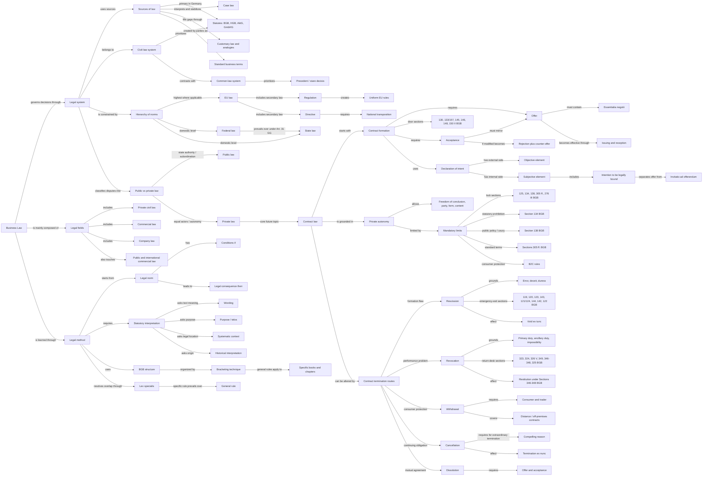
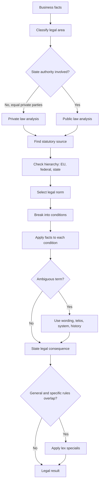
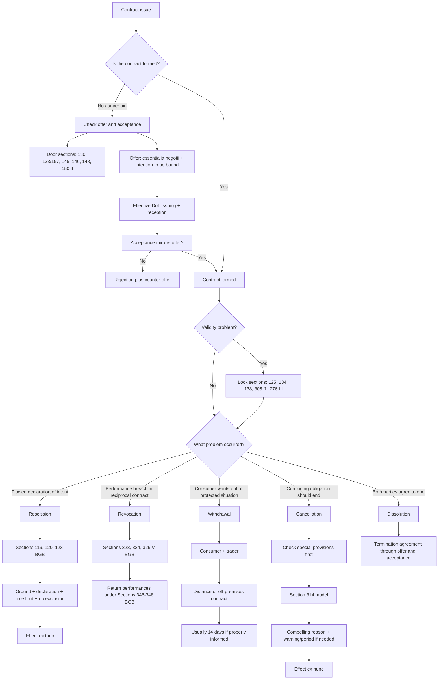

# Business Law Course Knowledge Graph

This file aggregates the Business Law concepts learned so far. It is intentionally graph-view-first for visual recall.

Scope: Business Law only. Do not add cross-lecture concepts unless they are needed to explain Business Law material.

## Course Graph View

## Legal Analysis Flow View

## Contract Law Decision View

## Subject Graph Index

| Subject / Deck | Wiki Note | Main Visual Logic | Last Updated |
|---|---|---|---|
| Week 01-02 Introduction To Business Law | `week-01-02-introduction-to-business-law/week-01-02-introduction-to-business-law.md` | Legal system map: sources, hierarchy, public/private classification, BGB method | 2026-05-14 |
| Week 03 Contract Law I | `week-03-contract-law-i/week-03-contract-law-i.md` | Contract formation and validity sections: door and lock memory map | 2026-05-25 |
| Week 04 Contract Law II | `week-04-contract-law-ii-rescission-revocation/week-04-contract-law-ii-rescission-revocation.md` | Exit routes: emergency exit for rescission and return desk for revocation | 2026-05-25 |
| Week 05 Contract Law III | `week-05-contract-law-iii-withdrawal-cancellation-dissolution/week-05-contract-law-iii-withdrawal-cancellation-dissolution.md` | Termination II: withdrawal, cancellation, dissolution, and full termination decision tree | 2026-05-14 |

## Supporting Node Reference

| Node | Meaning | Source Note |
|---|---|---|
| Business Law | Legal fields relevant for business decisions | `week-01-02-introduction-to-business-law/week-01-02-introduction-to-business-law.md` |
| Law | Binding and enforceable norms | `week-01-02-introduction-to-business-law/week-01-02-introduction-to-business-law.md` |
| Statutory Law | Written legal rules such as BGB, HGB, AktG, GmbHG | `week-01-02-introduction-to-business-law/week-01-02-introduction-to-business-law.md` |
| Case Law | Court decisions interpreting legal rules | `week-01-02-introduction-to-business-law/week-01-02-introduction-to-business-law.md` |
| Civil Law System | Statutes as primary foundation | `week-01-02-introduction-to-business-law/week-01-02-introduction-to-business-law.md` |
| Common Law System | Precedent as stronger formal foundation | `week-01-02-introduction-to-business-law/week-01-02-introduction-to-business-law.md` |
| EU Law | Supranational legal order with primacy where applicable | `week-01-02-introduction-to-business-law/week-01-02-introduction-to-business-law.md` |
| Regulation | Directly applicable EU secondary law | `week-01-02-introduction-to-business-law/week-01-02-introduction-to-business-law.md` |
| Directive | EU secondary law requiring national transposition | `week-01-02-introduction-to-business-law/week-01-02-introduction-to-business-law.md` |
| Public Law | Law involving state authority or subordination | `week-01-02-introduction-to-business-law/week-01-02-introduction-to-business-law.md` |
| Private Law | Law between equal private actors | `week-01-02-introduction-to-business-law/week-01-02-introduction-to-business-law.md` |
| BGB Structure | Five-book structure with general and specific rules | `week-01-02-introduction-to-business-law/week-01-02-introduction-to-business-law.md` |
| Bracketing Technique | General rules apply across more specific books/chapters | `week-01-02-introduction-to-business-law/week-01-02-introduction-to-business-law.md` |
| Lex Specialis | Specific rule prevails over general rule | `week-01-02-introduction-to-business-law/week-01-02-introduction-to-business-law.md` |
| Conditions / Legal Consequence | If-then structure of legal norms | `week-01-02-introduction-to-business-law/week-01-02-introduction-to-business-law.md` |
| Statutory Interpretation | Wording, purpose, system, and history | `week-01-02-introduction-to-business-law/week-01-02-introduction-to-business-law.md` |
| Declaration of Intent | External expression of will aimed at legal consequence | `week-03-contract-law-i/week-03-contract-law-i.md` |
| Offer | DoI enabling contract conclusion by acceptance alone | `week-03-contract-law-i/week-03-contract-law-i.md` |
| Acceptance | Agreement with the offer | `week-03-contract-law-i/week-03-contract-law-i.md` |
| Private Autonomy | Freedom to shape contractual relations | `week-03-contract-law-i/week-03-contract-law-i.md` |
| Door sections | Formation anchors: receipt, interpretation, offer, expiry, deadline, modified acceptance | `week-03-contract-law-i/week-03-contract-law-i.md` |
| Lock sections | Validity anchors: form, prohibition, public policy, standard terms, intentional liability | `week-03-contract-law-i/week-03-contract-law-i.md` |
| Rescission | Right to eradicate a flawed DoI | `week-04-contract-law-ii-rescission-revocation/week-04-contract-law-ii-rescission-revocation.md` |
| Revocation | Right to undo a valid reciprocal contract due to performance problem | `week-04-contract-law-ii-rescission-revocation/week-04-contract-law-ii-rescission-revocation.md` |
| Emergency exit sections | Rescission anchors: mistake, deceit/duress, declaration, timing, exclusion, effects | `week-04-contract-law-ii-rescission-revocation/week-04-contract-law-ii-rescission-revocation.md` |
| Return desk sections | Revocation anchors: breach routes, declaration, restitution, damages | `week-04-contract-law-ii-rescission-revocation/week-04-contract-law-ii-rescission-revocation.md` |
| Withdrawal | Consumer-protection exit right | `week-05-contract-law-iii-withdrawal-cancellation-dissolution/week-05-contract-law-iii-withdrawal-cancellation-dissolution.md` |
| Cancellation | Termination of continuing obligation | `week-05-contract-law-iii-withdrawal-cancellation-dissolution/week-05-contract-law-iii-withdrawal-cancellation-dissolution.md` |
| Dissolution | Consensual termination agreement | `week-05-contract-law-iii-withdrawal-cancellation-dissolution/week-05-contract-law-iii-withdrawal-cancellation-dissolution.md` |

## Supporting Edge Reference

| From | Relationship | To | Source Note |
|---|---|---|---|
| Business Law | is built from | Civil Law / Commercial Law / Company Law | `week-01-02-introduction-to-business-law/week-01-02-introduction-to-business-law.md` |
| Law | differs from | Morality / Rechtsgefühl | `week-01-02-introduction-to-business-law/week-01-02-introduction-to-business-law.md` |
| Civil Law System | prioritizes | Statutory Law | `week-01-02-introduction-to-business-law/week-01-02-introduction-to-business-law.md` |
| Case Law | interprets | Statutory Law | `week-01-02-introduction-to-business-law/week-01-02-introduction-to-business-law.md` |
| EU Law | can override | National Law | `week-01-02-introduction-to-business-law/week-01-02-introduction-to-business-law.md` |
| Federal Law | prevails over | State Law | `week-01-02-introduction-to-business-law/week-01-02-introduction-to-business-law.md` |
| Regulation | creates | Uniform EU Rules | `week-01-02-introduction-to-business-law/week-01-02-introduction-to-business-law.md` |
| Directive | requires | National Transposition | `week-01-02-introduction-to-business-law/week-01-02-introduction-to-business-law.md` |
| Public Law | involves | State Authority | `week-01-02-introduction-to-business-law/week-01-02-introduction-to-business-law.md` |
| Private Law | relies on | Private Autonomy | `week-01-02-introduction-to-business-law/week-01-02-introduction-to-business-law.md` |
| BGB Structure | uses | Bracketing Technique | `week-01-02-introduction-to-business-law/week-01-02-introduction-to-business-law.md` |
| Lex Specialis | resolves conflict between | General Rule and Specific Rule | `week-01-02-introduction-to-business-law/week-01-02-introduction-to-business-law.md` |
| Legal Norm | contains | Conditions / Legal Consequence | `week-01-02-introduction-to-business-law/week-01-02-introduction-to-business-law.md` |
| Statutory Interpretation | clarifies | Ambiguous Legal Terms | `week-01-02-introduction-to-business-law/week-01-02-introduction-to-business-law.md` |
| Contract | requires | Offer and Acceptance | `week-03-contract-law-i/week-03-contract-law-i.md` |
| Offer | must include | Essentialia Negotii | `week-03-contract-law-i/week-03-contract-law-i.md` |
| Acceptance | must mirror | Offer | `week-03-contract-law-i/week-03-contract-law-i.md` |
| Private Autonomy | is limited by | Sections 134 and 138 BGB | `week-03-contract-law-i/week-03-contract-law-i.md` |
| Contract formation | is routed through | Door sections | `week-03-contract-law-i/week-03-contract-law-i.md` |
| Contract validity | is tested by | Lock sections | `week-03-contract-law-i/week-03-contract-law-i.md` |
| Rescission | attacks | Declaration of Intent | `week-04-contract-law-ii-rescission-revocation/week-04-contract-law-ii-rescission-revocation.md` |
| Rescission | is routed through | Emergency exit sections | `week-04-contract-law-ii-rescission-revocation/week-04-contract-law-ii-rescission-revocation.md` |
| Revocation | responds to | Performance Problem | `week-04-contract-law-ii-rescission-revocation/week-04-contract-law-ii-rescission-revocation.md` |
| Revocation | is routed through | Return desk sections | `week-04-contract-law-ii-rescission-revocation/week-04-contract-law-ii-rescission-revocation.md` |
| Withdrawal | protects | Consumer | `week-05-contract-law-iii-withdrawal-cancellation-dissolution/week-05-contract-law-iii-withdrawal-cancellation-dissolution.md` |
| Cancellation | applies to | Continuing Obligation | `week-05-contract-law-iii-withdrawal-cancellation-dissolution/week-05-contract-law-iii-withdrawal-cancellation-dissolution.md` |
| Dissolution | requires | Agreement | `week-05-contract-law-iii-withdrawal-cancellation-dissolution/week-05-contract-law-iii-withdrawal-cancellation-dissolution.md` |
