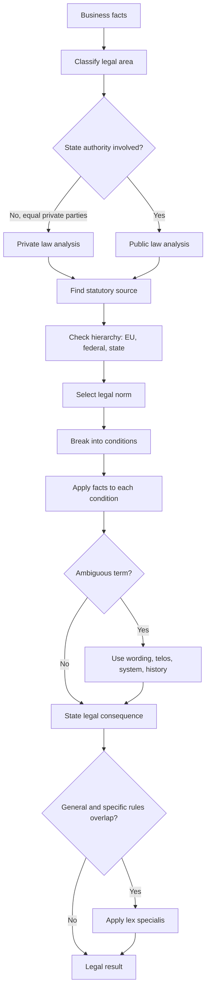
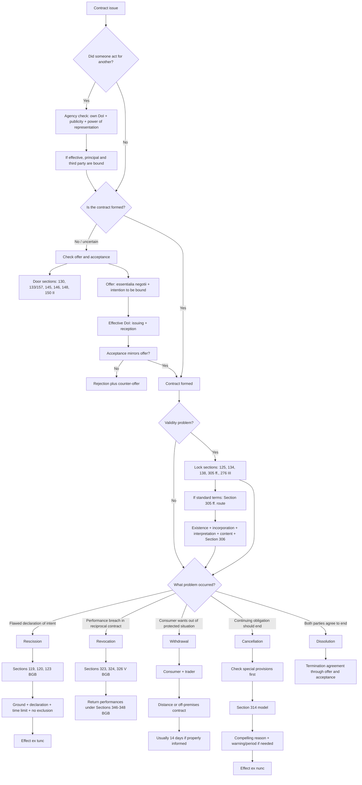
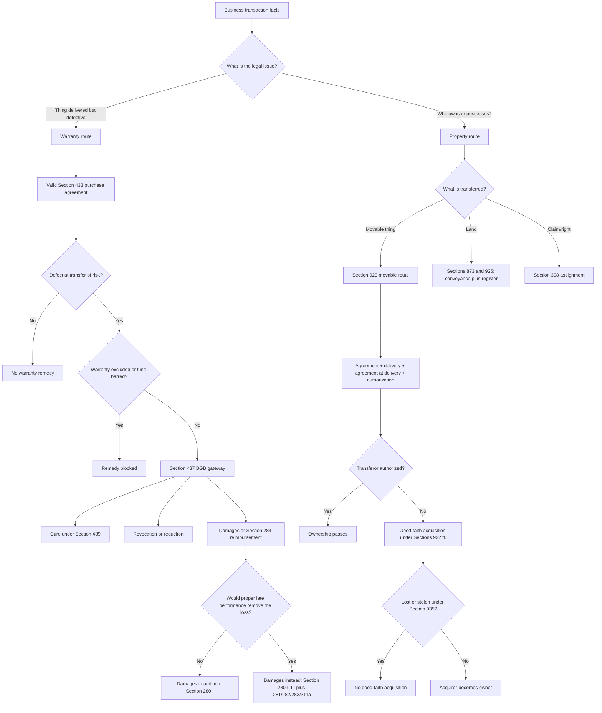
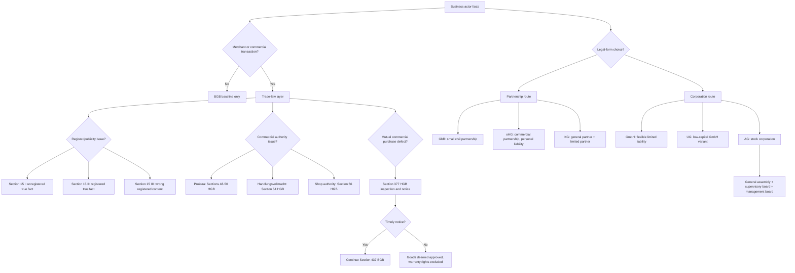

# Business Law Course Knowledge Graph

This file aggregates the Business Law concepts learned so far. It is intentionally graph-view-first for visual recall.

Scope: Business Law only. Do not add cross-lecture concepts unless they are needed to explain Business Law material.

## Course Graph View

```mermaid
graph LR
    BL[Business Law] -->|governs decisions through| LegalSystem[Legal system]
    BL -->|is mainly composed of| Fields[Legal fields]
    BL -->|is learned through| Method[Legal method]

    Fields -->|includes| Civil[Private civil law]
    Fields -->|includes| Commercial[Commercial law]
    Fields -->|includes| Company[Company law]
    Fields -->|also touches| PublicCommercial[Public and international commercial law]

    Commercial -->|uses special private-law layer| TradeLaw[Trade law / HGB layer]
    TradeLaw -->|triggered by| MerchantStatus[Merchant status]
    TradeLaw -->|relies on| CommercialRegister[Commercial register]
    TradeLaw -->|adds| CommercialAgency[Commercial agency powers]
    TradeLaw -->|modifies| CommercialContracts[Commercial contract rules]
    TradeLaw -->|can exclude| TradeWarrantyNotice[Section 377 HGB notice]
    MerchantStatus -->|classified by| HGBMerchantSections[Sections 1, 2, 5, 6 HGB]
    CommercialRegister -->|creates reliance through| Publicity15[Section 15 HGB publicity]
    CommercialAgency -->|includes| Prokura[Prokura]
    CommercialAgency -->|includes| Handlungsvollmacht[Limited commercial authority]
    CommercialAgency -->|includes| ShopAuthority[Section 56 shop authority]
    Prokura -->|scope fixed by| ProkuraScope[Sections 49-50 HGB]
    CommercialContracts -->|exception to BGB silence baseline| CommercialSilence[Commercial silence / confirmation]
    TradeWarrantyNotice -->|cuts off if late| WarrantyRights

    Company -->|answers| LegalFormChoice[Choice of legal form]
    LegalFormChoice -->|splits into| CompanyPartnerships[Partnerships]
    LegalFormChoice -->|splits into| CompanyCorporations[Corporations]
    CompanyPartnerships -->|base form| GbR[GbR]
    CompanyPartnerships -->|commercial general partnership| OHG[oHG]
    CompanyPartnerships -->|limited partnership| KG[KG]
    KG -->|can be structured as| GmbHCoKG[GmbH & Co. KG]
    CompanyCorporations -->|main SME form| GmbH[GmbH]
    CompanyCorporations -->|low-capital variant| UG[UG]
    CompanyCorporations -->|stock corporation| AG[AG]
    GmbH -->|acts through| GmbHDirector[Managing director]
    GmbH -->|controlled by| GmbHMeeting[Shareholder meeting]
    AG -->|uses| DualisticSystem[Dualistic corporate system]
    DualisticSystem -->|owners| GeneralAssembly[General assembly]
    DualisticSystem -->|control| SupervisoryBoard[Supervisory board]
    DualisticSystem -->|management| ManagementBoard[Management board]
    Company -->|monitors| CorporateGovernance[Corporate governance]
    CorporateGovernance -->|responds to| PrincipalAgentProblem

    LegalSystem -->|uses sources| Sources[Sources of law]
    Sources -->|primary in Germany| Statutes[Statutes: BGB, HGB, AktG, GmbHG]
    Sources -->|interprets and stabilizes| CaseLaw[Case law]
    Sources -->|fills gaps through| Custom[Customary law and analogies]
    Sources -->|created by parties as| PrivateRules[Standard business terms]

    LegalSystem -->|belongs to| CivilLawSystem[Civil-law system]
    CivilLawSystem -->|prioritizes| Statutes
    CivilLawSystem -->|contrasts with| CommonLawSystem[Common-law system]
    CommonLawSystem -->|prioritizes| Precedent[Precedent / stare decisis]

    LegalSystem -->|is constrained by| NormHierarchy[Hierarchy of norms]
    NormHierarchy -->|highest where applicable| EULaw[EU law]
    EULaw -->|includes secondary law| Regulation[Regulation]
    EULaw -->|includes secondary law| Directive[Directive]
    Regulation -->|creates| UniformRules[Uniform EU rules]
    Directive -->|requires| NationalTransposition[National transposition]
    NormHierarchy -->|domestic level| FederalLaw[Federal law]
    NormHierarchy -->|domestic level| StateLaw[State law]
    FederalLaw -->|prevails over under Art. 31 GG| StateLaw

    LegalSystem -->|classifies disputes into| PublicPrivate[Public vs private law]
    PublicPrivate -->|state authority / subordination| PublicLaw[Public law]
    PublicPrivate -->|equal actors / autonomy| PrivateLaw[Private law]
    PrivateLaw -->|core future topic| ContractLaw[Contract law]
    ContractLaw -->|starts with| Formation[Contract formation]
    ContractLaw -->|is grounded in| PrivateAutonomy[Private autonomy]
    ContractLaw -->|can be altered by| Termination[Contract termination routes]

    Formation -->|requires| Offer[Offer]
    Formation -->|door sections| FormationSections[130, 133/157, 145, 146, 148, 150 II BGB]
    Formation -->|requires| Acceptance[Acceptance]
    Offer -->|must contain| Essentialia[Essentialia negotii]
    Offer -->|becomes effective through| IssuingReception[Issuing and reception]
    Acceptance -->|must mirror| Offer
    Acceptance -->|if modified becomes| CounterOffer[Rejection plus counter-offer]
    Formation -->|uses| DoI[Declaration of intent]
    DoI -->|has external side| ObjectiveElement[Objective element]
    DoI -->|has internal side| SubjectiveElement[Subjective element]
    SubjectiveElement -->|includes| IntentionBound[Intention to be legally bound]
    IntentionBound -->|separates offer from| Invitatio[Invitatio ad offerendum]

    ContractLaw -->|can be concluded through| Agency[Agency]
    Agency -->|requires under Section 164 I| AgencyRequirements[Own DoI + publicity + power of representation]
    AgencyRequirements -->|if fulfilled| DirectAgencyEffect[Principal and third party bound directly]
    AgencyRequirements -->|if no authority| UnauthorizedAgent[Unauthorized agent]
    UnauthorizedAgent -->|principal may approve| Ratification[Ratification under Section 177 BGB]
    UnauthorizedAgent -->|principal refuses| AgentLiability[Agent liability under Section 179 BGB]
    Agency -->|separates| InternalExternal[Can do vs may do]
    Agency -->|creates management risk| PrincipalAgentProblem[Principal-agent problem]

    ContractLaw -->|continues into performance stage| WarrantyRights[Warranty rights]
    WarrantyRights -->|starts from| PurchaseAgreement[Purchase agreement under Section 433 BGB]
    WarrantyRights -->|requires| DefectAtRisk[Defect at transfer of risk]
    DefectAtRisk -->|can be| MaterialDefect[Material defect under Section 434 BGB]
    DefectAtRisk -->|can be| LegalDefect[Legal defect under Section 435 BGB]
    DefectAtRisk -->|timed by| RiskTransfer[Transfer of risk under Section 446 BGB]
    WarrantyRights -->|may be blocked by| WarrantyExclusions[Warranty exclusions]
    WarrantyExclusions -->|include| BuyerKnowledge[Buyer knowledge]
    WarrantyExclusions -->|include| CommercialNotice[Commercial inspection and notice under Section 377 HGB]
    WarrantyRights -->|uses gateway| WarrantyRemedies[Section 437 remedies]
    WarrantyRemedies -->|first route| Cure[Cure]
    WarrantyRemedies -->|secondary route| WarrantyRevocation[Revocation]
    WarrantyRemedies -->|secondary route| Reduction[Reduction]
    WarrantyRemedies -->|money route| WarrantyDamages[Damages]
    WarrantyDamages -->|classified by| DamageType[Damages in addition vs instead of performance]
    WarrantyDamages -->|requires| Responsibility[Responsibility under Sections 276 and 278 BGB]
    WarrantyRemedies -->|alternative money route| FutileExpenses[Reimbursement of futile expenses]

    PrivateLaw -->|also allocates rights in things through| PropertyLaw[Property law]
    PropertyLaw -->|separates| OwnershipPossession[Ownership vs possession]
    PropertyLaw -->|uses| SeparationAbstraction[Separation and abstraction]
    SeparationAbstraction -->|distinguishes| ObligationDisposition[Obligation contract vs disposition transaction]
    PropertyLaw -->|transfers movables by| MovableTransfer[Movable transfer under Section 929 BGB]
    MovableTransfer -->|requires| TransferAgreement[Agreement]
    MovableTransfer -->|requires| Delivery[Delivery or delivery replacement]
    MovableTransfer -->|requires| Authorization[Authorization]
    MovableTransfer -->|if authorization missing may use| GoodFaithAcquisition[Good-faith acquisition]
    GoodFaithAcquisition -->|blocked by| LostStolenBlock[Section 935 lost/stolen block]
    PropertyLaw -->|transfers land by| ImmovableTransfer[Conveyance plus land-register entry]
    PropertyLaw -->|transfers claims by| ClaimsAssignment[Assignment under Section 398 BGB]

    ExamPractice[Example Exam I practice] -->|integrates| CompanyLawCase[Company representation]
    ExamPractice -->|integrates| TradeLawCase[Prokura and internal limits]
    ExamPractice -->|integrates| FormationRescissionCase[Formation and deceit rescission]
    CompanyLawCase -->|uses| GmbHDirector
    TradeLawCase -->|uses| Prokura
    FormationRescissionCase -->|uses| Formation
    FormationRescissionCase -->|uses| Rescission

    ExamPracticeII[Example Exam II practice] -->|integrates| WarrantyDamageCase[Defective printer damages]
    ExamPracticeII -->|integrates| SBTReferralCase[SBT referral clause]
    ExamPracticeII -->|integrates| TheoryIntegration[Theory routing questions]
    WarrantyDamageCase -->|uses| WarrantyDamages
    WarrantyDamageCase -->|filtered by| TradeWarrantyNotice
    SBTReferralCase -->|uses| SBTExam
    SBTReferralCase -->|invalidated by| SBTContentControl
    TheoryIntegration -->|uses| Formation
    TheoryIntegration -->|compares| Rescission
    TheoryIntegration -->|compares| Revocation

    PrivateAutonomy -->|allows| FreedomContract[Freedom of conclusion, party, form, content]
    PrivateAutonomy -->|limited by| LimitsAutonomy[Mandatory limits]
    LimitsAutonomy -->|lock sections| ValiditySections[125, 134, 138, 305 ff., 276 III BGB]
    LimitsAutonomy -->|statutory prohibition| S134[Section 134 BGB]
    LimitsAutonomy -->|public policy / usury| S138[Section 138 BGB]
    LimitsAutonomy -->|standard terms| S305[Sections 305 ff. BGB]
    LimitsAutonomy -->|consumer protection| B2C[B2C rules]
    S305 -->|case route| SBTExam[SBT examination]
    SBTExam -->|starts with| SBTExistence[Existence under Section 305 I]
    SBTExam -->|then checks| SBTIncorporation[Incorporation and surprise control]
    SBTExam -->|then checks| SBTContentControl[Content control under Sections 307-309]
    SBTContentControl -->|usually leads to| Section306[Section 306 consequence]
    SBTIncorporation -->|battle of forms| ConflictingTerms[Conflicting standard terms]
    Section306 -->|preserves| ContractSurvives[Contract usually survives]

    Termination -->|formation flaw| Rescission[Rescission]
    Termination -->|performance problem| Revocation[Revocation]
    Termination -->|consumer protection| Withdrawal[Withdrawal]
    Termination -->|continuing obligation| Cancellation[Cancellation]
    Termination -->|mutual agreement| Dissolution[Dissolution]

    Rescission -->|grounds| ErrorDeceitDuress[Error, deceit, duress]
    Rescission -->|emergency-exit sections| RescissionSections[119, 120, 123, 143, 121/124, 144, 142, 122 BGB]
    Rescission -->|effect| ExTunc[Void ex tunc]
    Revocation -->|grounds| PerformanceBreach[Primary duty, ancillary duty, impossibility]
    Revocation -->|return-desk sections| RevocationSections[323, 324, 326 V, 349, 346-348, 325 BGB]
    Revocation -->|effect| Restitution346[Restitution under Sections 346-348 BGB]
    Withdrawal -->|requires| ConsumerTrader[Consumer and trader]
    Withdrawal -->|covers| DistanceOffPremises[Distance / off-premises contracts]
    Cancellation -->|requires for extraordinary termination| CompellingReason[Compelling reason]
    Cancellation -->|effect| ExNunc[Termination ex nunc]
    Dissolution -->|requires| Agreement[Offer and acceptance]

    Method -->|starts from| LegalNorm[Legal norm]
    LegalNorm -->|has| Conditions[Conditions if]
    LegalNorm -->|leads to| Consequence[Legal consequence then]
    Method -->|requires| Interpretation[Statutory interpretation]
    Interpretation -->|asks text meaning| Wording[Wording]
    Interpretation -->|asks purpose| Telos[Purpose / telos]
    Interpretation -->|asks legal location| SystemContext[Systematic context]
    Interpretation -->|asks origin| History[Historical interpretation]
    Method -->|uses| BGBStructure[BGB structure]
    BGBStructure -->|organized by| Bracketing[Bracketing technique]
    Bracketing -->|general rules apply to| SpecificRules[Specific books and chapters]
    Method -->|resolves overlap through| LexSpecialis[Lex specialis]
    LexSpecialis -->|specific rule prevails over| GeneralRule[General rule]
```

## Legal Analysis Flow View

## Contract Law Decision View

## Warranty And Property Decision View

## Trade And Company Law Decision View

## Subject Graph Index

| Subject / Deck | Wiki Note | Main Visual Logic | Last Updated |
|---|---|---|---|
| Week 01-02 Introduction To Business Law | `week-01-02-introduction-to-business-law/week-01-02-introduction-to-business-law.md` | Legal system map: sources, hierarchy, public/private classification, BGB method | 2026-07-09 |
| Week 03 Contract Law I | `week-03-contract-law-i/week-03-contract-law-i.md` | Contract formation and validity sections: door and lock memory map | 2026-07-09 |
| Week 04 Contract Law II | `week-04-contract-law-ii-rescission-revocation/week-04-contract-law-ii-rescission-revocation.md` | Exit routes: emergency exit for rescission and return desk for revocation | 2026-07-09 |
| Week 05 Contract Law III | `week-05-contract-law-iii-withdrawal-cancellation-dissolution/week-05-contract-law-iii-withdrawal-cancellation-dissolution.md` | Termination II: withdrawal, cancellation, dissolution, and full termination decision tree | 2026-07-09 |
| Week 06 Standard Business Terms | `week-06-standard-business-terms/week-06-standard-business-terms.md` | SBT case route: existence, incorporation, interpretation, content control, and Section 306 consequences | 2026-07-09 |
| Week 07 Agency | `week-07-agency/week-07-agency.md` | Agency triangle: principal, agent, third party, authority, ratification, liability, and principal-agent problem | 2026-07-09 |
| Week 08 Warranty Rights I | `week-08-warranty-rights-i/week-08-warranty-rights-i.md` | Defective purchase route: defect at transfer of risk, exclusions, cure, revocation, reduction, damages gateway | 2026-07-09 |
| Week 09 Warranty Rights II | `week-09-warranty-rights-ii/week-09-warranty-rights-ii.md` | Damages router: damages in addition versus instead of performance, Section 280 routes, Section 284, work contracts | 2026-07-09 |
| Week 10 Transfer Of Property | `week-10-transfer-of-property/week-10-transfer-of-property.md` | Property transfer router: ownership versus possession, separation/abstraction, movable transfer, good-faith acquisition, land, claims | 2026-06-28 |
| Week 11 Trade Law | `week-11-trade-law/week-11-trade-law.md` | HGB layer router: merchant status, commercial register publicity, Prokura/Handlungsvollmacht, commercial silence, Section 377 notice | 2026-07-09 |
| Week 12-13 Company Law I And II | `week-12-13-company-law-i-ii/week-12-13-company-law-i-ii.md` | Legal-form router: partnerships, corporations, GmbH, UG, AG, corporate governance | 2026-07-08 |
| Example Exam I Case Facts | `example-exam-i-case-facts/example-exam-i-case-facts.md` | Exam integration router: GmbH representation, Prokura internal limits, formation, deceit rescission, theory checks | 2026-07-08 |
| Example Exam II Case Facts | `example-exam-ii-case-facts/example-exam-ii-case-facts.md` | Exam integration router: warranty damages, Section 377 HGB, SBT referral clause, amended acceptance, rescission versus revocation | 2026-07-09 |

## Supporting Node Reference

| Node | Meaning | Source Note |
|---|---|---|
| Business Law | Legal fields relevant for business decisions | `week-01-02-introduction-to-business-law/week-01-02-introduction-to-business-law.md` |
| Law | Binding and enforceable norms | `week-01-02-introduction-to-business-law/week-01-02-introduction-to-business-law.md` |
| Statutory Law | Written legal rules such as BGB, HGB, AktG, GmbHG | `week-01-02-introduction-to-business-law/week-01-02-introduction-to-business-law.md` |
| Case Law | Court decisions interpreting legal rules | `week-01-02-introduction-to-business-law/week-01-02-introduction-to-business-law.md` |
| Civil Law System | Statutes as primary foundation | `week-01-02-introduction-to-business-law/week-01-02-introduction-to-business-law.md` |
| Common Law System | Precedent as stronger formal foundation | `week-01-02-introduction-to-business-law/week-01-02-introduction-to-business-law.md` |
| EU Law | Supranational legal order with primacy where applicable | `week-01-02-introduction-to-business-law/week-01-02-introduction-to-business-law.md` |
| Regulation | Directly applicable EU secondary law | `week-01-02-introduction-to-business-law/week-01-02-introduction-to-business-law.md` |
| Directive | EU secondary law requiring national transposition | `week-01-02-introduction-to-business-law/week-01-02-introduction-to-business-law.md` |
| Public Law | Law involving state authority or subordination | `week-01-02-introduction-to-business-law/week-01-02-introduction-to-business-law.md` |
| Private Law | Law between equal private actors | `week-01-02-introduction-to-business-law/week-01-02-introduction-to-business-law.md` |
| BGB Structure | Five-book structure with general and specific rules | `week-01-02-introduction-to-business-law/week-01-02-introduction-to-business-law.md` |
| Bracketing Technique | General rules apply across more specific books/chapters | `week-01-02-introduction-to-business-law/week-01-02-introduction-to-business-law.md` |
| Lex Specialis | Specific rule prevails over general rule | `week-01-02-introduction-to-business-law/week-01-02-introduction-to-business-law.md` |
| Conditions / Legal Consequence | If-then structure of legal norms | `week-01-02-introduction-to-business-law/week-01-02-introduction-to-business-law.md` |
| Statutory Interpretation | Wording, purpose, system, and history | `week-01-02-introduction-to-business-law/week-01-02-introduction-to-business-law.md` |
| Declaration of Intent | External expression of will aimed at legal consequence | `week-03-contract-law-i/week-03-contract-law-i.md` |
| Offer | DoI enabling contract conclusion by acceptance alone | `week-03-contract-law-i/week-03-contract-law-i.md` |
| Acceptance | Agreement with the offer | `week-03-contract-law-i/week-03-contract-law-i.md` |
| Private Autonomy | Freedom to shape contractual relations | `week-03-contract-law-i/week-03-contract-law-i.md` |
| Door sections | Formation anchors: receipt, interpretation, offer, expiry, deadline, modified acceptance | `week-03-contract-law-i/week-03-contract-law-i.md` |
| Lock sections | Validity anchors: form, prohibition, public policy, standard terms, intentional liability | `week-03-contract-law-i/week-03-contract-law-i.md` |
| Rescission | Right to eradicate a flawed DoI | `week-04-contract-law-ii-rescission-revocation/week-04-contract-law-ii-rescission-revocation.md` |
| Revocation | Right to undo a valid reciprocal contract due to performance problem | `week-04-contract-law-ii-rescission-revocation/week-04-contract-law-ii-rescission-revocation.md` |
| Emergency exit sections | Rescission anchors: mistake, deceit/duress, declaration, timing, exclusion, effects | `week-04-contract-law-ii-rescission-revocation/week-04-contract-law-ii-rescission-revocation.md` |
| Return desk sections | Revocation anchors: breach routes, declaration, restitution, damages | `week-04-contract-law-ii-rescission-revocation/week-04-contract-law-ii-rescission-revocation.md` |
| Withdrawal | Consumer-protection exit right | `week-05-contract-law-iii-withdrawal-cancellation-dissolution/week-05-contract-law-iii-withdrawal-cancellation-dissolution.md` |
| Cancellation | Termination of continuing obligation | `week-05-contract-law-iii-withdrawal-cancellation-dissolution/week-05-contract-law-iii-withdrawal-cancellation-dissolution.md` |
| Dissolution | Consensual termination agreement | `week-05-contract-law-iii-withdrawal-cancellation-dissolution/week-05-contract-law-iii-withdrawal-cancellation-dissolution.md` |
| Standard Business Terms | Pre-formulated contract terms presented by one party for repeated use | `week-06-standard-business-terms/week-06-standard-business-terms.md` |
| User of SBT | Party introducing the pre-formulated clause | `week-06-standard-business-terms/week-06-standard-business-terms.md` |
| Individual Agreement | Truly negotiated clause outside SBT status | `week-06-standard-business-terms/week-06-standard-business-terms.md` |
| Incorporation Control | Whether SBT became part of the contract | `week-06-standard-business-terms/week-06-standard-business-terms.md` |
| Surprising Clause | Unexpected SBT clause that is not incorporated | `week-06-standard-business-terms/week-06-standard-business-terms.md` |
| Contra Proferentem | Ambiguity interpreted against the SBT user | `week-06-standard-business-terms/week-06-standard-business-terms.md` |
| Content Control | Validity review under Sections 307-309 BGB | `week-06-standard-business-terms/week-06-standard-business-terms.md` |
| Section 306 Consequence | Failed clause drops out; contract usually survives and statutory law fills the gap | `week-06-standard-business-terms/week-06-standard-business-terms.md` |
| Principal | Person for whom an agent's declaration should create legal effect | `week-07-agency/week-07-agency.md` |
| Agent | Person making an own declaration in the principal's name within power of representation | `week-07-agency/week-07-agency.md` |
| Third Party | Outside contract partner dealing with the agent | `week-07-agency/week-07-agency.md` |
| Power of Representation | External authority to bind the principal | `week-07-agency/week-07-agency.md` |
| Internal Relationship | Principal-agent relationship defining what the agent may do | `week-07-agency/week-07-agency.md` |
| Unauthorized Agent | Person acting as agent without power of representation | `week-07-agency/week-07-agency.md` |
| Ratification | Principal's later approval of an unauthorized transaction | `week-07-agency/week-07-agency.md` |
| Principal-Agent Problem | Information asymmetry and self-interest risk between principal and agent | `week-07-agency/week-07-agency.md` |
| Warranty Rights | Buyer remedies for defective purchase performance after defect at transfer of risk | `week-08-warranty-rights-i/week-08-warranty-rights-i.md` |
| Material Defect | Deviation between actual and required condition of the thing | `week-08-warranty-rights-i/week-08-warranty-rights-i.md` |
| Legal Defect | Third party right burdening the purchased thing | `week-08-warranty-rights-i/week-08-warranty-rights-i.md` |
| Transfer of Risk | Timing point for asking whether warranty law applies, usually delivery under Section 446 BGB | `week-08-warranty-rights-i/week-08-warranty-rights-i.md` |
| Cure | Primary buyer remedy: repair or replacement under Section 439 BGB | `week-08-warranty-rights-i/week-08-warranty-rights-i.md` |
| Reduction | Price adjustment for keeping defective goods under Section 441 BGB | `week-08-warranty-rights-i/week-08-warranty-rights-i.md` |
| Damages In Addition To Performance | Loss that remains even if proper performance is later rendered | `week-09-warranty-rights-ii/week-09-warranty-rights-ii.md` |
| Damages Instead Of Performance | Loss replacing the missing/defective performance | `week-09-warranty-rights-ii/week-09-warranty-rights-ii.md` |
| Responsibility | Intent, negligence, guarantee, or attributed helper fault required for damages | `week-09-warranty-rights-ii/week-09-warranty-rights-ii.md` |
| Futile Expenses | Reliance expenses reimbursed under Section 284 BGB instead of damages in lieu | `week-09-warranty-rights-ii/week-09-warranty-rights-ii.md` |
| Work Warranty Rights | Defective-work remedies under Section 634 BGB | `week-09-warranty-rights-ii/week-09-warranty-rights-ii.md` |
| Ownership | Legal right to use, dispose of, and exclude others from a thing | `week-10-transfer-of-property/week-10-transfer-of-property.md` |
| Possession | Actual control over a thing, independent of ownership | `week-10-transfer-of-property/week-10-transfer-of-property.md` |
| Separation Principle | Obligation contract and disposition transaction are distinct | `week-10-transfer-of-property/week-10-transfer-of-property.md` |
| Abstraction Principle | Validity of obligation and disposition transactions is assessed independently | `week-10-transfer-of-property/week-10-transfer-of-property.md` |
| Movable Transfer | Transfer of movable ownership by agreement, delivery, continuing agreement, and authorization | `week-10-transfer-of-property/week-10-transfer-of-property.md` |
| Good-Faith Acquisition | Ownership acquisition from non-owner when possession creates legal appearance and Section 935 does not block | `week-10-transfer-of-property/week-10-transfer-of-property.md` |
| Assignment | Transfer of a claim under Section 398 BGB | `week-10-transfer-of-property/week-10-transfer-of-property.md` |
| Trade Law | HGB special private-law layer for merchants | `week-11-trade-law/week-11-trade-law.md` |
| Merchant Status | Gateway for applying HGB rules | `week-11-trade-law/week-11-trade-law.md` |
| Commercial Register | Public register for commerce-relevant facts | `week-11-trade-law/week-11-trade-law.md` |
| Section 15 HGB Publicity | Good-faith reliance rules around registered, unregistered, or wrongly registered facts | `week-11-trade-law/week-11-trade-law.md` |
| Prokura | Broad legally regulated commercial power of representation | `week-11-trade-law/week-11-trade-law.md` |
| Limited Commercial Authority | Handlungsvollmacht; non-Prokura commercial authority for usual business transactions | `week-11-trade-law/week-11-trade-law.md` |
| Shop Assistant Authority | Section 56 HGB appearance-based authority for customary public-store transactions | `week-11-trade-law/week-11-trade-law.md` |
| Commercial Silence | HGB exception where silence can accept or confirm contract content | `week-11-trade-law/week-11-trade-law.md` |
| Section 377 HGB Notice | Mutual-commercial-purchase inspection and notification duty | `week-11-trade-law/week-11-trade-law.md` |
| Choice Of Legal Form | Decision matching liability, capital, governance, tax, financing, disclosure, and reputation | `week-12-13-company-law-i-ii/week-12-13-company-law-i-ii.md` |
| Partnership | Person-centered business association such as GbR, oHG, or KG | `week-12-13-company-law-i-ii/week-12-13-company-law-i-ii.md` |
| Corporation | Entity-centered legal form such as GmbH, UG, or AG | `week-12-13-company-law-i-ii/week-12-13-company-law-i-ii.md` |
| GbR | Basic civil-law partnership for small joint endeavors | `week-12-13-company-law-i-ii/week-12-13-company-law-i-ii.md` |
| oHG | Commercial general partnership with personal partner liability | `week-12-13-company-law-i-ii/week-12-13-company-law-i-ii.md` |
| KG | Limited partnership with general partner and limited partner | `week-12-13-company-law-i-ii/week-12-13-company-law-i-ii.md` |
| GmbH | Limited liability company and main SME corporation form | `week-12-13-company-law-i-ii/week-12-13-company-law-i-ii.md` |
| UG | Low-capital entrepreneurial company, a mini-GmbH variant | `week-12-13-company-law-i-ii/week-12-13-company-law-i-ii.md` |
| AG | Stock corporation with dualistic governance | `week-12-13-company-law-i-ii/week-12-13-company-law-i-ii.md` |
| Corporate Governance | Management and supervision system responding to principal-agent risks | `week-12-13-company-law-i-ii/week-12-13-company-law-i-ii.md` |
| Example Exam I | Integrated practice source for representation, Prokura, rescission, and theory routing | `example-exam-i-case-facts/example-exam-i-case-facts.md` |
| Example Exam II | Integrated practice source for warranty damages, SBT, Section 377 HGB, and theory routing | `example-exam-ii-case-facts/example-exam-ii-case-facts.md` |
| Defective printer damages | Example Exam II case route for damage to table, laptop, and carpet | `example-exam-ii-case-facts/example-exam-ii-case-facts.md` |
| SBT referral clause | Example Exam II clause routing defect claims to a third-party software manufacturer | `example-exam-ii-case-facts/example-exam-ii-case-facts.md` |

## Supporting Edge Reference

| From | Relationship | To | Source Note |
|---|---|---|---|
| Business Law | is built from | Civil Law / Commercial Law / Company Law | `week-01-02-introduction-to-business-law/week-01-02-introduction-to-business-law.md` |
| Law | differs from | Morality / Rechtsgefühl | `week-01-02-introduction-to-business-law/week-01-02-introduction-to-business-law.md` |
| Civil Law System | prioritizes | Statutory Law | `week-01-02-introduction-to-business-law/week-01-02-introduction-to-business-law.md` |
| Case Law | interprets | Statutory Law | `week-01-02-introduction-to-business-law/week-01-02-introduction-to-business-law.md` |
| EU Law | can override | National Law | `week-01-02-introduction-to-business-law/week-01-02-introduction-to-business-law.md` |
| Federal Law | prevails over | State Law | `week-01-02-introduction-to-business-law/week-01-02-introduction-to-business-law.md` |
| Regulation | creates | Uniform EU Rules | `week-01-02-introduction-to-business-law/week-01-02-introduction-to-business-law.md` |
| Directive | requires | National Transposition | `week-01-02-introduction-to-business-law/week-01-02-introduction-to-business-law.md` |
| Public Law | involves | State Authority | `week-01-02-introduction-to-business-law/week-01-02-introduction-to-business-law.md` |
| Private Law | relies on | Private Autonomy | `week-01-02-introduction-to-business-law/week-01-02-introduction-to-business-law.md` |
| BGB Structure | uses | Bracketing Technique | `week-01-02-introduction-to-business-law/week-01-02-introduction-to-business-law.md` |
| Lex Specialis | resolves conflict between | General Rule and Specific Rule | `week-01-02-introduction-to-business-law/week-01-02-introduction-to-business-law.md` |
| Legal Norm | contains | Conditions / Legal Consequence | `week-01-02-introduction-to-business-law/week-01-02-introduction-to-business-law.md` |
| Statutory Interpretation | clarifies | Ambiguous Legal Terms | `week-01-02-introduction-to-business-law/week-01-02-introduction-to-business-law.md` |
| Contract | requires | Offer and Acceptance | `week-03-contract-law-i/week-03-contract-law-i.md` |
| Offer | must include | Essentialia Negotii | `week-03-contract-law-i/week-03-contract-law-i.md` |
| Acceptance | must mirror | Offer | `week-03-contract-law-i/week-03-contract-law-i.md` |
| Private Autonomy | is limited by | Sections 134 and 138 BGB | `week-03-contract-law-i/week-03-contract-law-i.md` |
| Contract formation | is routed through | Door sections | `week-03-contract-law-i/week-03-contract-law-i.md` |
| Contract validity | is tested by | Lock sections | `week-03-contract-law-i/week-03-contract-law-i.md` |
| Rescission | attacks | Declaration of Intent | `week-04-contract-law-ii-rescission-revocation/week-04-contract-law-ii-rescission-revocation.md` |
| Rescission | is routed through | Emergency exit sections | `week-04-contract-law-ii-rescission-revocation/week-04-contract-law-ii-rescission-revocation.md` |
| Revocation | responds to | Performance Problem | `week-04-contract-law-ii-rescission-revocation/week-04-contract-law-ii-rescission-revocation.md` |
| Revocation | is routed through | Return desk sections | `week-04-contract-law-ii-rescission-revocation/week-04-contract-law-ii-rescission-revocation.md` |
| Withdrawal | protects | Consumer | `week-05-contract-law-iii-withdrawal-cancellation-dissolution/week-05-contract-law-iii-withdrawal-cancellation-dissolution.md` |
| Cancellation | applies to | Continuing Obligation | `week-05-contract-law-iii-withdrawal-cancellation-dissolution/week-05-contract-law-iii-withdrawal-cancellation-dissolution.md` |
| Dissolution | requires | Agreement | `week-05-contract-law-iii-withdrawal-cancellation-dissolution/week-05-contract-law-iii-withdrawal-cancellation-dissolution.md` |
| Standard Business Terms | are introduced by | User of SBT | `week-06-standard-business-terms/week-06-standard-business-terms.md` |
| Standard Business Terms | require first | Contract formation | `week-06-standard-business-terms/week-06-standard-business-terms.md` |
| Individual Agreement | defeats | Standard Business Terms | `week-06-standard-business-terms/week-06-standard-business-terms.md` |
| Incorporation Control | filters | Surprising Clause | `week-06-standard-business-terms/week-06-standard-business-terms.md` |
| Contra Proferentem | allocates ambiguity risk to | User of SBT | `week-06-standard-business-terms/week-06-standard-business-terms.md` |
| Content Control | tests | Standard Business Terms | `week-06-standard-business-terms/week-06-standard-business-terms.md` |
| Invalid SBT clause | triggers | Section 306 Consequence | `week-06-standard-business-terms/week-06-standard-business-terms.md` |
| Agent | acts on behalf of | Principal | `week-07-agency/week-07-agency.md` |
| Agent | declares to | Third Party | `week-07-agency/week-07-agency.md` |
| Effective agency | binds directly | Principal and Third Party | `week-07-agency/week-07-agency.md` |
| Power of Representation | defines external | Can do | `week-07-agency/week-07-agency.md` |
| Internal Relationship | defines internal | May do | `week-07-agency/week-07-agency.md` |
| Unauthorized Agent | creates | Ratification question | `week-07-agency/week-07-agency.md` |
| Refused ratification | can trigger | Agent liability | `week-07-agency/week-07-agency.md` |
| Information asymmetry | creates | Principal-Agent Problem | `week-07-agency/week-07-agency.md` |
| Purchase Agreement | creates duty to deliver | Defect-free thing | `week-08-warranty-rights-i/week-08-warranty-rights-i.md` |
| Defect at Transfer of Risk | triggers | Warranty Rights | `week-08-warranty-rights-i/week-08-warranty-rights-i.md` |
| Material Defect | is tested under | Section 434 BGB | `week-08-warranty-rights-i/week-08-warranty-rights-i.md` |
| Legal Defect | is tested under | Section 435 BGB | `week-08-warranty-rights-i/week-08-warranty-rights-i.md` |
| Warranty Rights | are routed through | Section 437 BGB | `week-08-warranty-rights-i/week-08-warranty-rights-i.md` |
| Cure | usually precedes | Revocation / reduction / damages | `week-08-warranty-rights-i/week-08-warranty-rights-i.md` |
| Buyer Knowledge | can exclude | Warranty Rights | `week-08-warranty-rights-i/week-08-warranty-rights-i.md` |
| Merchant's Late Notice | can deem | Goods approved | `week-08-warranty-rights-i/week-08-warranty-rights-i.md` |
| Damages Type | determines | Section 280 route | `week-09-warranty-rights-ii/week-09-warranty-rights-ii.md` |
| Damages In Addition To Performance | usually use | Section 280 I BGB | `week-09-warranty-rights-ii/week-09-warranty-rights-ii.md` |
| Damages Instead Of Performance | require | Section 280 III plus 281/282/283/311a BGB | `week-09-warranty-rights-ii/week-09-warranty-rights-ii.md` |
| Responsibility | is presumed by | Section 280 I 2 BGB | `week-09-warranty-rights-ii/week-09-warranty-rights-ii.md` |
| Futile Expenses | are claimed instead of | Damages in lieu | `week-09-warranty-rights-ii/week-09-warranty-rights-ii.md` |
| Work Warranty Rights | add | Self-help under Section 637 BGB | `week-09-warranty-rights-ii/week-09-warranty-rights-ii.md` |
| Ownership | differs from | Possession | `week-10-transfer-of-property/week-10-transfer-of-property.md` |
| Purchase Agreement | does not itself transfer | Ownership | `week-10-transfer-of-property/week-10-transfer-of-property.md` |
| Separation Principle | distinguishes | Obligation contract and disposition transaction | `week-10-transfer-of-property/week-10-transfer-of-property.md` |
| Abstraction Principle | separates validity of | Purchase agreement and ownership transfer | `week-10-transfer-of-property/week-10-transfer-of-property.md` |
| Movable Transfer | requires | Agreement, delivery, agreement at delivery, authorization | `week-10-transfer-of-property/week-10-transfer-of-property.md` |
| Missing Authorization | can be cured by | Good-faith acquisition | `week-10-transfer-of-property/week-10-transfer-of-property.md` |
| Section 935 BGB | blocks | Good-faith acquisition of lost/stolen things | `week-10-transfer-of-property/week-10-transfer-of-property.md` |
| Land Ownership | requires | Conveyance and land-register entry | `week-10-transfer-of-property/week-10-transfer-of-property.md` |
| Claims | are transferred by | Assignment | `week-10-transfer-of-property/week-10-transfer-of-property.md` |
| Trade Law | modifies | BGB baseline for merchants | `week-11-trade-law/week-11-trade-law.md` |
| Merchant Status | triggers | HGB special layer | `week-11-trade-law/week-11-trade-law.md` |
| Commercial Register | creates | Section 15 HGB publicity effects | `week-11-trade-law/week-11-trade-law.md` |
| Section 15 I HGB | protects reliance on | Register silence | `week-11-trade-law/week-11-trade-law.md` |
| Section 15 II HGB | allows assertion of | Registered and published true facts | `week-11-trade-law/week-11-trade-law.md` |
| Section 15 III HGB | protects reliance on | Wrong positive register content | `week-11-trade-law/week-11-trade-law.md` |
| Prokura | gives | Broad external authority | `week-11-trade-law/week-11-trade-law.md` |
| Internal Prokura Limit | usually does not defeat | Third-party reliance | `week-11-trade-law/week-11-trade-law.md` |
| Limited Commercial Authority | is narrower than | Prokura | `week-11-trade-law/week-11-trade-law.md` |
| Commercial Silence | creates exceptions to | BGB silence baseline | `week-11-trade-law/week-11-trade-law.md` |
| Section 377 HGB Notice | can exclude | Warranty rights | `week-11-trade-law/week-11-trade-law.md` |
| Choice Of Legal Form | depends on | Liability, governance, capital, tax, disclosure, reputation | `week-12-13-company-law-i-ii/week-12-13-company-law-i-ii.md` |
| Partnership | includes | GbR, oHG, KG | `week-12-13-company-law-i-ii/week-12-13-company-law-i-ii.md` |
| Corporation | includes | GmbH, UG, AG | `week-12-13-company-law-i-ii/week-12-13-company-law-i-ii.md` |
| KG | separates | General partner and limited partner | `week-12-13-company-law-i-ii/week-12-13-company-law-i-ii.md` |
| GmbH & Co. KG | uses | GmbH as general partner | `week-12-13-company-law-i-ii/week-12-13-company-law-i-ii.md` |
| GmbH | acts through | Managing director | `week-12-13-company-law-i-ii/week-12-13-company-law-i-ii.md` |
| GmbH | is controlled internally by | Shareholder meeting | `week-12-13-company-law-i-ii/week-12-13-company-law-i-ii.md` |
| AG | uses | Dualistic system | `week-12-13-company-law-i-ii/week-12-13-company-law-i-ii.md` |
| Supervisory Board | appoints and supervises | Management board | `week-12-13-company-law-i-ii/week-12-13-company-law-i-ii.md` |
| Corporate Governance | responds to | Principal-agent problem | `week-12-13-company-law-i-ii/week-12-13-company-law-i-ii.md` |
| Example Exam I | integrates | GmbH representation and Prokura | `example-exam-i-case-facts/example-exam-i-case-facts.md` |
| Example Exam I | integrates | Contract formation and deceit rescission | `example-exam-i-case-facts/example-exam-i-case-facts.md` |
| Example Exam I | tests | Legal-form suitability and Section 280 damages | `example-exam-i-case-facts/example-exam-i-case-facts.md` |
| Example Exam II | integrates | Warranty damages and Section 377 HGB notice | `example-exam-ii-case-facts/example-exam-ii-case-facts.md` |
| Example Exam II | integrates | SBT content control and Section 309 No. 8 b aa BGB | `example-exam-ii-case-facts/example-exam-ii-case-facts.md` |
| Example Exam II | tests | Works contract, culpa in contrahendo, Section 150 II, Section 145, rescission versus revocation | `example-exam-ii-case-facts/example-exam-ii-case-facts.md` |
