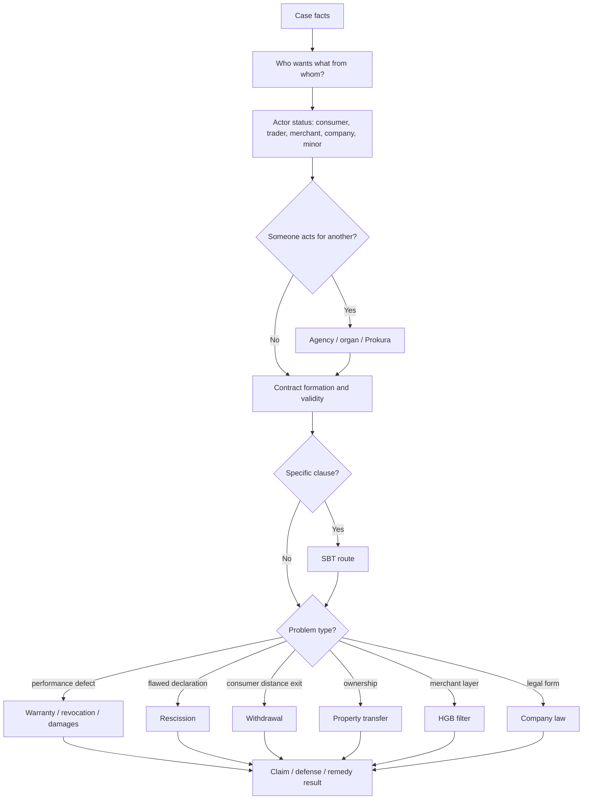
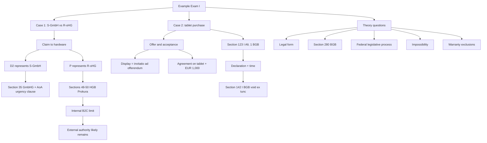
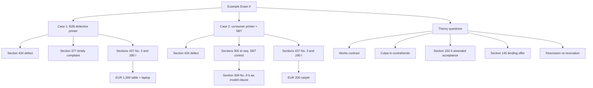
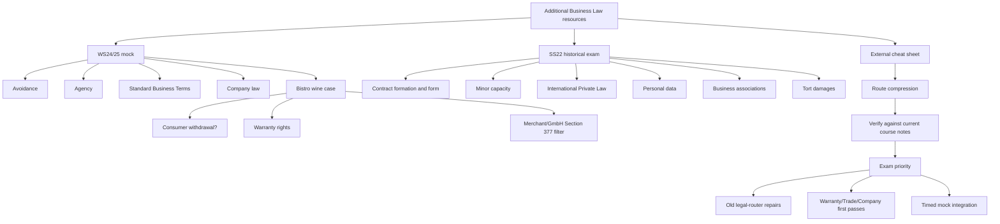

# Business Law Exam Navigation Pack

Generated: 2026-07-24

Scope: Compact exam desk pack: fast routers, weekly cheat sheets, and case maps only.

Excluded by design:

- all `CONTEXT.md` files
- active-recall session logs
- clarification-session logs
- raw Moodle/source files

## Page-Referenced Index

Use these page numbers against the final PDF printout. If a print shop inserts a cover sheet, use the PDF page number shown by the viewer rather than the shop's sheet count.

| Code | Page | Section | Title |
|---|---:|---|---|
| R1 | 007 | Fast Routing | Business Law Exam Strategy And Answer Schemas |
| R2 | 021 | Fast Routing | Section Cluster Table By Case Flow |
| R3 | 034 | Fast Routing | Numbers And Deadlines Cheat Sheet |
| R4 | 039 | Fast Routing | Confusable Terms Trap Sheet |
| R5 | 044 | Fast Routing | Theory Glossary And Blank Answer Template |
| R6 | 049 | Fast Routing | Minor Capacity, Tort, And Unjust Enrichment Router |
| W01-02.2 | 053 | Weekly Doctrine | Week 01-02 Introduction To Business Law Cheatsheet And Tricks |
| W03.2 | 056 | Weekly Doctrine | Week 03 Contract Law I Cheatsheet And Tricks |
| W04.2 | 059 | Weekly Doctrine | Week 04 Contract Law II Rescission Revocation Cheatsheet And Tricks |
| W05.3 | 062 | Weekly Doctrine | Week 05 Contract Law III Withdrawal Cancellation Dissolution Cheatsheet And Tricks |
| W06.2 | 065 | Weekly Doctrine | Week 06 Standard Business Terms Cheatsheet And Tricks |
| W07.2 | 068 | Weekly Doctrine | Week 07 Agency Cheatsheet And Tricks |
| W08.2 | 072 | Weekly Doctrine | Week 08 Warranty Rights I Cheatsheet And Tricks |
| W09.2 | 075 | Weekly Doctrine | Week 09 Warranty Rights II Cheatsheet And Tricks |
| W10.2 | 078 | Weekly Doctrine | Week 10 Transfer Of Property Cheatsheet And Tricks |
| W11.2 | 081 | Weekly Doctrine | Week 11 Trade Law Cheatsheet And Tricks |
| W12-13.2 | 084 | Weekly Doctrine | Week 12-13 Company Law I And II Cheatsheet And Tricks |
| C1 | 088 | Case Practice | Example Exam I: Case Facts And Answer Routes |
| C2 | 101 | Case Practice | Example Exam II: Case Facts And Answer Routes |
| C3 | 110 | Case Practice | Additional Mock Exams And External Cheat Sheet |

## Fact-Signal Page Router

Start with the fact signal, then jump to the listed page before opening the full weekly note.

| Fact Signal | Start Here | Also Check |
|---|---|---|
| Advertisement, webshop listing, phone order, counteroffer | R2 p. 021; W03.2 p. 056 | W06.2 p. 065; W08.2 p. 072; W11.2 p. 081 |
| Manager, employee, salesperson, managing director acts | R2 p. 021; W07.2 p. 068 | W11.2 p. 081; W12-13.2 p. 084 |
| Pre-formulated clause or exclusion clause | R2 p. 021; W06.2 p. 065 | W08.2 p. 072; W09.2 p. 075; W05.3 p. 062 |
| Mistake, deceit, threat, wrong declaration | R2 p. 021; W04.2 p. 059 | W03.2 p. 056; W08.2 p. 072 |
| Online or off-premises consumer transaction | R2 p. 021; W05.3 p. 062 | W01-02.2 p. 053; W03.2 p. 056; W06.2 p. 065 |
| Late, missing, impossible, or bad performance | R2 p. 021; W05.3 p. 062 | W03.2 p. 056; W04.2 p. 059 |
| Defective sold good after handover | R2 p. 021; W08.2 p. 072; W09.2 p. 075 | W11.2 p. 081; W06.2 p. 065 |
| Who owns it, double sale, stolen/lost goods, assignment | R2 p. 021; W10.2 p. 078 | W03.2 p. 056; W08.2 p. 072 |
| Merchant, commercial register, Prokura, Section 377 | R2 p. 021; W11.2 p. 081 | W07.2 p. 068; W08.2 p. 072 |
| GmbH, AG, shareholder, director, board decision | R2 p. 021; W12-13.2 p. 084 | W07.2 p. 068; W11.2 p. 081 |
| Theory question asks define, distinguish, or list | R5 p. 044; R3 p. 034; R4 p. 039 | W01-02.2 p. 053; W03.2 p. 056; W06.2 p. 065; W12-13.2 p. 084 |
| Example-exam style mixed case | C1 p. 088; C2 p. 101; C3 p. 110 | R1 p. 007; R2 p. 021 |

## Recommended Physical Shape

Use a router-first binder, not a chronological booklet.

Print these first pages single-sided so you can annotate them quickly:

1. Universal legal-opinion schema
2. Section cluster table by case flow
3. Numbers and deadlines cheat sheet
4. Confusable terms trap sheet
5. Theory answer template
6. Minor, capacity, tort, and unjust-enrichment side router

Then print the weekly doctrine pages duplex, grouped with divider tabs:

| Tab | Code | What It Is For |
|---|---|---|
| Fast Routing | R | Decide which weekly topic applies before writing. |
| Method + Formation | W01-W03 | Legal method, statute hierarchy, offer, acceptance, validity. |
| Contract Exit Routes | W04-W05 | Rescission, revocation, withdrawal, cancellation, restitution. |
| Clauses + Representation | W06-W07 | Standard terms, agency, authority, principal/agent/third-party routing. |
| Sales Remedies | W08-W09 | Defect, cure, reduction, revocation, damages, warranty exclusions. |
| Ownership + Commercial Overlay | W10-W11 | Transfer of property, good-faith acquisition, merchant status, Section 377 HGB, Prokura. |
| Company Law | W12 | GmbH, AG, organs, representation, liability, Business Judgment Rule. |
| Case Practice | C | Example exams, historical mock routing, issue maps. |

Keep the statutory-law printout separate from this bundle. This bundle tells you where to go; the statute tells you the exact wording.

## How To Use This In The Exam

For every case, write this mini-route in the margin before drafting:

```text
Who wants what from whom based on what?
actor status -> formation -> authority/organs -> clauses -> breach/defect/remedy -> overlay -> consequence
```

Do not start with the remedy. Start with the legal relationship.

1. Identify actor status first: consumer, entrepreneur, merchant, company, organ, agent.
2. Confirm formation and validity before clause review or remedies.
3. If someone acts for someone else, route agency/company representation before obligations.
4. If standard terms appear, review incorporation and content control after contract formation.
5. If a delivered item is defective, start from purchase and warranty, not mistake rescission.
6. If both parties are merchants, apply the HGB overlay before concluding ordinary BGB warranty rights.
7. If the question asks ownership, switch from contract claims to property transfer.
8. Close with legal consequence: claim exists, claim blocked, contract void, contract avoided, restitution, damages, or no liability.

## Cross-Week Inclusion Matrix

| Fact Signal | Primary Route | Also Check | Why It Mixes Weeks |
|---|---|---|---|
| Advertisement, webshop listing, phone order, counteroffer | W03 Contract Law I | W06 SBT, W08 Warranty, W11 Trade | No later remedy works until offer/acceptance is stable. |
| Manager, employee, buyer, salesperson, managing director acts for a business | W07 Agency | W11 Prokura/merchant authority, W12 company organs | Representation can bind the principal/company before you reach breach or defect. |
| Pre-formulated clause, exclusion clause, referral to terms | W06 SBT | W03 formation, W08/W09 warranty exclusions, W05 consumer withdrawal | A clause can only be reviewed after contract formation, and it may alter remedies. |
| Mistake, deceit, threat, wrong declaration | W04 rescission | W03 formation/interpretation, W08 warranty priority | Formation defects use avoidance; delivered defective goods usually use warranty. |
| Online/off-premises consumer transaction | W05 withdrawal | W01 status, W03 formation, W06 SBT | Withdrawal depends on consumer status and transaction channel. |
| Late delivery, non-performance, impossible performance | W05 revocation/damages | W03 valid contract, W04 rescission only if declaration flaw | Performance failures are different from formation flaws. |
| Defective sold good after handover | W08/W09 warranty | W11 Section 377 HGB, W06 warranty exclusion clauses, W10 ownership only if ownership is asked | Sales defects often combine BGB warranty with merchant notice rules. |
| "Who owns it?", double sale, stolen/lost goods, assignment | W10 property | W03 sale contract, W08 defect only if quality issue | Contract validity and ownership transfer are separate layers. |
| Merchant, commercial register, Prokura, business sale | W11 trade law | W07 agency, W08 warranty, W03 formation | HGB modifies BGB defaults and can silently block claims. |
| GmbH/AG, shareholder, director, board decision | W12 company law | W07 agency, W11 merchant-by-form, W05 damages | Company form changes representation, liability, and governance analysis. |
| Theory question asks "distinguish" or "define" | R theory template | Matching weekly cheat sheet | Theory answers need compact rule plus consequence, not full legal opinion. |

## Case Writing Skeleton

Use this exact rhythm unless the question only asks for theory:

```text
1. A could have a claim/right/defense against B under Section X.
2. This requires element 1, element 2, and element 3.
3. Element 1 is fulfilled/not fulfilled because ...
4. Element 2 is fulfilled/not fulfilled because ...
5. Therefore, the legal consequence is ...
```

For modifications, write only what changes:

```text
The result changes only if the modification affects [status / formation / authority / clause / defect / notice / remedy].
All unchanged requirements from the basic constellation remain as above.
```

## Bundle Contents In Print Order

| Code | Section | File |
|---|---|---|
| R1 | Fast Routing | `business-law/wiki/exam-strategy-answer-schemas-2026-07-28/exam-strategy-answer-schemas-2026-07-28.md` |
| R2 | Fast Routing | `business-law/wiki/exam-strategy-answer-schemas-2026-07-28/section-cluster-table-by-case-flow.md` |
| R3 | Fast Routing | `business-law/wiki/exam-strategy-answer-schemas-2026-07-28/numbers-and-deadlines-cheat-sheet.md` |
| R4 | Fast Routing | `business-law/wiki/exam-strategy-answer-schemas-2026-07-28/confusable-terms-trap-sheet.md` |
| R5 | Fast Routing | `business-law/wiki/exam-strategy-answer-schemas-2026-07-28/theory-glossary-and-answer-template.md` |
| R6 | Fast Routing | `business-law/wiki/exam-strategy-answer-schemas-2026-07-28/minor-capacity-tort-unjust-enrichment-router.md` |
| W01-02.2 | Weekly Doctrine | `business-law/wiki/week-01-02-introduction-to-business-law/week-01-02-introduction-to-business-law-cheatsheet-and-tricks.md` |
| W03.2 | Weekly Doctrine | `business-law/wiki/week-03-contract-law-i/week-03-contract-law-i-cheatsheet-and-tricks.md` |
| W04.2 | Weekly Doctrine | `business-law/wiki/week-04-contract-law-ii-rescission-revocation/week-04-contract-law-ii-rescission-revocation-cheatsheet-and-tricks.md` |
| W05.3 | Weekly Doctrine | `business-law/wiki/week-05-contract-law-iii-withdrawal-cancellation-dissolution/week-05-contract-law-iii-withdrawal-cancellation-dissolution-cheatsheet-and-tricks.md` |
| W06.2 | Weekly Doctrine | `business-law/wiki/week-06-standard-business-terms/week-06-standard-business-terms-cheatsheet-and-tricks.md` |
| W07.2 | Weekly Doctrine | `business-law/wiki/week-07-agency/week-07-agency-cheatsheet-and-tricks.md` |
| W08.2 | Weekly Doctrine | `business-law/wiki/week-08-warranty-rights-i/week-08-warranty-rights-i-cheatsheet-and-tricks.md` |
| W09.2 | Weekly Doctrine | `business-law/wiki/week-09-warranty-rights-ii/week-09-warranty-rights-ii-cheatsheet-and-tricks.md` |
| W10.2 | Weekly Doctrine | `business-law/wiki/week-10-transfer-of-property/week-10-transfer-of-property-cheatsheet-and-tricks.md` |
| W11.2 | Weekly Doctrine | `business-law/wiki/week-11-trade-law/week-11-trade-law-cheatsheet-and-tricks.md` |
| W12-13.2 | Weekly Doctrine | `business-law/wiki/week-12-13-company-law-i-ii/week-12-13-company-law-i-ii-cheatsheet-and-tricks.md` |
| C1 | Case Practice | `business-law/wiki/example-exam-i-case-facts/example-exam-i-case-facts.md` |
| C2 | Case Practice | `business-law/wiki/example-exam-ii-case-facts/example-exam-ii-case-facts.md` |
| C3 | Case Practice | `business-law/wiki/additional-mock-exams-and-external-cheatsheet/additional-mock-exams-and-external-cheatsheet.md` |


<div class="page-break"></div>

# [R1] Business Law Exam Strategy And Answer Schemas

<p class="source-path">Source: <code>business-law/wiki/exam-strategy-answer-schemas-2026-07-28/exam-strategy-answer-schemas-2026-07-28.md</code></p>

Course: Business Law
Exam date: 2026-07-28
Prepared: 2026-07-22
Wiki note: `business-law/wiki/exam-strategy-answer-schemas-2026-07-28/exam-strategy-answer-schemas-2026-07-28.md`

Local sources used:

- `business-law/wiki/_course-logistics.md`
- `learning-system/review-dashboard.md`
- `learning-system/weekly-calendar.md`
- all current Business Law topic notes and `CONTEXT.md` companions
- `example-exam-i-case-facts`, `example-exam-ii-case-facts`, and `additional-mock-exams-and-external-cheatsheet`

Source status: this is a custom exam-preparation and answer-schema artifact, not a new doctrine deck. It does not complete a `First Pass` or any spaced-repetition checkpoint.

## 80/20 Strategy

The exam is open book, but time pressure means the main advantage is not having more material. The advantage is having faster routing.

Primary goal:

```text
facts -> legal layer -> statutory anchor -> requirements -> application -> consequence
```

Six-day priority:

1. Repair the old Contract/SBT/Agency routers.
2. First-pass the pending high-yield doctrine: Warranty I-II, Transfer of Property, Trade Law, Company Law.
3. Use Example Exam I and II as timed legal-opinion drills.
4. Use WS24/25 and SS22 only as coverage diagnostics after the current doctrine routes are stable.
5. Prepare a small printed navigation pack: answer schemas, statutory index, issue routers, and mock issue maps.

Do not spend the six days rereading notes passively. Every block should produce one of these outputs:

- a closed-book route from memory
- an issue tree
- a legal-opinion paragraph
- a marked weak spot
- a corrected schema entry

## Six-Day Operating Plan

Assumption: today is 2026-07-22 and the Business Law exam is on 2026-07-28.

### 2026-07-22: Reset And Schema Build

Target: 90-120 minutes, after any Marketing exam work is done.

1. Print or open this schema pack.
2. Do a 30-minute closed-book router repair:
   - Contract Law I: formation and validity.
   - Contract Law II/III: rescission, revocation, withdrawal, cancellation, dissolution.
   - SBT: contract first, clause second, Section 305 route.
   - Agency: own declaration, principal name, authority.
3. Write one 10-sentence mini legal opinion:
   - agency or SBT is enough.
4. End by marking weak spots in a small paper ledger.

Do not start a full mock today unless energy is unusually high.

### 2026-07-23: Sales Remedies Day

Target: 2.5-4 hours split into two blocks.

Block A: Warranty Rights I first-pass style recall.

- Closed-book: write the Section 437 gateway from memory.
- Case drill: defect, transfer of risk, cure, revocation, reduction.
- Output: one warranty answer skeleton with headings.

Block B: Warranty Rights II money claims.

- Closed-book: distinguish damages in addition, damages instead, reduction, revocation, Section 284.
- Case drill: defective product damages another object.
- Output: one damages paragraph under Section 280 I BGB.

Night micro-review, 15 minutes:

- Contract/SBT/Agency weak spots from 2026-07-22.
- Warranty route from memory.

### 2026-07-24: Property, Trade, Company

Target: 3-4 hours split into three compact blocks.

Block A: Transfer of Property.

- Object router: movable thing, land, claim.
- Movable schema: agreement, delivery, continuing agreement at delivery, authorization.
- Good-faith schema: legal appearance, good faith, no Section 935 block.

Block B: Trade Law.

- Merchant status.
- Prokura and internal limits.
- Section 377 HGB notice filter.

Block C: Company Law.

- Legal-form choice.
- GmbH versus AG.
- Representation and liability.
- Business Judgment Rule.

Output:

- one page with three routers: property, trade, company.
- one 12-minute theory sprint: legal form, Prokura, Section 377, BJR.

### 2026-07-25: Example Exam I

Target: 2.5-3.5 hours.

1. Timed scan: 10 minutes.
2. Case 1 outline: 25 minutes.
3. Case 2 outline: 25 minutes.
4. Theory questions: 25 minutes.
5. Compare with the note routes and record misses.
6. Rewrite only the weakest legal-opinion paragraph in full.

Main expected routers:

- GmbH representation.
- Prokura and internal restrictions.
- formation and invitatio ad offerendum.
- deceit rescission.
- legal form, Section 280, impossibility, warranty exclusions.

### 2026-07-26: Example Exam II Plus WS24/25 Diagnostic

Target: 3-4 hours.

Block A: Example Exam II, timed.

- Case 1: defective printer, Section 377 HGB, damages in addition.
- Case 2: consumer printer, SBT referral clause, content control.
- Theory: works contract, culpa in contrahendo, Section 150 II, Section 145, rescission versus revocation.

Block B: WS24/25 diagnostic.

- Do not solve everything in full.
- Issue spot the wine-label case and answer the short theory questions as bullet points.

Output:

- one corrected exam route sheet.
- one list of statutes that were slow to find.

### 2026-07-27: Open-Book Pack And Final Retrieval

Target: 3-5 hours, but avoid burnout.

1. Assemble paper material:
   - this answer-schema pack
   - statutory anchor index
   - SBT router
   - remedies router
   - agency/trade/company router
   - warranty/property router
   - Example Exam I-II issue maps
2. Run one 60-minute mixed drill:
   - 30 minutes case outline
   - 20 minutes theory answers
   - 10 minutes correction
3. Final memory pass:
   - speak every major route without looking
   - immediately check the schema
   - mark only the routes that still break

Do not rewrite all notes on the last day. Improve navigation and recall speed.

### 2026-07-28: Exam Morning

Target: 30-45 minutes only.

1. Read the one-page universal schema.
2. Recite the remedy router:
   - formation/validity
   - rescission
   - revocation
   - withdrawal
   - SBT
   - warranty
   - damages
3. Look at the statute index and tabs.
4. Stop heavy studying.

## 120-Minute Exam Strategy

Use points as the main time budget.

If the exam follows the 70 case points plus 30 theory points pattern:

| Time | Action | Output |
|---:|---|---|
| 0-8 min | Scan all questions. | Mark easy theory, hard cases, statute clusters. |
| 8-15 min | Build case issue trees. | Who wants what from whom based on what? |
| 15-65 min | Write case basic constellation. | Full legal-opinion style; do not perfect every subpoint. |
| 65-85 min | Write case modification. | Reuse the same structure, then isolate what changes. |
| 85-110 min | Theory questions. | Bullet points or short sentences; statute plus consequence. |
| 110-120 min | Repair pass. | Add missing citations, conclusions, and issue sentences. |

Emergency rule from course guidance:

```text
If the case is not finished after about one hour, finish the current thought in shortened form, move to theory, and return if time remains.
```

## Universal Legal-Opinion Schema

Use this when the question asks for a claim, legal consequence, validity result, or remedy.

### Step 1: Claim Or Issue Sentence

Template:

```text
A could have a claim against B for X under Section Y if the requirements of that provision are met.
```

Alternative when the question asks "was a contract concluded?":

```text
A and B concluded a valid contract if there are two matching declarations of intent, offer and acceptance, and no validity obstacle applies.
```

Alternative when the question asks for a defense/remedy:

```text
A's claim could be excluded or modified if B can rely on [rescission / revocation / withdrawal / SBT invalidity / warranty exclusion].
```

### Step 2: Requirements

Write the elements before applying facts.

Template:

```text
This requires: first, [...]; second, [...]; third, [...].
```

For long cases, put requirements as headings:

```text
I. Claim basis
II. Contract
III. Representation
IV. Defect / breach / validity problem
V. Legal consequence
```

### Step 3: Application

Apply one requirement at a time.

Useful phrases:

```text
Questionable is whether ...
This is supported by ...
Against this, one could argue ...
However, ...
Consequently, this requirement is met / not met.
```

Rule: facts do not speak for themselves. Translate them into legal terms.

Bad:

```text
M called T and the wine came later.
```

Good:

```text
The order by telephone can be a declaration of intent made through distance communication, but the purpose of the order determines whether M acts as a consumer or trader.
```

### Step 4: Interim Result

Every major block needs a result:

```text
Therefore, the purchase agreement was validly concluded.
```

```text
Therefore, the SBT clause is ineffective, while the rest of the contract remains valid under Section 306 BGB.
```

### Step 5: Final Answer

End by answering the question exactly:

```text
As a result, A can claim X from B.
```

```text
As a result, B is not obliged to pay, but must return the object.
```

```text
As a result, the contract was initially concluded but is treated as void from the beginning after effective rescission.
```

## Short-Answer / Theory Question Schema

Use this for questions asking "explain", "name", "compare", "what is", or "describe".

### Definition Question

```text
1. Define the term in one sentence.
2. State the statutory anchor if there is one.
3. Give 2-3 requirements or key features.
4. Add one example.
5. Add the consequence or exam trap.
```

Example:

```text
Standard Business Terms are pre-formulated contract terms presented by one party for repeated use under Section 305 I BGB. They reduce transaction costs but can create unfair one-sided risk allocation. Therefore, the BGB tests classification, incorporation, interpretation, and content validity. A webshop liability clause is a typical example. The trap is that signing the clause does not automatically make it valid.
```

### Compare Question

```text
1. Define both terms.
2. State the legal trigger for each.
3. State the legal consequence for each.
4. Give one contrast example.
5. End with the exam warning.
```

Example skeleton:

```text
Rescission attacks a defective declaration of intent at formation, especially under Sections 119, 120, or 123 BGB, and leads to voidness from the beginning under Section 142 I BGB. Revocation reacts to a performance problem in a valid contract, for example under Sections 323, 324, or 326 V BGB, and leads to restitution under Sections 346 et seq. BGB. The exam trap is to use rescission for defective performance or revocation for flawed consent.
```

### List Requirements Question

```text
The requirements are:
1. ...
2. ...
3. ...

If these are met, the consequence is ...
```

Then add one sentence explaining why the rule exists.

### Legal-Form Recommendation Question

```text
1. Identify business scale and risk.
2. Name the default/simple form.
3. Compare with one or two alternatives.
4. Discuss liability, governance, formation cost, financing, and reputation.
5. Recommend one form and reject the weaker alternatives.
```

## One-Page Case Annotation Method

Before writing, mark facts with this code:

| Mark | Meaning | Example |
|---|---|---|
| A | actor/status | consumer, trader, merchant, GmbH, oHG, minor |
| D | declaration | offer, acceptance, revocation, rescission, notice |
| T | timing | receipt, deadline, delivery, complaint, withdrawal period |
| O | object | movable thing, land, claim, defective good |
| R | representation | agent, organ, Prokura, internal limit |
| C | clause | SBT, exclusion, limitation, referral |
| X | exit/remedy | rescission, revocation, withdrawal, damages, reduction |

Then ask:

```text
Who wants what from whom?
What legal relationship exists?
Which route changes the result?
What is the statutory anchor?
What is the consequence?
```

## Lifecycle Router

Use this first in every private-law case.

```text
1. Did a contract arise?
   -> Contract Law I: offer, acceptance, receipt, interpretation, form, validity.

2. Did someone act for another?
   -> Agency / organ / Prokura before deciding who is bound.

3. Is a clause being attacked?
   -> SBT route: contract first, clause second.

4. Was the declaration flawed at formation?
   -> Rescission: Sections 119, 120, 123, 143, 121/124, 142, 122.

5. Is a consumer trying to get out of distance/off-premises contract?
   -> Withdrawal: Sections 312b/312c, 312g, 355.

6. Did valid performance fail?
   -> Revocation / warranty / damages.

7. Is ownership the issue?
   -> Property route: object type first.

8. Is the actor a merchant or company?
   -> HGB/company-law layer can change the BGB baseline.
```

## Core Topic Schemas

### Contract Formation

```text
Contract under Section 433 / 535 / 611 / 631 / etc.
1. Offer:
   - declaration of intent
   - essentialia negotii
   - intention to be bound
   - effective receipt if required
2. Acceptance:
   - mirrors the offer
   - timely
   - effective receipt if required
3. No formation obstacle:
   - modified acceptance = Section 150 II counteroffer
   - form violation = Section 125
   - statutory prohibition = Section 134
   - public policy/usury = Section 138
```

Exam sentence:

```text
The display is usually only an invitatio ad offerendum because the shop does not intend to be bound to every possible customer merely by displaying goods.
```

### Agency

```text
Section 164 I BGB:
1. own declaration of intent by agent
2. in the name of the principal
3. within power of representation
```

If no publicity:

```text
Hidden intent to act for another is irrelevant under Section 164 II BGB; the acting person may be bound personally.
```

If no authority:

```text
The contract is pending for the principal under Section 177 I BGB. The principal can ratify. If ratification is refused, Section 179 BGB may create agent liability.
```

If internal limit:

```text
Separate external can do from internal may do. An internal instruction breach does not automatically defeat external authority.
```

If Prokura:

```text
Check Sections 48-50 HGB. Internal limits are generally ineffective externally, so the third party is usually protected unless abuse/collusion is clear.
```

### SBT

```text
1. Contract first.
2. Exact clause second.
3. Section 305 I: pre-formulated, repeated-use intention, presented by one party.
4. Section 305 I sentence 3: genuine individual negotiation?
5. Incorporation: reference, review opportunity, agreement.
6. Section 305c I: surprising clause?
7. Section 305c II: ambiguity against user.
8. Content control:
   - Section 309 hard prohibitions
   - Section 308 valuation prohibitions
   - Section 307 unreasonable disadvantage / transparency
   - in B2B, remember Section 310 I
9. Section 306 consequence:
   - clause out
   - contract usually survives
   - statutory law fills the gap
```

Memory:

```text
Hidden = surprise.
Unclear = ambiguity.
Clear but too harsh = content control.
Bad clause out, contract usually stays.
```

### Rescission

```text
1. Valid declaration / contract initially exists.
2. Rescission ground:
   - Section 119 I Alt. 1: wrong meaning of own words.
   - Section 119 I Alt. 2: wrong sign/number/typing/declaration.
   - Section 119 II: essential characteristic.
   - Section 120: incorrect transmission.
   - Section 123: deceit or duress.
3. Declaration of rescission under Section 143.
4. Time limit:
   - Section 121 for mistake/transmission.
   - Section 124 for deceit/duress.
5. No confirmation under Section 144.
6. Consequence:
   - Section 142 I: void from the beginning.
   - Section 122 reliance damages may apply for honest mistake, not ordinary Section 123.
```

Trap:

```text
Defective delivered product normally uses warranty law, not Section 119 II.
```

### Revocation / Withdrawal / Cancellation / Dissolution

| Route | Trigger | Core anchors | Consequence |
|---|---|---|---|
| Rescission | flawed declaration at formation | Sections 119, 120, 123, 142, 143 BGB | void from beginning |
| Revocation | valid reciprocal contract with performance problem | Sections 323, 324, 326 V, 346-349 BGB | restitution |
| Withdrawal | consumer protection in distance/off-premises setting | Sections 312b, 312c, 312g, 355 BGB | return duties under withdrawal regime |
| Cancellation | continuing obligation should end for future | special rule or Section 314 model | ex nunc |
| Dissolution | parties agree to end | offer and acceptance | agreed termination |

### Warranty Rights

```text
Section 437 BGB gateway:
1. purchase agreement under Section 433
2. material or legal defect under Sections 434/435
3. defect at transfer of risk, usually Section 446
4. no exclusion:
   - buyer knowledge, Section 442
   - valid exclusion clause, limited by SBT/consumer law
   - Section 377 HGB if mutual commercial purchase
5. remedy:
   - cure, Section 439
   - revocation, Sections 437 No. 2, 323/440, 346
   - reduction, Section 441
   - damages, Sections 437 No. 3 and 280 et seq.
```

First remedy instinct:

```text
Cure first unless facts make cure impossible, refused, failed, unreasonable, or legally unnecessary.
```

### Damages

Basic Section 280 I route:

```text
1. obligation
2. breach of duty
3. damage
4. causation
5. responsibility/fault, presumed under Section 280 I sentence 2
6. compensation under Section 249
```

Damage type decision:

```text
Would proper late performance still remove the loss?
No -> damages in addition to performance, usually Section 280 I.
Yes -> damages instead of performance, use Section 280 I, III plus 281/282/283/311a.
```

### Transfer Of Property

Object router:

```text
Movable thing -> Section 929 BGB.
Land -> conveyance plus land-register route.
Claim/right -> Section 398 BGB assignment.
```

Movable transfer:

```text
1. agreement that ownership should pass
2. delivery
3. agreement still exists at delivery
4. transferor has authorization
```

If transferor is not owner:

```text
Check good-faith acquisition under Sections 932 ff. BGB, then Section 935 lost/stolen block.
```

### Trade Law

```text
1. Is a merchant/commercial actor involved?
2. Does HGB modify the BGB baseline?
3. If representation:
   - Prokura: Sections 48-50 HGB.
   - Handlungsvollmacht: Section 54 HGB.
   - shop authority: Section 56 HGB.
4. If sale between merchants:
   - Section 377 HGB inspection and notice.
```

Section 377 sentence:

```text
In a mutual commercial purchase, the buyer must inspect and notify defects without undue delay; otherwise the goods can be deemed approved and warranty rights may be excluded.
```

### Company Law

Legal-form answer:

```text
1. Classify scale and risk.
2. Partnership or corporation?
3. Liability:
   - personal liability in GbR/oHG
   - limited liability in GmbH/UG/AG
4. Formation cost and capital.
5. Governance and representation.
6. Financing/reputation/disclosure.
7. Recommendation.
```

GmbH:

```text
Flexible limited-liability company for smaller and medium-sized businesses, represented by managing directors, with company assets separated from shareholder private assets.
```

AG:

```text
Stock corporation with stricter, two-tier governance: management board, supervisory board, and general meeting.
```

Business Judgment Rule:

```text
Entrepreneurial decision, adequate information, good faith, company interest, no improper conflict, and no legal-duty violation.
```

## Statutory Anchor Quick Index

| Route | Sections to find fast |
|---|---|
| Consumer / entrepreneur | Sections 13, 14 BGB |
| Declaration receipt | Section 130 BGB |
| Interpretation | Sections 133, 157 BGB |
| Offer / acceptance | Sections 145-150 BGB |
| Form / invalidity limits | Sections 125, 134, 138 BGB |
| Agency | Sections 164-181 BGB |
| SBT | Sections 305-310 BGB |
| Performance duties | Sections 241, 280, 281, 283, 286 BGB |
| Impossibility | Sections 275, 311a, 326 BGB |
| Revocation and restitution | Sections 323, 324, 346-349 BGB |
| Withdrawal | Sections 312b, 312c, 312g, 355 BGB |
| Purchase contract | Section 433 BGB |
| Warranty | Sections 434, 435, 437, 439-444, 446 BGB |
| Property transfer | Sections 929, 932, 935, 398 BGB |
| Tort | Section 823 BGB |
| Trade law | Sections 1-6, 15, 48-56, 377 HGB |
| GmbH | Sections 5, 13, 35 GmbHG |
| AG | Sections 76, 78, 93 AktG |

## Open-Book Material Setup

Bring less, but make it navigable.

### Paper Pack

1. This schema pack.
2. One statute index by topic.
3. One lifecycle router page.
4. One SBT page.
5. One warranty/damages page.
6. One agency/trade/company page.
7. One property page.
8. Example Exam I and II issue maps.
9. One blank mistake ledger page for the exam start.

### Tabs

Use tabs for:

- BGB General Part: declarations, form, agency, SBT.
- BGB Obligations: performance, damages, revocation.
- BGB Sale/Warranty.
- BGB Property.
- HGB: merchant, Prokura, Section 377.
- GmbHG / AktG.

### Marginal Notes

Write trigger words, not long explanations:

```text
130 = receipt
150 II = changed yes = new offer
164 = agency
305 = SBT
323 = revocation for non-performance
437 = warranty gateway
377 HGB = merchant notice filter
```

## Visual Knowledge Map



## Subject Knowledge Graph

| Node | Meaning | Exam relevance |
|---|---|---|
| Exam Strategy Pack | Custom open-book navigation and writing aid. | Speeds route selection under 120-minute constraint. |
| Legal-Opinion Schema | Claim basis, requirements, application, conclusion. | Required for case sections and memoranda. |
| Theory Schema | Definition, anchor, features, example, consequence. | Fits 30-point theory sections. |
| Lifecycle Router | Classifies formation, agency, SBT, rescission, withdrawal, warranty, property, trade, company. | Prevents wrong route choice. |
| Open-Book Material Setup | Printed/tabs/index strategy. | Converts open-book permission into usable speed. |
| Six-Day Operating Plan | Daily retrieval and mock sequence from 2026-07-22 to 2026-07-27. | Maximizes retention and coverage before exam. |

| From | Relationship | To | Why it matters |
|---|---|---|---|
| Exam Strategy Pack | contains | Legal-Opinion Schema | Main case writing form. |
| Exam Strategy Pack | contains | Theory Schema | Short-answer writing form. |
| Lifecycle Router | selects | Core Topic Schemas | Route before rule details. |
| Open-Book Material Setup | supports | Fast statutory citation | Open book helps only if navigation is fast. |
| Six-Day Operating Plan | sequences | Repairs, doctrine first passes, timed mocks | Prevents jumping to mocks before prerequisites are stable. |

## Daily Recall Protocol

At the end of every study day:

1. Close all notes.
2. Write the lifecycle router from memory.
3. Write three statutory anchors from the slowest topic.
4. Draft one mini issue sentence.
5. Correct against this schema.
6. Add one weak spot to the ledger.

Quality labels:

| Label | Meaning | Next action |
|---|---|---|
| green | Route and consequence correct without notes. | Move to timed application. |
| yellow | Route mostly correct, statute or consequence slow. | Repeat next day in 10 minutes. |
| red | Wrong legal layer or remedy. | Repair immediately with one mini case. |

## Final Pre-Exam Rule

You are not trying to memorize every paragraph. You are trying to make the first 60 seconds of every question automatic:

```text
actor status
-> legal relationship
-> issue type
-> statutory route
-> consequence
```

If that first minute is controlled, the open-book materials can help. If the route is wrong, the open book will mostly waste time.


<div class="page-break"></div>

# [R2] Section Cluster Table By Case Flow

<p class="source-path">Source: <code>business-law/wiki/exam-strategy-answer-schemas-2026-07-28/section-cluster-table-by-case-flow.md</code></p>

Course: Business Law
Exam date: 2026-07-28
Companion to: `exam-strategy-answer-schemas-2026-07-28.md`

Use this table as the fast-routing layer between "read the facts" and "open the Core Topic Schemas" in the main schema pack. Rows follow the order signals normally appear in a case, not the order sections sit in the statute book.

| # | Case-Flow Trigger (what you read in the facts) | Cluster | Key Sections | Use When | Trick |
|---:|---|---|---|---|---|
| 1 | Any party's status is unclear or matters later | Actor Status | Sections 13, 14 BGB; Sections 1-6 HGB | Before any other route — status changes which rules apply downstream (SBT B2C/B2B split, withdrawal rights, Section 377 filter) | Classify every actor first. A wrong consumer/merchant call silently breaks every later section. |
| 2 | "Was a contract concluded?", advertisement, shop display, phone/online order, silence after an offer | Formation | Sections 130, 133, 157, 145-150, 125, 134, 138 BGB | Whenever the case opens with two parties reaching (or not reaching) agreement | Displays/catalogs/ads = invitatio ad offerendum, not an offer. Modified "acceptance" = new offer under 150 II. Silence is not acceptance — except a merchant's confirmation letter (HGB custom) or Section 362 HGB inquiry cases. |
| 3 | Someone signs, orders, or negotiates "for" a company/another person; a manager, employee, or rep is involved | Agency | Sections 164-181 BGB; Sections 48-50, 54, 56 HGB | As soon as the acting person is not the one who will bear the contract's obligations | Check external power first ("can do"), internal restriction second ("may do") — internal limits usually don't bind third parties. No disclosed intent to act for another = Section 164 II, agent bound personally. No authority at all = pending under 177 I, then 179 agent liability if ratification is refused. |
| 4 | Pre-printed clauses, referenced "general terms," a webshop/lease/loan standard form, an exclusion or referral clause | SBT | Sections 305-310 BGB | Only after the contract itself is confirmed valid — clause review is always step two | Order: surprising (305c I, clause dies) → ambiguous (305c II, read against user) → content control (307-309, even a clear clause can fail). One bad clause falls out; the rest of the contract almost always survives (306). |
| 5 | A party says "I didn't mean that," typed/said the wrong thing, was lied to, or was threatened into signing | Rescission | Sections 119, 120, 121/124, 122, 123, 142-144 BGB | When the flaw sits in how the declaration was formed, not in how the contract was later performed | Never use rescission for a delivered good that turns out defective — that is warranty law, not Section 119 II. Watch the clock: 121 (immediate, mistake/transmission) vs. 124 (one year, deceit/duress). Confirming the deal after learning the truth bars rescission (144). |
| 6 | Consumer contract closed by phone, online, or on the doorstep — no face-to-face shop negotiation | Withdrawal | Sections 312b, 312c, 312g, 355 BGB | Only consumer + distance/off-premises setting; never for ordinary in-store or B2B deals | 14-day clock, and it can restart if the trader never gave proper withdrawal instructions. Watch the carve-outs: custom-made goods, sealed goods once unsealed, digital content once started with consent. |
| 7 | Delivery is late, missing, or a duty is breached in an otherwise valid contract; a party wants damages or wants out | Revocation / Damages | Sections 280-286, 323, 324, 326 V, 346-349 BGB | Once the contract is confirmed valid and the problem is a performance failure, not a formation flaw | Damages in addition vs. instead of performance turns on one question: would timely-but-late performance still remove the loss? No → in addition (280 I). Yes → instead of (280 I, III + 281/282/283/311a). Revocation usually needs a Nachfrist unless the case makes one dispensable (323 II, 326 V). |
| 8 | A sold good or service turns out defective, missing a feature, or wrong — discovered after handover | Warranty | Sections 433, 434, 435, 437, 439-444, 446 BGB; Section 377 HGB | Any purchase-contract defect claim, especially once transfer of risk has happened | Run cure first (439) unless impossible/refused/failed/unreasonable. In a merchant-to-merchant sale, apply the Section 377 HGB notice filter before anything else — a late notice can kill an otherwise perfect warranty claim regardless of how bad the defect is. |
| 9 | "Who actually owns this now?", double sale, stolen/lost goods, transfer of a claim instead of a thing | Property | Sections 929, 932, 935, 398 BGB | Whenever the question is ownership rather than a contractual claim | Movable transfer always needs authorization from the true owner — no authorization means jump straight to good-faith acquisition (932 ff.), then check the 935 lost/stolen block, which defeats good faith even for an honest buyer. |
| 10 | Any actor turns out to be a business/merchant; goods move between two commercial parties | Trade Law Overlay | Sections 1-6, 15, 48-56, 377 HGB | Layer this on top of any BGB route above once a merchant is in the fact pattern | HGB silently changes BGB defaults — merchant silence can bind, and Section 377's inspect-and-notify duty applies on top of ordinary warranty law. Always ask "is this actor a merchant" before trusting a pure BGB default. |
| 11 | Question asks which legal form fits, or whether an organ's/director's act or decision was valid | Company Law | Sections 5, 13, 35 GmbHG; Sections 76, 78, 93 AktG | Legal-form recommendation questions, or once an organ (not a mere agent) has acted for the company | Keep two questions separate: (a) which form fits the facts (liability, governance, cost, financing) and (b) was this specific organ act valid (representation rules). BJR only shields an informed, good-faith, conflict-free entrepreneurial decision — it never excuses an actual legal-duty violation. |

Reading order for a mixed case: rows 1-4 almost always run first (status, formation, agency, clause), then the case branches into whichever of rows 5-9 the facts raise, with rows 10-11 applied as an overlay wherever a merchant or company shows up.

## Section Definitions By Cluster

Working definitions for every section cited in the table above, grouped by the same row order. These are exam-ready paraphrases, not verbatim statute text — check the actual wording in the open-book statute during the exam if a question turns on exact phrasing.

### Cluster 1: Actor Status

| Section | Definition |
|---|---|
| Section 13 BGB | A consumer is a natural person entering a transaction for a purpose outside their trade, business, or profession. |
| Section 14 BGB | An entrepreneur (Unternehmer) is a natural/legal person or partnership acting in exercise of their trade, business, or profession when entering the transaction. |
| Sections 1-6 HGB | Define merchant status: Section 1 (Ist-Kaufmann, automatic merchant status for anyone running a commercial business), Section 2 (Kann-Kaufmann, small business owners who opt into registration), Section 3 (agriculture/forestry opt-in), Section 5 (Kaufmann kraft Eintragung, registered status binds regardless of actual business scale), Section 6 (commercial partnerships/corporations count as merchants by legal form). |

### Cluster 2: Formation

| Section | Definition |
|---|---|
| Section 125 BGB | A legal transaction that violates a legally required form is void; violating a merely contractually agreed form is void in case of doubt. |
| Section 130 BGB | A declaration of intent directed at another person becomes effective when it reaches (is received by) that person; it has no effect if a revocation reaches them at the same time or earlier. |
| Section 133 BGB | When interpreting a declaration of intent, the true intent must be sought rather than sticking to the literal meaning of the words used. |
| Section 134 BGB | A legal transaction that violates a statutory prohibition is void, unless the statute provides otherwise. |
| Sections 145-150 BGB | The offer/acceptance mechanics: 145 (the offeror is bound to the offer unless bound-ness was excluded), 146 (an offer lapses if rejected or not accepted in time), 147 (acceptance must occur immediately if made in person/by phone, or within a reasonable period if made to an absent party), 148 (the offeror can set a fixed acceptance deadline), 149 (a late-arriving acceptance that was sent in time must be treated as timely if the offeror could have recognized the delay and does not immediately notify the acceptor), 150 (late acceptance counts as a new offer; acceptance with modifications counts as rejection plus a new offer). |
| Section 138 BGB | A legal transaction that violates public policy (good morals) is void; Section 138 II specifically voids usurious transactions exploiting another's weakness. |
| Section 157 BGB | Contracts must be interpreted as good faith requires, taking customary practice into account. |

### Cluster 3: Agency

| Section | Definition |
|---|---|
| Section 164 I BGB | A declaration made by a person within their power of representation, in the name of the person represented, takes effect directly for and against the person represented. |
| Section 164 II BGB | If the intent to act in another's name is not evident, the lack of intent to act in one's own name is irrelevant — the agent is treated as acting for themselves. |
| Sections 165-168 BGB | Agency mechanics: 165 (an agent does not need full legal capacity, only limited capacity), 166 (the principal cannot rely on their own lack of knowledge where the agent knew or should have known the relevant facts), 167 (power of attorney is granted by declaration to the agent or to the third party, and does not require the form prescribed for the underlying transaction), 168 (the power of attorney's termination follows the underlying legal relationship, subject to protection of good-faith third parties). |
| Sections 177-179 BGB | Consequences of missing authority: 177 (a contract concluded by an agent without power of representation is provisionally ineffective, pending the represented person's ratification), 178 (the other party may revoke before ratification unless they knew of the lack of authority), 179 (an agent who contracted without authority is liable to the other party for performance or damages, unless the other party knew of the lack of authority, or the agent's own capacity was limited). |
| Section 181 BGB | An agent may not, unless otherwise permitted, enter into a legal transaction in the name of the represented person with themselves in their own name or as another person's agent (self-dealing/self-contracting is barred by default). |
| Sections 48-50 HGB | Prokura: 48 (Prokura is granted expressly by the business owner or an authorized representative and must be registered), 49 (Prokura authorizes all kinds of judicial and extrajudicial acts a commercial business normally entails, including acts a normal Handlungsvollmacht would not cover, but not disposing of real estate unless separately empowered), 50 (internal limitations on Prokura are ineffective against third parties, with narrow exceptions for branch-limited or joint Prokura that are registered). |
| Section 54 HGB | Handlungsvollmacht is authority to conduct the kind of business or specific acts the holder has been put in charge of by a merchant, scoped narrower than Prokura and easier to restrict effectively against a third party who knew or should have known of the restriction. |
| Section 56 HGB | A person employed in a shop or warehouse is deemed authorized to make sales and receive payments customary in that type of shop, unless the third party knew otherwise. |

### Cluster 4: SBT

| Section | Definition |
|---|---|
| Section 305 BGB | Standard Business Terms are contract terms pre-formulated for a multitude of contracts that one party (the user) presents to the other upon conclusion of a contract; Section 305 I sentence 3 excludes terms that were genuinely individually negotiated. Section 305 II sets incorporation requirements (clear reference, reasonable opportunity to review, agreement). |
| Section 305c BGB | 305c I voids clauses so unusual given the circumstances that the other party need not expect them (surprising clauses). 305c II requires any remaining ambiguity in SBT to be interpreted against the user (contra proferentem). |
| Sections 307-309 BGB | Content control tiers: 307 (the general clause — SBT provisions are invalid if they unreasonably disadvantage the other party contrary to good faith, including a lack of transparency), 308 (specific clauses invalid subject to an evaluation of the circumstances — "grey list"), 309 (specific clauses invalid without any room for evaluation — "black list," e.g. short-notice price increases, unreasonable liability exclusions). |
| Section 310 BGB | Limits the reach of content control: several protections (especially the 308/309 "grey and black lists") do not apply to contracts with entrepreneurs (B2B), though the Section 307 general clause still applies there via indirect application. |
| Section 306 BGB | If an SBT clause is invalid or not incorporated, the rest of the contract remains valid in principle, and statutory law fills the resulting gap; the contract only fails entirely if adherence to it would be an unreasonable hardship for one party. |

### Cluster 5: Rescission

| Section | Definition |
|---|---|
| Section 119 I BGB | A person who, when making a declaration of intent, was mistaken about its content, or did not intend to make a declaration of that content at all (e.g. a slip of the tongue or pen), may rescind if it can be assumed they would not have made the declaration with knowledge of the true state of affairs and reasonable appreciation of the situation. |
| Section 119 II BGB | A mistake about characteristics of a person or thing that are regarded as essential in business dealings is treated as a mistake about the content of the declaration. |
| Section 120 BGB | A declaration transmitted incorrectly by the person or agency used for transmission (e.g. a messenger, a telegraph office) may be rescinded under the same conditions as a content mistake. |
| Section 121 BGB | Rescission for a mistake (119) or transmission error (120) must occur without culpable delay (immediately) after the person entitled to rescind gains knowledge of the ground for rescission. |
| Section 122 BGB | A person who successfully rescinds under Sections 119 or 120 must compensate the other party (or a third party) for the damage suffered by relying on the validity of the declaration, up to the value of their interest in the transaction's validity — reliance damages for an honest mistake. |
| Section 123 BGB | A person induced to make a declaration of intent by fraudulent deceit or unlawfully by duress may rescind the declaration. |
| Section 124 BGB | Rescission for deceit or duress (123) may occur within one year, starting from discovery of the deceit or the end of the coercive situation for duress. |
| Section 142 I BGB | If a voidable transaction is rescinded, it is deemed void from the beginning (ab initio, retroactively). |
| Section 143 BGB | Rescission is effected by declaration to the other party (or the appropriate recipient). |
| Section 144 BGB | If the person entitled to rescind confirms the voidable transaction after gaining knowledge of the ground for rescission, the right to rescind is excluded. |

### Cluster 6: Withdrawal

| Section | Definition |
|---|---|
| Section 312b BGB | Defines off-premises contracts — concluded in the simultaneous physical presence of consumer and trader at a location other than the trader's business premises (e.g. doorstep sales), or immediately preceded by a personal, individual approach outside those premises. |
| Section 312c BGB | Defines distance contracts — concluded exclusively through remote means of communication (phone, mail order, internet) without simultaneous physical presence of both parties, using a system organized for distance selling. |
| Section 312g BGB | Grants consumers a right of withdrawal for off-premises and distance contracts, subject to statutory exceptions (e.g. custom-made goods, unsealed hygiene goods, digital content begun with consent and acknowledgment of loss of the right). |
| Section 355 BGB | Governs how withdrawal works: the consumer may withdraw within 14 days without giving reasons by a clear statement or, where permitted, by returning the goods; withdrawal ends both parties' duty to perform and triggers mutual return of what was already exchanged. |
| Section 356 BGB | Sets when the 14-day period starts (generally receipt of goods, or contract conclusion for services) and extends it up to 12 months and 14 days if the trader failed to give proper withdrawal instructions. |

### Cluster 7: Revocation / Damages

| Section | Definition |
|---|---|
| Section 241 BGB | An obligation entitles the creditor to demand performance from the debtor; depending on content, an obligation can also oblige each party to have regard for the rights, legal interests, and other interests of the other party. |
| Section 249 BGB | A person liable in damages must restore the position that would exist if the damaging circumstance had not occurred (restitution in kind is the default; monetary compensation is a substitute). |
| Section 275 BGB | A claim to performance is excluded to the extent performance is impossible for the debtor or for anyone; further exclusions exist for grossly disproportionate effort or performance that cannot reasonably be expected of the debtor personally. |
| Section 276 BGB | The debtor is responsible for intent and negligence unless a stricter or milder standard is owed or apparent from the content of the obligation. |
| Section 280 I BGB | If the debtor breaches a duty arising from the obligation, the creditor may demand damages for the resulting loss, unless the debtor is not responsible for the breach (fault is presumed against the debtor, who must prove otherwise). |
| Sections 281-283 BGB | Conditions for damages instead of performance: 281 (the creditor set a reasonable additional period for performance or non-conforming performance and it expired unsuccessfully, or such a period was dispensable), 282 (damages instead of performance for breach of a duty of consideration under 241 II where performance can no longer reasonably be expected), 283 (damages instead of performance once the debtor need not perform under Section 275). |
| Section 284 BGB | Instead of damages instead of performance, the creditor may demand reimbursement of expenses reasonably incurred in reliance on receiving performance, unless their purpose would have failed regardless of the breach. |
| Section 286 BGB | The debtor is in default if, despite being able to perform, they fail to perform after a reminder from the creditor following the due date (or, in specified cases, without need for a reminder, e.g. a calendar-fixed date). |
| Section 311 BGB | An obligation to render performance requires a contract between the parties unless the law provides otherwise; Section 311 II/III also creates pre-contractual obligations (culpa in contrahendo) from the commencement of negotiations, the initiation of a contract, or similar business contact, even absent a concluded contract. |
| Section 323 BGB | The creditor may revoke a reciprocal contract if the debtor does not render performance, or does not render it as owed, after a reasonable additional period set by the creditor has expired without result; the period is dispensable in cases like serious/final refusal or a genuine fixed-date transaction (323 II). |
| Section 324 BGB | The creditor may revoke a reciprocal contract if the debtor breaches a duty under Section 241 II and performance can no longer reasonably be expected of the creditor. |
| Section 326 BGB | If performance becomes impossible under Section 275, the counter-performance duty lapses; Section 326 V specifically grants a right to revoke without needing to first set a Nachfrist, since one would be pointless. |
| Sections 346-349 BGB | Effects and mechanics of revocation: 346 (revocation requires both parties to return what was received and surrender any benefits derived from it, or pay compensation for value where return/benefits are impossible), 347 (rules on default in returning and on benefits not obtained through proper management), 348 (the restitution duties are performed concurrently, like a reciprocal contract), 349 (revocation is effected by declaration to the other party). |

### Cluster 8: Warranty

| Section | Definition |
|---|---|
| Section 433 BGB | Under a purchase contract, the seller is obliged to hand over the item and transfer ownership free of material and legal defects; the buyer is obliged to pay the purchase price and accept the item. |
| Section 434 BGB | An item is free of material defects if it conforms to the agreed quality, or is suitable for the purpose intended under the contract, or is suitable for its normal use and shows a quality customary for items of that kind that the buyer could reasonably expect. |
| Section 435 BGB | An item is free of legal defects if third parties cannot assert rights against the buyer in relation to the item, or can only assert rights that were undertaken in the contract. |
| Section 437 BGB | The gateway provision: if the item is defective, the buyer may (subject to further requirements elsewhere in the code) demand cure, revoke the contract or reduce the price, and/or claim damages or reimbursement of futile expenses. |
| Section 439 BGB | Cure (Nacherfüllung) — the buyer may choose between repair (removal of the defect) or replacement (delivery of a defect-free item); the seller may refuse the buyer's chosen type of cure if it is only possible at disproportionate cost, without prejudice to the other type. |
| Section 440 BGB | Cure is dispensed with (allowing the buyer to move straight to revocation or damages) if the seller refuses both types, cure fails, or a further attempt at cure is unreasonable for the buyer, among other listed situations. |
| Section 441 BGB | Instead of revoking, the buyer may reduce the purchase price in proportion to the reduced value of the defective item compared to a defect-free item. |
| Section 442 BGB | The buyer's warranty rights are excluded if they knew of the defect at contract conclusion, or, for defects they should have known through gross negligence, unless the seller fraudulently concealed the defect or gave a guarantee. |
| Section 443 BGB | A guarantee (Garantie) is a voluntary additional promise by the seller or manufacturer, on top of statutory warranty rights, that the item has certain qualities or will retain them, or covering other stated consequences of a defect. |
| Section 444 BGB | The seller cannot rely on an agreement excluding or limiting the buyer's warranty rights if the seller fraudulently concealed the defect or gave a guarantee covering the item's quality. |
| Section 446 BGB | The risk of accidental loss or deterioration passes to the buyer upon handover of the sold item. |
| Section 377 HGB | In a mutual commercial (merchant-to-merchant) purchase, the buyer must inspect the goods without undue delay after delivery and, if a defect is found, notify the seller without undue delay; failure to do so means the goods are deemed approved and warranty rights are generally lost, except for defects not discoverable on inspection (which must still be notified promptly upon discovery) or defects the seller fraudulently concealed. |

### Cluster 9: Property

| Section | Definition |
|---|---|
| Section 929 BGB | Transfer of ownership of a movable thing requires the owner and acquirer to agree that ownership shall pass, and the thing to be handed over (delivered); if the acquirer already possesses the thing, agreement alone suffices. |
| Section 932 BGB | An acquirer can become owner through Section 929 even if the transferor was not the owner, provided the acquirer acted in good faith (did not know and was not grossly negligent in not knowing that the transferor lacked ownership). |
| Section 935 BGB | Good-faith acquisition under Section 932 is excluded if the thing was stolen from, lost by, or otherwise involuntarily lost by the true owner (with a narrower exception for money and bearer instruments). |
| Section 398 BGB | A claim can be transferred by the creditor to another person by contract (assignment) without the debtor's consent; the new creditor replaces the old one. |

### Cluster 10: Trade Law Overlay

| Section | Definition |
|---|---|
| Sections 1-6 HGB | See Cluster 1 (merchant status definitions — Ist-, Kann-, Form-, and registered Kaufmann). |
| Section 15 HGB | Facts required to be entered in the commercial register can be relied upon by third parties once registered and published (positive publicity); before registration/publication, a third party who did not know the true facts can rely on the unregistered state (negative publicity), protecting good-faith reliance on the register's public face. |
| Sections 48-56 HGB | See Cluster 3 (Prokura 48-50, Handlungsvollmacht 54, shop authority 56). |
| Section 377 HGB | See Cluster 8 (commercial inspection and notice duty). |

### Cluster 11: Company Law

| Section | Definition |
|---|---|
| Section 5 GmbHG | The minimum share capital of a GmbH is 25,000 EUR, with each shareholder's contribution set out in the articles. |
| Section 13 GmbHG | A GmbH is a legal person in its own right; only the company's assets are liable for the company's debts, not the shareholders' private assets. |
| Section 35 GmbHG | The GmbH is represented in and out of court by its managing director(s) (Geschäftsführer); with multiple managing directors, joint representation is the statutory default unless the articles provide otherwise. |
| Section 76 AktG | The management board (Vorstand) manages the AG under its own responsibility, independent of shareholder instructions on day-to-day business. |
| Section 78 AktG | The AG is represented in and out of court by its management board, which may consist of one or more members; where there are several members, joint representation is the default unless the articles provide otherwise. |
| Section 93 AktG | Management board members must exercise the care of a diligent and conscientious manager and are liable to the company for breaches; Section 93 I sentence 2 codifies the Business Judgment Rule — no breach of duty exists if the board member could reasonably have believed, based on adequate information, that they were acting in the company's best interest (an entrepreneurial-judgment safe harbor). |


<div class="page-break"></div>

# [R3] Numbers And Deadlines Cheat Sheet

<p class="source-path">Source: <code>business-law/wiki/exam-strategy-answer-schemas-2026-07-28/numbers-and-deadlines-cheat-sheet.md</code></p>

Course: Business Law
Exam date: 2026-07-28
Companion to: `exam-strategy-answer-schemas-2026-07-28.md`, `section-cluster-table-by-case-flow.md`

Every hard number that shows up in a route, in one place. If a case fact includes a date, a delay, or a count, scan this sheet before writing.

## Time Limits By Route

| Section(s) | Number | What starts the clock | What it protects/ends | Trick |
|---|---|---|---|---|
| Section 121 BGB | Immediately, "without culpable delay" | Discovery of the mistake/transmission error | Right to rescind for Sections 119, 120 | No fixed day count — courts read this as days, not weeks. Delay after discovery kills rescission even inside a "reasonable" feel. |
| Section 124 BGB | 1 year | Discovery of the deceit, or the moment duress ends | Right to rescind for Section 123 | Much longer than 121 on purpose — deceit/duress victims often realize late. Do not import the short 121 clock into a 123 case. |
| Section 355 BGB | 14 days | Receipt of goods (or contract conclusion for services), and only once proper withdrawal instructions were given | Consumer withdrawal right under 312g | If instructions were missing or wrong, the clock does not start — it extends up to 12 months + 14 days (Section 356 III). |
| Section 377 HGB | "Without undue delay" after delivery (inspection); "immediately" after discovery (notice) | Delivery of goods between merchants | Buyer's right to invoke any warranty claim at all | No statutory day count. In practice, 1-2 business days for inspection/notice is the safe assumption used in course materials — treat longer gaps as fatal to the claim. |
| Section 439 BGB (cure) | "Within a reasonable period" set by the buyer (Nachfrist) | Buyer's request for cure | Seller's chance to cure before buyer escalates to reduction/revocation/damages | No fixed number — reasonableness scales with the nature of the defect and the goods. A too-short deadline set by the buyer is read down to a reasonable one, not treated as void. |
| Section 323 BGB (Nachfrist) | "Reasonable period" for performance | Creditor's demand for performance | Right to revoke for non/bad performance | Dispensable under 323 II (serious/final refusal, fixed-date deal, special circumstances) or 326 V (impossibility) — do not assume every revocation needs a formal deadline letter. |
| Section 195 BGB | 3 years | End of the year in which the claim arose and the creditor knew (or should have known) of it (Section 199 I) | Ordinary limitation (Verjährung) of contractual claims | Starts at year-end, not the exact date of the breach — a claim from March 2024 is time-barred starting 1 Jan 2028, not March 2027. |
| Section 438 I No. 3 BGB | 2 years | Delivery of the (movable) good | Limitation of ordinary warranty claims | Shorter and more specific than the general 195 three-year rule — the special sale-of-goods period displaces the general one. |
| Section 438 I No. 2 BGB | 5 years | Handover, for buildings/building materials used per their normal purpose | Limitation of warranty claims tied to construction | Rare in exam facts, but flag it if the object is a building or building material. |
| Section 199 II-III BGB | 10 / 30 years (long-stop) | Act causing the damage, regardless of knowledge | Long-stop limitation for damage/life/health claims | Only relevant if a case deliberately sets a very old fact pattern — a knowledge-independent backstop. |
| Section 90a analog / Section 90 movable definition | n/a | n/a | n/a | Not a deadline — listed here only as a reminder this sheet is deadlines, not definitions; see the glossary companion for term definitions. |

## Age / Capacity Thresholds

| Threshold | Section | Meaning | Trick |
|---|---|---|---|
| Under 7 | Section 104 No. 1 BGB | No legal capacity at all — declarations are void | A 6-year-old's "purchase" is void from the start, not merely voidable. |
| 7 to under 18 | Section 106 ff. BGB | Limited capacity — needs legal representative's consent unless the transaction is purely beneficial (Section 107) or covered by pocket-money performed with permitted funds (Section 110) | Section 110 requires actual performance with money given for that purpose or free disposal — merely "having enough money somewhere" is not enough. |
| 18+ | Section 2 BGB | Full capacity | Baseline; only worth stating if the case tests the boundary. |

## Counting/Threshold Numbers Outside Deadlines

| Number | Context | Section | Trick |
|---|---|---|---|
| 25,000 EUR minimum share capital | GmbH | Section 5 I GmbHG | Compare against UG (1 EUR symbolic minimum, must retain 25% of annual profit until it reaches 25,000 EUR — Section 5a GmbHG). |
| 1 EUR minimum share capital | UG (haftungsbeschränkt) | Section 5a GmbHG | "Mini-GmbH" — same liability shield as GmbH, lower entry cost, capital-retention obligation until it converts. |
| 50,000 EUR minimum share capital | AG | Section 7 AktG | Higher than GmbH — signals AG is built for larger, capital-market-facing ventures. |
| Two-tier board split | AG governance | Sections 76, 78, 111 AktG | Management board (Vorstand) runs the company; supervisory board (Aufsichtsrat) oversees it — GmbH has no mandatory second tier. |

## Section Definitions

Working definitions for every section cited above, so the sheet is usable without flipping to another file. Paraphrased for exam use, not verbatim statute text.

| Section | Definition |
|---|---|
| Section 2 BGB | A person reaches full legal capacity (age of majority) at 18. |
| Section 90 BGB | A "thing" in the legal sense is a corporeal (physical) object; Section 90a clarifies that animals are not things but are treated by analogy to things unless otherwise provided. |
| Section 104 No. 1 BGB | A person under 7 has no legal capacity to act — their declarations of intent are void. |
| Sections 106-110 BGB | Limited capacity for persons 7 to under 18: consent of the legal representative is generally required (106-108); Section 107 exempts transactions that are purely legally beneficial to the minor; Section 108 allows the representative to ratify after the fact; Section 110 validates a transaction without prior consent if the minor performs using funds given to them for that purpose or for free disposal. |
| Section 121 BGB | Rescission for a mistake (119) or transmission error (120) must occur without culpable delay (immediately) after the person entitled to rescind learns of the ground for rescission. |
| Section 124 BGB | Rescission for deceit or duress (Section 123) may occur within one year of discovering the deceit, or from the end of the coercive situation for duress. |
| Section 195 BGB | The ordinary limitation period for claims is three years. |
| Section 199 I BGB | The ordinary three-year limitation period begins at the end of the year in which the claim arose and the creditor obtained (or should have obtained without gross negligence) knowledge of the claim and the debtor's identity. |
| Section 199 II-III BGB | Long-stop limitation periods that run regardless of the creditor's knowledge: 10 years for most claims (from when the claim arose) and up to 30 years for claims based on injury to life, body, health, or freedom (from the act causing the damage). |
| Section 323 BGB | The creditor may revoke a reciprocal contract once a reasonable additional period (Nachfrist) set for performance has expired without result; Section 323 II dispenses with the Nachfrist requirement in cases like a serious and final refusal to perform or a genuine fixed-date transaction. |
| Section 326 V BGB | Where performance becomes impossible and the counter-performance duty lapses under Section 326, the creditor may revoke the contract without needing to set a Nachfrist first. |
| Section 355 BGB | The consumer withdrawal period is 14 days, running without the need to give reasons, and can be exercised by a clear statement (or return of goods, where permitted). |
| Section 356 BGB | Sets when the 14-day withdrawal period starts (usually receipt of goods or contract conclusion for services) and extends it up to 12 months and 14 days if the trader failed to give proper withdrawal instructions. |
| Section 377 HGB | In a mutual commercial (merchant-to-merchant) purchase, the buyer must inspect goods without undue delay after delivery and notify any defect without undue delay after discovery; failure means the goods are deemed approved and warranty rights are generally lost. |
| Section 438 I No. 2 BGB | Warranty claims for buildings, or materials supplied for and used in a building consistent with their normal use, are limited to five years from handover. |
| Section 438 I No. 3 BGB | The ordinary limitation period for warranty claims on movable goods is two years from delivery, displacing the general three-year rule. |
| Section 439 BGB | Cure (Nacherfüllung) allows the buyer to demand repair or replacement of a defective item within a reasonable period; the deadline the buyer sets scales with the nature of the defect and is read down to a reasonable one if too short, rather than treated as void. |
| Section 5 GmbHG | The minimum share capital of a GmbH is 25,000 EUR. |
| Section 5a GmbHG | The Unternehmergesellschaft (haftungsbeschränkt), or UG, can be formed with as little as 1 EUR of share capital but must retain 25% of its annual profit as a statutory reserve until that reserve plus share capital reaches 25,000 EUR, at which point it can convert to a full GmbH. |
| Section 7 AktG | The minimum share capital of an AG is 50,000 EUR. |
| Sections 76, 78, 111 AktG | The AG has mandatory two-tier governance: the management board (Vorstand) manages the company under its own responsibility and represents it externally (76, 78), while the supervisory board (Aufsichtsrat) oversees the management board (111) — a second tier that GmbH does not require by default. |

## Quick Recall Drill

Before the exam, write these six numbers from memory and self-check against this sheet:

```text
121 = immediate
124 = 1 year
355 = 14 days
438 I No. 3 = 2 years
195 + 199 I = 3 years, year-end start
110 = pocket-money exception, must actually perform
```


<div class="page-break"></div>

# [R4] Confusable Terms Trap Sheet

<p class="source-path">Source: <code>business-law/wiki/exam-strategy-answer-schemas-2026-07-28/confusable-terms-trap-sheet.md</code></p>

Course: Business Law
Exam date: 2026-07-28
Companion to: `exam-strategy-answer-schemas-2026-07-28.md`, `section-cluster-table-by-case-flow.md`

The exit-route pairs (rescission/revocation/withdrawal/cancellation/dissolution) already have their own table in the main schema pack. This sheet covers the other pairs that get mixed up under time pressure.

| Pair | Term A | Term B | The real distinction | Trick |
|---|---|---|---|---|
| Validity | Void (nichtig) | Voidable (anfechtbar) | Void = never had legal effect from the start (e.g., Section 125, 134, 138 violations). Voidable = valid until successfully attacked, then void retroactively (Section 142 I after rescission). | If the case facts show the contract was acted on for a while before anyone objected, that only makes sense for a voidable transaction — a void one was never alive to act on. |
| Money remedy scope | Damages in addition to performance | Damages instead of performance | In addition = the loss survives even if the debtor still performs properly and late (e.g., cost of a rental car during the delay). Instead of = the loss disappears once proper performance is impossible or no longer wanted, so it replaces the performance claim entirely. | Ask: "if the seller delivered right now, would this specific loss vanish?" Yes → instead of (280 I, III + 281 ff.). No → in addition (280 I alone). |
| Damages size (warranty) | Small damages (kleiner Schadensersatz) | Big damages (großer Schadensersatz) | Small = buyer keeps the defective good and claims the value difference. Big = buyer gives the good back and claims full performance-interest damages as if the contract never happened. | Big damages only work for a material breach — cosmetic defects usually cap the buyer at small damages or reduction. |
| Warranty remedy | Cure (Nacherfüllung) | Replacement vs. repair | Cure is the umbrella term (Section 439) covering both repair (Nachbesserung) and replacement (Nachlieferung) — buyer picks, seller can refuse the buyer's pick only if disproportionate. | "Cure" alone in an exam sentence is not a complete answer — always specify which of the two the buyer chose and whether the seller can refuse it as disproportionate. |
| Physical control vs. right | Possession (Besitz) | Ownership (Eigentum) | Possession is factual physical control (Section 854 ff.) — a thief has possession. Ownership is the legal right recognized by Sections 903, 929 ff. | A case can deliberately separate the two (stolen goods, leased goods, pledged goods) — never assume the possessor is the owner. |
| Representation scope | Vollmacht (power of attorney generally) | Vertretungsmacht (power of representation) | Vertretungsmacht is the umbrella legal capacity to bind the principal — it can come from Vollmacht (rechtsgeschäftliche, party-granted), law (gesetzliche, e.g. parents for a minor), or organ status (organschaftliche, e.g. GmbH managing director). | Do not write "Vollmacht" as if it is the only source of representative power — Prokura, organ representation, and statutory representation are Vertretungsmacht without being an ordinary Vollmacht. |
| Sale-law protection scope | Warranty exclusion (Gewährleistungsausschluss) | Limitation clause (Haftungsbeschränkung) | Exclusion tries to remove the warranty claim itself (subject to Sections 442, 444, and SBT content control). Limitation narrows the remedy or amount (e.g., capping damages) without removing the claim outright. | An "as is" clause is an exclusion attempt, not a limitation — check Section 444 (fraud/guarantee override) and SBT control (307-309) before accepting either as effective. |
| Contract type for services | Sale (Kaufvertrag, Section 433) | Service contract (Dienstvertrag, Section 611) | Works contract (Werkvertrag, Section 631) | Sale = transfer of a thing/right. Service = effort owed, no guaranteed result (e.g., consulting). Works = a specific result owed, defect law applies (e.g., a repair, a building, custom software). | If the case involves "install," "repair," "build," or "produce to spec," default-check works contract before sale — works contract borrows warranty language similar to Section 434 ff. but under Section 633 ff. |
| Pre-contract liability | Culpa in contrahendo (c.i.c., Section 311 II/III) | Ordinary breach of contract (Section 280 I) | c.i.c. covers duties that arise during negotiation, before any contract exists (e.g., misleading a party into negotiating, breaking off talks in bad faith). Ordinary breach needs a concluded obligation already in place. | If no contract ever formed but one party still suffered a loss from the other's conduct during talks, reach for c.i.c., not Section 280 I on its own. |
| Agency risk allocation | Section 164 II (undisclosed intent to act for another) | Section 179 (agent liability for lack of authority) | 164 II: agent never showed any intent to represent someone else, so the agent is personally bound to the contract as if acting for themselves. 179: agent did show intent to represent, but lacked authority, so the agent risks liability to the third party (not automatic personal contract-binding). | These are different problems triggered by different facts — 164 II is a publicity failure, 179 is an authority failure. Do not merge them into one paragraph. |
| Merchant representation power | Prokura (Sections 48-50 HGB) | Handlungsvollmacht (Section 54 HGB) | Prokura is broad, nearly all business acts, granted only by the merchant/owner or an authorized organ, and internal limits generally do not bind third parties. Handlungsvollmacht is narrower, scoped to the kind of business the holder is put in charge of, and easier to restrict effectively. | If the case says "authorized signatory" or uses the actual word Prokura, go broad; if it says "manages the shop" or "handles purchasing," think Handlungsvollmacht or Section 56 shop authority instead. |

## Section Definitions

Working definitions for every section cited in the pairs above, so the sheet is usable without flipping to another file. Paraphrased for exam use, not verbatim statute text.

| Section | Definition |
|---|---|
| Sections 125, 134, 138 BGB | Void-from-the-start triggers: 125 (violation of a legally or contractually required form), 134 (violation of a statutory prohibition), 138 (violation of public policy/good morals, including usury under 138 II). |
| Section 142 I BGB | A successfully rescinded (voidable) transaction is deemed void from the beginning — retroactive, not merely forward-looking. |
| Section 164 II BGB | If an agent's intent to act in another's name is not evident, the agent is treated as having acted in their own name and is personally bound. |
| Section 179 BGB | An agent who concludes a contract without power of representation is liable to the other party for performance or damages, unless the other party knew of the missing authority or the agent's own capacity was limited. |
| Section 249 BGB | A person liable in damages must restore the position that would exist without the damaging event — restitution in kind by default. |
| Section 280 I BGB | If the debtor breaches a duty arising from the obligation, the creditor may demand damages for the resulting loss (fault is presumed against the debtor). |
| Sections 281 ff. BGB | Damages instead of performance require a reasonable additional period for performance to have expired unsuccessfully (281), or cover breach of a duty of consideration where performance can no longer be expected (282), or apply once performance is excluded under Section 275 (283). |
| Section 307-309 BGB | SBT content control: 307 (general clause — unreasonable disadvantage/lack of transparency), 308 (clauses invalid subject to evaluation of circumstances), 309 (clauses invalid without any room for evaluation). |
| Section 311 II, III BGB | Pre-contractual obligations (culpa in contrahendo) arise from the commencement of negotiations, the initiation of a contract, or similar business contact, even before any contract is concluded. |
| Section 433 BGB | Under a purchase contract (Kaufvertrag), the seller must hand over the item and transfer ownership free of defects; the buyer must pay the price and accept the item. |
| Section 442 BGB | The buyer's warranty rights are excluded if they knew of the defect at conclusion, or should have known through gross negligence, unless the seller fraudulently concealed the defect or gave a guarantee. |
| Section 444 BGB | A seller cannot rely on a clause excluding or limiting warranty rights if they fraudulently concealed the defect or gave a guarantee covering the item's quality. |
| Section 611 BGB | Under a service contract (Dienstvertrag), the party rendering services owes the promised effort/activity, not a guaranteed result. |
| Section 631 BGB | Under a works contract (Werkvertrag), the contractor owes production of the promised work/result (e.g. a repair, a building, a piece of custom-made software), not merely effort. |
| Section 633 BGB | The work produced under a works contract must be free of material and legal defects, mirroring the sale-law defect standard in Section 434/435 but inside the works-contract regime. |
| Section 854 ff. BGB | Possession (Besitz) is factual physical control over a thing; it is acquired by gaining actual control (854) and can exist independently of any right to the thing. |
| Section 903 BGB | Ownership (Eigentum) is the legal right to deal with a thing as one pleases and to exclude others from it, subject to statutory limits and third-party rights. |
| Section 929 ff. BGB | Ownership of a movable transfers by agreement between owner and acquirer that ownership shall pass, plus delivery of the thing (929); Sections 930-931 provide substitutes for delivery (e.g. constructive possession, assignment of the claim to possession); Section 932 allows good-faith acquisition from a non-owner; Section 935 blocks that for lost or stolen goods. |
| Sections 48-50 HGB | Prokura: granted by the merchant/authorized organ and registered (48); covers nearly all business acts (49); internal restrictions generally do not bind third parties (50). |
| Section 54 HGB | Handlungsvollmacht is authority to conduct the kind of business, or specific acts, the holder has been put in charge of — narrower than Prokura and easier to restrict effectively against a third party who knew or should have known of the limit. |
| Section 56 HGB | A person employed in a shop or warehouse is deemed authorized to make sales and receive payments customary for that type of shop, unless the third party knew otherwise. |

## One-Line Self-Test

Before the exam, say each pair out loud and give the one-sentence distinction without looking:

```text
void vs voidable
damages in addition vs instead of performance
small vs big damages
possession vs ownership
Vollmacht vs Vertretungsmacht
warranty exclusion vs limitation clause
sale vs service vs works contract
c.i.c. vs ordinary breach
Section 164 II vs Section 179
Prokura vs Handlungsvollmacht
```


<div class="page-break"></div>

# [R5] Theory Glossary And Blank Answer Template

<p class="source-path">Source: <code>business-law/wiki/exam-strategy-answer-schemas-2026-07-28/theory-glossary-and-answer-template.md</code></p>

Course: Business Law
Exam date: 2026-07-28
Companion to: `exam-strategy-answer-schemas-2026-07-28.md`, `section-cluster-table-by-case-flow.md`

Two tools in one file: a filled one-line glossary for fast theory answers, and a blank skeleton to physically write out during timed practice and on exam day.

## Part 1: One-Line Theory Glossary

Each entry follows the Theory Schema from the main pack: definition, anchor, feature/trap in one breath. Use these as the seed sentence, then expand with the full Definition Question schema if the question asks for more.

| Term | One-line definition | Anchor | Trap |
|---|---|---|---|
| Invitatio ad offerendum | An invitation to make an offer, not an offer itself — the inviting party keeps the choice of whether to be bound. | No fixed section; derived from Section 145 intention-to-be-bound analysis | Shop displays, ads, and catalogs default to this — do not treat them as binding offers. |
| Offer (Antrag) | A declaration of intent with essentialia negotii and a clear intention to be bound, effective on receipt if required. | Sections 145, 130 BGB | An offer binds the offeror unless expressly excluded (Section 145) — "no obligation" language is what turns it back into an invitatio. |
| Modified acceptance | An "acceptance" that changes the offer's terms — legally a rejection plus a new offer. | Section 150 II BGB | The original offeror becomes the new offeree — roles flip. |
| Standard Business Terms (SBT/AGB) | Pre-formulated contract terms for repeated use, presented by one party to the other. | Section 305 I BGB | Genuine individual negotiation removes SBT status entirely (305 I sentence 3) — negotiated terms are not SBT even if they end up in a standard-looking document. |
| Surprising clause | A clause so unusual in context that the other party could not reasonably expect it. | Section 305c I BGB | The clause does not become part of the contract at all — it is not merely interpreted narrowly, it is excluded. |
| Agency (Stellvertretung) | Acting through one's own declaration, in another's name, within power of representation, so the legal effect lands on the principal. | Section 164 I BGB | All three elements are cumulative — missing any one breaks agency and shifts the analysis to 164 II or 177/179. |
| Prokura | A broad, largely unrestrictable commercial power of representation granted by a merchant/authorized organ, covering nearly all business acts. | Sections 48-50 HGB | Internal restrictions on a Prokura generally do not bind third parties — external power stays broad even if internal instructions were narrower. |
| Culpa in contrahendo (c.i.c.) | Liability for breach of duties owed during contract negotiations, before any contract is concluded. | Section 311 II, III BGB | Applies even if no contract ever forms — do not require a concluded contract before considering c.i.c. |
| Impossibility (Unmöglichkeit) | Performance cannot be rendered at all, excusing the primary performance duty. | Section 275 BGB | Impossibility excuses performance but does not automatically excuse damages — check Section 280 I, III with 283/311a separately. |
| Business Judgment Rule (BJR) | A safe harbor shielding a management decision from liability if it was an informed, good-faith, entrepreneurial decision made in the company's interest without an improper conflict. | Section 93 I sentence 2 AktG (analogously applied to GmbH) | It only protects entrepreneurial judgment calls — it never excuses an actual legal-duty violation (e.g., ignoring a statutory obligation). |
| GmbH | A flexible limited-liability company for small/medium businesses, represented by managing directors, with company assets separated from shareholders' private assets. | Sections 5, 13, 35 GmbHG | Minimum share capital is 25,000 EUR (contrast with the 1 EUR UG). |
| AG | A stock corporation with mandatory two-tier governance: management board (runs it) and supervisory board (oversees it), plus the general meeting. | Sections 76, 78, 93 AktG | Built for larger, capital-market-facing ventures — minimum share capital 50,000 EUR, more formal governance than GmbH. |
| Good-faith acquisition (gutgläubiger Erwerb) | Acquiring ownership of a movable from a non-owner because the transferor had the "legal appearance" of ownership and the acquirer acted in good faith. | Sections 932 ff. BGB | Blocked entirely if the item was lost or stolen from the true owner, even against a completely honest buyer. |
| Merchant (Kaufmann) | A person/entity running a commercial business, subject to HGB rules layered on top of the BGB baseline. | Sections 1-6 HGB | Merchant status changes default rules (e.g., silence can bind, Section 377 notice duty applies) — always classify this before applying pure BGB defaults. |

## Part 1b: Anchor Sections Defined

The "Anchor" column above cites sections without saying what they hold. Full definitions here, so the glossary is usable without flipping to another file. Paraphrased for exam use, not verbatim statute text.

| Section | Definition |
|---|---|
| Section 130 BGB | A declaration of intent directed at another becomes effective when it reaches (is received by) that person. |
| Section 145 BGB | The offeror is bound to their offer unless bound-ness was expressly excluded. |
| Section 150 II BGB | Acceptance with modifications counts as a rejection of the original offer combined with a new offer — roles flip, the original offeror becomes the offeree. |
| Section 164 I BGB | A declaration made by a person within their power of representation, in the name of the person represented, takes effect directly for and against the represented person. |
| Sections 177, 179 BGB | 177: a contract concluded by an agent without power of representation is provisionally ineffective pending ratification by the represented person. 179: an agent who lacked authority is liable to the other party for performance or damages, unless the other party knew of the missing authority. |
| Section 275 BGB | A claim to performance is excluded where performance is impossible for the debtor or for anyone. |
| Section 280 I BGB | If the debtor breaches a duty arising from the obligation, the creditor may demand damages for the resulting loss (fault presumed against the debtor). |
| Section 283 BGB | Damages instead of performance are available once the debtor need not perform under Section 275 (impossibility). |
| Section 305 I BGB | Standard Business Terms are contract terms pre-formulated for a multitude of contracts, presented by one party (the user) to the other; genuinely individually negotiated terms are excluded from this definition (305 I sentence 3). |
| Section 305c I BGB | A clause so unusual given the circumstances that the other party need not expect it does not become part of the contract at all (surprising clause). |
| Section 311 II, III BGB | Pre-contractual obligations (culpa in contrahendo) arise from the commencement of negotiations, the initiation of a contract, or similar business contact, even before any contract is concluded. |
| Section 311a BGB | If performance was already impossible at the time the contract was concluded, the contract is still valid, but the creditor may claim damages instead of performance if the debtor knew or should have known of the obstacle. |
| Sections 932 ff. BGB | An acquirer can become owner of a movable even from a non-owner, provided the transferor had the "legal appearance" of ownership and the acquirer acted in good faith (932); this is blocked for goods that were lost or stolen from the true owner (935). |
| Sections 1-6 HGB | Define merchant status: automatic merchant status for anyone running a commercial business (1), opt-in registration for smaller businesses (2), and registered/legal-form merchant status regardless of actual scale (5, 6). |
| Sections 48-50 HGB | Prokura: granted by the merchant/authorized organ and registered (48); covers nearly all business acts (49); internal restrictions generally do not bind third parties (50). |
| Sections 5, 13, 35 GmbHG | Minimum share capital of 25,000 EUR (5); the GmbH is a legal person, liable only with company assets, not shareholders' private assets (13); represented by its managing director(s), jointly by default if there are several (35). |
| Sections 76, 78, 93 AktG | The management board runs the AG under its own responsibility (76) and represents it externally (78); board members owe the care of a diligent manager and are liable for breaches, subject to the Business Judgment Rule safe harbor in 93 I sentence 2. |

## Part 2: Blank IRAC Answer Skeleton (Case Questions)

Photocopy or hand-copy this before timed practice. Fill only the bracketed prompts — do not pre-write content, the point is retrieval speed.

```text
CLAIM / ISSUE SENTENCE
[Party] could have a claim against [party] for [what] under Section [__] if the requirements are met.

REQUIREMENTS (list as headings before applying facts)
I.   [claim basis]
II.  [contract / declaration]
III. [representation, if relevant]
IV.  [defect / breach / validity problem]
V.   [legal consequence]

APPLICATION (one requirement at a time)
Requirement I:
  Questionable is whether ___.
  This is supported by ___.
  Against this, one could argue ___.
  However, ___.
  -> Interim result: requirement met / not met.

Requirement II:
  [repeat structure]

Requirement III:
  [repeat structure]

Requirement IV:
  [repeat structure]

Requirement V:
  [repeat structure]

FINAL ANSWER
As a result, [party] can / cannot claim [what] from [party], because ___.
```

## Part 3: Blank Theory-Question Skeleton (Short Answers)

```text
DEFINITION QUESTION
1. [term] is [one-sentence definition].
2. Statutory anchor: Section ___.
3. Requirements/features: (1) ___ (2) ___ (3) ___.
4. Example: ___.
5. Consequence / exam trap: ___.

COMPARE QUESTION
[Term A] triggers when ___, anchored in Section ___, leading to ___.
[Term B] triggers when ___, anchored in Section ___, leading to ___.
Contrast example: ___.
Exam trap: do not use [Term A] for [Term B's trigger] or vice versa.

LEGAL-FORM RECOMMENDATION
1. Scale/risk of the business: ___.
2. Default/simple form: ___.
3. Alternative(s) considered: ___.
4. Liability / governance / formation cost / financing / reputation comparison: ___.
5. Recommendation: [form], rejecting [alternative] because ___.
```

## Quick Recall Drill

Before the exam, fill the skeleton from memory for one random topic (e.g., warranty, agency, SBT) in under 3 minutes, then check against the Core Topic Schemas in the main pack.


<div class="page-break"></div>

# [R6] Minor Capacity, Tort, And Unjust Enrichment Router

<p class="source-path">Source: <code>business-law/wiki/exam-strategy-answer-schemas-2026-07-28/minor-capacity-tort-unjust-enrichment-router.md</code></p>

Course: Business Law
Exam date: 2026-07-28
Companion to: `exam-strategy-answer-schemas-2026-07-28.md`, `additional-mock-exams-and-external-cheatsheet.md`

Source status: this covers a flagged coverage gap (`additional-mock-exams-and-external-cheatsheet.md` marks minors, tort damages, and unjust enrichment as "light"/coverage-gap-radar topics based on the SS22 historical exam). Treat this as insurance, not core doctrine — study it after Warranty/Property/Trade/Company are stable, per the six-day plan.

## When To Reach For This Page

```text
A party is under 18 -> Minor Capacity Route
Someone was physically or property-harmed outside any contract -> Tort Route
A transfer happened with no valid legal basis (void contract, failed condition, mistaken payment) -> Unjust Enrichment Route
```

## Minor Capacity Route (Sections 104-113 BGB)

```text
1. Age check:
   - under 7: Section 104 No. 1, no capacity, declaration is void.
   - 7 to under 18: Section 106 ff., limited capacity.
   - 18+: full capacity, skip this route.

2. For a 7-17 year old, classify the transaction:
   - purely legally beneficial (only rights, no duties) -> Section 107, valid without consent.
   - anything else -> needs consent of the legal representative(s).

3. No prior consent given? Check ratification paths:
   - legal representative can ratify after the fact, Section 108 I.
   - pocket-money rule, Section 110: valid without prior consent if the minor performs with funds given for that purpose or given for free disposal — the minor must have actually performed, not merely have access to enough money.

4. If the minor acted as an agent for someone else (not for themselves):
   - the minor can still validly represent the principal, because the legal effects land on the principal, not the minor (limited capacity does not block agency).
   - separate issue: if the minor acted without authority, Section 179 III sentence 2 protects the minor from personal liability to the third party, unless the legal representative had consented.

5. Consequence if invalid:
   - the contract is "pending" (schwebend unwirksam) until ratified or refused, not automatically void, unless it falls outside Sections 107/110/108 entirely with no ratification possible.
```

Trap: do not treat "the minor had money in a savings account" as satisfying Section 110 — the section requires actual performance with the specific funds, not mere solvency.

## Tort Route (Section 823 BGB And Neighbors)

```text
1. Protected right or interest infringed:
   - Section 823 I: life, body, health, freedom, property, or another absolute right.
   - Section 823 II: violation of a protective statute (Schutzgesetz) intended to protect the claimant.
   - Section 826: intentional harm contrary to public policy (rare, high bar).

2. Act or omission causing the infringement.

3. Causation between the act and the infringement, and between the infringement and the damage (two-step causation in the fuller version).

4. Unlawfulness — usually indicated once a protected right under 823 I is infringed, unless a justification applies (self-defense, consent, necessity).

5. Fault — intent or negligence, Section 276.

6. Damage, compensated under Sections 249 ff. (restitution in kind first, money if restitution is impossible or insufficient, Section 251).
```

Exam sentence:

```text
M could have a claim against K for compensation of the EUR [amount] medical costs under Section 823 I BGB in conjunction with Section 249 BGB if K unlawfully and culpably injured M's body or health.
```

Trap: tort claims run parallel to contract claims, not instead of them — a case can raise both a Section 280 contractual claim and a Section 823 tort claim on the same facts (e.g., a defective product that also injures someone), and they do not cancel each other out.

## Unjust Enrichment Route (Section 812 ff. BGB)

```text
1. One party obtained something (an asset, a benefit, a service) -> "etwas erlangt."

2. Through the other party's performance (Leistungskondiktion) or in another way, e.g. intervention (Nichtleistungskondiktion).

3. Without legal basis ("ohne rechtlichen Grund") -> most common exam trigger: the underlying contract is void, was rescinded (Section 142 I reaches back to the start), or a condition failed.

4. No exclusion applies:
   - Section 814: performer knew there was no obligation and paid anyway.
   - Section 817 sentence 2: performer itself violated a statutory or moral prohibition.

5. Consequence:
   - return the object/benefit, or its value if return is impossible (Section 818 II).
   - watch Section 818 III "Entreicherung" (loss of enrichment) as a defense, and Section 819 which removes that defense once the recipient knew the basis was missing.
```

Trap: after a successful rescission (Anfechtung) or a void SBT-tainted contract, the return of already-exchanged performance runs through unjust enrichment (812 ff.), not through the revocation restitution rules (346 ff.) — those two restitution regimes look similar but sit on different statutory bases. Use 346 ff. only where a valid contract existed and was later revoked; use 812 ff. where the contract was void or avoided from the start.

## Combined Case Pattern (Historical SS22 Style)

```text
minor capacity -> contract formation -> Section 110 validation check
  -> if invalid: no valid contract
  -> return of any exchanged goods via unjust enrichment (812 ff.), not contract law
  -> if a separate injury occurred in the same fact pattern: run the tort route independently
```

## Section Definitions

Working definitions for every section cited in the three routes above, so the page is usable without flipping to another file. Paraphrased for exam use, not verbatim statute text.

| Section | Definition |
|---|---|
| Section 104 No. 1 BGB | A person under 7 has no legal capacity to act; their declarations of intent are void. |
| Section 106 BGB | Minors who have reached 7 have limited legal capacity, governed by Sections 107-113. |
| Section 107 BGB | A minor does not need the legal representative's consent for a declaration of intent that brings them only a legal benefit, with no corresponding legal burden. |
| Section 108 I BGB | If a minor concludes a contract without the required consent, its validity depends on the legal representative's ratification. |
| Section 110 BGB | A contract concluded by a minor without prior consent is valid from the start if the minor renders the agreed performance using funds given to them by the representative (or a third party with the representative's consent) for that purpose or for free disposal. |
| Section 113 BGB | If the legal representative authorizes the minor to enter an employment or trade relationship, the minor gains capacity for the legal transactions that relationship typically involves. |
| Section 142 I BGB | A successfully rescinded (voidable) transaction is deemed void from the beginning — retroactive. |
| Section 179 III sentence 2 BGB | A minor who acted as an agent without authority is not personally liable to the third party under Section 179, unless their legal representative had consented to the agency. |
| Section 249 ff. BGB | Damages are compensated primarily through restitution in kind (restoring the position that would exist without the damaging event); Section 251 allows monetary compensation instead where restitution is impossible or insufficient. |
| Section 276 BGB | The debtor (or tortfeasor, by extension) is responsible for intent and negligence unless a stricter or milder standard applies. |
| Section 346 ff. BGB | Effects of revoking a valid contract: both parties return what they received (and any benefits derived from it), or compensate its value where return is impossible — applies only where a valid contract existed and was later revoked. |
| Section 812 BGB | A person who obtains something at another's expense through that person's performance, or in another way, without legal basis, is obliged to return it (unjust enrichment / Bereicherungsrecht). |
| Section 814 BGB | Return of a performance cannot be demanded if the performer knew, at the time of performing, that they were not obliged to perform. |
| Section 817 sentence 2 BGB | Return of a performance is barred if the performer themselves violated a statutory prohibition or public policy by performing. |
| Section 818 II-III BGB | If return of the enriched object itself is impossible, its value must be compensated (818 II); the obligation to return or compensate is excluded to the extent the recipient is no longer enriched (818 III, "Entreicherung"). |
| Section 819 BGB | The Section 818 III loss-of-enrichment defense is removed once the recipient knew (or later learns) that there was no legal basis for what they received. |
| Section 823 I BGB | A person who unlawfully and culpably injures another's life, body, health, freedom, property, or another absolute right is liable to compensate the resulting damage. |
| Section 823 II BGB | A person who culpably violates a statute intended to protect another (a Schutzgesetz) is liable to that other person for the resulting damage. |
| Section 826 BGB | A person who intentionally causes damage to another in a manner contrary to public policy is liable to compensate that damage. |

## Quick Recall Drill

```text
104 = under 7, void
106-113 = limited capacity, 7-17
107 = purely beneficial, no consent needed
110 = pocket-money, must actually perform
179 III 2 = minor agent shielded from liability
823 I = life/body/health/freedom/property/absolute right
823 II = protective statute violation
826 = intentional public-policy harm
812 = no legal basis, return the enrichment
814 / 817 s.2 = enrichment claim exclusions
818 III = loss of enrichment defense
819 = removes 818 III defense once recipient knew
```


<div class="page-break"></div>

# [W01-02.2] Week 01-02 Introduction To Business Law Cheatsheet And Tricks

<p class="source-path">Source: <code>business-law/wiki/week-01-02-introduction-to-business-law/week-01-02-introduction-to-business-law-cheatsheet-and-tricks.md</code></p>

Course: Business Law
Exam date: 2026-07-28
Source: `week-01-02-introduction-to-business-law.md`, `week-01-02-introduction-to-business-law-active-recall-session-2026-05-14.md`

## Must-Know (Exam-Critical)

| Concept | Definition / Rule | Anchor |
|---|---|---|
| Public vs private law test | Public law = state/public body acts with sovereign authority (superordination/subordination). Private law = parties face each other as legal equals, including a public body acting as an ordinary market participant. | No single section; classification test |
| Hierarchy of norms | EU law (primacy where applicable) > German federal law > German state law. | Art. 31 GG |
| Lex specialis | The more specific rule prevails over the more general rule when both cover the same issue and conflict. | Doctrine, not a single section |
| BGB five-book structure | Book 1 (1-240) General Part; Book 2 (241-853) Obligations; Book 3 (854-1296) Property; Book 4 (1297-1921) Family; Book 5 (1922-2385) Succession. | BGB structure |
| Bracketing technique | Book 1's general rules apply across later books (including Book 2) unless a more specific rule modifies or displaces them. | BGB method |
| Conditions -> legal consequence | Every norm splits into factual conditions and the legal consequence that follows once all conditions are met. Case method: identify norm, break into elements, test facts against each element, state consequence. | Core case-solving method |
| Statutory interpretation lenses | Wording, purpose/telos, systematic context, historical interpretation. | Interpretation method |
| Civil law vs common law | Civil law: statutes are the primary/foundational source; court decisions guide interpretation but are not formally binding precedent. Common law: precedent has a stronger formal, structurally binding role (stare decisis). Systems are converging, not opposites. | System comparison |
| EU regulation vs directive | Regulation: directly applicable, binding in entirety, creates uniform rules. Directive: sets a goal, requires national transposition, leaves discretion on form/method, aims at harmonisation not full uniformity. | Art. 288 TFEU |
| Legal-opinion writing structure | Claim/issue sentence -> requirements as elements -> application per element (with interim conclusion) -> final answer that directly answers the question. | Exam-writing method |

## Nice-To-Have (Depth / Edge Cases)

- Business law is not one field: it spans civil law (BGB), commercial law (HGB plus commercial criminal law: fraud, money laundering, embezzlement), company law (AktG, GmbHG, HGB), and international/public commercial law (trade law, cartel law, foreign trade, administrative constraints).
- German legislative procedure: initiation (government, Bundesrat, parliamentary groups, or 5% of Bundestag members) -> Bundestag readings/committees -> Bundesrat involvement (consent bills can be blocked; objection bills can be overruled) -> execution (minister/Chancellor signature, Federal President authorization, promulgation in the Federal Law Gazette).
- EU institutions: European Parliament (directly elected, legislative/supervisory/budgetary), European Council (heads of state/government, sets political direction), Council of the EU (member-state governments, adopts laws), European Commission (proposes/enforces legislation, manages budget).
- Primary EU law: TEU, TFEU, general principles of law, Charter of Fundamental Rights. Secondary EU law under Art. 288 TFEU: regulations, directives, decisions.
- Directives can sometimes have direct effect and grant individual rights under specific conditions — an exception to the "needs national transposition" default.
- Citation units to know: section, subsection, sentence, number, alternative (e.g., Section 119 I Alt. 1 BGB vs Alt. 2; Section 434 II 1 No. 2 BGB).
- Time strategy: do not perfect one case at the cost of others — after roughly one hour on a case, finish the current thought in shortened form, move to theory questions, and return if time remains.

## Nuances And Traps

| Nuance / Trap | Why it's easy to get wrong | Correct handling |
|---|---|---|
| Public body involvement is not itself decisive | Recorded weak spot: user initially treated "a public authority is involved" as sufficient for public law (D+1 repair, prompt 1) and misclassified a building-permit refusal (session prompt 4, `yellow`). | Ask whether the state acts *with sovereign authority* or *as an equal market participant*. A municipality buying laptops from Dell is private law even though a public body is a party (session mini-test, `green` once reframed). |
| Hierarchy vs lex specialis are different questions | Recorded weak spot: user answered "Bavarian law" for a federal/state conflict because it seemed "more specific" (session hierarchy attempt, `red-yellow`), conflating specificity with rank. Also answered "general BGB rule" wins over specific HGB rule (`red-yellow`, then `red` on repetition). | Hierarchy of norms decides conflicts *between legal levels/ranks* (EU > federal > state, Art. 31 GG). Lex specialis decides conflicts *between general and specific rules at the same/overlapping level* (specific HGB merchant rule beats general BGB rule). Never use one doctrine to resolve the other's question. |
| EU law priority vs national law | Recorded weak spot: user answered "German national law is more specific" when asked which wins in an EU/German conflict (session prompt 2, `red-yellow`). | EU law has primacy where it applies — this is a hierarchy question, not a specificity question. |
| Regulation vs directive trigger words | Recorded weak spot: user twice initially reversed the mapping ("applies directly" -> answered directive; "member states must implement" -> answered regulation), corrected only on the second mini-test (session EU law mini-test, both `red` then `green`). | Memory hook: **direct = regulation, implement = directive**. "Applies directly/immediately/in its entirety" signals regulation; "must implement/transpose/achieve a goal" signals directive. |
| Morality-to-illegality jump | Recorded weak spot: user correctly avoided this in most prompts but the note explicitly flags it as a general exam trap — do not let "unfair" slide into "illegal" without naming a legal source and consequence. | Always ask: did a legal rule attach a consequence to this behavior? Verbal/oral conduct can still be legally relevant (deceit, Section 123 BGB) even without a written agreement (session prompt 2, `yellow`). |
| "Overpayment"/business harm is not the legal consequence | Recorded weak spot: in the Section 123 BGB painting case, user's first answer described the *economic* harm ("overpayment for a product that does not reflect actual worthiness") instead of the *legal consequence* (session, `yellow`). | Separate why the case matters economically from what the law actually allows: the Section 123 consequence is the right to avoid/rescind the declaration of intent, not compensation for overpayment. |
| Book 1 "brackets" Book 2, not the reverse | Minor wording drift: user described the Book 1/Book 2 relationship as "complementary or primacy impact" before landing on the correct wording (session, `yellow` then `green`). | State it precisely: Book 1 contains general rules that apply across later books (including Book 2's contract/obligation rules) unless a more specific rule displaces them — this is what "bracketing" means. |
| Civil law does not mean "no case law" | Explicit exam trap named in the main note. | Civil-law courts' decisions strongly influence interpretation even without formal stare decisis; common-law systems also increasingly rely on statutes. State the nuance, don't claim either extreme. |

## One-Line Recall Drill

```text
Public law = sovereign authority. Private law = equal actors (state included, if acting as market participant).
Art. 31 GG = federal beats state law.
Lex specialis = specific beats general, same level.
EU law = primacy where applicable.
Regulation = direct. Directive = implement.
BGB: Book 1 (1-240) general, Book 2 (241-853) obligations, Book 3 (854-1296) property, Book 4 (1297-1921) family, Book 5 (1922-2385) succession.
Bracketing = Book 1 wraps around Book 2+ unless displaced.
Section 123 BGB = deceit -> avoid/rescind the declaration of intent (not "overpayment").
Interpretation lenses = wording, purpose, system, history.
```


<div class="page-break"></div>

# [W03.2] Week 03 Contract Law I Cheatsheet And Tricks

<p class="source-path">Source: <code>business-law/wiki/week-03-contract-law-i/week-03-contract-law-i-cheatsheet-and-tricks.md</code></p>

Course: Business Law
Exam date: 2026-07-28
Source: week-03-contract-law-i.md, week-03-contract-law-i-active-recall-session-2026-05-24.md

## Must-Know (exam-critical)

| Concept | Statutory Anchor | Backbone Point |
|---|---|---|
| Contract | — | Two matching declarations of intent: offer and acceptance. |
| Declaration of intent | — | Objective element (external expression) + subjective element (internal will, especially intention to be legally bound), judged from the objective recipient horizon. |
| Invitatio ad offerendum | Sections 133, 157 BGB (interpretation) | Shop displays, ads, catalogs are usually invitations to make an offer, not offers themselves — the seller lacks binding intent toward every possible buyer. |
| Offer | Section 145 BGB | Must contain essentialia negotii (parties, good/service, price for a purchase); binds the offeror unless bound is excluded. |
| Receipt to an absent party | Section 130 BGB | Effective when it enters the recipient's sphere so notice could normally be taken — actual reading not required. Revocation must arrive before or at the same time to block effectiveness. |
| Modified acceptance | Section 150 II BGB | Any change to price/quantity/object/terms in a "yes" = rejection + new offer, not acceptance. |
| Late acceptance | Section 150 I BGB | Treated as a new offer, not the original acceptance. |
| Offer expiry | Section 146 BGB | Offer dies on rejection or if not accepted in time. |
| Acceptance timing default | Section 147 BGB | Present/real-time (phone) = immediate acceptance required; absent party = until the offeror may expect an answer under ordinary circumstances. |
| Fixed deadline | Section 148 BGB | Offeror's stated deadline controls over the Section 147 default. |
| Interpretation | Sections 133, 157 BGB | Ambiguous wording resolved via objective recipient horizon — falsa demonstratio non nocet if both parties actually meant the same thing despite wrong labels. |
| Formal requirements | Sections 125, 126, 126a, 126b, 128 BGB | Default is no form required (private autonomy); statute can require text/written/electronic/notarial form (e.g. Section 766 suretyship, real estate/GmbH-share transfer). |
| Private autonomy limits | Sections 134, 138 I/II, 305 ff., 276 III BGB | Freedom to contract is bounded by statutory prohibition, public policy/usury, standard-terms control, and the ban on excluding intentional liability in advance. |
| Service vs. works contract | Sections 611 ff. vs. 631 ff. BGB | Service contract owes activity/effort only; works contract owes a successful result. |

## Nice-to-Have (depth/edge cases)

- Full contract-type table: purchase (433-479), purchase with assembly (434 II), purchase of rights (453), consumer goods purchase (474-479), loan (488-490), rental (535-580), employment (611a), works contract with delivery (650), construction contract (650a ff.) — useful for a "name the contract type" theory prompt.
- Section 151 BGB: acceptance without communication to the offeror is possible if declaration isn't expected or is waived by custom — narrow, don't use it to excuse ordinary silence.
- Silence is almost never acceptance, except two commercial-law exceptions: the merchant's commercial letter of confirmation and Section 362 HGB (inquiry cases) — flag as a trade-law bridge to Week 11.
- Letter of intent vs. offer: cautious wording ("in principle," unresolved details, "come back to me first") signals negotiations are deliberately still open, not an offer — from the official machine-negotiation exercise case.
- Art. 2 I GG grounds private autonomy constitutionally — good filler if a theory question asks for the constitutional basis.

## Nuances And Traps

| Nuance/Trap | Why it's easy to get wrong | Correct handling |
|---|---|---|
| Customer's "I'll take this" at a shelf price is not acceptance | Students read the shelf display as the offer and the customer's statement as accepting it | The display is invitatio ad offerendum; the customer's statement is the offer. If the cashier refuses the price, there is no contract at all — nobody accepted anything. |
| Binding-offer anchor confusion | Students reach for Section 150 II BGB (modified acceptance) even when the issue is just whether an offer binds | Section 145 BGB is the binding-offer anchor; Section 150 II only applies once a reply actually changes the offer's terms. |
| Revocation timing anchor confusion | Students cite Section 146 (expiry) for a same-day revocation-vs-offer race | Section 130 BGB governs: revocation must reach the recipient before or at the same time as the original declaration to block it — receipt, not reading, is what counts. |
| "Objective recipient horizon" misread as literal third-party polling | The phrase sounds like "ask other people what they think" | It means: how would a reasonable person *standing in the recipient's position* understand the declaration given the surrounding circumstances — not an actual survey. |
| Legal-consequence vocabulary blur | Writing "not issued," "loses validity," or "invalid" interchangeably costs points | Use precise terms: `void` (Sections 125, 134, 138), `ineffective`/ still not accepted in time (Section 146), `counteroffer` (Section 150 II) — match the term to the exact section. |
| Clause-level defect treated as whole-contract defect | Students jump to "the whole contract is void" for one unfair clause | An unfair standard-terms clause (305 ff., 276 III) is invalid/ineffective on its own; the rest of the contract usually survives — this is a whole-contract-vs-clause distinction, not automatically a Section 138 public-policy problem. |
| Section 138 vs. Section 134 mix-up | Both produce voidness, so students cite either interchangeably | Section 134 asks whether a *separate statute* prohibits the transaction (e.g. export ban, cartel law); Section 138 asks whether the transaction itself is *intolerable under public policy/morality*, including usury (138 II: strong imbalance + exploitation). |
| Section 125 reached for a "bad bargain" or exploitative-price case | Form defect (125) has nothing to do with price fairness | An exploitative price with a constrained counterparty is a Section 138 usury issue, not a form issue — Section 125 only fires when a required *form* (written, text, notarial) is missing. |
| Missing essentialia disguised by an "agreement" label | Facts calling something an "agreement" can mislead students into skipping the essentialia check | No valid offer exists if parties/object/price aren't sufficiently definite, regardless of what the facts call the exchange (e.g. "a blue chronograph" with no price is not an offer). |
| Advanced negotiations plus a stated price still not a contract | Once price is on the table, students assume a deal exists | If wording and open issues show the parties intentionally left the deal unfinished (letter of intent), there is still no offer despite price being mentioned. |

## One-Line Recall Drill

```text
130 = receipt to absent party, revocation must arrive first/same time
133/157 = interpretation, objective recipient horizon
145 = offer binds
146 = offer expires
147 = default acceptance timing (present = immediate; absent = ordinary expected time)
148 = offeror's fixed deadline controls
150 I = late acceptance = new offer
150 II = modified acceptance = rejection + new offer
125 = form defect -> void
134 = statutory prohibition -> void
138 I/II = public policy / usury -> void
305 ff. = standard-terms control -> clause invalid, contract usually survives
276 III = intentional liability can never be excluded in advance
766 = suretyship needs written form (pairs with 125)
```


<div class="page-break"></div>

# [W04.2] Week 04 Contract Law II Rescission Revocation Cheatsheet And Tricks

<p class="source-path">Source: <code>business-law/wiki/week-04-contract-law-ii-rescission-revocation/week-04-contract-law-ii-rescission-revocation-cheatsheet-and-tricks.md</code></p>

Course: Business Law
Exam date: 2026-07-28
Source: week-04-contract-law-ii-rescission-revocation.md, active-recall-session-2026-05-26.md, clarification-session-2026-05-25.md

## Must-Know (exam-critical)

| Item | Anchor | Core content |
|---|---|---|
| Routing question | — | Rescission = flawed declaration at formation. Revocation = valid reciprocal contract, performance went wrong. Ask this before touching any section. |
| Error of content | Section 119 I Alt. 1 BGB | Declaror says what they intended but misunderstands its meaning. |
| Error of declaration | Section 119 I Alt. 2 BGB | Declaror uses the wrong sign/number/word/click (typo cases). |
| Error about essential characteristics | Section 119 II BGB | Mistake about an essential attribute of a person or thing (e.g., authorship of an artwork). |
| Transmission error | Section 120 BGB | Messenger/system/channel changes the declaration in transit. |
| Deceit | Section 123 I Alt. 1 BGB | Intentional creation/maintenance of an error about facts; double causality: deceit causes error, error causes declaration. |
| Duress | Section 123 I Alt. 2 BGB | Unlawful threat of a future evil; test purpose, threatened evil, and means-purpose relation for unlawfulness. |
| Declaration of rescission | Section 143 I, II BGB | Must be declared to the contracting partner; no fixed form; interpreted broadly under 133/157. |
| Time limits | Sections 121 I, 124 I BGB | 119/120 errors: without undue delay. 123 deceit/duress: within one year. Max 10 years overall. |
| Exclusion | Section 144 BGB | Confirming the transaction after learning of the defect bars rescission. |
| Rescission effect | Section 142 I BGB | Void from the beginning (ex tunc). |
| Reliance damages | Section 122 BGB | Negative interest for the other party's reliance in error cases (119/120) — not available against a deceiver/threatener under 123. |
| Revocation — primary duty | Section 323 I BGB | Non-performance or improper performance of a main duty; needs additional period (Nachfrist) unless dispensable. |
| Revocation — ancillary duty | Section 324 BGB | Breach of a protective/cooperation duty (241 II) that makes upholding the contract unreasonable for the obligee. |
| Revocation — excluded performance | Section 326 V BGB | Performance excluded (usually impossibility, 275); no additional period required. |
| Declaration of revocation | Section 349 BGB | Revocation must be actively declared — it does not happen automatically. |
| Revocation effect | Sections 346-348 BGB | Restitution: received performances returned, generally concurrently (348); compensation if return is impossible (346 II). |
| Damages alongside revocation | Section 325 BGB | Can coexist with revocation, but no double compensation. |

## Nice-to-Have (depth/edge cases)

- Additional-period dispensability under Section 323 II BGB: serious/definitive refusal, fixed-date transaction, or special circumstances remove the need for a Nachfrist.
- Section 326 V case pattern: no cure period is even conceptually possible once performance is objectively impossible (e.g., destroyed unique item) — do not test for a deadline there.
- The Picasso-style essential-characteristic case only works under 119 II if neither side knew the truth; if the seller lied about authorship, it becomes a 123 deceit case instead.
- Section 122 BGB damages are capped at the positive interest (what the other party would have gained from a valid contract) even though they compensate negative interest.
- Restitution under 346-348 is not automatically ex nunc in name — it is a return-of-performance mechanism distinct from both ex tunc (rescission) and ordinary termination-for-the-future (cancellation, covered in Week 5).

## Nuances And Traps

| Nuance/Trap | Why it's easy to get wrong | Correct handling |
|---|---|---|
| Error of content vs. error of declaration | Both feel like "the buyer didn't mean that," so it's tempting to default to 119 I Alt. 1 | If the wrong sign/number/word was physically typed or said (e.g., typing 1,000 instead of 100), it is 119 I Alt. 2, not 119 I Alt. 1 — content error is a meaning misunderstanding, declaration error is a slip in the sign itself. |
| Legal-consequence language for rescission | Students say "revocation of declaration" out of habit | Say "void ex tunc under Section 142 I BGB" — never call rescission's result a "revocation." |
| Section 323 vs. Section 324 routing | Both apply after a valid contract, so it's tempting to reach for 324 whenever something "feels serious" | 323 = primary duty (the thing itself is late/missing/defective). 324 = ancillary/protective duty (collateral harm, trust breach) while the primary performance is fine or already done. A machine that fails to work is 323, not 324, even though the breach feels severe. |
| Declaration vs. effects, revocation | Easy to jump straight to "everything gets returned" and skip the exercise step | Revocation must first be declared under Section 349 BGB; only then do Sections 346-348 BGB effects follow. Keep the two as separate answer paragraphs. |
| Declaration vs. effects, rescission | Same pattern as above, mirrored | Rescission must be declared under Section 143 I BGB; only then does Section 142 I BGB voidness follow. |
| "Void from now on" for revocation | Confusing revocation with rescission's ex tunc effect | Revocation never produces ex tunc voidness — it transforms the valid contract into a restitution relationship (return desk), not a retroactive eraser. |
| Every threat is "duress" | Facts describing commercial pressure (e.g., threatening to end a business relationship) look intuitively unlawful | Test purpose, threatened evil, and means-purpose relation — ordinary commercial leverage (e.g., "I'll take my business elsewhere") is usually lawful, not Section 123 duress. |
| Deceit vs. duress labeling | Facts specifying a lie get answered as "deceit or duress" | If the facts show only a lie, it is Section 123 I Alt. 1 deceit — do not hedge with duress unless an actual threat is also present. |
| Section 122 in deceit cases | Assuming reliance damages always follow rescission | Section 122 BGB reliance damages apply in error cases (119/120), not in Section 123 deceit/duress cases — the deceiver/threatener gets no protection. |
| Notation precision | Writing "119 2" instead of the full cite | Always write the full statutory cite: "Section 119 I Alt. 2 BGB," not shorthand — graders read this as a precision signal. |

## One-Line Recall Drill

```text
119 I Alt. 1 = content error
119 I Alt. 2 = declaration error (typo)
119 II = essential-characteristic error
120 = transmission error
123 = deceit / duress (double causality)
143 = declare rescission
121 = without undue delay (119/120)
124 = one year (123)
144 = confirmation excludes
142 I = void ex tunc
122 = reliance damages, error cases only
323 = primary duty fails, usually needs Nachfrist
324 = ancillary duty breaks trust, unreasonable to continue
326 V = performance excluded/impossible, no Nachfrist
349 = declare revocation
346-348 = restitution, concurrent
325 = damages can coexist, no double compensation
```


<div class="page-break"></div>

# [W05.3] Week 05 Contract Law III Withdrawal Cancellation Dissolution Cheatsheet And Tricks

<p class="source-path">Source: <code>business-law/wiki/week-05-contract-law-iii-withdrawal-cancellation-dissolution/week-05-contract-law-iii-withdrawal-cancellation-dissolution-cheatsheet-and-tricks.md</code></p>

Course: Business Law
Exam date: 2026-07-28
Source: week-05-contract-law-iii-withdrawal-cancellation-dissolution.md, active-recall-session-2026-05-31.md, contract-law-iii-continuity-bridge.md

## Must-Know (exam-critical)

| Route | Trigger | Personal/material scope | Core anchors | Effect | Time direction |
|---|---|---|---|---|---|
| Withdrawal | Consumer wants out of a distance or off-premises contract, no defect needed | Consumer (13 BGB) vs. trader (14 BGB); distance (312c) or off-premises (312b) setting | Sections 13, 14, 312b, 312c, 312g, 355, 357 BGB | Consumer no longer bound; restitution under consumer rules, less strict than 346 ff. | Cooling-off exit |
| Cancellation | Continuing obligation (rent, service, employment, loan, gym, cooperation) should end | Any continuing-obligation relationship | Section 314 BGB (subordinate to special provisions); Section 241 II for duty-breach support | Contract ends for the future; no restitution of past performances; damages combinable under 314 IV | Ex nunc |
| Dissolution | Both parties agree to end | Any contract | Private autonomy, offer and acceptance; Section 123 BGB if the agreement itself was coerced | Contract ends by agreement | Depends on the agreement |

Withdrawal three-step structure: (1) right of withdrawal under 355, 312b/312c BGB — check personal scope, material scope, no exclusion under 312g II; (2) declaration under 355 I, II BGB — no form required, no justification needed, decision must be clear; (3) effects/restitution under 355 III and 357 BGB.

Section 314 four-step structure: (1) compelling reason — weigh both parties' interests, ask whether continuation until the agreed end/notice period is unreasonable; (2) expiry of a relief period or warning notice without result, unless dispensable under 323-II-like gravity/special-circumstances; (3) declaration of cancellation within a reasonable period after knowledge of the reason; (4) effect: ex nunc, no notice period for extraordinary cancellation.

Withdrawal timing: generally 14 days with proper instruction, clock starts on receipt of goods (355 II, 356 II No. 1); missing/wrong instruction extends the period by up to a year.

## Nice-to-Have (depth/edge cases)

- Other statutory withdrawal situations beyond distance/off-premises: timeshare/holiday products, consumer credit, instalment delivery, free loans/financial assistance, consumer building contracts — lower exam priority than distance/off-premises.
- Withdrawal exclusions under 312g II: custom-made goods, quickly perishable goods.
- Consumer may bear shipping costs (357 V) and may owe compensation for deterioration beyond what was necessary to inspect the goods.
- For fixed-term continuing obligations, a compelling reason is necessary; for indefinite-period obligations, ordinary cancellation without reason (with notice period) may be enough — don't over-invoke 314 when ordinary notice already solves it.
- Dissolution is common precisely where unilateral cancellation is legally hard (e.g., strong employment protection) — severance pay, paid leave, non-competition clauses are typical dissolution incentives.

## Nuances And Traps

| Nuance/Trap | Why it's easy to get wrong | Correct handling |
|---|---|---|
| Rescission ground split: error of content vs. error of declaration vs. deceit | User's own recall session shows this is the most persistent weak spot (`red-yellow` and `yellow` quality across three separate cases) | Use the triad: wrong meaning of my own words = error of content (119 I Alt. 1); wrong sign/number/typing = error of declaration (119 I Alt. 2); someone lied to me = deceit (123 I Alt. 1). "Dozen" misunderstood as 10 = content error, not declaration error. |
| Withdrawal exclusions checked too late or skipped | Flagged `yellow` in active recall — consumer/distance setup was correctly spotted but the 312g II exclusion check was treated as secondary | After confirming distance/off-premises status, always check Section 312g II BGB (custom-made, perishable) before moving to timing — a custom-made sofa delivered exactly as ordered can still be a withdrawal dead end. |
| Defective good bought online: defect route vs. withdrawal route | Flagged `yellow-green` — natural instinct is to jump straight to whichever route is named first in the fact pattern | If facts emphasize a defect/performance failure, lead with the performance route (revocation/warranty); mention withdrawal only as an alternative if consumer-distance facts are also present. Do not default to withdrawal just because the purchase was online. |
| Cancellation legal wording | Flagged `yellow` repeatedly — recall answers used "violence of obligation" and "authority" | Correct phrasing: "breach/violation of duty by a party in a continuing obligation," not violence; parties are legally equal ("party" or "private autonomy"), not "authority." Wrong wording alone can cost points even when the route is correct. |
| Cancellation vs. revocation for continuing obligations | Sections 346-348 BGB (revocation restitution) are not suitable for continuing obligations because they cannot usually be unwound retrospectively | If the contract is a continuing obligation (rent, employment, gym, loan), reach for cancellation (314) even if the underlying problem looks like a "breach" — do not default to revocation just because a duty was breached. |
| Section 314 is subordinate | Easy to forget once 314's four-step structure is memorized | Check for a special cancellation provision (rental, employment, service, partnership, consumer digital-content contracts) first — 314 is the fallback model, not the first stop. |
| Dissolution treated as unilateral | Explicitly listed as a common trap in the source note | Dissolution always requires agreement (offer and acceptance) — a single party cannot "dissolve" a contract; that would be cancellation or another exit route instead. |
| Confusing withdrawal with revocation generally | Explicitly flagged as the top common trap in the source note | Withdrawal never requires a defect or breach — it is a pure consumer cooling-off right. Revocation always requires a performance problem in an otherwise valid reciprocal contract. |

## One-Line Recall Drill

```text
Withdrawal = consumer cooling-off, no defect required.
Revocation = performance problem after a valid contract.
Cancellation = ongoing relationship ends for the future, ex nunc.
Dissolution = both parties agree to end.
Rescission = flawed declaration at formation, ex tunc.

Wrong meaning of my own words = error of content (119 I Alt. 1).
Wrong sign/number typed = error of declaration (119 I Alt. 2).
Someone lied to me = deceit (123 I Alt. 1).

Withdrawal anchors: 13, 14, 312b, 312c, 312g, 355, 357.
Cancellation anchor: 314 (subordinate to special provisions), 241 II for trust/duty breach.
Withdrawal clock: 14 days with proper instruction, up to +1 year if instruction missing.
```


<div class="page-break"></div>

# [W06.2] Week 06 Standard Business Terms Cheatsheet And Tricks

<p class="source-path">Source: <code>business-law/wiki/week-06-standard-business-terms/week-06-standard-business-terms-cheatsheet-and-tricks.md</code></p>

Course: Business Law
Exam date: 2026-07-28
Source: week-06-standard-business-terms.md, week-06-standard-business-terms-active-recall-session-2026-06-07.md, week-06-standard-business-terms-clarification-session-2026-06-04.md

## Must-Know (exam-critical)

| Step | Rule | Anchor | Backbone reason |
|---|---|---|---|
| 0. Contract first | SBT control only starts after an ordinary contract is confirmed via offer and acceptance. | Sections 145 et seq. BGB | Every SBT answer that skips this step is structurally wrong from sentence one. |
| 1. Existence of SBT | A clause is SBT if it is a contract term, pre-formulated, intended for repeated use (practical threshold: 3+ contracts), and presented unilaterally by the user. | Section 305 I BGB | The core classification gate — everything downstream depends on getting this right. |
| 1a. First-use exception | Even a first-time-used pre-formulated clause counts as SBT against a consumer. | Section 310 III No. 2 BGB | Kills the common wrong instinct that "used only once" means "not SBT." |
| 1b. Individual negotiation defeats SBT | A term is only individually negotiated if the user seriously puts it up for discussion and the other party has a real chance to change the substance — not just discuss or click accept. | Section 305 I sentence 3 BGB | Genuinely negotiated terms escape SBT control entirely. |
| 2. Incorporation | The user must point to the SBT, give a reasonable chance to review, and get agreement. | Section 305 II BGB | Missing any one element means the clause never entered the contract. |
| 2a. Surprising clause | A clause unexpected by placement or content does not become part of the contract. | Section 305c I BGB | Consequence is non-incorporation, not invalidity — different legal effect from content control failure. |
| 3. Ambiguity | Unclear wording is interpreted against the SBT user (contra proferentem). | Section 305c II BGB | Only applies when the wording itself is unclear — not when it's clear but unfair. |
| 4. Content control order | Run Section 309 (hard prohibitions, no valuation) first, then Section 308 (valuation-possible prohibitions), then Section 307 (general reasonableness/transparency). | Sections 307-309 BGB | Order matters for exam structure and for correctly explaining why a B2B clause needed 307 instead of 309. |
| 4a. B2B modification | Sections 309 and most of Section 308 do not apply directly in B2B; Section 307 is the central route, with 309/308 values used only as indirect guidance. | Section 310 I BGB | The single most tested B2B/B2C distinction in this topic. |
| 4b. Price/performance carve-out | Content control does not review the main price or main performance — only clauses that deviate from statutory default rules. | Deck rule (private autonomy) | Prevents wrongly attacking the core deal itself as an unfair clause. |
| 5. Consequence | Bad clause falls out; the rest of the contract usually survives; statutory law fills the gap. | Section 306 BGB | The contract almost never collapses entirely — this is the default outcome to state unless facts show otherwise. |
| Battle of forms | Neither side's conflicting SBT wins automatically ("last shot" theory is rejected); matching terms apply, conflicting terms fall out, statutory law fills the gap. | Section 306 logic, e.g. Section 449 I for retention of title | Common exam scenario (two merchants exchanging forms) with a specific "no winner" answer. |

## Nice-to-Have (depth/edge cases)

- SBT can be spoken, not just written — a pre-formulated, repeatedly-used sales script still counts if the other side had no real influence over it.
- Blue-pencil test: an invalid clause can be mechanically severed and its valid remainder saved only if the wording splits cleanly (e.g., separate sentences for gross vs. slight negligence); courts do not rewrite an overbroad single clause into a narrower fair one.
- Why SBT exist commercially: lower transaction costs, standardization, risk allocation in advance — balanced against contra proferentem risk, mass-litigation exposure, and the duty to keep clauses updated with changing statutes/case law.
- Strategic negotiation point: a business partner may rationally accept strict SBT rather than negotiate every clause, betting that SBT control will filter out illegal terms later — but this gambles on litigation cost, relationship strain, and losing SBT-escape-hatch status once a term becomes genuinely negotiated.
- Actor classification is transaction-specific, not identity-fixed: the same restaurant owner is a consumer (Section 13) buying a private TV and an entrepreneur (Section 14) buying a restaurant fridge.

## Nuances And Traps

| Nuance/Trap | Why it's easy to get wrong | Correct handling |
|---|---|---|
| SBT trigger vs. unfairness trigger | Students jump straight to "this is unfair" instead of first asking whether the clause is pre-written and repeated-use. | State the Section 305 I facts (pre-formulated, repeated use, presented by the user) before any fairness talk — defect/unfairness facts explain why the clause matters, not why it is SBT. |
| Accept-or-leave mistaken for negotiation | "The customer objected and then accepted" or "clicked accept" feels like negotiation but isn't. | Individual negotiation requires the user to seriously put the clause up for real influence over the substance — mere discussion or a binary accept/leave choice is not enough. |
| Clear-but-harsh clause labelled "surprising" | The word "surprising" gets used loosely for anything that feels unfair. | Use the triad strictly: hidden/unexpected placement = surprise (305c I); unclear wording = ambiguity (305c II); clear but too harsh = content control (307-309). |
| B2C and B2B control routes confused | Section 309/308 feel like they should apply everywhere since they're "the SBT sections." | Classify actor purpose first (13 vs. 14 BGB), then route: B2C gets direct Section 309/308; B2B is Section 307 central, with Section 310 I blocking direct 309/308 application (their values still inform 307). |
| "Removed" used instead of precise legal-effect language | Casual wording blurs two different legal outcomes. | Say "not incorporated" under Section 305c I for surprising clauses; say "ineffective" for a clause that fails content control. Both usually leave the rest of the contract intact under Section 306 I, with statutory law filling the gap under 306 II. |
| First-use clause assumed to be safe from SBT | "The seller only used this document once" feels like it should escape SBT status. | Against a consumer, Section 310 III No. 2 BGB pulls in even a first-use pre-formulated clause — do not stop the analysis at "used for the first time." |
| Reading the clause assumed to be required for incorporation | Facts showing the customer never actually read the clause can wrongly suggest non-incorporation. | Actual reading is not required — a reasonable opportunity to take notice (e.g., a clearly visible sign) is enough to satisfy Section 305 II. |
| Effective SBT clause applied outside its own wording | An exclusion clause covering "customer misuse" gets wrongly stretched to cover the user's own operational fault. | Even a validly incorporated, content-control-passing clause only excludes what it actually says — check the clause's scope against the specific facts before applying it. |
| Battle of forms treated as "whoever sent last wins" | Intuitive "last shot" reasoning is explicitly rejected by the deck. | Matching terms apply; conflicting terms (e.g., retention of title vs. rejection of retention of title) both fall out; statutory defaults fill the gap, and default rules (e.g., no automatic retention of title under Section 449 I) may favor neither party's preferred position. |

## One-Line Recall Drill

```text
305 I = SBT existence: pre-formulated, repeated use, presented by user
305 I s.3 = individual negotiation defeats SBT
310 III No. 2 = first-use clause still SBT against a consumer
305 II = incorporation: reference + review chance + agreement
305c I = surprising clause -> not incorporated
305c II = ambiguity -> interpreted against the user
309 -> 308 -> 307 = content control scrutiny order
310 I = B2B blocks direct 309/308, keeps 307 central
306 I/II = clause out, contract survives, statutory law fills gap
blue-pencil = only mechanical, clean severance saves part of a clause
battle of forms = no "last shot" winner, matching terms apply, conflicts fall out
```


<div class="page-break"></div>

# [W07.2] Week 07 Agency Cheatsheet And Tricks

<p class="source-path">Source: <code>business-law/wiki/week-07-agency/week-07-agency-cheatsheet-and-tricks.md</code></p>

Course: Business Law
Exam date: 2026-07-28
Source: week-07-agency.md, active-recall-session-2026-07-01.md, clarification-session-2026-07-01.md

## Must-Know (exam-critical)

| Rule | Anchor | Core content |
|---|---|---|
| Effective agency, three cumulative elements | Section 164 I BGB | Own declaration of intent, publicity (acting in the principal's name), power of representation. All three must be met. |
| Legal effect if all three are met | Section 164 I BGB | Principal and third party become the contract parties directly; the agent normally drops out of the contract. |
| Agent vs. messenger | No fixed section, tested through Section 164 I | Agent forms their own legal declaration; a messenger only transmits someone else's already-fixed declaration. No own declaration means no agency analysis — check transmission instead. |
| No publicity consequence | Section 164 II BGB | If T cannot recognize A is acting for P, A's hidden intent is irrelevant; A is likely bound personally, not P. |
| No authority consequence | Sections 177 I, 179 BGB | Contract is pending until P ratifies. If P refuses, the third party may claim against the unauthorized agent under Section 179 BGB — this is agent liability, not an ordinary Section 433 claim. |
| Internal vs. external boundary | No fixed section, framed as "can do" vs. "may do" | External power of representation = can do = binds P toward T. Internal relationship (employment/mandate/service) = may do = what A is permitted internally. Violating "may do" while keeping "can do" still binds P externally. |
| Sources of power of representation | Sections 35 GmbHG (statutory), 167 I BGB (declaration), reliance (Section 242 BGB background) | Statutory (organ representation), declared (internal or external authorization), or reliance-based (estoppel/ostensible). |
| Reliance-based authority, two forms | No fixed section, course labels: agency by estoppel, ostensible agency | Estoppel: P knows and tolerates the appearance. Ostensible: P doesn't know but should have known with due care. Both give A real power of representation if T relied in good faith. |
| Termination of authority | Section 168 BGB, third-party protection via Sections 170, 173 BGB | Authority usually ends with the underlying relationship and is freely revocable. If withdrawal is only told to the agent, a good-faith third party may still be protected unless they knew or should have known. |
| Self-dealing / contracting with oneself | Section 181 BGB | Two forms: self-contracting (A is personally the counterparty) and multiple representation (A represents both sides). Transaction is provisionally invalid unless: prior permission, later ratification, mere performance of an existing obligation, or legally advantageous only for the principal. |

## Nice-to-Have (depth/edge cases)

- Legal entities (GmbH, AG) cannot physically act — a human act must be attributed to them through an organ (statutory, e.g. Section 35 GmbHG director) or an agent (authorized representative); both routes exist side by side.
- Section 56 HGB (store/shop authority) can supply publicity and authority for customary retail-style sales made by staff, without needing an explicit declaration each time.
- With multiple GmbH directors, joint representation is the statutory default unless the articles say otherwise — one director acting alone can fail the authority element even with clear organ status.
- Collusion between agent and third party can void the transaction under Section 138 BGB even where the agent had formal external authority.
- If the third party actually knows the agent is exceeding internal limits, the third party's protection weakens even though the "can do / may do" split normally favors the third party.
- The "transaction for whom it concerns" exception can substitute for publicity in immediate, low-stakes cash transactions (e.g., paying for fuel or a small purchase) where the buyer's identity is economically irrelevant — but this is fact-sensitive and arguable, not automatic.
- Advantages/risks framing (division of labor, capacity, expertise vs. loss of control, information gaps) and the principal-agent problem (hidden characteristics/action/information/intention, and the agency-cost responses: signaling, incentives, surveillance, authority limits) are the bridge from the legal rules to the "why does business design authority this way" theory question.

## Nuances And Traps

| Nuance/Trap | Why it's easy to get wrong | Correct handling |
|---|---|---|
| No-publicity consequence | It feels intuitive that having authority should still protect the principal, so students conclude P is bound even when A never showed the transaction was for P. | Authority cannot rescue missing publicity. If A does not act recognizably in P's name, P is not bound under Section 164 I regardless of whether A had power of representation; A is likely treated as the contracting party under Section 164 II. |
| Section 166 BGB misrouting | When an agent breaches an internal instruction (e.g., sells below the minimum price), it is tempting to reach for Section 166 BGB because it "sounds like" the general agency-attribution section. | Section 166 BGB governs attribution of knowledge or defects of intent through the representative — it is not the anchor for ordinary internal recourse after a breached instruction. The correct route is: P is bound externally (can do intact), and P's remedy against A is based on the internal relationship (employment, mandate, service duties), not Section 166. |
| "Wrong declaration of intent" mislabeling | Describing an internal-instruction breach as a "wrong declaration of intent" externally sounds plausible but imports a Section 119-style mistake analysis that does not apply here. | The correct phrasing is that the declaration is externally effective but internally forbidden — this stays inside the agency can-do/may-do frame instead of drifting into rescission doctrine. |
| Section 181 exceptions, incomplete list | Students often recall only "prior permission" and "later ratification" and stop there. | There are four exceptions: prior permission, later ratification (Section 177 BGB), mere performance of an existing obligation, and a transaction that is legally advantageous only for the principal. |
| Section 181 vs. an ordinary internal-instruction violation | Both look like an agent overstepping bounds, so it is tempting to treat self-dealing as just another "may do" breach that still binds P externally. | Self-dealing is stronger than an ordinary internal-instruction violation: because there is no independent counterparty bargain, Section 181 can actually restrict A's external power, not just create internal liability. |
| Lack of authority vs. abuse of existing authority | Any bad agent action can get lumped together as "the agent had no authority." | Distinguish the two: lack of authority triggers the Section 177/179 pending-ratification route; abuse of existing authority (internal-limit violation) keeps the principal bound externally and only creates internal recourse. |
| Reliance-based authority requires a pattern, not one incident | A single unauthorized sale can look enough like "the principal should have noticed." | The exam facts should show a pattern or appearance attributable to P (repeated conduct, use of company materials/records) plus the third party's reasonable good-faith reliance — one isolated unauthorized act is usually not enough. |
| Distinguishing agency by estoppel from ostensible agency | Both protect a third party who relied on an apparent agency, so the two get merged. | Estoppel = P actually knew and tolerated the appearance (conscious tolerance). Ostensible = P did not know, but a careful principal would have noticed and prevented it (negligent failure to control). State which mental state the facts show. |

## One-Line Recall Drill

```text
164 I = own declaration + publicity + power of representation
164 II = no publicity, hidden intent irrelevant, agent likely bound personally
177 I = pending, principal ratifies
179 I = unauthorized agent liability if ratification refused
167 I = authority by declaration (internal or external)
35 GmbHG = statutory organ representation
168 = authority ends with underlying relationship, freely revocable
170, 173 = third-party protection if withdrawal only told to agent
181 = self-contracting / multiple representation, four exceptions
can do = external, binds principal
may do = internal, breach creates internal recourse only
estoppel = P knows and tolerates
ostensible = P should have known, negligent
166 =/= internal recourse; it is knowledge/defect-of-intent attribution
```


<div class="page-break"></div>

# [W08.2] Week 08 Warranty Rights I Cheatsheet And Tricks

<p class="source-path">Source: <code>business-law/wiki/week-08-warranty-rights-i/week-08-warranty-rights-i-cheatsheet-and-tricks.md</code></p>

Course: Business Law
Exam date: 2026-07-28
Source: week-08-warranty-rights-i.md, clarification-session-2026-07-11.md

## Must-Know (exam-critical)

| Item | Anchor | Why it's the backbone |
|---|---|---|
| Four-step case structure | Sections 433, 434/435, 437 BGB | Valid purchase agreement -> defect at transfer of risk -> no exclusion -> remedy under Section 437. Skipping straight to a remedy misses the gateway question. |
| Material vs legal defect | Sections 434, 435 BGB | Material = thing's condition is wrong. Legal = a third party's right burdens the thing. |
| Four material-defect routes | Section 434 II-V BGB | Subjective (contract-specific), objective (baseline market expectation), assembly, aliud (wrong thing delivered). |
| Transfer of risk | Section 446 BGB | Decisive timing checkpoint — the defect must exist at handover, not merely be discovered later. Before it: general performance law; after it: warranty law. |
| Section 437 as gateway, not full test | Section 437 BGB | It is a referral provision only — always cite the specific remedy section (439, 440/323, 441, 280 ff., 284) after invoking 437. |
| Cure has priority | Sections 437 No. 1, 439 BGB | Buyer chooses repair or replacement; seller gets a second chance before secondary remedies open. |
| Disproportionate cure refusal | Section 439 IV BGB | Seller can refuse the buyer's chosen cure type (not cure altogether) if it is only possible at disproportionate expense — weigh defect-free value, defect significance, and whether the other cure type works without substantial disadvantage. |
| Revocation only after cure fails | Sections 437 No. 2, 439, 440, 323 BGB | Opens only if cure fails, is refused, is impossible, unreasonable, or the deadline expires — not merely because the parties disagree on repair vs replacement. |
| Reduction formula | Section 441 III BGB | `reduced price = agreed price x actual value / defect-free value`. |
| Buyer-knowledge exclusion | Section 442 BGB | Buyer knew (or was grossly negligent in missing) the defect at conclusion. |
| Commercial inspection/notice duty | Section 377 HGB | Merchant-to-merchant sale: late inspection/notice can deem goods approved and kill the whole warranty claim, independent of defect severity. |

## Nice-to-Have (depth/edge cases)

- Cure cost allocation: seller bears cure costs (439 II), removal/installation costs (439 III), and gets a restitution claim for the defective thing back on replacement (439 V, via 346 I).
- Revocation exclusions beyond failed cure: insignificant defect (323 V), buyer mainly caused the defect or is in default of acceptance (323 VI).
- Consumer purchase layer (Sections 474-479 BGB): burden-of-proof shift under 477 (defect presumed to have existed at transfer of risk if it appears within one year), limited ability to derogate from warranty rights before notification under 476, easier seller recourse against supplier.
- Limits on contractual exclusions: fraud/guarantee override (444), SBT restriction for newly produced goods (309 No. 8), good-faith contradiction if seller agreed a quality then tried to exclude it (242).
- Limitation periods: 2 years for movable material defects (438 I No. 3), 5 years for buildings (438 I No. 2).
- Public advertising/manufacturer statements can create an objective-quality defect under 434 III 1 No. 2(b) even with no individual agreement, unless the seller neither knew nor should have known of it, it was corrected, or it did not influence the purchase decision (434 III 3).
- Reimbursement of futile expenses (Section 284) as an alternative to damages in lieu of performance, not a general cost-refund right.

## Nuances And Traps

| Nuance/Trap | Why it's easy to get wrong | Correct handling |
|---|---|---|
| "Cure" sounds like negotiation | Students describe cure as back-and-forth bargaining over what the buyer will accept | Cure is a defined second-chance stage under Section 439, not a negotiation — the buyer picks repair or replacement, the seller can only refuse a specific type for disproportion, not haggle generally |
| Disagreement over cure type treated as automatic revocation | It feels like a stalemate should let the buyer walk away | Test Section 439 IV first: if one cure type is disproportionate, the buyer is restricted to the other type if it remains reasonable — revocation only opens once cure as such fails, is refused, is impossible, unreasonable, or the deadline expires |
| Warranty revocation confused with rescission (Contract Law II) | Both end with the buyer "getting out," so students merge the routes | Warranty revocation unwinds a *valid* contract after a performance failure (Sections 437 No. 2, 440, 323); rescission attacks a *flawed declaration of intent* at formation (Sections 119/123) — never analyze a delivered defective good under Section 119 II |
| Transfer of risk confused with the cure deadline | Both are "dates" in the fact pattern, easy to mix up which one to test | Transfer of risk (Section 446, usually handover) tests whether the defect *already existed* at that moment; the cure deadline is a later, separate checkpoint that tests whether the seller's second chance has run out |
| Late discovery treated as automatically fatal | Students assume "found it weeks later" kills the claim | In a consumer-goods sale, if the defect appears within one year of delivery, Section 477 BGB presumes it already existed at transfer of risk — the burden shifts to the seller |
| Treating every buyer complaint as a material defect | Any dissatisfaction gets routed through 434 | First confirm an actual deviation between required and actual condition exists — subjective expectation matters, but ordinary buyer disappointment without a contractual or objective baseline is not automatically a defect |
| Using Section 377 HGB outside merchant sales | Reflexively applying "inspect and notify" logic to any purchase | Section 377 only applies to a mutual commercial purchase between merchants — never apply it to a consumer buyer |
| Starting the answer with Section 437 | Jumping straight to "buyer can revoke under 437" | Prove the defect and its timing (433, 434/435, 446) before ever citing 437 — 437 is the gateway, not the starting point |

## One-Line Recall Drill

```text
433 = purchase agreement duties
434 = material defect (subjective/objective/assembly/aliud)
435 = legal defect
446 = transfer of risk = handover
437 = gateway, not the full test
439 = cure (repair or replacement), buyer's choice
439 IV = seller can refuse disproportionate cure type only
440/323 = cure fails/refused/unreasonable -> revocation opens
441 III = reduced price = agreed price x actual value / defect-free value
442 = buyer knowledge exclusion
444 = fraud/guarantee overrides exclusion clauses
477 = one-year presumption in consumer sales
377 HGB = merchant inspect-and-notify, no equivalent for consumers
438 I No. 3 = 2-year limitation for movables
```


<div class="page-break"></div>

# [W09.2] Week 09 Warranty Rights II Cheatsheet And Tricks

<p class="source-path">Source: <code>business-law/wiki/week-09-warranty-rights-ii/week-09-warranty-rights-ii-cheatsheet-and-tricks.md</code></p>

Course: Business Law
Exam date: 2026-07-28
Source: week-09-warranty-rights-ii.md, clarification-session-2026-07-12.md

Warranty Rights II is the money-claim extension of Warranty Rights I: once Section 437 BGB opens the gateway, this week routes the buyer's claim into damages or reimbursement rather than cure/revocation/reduction themselves.

## Must-Know (exam-critical)

| Concept | Anchor | Core rule |
|---|---|---|
| Hypothetical-performance test | — | Would the loss still exist if the seller had performed correctly at the latest possible time? Yes → damages in addition. No → damages instead. |
| Damages in addition to performance | Sections 437 No. 3, 280 I BGB | Loss survives even correct later performance (e.g. consequential damage to other property). |
| Damages instead of performance, curable case | Sections 437 No. 3, 280 I, III, 281 BGB | Non/malperformance that could still be cured; needs a reasonable additional period unless dispensable (281 II BGB, or 440 BGB in purchase cases). |
| Damages instead of performance, impossibility | Sections 437 No. 3, 280 I, III, 283 BGB | Performance became impossible after contract conclusion; no additional period needed. |
| Initial impossibility | Section 311a BGB | Performance was already impossible at contract conclusion. |
| Section 280 I elements | Section 280 I BGB | (1) obligation, (2) breach of duty, (3) responsibility (presumed, seller must disprove), (4) causal damage. |
| Responsibility | Section 276 BGB (intent/negligence), Section 278 BGB (helper fault attributed) | Guarantee assumption triggers strict liability with no fault needed; tacit guarantee has a high threshold. |
| Small damages | Sections 437 No. 3, 280 I, III, 281 BGB | Buyer keeps the defective item, claims the value deficit as damages; requires seller responsibility. |
| Big damages | Sections 437 No. 3, 280 I, III, 281 BGB | Buyer gives up the defective performance, claims the non-fulfilment loss (e.g. substitute-purchase extra cost); requires seller responsibility. |
| Section 284 reimbursement | Section 284 BGB | Futile-expense reimbursement instead of damages in lieu of performance; either/or with damages instead of performance. |
| Work-contract warranty | Section 634 BGB referral, Section 640 acceptance as the decisive timing point | Parallel but not identical structure to purchase law; adds self-help (Section 637 BGB). |

## Nice-to-Have (depth/edge cases)

- Secondary-duty damages under Sections 280 I, III, 282 BGB: applies when a breach of a Section 241 II duty (not the main performance) destroys the base of trust and makes further performance unacceptable — the deck's drunk-craftsman example splits floor damage (in addition) from the cost of a replacement craftsman (instead of, via 282).
- Damage categories: material (Sections 249 ff.), immaterial (Section 253, only if statute allows), lost profit (Section 252).
- Difference hypothesis: damage = hypothetical situation without the damaging event minus the actual situation.
- Exclusions from Section 281 damages instead of the entire performance: partial performance still useful (281 I 2) and insignificant defective performance (281 I 3).
- Section 284 requirements beyond "spent money": expense was in the buyer's own interest, made in reliance on proper performance, reasonable, and would have been recouped had performance been proper. Excludes expenses to avert damage, grossly disproportionate expenses, expenses made when non-performance was already foreseeable, or expenses that would not have been recouped for unrelated reasons.
- Gas-station fact pattern: wrong-octane fuel — engine damage is damages in addition (would remain even after correct fuel is later supplied); the fuel price itself is damages instead (curable by conforming fuel), so one fact pattern can split into two separate routes.

## Nuances And Traps

| Nuance/Trap | Why it's easy to get wrong | Correct handling |
|---|---|---|
| Treating Week 09 as "the details of revocation/reduction" | The clarification session flags this as a recorded confusion — Warranty II is not a deep dive into revocation/reduction mechanics, those belong to Warranty I / Section 437 No. 2. | State plainly: Week 09 routes money claims — damages in addition, damages instead, and Section 284 reimbursement — as separate branches off the same Section 437 gateway. |
| Confusing small damages with reduction | Both leave the buyer holding the defective item and receiving money, so the economic result looks identical. | Ask whether the buyer is claiming compensation for a loss (needs seller responsibility, Sections 280 I, III, 281) or adjusting the price with no fault requirement (Sections 437 No. 2, 441). Reduction is proportional value math (`reduced price = value with defect × agreed price / value without defect`), not damages. |
| Confusing big damages with revocation | Both end with the buyer giving up the defective performance. | Ask whether the buyer wants compensation for non-fulfilment loss (needs responsibility, e.g. substitute-purchase extra cost) or simply wants to unwind the contract and get the purchase price back with no fault requirement (Sections 437 No. 2, 323, 346 ff.). |
| Ignoring seller responsibility for damages claims | Reduction and revocation do not require fault, which makes it tempting to skip the fault check for damages too. | Damages (small, big, in addition, instead) always run through Section 280 I and require responsibility, presumed under 280 I 2 but rebuttable by the seller. Reduction/revocation never need this check. |
| Calling every loss from a defective item "damages instead" | The word "defective" pulls attention to the instead-of-performance route by default. | Always run the hypothetical-performance test first — consequential damage to other property (e.g. burned cabinets, damaged engine) survives correct later performance and is damages in addition, not instead. |
| Forgetting the additional period requirement under Section 281 | The Section 437 I gateway summary makes cure sound automatic, but Section 281 has its own procedural step. | Damages instead of performance for a curable defect needs a reasonable additional period that expired without result, unless dispensable under Section 281 II or Section 440 BGB (e.g. seller seriously refuses cure). |
| Using Section 281 when cure is actually impossible | 281 and 283 sit right next to each other and look interchangeable at first glance. | If cure/replacement is genuinely impossible (Section 275), route through Section 283 (no additional period needed), not Section 281. Initial impossibility (already impossible at contract conclusion) goes through Section 311a instead. |
| Treating a voluntary reliance expense as ordinary "damage" | Both feel like money the buyer lost because of the seller's failure. | Only involuntary loss is "damage" under Sections 249 ff. Voluntary spending made in reliance on proper performance (e.g. a personalized cover, registration costs) routes through Section 284 reimbursement instead, and is either/or with damages instead of performance — never claim both for the same expense. |
| Applying purchase warranty sections to a work contract | Purchase and works contracts share similar-looking remedy vocabulary (cure, revocation, reduction, damages). | Identify contract type first. Works contracts run through Section 634 BGB's referral system, add self-help under Section 637 (no purchase-law equivalent), and use acceptance of work (Section 640) as the decisive timing point instead of transfer of risk. |
| Right to revoke vs. an exercised revocation | The exercise case (kitchen-machine 1a) shows a buyer who qualifies for revocation but only ever demanded cure. | Meeting the substantive requirements (defect, dispensable additional period, no exclusion) only creates a right to revoke — the buyer still needs an actual revocation declaration under Section 349 BGB before the contract is unwound. |

## One-Line Recall Drill

```text
hypothetical-performance test = would the loss survive correct later performance?
280 I = obligation + breach + responsibility (presumed) + causal damage
281 = curable non/malperformance + additional period (unless dispensable)
283 = subsequent impossibility, no additional period
311a = initial impossibility
282 = secondary-duty breach destroys base of trust
278 = helper fault attributed to debtor
small damages = keep item + value-deficit compensation + responsibility required
reduction = keep item + price adjustment + no fault required
big damages = give up performance + non-fulfilment compensation + responsibility required
revocation = give up performance + unwind contract + no fault required
284 = futile expense reimbursement, either/or with damages instead
634 = work-contract warranty referral; 640 = acceptance is the timing anchor; 637 = self-help, purchase law has no equivalent
```


<div class="page-break"></div>

# [W10.2] Week 10 Transfer Of Property Cheatsheet And Tricks

<p class="source-path">Source: <code>business-law/wiki/week-10-transfer-of-property/week-10-transfer-of-property-cheatsheet-and-tricks.md</code></p>

Course: Business Law
Exam date: 2026-07-28
Source: week-10-transfer-of-property.md, clarification-session-2026-07-15.md

## Must-Know (exam-critical)

| Rule | Anchor | Backbone reason |
|---|---|---|
| Ownership and possession are different things | Sections 854 ff. (possession), Article 14 GG (ownership) | A thief has possession without ownership — every case opens on this split. |
| Object router: movable / land / claim decides the whole route | n/a (case-classification step) | Wrong object type means the wrong statute block from the start. |
| Principle of separation: obligation contract and disposition contract are distinct | Section 433 BGB (obligation) vs. disposition | A purchase contract only creates a duty to transfer; it never transfers ownership itself. |
| Principle of abstraction: validity of the obligation and disposition contracts is independent | n/a (doctrinal principle) | An invalid sales contract does not automatically undo an already-completed ownership transfer, and vice versa. |
| Movable transfer test (four cumulative elements) | Section 929 sentence 1 BGB | This is the core route almost every movable-property case runs: agreement + delivery (or replacement) + agreement still existing at delivery + authorization. |
| Delivery is a real act, not a declaration of intent | n/a | Agency rules (Sections 164 ff.) do not apply directly to the handover itself, only to the agreement. |
| Delivery replacements | Section 929 sentence 2 (acquirer already possesses), Section 930 (constructive delivery), Section 931 (assignment of claim for possession) | Physical handover is not mandatory — these three routes substitute for it, especially in collateral/chattel-mortgage facts. |
| Good-faith acquisition from a non-owner | Sections 929 sentence 1, 932 BGB | Only route available once "authorization" fails — do not stop the analysis at "no authorization." |
| Lost/stolen block | Section 935 BGB | Kills good-faith acquisition even for a completely honest buyer if the true owner lost possession involuntarily. |
| Immovable transfer needs conveyance plus land-register entry | Sections 873, 925 BGB; notarial form under Section 311b I BGB for the underlying contract | Section 929 never applies to land — different statute family entirely. |
| Claims transfer by assignment, not delivery | Section 398 BGB | Claims are not corporeal things (Section 90 BGB), so there is no "handover" step at all. |

## Nice-to-Have (depth/edge cases)

- Statutory (non-transactional) acquisition modes: prescription after 10 years (Section 937), combination with land (Section 946), combination with another movable (Section 947), intermixture (Section 948), processing into a new thing (Section 950), acquisition of products/components (Sections 953 ff.), acquisition of ownerless movables (Section 958). Mention only if the facts actually fit — most exam facts stay on Section 929 and good-faith acquisition.
- Section 90a BGB: animals are not "things" but similar rules apply to them anyway.
- Software as pure data is not a thing; a physical data carrier can be.
- Principle of determination for the transfer agreement: an objective third party must be able to identify the concrete object (pointing at a specific machine, naming "machine #1," or "all items manufactured in January 2023" all satisfy this).
- Assignment does not require debtor participation/consent, though notification is practically advisable; future claims can be assigned if identifiable, and statutory/contractual clauses can block transferability.
- Business framings worth name-dropping if the question invites it: chattel mortgage as secured lending, factoring as claim assignment, bank taking a salary claim as collateral.

## Nuances And Traps

| Nuance/Trap | Why it's easy to get wrong | Correct handling |
|---|---|---|
| "B owns it because B bought it" | Sounds intuitive but merges the two separate legal layers. | Never write ownership as a consequence of the purchase contract alone — always run the Section 929 test and state which of its four elements are met. |
| Assuming a signed purchase contract already means the buyer owns the good | Everyday intuition treats signing as the transaction; German private law treats it as only the first of three transactions (goods contract, transfer of the good, transfer of the money). | If delivery has not happened yet, the buyer only has a claim against the seller — state explicitly "B is not owner yet." |
| Thinking good-faith acquisition needs the true owner's consent | The clarification session flags this as the central confusion: how can L lose ownership to B without L ever agreeing to S's resale? | Good-faith acquisition is a statutory exception that overrides the authorization requirement — it runs on the acquirer's good faith and the seller's possession-based legal appearance (Section 1006 BGB), not on the true owner's consent. |
| Treating every "possessor sold it to someone else" fact pattern the same way | The outcome flips entirely depending on whether the true owner lost possession voluntarily or involuntarily. | Always ask "did the true owner give up possession voluntarily (e.g., left it with S as collateral) or involuntarily (theft, loss)?" Voluntary loss → good-faith acquisition can succeed. Involuntary loss → Section 935 blocks it regardless of the buyer's honesty. |
| Forgetting the "agreement still exists at delivery" element | It is easy to check only agreement + delivery + authorization and skip the third element. | The disposition agreement is freely revocable at the property-law level before delivery — explicitly confirm it was still in force when delivery happened, especially in multi-step or delayed-delivery facts. |
| Applying agency rules to the delivery act itself | Delivery looks like an act a representative could perform, so students import Sections 164 ff. directly. | Agency rules govern the agreement (a declaration of intent); delivery is a real/factual act, not a declaration — an agent's possession is instead analyzed under Section 855 BGB (possession through an agent in possession). |
| Missing the special constructive-delivery route in collateral/chattel-mortgage facts | These facts describe the seller keeping the object physically, which looks like "no delivery happened" and therefore "no transfer happened." | Recognize the security-purpose agreement as supplying Section 930 constructive delivery — ownership passes to the lender even though the borrower keeps physical possession the whole time. |
| Using Section 929 for land or Section 398 language for movables | Object misclassification carries the wrong statute block through the entire answer. | Fix the object type first: movable → Section 929 family; land → Sections 873/925 plus notarial Section 311b I; claim → Section 398 assignment, no delivery concept at all. |
| Assuming abstraction always shields the disposition contract from the obligation contract's invalidity | Some flaws (e.g., Section 104 No. 2 / 105 I incapacity, Section 123 deceit/duress) can taint both transactions identically ("identity of the flaw"), while others (e.g., a Section 119 I price typo) usually only hit the purchase contract. | Check the specific defect against both transactions separately — do not assume abstraction automatically saves the disposition contract in every case. |

## One-Line Recall Drill

```text
929 I = agreement + delivery + agreement-at-delivery + authorization
929 II = acquirer already possesses, no handover needed
930 = constructive delivery, security/collateral facts
931 = assignment of the claim for possession
932 = good-faith acquisition from a non-owner
935 = lost/stolen block, kills good faith even if honest
1006 = possession creates legal appearance
873 + 925 = land: conveyance + register entry
311b I = notarial form for land purchase contract
398 = assignment of a claim, not delivery
90 = only corporeal objects are things
separation = contract creates duty, disposition transfers ownership
abstraction = validity of the two transactions is independent
```


<div class="page-break"></div>

# [W11.2] Week 11 Trade Law Cheatsheet And Tricks

<p class="source-path">Source: <code>business-law/wiki/week-11-trade-law/week-11-trade-law-cheatsheet-and-tricks.md</code></p>

Course: Business Law
Exam date: 2026-07-28
Source: week-11-trade-law.md

## Must-Know (exam-critical)

| Rule | Anchor | Backbone use |
|---|---|---|
| HGB modifies the BGB baseline; it does not replace it | Lex specialis principle | Opening move for every trade-law case: state BGB baseline, then ask if HGB has a more specific rule. |
| Merchant gateway | Section 1 HGB | Commercial business, presumed unless type/scope doesn't require commercial organization. Gateway to every other HGB rule. |
| Merchant by legal form | Sections 13 III GmbHG, 6 I HGB | GmbH/AG etc. are merchants automatically — skip the Section 1 scale test for them. |
| Small business opt-in | Section 2 HGB | A small business becomes a merchant only by registering. |
| Section 15 HGB publicity | Sections 15 I, II, III HGB | I = unregistered true fact usually not assertable against good-faith third party. II = registered/published true fact can be asserted. III = wrong but published content can protect a good-faith third party. |
| Prokura | Sections 48-53 HGB | Very broad statutory scope (Section 49 I); land deals need special permission (49 II); internal limits usually ineffective externally (Section 50); signs `ppa.` (Section 51); can be joint (48 II). |
| Handlungsvollmacht (limited commercial authority) | Section 54 HGB | Narrower than Prokura — scoped to the usual business; no loan-taking/court representation unless specifically authorized (54 II); individual known limits can bind externally. |
| Shop assistant authority | Section 56 HGB | Protects a good-faith customer buying/paying at a public store or warehouse from staff — sales and receipts only, not purchases by the clerk. |
| Commercial silence exceptions | Section 362 HGB; commercial letter of confirmation | HGB reverses the BGB "silence is nothing" baseline in these two specific situations only. |
| Section 377 HGB notice duty | Section 377 HGB | In a mutual commercial purchase (Section 343 HGB), buyer must inspect and notify defects promptly; missing this deems the goods approved and excludes warranty rights — checked before Section 437 BGB. |

## Nice-to-Have (depth/edge cases)

- Declaratory vs. constitutive registration: merchant status/Prokura conferral are declaratory (the fact exists independently); GmbH/AG formation is constitutive (registration creates the legal fact).
- Section A vs. Section B of the commercial register: sole traders/partnerships vs. corporations.
- Prudent merchant diligence (Section 347 I HGB) — a higher care standard than the ordinary BGB standard.
- Section 350 HGB removes the Section 766 BGB form requirement for commercial guarantees — merchant professionalism lowers formal protection.
- Section 354 I HGB presumes merchant services are rendered against payment, not for free.
- Incoterms (EXW, DAP, etc.) are not law by themselves — they only matter once agreed as contract terms, and in B2B their SBT review runs through Section 307 + Section 310 I BGB, since Sections 308/309 don't apply directly between businesses.
- Abuse-of-authority exception to Prokura's broad external scope: only defeats the third party's reliance if the third party knew of the internal-limit breach or the abuse was obvious.

## Nuances And Traps

| Nuance/Trap | Why it's easy to get wrong | Correct handling |
|---|---|---|
| Calling every company a "merchant" without a route | The word "company" sounds like it should trigger HGB automatically | Check Section 1 HGB scale test, or merchant-by-registration (Section 2), or merchant-by-legal-form (Section 6 HGB / Section 13 III GmbHG) — pick the actual gateway, don't assume. |
| Treating HGB as a separate replacement system | The material explicitly warns against "HGB instead of BGB" language | Always phrase it as "BGB applies, HGB modifies this specific point," then return to BGB for anything HGB doesn't touch. |
| Prokura internal limits treated as if they bind third parties | Section 50 HGB says internal restrictions are usually ineffective externally, but it's tempting to assume a stated limit (e.g. "no contracts above EUR 20,000") controls | Internal limits bind only the Prokurist internally; they defeat the third party's reliance only on proven abuse/knowledge, not merely because a limit existed. |
| Handlungsvollmacht treated like Prokura | Both look like "commercial power of attorney" | Handlungsvollmacht is scoped to the usual business type and known/should-have-known limitations can work externally — it is meaningfully weaker than Prokura's near-unrestrictable scope. |
| Silence assumed always irrelevant, or always binding after any letter | BGB baseline says silence is nothing, but HGB carves out exceptions that are easy to over- or under-apply | Section 362 HGB needs an existing relationship/usual-business offer with no immediate answer; a commercial letter of confirmation binds only if the sender acted in good faith and could reasonably expect the (possibly deviating) content to be accepted — a sender who knowingly writes the wrong terms gets no protection (see the Case 1b bad-faith confirmation example: 500 vs. 250 light bulbs). |
| Jumping straight to Section 437 BGB in a B2B defect case | Warranty instinct from Weeks 8-9 says "defect -> Section 437" | In mutual commercial purchase, Section 377 HGB comes first — a buyer who misses timely inspection/notice loses the Section 437 claim entirely, even for a genuine, serious defect (see Case 1d: wrong cable diameter, goods deemed approved despite being objectively wrong). |
| Buyer's absence at delivery treated as an excuse for missed inspection | Feels intuitive that "I wasn't there" should excuse late notice | If an employee received the goods for the buyer, Section 278 BGB attributes the employee's missed inspection/notice to the buyer — no personal-absence excuse. |
| Assuming the commercial register is always accurate | Only Section 15 II (published true fact) matches that assumption | Section 15 I covers a true fact that was never registered (protects good-faith third party relying on silence); Section 15 III covers a registered fact that is actually wrong (protects good-faith third party relying on the wrong published content) — three different fact patterns, three different outcomes. |
| `ppa.` treated as automatic proof of binding agency | It is strong evidence, but the note stresses it's not a shortcut | Still run the full Section 164 I BGB route (own declaration, publicity, power of representation) — `ppa.` supports the publicity element, it doesn't replace the analysis. |

## One-Line Recall Drill

```text
1 HGB = merchant gateway
2 HGB = small business opt-in registration
6 HGB / 13 III GmbHG = merchant by legal form
15 I HGB = unregistered true fact, good faith wins
15 II HGB = registered true fact, assertable
15 III HGB = wrong but published, good faith wins
48-53 HGB = Prokura, broad, ppa., internal limits usually irrelevant
50 HGB = internal restriction ineffective externally unless abuse known/obvious
54 HGB = Handlungsvollmacht, usual-business scope, known limits can bind
56 HGB = shop assistant authority, sales/receipts only
362 HGB = merchant silence can be acceptance in usual business + existing relationship
commercial letter of confirmation = silence binds only if sender good faith
377 HGB = inspect + notify before Section 437, or goods deemed approved
343 HGB = mutual commercial purchase definition
347 HGB = prudent merchant diligence
350 HGB = no Section 766 form for commercial guarantees
```


<div class="page-break"></div>

# [W12-13.2] Week 12-13 Company Law I And II Cheatsheet And Tricks

<p class="source-path">Source: <code>business-law/wiki/week-12-13-company-law-i-ii/week-12-13-company-law-i-ii-cheatsheet-and-tricks.md</code></p>

Course: Business Law
Exam date: 2026-07-28
Source: week-12-13-company-law-i-ii.md

## Must-Know (exam-critical)

| Item | Anchor | Core content |
|---|---|---|
| Legal-form route | — | `identify venture/risk -> classify partnership or corporation -> identify legal form -> who represents -> who is liable -> which body decides -> financing/tax/disclosure consequence` |
| GbR | Sections 705 ff. BGB | Basic civil-law partnership, often arises tacitly, person-centered, personal liability is the default risk. |
| oHG | Sections 105 ff. HGB | Commercial general partnership; every partner personally liable; commercial-register registration required. |
| KG | Sections 161, 105 ff. HGB | Komplementaer (general partner) = unlimited liability + management/representation; Kommanditist (limited partner) = liability capped at agreed contribution. |
| GmbH & Co. KG | — | KG where the general partner is itself a GmbH, so practical liability risk shifts to GmbH company assets instead of a natural person. |
| GmbH legal status | Section 13 GmbHG | Independent legal person; shareholders generally not personally liable once capital contribution is fulfilled; GmbH liable with its own assets. |
| GmbH as merchant | Section 6 HGB, Section 13 GmbHG | GmbH is a merchant by legal form regardless of actual business activity. |
| GmbH share capital | Section 5 GmbHG | Minimum EUR 25,000; contributions in cash or in kind (in-kind needs value specification/expert valuation). |
| GmbH formation steps | Sections 2, 3, 5, 11 GmbHG | `draft articles -> notarize -> pay share capital -> register` — registration is constitutive (no full GmbH before it). |
| Articles of association mandatory content | Section 3 I GmbHG | Business name, company object, registered office, managing-director appointment, share capital. |
| GmbH directors | Section 35 GmbHG | Represent and manage the GmbH; internal representation limits generally do not defeat external effect (Section 37 GmbHG); appointment revocable by shareholder resolution (Section 38 GmbHG). |
| Director duties | Section 43 I GmbHG | Duty of loyalty (company interest first), duty of care (proper management/compliance), insolvency-crisis duties (Section 15a InsO filing duty); personal liability for breach. |
| Shareholder meeting competences | Section 46 GmbHG | Appointment/dismissal of directors, appointment of Prokuristen, claims against directors, use of profits. |
| UG | Section 5a GmbHG | "Mini-GmbH": no EUR 25,000 minimum (EUR 1 can suffice), cash-only contributions, must reserve at least 25% of annual surplus until it can convert. |
| AG legal status | Section 1 I 2 AktG | Stock corporation, legal person, liability limited to AG assets; governed by AktG; stricter formation/capital-raising rules than GmbH. |
| AG minimum capital | — | EUR 50,000 capital stock (vs. GmbH's EUR 25,000). |
| AG dualistic system | Sections 84, 90, 101, 111, 119 AktG | General assembly (elects/dismisses supervisory board, basic decisions) → supervisory board (appoints/dismisses + supervises management board) → management board (manages and represents the AG). |
| Corporate governance | — | Rules/structures answering the principal-agent problem between owners, managers, workers, creditors, and other stakeholders. |

## Nice-to-Have (depth/edge cases)

- Sample (simplified) articles of association: faster/cheaper, meet only the statutory minimum, usable up to three shareholders and one managing director, but less customizable — worth mentioning only if the case is a very small, simple GmbH founding.
- Approximate GmbH formation cost (~EUR 1,250 plus share capital) and duration (~4-6 weeks); shell company as an alternative route to skip formation lead time.
- GmbH supervisory board is optional for small GmbHs, mandatory only once co-determination thresholds (larger, employee-count-driven) are met — the deck defers to AG supervisory-board logic for its rights/duties.
- GmbH tax basics: corporate income tax + municipal trade tax together roughly just under 30%, plus withholding tax on distributions — useful color for a "why not always choose GmbH" answer, not central doctrine.
- SE (Societas Europaea) and KGaA are named as existing forms in the deck's category map but get no separate treatment — mention only if a case explicitly names one.
- Shareholder rights taxonomy: asset right (profit share), information right, co-management right (voting) — useful if a question asks specifically what shareholders can do, distinct from what directors can do.

## Nuances And Traps

| Nuance/Trap | Why it's easy to get wrong | Correct handling |
|---|---|---|
| "Limited liability" read as "no liability" | Students conflate limiting shareholder exposure with the company itself escaping liability. | The company is still fully liable with its own assets; only the shareholders' private assets are shielded once capital contribution duties are met. |
| Confusing shareholder and director | A shareholder can be a director, so the roles look interchangeable. | They are legally distinct organs/positions — ownership (shareholder meeting rights) is separate from management/representation (director duties under Section 43). |
| Recommending GmbH by default | GmbH "sounds safe" so it becomes the reflex answer for every legal-form question. | Always run the full factor list (liability, formation cost, capital, governance, disclosure, financing, tax, reputation) and explicitly reject at least one alternative — a bare GmbH recommendation without downside discussion scores poorly. |
| Forgetting oHG partners are personally liable | oHG "sounds like a normal partnership," easy to assume some liability cap exists. | All oHG partners are personally liable with private assets — there is no built-in liability shield, unlike GmbH & Co. KG. |
| Treating UG as a free/no-downside GmbH | UG needs only EUR 1, which reads as strictly better than GmbH. | UG is cash-only, must pay in full immediately, carries lower reputation, often still needs bank personal guarantees, and must build a 25% annual-surplus reserve (Section 5a III GmbHG) until it can convert — it lowers the entry barrier, not the risk. |
| Giving AG shareholders GmbH-style instruction power | GmbH shareholders can meaningfully steer directors, so students assume AG shareholders can steer the management board the same way. | AG uses a dualistic system — shareholders act only through the general assembly for limited fundamental decisions; the management board manages and represents the AG independently, supervised (not instructed) by the supervisory board. |
| Recommending oHG just because two people run a business together | Two co-founders "feels like" a partnership case automatically pointing to oHG. | Ask whether the business is commercial in type or scope first — a small, non-commercial joint venture is a GbR, not an oHG; oHG requires actual commercial-business status. |
| Treating "internal restriction on a director's representation power" as binding on outsiders | Company law readers import the general contract-law instinct that written internal rules control external effect. | Section 37 GmbHG: internal limits in the articles generally do not defeat a director's external representation power — mirrors the agency-law internal/external split from Week 07. |
| Assuming GmbH is "formed" once articles are signed and notarized | Notarization feels like the finish line since it is the most formal-looking step. | Registration in the commercial register is constitutive — before registration there is no full GmbH legal person yet, even with notarized articles and paid-in capital. |

## One-Line Recall Drill

```text
GbR = 705 ff. BGB, person-centered, default personal liability
oHG = 105 ff. HGB, commercial, all partners personally liable
KG = Komplementaer unlimited / Kommanditist limited
GmbH & Co. KG = GmbH as general partner, shifts liability off natural persons
GmbH = 13 GmbHG legal person, 25,000 EUR capital, merchant by form (6 HGB)
GmbH formation = draft -> notarize -> pay capital -> register (constitutive)
Section 35 = directors represent; Section 37 = internal limits don't bind externally
Section 43 I = loyalty + care + insolvency duties
Section 46 = shareholder meeting: appoint/dismiss directors, Prokuristen, profit use
UG = 5a GmbHG, cash-only, 25% reserve duty, mini-GmbH
AG = 1 I 2 AktG, 50,000 EUR capital stock, dualistic system
AG chain = general assembly -> supervisory board -> management board
corporate governance = how a company controls those who control the company
```


<div class="page-break"></div>

# [C1] Example Exam I: Case Facts And Answer Routes

<p class="source-path">Source: <code>business-law/wiki/example-exam-i-case-facts/example-exam-i-case-facts.md</code></p>

Source: `business-law/raw/moodle-export-business-law-950848572-s26-20260708/13.07. - Example Exam I - Bundrock/Example Exam I Case facts.pdf`
Course: Business Law
Processed: 2026-07-08
Wiki note: `business-law/wiki/example-exam-i-case-facts/example-exam-i-case-facts.md`

Course direction checked against `business-law/wiki/_course-logistics.md`: this file is an exam-practice source and should be used after the core Business Law doctrine notes, especially Agency, Trade Law, Contract Law I/II, Warranty Rights, and Company Law.

External statute check: BGB, HGB, GmbHG, and AktG anchors used in the routes were cross-checked against the official Gesetze-im-Internet English sources on 2026-07-08. The official English translations warn that translations may lag the current German text; use the current German statutory text for exact legal wording.

Important boundary: the source provides case facts and questions, not official model solutions. The answer routes below are study-coach issue maps inferred from the course notes and statutory anchors.

## 80/20 Exam Summary

This mock exam is a mixed Business Law router. It tests whether you can spot the right legal layer before applying details.

- Case 1 is mainly company representation plus trade-law agency: GmbH managing director authority, oHG counterparty, Prokura, and internal restrictions.
- Case 2 is contract formation plus deceit-based rescission: display-window invitation, offer/acceptance, fraudulent misrepresentation, rescission declaration, and ex-tunc consequence.
- Theory Question 3 tests legal-form suitability for a small gardening business.
- Theory Question 4 tests Section 280 BGB damages for breach of duty.
- Theory Question 5 tests federal legislative process.
- Theory Question 6 tests impossibility.
- Theory Question 7 tests warranty-right exclusions.

Core exam skill:

```text
facts -> legal layer -> statutory anchor -> requirements -> application -> conclusion
```

## Exam Structure

| Section | Points | Main skill |
|---|---:|---|
| Case basic constellation | 35 | Legal opinion style; representation and Prokura routing. |
| Case modification | 35 | Legal opinion style; formation and rescission routing. |
| Theory questions | 30 | Short structured answers; no full legal opinion required. |

## Schema-Tailored Model Answers

Use these model blocks after a closed-book outline. They are not official model solutions; they convert the inferred routes into the answer schema from `business-law/wiki/exam-strategy-answer-schemas-2026-07-28/exam-strategy-answer-schemas-2026-07-28.md`.

### Case 1 Model Answer: Hardware Claim

#### I. Claim Or Issue Sentence

```text
S-GmbH could have a claim against R-oHG to be provided with 100 IT systems for three months under a rental agreement pursuant to Section 535 I BGB if a valid contract was concluded between S-GmbH and R-oHG.
```

#### II. Contract Type And Formation

The parties agreed on temporary use of IT systems against payment of EUR 100,000. This points to a rental/lease-type contract rather than a purchase contract, because ownership of the hardware is not to pass permanently. A contract requires two matching declarations of intent, offer and acceptance.

D2's email requesting 100 IT systems for three months in the name of S-GmbH can be treated as an offer. P's reply, "Your order is hereby confirmed", is the matching acceptance. The decisive issue is therefore not basic offer and acceptance, but whether the declarations bind the companies through valid representation.

#### III. Representation Of S-GmbH By D2

D2's declaration binds S-GmbH if she made an own declaration of intent, acted in the name of S-GmbH, and had power of representation. D2 sent the email herself and expressly acted in S-GmbH's name.

S-GmbH is a GmbH and acts through its managing directors. The articles require joint representation in principle, but allow one managing director to act alone if the transaction is necessary and urgent. Here, D1 is unreachable due to illness, the software order is short-term and lucrative, and S-GmbH cannot perform without additional hardware capacity. The transaction is therefore necessary for the business opportunity and urgent because delay would likely lose the order.

Interim result:

```text
D2 validly represented S-GmbH alone under the urgent-and-necessary exception.
```

Nuance for grading:

```text
Do not treat every internal company rule as irrelevant. First decide whether the articles define the external representation mode. Here the exception itself gives D2 single representation if necessity and urgency are met.
```

#### IV. Representation Of R-oHG By P

P's declaration binds R-oHG if P made an own declaration of intent, acted in R-oHG's name, and had authority. P personally confirmed the order while handling R-oHG's business communication, so the declaration and publicity requirements are met.

P has Prokura. Under Sections 48 and 49 HGB, Prokura gives broad authority for transactions involved in operating a commercial business. Confirming a hardware rental transaction for R-oHG falls within this broad commercial scope. The internal instruction limiting P to private-customer transactions is a restriction in the internal relationship. Under Section 50 HGB, such internal restrictions generally do not limit Prokura externally.

No facts show that D2 knew the internal restriction, colluded with P, or abused obvious lack of authority. Therefore, R-oHG cannot rely on the B2C-only internal limit against S-GmbH.

Interim result:

```text
P's confirmation externally binds R-oHG despite the internal B2C restriction.
```

#### V. Final Answer

```text
A valid rental agreement was concluded between S-GmbH and R-oHG. S-GmbH can claim provision of the 100 IT systems for three months from R-oHG under the rental agreement.
```

High-yield nuance:

```text
Separate the two representation problems. D2 is an organ/managing-director question; P is a Prokura/internal-limit question. Mixing them loses structure.
```

### Case 2 Model Answer: Tablet Purchase And Deceit

#### I. Issue Sentence

```text
D2 and E concluded a valid purchase agreement under Section 433 BGB if there were two matching declarations of intent and if the agreement was not later eliminated by effective rescission.
```

#### II. Formation

The tablet in the shop window is generally only an invitatio ad offerendum. A retailer normally does not intend to be bound to every passer-by merely by displaying goods.

D2 then stated that she wanted the tablet if it was the newest model, and E asked whether that meant she would buy it for EUR 1,000. D2 agreed. At this point, the parties agreed on the object and price. A purchase agreement was therefore initially concluded.

Interim result:

```text
D2 and E initially concluded a purchase agreement for the tablet at EUR 1,000.
```

#### III. Rescission For Deceit

The agreement may be treated as void from the beginning if D2 effectively rescinded her declaration for deceit under Section 123 I Alt. 1 BGB.

This requires a false representation, intent to deceive, causality for the declaration, a declaration of rescission under Section 143 BGB, and compliance with the time limit under Section 124 BGB.

E stated that the tablet was the newest model. That statement was false. E was not merely making a neutral mistake; he was unsure and nevertheless claimed certainty because he did not want D2 to change her mind. This supports at least intentional misleading. The newest-model quality was decisive for D2, because she expressly wanted to impress colleagues with an up-to-date tablet. The false statement therefore caused her purchase decision.

D2 returned immediately after discovering the truth, accused E of lying, returned the tablet, and demanded her money back. This is sufficient as a rescission declaration, because it clearly shows that she no longer wants to be bound due to the deception. The declaration was made well within the Section 124 BGB period.

Interim result:

```text
D2 effectively rescinded her declaration under Section 123 I Alt. 1 BGB.
```

#### IV. Legal Consequence

Under Section 142 I BGB, effective rescission makes the declaration void from the beginning. Therefore, the purchase agreement was initially formed, but it is treated as void ex tunc after rescission.

Final answer:

```text
D2 and E initially concluded a purchase agreement, but after D2's effective deceit-based rescission there is no valid purchase agreement remaining.
```

High-yield nuance:

```text
Answer both layers. "No contract" is wrong if it ignores initial formation. "Valid contract" is incomplete if it ignores rescission.
```

### Theory Question 3 Model Answer: Suitable Company Form

Schema:

```text
business scale/risk -> default form -> alternatives -> recommendation
```

Model answer:

- Albert and Berta run a small, person-centered gardening service for private customers with annual revenue of EUR 60,000.
- A GbR under Section 705 BGB is suitable because it is simple, flexible, inexpensive to form, and fits a small non-commercial service business run by two persons.
- An oHG is less suitable unless the business is operated as a commercial enterprise requiring a commercially organized business operation. The facts point to small-scale services, not a larger commercial business.
- A GmbH or UG is legally possible, but may be disproportionate because it creates formation, register, accounting, and governance costs. It becomes attractive only if liability limitation, external financing, or professional reputation outweigh those burdens.

Conclusion:

```text
The best fit is a GbR. oHG, GmbH, UG, and AG are either not triggered by the facts or disproportionate for this small gardening service.
```

### Theory Question 4 Model Answer: Section 280 BGB

Schema:

```text
definition -> requirements -> consequence -> nuance
```

Model answer:

- Section 280 I BGB is the general damages claim for breach of a duty arising from an obligation.
- Requirements: an obligation, breach of duty, damage, causation, and responsibility for the breach.
- The creditor must show the obligation, breach, damage, and causal link. Responsibility is presumed; the debtor avoids liability only by showing lack of responsibility.
- Consequence: the creditor may claim compensation for the damage caused by the breach.
- Nuance: damages for delay and damages instead of performance need additional requirements under Section 280 II or III BGB.

### Theory Question 5 Model Answer: Federal Legislative Process

Schema:

```text
initiative -> Bundestag -> Bundesrat -> execution/promulgation -> entry into force
```

Model answer:

- A federal bill may be introduced by the Federal Government, the Bundesrat, or members of the Bundestag.
- The Bundestag deliberates, usually through readings and committee work, and votes on the bill.
- The Bundesrat participates. Depending on the type of law, its consent may be required or it may object.
- If Bundestag and Bundesrat disagree, the mediation committee may become relevant.
- After adoption, the law is executed/signed according to constitutional requirements, promulgated in the Federal Law Gazette, and enters into force according to its commencement rule.

Nuance:

```text
Do not write only "Bundestag passes the law." The Bundesrat and promulgation steps are part of the exam-safe route.
```

### Theory Question 6 Model Answer: Impossibility

Schema:

```text
definition -> types -> consequence -> secondary remedies
```

Model answer:

- Impossibility exists when the owed performance cannot be rendered according to the obligation's content.
- It can be objective, where nobody can perform, or subjective, where this debtor cannot perform.
- It can be initial, already existing at contract conclusion, or subsequent, arising later.
- Under Section 275 BGB, the primary duty to perform is excluded if performance is impossible.
- Secondary consequences must be examined separately: the counter-performance may be excluded, and damages or revocation may be possible if the debtor is responsible.

Nuance:

```text
Impossibility answers the performance claim first. It does not automatically answer damages; responsibility and the correct damages route still matter.
```

### Theory Question 7 Model Answer: Warranty Rights Exclusions

Schema:

```text
definition -> exclusion routes -> limits -> consequence
```

Model answer:

- Warranty rights under Section 437 BGB can be excluded by legal rules, valid agreement, commercial notice failures, or limitation.
- The buyer's knowledge of the defect can exclude rights under Section 442 BGB.
- A contractual exclusion may work, but only if it survives mandatory law and SBT control under Sections 305 et seq. BGB.
- In mutual commercial purchases, Section 377 HGB can exclude warranty rights if the buyer fails to inspect and notify defects promptly.
- Limitation periods can make warranty claims unenforceable.
- Limits: the seller cannot freely rely on exclusions in cases such as fraudulent concealment or invalid consumer/SBT clauses.

Exam trap:

```text
Signed exclusion clause != valid exclusion. Always test statutory and SBT limits.
```

## Case 1: Hardware Rental For S-GmbH

### Paraphrased Facts

S-GmbH develops data-analysis software. It has two managing directors, D1 and D2. The articles say the directors usually represent the company jointly, but one director may act alone if the transaction is necessary and urgent. D1 is unreachable due to illness. D2 receives a short-term profitable software order but needs more hardware capacity. D2 emails R-oHG in S-GmbH's name and requests 100 IT systems for three months at EUR 100,000.

At R-oHG, employee P has Prokura. Internally, P's Prokura is limited to private-customer transactions, so P is not supposed to accept B2B orders. P nevertheless confirms the order. R-oHG later claims the contract is ineffective because P exceeded the internal Prokura limit.

Question focus:

```text
Does S-GmbH have a claim against R-oHG to be provided with the hardware?
```

### Issue Map

```text
claim basis for hardware provision
-> contract between S-GmbH and R-oHG?
-> S-GmbH validly represented by D2?
-> R-oHG validly represented by P?
-> effect of P's internal Prokura limitation?
-> conclusion
```

### Answer Skeleton

#### 1. Claim Basis

Because the facts concern temporary provision of IT systems for payment, the likely contract type is a rental/lease-type contract. The claim would be for provision of the rented hardware under the rental agreement, commonly routed through Section 535 I BGB logic.

Exam wording:

```text
S-GmbH could have a claim against R-oHG to be provided with the hardware if a valid rental agreement was concluded between S-GmbH and R-oHG.
```

#### 2. S-GmbH Side: D2's Representation

Route:

```text
D2 made an own declaration of intent
-> D2 acted in the name of S-GmbH
-> D2 had power of representation
```

Company-law anchor:

- GmbH acts through managing directors under Section 35 GmbHG.
- If several directors exist, joint representation is common unless articles/statute allow otherwise.
- The articles here allow one managing director to act alone if the legal transaction is necessary and urgent.

Application:

- D1 is unreachable.
- The order is short-term and lucrative.
- S-GmbH lacks enough capacity to perform it.
- The hardware request is arguably necessary and urgent for S-GmbH's business opportunity.

Likely result:

```text
D2 can validly represent S-GmbH alone under the urgent-and-necessary clause.
```

#### 3. R-oHG Side: P's Prokura

Route:

```text
P made an own declaration of intent
-> P acted for R-oHG
-> P had Prokura
-> transaction falls within Prokura's statutory scope
-> internal restriction does not defeat external authority
```

Trade-law anchors:

- Prokura is governed by Sections 48 ff. HGB.
- Section 49 HGB gives broad authority for acts entailed by operating a commercial enterprise.
- Section 50 HGB makes internal restrictions generally ineffective against third parties.

Application:

- P has Prokura.
- Accepting a hardware rental order for R-oHG is a commercial transaction within business operation.
- The internal B2C-only restriction is a limitation in the internal relationship.
- S-GmbH/D2 is not stated to know about abuse or the internal limit.

Likely result:

```text
P's confirmation externally binds R-oHG despite the internal B2C limitation.
```

#### 4. Conclusion

Likely conclusion:

```text
A valid contract was concluded between S-GmbH and R-oHG. S-GmbH likely has a claim against R-oHG to provide the hardware.
```

Common trap:

```text
Do not say P lacked authority just because the internal instruction excluded B2B orders. Prokura scope is externally broad; Section 50 HGB is the key.
```

## Case 2: Tablet Purchase And Deceit

### Paraphrased Facts

D2 privately sees a tablet in a shop window. She wants a newer model because colleagues mock her outdated tablet. The retailer E is unsure whether the tablet is the newest model but tells D2 it is the latest model so she will buy it. D2 makes clear that being the newest model matters to her, agrees to buy for EUR 1,000, and later learns from colleagues that the statement was false. She returns to E immediately after work, says he lied, gives back the tablet, and demands her money back. E says it was accidental and not intentional.

Question focus:

```text
Did D2 and E conclude a valid purchase agreement?
```

### Issue Map

```text
purchase agreement?
-> offer and acceptance?
-> validity problem?
-> rescission for deceit?
-> declaration and time limit?
-> legal consequence
```

### Answer Skeleton

#### 1. Contract Formation

Display-window item:

```text
Usually invitatio ad offerendum, not a binding offer.
```

Offer/acceptance:

- D2 expresses she wants the tablet if it is the newest model.
- E asks whether that means she buys it for EUR 1,000.
- D2 agrees.

Likely result:

```text
Offer and acceptance over item and price exist; a purchase agreement is initially concluded.
```

#### 2. Deceit / Fraudulent Misrepresentation

Possible rescission ground:

```text
Section 123 I Alt. 1 BGB: deceit
```

Route:

```text
false statement
-> intent to deceive
-> causality for declaration of intent
-> rescission declaration
-> time limit
-> effect under Section 142 I BGB
```

Application:

- E was unsure and did not check.
- E stated it was the newest model because he did not want D2 to change her mind.
- D2 explicitly valued newest-model status.
- The false statement caused her purchase decision.
- D2 returned immediately after discovering the truth and demanded reversal.

Likely result:

```text
D2 has a strong deceit-based rescission route. If rescission is effective, her declaration is void from the beginning under Section 142 I BGB.
```

Conclusion nuance:

```text
The parties initially concluded a purchase agreement, but after effective rescission the agreement is treated as void ex tunc.
```

Common trap:

```text
Do not stop at "E says it was an accident." The facts show he deliberately asserted certainty without checking to prevent D2 from changing her mind.
```

## Theory Question 3: Small Gardening Business Form

Facts:

- Albert and Berta are a couple.
- They run a small gardening service for private customers.
- Annual revenue is EUR 60,000.

Likely answer route:

```text
small, person-centered, service business
-> likely no commercial-business organization required
-> GbR is suitable
-> oHG likely unsuitable unless commercial scale exists
-> GmbH/UG possible but may be disproportionate unless liability risk or financing needs justify it
```

Exam wording:

```text
A GbR is suitable because the enterprise appears small, person-centered, and not necessarily commercially organized. An oHG is not suitable if the type and scope do not require a commercial business operation. A GmbH or UG may be legally possible, but the formal costs, capital/reputation issues, and accounting burden may be excessive for this small activity unless liability risk is central.
```

## Theory Question 4: Section 280 BGB

Prompt focus:

```text
conditions and consequences of damages for breach of duty
```

Core route:

```text
obligation
-> breach of duty
-> damage
-> causation
-> responsibility/fault, presumed unless debtor proves no responsibility
-> damages
```

Short answer:

- Section 280 I BGB gives damages when a debtor breaches a duty from an obligation.
- The creditor must show obligation, breach, damage, and causation.
- Responsibility is required, but Section 280 I 2 BGB shifts the burden: no damages if the debtor is not responsible.
- Consequence is compensation for damage caused by the breach.

## Theory Question 5: Federal Legislative Process

Compact route:

```text
legislative initiative
-> Bundestag deliberation/readings and vote
-> Bundesrat involvement
-> mediation if needed
-> countersignature where required
-> Federal President execution/promulgation
-> publication in Federal Law Gazette
-> entry into force
```

Exam trap:

```text
Do not only say "Bundestag passes law." Federal legislation also involves Bundesrat participation and promulgation.
```

## Theory Question 6: Impossibility

Core route:

```text
performance cannot be rendered
-> objective or subjective impossibility
-> initial or subsequent impossibility
-> Section 275 BGB excludes performance duty
-> secondary rights may follow, such as damages or revocation routes
```

Examples:

| Type | Example |
|---|---|
| Objective impossibility | Unique painting destroyed; nobody can deliver that painting. |
| Subjective impossibility | Debtor personally cannot perform, but another person might. |
| Initial impossibility | Performance impossible already at contract conclusion. |
| Subsequent impossibility | Performance becomes impossible after contract conclusion. |

Exam wording:

```text
Impossibility is given where the owed performance cannot be rendered according to the obligation's content. The primary performance claim is excluded under Section 275 BGB, but secondary remedies depend on responsibility and the contract type.
```

## Theory Question 7: Warranty Rights Exclusions

Core exclusion routes:

| Route | Anchor | Exam use |
|---|---|---|
| Buyer knowledge | Section 442 BGB | Buyer knows defect at contract conclusion. |
| Contractual exclusion | Contract terms / SBT limits | Valid only within statutory and SBT-control limits. |
| Commercial late notice | Section 377 HGB | Mutual commercial purchase; buyer fails timely inspection/notice. |
| Limitation period | Warranty limitation rules | Time-barred rights. |
| Fraudulent concealment exception | Section 377 V HGB / general principles | Seller cannot rely on some exclusions if fraudulently concealing defect. |

Short answer:

```text
Warranty rights can be excluded by law, by valid agreement, or by failure to satisfy commercial notice duties. But exclusions are limited: buyer knowledge, Section 377 HGB, and limitation periods must be distinguished, and fraudulent concealment or invalid SBT clauses can prevent reliance on the exclusion.
```

## Full Mock-Exam Routing Map



## Subject Knowledge Graph

| Node | Meaning | Exam Relevance |
|---|---|---|
| Claim Basis | Legal basis for requested performance | Start every legal opinion. |
| GmbH Representation | GmbH acts through managing directors | Needed in Case 1. |
| Prokura Internal Limit | Internal restriction on Prokurist | Central HGB trap in Case 1. |
| Invitatio Ad Offerendum | Non-binding invitation to make an offer | Display-window issue in Case 2. |
| Deceit | Intentional misleading under Section 123 I Alt. 1 BGB | Core rescission route in Case 2. |
| Legal-Form Suitability | Matching form to business scale/risk | Theory Q3. |
| Section 280 Damages | Damages for breach of duty | Theory Q4. |
| Impossibility | Exclusion of performance duty where performance cannot be rendered | Theory Q6. |
| Warranty Exclusions | Buyer knowledge, agreement, Section 377, limitation | Theory Q7. |

| From | Relationship | To | Why It Matters |
|---|---|---|---|
| D2's declaration | can bind | S-GmbH | Depends on managing-director authority and AoA exception. |
| P's Prokura | can bind | R-oHG | Internal B2C restriction usually ineffective externally. |
| Shop display | usually is | Invitatio ad offerendum | Prevents wrong offer analysis. |
| False newest-model statement | triggers | Deceit route | Supports rescission. |
| Effective rescission | causes | Voidness ex tunc | Explains final validity result. |
| Small gardening service | fits | GbR | Legal form should match small non-commercial scale. |
| Section 280 BGB | requires | Obligation, breach, damage, responsibility | Basic damages theory. |
| Section 377 HGB | can exclude | Warranty rights | Key B2B warranty theory point. |

## Exam Writing Templates

### Legal Opinion Opening

```text
S-GmbH could have a claim against R-oHG to be provided with the hardware if a valid rental agreement was concluded and R-oHG is obliged to perform.
```

### Representation Sentence

```text
The declaration made by D2 would bind S-GmbH if D2 made an own declaration of intent in the name of S-GmbH and had power of representation.
```

### Prokura Sentence

```text
P's internal limitation does not by itself remove external authority, because the scope of Prokura is determined by Sections 49 and 50 HGB and internal restrictions are generally ineffective vis-a-vis third parties.
```

### Rescission Sentence

```text
Although a purchase agreement was initially concluded, D2 may have effectively rescinded her declaration of intent under Section 123 I Alt. 1 BGB, with the consequence that the declaration is void from the beginning under Section 142 I BGB.
```

## Retrieval Prompts

Closed-book questions:

1. In Case 1, why is D2's solo representation problem not the same as P's Prokura problem?
2. Which facts make D2's solo action arguably necessary and urgent?
3. Why does P's internal B2C restriction likely not defeat the contract?
4. Why is a shop-window display usually not an offer?
5. Which facts support deceit in the tablet case?
6. What is the effect of effective rescission under Section 142 I BGB?
7. Why is GbR suitable for a small gardening business?
8. List the Section 280 BGB requirements from memory.
9. List three ways warranty rights can be excluded.

Application prompts:

1. Modify Case 1 so D2 knew P's internal B2C restriction. How would you discuss abuse of authority?
2. Modify Case 2 so E genuinely believed the tablet was latest. Which rescission route might remain, and what gets harder?
3. Turn Theory Question 3 into a short recommendation paragraph with one rejected legal form.

## Practice Tasks

1. Write a 10-sentence legal opinion for Case 1 focusing only on P's Prokura.
2. Write a 10-sentence legal opinion for Case 2 focusing only on formation and rescission.
3. Make a one-page issue checklist for the whole mock exam.
4. Answer the five theory questions in bullet points without opening notes.

## Connections

Previous notes from this lecture:

- `business-law/wiki/week-03-contract-law-i/week-03-contract-law-i.md` for formation and invitatio ad offerendum.
- `business-law/wiki/week-04-contract-law-ii-rescission-revocation/week-04-contract-law-ii-rescission-revocation.md` for Section 123 and Section 142 rescission effects.
- `business-law/wiki/week-07-agency/week-07-agency.md` for agency requirements.
- `business-law/wiki/week-11-trade-law/week-11-trade-law.md` for Prokura and HGB internal-limit handling.
- `business-law/wiki/week-12-13-company-law-i-ii/week-12-13-company-law-i-ii.md` for GmbH/oHG/legal-form routing.
- `business-law/wiki/week-08-warranty-rights-i/week-08-warranty-rights-i.md` for warranty exclusions.

Cross-course links:

- Organization: Case 1 resembles formal authority versus internal instruction.
- Finance: legal form and limited liability affect creditor risk and financing conditions.

## Weakness Flags

- This is exam practice, not a completed recall session.
- First practice should be closed-book issue spotting before reading the answer skeleton.
- Key risk: answering Case 1 as generic agency and missing Prokura/Section 50 HGB.
- Key risk: answering Case 2 as "valid contract yes" without handling rescission effect.


<div class="page-break"></div>

# [C2] Example Exam II: Case Facts And Answer Routes

<p class="source-path">Source: <code>business-law/wiki/example-exam-ii-case-facts/example-exam-ii-case-facts.md</code></p>

Source: `business-law/raw/moodle-export-business-law-950848573-s26-20260709/15.7. Example Exam/Example Exam_Case facts.pdf`
Course: Business Law
Processed: 2026-07-09
Wiki note: `business-law/wiki/example-exam-ii-case-facts/example-exam-ii-case-facts.md`

Course direction checked against `business-law/wiki/_course-logistics.md`: this is an integrated mock-exam practice source, not a new doctrine lecture. It combines Warranty Rights I-II, Standard Business Terms, Contract Law I, Contract Law II, and contract-type classification.

Source status: the provided file contains case facts and theory questions, but not official solutions. The answer routes below are inferred study-coach routes based on the processed Business Law notes and statutory anchors.

## 80/20 Exam Summary

Example Exam II is an integration drill. The basic constellation tests defective-product damages in a B2B commercial sale. The modification adds a consumer SBT clause that tries to refer defect damages to a third-party software manufacturer.

High-yield moves:

- Start with the exact claim: damages for table/laptop, then damages for carpet.
- Route product-caused property damage as damages in addition to performance, not cure or reduction.
- In the business case, remember Section 377 HGB before ordinary warranty remedies.
- In the consumer modification, test SBT classification, incorporation, content control, and Section 309 No. 8 b aa BGB.
- Theory questions are short-answer questions, not legal opinions.

## Exam Structure

| Part | Points | Writing mode |
|---|---:|---|
| Case basic constellation | 30 | Full legal-opinion style |
| Case modification | 40 | Full legal-opinion style |
| Theory question section | 30 | Bullet points or short sentences allowed |

## Schema-Tailored Model Answers

Use these model blocks after a closed-book outline. They are not official model solutions; they convert the inferred routes into the answer schema from `business-law/wiki/exam-strategy-answer-schemas-2026-07-28/exam-strategy-answer-schemas-2026-07-28.md`.

### Case 1 Model Answer: Table And Laptop Damage

#### I. Claim Or Issue Sentence

```text
M-GmbH could have a claim against P-oHG for EUR 1,300 damages for the destroyed table and laptop under Sections 437 No. 3, 280 I, and 249 BGB if P-oHG delivered a defective printer and the warranty damages requirements are met.
```

#### II. Purchase Agreement

P-oHG and M-GmbH concluded a purchase agreement under Section 433 BGB for the 3D printer at a price of EUR 25,000. The facts state that both sides were effectively represented, so representation should not become the main issue.

Interim result:

```text
A valid purchase agreement exists.
```

#### III. Material Defect At Transfer Of Risk

A material defect exists if the purchased thing does not have the agreed or usual quality or is not suitable for its intended use. A 3D printer that overheats filament so severely that employees cannot stop the leaking filament is not suitable for ordinary printer use and lacks usual safety and functionality.

The malfunction appears during an immediate test run after delivery. The software problem is therefore best treated as already present at transfer of risk.

Interim result:

```text
The printer was defective at transfer of risk.
```

#### IV. Section 377 HGB Filter

Because P-oHG and M-GmbH are commercial actors and the printer purchase belongs to their business, the sale is a mutual commercial transaction. Section 377 HGB therefore requires prompt inspection and notice of defects.

M-GmbH tested the printer immediately after delivery and complained to P-oHG the same day. This satisfies the inspection and notice requirement. The goods are not deemed approved, and warranty rights are not excluded.

Nuance:

```text
Section 377 HGB is not a reason to deny the claim here. It is the filter that M-GmbH survives because the facts emphasize immediate testing and same-day complaint.
```

#### V. Damages Route

The table and laptop damage is not damage to the value of the printer itself. A later repair or replacement of the printer would not undo the destroyed table and laptop. The correct category is therefore damages in addition to performance, not cure, reduction, or damages instead of performance.

Under Section 280 I BGB, there is an obligation from the purchase contract, P-oHG breached the duty to deliver a defect-free printer, and the defect caused EUR 1,300 damage. Responsibility is presumed under Section 280 I sentence 2 BGB. No facts show that P-oHG can exculpate itself.

Interim result:

```text
The requirements for damages in addition to performance are met.
```

#### VI. Final Answer

```text
M-GmbH can claim EUR 1,300 from P-oHG for the destroyed table and laptop under Sections 437 No. 3, 280 I, and 249 BGB.
```

High-yield nuance:

```text
Do not demand a grace period for this damage. The destroyed table and laptop would remain lost even if P-oHG later supplied a perfect printer.
```

### Case 2 Model Answer: Carpet Damage And SBT Clause

#### I. Claim Or Issue Sentence

```text
T could have a claim against P-oHG for EUR 200 carpet-cleaning costs under Sections 437 No. 3, 280 I, and 249 BGB if the hobby printer was defective and P-oHG cannot rely on Clause 1.3.
```

#### II. Purchase Agreement And Defect

T bought a hobby 3D printer from P-oHG for EUR 5,000. This is a purchase agreement under Section 433 BGB. The same software problem caused the filament to overheat and spread onto T's carpet. As in the basic constellation, this makes the printer defective under Section 434 BGB. Because the same recurring software issue appears immediately in use, the defect likely existed at transfer of risk.

Interim result:

```text
The warranty gateway under Section 437 BGB is opened.
```

#### III. No Section 377 HGB Filter

T buys the printer for his hobby. He is therefore a consumer, not a merchant buyer. Section 377 HGB does not apply because this is not a mutual commercial purchase.

#### IV. Damages In Addition To Performance

The EUR 200 carpet-cleaning cost is consequential property damage caused by the defective printer. A later cure of the printer would not remove the carpet damage. The route is therefore damages in addition to performance under Sections 437 No. 3 and 280 I BGB.

P-oHG owed delivery of a defect-free printer, breached that duty, caused EUR 200 damage, and is presumed responsible unless it proves lack of responsibility.

Interim result:

```text
T has a statutory damages route unless Clause 1.3 validly excludes or redirects it.
```

#### V. SBT Classification And Incorporation

Clause 1.3 is part of a standard 3D-printer purchase agreement prepared by P-oHG. It is pre-formulated, intended to set terms for the transaction, and presented by the seller. In a consumer contract, terms are deemed presented by the trader unless introduced by the consumer, and one-time use can still be controlled if the consumer could not influence the content.

T read and signed the document. Incorporation is therefore likely satisfied. But incorporation only means the clause enters the contract; it does not mean the clause is valid.

Nuance:

```text
Signing helps incorporation, not content validity. This is the main SBT trap.
```

#### VI. Content Control

Clause 1.3 excludes damages claims for harm connected with a software problem and refers the customer to the software manufacturer. In a consumer contract for a newly produced thing, Section 309 No. 8 b aa BGB invalidates clauses that exclude, limit, or make defect claims dependent on claims against third parties.

The clause does exactly that: it removes P-oHG as the contractual seller from the defect-damages route and forces T toward an unknown third-party manufacturer. It is therefore ineffective.

Under Section 306 BGB, the ineffective clause drops out while the rest of the contract remains valid. Statutory warranty law fills the gap.

#### VII. Final Answer

```text
T can claim EUR 200 from P-oHG. Clause 1.3 was likely incorporated, but it is ineffective under SBT content control, especially Section 309 No. 8 b aa BGB; the statutory damages route remains available.
```

High-yield nuance:

```text
Do not write "T signed, so no claim." The expected route is: signed -> incorporated -> content control -> clause invalid -> statutory claim survives.
```

### Theory Question 3 Model Answer: Renovation Contract Type

Schema:

```text
definition -> anchor -> alternatives -> conclusion
```

Model answer:

- The contract is best classified as a works contract under Section 631 BGB because C owes a concrete success: replacing two windows.
- A service contract under Section 611 BGB is weaker because C is not merely promising effort or time; the expected result is completed window replacement.
- A purchase contract under Section 433 BGB is also weaker because the center of gravity is not simply transfer of pre-existing goods, but installation/renovation work.
- If the windows themselves are supplied by C, the contract can have mixed elements, but the success-oriented renovation result keeps the works-contract classification strongest.

### Theory Question 4 Model Answer: Culpa In Contrahendo

Schema:

```text
definition -> statutory route -> examples -> limit
```

Model answer:

- Culpa in contrahendo covers liability for breaches of duties during contract initiation, negotiation, or similar pre-contractual contact.
- Statutory route: Section 311 II BGB creates the pre-contractual obligation relationship; Section 241 II BGB supplies duties to protect rights, legal interests, and trust; Section 280 I BGB gives damages for breach.
- Examples include misleading information during negotiations, unsafe premises during contract initiation, or creating reliance and then breaching protective duties.
- Limit: it is not compensation for every disappointed negotiation. There must be a legally relevant duty breach, damage, causation, and responsibility.

### Theory Question 5 Model Answer: Amended Acceptance

Schema:

```text
offer -> non-matching answer -> statutory consequence -> new contract only after acceptance
```

Model answer:

- Acceptance must match the offer.
- If the recipient answers with changes, additions, or restrictions, the answer is not an acceptance.
- Under Section 150 II BGB, the amended acceptance counts as rejection of the original offer combined with a new offer.
- The original offer expires under Section 146 BGB.
- A contract forms only if the original offeror accepts the new counteroffer.

### Theory Question 6 Model Answer: Section 145 BGB

Schema:

```text
condition -> consequence -> particularities -> relationship
```

Model answer:

- Section 145 BGB applies where a person makes an offer to another person to enter into a contract.
- The consequence is that the offeror is bound by the offer.
- The offeror can exclude being bound by clear wording, for example "without engagement" or "subject to confirmation."
- Particularity: Section 145 BGB only applies after the declaration is classified as an offer. A shop display or advertisement is usually only an invitatio ad offerendum.
- The binding effect ends through rejection, late acceptance, expiry of the acceptance period, or other rules in Sections 146-149 BGB.

### Theory Question 7 Model Answer: Rescission Versus Revocation

Schema:

```text
define both -> trigger -> anchor -> consequence -> trap
```

Model answer:

| Dimension | Rescission | Revocation |
|---|---|---|
| Legal problem | Defective declaration at formation. | Valid reciprocal contract, but later performance problem. |
| Typical anchors | Sections 119, 120, 123, 143, 121/124, 142 BGB. | Sections 323, 324, 326 V, 346-349 BGB. |
| Trigger facts | Mistake, incorrect transmission, deceit, duress. | Non-performance, defective performance, ancillary-duty breach, impossibility. |
| Legal effect | Declaration is void from the beginning under Section 142 I BGB. | Restitution relationship; received performances are returned. |
| Exam warning | Do not use rescission just because the object later proves defective. | Do not use revocation to attack manipulated consent. |

Short answer:

```text
Rescission attacks consent at formation; revocation reacts to a performance failure in a valid contract.
```

## Case 1: Defective 3D Printer Damages Table And Laptop

### Paraphrased Facts

Printtech-oHG sells a 3D printer for EUR 25,000 to Mach-GmbH. Both sides are effectively represented. During an immediate test run after delivery, a software problem overheats filament; liquid filament spills beyond the printing area and destroys a nearby table worth EUR 100 and laptop worth EUR 1,200. M-GmbH complains the same day.

Question: can M-GmbH claim damages for the table and laptop?

### Answer Route

Claim basis: Sections 437 No. 3 Alt. 1 and 280 I BGB, plus Section 249 BGB for the amount. Because both sides are commercial entities, check Section 377 HGB before relying on warranty remedies.

1. **Purchase agreement:** P-oHG and M-GmbH concluded a purchase agreement under Section 433 BGB. The facts state effective representation on both sides.
2. **Defect:** the printer is materially defective under Section 434 BGB. A printer that overheats filament uncontrollably and cannot be stopped by employees is not suitable for customary use and lacks usual quality.
3. **Transfer of risk:** the defect appears during an immediate test after delivery and is linked to the software problem. Strong route: defect existed at transfer of risk.
4. **Section 377 HGB:** this is a mutual commercial purchase. M-GmbH tested immediately after delivery and complained the same day, so inspection and notification are timely. Warranty rights are not excluded.
5. **Damage classification:** the table and laptop damage would remain even if P-oHG later delivered a defect-free printer. This is damages in addition to performance.
6. **Section 280 I elements:** contractual obligation exists; breach is defective delivery; responsibility is presumed under Section 280 I 2 BGB unless P-oHG exculpates itself; causal damage is EUR 1,300.
7. **Legal consequence:** monetary compensation under Section 249 II BGB for EUR 1,300.

Likely result: M-GmbH can claim EUR 1,300 from P-oHG.

### Exam Traps

- Do not route table/laptop loss as reduction. Reduction concerns the printer's price/value relation.
- Do not skip Section 377 HGB just because the defect is obvious; the same-day complaint is why M-GmbH survives Section 377.
- Do not overcomplicate representation; the facts say both sides are effectively represented.

## Case 2: Consumer 3D Printer, SBT Exclusion, Carpet Damage

### Paraphrased Facts

T buys a hobby 3D printer from P-oHG for EUR 5,000. P-oHG uses a standard three-page 3D-printer purchase agreement. Clause 1.3 says the customer may not claim damages for harm caused in connection with a software problem and must turn to the software manufacturer. T reads and signs. The same software problem occurs and damages T's carpet, causing EUR 200 cleaning costs. P-oHG invokes the clause.

Question: can T claim damages from P-oHG for the carpet?

### Answer Route

Claim basis: Sections 437 No. 3 Alt. 1 and 280 I BGB, with SBT control under Sections 305 et seq. BGB.

1. **Purchase agreement:** P-oHG and T concluded a purchase agreement under Section 433 BGB.
2. **Defect:** the software overheating problem makes the printer defective under Section 434 BGB.
3. **Transfer of risk:** same recurring software defect; likely existed at delivery.
4. **No Section 377 HGB:** T is a consumer/hobby buyer, not a merchant buyer in a mutual commercial purchase.
5. **Damages classification:** carpet damage remains even if proper performance later occurs, so damages in addition to performance under Section 280 I BGB.
6. **Section 280 I elements:** obligation, breach, presumed responsibility, causal EUR 200 damage.
7. **SBT classification:** the standard 3D printer purchase agreement is pre-formulated and presented by P-oHG. Even if newly used, B2C rules can treat it as SBT under Section 310 III No. 2 BGB.
8. **Incorporation:** T reads and signs the document, so reference, opportunity, and agreement are likely satisfied. Clause is not surprising merely because it concerns software-problem liability in a printer contract.
9. **Content control:** clause excludes or limits defect-related claims by referring the customer to a third-party software manufacturer. In a consumer contract for a newly produced thing, Section 309 No. 8 b aa BGB prohibits excluding or limiting defect claims or making them dependent on claims against third parties.
10. **Consequence:** the clause is ineffective; the contract otherwise remains valid under Section 306 BGB; statutory damages route remains.

Likely result: T can claim EUR 200 from P-oHG.

### Exam Traps

- Do not let P-oHG redirect the buyer to the software manufacturer before testing SBT content control.
- Do not treat signing as the end of the SBT analysis.
- The clause can be incorporated but still ineffective.

## Theory Question 3: House Renovation Contract Type

Question: H calls craftswoman C; C replaces two windows in H's living room for EUR 800 in one afternoon. What contract type is this, and what alternatives should be considered?

Answer route:

- Best classification: works contract under Section 631 BGB because C owes a concrete success/result: replaced windows.
- Considered but rejected: service contract under Section 611 BGB, because C is not merely owing effort or activity; she owes successful window replacement.
- Considered but rejected: purchase agreement under Section 433 BGB, because the center of gravity is not simply transfer of pre-existing goods but performance of renovation/replacement work.

## Theory Question 4: Culpa In Contrahendo Scope

Question: explain the scope of application of culpa in contrahendo.

Answer route:

- Culpa in contrahendo covers pre-contractual duties arising during contract initiation, negotiation, or similar business contact.
- It protects rights, legal interests, and trust before a contract is concluded.
- Typical triggers: entering negotiations, initiating a contract, creating reliance, providing information, exposing the other party to risks, or breaking off negotiations in a legally relevant way.
- Statutory route in German law: pre-contractual obligation relationship under Section 311 II BGB, duties under Section 241 II BGB, damages under Section 280 I BGB.
- It is not a substitute for every disappointed negotiation; there must be a duty breach and compensable damage.

## Theory Question 5: Amended Acceptance

Question: what happens if one person makes an offer and the other side answers by amending it?

Answer route:

- An acceptance must match the offer.
- An amended acceptance is not an acceptance.
- Under Section 150 II BGB, it is a rejection combined with a new offer.
- The original offer expires under Section 146 BGB.
- A contract forms only if the original offeror accepts the new counteroffer.

## Theory Question 6: Section 145 BGB

Question: name the conditions and consequences of Section 145 BGB and explain particularities.

Answer route:

- Condition: a person makes an offer to another person to enter into a contract.
- Consequence: the offeror is bound by the offer.
- Exception: the offeror can exclude being bound, for example by clear reservation.
- Particularity: Section 145 BGB only matters after a statement is classified as an offer, not merely an invitatio ad offerendum.
- Relationship: binding ends through rejection or late acceptance under Section 146 BGB and through acceptance-period rules under Sections 147-149 BGB.

## Theory Question 7: Rescission Versus Revocation

Answer route:

| Dimension | Rescission | Revocation |
|---|---|---|
| Core problem | Defective declaration of intent | Valid contract with performance problem |
| Typical anchor | Sections 119, 120, 123, 142, 143 BGB | Sections 323, 324, 326 V, 346-349 BGB |
| Trigger | Error, deceit, duress, transmission error | Non-performance, defective performance, ancillary-duty breach, impossibility |
| Effect | Declaration/transaction void ex tunc under Section 142 I BGB | Restitution relationship under Sections 346 et seq. BGB |
| Exam trap | Do not use for buyer's regret or later breach | Do not use to attack flawed consent at formation |

## Full Mock-Exam Routing Map



## Subject Knowledge Graph

| Node | Type | Description |
|---|---|---|
| Example Exam II | mock exam | Integrated Business Law practice case. |
| Defective 3D printer | case object | Product causing property damage through software defect. |
| Section 377 HGB | commercial filter | B2B inspection and notice rule. |
| Damages in addition | damages route | Property damage remains despite later cure. |
| SBT exclusion clause | clause | Attempts to redirect defect claims to software manufacturer. |
| Section 309 No. 8 b aa BGB | SBT prohibition | Blocks defect-claim referral to third parties in consumer supply/new-goods contexts. |
| Culpa in contrahendo | theory route | Pre-contractual duties and damages. |

| From | Relationship | To |
|---|---|---|
| Defective 3D printer | triggers | Damages in addition |
| Section 377 HGB | filters | B2B warranty remedies |
| SBT exclusion clause | tested by | Section 309 No. 8 b aa BGB |
| Damages in addition | uses | Section 280 I BGB |
| Culpa in contrahendo | combines | Sections 311 II, 241 II, 280 I BGB |

## Retrieval Prompts

1. Why is Case 1 not simply a cure case?
2. Why does Section 377 HGB not block M-GmbH's claim?
3. Why is T's SBT clause ineffective even though T signed?
4. Explain why table/laptop and carpet damage are damages in addition to performance.
5. Give the Section 150 II BGB answer in three sentences.
6. Compare rescission and revocation using trigger and effect.

## Practice Tasks

1. Write Case 1's first five legal-opinion headings without prose.
2. Write the SBT content-control paragraph for Clause 1.3 in Case 2.
3. Draft a 6-point answer to the culpa in contrahendo theory question.
4. Create a one-page statute checklist for Example Exam II: Sections 433, 434, 437, 280, 249, 305, 306, 309, 310, 377 HGB.

## Connections

- Week 08 Warranty Rights I: defect and Section 437 gateway.
- Week 09 Warranty Rights II: damages in addition versus damages instead of performance.
- Week 06 Standard Business Terms: SBT classification, incorporation, content control, and Section 306 consequence.
- Week 11 Trade Law: Section 377 HGB inspection and notification.
- Week 03 Contract Law I: Section 145 and Section 150 II theory questions.
- Week 04 Contract Law II: rescission versus revocation theory question.

## Weakness Flags

- Pending first active-recall/mock-exam session.


<div class="page-break"></div>

# [C3] Additional Mock Exams And External Cheat Sheet

<p class="source-path">Source: <code>business-law/wiki/additional-mock-exams-and-external-cheatsheet/additional-mock-exams-and-external-cheatsheet.md</code></p>

Sources:

- `business-law/raw/mock-exam-ibl-this-is-the-mock-exam-for-the-winter-2425-semster.pdf`
- `business-law/raw/exam-ss22.pdf`
- `business-law/raw/introduction-to-business-law.pdf`

Course: Business Law
Processed: 2026-07-22
Wiki note: `business-law/wiki/additional-mock-exams-and-external-cheatsheet/additional-mock-exams-and-external-cheatsheet.md`

Course direction checked against `business-law/wiki/_course-logistics.md`: these are exam-practice and external reference materials, not new official 2026 doctrine lectures. Use them after the current Business Law doctrine sequence, especially Contract Law I-III, SBT, Agency, Warranty Rights, Trade Law, and Company Law.

Source status: the two exam PDFs do not include official solutions. The answer routes below are inferred study-coach routes based on the processed Business Law notes, the standing statutory-law file, and official statutory reference checks. The cheat sheet is an external/unofficial study aid; use it as a memory compressor and coverage radar, not as the authority where it conflicts with Moodle materials or statutes.

External reference check: key BGB, HGB, GmbHG, AktG, GDPR, Rome I, and Rome II anchors were checked against official Gesetze-im-Internet or EUR-Lex sources on 2026-07-22. Official English German-law translations warn that translations can lag the current German text; for exam wording, prefer the statutory text distributed in the course.

## 80/20 Exam Summary

These additional resources sharpen the Business Law exam strategy in three ways:

- The WS24/25 mock repeats the current high-yield clusters: avoidance, agency, SBT, company law, consumer withdrawal, warranty rights, and merchant/GmbH trade-law consequences.
- The SS22 exam adds historical coverage signals: minors, written/text form, declaration-of-intent receipt, International Private Law, GDPR personal data, business associations, and tort damages.
- The external cheat sheet compresses weeks 1-10 into route language: IRAC, contract formation, declaration of intent, avoidance, agency, withdrawal, SBT, breach/impossibility, warranty, merchant/Prokura, and torts.

Priority for the 2026-07-28 Business Law exam:

```text
current 2026 doctrine sequence
-> official example exams I-II
-> WS24/25 mock as near-current integration drill
-> SS22 as historical coverage-gap diagnostic
-> external cheat sheet only as quick route memory
```

## Source Inventory

| Source | Type | Length | Main use | Authority level |
|---|---:|---:|---|---|
| WS24/25 mock exam | Mock exam | 3 pages | Near-current integrated practice with theory plus one legal-opinion case. | External/historical, no solution key. |
| SS22 exam | Historical exam | 3 pages | Coverage-gap diagnostic, especially minors, IPL, GDPR, and torts. | Historical, no solution key. |
| Introduction to Business Law cheat sheet | External cheat sheet | 31 pages | Compact memory aid for weeks 1-10 routes. | Unofficial reference, verify against course notes. |

## High-Yield Coverage Map

| Topic | WS24/25 mock | SS22 exam | Cheat sheet | Current queue status |
|---|---|---|---|---|
| Legal method / IRAC | Case writing | Legal-opinion case | Strong | Covered in Week 01-02. |
| Contract formation | Indirectly | Sale essentialia, form, receipt | Strong | Covered in Week 03. |
| Avoidance / rescission | Strong theory | Price-tag error route | Strong | Covered in Week 04. |
| Consumer withdrawal | Strong case route | Not central | Strong | Covered in Week 05. |
| Standard Business Terms | Strong theory | Not central | Moderate | Covered in Week 06. |
| Agency | Strong theory | Not central | Strong | Covered in Week 07. |
| Warranty rights | Strong case route | Historical scarf/toaster route | Strong | Covered in Weeks 08-09. |
| Trade law / merchant status | Strong modification | Not central | Merchant/Prokura | Covered in Week 11. |
| Company law | Strong theory | Strong theory | Light | Covered in Week 12-13. |
| Minors / capacity | Not central | Strong case route | Light | Coverage gap, but BGB General Part anchor exists. |
| International Private Law | Not central | Theory route | Not central | Coverage gap; likely lower priority unless current materials signal it. |
| GDPR personal data | Not central | Theory route | Not central | Coverage gap; historical signal only. |
| Tort damages | Not central | Assault damages route | Light | Coverage gap; historical signal only. |

## How To Use These Materials

Do not start by reading the inferred answer routes. Use this order:

1. Pick one mock source.
2. Do 8-10 minutes of closed-book issue spotting.
3. Write only headings and statutory anchors.
4. Compare with the route below.
5. Repair one missed router, not every paragraph.

For the external cheat sheet, use it only after trying retrieval from the main notes. The cheat sheet is useful for route compression, but it can blur distinctions such as rescission versus revocation or general BGB warranty rules versus HGB merchant filters.

## WS24/25 Mock Exam Structure

| Part | Points | Writing mode | Main skill |
|---|---:|---|---|
| Avoiding a contract | 8 | Short answer | Section 119 versus Section 123 consequences and warranty-law priority. |
| Law of agency | 7 | Short answer | Section 164 requirements, minor agent, AG representation. |
| Standard Business Terms | 7 | Short answer | Definition, business use, risks, practical example. |
| Company law | 10 | Short answer | One-tier/two-tier boards, Business Judgment Rule, GmbH contribution in kind. |
| Bistro wine case | 28 | Fully formulated memorandum | Telephone order, consumer/trader route, warranty rights, GmbH/merchant modification. |

The source states 60 points total and 120 minutes.

## WS24/25 Schema-Tailored Model Answers

These answers are inferred from the mock questions and the processed course notes. Use them as writing models, not as official solutions.

### Question 1 Model Answer: Avoiding A Contract

#### 1a. Consequence Of Avoidance Under Section 119 Or Section 123 BGB

Schema:

```text
definition -> statutory anchor -> consequence
```

Model answer:

- Avoidance attacks a declaration of intent that was defective when it was made.
- The rescinding party must have an avoidance ground and must declare avoidance.
- If avoidance is effective, Section 142 I BGB treats the declaration as void from the beginning.

Exam sentence:

```text
The consequence of effective avoidance under Section 119 or Section 123 BGB is voidness ex tunc under Section 142 I BGB.
```

#### 1b. Why Section 122 Damages Fit Section 119 But Not Section 123

Schema:

```text
compare -> policy -> consequence
```

Model answer:

- Section 119 BGB protects a party who made an honest mistake. The other party may have relied innocently on the declaration, so Section 122 BGB shifts the reliance-loss risk back to the mistaken party.
- Section 123 BGB protects a party whose will was manipulated by deceit or duress. The transaction is tainted by wrongful influence, so the law does not grant the same reliance-damages protection to the party responsible for, or connected with, the manipulation.
- Therefore, honest mistake avoidance creates reliance-damages exposure; deceit/duress avoidance does not follow that Section 122 logic.

Nuance:

```text
The reason is not that Section 123 is "more important." The reason is risk allocation: innocent reliance is protected after honest mistake, but wrongful manipulation is not rewarded.
```

#### 1c. Defective Bike And Section 119 II BGB

Schema:

```text
candidate route -> priority rule -> correct route -> conclusion
```

Model answer:

- A buyer might think a material defect is a mistake about an essential characteristic under Section 119 II BGB.
- In a purchase contract, however, defects discovered after delivery are normally handled by the special warranty regime.
- The buyer should start with Sections 434 and 437 BGB: defect, transfer of risk, cure, revocation, reduction, or damages.
- Section 119 II BGB should not be used to bypass warranty law for an ordinary defective delivered product.

Conclusion:

```text
The buyer normally cannot avoid the contract under Section 119 II BGB merely because the bike has defective brakes; the correct route is warranty law.
```

### Question 2 Model Answer: Law Of Agency

#### 2a. Three Requirements For Valid Representation

Schema:

```text
list requirements -> consequence
```

Model answer:

Valid representation under Section 164 I BGB requires:

1. an own declaration of intent by the agent;
2. acting in the name of the principal;
3. acting within power of representation.

If these requirements are met, the legal effect of the declaration arises directly for and against the principal.

#### 2b. Minor Agent

Model answer:

- A 12-year-old has limited capacity, but limited capacity does not prevent a person from acting as an agent.
- Section 165 BGB allows even a person with limited capacity to contract to act as representative.
- The reason is that the legal effects fall on the principal, not on the minor agent.

Nuance:

```text
Separate agency validity from agent liability. If the minor acts without authority, Section 179 III 2 BGB protects the minor from representative liability unless the legal representative consented.
```

#### 2c. Representation Of An AG

Model answer:

- A German AG is represented externally by its management board.
- The supervisory board supervises and controls the management board but does not normally represent the AG in ordinary business.

Exam sentence:

```text
Under the AG two-tier structure, the management board represents; the supervisory board supervises.
```

### Question 3 Model Answer: Standard Business Terms

#### 3a. Definition

Standard Business Terms are pre-formulated contractual terms intended for repeated use and presented by one contracting party to the other, without genuine individual negotiation.

#### 3b. Advantages And Risks

Advantages:

- lower drafting and negotiation costs;
- standardized transactions;
- predictable allocation of duties, payment, delivery, warranty, and liability risks.

Risks:

- unfair one-sided risk shifting;
- surprising clauses;
- ambiguous wording interpreted against the user;
- invalidity under content control;
- loss of customer trust.

#### 3c. Example

```text
An online shop uses the same pre-written delivery, payment, return, and liability clauses for every customer order.
```

Nuance:

```text
Do not define SBT as "any written contract." The key is pre-formulated terms supplied by one party without genuine negotiation.
```

### Question 4 Model Answer: Company Law

#### 4a. One-Tier Versus Two-Tier Board

| Structure | Definition | Example |
|---|---|---|
| One-tier board | Management and monitoring functions are concentrated in one board, often with executive and non-executive members. | Common Anglo-American board model; also possible for an SE depending on chosen structure. |
| Two-tier board | Management and supervision are institutionally separated. | German AG: management board manages and represents; supervisory board appoints, supervises, and controls. |

#### 4b. Business Judgment Rule

Schema:

```text
entrepreneurial decision -> information -> good faith/company interest -> no illegal/conflicted conduct
```

Model answer:

- The Business Judgment Rule protects entrepreneurial decisions by management from hindsight liability.
- Requirements: an entrepreneurial decision, adequate information, good-faith belief that the decision serves the company's interest, no improper personal-interest conflict, and no violation of mandatory legal duties.
- Example: the management board enters a new product market after reviewing market data, financial forecasts, risks, and alternatives. If the decision later fails commercially, that failure alone does not prove breach of duty.

Nuance:

```text
The Business Judgment Rule does not protect illegal conduct, blind decision-making, or self-dealing.
```

#### 4c. Claim Against D As GmbH Contribution In Kind

Schema:

```text
possibility -> economic value/transferability -> formal requirements -> valuation risk
```

Model answer:

- In principle, a claim against D can be contributed as a contribution in kind if the claim exists, is transferable, enforceable, and has economic value.
- The contribution in kind must be expressly set out in the GmbH formation documents/articles, including the object of the contribution and the share contribution it covers.
- The valuation must be justified; if the claim is overvalued or not collectible, the contributor can remain liable for the shortfall.

Nuance:

```text
A receivable is not automatically good capital. It must be real, enforceable, transferable, and realistically recoverable.
```

### Question 5 Model Answer: Bistro Wine Case

#### 5a. Telephone Order And Return

Issue sentence:

```text
M can give the wine back merely because he ordered by telephone only if a consumer withdrawal right exists for the relevant order.
```

Requirements:

```text
consumer-trader contract -> distance contract -> no exception -> timely withdrawal
```

Application:

- The telephone order can satisfy the distance-communication element.
- For the four restaurant boxes, M acts for his bistro. The purpose is resale/use in his business, so he is not acting as a consumer for that transaction.
- Therefore, the restaurant order does not create a consumer withdrawal right merely because it was placed by telephone.
- The private flagship-wine box is different. It is meant for private consumption, so M acts as a consumer for that order. If T is acting as a trader, the contract was concluded by distance communication, no exception applies, and M is within the withdrawal period, withdrawal is possible for that private box.

Final answer:

```text
M cannot return the restaurant bottles merely because he ordered them by telephone. He may have a consumer withdrawal route only for the separate private flagship-wine box.
```

Nuance:

```text
Do not classify M once for the whole exam. Classify him transaction by transaction: restaurant batch = business purpose; private batch = consumer purpose.
```

#### 5b. Buyer's Rights For Restaurant Bottles

Issue sentence:

```text
M could have warranty rights against T under Section 437 BGB if the wrongly labelled restaurant bottles are defective and no exclusion applies.
```

Requirements:

```text
purchase agreement -> material defect at transfer of risk -> no warranty exclusion -> remedy selection
```

Application:

- M and T concluded a purchase agreement for the restaurant bottles.
- The upside-down labels do not affect the drinkability of the wine, but the bottles were bought for restaurant resale/display. If label appearance is relevant for ordinary resale presentation, the mislabelling is a material defect.
- The defect existed at delivery because the whole vintage was wrongly labelled.
- M runs a small seasonal bistro in his own name, with low turnover and limited staff. He is an entrepreneur for consumer-law purposes, but not necessarily a merchant under HGB. On the likely route, Section 377 HGB does not apply in the original scenario.
- Cure under Section 439 BGB is the first remedy. M can request replacement bottles or repair/relabeling.
- T says the whole vintage is affected and relabeling is not feasible. If cure is impossible, M can move to secondary remedies.
- Revocation is possible only if the defect is not insignificant. Because the wine remains drinkable, this point is contestable. For restaurant display and resale, the label defect can still be economically significant.
- Reduction under Section 441 BGB is the safer fallback because it adjusts the price even when keeping the wine remains possible.
- Damages require the damages route and responsibility; do not award damages automatically merely because a defect exists.

Final answer:

```text
M's correct route for the restaurant bottles is warranty law, not telephone withdrawal. He can demand cure first. If cure is impossible, reduction is strong and revocation is plausible if the label defect is not treated as insignificant for restaurant resale; damages require a separate responsibility analysis.
```

Nuance:

```text
The defect argument depends on commercial presentation. If the examiner treats drinkability as dominant, reduction may be stronger than full revocation.
```

#### 5c. GmbH Modification

Issue sentence:

```text
If the bistro is operated through a GmbH, M's warranty position changes if Section 377 HGB applies and the defect notice was late.
```

Requirements:

```text
mutual commercial purchase -> prompt inspection -> prompt notice -> consequence of failure
```

Application:

- A GmbH is a merchant by legal form.
- T is a wholesale wine trader. The purchase is therefore commercial for both parties.
- Section 377 HGB requires prompt inspection after delivery and prompt notice when the defect is apparent.
- The labels are visibly upside down and hard to read, so the defect is likely discoverable during ordinary inspection.
- Delivery occurred on Friday, 2 August. M waited until Wednesday, 7 August to open the first box and notify T. For an apparent label defect in a merchant purchase, this delay is exam-dangerous and likely not prompt.

Final answer:

```text
The GmbH modification likely weakens M's position. If Section 377 HGB applies and the notice is late, the bottles are deemed approved and M's warranty rights from question 5b are excluded.
```

Nuance:

```text
If the delay were still considered prompt under the ordinary course of this business, the warranty route from 5b would remain. But the exam signal is the GmbH merchant filter.
```

## WS24/25 Theory Routes

### Avoiding A Contract

Core route:

```text
avoidance ground
-> declaration of avoidance
-> time limit
-> Section 142 I BGB ex-tunc voidness
-> Section 122 BGB only for honest-mistake avoidance, not deceit/duress
```

Answer route:

- Avoidance under Section 119 BGB or Section 123 BGB makes the declaration of intent void from the beginning under Section 142 I BGB.
- Section 119 protects a party from being bound by an honest defective declaration. Because the other party may have relied innocently on the declaration, Section 122 BGB compensates reliance damage.
- Section 123 protects a party whose will was manipulated by deceit or duress. The other side should not receive the same reliance protection when the transaction is tainted by intentional misconduct.
- For a defective bike, do not use Section 119 II BGB as the normal route after purchase. Warranty law is the specific regime for material defects after transfer of risk. Start with Sections 434 and 437 BGB, then cure, revocation, reduction, or damages.

Exam trap:

```text
Bad product after delivery = warranty route first, not mistake rescission.
```

### Law Of Agency

Valid representation under Section 164 I BGB:

```text
own declaration of intent by agent
-> in the name of the principal
-> within power of representation
```

Minor agent:

- A 12-year-old can be an agent because the effect of the declaration lands with the principal, not with the minor.
- Section 165 BGB prevents limited capacity from defeating agency as such.
- Separate issue: an unauthorized minor agent is protected from liability under Section 179 III 2 BGB unless the legal representative consented.

AG representation:

- An Aktiengesellschaft is represented by the management board.
- In a German two-tier AG, the supervisory board supervises and appoints/controls management, but it does not normally conduct external business representation.

### Standard Business Terms

Definition:

```text
pre-formulated contract terms
-> intended for multiple contracts
-> presented by one party to the other
-> not individually negotiated
```

Advantages:

- lower drafting and negotiation cost
- standardization of mass transactions
- predictable risk allocation
- faster contracting

Risks:

- one-sided risk shifting
- surprise clauses
- ambiguity
- invalid clauses under content control
- business trust loss if terms are perceived as unfair

Example:

```text
An online shop uses a pre-written return, liability, and delivery clause for all customers.
```

### Company Law

One-tier versus two-tier board:

| Structure | Meaning | Example route |
|---|---|---|
| One-tier board | Management and monitoring are concentrated in one board, often with executive and non-executive directors. | Common Anglo-American board model; possible in some SE settings depending on chosen structure. |
| Two-tier board | Management and supervision are institutionally separated. | German AG: management board runs business; supervisory board supervises. |

Business Judgment Rule:

```text
entrepreneurial decision
-> adequate information
-> no improper personal-interest conflict
-> good-faith belief in company interest
-> no compliance/legal-duty violation
```

Use it when a board chooses a risky business strategy after informed deliberation. Do not use it to excuse illegal conduct or blind decision-making.

GmbH contribution in kind:

- A claim against D can in principle be contributed as a contribution in kind if it is transferable and has economic value.
- The contribution in kind must be specified in the articles of association, including the object and the nominal share contribution it covers.
- The founders must justify valuation in the formation report; overvaluation can trigger liability for the shortfall.
- Practical exam warning: a claim is only useful as capital if it exists, is enforceable, and is realistically recoverable.

## WS24/25 Case Route: Bistro Wine Labels

### Paraphrased Facts

M leaves legal practice, runs a small seasonal bistro in his own name, and orders Tuscan wine by telephone from a Hamburg wholesaler. Four boxes are for the bistro; one later box is for private use. The bottles arrive, and several days later M discovers the labels are upside down and hard to read. He wants replacement bottles for display and sale in the restaurant. The wholesaler says the entire vintage has the label problem and replacement or relabeling is not feasible.

### Question A: Can M Give The Bottles Back Because He Ordered By Telephone?

Route:

```text
distance contract
-> consumer/trader status
-> private purpose or business purpose
-> withdrawal right
-> exceptions
```

For the restaurant bottles:

- Telephone ordering can be distance communication.
- But consumer withdrawal requires a consumer-trader transaction.
- M ordered the restaurant bottles for business use. He acts as a trader/entrepreneur for that transaction even if the bistro is small.
- Therefore, he cannot return the restaurant bottles merely because the order was by telephone.

For the private flagship wine:

- M acts privately for the one-box personal-consumption order.
- If the other requirements for a distance consumer contract are satisfied and no exception applies, a consumer withdrawal route is possible.
- Keep the two batches separate: business batch no consumer withdrawal; private batch may have it.

### Question B: Buyer's Rights For The Restaurant Bottles

Route:

```text
purchase agreement
-> material defect at transfer of risk
-> buyer rights excluded?
-> cure
-> cure impossible/refused
-> revocation/reduction/damages
```

Likely analysis:

- There is a purchase agreement for the restaurant bottles.
- The wine itself is drinkable, but the labels are upside down and hard to read. For bottles intended for restaurant resale/display, label presentation can be part of the expected quality. A material defect route is therefore plausible.
- The defect existed at delivery because the whole vintage was wrongly labeled.
- M running a small seasonal bistro in his own name is a trader under BGB consumer rules, but not necessarily a merchant under HGB. If he is not a merchant, Section 377 HGB does not filter the ordinary warranty rights.
- Cure under Section 439 BGB is the primary route. M can ask for replacement or repair/relabeling.
- If the wholesaler cannot provide correctly labeled bottles and cannot repair the labels, cure is unavailable.
- Then M can consider revocation or reduction through the Section 437 BGB gateway. Revocation depends on the defect not being merely insignificant.
- Damages require the damages route and responsibility/fault; do not assume damages just because there is a defect.

Exam conclusion:

```text
For the restaurant bottles, M's stronger route is warranty law, not telephone withdrawal. He should first demand cure. If cure is impossible and the label defect is not insignificant for restaurant resale, revocation or reduction become plausible.
```

### Question C: If The Bistro Is Operated Through A GmbH

Key change:

```text
GmbH = merchant by legal form
-> mutual commercial purchase if seller is merchant too
-> Section 377 HGB inspection and notice filter
```

Likely analysis:

- A GmbH is a commercial company by legal form.
- If the wholesaler is also a merchant, the purchase is commercial for both parties.
- Section 377 HGB requires prompt inspection and prompt notice of defects.
- A label problem on bottles is likely discoverable by reasonable inspection after delivery.
- M waited from 2 August until 7 August before opening the first box and notifying T.
- That delay is exam-dangerous. If considered late, the bottles are deemed approved and warranty rights are excluded.

Exam conclusion:

```text
The GmbH modification likely weakens M's warranty position because Section 377 HGB may block the buyer's rights if inspection/notice was not prompt.
```

## SS22 Historical Exam Structure

The source has three pages and no official solution key. It appears to mix short theory questions with one legal-opinion case. Some point labels in the extracted text are internally awkward, so treat point totals as approximate and focus on issue coverage.

| Part | Main topics | Use |
|---|---|---|
| Contracts | Sale essentialia, written/text form, receipt of physical declaration. | Quick Contract Law I drill. |
| International Private Law and data protection | Rome I/Rome II distinction, overriding mandatory provisions, personal data. | Historical coverage-gap radar. |
| Business associations | Partnership advantage/disadvantage, GmbH incorporation, GmbH versus AG. | Company Law drill. |
| Minor fan-store case | Minor capacity, price tag, mistaken price, invoice purchase, restitution. | Contract formation/capacity/property integration. |
| Assault damages | Intentional injury and medical costs. | Tort damages coverage-gap drill. |

## SS22 Schema-Tailored Model Answers

These answers are historical coverage-gap practice. Use them after current 2026 doctrine and the official example exams.

### Question 1 Model Answer: Contracts

#### 1a. Sale Of Goods Essentialia

Schema:

```text
contract type -> minimum agreement -> consequence
```

Model answer:

- A sale of goods contract under Section 433 BGB requires two matching declarations of intent.
- The parties must at least agree on the parties, the goods/object, and the price.
- If these essentialia negotii are sufficiently determined or determinable, the contract can be formed.

Exam sentence:

```text
For a sale of goods contract, the minimum agreement concerns who buys from whom, which object is sold, and for what price.
```

#### 1b. Written Form And Text Form

Schema:

```text
define both -> example -> contrast
```

Model answer:

| Form | Meaning | Example |
|---|---|---|
| Written form | Declaration embodied in a document and signed by the issuer, unless a statutory substitute applies. | Signed paper contract. |
| Text form | Readable declaration on a durable medium naming the declarant, without handwritten signature requirement. | Email, PDF notice, or saved customer message. |

Exam sentence:

```text
Written form is signature-heavy; text form is durable-message-heavy.
```

#### 1c. Receipt Of Physical Declaration To Absent Recipient

Schema:

```text
entry into sphere -> ordinary possibility of notice -> effect
```

Model answer:

- A declaration of intent to an absent recipient becomes effective when it is received.
- Receipt requires that the declaration enters the recipient's sphere of control and that, under ordinary circumstances, the recipient can be expected to take notice.
- Example: a letter placed in a business mailbox after closing is normally received when mailbox checking can be expected in the ordinary course of business, not necessarily at the exact physical moment of insertion.

### Question 2 Model Answer: International Private Law And Data Protection

#### 2a. International Private Law, Rome I, Rome II

Model answer:

- International Private Law determines which legal system applies to a private-law dispute with cross-border elements.
- It does not decide the merits directly and is not the same as international jurisdiction.
- Rome I applies to contractual obligations in civil and commercial matters.
- Rome II applies to non-contractual obligations, especially tort-like claims.

Shortcut:

```text
Rome I = contract conflict law. Rome II = non-contract conflict law.
```

#### 2b. Overriding Mandatory Provisions

Model answer:

- Overriding mandatory provisions are rules regarded as crucial for a state's public interests, such as political, social, or economic organization.
- They may apply regardless of the law otherwise chosen or determined by conflict-of-law rules.

Nuance:

```text
They are not merely "important rules." They override because the state insists on applying them in the relevant situation.
```

#### 2c. Personal Data

Model answer:

- Personal data means information relating to an identified or identifiable natural person.
- Examples: a customer's name, email address, student number, location data, IP address, or payroll record.

Nuance:

```text
Company data is not personal data as such, but information about an identifiable person inside a company can be.
```

### Question 3 Model Answer: Business Associations

#### 3a. Partnership Under Section 705 BGB

Model answer:

- Main advantage: a partnership/GbR is flexible and simple to establish.
- Main disadvantage: partners usually face personal liability and strong dependence on the persons involved.

#### 3b. GmbH Incorporation Steps

Schema:

```text
articles -> notarization -> capital -> managing director -> register
```

Model answer:

- Prepare articles of association.
- Notarize the articles.
- Provide the required share capital/contributions.
- Appoint managing director(s).
- Register the company in the commercial register. The GmbH exists as such after registration.

#### 3c. GmbH Versus AG

Model answer:

| Difference | GmbH | AG |
|---|---|---|
| Governance | Managing director(s) plus shareholders; more flexible shareholder control. | Management board, supervisory board, and general meeting; stricter two-tier governance. |
| Capital-market orientation | Usually SME/private-company form. | Designed for larger capital-company structures and easier share-based financing. |
| Minimum capital | EUR 25,000 share capital in the standard GmbH route. | EUR 50,000 share capital in the standard AG route. |
| Flexibility | More flexible articles and internal arrangements. | More mandatory statutory governance. |

Nuance:

```text
Do not answer only "both have limited liability." The question asks for differences, so compare governance, capital, flexibility, and financing role.
```

### Question 4a Model Answer: Minor Fan-Store Case

#### Scarf: Extra EUR 10 Or Return

Issue sentence:

```text
V can demand another EUR 10 or return of the scarf only if the purchase contract was not valid at EUR 10 or if V can eliminate it through an effective avoidance route.
```

Requirements:

```text
minor capacity -> contract formation -> Section 110 validation -> seller mistake route -> consequence
```

Application:

- M is eleven and therefore has limited capacity.
- Buying a scarf is not merely legally advantageous because it creates a payment duty.
- However, M paid the EUR 10 at checkout. If he used money given for free disposal or for this kind of purchase, Section 110 BGB validates the contract because performance was fully effected with permitted funds.
- The price tag itself is normally not a binding offer, but an invitation to customers to make an offer. The decisive agreement was formed at checkout.
- If the store accepted the sale at EUR 10, the contract price is EUR 10. V cannot demand a further EUR 10 without a contractual basis for a EUR 20 price.
- A possible avoidance route by V must be handled carefully. A wrong shelf tag made earlier by an employee is not automatically a legally relevant error in the checkout declaration. If the checkout sale was consciously concluded at EUR 10, V's avoidance route is weak.

Final answer:

```text
If Section 110 BGB validates the EUR 10 purchase and V has no effective avoidance ground, V cannot demand another EUR 10 and cannot demand return of the scarf.
```

Nuance:

```text
Wrong price tag does not automatically mean wrong contract price. First ask where the binding offer and acceptance happened.
```

#### Toaster: Payment And Return

Issue sentence:

```text
M is obliged to pay for the toaster only if the invoice purchase contract is valid despite his limited capacity.
```

Requirements:

```text
limited capacity -> not merely advantageous -> consent or Section 110 -> approval -> restitution
```

Application:

- The toaster purchase on invoice creates a duty to pay EUR 50 and is therefore not merely legally advantageous.
- M did not pay at the time of conclusion. Section 110 BGB does not validate the contract merely because his pocket-money account still has EUR 200; the performance must be actually effected.
- No prior parental consent or later approval is stated. The contract is therefore pending ineffective and, without approval, ineffective.
- V cannot demand the purchase price from M if the contract is ineffective.
- However, M received and kept the toaster without a valid contractual basis. He must generally return it through the restitution/unjust-enrichment route.

Final answer:

```text
M is not obliged to pay the invoice price without valid consent or approval, but he must give back the toaster if the contract is ineffective.
```

Nuance:

```text
Having enough money somewhere is not enough for Section 110 BGB. The minor must have actually performed with permitted funds.
```

### Question 4b Model Answer: Assault And Medical Costs

Issue sentence:

```text
M could have a claim against K for EUR 500 medical-treatment costs under Section 823 I BGB and Section 249 BGB if K unlawfully and culpably injured M's body or health.
```

Requirements:

```text
protected right -> act -> causation -> unlawfulness -> fault -> damage
```

Application:

- Body and health are protected rights.
- K intentionally punched M in the face.
- The punch caused hospitalization and EUR 500 additional medical-treatment costs.
- No justification, such as self-defense, is apparent.
- K acted intentionally and therefore at fault.

Final answer:

```text
M can claim EUR 500 from K as compensation for the additional medical-treatment costs.
```

Nuance:

```text
If asked more broadly, also consider non-material damages for bodily injury. For this question, answer the EUR 500 medical-cost claim first.
```

## SS22 Theory Routes

### Sale Of Goods Contract Essentials

For a sale of goods contract, the essentialia negotii are:

- parties
- object/goods
- price

Exam sentence:

```text
A sale of goods contract under Section 433 BGB requires two matching declarations of intent at least covering the parties, the object sold, and the purchase price.
```

### Written Form Versus Text Form

| Form | Canonical meaning | Example |
|---|---|---|
| Written form | A declaration recorded in a document and signed by the issuer, unless a statutory substitute applies. | Signed paper contract. |
| Text form | Readable declaration on a durable medium that names the declarant but does not need a handwritten signature. | Email or PDF notice. |

High-yield distinction:

```text
Written form is signature-heavy; text form is durable-message-heavy.
```

### Receipt Of Physical Declaration To An Absent Recipient

Route:

```text
declaration enters recipient's sphere of control
-> under ordinary circumstances recipient can be expected to take notice
-> receipt/effectiveness under Section 130 BGB
```

Example:

```text
A letter placed in a business mailbox after closing is usually received when ordinary business circumstances make mailbox checking expected, not necessarily the moment it physically lands.
```

### International Private Law And Data Protection

International Private Law:

- decides which legal system applies to a private-law dispute with cross-border elements;
- is not the same as public international law;
- does not by itself decide the merits of the claim.

Rome I versus Rome II:

| Instrument | Applies to | Shortcut |
|---|---|---|
| Rome I | Contractual obligations in civil and commercial matters with a conflict of laws. | Cross-border contract law. |
| Rome II | Non-contractual obligations in civil and commercial matters with a conflict of laws. | Cross-border tort/non-contractual law. |

Overriding mandatory provisions:

```text
Rules treated as crucial for a country's public interests, so they may apply regardless of the otherwise applicable law.
```

Personal data:

```text
Any information relating to an identified or identifiable natural person.
```

Examples: name, student number, customer email address, location data, online identifier, payroll information.

### Business Associations

Partnership under Section 705 BGB:

- advantage: flexible and simple to form;
- disadvantage: personal liability and person-dependence.

GmbH incorporation:

```text
articles of association
-> notarization
-> capital contribution / share capital setup
-> managing director appointment
-> commercial-register registration
-> GmbH exists as such only after registration
```

GmbH versus AG:

| Dimension | GmbH | AG |
|---|---|---|
| Typical use | SME/flexible limited-liability company. | Larger corporation/capital-market form. |
| Minimum capital | EUR 25,000 share capital. | EUR 50,000 share capital in the usual route. |
| Governance | Managing director and shareholders. | Management board, supervisory board, general meeting. |
| Flexibility | More flexible articles and shareholder control. | More rigid statutory governance. |

## SS22 Case Route: Minor In Fan Store

### Paraphrased Facts

Eleven-year-old M buys a scarf that is tagged too cheaply compared with the other scarves. Later he also takes a toaster on invoice because he lacks enough cash, although he has money on a pocket-money account. He later regrets the toaster. The store owner discovers the scarf was wrongly labelled and wants either extra payment or return.

### Scarf: Extra EUR 10 Or Return?

Route:

```text
minor capacity
-> product display/price tag as invitation
-> contract at checkout
-> pocket-money rule
-> seller mistake route
-> conclusion
```

Likely analysis:

- M is eleven, so he has limited capacity.
- A purchase contract is not merely legally advantageous because it creates a payment duty.
- If M paid the EUR 10 with funds given for free disposal or that purchase, Section 110 BGB can validate the contract.
- A price tag or shelf display is usually not the binding offer; the contract is normally formed at checkout.
- If the checkout transaction was concluded at EUR 10, the contract price is EUR 10.
- V's demand for another EUR 10 needs a contractual basis for a EUR 20 price, which is weak if the accepted transaction was EUR 10.
- Return depends on whether V can effectively avoid/rescind the relevant declaration for mistake. A mere internal pricing or motive error is not enough; if the mistake is only the earlier label and the checkout sale was consciously concluded at EUR 10, V's return route is weak.

Exam-safe conclusion:

```text
If Section 110 validates the EUR 10 purchase and no effective avoidance route exists for V, V cannot demand the extra EUR 10 or return of the scarf.
```

Flag the uncertainty:

```text
If facts show the store's declaration at checkout was itself affected by a legally relevant declaration error, discuss avoidance and Section 122 reliance damages. Do not assume that every wrong price tag automatically avoids the contract.
```

### Toaster: Payment And Return

Route:

```text
minor capacity
-> invoice purchase creates duty to pay
-> Section 110 not fulfilled because not fully paid
-> parental consent/approval
-> pending ineffectiveness
-> return via unjust enrichment/property route
```

Likely analysis:

- The toaster purchase creates a payment duty and is not merely legally advantageous.
- M did not fully perform with pocket money at the time of conclusion because the purchase was on invoice.
- Section 110 BGB therefore does not validate the contract simply because a pocket-money account has enough credit.
- Without parental consent or later approval, the purchase contract is pending ineffective and can become ineffective.
- V cannot demand the price from M if the contract is not approved.
- V can usually demand return of the toaster through restitution/unjust enrichment if M keeps the good without a valid contractual basis.

Exam sentence:

```text
M is not obliged to pay for the toaster without valid consent/approval, but he must return it if the purchase contract is ineffective.
```

## SS22 Case Route: Assault And Medical Costs

Route:

```text
protected right
-> act
-> causation
-> unlawfulness
-> fault
-> damage
-> compensation
```

Likely claim:

- K intentionally hits M in the face.
- M's body and health are protected rights.
- The punch causes hospitalization and EUR 500 additional medical costs.
- The act is unlawful unless a justification exists; none appears.
- K acted intentionally.
- M can claim compensation for the EUR 500 medical costs under the tort damages route.

Exam add-on:

```text
If asked beyond the EUR 500, consider non-material damages for bodily injury, but answer the requested medical-cost claim first.
```

## External Cheat Sheet: Route Compression

The cheat sheet is useful for compressing routes into trigger language:

| Cheat-sheet cluster | Useful memory route | Main note to verify |
|---|---|---|
| IRAC | issue -> rule -> application -> conclusion | Week 01-02 |
| Contract formation | offer + acceptance + intention to be bound | Week 03 |
| Declaration receipt | sphere of control + expected notice | Week 03 |
| Avoidance | ground + declaration + period + ex-tunc effect | Week 04 |
| Agency | own DoI + principal name + authority | Week 07 |
| Consumer withdrawal | consumer/trader + distance/off-premises + period + exception | Week 05 |
| SBT | pre-formulated + repeated use + supplied by one party + control | Week 06 |
| Impossibility | ex ante/ex post and Section 275 performance exclusion | Week 09 / Contract III |
| Warranty | defect at risk transfer + Section 437 gateway | Weeks 08-09 |
| Merchant/Prokura | merchant status and broad commercial authority | Week 11 |
| Tort | protected right + act + causation + unlawfulness + fault + damage | Coverage gap |

Use this as a fast self-test:

```text
Can I name the route before reading the answer?
Can I name the statutory anchor before explaining the policy?
Can I say the business consequence in one sentence?
```

## Visual Knowledge Map



## Subject Knowledge Graph

| Node | Meaning | Exam Relevance |
|---|---|---|
| Additional Mock Exams | Combined practice source from WS24/25 mock and SS22 historical exam. | Broadens exam-practice pool without changing recall status. |
| WS24/25 Mock | Near-current mock with avoidance, agency, SBT, company law, and wine-label warranty case. | Strong integrated drill before 2026 exam. |
| SS22 Historical Exam | Older exam with minors, IPL, GDPR, company law, and tort. | Coverage-gap diagnostic. |
| External Cheat Sheet | Unofficial route summary for weeks 1-10. | Quick memory compressor, not authority. |
| Consumer/Trader Split | Determines whether distance withdrawal applies. | Central in WS24/25 wine case. |
| Merchant Filter | Section 377 HGB inspection/notice issue. | Changes result when bistro is a GmbH. |
| Minor Capacity Route | Limited-capacity contract analysis. | Central in SS22 fan-store case. |
| Cross-Border Law Router | Rome I/Rome II and mandatory provisions. | Historical theory coverage. |
| Tort Damages Route | Non-contractual liability for injury. | Historical short case coverage. |

| From | Relationship | To | Why It Matters |
|---|---|---|---|
| WS24/25 Mock | integrates | Avoidance / Agency / SBT / Company law | Repeats high-yield current doctrine. |
| Bistro wine case | requires | Consumer/Trader Split | Telephone order alone is not enough for withdrawal. |
| Bistro GmbH modification | triggers | Merchant Filter | Section 377 HGB can block warranty rights. |
| SS22 Historical Exam | tests | Minor Capacity Route | Adds a General-Part issue not prominent in current queue. |
| SS22 Historical Exam | signals | Cross-Border Law Router | Historical theory gap, not automatic current priority. |
| Assault case | uses | Tort Damages Route | Non-contractual damages may appear as short case. |
| External Cheat Sheet | condenses | CurrentNotes | Good for recall only after route attempt. |

## Real Business Examples

- A restaurant buying wine for resale is not acting like a private consumer even if the business is small.
- A GmbH can create strong limited liability but also pulls the transaction into merchant rules, such as Section 377 HGB notice duties.
- Standard terms make checkout scalable, but invalid liability exclusions can disappear while the rest of the contract survives.
- A startup founder can contribute a receivable as GmbH capital only if the receivable is real, transferable, valued correctly, and documented as a contribution in kind.
- A company choosing AG governance accepts a stronger separation between management and supervision than in a small GmbH.

## Exam Relevance

Likely prompts:

- "Explain the consequence of avoidance under Section 119 or Section 123 BGB."
- "Can a minor be an agent?"
- "What are Standard Business Terms and why are they useful/risky?"
- "What changes when the buyer is a GmbH?"
- "Can a minor be forced to pay for goods bought on invoice?"
- "What is the difference between Rome I and Rome II?"
- "What does personal data mean?"

Common traps:

- Saying every telephone order creates a withdrawal right.
- Using Section 119 II BGB instead of warranty law for a defective delivered product.
- Forgetting Section 377 HGB in the GmbH modification.
- Treating a signed standard clause as automatically valid.
- Applying Section 110 BGB when the minor has not actually paid.
- Treating Rome I/Rome II as jurisdiction rules rather than applicable-law rules.

High-scoring answer structure:

```text
1. Identify the exact legal layer.
2. State the statutory anchor.
3. List requirements briefly.
4. Apply facts selectively.
5. State the consequence in business language.
```

## Retrieval Prompts

Closed-book questions:

1. Why does Section 122 BGB fit Section 119 but not ordinary Section 123 avoidance?
2. Why should a defective bike usually be routed through warranty law instead of Section 119 II BGB?
3. Can a 12-year-old be an agent, and what section answers that?
4. Why does a telephone wine order for a bistro not automatically create consumer withdrawal?
5. What changes when the bistro is run through a GmbH?
6. Why is a wrong price tag not automatically a binding offer?
7. Why does buying on invoice usually fail the pocket-money rule?
8. Explain Rome I versus Rome II in one sentence.
9. Define personal data with two examples.
10. Give the tort route for an intentional punch causing medical costs.

Application prompts:

1. Write the WS24/25 wine case headings for questions a-c without prose.
2. Draft a short Section 377 HGB paragraph for the GmbH wine modification.
3. Rewrite the SS22 toaster route as an IRAC answer in 10 sentences.
4. Turn the WS24/25 company-law contribution-in-kind answer into a founder advice note.

## Practice Tasks

1. Timed 20-minute drill: answer only the WS24/25 theory questions as bullet points.
2. Timed 25-minute drill: outline the WS24/25 wine case with statutes but no full prose.
3. Timed 25-minute drill: solve the SS22 minor case using headings only.
4. Five-minute verbal drill: explain every route in the external cheat sheet from memory.
5. Coverage-gap sprint: define International Private Law, Rome I, Rome II, overriding mandatory provisions, personal data, and tort damages without opening notes.

## Connections

Previous notes from this lecture:

- `business-law/wiki/week-01-02-introduction-to-business-law/week-01-02-introduction-to-business-law.md` for legal method, EU law, and BGB structure.
- `business-law/wiki/week-03-contract-law-i/week-03-contract-law-i.md` for offer, acceptance, form, and receipt.
- `business-law/wiki/week-04-contract-law-ii-rescission-revocation/week-04-contract-law-ii-rescission-revocation.md` for Section 119, Section 123, Section 142, and Section 122.
- `business-law/wiki/week-05-contract-law-iii-withdrawal-cancellation-dissolution/week-05-contract-law-iii-withdrawal-cancellation-dissolution.md` for consumer withdrawal.
- `business-law/wiki/week-06-standard-business-terms/week-06-standard-business-terms.md` for SBT.
- `business-law/wiki/week-07-agency/week-07-agency.md` for Section 164, Section 165, and unauthorized agents.
- `business-law/wiki/week-08-warranty-rights-i/week-08-warranty-rights-i.md` for defects and buyer rights.
- `business-law/wiki/week-11-trade-law/week-11-trade-law.md` for merchant status and Section 377 HGB.
- `business-law/wiki/week-12-13-company-law-i-ii/week-12-13-company-law-i-ii.md` for GmbH, AG, and legal-form choice.

Cross-course links:

- Organization: one-tier/two-tier boards and the Business Judgment Rule connect to governance, delegation, and control.
- Finance: GmbH/AG legal form affects investor rights, creditor risk, and financing capacity.
- Marketing: SBT and consumer withdrawal affect e-commerce checkout design and post-purchase trust.

## Weakness Flags

- This note is generated exam practice/reference material, not a completed recall session.
- First active use should be closed-book issue spotting.
- Main risk: over-weighting SS22 historical coverage at the expense of current 2026 Business Law doctrine.
- Main route risk: confusing consumer withdrawal, warranty revocation, and rescission.
- Main case risk: forgetting that GmbH form can activate HGB merchant consequences.
