# Business Law Exam Print Bundle

Generated: 2026-07-24

Scope: Full exam-focused archive from `business-law/wiki/`, excluding context and session logs.

Excluded by design:

- all `CONTEXT.md` files
- active-recall session logs
- clarification-session logs
- raw Moodle/source files

## Page-Referenced Index

Use these page numbers against the final PDF printout. If a print shop inserts a cover sheet, use the PDF page number shown by the viewer rather than the shop's sheet count.

| Code | Page | Section | Title |
|---|---:|---|---|
| R1 | 011 | Fast Routing | Business Law Exam Strategy And Answer Schemas |
| R2 | 025 | Fast Routing | Section Cluster Table By Case Flow |
| R3 | 038 | Fast Routing | Numbers And Deadlines Cheat Sheet |
| R4 | 043 | Fast Routing | Confusable Terms Trap Sheet |
| R5 | 048 | Fast Routing | Theory Glossary And Blank Answer Template |
| R6 | 053 | Fast Routing | Minor Capacity, Tort, And Unjust Enrichment Router |
| R7 | 057 | Fast Routing | Business Law Course Knowledge Graph |
| R8 | 082 | Fast Routing | Business Law Course Logistics |
| W01-02.1 | 084 | Weekly Doctrine | Week 01-02: Introduction To Business Law |
| W01-02.2 | 096 | Weekly Doctrine | Week 01-02 Introduction To Business Law Cheatsheet And Tricks |
| W01-02.3 | 099 | Weekly Doctrine | Week 01-02 Introduction To Business Law Practice Questions And Model Answers |
| W03.1 | 112 | Weekly Doctrine | Week 03: Contract Law I |
| W03.2 | 124 | Weekly Doctrine | Week 03 Contract Law I Cheatsheet And Tricks |
| W03.3 | 127 | Weekly Doctrine | Week 03 Contract Law I Practice Questions And Model Answers |
| W04.1 | 143 | Weekly Doctrine | Week 04: Contract Law II - Rescission And Revocation |
| W04.2 | 154 | Weekly Doctrine | Week 04 Contract Law II Rescission Revocation Cheatsheet And Tricks |
| W04.3 | 157 | Weekly Doctrine | Week 04 Contract Law II Rescission Revocation Practice Questions And Model Answers |
| W05.1 | 174 | Weekly Doctrine | Week 05: Contract Law III - Withdrawal, Cancellation, And Dissolution |
| W05.2 | 182 | Weekly Doctrine | Contract Law III Continuity Bridge |
| W05.3 | 186 | Weekly Doctrine | Week 05 Contract Law III Withdrawal Cancellation Dissolution Cheatsheet And Tricks |
| W05.4 | 189 | Weekly Doctrine | Week 05 Contract Law III Withdrawal Cancellation Dissolution Practice Questions And Model Answers |
| W06.1 | 206 | Weekly Doctrine | Week 06: Standard Business Terms |
| W06.2 | 218 | Weekly Doctrine | Week 06 Standard Business Terms Cheatsheet And Tricks |
| W06.3 | 221 | Weekly Doctrine | Week 06 Standard Business Terms Practice Questions And Model Answers |
| W07.1 | 239 | Weekly Doctrine | Week 07: Agency |
| W07.2 | 252 | Weekly Doctrine | Week 07 Agency Cheatsheet And Tricks |
| W07.3 | 256 | Weekly Doctrine | Week 07 Agency Practice Questions And Model Answers |
| W08.1 | 273 | Weekly Doctrine | Week 08: Warranty Rights I |
| W08.2 | 285 | Weekly Doctrine | Week 08 Warranty Rights I Cheatsheet And Tricks |
| W08.3 | 288 | Weekly Doctrine | Week 08 Warranty Rights I Practice Questions And Model Answers |
| W09.1 | 305 | Weekly Doctrine | Week 09: Warranty Rights II |
| W09.2 | 317 | Weekly Doctrine | Week 09 Warranty Rights II Cheatsheet And Tricks |
| W09.3 | 320 | Weekly Doctrine | Week 09 Warranty Rights II Practice Questions And Model Answers |
| W10.1 | 335 | Weekly Doctrine | Week 10: Transfer Of Property |
| W10.2 | 347 | Weekly Doctrine | Week 10 Transfer Of Property Cheatsheet And Tricks |
| W10.3 | 350 | Weekly Doctrine | Week 10 Transfer Of Property Practice Questions And Model Answers |
| W11.1 | 365 | Weekly Doctrine | Week 11: Trade Law |
| W11.2 | 377 | Weekly Doctrine | Week 11 Trade Law Cheatsheet And Tricks |
| W11.3 | 380 | Weekly Doctrine | Week 11 Trade Law Practice Questions And Model Answers |
| W12-13.1 | 400 | Weekly Doctrine | Week 12-13: Company Law I And II |
| W12-13.2 | 411 | Weekly Doctrine | Week 12-13 Company Law I And II Cheatsheet And Tricks |
| W12-13.3 | 415 | Weekly Doctrine | Week 12-13 Company Law I And II Practice Questions And Model Answers |
| C1 | 435 | Case Practice | Example Exam I: Case Facts And Answer Routes |
| C2 | 447 | Case Practice | Example Exam II: Case Facts And Answer Routes |
| C3 | 456 | Case Practice | Additional Mock Exams And External Cheat Sheet |

## Fact-Signal Page Router

Start with the fact signal, then jump to the listed page before opening the full weekly note.

| Fact Signal | Start Here | Also Check |
|---|---|---|
| Advertisement, webshop listing, phone order, counteroffer | R2 p. 025; W03.2 p. 124; W03.1 p. 112 | W06.2 p. 218; W08.2 p. 285; W11.2 p. 377 |
| Manager, employee, salesperson, managing director acts | R2 p. 025; W07.2 p. 252; W07.1 p. 239 | W11.2 p. 377; W12-13.2 p. 411 |
| Pre-formulated clause or exclusion clause | R2 p. 025; W06.2 p. 218; W06.1 p. 206 | W08.2 p. 285; W09.2 p. 317; W05.3 p. 186 |
| Mistake, deceit, threat, wrong declaration | R2 p. 025; W04.2 p. 154; W04.1 p. 143 | W03.2 p. 124; W08.2 p. 285 |
| Online or off-premises consumer transaction | R2 p. 025; W05.3 p. 186; W05.1 p. 174 | W01-02.2 p. 096; W03.2 p. 124; W06.2 p. 218 |
| Late, missing, impossible, or bad performance | R2 p. 025; W05.3 p. 186; W05.1 p. 174 | W03.2 p. 124; W04.2 p. 154 |
| Defective sold good after handover | R2 p. 025; W08.2 p. 285; W09.2 p. 317; W08.1 p. 273; W09.1 p. 305 | W11.2 p. 377; W06.2 p. 218 |
| Who owns it, double sale, stolen/lost goods, assignment | R2 p. 025; W10.2 p. 347; W10.1 p. 335 | W03.2 p. 124; W08.2 p. 285 |
| Merchant, commercial register, Prokura, Section 377 | R2 p. 025; W11.2 p. 377; W11.1 p. 365 | W07.2 p. 252; W08.2 p. 285 |
| GmbH, AG, shareholder, director, board decision | R2 p. 025; W12-13.2 p. 411; W12-13.1 p. 400 | W07.2 p. 252; W11.2 p. 377 |
| Theory question asks define, distinguish, or list | R5 p. 048; R3 p. 038; R4 p. 043 | W01-02.2 p. 096; W03.2 p. 124; W06.2 p. 218; W12-13.2 p. 411 |
| Example-exam style mixed case | C1 p. 435; C2 p. 447; C3 p. 456 | R1 p. 011; R2 p. 025 |

## Recommended Physical Shape

Use a router-first binder, not a chronological booklet.

Print these first pages single-sided so you can annotate them quickly:

1. Universal legal-opinion schema
2. Section cluster table by case flow
3. Numbers and deadlines cheat sheet
4. Confusable terms trap sheet
5. Theory answer template
6. Minor, capacity, tort, and unjust-enrichment side router

Then print the weekly doctrine pages duplex, grouped with divider tabs:

| Tab | Code | What It Is For |
|---|---|---|
| Fast Routing | R | Decide which weekly topic applies before writing. |
| Method + Formation | W01-W03 | Legal method, statute hierarchy, offer, acceptance, validity. |
| Contract Exit Routes | W04-W05 | Rescission, revocation, withdrawal, cancellation, restitution. |
| Clauses + Representation | W06-W07 | Standard terms, agency, authority, principal/agent/third-party routing. |
| Sales Remedies | W08-W09 | Defect, cure, reduction, revocation, damages, warranty exclusions. |
| Ownership + Commercial Overlay | W10-W11 | Transfer of property, good-faith acquisition, merchant status, Section 377 HGB, Prokura. |
| Company Law | W12 | GmbH, AG, organs, representation, liability, Business Judgment Rule. |
| Case Practice | C | Example exams, historical mock routing, issue maps. |

Keep the statutory-law printout separate from this bundle. This bundle tells you where to go; the statute tells you the exact wording.

## How To Use This In The Exam

For every case, write this mini-route in the margin before drafting:

```text
Who wants what from whom based on what?
actor status -> formation -> authority/organs -> clauses -> breach/defect/remedy -> overlay -> consequence
```

Do not start with the remedy. Start with the legal relationship.

1. Identify actor status first: consumer, entrepreneur, merchant, company, organ, agent.
2. Confirm formation and validity before clause review or remedies.
3. If someone acts for someone else, route agency/company representation before obligations.
4. If standard terms appear, review incorporation and content control after contract formation.
5. If a delivered item is defective, start from purchase and warranty, not mistake rescission.
6. If both parties are merchants, apply the HGB overlay before concluding ordinary BGB warranty rights.
7. If the question asks ownership, switch from contract claims to property transfer.
8. Close with legal consequence: claim exists, claim blocked, contract void, contract avoided, restitution, damages, or no liability.

## Cross-Week Inclusion Matrix

| Fact Signal | Primary Route | Also Check | Why It Mixes Weeks |
|---|---|---|---|
| Advertisement, webshop listing, phone order, counteroffer | W03 Contract Law I | W06 SBT, W08 Warranty, W11 Trade | No later remedy works until offer/acceptance is stable. |
| Manager, employee, buyer, salesperson, managing director acts for a business | W07 Agency | W11 Prokura/merchant authority, W12 company organs | Representation can bind the principal/company before you reach breach or defect. |
| Pre-formulated clause, exclusion clause, referral to terms | W06 SBT | W03 formation, W08/W09 warranty exclusions, W05 consumer withdrawal | A clause can only be reviewed after contract formation, and it may alter remedies. |
| Mistake, deceit, threat, wrong declaration | W04 rescission | W03 formation/interpretation, W08 warranty priority | Formation defects use avoidance; delivered defective goods usually use warranty. |
| Online/off-premises consumer transaction | W05 withdrawal | W01 status, W03 formation, W06 SBT | Withdrawal depends on consumer status and transaction channel. |
| Late delivery, non-performance, impossible performance | W05 revocation/damages | W03 valid contract, W04 rescission only if declaration flaw | Performance failures are different from formation flaws. |
| Defective sold good after handover | W08/W09 warranty | W11 Section 377 HGB, W06 warranty exclusion clauses, W10 ownership only if ownership is asked | Sales defects often combine BGB warranty with merchant notice rules. |
| "Who owns it?", double sale, stolen/lost goods, assignment | W10 property | W03 sale contract, W08 defect only if quality issue | Contract validity and ownership transfer are separate layers. |
| Merchant, commercial register, Prokura, business sale | W11 trade law | W07 agency, W08 warranty, W03 formation | HGB modifies BGB defaults and can silently block claims. |
| GmbH/AG, shareholder, director, board decision | W12 company law | W07 agency, W11 merchant-by-form, W05 damages | Company form changes representation, liability, and governance analysis. |
| Theory question asks "distinguish" or "define" | R theory template | Matching weekly cheat sheet | Theory answers need compact rule plus consequence, not full legal opinion. |

## Case Writing Skeleton

Use this exact rhythm unless the question only asks for theory:

```text
1. A could have a claim/right/defense against B under Section X.
2. This requires element 1, element 2, and element 3.
3. Element 1 is fulfilled/not fulfilled because ...
4. Element 2 is fulfilled/not fulfilled because ...
5. Therefore, the legal consequence is ...
```

For modifications, write only what changes:

```text
The result changes only if the modification affects [status / formation / authority / clause / defect / notice / remedy].
All unchanged requirements from the basic constellation remain as above.
```

## Bundle Contents In Print Order

| Code | Section | File |
|---|---|---|
| R1 | Fast Routing | `business-law/wiki/exam-strategy-answer-schemas-2026-07-28/exam-strategy-answer-schemas-2026-07-28.md` |
| R2 | Fast Routing | `business-law/wiki/exam-strategy-answer-schemas-2026-07-28/section-cluster-table-by-case-flow.md` |
| R3 | Fast Routing | `business-law/wiki/exam-strategy-answer-schemas-2026-07-28/numbers-and-deadlines-cheat-sheet.md` |
| R4 | Fast Routing | `business-law/wiki/exam-strategy-answer-schemas-2026-07-28/confusable-terms-trap-sheet.md` |
| R5 | Fast Routing | `business-law/wiki/exam-strategy-answer-schemas-2026-07-28/theory-glossary-and-answer-template.md` |
| R6 | Fast Routing | `business-law/wiki/exam-strategy-answer-schemas-2026-07-28/minor-capacity-tort-unjust-enrichment-router.md` |
| R7 | Fast Routing | `business-law/wiki/_course-knowledge-graph.md` |
| R8 | Fast Routing | `business-law/wiki/_course-logistics.md` |
| W01-02.1 | Weekly Doctrine | `business-law/wiki/week-01-02-introduction-to-business-law/week-01-02-introduction-to-business-law.md` |
| W01-02.2 | Weekly Doctrine | `business-law/wiki/week-01-02-introduction-to-business-law/week-01-02-introduction-to-business-law-cheatsheet-and-tricks.md` |
| W01-02.3 | Weekly Doctrine | `business-law/wiki/week-01-02-introduction-to-business-law/week-01-02-introduction-to-business-law-practice-questions-and-model-answers.md` |
| W03.1 | Weekly Doctrine | `business-law/wiki/week-03-contract-law-i/week-03-contract-law-i.md` |
| W03.2 | Weekly Doctrine | `business-law/wiki/week-03-contract-law-i/week-03-contract-law-i-cheatsheet-and-tricks.md` |
| W03.3 | Weekly Doctrine | `business-law/wiki/week-03-contract-law-i/week-03-contract-law-i-practice-questions-and-model-answers.md` |
| W04.1 | Weekly Doctrine | `business-law/wiki/week-04-contract-law-ii-rescission-revocation/week-04-contract-law-ii-rescission-revocation.md` |
| W04.2 | Weekly Doctrine | `business-law/wiki/week-04-contract-law-ii-rescission-revocation/week-04-contract-law-ii-rescission-revocation-cheatsheet-and-tricks.md` |
| W04.3 | Weekly Doctrine | `business-law/wiki/week-04-contract-law-ii-rescission-revocation/week-04-contract-law-ii-rescission-revocation-practice-questions-and-model-answers.md` |
| W05.1 | Weekly Doctrine | `business-law/wiki/week-05-contract-law-iii-withdrawal-cancellation-dissolution/week-05-contract-law-iii-withdrawal-cancellation-dissolution.md` |
| W05.2 | Weekly Doctrine | `business-law/wiki/week-05-contract-law-iii-withdrawal-cancellation-dissolution/contract-law-iii-continuity-bridge.md` |
| W05.3 | Weekly Doctrine | `business-law/wiki/week-05-contract-law-iii-withdrawal-cancellation-dissolution/week-05-contract-law-iii-withdrawal-cancellation-dissolution-cheatsheet-and-tricks.md` |
| W05.4 | Weekly Doctrine | `business-law/wiki/week-05-contract-law-iii-withdrawal-cancellation-dissolution/week-05-contract-law-iii-withdrawal-cancellation-dissolution-practice-questions-and-model-answers.md` |
| W06.1 | Weekly Doctrine | `business-law/wiki/week-06-standard-business-terms/week-06-standard-business-terms.md` |
| W06.2 | Weekly Doctrine | `business-law/wiki/week-06-standard-business-terms/week-06-standard-business-terms-cheatsheet-and-tricks.md` |
| W06.3 | Weekly Doctrine | `business-law/wiki/week-06-standard-business-terms/week-06-standard-business-terms-practice-questions-and-model-answers.md` |
| W07.1 | Weekly Doctrine | `business-law/wiki/week-07-agency/week-07-agency.md` |
| W07.2 | Weekly Doctrine | `business-law/wiki/week-07-agency/week-07-agency-cheatsheet-and-tricks.md` |
| W07.3 | Weekly Doctrine | `business-law/wiki/week-07-agency/week-07-agency-practice-questions-and-model-answers.md` |
| W08.1 | Weekly Doctrine | `business-law/wiki/week-08-warranty-rights-i/week-08-warranty-rights-i.md` |
| W08.2 | Weekly Doctrine | `business-law/wiki/week-08-warranty-rights-i/week-08-warranty-rights-i-cheatsheet-and-tricks.md` |
| W08.3 | Weekly Doctrine | `business-law/wiki/week-08-warranty-rights-i/week-08-warranty-rights-i-practice-questions-and-model-answers.md` |
| W09.1 | Weekly Doctrine | `business-law/wiki/week-09-warranty-rights-ii/week-09-warranty-rights-ii.md` |
| W09.2 | Weekly Doctrine | `business-law/wiki/week-09-warranty-rights-ii/week-09-warranty-rights-ii-cheatsheet-and-tricks.md` |
| W09.3 | Weekly Doctrine | `business-law/wiki/week-09-warranty-rights-ii/week-09-warranty-rights-ii-practice-questions-and-model-answers.md` |
| W10.1 | Weekly Doctrine | `business-law/wiki/week-10-transfer-of-property/week-10-transfer-of-property.md` |
| W10.2 | Weekly Doctrine | `business-law/wiki/week-10-transfer-of-property/week-10-transfer-of-property-cheatsheet-and-tricks.md` |
| W10.3 | Weekly Doctrine | `business-law/wiki/week-10-transfer-of-property/week-10-transfer-of-property-practice-questions-and-model-answers.md` |
| W11.1 | Weekly Doctrine | `business-law/wiki/week-11-trade-law/week-11-trade-law.md` |
| W11.2 | Weekly Doctrine | `business-law/wiki/week-11-trade-law/week-11-trade-law-cheatsheet-and-tricks.md` |
| W11.3 | Weekly Doctrine | `business-law/wiki/week-11-trade-law/week-11-trade-law-practice-questions-and-model-answers.md` |
| W12-13.1 | Weekly Doctrine | `business-law/wiki/week-12-13-company-law-i-ii/week-12-13-company-law-i-ii.md` |
| W12-13.2 | Weekly Doctrine | `business-law/wiki/week-12-13-company-law-i-ii/week-12-13-company-law-i-ii-cheatsheet-and-tricks.md` |
| W12-13.3 | Weekly Doctrine | `business-law/wiki/week-12-13-company-law-i-ii/week-12-13-company-law-i-ii-practice-questions-and-model-answers.md` |
| C1 | Case Practice | `business-law/wiki/example-exam-i-case-facts/example-exam-i-case-facts.md` |
| C2 | Case Practice | `business-law/wiki/example-exam-ii-case-facts/example-exam-ii-case-facts.md` |
| C3 | Case Practice | `business-law/wiki/additional-mock-exams-and-external-cheatsheet/additional-mock-exams-and-external-cheatsheet.md` |


<div class="page-break"></div>

# [R1] Business Law Exam Strategy And Answer Schemas

<p class="source-path">Source: <code>business-law/wiki/exam-strategy-answer-schemas-2026-07-28/exam-strategy-answer-schemas-2026-07-28.md</code></p>

Course: Business Law
Exam date: 2026-07-28
Prepared: 2026-07-22
Wiki note: `business-law/wiki/exam-strategy-answer-schemas-2026-07-28/exam-strategy-answer-schemas-2026-07-28.md`

Local sources used:

- `business-law/wiki/_course-logistics.md`
- `learning-system/review-dashboard.md`
- `learning-system/weekly-calendar.md`
- all current Business Law topic notes and `CONTEXT.md` companions
- `example-exam-i-case-facts`, `example-exam-ii-case-facts`, and `additional-mock-exams-and-external-cheatsheet`

Source status: this is a custom exam-preparation and answer-schema artifact, not a new doctrine deck. It does not complete a `First Pass` or any spaced-repetition checkpoint.

## 80/20 Strategy

The exam is open book, but time pressure means the main advantage is not having more material. The advantage is having faster routing.

Primary goal:

```text
facts -> legal layer -> statutory anchor -> requirements -> application -> consequence
```

Six-day priority:

1. Repair the old Contract/SBT/Agency routers.
2. First-pass the pending high-yield doctrine: Warranty I-II, Transfer of Property, Trade Law, Company Law.
3. Use Example Exam I and II as timed legal-opinion drills.
4. Use WS24/25 and SS22 only as coverage diagnostics after the current doctrine routes are stable.
5. Prepare a small printed navigation pack: answer schemas, statutory index, issue routers, and mock issue maps.

Do not spend the six days rereading notes passively. Every block should produce one of these outputs:

- a closed-book route from memory
- an issue tree
- a legal-opinion paragraph
- a marked weak spot
- a corrected schema entry

## Six-Day Operating Plan

Assumption: today is 2026-07-22 and the Business Law exam is on 2026-07-28.

### 2026-07-22: Reset And Schema Build

Target: 90-120 minutes, after any Marketing exam work is done.

1. Print or open this schema pack.
2. Do a 30-minute closed-book router repair:
   - Contract Law I: formation and validity.
   - Contract Law II/III: rescission, revocation, withdrawal, cancellation, dissolution.
   - SBT: contract first, clause second, Section 305 route.
   - Agency: own declaration, principal name, authority.
3. Write one 10-sentence mini legal opinion:
   - agency or SBT is enough.
4. End by marking weak spots in a small paper ledger.

Do not start a full mock today unless energy is unusually high.

### 2026-07-23: Sales Remedies Day

Target: 2.5-4 hours split into two blocks.

Block A: Warranty Rights I first-pass style recall.

- Closed-book: write the Section 437 gateway from memory.
- Case drill: defect, transfer of risk, cure, revocation, reduction.
- Output: one warranty answer skeleton with headings.

Block B: Warranty Rights II money claims.

- Closed-book: distinguish damages in addition, damages instead, reduction, revocation, Section 284.
- Case drill: defective product damages another object.
- Output: one damages paragraph under Section 280 I BGB.

Night micro-review, 15 minutes:

- Contract/SBT/Agency weak spots from 2026-07-22.
- Warranty route from memory.

### 2026-07-24: Property, Trade, Company

Target: 3-4 hours split into three compact blocks.

Block A: Transfer of Property.

- Object router: movable thing, land, claim.
- Movable schema: agreement, delivery, continuing agreement at delivery, authorization.
- Good-faith schema: legal appearance, good faith, no Section 935 block.

Block B: Trade Law.

- Merchant status.
- Prokura and internal limits.
- Section 377 HGB notice filter.

Block C: Company Law.

- Legal-form choice.
- GmbH versus AG.
- Representation and liability.
- Business Judgment Rule.

Output:

- one page with three routers: property, trade, company.
- one 12-minute theory sprint: legal form, Prokura, Section 377, BJR.

### 2026-07-25: Example Exam I

Target: 2.5-3.5 hours.

1. Timed scan: 10 minutes.
2. Case 1 outline: 25 minutes.
3. Case 2 outline: 25 minutes.
4. Theory questions: 25 minutes.
5. Compare with the note routes and record misses.
6. Rewrite only the weakest legal-opinion paragraph in full.

Main expected routers:

- GmbH representation.
- Prokura and internal restrictions.
- formation and invitatio ad offerendum.
- deceit rescission.
- legal form, Section 280, impossibility, warranty exclusions.

### 2026-07-26: Example Exam II Plus WS24/25 Diagnostic

Target: 3-4 hours.

Block A: Example Exam II, timed.

- Case 1: defective printer, Section 377 HGB, damages in addition.
- Case 2: consumer printer, SBT referral clause, content control.
- Theory: works contract, culpa in contrahendo, Section 150 II, Section 145, rescission versus revocation.

Block B: WS24/25 diagnostic.

- Do not solve everything in full.
- Issue spot the wine-label case and answer the short theory questions as bullet points.

Output:

- one corrected exam route sheet.
- one list of statutes that were slow to find.

### 2026-07-27: Open-Book Pack And Final Retrieval

Target: 3-5 hours, but avoid burnout.

1. Assemble paper material:
   - this answer-schema pack
   - statutory anchor index
   - SBT router
   - remedies router
   - agency/trade/company router
   - warranty/property router
   - Example Exam I-II issue maps
2. Run one 60-minute mixed drill:
   - 30 minutes case outline
   - 20 minutes theory answers
   - 10 minutes correction
3. Final memory pass:
   - speak every major route without looking
   - immediately check the schema
   - mark only the routes that still break

Do not rewrite all notes on the last day. Improve navigation and recall speed.

### 2026-07-28: Exam Morning

Target: 30-45 minutes only.

1. Read the one-page universal schema.
2. Recite the remedy router:
   - formation/validity
   - rescission
   - revocation
   - withdrawal
   - SBT
   - warranty
   - damages
3. Look at the statute index and tabs.
4. Stop heavy studying.

## 120-Minute Exam Strategy

Use points as the main time budget.

If the exam follows the 70 case points plus 30 theory points pattern:

| Time | Action | Output |
|---:|---|---|
| 0-8 min | Scan all questions. | Mark easy theory, hard cases, statute clusters. |
| 8-15 min | Build case issue trees. | Who wants what from whom based on what? |
| 15-65 min | Write case basic constellation. | Full legal-opinion style; do not perfect every subpoint. |
| 65-85 min | Write case modification. | Reuse the same structure, then isolate what changes. |
| 85-110 min | Theory questions. | Bullet points or short sentences; statute plus consequence. |
| 110-120 min | Repair pass. | Add missing citations, conclusions, and issue sentences. |

Emergency rule from course guidance:

```text
If the case is not finished after about one hour, finish the current thought in shortened form, move to theory, and return if time remains.
```

## Universal Legal-Opinion Schema

Use this when the question asks for a claim, legal consequence, validity result, or remedy.

### Step 1: Claim Or Issue Sentence

Template:

```text
A could have a claim against B for X under Section Y if the requirements of that provision are met.
```

Alternative when the question asks "was a contract concluded?":

```text
A and B concluded a valid contract if there are two matching declarations of intent, offer and acceptance, and no validity obstacle applies.
```

Alternative when the question asks for a defense/remedy:

```text
A's claim could be excluded or modified if B can rely on [rescission / revocation / withdrawal / SBT invalidity / warranty exclusion].
```

### Step 2: Requirements

Write the elements before applying facts.

Template:

```text
This requires: first, [...]; second, [...]; third, [...].
```

For long cases, put requirements as headings:

```text
I. Claim basis
II. Contract
III. Representation
IV. Defect / breach / validity problem
V. Legal consequence
```

### Step 3: Application

Apply one requirement at a time.

Useful phrases:

```text
Questionable is whether ...
This is supported by ...
Against this, one could argue ...
However, ...
Consequently, this requirement is met / not met.
```

Rule: facts do not speak for themselves. Translate them into legal terms.

Bad:

```text
M called T and the wine came later.
```

Good:

```text
The order by telephone can be a declaration of intent made through distance communication, but the purpose of the order determines whether M acts as a consumer or trader.
```

### Step 4: Interim Result

Every major block needs a result:

```text
Therefore, the purchase agreement was validly concluded.
```

```text
Therefore, the SBT clause is ineffective, while the rest of the contract remains valid under Section 306 BGB.
```

### Step 5: Final Answer

End by answering the question exactly:

```text
As a result, A can claim X from B.
```

```text
As a result, B is not obliged to pay, but must return the object.
```

```text
As a result, the contract was initially concluded but is treated as void from the beginning after effective rescission.
```

## Short-Answer / Theory Question Schema

Use this for questions asking "explain", "name", "compare", "what is", or "describe".

### Definition Question

```text
1. Define the term in one sentence.
2. State the statutory anchor if there is one.
3. Give 2-3 requirements or key features.
4. Add one example.
5. Add the consequence or exam trap.
```

Example:

```text
Standard Business Terms are pre-formulated contract terms presented by one party for repeated use under Section 305 I BGB. They reduce transaction costs but can create unfair one-sided risk allocation. Therefore, the BGB tests classification, incorporation, interpretation, and content validity. A webshop liability clause is a typical example. The trap is that signing the clause does not automatically make it valid.
```

### Compare Question

```text
1. Define both terms.
2. State the legal trigger for each.
3. State the legal consequence for each.
4. Give one contrast example.
5. End with the exam warning.
```

Example skeleton:

```text
Rescission attacks a defective declaration of intent at formation, especially under Sections 119, 120, or 123 BGB, and leads to voidness from the beginning under Section 142 I BGB. Revocation reacts to a performance problem in a valid contract, for example under Sections 323, 324, or 326 V BGB, and leads to restitution under Sections 346 et seq. BGB. The exam trap is to use rescission for defective performance or revocation for flawed consent.
```

### List Requirements Question

```text
The requirements are:
1. ...
2. ...
3. ...

If these are met, the consequence is ...
```

Then add one sentence explaining why the rule exists.

### Legal-Form Recommendation Question

```text
1. Identify business scale and risk.
2. Name the default/simple form.
3. Compare with one or two alternatives.
4. Discuss liability, governance, formation cost, financing, and reputation.
5. Recommend one form and reject the weaker alternatives.
```

## One-Page Case Annotation Method

Before writing, mark facts with this code:

| Mark | Meaning | Example |
|---|---|---|
| A | actor/status | consumer, trader, merchant, GmbH, oHG, minor |
| D | declaration | offer, acceptance, revocation, rescission, notice |
| T | timing | receipt, deadline, delivery, complaint, withdrawal period |
| O | object | movable thing, land, claim, defective good |
| R | representation | agent, organ, Prokura, internal limit |
| C | clause | SBT, exclusion, limitation, referral |
| X | exit/remedy | rescission, revocation, withdrawal, damages, reduction |

Then ask:

```text
Who wants what from whom?
What legal relationship exists?
Which route changes the result?
What is the statutory anchor?
What is the consequence?
```

## Lifecycle Router

Use this first in every private-law case.

```text
1. Did a contract arise?
   -> Contract Law I: offer, acceptance, receipt, interpretation, form, validity.

2. Did someone act for another?
   -> Agency / organ / Prokura before deciding who is bound.

3. Is a clause being attacked?
   -> SBT route: contract first, clause second.

4. Was the declaration flawed at formation?
   -> Rescission: Sections 119, 120, 123, 143, 121/124, 142, 122.

5. Is a consumer trying to get out of distance/off-premises contract?
   -> Withdrawal: Sections 312b/312c, 312g, 355.

6. Did valid performance fail?
   -> Revocation / warranty / damages.

7. Is ownership the issue?
   -> Property route: object type first.

8. Is the actor a merchant or company?
   -> HGB/company-law layer can change the BGB baseline.
```

## Core Topic Schemas

### Contract Formation

```text
Contract under Section 433 / 535 / 611 / 631 / etc.
1. Offer:
   - declaration of intent
   - essentialia negotii
   - intention to be bound
   - effective receipt if required
2. Acceptance:
   - mirrors the offer
   - timely
   - effective receipt if required
3. No formation obstacle:
   - modified acceptance = Section 150 II counteroffer
   - form violation = Section 125
   - statutory prohibition = Section 134
   - public policy/usury = Section 138
```

Exam sentence:

```text
The display is usually only an invitatio ad offerendum because the shop does not intend to be bound to every possible customer merely by displaying goods.
```

### Agency

```text
Section 164 I BGB:
1. own declaration of intent by agent
2. in the name of the principal
3. within power of representation
```

If no publicity:

```text
Hidden intent to act for another is irrelevant under Section 164 II BGB; the acting person may be bound personally.
```

If no authority:

```text
The contract is pending for the principal under Section 177 I BGB. The principal can ratify. If ratification is refused, Section 179 BGB may create agent liability.
```

If internal limit:

```text
Separate external can do from internal may do. An internal instruction breach does not automatically defeat external authority.
```

If Prokura:

```text
Check Sections 48-50 HGB. Internal limits are generally ineffective externally, so the third party is usually protected unless abuse/collusion is clear.
```

### SBT

```text
1. Contract first.
2. Exact clause second.
3. Section 305 I: pre-formulated, repeated-use intention, presented by one party.
4. Section 305 I sentence 3: genuine individual negotiation?
5. Incorporation: reference, review opportunity, agreement.
6. Section 305c I: surprising clause?
7. Section 305c II: ambiguity against user.
8. Content control:
   - Section 309 hard prohibitions
   - Section 308 valuation prohibitions
   - Section 307 unreasonable disadvantage / transparency
   - in B2B, remember Section 310 I
9. Section 306 consequence:
   - clause out
   - contract usually survives
   - statutory law fills the gap
```

Memory:

```text
Hidden = surprise.
Unclear = ambiguity.
Clear but too harsh = content control.
Bad clause out, contract usually stays.
```

### Rescission

```text
1. Valid declaration / contract initially exists.
2. Rescission ground:
   - Section 119 I Alt. 1: wrong meaning of own words.
   - Section 119 I Alt. 2: wrong sign/number/typing/declaration.
   - Section 119 II: essential characteristic.
   - Section 120: incorrect transmission.
   - Section 123: deceit or duress.
3. Declaration of rescission under Section 143.
4. Time limit:
   - Section 121 for mistake/transmission.
   - Section 124 for deceit/duress.
5. No confirmation under Section 144.
6. Consequence:
   - Section 142 I: void from the beginning.
   - Section 122 reliance damages may apply for honest mistake, not ordinary Section 123.
```

Trap:

```text
Defective delivered product normally uses warranty law, not Section 119 II.
```

### Revocation / Withdrawal / Cancellation / Dissolution

| Route | Trigger | Core anchors | Consequence |
|---|---|---|---|
| Rescission | flawed declaration at formation | Sections 119, 120, 123, 142, 143 BGB | void from beginning |
| Revocation | valid reciprocal contract with performance problem | Sections 323, 324, 326 V, 346-349 BGB | restitution |
| Withdrawal | consumer protection in distance/off-premises setting | Sections 312b, 312c, 312g, 355 BGB | return duties under withdrawal regime |
| Cancellation | continuing obligation should end for future | special rule or Section 314 model | ex nunc |
| Dissolution | parties agree to end | offer and acceptance | agreed termination |

### Warranty Rights

```text
Section 437 BGB gateway:
1. purchase agreement under Section 433
2. material or legal defect under Sections 434/435
3. defect at transfer of risk, usually Section 446
4. no exclusion:
   - buyer knowledge, Section 442
   - valid exclusion clause, limited by SBT/consumer law
   - Section 377 HGB if mutual commercial purchase
5. remedy:
   - cure, Section 439
   - revocation, Sections 437 No. 2, 323/440, 346
   - reduction, Section 441
   - damages, Sections 437 No. 3 and 280 et seq.
```

First remedy instinct:

```text
Cure first unless facts make cure impossible, refused, failed, unreasonable, or legally unnecessary.
```

### Damages

Basic Section 280 I route:

```text
1. obligation
2. breach of duty
3. damage
4. causation
5. responsibility/fault, presumed under Section 280 I sentence 2
6. compensation under Section 249
```

Damage type decision:

```text
Would proper late performance still remove the loss?
No -> damages in addition to performance, usually Section 280 I.
Yes -> damages instead of performance, use Section 280 I, III plus 281/282/283/311a.
```

### Transfer Of Property

Object router:

```text
Movable thing -> Section 929 BGB.
Land -> conveyance plus land-register route.
Claim/right -> Section 398 BGB assignment.
```

Movable transfer:

```text
1. agreement that ownership should pass
2. delivery
3. agreement still exists at delivery
4. transferor has authorization
```

If transferor is not owner:

```text
Check good-faith acquisition under Sections 932 ff. BGB, then Section 935 lost/stolen block.
```

### Trade Law

```text
1. Is a merchant/commercial actor involved?
2. Does HGB modify the BGB baseline?
3. If representation:
   - Prokura: Sections 48-50 HGB.
   - Handlungsvollmacht: Section 54 HGB.
   - shop authority: Section 56 HGB.
4. If sale between merchants:
   - Section 377 HGB inspection and notice.
```

Section 377 sentence:

```text
In a mutual commercial purchase, the buyer must inspect and notify defects without undue delay; otherwise the goods can be deemed approved and warranty rights may be excluded.
```

### Company Law

Legal-form answer:

```text
1. Classify scale and risk.
2. Partnership or corporation?
3. Liability:
   - personal liability in GbR/oHG
   - limited liability in GmbH/UG/AG
4. Formation cost and capital.
5. Governance and representation.
6. Financing/reputation/disclosure.
7. Recommendation.
```

GmbH:

```text
Flexible limited-liability company for smaller and medium-sized businesses, represented by managing directors, with company assets separated from shareholder private assets.
```

AG:

```text
Stock corporation with stricter, two-tier governance: management board, supervisory board, and general meeting.
```

Business Judgment Rule:

```text
Entrepreneurial decision, adequate information, good faith, company interest, no improper conflict, and no legal-duty violation.
```

## Statutory Anchor Quick Index

| Route | Sections to find fast |
|---|---|
| Consumer / entrepreneur | Sections 13, 14 BGB |
| Declaration receipt | Section 130 BGB |
| Interpretation | Sections 133, 157 BGB |
| Offer / acceptance | Sections 145-150 BGB |
| Form / invalidity limits | Sections 125, 134, 138 BGB |
| Agency | Sections 164-181 BGB |
| SBT | Sections 305-310 BGB |
| Performance duties | Sections 241, 280, 281, 283, 286 BGB |
| Impossibility | Sections 275, 311a, 326 BGB |
| Revocation and restitution | Sections 323, 324, 346-349 BGB |
| Withdrawal | Sections 312b, 312c, 312g, 355 BGB |
| Purchase contract | Section 433 BGB |
| Warranty | Sections 434, 435, 437, 439-444, 446 BGB |
| Property transfer | Sections 929, 932, 935, 398 BGB |
| Tort | Section 823 BGB |
| Trade law | Sections 1-6, 15, 48-56, 377 HGB |
| GmbH | Sections 5, 13, 35 GmbHG |
| AG | Sections 76, 78, 93 AktG |

## Open-Book Material Setup

Bring less, but make it navigable.

### Paper Pack

1. This schema pack.
2. One statute index by topic.
3. One lifecycle router page.
4. One SBT page.
5. One warranty/damages page.
6. One agency/trade/company page.
7. One property page.
8. Example Exam I and II issue maps.
9. One blank mistake ledger page for the exam start.

### Tabs

Use tabs for:

- BGB General Part: declarations, form, agency, SBT.
- BGB Obligations: performance, damages, revocation.
- BGB Sale/Warranty.
- BGB Property.
- HGB: merchant, Prokura, Section 377.
- GmbHG / AktG.

### Marginal Notes

Write trigger words, not long explanations:

```text
130 = receipt
150 II = changed yes = new offer
164 = agency
305 = SBT
323 = revocation for non-performance
437 = warranty gateway
377 HGB = merchant notice filter
```

## Visual Knowledge Map

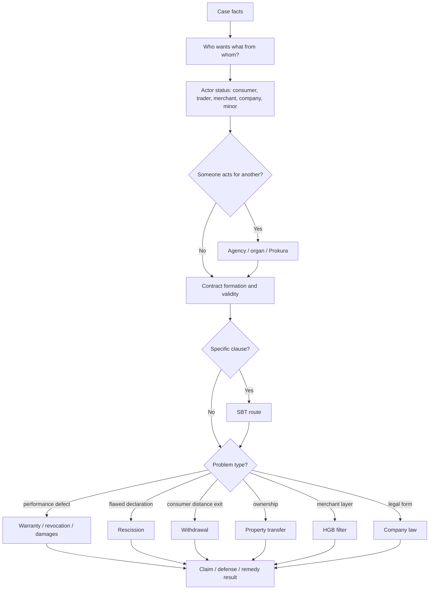
```mermaid
flowchart TD
    Facts[Case facts] --> Ask[Who wants what from whom?]
    Ask --> Actor[Actor status: consumer, trader, merchant, company, minor]
    Actor --> Agency{Someone acts for another?}
    Agency -->|Yes| AgencyRoute[Agency / organ / Prokura]
    Agency -->|No| ContractRoute
    AgencyRoute --> ContractRoute[Contract formation and validity]
    ContractRoute --> Clause{Specific clause?}
    Clause -->|Yes| SBTRoute[SBT route]
    Clause -->|No| Problem
    SBTRoute --> Problem{Problem type?}
    Problem -->|flawed declaration| RescissionRoute[Rescission]
    Problem -->|consumer distance exit| WithdrawalRoute[Withdrawal]
    Problem -->|performance defect| WarrantyRoute[Warranty / revocation / damages]
    Problem -->|ownership| PropertyRoute[Property transfer]
    Problem -->|merchant layer| TradeRoute[HGB filter]
    Problem -->|legal form| CompanyRoute[Company law]
    WarrantyRoute --> Result[Claim / defense / remedy result]
    RescissionRoute --> Result
    WithdrawalRoute --> Result
    PropertyRoute --> Result
    TradeRoute --> Result
    CompanyRoute --> Result
```

## Subject Knowledge Graph

| Node | Meaning | Exam relevance |
|---|---|---|
| Exam Strategy Pack | Custom open-book navigation and writing aid. | Speeds route selection under 120-minute constraint. |
| Legal-Opinion Schema | Claim basis, requirements, application, conclusion. | Required for case sections and memoranda. |
| Theory Schema | Definition, anchor, features, example, consequence. | Fits 30-point theory sections. |
| Lifecycle Router | Classifies formation, agency, SBT, rescission, withdrawal, warranty, property, trade, company. | Prevents wrong route choice. |
| Open-Book Material Setup | Printed/tabs/index strategy. | Converts open-book permission into usable speed. |
| Six-Day Operating Plan | Daily retrieval and mock sequence from 2026-07-22 to 2026-07-27. | Maximizes retention and coverage before exam. |

| From | Relationship | To | Why it matters |
|---|---|---|---|
| Exam Strategy Pack | contains | Legal-Opinion Schema | Main case writing form. |
| Exam Strategy Pack | contains | Theory Schema | Short-answer writing form. |
| Lifecycle Router | selects | Core Topic Schemas | Route before rule details. |
| Open-Book Material Setup | supports | Fast statutory citation | Open book helps only if navigation is fast. |
| Six-Day Operating Plan | sequences | Repairs, doctrine first passes, timed mocks | Prevents jumping to mocks before prerequisites are stable. |

## Daily Recall Protocol

At the end of every study day:

1. Close all notes.
2. Write the lifecycle router from memory.
3. Write three statutory anchors from the slowest topic.
4. Draft one mini issue sentence.
5. Correct against this schema.
6. Add one weak spot to the ledger.

Quality labels:

| Label | Meaning | Next action |
|---|---|---|
| green | Route and consequence correct without notes. | Move to timed application. |
| yellow | Route mostly correct, statute or consequence slow. | Repeat next day in 10 minutes. |
| red | Wrong legal layer or remedy. | Repair immediately with one mini case. |

## Final Pre-Exam Rule

You are not trying to memorize every paragraph. You are trying to make the first 60 seconds of every question automatic:

```text
actor status
-> legal relationship
-> issue type
-> statutory route
-> consequence
```

If that first minute is controlled, the open-book materials can help. If the route is wrong, the open book will mostly waste time.


<div class="page-break"></div>

# [R2] Section Cluster Table By Case Flow

<p class="source-path">Source: <code>business-law/wiki/exam-strategy-answer-schemas-2026-07-28/section-cluster-table-by-case-flow.md</code></p>

Course: Business Law
Exam date: 2026-07-28
Companion to: `exam-strategy-answer-schemas-2026-07-28.md`

Use this table as the fast-routing layer between "read the facts" and "open the Core Topic Schemas" in the main schema pack. Rows follow the order signals normally appear in a case, not the order sections sit in the statute book.

| # | Case-Flow Trigger (what you read in the facts) | Cluster | Key Sections | Use When | Trick |
|---:|---|---|---|---|---|
| 1 | Any party's status is unclear or matters later | Actor Status | Sections 13, 14 BGB; Sections 1-6 HGB | Before any other route — status changes which rules apply downstream (SBT B2C/B2B split, withdrawal rights, Section 377 filter) | Classify every actor first. A wrong consumer/merchant call silently breaks every later section. |
| 2 | "Was a contract concluded?", advertisement, shop display, phone/online order, silence after an offer | Formation | Sections 130, 133, 157, 145-150, 125, 134, 138 BGB | Whenever the case opens with two parties reaching (or not reaching) agreement | Displays/catalogs/ads = invitatio ad offerendum, not an offer. Modified "acceptance" = new offer under 150 II. Silence is not acceptance — except a merchant's confirmation letter (HGB custom) or Section 362 HGB inquiry cases. |
| 3 | Someone signs, orders, or negotiates "for" a company/another person; a manager, employee, or rep is involved | Agency | Sections 164-181 BGB; Sections 48-50, 54, 56 HGB | As soon as the acting person is not the one who will bear the contract's obligations | Check external power first ("can do"), internal restriction second ("may do") — internal limits usually don't bind third parties. No disclosed intent to act for another = Section 164 II, agent bound personally. No authority at all = pending under 177 I, then 179 agent liability if ratification is refused. |
| 4 | Pre-printed clauses, referenced "general terms," a webshop/lease/loan standard form, an exclusion or referral clause | SBT | Sections 305-310 BGB | Only after the contract itself is confirmed valid — clause review is always step two | Order: surprising (305c I, clause dies) → ambiguous (305c II, read against user) → content control (307-309, even a clear clause can fail). One bad clause falls out; the rest of the contract almost always survives (306). |
| 5 | A party says "I didn't mean that," typed/said the wrong thing, was lied to, or was threatened into signing | Rescission | Sections 119, 120, 121/124, 122, 123, 142-144 BGB | When the flaw sits in how the declaration was formed, not in how the contract was later performed | Never use rescission for a delivered good that turns out defective — that is warranty law, not Section 119 II. Watch the clock: 121 (immediate, mistake/transmission) vs. 124 (one year, deceit/duress). Confirming the deal after learning the truth bars rescission (144). |
| 6 | Consumer contract closed by phone, online, or on the doorstep — no face-to-face shop negotiation | Withdrawal | Sections 312b, 312c, 312g, 355 BGB | Only consumer + distance/off-premises setting; never for ordinary in-store or B2B deals | 14-day clock, and it can restart if the trader never gave proper withdrawal instructions. Watch the carve-outs: custom-made goods, sealed goods once unsealed, digital content once started with consent. |
| 7 | Delivery is late, missing, or a duty is breached in an otherwise valid contract; a party wants damages or wants out | Revocation / Damages | Sections 280-286, 323, 324, 326 V, 346-349 BGB | Once the contract is confirmed valid and the problem is a performance failure, not a formation flaw | Damages in addition vs. instead of performance turns on one question: would timely-but-late performance still remove the loss? No → in addition (280 I). Yes → instead of (280 I, III + 281/282/283/311a). Revocation usually needs a Nachfrist unless the case makes one dispensable (323 II, 326 V). |
| 8 | A sold good or service turns out defective, missing a feature, or wrong — discovered after handover | Warranty | Sections 433, 434, 435, 437, 439-444, 446 BGB; Section 377 HGB | Any purchase-contract defect claim, especially once transfer of risk has happened | Run cure first (439) unless impossible/refused/failed/unreasonable. In a merchant-to-merchant sale, apply the Section 377 HGB notice filter before anything else — a late notice can kill an otherwise perfect warranty claim regardless of how bad the defect is. |
| 9 | "Who actually owns this now?", double sale, stolen/lost goods, transfer of a claim instead of a thing | Property | Sections 929, 932, 935, 398 BGB | Whenever the question is ownership rather than a contractual claim | Movable transfer always needs authorization from the true owner — no authorization means jump straight to good-faith acquisition (932 ff.), then check the 935 lost/stolen block, which defeats good faith even for an honest buyer. |
| 10 | Any actor turns out to be a business/merchant; goods move between two commercial parties | Trade Law Overlay | Sections 1-6, 15, 48-56, 377 HGB | Layer this on top of any BGB route above once a merchant is in the fact pattern | HGB silently changes BGB defaults — merchant silence can bind, and Section 377's inspect-and-notify duty applies on top of ordinary warranty law. Always ask "is this actor a merchant" before trusting a pure BGB default. |
| 11 | Question asks which legal form fits, or whether an organ's/director's act or decision was valid | Company Law | Sections 5, 13, 35 GmbHG; Sections 76, 78, 93 AktG | Legal-form recommendation questions, or once an organ (not a mere agent) has acted for the company | Keep two questions separate: (a) which form fits the facts (liability, governance, cost, financing) and (b) was this specific organ act valid (representation rules). BJR only shields an informed, good-faith, conflict-free entrepreneurial decision — it never excuses an actual legal-duty violation. |

Reading order for a mixed case: rows 1-4 almost always run first (status, formation, agency, clause), then the case branches into whichever of rows 5-9 the facts raise, with rows 10-11 applied as an overlay wherever a merchant or company shows up.

## Section Definitions By Cluster

Working definitions for every section cited in the table above, grouped by the same row order. These are exam-ready paraphrases, not verbatim statute text — check the actual wording in the open-book statute during the exam if a question turns on exact phrasing.

### Cluster 1: Actor Status

| Section | Definition |
|---|---|
| Section 13 BGB | A consumer is a natural person entering a transaction for a purpose outside their trade, business, or profession. |
| Section 14 BGB | An entrepreneur (Unternehmer) is a natural/legal person or partnership acting in exercise of their trade, business, or profession when entering the transaction. |
| Sections 1-6 HGB | Define merchant status: Section 1 (Ist-Kaufmann, automatic merchant status for anyone running a commercial business), Section 2 (Kann-Kaufmann, small business owners who opt into registration), Section 3 (agriculture/forestry opt-in), Section 5 (Kaufmann kraft Eintragung, registered status binds regardless of actual business scale), Section 6 (commercial partnerships/corporations count as merchants by legal form). |

### Cluster 2: Formation

| Section | Definition |
|---|---|
| Section 125 BGB | A legal transaction that violates a legally required form is void; violating a merely contractually agreed form is void in case of doubt. |
| Section 130 BGB | A declaration of intent directed at another person becomes effective when it reaches (is received by) that person; it has no effect if a revocation reaches them at the same time or earlier. |
| Section 133 BGB | When interpreting a declaration of intent, the true intent must be sought rather than sticking to the literal meaning of the words used. |
| Section 134 BGB | A legal transaction that violates a statutory prohibition is void, unless the statute provides otherwise. |
| Sections 145-150 BGB | The offer/acceptance mechanics: 145 (the offeror is bound to the offer unless bound-ness was excluded), 146 (an offer lapses if rejected or not accepted in time), 147 (acceptance must occur immediately if made in person/by phone, or within a reasonable period if made to an absent party), 148 (the offeror can set a fixed acceptance deadline), 149 (a late-arriving acceptance that was sent in time must be treated as timely if the offeror could have recognized the delay and does not immediately notify the acceptor), 150 (late acceptance counts as a new offer; acceptance with modifications counts as rejection plus a new offer). |
| Section 138 BGB | A legal transaction that violates public policy (good morals) is void; Section 138 II specifically voids usurious transactions exploiting another's weakness. |
| Section 157 BGB | Contracts must be interpreted as good faith requires, taking customary practice into account. |

### Cluster 3: Agency

| Section | Definition |
|---|---|
| Section 164 I BGB | A declaration made by a person within their power of representation, in the name of the person represented, takes effect directly for and against the person represented. |
| Section 164 II BGB | If the intent to act in another's name is not evident, the lack of intent to act in one's own name is irrelevant — the agent is treated as acting for themselves. |
| Sections 165-168 BGB | Agency mechanics: 165 (an agent does not need full legal capacity, only limited capacity), 166 (the principal cannot rely on their own lack of knowledge where the agent knew or should have known the relevant facts), 167 (power of attorney is granted by declaration to the agent or to the third party, and does not require the form prescribed for the underlying transaction), 168 (the power of attorney's termination follows the underlying legal relationship, subject to protection of good-faith third parties). |
| Sections 177-179 BGB | Consequences of missing authority: 177 (a contract concluded by an agent without power of representation is provisionally ineffective, pending the represented person's ratification), 178 (the other party may revoke before ratification unless they knew of the lack of authority), 179 (an agent who contracted without authority is liable to the other party for performance or damages, unless the other party knew of the lack of authority, or the agent's own capacity was limited). |
| Section 181 BGB | An agent may not, unless otherwise permitted, enter into a legal transaction in the name of the represented person with themselves in their own name or as another person's agent (self-dealing/self-contracting is barred by default). |
| Sections 48-50 HGB | Prokura: 48 (Prokura is granted expressly by the business owner or an authorized representative and must be registered), 49 (Prokura authorizes all kinds of judicial and extrajudicial acts a commercial business normally entails, including acts a normal Handlungsvollmacht would not cover, but not disposing of real estate unless separately empowered), 50 (internal limitations on Prokura are ineffective against third parties, with narrow exceptions for branch-limited or joint Prokura that are registered). |
| Section 54 HGB | Handlungsvollmacht is authority to conduct the kind of business or specific acts the holder has been put in charge of by a merchant, scoped narrower than Prokura and easier to restrict effectively against a third party who knew or should have known of the restriction. |
| Section 56 HGB | A person employed in a shop or warehouse is deemed authorized to make sales and receive payments customary in that type of shop, unless the third party knew otherwise. |

### Cluster 4: SBT

| Section | Definition |
|---|---|
| Section 305 BGB | Standard Business Terms are contract terms pre-formulated for a multitude of contracts that one party (the user) presents to the other upon conclusion of a contract; Section 305 I sentence 3 excludes terms that were genuinely individually negotiated. Section 305 II sets incorporation requirements (clear reference, reasonable opportunity to review, agreement). |
| Section 305c BGB | 305c I voids clauses so unusual given the circumstances that the other party need not expect them (surprising clauses). 305c II requires any remaining ambiguity in SBT to be interpreted against the user (contra proferentem). |
| Sections 307-309 BGB | Content control tiers: 307 (the general clause — SBT provisions are invalid if they unreasonably disadvantage the other party contrary to good faith, including a lack of transparency), 308 (specific clauses invalid subject to an evaluation of the circumstances — "grey list"), 309 (specific clauses invalid without any room for evaluation — "black list," e.g. short-notice price increases, unreasonable liability exclusions). |
| Section 310 BGB | Limits the reach of content control: several protections (especially the 308/309 "grey and black lists") do not apply to contracts with entrepreneurs (B2B), though the Section 307 general clause still applies there via indirect application. |
| Section 306 BGB | If an SBT clause is invalid or not incorporated, the rest of the contract remains valid in principle, and statutory law fills the resulting gap; the contract only fails entirely if adherence to it would be an unreasonable hardship for one party. |

### Cluster 5: Rescission

| Section | Definition |
|---|---|
| Section 119 I BGB | A person who, when making a declaration of intent, was mistaken about its content, or did not intend to make a declaration of that content at all (e.g. a slip of the tongue or pen), may rescind if it can be assumed they would not have made the declaration with knowledge of the true state of affairs and reasonable appreciation of the situation. |
| Section 119 II BGB | A mistake about characteristics of a person or thing that are regarded as essential in business dealings is treated as a mistake about the content of the declaration. |
| Section 120 BGB | A declaration transmitted incorrectly by the person or agency used for transmission (e.g. a messenger, a telegraph office) may be rescinded under the same conditions as a content mistake. |
| Section 121 BGB | Rescission for a mistake (119) or transmission error (120) must occur without culpable delay (immediately) after the person entitled to rescind gains knowledge of the ground for rescission. |
| Section 122 BGB | A person who successfully rescinds under Sections 119 or 120 must compensate the other party (or a third party) for the damage suffered by relying on the validity of the declaration, up to the value of their interest in the transaction's validity — reliance damages for an honest mistake. |
| Section 123 BGB | A person induced to make a declaration of intent by fraudulent deceit or unlawfully by duress may rescind the declaration. |
| Section 124 BGB | Rescission for deceit or duress (123) may occur within one year, starting from discovery of the deceit or the end of the coercive situation for duress. |
| Section 142 I BGB | If a voidable transaction is rescinded, it is deemed void from the beginning (ab initio, retroactively). |
| Section 143 BGB | Rescission is effected by declaration to the other party (or the appropriate recipient). |
| Section 144 BGB | If the person entitled to rescind confirms the voidable transaction after gaining knowledge of the ground for rescission, the right to rescind is excluded. |

### Cluster 6: Withdrawal

| Section | Definition |
|---|---|
| Section 312b BGB | Defines off-premises contracts — concluded in the simultaneous physical presence of consumer and trader at a location other than the trader's business premises (e.g. doorstep sales), or immediately preceded by a personal, individual approach outside those premises. |
| Section 312c BGB | Defines distance contracts — concluded exclusively through remote means of communication (phone, mail order, internet) without simultaneous physical presence of both parties, using a system organized for distance selling. |
| Section 312g BGB | Grants consumers a right of withdrawal for off-premises and distance contracts, subject to statutory exceptions (e.g. custom-made goods, unsealed hygiene goods, digital content begun with consent and acknowledgment of loss of the right). |
| Section 355 BGB | Governs how withdrawal works: the consumer may withdraw within 14 days without giving reasons by a clear statement or, where permitted, by returning the goods; withdrawal ends both parties' duty to perform and triggers mutual return of what was already exchanged. |
| Section 356 BGB | Sets when the 14-day period starts (generally receipt of goods, or contract conclusion for services) and extends it up to 12 months and 14 days if the trader failed to give proper withdrawal instructions. |

### Cluster 7: Revocation / Damages

| Section | Definition |
|---|---|
| Section 241 BGB | An obligation entitles the creditor to demand performance from the debtor; depending on content, an obligation can also oblige each party to have regard for the rights, legal interests, and other interests of the other party. |
| Section 249 BGB | A person liable in damages must restore the position that would exist if the damaging circumstance had not occurred (restitution in kind is the default; monetary compensation is a substitute). |
| Section 275 BGB | A claim to performance is excluded to the extent performance is impossible for the debtor or for anyone; further exclusions exist for grossly disproportionate effort or performance that cannot reasonably be expected of the debtor personally. |
| Section 276 BGB | The debtor is responsible for intent and negligence unless a stricter or milder standard is owed or apparent from the content of the obligation. |
| Section 280 I BGB | If the debtor breaches a duty arising from the obligation, the creditor may demand damages for the resulting loss, unless the debtor is not responsible for the breach (fault is presumed against the debtor, who must prove otherwise). |
| Sections 281-283 BGB | Conditions for damages instead of performance: 281 (the creditor set a reasonable additional period for performance or non-conforming performance and it expired unsuccessfully, or such a period was dispensable), 282 (damages instead of performance for breach of a duty of consideration under 241 II where performance can no longer reasonably be expected), 283 (damages instead of performance once the debtor need not perform under Section 275). |
| Section 284 BGB | Instead of damages instead of performance, the creditor may demand reimbursement of expenses reasonably incurred in reliance on receiving performance, unless their purpose would have failed regardless of the breach. |
| Section 286 BGB | The debtor is in default if, despite being able to perform, they fail to perform after a reminder from the creditor following the due date (or, in specified cases, without need for a reminder, e.g. a calendar-fixed date). |
| Section 311 BGB | An obligation to render performance requires a contract between the parties unless the law provides otherwise; Section 311 II/III also creates pre-contractual obligations (culpa in contrahendo) from the commencement of negotiations, the initiation of a contract, or similar business contact, even absent a concluded contract. |
| Section 323 BGB | The creditor may revoke a reciprocal contract if the debtor does not render performance, or does not render it as owed, after a reasonable additional period set by the creditor has expired without result; the period is dispensable in cases like serious/final refusal or a genuine fixed-date transaction (323 II). |
| Section 324 BGB | The creditor may revoke a reciprocal contract if the debtor breaches a duty under Section 241 II and performance can no longer reasonably be expected of the creditor. |
| Section 326 BGB | If performance becomes impossible under Section 275, the counter-performance duty lapses; Section 326 V specifically grants a right to revoke without needing to first set a Nachfrist, since one would be pointless. |
| Sections 346-349 BGB | Effects and mechanics of revocation: 346 (revocation requires both parties to return what was received and surrender any benefits derived from it, or pay compensation for value where return/benefits are impossible), 347 (rules on default in returning and on benefits not obtained through proper management), 348 (the restitution duties are performed concurrently, like a reciprocal contract), 349 (revocation is effected by declaration to the other party). |

### Cluster 8: Warranty

| Section | Definition |
|---|---|
| Section 433 BGB | Under a purchase contract, the seller is obliged to hand over the item and transfer ownership free of material and legal defects; the buyer is obliged to pay the purchase price and accept the item. |
| Section 434 BGB | An item is free of material defects if it conforms to the agreed quality, or is suitable for the purpose intended under the contract, or is suitable for its normal use and shows a quality customary for items of that kind that the buyer could reasonably expect. |
| Section 435 BGB | An item is free of legal defects if third parties cannot assert rights against the buyer in relation to the item, or can only assert rights that were undertaken in the contract. |
| Section 437 BGB | The gateway provision: if the item is defective, the buyer may (subject to further requirements elsewhere in the code) demand cure, revoke the contract or reduce the price, and/or claim damages or reimbursement of futile expenses. |
| Section 439 BGB | Cure (Nacherfüllung) — the buyer may choose between repair (removal of the defect) or replacement (delivery of a defect-free item); the seller may refuse the buyer's chosen type of cure if it is only possible at disproportionate cost, without prejudice to the other type. |
| Section 440 BGB | Cure is dispensed with (allowing the buyer to move straight to revocation or damages) if the seller refuses both types, cure fails, or a further attempt at cure is unreasonable for the buyer, among other listed situations. |
| Section 441 BGB | Instead of revoking, the buyer may reduce the purchase price in proportion to the reduced value of the defective item compared to a defect-free item. |
| Section 442 BGB | The buyer's warranty rights are excluded if they knew of the defect at contract conclusion, or, for defects they should have known through gross negligence, unless the seller fraudulently concealed the defect or gave a guarantee. |
| Section 443 BGB | A guarantee (Garantie) is a voluntary additional promise by the seller or manufacturer, on top of statutory warranty rights, that the item has certain qualities or will retain them, or covering other stated consequences of a defect. |
| Section 444 BGB | The seller cannot rely on an agreement excluding or limiting the buyer's warranty rights if the seller fraudulently concealed the defect or gave a guarantee covering the item's quality. |
| Section 446 BGB | The risk of accidental loss or deterioration passes to the buyer upon handover of the sold item. |
| Section 377 HGB | In a mutual commercial (merchant-to-merchant) purchase, the buyer must inspect the goods without undue delay after delivery and, if a defect is found, notify the seller without undue delay; failure to do so means the goods are deemed approved and warranty rights are generally lost, except for defects not discoverable on inspection (which must still be notified promptly upon discovery) or defects the seller fraudulently concealed. |

### Cluster 9: Property

| Section | Definition |
|---|---|
| Section 929 BGB | Transfer of ownership of a movable thing requires the owner and acquirer to agree that ownership shall pass, and the thing to be handed over (delivered); if the acquirer already possesses the thing, agreement alone suffices. |
| Section 932 BGB | An acquirer can become owner through Section 929 even if the transferor was not the owner, provided the acquirer acted in good faith (did not know and was not grossly negligent in not knowing that the transferor lacked ownership). |
| Section 935 BGB | Good-faith acquisition under Section 932 is excluded if the thing was stolen from, lost by, or otherwise involuntarily lost by the true owner (with a narrower exception for money and bearer instruments). |
| Section 398 BGB | A claim can be transferred by the creditor to another person by contract (assignment) without the debtor's consent; the new creditor replaces the old one. |

### Cluster 10: Trade Law Overlay

| Section | Definition |
|---|---|
| Sections 1-6 HGB | See Cluster 1 (merchant status definitions — Ist-, Kann-, Form-, and registered Kaufmann). |
| Section 15 HGB | Facts required to be entered in the commercial register can be relied upon by third parties once registered and published (positive publicity); before registration/publication, a third party who did not know the true facts can rely on the unregistered state (negative publicity), protecting good-faith reliance on the register's public face. |
| Sections 48-56 HGB | See Cluster 3 (Prokura 48-50, Handlungsvollmacht 54, shop authority 56). |
| Section 377 HGB | See Cluster 8 (commercial inspection and notice duty). |

### Cluster 11: Company Law

| Section | Definition |
|---|---|
| Section 5 GmbHG | The minimum share capital of a GmbH is 25,000 EUR, with each shareholder's contribution set out in the articles. |
| Section 13 GmbHG | A GmbH is a legal person in its own right; only the company's assets are liable for the company's debts, not the shareholders' private assets. |
| Section 35 GmbHG | The GmbH is represented in and out of court by its managing director(s) (Geschäftsführer); with multiple managing directors, joint representation is the statutory default unless the articles provide otherwise. |
| Section 76 AktG | The management board (Vorstand) manages the AG under its own responsibility, independent of shareholder instructions on day-to-day business. |
| Section 78 AktG | The AG is represented in and out of court by its management board, which may consist of one or more members; where there are several members, joint representation is the default unless the articles provide otherwise. |
| Section 93 AktG | Management board members must exercise the care of a diligent and conscientious manager and are liable to the company for breaches; Section 93 I sentence 2 codifies the Business Judgment Rule — no breach of duty exists if the board member could reasonably have believed, based on adequate information, that they were acting in the company's best interest (an entrepreneurial-judgment safe harbor). |


<div class="page-break"></div>

# [R3] Numbers And Deadlines Cheat Sheet

<p class="source-path">Source: <code>business-law/wiki/exam-strategy-answer-schemas-2026-07-28/numbers-and-deadlines-cheat-sheet.md</code></p>

Course: Business Law
Exam date: 2026-07-28
Companion to: `exam-strategy-answer-schemas-2026-07-28.md`, `section-cluster-table-by-case-flow.md`

Every hard number that shows up in a route, in one place. If a case fact includes a date, a delay, or a count, scan this sheet before writing.

## Time Limits By Route

| Section(s) | Number | What starts the clock | What it protects/ends | Trick |
|---|---|---|---|---|
| Section 121 BGB | Immediately, "without culpable delay" | Discovery of the mistake/transmission error | Right to rescind for Sections 119, 120 | No fixed day count — courts read this as days, not weeks. Delay after discovery kills rescission even inside a "reasonable" feel. |
| Section 124 BGB | 1 year | Discovery of the deceit, or the moment duress ends | Right to rescind for Section 123 | Much longer than 121 on purpose — deceit/duress victims often realize late. Do not import the short 121 clock into a 123 case. |
| Section 355 BGB | 14 days | Receipt of goods (or contract conclusion for services), and only once proper withdrawal instructions were given | Consumer withdrawal right under 312g | If instructions were missing or wrong, the clock does not start — it extends up to 12 months + 14 days (Section 356 III). |
| Section 377 HGB | "Without undue delay" after delivery (inspection); "immediately" after discovery (notice) | Delivery of goods between merchants | Buyer's right to invoke any warranty claim at all | No statutory day count. In practice, 1-2 business days for inspection/notice is the safe assumption used in course materials — treat longer gaps as fatal to the claim. |
| Section 439 BGB (cure) | "Within a reasonable period" set by the buyer (Nachfrist) | Buyer's request for cure | Seller's chance to cure before buyer escalates to reduction/revocation/damages | No fixed number — reasonableness scales with the nature of the defect and the goods. A too-short deadline set by the buyer is read down to a reasonable one, not treated as void. |
| Section 323 BGB (Nachfrist) | "Reasonable period" for performance | Creditor's demand for performance | Right to revoke for non/bad performance | Dispensable under 323 II (serious/final refusal, fixed-date deal, special circumstances) or 326 V (impossibility) — do not assume every revocation needs a formal deadline letter. |
| Section 195 BGB | 3 years | End of the year in which the claim arose and the creditor knew (or should have known) of it (Section 199 I) | Ordinary limitation (Verjährung) of contractual claims | Starts at year-end, not the exact date of the breach — a claim from March 2024 is time-barred starting 1 Jan 2028, not March 2027. |
| Section 438 I No. 3 BGB | 2 years | Delivery of the (movable) good | Limitation of ordinary warranty claims | Shorter and more specific than the general 195 three-year rule — the special sale-of-goods period displaces the general one. |
| Section 438 I No. 2 BGB | 5 years | Handover, for buildings/building materials used per their normal purpose | Limitation of warranty claims tied to construction | Rare in exam facts, but flag it if the object is a building or building material. |
| Section 199 II-III BGB | 10 / 30 years (long-stop) | Act causing the damage, regardless of knowledge | Long-stop limitation for damage/life/health claims | Only relevant if a case deliberately sets a very old fact pattern — a knowledge-independent backstop. |
| Section 90a analog / Section 90 movable definition | n/a | n/a | n/a | Not a deadline — listed here only as a reminder this sheet is deadlines, not definitions; see the glossary companion for term definitions. |

## Age / Capacity Thresholds

| Threshold | Section | Meaning | Trick |
|---|---|---|---|
| Under 7 | Section 104 No. 1 BGB | No legal capacity at all — declarations are void | A 6-year-old's "purchase" is void from the start, not merely voidable. |
| 7 to under 18 | Section 106 ff. BGB | Limited capacity — needs legal representative's consent unless the transaction is purely beneficial (Section 107) or covered by pocket-money performed with permitted funds (Section 110) | Section 110 requires actual performance with money given for that purpose or free disposal — merely "having enough money somewhere" is not enough. |
| 18+ | Section 2 BGB | Full capacity | Baseline; only worth stating if the case tests the boundary. |

## Counting/Threshold Numbers Outside Deadlines

| Number | Context | Section | Trick |
|---|---|---|---|
| 25,000 EUR minimum share capital | GmbH | Section 5 I GmbHG | Compare against UG (1 EUR symbolic minimum, must retain 25% of annual profit until it reaches 25,000 EUR — Section 5a GmbHG). |
| 1 EUR minimum share capital | UG (haftungsbeschränkt) | Section 5a GmbHG | "Mini-GmbH" — same liability shield as GmbH, lower entry cost, capital-retention obligation until it converts. |
| 50,000 EUR minimum share capital | AG | Section 7 AktG | Higher than GmbH — signals AG is built for larger, capital-market-facing ventures. |
| Two-tier board split | AG governance | Sections 76, 78, 111 AktG | Management board (Vorstand) runs the company; supervisory board (Aufsichtsrat) oversees it — GmbH has no mandatory second tier. |

## Section Definitions

Working definitions for every section cited above, so the sheet is usable without flipping to another file. Paraphrased for exam use, not verbatim statute text.

| Section | Definition |
|---|---|
| Section 2 BGB | A person reaches full legal capacity (age of majority) at 18. |
| Section 90 BGB | A "thing" in the legal sense is a corporeal (physical) object; Section 90a clarifies that animals are not things but are treated by analogy to things unless otherwise provided. |
| Section 104 No. 1 BGB | A person under 7 has no legal capacity to act — their declarations of intent are void. |
| Sections 106-110 BGB | Limited capacity for persons 7 to under 18: consent of the legal representative is generally required (106-108); Section 107 exempts transactions that are purely legally beneficial to the minor; Section 108 allows the representative to ratify after the fact; Section 110 validates a transaction without prior consent if the minor performs using funds given to them for that purpose or for free disposal. |
| Section 121 BGB | Rescission for a mistake (119) or transmission error (120) must occur without culpable delay (immediately) after the person entitled to rescind learns of the ground for rescission. |
| Section 124 BGB | Rescission for deceit or duress (Section 123) may occur within one year of discovering the deceit, or from the end of the coercive situation for duress. |
| Section 195 BGB | The ordinary limitation period for claims is three years. |
| Section 199 I BGB | The ordinary three-year limitation period begins at the end of the year in which the claim arose and the creditor obtained (or should have obtained without gross negligence) knowledge of the claim and the debtor's identity. |
| Section 199 II-III BGB | Long-stop limitation periods that run regardless of the creditor's knowledge: 10 years for most claims (from when the claim arose) and up to 30 years for claims based on injury to life, body, health, or freedom (from the act causing the damage). |
| Section 323 BGB | The creditor may revoke a reciprocal contract once a reasonable additional period (Nachfrist) set for performance has expired without result; Section 323 II dispenses with the Nachfrist requirement in cases like a serious and final refusal to perform or a genuine fixed-date transaction. |
| Section 326 V BGB | Where performance becomes impossible and the counter-performance duty lapses under Section 326, the creditor may revoke the contract without needing to set a Nachfrist first. |
| Section 355 BGB | The consumer withdrawal period is 14 days, running without the need to give reasons, and can be exercised by a clear statement (or return of goods, where permitted). |
| Section 356 BGB | Sets when the 14-day withdrawal period starts (usually receipt of goods or contract conclusion for services) and extends it up to 12 months and 14 days if the trader failed to give proper withdrawal instructions. |
| Section 377 HGB | In a mutual commercial (merchant-to-merchant) purchase, the buyer must inspect goods without undue delay after delivery and notify any defect without undue delay after discovery; failure means the goods are deemed approved and warranty rights are generally lost. |
| Section 438 I No. 2 BGB | Warranty claims for buildings, or materials supplied for and used in a building consistent with their normal use, are limited to five years from handover. |
| Section 438 I No. 3 BGB | The ordinary limitation period for warranty claims on movable goods is two years from delivery, displacing the general three-year rule. |
| Section 439 BGB | Cure (Nacherfüllung) allows the buyer to demand repair or replacement of a defective item within a reasonable period; the deadline the buyer sets scales with the nature of the defect and is read down to a reasonable one if too short, rather than treated as void. |
| Section 5 GmbHG | The minimum share capital of a GmbH is 25,000 EUR. |
| Section 5a GmbHG | The Unternehmergesellschaft (haftungsbeschränkt), or UG, can be formed with as little as 1 EUR of share capital but must retain 25% of its annual profit as a statutory reserve until that reserve plus share capital reaches 25,000 EUR, at which point it can convert to a full GmbH. |
| Section 7 AktG | The minimum share capital of an AG is 50,000 EUR. |
| Sections 76, 78, 111 AktG | The AG has mandatory two-tier governance: the management board (Vorstand) manages the company under its own responsibility and represents it externally (76, 78), while the supervisory board (Aufsichtsrat) oversees the management board (111) — a second tier that GmbH does not require by default. |

## Quick Recall Drill

Before the exam, write these six numbers from memory and self-check against this sheet:

```text
121 = immediate
124 = 1 year
355 = 14 days
438 I No. 3 = 2 years
195 + 199 I = 3 years, year-end start
110 = pocket-money exception, must actually perform
```


<div class="page-break"></div>

# [R4] Confusable Terms Trap Sheet

<p class="source-path">Source: <code>business-law/wiki/exam-strategy-answer-schemas-2026-07-28/confusable-terms-trap-sheet.md</code></p>

Course: Business Law
Exam date: 2026-07-28
Companion to: `exam-strategy-answer-schemas-2026-07-28.md`, `section-cluster-table-by-case-flow.md`

The exit-route pairs (rescission/revocation/withdrawal/cancellation/dissolution) already have their own table in the main schema pack. This sheet covers the other pairs that get mixed up under time pressure.

| Pair | Term A | Term B | The real distinction | Trick |
|---|---|---|---|---|
| Validity | Void (nichtig) | Voidable (anfechtbar) | Void = never had legal effect from the start (e.g., Section 125, 134, 138 violations). Voidable = valid until successfully attacked, then void retroactively (Section 142 I after rescission). | If the case facts show the contract was acted on for a while before anyone objected, that only makes sense for a voidable transaction — a void one was never alive to act on. |
| Money remedy scope | Damages in addition to performance | Damages instead of performance | In addition = the loss survives even if the debtor still performs properly and late (e.g., cost of a rental car during the delay). Instead of = the loss disappears once proper performance is impossible or no longer wanted, so it replaces the performance claim entirely. | Ask: "if the seller delivered right now, would this specific loss vanish?" Yes → instead of (280 I, III + 281 ff.). No → in addition (280 I alone). |
| Damages size (warranty) | Small damages (kleiner Schadensersatz) | Big damages (großer Schadensersatz) | Small = buyer keeps the defective good and claims the value difference. Big = buyer gives the good back and claims full performance-interest damages as if the contract never happened. | Big damages only work for a material breach — cosmetic defects usually cap the buyer at small damages or reduction. |
| Warranty remedy | Cure (Nacherfüllung) | Replacement vs. repair | Cure is the umbrella term (Section 439) covering both repair (Nachbesserung) and replacement (Nachlieferung) — buyer picks, seller can refuse the buyer's pick only if disproportionate. | "Cure" alone in an exam sentence is not a complete answer — always specify which of the two the buyer chose and whether the seller can refuse it as disproportionate. |
| Physical control vs. right | Possession (Besitz) | Ownership (Eigentum) | Possession is factual physical control (Section 854 ff.) — a thief has possession. Ownership is the legal right recognized by Sections 903, 929 ff. | A case can deliberately separate the two (stolen goods, leased goods, pledged goods) — never assume the possessor is the owner. |
| Representation scope | Vollmacht (power of attorney generally) | Vertretungsmacht (power of representation) | Vertretungsmacht is the umbrella legal capacity to bind the principal — it can come from Vollmacht (rechtsgeschäftliche, party-granted), law (gesetzliche, e.g. parents for a minor), or organ status (organschaftliche, e.g. GmbH managing director). | Do not write "Vollmacht" as if it is the only source of representative power — Prokura, organ representation, and statutory representation are Vertretungsmacht without being an ordinary Vollmacht. |
| Sale-law protection scope | Warranty exclusion (Gewährleistungsausschluss) | Limitation clause (Haftungsbeschränkung) | Exclusion tries to remove the warranty claim itself (subject to Sections 442, 444, and SBT content control). Limitation narrows the remedy or amount (e.g., capping damages) without removing the claim outright. | An "as is" clause is an exclusion attempt, not a limitation — check Section 444 (fraud/guarantee override) and SBT control (307-309) before accepting either as effective. |
| Contract type for services | Sale (Kaufvertrag, Section 433) | Service contract (Dienstvertrag, Section 611) | Works contract (Werkvertrag, Section 631) | Sale = transfer of a thing/right. Service = effort owed, no guaranteed result (e.g., consulting). Works = a specific result owed, defect law applies (e.g., a repair, a building, custom software). | If the case involves "install," "repair," "build," or "produce to spec," default-check works contract before sale — works contract borrows warranty language similar to Section 434 ff. but under Section 633 ff. |
| Pre-contract liability | Culpa in contrahendo (c.i.c., Section 311 II/III) | Ordinary breach of contract (Section 280 I) | c.i.c. covers duties that arise during negotiation, before any contract exists (e.g., misleading a party into negotiating, breaking off talks in bad faith). Ordinary breach needs a concluded obligation already in place. | If no contract ever formed but one party still suffered a loss from the other's conduct during talks, reach for c.i.c., not Section 280 I on its own. |
| Agency risk allocation | Section 164 II (undisclosed intent to act for another) | Section 179 (agent liability for lack of authority) | 164 II: agent never showed any intent to represent someone else, so the agent is personally bound to the contract as if acting for themselves. 179: agent did show intent to represent, but lacked authority, so the agent risks liability to the third party (not automatic personal contract-binding). | These are different problems triggered by different facts — 164 II is a publicity failure, 179 is an authority failure. Do not merge them into one paragraph. |
| Merchant representation power | Prokura (Sections 48-50 HGB) | Handlungsvollmacht (Section 54 HGB) | Prokura is broad, nearly all business acts, granted only by the merchant/owner or an authorized organ, and internal limits generally do not bind third parties. Handlungsvollmacht is narrower, scoped to the kind of business the holder is put in charge of, and easier to restrict effectively. | If the case says "authorized signatory" or uses the actual word Prokura, go broad; if it says "manages the shop" or "handles purchasing," think Handlungsvollmacht or Section 56 shop authority instead. |

## Section Definitions

Working definitions for every section cited in the pairs above, so the sheet is usable without flipping to another file. Paraphrased for exam use, not verbatim statute text.

| Section | Definition |
|---|---|
| Sections 125, 134, 138 BGB | Void-from-the-start triggers: 125 (violation of a legally or contractually required form), 134 (violation of a statutory prohibition), 138 (violation of public policy/good morals, including usury under 138 II). |
| Section 142 I BGB | A successfully rescinded (voidable) transaction is deemed void from the beginning — retroactive, not merely forward-looking. |
| Section 164 II BGB | If an agent's intent to act in another's name is not evident, the agent is treated as having acted in their own name and is personally bound. |
| Section 179 BGB | An agent who concludes a contract without power of representation is liable to the other party for performance or damages, unless the other party knew of the missing authority or the agent's own capacity was limited. |
| Section 249 BGB | A person liable in damages must restore the position that would exist without the damaging event — restitution in kind by default. |
| Section 280 I BGB | If the debtor breaches a duty arising from the obligation, the creditor may demand damages for the resulting loss (fault is presumed against the debtor). |
| Sections 281 ff. BGB | Damages instead of performance require a reasonable additional period for performance to have expired unsuccessfully (281), or cover breach of a duty of consideration where performance can no longer be expected (282), or apply once performance is excluded under Section 275 (283). |
| Section 307-309 BGB | SBT content control: 307 (general clause — unreasonable disadvantage/lack of transparency), 308 (clauses invalid subject to evaluation of circumstances), 309 (clauses invalid without any room for evaluation). |
| Section 311 II, III BGB | Pre-contractual obligations (culpa in contrahendo) arise from the commencement of negotiations, the initiation of a contract, or similar business contact, even before any contract is concluded. |
| Section 433 BGB | Under a purchase contract (Kaufvertrag), the seller must hand over the item and transfer ownership free of defects; the buyer must pay the price and accept the item. |
| Section 442 BGB | The buyer's warranty rights are excluded if they knew of the defect at conclusion, or should have known through gross negligence, unless the seller fraudulently concealed the defect or gave a guarantee. |
| Section 444 BGB | A seller cannot rely on a clause excluding or limiting warranty rights if they fraudulently concealed the defect or gave a guarantee covering the item's quality. |
| Section 611 BGB | Under a service contract (Dienstvertrag), the party rendering services owes the promised effort/activity, not a guaranteed result. |
| Section 631 BGB | Under a works contract (Werkvertrag), the contractor owes production of the promised work/result (e.g. a repair, a building, a piece of custom-made software), not merely effort. |
| Section 633 BGB | The work produced under a works contract must be free of material and legal defects, mirroring the sale-law defect standard in Section 434/435 but inside the works-contract regime. |
| Section 854 ff. BGB | Possession (Besitz) is factual physical control over a thing; it is acquired by gaining actual control (854) and can exist independently of any right to the thing. |
| Section 903 BGB | Ownership (Eigentum) is the legal right to deal with a thing as one pleases and to exclude others from it, subject to statutory limits and third-party rights. |
| Section 929 ff. BGB | Ownership of a movable transfers by agreement between owner and acquirer that ownership shall pass, plus delivery of the thing (929); Sections 930-931 provide substitutes for delivery (e.g. constructive possession, assignment of the claim to possession); Section 932 allows good-faith acquisition from a non-owner; Section 935 blocks that for lost or stolen goods. |
| Sections 48-50 HGB | Prokura: granted by the merchant/authorized organ and registered (48); covers nearly all business acts (49); internal restrictions generally do not bind third parties (50). |
| Section 54 HGB | Handlungsvollmacht is authority to conduct the kind of business, or specific acts, the holder has been put in charge of — narrower than Prokura and easier to restrict effectively against a third party who knew or should have known of the limit. |
| Section 56 HGB | A person employed in a shop or warehouse is deemed authorized to make sales and receive payments customary for that type of shop, unless the third party knew otherwise. |

## One-Line Self-Test

Before the exam, say each pair out loud and give the one-sentence distinction without looking:

```text
void vs voidable
damages in addition vs instead of performance
small vs big damages
possession vs ownership
Vollmacht vs Vertretungsmacht
warranty exclusion vs limitation clause
sale vs service vs works contract
c.i.c. vs ordinary breach
Section 164 II vs Section 179
Prokura vs Handlungsvollmacht
```


<div class="page-break"></div>

# [R5] Theory Glossary And Blank Answer Template

<p class="source-path">Source: <code>business-law/wiki/exam-strategy-answer-schemas-2026-07-28/theory-glossary-and-answer-template.md</code></p>

Course: Business Law
Exam date: 2026-07-28
Companion to: `exam-strategy-answer-schemas-2026-07-28.md`, `section-cluster-table-by-case-flow.md`

Two tools in one file: a filled one-line glossary for fast theory answers, and a blank skeleton to physically write out during timed practice and on exam day.

## Part 1: One-Line Theory Glossary

Each entry follows the Theory Schema from the main pack: definition, anchor, feature/trap in one breath. Use these as the seed sentence, then expand with the full Definition Question schema if the question asks for more.

| Term | One-line definition | Anchor | Trap |
|---|---|---|---|
| Invitatio ad offerendum | An invitation to make an offer, not an offer itself — the inviting party keeps the choice of whether to be bound. | No fixed section; derived from Section 145 intention-to-be-bound analysis | Shop displays, ads, and catalogs default to this — do not treat them as binding offers. |
| Offer (Antrag) | A declaration of intent with essentialia negotii and a clear intention to be bound, effective on receipt if required. | Sections 145, 130 BGB | An offer binds the offeror unless expressly excluded (Section 145) — "no obligation" language is what turns it back into an invitatio. |
| Modified acceptance | An "acceptance" that changes the offer's terms — legally a rejection plus a new offer. | Section 150 II BGB | The original offeror becomes the new offeree — roles flip. |
| Standard Business Terms (SBT/AGB) | Pre-formulated contract terms for repeated use, presented by one party to the other. | Section 305 I BGB | Genuine individual negotiation removes SBT status entirely (305 I sentence 3) — negotiated terms are not SBT even if they end up in a standard-looking document. |
| Surprising clause | A clause so unusual in context that the other party could not reasonably expect it. | Section 305c I BGB | The clause does not become part of the contract at all — it is not merely interpreted narrowly, it is excluded. |
| Agency (Stellvertretung) | Acting through one's own declaration, in another's name, within power of representation, so the legal effect lands on the principal. | Section 164 I BGB | All three elements are cumulative — missing any one breaks agency and shifts the analysis to 164 II or 177/179. |
| Prokura | A broad, largely unrestrictable commercial power of representation granted by a merchant/authorized organ, covering nearly all business acts. | Sections 48-50 HGB | Internal restrictions on a Prokura generally do not bind third parties — external power stays broad even if internal instructions were narrower. |
| Culpa in contrahendo (c.i.c.) | Liability for breach of duties owed during contract negotiations, before any contract is concluded. | Section 311 II, III BGB | Applies even if no contract ever forms — do not require a concluded contract before considering c.i.c. |
| Impossibility (Unmöglichkeit) | Performance cannot be rendered at all, excusing the primary performance duty. | Section 275 BGB | Impossibility excuses performance but does not automatically excuse damages — check Section 280 I, III with 283/311a separately. |
| Business Judgment Rule (BJR) | A safe harbor shielding a management decision from liability if it was an informed, good-faith, entrepreneurial decision made in the company's interest without an improper conflict. | Section 93 I sentence 2 AktG (analogously applied to GmbH) | It only protects entrepreneurial judgment calls — it never excuses an actual legal-duty violation (e.g., ignoring a statutory obligation). |
| GmbH | A flexible limited-liability company for small/medium businesses, represented by managing directors, with company assets separated from shareholders' private assets. | Sections 5, 13, 35 GmbHG | Minimum share capital is 25,000 EUR (contrast with the 1 EUR UG). |
| AG | A stock corporation with mandatory two-tier governance: management board (runs it) and supervisory board (oversees it), plus the general meeting. | Sections 76, 78, 93 AktG | Built for larger, capital-market-facing ventures — minimum share capital 50,000 EUR, more formal governance than GmbH. |
| Good-faith acquisition (gutgläubiger Erwerb) | Acquiring ownership of a movable from a non-owner because the transferor had the "legal appearance" of ownership and the acquirer acted in good faith. | Sections 932 ff. BGB | Blocked entirely if the item was lost or stolen from the true owner, even against a completely honest buyer. |
| Merchant (Kaufmann) | A person/entity running a commercial business, subject to HGB rules layered on top of the BGB baseline. | Sections 1-6 HGB | Merchant status changes default rules (e.g., silence can bind, Section 377 notice duty applies) — always classify this before applying pure BGB defaults. |

## Part 1b: Anchor Sections Defined

The "Anchor" column above cites sections without saying what they hold. Full definitions here, so the glossary is usable without flipping to another file. Paraphrased for exam use, not verbatim statute text.

| Section | Definition |
|---|---|
| Section 130 BGB | A declaration of intent directed at another becomes effective when it reaches (is received by) that person. |
| Section 145 BGB | The offeror is bound to their offer unless bound-ness was expressly excluded. |
| Section 150 II BGB | Acceptance with modifications counts as a rejection of the original offer combined with a new offer — roles flip, the original offeror becomes the offeree. |
| Section 164 I BGB | A declaration made by a person within their power of representation, in the name of the person represented, takes effect directly for and against the represented person. |
| Sections 177, 179 BGB | 177: a contract concluded by an agent without power of representation is provisionally ineffective pending ratification by the represented person. 179: an agent who lacked authority is liable to the other party for performance or damages, unless the other party knew of the missing authority. |
| Section 275 BGB | A claim to performance is excluded where performance is impossible for the debtor or for anyone. |
| Section 280 I BGB | If the debtor breaches a duty arising from the obligation, the creditor may demand damages for the resulting loss (fault presumed against the debtor). |
| Section 283 BGB | Damages instead of performance are available once the debtor need not perform under Section 275 (impossibility). |
| Section 305 I BGB | Standard Business Terms are contract terms pre-formulated for a multitude of contracts, presented by one party (the user) to the other; genuinely individually negotiated terms are excluded from this definition (305 I sentence 3). |
| Section 305c I BGB | A clause so unusual given the circumstances that the other party need not expect it does not become part of the contract at all (surprising clause). |
| Section 311 II, III BGB | Pre-contractual obligations (culpa in contrahendo) arise from the commencement of negotiations, the initiation of a contract, or similar business contact, even before any contract is concluded. |
| Section 311a BGB | If performance was already impossible at the time the contract was concluded, the contract is still valid, but the creditor may claim damages instead of performance if the debtor knew or should have known of the obstacle. |
| Sections 932 ff. BGB | An acquirer can become owner of a movable even from a non-owner, provided the transferor had the "legal appearance" of ownership and the acquirer acted in good faith (932); this is blocked for goods that were lost or stolen from the true owner (935). |
| Sections 1-6 HGB | Define merchant status: automatic merchant status for anyone running a commercial business (1), opt-in registration for smaller businesses (2), and registered/legal-form merchant status regardless of actual scale (5, 6). |
| Sections 48-50 HGB | Prokura: granted by the merchant/authorized organ and registered (48); covers nearly all business acts (49); internal restrictions generally do not bind third parties (50). |
| Sections 5, 13, 35 GmbHG | Minimum share capital of 25,000 EUR (5); the GmbH is a legal person, liable only with company assets, not shareholders' private assets (13); represented by its managing director(s), jointly by default if there are several (35). |
| Sections 76, 78, 93 AktG | The management board runs the AG under its own responsibility (76) and represents it externally (78); board members owe the care of a diligent manager and are liable for breaches, subject to the Business Judgment Rule safe harbor in 93 I sentence 2. |

## Part 2: Blank IRAC Answer Skeleton (Case Questions)

Photocopy or hand-copy this before timed practice. Fill only the bracketed prompts — do not pre-write content, the point is retrieval speed.

```text
CLAIM / ISSUE SENTENCE
[Party] could have a claim against [party] for [what] under Section [__] if the requirements are met.

REQUIREMENTS (list as headings before applying facts)
I.   [claim basis]
II.  [contract / declaration]
III. [representation, if relevant]
IV.  [defect / breach / validity problem]
V.   [legal consequence]

APPLICATION (one requirement at a time)
Requirement I:
  Questionable is whether ___.
  This is supported by ___.
  Against this, one could argue ___.
  However, ___.
  -> Interim result: requirement met / not met.

Requirement II:
  [repeat structure]

Requirement III:
  [repeat structure]

Requirement IV:
  [repeat structure]

Requirement V:
  [repeat structure]

FINAL ANSWER
As a result, [party] can / cannot claim [what] from [party], because ___.
```

## Part 3: Blank Theory-Question Skeleton (Short Answers)

```text
DEFINITION QUESTION
1. [term] is [one-sentence definition].
2. Statutory anchor: Section ___.
3. Requirements/features: (1) ___ (2) ___ (3) ___.
4. Example: ___.
5. Consequence / exam trap: ___.

COMPARE QUESTION
[Term A] triggers when ___, anchored in Section ___, leading to ___.
[Term B] triggers when ___, anchored in Section ___, leading to ___.
Contrast example: ___.
Exam trap: do not use [Term A] for [Term B's trigger] or vice versa.

LEGAL-FORM RECOMMENDATION
1. Scale/risk of the business: ___.
2. Default/simple form: ___.
3. Alternative(s) considered: ___.
4. Liability / governance / formation cost / financing / reputation comparison: ___.
5. Recommendation: [form], rejecting [alternative] because ___.
```

## Quick Recall Drill

Before the exam, fill the skeleton from memory for one random topic (e.g., warranty, agency, SBT) in under 3 minutes, then check against the Core Topic Schemas in the main pack.


<div class="page-break"></div>

# [R6] Minor Capacity, Tort, And Unjust Enrichment Router

<p class="source-path">Source: <code>business-law/wiki/exam-strategy-answer-schemas-2026-07-28/minor-capacity-tort-unjust-enrichment-router.md</code></p>

Course: Business Law
Exam date: 2026-07-28
Companion to: `exam-strategy-answer-schemas-2026-07-28.md`, `additional-mock-exams-and-external-cheatsheet.md`

Source status: this covers a flagged coverage gap (`additional-mock-exams-and-external-cheatsheet.md` marks minors, tort damages, and unjust enrichment as "light"/coverage-gap-radar topics based on the SS22 historical exam). Treat this as insurance, not core doctrine — study it after Warranty/Property/Trade/Company are stable, per the six-day plan.

## When To Reach For This Page

```text
A party is under 18 -> Minor Capacity Route
Someone was physically or property-harmed outside any contract -> Tort Route
A transfer happened with no valid legal basis (void contract, failed condition, mistaken payment) -> Unjust Enrichment Route
```

## Minor Capacity Route (Sections 104-113 BGB)

```text
1. Age check:
   - under 7: Section 104 No. 1, no capacity, declaration is void.
   - 7 to under 18: Section 106 ff., limited capacity.
   - 18+: full capacity, skip this route.

2. For a 7-17 year old, classify the transaction:
   - purely legally beneficial (only rights, no duties) -> Section 107, valid without consent.
   - anything else -> needs consent of the legal representative(s).

3. No prior consent given? Check ratification paths:
   - legal representative can ratify after the fact, Section 108 I.
   - pocket-money rule, Section 110: valid without prior consent if the minor performs with funds given for that purpose or given for free disposal — the minor must have actually performed, not merely have access to enough money.

4. If the minor acted as an agent for someone else (not for themselves):
   - the minor can still validly represent the principal, because the legal effects land on the principal, not the minor (limited capacity does not block agency).
   - separate issue: if the minor acted without authority, Section 179 III sentence 2 protects the minor from personal liability to the third party, unless the legal representative had consented.

5. Consequence if invalid:
   - the contract is "pending" (schwebend unwirksam) until ratified or refused, not automatically void, unless it falls outside Sections 107/110/108 entirely with no ratification possible.
```

Trap: do not treat "the minor had money in a savings account" as satisfying Section 110 — the section requires actual performance with the specific funds, not mere solvency.

## Tort Route (Section 823 BGB And Neighbors)

```text
1. Protected right or interest infringed:
   - Section 823 I: life, body, health, freedom, property, or another absolute right.
   - Section 823 II: violation of a protective statute (Schutzgesetz) intended to protect the claimant.
   - Section 826: intentional harm contrary to public policy (rare, high bar).

2. Act or omission causing the infringement.

3. Causation between the act and the infringement, and between the infringement and the damage (two-step causation in the fuller version).

4. Unlawfulness — usually indicated once a protected right under 823 I is infringed, unless a justification applies (self-defense, consent, necessity).

5. Fault — intent or negligence, Section 276.

6. Damage, compensated under Sections 249 ff. (restitution in kind first, money if restitution is impossible or insufficient, Section 251).
```

Exam sentence:

```text
M could have a claim against K for compensation of the EUR [amount] medical costs under Section 823 I BGB in conjunction with Section 249 BGB if K unlawfully and culpably injured M's body or health.
```

Trap: tort claims run parallel to contract claims, not instead of them — a case can raise both a Section 280 contractual claim and a Section 823 tort claim on the same facts (e.g., a defective product that also injures someone), and they do not cancel each other out.

## Unjust Enrichment Route (Section 812 ff. BGB)

```text
1. One party obtained something (an asset, a benefit, a service) -> "etwas erlangt."

2. Through the other party's performance (Leistungskondiktion) or in another way, e.g. intervention (Nichtleistungskondiktion).

3. Without legal basis ("ohne rechtlichen Grund") -> most common exam trigger: the underlying contract is void, was rescinded (Section 142 I reaches back to the start), or a condition failed.

4. No exclusion applies:
   - Section 814: performer knew there was no obligation and paid anyway.
   - Section 817 sentence 2: performer itself violated a statutory or moral prohibition.

5. Consequence:
   - return the object/benefit, or its value if return is impossible (Section 818 II).
   - watch Section 818 III "Entreicherung" (loss of enrichment) as a defense, and Section 819 which removes that defense once the recipient knew the basis was missing.
```

Trap: after a successful rescission (Anfechtung) or a void SBT-tainted contract, the return of already-exchanged performance runs through unjust enrichment (812 ff.), not through the revocation restitution rules (346 ff.) — those two restitution regimes look similar but sit on different statutory bases. Use 346 ff. only where a valid contract existed and was later revoked; use 812 ff. where the contract was void or avoided from the start.

## Combined Case Pattern (Historical SS22 Style)

```text
minor capacity -> contract formation -> Section 110 validation check
  -> if invalid: no valid contract
  -> return of any exchanged goods via unjust enrichment (812 ff.), not contract law
  -> if a separate injury occurred in the same fact pattern: run the tort route independently
```

## Section Definitions

Working definitions for every section cited in the three routes above, so the page is usable without flipping to another file. Paraphrased for exam use, not verbatim statute text.

| Section | Definition |
|---|---|
| Section 104 No. 1 BGB | A person under 7 has no legal capacity to act; their declarations of intent are void. |
| Section 106 BGB | Minors who have reached 7 have limited legal capacity, governed by Sections 107-113. |
| Section 107 BGB | A minor does not need the legal representative's consent for a declaration of intent that brings them only a legal benefit, with no corresponding legal burden. |
| Section 108 I BGB | If a minor concludes a contract without the required consent, its validity depends on the legal representative's ratification. |
| Section 110 BGB | A contract concluded by a minor without prior consent is valid from the start if the minor renders the agreed performance using funds given to them by the representative (or a third party with the representative's consent) for that purpose or for free disposal. |
| Section 113 BGB | If the legal representative authorizes the minor to enter an employment or trade relationship, the minor gains capacity for the legal transactions that relationship typically involves. |
| Section 142 I BGB | A successfully rescinded (voidable) transaction is deemed void from the beginning — retroactive. |
| Section 179 III sentence 2 BGB | A minor who acted as an agent without authority is not personally liable to the third party under Section 179, unless their legal representative had consented to the agency. |
| Section 249 ff. BGB | Damages are compensated primarily through restitution in kind (restoring the position that would exist without the damaging event); Section 251 allows monetary compensation instead where restitution is impossible or insufficient. |
| Section 276 BGB | The debtor (or tortfeasor, by extension) is responsible for intent and negligence unless a stricter or milder standard applies. |
| Section 346 ff. BGB | Effects of revoking a valid contract: both parties return what they received (and any benefits derived from it), or compensate its value where return is impossible — applies only where a valid contract existed and was later revoked. |
| Section 812 BGB | A person who obtains something at another's expense through that person's performance, or in another way, without legal basis, is obliged to return it (unjust enrichment / Bereicherungsrecht). |
| Section 814 BGB | Return of a performance cannot be demanded if the performer knew, at the time of performing, that they were not obliged to perform. |
| Section 817 sentence 2 BGB | Return of a performance is barred if the performer themselves violated a statutory prohibition or public policy by performing. |
| Section 818 II-III BGB | If return of the enriched object itself is impossible, its value must be compensated (818 II); the obligation to return or compensate is excluded to the extent the recipient is no longer enriched (818 III, "Entreicherung"). |
| Section 819 BGB | The Section 818 III loss-of-enrichment defense is removed once the recipient knew (or later learns) that there was no legal basis for what they received. |
| Section 823 I BGB | A person who unlawfully and culpably injures another's life, body, health, freedom, property, or another absolute right is liable to compensate the resulting damage. |
| Section 823 II BGB | A person who culpably violates a statute intended to protect another (a Schutzgesetz) is liable to that other person for the resulting damage. |
| Section 826 BGB | A person who intentionally causes damage to another in a manner contrary to public policy is liable to compensate that damage. |

## Quick Recall Drill

```text
104 = under 7, void
106-113 = limited capacity, 7-17
107 = purely beneficial, no consent needed
110 = pocket-money, must actually perform
179 III 2 = minor agent shielded from liability
823 I = life/body/health/freedom/property/absolute right
823 II = protective statute violation
826 = intentional public-policy harm
812 = no legal basis, return the enrichment
814 / 817 s.2 = enrichment claim exclusions
818 III = loss of enrichment defense
819 = removes 818 III defense once recipient knew
```


<div class="page-break"></div>

# [R7] Business Law Course Knowledge Graph

<p class="source-path">Source: <code>business-law/wiki/_course-knowledge-graph.md</code></p>

This file aggregates the Business Law concepts learned so far. It is intentionally graph-view-first for visual recall.

Scope: Business Law only. Do not add cross-lecture concepts unless they are needed to explain Business Law material.

## Course Graph View


```mermaid
graph LR
    BL[Business Law] -->|governs decisions through| LegalSystem[Legal system]
    BL -->|is mainly composed of| Fields[Legal fields]
    BL -->|is learned through| Method[Legal method]

    Fields -->|includes| Civil[Private civil law]
    Fields -->|includes| Commercial[Commercial law]
    Fields -->|includes| Company[Company law]
    Fields -->|also touches| PublicCommercial[Public and international commercial law]

    Commercial -->|uses special private-law layer| TradeLaw[Trade law / HGB layer]
    TradeLaw -->|triggered by| MerchantStatus[Merchant status]
    TradeLaw -->|relies on| CommercialRegister[Commercial register]
    TradeLaw -->|adds| CommercialAgency[Commercial agency powers]
    TradeLaw -->|modifies| CommercialContracts[Commercial contract rules]
    TradeLaw -->|can exclude| TradeWarrantyNotice[Section 377 HGB notice]
    MerchantStatus -->|classified by| HGBMerchantSections[Sections 1, 2, 5, 6 HGB]
    CommercialRegister -->|creates reliance through| Publicity15[Section 15 HGB publicity]
    CommercialAgency -->|includes| Prokura[Prokura]
    CommercialAgency -->|includes| Handlungsvollmacht[Limited commercial authority]
    CommercialAgency -->|includes| ShopAuthority[Section 56 shop authority]
    Prokura -->|scope fixed by| ProkuraScope[Sections 49-50 HGB]
    CommercialContracts -->|exception to BGB silence baseline| CommercialSilence[Commercial silence / confirmation]
    TradeWarrantyNotice -->|cuts off if late| WarrantyRights

    Company -->|answers| LegalFormChoice[Choice of legal form]
    LegalFormChoice -->|splits into| CompanyPartnerships[Partnerships]
    LegalFormChoice -->|splits into| CompanyCorporations[Corporations]
    CompanyPartnerships -->|base form| GbR[GbR]
    CompanyPartnerships -->|commercial general partnership| OHG[oHG]
    CompanyPartnerships -->|limited partnership| KG[KG]
    KG -->|can be structured as| GmbHCoKG[GmbH & Co. KG]
    CompanyCorporations -->|main SME form| GmbH[GmbH]
    CompanyCorporations -->|low-capital variant| UG[UG]
    CompanyCorporations -->|stock corporation| AG[AG]
    GmbH -->|acts through| GmbHDirector[Managing director]
    GmbH -->|controlled by| GmbHMeeting[Shareholder meeting]
    AG -->|uses| DualisticSystem[Dualistic corporate system]
    DualisticSystem -->|owners| GeneralAssembly[General assembly]
    DualisticSystem -->|control| SupervisoryBoard[Supervisory board]
    DualisticSystem -->|management| ManagementBoard[Management board]
    Company -->|monitors| CorporateGovernance[Corporate governance]
    CorporateGovernance -->|responds to| PrincipalAgentProblem

    LegalSystem -->|uses sources| Sources[Sources of law]
    Sources -->|primary in Germany| Statutes[Statutes: BGB, HGB, AktG, GmbHG]
    Sources -->|interprets and stabilizes| CaseLaw[Case law]
    Sources -->|fills gaps through| Custom[Customary law and analogies]
    Sources -->|created by parties as| PrivateRules[Standard business terms]

    LegalSystem -->|belongs to| CivilLawSystem[Civil-law system]
    CivilLawSystem -->|prioritizes| Statutes
    CivilLawSystem -->|contrasts with| CommonLawSystem[Common-law system]
    CommonLawSystem -->|prioritizes| Precedent[Precedent / stare decisis]

    LegalSystem -->|is constrained by| NormHierarchy[Hierarchy of norms]
    NormHierarchy -->|highest where applicable| EULaw[EU law]
    EULaw -->|includes secondary law| Regulation[Regulation]
    EULaw -->|includes secondary law| Directive[Directive]
    Regulation -->|creates| UniformRules[Uniform EU rules]
    Directive -->|requires| NationalTransposition[National transposition]
    NormHierarchy -->|domestic level| FederalLaw[Federal law]
    NormHierarchy -->|domestic level| StateLaw[State law]
    FederalLaw -->|prevails over under Art. 31 GG| StateLaw

    LegalSystem -->|classifies disputes into| PublicPrivate[Public vs private law]
    PublicPrivate -->|state authority / subordination| PublicLaw[Public law]
    PublicPrivate -->|equal actors / autonomy| PrivateLaw[Private law]
    PrivateLaw -->|core future topic| ContractLaw[Contract law]
    ContractLaw -->|starts with| Formation[Contract formation]
    ContractLaw -->|is grounded in| PrivateAutonomy[Private autonomy]
    ContractLaw -->|can be altered by| Termination[Contract termination routes]

    Formation -->|requires| Offer[Offer]
    Formation -->|door sections| FormationSections[130, 133/157, 145, 146, 148, 150 II BGB]
    Formation -->|requires| Acceptance[Acceptance]
    Offer -->|must contain| Essentialia[Essentialia negotii]
    Offer -->|becomes effective through| IssuingReception[Issuing and reception]
    Acceptance -->|must mirror| Offer
    Acceptance -->|if modified becomes| CounterOffer[Rejection plus counter-offer]
    Formation -->|uses| DoI[Declaration of intent]
    DoI -->|has external side| ObjectiveElement[Objective element]
    DoI -->|has internal side| SubjectiveElement[Subjective element]
    SubjectiveElement -->|includes| IntentionBound[Intention to be legally bound]
    IntentionBound -->|separates offer from| Invitatio[Invitatio ad offerendum]

    ContractLaw -->|can be concluded through| Agency[Agency]
    Agency -->|requires under Section 164 I| AgencyRequirements[Own DoI + publicity + power of representation]
    AgencyRequirements -->|if fulfilled| DirectAgencyEffect[Principal and third party bound directly]
    AgencyRequirements -->|if no authority| UnauthorizedAgent[Unauthorized agent]
    UnauthorizedAgent -->|principal may approve| Ratification[Ratification under Section 177 BGB]
    UnauthorizedAgent -->|principal refuses| AgentLiability[Agent liability under Section 179 BGB]
    Agency -->|separates| InternalExternal[Can do vs may do]
    Agency -->|creates management risk| PrincipalAgentProblem[Principal-agent problem]

    ContractLaw -->|continues into performance stage| WarrantyRights[Warranty rights]
    WarrantyRights -->|starts from| PurchaseAgreement[Purchase agreement under Section 433 BGB]
    WarrantyRights -->|requires| DefectAtRisk[Defect at transfer of risk]
    DefectAtRisk -->|can be| MaterialDefect[Material defect under Section 434 BGB]
    DefectAtRisk -->|can be| LegalDefect[Legal defect under Section 435 BGB]
    DefectAtRisk -->|timed by| RiskTransfer[Transfer of risk under Section 446 BGB]
    WarrantyRights -->|may be blocked by| WarrantyExclusions[Warranty exclusions]
    WarrantyExclusions -->|include| BuyerKnowledge[Buyer knowledge]
    WarrantyExclusions -->|include| CommercialNotice[Commercial inspection and notice under Section 377 HGB]
    WarrantyRights -->|uses gateway| WarrantyRemedies[Section 437 remedies]
    WarrantyRemedies -->|first route| Cure[Cure]
    WarrantyRemedies -->|secondary route| WarrantyRevocation[Revocation]
    WarrantyRemedies -->|secondary route| Reduction[Reduction]
    WarrantyRemedies -->|money route| WarrantyDamages[Damages]
    WarrantyDamages -->|classified by| DamageType[Damages in addition vs instead of performance]
    WarrantyDamages -->|requires| Responsibility[Responsibility under Sections 276 and 278 BGB]
    WarrantyRemedies -->|alternative money route| FutileExpenses[Reimbursement of futile expenses]

    PrivateLaw -->|also allocates rights in things through| PropertyLaw[Property law]
    PropertyLaw -->|separates| OwnershipPossession[Ownership vs possession]
    PropertyLaw -->|uses| SeparationAbstraction[Separation and abstraction]
    SeparationAbstraction -->|distinguishes| ObligationDisposition[Obligation contract vs disposition transaction]
    PropertyLaw -->|transfers movables by| MovableTransfer[Movable transfer under Section 929 BGB]
    MovableTransfer -->|requires| TransferAgreement[Agreement]
    MovableTransfer -->|requires| Delivery[Delivery or delivery replacement]
    MovableTransfer -->|requires| Authorization[Authorization]
    MovableTransfer -->|if authorization missing may use| GoodFaithAcquisition[Good-faith acquisition]
    GoodFaithAcquisition -->|blocked by| LostStolenBlock[Section 935 lost/stolen block]
    PropertyLaw -->|transfers land by| ImmovableTransfer[Conveyance plus land-register entry]
    PropertyLaw -->|transfers claims by| ClaimsAssignment[Assignment under Section 398 BGB]

    ExamPractice[Example Exam I practice] -->|integrates| CompanyLawCase[Company representation]
    ExamPractice -->|integrates| TradeLawCase[Prokura and internal limits]
    ExamPractice -->|integrates| FormationRescissionCase[Formation and deceit rescission]
    CompanyLawCase -->|uses| GmbHDirector
    TradeLawCase -->|uses| Prokura
    FormationRescissionCase -->|uses| Formation
    FormationRescissionCase -->|uses| Rescission

    ExamPracticeII[Example Exam II practice] -->|integrates| WarrantyDamageCase[Defective printer damages]
    ExamPracticeII -->|integrates| SBTReferralCase[SBT referral clause]
    ExamPracticeII -->|integrates| TheoryIntegration[Theory routing questions]
    WarrantyDamageCase -->|uses| WarrantyDamages
    WarrantyDamageCase -->|filtered by| TradeWarrantyNotice
    SBTReferralCase -->|uses| SBTExam
    SBTReferralCase -->|invalidated by| SBTContentControl
    TheoryIntegration -->|uses| Formation
    TheoryIntegration -->|compares| Rescission
    TheoryIntegration -->|compares| Revocation

    AdditionalExamPractice[Additional mock exam resources] -->|integrates| WS2425[WS24/25 mock]
    AdditionalExamPractice -->|signals gaps through| SS22[SS22 historical exam]
    AdditionalExamPractice -->|compresses routes through| ExternalCheatSheet[External intro cheat sheet]
    WS2425 -->|tests| Avoidance
    WS2425 -->|tests| Agency
    WS2425 -->|tests| SBTExam
    WS2425 -->|tests| LegalFormChoice
    WS2425 -->|case route| WineLabelCase[Bistro wine-label case]
    WineLabelCase -->|splits by| ConsumerTrader
    WineLabelCase -->|uses| WarrantyRights
    WineLabelCase -->|GmbH variation triggers| TradeWarrantyNotice
    SS22 -->|tests| MinorCapacity[Minor capacity route]
    MinorCapacity -->|filters| Formation
    SS22 -->|tests| IPLData[IPL and personal data]
    SS22 -->|tests| TortDamages[Tort damages]
    TortDamages -->|non-contractual liability| ProtectedRights[Protected rights]
    ExternalCheatSheet -->|verify against| ContractLaw
    ExternalCheatSheet -->|verify against| WarrantyRights

    ExamStrategyPack[Exam strategy and answer schemas] -->|guides| LegalOpinionSchema[Legal-opinion schema]
    ExamStrategyPack -->|guides| TheoryAnswerSchema[Theory-answer schema]
    ExamStrategyPack -->|orders| SixDayPlan[Six-day operating plan]
    ExamStrategyPack -->|organizes| OpenBookPack[Open-book paper pack]
    MockSchemaAnswers[Schema-tailored mock answers] -->|apply| LegalOpinionSchema
    MockSchemaAnswers -->|apply| TheoryAnswerSchema
    MockSchemaAnswers -->|revise| ExamPractice
    MockSchemaAnswers -->|revise| ExamPracticeII
    MockSchemaAnswers -->|revise| AdditionalExamPractice
    LegalOpinionSchema -->|uses| Method
    LegalOpinionSchema -->|starts from| ClaimBasis[Claim basis]
    ClaimBasis -->|requires| Conditions
    Conditions -->|applied to| Facts[Case facts]
    TheoryAnswerSchema -->|uses| LegalNorm
    SixDayPlan -->|prioritizes| WarrantyRights
    SixDayPlan -->|prioritizes| TradeLaw
    SixDayPlan -->|prioritizes| Company
    OpenBookPack -->|indexes| Statutes

    PrivateAutonomy -->|allows| FreedomContract[Freedom of conclusion, party, form, content]
    PrivateAutonomy -->|limited by| LimitsAutonomy[Mandatory limits]
    LimitsAutonomy -->|lock sections| ValiditySections[125, 134, 138, 305 ff., 276 III BGB]
    LimitsAutonomy -->|statutory prohibition| S134[Section 134 BGB]
    LimitsAutonomy -->|public policy / usury| S138[Section 138 BGB]
    LimitsAutonomy -->|standard terms| S305[Sections 305 ff. BGB]
    LimitsAutonomy -->|consumer protection| B2C[B2C rules]
    S305 -->|case route| SBTExam[SBT examination]
    SBTExam -->|starts with| SBTExistence[Existence under Section 305 I]
    SBTExam -->|then checks| SBTIncorporation[Incorporation and surprise control]
    SBTExam -->|then checks| SBTContentControl[Content control under Sections 307-309]
    SBTContentControl -->|usually leads to| Section306[Section 306 consequence]
    SBTIncorporation -->|battle of forms| ConflictingTerms[Conflicting standard terms]
    Section306 -->|preserves| ContractSurvives[Contract usually survives]

    Termination -->|formation flaw| Rescission[Rescission]
    Termination -->|performance problem| Revocation[Revocation]
    Termination -->|consumer protection| Withdrawal[Withdrawal]
    Termination -->|continuing obligation| Cancellation[Cancellation]
    Termination -->|mutual agreement| Dissolution[Dissolution]

    Rescission -->|grounds| ErrorDeceitDuress[Error, deceit, duress]
    Rescission -->|emergency-exit sections| RescissionSections[119, 120, 123, 143, 121/124, 144, 142, 122 BGB]
    Rescission -->|effect| ExTunc[Void ex tunc]
    Revocation -->|grounds| PerformanceBreach[Primary duty, ancillary duty, impossibility]
    Revocation -->|return-desk sections| RevocationSections[323, 324, 326 V, 349, 346-348, 325 BGB]
    Revocation -->|effect| Restitution346[Restitution under Sections 346-348 BGB]
    Withdrawal -->|requires| ConsumerTrader[Consumer and trader]
    Withdrawal -->|covers| DistanceOffPremises[Distance / off-premises contracts]
    Cancellation -->|requires for extraordinary termination| CompellingReason[Compelling reason]
    Cancellation -->|effect| ExNunc[Termination ex nunc]
    Dissolution -->|requires| Agreement[Offer and acceptance]

    Method -->|starts from| LegalNorm[Legal norm]
    LegalNorm -->|has| Conditions[Conditions if]
    LegalNorm -->|leads to| Consequence[Legal consequence then]
    Method -->|requires| Interpretation[Statutory interpretation]
    Interpretation -->|asks text meaning| Wording[Wording]
    Interpretation -->|asks purpose| Telos[Purpose / telos]
    Interpretation -->|asks legal location| SystemContext[Systematic context]
    Interpretation -->|asks origin| History[Historical interpretation]
    Method -->|uses| BGBStructure[BGB structure]
    BGBStructure -->|organized by| Bracketing[Bracketing technique]
    Bracketing -->|general rules apply to| SpecificRules[Specific books and chapters]
    Method -->|resolves overlap through| LexSpecialis[Lex specialis]
    LexSpecialis -->|specific rule prevails over| GeneralRule[General rule]
```

## Legal Analysis Flow View

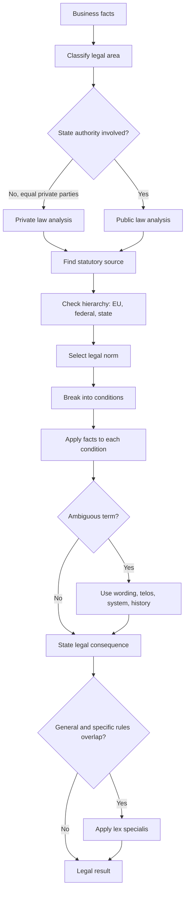
```mermaid
flowchart TD
    Facts[Business facts] --> Classify[Classify legal area]
    Classify --> PublicCheck{State authority involved?}
    PublicCheck -->|Yes| PublicLaw[Public law analysis]
    PublicCheck -->|No, equal private parties| PrivateLaw[Private law analysis]

    PrivateLaw --> SourceCheck[Find statutory source]
    PublicLaw --> SourceCheck
    SourceCheck --> HierarchyCheck[Check hierarchy: EU, federal, state]
    HierarchyCheck --> Norm[Select legal norm]
    Norm --> Elements[Break into conditions]
    Elements --> Apply[Apply facts to each condition]
    Apply --> Interpret{Ambiguous term?}
    Interpret -->|Yes| Lenses[Use wording, telos, system, history]
    Interpret -->|No| Consequence[State legal consequence]
    Lenses --> Consequence
    Consequence --> LexCheck{General and specific rules overlap?}
    LexCheck -->|Yes| Lex[Apply lex specialis]
    LexCheck -->|No| Result[Legal result]
    Lex --> Result
```

## Contract Law Decision View

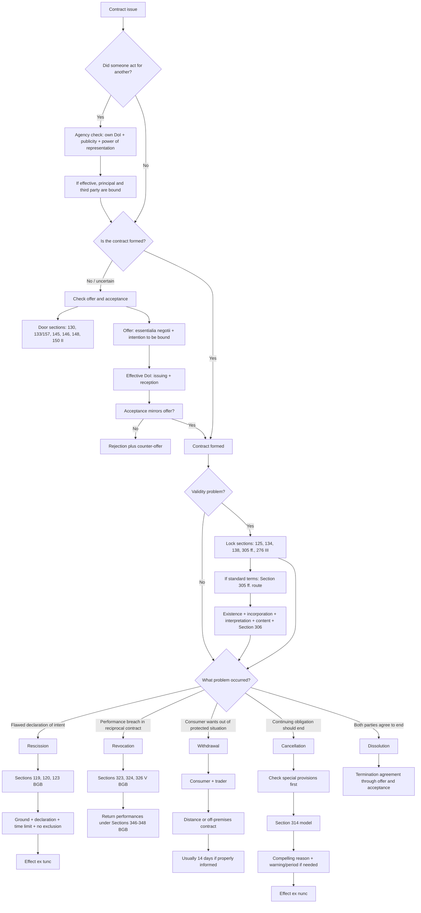
```mermaid
flowchart TD
    Start[Contract issue] --> AgencyQuestion{Did someone act for another?}
    AgencyQuestion -->|Yes| AgencyCheck[Agency check: own DoI + publicity + power of representation]
    AgencyCheck --> AgencyResult[If effective, principal and third party are bound]
    AgencyResult --> FormationQuestion{Is the contract formed?}
    AgencyQuestion -->|No| FormationQuestion
    FormationQuestion -->|No / uncertain| Formation[Check offer and acceptance]
    Formation --> DoorSections[Door sections: 130, 133/157, 145, 146, 148, 150 II]
    Formation --> OfferCheck[Offer: essentialia negotii + intention to be bound]
    OfferCheck --> ReceptionCheck[Effective DoI: issuing + reception]
    ReceptionCheck --> AcceptanceCheck[Acceptance mirrors offer?]
    AcceptanceCheck -->|No| CounterOffer[Rejection plus counter-offer]
    AcceptanceCheck -->|Yes| ValidContract[Contract formed]

    FormationQuestion -->|Yes| ValidContract
    ValidContract --> ValidityCheck{Validity problem?}
    ValidityCheck -->|Yes| LockSections[Lock sections: 125, 134, 138, 305 ff., 276 III]
    ValidityCheck -->|No| ProblemType{What problem occurred?}
    LockSections --> SBTCheck[If standard terms: Section 305 ff. route]
    SBTCheck --> SBTSteps[Existence + incorporation + interpretation + content + Section 306]
    SBTSteps --> ProblemType
    LockSections --> ProblemType

    ProblemType -->|Flawed declaration of intent| Rescission[Rescission]
    Rescission --> Grounds119123[Sections 119, 120, 123 BGB]
    Grounds119123 --> RescissionSteps[Ground + declaration + time limit + no exclusion]
    RescissionSteps --> ExTunc[Effect ex tunc]

    ProblemType -->|Performance breach in reciprocal contract| Revocation[Revocation]
    Revocation --> S323324326[Sections 323, 324, 326 V BGB]
    S323324326 --> Restitution[Return performances under Sections 346-348 BGB]

    ProblemType -->|Consumer wants out of protected situation| Withdrawal[Withdrawal]
    Withdrawal --> ConsumerScope[Consumer + trader]
    ConsumerScope --> DistancePremises[Distance or off-premises contract]
    DistancePremises --> WithdrawalPeriod[Usually 14 days if properly informed]

    ProblemType -->|Continuing obligation should end| Cancellation[Cancellation]
    Cancellation --> SpecialRules[Check special provisions first]
    SpecialRules --> S314[Section 314 model]
    S314 --> Compelling[Compelling reason + warning/period if needed]
    Compelling --> ExNunc[Effect ex nunc]

    ProblemType -->|Both parties agree to end| Dissolution[Dissolution]
    Dissolution --> Agreement[Termination agreement through offer and acceptance]
```

## Warranty And Property Decision View

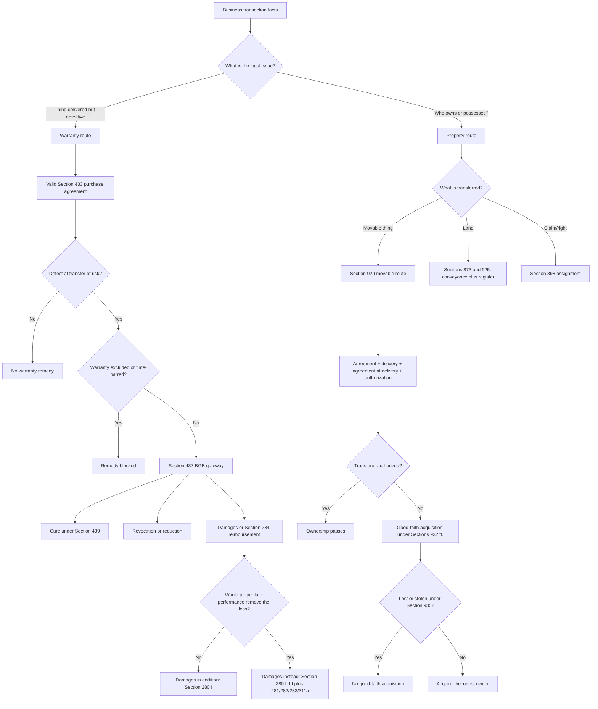
```mermaid
flowchart TD
    Start[Business transaction facts] --> Issue{What is the legal issue?}
    Issue -->|Thing delivered but defective| Warranty[Warranty route]
    Issue -->|Who owns or possesses? | Property[Property route]

    Warranty --> Purchase[Valid Section 433 purchase agreement]
    Purchase --> Defect{Defect at transfer of risk?}
    Defect -->|No| NoWarranty[No warranty remedy]
    Defect -->|Yes| Exclusion{Warranty excluded or time-barred?}
    Exclusion -->|Yes| Blocked[Remedy blocked]
    Exclusion -->|No| Remedy[Section 437 BGB gateway]
    Remedy --> CureRoute[Cure under Section 439]
    Remedy --> RevokeReduce[Revocation or reduction]
    Remedy --> Money[Damages or Section 284 reimbursement]
    Money --> DamageClass{Would proper late performance remove the loss?}
    DamageClass -->|No| AddPerf[Damages in addition: Section 280 I]
    DamageClass -->|Yes| InsteadPerf[Damages instead: Section 280 I, III plus 281/282/283/311a]

    Property --> Object{What is transferred?}
    Object -->|Movable thing| Movable[Section 929 movable route]
    Movable --> MoveReq[Agreement + delivery + agreement at delivery + authorization]
    MoveReq --> AuthCheck{Transferor authorized?}
    AuthCheck -->|Yes| OwnerPasses[Ownership passes]
    AuthCheck -->|No| GF[Good-faith acquisition under Sections 932 ff.]
    GF --> Lost{Lost or stolen under Section 935?}
    Lost -->|Yes| NoAcquire[No good-faith acquisition]
    Lost -->|No| Acquire[Acquirer becomes owner]
    Object -->|Land| Land[Sections 873 and 925: conveyance plus register]
    Object -->|Claim/right| Claim[Section 398 assignment]
```

## Trade And Company Law Decision View

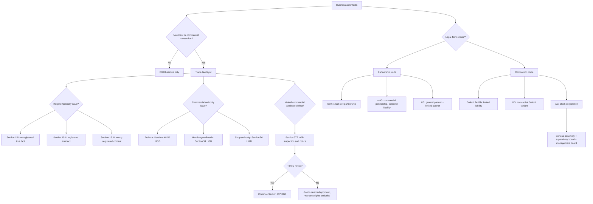
```mermaid
flowchart TD
    Facts[Business actor facts] --> HGB{Merchant or commercial transaction?}
    HGB -->|No| BGBOnly[BGB baseline only]
    HGB -->|Yes| Trade[Trade-law layer]

    Trade --> Register{Register/publicity issue?}
    Register --> S15I[Section 15 I: unregistered true fact]
    Register --> S15II[Section 15 II: registered true fact]
    Register --> S15III[Section 15 III: wrong registered content]

    Trade --> Authority{Commercial authority issue?}
    Authority --> ProkuraRoute[Prokura: Sections 48-50 HGB]
    Authority --> HVMRoute[Handlungsvollmacht: Section 54 HGB]
    Authority --> ShopRoute[Shop authority: Section 56 HGB]

    Trade --> Defect{Mutual commercial purchase defect?}
    Defect --> S377[Section 377 HGB inspection and notice]
    S377 --> Timely{Timely notice?}
    Timely -->|Yes| WarrantyBGB[Continue Section 437 BGB]
    Timely -->|No| Approved[Goods deemed approved, warranty rights excluded]

    Facts --> Form{Legal-form choice?}
    Form --> Partnership[Partnership route]
    Form --> Corporation[Corporation route]
    Partnership --> GbRRoute[GbR: small civil partnership]
    Partnership --> OHGRoute[oHG: commercial partnership, personal liability]
    Partnership --> KGRoute[KG: general partner + limited partner]
    Corporation --> GmbHRoute[GmbH: flexible limited liability]
    Corporation --> UGRoute[UG: low-capital GmbH variant]
    Corporation --> AGRoute[AG: stock corporation]
    AGRoute --> Dual[General assembly + supervisory board + management board]
```

## Subject Graph Index

| Subject / Deck | Wiki Note | Main Visual Logic | Last Updated |
|---|---|---|---|
| Week 01-02 Introduction To Business Law | `week-01-02-introduction-to-business-law/week-01-02-introduction-to-business-law.md` | Legal system map: sources, hierarchy, public/private classification, BGB method | 2026-07-09 |
| Week 03 Contract Law I | `week-03-contract-law-i/week-03-contract-law-i.md` | Contract formation and validity sections: door and lock memory map | 2026-07-09 |
| Week 04 Contract Law II | `week-04-contract-law-ii-rescission-revocation/week-04-contract-law-ii-rescission-revocation.md` | Exit routes: emergency exit for rescission and return desk for revocation | 2026-07-09 |
| Week 05 Contract Law III | `week-05-contract-law-iii-withdrawal-cancellation-dissolution/week-05-contract-law-iii-withdrawal-cancellation-dissolution.md` | Termination II: withdrawal, cancellation, dissolution, and full termination decision tree | 2026-07-09 |
| Week 06 Standard Business Terms | `week-06-standard-business-terms/week-06-standard-business-terms.md` | SBT case route: existence, incorporation, interpretation, content control, and Section 306 consequences | 2026-07-09 |
| Week 07 Agency | `week-07-agency/week-07-agency.md` | Agency triangle: principal, agent, third party, authority, ratification, liability, and principal-agent problem | 2026-07-09 |
| Week 08 Warranty Rights I | `week-08-warranty-rights-i/week-08-warranty-rights-i.md` | Defective purchase route: defect at transfer of risk, exclusions, cure, revocation, reduction, damages gateway | 2026-07-09 |
| Week 09 Warranty Rights II | `week-09-warranty-rights-ii/week-09-warranty-rights-ii.md` | Damages router: damages in addition versus instead of performance, Section 280 routes, Section 284, work contracts | 2026-07-09 |
| Week 10 Transfer Of Property | `week-10-transfer-of-property/week-10-transfer-of-property.md` | Property transfer router: ownership versus possession, separation/abstraction, movable transfer, good-faith acquisition, land, claims | 2026-06-28 |
| Week 11 Trade Law | `week-11-trade-law/week-11-trade-law.md` | HGB layer router: merchant status, commercial register publicity, Prokura/Handlungsvollmacht, commercial silence, Section 377 notice | 2026-07-09 |
| Week 12-13 Company Law I And II | `week-12-13-company-law-i-ii/week-12-13-company-law-i-ii.md` | Legal-form router: partnerships, corporations, GmbH, UG, AG, corporate governance | 2026-07-08 |
| Example Exam I Case Facts | `example-exam-i-case-facts/example-exam-i-case-facts.md` | Exam integration router: GmbH representation, Prokura internal limits, formation, deceit rescission, theory checks | 2026-07-08 |
| Example Exam II Case Facts | `example-exam-ii-case-facts/example-exam-ii-case-facts.md` | Exam integration router: warranty damages, Section 377 HGB, SBT referral clause, amended acceptance, rescission versus revocation | 2026-07-09 |
| Additional Mock Exams And External Cheat Sheet | `additional-mock-exams-and-external-cheatsheet/additional-mock-exams-and-external-cheatsheet.md` | Added exam-practice router: WS24/25 wine-label case, SS22 minor/IPL/GDPR/tort coverage gaps, external cheat-sheet route compression | 2026-07-22 |
| Exam Strategy And Answer Schemas 2026-07-28 | `exam-strategy-answer-schemas-2026-07-28/exam-strategy-answer-schemas-2026-07-28.md` | Six-day exam operating plan, legal-opinion schema, theory-answer schema, route checklist, open-book paper setup | 2026-07-22 |
| Mock And Example Exam Schema Answers | `example-exam-i-case-facts/example-exam-i-case-facts.md`; `example-exam-ii-case-facts/example-exam-ii-case-facts.md`; `additional-mock-exams-and-external-cheatsheet/additional-mock-exams-and-external-cheatsheet.md` | Schema-tailored model answers for official example exams, WS24/25 mock, and SS22 historical exam, with grading nuances and route traps | 2026-07-22 |

## Supporting Node Reference

| Node | Meaning | Source Note |
|---|---|---|
| Business Law | Legal fields relevant for business decisions | `week-01-02-introduction-to-business-law/week-01-02-introduction-to-business-law.md` |
| Law | Binding and enforceable norms | `week-01-02-introduction-to-business-law/week-01-02-introduction-to-business-law.md` |
| Statutory Law | Written legal rules such as BGB, HGB, AktG, GmbHG | `week-01-02-introduction-to-business-law/week-01-02-introduction-to-business-law.md` |
| Case Law | Court decisions interpreting legal rules | `week-01-02-introduction-to-business-law/week-01-02-introduction-to-business-law.md` |
| Civil Law System | Statutes as primary foundation | `week-01-02-introduction-to-business-law/week-01-02-introduction-to-business-law.md` |
| Common Law System | Precedent as stronger formal foundation | `week-01-02-introduction-to-business-law/week-01-02-introduction-to-business-law.md` |
| EU Law | Supranational legal order with primacy where applicable | `week-01-02-introduction-to-business-law/week-01-02-introduction-to-business-law.md` |
| Regulation | Directly applicable EU secondary law | `week-01-02-introduction-to-business-law/week-01-02-introduction-to-business-law.md` |
| Directive | EU secondary law requiring national transposition | `week-01-02-introduction-to-business-law/week-01-02-introduction-to-business-law.md` |
| Public Law | Law involving state authority or subordination | `week-01-02-introduction-to-business-law/week-01-02-introduction-to-business-law.md` |
| Private Law | Law between equal private actors | `week-01-02-introduction-to-business-law/week-01-02-introduction-to-business-law.md` |
| BGB Structure | Five-book structure with general and specific rules | `week-01-02-introduction-to-business-law/week-01-02-introduction-to-business-law.md` |
| Bracketing Technique | General rules apply across more specific books/chapters | `week-01-02-introduction-to-business-law/week-01-02-introduction-to-business-law.md` |
| Lex Specialis | Specific rule prevails over general rule | `week-01-02-introduction-to-business-law/week-01-02-introduction-to-business-law.md` |
| Conditions / Legal Consequence | If-then structure of legal norms | `week-01-02-introduction-to-business-law/week-01-02-introduction-to-business-law.md` |
| Statutory Interpretation | Wording, purpose, system, and history | `week-01-02-introduction-to-business-law/week-01-02-introduction-to-business-law.md` |
| Declaration of Intent | External expression of will aimed at legal consequence | `week-03-contract-law-i/week-03-contract-law-i.md` |
| Offer | DoI enabling contract conclusion by acceptance alone | `week-03-contract-law-i/week-03-contract-law-i.md` |
| Acceptance | Agreement with the offer | `week-03-contract-law-i/week-03-contract-law-i.md` |
| Private Autonomy | Freedom to shape contractual relations | `week-03-contract-law-i/week-03-contract-law-i.md` |
| Door sections | Formation anchors: receipt, interpretation, offer, expiry, deadline, modified acceptance | `week-03-contract-law-i/week-03-contract-law-i.md` |
| Lock sections | Validity anchors: form, prohibition, public policy, standard terms, intentional liability | `week-03-contract-law-i/week-03-contract-law-i.md` |
| Rescission | Right to eradicate a flawed DoI | `week-04-contract-law-ii-rescission-revocation/week-04-contract-law-ii-rescission-revocation.md` |
| Revocation | Right to undo a valid reciprocal contract due to performance problem | `week-04-contract-law-ii-rescission-revocation/week-04-contract-law-ii-rescission-revocation.md` |
| Emergency exit sections | Rescission anchors: mistake, deceit/duress, declaration, timing, exclusion, effects | `week-04-contract-law-ii-rescission-revocation/week-04-contract-law-ii-rescission-revocation.md` |
| Return desk sections | Revocation anchors: breach routes, declaration, restitution, damages | `week-04-contract-law-ii-rescission-revocation/week-04-contract-law-ii-rescission-revocation.md` |
| Withdrawal | Consumer-protection exit right | `week-05-contract-law-iii-withdrawal-cancellation-dissolution/week-05-contract-law-iii-withdrawal-cancellation-dissolution.md` |
| Cancellation | Termination of continuing obligation | `week-05-contract-law-iii-withdrawal-cancellation-dissolution/week-05-contract-law-iii-withdrawal-cancellation-dissolution.md` |
| Dissolution | Consensual termination agreement | `week-05-contract-law-iii-withdrawal-cancellation-dissolution/week-05-contract-law-iii-withdrawal-cancellation-dissolution.md` |
| Standard Business Terms | Pre-formulated contract terms presented by one party for repeated use | `week-06-standard-business-terms/week-06-standard-business-terms.md` |
| User of SBT | Party introducing the pre-formulated clause | `week-06-standard-business-terms/week-06-standard-business-terms.md` |
| Individual Agreement | Truly negotiated clause outside SBT status | `week-06-standard-business-terms/week-06-standard-business-terms.md` |
| Incorporation Control | Whether SBT became part of the contract | `week-06-standard-business-terms/week-06-standard-business-terms.md` |
| Surprising Clause | Unexpected SBT clause that is not incorporated | `week-06-standard-business-terms/week-06-standard-business-terms.md` |
| Contra Proferentem | Ambiguity interpreted against the SBT user | `week-06-standard-business-terms/week-06-standard-business-terms.md` |
| Content Control | Validity review under Sections 307-309 BGB | `week-06-standard-business-terms/week-06-standard-business-terms.md` |
| Section 306 Consequence | Failed clause drops out; contract usually survives and statutory law fills the gap | `week-06-standard-business-terms/week-06-standard-business-terms.md` |
| Principal | Person for whom an agent's declaration should create legal effect | `week-07-agency/week-07-agency.md` |
| Agent | Person making an own declaration in the principal's name within power of representation | `week-07-agency/week-07-agency.md` |
| Third Party | Outside contract partner dealing with the agent | `week-07-agency/week-07-agency.md` |
| Power of Representation | External authority to bind the principal | `week-07-agency/week-07-agency.md` |
| Internal Relationship | Principal-agent relationship defining what the agent may do | `week-07-agency/week-07-agency.md` |
| Unauthorized Agent | Person acting as agent without power of representation | `week-07-agency/week-07-agency.md` |
| Ratification | Principal's later approval of an unauthorized transaction | `week-07-agency/week-07-agency.md` |
| Principal-Agent Problem | Information asymmetry and self-interest risk between principal and agent | `week-07-agency/week-07-agency.md` |
| Warranty Rights | Buyer remedies for defective purchase performance after defect at transfer of risk | `week-08-warranty-rights-i/week-08-warranty-rights-i.md` |
| Material Defect | Deviation between actual and required condition of the thing | `week-08-warranty-rights-i/week-08-warranty-rights-i.md` |
| Legal Defect | Third party right burdening the purchased thing | `week-08-warranty-rights-i/week-08-warranty-rights-i.md` |
| Transfer of Risk | Timing point for asking whether warranty law applies, usually delivery under Section 446 BGB | `week-08-warranty-rights-i/week-08-warranty-rights-i.md` |
| Cure | Primary buyer remedy: repair or replacement under Section 439 BGB | `week-08-warranty-rights-i/week-08-warranty-rights-i.md` |
| Reduction | Price adjustment for keeping defective goods under Section 441 BGB | `week-08-warranty-rights-i/week-08-warranty-rights-i.md` |
| Damages In Addition To Performance | Loss that remains even if proper performance is later rendered | `week-09-warranty-rights-ii/week-09-warranty-rights-ii.md` |
| Damages Instead Of Performance | Loss replacing the missing/defective performance | `week-09-warranty-rights-ii/week-09-warranty-rights-ii.md` |
| Responsibility | Intent, negligence, guarantee, or attributed helper fault required for damages | `week-09-warranty-rights-ii/week-09-warranty-rights-ii.md` |
| Futile Expenses | Reliance expenses reimbursed under Section 284 BGB instead of damages in lieu | `week-09-warranty-rights-ii/week-09-warranty-rights-ii.md` |
| Work Warranty Rights | Defective-work remedies under Section 634 BGB | `week-09-warranty-rights-ii/week-09-warranty-rights-ii.md` |
| Ownership | Legal right to use, dispose of, and exclude others from a thing | `week-10-transfer-of-property/week-10-transfer-of-property.md` |
| Possession | Actual control over a thing, independent of ownership | `week-10-transfer-of-property/week-10-transfer-of-property.md` |
| Separation Principle | Obligation contract and disposition transaction are distinct | `week-10-transfer-of-property/week-10-transfer-of-property.md` |
| Abstraction Principle | Validity of obligation and disposition transactions is assessed independently | `week-10-transfer-of-property/week-10-transfer-of-property.md` |
| Movable Transfer | Transfer of movable ownership by agreement, delivery, continuing agreement, and authorization | `week-10-transfer-of-property/week-10-transfer-of-property.md` |
| Good-Faith Acquisition | Ownership acquisition from non-owner when possession creates legal appearance and Section 935 does not block | `week-10-transfer-of-property/week-10-transfer-of-property.md` |
| Assignment | Transfer of a claim under Section 398 BGB | `week-10-transfer-of-property/week-10-transfer-of-property.md` |
| Trade Law | HGB special private-law layer for merchants | `week-11-trade-law/week-11-trade-law.md` |
| Merchant Status | Gateway for applying HGB rules | `week-11-trade-law/week-11-trade-law.md` |
| Commercial Register | Public register for commerce-relevant facts | `week-11-trade-law/week-11-trade-law.md` |
| Section 15 HGB Publicity | Good-faith reliance rules around registered, unregistered, or wrongly registered facts | `week-11-trade-law/week-11-trade-law.md` |
| Prokura | Broad legally regulated commercial power of representation | `week-11-trade-law/week-11-trade-law.md` |
| Limited Commercial Authority | Handlungsvollmacht; non-Prokura commercial authority for usual business transactions | `week-11-trade-law/week-11-trade-law.md` |
| Shop Assistant Authority | Section 56 HGB appearance-based authority for customary public-store transactions | `week-11-trade-law/week-11-trade-law.md` |
| Commercial Silence | HGB exception where silence can accept or confirm contract content | `week-11-trade-law/week-11-trade-law.md` |
| Section 377 HGB Notice | Mutual-commercial-purchase inspection and notification duty | `week-11-trade-law/week-11-trade-law.md` |
| Choice Of Legal Form | Decision matching liability, capital, governance, tax, financing, disclosure, and reputation | `week-12-13-company-law-i-ii/week-12-13-company-law-i-ii.md` |
| Partnership | Person-centered business association such as GbR, oHG, or KG | `week-12-13-company-law-i-ii/week-12-13-company-law-i-ii.md` |
| Corporation | Entity-centered legal form such as GmbH, UG, or AG | `week-12-13-company-law-i-ii/week-12-13-company-law-i-ii.md` |
| GbR | Basic civil-law partnership for small joint endeavors | `week-12-13-company-law-i-ii/week-12-13-company-law-i-ii.md` |
| oHG | Commercial general partnership with personal partner liability | `week-12-13-company-law-i-ii/week-12-13-company-law-i-ii.md` |
| KG | Limited partnership with general partner and limited partner | `week-12-13-company-law-i-ii/week-12-13-company-law-i-ii.md` |
| GmbH | Limited liability company and main SME corporation form | `week-12-13-company-law-i-ii/week-12-13-company-law-i-ii.md` |
| UG | Low-capital entrepreneurial company, a mini-GmbH variant | `week-12-13-company-law-i-ii/week-12-13-company-law-i-ii.md` |
| AG | Stock corporation with dualistic governance | `week-12-13-company-law-i-ii/week-12-13-company-law-i-ii.md` |
| Corporate Governance | Management and supervision system responding to principal-agent risks | `week-12-13-company-law-i-ii/week-12-13-company-law-i-ii.md` |
| Example Exam I | Integrated practice source for representation, Prokura, rescission, and theory routing | `example-exam-i-case-facts/example-exam-i-case-facts.md` |
| Example Exam II | Integrated practice source for warranty damages, SBT, Section 377 HGB, and theory routing | `example-exam-ii-case-facts/example-exam-ii-case-facts.md` |
| Defective printer damages | Example Exam II case route for damage to table, laptop, and carpet | `example-exam-ii-case-facts/example-exam-ii-case-facts.md` |
| SBT referral clause | Example Exam II clause routing defect claims to a third-party software manufacturer | `example-exam-ii-case-facts/example-exam-ii-case-facts.md` |
| Additional Mock Exams | Added exam-practice source combining WS24/25 mock, SS22 historical exam, and external cheat sheet | `additional-mock-exams-and-external-cheatsheet/additional-mock-exams-and-external-cheatsheet.md` |
| WS24/25 Mock | Near-current mock with avoidance, agency, SBT, company law, and bistro wine-label warranty routes | `additional-mock-exams-and-external-cheatsheet/additional-mock-exams-and-external-cheatsheet.md` |
| SS22 Historical Exam | Historical coverage signal for minors, IPL, GDPR personal data, business associations, and tort damages | `additional-mock-exams-and-external-cheatsheet/additional-mock-exams-and-external-cheatsheet.md` |
| Minor capacity route | Limited-capacity contract analysis using consent, Section 110, approval, and restitution | `additional-mock-exams-and-external-cheatsheet/additional-mock-exams-and-external-cheatsheet.md` |
| IPL and personal data | Historical theory cluster covering Rome I, Rome II, overriding mandatory provisions, and GDPR personal data | `additional-mock-exams-and-external-cheatsheet/additional-mock-exams-and-external-cheatsheet.md` |
| Tort damages | Non-contractual protected-right injury route for assault and medical costs | `additional-mock-exams-and-external-cheatsheet/additional-mock-exams-and-external-cheatsheet.md` |
| Exam strategy pack | Printable schema and six-day plan for the 2026-07-28 Business Law exam | `exam-strategy-answer-schemas-2026-07-28/exam-strategy-answer-schemas-2026-07-28.md` |
| Legal-opinion schema | Case-writing form: issue sentence, requirements, application, interim result, final answer | `exam-strategy-answer-schemas-2026-07-28/exam-strategy-answer-schemas-2026-07-28.md` |
| Theory-answer schema | Short-answer form: definition, anchor, features, example, consequence or trap | `exam-strategy-answer-schemas-2026-07-28/exam-strategy-answer-schemas-2026-07-28.md` |
| Open-book paper pack | Selected printed schemas, statute index, tabs, and mock issue maps for fast navigation | `exam-strategy-answer-schemas-2026-07-28/exam-strategy-answer-schemas-2026-07-28.md` |
| Schema-tailored mock answers | Revised example/mock answer blocks using legal-opinion and theory schemas | `example-exam-i-case-facts/example-exam-i-case-facts.md`; `example-exam-ii-case-facts/example-exam-ii-case-facts.md`; `additional-mock-exams-and-external-cheatsheet/additional-mock-exams-and-external-cheatsheet.md` |

## Supporting Edge Reference

| From | Relationship | To | Source Note |
|---|---|---|---|
| Business Law | is built from | Civil Law / Commercial Law / Company Law | `week-01-02-introduction-to-business-law/week-01-02-introduction-to-business-law.md` |
| Law | differs from | Morality / Rechtsgefühl | `week-01-02-introduction-to-business-law/week-01-02-introduction-to-business-law.md` |
| Civil Law System | prioritizes | Statutory Law | `week-01-02-introduction-to-business-law/week-01-02-introduction-to-business-law.md` |
| Case Law | interprets | Statutory Law | `week-01-02-introduction-to-business-law/week-01-02-introduction-to-business-law.md` |
| EU Law | can override | National Law | `week-01-02-introduction-to-business-law/week-01-02-introduction-to-business-law.md` |
| Federal Law | prevails over | State Law | `week-01-02-introduction-to-business-law/week-01-02-introduction-to-business-law.md` |
| Regulation | creates | Uniform EU Rules | `week-01-02-introduction-to-business-law/week-01-02-introduction-to-business-law.md` |
| Directive | requires | National Transposition | `week-01-02-introduction-to-business-law/week-01-02-introduction-to-business-law.md` |
| Public Law | involves | State Authority | `week-01-02-introduction-to-business-law/week-01-02-introduction-to-business-law.md` |
| Private Law | relies on | Private Autonomy | `week-01-02-introduction-to-business-law/week-01-02-introduction-to-business-law.md` |
| BGB Structure | uses | Bracketing Technique | `week-01-02-introduction-to-business-law/week-01-02-introduction-to-business-law.md` |
| Lex Specialis | resolves conflict between | General Rule and Specific Rule | `week-01-02-introduction-to-business-law/week-01-02-introduction-to-business-law.md` |
| Legal Norm | contains | Conditions / Legal Consequence | `week-01-02-introduction-to-business-law/week-01-02-introduction-to-business-law.md` |
| Statutory Interpretation | clarifies | Ambiguous Legal Terms | `week-01-02-introduction-to-business-law/week-01-02-introduction-to-business-law.md` |
| Contract | requires | Offer and Acceptance | `week-03-contract-law-i/week-03-contract-law-i.md` |
| Offer | must include | Essentialia Negotii | `week-03-contract-law-i/week-03-contract-law-i.md` |
| Acceptance | must mirror | Offer | `week-03-contract-law-i/week-03-contract-law-i.md` |
| Private Autonomy | is limited by | Sections 134 and 138 BGB | `week-03-contract-law-i/week-03-contract-law-i.md` |
| Contract formation | is routed through | Door sections | `week-03-contract-law-i/week-03-contract-law-i.md` |
| Contract validity | is tested by | Lock sections | `week-03-contract-law-i/week-03-contract-law-i.md` |
| Rescission | attacks | Declaration of Intent | `week-04-contract-law-ii-rescission-revocation/week-04-contract-law-ii-rescission-revocation.md` |
| Rescission | is routed through | Emergency exit sections | `week-04-contract-law-ii-rescission-revocation/week-04-contract-law-ii-rescission-revocation.md` |
| Revocation | responds to | Performance Problem | `week-04-contract-law-ii-rescission-revocation/week-04-contract-law-ii-rescission-revocation.md` |
| Revocation | is routed through | Return desk sections | `week-04-contract-law-ii-rescission-revocation/week-04-contract-law-ii-rescission-revocation.md` |
| Withdrawal | protects | Consumer | `week-05-contract-law-iii-withdrawal-cancellation-dissolution/week-05-contract-law-iii-withdrawal-cancellation-dissolution.md` |
| Cancellation | applies to | Continuing Obligation | `week-05-contract-law-iii-withdrawal-cancellation-dissolution/week-05-contract-law-iii-withdrawal-cancellation-dissolution.md` |
| Dissolution | requires | Agreement | `week-05-contract-law-iii-withdrawal-cancellation-dissolution/week-05-contract-law-iii-withdrawal-cancellation-dissolution.md` |
| Standard Business Terms | are introduced by | User of SBT | `week-06-standard-business-terms/week-06-standard-business-terms.md` |
| Standard Business Terms | require first | Contract formation | `week-06-standard-business-terms/week-06-standard-business-terms.md` |
| Individual Agreement | defeats | Standard Business Terms | `week-06-standard-business-terms/week-06-standard-business-terms.md` |
| Incorporation Control | filters | Surprising Clause | `week-06-standard-business-terms/week-06-standard-business-terms.md` |
| Contra Proferentem | allocates ambiguity risk to | User of SBT | `week-06-standard-business-terms/week-06-standard-business-terms.md` |
| Content Control | tests | Standard Business Terms | `week-06-standard-business-terms/week-06-standard-business-terms.md` |
| Invalid SBT clause | triggers | Section 306 Consequence | `week-06-standard-business-terms/week-06-standard-business-terms.md` |
| Agent | acts on behalf of | Principal | `week-07-agency/week-07-agency.md` |
| Agent | declares to | Third Party | `week-07-agency/week-07-agency.md` |
| Effective agency | binds directly | Principal and Third Party | `week-07-agency/week-07-agency.md` |
| Power of Representation | defines external | Can do | `week-07-agency/week-07-agency.md` |
| Internal Relationship | defines internal | May do | `week-07-agency/week-07-agency.md` |
| Unauthorized Agent | creates | Ratification question | `week-07-agency/week-07-agency.md` |
| Refused ratification | can trigger | Agent liability | `week-07-agency/week-07-agency.md` |
| Information asymmetry | creates | Principal-Agent Problem | `week-07-agency/week-07-agency.md` |
| Purchase Agreement | creates duty to deliver | Defect-free thing | `week-08-warranty-rights-i/week-08-warranty-rights-i.md` |
| Defect at Transfer of Risk | triggers | Warranty Rights | `week-08-warranty-rights-i/week-08-warranty-rights-i.md` |
| Material Defect | is tested under | Section 434 BGB | `week-08-warranty-rights-i/week-08-warranty-rights-i.md` |
| Legal Defect | is tested under | Section 435 BGB | `week-08-warranty-rights-i/week-08-warranty-rights-i.md` |
| Warranty Rights | are routed through | Section 437 BGB | `week-08-warranty-rights-i/week-08-warranty-rights-i.md` |
| Cure | usually precedes | Revocation / reduction / damages | `week-08-warranty-rights-i/week-08-warranty-rights-i.md` |
| Buyer Knowledge | can exclude | Warranty Rights | `week-08-warranty-rights-i/week-08-warranty-rights-i.md` |
| Merchant's Late Notice | can deem | Goods approved | `week-08-warranty-rights-i/week-08-warranty-rights-i.md` |
| Damages Type | determines | Section 280 route | `week-09-warranty-rights-ii/week-09-warranty-rights-ii.md` |
| Damages In Addition To Performance | usually use | Section 280 I BGB | `week-09-warranty-rights-ii/week-09-warranty-rights-ii.md` |
| Damages Instead Of Performance | require | Section 280 III plus 281/282/283/311a BGB | `week-09-warranty-rights-ii/week-09-warranty-rights-ii.md` |
| Responsibility | is presumed by | Section 280 I 2 BGB | `week-09-warranty-rights-ii/week-09-warranty-rights-ii.md` |
| Futile Expenses | are claimed instead of | Damages in lieu | `week-09-warranty-rights-ii/week-09-warranty-rights-ii.md` |
| Work Warranty Rights | add | Self-help under Section 637 BGB | `week-09-warranty-rights-ii/week-09-warranty-rights-ii.md` |
| Ownership | differs from | Possession | `week-10-transfer-of-property/week-10-transfer-of-property.md` |
| Purchase Agreement | does not itself transfer | Ownership | `week-10-transfer-of-property/week-10-transfer-of-property.md` |
| Separation Principle | distinguishes | Obligation contract and disposition transaction | `week-10-transfer-of-property/week-10-transfer-of-property.md` |
| Abstraction Principle | separates validity of | Purchase agreement and ownership transfer | `week-10-transfer-of-property/week-10-transfer-of-property.md` |
| Movable Transfer | requires | Agreement, delivery, agreement at delivery, authorization | `week-10-transfer-of-property/week-10-transfer-of-property.md` |
| Missing Authorization | can be cured by | Good-faith acquisition | `week-10-transfer-of-property/week-10-transfer-of-property.md` |
| Section 935 BGB | blocks | Good-faith acquisition of lost/stolen things | `week-10-transfer-of-property/week-10-transfer-of-property.md` |
| Land Ownership | requires | Conveyance and land-register entry | `week-10-transfer-of-property/week-10-transfer-of-property.md` |
| Claims | are transferred by | Assignment | `week-10-transfer-of-property/week-10-transfer-of-property.md` |
| Trade Law | modifies | BGB baseline for merchants | `week-11-trade-law/week-11-trade-law.md` |
| Merchant Status | triggers | HGB special layer | `week-11-trade-law/week-11-trade-law.md` |
| Commercial Register | creates | Section 15 HGB publicity effects | `week-11-trade-law/week-11-trade-law.md` |
| Section 15 I HGB | protects reliance on | Register silence | `week-11-trade-law/week-11-trade-law.md` |
| Section 15 II HGB | allows assertion of | Registered and published true facts | `week-11-trade-law/week-11-trade-law.md` |
| Section 15 III HGB | protects reliance on | Wrong positive register content | `week-11-trade-law/week-11-trade-law.md` |
| Prokura | gives | Broad external authority | `week-11-trade-law/week-11-trade-law.md` |
| Internal Prokura Limit | usually does not defeat | Third-party reliance | `week-11-trade-law/week-11-trade-law.md` |
| Limited Commercial Authority | is narrower than | Prokura | `week-11-trade-law/week-11-trade-law.md` |
| Commercial Silence | creates exceptions to | BGB silence baseline | `week-11-trade-law/week-11-trade-law.md` |
| Section 377 HGB Notice | can exclude | Warranty rights | `week-11-trade-law/week-11-trade-law.md` |
| Choice Of Legal Form | depends on | Liability, governance, capital, tax, disclosure, reputation | `week-12-13-company-law-i-ii/week-12-13-company-law-i-ii.md` |
| Partnership | includes | GbR, oHG, KG | `week-12-13-company-law-i-ii/week-12-13-company-law-i-ii.md` |
| Corporation | includes | GmbH, UG, AG | `week-12-13-company-law-i-ii/week-12-13-company-law-i-ii.md` |
| KG | separates | General partner and limited partner | `week-12-13-company-law-i-ii/week-12-13-company-law-i-ii.md` |
| GmbH & Co. KG | uses | GmbH as general partner | `week-12-13-company-law-i-ii/week-12-13-company-law-i-ii.md` |
| GmbH | acts through | Managing director | `week-12-13-company-law-i-ii/week-12-13-company-law-i-ii.md` |
| GmbH | is controlled internally by | Shareholder meeting | `week-12-13-company-law-i-ii/week-12-13-company-law-i-ii.md` |
| AG | uses | Dualistic system | `week-12-13-company-law-i-ii/week-12-13-company-law-i-ii.md` |
| Supervisory Board | appoints and supervises | Management board | `week-12-13-company-law-i-ii/week-12-13-company-law-i-ii.md` |
| Corporate Governance | responds to | Principal-agent problem | `week-12-13-company-law-i-ii/week-12-13-company-law-i-ii.md` |
| Example Exam I | integrates | GmbH representation and Prokura | `example-exam-i-case-facts/example-exam-i-case-facts.md` |
| Example Exam I | integrates | Contract formation and deceit rescission | `example-exam-i-case-facts/example-exam-i-case-facts.md` |
| Example Exam I | tests | Legal-form suitability and Section 280 damages | `example-exam-i-case-facts/example-exam-i-case-facts.md` |
| Example Exam II | integrates | Warranty damages and Section 377 HGB notice | `example-exam-ii-case-facts/example-exam-ii-case-facts.md` |
| Example Exam II | integrates | SBT content control and Section 309 No. 8 b aa BGB | `example-exam-ii-case-facts/example-exam-ii-case-facts.md` |
| Example Exam II | tests | Works contract, culpa in contrahendo, Section 150 II, Section 145, rescission versus revocation | `example-exam-ii-case-facts/example-exam-ii-case-facts.md` |
| Additional Mock Exams | integrate | WS24/25 mock and SS22 historical exam | `additional-mock-exams-and-external-cheatsheet/additional-mock-exams-and-external-cheatsheet.md` |
| WS24/25 Mock | tests | Avoidance, agency, SBT, company law, and warranty/merchant routing | `additional-mock-exams-and-external-cheatsheet/additional-mock-exams-and-external-cheatsheet.md` |
| Bistro wine-label case | splits by | Consumer/trader purpose | `additional-mock-exams-and-external-cheatsheet/additional-mock-exams-and-external-cheatsheet.md` |
| Bistro GmbH modification | triggers | Section 377 HGB notice filter | `additional-mock-exams-and-external-cheatsheet/additional-mock-exams-and-external-cheatsheet.md` |
| SS22 Historical Exam | tests | Minor capacity, IPL, GDPR personal data, and tort damages | `additional-mock-exams-and-external-cheatsheet/additional-mock-exams-and-external-cheatsheet.md` |
| External cheat sheet | compresses | Week 01-10 Business Law routes | `additional-mock-exams-and-external-cheatsheet/additional-mock-exams-and-external-cheatsheet.md` |
| Exam strategy pack | contains | Legal-opinion schema and theory-answer schema | `exam-strategy-answer-schemas-2026-07-28/exam-strategy-answer-schemas-2026-07-28.md` |
| Six-day operating plan | sequences | Router repairs, doctrine first passes, and timed mocks | `exam-strategy-answer-schemas-2026-07-28/exam-strategy-answer-schemas-2026-07-28.md` |
| Open-book paper pack | supports | Fast statutory citation and route checking | `exam-strategy-answer-schemas-2026-07-28/exam-strategy-answer-schemas-2026-07-28.md` |
| Schema-tailored mock answers | apply | Legal-opinion schema and theory-answer schema | `example-exam-i-case-facts/example-exam-i-case-facts.md`; `example-exam-ii-case-facts/example-exam-ii-case-facts.md`; `additional-mock-exams-and-external-cheatsheet/additional-mock-exams-and-external-cheatsheet.md` |


<div class="page-break"></div>

# [R8] Business Law Course Logistics

<p class="source-path">Source: <code>business-law/wiki/_course-logistics.md</code></p>

This file preserves administrative and course-organization information separately from legal doctrine notes.

Source files:

- `business-law/raw/Week 1 and 2 - Introduction.pdf`
- `business-law/raw/Statutory Law_12.04.2026.pdf`
- `business-law/raw/moodle-export-business-law-950848572-s26-20260708/13.07. - Example Exam I - Bundrock/Example Exam I Case facts.pdf`
- `business-law/raw/moodle-export-business-law-950848573-s26-20260709/15.4. Introduction I/Introduction I_Slides.pdf`
- `business-law/raw/moodle-export-business-law-950848573-s26-20260709/22.4. Introduction II/Introduction II_Slides.pdf`
- `business-law/raw/moodle-export-business-law-950848573-s26-20260709/1.7. QA_Repetition/Repetition_Slides.pdf`
- `business-law/raw/moodle-export-business-law-950848573-s26-20260709/15.7. Example Exam/Example Exam_Case facts.pdf`
- `business-law/raw/mock-exam-ibl-this-is-the-mock-exam-for-the-winter-2425-semster.pdf`
- `business-law/raw/exam-ss22.pdf`
- `business-law/raw/introduction-to-business-law.pdf`

Do not include this logistics content in Business Law Mermaid diagrams, subject knowledge graphs, or `business-law/wiki/_course-knowledge-graph.md`.

## Contacts

| Role | Name | Contact |
|---|---|---|
| Lecturer | Dr. Gerald Reger | gerald.reger@noerr.com |
| Contact / team | Anne-Kathrin Haag | anne-kathrin.haag@tum.de |

## Materials Workflow

- Moodle has separate courses/materials for lecture and exercise.
- Weekly uploads are provided before the lecture.
- Exercise case facts are uploaded at the beginning of the week; solutions are uploaded at the end of the week.
- Statutory laws/legal texts are the main working tool.
- The statutory law material should be printed/read/marked/understood where needed.
- Session slides provide the weekly lecture structure.
- Exercise case solutions are examples of fully formulated legal cases.

## Standing Legal Reference

Use `business-law/raw/Statutory Law_12.04.2026.pdf` as a standing reference source throughout Business Law.

This file should support legal rule lookup and statutory references in future notes. Do not turn the statutory-law PDF into a standalone conceptual graph unless a specific lecture topic asks for statutory structure or interpretation.

## Suggested Legal Code Links

- German Civil Code: https://www.gesetze-im-internet.de/englisch_bgb/
- Commercial Code: https://www.gesetze-im-internet.de/englisch_hgb/index.html
- Stock Corporation Act: https://www.gesetze-im-internet.de/englisch_aktg/index.html
- Limited Liability Companies Act: https://www.gesetze-im-internet.de/englisch_gmbhg/index.html
- GDPR: https://eur-lex.europa.eu/legal-content/EN/ALL/?uri=CELEX%3A32016R0679
- Rome I Regulation: https://eur-lex.europa.eu/eli/reg/2008/593
- Rome II Regulation: https://eur-lex.europa.eu/legal-content/EN/ALL/?uri=CELEX%3A32007R0864

## Teaching Outline

| Session | Topic |
|---:|---|
| 1 | Introduction to Business Law |
| 2 | Introduction to Business Law |
| 3 | Contract Law I |
| 4 | Contract Law II |
| 5 | Contract Law III |
| 6 | Standard Business Terms |
| 7 | Agency |
| 8 | Warranty Rights I |
| 9 | Warranty Rights II |
| 10 | Transfer of Property |
| 11 | Trade Law |
| 12 | Company Law I |
| 13 | Company Law II |

## Exam Information

- Exam date: **2026-07-28** (user-provided on 2026-06-13).
- Exercise-introduction evidence from `Introduction I_Slides.pdf` states an **open-book exam** format and a **120-minute** duration for both IBL old and BL new.
- Exercise-introduction evidence says the exam will probably contain **2 cases**, possibly with **1 modification**, plus probably **9-10 questions**.
- Repetition guidance from `Repetition_Slides.pdf`: if time is tight, finish the legal-opinion case in shortened form and switch to the theory-question section after about one hour, then return if time remains.
- Mock-exam evidence from `Example Exam I Case facts.pdf`:
  - Case section: 70 points total.
  - Case 1 basic constellation: 35 points, legal-opinion style required.
  - Case 2 modification: 35 points, legal-opinion style required.
  - Theory question section: 30 points total.
  - Theory questions can be answered in conclusive bullet points and/or short sentences; a legal opinion is not required.
- Example Exam II evidence from `Example Exam_Case facts.pdf`:
  - Case section: 70 points total.
  - Basic constellation: 30 points, legal-opinion style required.
  - Modification: 40 points, legal-opinion style required.
  - Theory question section: 30 points total, 5 questions at 6 points each.
  - Theory questions can be answered in conclusive bullet points and/or short sentences; a legal opinion is not required.
- Additional external/historical resources added 2026-07-22:
  - `mock-exam-ibl-this-is-the-mock-exam-for-the-winter-2425-semster.pdf` states 60 points total and 120 minutes. It mixes short-answer theory on avoidance, agency, SBT, and company law with a fully formulated bistro/wine-label case.
  - `exam-ss22.pdf` is a historical exam source with contracts, International Private Law/data protection, business associations, a minor fan-store case, and a tort-damages case. Treat it as coverage-gap radar, not proof that those topics outrank current 2026 materials.
  - `introduction-to-business-law.pdf` is an external/unofficial 31-page cheat-sheet-style resource. Use it for route compression only after checking current course notes and statutory anchors.

Use the exercise-introduction and mock-exam structures for practice routing. The wording remains probabilistic for the final exam where the source uses "probably"; do not treat the exact number of cases/questions as guaranteed unless a later final-exam notice confirms it.

Planning implication: Business Law is the third exam in the current sequence, after Supply Chain Management and Marketing. Preserve legal prerequisite order and overdue repairs, complete pending doctrine coverage before shifting into full-case integration and statute-routing practice, then use the additional external/historical resources as timed diagnostics and coverage-gap checks.


<div class="page-break"></div>

# [W01-02.1] Week 01-02: Introduction To Business Law

<p class="source-path">Source: <code>business-law/wiki/week-01-02-introduction-to-business-law/week-01-02-introduction-to-business-law.md</code></p>

Source: `business-law/raw/Week 1 and 2 - Introduction.pdf`
Additional exercise/method sources processed 2026-07-09:

- `business-law/raw/moodle-export-business-law-950848573-s26-20260709/15.4. Introduction I/Introduction I_Slides.pdf`
- `business-law/raw/moodle-export-business-law-950848573-s26-20260709/22.4. Introduction II/Introduction II_Slides.pdf`
- `business-law/raw/moodle-export-business-law-950848573-s26-20260709/1.7. QA_Repetition/Repetition_Slides.pdf`

Course: Business Law
Processed: 2026-05-14
Wiki note: `business-law/wiki/week-01-02-introduction-to-business-law/week-01-02-introduction-to-business-law.md`

Administrative course information from this deck is preserved separately in `business-law/wiki/_course-logistics.md` and is excluded from this subject note and graphs.

## 80/20 Exam Summary

The high-yield content is the legal system map. If you can explain these six things clearly, you can handle most introductory exam questions and later legal case work:

- Law is binding and enforceable; morality and "what feels fair" may influence law but are not identical to law.
- German business law sits mainly inside private law, especially civil law, commercial law, and company law, but business decisions also touch public law.
- Germany is a civil-law system: statutes are the primary source, while court decisions guide interpretation but are not formally the same as common-law precedent.
- German law operates in a hierarchy: EU law sits above national law where applicable; federal law prevails over conflicting state law under Art. 31 GG.
- The BGB is structured through general and specific rules: the General Part affects later books, and lex specialis means the more specific rule wins over the more general rule.
- Legal application usually means reading a norm as conditions plus legal consequence, then interpreting wording, purpose, system, and history.

## Core Concepts

### Why Business Law Matters

Business law is not only about court disputes. It shapes ordinary business decisions: forming contracts, choosing a company structure, hiring employees, leasing premises, protecting intellectual property, complying with regulation, and negotiating risk allocation.

For management students, the practical goal is not to become a lawyer. The goal is to recognize legal risk early, understand legal reasoning, communicate better with lawyers, and know when a business choice depends on a legal rule.

### What Lawyers Do

Lawyers often work through statutory interpretation and claim analysis:

- Which rules are mandatory?
- Which rules can parties modify by contract?
- What behavior is allowed or prohibited?
- Who has a claim against whom?
- What legal consequence follows if the statutory conditions are satisfied?

In business practice, this appears in contract drafting, company formation, compliance programs, dispute enforcement, negotiation, and risk management.

### Scope Of Business Law

Business law combines several legal fields:

- Civil law: everyday private-law relationships such as rental agreements and purchase agreements, mainly connected to the BGB.
- Commercial law: business-specific rules, mainly connected to the HGB, plus some commercial criminal law topics such as fraud, money laundering, and embezzlement.
- Company law: legal forms and internal rules for companies, including AktG, GmbHG, and HGB.
- International and public commercial law: trade law, competition/cartel law, foreign trade law, administrative rules, and other public-law constraints on business.

The key intuition: business decisions are not purely economic. They are made inside a legal operating system.

## Law, Morality, And Sources Of Law

### Law vs Morality

The deck uses everyday examples to separate morality from legality: refusing to help a friend, lying about pregnancy in a job interview, or bluffing about a competing offer in a business negotiation.

The exam-relevant distinction:

- Morality asks whether conduct is ethically right or wrong.
- Law asks whether a binding, enforceable norm creates legal consequences.
- Some immoral conduct is not illegal.
- Some legal rules deliberately protect behavior that may feel morally complicated.
- Sometimes law refers to social standards or customs, for example good faith in Section 242 BGB.

This matters for legal analysis because an exam answer should not jump from "unfair" to "illegal." You need a legal source and a legal consequence.

### Sources Of Law

Important sources in the deck:

- Written statutory law: BGB, HGB, AktG, GmbHG, and other statutes.
- Unwritten sources: customary law and analogies.
- Case law: especially important for interpretation and practical predictability.
- Privately set rules: standard business terms and contractual rules, subject to legal limits.

High-yield point: German legal reasoning begins with the statute, but it does not stop at the literal text. Courts, system, purpose, and context matter.

## Civil Law vs Common Law

### Civil Law

In civil-law systems, legislation is the foundation. Legal rules are laid down in legal texts and modified through the legislative process. Legal theory, statutory structure, and systematic interpretation are important.

Judges decide cases within the framework of written law. Supreme court decisions are not formally binding on lower courts in the same way as common-law precedent, but they often have strong practical influence because lower courts risk being overruled.

### Common Law

In common-law systems, court decisions have a stronger foundational role. Legal development often happens through case law, and precedents can bind lower courts under stare decisis.

### Systems Are Converging

The deck notes that systems are moving closer together:

- Civil-law systems increasingly treat supreme court reasoning as practically important.
- Common-law systems increasingly use written legislation to increase legal certainty.

Exam trap: do not say civil law has no case law or common law has no statutes. The distinction is about what has primary structural authority.

## German Law And European Law

### German Legal Levels

The deck distinguishes several levels:

- European Union: cross-border commerce, trade, consumer protection, and many business-relevant rules.
- Federal level: most statutory law.
- State level: areas such as education and police matters.
- Cities and municipalities: local matters.

### Hierarchy Of Norms

The important hierarchy is:

- EU law, primary and secondary, where applicable.
- German federal law, including the Basic Law, parliamentary statutes, and federal regulations.
- State law, including state constitutions, statutes, and regulations.

Art. 31 GG is central for the domestic hierarchy: federal law prevails over conflicting state law.

Business implication: before applying a German rule, check whether EU law or federal law changes the answer.

## German Federal Legislative Procedure

The procedure explains how statutes become binding law.

Main institutions:

- Bundestag: federal parliament, directly elected.
- Bundesrat: federal body representing the sixteen Länder.
- Bundesregierung: federal government, Chancellor plus ministers.
- Bundespräsident: federal president, involved at the execution stage.

Typical flow:

1. Initiation: draft legislation can come from the federal government, Bundesrat, parliamentary groups, or 5% of Bundestag members.
2. Parliamentary process: Bundestag readings, committee work, amendment discussion, and adoption by vote.
3. Bundesrat involvement: consent bills can be blocked by Bundesrat; objection bills can be overruled by Bundestag under the relevant procedure.
4. Execution: signing by the responsible minister or Chancellor, authorization by the Federal President, and promulgation in the Federal Law Gazette.

Exam relevance is likely conceptual rather than detail-heavy: know who participates and why Bundesrat matters.

## EU Law

### EU As A Legal Order

The EU is a supranational organization, not a state. It has its own legal order, independent from Member State legal orders, and EU law has primacy where applicable.

Key idea: Member States transfer certain powers to EU institutions, but the EU acts only within conferred competences.

### EU Institutions

Important institutions in the deck:

- European Parliament: directly elected, with legislative, supervisory, and budgetary responsibilities.
- European Council: heads of state or government; defines general political direction and priorities.
- Council of the European Union: represents Member State governments, adopts laws, and coordinates policies.
- European Commission: proposes and enforces legislation, implements policies, and manages the EU budget.

### Primary And Secondary EU Law

Primary law:

- Treaty on the European Union (TEU): general principles, institutions, cooperation, external representation.
- Treaty on the Functioning of the European Union (TFEU): more detailed rules on powers, institutions, responsibilities, and business-relevant freedoms such as free movement of goods, capital, services, and labour, plus freedom of establishment.
- General principles of law.
- Charter of Fundamental Rights of the European Union.

Secondary law under Art. 288 TFEU:

- Regulations.
- Directives.
- Decisions.

### Regulations vs Directives

Regulations:

- Directly applicable in Member States.
- Binding in their entirety.
- Create uniform rules across the EU.

Directives:

- Set common goals.
- Require Member States to transpose them into national law.
- Leave discretion about form and method.
- Aim at harmonisation rather than full uniformity.
- Can sometimes have direct effect and grant individual rights under specific conditions.

Visual intuition from the slides:

- Regulation: many national variants are replaced by one uniform rule.
- Directive: the EU sets a standard; Member States implement it through national law.

Exam trap: a regulation is not merely a recommendation, and a directive is not usually "directly applicable" in the same ordinary sense as a regulation.

## Public Law vs Private Law

### Public Law

Public law governs relationships involving public authority and superordination/subordination. A typical example is an administrative act: the state orders or permits something.

Examples:

- Building permit.
- Tax declaration issue.
- Speeding ticket or regulatory offence.
- Public construction law.

Areas include constitutional law, administrative law, tax law, social law, criminal law, procedural law, and public international law.

### Private Law

Private law governs legal relationships between individual citizens or private parties. It is based on equality of positions, self-determination, and private autonomy.

Examples:

- Business partner refuses to pay for a sold machine.
- Contract dispute.
- Patent infringement between competitors.

Areas include civil law, commercial law, labour law, company law, family law, property law, and succession law.

High-yield decision rule:

- If one party acts with sovereign public authority, think public law.
- If parties face each other as legally equal private actors, think private law.

## Working With German Law

### Structure Of The BGB

The BGB has five books:

| Book | Sections | Core Function |
|---|---:|---|
| Book 1 | Sections 1-240 | General Part: rules applying across later books |
| Book 2 | Sections 241-853 | Law of Obligations: contractual and non-contractual obligations |
| Book 3 | Sections 854-1296 | Property Law: relationships between persons and things/property |
| Book 4 | Sections 1297-1921 | Family Law |
| Book 5 | Sections 1922-2385 | Succession Law |

### Bracketing Technique

The German Civil Code uses general rules that "bracket" more specific areas:

- Book 1 contains general rules that generally apply to later books.
- Book 2 also has a general part that applies to other chapters within the law of obligations.
- More specific provisions modify or displace general provisions where necessary.

This is why legal analysis often requires looking at more than one section. A contract problem may require a specific sales rule, a general obligations rule, and a general declaration-of-intent rule.

### Lex Specialis

Lex specialis means the more specific rule takes precedence over a more general rule when both cover the same issue.

Business example: if a general BGB sales rule and a more specific HGB merchant rule both seem relevant, the more specific commercial rule may control the result.

### Statutory Application: Conditions And Consequence

The deck introduces a basic legal pattern using Section 123 BGB:

- Conditions: facts that must be true.
- Legal consequence: what the law allows or requires if those facts are true.

In case-solving, this becomes:

1. Identify the legal norm.
2. Break the norm into elements or conditions.
3. Test the facts against each element.
4. State the legal consequence.

### Statutory Interpretation

The deck highlights four interpretation lenses:

- Wording: what the text says and how key terms are defined.
- Purpose or telos: what the norm tries to achieve.
- Systematic context: where the norm sits in the legal structure and how it relates to surrounding rules.
- Historical interpretation: what the historical legislator or legal tradition suggests.

Important nuance from the Section 123 BGB example: legal terms may not match everyday language or translations perfectly. A translated term can hide meaning that exists in the German original.

## Visual Knowledge Map


```mermaid
flowchart TD
    BL[Business Law] --> Purpose[Business decisions inside legal constraints]
    BL --> Sources[Sources of law]
    BL --> Systems[Civil law vs common law]
    BL --> Hierarchy[German and EU hierarchy of norms]
    BL --> Domains[Public law vs private law]
    BL --> Method[Working with German law]

    Sources --> Statutes[Statutes: BGB, HGB, AktG, GmbHG]
    Sources --> Custom[Customary law and analogies]
    Sources --> Cases[Case law guides interpretation]
    Sources --> PrivateRules[Private rules such as standard business terms]

    Systems --> Civil[Civil law: statutes as foundation]
    Systems --> Common[Common law: precedent as foundation]

    Hierarchy --> EU[EU law has primacy where applicable]
    Hierarchy --> Federal[Federal law]
    Hierarchy --> State[State law]
    Federal --> Art31[Art. 31 GG: federal law prevails over state law]

    Domains --> Public[Public law: state authority and subordination]
    Domains --> Private[Private law: equal private actors and autonomy]

    Method --> BGB[BGB structure and bracketing technique]
    Method --> Lex[Lex specialis]
    Method --> IfThen[Conditions lead to legal consequence]
    Method --> Interpretation[Wording, telos, system, history]
```

## Subject Knowledge Graph

| Node | Meaning | Exam Relevance |
|---|---|---|
| Business Law | Legal fields relevant for business decisions | Frames the whole course |
| Law | Binding and enforceable norms | Separates legal analysis from moral intuition |
| Morality / Rechtsgefühl | Ethical or intuitive sense of what should be right | Common trap: confusing fairness with legality |
| Statutory Law | Written legal rules such as BGB, HGB, AktG, GmbHG | Primary source in German civil-law reasoning |
| Case Law | Court decisions interpreting legal rules | Important for interpretation and predictability |
| Civil Law System | Legal system where statutes are primary | Explains German legal method |
| Common Law System | Legal system where precedent has stronger formal role | Likely comparison topic |
| EU Law | Supranational legal order with primacy where applicable | Affects German business law |
| Regulation | Directly applicable EU secondary law creating uniform rules | Key EU-law distinction |
| Directive | EU secondary law requiring national implementation | Key EU-law distinction |
| Public Law | Law involving state authority or subordination | Needed to classify cases |
| Private Law | Law between equal private actors | Core area for contracts and business disputes |
| BGB Structure | Five-book structure with general and specific rules | Foundational for future contract law |
| Bracketing Technique | General rules apply across more specific books/chapters | Helps locate relevant norms |
| Lex Specialis | Specific rule prevails over general rule | Crucial for legal rule selection |
| Conditions / Legal Consequence | If-then structure of legal norms | Core legal case-solving method |
| Statutory Interpretation | Wording, purpose, system, and history | Core method for ambiguous legal terms |

| From | Relationship | To | Why It Matters |
|---|---|---|---|
| Business Law | is built from | Civil Law / Commercial Law / Company Law | Helps classify later topics |
| Law | differs from | Morality / Rechtsgefühl | Prevents moralized answers without legal basis |
| Civil Law System | prioritizes | Statutory Law | Explains why reading statutes is central |
| Case Law | interprets | Statutory Law | Courts shape practical meaning even without formal precedent |
| EU Law | can override | National Law | A German-law answer may be wrong if EU law controls |
| Federal Law | prevails over | State Law | Art. 31 GG hierarchy issue |
| Regulation | creates | Uniform EU Rules | Directly applicable across Member States |
| Directive | requires | National Transposition | Harmonizes goals while allowing implementation discretion |
| Public Law | involves | State Authority | Key classification criterion |
| Private Law | relies on | Private Autonomy | Explains contract law and equal-party disputes |
| BGB Structure | uses | Bracketing Technique | General rules must be checked with specific rules |
| Lex Specialis | resolves conflict between | General Rule and Specific Rule | Determines which norm governs |
| Legal Norm | contains | Conditions / Legal Consequence | Turns statutes into case-solving steps |
| Statutory Interpretation | clarifies | Ambiguous Legal Terms | Needed when wording is unclear or translated |

## Diagrams, Tables, And Visuals

The deck contains several exam-relevant visuals:

- Business law field map: civil law, commercial law, company law, and public/international commercial law.
- Civil vs common law comparison tables: focus on source of law, role of courts, and role of precedent.
- German/EU hierarchy of norms: EU law, federal law, state law, and Art. 31 GG.
- Legislative procedure sequence: initiation, parliamentary readings/committees, Bundesrat role, execution/promulgation.
- EU regulation vs directive visuals: regulation replaces national variation with uniform rules; directive sets a standard that Member States implement.
- Public vs private law split: state authority versus equal private parties.
- BGB five-book table and bracketing image: general rules surround and affect more specific rules.
- Section 123 BGB interpretation slides: condition/consequence structure and interpretation lenses.

## Real Business Examples

- Contract negotiation: a supplier's sales contract may include standard business terms, but some terms may be controlled or invalid under mandatory private-law rules.
- Factory construction: building permit issues belong to public law, while the machine purchase contract for the factory belongs to private law.
- EU product compliance: a company selling goods across the EU must check whether EU regulations directly impose uniform requirements or directives have been implemented through German law.
- Merchant transaction: a sale between merchants may require both general BGB rules and more specific HGB provisions.
- Deceptive negotiation: a buyer's or seller's false statement may raise issues of mistake, deceit, declaration of intent, and avoidance under the BGB.

## Exam Relevance

The deck's revision questions strongly signal these likely exam areas:

- Explain the difference between public law and private law.
- Explain the hierarchy of norms in Germany.
- Explain the structure of the BGB, including the bracketing technique.

Other likely prompts:

- Compare civil law and common law.
- Distinguish EU regulations and directives.
- Explain how to apply a statute using conditions and legal consequence.
- Explain lex specialis using a simple legal example.
- Classify examples as public law or private law.

Common traps:

- Treating morality as automatically equivalent to legality.
- Saying civil-law courts do not matter.
- Saying directives are always directly applicable like regulations.
- Forgetting that EU law can affect German legal answers.
- Applying only a specific rule and forgetting the relevant general BGB rule.
- Applying only a general rule and ignoring lex specialis.
- Classifying every business-related issue as private law even when the state acts with authority.

How to structure a high-scoring answer:

- Start with the legal category or rule.
- State the criterion.
- Apply the criterion to the facts.
- Mention the consequence or why the classification matters.
- For hierarchy questions, draw the levels and explain priority.
- For BGB questions, move from general to specific rules and mention lex specialis.

## Exercise Method Additions: Legal-Opinion And Time Strategy

The exercise introduction and repetition slides add exam-method guidance that is not just administrative. Use it as the default writing workflow for Business Law cases.

### Case-Solving Workflow

1. Read the case facts twice and extract the legally relevant facts.
2. Identify what the question asks for: a claim, a contract conclusion result, a remedy, or a validity issue.
3. Find the legal basis: the provision or provision chain that can answer that question.
4. Apply each statutory condition to the facts. Do not challenge neutral narrative facts, but do test party assertions.
5. End with a result sentence that directly answers the case question.

Practical sketch tools:

- Multi-person cases: draw a triangle or chain showing who acts, who is represented, and who claims against whom.
- Multi-event cases: draw a timeline with offer, receipt, deadline, notice, delivery, complaint, or revocation dates.
- Argument-heavy cases: use a pro/con table before writing, then convert only the relevant arguments into legal-opinion prose.

### Legal-Opinion Style

Legal-opinion style is objective and open until the conclusion. Do not start with the final result. Write in continuous sentences, use structure levels, cite the exact law, and move through IRAC on every meaningful level.

Useful sentence patterns:

- Claim issue: "A could have a claim against B for X pursuant to Section Y BGB."
- Condition issue: "Questionable is whether X is given."
- Rule: "X requires Y."
- Application: apply the concrete facts without generic filler such as "in this case" unless it clarifies the sentence.
- Interim conclusion: "Consequently, this condition is met / not met."
- Final conclusion: answer the exact question asked.

### Citation Rules

- Cite a provision whenever possible and integrate it into the sentence with "according to" or "pursuant to".
- Know the citation units: section, subsection, sentence, number, and alternative.
- Examples to memorize:
  - Section 433 I 1 BGB: seller must deliver the thing and procure ownership.
  - Section 119 I Alt. 1 BGB: error of content.
  - Section 119 I Alt. 2 BGB: error of declaration.
  - Section 434 II 1 No. 2 BGB: subjective suitability for contractually intended use.

### Time Strategy

The repetition slides recommend not getting stuck in a perfect legal opinion. If time runs short, finish the current case in shortened form, switch to the theory questions after about one hour, and return if time remains.

## Retrieval Prompts

Closed-book questions:

1. Explain in two sentences why law and morality are not identical.
2. Name the major fields that make up business law and give one business example for each.
3. Compare civil law and common law without saying that one has "no courts" or "no statutes."
4. Recreate the hierarchy of norms from EU law down to state regulation.
5. Explain the difference between a regulation and a directive in EU law.
6. Give the decision rule for public law vs private law.
7. Recreate the five-book structure of the BGB.
8. Explain the bracketing technique and lex specialis.
9. Break a legal norm into conditions and legal consequence.
10. Name the four statutory interpretation lenses used in the deck.

Application prompts:

1. A company needs a building permit for a new factory. Is this public or private law, and why?
2. A buyer refuses to pay for a machine delivered under a sales contract. Is this public or private law, and why?
3. An EU rule says identical packaging rules apply immediately in all Member States. Is this more like a regulation or directive?
4. A German statute and a state rule conflict. What hierarchy principle matters?
5. A specific HGB rule and a general BGB rule both appear relevant. Which principle helps decide priority?

## Practice Tasks

### Task 1: Public vs Private Law

Classify each scenario and give the criterion:

- Tax office challenges a company's tax declaration.
- A customer sues a seller for defective goods.
- A competitor uses a patented invention without permission.
- Police orders a business to close during a safety emergency.

Short answer guide: tax and police examples are public law because public authority is involved; customer/seller and patent disputes are private law because private parties face each other as legal equals.

### Task 2: EU Regulation vs Directive

Explain why a regulation creates more uniformity than a directive.

Short answer guide: a regulation applies directly and in its entirety across Member States; a directive sets goals and requires national implementation, leaving Member States discretion about form and method.

### Task 3: BGB Bracketing

Why might a contract-law case require both Book 1 and Book 2 of the BGB?

Short answer guide: Book 2 may contain the obligation or contract-specific rule, while Book 1 contains general rules such as declarations of intent that can apply across later books.

### Task 4: Legal Norm Structure

Convert a statutory rule into an if-then structure.

Short answer guide: identify the factual conditions first, then state the legal consequence that follows if all conditions are met.

## Connections

Previous notes from this lecture:

- None yet. This is the first Business Law subject note.

Standing reference:

- `business-law/raw/Statutory Law_12.04.2026.pdf` should be used for statutory lookup throughout the course.

Future Business Law links:

- Contract Law I-III will rely heavily on BGB structure, declarations of intent, conditions/consequence reasoning, and statutory interpretation.
- Standard Business Terms will connect to privately set rules and limits on contractual autonomy.
- Agency will connect to declaration of intent and representation logic.
- Warranty Rights and Transfer of Property will depend on the BGB bracketing technique and the distinction between obligations and property law.
- Trade Law and Company Law will connect to HGB, AktG, and GmbHG as business-specific statutory sources.

## Weakness Flags

Use this section after coaching sessions to track what needs another retrieval pass.

- Pending first active-recall session.

## Open Uncertainties

- The exercise-introduction slides provide open-book format and 120-minute duration, but the exact final number of cases/questions is phrased probabilistically. Keep checking later exam notices for final confirmation.
- The introduction references extra Moodle material for an in-depth civil-law/common-law comparison. That extra material has not been processed yet.


<div class="page-break"></div>

# [W01-02.2] Week 01-02 Introduction To Business Law Cheatsheet And Tricks

<p class="source-path">Source: <code>business-law/wiki/week-01-02-introduction-to-business-law/week-01-02-introduction-to-business-law-cheatsheet-and-tricks.md</code></p>

Course: Business Law
Exam date: 2026-07-28
Source: `week-01-02-introduction-to-business-law.md`, `week-01-02-introduction-to-business-law-active-recall-session-2026-05-14.md`

## Must-Know (Exam-Critical)

| Concept | Definition / Rule | Anchor |
|---|---|---|
| Public vs private law test | Public law = state/public body acts with sovereign authority (superordination/subordination). Private law = parties face each other as legal equals, including a public body acting as an ordinary market participant. | No single section; classification test |
| Hierarchy of norms | EU law (primacy where applicable) > German federal law > German state law. | Art. 31 GG |
| Lex specialis | The more specific rule prevails over the more general rule when both cover the same issue and conflict. | Doctrine, not a single section |
| BGB five-book structure | Book 1 (1-240) General Part; Book 2 (241-853) Obligations; Book 3 (854-1296) Property; Book 4 (1297-1921) Family; Book 5 (1922-2385) Succession. | BGB structure |
| Bracketing technique | Book 1's general rules apply across later books (including Book 2) unless a more specific rule modifies or displaces them. | BGB method |
| Conditions -> legal consequence | Every norm splits into factual conditions and the legal consequence that follows once all conditions are met. Case method: identify norm, break into elements, test facts against each element, state consequence. | Core case-solving method |
| Statutory interpretation lenses | Wording, purpose/telos, systematic context, historical interpretation. | Interpretation method |
| Civil law vs common law | Civil law: statutes are the primary/foundational source; court decisions guide interpretation but are not formally binding precedent. Common law: precedent has a stronger formal, structurally binding role (stare decisis). Systems are converging, not opposites. | System comparison |
| EU regulation vs directive | Regulation: directly applicable, binding in entirety, creates uniform rules. Directive: sets a goal, requires national transposition, leaves discretion on form/method, aims at harmonisation not full uniformity. | Art. 288 TFEU |
| Legal-opinion writing structure | Claim/issue sentence -> requirements as elements -> application per element (with interim conclusion) -> final answer that directly answers the question. | Exam-writing method |

## Nice-To-Have (Depth / Edge Cases)

- Business law is not one field: it spans civil law (BGB), commercial law (HGB plus commercial criminal law: fraud, money laundering, embezzlement), company law (AktG, GmbHG, HGB), and international/public commercial law (trade law, cartel law, foreign trade, administrative constraints).
- German legislative procedure: initiation (government, Bundesrat, parliamentary groups, or 5% of Bundestag members) -> Bundestag readings/committees -> Bundesrat involvement (consent bills can be blocked; objection bills can be overruled) -> execution (minister/Chancellor signature, Federal President authorization, promulgation in the Federal Law Gazette).
- EU institutions: European Parliament (directly elected, legislative/supervisory/budgetary), European Council (heads of state/government, sets political direction), Council of the EU (member-state governments, adopts laws), European Commission (proposes/enforces legislation, manages budget).
- Primary EU law: TEU, TFEU, general principles of law, Charter of Fundamental Rights. Secondary EU law under Art. 288 TFEU: regulations, directives, decisions.
- Directives can sometimes have direct effect and grant individual rights under specific conditions — an exception to the "needs national transposition" default.
- Citation units to know: section, subsection, sentence, number, alternative (e.g., Section 119 I Alt. 1 BGB vs Alt. 2; Section 434 II 1 No. 2 BGB).
- Time strategy: do not perfect one case at the cost of others — after roughly one hour on a case, finish the current thought in shortened form, move to theory questions, and return if time remains.

## Nuances And Traps

| Nuance / Trap | Why it's easy to get wrong | Correct handling |
|---|---|---|
| Public body involvement is not itself decisive | Recorded weak spot: user initially treated "a public authority is involved" as sufficient for public law (D+1 repair, prompt 1) and misclassified a building-permit refusal (session prompt 4, `yellow`). | Ask whether the state acts *with sovereign authority* or *as an equal market participant*. A municipality buying laptops from Dell is private law even though a public body is a party (session mini-test, `green` once reframed). |
| Hierarchy vs lex specialis are different questions | Recorded weak spot: user answered "Bavarian law" for a federal/state conflict because it seemed "more specific" (session hierarchy attempt, `red-yellow`), conflating specificity with rank. Also answered "general BGB rule" wins over specific HGB rule (`red-yellow`, then `red` on repetition). | Hierarchy of norms decides conflicts *between legal levels/ranks* (EU > federal > state, Art. 31 GG). Lex specialis decides conflicts *between general and specific rules at the same/overlapping level* (specific HGB merchant rule beats general BGB rule). Never use one doctrine to resolve the other's question. |
| EU law priority vs national law | Recorded weak spot: user answered "German national law is more specific" when asked which wins in an EU/German conflict (session prompt 2, `red-yellow`). | EU law has primacy where it applies — this is a hierarchy question, not a specificity question. |
| Regulation vs directive trigger words | Recorded weak spot: user twice initially reversed the mapping ("applies directly" -> answered directive; "member states must implement" -> answered regulation), corrected only on the second mini-test (session EU law mini-test, both `red` then `green`). | Memory hook: **direct = regulation, implement = directive**. "Applies directly/immediately/in its entirety" signals regulation; "must implement/transpose/achieve a goal" signals directive. |
| Morality-to-illegality jump | Recorded weak spot: user correctly avoided this in most prompts but the note explicitly flags it as a general exam trap — do not let "unfair" slide into "illegal" without naming a legal source and consequence. | Always ask: did a legal rule attach a consequence to this behavior? Verbal/oral conduct can still be legally relevant (deceit, Section 123 BGB) even without a written agreement (session prompt 2, `yellow`). |
| "Overpayment"/business harm is not the legal consequence | Recorded weak spot: in the Section 123 BGB painting case, user's first answer described the *economic* harm ("overpayment for a product that does not reflect actual worthiness") instead of the *legal consequence* (session, `yellow`). | Separate why the case matters economically from what the law actually allows: the Section 123 consequence is the right to avoid/rescind the declaration of intent, not compensation for overpayment. |
| Book 1 "brackets" Book 2, not the reverse | Minor wording drift: user described the Book 1/Book 2 relationship as "complementary or primacy impact" before landing on the correct wording (session, `yellow` then `green`). | State it precisely: Book 1 contains general rules that apply across later books (including Book 2's contract/obligation rules) unless a more specific rule displaces them — this is what "bracketing" means. |
| Civil law does not mean "no case law" | Explicit exam trap named in the main note. | Civil-law courts' decisions strongly influence interpretation even without formal stare decisis; common-law systems also increasingly rely on statutes. State the nuance, don't claim either extreme. |

## One-Line Recall Drill

```text
Public law = sovereign authority. Private law = equal actors (state included, if acting as market participant).
Art. 31 GG = federal beats state law.
Lex specialis = specific beats general, same level.
EU law = primacy where applicable.
Regulation = direct. Directive = implement.
BGB: Book 1 (1-240) general, Book 2 (241-853) obligations, Book 3 (854-1296) property, Book 4 (1297-1921) family, Book 5 (1922-2385) succession.
Bracketing = Book 1 wraps around Book 2+ unless displaced.
Section 123 BGB = deceit -> avoid/rescind the declaration of intent (not "overpayment").
Interpretation lenses = wording, purpose, system, history.
```


<div class="page-break"></div>

# [W01-02.3] Week 01-02 Introduction To Business Law Practice Questions And Model Answers

<p class="source-path">Source: <code>business-law/wiki/week-01-02-introduction-to-business-law/week-01-02-introduction-to-business-law-practice-questions-and-model-answers.md</code></p>

Course: Business Law
Exam date: 2026-07-28
Source: week-01-02-introduction-to-business-law.md, week-01-02-introduction-to-business-law-cheatsheet-and-tricks.md
Format note: 20 questions — 10 short-answer/theory, 10 case/legal-opinion (schema-based). Case questions integrate Week 03 Contract Law I, Week 07 Agency, and Week 12-13 Company Law I-II.

## Short-Answer / Theory Questions

### Question 1

Explain the decision rule for distinguishing public law from private law, and give one example of each.

**Model Answer:**

1. Public law and private law are the two basic domains of the German legal system.
2. No single statutory section defines the line; it is a classification test.
3. Requirements/features: (1) public law governs relationships involving a public authority acting with sovereign power, in a position of superordination over the other party (e.g. issuing an administrative act); (2) private law governs relationships between parties who face each other as legal equals, based on private autonomy and self-determination; (3) a public body is not automatically in "public law mode" — if it acts as an ordinary market participant (e.g. buying office supplies), the relationship is private law.
4. Example: a building permit refusal is public law (the state exercises sovereign authority over the applicant); a buyer refusing to pay for a delivered machine is private law (both parties stand as legal equals).
5. Trap: the presence of a public authority as a party is not itself decisive — always ask whether that authority is acting *with* sovereign power or merely *as* a market participant.

### Question 2

State the hierarchy of norms in Germany and name the constitutional anchor for the federal/state layer.

**Model Answer:**

1. The hierarchy of norms ranks which legal source controls when two applicable rules conflict.
2. Statutory anchor: Art. 31 GG for the federal/state layer.
3. Requirements/features: (1) EU law (primary and secondary) has primacy where it applies; (2) German federal law, including the Basic Law, parliamentary statutes, and federal regulations, ranks next; (3) German state law, including state constitutions, statutes, and regulations, ranks below federal law and yields to it under Art. 31 GG in case of conflict.
4. Example: if a federal statute and a Bavarian state statute conflict on the same issue, the federal statute prevails.
5. Trap: hierarchy of norms answers a *rank* question (which legal level wins), not a *specificity* question — do not reach for hierarchy language when the real issue is lex specialis between two rules at the same level.

### Question 3

Compare civil-law and common-law systems without falling into the "one side has no courts/no statutes" trap.

**Model Answer (Compare Schema):**

Civil-law systems treat legislation as the foundation: rules are laid down in written statutes and modified through the legislative process, with judges deciding within that written framework; supreme court decisions are not formally binding on lower courts the way common-law precedent is, but they carry strong practical influence because lower courts risk being overruled. Common-law systems give court decisions a stronger, formally binding role, with legal development often proceeding through case law and precedent binding lower courts under stare decisis. Contrast example: German courts are guided by BGB provisions first and case law second in a persuasive rather than strictly binding sense, while an English court applying stare decisis treats a higher court's prior ruling as binding. Exam trap: never claim civil-law systems lack case law or that common-law systems lack statutes — the systems are converging, and the real distinction is about which source has *primary structural authority*, not which source exists at all.

### Question 4

Explain the BGB's bracketing technique and lex specialis, and state how they interact.

**Model Answer:**

The requirements are:
1. The BGB is organized into five books, with Book 1 (Sections 1-240) containing a General Part.
2. The bracketing technique means Book 1's general rules apply across the later, more specific books (Book 2 Obligations, Book 3 Property, Book 4 Family, Book 5 Succession) unless a more specific provision modifies or displaces them.
3. Lex specialis means that where two provisions cover the same issue, the more specific rule takes precedence over the more general one.

If these are met, the consequence is that solving a contract-law problem typically requires reading more than one section: a specific rule (e.g. a sales-contract provision in Book 2) together with a general rule that brackets it (e.g. a declaration-of-intent rule in Book 1), with lex specialis resolving any direct conflict in favor of the more specific text.

The reason this rule exists is to let the legislator state a principle once (in the General Part) instead of repeating it in every specific chapter, while still allowing specialized areas (like HGB commercial rules) to override the general BGB baseline where business practice requires a different result.

## Case / Legal-Opinion Questions

### Question 5 (Case — integrates Week 01-02 + Week 03)

**Facts:** Handels-GmbH, a wholesale merchant, publishes a printed catalog listing "Model X industrial shelving unit — EUR 450, while stocks last" and mails it to regular business customers. Customer K reads the catalog and sends a signed order form back stating "I hereby order one Model X shelving unit at EUR 450." Handels-GmbH's warehouse manager, noticing the catalog listed an outdated price due to a printing error, refuses to ship the unit at that price and instead demands EUR 600. K insists a contract was already concluded at EUR 450 and threatens to sue.

**Question:** Was a valid purchase contract concluded between K and Handels-GmbH at EUR 450?

**Model Answer:**

**I. Claim/issue sentence.** K and Handels-GmbH concluded a valid purchase contract under Section 433 BGB if there are two matching declarations of intent — offer and acceptance — and no validity obstacle applies.

**II. Requirements (as headings).**
   I. An offer.
   II. A matching acceptance.
   III. No obstacle to formation.

**III. Application.**

*Requirement I — offer.* Questionable is whether the catalog itself was an offer capable of being accepted. This is supported by the fact that the catalog names a specific product and a specific price. Against this, one could argue that a printed catalog sent to an open group of business customers is, under Sections 133, 157 BGB (objective recipient horizon), typically read as an invitation to make an offer (invitatio ad offerendum) rather than a binding offer, because Handels-GmbH cannot reasonably intend to bind itself to every recipient regardless of stock or pricing accuracy — the "while stocks last" qualifier reinforces that the sender did not intend unconditional bound-ness under Section 145 BGB. Consequently, the catalog is not itself an offer; K's signed order form is the offer instead.

*Requirement II — matching acceptance.* Questionable is whether Handels-GmbH accepted K's offer. Handels-GmbH's warehouse manager expressly refused to ship at EUR 450 and instead demanded EUR 600, which is not a matching declaration but a rejection combined with a new offer under Section 150 II BGB (an "acceptance" that changes the price is legally a counteroffer). Consequently, there is no acceptance of K's original EUR 450 offer.

*Requirement III — no obstacle.* Since no acceptance occurred, this requirement is not reached; there is no need to test Sections 125, 134, or 138 here because the contract never got past the offer/acceptance stage at the EUR 450 price.

**IV. Interim results.** No binding offer at EUR 450 came from Handels-GmbH's catalog (requirement I fails as to the catalog, but K's order counts as an offer). No acceptance of K's EUR 450 offer occurred (requirement II fails); Handels-GmbH's response is instead a new counteroffer at EUR 600.

**V. Final answer.** As a result, no valid purchase contract was concluded between K and Handels-GmbH at EUR 450. K's order was an offer that Handels-GmbH rejected while making a new counteroffer of EUR 600 under Section 150 II BGB; a contract will only arise if K now accepts that EUR 600 counteroffer.

### Question 6 (Case)

**Facts:** A regional government agency issues a formal order requiring a chemical plant to halt production for 48 hours after an environmental inspection reveals a safety violation. The plant's operator wants to know whether it can challenge the order using ordinary private-law contract remedies, since the agency "did not ask for the plant's consent."

**Question:** Is the relationship between the agency and the plant operator governed by public law or private law, and what follows from that classification?

**Model Answer:**

**I. Claim/issue sentence.** The plant operator's dispute with the agency is governed by public law if the agency acted with sovereign authority in a position of superordination over the plant, rather than as an equal private party.

**II. Requirements (as headings).**
   I. Is a public authority involved?
   II. Did that authority act with sovereign power (superordination/subordination), or merely as an ordinary market participant?

**III. Application.**

*Requirement I.* The order was issued by a regional government agency following an environmental inspection — a public authority is clearly involved.

*Requirement II.* Questionable is whether the agency acted with sovereign authority. This is supported by the nature of the order itself: a unilateral, binding production-halt order issued after a regulatory inspection is a classic administrative act, comparable to a building-permit decision or a regulatory closure order named in the course materials. Against this, one could argue that any government body dealing with a private company is automatically in private law — however, this argument fails because the presence of a public party is not itself decisive; what matters is whether the state exercises sovereign power over the other party rather than negotiating with it as an equal. Here, the agency did not seek the plant's consent and imposed the halt unilaterally, which is the hallmark of superordination, not equal-party negotiation.

**IV. Interim result.** Both requirements are met: a public authority is involved, and it acted with sovereign power.

**V. Final answer.** As a result, the relationship is governed by public law (administrative law), not private law. The plant operator cannot use ordinary private-law contract remedies (such as claims under the BGB) to challenge the order; it must instead pursue the public-law/administrative-law avenues for contesting an administrative act.

### Question 7 (Case)

**Facts:** An EU regulation on food-labeling standards enters into force, stating that all packaged food sold in the Union must display nutrition information in a specified uniform format "directly and in its entirety" from a given date, without requiring any further national implementing legislation. A German food producer argues it can ignore the rule until the Bundestag passes a corresponding German statute.

**Question:** Is the producer correct that no action is required until German legislation is passed?

**Model Answer:**

**I. Claim/issue sentence.** The producer's argument only succeeds if the EU food-labeling rule is a directive requiring national transposition rather than a regulation that applies directly.

**II. Requirements (as headings).**
   I. Classify the EU instrument (regulation or directive).
   II. State the legal consequence that follows from that classification.

**III. Application.**

*Requirement I.* Questionable is whether the instrument is a regulation or a directive. This is supported by the wording used: the rule states it applies "directly and in its entirety," which is the defining language of a regulation under Art. 288 TFEU — a regulation is directly applicable in Member States, binding in its entirety, and creates uniform rules without needing national transposition. Against this, one could argue any EU food-standards rule "sounds like" a directive because harmonization topics are often addressed by directives — however, this argument fails because the decisive criterion is the stated mode of application (direct and entire), not the subject matter. A directive instead sets common goals and requires Member States to transpose it into national law, leaving discretion about form and method. Consequently, this is a regulation.

*Requirement II.* Since the instrument is a regulation, no German implementing statute is needed for it to bind the producer; it takes effect directly in German law once it enters into force under EU law.

**IV. Interim results.** The instrument is a regulation, not a directive (requirement I). Its consequence is direct application without waiting for national legislation (requirement II).

**V. Final answer.** As a result, the producer is not correct. The regulation binds the producer directly and in its entirety from the stated date regardless of whether the Bundestag ever passes a corresponding statute; that "wait for national legislation" logic only applies to directives.

### Question 8 (Case)

**Facts:** A dispute arises over whether a rule in the General Part of the BGB (Book 1) or a more specific rule found in the HGB commercial-law statute governs a sale between two merchants. Student S argues that because the BGB is the "main" civil code and the HGB is a "side" statute, the BGB rule must always control.

**Question:** Is S's reasoning correct, and which principle actually resolves the conflict?

**Model Answer:**

**I. Claim/issue sentence.** Whether the BGB rule or the HGB rule controls is resolved by lex specialis, not by which statute is considered "more central" to German civil law.

**II. Requirements (as headings).**
   I. Do both rules cover the same issue?
   II. Is one of the two rules more specific to the facts at hand?

**III. Application.**

*Requirement I.* The facts state that both a general BGB sales-related rule and a specific HGB merchant rule appear to address the same transaction — a sale between two merchants — so both rules are in principle applicable to the same issue.

*Requirement II.* Questionable is whether the HGB rule is more specific. This is supported by the course's bracketing/lex-specialis method: the HGB layers business-specific rules on top of the general BGB baseline precisely for actors and transactions involving merchants, which is a narrower and more tailored category of facts than the BGB's general civil-law rule. Against this, one could argue that the BGB's status as the foundational civil code should give it automatic priority — however, this argument fails because rank/prominence of a statute is not the criterion; lex specialis asks only which rule is drafted to cover the narrower, more specific factual situation, and a merchant-to-merchant sale is exactly that situation for the HGB provision. Consequently, the HGB rule is the more specific rule and displaces the general BGB rule on this point.

**IV. Interim result.** Both rules cover the same issue, and the HGB rule is the more specific one.

**V. Final answer.** As a result, S's reasoning is incorrect. The applicable principle is lex specialis, not statutory "seniority," and the more specific HGB merchant rule controls over the general BGB rule for this sale between two merchants.

## More Short-Answer / Theory Questions

### Question 9

Explain the distinction between law and morality, and state why an exam answer must not jump directly from "unfair" to "illegal."

**Model Answer:**

1. Morality asks whether conduct is ethically right or wrong; law asks whether a binding, enforceable norm attaches a legal consequence to that conduct.
2. No general statutory anchor defines the line; it is a conceptual distinction from the course's law/morality discussion, though Section 242 BGB (good faith) shows law can incorporate a social standard into a binding legal duty.
3. Requirements/features: (1) some immoral conduct is not illegal (e.g. refusing to help a friend); (2) some legal rules deliberately protect morally complicated behavior (e.g. bluffing about a competing offer in a negotiation); (3) law sometimes explicitly imports a social standard, such as good faith under Section 242 BGB, but the rule only binds because a statute made it a legal duty, not because it feels fair.
4. Example: lying about a pregnancy in a job interview may be morally contested, but whether it has legal consequences depends on whether a specific legal rule (e.g. an unlawful-discrimination or deceit provision) attaches to it — moral disapproval alone creates no claim.
5. Trap: never conclude "this is unfair, therefore illegal" — always identify the specific legal source and the legal consequence it attaches before treating conduct as a legal wrong.

### Question 10

Name the four statutory-interpretation lenses used in the course and illustrate them using Section 123 BGB.

**Model Answer:**

1. The four lenses structure how German lawyers determine the meaning of an unclear or ambiguous legal term.
2. No single section states the method itself; it is the course's standard interpretation toolkit, illustrated in the notes using Section 123 BGB (deceit).
3. Requirements/features: (1) wording — what the text says and how key terms are defined, including the risk that a translated term hides meaning present in the German original; (2) purpose/telos — what the norm is trying to achieve; (3) systematic context — where the norm sits in the statute and how it relates to surrounding provisions; (4) historical interpretation — what the historical legislator or legal tradition suggests.
4. Example: interpreting "deceit" under Section 123 BGB requires more than the English gloss of the word — wording, purpose (protecting free formation of the will), systematic position (within the BGB's rules on declarations of intent), and historical understanding all shape which conduct counts as deceit.
5. Trap: do not treat wording as sufficient on its own — a translated or ambiguous term can hide meaning that only purpose, system, and history reveal.

### Question 11

Explain how a legal norm is applied using the conditions/legal-consequence method, and outline the four-step case-solving process built on it.

**Model Answer:**

1. Every legal norm splits into factual conditions and the legal consequence that follows once all conditions are satisfied.
2. Statutory anchor for the illustrative example: Section 123 BGB, used in the course to introduce the conditions/consequence pattern.
3. Requirements/features (four-step method): (1) identify the applicable legal norm; (2) break the norm into its individual elements/conditions; (3) test the concrete facts against each element in turn; (4) state the legal consequence that follows once all elements are satisfied.
4. Example: to apply Section 123 BGB, first identify the norm (avoidance for deceit), break it into elements (a deceit, causation for the declaration, no exclusion), test each against the facts, and only then state the consequence (the declaration may be avoided).
5. Trap: do not skip straight to a felt "fair" outcome — a legal consequence is only available once every element of the norm has been separately tested against the facts.

### Question 12

Compare EU regulations and directives using the trigger-word method, and give the consequence that follows from each classification.

**Model Answer (Compare Schema):**

Regulations are directly applicable in all Member States, binding in their entirety, and create uniform rules without needing national transposition — the trigger language is "applies directly," "immediately," or "in its entirety." Directives instead set common goals and require Member States to transpose them into national law, leaving discretion about form and method and aiming at harmonization rather than full uniformity — the trigger language is "must implement," "must transpose," or "achieve a goal by [date]." Contrast example: a regulation stating uniform nutrition-labeling rules apply "directly and in their entirety" binds a German food producer the moment it enters into force, with no Bundestag action needed; a directive on the same topic would instead require the Bundestag to pass an implementing statute before the rule binds producers domestically. Exam trap: do not treat a directive as automatically ineffective before transposition — under specific conditions a directive can still have direct effect and grant individual rights even without timely national implementation, though this is the exception, not the rule.

### Question 13

Explain the German federal legislative procedure and the role the Bundesrat plays in it.

**Model Answer:**

1. The legislative procedure is the staged process, involving four main institutions, by which a draft becomes binding federal statute.
2. Not tied to one BGB section — it is the procedural process described in the course's legislative-procedure material (Bundestag, Bundesrat, Bundesregierung, Bundespräsident).
3. Requirements/features (staged flow): (1) initiation — a draft can come from the federal government, the Bundesrat, parliamentary groups, or 5% of Bundestag members; (2) parliamentary process — Bundestag readings, committee work, amendment discussion, adoption by vote; (3) Bundesrat involvement — for consent bills, the Bundesrat can block the statute outright; for objection bills, the Bundestag can overrule a Bundesrat objection under the applicable procedure; (4) execution — signing by the responsible minister or Chancellor, authorization by the Federal President, and promulgation in the Federal Law Gazette.
4. Example: a statute affecting state administrative competences typically needs Bundesrat consent, giving the Länder representative body a genuine veto point that a purely Bundestag-controlled objection bill would not have.
5. Trap: do not treat the Bundesrat as a mere formality — depending on whether a bill is a consent bill or an objection bill, its practical power ranges from an outright block to a surmountable objection, and mixing up the two overstates or understates its role.

## More Case / Legal-Opinion Questions

### Question 14 (Case)

**Facts:** The city of Munich's procurement office places an order with a private furniture manufacturer for 200 office chairs for a municipal building, paying the market price under an ordinary purchase agreement identical in form to one a private company would sign. When the manufacturer delivers chairs with a manufacturing defect, the city wants to know whether it must pursue a public-law administrative remedy or an ordinary private-law warranty claim.

**Question:** Is the relationship between the city and the manufacturer governed by public law or private law?

**Model Answer:**

**I. Claim/issue sentence.** The city's dispute with the manufacturer is governed by private law if the city acted as an ordinary market participant rather than exercising sovereign authority, even though a public body is a party.

**II. Requirements (as headings).**
   I. Is a public body a party?
   II. Did that body act with sovereign power/superordination, or as an ordinary market participant?

**III. Application.**

*Requirement I.* The city of Munich, a public body, is one of the two parties.

*Requirement II.* Questionable is whether the city acted with sovereign authority here. This is supported by the fact that none of the hallmarks of sovereign action are present — no unilateral order, no administrative act, no superordination over the manufacturer. Against this, one could argue any contract signed by a public body is automatically public law because of who signed it — however this fails because the presence of a public party is not decisive; ordinary purchasing on market terms puts the city in the same position as any private buyer, matching the course's example of a public body acting as a market participant when buying office supplies. Consequently, the city acted as an ordinary market participant.

**IV. Interim result.** A public body is a party, but it did not act with sovereign power.

**V. Final answer.** As a result, private law governs. The city must pursue an ordinary private-law warranty claim, not a public-law administrative remedy.

### Question 15 (Case)

**Facts:** A German statute permits a food additive that a newly enacted, directly applicable EU regulation expressly bans across all Member States "with immediate and uniform effect." A German producer continues using the additive, relying on the still-unamended German statute, which has not yet been repealed by the Bundestag.

**Question:** Can the producer rely on the German statute permitting the additive?

**Model Answer:**

**I. Claim/issue sentence.** Whether the producer may rely on the German statute depends on whether the EU regulation, as directly applicable EU law, takes precedence over the conflicting national statute even though the German statute has not been formally repealed.

**II. Requirements (as headings).**
   I. Is the EU instrument directly applicable, uniformly binding law?
   II. Does it conflict with the German statute on the same issue?
   III. What is the consequence of that conflict under the hierarchy of norms?

**III. Application.**

*Requirement I.* The instrument is described as taking "immediate and uniform effect" — direct-applicability trigger language — so it is a regulation under Art. 288 TFEU, directly applicable and binding in its entirety without national transposition.

*Requirement II.* The regulation bans what the German statute permits — same issue (use of the additive), opposite outcomes — so there is a genuine conflict.

*Requirement III.* Questionable is which rule controls. This is supported by the fact that EU law has primacy where applicable, ranking above German federal law in the hierarchy of norms; the fact that the Bundestag has not yet repealed the conflicting statute does not suspend that primacy. Against this, one could argue that an unrepealed German statute remains valid domestic law and must be followed until amended — however this fails because primacy is a hierarchy-of-norms question, not a formal-repeal question; the German statute is simply displaced to the extent of the conflict for as long as it conflicts with directly applicable EU law. Consequently, the regulation controls.

**IV. Interim results.** The instrument is a valid, directly applicable regulation (requirement I); it directly conflicts with the German statute (requirement II); EU law prevails under the hierarchy of norms regardless of formal repeal status (requirement III).

**V. Final answer.** As a result, the producer cannot rely on the German statute. The directly applicable EU regulation bans the additive with immediate effect and displaces the conflicting national rule even though the Bundestag has not yet repealed it.

### Question 16 (Case — integrates Week 01-02 + Week 07)

**Facts:** GmbH is a private limited company. Its purchasing employee, E, telephones a supplier and orders raw materials "for my company," using GmbH's account details and referencing GmbH's order number, without E holding a formal written power of attorney beyond E's ordinary purchasing role. The supplier later asks whether the resulting purchase contract binds GmbH or only E personally, and separately asks whether this is even a private-law dispute at all given that GmbH is a state-registered legal construct.

**Question:** (a) Is this a private-law or public-law matter, and (b) does the contract bind GmbH?

**Model Answer:**

**I. Claim/issue sentence.** (a) Whether the dispute is private law depends on whether GmbH and the supplier face each other as legal equals rather than GmbH exercising sovereign authority; (b) whether the contract binds GmbH depends on whether E's declaration meets the three cumulative elements of effective agency under Section 164 I BGB.

**II. Requirements (as headings).**
   I. Classification: is this a relationship between equal private actors?
   II. Agency: (a) E's own declaration of intent; (b) publicity — acting in GmbH's name; (c) power of representation.

**III. Application.**

*Requirement I.* GmbH, though created through a state registration process, is itself a private legal person under Section 13 GmbHG that deals with the supplier on ordinary commercial terms — no sovereign authority or superordination is exercised by either side. Consequently, this is a private-law relationship notwithstanding GmbH's origin in a registration procedure.

*Requirement II(a).* E made E's own declaration of intent (placing the order), not merely transmitting someone else's already-fixed declaration — so E acted as an agent, not a messenger.

*Requirement II(b).* Questionable is whether publicity is met. This is supported by the fact that E referenced GmbH's account details and order number when placing the call, which objectively signals to the supplier, under Sections 133, 157 BGB, that the order is made in GmbH's name, not E's own. Against this, one could argue that without an explicit "I am acting for GmbH" statement, publicity fails — however this fails because publicity does not require magic words; it is enough that the circumstances let the recipient recognize the principal. Consequently, publicity is met.

*Requirement II(c).* E is GmbH's purchasing employee acting within E's ordinary purchasing role, which as a matter of internal authorization supplies power of representation for routine purchase orders of this kind (declared authority under Section 167 I BGB), even without a separate formal power-of-attorney document.

**IV. Interim results.** The relationship is private law (requirement I); all three Section 164 I elements — own declaration, publicity, authority — are met (requirement II).

**V. Final answer.** As a result, this is a private-law matter, and the purchase contract binds GmbH directly under Section 164 I BGB; E drops out of the contract as a party.

### Question 17 (Case — integrates Week 01-02 + Week 12-13)

**Facts:** Founders sign notarized articles of association for a new GmbH and pay in the EUR 25,000 minimum share capital. Before the commercial register (Handelsregister) has entered the company, the registry court reviews the application and issues a formal decision refusing registration because the stated company object is described too vaguely to satisfy Section 3 I GmbHG. The founders argue the refusal is just an ordinary private-law contract dispute they can resolve directly with the registry clerk.

**Question:** (a) Is the registry court's refusal decision public law or private law, and (b) does the (refused) GmbH already exist as a full legal person at this stage?

**Model Answer:**

**I. Claim/issue sentence.** (a) The registry court's refusal is public law if the court acts with sovereign authority over the founders rather than as their contractual equal; (b) GmbH's legal personhood depends on whether registration — which is constitutive — has actually occurred.

**II. Requirements (as headings).**
   I. Classification of the registry decision: public or private law?
   II. Is registration constitutive for GmbH legal personality?
   III. Has registration occurred here?

**III. Application.**

*Requirement I.* Questionable is how to classify a registry court's refusal. This is supported by the fact that the registry court is a state body reviewing a formal application against statutory requirements (Section 3 I GmbHG) and issuing a unilateral formal decision (refusal) that the founders did not consent to and cannot simply negotiate around — this is a state authority exercising its statutory review power, not two equal private parties bargaining. Against this, one could argue that because the underlying transaction (forming a company) is itself a private-law act, the registration step must also be private law — however this fails because the classification test looks at the specific relationship in question (founders vis-à-vis the reviewing court), not at the private-law character of the company being formed; the registry court's review-and-decide function is administrative in nature. Consequently, the refusal decision is public law.

*Requirement II.* The course's GmbH-formation sequence (draft articles -> notarize -> pay share capital -> register) treats registration as constitutive under Sections 2, 3, 5, 11 GmbHG — there is no full GmbH legal person before registration.

*Requirement III.* Registration has been refused, not completed, so it has not occurred.

**IV. Interim results.** The refusal is a public-law/administrative matter (requirement I); registration is constitutive (requirement II); registration did not occur here (requirement III).

**V. Final answer.** As a result, the registry court's refusal is a public-law decision, not an ordinary private-law dispute the founders can resolve directly with the clerk; and because registration is constitutive and has not occurred, no full GmbH legal person yet exists — the founders remain, at most, a pre-company entity until a corrected application is registered.

### Question 18 (Case)

**Facts:** A Bavarian state statute regulates trade-fair permits and imposes a stricter licensing requirement than an otherwise-applicable federal statute governing the same permits nationwide. Trade-fair organizer T argues the state rule cannot apply because it is "just a state law," while state officials insist the state rule is more specific to Bavaria's fair circuit and should win.

**Question:** Which rule governs, and by what principle?

**Model Answer:**

**I. Claim/issue sentence.** Whether the federal or Bavarian state statute governs a genuine federal/state conflict is resolved by the hierarchy of norms and Art. 31 GG, not by which rule seems more locally specific.

**II. Requirements (as headings).**
   I. Do both statutes cover the same issue and genuinely conflict?
   II. Which legal level does each statute belong to, and which principle resolves a conflict between those levels?

**III. Application.**

*Requirement I.* Both statutes impose licensing requirements for the same trade-fair permits, and their requirements diverge (stricter vs. less strict) — a genuine conflict on the same issue.

*Requirement II.* Questionable is which rule should be treated as controlling. This is supported by the fact that the federal statute belongs to the federal legal level and the Bavarian statute belongs to the state legal level. State officials' "more specific to Bavaria" argument imports a lex-specialis-style analysis — however this fails because lex specialis resolves conflicts between general and specific rules at the same or overlapping level, not federal/state rank conflicts; a federal/state conflict is a hierarchy-of-norms question, resolved by Art. 31 GG, under which federal law prevails over conflicting state law regardless of how locally tailored the state rule appears. Consequently, the federal statute controls.

**IV. Interim result.** Both statutes conflict on the same issue; the conflict is a hierarchy question, and federal law prevails under Art. 31 GG.

**V. Final answer.** As a result, the federal statute governs. T is right that the state rule cannot displace the federal rule merely by being more locally tailored — this is a hierarchy-of-norms conflict, not lex specialis, and Art. 31 GG settles it in favor of federal law.

## Additional Short-Answer / Theory Question

### Question 19

Name the four sources of law identified in the course material and explain why privately set rules (such as standard business terms) still count as a "source of law" despite not being state-enacted.

**Model Answer:**

1. Sources of law are the different origins from which binding or interpretively relevant legal rules can come, beyond just "the statute book."
2. No single statutory anchor states the list; it is the course's sources-of-law overview, which foreshadows the Standard Business Terms topic later in the course.
3. Requirements/features: (1) written statutory law — BGB, HGB, AktG, GmbHG, and other statutes, the primary source in German civil-law reasoning; (2) unwritten sources — customary law and analogies, filling gaps the written text does not address; (3) case law — court decisions that guide interpretation and predictability even without formal binding force on lower courts; (4) privately set rules — standard business terms and other contractual rules that parties create themselves, but only within the space statutory law allows and subject to legal limits (e.g. content control).
4. Example: a webshop's terms and conditions are a privately set rule that can shape the parties' relationship, but they do not override mandatory statutory law and can themselves be struck down by statutory content-control rules if they unreasonably disadvantage the other party.
5. Trap: do not treat privately set rules as legally equivalent to statutes — they are a source of law only in the narrow sense that they can bind the parties who adopted them, and they always operate subject to, not above, the state-enacted legal framework.

## Additional Case / Legal-Opinion Question

### Question 20 (Case)

**Facts:** The EU adopts a directive requiring all Member States "to achieve, by [a stated deadline], a minimum two-year guarantee period for consumers buying certain digital goods." The transposition deadline passes and the Bundestag has not yet enacted any implementing statute. Consumer C, who bought a defective digital good from Trader T shortly after the deadline passed, asks whether C can already rely on the directive's two-year guarantee even though no German statute implements it yet. T argues that "a directive can never bind anyone until Germany passes its own law."

**Question:** Is T's argument correct?

**Model Answer:**

**I. Claim/issue sentence.** Whether C can rely on the directive's guarantee period depends first on correctly classifying the EU instrument, then on whether the default "no binding effect before transposition" rule is displaced by the exception the course material recognizes for a missed transposition deadline.

**II. Requirements (as headings).**
   I. Classify the EU instrument.
   II. State the default consequence for that classification.
   III. Consider whether the missed-deadline exception changes the default consequence.

**III. Application.**

*Requirement I.* The instrument uses "to achieve, by [date]" language — a goal to be reached within a set time — which is the trigger language for a directive under Art. 288 TFEU, not the "applies directly/in its entirety" language of a regulation. Consequently, this is a directive.

*Requirement II.* Directives set common goals and require Member States to transpose them into national law, leaving discretion about form and method; unlike a regulation, a directive does not, by default, create rules that bind private parties directly before that transposition happens. T's general premise reflects this default rule correctly.

*Requirement III.* Questionable is whether T's argument holds even though the transposition deadline has already passed without action. This is supported by the course material's own qualification that a directive can sometimes have direct effect and grant individual rights under specific conditions — an explicit exception to the "needs national transposition" default, most relevant precisely when a Member State has missed its deadline. Against this, one could argue the exception is irrelevant here because Germany simply has not acted yet, and a directive by definition cannot bind before implementation — however, this fails to account for the course material's express flag that a missed deadline is exactly the scenario in which the exception can be triggered. Consequently, T's blanket claim that "a directive can never bind anyone" before transposition overstates the default rule and ignores the recognized exception.

**IV. Interim results.** The instrument is a directive (requirement I); the default rule is no binding effect on private parties before transposition (requirement II); but the missed-deadline direct-effect exception may displace that default (requirement III), though the course material does not spell out its precise conditions.

**V. Final answer.** As a result, T's argument is too absolute. The general rule is that a directive needs national transposition before it creates rights directly, but the missed-deadline exception the course flags means C's claim cannot be dismissed outright — the exact scope of that exception is not detailed in the materials processed for this course, so on exam day this should be flagged as the recognized trap (do not treat "no transposition yet" as an automatic, exception-free bar) rather than resolved with invented specifics.

## Quick Answer Route Summary

| Question # | Primary Route/Section | One-line takeaway |
|---:|---|---|
| 1 | Public vs private law test | Sovereign authority vs. equal private actors — the public party's role, not its presence, decides. |
| 2 | Art. 31 GG hierarchy | EU law > federal law > state law; hierarchy is a rank question, not a specificity question. |
| 3 | Civil law vs common law | Statutes-as-foundation vs. precedent-as-foundation; both systems have courts and statutes. |
| 4 | BGB bracketing + lex specialis | General Part brackets specific books; specific rule wins a same-level conflict. |
| 5 | Sections 145, 150 II, 133/157 BGB | Catalog = invitatio; K's order = offer; price-changed reply = counteroffer, not acceptance. |
| 6 | Public vs private law classification | Unilateral, non-consensual order from a public body = public law, not a contract dispute. |
| 7 | Art. 288 TFEU regulation vs directive | "Direct and entire" wording = regulation; no national legislation needed. |
| 8 | Lex specialis | HGB merchant rule (specific) beats general BGB rule on the same issue. |
| 9 | Law vs morality | Legal consequence needs a specific source; "unfair" does not mean "illegal." |
| 10 | Statutory interpretation lenses | Wording, purpose, system, history — Section 123 BGB as the illustration. |
| 11 | Conditions -> legal consequence | Four-step method: identify norm, break into elements, test facts, state consequence. |
| 12 | Art. 288 TFEU regulation vs directive | Trigger words: "direct/entire" = regulation, "implement/transpose" = directive. |
| 13 | Bundestag/Bundesrat legislative procedure | Consent bills = Bundesrat can block; objection bills = Bundestag can overrule. |
| 14 | Public vs private law test | Public body as ordinary market buyer = private law, not automatic public law. |
| 15 | EU primacy / hierarchy of norms | Directly applicable regulation displaces conflicting German statute even without repeal. |
| 16 | Section 164 I BGB agency + private/public law classification | GmbH-supplier deal is private law; company account/order number satisfy publicity. |
| 17 | GmbH registration (Sections 2, 3, 5, 11 GmbHG) + public/private law | Registry court's refusal is public law; registration is constitutive, so no GmbH yet exists. |
| 18 | Art. 31 GG hierarchy vs lex specialis | Federal/state conflict is a hierarchy question, not lex specialis — federal law wins under Art. 31 GG. |
| 19 | Sources of law | Statutes, custom/analogy, case law, private rules — private rules bind only within the statutory framework. |
| 20 | Art. 288 TFEU directive + direct-effect exception | Missed transposition deadline does not automatically mean "no effect" — flag the exception, don't invent its scope. |


<div class="page-break"></div>

# [W03.1] Week 03: Contract Law I

<p class="source-path">Source: <code>business-law/wiki/week-03-contract-law-i/week-03-contract-law-i.md</code></p>

Source: `business-law/raw/Week 3 - Contract Law I.pdf`
Exercise sources processed 2026-07-09:

- `business-law/raw/moodle-export-business-law-950848573-s26-20260709/6.5. Contract Law I/Contract Law I_Case facts.pdf`
- `business-law/raw/moodle-export-business-law-950848573-s26-20260709/6.5. Contract Law I/Contract Law I_Slides and case facts.pdf`
- `business-law/raw/moodle-export-business-law-950848573-s26-20260709/6.5. Contract Law I/Contract Law I_Slides and solutions.pdf`

Course: Business Law
Processed: 2026-05-14
Wiki note: `business-law/wiki/week-03-contract-law-i/week-03-contract-law-i.md`

Course direction checked against `business-law/wiki/_course-logistics.md`: this is Session 3 in the teaching outline and starts the contract-law block. Statutory reference file: `business-law/raw/Statutory Law_12.04.2026.pdf`.

## 80/20 Exam Summary

Contract Law I is about how contracts come into existence and why private autonomy is powerful but limited.

- A contract is formed by two matching declarations of intent: offer and acceptance.
- A declaration of intent has an objective element, external expression, and a subjective element, internal will.
- An offer must be sufficiently definite, especially regarding the essentialia negotii.
- A declaration of intent usually becomes effective only when issued and received.
- Acceptance must mirror the offer; a modified acceptance is a rejection plus counter-offer under Section 150 II BGB.
- Interpretation of declarations of intent uses Sections 133 and 157 BGB and the objective recipient horizon.
- Private autonomy gives parties freedom to contract, choose partners, form, and content, but mandatory law, statutory prohibitions, public policy, consumer protection, and standard-term control limit it.
- Different contract types matter because each carries different obligations and statutory regimes.

## Core Concepts

### Contract

A contract is a legal transaction consisting of two matching declarations of intent:

- offer
- acceptance

The matching requirement is central. If the acceptance changes the content of the offer, the original offer is rejected and a new offer is made.

### Declaration Of Intent

A declaration of intent is the expression of a person's will aimed at producing a legal consequence.

It has two dimensions:

- Objective element: the will is expressed outwardly.
- Subjective element: the person internally intends the relevant legal act.

Exam intuition: contract law does not only ask what a person secretly wanted. It asks how the declared behavior is legally understood.

### Objective Element

The objective element requires an external expression.

Examples:

- written statement
- spoken statement
- conclusive behavior, such as nodding or handing over money

Silence is almost always irrelevant. Important trade-law exceptions include the commercial letter of confirmation and Section 362 HGB.

### Subjective Element

The deck distinguishes three subjective components:

- will to act
- intention to be legally bound
- will to cause a specific legal consequence

The most exam-relevant one is intention to be legally bound. It is assessed from the objective horizon of the recipient: how would a reasonable third party understand the behavior in the circumstances?

Relevant indicators:

- nature of the transaction
- reason and purpose
- economic and legal significance
- surrounding circumstances
- due diligence of the declaror

### Invitatio Ad Offerendum

An invitatio ad offerendum is an invitation to make an offer, not an offer itself.

Typical reason: the person lacks intention to be legally bound to every possible respondent.

Business example: goods displayed in a shop or online catalog usually invite customers to make offers. The shop does not necessarily offer to contract with every person under all circumstances, for example if stock is unavailable or a price error exists.

Interpretation is based on Sections 133 and 157 BGB. A useful method is to think in consequences: would it be reasonable to bind the declaror immediately if the other side says yes?

## Offer And Acceptance

### Offer

An offer is a declaration of intent requesting contract conclusion so that the contract depends only on the recipient's consent.

An offer must contain the essentialia negotii. For a purchase agreement, these usually include:

- parties
- good
- price

If the essential elements are missing, there is no valid offer.

### Issuing And Reception

An effective declaration of intent usually requires:

- issuing
- reception

For oral declarations, issuing occurs when the words are spoken audibly.

For written declarations, issuing may occur by handing over or sending the message.

Reception occurs when the declaration enters the recipient's sphere of influence so that, under normal circumstances, the recipient can take notice of it. Actual knowledge is not required.

Important timing distinction:

- present parties: communication and reception are normally simultaneous.
- absent parties: issuing and reception happen successively.

Example from the deck: if an offer is placed in a shop owner's letterbox on Saturday evening and the shop is closed on weekends, reception is not necessarily Saturday evening. The key question is when the recipient could normally be expected to take notice.

### Binding Effect Of An Offer

Section 145 BGB: an offeror is bound by the offer unless being bound is excluded.

Section 146 BGB: an offer expires if refused or if acceptance is not made in good time under Sections 147-149 BGB.

Section 148 BGB: the offeror can fix a period for acceptance.

Section 130 BGB: a declaration to an absent party becomes effective when it reaches the recipient; it is not effective if revocation reaches the recipient before or at the same time.

Exam point: an offer is not just a casual suggestion once it is legally effective. It can bind the offeror until expiry or valid revocation.

### Acceptance

Acceptance is the declaration of intent expressing agreement with an offer.

It must mirror the offer. If the response amends the offer during negotiation, Section 150 II BGB treats it as:

- refusal of the original offer
- combined with a new offer

Example:

- Seller: bike for 200.
- Buyer: only for 150.
- This is not acceptance; it is rejection plus counter-offer.

### Acceptance Period

Section 147 BGB:

- Offer to a present person must be accepted immediately.
- This also applies to phone or similar real-time communication.
- Offer to an absent person may be accepted until the offeror may expect an answer under ordinary circumstances.

## Interpretation Of Declarations Of Intent

Interpretation is necessary when:

- wording is ambiguous
- parties understand terms differently
- customs, industries, or subcultures give terms special meaning

Sections 133 and 157 BGB require interpretation that looks for the intention behind the declaration while also protecting how the declaration would be understood by a reasonable recipient.

Core standard: objective horizon of the recipient.

The declaration is understood as a reasonable person would understand it, considering all circumstances at the time.

Important nuance: falsa demonstratio non nocet. If both parties use the wrong label but mean the same thing, the shared actual intention can prevail.

## Formal Requirements

Default rule: no formal requirements because of private autonomy.

Exceptions include:

- text form, Section 126b BGB
- written form, Section 126 BGB
- electronic form, Section 126a BGB
- notarial recording, Section 128 BGB

Examples:

- guarantee under Section 766 BGB may require written form
- transfer of real estate or GmbH shares may require notarial recording

Exam trap: private autonomy does not mean form is never required. It means freedom of form is the default unless a statute imposes a form.

## Private Autonomy

Private autonomy means parties may decide:

- whether to conclude a contract
- with whom to contract
- what content the contract should have
- which form to use, unless a special form is required
- whether to annul or dissolve contractual relationships within legal limits

It is linked to general freedom of action under Art. 2 I GG.

Practical management meaning: contract freedom gives flexibility, but it also means responsibility. If you agree to a bad bargain, the law does not automatically rescue you.

### Limits Of Private Autonomy

Private autonomy is limited where there are legal prohibitions, mandatory provisions, public-policy concerns, consumer protection needs, or imbalance of power.

Important limits:

- Section 134 BGB: breach of statutory prohibition
- Section 138 I BGB: transaction contrary to public policy
- Section 138 II BGB: usury
- Sections 305 ff. BGB: scrutiny of standard business terms
- Section 276 III BGB: no exclusion of liability for intent
- restrictions on limiting buyer warranty rights in B2C situations

### Section 134 BGB

Section 134 BGB makes a legal transaction void if it violates a statutory prohibition, unless the law provides otherwise.

It connects civil-law validity to other legal prohibitions, including criminal, administrative, and EU-law prohibitions.

Examples:

- breach of export ban
- invalid cartel agreement under Art. 101 II TFEU
- trade with human organs
- violation of illegal employment rules

Core idea: unity of the legal order. A contract should not be enforceable if it violates a prohibition the legal system treats as mandatory.

### Section 138 BGB

Section 138 BGB covers transactions contrary to public policy.

Two major routes:

- Section 138 I BGB: general public-policy violation.
- Section 138 II BGB: usury, involving strong disparity between performance and consideration plus exploitation.

Common contexts:

- overcollateralization
- guarantees by young, inexperienced descendants or employees
- severe restriction of economic freedom

Distinction:

- Section 134 BGB asks whether the transaction violates a statutory prohibition.
- Section 138 BGB asks whether the transaction is intolerable under public policy/morality as recognized by law.

## Section Memory Map: Contract Law I

Contract Law I builds the contract. Use these sections to decide whether a valid legal transaction exists.

```text
130 receives.
133/157 interpret.
145 binds.
146 expires.
148 deadlines.
150 changes.
125 form fails.
134 law forbids.
138 morality breaks.
305 controls clauses.
276 intentional liability stays.
```

| Case trigger | Section | Function | Consequence |
|---|---|---|---|
| Email, letter, or message reaches an absent recipient | Section 130 BGB | Effectiveness of declaration upon receipt | Declaration becomes effective when it reaches the recipient's sphere. |
| Ambiguous wording or disputed meaning | Sections 133 and 157 BGB | Interpretation by real will and objective recipient horizon | Meaning is determined from reasonable-recipient perspective in context. |
| Definite offer with intention to be bound | Section 145 BGB | Binding effect of offer | Offeror is bound unless binding is excluded. |
| Rejection or no timely acceptance | Section 146 BGB | Expiry of offer | Offer no longer capable of acceptance. |
| Offeror sets deadline | Section 148 BGB | Fixed acceptance period | Acceptance must arrive within the deadline. |
| Reply changes price, quantity, object, or terms | Section 150 II BGB | Modified acceptance | Rejection plus new offer, not acceptance. |
| Required legal form is missing | Section 125 BGB | Form defect | Legal transaction is void. |
| Contract violates statutory prohibition | Section 134 BGB | Mandatory legal prohibition | Legal transaction is void unless statute says otherwise. |
| Exploitative or immoral transaction | Section 138 BGB | Public policy/usury limit | Legal transaction is void. |
| Pre-written terms are imposed | Sections 305 ff. BGB | Standard business terms control | Clause may be invalid or ineffective. |
| Clause excludes intentional liability in advance | Section 276 III BGB | Mandatory liability limit | Exclusion is invalid; intentional liability remains. |

Lifecycle memory:

```text
Door = formation: 130, 133/157, 145, 146, 148, 150
Lock = validity: 125, 134, 138, 305 ff., 276 III
```

## Overview Of Contract Types

| Contract Type | Core Obligation | Key Sections |
|---|---|---|
| Purchase agreement for goods | Seller transfers defect-free item and ownership; buyer pays and accepts | Sections 433-479 BGB |
| Purchase agreement with assembly | Sales law with assembly-related issues | Sections 433 ff., especially 434 II BGB |
| Purchase agreement for rights | Sales rules apply to rights | Section 453 BGB |
| Consumer goods purchase | Sales law plus consumer-protection rules | Sections 474-479 BGB |
| Loan agreement | lender transfers money; borrower repays and pays interest if agreed | Sections 488-490 BGB |
| Rental agreement | landlord grants use; tenant pays rent and returns object | Sections 535-580 BGB |
| Service agreement | services are performed without guarantee of success | Sections 611-630 BGB |
| Employment contract | special service agreement | Section 611a BGB |
| Works contract | production of promised work with success owed | Sections 631-649 BGB |
| Works contract including delivery | movable goods to be produced; sales law applies | Section 650 BGB |
| Construction contract | special works contract | Sections 650a ff. BGB |

High-yield distinction: service contract vs works contract. Service contract owes activity; works contract owes a successful result.

## Visual Knowledge Map

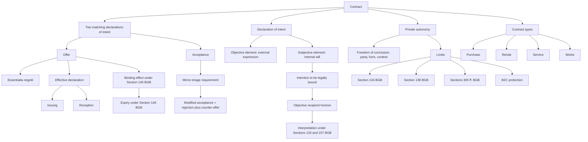
```mermaid
flowchart TD
    Contract[Contract] --> Matching[Two matching declarations of intent]
    Matching --> Offer[Offer]
    Matching --> Acceptance[Acceptance]

    Offer --> Essentialia[Essentialia negotii]
    Offer --> EffectiveOffer[Effective declaration]
    EffectiveOffer --> Issuing[Issuing]
    EffectiveOffer --> Reception[Reception]
    Offer --> Binding[Binding effect under Section 145 BGB]
    Binding --> Expiry[Expiry under Section 146 BGB]

    Acceptance --> Mirror[Mirror-image requirement]
    Mirror --> CounterOffer[Modified acceptance = rejection plus counter-offer]

    Contract --> DoI[Declaration of intent]
    DoI --> Objective[Objective element: external expression]
    DoI --> Subjective[Subjective element: internal will]
    Subjective --> LegalBound[Intention to be legally bound]
    LegalBound --> RecipientHorizon[Objective recipient horizon]
    RecipientHorizon --> Interpretation[Interpretation under Sections 133 and 157 BGB]

    Contract --> PrivateAutonomy[Private autonomy]
    PrivateAutonomy --> Freedom[Freedom of conclusion, party, form, content]
    PrivateAutonomy --> Limits[Limits]
    Limits --> StatutoryProhibition[Section 134 BGB]
    Limits --> PublicPolicy[Section 138 BGB]
    Limits --> StandardTerms[Sections 305 ff. BGB]
    Limits --> ConsumerProtection[B2C protection]

    Contract --> ContractTypes[Contract types]
    ContractTypes --> Purchase[Purchase]
    ContractTypes --> Rental[Rental]
    ContractTypes --> Service[Service]
    ContractTypes --> Works[Works]
```

## Subject Knowledge Graph

| Node | Meaning | Exam Relevance |
|---|---|---|
| Contract | Legal transaction formed by offer and acceptance | Foundation for all contract-law topics |
| Declaration of Intent | Expression of will aimed at legal consequence | Core legal building block |
| Objective Element | External expression of will | Decides whether conduct can count legally |
| Subjective Element | Internal will components | Explains mistakes and later rescission |
| Intention To Be Legally Bound | Whether behavior should be legally binding | Distinguishes offer from social favor or invitatio |
| Invitatio Ad Offerendum | Invitation to make an offer | Common offer/acceptance trap |
| Offer | DoI enabling contract conclusion by acceptance alone | Required for contract formation |
| Essentialia Negotii | Essential contract terms | Determines whether offer is valid |
| Reception | DoI reaches recipient's sphere | Determines effectiveness and timing |
| Acceptance | Agreement with offer | Completes contract if matching |
| Counter-Offer | Modified acceptance | Rejects original offer under Section 150 II BGB |
| Private Autonomy | Freedom to shape legal relations | Explains default contract freedom |
| Section 134 BGB | Voidness for statutory prohibition | Limit on autonomy |
| Section 138 BGB | Voidness for public policy/usury | Limit on autonomy |
| Contract Type | Statutory category with specific obligations | Determines applicable legal regime |

| From | Relationship | To | Why It Matters |
|---|---|---|---|
| Contract | requires | Offer and Acceptance | Formation requires matching DoIs |
| DoI | contains | Objective and Subjective Elements | Explains validity and interpretation |
| Offer | must include | Essentialia Negotii | Otherwise no valid offer |
| DoI | becomes effective through | Issuing and Reception | Timing can decide contract formation |
| Acceptance | must mirror | Offer | Modified acceptance is counter-offer |
| Invitatio Ad Offerendum | lacks | Intention To Be Legally Bound | Prevents premature binding |
| Interpretation | uses | Objective Recipient Horizon | Protects reasonable understanding |
| Private Autonomy | is limited by | Sections 134 and 138 BGB | Freedom is not unlimited |
| Contract Type | determines | Specific Obligations | Later warranty, termination, and remedies depend on type |

## Exam Relevance

Likely exam prompts:

- Define declaration of intent.
- Explain offer and acceptance.
- Distinguish offer from invitatio ad offerendum.
- Explain when a declaration to an absent person becomes effective.
- Explain what happens when acceptance changes an offer.
- Explain private autonomy and its limits.
- Compare service agreement and works contract.

Common traps:

- Treating silence as acceptance without a trade-law exception.
- Forgetting reception for declarations to absent parties.
- Treating every advertisement or product display as an offer.
- Ignoring essentialia negotii.
- Missing that a changed acceptance is a counter-offer.
- Saying private autonomy means no mandatory limits.

## Official Exercise Case Routes

The exercise deck adds seven official formation cases. Use these as exam templates for spotting which element of contract formation is actually disputed.

| Case | Core issue | Official route | Result / trap |
|---|---|---|---|
| **1. Neighbor waters garden** | Intention to be legally bound in a favor situation | G's request can contain service-contract essentials: parties, service for five days, and no compensation. N's agreement refers to those essentials, but the neighborly context and lack of compensation mean N lacks legal-binding intent. | No contract. Trap: do not say "promise = contract"; ask whether social courtesy is meant to be legally enforceable. |
| **2. Blue chronograph** | Essentialia negotii in a purchase | I wants to buy a watch from C's collection, but "a blue chronograph" is not specific enough and no price is mentioned or determinable. | No offer, therefore no contract. Trap: an "agreement" label does not cure missing essentialia. |
| **3. Newspaper painting advertisement** | Invitatio ad offerendum vs offer to an uncertain public | Advertisement has object and price but normally lacks legal-binding intent because the seller does not want multiple contracts or unverified buyers. A's letter is the offer; P rejects it. | No contract. Trap: price in an advertisement does not automatically make it an offer. |
| **4. Supermarket strawberries** | Interpretation of customer offer and cashier acceptance | Display/sign is invitatio. C offers to buy at EUR 2 because a reasonable cashier would understand the checkout conduct against the yellow price sign. S rejects by demanding EUR 3. C's later insistence on EUR 2 is another offer, not accepted. | No purchase agreement at EUR 2. Trap: answer the exact question, not whether any EUR 3 counteroffer might exist. |
| **5. Sofa Relax** | Expiry, late acceptance, counteroffer, and silence | F's in-store recommendation at EUR 1,100 is an offer to a present person. C leaves to ask G, so no immediate acceptance under Section 147 I BGB; later email is late and counts as a new offer under Section 150 I BGB. F's EUR 1,300 reply is a counteroffer under Section 150 II BGB. C's EUR 1,200 reply is another counteroffer. F's silence is not acceptance and Section 151 BGB does not help. | No contract. Trap: every modified or late response restarts the offer/acceptance analysis. |
| **6. Cabriolet rental by letter** | Issuing, receipt, and revocation of a declaration to an absent party | Brochure is invitatio; failed phone call is not an offer. E's Monday letter is an offer for a Section 535 BGB rental. It reaches C's sphere Tuesday morning and is deemed received when mailbox checking can reasonably be expected, Tuesday evening. Wednesday email is too late for Section 130 I 2 BGB revocation. C implicitly accepts by demanding rent the next day. | Rental agreement exists; C can claim rent under Section 535 II BGB. Trap: actual reading is not required for receipt. |
| **7. Machine negotiations and email** | Letter of intent and missing legal-binding intent | Office negotiations are not final. M's email has price and goods, and delivery/spare-part issues are not necessarily essentialia, but the wording "in principle", unresolved details, and request that P come back first point to a letter of intent, not an offer. P's later reply is at most an offer; M never accepts because M bought elsewhere. | No contract. Trap: advanced negotiations plus price are still not enough if the parties intentionally leave the deal open. |

### Formation Mini-Decision Tree From Cases

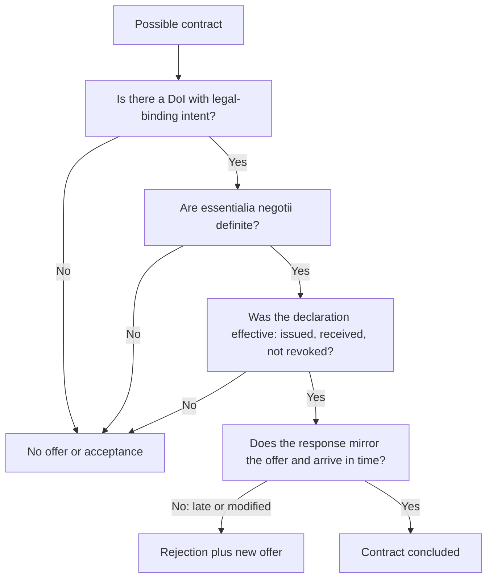
```mermaid
flowchart TD
    A[Possible contract] --> B[Is there a DoI with legal-binding intent?]
    B -->|No| X[No offer or acceptance]
    B -->|Yes| C[Are essentialia negotii definite?]
    C -->|No| X
    C -->|Yes| D[Was the declaration effective: issued, received, not revoked?]
    D -->|No| X
    D -->|Yes| E[Does the response mirror the offer and arrive in time?]
    E -->|No: late or modified| F[Rejection plus new offer]
    E -->|Yes| G[Contract concluded]
```

## Retrieval Prompts

1. Define a contract using offer, acceptance, and declaration of intent.
2. Explain the objective and subjective elements of a declaration of intent.
3. Why is invitatio ad offerendum not an offer?
4. When is a written offer received by an absent recipient?
5. What is the legal effect of a modified acceptance?
6. Explain private autonomy and give three limits.
7. Distinguish Section 134 BGB from Section 138 BGB.
8. Explain the difference between service and works contracts.

## Practice Tasks

### Task 1: Shop Display

A shop displays a laptop for EUR 500. A customer says, "I accept." Is there necessarily a contract?

Short answer guide: usually no. The display is often invitatio ad offerendum, and the customer's statement is the offer.

### Task 2: Modified Acceptance

Seller offers a machine for EUR 10,000. Buyer replies, "I accept for EUR 9,000." What is the legal situation?

Short answer guide: rejection of the original offer plus counter-offer under Section 150 II BGB.

### Task 3: Private Autonomy

Why can a contract freely negotiated by two parties still be void?

Short answer guide: private autonomy is limited by mandatory law, statutory prohibitions, public policy, usury, standard-term control, and consumer protection.

## Connections

Previous notes:

- `week-01-02-introduction-to-business-law/week-01-02-introduction-to-business-law.md`: BGB structure, conditions/legal consequence, statutory interpretation, private law.

Future links:

- Contract Law II uses declaration-of-intent flaws as grounds for rescission.
- Contract Law III uses private autonomy again for dissolution agreements and consumer protection for withdrawal.
- Standard Business Terms will deepen Sections 305 ff. BGB.

## Weakness Flags

- Pending active-recall session.

## Open Uncertainties

- The deck asks how common law regulates binding offers. The common-law detail is not developed in this deck and may require extra Moodle material if tested.


<div class="page-break"></div>

# [W03.2] Week 03 Contract Law I Cheatsheet And Tricks

<p class="source-path">Source: <code>business-law/wiki/week-03-contract-law-i/week-03-contract-law-i-cheatsheet-and-tricks.md</code></p>

Course: Business Law
Exam date: 2026-07-28
Source: week-03-contract-law-i.md, week-03-contract-law-i-active-recall-session-2026-05-24.md

## Must-Know (exam-critical)

| Concept | Statutory Anchor | Backbone Point |
|---|---|---|
| Contract | — | Two matching declarations of intent: offer and acceptance. |
| Declaration of intent | — | Objective element (external expression) + subjective element (internal will, especially intention to be legally bound), judged from the objective recipient horizon. |
| Invitatio ad offerendum | Sections 133, 157 BGB (interpretation) | Shop displays, ads, catalogs are usually invitations to make an offer, not offers themselves — the seller lacks binding intent toward every possible buyer. |
| Offer | Section 145 BGB | Must contain essentialia negotii (parties, good/service, price for a purchase); binds the offeror unless bound is excluded. |
| Receipt to an absent party | Section 130 BGB | Effective when it enters the recipient's sphere so notice could normally be taken — actual reading not required. Revocation must arrive before or at the same time to block effectiveness. |
| Modified acceptance | Section 150 II BGB | Any change to price/quantity/object/terms in a "yes" = rejection + new offer, not acceptance. |
| Late acceptance | Section 150 I BGB | Treated as a new offer, not the original acceptance. |
| Offer expiry | Section 146 BGB | Offer dies on rejection or if not accepted in time. |
| Acceptance timing default | Section 147 BGB | Present/real-time (phone) = immediate acceptance required; absent party = until the offeror may expect an answer under ordinary circumstances. |
| Fixed deadline | Section 148 BGB | Offeror's stated deadline controls over the Section 147 default. |
| Interpretation | Sections 133, 157 BGB | Ambiguous wording resolved via objective recipient horizon — falsa demonstratio non nocet if both parties actually meant the same thing despite wrong labels. |
| Formal requirements | Sections 125, 126, 126a, 126b, 128 BGB | Default is no form required (private autonomy); statute can require text/written/electronic/notarial form (e.g. Section 766 suretyship, real estate/GmbH-share transfer). |
| Private autonomy limits | Sections 134, 138 I/II, 305 ff., 276 III BGB | Freedom to contract is bounded by statutory prohibition, public policy/usury, standard-terms control, and the ban on excluding intentional liability in advance. |
| Service vs. works contract | Sections 611 ff. vs. 631 ff. BGB | Service contract owes activity/effort only; works contract owes a successful result. |

## Nice-to-Have (depth/edge cases)

- Full contract-type table: purchase (433-479), purchase with assembly (434 II), purchase of rights (453), consumer goods purchase (474-479), loan (488-490), rental (535-580), employment (611a), works contract with delivery (650), construction contract (650a ff.) — useful for a "name the contract type" theory prompt.
- Section 151 BGB: acceptance without communication to the offeror is possible if declaration isn't expected or is waived by custom — narrow, don't use it to excuse ordinary silence.
- Silence is almost never acceptance, except two commercial-law exceptions: the merchant's commercial letter of confirmation and Section 362 HGB (inquiry cases) — flag as a trade-law bridge to Week 11.
- Letter of intent vs. offer: cautious wording ("in principle," unresolved details, "come back to me first") signals negotiations are deliberately still open, not an offer — from the official machine-negotiation exercise case.
- Art. 2 I GG grounds private autonomy constitutionally — good filler if a theory question asks for the constitutional basis.

## Nuances And Traps

| Nuance/Trap | Why it's easy to get wrong | Correct handling |
|---|---|---|
| Customer's "I'll take this" at a shelf price is not acceptance | Students read the shelf display as the offer and the customer's statement as accepting it | The display is invitatio ad offerendum; the customer's statement is the offer. If the cashier refuses the price, there is no contract at all — nobody accepted anything. |
| Binding-offer anchor confusion | Students reach for Section 150 II BGB (modified acceptance) even when the issue is just whether an offer binds | Section 145 BGB is the binding-offer anchor; Section 150 II only applies once a reply actually changes the offer's terms. |
| Revocation timing anchor confusion | Students cite Section 146 (expiry) for a same-day revocation-vs-offer race | Section 130 BGB governs: revocation must reach the recipient before or at the same time as the original declaration to block it — receipt, not reading, is what counts. |
| "Objective recipient horizon" misread as literal third-party polling | The phrase sounds like "ask other people what they think" | It means: how would a reasonable person *standing in the recipient's position* understand the declaration given the surrounding circumstances — not an actual survey. |
| Legal-consequence vocabulary blur | Writing "not issued," "loses validity," or "invalid" interchangeably costs points | Use precise terms: `void` (Sections 125, 134, 138), `ineffective`/ still not accepted in time (Section 146), `counteroffer` (Section 150 II) — match the term to the exact section. |
| Clause-level defect treated as whole-contract defect | Students jump to "the whole contract is void" for one unfair clause | An unfair standard-terms clause (305 ff., 276 III) is invalid/ineffective on its own; the rest of the contract usually survives — this is a whole-contract-vs-clause distinction, not automatically a Section 138 public-policy problem. |
| Section 138 vs. Section 134 mix-up | Both produce voidness, so students cite either interchangeably | Section 134 asks whether a *separate statute* prohibits the transaction (e.g. export ban, cartel law); Section 138 asks whether the transaction itself is *intolerable under public policy/morality*, including usury (138 II: strong imbalance + exploitation). |
| Section 125 reached for a "bad bargain" or exploitative-price case | Form defect (125) has nothing to do with price fairness | An exploitative price with a constrained counterparty is a Section 138 usury issue, not a form issue — Section 125 only fires when a required *form* (written, text, notarial) is missing. |
| Missing essentialia disguised by an "agreement" label | Facts calling something an "agreement" can mislead students into skipping the essentialia check | No valid offer exists if parties/object/price aren't sufficiently definite, regardless of what the facts call the exchange (e.g. "a blue chronograph" with no price is not an offer). |
| Advanced negotiations plus a stated price still not a contract | Once price is on the table, students assume a deal exists | If wording and open issues show the parties intentionally left the deal unfinished (letter of intent), there is still no offer despite price being mentioned. |

## One-Line Recall Drill

```text
130 = receipt to absent party, revocation must arrive first/same time
133/157 = interpretation, objective recipient horizon
145 = offer binds
146 = offer expires
147 = default acceptance timing (present = immediate; absent = ordinary expected time)
148 = offeror's fixed deadline controls
150 I = late acceptance = new offer
150 II = modified acceptance = rejection + new offer
125 = form defect -> void
134 = statutory prohibition -> void
138 I/II = public policy / usury -> void
305 ff. = standard-terms control -> clause invalid, contract usually survives
276 III = intentional liability can never be excluded in advance
766 = suretyship needs written form (pairs with 125)
```


<div class="page-break"></div>

# [W03.3] Week 03 Contract Law I Practice Questions And Model Answers

<p class="source-path">Source: <code>business-law/wiki/week-03-contract-law-i/week-03-contract-law-i-practice-questions-and-model-answers.md</code></p>

Course: Business Law
Exam date: 2026-07-28
Source: week-03-contract-law-i.md, week-03-contract-law-i-cheatsheet-and-tricks.md
Format note: 24 questions — 10 short-answer/theory, 14 case/legal-opinion (schema-based). Question 8 integrates Week 04 Contract Law II rescission; Question 17 integrates Week 06 Standard Business Terms; Question 18 integrates Week 07 Agency; Question 22 integrates Week 11 Trade Law; Question 24 integrates Week 10 Transfer of Property.

## Short-Answer / Theory Questions

### Question 1

Define a declaration of intent and explain why it has two dimensions.

**Model Answer:** A declaration of intent is the expression of a person's will aimed at producing a legal consequence. There is no single statutory definition section for the term itself, but its effects are anchored in Sections 130, 133, and 157 BGB. It has two dimensions: an objective element (the will must be expressed outwardly, e.g. by writing, speech, or conclusive behavior) and a subjective element (the person must internally intend the relevant legal act, especially the intention to be legally bound). For example, nodding at an auction can be a declaration of intent even without words, because conclusive behavior is a valid objective expression. The trap is treating the objective element alone as sufficient — contract law asks how the declared behavior is legally understood from the recipient's perspective, not only what was outwardly done.

### Question 2

Compare an offer with an invitatio ad offerendum.

**Model Answer:** An offer is a declaration of intent requesting contract conclusion so that the contract depends only on the recipient's consent; it is triggered once a party expresses definite essentialia negotii (parties, good/service, price) with a clear intention to be bound, and its legal consequence is that the offeror is bound under Section 145 BGB unless bound-ness was excluded. An invitatio ad offerendum is an invitation to make an offer, not an offer itself; it is triggered when the declaror lacks intention to be legally bound toward every possible respondent (interpreted under Sections 133, 157 BGB), and its legal consequence is that the other party's response is the offer, requiring a further acceptance from the original declaror. Contrast example: a laptop displayed in a shop window with a price tag is normally an invitatio, so a customer saying "I'll take it" is the offer, not an acceptance. The exam trap is treating any advertisement, catalog listing, or price display as an offer simply because it states object and price.

### Question 3

List the requirements for a legal transaction to be void under Section 134 BGB, and explain why the rule exists.

**Model Answer:** The requirements are: (1) a legal transaction (e.g. a contract) exists; (2) the transaction violates a statutory prohibition, meaning a rule outside the BGB itself (criminal, administrative, or EU law) that the legal order treats as mandatory; (3) the statute does not itself provide a different legal consequence for the violation (e.g. a mere fine instead of voidness). If these are met, the consequence is that the legal transaction is void under Section 134 BGB. The rule exists to preserve the unity of the legal order — the civil law should not enforce an agreement, such as an illegal export deal or a cartel agreement violating Art. 101 II TFEU, that another branch of law has already declared prohibited.

## Case / Legal-Opinion Questions

### Question 4 (Case)

**Facts:** Bakery owner B places a tray of pastries in the shop window with a sign reading "Croissant — EUR 2.50." Customer K walks up to the counter and says, "I'll take one croissant." The employee at the till, T, has just been told by B that the croissant price was mistakenly listed too low and should be EUR 3.50, so T tells K the price is EUR 3.50. K insists on paying EUR 2.50, citing the window sign.

**Question:** Did K and B conclude a purchase agreement for one croissant at EUR 2.50?

**Model Answer:**

I. Claim/Issue Sentence
K and B concluded a valid purchase agreement at EUR 2.50 if there are two matching declarations of intent, offer and acceptance, and no validity obstacle applies.

II. Requirements
1. An effective offer with essentialia negotii (parties, good, price) and intention to be legally bound.
2. A matching acceptance.

III. Application
Questionable is whether the window display with the sign "EUR 2.50" is itself an offer. This is supported by the fact that the sign names both the good (croissant) and a price. Against this, one could argue that a shop window display is normally an invitatio ad offerendum under Sections 133, 157 BGB, because the baker does not intend to be bound to sell to every possible customer regardless of stock or pricing errors — a reasonable recipient would understand the display as an invitation to make an offer, not a binding offer itself. Consequently, the display is not an offer; K's statement "I'll take one croissant" is the offer, referencing the displayed price of EUR 2.50 as its implied term.

Questionable is whether T's response of "EUR 3.50" is an acceptance of K's EUR 2.50 offer. This is supported by nothing in the facts suggesting agreement; T explicitly names a different price. Against this, there is no room to argue T accepted, since a reply naming a different price does not mirror the offer. However, under Section 150 II BGB, a response changing the terms of an offer counts as rejection of the original offer combined with a new offer at the changed terms. Consequently, T's EUR 3.50 statement is a rejection of K's EUR 2.50 offer and a new offer at EUR 3.50, which K has not accepted (K insists on EUR 2.50, which is now a renewed offer at the old price, not an acceptance of T's new offer).

IV. Interim Result
No matching declarations exist at EUR 2.50: K's offer at EUR 2.50 was rejected and countered at EUR 3.50, and K's repeated insistence on EUR 2.50 is a further offer that T/B has not accepted.

V. Final Answer
As a result, no purchase agreement was concluded between K and B at EUR 2.50; the parties are still in the offer/counteroffer stage, and no contract exists at either price unless one side accepts the other's most recent offer.

### Question 5 (Case)

**Facts:** Company S sends a letter to buyer C offering 500 units of packaging material at EUR 4 per unit, stating "This offer is valid for acceptance until Friday, 5 p.m." C's acceptance letter is posted on Thursday but, due to a postal delay, does not reach S's mailroom until the following Monday. S had already sold the units to another buyer on Saturday, believing the offer had lapsed.

**Question:** Was a valid purchase agreement concluded between S and C?

**Model Answer:**

I. Claim/Issue Sentence
S and C concluded a valid contract if there are two matching declarations of intent, offer and acceptance, and the acceptance was effective and timely.

II. Requirements
1. An effective offer (Section 145 BGB), here with a fixed acceptance deadline under Section 148 BGB.
2. An acceptance that reaches the offeror within the fixed deadline (Section 130 BGB reception requirement, read together with Section 148 BGB).

III. Application
Questionable is whether S's letter is an effective, binding offer. This is supported by the letter naming the goods, quantity, and price (essentialia negotii) and expressing clear intention to be bound by fixing an acceptance deadline. Against this, there is no serious argument the letter is a mere invitatio, since it is addressed to a specific buyer with definite terms. Consequently, S made an effective offer under Section 145 BGB, with a fixed deadline under Section 148 BGB of Friday 5 p.m.

Questionable is whether C's acceptance was effective in time. This is supported by C posting the letter on Thursday, before the deadline. However, under Section 130 BGB, a declaration to an absent party becomes effective only when it reaches the recipient's sphere so that notice could normally be taken — not when it is sent. Against this, one could argue C should not bear the risk of postal delay since C acted diligently, but the general rule places the risk of transmission delay on the declaring party (the sender bears the risk that a declaration arrives late), and Section 149 BGB only rescues a late-arriving acceptance if the offeror recognized (or should have recognized) the delay and failed to notify the acceptor immediately — nothing in the facts suggests S recognized any delay before selling to the other buyer. Consequently, C's acceptance reached S only on Monday, after the Friday 5 p.m. deadline, so the offer had already expired under Section 146 BGB by the time the acceptance arrived.

IV. Interim Result
The offer lapsed under Section 146 BGB before C's acceptance became effective; C's Monday-arriving acceptance is therefore a new offer, not an acceptance of S's original offer.

V. Final Answer
As a result, no purchase agreement was concluded on the original terms; C's late acceptance is a new offer that S has not accepted (S in fact acted inconsistently with it by selling to another buyer).

### Question 6 (Case)

**Facts:** Retailer R sends wholesaler W an offer to buy 100 chairs at EUR 60 each. W replies by email: "Confirmed — 100 chairs, EUR 60 each, delivery within two weeks." Two days later, before delivery, W discovers a competitor would have paid EUR 80 per chair and tells R the "agreement" was never binding because W's email was just a "preliminary confirmation."

**Question:** Is W bound to deliver 100 chairs to R at EUR 60 each?

**Model Answer:**

I. Claim/Issue Sentence
R could have a claim against W for delivery of 100 chairs at EUR 60 each under Section 433 I BGB if a valid purchase agreement was concluded and W cannot avoid it merely by relabeling the exchange.

II. Requirements
1. An effective offer by R.
2. A matching acceptance by W.
3. No validity obstacle, and no basis for W to unilaterally withdraw after the fact.

III. Application
Questionable is whether R's message was an effective offer. This is supported by the message stating quantity (100 chairs), object (chairs), and price (EUR 60 each) — all essentialia negotii for a purchase agreement — with clear intention to be bound, since it is directed at a specific business partner. Consequently, R made an effective offer under Section 145 BGB.

Questionable is whether W's email is a matching acceptance. This is supported by W's email repeating the same quantity, object, and price, and adding a delivery term consistent with (not contradicting) the offer. Against this, one could argue W's later description of the email as a mere "preliminary confirmation" shows no intention to be bound. However, under the objective recipient horizon (Sections 133, 157 BGB), what matters is not W's subsequent, self-serving characterization but how a reasonable recipient in R's position would have understood the word "Confirmed" together with the matching terms at the time it was sent — this reads as unconditional agreement, not as a preliminary or non-binding step. Consequently, W's email is a matching, binding acceptance.

IV. Interim Result
A valid purchase agreement was concluded when W's acceptance reached R; W's later relabeling does not retroactively remove that binding effect, since intention to be bound is judged at the time of the declaration, from the recipient's objective perspective.

V. Final Answer
As a result, R can claim delivery of 100 chairs at EUR 60 each from W under Section 433 I BGB; W's discovery of a better price after the fact does not undo the concluded contract.

### Question 7 (Case)

**Facts:** During negotiations for a custom-built delivery van, manufacturer M emails buyer B: "Here is our proposal: base price EUR 45,000 for the specification we discussed. Before we finalize anything, please come back to us once you've confirmed the exact interior layout with your logistics team, since that affects the final configuration." B replies, "Great, EUR 45,000 works for us, let's proceed," without ever confirming the interior layout.

**Question:** Did B and M conclude a contract for the delivery van at EUR 45,000?

**Model Answer:**

I. Claim/Issue Sentence
B and M concluded a valid contract at EUR 45,000 if M's email was an effective offer and B's reply was a matching acceptance.

II. Requirements
1. An offer containing essentialia negotii with clear intention to be bound.
2. A matching acceptance.

III. Application
Questionable is whether M's email is an offer at all. This is supported by the email naming a price (EUR 45,000) and a good (the delivery van in the discussed specification). Against this, one could argue the wording shows M did not yet intend to be bound: "before we finalize anything" and the request that B first confirm the interior layout with the logistics team, since that "affects the final configuration," indicate that a material term (the exact configuration) is still open and that M wants to review it before concluding anything. Under the objective recipient horizon (Sections 133, 157 BGB), a reasonable recipient would understand this as a letter of intent or a step within ongoing negotiations rather than a definite offer, because the essentialia negotii (the actual good to be delivered, i.e. the configuration) are not yet fixed and the parties have deliberately left the deal open pending further confirmation. Consequently, M's email is not an effective offer.

Questionable is whether B's reply could nonetheless create a contract. This is supported by nothing, since without an effective offer from M, B's reply can at most be B's own offer to contract at EUR 45,000 on the previously discussed (but unconfirmed) specification. However, M never accepted B's reply — the facts show no further response from M. Consequently, no acceptance of B's offer occurred either.

IV. Interim Result
Neither party made and had accepted an effective, fully-defined offer; the negotiations remained open pending confirmation of the interior layout.

V. Final Answer
As a result, no purchase agreement was concluded between B and M at EUR 45,000; B's reply is at most an unaccepted offer, and M remains free to negotiate further or walk away.

### Question 8 (Case — integrates Week 03 + Week 04)

**Facts:** Art dealer A offers collector K a painting for EUR 20,000, describing it in the offer letter as "an original work by the renowned painter Falkner." K accepts in writing, and the parties conclude the purchase agreement. Two weeks later, before any warranty issue is even raised, K discovers through an independent appraiser that the painting was in fact painted by an unknown apprentice in Falkner's workshop, not by Falkner himself, and neither A nor K knew this at the time of contracting. K wants to know whether the contract can be undone.

**Question:** Can K avoid the purchase agreement with A?

**Model Answer:**

I. Claim/Issue Sentence
The contract between K and A was validly concluded under the ordinary offer/acceptance rules (Sections 145, 130 BGB), so K's claim could be excluded or modified only if K can rely on rescission of the declaration of intent.

II. Requirements
1. A valid contract was concluded (formation check, Week 03).
2. A rescission ground exists under Section 119 II BGB (mistake about an essential characteristic).
3. Rescission is timely declared under Sections 143, 121 BGB.
4. No confirmation under Section 144 BGB bars rescission.

III. Application
On formation: the offer letter names the good (a specific painting), attributes authorship to Falkner, and states a price (EUR 20,000), satisfying the essentialia negotii; K's written acceptance mirrors these terms. Consequently, a valid purchase agreement was concluded under Sections 145, 130 BGB — this closes the Week 03 formation question and shifts the analysis to whether K can now get out of that valid contract.

On the rescission ground: questionable is whether K can rescind for a mistake about the painting's authorship. This is supported by the fact that authorship by a specific renowned artist is generally regarded in the art trade as an essential characteristic of a painting for purposes of Section 119 II BGB, since it directly affects value and identity of the object, not a peripheral detail. Against this, one could argue this should instead be treated as a warranty (defect) issue under Sections 434, 437 BGB, since the good delivered does not match the agreed description. However, the facts state neither party knew the truth at the time of contracting — this is a case of mutual, innocent mistake about a characteristic assumed at formation, which is squarely a Section 119 II mistake case, not a case where A knowingly delivered something different (which would instead push toward warranty law or, if A had lied, toward Section 123 deceit — neither applies here since the facts rule out knowledge on both sides). Consequently, K has a valid ground to rescind under Section 119 II BGB.

On timing and confirmation: K discovered the mistake and, on these facts, is raising it promptly (within the same short window), so rescission would be without culpable delay under Section 121 I BGB. Nothing in the facts suggests K did anything to confirm the transaction after discovering the truth, so Section 144 BGB does not bar rescission.

IV. Interim Result
K has an effective, timely, unconfirmed ground to rescind the declaration of intent under Section 119 II BGB.

V. Final Answer
As a result, if K declares rescission under Section 143 BGB, the purchase agreement is treated as void from the beginning under Section 142 I BGB, and K must return the painting while A returns the EUR 20,000 (with A potentially owing K reliance damages under Section 122 BGB if K incurred reliance costs, since this is an error case, not a deceit case).

## Short-Answer / Theory Questions (Continued)

### Question 9

List the requirements for a valid, binding offer under Section 145 BGB.

**Model Answer:**

The requirements are:
1. A declaration of intent with both an objective element (external expression) and a subjective element (intention to be legally bound), judged from the objective recipient horizon (Sections 133, 157 BGB).
2. Sufficiently definite essentialia negotii — for a purchase, the parties, the good, and the price.
3. The declaration is effective, meaning it was issued and, for an absent recipient, received under Section 130 BGB.
4. No exclusion of being bound, and the offer has not expired under Section 146 BGB.

If these are met, the consequence is that the offeror is bound under Section 145 BGB and the contract depends only on the recipient's matching acceptance. The rule exists so that a business partner can rely on a definite proposal without the offeror being free to walk away the moment it becomes inconvenient — private autonomy is exercised, and responsibly, the moment a definite offer is made.

### Question 10

Explain the difference between issuing and reception of a declaration of intent, and state when a declaration to an absent party becomes effective.

**Model Answer:**

1. Issuing and reception are the two steps by which a declaration of intent becomes effective toward an absent recipient.
2. Statutory anchor: Section 130 BGB.
3. Requirements/features: (1) issuing occurs when the declarant sends the declaration on its way, e.g. by speaking the words or posting/sending the message; (2) reception occurs when the declaration enters the recipient's sphere of influence so that, under normal circumstances, the recipient could take notice of it — actual reading is not required; (3) for present parties (including phone or other real-time communication), issuing and reception are normally simultaneous; for absent parties, they happen successively, and a gap in time is expected.
4. Example: a letter placed in a shop's letterbox on Saturday evening, when the shop is closed for the weekend, is not received Saturday evening — reception occurs when the recipient could normally be expected to check the letterbox, e.g. Monday morning.
5. Trap: students conflate "sent" with "received." Section 130 BGB effectiveness turns on reception (entering the recipient's sphere), not on the moment the declarant let go of the message, and a revocation only blocks the original declaration if it reaches the recipient before or at the same time.

### Question 11

Compare late acceptance under Section 150 I BGB with modified acceptance under Section 150 II BGB.

**Model Answer (Compare Schema):**

Late acceptance under Section 150 I BGB arises when a recipient agrees to the exact terms of an offer but the agreement reaches the offeror only after the offer has already expired under Section 146 BGB (through rejection or lapse of the acceptance period under Sections 147-149 BGB); its legal consequence is that the late, otherwise-matching acceptance is treated as a new offer from the original acceptor, which the original offeror is now free to accept or ignore. Modified acceptance under Section 150 II BGB arises when a reply changes any term of the offer — price, quantity, object, or other conditions — regardless of timing; its legal consequence is that the reply operates as a rejection of the original offer combined with a new offer on the changed terms. Contrast example: a buyer who says "yes" to a seller's EUR 200 bike offer, but whose letter arrives a week after the offer lapsed, has made a late acceptance (Section 150 I); a buyer who replies "I'll take it for EUR 150" the same day has made a modified acceptance (Section 150 II), independent of timing. Exam trap: do not reach for Section 150 II merely because a reply arrived late — timing problems belong to Section 150 I/146, while content changes belong to Section 150 II; a reply can also do both if it is both late and modified, but the two sections address different defects.

### Question 12

Explain the default rule on formal requirements for legal transactions and name the main statutory exceptions.

**Model Answer:**

1. Formal requirements refer to whether a declaration of intent must take a specific form (written, text, electronic, or notarial) to be valid.
2. Statutory anchor: Sections 125, 126, 126a, 126b, 128 BGB.
3. Requirements/features: (1) the default rule, flowing from private autonomy, is that no form is required — an oral or even conclusive declaration suffices; (2) a statute can impose written form (Section 126 BGB), electronic form (Section 126a BGB), text form (Section 126b BGB), or notarial recording (Section 128 BGB) for specific transaction types; (3) if a required form is missing, the legal transaction is void under Section 125 BGB.
4. Example: a guarantee (suretyship) under Section 766 BGB requires written form, and a transfer of real estate or of GmbH shares requires notarial recording — an oral promise to guarantee a friend's debt is void for lack of form even if both parties clearly agreed.
5. Trap: students treat "no form required" as a universal rule and forget that specific statutes carve out exceptions; conversely, Section 125 must never be used to attack a transaction merely because the price seems unfair — that is a Section 138 problem, not a form problem.

### Question 13

Distinguish a service contract from a works contract and explain why the distinction matters.

**Model Answer (Compare Schema):**

A service contract under Sections 611 ff. BGB is triggered whenever a party promises to perform an activity or exert effort, and its legal consequence is that only the performance of the promised service is owed — no particular result is guaranteed, so no result-based warranty regime attaches merely because the outcome disappoints. A works contract under Sections 631 ff. BGB is triggered whenever a party promises to bring about a specific successful result, and its legal consequence is that the result itself is owed, exposing the party to a functional warranty-style regime (Sections 633 ff. BGB) if the promised result is not achieved. Contrast example: a doctor treating a patient or a lawyer advising a client owes diligent effort under a service contract, not a guaranteed cure or a guaranteed winning case; a tailor commissioned to produce a suit, or a repair shop commissioned to fix a car, owes the finished, functioning result under a works contract. Exam trap: do not classify a contract as "works" just because it involves skilled labor — the decisive question is whether a specific, objectively verifiable result was promised (works) or only diligent performance of an activity (service), since this determines which remedy regime applies if things go wrong.

## Case / Legal-Opinion Questions (Continued)

### Question 14 (Case)

**Facts:** Antique dealer A tells collector K on the phone, "I have a 19th-century oak writing desk, in the condition we discussed, for EUR 3,000." K replies immediately, "I need to check with my restorer before I can say yes, I'll call you back." Twenty minutes later, K calls back and says, "Yes, I'll take it." In the meantime, A has already sold the desk to a walk-in customer, five minutes after the first call ended.

**Question:** Did K and A conclude a purchase agreement for the desk?

**Model Answer:**

I. Claim/Issue Sentence
K and A concluded a valid contract for the desk if there are two matching declarations of intent, offer and acceptance, and K's acceptance was timely.

II. Requirements
1. An effective offer by A containing essentialia negotii with intention to be bound.
2. A timely acceptance under the applicable timing rule for the mode of communication used.

III. Application
Questionable is whether A's phone statement is an effective offer. This is supported by the statement naming the good (a specific 19th-century oak writing desk "in the condition we discussed") and a price (EUR 3,000), addressed to a specific counterparty. Consequently, A made an effective offer under Section 145 BGB.

Questionable is whether K's acceptance twenty minutes later was timely. This is supported by nothing suggesting A fixed a different deadline under Section 148 BGB, so the default timing rule of Section 147 BGB applies. However, a phone call is treated as communication between present parties under Section 147 I BGB, meaning the offer could only be accepted immediately, during that same call; K's own reply during the call ("I need to check... I'll call you back") did not accept but instead signaled that no immediate decision was being made. Against this, one could argue twenty minutes is a short delay that should not matter — however, Section 147 I BGB does not tolerate any delay for present-party/real-time communication, precisely because the offeror needs to know at once whether they remain bound. Consequently, A's offer expired under Section 146 BGB at the latest when the phone call ended without an immediate "yes."

IV. Interim Result
A's offer lapsed at the end of the phone call because K did not accept immediately; K's follow-up call twenty minutes later is a new offer, not a valid acceptance of A's original offer.

V. Final Answer
As a result, no purchase agreement was concluded between K and A for the desk; K's callback is merely a new offer, and A — having already sold the desk — is free not to accept it.

### Question 15 (Case)

**Facts:** Landowner L, who has just inherited a small plot and has no experience with real-estate transactions, is approached by developer D. D knows the plot is worth roughly EUR 200,000 on the open market but, exploiting L's inexperience and eagerness to quickly settle the inheritance, pressures L into signing a notarized sale agreement for EUR 60,000, a price D privately describes to a colleague as "an absolute steal off a clueless heir."

**Question:** Is the sale agreement between L and D valid?

**Model Answer:**

I. Claim/Issue Sentence
The sale agreement between L and D is valid unless it is void for violating public policy through usury under Section 138 II BGB.

II. Requirements
1. A valid contract was concluded on ordinary formation grounds (offer, acceptance; here also satisfying the notarial form required for land transfers under Section 128 BGB).
2. A striking disproportion between performance and consideration.
3. Exploitation of the other party's weaker position (e.g. inexperience, need, or lack of judgment).

III. Application
On formation and form: the facts show a notarized sale agreement naming the plot and the price, satisfying essentialia negotii and the notarial-form requirement for land transactions. Consequently, an ordinary valid contract was concluded on its face.

Questionable is whether Section 138 II BGB nonetheless voids it. This is supported by the price (EUR 60,000) being roughly 70% below the plot's market value (EUR 200,000) — a striking disproportion between performance and consideration. This is further supported by D's own description of the deal as "an absolute steal off a clueless heir," which evidences D's awareness of the imbalance. Against this, one could argue a low sale price alone is not automatically usury, since parties are free to strike a bad bargain under ordinary private autonomy. However, Section 138 II BGB requires not just disproportion but also exploitation of the other party's inexperience, need, lack of judgment, or significantly weaker bargaining position, and here the facts show exactly that: L's inexperience with real-estate transactions and eagerness to quickly settle the inheritance were the levers D consciously used ("exploiting L's inexperience and eagerness"). Consequently, both the objective disproportion and the subjective exploitation elements of Section 138 II BGB are met.

IV. Interim Result
The sale agreement satisfies both requirements of usury under Section 138 II BGB.

V. Final Answer
As a result, the sale agreement between L and D is void from the outset under Section 138 II BGB; L is not bound to transfer the plot for EUR 60,000, and any performance already exchanged would need to be reversed under unjust-enrichment principles rather than the contract itself.

### Question 16 (Case)

**Facts:** On Monday morning, supplier S posts a letter to buyer B offering 200 office chairs at EUR 45 each. On Monday afternoon, S has a change of heart and sends a same-day courier with a revocation notice. The courier delivers the revocation notice to B's office at 3 p.m. Monday. The original letter, sent by regular post, does not reach B's mailroom until Tuesday morning.

**Question:** Is S still bound by the Monday morning offer?

**Model Answer:**

I. Claim/Issue Sentence
S remains bound by the offer under Section 145 BGB unless the revocation was effective to block the offer under Section 130 I sentence 2 BGB.

II. Requirements
1. An effective offer was issued by S.
2. A revocation was also issued.
3. The revocation reached the recipient before or at the same time as the original declaration.

III. Application
Questionable is whether S's letter is an effective offer. This is supported by the letter naming quantity (200 chairs), object (office chairs), and price (EUR 45 each), addressed to a specific buyer. Consequently, S issued an effective offer under Section 145 BGB when the letter was posted Monday morning.

Questionable is whether the revocation blocks the offer's effectiveness. This is supported by Section 130 I sentence 2 BGB, under which a declaration is not effective if a revocation reaches the recipient before or at the same time as the original declaration. Against this, one could argue the offer was issued (posted) before the revocation was sent, so the revocation should be too late. However, Section 130 I sentence 2 BGB does not compare issuing times — it compares reception (arrival) times of the two declarations at the recipient's sphere: the revocation notice reached B's office at 3 p.m. Monday, while the original offer letter did not reach B's mailroom until Tuesday morning. Consequently, the revocation reached B before the offer itself ever became effective.

IV. Interim Result
Because the revocation arrived before the offer reached B's sphere, the offer never became effective in the first place.

V. Final Answer
As a result, S is not bound by the Monday morning offer; the offer was validly blocked by the revocation under Section 130 I sentence 2 BGB, and no offer exists for B to accept.

### Question 17 (Case — integrates Week 03 + Week 06)

**Facts:** Wholesaler W sends retailer R a written order confirmation for a bulk furniture purchase: "500 units, EUR 30/unit, per our standard terms." On the reverse side of the confirmation, in the same size print as the rest of the document, printed terms include a clause stating that W may unilaterally change the delivery date at any time without notice. W and R have done business together many times before using materially the same confirmation form, and R has always signed without comment. R signs and returns this confirmation as well, then later objects when W changes the delivery date without any notice, causing R to miss a resale window.

**Question:** Is W's delivery-date clause part of the contract and can W rely on it?

**Model Answer:**

I. Claim/Issue Sentence
R's objection to the delivery-date change succeeds only if the clause either never became part of the contract under Section 305c I BGB or is ineffective under content control (Sections 307-309 BGB), after first confirming that a valid underlying contract was formed at all.

II. Requirements
1. A valid contract was concluded on ordinary formation grounds (Week 03: offer, acceptance, essentialia negotii).
2. The clause qualifies as a standard business term under Section 305 I BGB.
3. The clause was validly incorporated under Section 305 II BGB, and is not a surprising clause under Section 305c I BGB.
4. The clause survives content control (Sections 307-309 BGB, as modified for B2B by Section 310 I BGB).

III. Application
On formation: W's confirmation names quantity (500 units), object (furniture), and price (EUR 30/unit); R's signature and return mirror these terms. Consequently, a valid purchase agreement was concluded under Sections 145, 130 BGB — this satisfies the Week 03 formation layer before any clause-specific analysis begins.

On SBT status: the clause is pre-formulated, printed on a reused confirmation form, and presented unilaterally by W for repeated use — the parties' history of "many times before using materially the same confirmation form" satisfies the repeated-use threshold. Consequently, the clause is a standard business term under Section 305 I BGB.

On incorporation and surprise: questionable is whether the clause is nonetheless excluded as a surprising clause under Section 305c I BGB. This is supported by the clause sitting on the reverse side of the document — a location commonly associated with SBT and thus not inherently hidden — printed in the same size as the rest of the text, not concealed in fine print. Against this, one could argue a clause letting W change the delivery date "at any time without notice" is substantively surprising given the businesses' established pattern of reliable delivery dates. However, surprise under Section 305c I BGB is assessed by placement and framing, not merely by how one-sided the content is — a clause that is readable, positioned in the conventional location for terms, and consistent with a repeated course of dealing where R "always signed without comment" does not meet the placement-based surprise threshold; its harshness is instead a content-control question. Consequently, the clause is validly incorporated and not excluded under Section 305c I BGB.

On content control: questionable is whether the clause survives Sections 307-309 BGB. Both W and R appear to be businesses (a wholesaler and a retailer transacting in bulk furniture), so this is a B2B relationship and, under Section 310 I BGB, Sections 308-309 do not apply directly — Section 307 is the central route, using 308/309 values only as indirect guidance. This is supported by the fact that an unlimited, notice-free right to change the delivery date at any time removes a core element of R's ability to plan resale, shifting significant risk onto R without any counterbalancing protection, similar in spirit to the kind of unreasonable, one-sided disadvantage Section 308 would flag directly in a B2C context. However, one could argue against this that some flexibility clauses are common and reasonable in bulk-supply relationships. Consequently, an unlimited, notice-free change right of this breadth unreasonably disadvantages R under the general Section 307 I/II standard, since it deprives R of the reliability that is a core purpose of fixing a delivery term in the first place.

IV. Interim Result
The underlying contract is valid; the clause is a validly incorporated SBT term (not surprising), but it fails content control under Section 307 BGB because it grants W an unreasonably one-sided, unlimited change right.

V. Final Answer
As a result, W's delivery-date clause is ineffective; under Section 306 I, II BGB the rest of the contract remains valid, and the statutory default delivery-term expectations fill the gap, meaning W could not unilaterally change the delivery date without notice and may be liable to R for the resulting harm.

### Question 18 (Case — integrates Week 03 + Week 07)

**Facts:** Procurement manager M works for buyer company B and regularly negotiates supply contracts on B's behalf, always signing as "M, on behalf of B GmbH." M emails supplier S: "B GmbH would like to order 1,000 units of component X at EUR 12 each, per our usual terms." S replies by email, "Confirmed, 1,000 units at EUR 12, delivery in three weeks." M has, in fact, exceeded her internal authorization limit of EUR 10,000 per order (1,000 x EUR 12 = EUR 12,000) without realizing it, but S has no way of knowing about this internal cap.

**Question:** Is B GmbH bound to purchase 1,000 units at EUR 12 each from S?

**Model Answer:**

I. Claim/Issue Sentence
S could have a claim against B GmbH for acceptance and payment under Section 433 II BGB if a contract was validly formed between S and M's declarations, and if M's declaration is attributable to B GmbH under the rules of agency.

II. Requirements
1. A valid contract was concluded on ordinary formation grounds between the declarations exchanged (Week 03).
2. M acted with her own declaration of intent, in B GmbH's name (publicity), and within her power of representation (Section 164 I BGB).
3. If M lacked sufficient internal authorization, whether that internal limit defeats her external power to bind B GmbH.

III. Application
On formation: M's email states quantity (1,000 units), object (component X), and price (EUR 12/unit); S's reply mirrors these terms and adds a delivery term consistent with, not contradicting, the offer. Consequently, on their face, matching declarations exist that would form a valid contract under Sections 145, 130 BGB, subject to confirming who the contract binds.

On agency, own declaration and publicity: this is supported by M composing and sending her own email (own declaration) and consistently signing "on behalf of B GmbH" (publicity — S can clearly recognize M is acting for B GmbH, not for herself). Consequently, the first two elements of Section 164 I BGB — own declaration and publicity — are met.

On power of representation: questionable is whether M acted within her power of representation, given that the order (EUR 12,000) exceeds her internal EUR 10,000 authorization limit. This is supported by the fact that M's authorization was granted internally and capped at EUR 10,000, which she exceeded. Against this, one could argue this internal cap should limit what M can bind B GmbH to, so the contract should not bind B GmbH for an order above EUR 10,000. However, the course distinguishes external "can do" (power of representation, which binds the principal toward third parties) from internal "may do" (internal instructions, breach of which creates only internal recourse) — nothing in the facts shows S knew or should have known of the EUR 10,000 internal cap, and M's outward, express authority to negotiate and conclude supply contracts "on behalf of B GmbH" remained externally intact and unqualified from S's perspective. Consequently, M's breach of the internal cap does not defeat her external power of representation toward S.

IV. Interim Result
All three elements of Section 164 I BGB are satisfied: M's own declaration, in B GmbH's name, within externally intact power of representation despite the internal-limit breach.

V. Final Answer
As a result, B GmbH is bound by the contract and must accept and pay for 1,000 units at EUR 12 each under Section 433 II BGB; B GmbH's recourse for M exceeding her EUR 10,000 authorization lies only internally, against M under the employment relationship, not against S.

## Short-Answer / Theory Questions (Further Additions)

### Question 19

Explain Section 151 BGB and why it does not rescue ordinary silence as acceptance.

**Model Answer:**

1. Section 151 BGB dispenses with the need for an acceptance to be *communicated* (received) by the offeror in narrow circumstances, without dispensing with the need for an acceptance to exist in the first place.
2. Statutory anchor: Section 151 BGB.
3. Requirements/features: (1) a declaration of acceptance is not expected by the offeror, or the offeror has waived the need for it under trade custom; (2) the acceptor must still form and externalize an actual intent to accept — some outward, objectively identifiable act of acceptance (e.g. starting to prepare a shipment) — it is only the step of *sending that acceptance to the offeror* that is skipped, not the acceptance itself.
4. Example: a hotel that ships an ordered case of wine without first writing back "confirmed" has accepted under Section 151 BGB the moment it starts performing, since a written confirmation is not expected in that kind of retail exchange.
5. Trap: Section 151 BGB is not a general license to treat silence as acceptance. It still requires the acceptor to actually decide to accept and act on it — a party who does and says nothing at all, with no identifiable accepting act, has not accepted under Section 151 BGB any more than under the general silence rule.

### Question 20

Explain the maxim falsa demonstratio non nocet and its effect on contract formation.

**Model Answer:**

1. Falsa demonstratio non nocet ("a false designation does not harm") means that if both parties actually intend the same thing, their shared true intention controls over the literal, incorrect label or description they used.
2. Statutory anchor: Sections 133, 157 BGB (interpretation of declarations of intent).
3. Requirements/features: (1) both parties use an incorrect or ambiguous label, name, or description when communicating; (2) despite the incorrect wording, both parties actually mean and understand the same real-world object or term; (3) because interpretation under Section 133 BGB looks for the true intent behind a declaration rather than freezing on its literal wording, the shared actual meaning is what the parties are bound to, not the mislabeled one.
4. Example: if a buyer and seller both use the wrong lot number for a specific horse they both physically inspected and clearly meant, the contract is for that actual horse, not for whatever animal happens to carry the misstated lot number.
5. Trap: falsa demonstratio only rescues a mismatch between words and shared intent — if the parties actually meant *different* things (a genuine misunderstanding, not just a shared mislabeling), there is no true consensus at all, and the analysis shifts to whether any contract was concluded rather than to which object it covers.

## Case / Legal-Opinion Questions (Further Additions)

### Question 21 (Case)

**Facts:** Neighbor N tells homeowner H, who is leaving for a five-day vacation, "Sure, I'll water your garden while you're away, no problem." H thanks N and leaves. N forgets on day three, and H's prized rose bushes wilt. H wants to know if N breached a contract.

**Question:** Did N and H conclude a binding contract for N to water the garden?

**Model Answer:**

**I. Claim/issue sentence.** H could only have a contractual claim against N for the wilted roses if N's statement was a declaration of intent made with the intention to be legally bound, not a mere social courtesy.

**II. Requirements.**
   I. A declaration of intent containing definite essentialia (the parties, the service, and its scope).
   II. Intention to be legally bound, assessed from the objective recipient horizon under Sections 133, 157 BGB.

**III. Application.**

*Requirement I.* N's statement identifies the parties (N and H), the service (watering the garden), and its temporal scope (the five-day absence), so the content is definite enough to describe a service arrangement in principle.

*Requirement II.* Questionable is whether N had the intention to be legally bound. This is supported by the fact that N used an affirmative, seemingly committing phrase ("Sure, I'll water your garden"). Against this, one must weigh the surrounding circumstances the objective recipient horizon requires: the exchange is between neighbors, arises informally on the doorstep as H is leaving, involves no discussion of compensation, liability, or consequences for failure, and concerns the kind of small, everyday favor neighbors routinely do for one another. However, precisely these indicators — nature of the transaction, its economic insignificance, and the absence of any compensation or formality — are the course's own markers for withheld legal-binding intent in a favor situation; a reasonable person in N's position would understand the exchange as a social courtesy, and a reasonable person in H's position could not, in good faith, expect a legally enforceable service contract to have arisen from a casual doorstep favor. Consequently, N's statement lacked the intention to be legally bound.

**IV. Interim result.** No declaration of intent with binding intent was made by N.

**V. Final answer.** As a result, no contract was concluded between N and H; N's forgetfulness is a breach of a social courtesy, not of a legal obligation, and H has no contractual claim for the wilted roses.

### Question 22 (Case — integrates Week 03 + Week 11)

**Facts:** Wholesaler W and retailer R have an ongoing business relationship of several years, regularly trading office supplies. R sends W an order for 300 boxes of printer paper at the usual price, a routine transaction well within their established course of dealing. W receives the order but, distracted by other business, never sends any reply and never ships the paper. Three weeks later R sues W for breach, arguing a contract was concluded the moment the order arrived.

**Question:** Did W's silence amount to acceptance of R's order?

**Model Answer:**

**I. Claim/issue sentence.** R could have a claim against W for delivery of 300 boxes of paper under Section 433 I BGB only if W's silence exceptionally counts as acceptance under Section 362 HGB, since ordinary BGB doctrine treats silence as legally irrelevant.

**II. Requirements (as headings).**
   I. Is W a merchant to whom the Section 362 HGB silence exception can even apply?
   II. Does the order fall within the usual scope of W's commercial business?
   III. Was the offer made within an existing business relationship, giving W reason to expect it?
   IV. Did W fail to respond without undue delay?

**III. Application.**

*Requirement I.* The facts describe W as a wholesaler engaged in the ongoing trade of office supplies, which is a commercial business run in one's own name — this satisfies merchant status under Section 1 HGB, the precondition for any HGB-layer overlay on the ordinary BGB formation analysis.

*Requirement II.* The order is for printer paper, squarely within a wholesaler's ordinary stock-in-trade, so it falls within the usual scope of W's business as Section 362 HGB requires.

*Requirement III.* Questionable is whether R's order falls within Section 362 HGB's existing-relationship requirement. This is supported by the facts stating W and R have an "ongoing business relationship of several years" trading the same category of goods, and that this order is "a routine transaction well within their established course of dealing." Against this, one could argue a general trading history does not guarantee this specific order was expected — however, Section 362 HGB does not require the merchant to have anticipated this exact order, only that the offer arrives within the kind of established relationship where staying silent would reasonably be read as agreement. Consequently, the existing-relationship requirement is met.

*Requirement IV.* Nothing in the facts suggests W responded at all within the three weeks before R sued, let alone promptly — W simply "never sends any reply." Consequently, W failed to respond, and no timely rejection displaced the silence-as-acceptance consequence.

**IV. Interim results.** W is a merchant (requirement I); the order matches W's usual business (requirement II); the offer arose within an existing relationship (requirement III); and W's total silence satisfies the failure-to-respond element (requirement IV).

**V. Final answer.** As a result, W's silence is deemed acceptance under Section 362 HGB, reversing the ordinary BGB rule that silence is legally irrelevant to formation (as would otherwise apply under the general Week 03 offer/acceptance framework); a contract for 300 boxes of paper at the usual price was concluded, and R can claim delivery from W under Section 433 I BGB.

### Question 23

Compare Section 138 I BGB with Section 138 II BGB and explain why a case should not cite them interchangeably.

**Model Answer (Compare Schema):**

Section 138 I BGB is triggered whenever a legal transaction, viewed as a whole, is intolerable under public policy or good morals as recognized by the legal order — no specific disparity or exploitation needs to be shown, only that the transaction's content, purpose, or circumstances offend accepted societal values (e.g. a severely one-sided restriction on someone's economic freedom, or overcollateralization that strips a debtor of any realistic ability to conduct business). Its legal consequence is that the transaction is void from the outset. Section 138 II BGB is a specific, narrower sub-case: usury, triggered only when there is a striking, objective disproportion between performance and consideration *and* the stronger party exploited the weaker party's inexperience, need, lack of judgment, or significantly weaker bargaining position. Its legal consequence is likewise voidness from the outset. Contrast example: a contract clause that forces an employee to work for a single employer for the next twenty years regardless of pay is a Section 138 I problem (an intolerable restriction on personal and economic freedom, with no need to show price disparity or exploitation); a notarized land sale at 30% of market value pushed onto an inexperienced heir eager to settle an inheritance quickly is a Section 138 II usury problem (disparity plus exploitation). Exam trap: do not reach for Section 138 II merely because a transaction "feels unfair" — 138 II has two cumulative, provable elements (disproportion and exploitation); a transaction that is one-sided or oppressive without either element, or without both together, falls back on the general Section 138 I standard instead, if it falls under Section 138 at all.

### Question 24 (Case — integrates Week 03 + Week 10)

**Facts:** Collector K buys a rare stamp from dealer D for EUR 5,000, mistakenly believing (due to a genuine slip in reading D's price list) that the price was EUR 500 — a Section 119 I content mistake. K signs the purchase agreement, pays EUR 5,000, and D physically hands the stamp to K with both parties agreeing that ownership should pass immediately. A week later K discovers the price mistake and wants to know: (a) whether K can rescind the purchase agreement, and (b) whether rescinding it automatically makes K no longer the owner of the stamp.

**Question:** Can K rescind the purchase agreement, and if so, does that rescission by itself undo K's ownership of the stamp?

**Model Answer:**

**I. Claim/issue sentence.** K can rescind the purchase agreement for the price mistake, but whether K remains the stamp's owner afterward depends on the separate question of whether the disposition (ownership-transfer) agreement is independently valid under the principle of abstraction.

**II. Requirements (as headings).**
   I. Is there a valid ground to rescind the purchase (obligation) agreement?
   II. Does that same defect also affect the disposition agreement transferring ownership?

**III. Application.**

*Requirement I.* Questionable is whether K can rescind the purchase agreement. This is supported by K's mistake being a genuine slip in reading the price list, which is a mistake about the content of the declaration under Section 119 I BGB (K did not intend to declare agreement to a EUR 5,000 price). Against this, one could argue this is a mere miscalculation in K's own head, which does not qualify for rescission under the course's own distinction between a content mistake and an unwritten motive error — however, the facts describe a slip in *reading* the price list, meaning K's outward declaration (agreeing to EUR 5,000) did not match what K actually intended to declare, which is exactly a Section 119 I content mistake rather than a mere internal miscalculation. Consequently, K has a valid ground to rescind the purchase agreement under Section 119 I BGB, assuming timely declaration under Sections 143, 121 BGB (satisfied here, given the prompt one-week discovery-to-action gap).

*Requirement II.* This is the abstraction question: under the separation principle, the purchase agreement (obligation contract, Section 433 BGB) and the handover-plus-agreement-that-ownership-shall-pass (disposition contract, Section 929 BGB) are distinct legal transactions, and under the principle of abstraction their validity is independent. This is supported by the fact that Sections 119 I mistakes of this kind — a price/content slip in the underlying deal — typically taint only the obligation contract, not the disposition contract, because K's mistake was about the terms of the sale, not about the separate, later act of agreeing that ownership should pass and physically handing over the stamp. Against this, one could argue a single mistake should logically unwind the whole transaction in one step — however, this is precisely the "one-step thinking" the separation and abstraction principles are designed to prevent; only defects that identically taint both transactions (such as incapacity or Section 123 deceit/duress infecting the decision to hand over the item as well) reach the disposition contract, and nothing in the facts suggests K's price-reading slip infected the separate decision to transfer and accept ownership of the stamp itself. Consequently, the disposition agreement remains valid and unaffected by the rescission of the purchase agreement.

**IV. Interim results.** K validly rescinds the purchase (obligation) agreement under Section 119 I BGB (requirement I), but the disposition agreement transferring ownership of the stamp remains valid and unaffected (requirement II).

**V. Final answer.** As a result, K can rescind the purchase agreement, which is retroactively void under Section 142 I BGB and entitles D to reclaim the EUR 5,000 — but K remains the owner of the stamp, since the abstraction principle keeps the disposition agreement's validity independent of the obligation agreement's defect; D's return claim for the stamp itself must run through unjust enrichment (Section 812 BGB) against the now-legal-basis-less transfer, not through automatic reversal of ownership.

## Quick Answer Route Summary

| Question # | Primary Route/Section | One-line takeaway |
|---:|---|---|
| 1 | Declaration of intent, general | Objective + subjective element, judged from recipient's view. |
| 2 | Sections 145, 133/157 BGB | Offer vs. invitatio turns on intention to be bound toward everyone. |
| 3 | Section 134 BGB | Void if a separate statute prohibits the transaction. |
| 4 | Sections 133/157, 150 II BGB | Window display = invitatio; price mismatch = counteroffer, not acceptance. |
| 5 | Sections 130, 148, 146, 149 BGB | Late-arriving acceptance misses a fixed deadline; sender bears transmission-delay risk. |
| 6 | Sections 145, 133/157 BGB | Objective recipient horizon controls, not a party's later relabeling. |
| 7 | Sections 133/157 BGB | Open material terms + cautious wording = letter of intent, not an offer. |
| 8 | Sections 145/130 (formation) + 119 II, 121, 142 I, 144 BGB (rescission) | Valid formation first, then a Week 04 essential-characteristic mistake unwinds it retroactively. |
| 9 | Section 145 BGB requirements | Definite DoI + essentialia + effective + unexpired = binding offer. |
| 10 | Section 130 BGB | Reception (sphere of influence), not issuing, fixes effectiveness for absent parties. |
| 11 | Sections 150 I vs 150 II BGB | Timing defect = late acceptance/new offer; content defect = modified acceptance/counteroffer. |
| 12 | Sections 125, 126, 126a, 126b, 128 BGB | No form is default; statute-imposed form missing = void, not merely a bad bargain. |
| 13 | Sections 611 ff. vs 631 ff. BGB | Activity owed (service) vs. result owed (works) — decides which remedy regime applies. |
| 14 | Section 147 I BGB | Phone = present-party timing; any delay past the call itself lapses the offer. |
| 15 | Section 138 II BGB | Striking price disproportion + exploited inexperience = void usury, not just a bad deal. |
| 16 | Section 130 I sentence 2 BGB | Revocation beats offer if it reaches the recipient first — compare reception times, not issuing times. |
| 17 | Sections 145/130 (formation) + 305 I, 305c I, 307, 310 I BGB (SBT) | Valid formation first; clause incorporated but unlimited notice-free change right fails Section 307 content control. |
| 18 | Sections 145/130 (formation) + 164 I BGB (agency) | Formation binds on its face; internal authorization breach stays internal, external "can do" still binds the principal. |
| 19 | Section 151 BGB | Skips communicating acceptance, not the acceptance act itself — no license for ordinary silence. |
| 20 | Sections 133, 157 BGB | Falsa demonstratio non nocet — shared true intent beats a mislabeled description. |
| 21 | Objective recipient horizon (Sections 133/157) | Doorstep favor with no compensation/formality lacks intention to be legally bound. |
| 22 | Section 362 HGB | Merchant silence binds within an existing relationship + usual business + no timely reply. |
| 23 | Section 138 I vs 138 II BGB | 138 I = intolerable transaction generally; 138 II = disproportion + exploitation specifically. |
| 24 | Separation/abstraction (Sections 433, 929 BGB) | Section 119 I price mistake unwinds the sale but not the already-completed ownership transfer. |


<div class="page-break"></div>

# [W04.1] Week 04: Contract Law II - Rescission And Revocation

<p class="source-path">Source: <code>business-law/wiki/week-04-contract-law-ii-rescission-revocation/week-04-contract-law-ii-rescission-revocation.md</code></p>

Source: `business-law/raw/Week 4 - Contract Law II.pdf`
Exercise sources processed 2026-07-09:

- `business-law/raw/moodle-export-business-law-950848573-s26-20260709/13.5. Contract Law II/Case Facts_Contract Law II  III.pdf`
- `business-law/raw/moodle-export-business-law-950848573-s26-20260709/13.5. Contract Law II/Contract Law II - Slides  Solutions.pdf`
- `business-law/raw/moodle-export-business-law-950848573-s26-20260709/20.5. Contract Law II + III/Contract Law II + III_slides  solutions.pdf`

Course: Business Law
Processed: 2026-05-14
Wiki note: `business-law/wiki/week-04-contract-law-ii-rescission-revocation/week-04-contract-law-ii-rescission-revocation.md`

Course direction checked against `business-law/wiki/_course-logistics.md`: this is Session 4, Contract Law II. It builds directly on Week 3's declaration-of-intent framework.

## 80/20 Exam Summary

This deck introduces two ways to alter or undo a contract:

- Rescission attacks a flawed declaration of intent and can make it void from the beginning, ex tunc.
- Revocation responds to performance problems in a valid reciprocal contract and creates restitution duties.
- Rescission requires a ground, declaration, time limit, no exclusion, and effects under Section 142 I BGB.
- Important rescission grounds are errors under Sections 119, 120 BGB and deceit/duress under Section 123 BGB.
- Revocation under Sections 323-326 BGB depends on the type of breach: primary performance duty, ancillary duty, or excluded performance.
- Revocation effects are governed mainly by Sections 346-348 BGB: received performances must be returned.
- The biggest exam distinction is rescission vs revocation: flawed intent at formation versus later performance/contract problems.

## Core Concepts

## Relationship To Contract Law I

Contract Law I and Contract Law II belong to the same contract lifecycle, but they answer different legal questions.

```text
Contract Law I: Did a valid contract arise?
Contract Law II: Can a party attack or unwind the legal situation?
```

Contract Law I evaluates formation and validity: offer, acceptance, effectiveness, interpretation, form, statutory prohibitions, public policy, and standard terms. Contract Law II assumes there is a legal situation to attack or unwind and asks which exit route applies.

| Stage | Main question | Typical issue | Legal route |
|---|---|---|---|
| Formation | Did offer and acceptance match? | Product display, online checkout, late or modified acceptance | Contract Law I |
| Validity | Is the formed transaction void or a clause ineffective? | Missing form, illegality, usury, invalid standard term | Contract Law I |
| Defective declaration | Was a party's declaration flawed at formation? | Typo, misunderstanding, deception, threat, transmission error | Contract Law II: rescission |
| Performance failure | Was there a valid contract but performance went wrong? | Non-delivery, non-payment, impossible performance, serious ancillary-duty breach | Contract Law II: revocation |

Memory:

```text
Contract Law I builds the house.
Rescission attacks a defective foundation stone.
Revocation returns the furniture after the valid house cannot be used as promised.
```

## Rescission

### Function

Contracts are generally valid and binding under pacta sunt servanda. Rescission is an exception that protects a person whose declaration of intent was flawed.

Rescission aims to eradicate the declaration of intent. It is not a claim; it is a right to alter the legal situation.

### Case Structure

Use this structure:

1. Ground for rescission and causality for the issued declaration of intent.
2. Declaration of rescission under Section 143 I BGB.
3. Time limit under Section 121 I or Section 124 I BGB.
4. No exclusion, especially confirmation under Section 144 I BGB.
5. Effects under Section 142 I BGB.

### Error Grounds

Error means unconscious divergence between what is objectively declared and what is subjectively desired.

Important grounds:

- Section 119 I Alt. 1 BGB: error of content. The declaror says what they intend but misunderstands its meaning.
- Section 119 I Alt. 2 BGB: error of declaration. The declaror uses a different sign than intended, such as typing the wrong number.
- Section 119 II BGB: error about characteristics. The declaror is mistaken about an essential attribute of a person or thing.
- Section 120 BGB: error in transmission.

Example: believing "dozen" means 6 when it legally/commonly means 12 is an error of content. Typing 1000 instead of 100 is an error of declaration.

### Deceit And Duress

Section 123 I Alt. 1 BGB: deceit.

Deception is intentional creation or maintenance of an error about facts. Fraudulent intent can include conditional intent.

Section 123 I Alt. 2 BGB: duress.

Duress involves the prospect of a future evil that the threatening party claims to influence. It is unlawful if the threatened evil, desired success, or relation between both is unlawful.

Difference from Section 119:

- The type of error is less important.
- The error must be caused by deceit or duress.
- There is a double causality requirement: the deceit/duress causes the error, and the error causes the declaration of intent.

### Declaration Of Rescission

The declaration of rescission is itself a declaration of intent.

Requirements:

- declared to the right addressee, generally the contracting partner under Section 143 II BGB
- no specific form or legal wording
- layperson declarations are interpreted broadly under Sections 133 and 157 BGB

### Time Limits

Time starts when the entitled person becomes aware of the ground for rescission.

- Sections 119, 120 BGB: without undue delay under Section 121 BGB.
- Section 123 BGB: within one year under Section 124 I BGB.
- Maximum period: 10 years.

### Exclusion

Rescission is excluded if the voidable transaction is confirmed under Section 144 BGB.

### Effects

Section 142 I BGB: rescission makes the declaration void from the beginning, ex tunc.

If a required declaration of intent disappears, the contract cannot stand on that declaration.

Possible follow-up:

- restitution under Sections 812 ff. BGB
- damages under Section 122 BGB in some cases

Section 122 BGB protects the opponent's trust in validity, but not in cases of Section 123 BGB. It covers negative interest: the position the opponent would have been in without relying on the declaration.

### Picasso Case

Facts: buyer and seller agree on a painting attributed to Picasso. Later it turns out to be by a student. Neither side knew.

Likely route:

- Section 123 BGB fails because the seller did not deceive.
- Section 119 II BGB may apply because painter/authorship is an essential characteristic of the artwork.
- If rescission is properly declared, the purchase agreement becomes void and restitution follows.

## Revocation

### Function

Revocation is a right to alter a valid reciprocal contract because performance has failed, ancillary duties were breached, or performance is excluded.

Legal bases:

- Section 323 I BGB: non-performance or improper performance of a primary duty.
- Section 324 BGB: breach of ancillary duty under Section 241 II BGB.
- Section 326 V BGB: duty of performance is excluded, especially under Section 275 BGB.

Consequences:

- Sections 346-348 BGB.

### Revocation Under Section 323 BGB

Requirements:

- reciprocal contract
- due and enforceable obligation to perform
- non-performance or improper performance
- additional period for performance or cure
- no need for additional period if an exception applies

Reciprocal contract means performance and consideration are linked: "I give, you give." Examples are purchase agreements and works contracts.

Additional period is the debtor's second chance. It can be dispensable under Section 323 II BGB, for example:

- serious and definitive refusal
- fixed date transaction
- special circumstances

### Machine Case

Facts: B must pay by December 1 for a machine already delivered. He fails to pay.

Likely analysis:

- purchase agreement is reciprocal
- B's payment obligation is due
- B did not perform
- additional period may be unnecessary because a concrete date was specified and commercial purchase rules may matter
- V can revoke under Section 323 I BGB

### Revocation Under Section 324 BGB

Requirements:

- reciprocal contract
- breach of duty under Section 241 II BGB
- obligee can no longer reasonably be expected to uphold the contract
- causal relation between breach and intolerability

Examples:

- damaging the creditor's belongings during performance
- insulting or injuring the creditor

### Revocation Under Section 326 V BGB

If the debtor does not have to perform under Section 275 I-III BGB, the creditor may revoke. No additional period is required.

### Exercising Revocation

Structure:

1. Reason for revocation under Sections 323-326 BGB.
2. Declaration of revocation under Section 349 BGB.
3. Effects under Sections 346-348 BGB.

### Effects Of Revocation

Revocation transforms the original obligations into restitution obligations.

Examples:

- seller returns purchase price
- buyer returns goods and emoluments
- restitution is concurrent under Section 348 BGB
- if return is impossible, compensation may be required under Section 346 II BGB

Revocation can be combined with damages under Section 325 BGB, but double compensation must not occur.

## Section Memory Map: Contract Law II

Contract Law II is the exit-route map. First choose rescission or revocation.

```text
Mistake or manipulation in declaration? -> Rescission.
Performance problem in valid reciprocal contract? -> Revocation.
```

### Rescission Route

```text
119 mistakes.
120 messenger misfires.
123 fraud or force.
143 declare it.
121 fast for mistakes.
124 one year for fraud/force.
144 confirmation kills it.
142 void from the start.
122 protects reliance.
```

| Case trigger | Section | Function | Consequence |
|---|---|---|---|
| Declaror says what they intended but misunderstands meaning | Section 119 I Alt. 1 BGB | Error of content | Rescission possible if causal and timely. |
| Declaror types, clicks, says, or signs the wrong thing | Section 119 I Alt. 2 BGB | Error of declaration | Rescission possible if causal and timely. |
| Mistake concerns essential attribute of person or thing | Section 119 II BGB | Error about essential characteristics | Rescission possible; distinguish from mere motive error. |
| Messenger, system, or transmission channel changes the declaration | Section 120 BGB | Transmission error | Rescission possible. |
| Other party deceives or unlawfully threatens | Section 123 BGB | Deceit or duress | Rescission possible with longer time limit; Section 122 reliance damages usually excluded for deceiver/threatener. |
| Party wants to exercise rescission | Section 143 BGB | Declaration of rescission | Rescission must be declared to correct addressee. |
| Error under Sections 119 or 120 | Section 121 BGB | Time limit | Rescind without undue delay. |
| Deceit or duress under Section 123 | Section 124 BGB | Time limit | Rescind within one year. |
| Party confirms after knowing the defect | Section 144 BGB | Exclusion | Rescission blocked. |
| Rescission is effective | Section 142 I BGB | Ex tunc voidness | Declaration/transaction is void from the beginning. |
| Opponent relied on error-based declaration | Section 122 BGB | Negative interest | Reliance damages possible in certain error cases. |

### Revocation Route

```text
323 main duty fails.
324 side duty breaks trust.
326 V performance impossible.
349 declare revocation.
346-348 return everything.
325 damages can remain.
```

| Case trigger | Section | Function | Consequence |
|---|---|---|---|
| Seller does not deliver, buyer does not pay, or performance is improper | Section 323 BGB | Primary performance breach | Revocation possible, usually after additional period or cure opportunity. |
| Protective/cooperation duty is seriously breached | Section 324 BGB | Ancillary duty breach | Revocation possible if upholding the contract is unreasonable. |
| Performance duty is excluded, especially impossible | Section 326 V BGB | Impossibility/excluded performance | Revocation possible without additional period. |
| Party wants to exercise revocation | Section 349 BGB | Declaration of revocation | Revocation must be declared; it does not happen automatically. |
| Revocation is effective | Sections 346-348 BGB | Restitution | Received performances must be returned, generally concurrently. |
| Additional loss remains after revocation | Section 325 BGB | Damages alongside revocation | Damages may coexist, but no double compensation. |

### Full Contract Lifecycle Map

```text
1. Did contract form?
   -> Contract Law I: 130, 133/157, 145, 146, 148, 150 II.

2. Is contract invalid despite formation?
   -> Contract Law I: 125, 134, 138, 305 ff., 276 III.

3. Was a declaration defective at formation?
   -> Rescission: 119, 120, 123, 143, 121/124, 144, 142, 122.

4. Was the contract valid, but performance failed?
   -> Revocation: 323, 324, 326 V, 349, 346-348, 325.
```

## Visual Knowledge Map

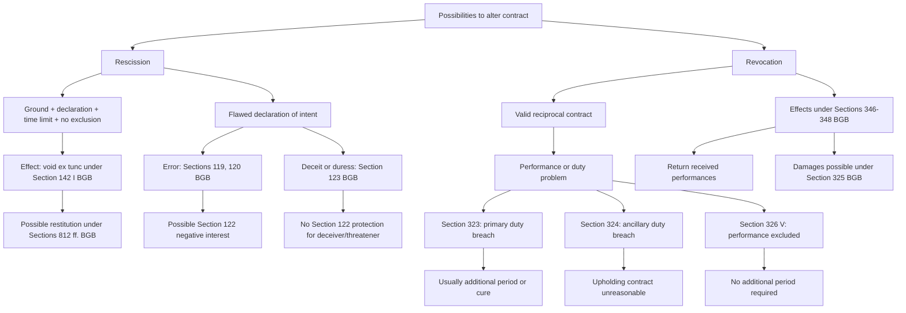
```mermaid
flowchart TD
    Termination[Possibilities to alter contract] --> Rescission[Rescission]
    Termination --> Revocation[Revocation]

    Rescission --> FlawedDoI[Flawed declaration of intent]
    FlawedDoI --> Error[Error: Sections 119, 120 BGB]
    FlawedDoI --> DeceitDuress[Deceit or duress: Section 123 BGB]
    Rescission --> RescissionSteps[Ground + declaration + time limit + no exclusion]
    RescissionSteps --> ExTunc[Effect: void ex tunc under Section 142 I BGB]
    ExTunc --> Restitution812[Possible restitution under Sections 812 ff. BGB]
    Error --> Damages122[Possible Section 122 negative interest]
    DeceitDuress --> No122[No Section 122 protection for deceiver/threatener]

    Revocation --> ValidContract[Valid reciprocal contract]
    ValidContract --> PerformanceProblem[Performance or duty problem]
    PerformanceProblem --> S323[Section 323: primary duty breach]
    PerformanceProblem --> S324[Section 324: ancillary duty breach]
    PerformanceProblem --> S326[Section 326 V: performance excluded]
    S323 --> AdditionalPeriod[Usually additional period or cure]
    S324 --> Unreasonable[Upholding contract unreasonable]
    S326 --> NoPeriod[No additional period required]
    Revocation --> Effects346[Effects under Sections 346-348 BGB]
    Effects346 --> Return[Return received performances]
    Effects346 --> Damages325[Damages possible under Section 325 BGB]
```

## Subject Knowledge Graph

| Node | Meaning | Exam Relevance |
|---|---|---|
| Rescission | Right to eradicate flawed DoI | Major remedy for formation defects |
| Ground For Rescission | Error, deceit, duress, transmission issue | First case-solving step |
| Section 119 BGB | Error grounds | Distinguishes content/declaration/characteristic errors |
| Section 123 BGB | Deceit or duress | Different time limit and no Section 122 damages |
| Section 143 BGB | Declaration of rescission | Required exercise step |
| Section 142 BGB | Ex tunc voidness | Key consequence |
| Section 122 BGB | Negative interest damages | Protects reliance in some error cases |
| Revocation | Right to undo reciprocal contract due to performance problem | Major remedy after valid contract |
| Section 323 BGB | Non-performance/improper performance | Most important revocation ground |
| Section 324 BGB | Ancillary duty breach | Uses reasonableness/intolerability |
| Section 326 V BGB | Performance excluded | Revocation without additional period |
| Sections 346-348 BGB | Restitution after revocation | Key consequence |

| From | Relationship | To | Why It Matters |
|---|---|---|---|
| Rescission | attacks | Declaration of Intent | Focus is formation defect |
| Revocation | responds to | Performance Problem | Focus is valid contract after formation |
| Section 119 BGB | can trigger | Rescission | Error grounds |
| Section 123 BGB | can trigger | Rescission | Deceit/duress grounds |
| Rescission | causes | Ex Tunc Voidness | Contract treated as void from start |
| Revocation | causes | Restitution Obligations | Contract is unwound through return duties |
| Section 323 BGB | usually requires | Additional Period | Second chance principle |
| Section 324 BGB | requires | Unreasonableness Of Upholding Contract | Ancillary-duty route |
| Section 326 V BGB | depends on | Excluded Performance | No cure period required |

## Exam Relevance

Likely exam prompts:

- What are the requirements for effective rescission?
- Distinguish error of content, error of declaration, and error in characteristics.
- Explain deceit and duress under Section 123 BGB.
- What are the effects of rescission?
- What are the requirements for effective revocation?
- Compare consequences of rescission and revocation.

Common traps:

- Calling rescission a claim instead of a right.
- Forgetting causality between ground and declaration.
- Using the wrong time limit for Section 119 vs Section 123.
- Treating revocation as ex tunc like rescission.
- Forgetting the additional period under Section 323 BGB.
- Missing that revocation can combine with damages but not double compensation.

## Official Exercise Case Routes

### Case 1a: Hotel Toilet-Paper Mistyping

Question: can H rescind an offer ordering 40,000 rolls instead of 400?

Route:

1. Formation first: H's email objectively offers to buy 40,000 rolls; hidden will is irrelevant at formation.
2. Rescission ground: not error of content under Section 119 I Alt. 1 BGB, because H knows what "40,000 rolls" means.
3. Error of declaration under Section 119 I Alt. 2 BGB: H used the wrong explanatory sign by mistyping the quantity.
4. Causality: without the typing error, H would not have declared an order for 40,000 rolls.
5. Declaration and time: H calls W immediately after discovering the mistake and explains she does not want 40,000 rolls; this satisfies Sections 143 and 121 BGB.

Result: rescission is effective; the offer is void ex tunc under Section 142 I BGB.

Exam trap: do not collapse formation and rescission. The declaration first works objectively, then can be rescinded.

### Case 1b: Truck-Rent Damages After Rescission

Question: can W claim damages for renting a truck after H rescinds under Section 119 BGB?

Route:

1. Rescission under Section 119 I Alt. 2 BGB is effective.
2. W is the recipient of the declaration and is within Section 122 I BGB.
3. No exclusion under Section 122 II BGB because W did not know and had no reason to know about H's typing error when renting the truck.
4. Damage type: negative interest / reliance damage. W must be put as if W had never trusted the declaration.

Result: W can claim the truck-rental costs under Section 122 I BGB, capped by the positive interest.

### Case 2a: Fake Competitor Offer And Deceit

Question: did R and W conclude a contract at EUR 55 per pair?

Route:

1. R offers EUR 55 per pair by invoking the alleged competitor price.
2. W accepts by lowering the price.
3. Deceit under Section 123 I Alt. 1 BGB is present: R intentionally creates an error about an external fact, the alleged lower offer.
4. Double causality is met: the false competitor offer causes W's error, and the error causes W's acceptance at EUR 55.
5. W has not yet declared rescission, but can still do so within Section 124 BGB after discovering the deceit.

Result: before rescission, the contract exists. If W declares rescission in time, W's acceptance becomes void and the contract falls away.

### Case 2b: Threat To End Business Relationship

Question: did R and W conclude the later contract at EUR 65 per pair?

Route:

1. W offers EUR 65 per pair; R accepts.
2. Duress under Section 123 I Alt. 2 BGB requires an unlawful threat.
3. W threatens to reconsider the business relationship, which is unpleasant but commercially possible.
4. Purpose is lawful: W wants a better price after R lied.
5. Threatened evil is not unlawful: trading partners may end future business if conditions are unattractive.
6. Means-purpose relationship is not unlawful because W is not a dominating indispensable supplier in the facts.

Result: no unlawful duress; no rescission ground; the EUR 65 contract is valid.

Exam trap: pressure is not automatically unlawful duress. Test purpose, threatened evil, and means-purpose relation.

### Case 3: Watch Delivery By Thursday

Question: can J revoke when S cannot deliver the watch by Thursday?

Route:

1. Reciprocal contract: purchase agreement under Section 433 BGB.
2. Due obligation: S must hand over and transfer ownership; absent other timing, performance is due immediately under Section 271 I BGB.
3. Breach: S fails to perform because the watch is away in Bavaria, but performance is not excluded under Section 275 BGB because S knows where it is and will get it back soon.
4. Additional period: J gives S until Thursday; the period is adequate given immediate due date and resale urgency.
5. Declaration: "no longer interested" is a valid revocation declaration under Section 349 BGB.

Result: revocation under Section 323 I BGB is effective.

Modification: if J did not set a period, revocation depends on an exception under Section 323 II BGB. Serious refusal is absent; a fixed-date transaction is absent unless the facts prove that the date was essential at contract conclusion; special circumstances may be arguable but require weighing.

### Case 4: Craftsman Damages Carpet And Vase

Question: can C still claim EUR 500 for renovation work?

Route:

1. Claim arose from a works contract under Section 631 I BGB.
2. The claim can be lost if H effectively revokes.
3. Section 324 BGB applies to breach of ancillary duties under Section 241 II BGB.
4. C completed the renovation work itself, but carelessly damaged the carpet and then broke a rare vase after H warned him.
5. Upholding the contract is unreasonable because C ignored a second chance and H's property interests outweigh C's payment interest.
6. H's statement that she has had enough and wants to "dissolve" the contract can be understood as revocation.

Result: the claim for payment is lost; C cannot claim the EUR 500.

Exam trap: Section 324 BGB is for ancillary-duty breaches even when primary performance is technically proper.

## Retrieval Prompts

1. State the five-step structure for rescission.
2. Distinguish the three main Section 119 error categories.
3. Why does Section 123 BGB differ from Section 119 BGB?
4. What does ex tunc mean for rescission?
5. What does Section 122 BGB compensate?
6. State the three major legal bases for revocation.
7. When is an additional period required under Section 323 BGB?
8. What are the effects of revocation under Sections 346-348 BGB?

## Practice Tasks

### Task 1: Wrong Painting

Buyer purchases a painting believed by both parties to be by a famous painter. It is later discovered to be by a student. Which rescission ground is most plausible?

Short answer guide: Section 119 II BGB, error about an essential characteristic of the item. Section 123 BGB fails if the seller did not deceive.

### Task 2: Late Payment

Buyer does not pay by the agreed date in a purchase agreement. Seller wants out. Which route?

Short answer guide: revocation under Section 323 BGB, subject to due performance, breach, and additional period or exception.

### Task 3: Rescission vs Revocation

Explain the difference in one sentence.

Short answer guide: rescission attacks flawed formation/declaration and works ex tunc; revocation responds to problems in a valid contract and creates restitution duties.

## Connections

Previous notes:

- `week-03-contract-law-i/week-03-contract-law-i.md`: declaration of intent, offer/acceptance, interpretation.
- `week-01-02-introduction-to-business-law/week-01-02-introduction-to-business-law.md`: statutory if-then analysis and interpretation.

Future links:

- Contract Law III adds withdrawal, cancellation, and dissolution to the termination decision tree.

## Weakness Flags

- Pending active-recall session.

## Open Uncertainties

- The deck uses "revocation" for Rücktritt-like termination from reciprocal contracts. Keep it separate from consumer withdrawal in Week 5, which is also sometimes translated differently in English.


<div class="page-break"></div>

# [W04.2] Week 04 Contract Law II Rescission Revocation Cheatsheet And Tricks

<p class="source-path">Source: <code>business-law/wiki/week-04-contract-law-ii-rescission-revocation/week-04-contract-law-ii-rescission-revocation-cheatsheet-and-tricks.md</code></p>

Course: Business Law
Exam date: 2026-07-28
Source: week-04-contract-law-ii-rescission-revocation.md, active-recall-session-2026-05-26.md, clarification-session-2026-05-25.md

## Must-Know (exam-critical)

| Item | Anchor | Core content |
|---|---|---|
| Routing question | — | Rescission = flawed declaration at formation. Revocation = valid reciprocal contract, performance went wrong. Ask this before touching any section. |
| Error of content | Section 119 I Alt. 1 BGB | Declaror says what they intended but misunderstands its meaning. |
| Error of declaration | Section 119 I Alt. 2 BGB | Declaror uses the wrong sign/number/word/click (typo cases). |
| Error about essential characteristics | Section 119 II BGB | Mistake about an essential attribute of a person or thing (e.g., authorship of an artwork). |
| Transmission error | Section 120 BGB | Messenger/system/channel changes the declaration in transit. |
| Deceit | Section 123 I Alt. 1 BGB | Intentional creation/maintenance of an error about facts; double causality: deceit causes error, error causes declaration. |
| Duress | Section 123 I Alt. 2 BGB | Unlawful threat of a future evil; test purpose, threatened evil, and means-purpose relation for unlawfulness. |
| Declaration of rescission | Section 143 I, II BGB | Must be declared to the contracting partner; no fixed form; interpreted broadly under 133/157. |
| Time limits | Sections 121 I, 124 I BGB | 119/120 errors: without undue delay. 123 deceit/duress: within one year. Max 10 years overall. |
| Exclusion | Section 144 BGB | Confirming the transaction after learning of the defect bars rescission. |
| Rescission effect | Section 142 I BGB | Void from the beginning (ex tunc). |
| Reliance damages | Section 122 BGB | Negative interest for the other party's reliance in error cases (119/120) — not available against a deceiver/threatener under 123. |
| Revocation — primary duty | Section 323 I BGB | Non-performance or improper performance of a main duty; needs additional period (Nachfrist) unless dispensable. |
| Revocation — ancillary duty | Section 324 BGB | Breach of a protective/cooperation duty (241 II) that makes upholding the contract unreasonable for the obligee. |
| Revocation — excluded performance | Section 326 V BGB | Performance excluded (usually impossibility, 275); no additional period required. |
| Declaration of revocation | Section 349 BGB | Revocation must be actively declared — it does not happen automatically. |
| Revocation effect | Sections 346-348 BGB | Restitution: received performances returned, generally concurrently (348); compensation if return is impossible (346 II). |
| Damages alongside revocation | Section 325 BGB | Can coexist with revocation, but no double compensation. |

## Nice-to-Have (depth/edge cases)

- Additional-period dispensability under Section 323 II BGB: serious/definitive refusal, fixed-date transaction, or special circumstances remove the need for a Nachfrist.
- Section 326 V case pattern: no cure period is even conceptually possible once performance is objectively impossible (e.g., destroyed unique item) — do not test for a deadline there.
- The Picasso-style essential-characteristic case only works under 119 II if neither side knew the truth; if the seller lied about authorship, it becomes a 123 deceit case instead.
- Section 122 BGB damages are capped at the positive interest (what the other party would have gained from a valid contract) even though they compensate negative interest.
- Restitution under 346-348 is not automatically ex nunc in name — it is a return-of-performance mechanism distinct from both ex tunc (rescission) and ordinary termination-for-the-future (cancellation, covered in Week 5).

## Nuances And Traps

| Nuance/Trap | Why it's easy to get wrong | Correct handling |
|---|---|---|
| Error of content vs. error of declaration | Both feel like "the buyer didn't mean that," so it's tempting to default to 119 I Alt. 1 | If the wrong sign/number/word was physically typed or said (e.g., typing 1,000 instead of 100), it is 119 I Alt. 2, not 119 I Alt. 1 — content error is a meaning misunderstanding, declaration error is a slip in the sign itself. |
| Legal-consequence language for rescission | Students say "revocation of declaration" out of habit | Say "void ex tunc under Section 142 I BGB" — never call rescission's result a "revocation." |
| Section 323 vs. Section 324 routing | Both apply after a valid contract, so it's tempting to reach for 324 whenever something "feels serious" | 323 = primary duty (the thing itself is late/missing/defective). 324 = ancillary/protective duty (collateral harm, trust breach) while the primary performance is fine or already done. A machine that fails to work is 323, not 324, even though the breach feels severe. |
| Declaration vs. effects, revocation | Easy to jump straight to "everything gets returned" and skip the exercise step | Revocation must first be declared under Section 349 BGB; only then do Sections 346-348 BGB effects follow. Keep the two as separate answer paragraphs. |
| Declaration vs. effects, rescission | Same pattern as above, mirrored | Rescission must be declared under Section 143 I BGB; only then does Section 142 I BGB voidness follow. |
| "Void from now on" for revocation | Confusing revocation with rescission's ex tunc effect | Revocation never produces ex tunc voidness — it transforms the valid contract into a restitution relationship (return desk), not a retroactive eraser. |
| Every threat is "duress" | Facts describing commercial pressure (e.g., threatening to end a business relationship) look intuitively unlawful | Test purpose, threatened evil, and means-purpose relation — ordinary commercial leverage (e.g., "I'll take my business elsewhere") is usually lawful, not Section 123 duress. |
| Deceit vs. duress labeling | Facts specifying a lie get answered as "deceit or duress" | If the facts show only a lie, it is Section 123 I Alt. 1 deceit — do not hedge with duress unless an actual threat is also present. |
| Section 122 in deceit cases | Assuming reliance damages always follow rescission | Section 122 BGB reliance damages apply in error cases (119/120), not in Section 123 deceit/duress cases — the deceiver/threatener gets no protection. |
| Notation precision | Writing "119 2" instead of the full cite | Always write the full statutory cite: "Section 119 I Alt. 2 BGB," not shorthand — graders read this as a precision signal. |

## One-Line Recall Drill

```text
119 I Alt. 1 = content error
119 I Alt. 2 = declaration error (typo)
119 II = essential-characteristic error
120 = transmission error
123 = deceit / duress (double causality)
143 = declare rescission
121 = without undue delay (119/120)
124 = one year (123)
144 = confirmation excludes
142 I = void ex tunc
122 = reliance damages, error cases only
323 = primary duty fails, usually needs Nachfrist
324 = ancillary duty breaks trust, unreasonable to continue
326 V = performance excluded/impossible, no Nachfrist
349 = declare revocation
346-348 = restitution, concurrent
325 = damages can coexist, no double compensation
```


<div class="page-break"></div>

# [W04.3] Week 04 Contract Law II Rescission Revocation Practice Questions And Model Answers

<p class="source-path">Source: <code>business-law/wiki/week-04-contract-law-ii-rescission-revocation/week-04-contract-law-ii-rescission-revocation-practice-questions-and-model-answers.md</code></p>

Course: Business Law
Exam date: 2026-07-28
Source: week-04-contract-law-ii-rescission-revocation.md, week-04-contract-law-ii-rescission-revocation-cheatsheet-and-tricks.md
Format note: 22 questions — 10 short-answer/theory, 12 case/legal-opinion (schema-based). Case questions integrate Week 06 Standard Business Terms (Question 8), Week 05 Withdrawal/Cancellation/Dissolution (Question 16), Week 09 Warranty Rights II (Question 17), and Week 07 Agency (Question 22). Questions 19-22 were added in a coverage-gap audit pass to cover the void-vs-voidable distinction, the 121-vs-124 deadline-selection trap, the Section 122 II bad-faith exclusion, and Section 166 I attribution through a representative.

## Short-Answer / Theory Questions

### Question 1

Compare rescission and revocation: what triggers each, what section anchors each, and what consequence follows?

**Model Answer:**

Rescission attacks a declaration of intent that was flawed at the moment it was made, anchored in Sections 119, 120, or 123 BGB, and leads to voidness from the beginning (ex tunc) once effectively declared under Section 142 I BGB. Revocation reacts to a performance problem in an otherwise valid reciprocal contract, anchored in Sections 323, 324, or 326 V BGB, and transforms the original obligations into restitution duties under Sections 346-348 BGB rather than erasing the contract retroactively.

Contrast example: a buyer who typed the wrong quantity in an order (Section 119 I Alt. 2) rescinds the declaration itself; a buyer who never receives the goods on time (Section 323 I) revokes a contract that was validly formed.

Exam trap: do not use revocation for a flawed declaration or rescission for a late/defective performance — the two routes answer different questions (was the declaration itself broken, or did a valid deal go wrong later) and mixing them up misroutes the entire answer.

### Question 2

Explain deceit and duress under Section 123 BGB.

**Model Answer:**

1. Deceit (Section 123 I Alt. 1 BGB) is the intentional creation or maintenance of an error about facts in another person, done to induce a declaration of intent; duress (Section 123 I Alt. 2 BGB) is an unlawful threat of a future evil that the threatening party claims to influence, made to induce a declaration.
2. Statutory anchor: Section 123 I BGB, with the one-year time limit for rescission under Section 124 I BGB.
3. Requirements: (1) for deceit, an intentional false representation or concealment of a fact and double causality (the deceit causes the error, the error causes the declaration); (2) for duress, an unlawful threat, tested through the threatened evil, the desired success, and the means-purpose relationship between them; (3) for both, the deceived/coerced party must not yet have confirmed the transaction under Section 144 BGB.
4. Example: a seller falsely claiming a rival offer is lower to pressure a buyer into a discount is deceit; a supplier threatening physical harm unless a contract is signed is duress. Ordinary commercial pressure, such as threatening to end a business relationship over unattractive terms, is usually lawful and not duress.
5. Consequence/trap: unlike error-based rescission under Section 119/120, Section 122 reliance damages do not protect a deceiver or a party using duress — the exam trap is assuming Section 122 always follows a successful rescission.

### Question 3

State the five-step structure required to establish effective rescission.

**Model Answer:**

The requirements are:
1. A ground for rescission and causality between that ground and the declaration issued (Sections 119, 120, or 123 BGB).
2. A declaration of rescission addressed to the correct recipient, generally the contracting partner (Section 143 I, II BGB).
3. Compliance with the applicable time limit — without undue delay for Sections 119/120 (Section 121 I BGB), or within one year for Section 123 (Section 124 I BGB).
4. No exclusion, in particular no confirmation of the transaction after learning of the defect (Section 144 BGB).
5. The legal effect: the declaration is void from the beginning, ex tunc (Section 142 I BGB).

If these are met, the transaction is treated as if it never existed, subject only to possible restitution under Sections 812 ff. BGB and, in error cases, reliance damages under Section 122 BGB. The rule exists because private autonomy should not bind a party to a declaration they never actually intended, provided the flaw is proven and asserted promptly.

### Question 4

Compare revocation under Section 323 BGB and revocation under Section 324 BGB.

**Model Answer:**

Section 323 BGB triggers when a party fails to render, or improperly renders, a primary performance duty in a reciprocal contract (e.g., the seller does not deliver, the buyer does not pay); it generally requires the creditor to set an additional period (Nachfrist) for performance or cure, unless that period is dispensable under Section 323 II BGB (serious and definitive refusal, a fixed-date transaction, or special circumstances). Section 324 BGB triggers when a party breaches an ancillary or protective duty under Section 241 II BGB — a duty collateral to the main performance — and the breach makes upholding the contract unreasonable for the other party; no Nachfrist is required because the breach is not something a second chance would cure.

Contrast example: a machine that simply never arrives is a Section 323 case; a repair technician who insults or injures the customer while performing an otherwise proper repair is a Section 324 case.

Exam trap: do not reach for Section 324 just because a breach "feels serious" — if the breach concerns the primary performance itself (even a badly performed one), it is Section 323, not Section 324.

## Case / Legal-Opinion Questions

### Question 5 (Case)

**Facts:** Anna, a bakery owner, wants to order flour for her shop. She emails her regular supplier, Korn GmbH, intending to type "100 kg" but mistakes the number pad and types "1,000 kg" instead. Korn GmbH accepts the order the same afternoon. The next morning, Anna sees the confirmation email, immediately calls Korn GmbH, and explains she meant to order only 100 kg.

**Question:** Can Anna rescind her order?

**Model Answer:**

I. **Issue sentence.** Anna's order for 1,000 kg could be void from the beginning under Section 142 I BGB if she effectively rescinds it under Section 119 BGB.

II. **Requirements.**
   I. A ground for rescission with causality.
   II. A declaration of rescission to the correct recipient (Section 143 BGB).
   III. Compliance with the time limit (Section 121 BGB).
   IV. No exclusion under Section 144 BGB.
   V. Legal consequence under Section 142 I BGB.

III. **Application.**
   Requirement I: Questionable is whether Anna's mistake is an error of content (Section 119 I Alt. 1) or an error of declaration (Section 119 I Alt. 2). This is supported by the fact that Anna knew exactly what "100 kg" and "1,000 kg" mean — she did not misunderstand the meaning of the words, she physically typed the wrong sign. Against this, one could argue any numerical slip looks like a content misunderstanding, but however, the mistake occurred in producing the declaration itself, not in Anna's understanding of it. Consequently, this is an error of declaration under Section 119 I Alt. 2 BGB. Causality is met: without the typing slip, Anna would not have declared an order for 1,000 kg.
   Requirement II: Anna's phone call to Korn GmbH the next morning, explaining she meant a different quantity, is a declaration of rescission addressed to the correct contracting partner, satisfying Section 143 I, II BGB even without any fixed wording, since layperson declarations are interpreted broadly under Sections 133, 157 BGB.
   Requirement III: Anna acted the morning after seeing the confirmation — this is without culpable delay, satisfying Section 121 I BGB.
   Requirement IV: Nothing in the facts suggests Anna confirmed the 1,000 kg order after discovering the error, so Section 144 BGB does not exclude rescission.

IV. **Interim results.** All four requirements are met.

V. **Final answer.** As a result, Anna's rescission is effective, and her order for 1,000 kg of flour is treated as void from the beginning under Section 142 I BGB.

### Question 6 (Case)

**Facts:** Ben wants to sell his used car to Clara. To get a better price, Ben falsely tells Clara that another buyer already offered EUR 12,000, when in truth no such offer exists. Believing this, Clara agrees to pay EUR 11,500, higher than she originally intended. Two months later, Clara learns from a mutual friend that Ben invented the rival offer.

**Question:** Can Clara escape the EUR 11,500 purchase contract?

**Model Answer:**

I. **Issue sentence.** Clara's purchase contract at EUR 11,500 could be treated as void from the beginning under Section 142 I BGB if she effectively rescinds it under Section 123 I Alt. 1 BGB.

II. **Requirements.**
   I. Deceit: an intentional false representation of fact.
   II. Double causality: the deceit caused Clara's error, and the error caused her declaration.
   III. Declaration of rescission to Ben (Section 143 BGB).
   IV. Compliance with the one-year time limit (Section 124 I BGB).
   V. No exclusion under Section 144 BGB.

III. **Application.**
   Requirement I: Questionable is whether Ben's invented rival offer counts as deceit. This is supported by the fact that Ben knowingly stated a fact — the existence of a EUR 12,000 offer — that was false, intending Clara to rely on it. Consequently, this is an intentional false representation satisfying Section 123 I Alt. 1 BGB.
   Requirement II: Clara's belief in the fictitious offer caused her to misjudge the market value of the car, and that misjudgment caused her to agree to a higher price than intended. Both links of causality are present.
   Requirement III: Once Clara raises the issue with Ben (declares rescission), this satisfies Section 143 BGB; no particular form is required.
   Requirement IV: Clara has up to one year from discovering the deceit to rescind (Section 124 I BGB) — she is still within time two months after learning the truth.
   Requirement V: Nothing indicates Clara confirmed the contract after learning of Ben's lie, so Section 144 BGB does not bar rescission.

IV. **Interim results.** All requirements are met once Clara actually declares rescission to Ben.

V. **Final answer.** As a result, if Clara declares rescission within the one-year period, the EUR 11,500 purchase contract is treated as void from the beginning under Section 142 I BGB, and any exchanged performance is unwound; Clara cannot additionally claim Section 122 reliance damages, since that protection does not extend to a deceiver like Ben.

### Question 7 (Case)

**Facts:** Café owner Dana orders a custom espresso machine from Roast Technik for EUR 8,000, due for delivery by June 1 so the café can open on schedule. June 1 passes with no delivery and no communication from Roast Technik. On June 3, Dana calls, gives Roast Technik until June 10 to deliver, and states clearly that she has no further use for the machine after that. June 10 passes; the machine still has not arrived.

**Question:** Can Dana get out of the contract and recover any payment already made?

**Model Answer:**

I. **Issue sentence.** Dana could have a right to revoke the purchase contract under Section 323 I BGB, entitling her to restitution under Sections 346-348 BGB.

II. **Requirements.**
   I. A reciprocal contract.
   II. A due and enforceable performance obligation.
   III. Non-performance or improper performance.
   IV. An additional period for performance, unless dispensable.
   V. A declaration of revocation (Section 349 BGB) and its effects (Sections 346-348 BGB).

III. **Application.**
   Requirement I: The contract for the custom espresso machine is a reciprocal purchase-type agreement — Roast Technik owes the machine, Dana owes the price — satisfying the "I give, you give" structure.
   Requirement II: Delivery was due by June 1, a specific agreed date, so the obligation was due and enforceable from that point.
   Requirement III: Roast Technik did not deliver by June 1 or at any point afterward — non-performance is established.
   Requirement IV: Dana set an additional period running to June 10 on June 3, which is a reasonable further chance to perform. Even though an additional period was actually given here (so dispensability under Section 323 II BGB does not need to be argued), the facts would also support dispensability given the fixed date tied to the café's opening.
   Requirement V: Dana's statement that she "has no further use for the machine" after June 10, once that date passes without delivery, functions as a valid declaration of revocation under Section 349 BGB.

IV. **Interim results.** All requirements for revocation under Section 323 I BGB are met, and revocation was validly declared.

V. **Final answer.** As a result, Dana can revoke the contract; her payment obligation falls away, and any amount already paid must be returned to her under Sections 346-348 BGB, with return duties performed concurrently under Section 348 BGB.

### Question 8 (Case — integrates Week 04 + Week 06)

**Facts:** Merchant Petra orders a packaging machine from manufacturer Fassel GmbH. During the sales visit, Fassel's agent verbally assures Petra the machine processes "up to 500 units per hour," and this throughput figure is the main reason Petra chooses this machine over a competitor's. The written supply contract Fassel presents — its standard pre-printed 20-page form used for every customer — contains a clause buried in Section 14, in the same small font as the rest of the document, stating: "Any dispute regarding technical specifications communicated verbally during the sales process is excluded from this contract." After delivery, Petra discovers the machine only processes 300 units per hour, and it later emerges that Fassel's agent knew the true figure was 300 and quoted 500 anyway to close the sale. Petra wants out of the contract entirely.

**Question:** Can Petra escape the contract, and does Fassel's Section 14 clause block her from raising the throughput issue?

**Model Answer:**

I. **Issue sentence.** Petra's purchase contract could be void from the beginning under Section 142 I BGB if she effectively rescinds under Section 123 I Alt. 1 BGB; separately, Fassel's Section 14 clause could fail to become part of the contract, or could be ineffective, under the Standard Business Terms regime (Sections 305 ff. BGB).

II. **Requirements.**
   I. Rescission for deceit: an intentional false representation and double causality.
   II. Whether the Section 14 clause qualifies as SBT (Section 305 I BGB).
   III. Whether the clause is incorporated, or excluded as surprising (Section 305c I BGB).
   IV. Whether the clause survives content control (Sections 307-309 BGB) if incorporated.
   V. Final routing: which claim/defense actually helps Petra.

III. **Application.**
   Requirement I: Questionable is whether Fassel's throughput statement is deceit. This is supported by the fact that Fassel's agent knew the true figure was 300 units per hour and stated 500 anyway, specifically to induce Petra's purchase — an intentional false representation of fact. Double causality is met: the false figure caused Petra's belief that the machine met her needs, and that belief caused her decision to buy. Consequently, Section 123 I Alt. 1 BGB is satisfied, independent of any contract clause.
   Requirement II: Fassel's 20-page form is used for every customer, was drafted in advance, and was presented unilaterally by Fassel — this satisfies the Section 305 I BGB definition of Standard Business Terms; nothing suggests Petra individually negotiated the clause, so Section 305 I sentence 3 does not remove SBT status.
   Requirement III: Questionable is whether the clause was properly incorporated or excluded as surprising. Against incorporation, one could argue the clause is buried in Section 14 of a 20-page document in ordinary font, disclaiming exactly the kind of pre-contractual assurance that drove Petra's purchase decision — an unusual placement and content that Petra need not have expected. However, if Fassel can show the clause was clearly flagged and reviewable, incorporation under Section 305 II BGB might still succeed; on these facts, the buried placement combined with its content (waiving liability for representations central to the sale) supports treating it as a surprising clause under Section 305c I BGB, meaning it does not become part of the contract at all.
   Requirement IV: Even if the clause were incorporated, a clause attempting to exclude liability for the seller's own deceit conflicts with the same public-policy logic that bars excluding liability for fraud elsewhere in the code (compare Section 444 BGB's fraud override in warranty law) — such a clause unreasonably disadvantages the other party under Section 307 BGB and would fail content control regardless.
   Requirement V: Because the clause fails on either route (non-incorporation or content control), it cannot block Petra's rescission claim; the clause, if it fell away, would leave the rest of the contract in place under Section 306 BGB — but that is irrelevant here because Petra is not merely attacking the clause, she is attacking the entire declaration via rescission.

IV. **Interim results.** Rescission for deceit is independently established; the SBT clause is either not incorporated or fails content control, and in neither case can it shield Fassel from the deceit-based rescission.

V. **Final answer.** As a result, Petra can rescind the entire contract under Section 123 I Alt. 1 BGB within one year of discovering the deceit (Section 124 I BGB), and Fassel's Section 14 clause does not prevent her from raising the throughput misrepresentation — the clause cannot immunize a party against its own deceit, whether analyzed as a failure of incorporation or a failure of content control.

### Question 9

Explain the three main error categories under Section 119 BGB and give an example distinguishing all three.

**Model Answer:**

1. Section 119 BGB provides three distinct rescission grounds for a mistaken declaration of intent, each addressing a different point where the mistake can occur.
2. Statutory anchor: Section 119 I Alt. 1 BGB (error of content), Section 119 I Alt. 2 BGB (error of declaration), Section 119 II BGB (error about essential characteristics).
3. Requirements/features: (1) error of content — the declaror says exactly what they intended but misunderstands the legal or factual meaning of their own words; (2) error of declaration — the declaror uses a different sign, number, word, or click than intended, i.e., a slip in producing the declaration itself; (3) error about essential characteristics — the declaror's will and declaration match, but the declaror is mistaken about an essential attribute of a person or thing central to the transaction (e.g., authorship of a painting).
4. Example: believing "a dozen" means 6 rather than 12 is an error of content; typing "1,000" while meaning "100" is an error of declaration; buying a painting believing it is by a famous painter when it is by a student is an error about an essential characteristic.
5. Trap: do not default to error of content whenever a mistake "feels like a misunderstanding" — if the wrong sign was physically produced (typed, clicked, spoken), it is always Section 119 I Alt. 2, not Alt. 1; a mere miscalculation of value or a disappointed expectation about future events is not an essential characteristic under Section 119 II.

### Question 10

List the requirements for revocation under Section 324 BGB and explain why no additional period (Nachfrist) is needed.

**Model Answer:**

The requirements are:
1. A reciprocal contract between the parties.
2. A breach of a duty under Section 241 II BGB — a protective or cooperation duty collateral to the main performance, not the main performance itself.
3. As a result of that breach, upholding the contract can no longer reasonably be expected of the obligee (unreasonableness/intolerability).
4. A causal relation between the breach and that unreasonableness.

No additional period is required because Section 324 targets a breach of trust or a protective duty (e.g., damaging the creditor's belongings, insulting or injuring the creditor) rather than a correctable performance shortfall — giving the debtor "a second chance" makes sense for a late or defective delivery (Section 323), but not for conduct that has already destroyed the basis for continuing the relationship. The rule exists because forcing a party to keep dealing with someone who breached trust in this way, merely to give them a chance to "try again," would not restore what was actually damaged.

### Question 11

Explain what Section 122 BGB compensates, who can claim it, and its two key limits.

**Model Answer:**

1. Section 122 BGB is the reliance-damages provision that follows certain rescissions, protecting the other party's trust in the validity of a declaration that turned out to be voidable.
2. Statutory anchor: Section 122 I BGB (the claim), Section 122 II BGB (the main exclusion).
3. Requirements/features: (1) it compensates negative interest — the position the claimant would have been in had they never trusted the declaration — not positive interest (the benefit of the bargain); (2) it is available to the recipient of a rescinded declaration in error cases under Sections 119 and 120 BGB; (3) Limit one: it is excluded entirely for rescission under Section 123 BGB (deceit/duress) — the deceiver or threatener gets no reliance protection; (4) Limit two: even where available, it is capped at the positive interest, so the claimant can never recover more via Section 122 than they would have gained from a valid contract.
4. Example: a truck-rental cost incurred by a recipient who relied on a now-rescinded declaration (a Section 119 I Alt. 2 typo case) is recoverable negative interest; if a seller deceives a buyer and the buyer rescinds under Section 123, the deceiving seller cannot claim Section 122 damages for their own lost preparations.
5. Trap: do not assume Section 122 automatically follows every successful rescission — check first whether the ground was an error (119/120, where 122 is available) or deceit/duress (123, where 122 is barred).

### Question 12

Compare the default rule and the exception for the additional period (Nachfrist) requirement under Section 323 BGB.

**Model Answer (Compare Schema):**

As a default rule, Section 323 I BGB requires the creditor to set the debtor an additional period (Nachfrist) for performance or cure before revoking — the debtor gets a genuine second chance, since revocation is a serious remedy that unwinds the contract. As an exception, Section 323 II BGB dispenses with this requirement in three situations: a serious and definitive refusal to perform, a fixed-date (absolute) transaction where the date was essential to the deal, or other special circumstances that, weighed against both parties' interests, justify immediate revocation. Contrast example: a buyer who simply hasn't paid by an ordinary due date must be given a further deadline before the seller can revoke; a wedding planner who ordered a custom cake for a specific Saturday wedding, and who is told two days before that the baker refuses outright to deliver, need not set a further deadline because the serious-refusal and fixed-date exceptions both apply. Exam trap: do not treat Section 323 II as optional window-dressing — if none of the three exceptions is argued and supported by the facts, a revocation declared without ever having set an additional period is invalid, regardless of how obviously flawed the debtor's performance was.

### Question 13

Explain the Section 326 V BGB revocation route and why it requires no additional period.

**Model Answer:**

1. Section 326 V BGB is the third revocation ground, alongside Sections 323 and 324 BGB, and applies when the debtor's duty to perform is excluded altogether.
2. Statutory anchor: Section 326 V BGB, generally triggered together with Section 275 I-III BGB (impossibility or its equivalents).
3. Requirements/features: (1) a reciprocal contract; (2) the debtor's performance duty is excluded under Section 275 I-III BGB — most commonly genuine impossibility, but also the disproportionate-effort and personal-unconscionability variants of Section 275 II-III; (3) once performance is excluded, the creditor may revoke without first setting an additional period.
4. Example: if the unique item a seller promised to deliver is destroyed before delivery, the seller's performance duty is excluded under Section 275 I BGB, and the buyer may revoke immediately under Section 326 V BGB.
5. Trap: do not ask whether the debtor was given "a fair second chance" in a Section 326 V case — an additional period is conceptually pointless once performance is genuinely impossible, so no Nachfrist analysis belongs in this route at all, unlike Section 323.

### Question 14 (Case)

**Facts:** Retailer Theo asks his new employee, Milo, to phone in an order to supplier Solvent AG for "200 boxes" of packaging tape. Milo, misreading his own handwritten note, tells Solvent AG's order line "2,000 boxes." Solvent AG confirms the order for 2,000 boxes the same day. Theo discovers the mistake three days later when he receives the shipping notice, and calls Solvent AG immediately to say the order should have been for 200 boxes.

**Question:** Can Theo rescind the order for 2,000 boxes?

**Model Answer:**

I. **Issue sentence.** Theo's order for 2,000 boxes could be void from the beginning under Section 142 I BGB if he effectively rescinds it under Section 120 BGB.

II. **Requirements.**
   I. A transmission error and causality.
   II. A declaration of rescission to the correct recipient (Section 143 BGB).
   III. Compliance with the time limit (Section 121 BGB).
   IV. No exclusion under Section 144 BGB.
   V. Legal consequence under Section 142 I BGB.

III. **Application.**
   Requirement I: Questionable is whether Milo's misreading of Theo's note counts as a transmission error under Section 120 BGB rather than an error attributable to Theo himself. This is supported by the fact that Theo correctly formed and recorded his own intent — "200 boxes" — and the change occurred only when Milo, acting as the transmitting person/channel between Theo's intent and Solvent AG, mis-relayed that content. Against this, one could argue Milo is simply an employee whose mistakes are Theo's own responsibility; however, Section 120 BGB is specifically designed to cover exactly this situation — a person or channel entrusted with passing on a declaration who unintentionally changes it in transit — and an employee tasked purely with relaying an order to a third party functions as such a transmission channel, not as the person forming the declaration. Consequently, this is a transmission error under Section 120 BGB. Causality is met: without Milo's misreading, the order transmitted to Solvent AG would have stated 200 boxes.
   Requirement II: Theo's phone call to Solvent AG three days later, explaining the correct quantity, is a declaration of rescission addressed to the correct contracting partner, satisfying Section 143 I, II BGB without any required form.
   Requirement III: Theo acted as soon as he discovered the mistake via the shipping notice — this is without culpable delay, satisfying Section 121 I BGB.
   Requirement IV: Nothing in the facts suggests Theo confirmed the 2,000-box order after learning of the error, so Section 144 BGB does not exclude rescission.

IV. **Interim results.** All four requirements are met.

V. **Final answer.** As a result, Theo's rescission is effective, and the order for 2,000 boxes is treated as void from the beginning under Section 142 I BGB; Solvent AG may have a Section 122 BGB reliance-damages claim for any costs incurred trusting the 2,000-box order, since Section 120 is an error ground (not a Section 123 case) and Section 122 protection is not excluded here.

### Question 15 (Case)

**Facts:** Delivery driver Igor works for a moving company hired by homeowner Nadia to move her furniture between two apartments. During the move, Igor properly transports and reassembles all of Nadia's furniture without any damage or delay — the primary performance is complete and correct. However, while in Nadia's apartment, Igor repeatedly makes hostile, insulting remarks about Nadia's belongings and, after Nadia asks him to stop, deliberately shoves a lamp off a table, breaking it. Nadia refuses to pay the final invoice and tells the moving company she wants nothing further to do with them.

**Question:** Can Nadia validly withhold payment via revocation, even though the move itself was completed properly?

**Model Answer:**

I. **Issue sentence.** Nadia could have a right to revoke the moving contract under Section 324 BGB, releasing her from the payment obligation despite the move itself having been performed correctly.

II. **Requirements.**
   I. A reciprocal contract.
   II. A breach of an ancillary/protective duty under Section 241 II BGB.
   III. Upholding the contract is no longer reasonable for Nadia (unreasonableness).
   IV. Causal relation between the breach and that unreasonableness.
   V. A declaration of revocation (Section 349 BGB) and its effects (Sections 346-348 BGB, adapted for services already rendered).

III. **Application.**
   Requirement I: The moving contract, under which the company owes the move and Nadia owes payment, is a reciprocal contract.
   Requirement II: Questionable is whether Igor's conduct is a Section 324 ancillary-duty breach rather than a Section 323 primary-duty problem. This is supported by the fact that the primary performance — transporting and reassembling the furniture — was completed without damage or delay; the problem lies entirely in Igor's hostile remarks and deliberate destruction of the lamp, which are protective/cooperation-duty violations under Section 241 II BGB collateral to the move itself. Against this, one could argue any property damage during a move is simply bad primary performance; however, the lamp-breaking was not a mishap in the course of moving furniture but a deliberate, hostile act unconnected to performing the move correctly. Consequently, this is a Section 324 ancillary-duty breach, not a Section 323 case.
   Requirement III: Igor's continued insults after being asked to stop, followed by deliberately damaging Nadia's property, mean the basis of trust needed to accept services from this company (through this employee) in Nadia's own home has been destroyed — upholding the contract, including payment, can no longer reasonably be expected of her.
   Requirement IV: The unreasonableness flows directly from Igor's conduct — there is no intervening cause.
   Requirement V: Nadia's statement that she wants "nothing further to do with them," combined with her refusal to pay, functions as a valid declaration of revocation under Section 349 BGB.

IV. **Interim results.** All requirements for revocation under Section 324 BGB are met, and revocation was validly declared.

V. **Final answer.** As a result, Nadia can revoke the moving contract under Section 324 BGB despite the furniture having been moved correctly; her payment obligation falls away under the resulting restitution relationship, though she would need to compensate the moving company for the objective value of services she cannot practically "return," while separately, Igor's deliberate lamp-breaking may support a damages claim against the company under Section 325 BGB alongside the revocation.

### Question 16 (Case — integrates Week 04 + Week 05)

**Facts:** Consumer Lena, browsing an online furniture shop from her home, intends to click "Add to Cart" on the standard "ErgoMesh" office chair (EUR 180) but accidentally clicks the adjacent "Leather Executive" chair (EUR 650) instead, and completes checkout without noticing. The Leather Executive chair is a standard, mass-produced model sold to any customer — nothing about it is custom-made. It arrives five days later; Lena immediately realizes her mistake upon opening the box and wants to send it back and get her money back. The shop's order confirmation email included a properly worded 14-day withdrawal notice as required by law.

**Question:** What routes are available to Lena, and which should she use?

**Model Answer:**

I. **Issue sentence.** Lena could be released from the Leather Executive purchase either by rescinding under Section 119 I Alt. 2 BGB or by withdrawing under Sections 355, 312c BGB, and the two routes need to be assessed separately since neither doctrine displaces the other on these facts.

II. **Requirements.**
   I. Rescission: a ground under Section 119 I Alt. 2 BGB with causality, a timely declaration, and no exclusion.
   II. Withdrawal: personal scope (Section 13 BGB consumer), material scope (Section 312c BGB distance contract), no exclusion under Section 312g II BGB, and a timely declaration under Section 355 BGB.
   III. Relationship between the two available routes and practical recommendation.

III. **Application.**
   Requirement I: Questionable is whether Lena's mis-click is an error of declaration. This is supported by the fact that Lena knew exactly what she wanted — the EUR 180 ErgoMesh chair — but used the wrong sign (clicking the adjacent product) when producing her declaration, exactly the pattern of Section 119 I Alt. 2 BGB rather than a content misunderstanding. Causality is met: without the mis-click, she would not have declared an order for the Leather Executive chair. However, rescission also demands a timely declaration "without undue delay" (Section 121 I BGB) once she discovers the error — she must act now, upon opening the box, or risk losing this route.
   Requirement II: Lena is a consumer acting outside any trade or profession (Section 13 BGB) buying from a business (Section 14 BGB) through means of distance communication with no simultaneous physical presence of both parties (Section 312c BGB) — the distance-contract withdrawal right applies. The chair is a standard, mass-produced item, not custom-made, and nothing suggests it is quickly perishable, so no Section 312g II BGB exclusion applies. Since the shop gave proper withdrawal instructions, Lena's 14-day period runs from receipt of the goods (Section 355 II BGB) and has not yet expired five days in.
   Requirement III: Nothing in either doctrine excludes the other — a consumer is not barred from rescinding merely because a withdrawal right also exists, and exercising withdrawal does not require proving any error at all. Withdrawal is procedurally the safer and simpler route: it needs no causality analysis, no proof of what Lena "really" meant to click, and no justification whatsoever (Section 355 I BGB), whereas rescission would require Lena to establish and timely assert an error of declaration, with any delay risking exclusion under Section 121 I BGB. Consequently, while both routes are technically open to her right now, withdrawal is the more reliable path.

IV. **Interim results.** Both a Section 119 I Alt. 2 rescission ground and a Section 355/312c withdrawal right are currently available and unexcluded; they coexist rather than displace one another.

V. **Final answer.** As a result, Lena can get out of the Leather Executive purchase and recover her payment either way, but she should exercise the Section 355 withdrawal right within the 14-day period, since it requires no proof of error or causality and cannot be defeated by an "undue delay" argument the way rescission could.

### Question 17 (Case — integrates Week 04 + Week 09)

**Facts:** Used-car dealer Voss sells a car to buyer Petros, telling him the odometer reading of 40,000 km is accurate. In truth, Voss knows the car has actually been driven 120,000 km and had the odometer rolled back before the sale. Petros buys the car for EUR 18,000. Three months later, a routine service reveals the true mileage. Petros wants to know his options.

**Question:** Can Petros rescind the purchase, claim warranty damages, or both — and how do the two routes interact?

**Model Answer:**

I. **Issue sentence.** Petros could rescind the purchase under Section 123 I Alt. 1 BGB, or pursue warranty damages under Sections 437 No. 3, 280 I, III BGB, and the two routes must be evaluated as independent options arising from the same deceit.

II. **Requirements.**
   I. Rescission for deceit: an intentional false representation and double causality.
   II. Warranty damages: a defect at transfer of risk (Section 434 BGB, referenced via Section 437), seller responsibility under Section 280 I BGB, and routing between damages in addition or instead of performance.
   III. Interaction between the two routes.

III. **Application.**
   Requirement I: Questionable is whether Voss's odometer statement is deceit. This is supported by the fact that Voss knew the true mileage was 120,000 km and stated 40,000 km anyway, specifically to induce Petros's purchase — an intentional false representation of fact. Double causality is met: the false mileage caused Petros's belief that the car was low-mileage, and that belief caused his decision to buy at EUR 18,000. Consequently, Section 123 I Alt. 1 BGB is satisfied.
   Requirement II: A car with a rolled-back odometer does not have the mileage the parties assumed, which is a defect from the transfer of risk onward. Voss's responsibility under Section 280 I BGB is not merely presumed here but affirmatively established, since Voss knowingly misrepresented the mileage — intent under Section 276 BGB. Applying the hypothetical-performance test, the loss (paying EUR 18,000 for a car actually worth less at 120,000 km) would not exist if Voss had performed correctly by delivering a genuinely 40,000 km car in the first place — this is a non-fulfilment-type loss rather than a consequential loss surviving correct performance, so it routes toward damages instead of performance (big damages, giving up the car and claiming the non-fulfilment loss, or small damages, keeping the car and claiming the value deficit), both under Sections 437 No. 3, 280 I, III, 281 BGB — though since curing "the true mileage" is not realistically possible for a car already driven 120,000 km, an additional period would likely be dispensable, or the claim proceeds via Section 283 if cure is treated as impossible.
   Requirement III: Nothing in either doctrine forces Petros to choose only one route in the abstract — rescission and warranty damages rest on different mechanics (voiding the declaration entirely versus a money claim within a still-standing contract), but Petros cannot recover twice for the same loss. If he rescinds under Section 123, the contract is void ab initio and the warranty regime, which presupposes a standing sale, no longer has a contract to operate on; if instead he keeps the contract and claims warranty damages, rescission becomes moot for the aspects covered by the damages award.

IV. **Interim results.** Both a Section 123 I Alt. 1 rescission ground and a Section 437/280 warranty-damages claim are independently established on these facts; they are alternative routes to relief, not cumulative ones for the same loss.

V. **Final answer.** As a result, Petros may choose either to rescind the purchase under Section 123 I Alt. 1 BGB within one year of discovering the deceit (Section 124 I BGB), unwinding the sale entirely, or to keep the car and claim warranty damages under Sections 437 No. 3, 280 I, III BGB for the value deficit or non-fulfilment loss — but he cannot do both for the same loss, and rescission is likely the cleaner route here since it was Voss's own intentional deceit that caused the entire transaction.

### Question 18 (Case)

**Facts:** Farmer Otto orders 50 tons of a specific fertilizer blend from AgroChem for his spring planting, but due to a data-entry slip on AgroChem's order form (filled in by Otto's assistant based on Otto's instructions), the order as submitted specifies "500 tons" instead. AgroChem confirms and begins preparing the shipment. A week later, Otto notices the confirmation states 500 tons, immediately recognizes the error, but decides not to say anything yet because he wants to see if he can resell any surplus fertilizer to a neighboring farm at a profit. Two weeks after that, unable to find a buyer for the surplus, Otto calls AgroChem and tries to rescind the order for 500 tons, saying he only ever wanted 50.

**Question:** Can Otto still rescind?

**Model Answer:**

I. **Issue sentence.** Otto's order for 500 tons could be void from the beginning under Section 142 I BGB if he effectively rescinds under Section 119 I Alt. 2 BGB, unless his rescission is barred.

II. **Requirements.**
   I. A ground for rescission with causality.
   II. A declaration of rescission to the correct recipient (Section 143 BGB).
   III. Compliance with the time limit (Section 121 BGB).
   IV. No exclusion under Section 144 BGB.
   V. Legal consequence under Section 142 I BGB.

III. **Application.**
   Requirement I: The data-entry slip that produced "500 tons" instead of Otto's intended "50 tons" is an error of declaration under Section 119 I Alt. 2 BGB — Otto knew exactly what quantity he wanted, but the wrong sign was entered when the declaration was produced. Causality is met: without the slip, the order would have stated 50 tons.
   Requirement II: Otto's phone call to AgroChem attempting to rescind, once made, is a declaration addressed to the correct contracting partner, satisfying Section 143 BGB in form.
   Requirement III: Questionable is whether Otto rescinded without undue delay under Section 121 I BGB. This is supported by the fact that undue delay is measured from when the entitled person becomes aware of the ground for rescission, and Otto became aware a week after the order was confirmed. Against this, one could argue three weeks is not obviously excessive on its own; however, Otto did not merely deliberate briefly before acting — he consciously delayed for two additional weeks specifically to explore reselling the erroneous surplus for profit, which is not the kind of reasonable reflection period Section 121 I BGB tolerates. Consequently, by the time Otto called AgroChem, the delay was no longer "without undue delay."
   Requirement IV: Separately, and even more directly, Otto's attempt to resell the surplus fertilizer, once he already knew about the mistaken 500-ton quantity, is conduct treating the mistaken transaction as one he intends to keep and exploit — this supports finding a confirmation of the transaction under Section 144 BGB, which independently excludes rescission regardless of the Section 121 timing question.

IV. **Interim results.** Requirement I is met, but Requirements III and IV both fail: the rescission was not declared without undue delay, and Otto's conduct amounts to a confirmation excluding rescission under Section 144 BGB.

V. **Final answer.** As a result, Otto cannot rescind the order for 500 tons — his own delay while attempting to profit from the surplus both exceeds the "without undue delay" standard of Section 121 I BGB and independently confirms the transaction under Section 144 BGB, leaving him bound to the 500-ton order.

### Question 19

Explain the difference between a void transaction and a voidable transaction, and place rescission on the correct side of that line.

**Model Answer:**

1. Void and voidable are two different ways a legal transaction can fail to bind the parties as intended, and rescission law only makes sense once the two are kept separate.
2. Statutory anchor: Sections 125, 134, 138 BGB (void from the start); Sections 119, 120, 123, 142 I BGB (voidable, void only once rescinded).
3. Requirements/features: (1) a void transaction never had legal effect at any point — it fails automatically the moment the defect exists, without anyone needing to do anything; (2) a voidable transaction is fully valid and binding unless and until the entitled party actually declares rescission under Section 143 BGB; (3) once rescission is validly declared, Section 142 I BGB deems the transaction void from the beginning (ex tunc) — but that retroactive voidness is a *consequence* of exercising the right, not the transaction's status beforehand.
4. Example: a contract violating a statutory prohibition under Section 134 BGB is void the instant it is concluded, with no declaration needed; a contract concluded because of a typing slip under Section 119 I Alt. 2 BGB is fully valid and enforceable right up until the mistaken party actually declares rescission.
5. Trap: if case facts show a party performing under the contract, invoicing, or otherwise acting on it for a period of time before anyone raises an objection, that pattern only makes sense for a voidable transaction — a genuinely void one was never alive to be acted on in the first place, so do not describe a Section 119/123 transaction as "void" before rescission has actually been declared.

### Question 20 (Case)

**Facts:** Bookseller Rita orders what she believes is a first-edition copy of a rare novel from dealer Kessler for EUR 4,000, relying on Kessler's assurance that it is a first edition. In truth, neither Rita nor Kessler knew at the time that the book was actually a later reprint — Kessler was not lying, he genuinely believed it too. Three weeks after the sale, Rita finds out from an appraiser that the book is a reprint. Believing that any "mistake about a purchase" gives her a full year to act, as she vaguely recalls from a law class, Rita waits another five months before calling Kessler to rescind.

**Question:** Can Rita still rescind?

**Model Answer:**

I. **Issue sentence.** Rita's purchase could be void from the beginning under Section 142 I BGB if she effectively rescinds under Section 119 II BGB, but her rescission may be time-barred.

II. **Requirements.**
   I. A ground for rescission with causality (Section 119 II BGB).
   II. A declaration of rescission to the correct recipient (Section 143 BGB).
   III. Compliance with the applicable time limit.
   IV. No exclusion under Section 144 BGB.
   V. Legal consequence under Section 142 I BGB.

III. **Application.**
   Requirement I: Authorship/edition status of a rare book is an essential characteristic of the item in business dealings under Section 119 II BGB, since it directly drives the book's value and the buyer's decision to purchase; the reprint status was mistaken by both Rita and Kessler, and Rita would not have agreed to EUR 4,000 for a reprint. This is an essential-characteristic error, not deceit — Kessler made no false statement he knew to be false.
   Requirement II: Rita's phone call to Kessler, once made, is a declaration to the correct contracting partner, satisfying Section 143 BGB in form.
   Requirement III: Questionable is which time limit governs. This is supported by the fact that Rita's ground is an error under Section 119 II BGB, not deceit or duress under Section 123 BGB — the one-year period of Section 124 I BGB applies only to Section 123 grounds. Against Rita's assumption, one could point to a general sense that "mistake cases get a year to think it over"; however, Section 121 I BGB governs Section 119 (and 120) grounds specifically, and requires rescission without culpable delay from discovery, not within a year. Consequently, Rita's applicable clock is the short Section 121 I BGB standard, not the one-year Section 124 I BGB standard she was thinking of.
   Requirement IV: Rita waited roughly five and a half months after learning of the reprint before contacting Kessler — even without a fixed day count, that gap far exceeds "without culpable delay" under any reading of Section 121 I BGB, so her rescission is untimely regardless of any Section 144 confirmation issue.

IV. **Interim results.** Requirement I is met, but Requirement III fails: Rita applied the wrong statutory clock, and by the correct Section 121 I BGB standard her declaration came far too late.

V. **Final answer.** As a result, Rita cannot rescind — she mistakenly imported Section 124 I BGB's one-year deceit/duress deadline into what is actually a Section 119 II BGB error case governed by Section 121 I BGB's much shorter "without undue delay" standard, and her five-month wait exceeds that standard by any measure.

### Question 21 (Case)

**Facts:** Antique dealer Willem sells a clock to buyer Fenna for EUR 2,200, describing it verbally as "a genuine 19th-century mantel clock." Fenna, an antique-clock collector herself, examines the clock closely before buying and privately recognizes from its movement and markings that it is actually a 20th-century reproduction — she says nothing and buys it anyway at the discounted price, hoping to resell it later at a profit by relying on Willem's mistaken description in the sale documentation. Willem, still believing the clock is 19th-century, later realizes his own error after consulting a specialist, and rescinds the sale under Section 119 II BGB within days of finding out. Willem had already spent EUR 300 restoring a display cabinet specifically to showcase what he thought was a valuable 19th-century piece, money he would not have spent otherwise.

**Question:** Is Willem's rescission effective, and can he recover the EUR 300 from Fenna under Section 122 BGB?

**Model Answer:**

I. **Issue sentence.** Willem's rescission under Section 119 II BGB could be effective, but his claim for EUR 300 under Section 122 I BGB could be excluded if Fenna already knew of his mistake.

II. **Requirements.**
   I. Effective rescission: a ground under Section 119 II BGB, a timely declaration, no exclusion under Section 144 BGB.
   II. Section 122 I BGB reliance damages: recipient's reliance on the declaration's validity, loss within the negative interest, capped at the positive interest.
   III. Section 122 II BGB exclusion: recipient's knowledge (or should-have-known) of the ground for rescission.

III. **Application.**
   Requirement I: The clock's century of manufacture is an essential characteristic under Section 119 II BGB, and Willem's belief that it was genuinely 19th-century directly caused his declaration to sell at the price he set; he rescinded within days of learning the truth, satisfying Section 121 I BGB, and nothing suggests he confirmed the transaction beforehand, so Section 144 BGB does not exclude rescission. Willem's rescission is effective, and the sale is void from the beginning under Section 142 I BGB.
   Requirement II: The EUR 300 restoration cost is a classic negative-interest loss — an expense Willem would not have incurred but for trusting his own mistaken declaration was accurate — and it plainly does not exceed the positive interest (the EUR 2,200 sale value), so the cap under Section 122 I BGB is not an obstacle in principle.
   Requirement III: Questionable is whether Fenna's own private knowledge of the reproduction defeats Willem's claim. This is supported by the fact that Fenna, as an experienced collector, actually recognized the clock as a reproduction before buying and said nothing, intending to exploit Willem's mistake — this is precisely the kind of recipient bad faith Section 122 II BGB is designed to catch, since reliance damages exist to protect a recipient's *trust* in the declaration's validity, and a recipient who already knows the declaration rests on a mistake has no such trust to protect. Against this, one could argue Fenna never said anything and so technically "relied" on the paperwork; however, Section 122 II BGB asks about knowledge of the *ground* for rescission, not about outward conduct, and Fenna's silent exploitation of a mistake she recognized is exactly that knowledge. Consequently, Section 122 II BGB excludes Willem's liability to Fenna.

IV. **Interim results.** Rescission is effective under Section 119 II BGB, but the Section 122 I BGB reliance-damages claim is excluded under Section 122 II BGB because Fenna knew of Willem's mistake.

V. **Final answer.** As a result, Willem's rescission is effective and the sale is void from the beginning, but he cannot recover the EUR 300 restoration cost from Fenna under Section 122 BGB, because Fenna's own knowledge of the true reproduction status at the time of sale excludes reliance-damages liability under Section 122 II BGB.

### Question 22 (Case — integrates Week 04 + Week 07)

**Facts:** Wholesaler Corbin grants his purchasing manager, Yusuf, a Prokura to buy inventory on Corbin's behalf. Negotiating a bulk textile order with supplier Lindqvist, Yusuf is shown a fabric sample and told by Lindqvist's sales rep — falsely, and knowingly so — that the fabric is "100% organic cotton," when it is actually a cotton-polyester blend. Relying on that false statement, Yusuf signs the order in Corbin's name for EUR 30,000. Corbin, who never saw the fabric sample or spoke with Lindqvist at any point, later discovers the true fabric composition and wants to rescind, arguing that he personally was never deceived by anyone.

**Question:** Can Corbin rescind the order for deceit, even though he personally never had any contact with Lindqvist?

**Model Answer:**

I. **Issue sentence.** Corbin's order could be void from the beginning under Section 142 I BGB if the contract can be rescinded under Section 123 I Alt. 1 BGB, which turns on whether Yusuf's deception — not Corbin's own — counts for the rescission analysis.

II. **Requirements.**
   I. Whose knowledge/deception counts where a representative concluded the contract (Section 166 I BGB).
   II. Deceit: an intentional false representation and double causality, tested at the representative's level.
   III. Declaration of rescission to the correct recipient (Section 143 BGB).
   IV. Compliance with the one-year time limit (Section 124 I BGB).
   V. No exclusion under Section 144 BGB.

III. **Application.**
   Requirement I: Questionable is whether Corbin's own lack of personal contact with Lindqvist defeats a deceit-based rescission. This is supported by the fact that Yusuf, holding Prokura under Sections 48-50 HGB, concluded the order in Corbin's name and within his representative authority — under Section 166 I BGB, where a declaration's legal effect depends on knowledge of certain circumstances, or on being affected by a defect of intent (such as deceit), it is the representative's — not the person represented's — knowledge or defect of intent that counts. Against this, one could argue rescission for deceit should require the represented party personally to have been misled; however, Section 166 I BGB exists precisely so that a principal cannot dodge attribution of a defect merely by acting through an agent, nor should the principal need direct contact with the deceiving party to be entitled to relief for a deceit that infected the negotiation. Consequently, Yusuf's exposure to Lindqvist's deceit is attributed to the transaction as if Corbin himself had been deceived.
   Requirement II: Lindqvist's sales rep knew the fabric was a cotton-polyester blend and stated "100% organic cotton" anyway, specifically to induce the order — an intentional false representation. Double causality is met at Yusuf's level: the false statement caused Yusuf's error about the fabric, and that error caused him to sign the EUR 30,000 order.
   Requirement III: Once Corbin (as the represented party entitled to rescind through his own declaration once the ground is attributed to the transaction) raises the issue with Lindqvist, this satisfies Section 143 BGB.
   Requirement IV: Corbin has one year from the point the deceit was discovered — by either Corbin or, per the same attribution logic, Yusuf — to declare rescission under Section 124 I BGB.
   Requirement V: Nothing in the facts suggests the order was confirmed after the deceit was discovered, so Section 144 BGB does not bar rescission.

IV. **Interim results.** Section 166 I BGB attributes Yusuf's exposure to the deceit to the transaction; all further rescission requirements are met once Corbin timely declares rescission.

V. **Final answer.** As a result, Corbin can rescind the textile order under Section 123 I Alt. 1 BGB despite never having personally spoken with Lindqvist — Section 166 I BGB attributes Yusuf's deception at the negotiation to the transaction, so it makes no difference that the deceit reached the principal only through his authorized representative.

## Quick Answer Route Summary

| Question # | Primary Route/Section | One-line takeaway |
|---:|---|---|
| 1 | Rescission vs. revocation (142 I vs. 346-348) | Flawed formation vs. failed performance — different questions entirely. |
| 2 | Section 123 I Alt. 1/2 BGB | Deceit and duress both need causality; ordinary commercial pressure is not duress. |
| 3 | Sections 119/120/123, 143, 121/124, 144, 142 I BGB | Five-step rescission structure: ground, declare, deadline, no exclusion, ex tunc effect. |
| 4 | Sections 323 vs. 324 BGB | Primary-duty failure vs. ancillary-duty breach — Nachfrist only for 323 by default. |
| 5 | Section 119 I Alt. 2 BGB | Typo/slip = declaration error, not content error. |
| 6 | Section 123 I Alt. 1 BGB | Knowingly false statement inducing a purchase is deceit, one-year deadline. |
| 7 | Section 323 I BGB | Missed fixed delivery date + Nachfrist + clear "no longer interested" = valid revocation. |
| 8 | Section 123 I Alt. 1 BGB + Sections 305c I / 307 BGB | Deceit-based rescission survives regardless of an SBT clause trying to disclaim the same misrepresentation. |
| 9 | Section 119 I Alt. 1/2, II BGB | Content vs. declaration vs. characteristic error — three separate error categories, one statute. |
| 10 | Section 324 BGB | Ancillary-duty breach of trust needs no Nachfrist — the second-chance logic doesn't apply. |
| 11 | Section 122 BGB | Negative-interest reliance damages, error cases only, capped at positive interest. |
| 12 | Section 323 I vs. II BGB | Nachfrist is the default; refusal/fixed-date/special-circumstances are the narrow exceptions. |
| 13 | Section 326 V BGB | Impossibility excludes performance entirely — no Nachfrist even conceptually possible. |
| 14 | Section 120 BGB | Employee mis-relaying an order is a transmission error, not the principal's own mistake. |
| 15 | Section 324 BGB | Perfect primary performance plus deliberate hostile conduct = ancillary-duty revocation. |
| 16 | Section 119 I Alt. 2 BGB vs. Sections 355/312c BGB | Rescission and consumer withdrawal coexist; withdrawal is the safer, no-fault route. |
| 17 | Section 123 I Alt. 1 BGB vs. Sections 437 No. 3, 280 I, III BGB | Same deceit can support rescission or warranty damages — alternative, not cumulative, routes. |
| 18 | Sections 121 I, 144 BGB | Delaying rescission to speculate on a mistaken windfall forfeits it twice over: undue delay and confirmation. |
| 19 | Sections 125/134/138 vs. 119/120/123/142 I BGB | Void = dead on arrival; voidable = valid until successfully rescinded, then void ex tunc. |
| 20 | Section 121 I vs. Section 124 I BGB | Error grounds get the short "without undue delay" clock, not deceit's one-year clock — don't import the wrong deadline. |
| 21 | Section 122 I vs. II BGB | Reliance damages protect trust in validity; a recipient who already knew of the mistake has no trust to protect. |
| 22 | Section 166 I BGB + Section 123 I Alt. 1 BGB | A Prokura-holder's exposure to deceit is attributed to the principal — direct contact with the deceiver is not required. |


<div class="page-break"></div>

# [W05.1] Week 05: Contract Law III - Withdrawal, Cancellation, And Dissolution

<p class="source-path">Source: <code>business-law/wiki/week-05-contract-law-iii-withdrawal-cancellation-dissolution/week-05-contract-law-iii-withdrawal-cancellation-dissolution.md</code></p>

Source: `business-law/raw/Week 5 - Contract Law III.pdf`
Exercise source processed 2026-07-09:

- `business-law/raw/moodle-export-business-law-950848573-s26-20260709/20.5. Contract Law II + III/Contract Law II + III_slides  solutions.pdf`

Course: Business Law
Processed: 2026-05-14
Wiki note: `business-law/wiki/week-05-contract-law-iii-withdrawal-cancellation-dissolution/week-05-contract-law-iii-withdrawal-cancellation-dissolution.md`

Course direction checked against `business-law/wiki/_course-logistics.md`: this is Session 5, Contract Law III, completing the initial contract termination block.

Continuity bridge: `contract-law-iii-continuity-bridge.md` links Contract Law III back to Contract Law I formation/validity and Contract Law II rescission/revocation. Use it before first active recall if the termination routes feel disconnected.

## 80/20 Exam Summary

This deck completes the contract-termination map:

- Withdrawal protects consumers in specific situations, especially distance selling and off-premises contracts.
- Withdrawal usually requires consumer-trader relationship, statutory withdrawal right, declaration, time compliance, and restitution.
- Cancellation applies to continuing obligations and usually works only for the future, ex nunc.
- Extraordinary cancellation under Section 314 BGB requires a compelling reason and is a last resort.
- Dissolution is consensual termination by agreement, not a unilateral right.
- The exam-critical skill is choosing the correct termination route: rescission, revocation, withdrawal, cancellation, or dissolution.

## Relationship To Contract Law I And II

Contract Law III completes the first contract-law lifecycle. Contract Law I asks whether the contract was formed and valid. Contract Law II asks whether one party can attack or unwind a legal situation because of a defective declaration or later performance problem. Contract Law III adds three more exit routes: consumer withdrawal, cancellation of continuing obligations, and consensual dissolution.

```text
Contract Law I: build and validate the contract.
Contract Law II: attack or unwind through rescission/revocation.
Contract Law III: exit through consumer protection, ongoing-relationship termination, or agreement.
```

For a fuller routing map, use the continuity bridge: `contract-law-iii-continuity-bridge.md`.

## Withdrawal

### Function

Withdrawal is a right to alter the contract without a specific defect or performance breach.

It is rooted in EU consumer-protection law and applies mainly between:

- consumer under Section 13 BGB
- trader under Section 14 BGB

The policy reason is consumer protection in situations with:

- high financial risk
- structural disadvantage
- information deficit
- surprise effect
- inability to inspect goods before contracting

### Important Situations

The deck highlights statutory withdrawal rights for:

- off-premises contracts
- distance selling contracts
- timeshare and holiday product contracts
- consumer credit agreements
- delivery by instalments
- free loan and financial assistance
- consumer building contracts

The most important for standard exam scenarios are distance selling and off-premises contracts.

### Distance Contracts

Section 312c BGB covers contracts negotiated and concluded exclusively through means of distance communication, without simultaneous physical presence, in an organized distance-sales or service scheme.

Examples of distance communication:

- letters
- catalogues
- phone calls
- fax
- email
- SMS
- digital services

Core rationale: the consumer cannot inspect what they buy in person.

### Off-Premises Contracts

Section 312b BGB covers contracts concluded away from the trader's business premises or in closely related surprise situations.

Core rationale: the consumer is approached in a context where they do not expect legally binding transactions and may face pressure or surprise.

### Structure For Solving Withdrawal Cases

Use this structure:

1. Right of withdrawal under Sections 355, 312b or 312c BGB.
2. Declaration of withdrawal under Section 355 I, II BGB.
3. Effects and restitution under Sections 355 III and 357 BGB.

### Right Of Withdrawal

Check:

- personal scope: consumer and trader
- material scope: statutory withdrawal right
- no exclusion under Section 312g II BGB

Examples of exclusions:

- custom-made goods
- quickly perishable goods

### Declaration And Time

Declaration:

- no specific form
- made to the trader
- decision to withdraw must be clear
- no justification required

Timing:

- generally 14 days with proper instruction
- period can depend on conclusion of contract and receipt of goods
- if proper instruction is missing, period may extend by one year

### Effects

Withdrawal means the consumer's declaration of intent no longer binds the consumer.

Effects:

- original contract no longer binding
- received performances are returned
- consumer may bear shipping costs under Section 357 V BGB
- consumer may owe compensation for deterioration beyond what was necessary to inspect goods

Key distinction: the consumer-protection restitution system is less strict than ordinary Sections 346 ff. BGB revocation rules.

## Cancellation

### Function

Cancellation is termination for continuing obligations.

Examples:

- rental agreement
- service agreement
- employment agreement
- loan agreement
- civil partnership

Cancellation operates for the future only, ex nunc. Sections 346-348 BGB are not suitable because continuing obligations cannot usually be unwound retrospectively.

### Special Provisions And Section 314 BGB

Many continuing obligations have special cancellation rules:

- rental agreements
- employment agreements
- service agreements
- partnerships
- consumer contracts for digital products

Section 314 BGB provides a basic model for extraordinary termination of continuing obligations, but it is subordinate to special provisions.

### Section 314 BGB Structure

Use this structure:

1. Compelling reason.
2. Expiry of period for relief or warning notice without result.
3. Declaration of cancellation within reasonable period.
4. Effects: termination ex nunc without notice period.

### Compelling Reason

A compelling reason exists if, considering all circumstances and weighing both parties' interests, the cancelling party cannot reasonably be expected to continue the relationship until the agreed end or notice period.

Relevant factors:

- type of contract
- gravity of breach
- past history of the parties
- culpability, not required but relevant
- mutual trust
- whether cancellation is ultima ratio

For fixed-term continuing obligations, a reason is necessary. For indefinite obligations, ordinary cancellation without reason may be possible with a notice period.

### Warning Or Period For Relief

If the compelling reason is a breach of duty, a second chance is generally needed:

- period for relief
- warning notice

This can be dispensable in situations similar to Section 323 II BGB, especially serious refusal or special circumstances.

### Timing And Effects

Cancellation must be declared within a reasonable period after knowledge of the reason.

Effects:

- extraordinary cancellation ends the contract immediately
- ordinary cancellation ends after the notice period
- contract remains effective for the past
- no restitution of exchanged performances
- damages can be combined under Section 314 IV BGB

### Loan Startup Case

Facts: investor funds startup with co-decision rights. Founder excludes investor, insults him publicly, and attacks his rights.

Analysis:

- loan agreement is a continuing obligation
- Section 314 BGB may apply if no special provision controls
- grave public lies and insults breach duties under Section 241 II BGB
- mutual trust is central to startup financing
- warning may be dispensable due to gravity and trust breakdown
- cancellation ex nunc possible

## Dissolution

Dissolution is agreement to terminate a contract.

It follows private autonomy:

- freedom to conclude contracts
- freedom to dissolve contracts consensually

It is not a unilateral right to alter a contract. It requires agreement, usually through offer and acceptance.

Common use:

- rental agreements
- employment agreements
- situations where unilateral cancellation is hard because statutory protection is strong

Employment example:

- cancellation may be difficult
- parties may agree on dissolution with incentives such as severance pay, paid leave, or non-competition clauses

Risk: if dissolution is induced by unlawful duress or deceit, rescission under Section 123 BGB may become relevant.

## Termination Decision Tree

The deck's final decision tree is highly exam-relevant. The key question is: what kind of contract and what kind of reason?

- One-time obligation with error in declaration of intent: rescission.
- One-time obligation with performance breach or impossibility: revocation.
- Consumer-trader distance/off-premises situation: withdrawal.
- Continuing obligation with specified expiry and compelling reason: cancellation under Section 314 model or special provisions.
- Continuing obligation for indefinite period: ordinary cancellation may be available.
- Parties mutually agree to end contract: dissolution.

## Visual Knowledge Map

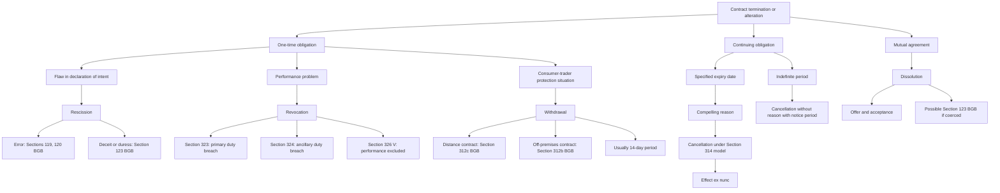
```mermaid
flowchart TD
    Termination[Contract termination or alteration] --> OneTime[One-time obligation]
    Termination --> Continuing[Continuing obligation]
    Termination --> Agreement[Mutual agreement]

    OneTime --> FormationFlaw[Flaw in declaration of intent]
    FormationFlaw --> Rescission[Rescission]
    Rescission --> Error[Error: Sections 119, 120 BGB]
    Rescission --> DeceitDuress[Deceit or duress: Section 123 BGB]

    OneTime --> PerformanceIssue[Performance problem]
    PerformanceIssue --> Revocation[Revocation]
    Revocation --> PrimaryDuty[Section 323: primary duty breach]
    Revocation --> AncillaryDuty[Section 324: ancillary duty breach]
    Revocation --> Impossibility[Section 326 V: performance excluded]

    OneTime --> ConsumerSituation[Consumer-trader protection situation]
    ConsumerSituation --> Withdrawal[Withdrawal]
    Withdrawal --> Distance[Distance contract: Section 312c BGB]
    Withdrawal --> OffPremises[Off-premises contract: Section 312b BGB]
    Withdrawal --> Days14[Usually 14-day period]

    Continuing --> FixedTerm[Specified expiry date]
    FixedTerm --> CompellingReason[Compelling reason]
    CompellingReason --> Cancellation[Cancellation under Section 314 model]
    Cancellation --> ExNunc[Effect ex nunc]

    Continuing --> Indefinite[Indefinite period]
    Indefinite --> OrdinaryCancellation[Cancellation without reason with notice period]

    Agreement --> Dissolution[Dissolution]
    Dissolution --> OfferAcceptance[Offer and acceptance]
    Dissolution --> DuressRisk[Possible Section 123 BGB if coerced]
```

## Subject Knowledge Graph

| Node | Meaning | Exam Relevance |
|---|---|---|
| Withdrawal | Consumer right to exit certain contracts | Key consumer-protection remedy |
| Consumer | Section 13 BGB party | Personal scope requirement |
| Trader | Section 14 BGB party | Personal scope requirement |
| Distance Contract | Contract concluded via distance communication | Major withdrawal scenario |
| Off-Premises Contract | Contract concluded outside business premises/surprise context | Major withdrawal scenario |
| Section 312g II BGB | Exclusions from withdrawal | Prevents overuse of withdrawal |
| Cancellation | Termination of continuing obligation | Core continuing-contract remedy |
| Continuing Obligation | Ongoing contractual relationship | Determines cancellation route |
| Section 314 BGB | Model for extraordinary cancellation | Main structure in deck |
| Compelling Reason | Reason making continuation unreasonable | Central cancellation requirement |
| Ex Nunc | Effect only for the future | Distinguishes cancellation from rescission |
| Dissolution | Consensual termination agreement | Private-autonomy route |

| From | Relationship | To | Why It Matters |
|---|---|---|---|
| Withdrawal | protects | Consumer | Policy basis |
| Withdrawal | applies to | Distance and Off-Premises Contracts | Main exam scenarios |
| Trader | must provide | Withdrawal Information | Affects timing |
| Missing Instruction | extends | Withdrawal Period | Important time-limit issue |
| Cancellation | applies to | Continuing Obligations | Determines remedy type |
| Section 314 BGB | requires | Compelling Reason | Main case-solving element |
| Compelling Reason | is evaluated by | Interest Weighing | Fact-sensitive exam issue |
| Cancellation | works | Ex Nunc | No retrospective unwinding |
| Dissolution | requires | Agreement | Not unilateral |
| Duress | can undermine | Dissolution | Links back to rescission |

## Exam Relevance

Likely exam prompts:

- Compare withdrawal and revocation.
- State the requirements for withdrawal.
- Explain distance selling and off-premises contracts.
- Explain cancellation for continuing obligations under Section 314 BGB.
- What can be considered when arguing compelling reason?
- Distinguish cancellation and dissolution.
- Choose the correct termination route from a fact pattern.

Common traps:

- Confusing withdrawal with revocation.
- Forgetting consumer-trader personal scope for withdrawal.
- Treating all online contracts as withdrawal cases without checking exclusions.
- Applying retrospective restitution logic to cancellation.
- Forgetting that Section 314 BGB is often subordinate to special provisions.
- Treating dissolution as unilateral.

## Official Exercise Case Route

### Online Laptop Withdrawal

Facts in short: student S buys a laptop from electronics retailer E's online shop on 1 May, receives it a few days later, realizes it does not meet his needs, and calls E on 11 May saying he wants to return it. E properly informed S of the withdrawal right.

Question: did S effectively withdraw his declaration of intent?

Route:

1. Contract conclusion: purchase agreement under Section 433 BGB.
2. Personal scope: consumer contract. S is a consumer under Section 13 BGB because the laptop is for studying/private use; E is a trader under Section 14 BGB because selling electronics is E's business.
3. Material scope: not an off-premises contract under Section 312b BGB because the parties were not physically present together outside business premises. It is a distance contract under Section 312c BGB because the online shop uses distance communication within an organized distance-sales scheme.
4. No exclusion under Section 312g II BGB is indicated.
5. Declaration: no special form or magic word is required. A phone call can work if the decision to withdraw is clear; "I want to return the laptop" is enough.
6. Time: with proper instruction, the period is 14 days. The period begins after receipt of the goods under Sections 355 II and 356 II No. 1 BGB. A call on 11 May is within the period after a purchase on 1 May and delivery a few days later.

Result: S effectively withdrew.

Exam traps:

- Do not require a defect. Withdrawal is a consumer cooling-off right.
- Do not require the word "withdrawal"; the substance of the declaration matters.
- Do not treat every online purchase as automatically valid withdrawal. Still check consumer/trader status, distance-contract requirements, exclusions, declaration, and time.

## Retrieval Prompts

1. What policy problem does withdrawal solve?
2. What are the personal and material scopes of withdrawal?
3. Distinguish distance contract and off-premises contract.
4. What must a withdrawal declaration contain?
5. Why is cancellation ex nunc?
6. State the four-step structure for Section 314 BGB cancellation.
7. What factors matter for compelling reason?
8. How is dissolution different from cancellation?
9. Recreate the termination decision tree from memory.

## Practice Tasks

### Task 1: Online Purchase

A consumer buys shoes from a trader's online shop and receives them at home. Which termination route may be relevant if the consumer simply changes their mind?

Short answer guide: withdrawal, because this is likely a distance contract between consumer and trader, subject to timing and exclusions.

### Task 2: Startup Loan Breakdown

A founder publicly insults the investor and excludes him from agreed co-decision rights. Which route?

Short answer guide: cancellation of a continuing obligation under Section 314 BGB may be possible if the breach destroys trust and continuation is unreasonable.

### Task 3: Employment Exit Agreement

Employer and employee agree to end employment in exchange for severance. Is this cancellation or dissolution?

Short answer guide: dissolution, because termination is consensual. If pressure was unlawful, Section 123 BGB may become relevant.

## Connections

Previous notes:

- `week-03-contract-law-i/week-03-contract-law-i.md`: private autonomy, offer and acceptance.
- `week-04-contract-law-ii-rescission-revocation/week-04-contract-law-ii-rescission-revocation.md`: rescission and revocation routes.

Future links:

- Standard Business Terms will deepen consumer protection and limits on autonomy.
- Warranty Rights will connect revocation and buyer remedies under Section 437 BGB.

## Weakness Flags

- Pending active-recall session.

## Open Uncertainties

- The deck uses English labels that can overlap with other translations. Keep the functional distinctions clear: rescission = flawed DoI/formation; revocation = performance issue in reciprocal contract; withdrawal = consumer-protection exit; cancellation = continuing obligation; dissolution = agreement.


<div class="page-break"></div>

# [W05.2] Contract Law III Continuity Bridge

<p class="source-path">Source: <code>business-law/wiki/week-05-contract-law-iii-withdrawal-cancellation-dissolution/contract-law-iii-continuity-bridge.md</code></p>

Source note: `week-05-contract-law-iii-withdrawal-cancellation-dissolution.md`
Related notes:

- `../week-03-contract-law-i/week-03-contract-law-i.md`
- `../week-04-contract-law-ii-rescission-revocation/week-04-contract-law-ii-rescission-revocation.md`

## Why This Bridge Exists

Contract Law III is not a new disconnected topic. It completes the first contract-law lifecycle.

```text
Contract Law I: Did a valid contract come into existence?
Contract Law II: Can one party attack or unwind it because something went wrong?
Contract Law III: Is there another exit route because consumer protection, an ongoing relationship, or agreement to end applies?
```

The exam skill is not memorizing five labels separately. The skill is routing the facts to the correct legal exit.

## The Contract Lifecycle

```text
1. Formation and validity
   -> Contract Law I

2. Defect in declaration of intent
   -> Contract Law II: rescission

3. Performance failure in a valid reciprocal contract
   -> Contract Law II: revocation

4. Consumer wants out of protected distance/off-premises deal
   -> Contract Law III: withdrawal

5. Ongoing contract relationship should end for the future
   -> Contract Law III: cancellation

6. Both parties agree to end
   -> Contract Law III: dissolution
```

## One Real-Life Story Through All Three Weeks

Imagine a student buys a laptop from a retailer.

| Fact pattern | Legal question | Route |
|---|---|---|
| The laptop is displayed in a shop window. | Was that already an offer? | Contract Law I: usually `invitatio ad offerendum`, not offer. |
| The student orders online and the retailer accepts. | Did offer and acceptance create a valid contract? | Contract Law I. |
| The student accidentally typed EUR 2,000 instead of EUR 200 in an order form. | Was the declaration defective at formation? | Contract Law II: rescission, likely error of declaration. |
| The retailer delivers a broken laptop. | Was there a performance breach after a valid contract? | Contract Law II: revocation or warranty route depending later material. |
| The laptop was bought from an online shop and the student simply changes their mind. | Is there a consumer-protection exit without defect? | Contract Law III: withdrawal. |
| The student has a monthly software-service contract and the provider repeatedly blocks access. | Is the relationship ongoing and no longer tolerable? | Contract Law III: cancellation. |
| Retailer and student agree to cancel a preorder by mutual consent. | Did both sides agree to end the contract? | Contract Law III: dissolution. |

## The Door, Exit, And Relationship Memory Model

```text
Contract Law I = door and lock
Did the legal relationship start, and was the door validly opened?

Contract Law II rescission = defective key
The declaration that opened the door was flawed, so the law may erase it from the beginning.

Contract Law II revocation = return desk
The door opened validly, but the promised performance failed, so the parties may return what they exchanged.

Contract Law III withdrawal = consumer cooling-off exit
The consumer gets a protected exit even without defect because the contracting situation was structurally risky.

Contract Law III cancellation = future stop button
The relationship is ongoing, and continuation is unreasonable or no longer wanted under notice rules.

Contract Law III dissolution = mutual handshake exit
No unilateral right is needed because both parties agree to end.
```

## Routing Table

| First question | If yes | Main route | Core statutory anchors |
|---|---|---|---|
| Did offer, acceptance, receipt, interpretation, or validity fail? | The issue is about whether the contract arose or is valid. | Contract Law I | Sections 130, 133, 157, 145-150, 125, 134, 138, 305 ff. BGB |
| Was a declaration defective because of mistake, transmission error, deceit, or duress? | The issue is flawed will at formation. | Rescission | Sections 119, 120, 123, 142, 143, 121, 124, 144 BGB |
| Did a valid reciprocal contract suffer non-performance, defective performance, ancillary-duty breach, or impossibility? | The issue is performance failure. | Revocation | Sections 323, 324, 326 V, 346-348, 349 BGB |
| Is this a consumer-trader distance or off-premises contract, and the consumer wants out without proving breach? | The issue is consumer protection. | Withdrawal | Sections 13, 14, 312b, 312c, 312g, 355, 357 BGB |
| Is this a continuing obligation such as rent, service, employment, loan, gym, or ongoing cooperation? | The issue is ending the future relationship. | Cancellation | Section 314 BGB plus special provisions where applicable |
| Do both sides agree to terminate? | The issue is consensual ending. | Dissolution | Private autonomy, offer and acceptance; Section 123 BGB if the agreement was coerced |

## Legal Effects Compared

| Route | Typical trigger | Legal effect | Time direction | Exam trap |
|---|---|---|---|---|
| Contract Law I invalidity | No valid formation, invalid form, illegality, public policy, invalid standard term | No valid contract or ineffective clause | Usually from the start | Do not use termination language before proving a contract exists. |
| Rescission | Defective declaration | Declaration void from the beginning | Ex tunc | Do not call it revocation. |
| Revocation | Performance failure in valid reciprocal contract | Restitution duties | Mostly unwinding exchanged performances | Do not use it for mere change of mind. |
| Withdrawal | Consumer-protected contracting situation | Consumer no longer bound; restitution under consumer rules | Cooling-off exit | Do not require defect or breach. |
| Cancellation | Continuing obligation | Contract ends for the future | Ex nunc | Do not unwind the whole past relationship. |
| Dissolution | Mutual agreement | Contract ends by agreement | Depends on agreement | Do not treat it as unilateral. |

## Visual Continuity Map

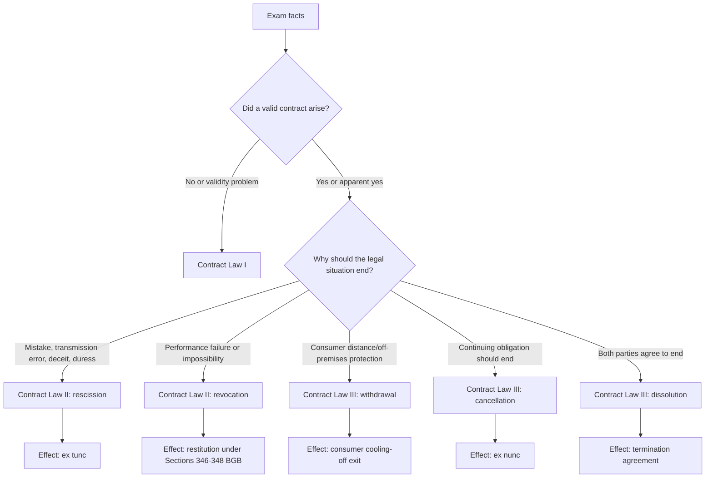
```mermaid
flowchart TD
    Facts[Exam facts] --> Formation{Did a valid contract arise?}
    Formation -->|No or validity problem| CLI[Contract Law I]
    Formation -->|Yes or apparent yes| Exit{Why should the legal situation end?}

    Exit -->|Mistake, transmission error, deceit, duress| Rescission[Contract Law II: rescission]
    Rescission --> ExTunc[Effect: ex tunc]

    Exit -->|Performance failure or impossibility| Revocation[Contract Law II: revocation]
    Revocation --> Restitution[Effect: restitution under Sections 346-348 BGB]

    Exit -->|Consumer distance/off-premises protection| Withdrawal[Contract Law III: withdrawal]
    Withdrawal --> Cooling[Effect: consumer cooling-off exit]

    Exit -->|Continuing obligation should end| Cancellation[Contract Law III: cancellation]
    Cancellation --> ExNunc[Effect: ex nunc]

    Exit -->|Both parties agree to end| Dissolution[Contract Law III: dissolution]
    Dissolution --> Agreement[Effect: termination agreement]
```

## Exam Writing Order

Use this order in mixed cases:

1. Name the legal relationship and contract type.
2. Check whether a valid contract exists if the facts make formation or validity questionable.
3. Identify the reason someone wants out.
4. Pick exactly one primary route first.
5. State the statutory anchor.
6. Apply the route elements to facts.
7. State the effect with time direction: ex tunc, restitution, ex nunc, or agreement-based termination.

## Cheat-Sheet Routing Language

```text
I first classify the problem by lifecycle stage.
If the contract never formed or is invalid, I stay in Contract Law I.
If a declaration was flawed at formation, I test rescission.
If a valid reciprocal contract later failed in performance, I test revocation.
If a consumer wants out of a protected distance or off-premises contract, I test withdrawal.
If an ongoing relationship should end for the future, I test cancellation.
If both parties agree to end, I call it dissolution.
```

## First Recall Prompts

1. In one sentence each, distinguish Contract Law I, rescission, revocation, withdrawal, cancellation, and dissolution.
2. A consumer buys headphones online and dislikes the color. Which route and why?
3. A seller lies about a painting's authorship. Which route and why?
4. A supplier delivers defective machinery under a valid contract. Which route and why?
5. A founder and investor have an ongoing loan/cooperation relationship, and trust collapses. Which route and why?
6. Employer and employee mutually agree on an exit package. Which route and why?


<div class="page-break"></div>

# [W05.3] Week 05 Contract Law III Withdrawal Cancellation Dissolution Cheatsheet And Tricks

<p class="source-path">Source: <code>business-law/wiki/week-05-contract-law-iii-withdrawal-cancellation-dissolution/week-05-contract-law-iii-withdrawal-cancellation-dissolution-cheatsheet-and-tricks.md</code></p>

Course: Business Law
Exam date: 2026-07-28
Source: week-05-contract-law-iii-withdrawal-cancellation-dissolution.md, active-recall-session-2026-05-31.md, contract-law-iii-continuity-bridge.md

## Must-Know (exam-critical)

| Route | Trigger | Personal/material scope | Core anchors | Effect | Time direction |
|---|---|---|---|---|---|
| Withdrawal | Consumer wants out of a distance or off-premises contract, no defect needed | Consumer (13 BGB) vs. trader (14 BGB); distance (312c) or off-premises (312b) setting | Sections 13, 14, 312b, 312c, 312g, 355, 357 BGB | Consumer no longer bound; restitution under consumer rules, less strict than 346 ff. | Cooling-off exit |
| Cancellation | Continuing obligation (rent, service, employment, loan, gym, cooperation) should end | Any continuing-obligation relationship | Section 314 BGB (subordinate to special provisions); Section 241 II for duty-breach support | Contract ends for the future; no restitution of past performances; damages combinable under 314 IV | Ex nunc |
| Dissolution | Both parties agree to end | Any contract | Private autonomy, offer and acceptance; Section 123 BGB if the agreement itself was coerced | Contract ends by agreement | Depends on the agreement |

Withdrawal three-step structure: (1) right of withdrawal under 355, 312b/312c BGB — check personal scope, material scope, no exclusion under 312g II; (2) declaration under 355 I, II BGB — no form required, no justification needed, decision must be clear; (3) effects/restitution under 355 III and 357 BGB.

Section 314 four-step structure: (1) compelling reason — weigh both parties' interests, ask whether continuation until the agreed end/notice period is unreasonable; (2) expiry of a relief period or warning notice without result, unless dispensable under 323-II-like gravity/special-circumstances; (3) declaration of cancellation within a reasonable period after knowledge of the reason; (4) effect: ex nunc, no notice period for extraordinary cancellation.

Withdrawal timing: generally 14 days with proper instruction, clock starts on receipt of goods (355 II, 356 II No. 1); missing/wrong instruction extends the period by up to a year.

## Nice-to-Have (depth/edge cases)

- Other statutory withdrawal situations beyond distance/off-premises: timeshare/holiday products, consumer credit, instalment delivery, free loans/financial assistance, consumer building contracts — lower exam priority than distance/off-premises.
- Withdrawal exclusions under 312g II: custom-made goods, quickly perishable goods.
- Consumer may bear shipping costs (357 V) and may owe compensation for deterioration beyond what was necessary to inspect the goods.
- For fixed-term continuing obligations, a compelling reason is necessary; for indefinite-period obligations, ordinary cancellation without reason (with notice period) may be enough — don't over-invoke 314 when ordinary notice already solves it.
- Dissolution is common precisely where unilateral cancellation is legally hard (e.g., strong employment protection) — severance pay, paid leave, non-competition clauses are typical dissolution incentives.

## Nuances And Traps

| Nuance/Trap | Why it's easy to get wrong | Correct handling |
|---|---|---|
| Rescission ground split: error of content vs. error of declaration vs. deceit | User's own recall session shows this is the most persistent weak spot (`red-yellow` and `yellow` quality across three separate cases) | Use the triad: wrong meaning of my own words = error of content (119 I Alt. 1); wrong sign/number/typing = error of declaration (119 I Alt. 2); someone lied to me = deceit (123 I Alt. 1). "Dozen" misunderstood as 10 = content error, not declaration error. |
| Withdrawal exclusions checked too late or skipped | Flagged `yellow` in active recall — consumer/distance setup was correctly spotted but the 312g II exclusion check was treated as secondary | After confirming distance/off-premises status, always check Section 312g II BGB (custom-made, perishable) before moving to timing — a custom-made sofa delivered exactly as ordered can still be a withdrawal dead end. |
| Defective good bought online: defect route vs. withdrawal route | Flagged `yellow-green` — natural instinct is to jump straight to whichever route is named first in the fact pattern | If facts emphasize a defect/performance failure, lead with the performance route (revocation/warranty); mention withdrawal only as an alternative if consumer-distance facts are also present. Do not default to withdrawal just because the purchase was online. |
| Cancellation legal wording | Flagged `yellow` repeatedly — recall answers used "violence of obligation" and "authority" | Correct phrasing: "breach/violation of duty by a party in a continuing obligation," not violence; parties are legally equal ("party" or "private autonomy"), not "authority." Wrong wording alone can cost points even when the route is correct. |
| Cancellation vs. revocation for continuing obligations | Sections 346-348 BGB (revocation restitution) are not suitable for continuing obligations because they cannot usually be unwound retrospectively | If the contract is a continuing obligation (rent, employment, gym, loan), reach for cancellation (314) even if the underlying problem looks like a "breach" — do not default to revocation just because a duty was breached. |
| Section 314 is subordinate | Easy to forget once 314's four-step structure is memorized | Check for a special cancellation provision (rental, employment, service, partnership, consumer digital-content contracts) first — 314 is the fallback model, not the first stop. |
| Dissolution treated as unilateral | Explicitly listed as a common trap in the source note | Dissolution always requires agreement (offer and acceptance) — a single party cannot "dissolve" a contract; that would be cancellation or another exit route instead. |
| Confusing withdrawal with revocation generally | Explicitly flagged as the top common trap in the source note | Withdrawal never requires a defect or breach — it is a pure consumer cooling-off right. Revocation always requires a performance problem in an otherwise valid reciprocal contract. |

## One-Line Recall Drill

```text
Withdrawal = consumer cooling-off, no defect required.
Revocation = performance problem after a valid contract.
Cancellation = ongoing relationship ends for the future, ex nunc.
Dissolution = both parties agree to end.
Rescission = flawed declaration at formation, ex tunc.

Wrong meaning of my own words = error of content (119 I Alt. 1).
Wrong sign/number typed = error of declaration (119 I Alt. 2).
Someone lied to me = deceit (123 I Alt. 1).

Withdrawal anchors: 13, 14, 312b, 312c, 312g, 355, 357.
Cancellation anchor: 314 (subordinate to special provisions), 241 II for trust/duty breach.
Withdrawal clock: 14 days with proper instruction, up to +1 year if instruction missing.
```


<div class="page-break"></div>

# [W05.4] Week 05 Contract Law III Withdrawal Cancellation Dissolution Practice Questions And Model Answers

<p class="source-path">Source: <code>business-law/wiki/week-05-contract-law-iii-withdrawal-cancellation-dissolution/week-05-contract-law-iii-withdrawal-cancellation-dissolution-practice-questions-and-model-answers.md</code></p>

Course: Business Law
Exam date: 2026-07-28
Source: week-05-contract-law-iii-withdrawal-cancellation-dissolution.md, week-05-contract-law-iii-withdrawal-cancellation-dissolution-cheatsheet-and-tricks.md
Format note: 22 questions — 10 short-answer/theory, 12 case/legal-opinion (schema-based). Case questions integrate Week 03 Contract Law I formation, Week 08 Warranty Rights I, Week 06 Standard Business Terms, and Week 04 Rescission. Questions 19-22 are a coverage-gap pass adding Section 357 restitution mechanics, a full five-route elimination case, the retrospective-restitution trap for cancellation, and a parallel-routes (rescission + withdrawal) integration.

## Short-Answer / Theory Questions

### Question 1

Define the consumer right of withdrawal and state the policy problem it solves.

**Model Answer:**
1. Withdrawal (Widerruf) is a statutory right allowing a consumer to exit certain contracts with a trader within a set period, without needing to show a defect or breach — a pure cooling-off right.
2. Statutory anchor: Sections 355, 312b, 312c BGB (355 for the declaration/effects mechanics; 312b for off-premises contracts; 312c for distance contracts).
3. Requirements/features: (1) personal scope — consumer (Section 13 BGB) contracting with a trader (Section 14 BGB); (2) material scope — a statutory withdrawal situation applies (most commonly distance or off-premises) with no exclusion under Section 312g II; (3) a clear declaration within the applicable time limit.
4. Example: a consumer buys a laptop from an online shop, receives it, and decides a few days later it does not meet their needs.
5. Consequence/trap: do not require any defect or wrongdoing by the trader — withdrawal exists precisely because the consumer faced structural disadvantage, information deficit, or surprise, not because anything went wrong with the goods.

### Question 2

Compare withdrawal and revocation.

**Model Answer:**
Withdrawal triggers when a consumer wants to exit a distance or off-premises contract with a trader, without any performance problem, anchored in Sections 355, 312b, 312c BGB, and leads to a consumer-protection restitution regime (Section 357) that is less strict than ordinary revocation restitution. Revocation triggers when a valid reciprocal contract exists but the debtor fails to perform, or performs badly, anchored in Sections 323, 324, 326 V BGB, and leads to full mutual restitution under Sections 346-349 BGB. Contrast example: a consumer who simply changes their mind about an online purchase needs withdrawal; a buyer who never receives the ordered goods at all after a Nachfrist expired needs revocation. Exam warning: do not reach for revocation just because a purchase was made online — check first whether anything actually went wrong with performance, or whether the consumer is merely exercising a cooling-off right.

### Question 3

State the four-step structure for extraordinary cancellation of a continuing obligation under Section 314 BGB.

**Model Answer:**
The requirements are:
1. A compelling reason — weighing both parties' interests and all circumstances, continuation until the agreed end or notice period cannot reasonably be expected of the cancelling party.
2. Expiry of a period for relief or a warning notice without result, unless dispensable (e.g. for gravity or special circumstances comparable to Section 323 II).
3. A declaration of cancellation within a reasonable period after gaining knowledge of the reason.
4. Effect: the continuing obligation ends immediately, ex nunc, without a notice period.

If these are met, the consequence is that the relationship ends for the future only — past performances are not undone, and damages can be combined under Section 314 IV BGB. The rule exists because continuing obligations (rent, employment, ongoing services) cannot usually be unwound retrospectively the way a one-time purchase can, so the law gives an immediate forward-looking exit instead of forcing retroactive restitution.

### Question 4

Compare cancellation and dissolution.

**Model Answer:**
Cancellation triggers when one party unilaterally ends a continuing obligation, either for a compelling reason (Section 314 BGB or a special provision) or, for indefinite-period relationships, by ordinary notice without needing a reason; it leads to termination ex nunc, with no restitution of past performances. Dissolution triggers when both parties agree to end a contract, resting on private autonomy (freedom to conclude contracts implies freedom to dissolve them by agreement); it leads to termination on whatever terms the parties negotiated (e.g. severance pay, paid leave, non-competition clauses). Contrast example: an employer who cannot easily cancel an employment relationship because of strong statutory protection may instead negotiate a dissolution agreement with the employee. Exam trap: dissolution is never unilateral — a single party's statement that they are "ending" the contract, without the other side's agreement, is not dissolution; it must be analyzed as cancellation or another exit route instead.

## Case / Legal-Opinion Questions

### Question 5 (Case)

**Facts:** A door-to-door salesperson rings the doorbell of consumer C's home, uninvited, and demonstrates a vacuum cleaner. C is persuaded on the spot and signs a purchase contract for EUR 800. The salesperson leaves without giving C any information about a right of withdrawal. Three days later, C has second thoughts and tells the trader by phone that she wants to return the vacuum cleaner and get her money back.

**Question:** Can C still effectively withdraw from the contract, and if so, within what time frame?

**Model Answer:**

I. Claim/issue sentence: C could be entitled to withdraw from the purchase contract with the trader under Sections 355, 312b BGB if the requirements of an off-premises withdrawal right are met.

II. Requirements:
- I. Purchase contract concluded (Section 433 BGB)
- II. Personal scope: consumer and trader
- III. Material scope: off-premises contract (Section 312b BGB)
- IV. No exclusion under Section 312g II BGB
- V. Declaration and timing (Section 355 BGB)

III. Application:
- I. A purchase contract for the vacuum cleaner was concluded when C signed on the spot.
- II. C acted for private, non-business purposes, so she is a consumer under Section 13 BGB; the salesperson's principal sells vacuum cleaners commercially, so it is a trader under Section 14 BGB.
- III. The contract was concluded in the simultaneous physical presence of both parties at a location other than the trader's business premises (C's home), following an unsolicited approach — this is the paradigm off-premises contract under Section 312b BGB.
- IV. Nothing in the facts suggests a custom-made or quickly perishable good; no exclusion applies.
- V. C's phone call three days later is a clear, unambiguous statement that she wants to return the goods — no specific form or the word "withdrawal" is required.

IV. Interim results: because no proper withdrawal instruction was given, the ordinary 14-day period under Section 355 II does not start running; under Section 356 III, the period is instead extended up to 12 months and 14 days from the point it otherwise would have started.

V. Final answer: C's declaration three days after signing falls well within the extended window, so C effectively withdraws from the contract; both parties must return what they received under the consumer withdrawal restitution regime (Section 357), and C is not required to give any justification.

### Question 6 (Case — integrates Week 05 + Week 03)

**Facts:** Consumer D calls trader T's telephone sales hotline. T's employee describes a designer lamp in detail and states a price of EUR 300. D immediately replies, "Yes, I'll take it, please send it to me." T ships the lamp the same week. T never sends D any information about a right of withdrawal. Ten months after receiving the lamp, D emails T saying the lamp does not suit her new interior and she wants to return it for a full refund.

**Question:** (a) Was a purchase contract validly concluded over the phone? (b) Can D still effectively withdraw ten months after delivery?

**Model Answer:**

**Part (a): Formation**

I. Claim/issue sentence: D and T concluded a valid purchase contract if there are two matching declarations of intent — offer and acceptance — and no validity obstacle applies (Section 433 BGB in conjunction with Sections 145-150 BGB).

II. Requirements:
- I. Offer: essentialia negotii present, clear intention to be bound (Section 145 BGB)
- II. Acceptance: matches the offer, timely under Section 147 I BGB
- III. No formation obstacle (Sections 125, 134, 138 BGB)

III. Application:
- I. T's employee named a specific lamp, described its features, and stated a fixed price of EUR 300 directly to D — this contains the essentialia negotii (parties, object, price) and, in a direct sales call naming a concrete price to a specific customer, shows a clear intention to be bound, so it is an offer, not a mere invitatio ad offerendum.
- II. A telephone call is treated as a declaration between parties who are "present" for timing purposes under Section 147 I BGB, so acceptance had to occur immediately during the call. D's "Yes, I'll take it, please send it" is an unconditional, matching acceptance given immediately.
- III. No statutory form is required for an ordinary consumer purchase of this kind, and nothing indicates a statutory prohibition or public-policy problem.

IV. Interim result: all formation requirements are met.

**Part (b): Withdrawal**

I. Claim/issue sentence: D could be entitled to withdraw from the purchase contract under Sections 355, 312c BGB if the requirements are met.

II. Requirements:
- I. Personal scope: consumer and trader
- II. Material scope: distance contract (Section 312c BGB)
- III. No exclusion under Section 312g II BGB
- IV. Declaration and timing (Sections 355, 356 BGB)

III. Application:
- I. D bought the lamp for private use, so she is a consumer (Section 13 BGB); T sells lamps commercially by phone, so T is a trader (Section 14 BGB).
- II. The contract was negotiated and concluded exclusively by phone, an organized means of distance communication, without simultaneous physical presence — a distance contract under Section 312c BGB.
- III. A standard designer lamp sold from stock is not custom-made or perishable; no exclusion applies.
- IV. T never gave D the required withdrawal instructions. Under Section 356 III BGB, the ordinary 14-day period (which would otherwise start on receipt of the goods, Section 356 II No. 1) does not begin, and the withdrawal right is instead capped at 12 months and 14 days from the point it would have started.

IV. Interim result: D's email ten months after delivery falls inside the extended 12-months-plus-14-days window.

V. Final answer: the purchase contract was validly concluded over the phone through immediate offer and acceptance under Sections 145 and 147 I BGB, and because T failed to instruct D on her withdrawal right, D's withdrawal ten months later is still effective under Section 356 III BGB — D may return the lamp and reclaim the EUR 300.

### Question 7 (Case)

**Facts:** Consultant K has a two-year advisory service contract with company U. Six months into the relationship, U's new CEO publicly accuses K of fraud in a press interview, with no factual basis, seriously damaging K's professional reputation, and U also stops paying K's last two invoices without explanation. K wants to end the contract immediately rather than wait out the remaining eighteen months.

**Question:** Can K extraordinarily cancel the service contract with immediate effect?

**Model Answer:**

I. Claim/issue sentence: K could be entitled to extraordinarily cancel the continuing service obligation under Section 314 BGB if the requirements are met.

II. Requirements:
- I. Compelling reason
- II. Expiry of a relief/warning period without result, unless dispensable
- III. Declaration of cancellation within a reasonable period
- IV. Effect: ex nunc

III. Application:
- I. Questionable is whether a compelling reason exists. This is supported by the fact that the CEO's public, unfounded fraud accusation is a serious breach of the duty of consideration owed within the relationship (Section 241 II BGB), and combined with the unexplained non-payment, it destroys the mutual trust an ongoing advisory relationship depends on. Against this, one could argue a single public statement might be an isolated lapse rather than a fundamental breakdown; however, a public reputational attack of this severity, paired with withheld payment, makes continuing the relationship for another eighteen months unreasonable for K when weighing both parties' interests.
- II. A relief or warning period would ordinarily be required first. However, gravity comparable to a serious and final refusal (analogous to Section 323 II BGB) can make this dispensable — publicly and falsely accusing a contract partner of fraud is not the kind of breach a warning notice could meaningfully cure, since the reputational harm and trust breakdown are already done.
- III. K should declare the cancellation without unreasonable delay after learning of the interview and the missed payments to stay within a reasonable period.

IV. Interim results: compelling reason met; warning period dispensable given the gravity; timely declaration assumed on the facts given.

V. Final answer: K can extraordinarily cancel the service contract with immediate effect under Section 314 BGB. The contract remains valid and owed for the first six months already performed — there is no retrospective restitution — and K may combine the cancellation with a damages claim under Section 314 IV BGB for the unpaid invoices and any recoverable reputational harm.

### Question 8 (Case)

**Facts:** Consumer M orders a custom-tailored suit from an online tailoring shop, submitting his exact body measurements and selecting a specific fabric and color combination made only for him. Ten days after receiving the finished suit, M decides he does not like how the chosen color looks in person and wants to withdraw from the contract for a full refund, even though the suit was made exactly to his specifications.

**Question:** Can M withdraw from the purchase contract?

**Model Answer:**

I. Claim/issue sentence: M could be entitled to withdraw from the purchase contract with the online tailor under Sections 355, 312c BGB if the requirements are met.

II. Requirements:
- I. Personal scope: consumer and trader
- II. Material scope: distance contract (Section 312c BGB)
- III. No exclusion under Section 312g II BGB
- IV. Declaration and timing (Section 355 BGB)

III. Application:
- I. M ordered the suit for private use, so he is a consumer (Section 13 BGB); the online tailoring shop sells commercially, so it is a trader (Section 14 BGB).
- II. The order was placed and concluded exclusively online, an organized distance-sales scheme — a distance contract under Section 312c BGB.
- III. Questionable is whether an exclusion applies. This is supported by Section 312g II BGB, which excludes the withdrawal right for goods manufactured to consumer specifications or clearly personalized to the consumer. A suit made to M's exact measurements and his chosen fabric/color combination is manufactured specifically for him and cannot be resold to another customer without substantial loss — it fits squarely within this exclusion.
- IV. Because the material-scope requirement already fails at the exclusion step, the declaration/timing requirement does not need to be reached.

IV. Interim result: the material-scope requirement is not met — the custom-made exclusion applies.

V. Final answer: M cannot withdraw from the purchase contract. The customization exclusion under Section 312g II BGB blocks the statutory withdrawal right despite the contract otherwise qualifying as a distance contract, so M remains bound to the suit purchase regardless of his change of mind about the color.

## Short-Answer / Theory Questions (Continued)

### Question 9

Explain why Section 314 BGB is described as "subordinate," and give an example of a special provision that would displace it.

**Model Answer:**
1. Section 314 BGB is the default model for extraordinary cancellation of continuing obligations, but it only applies when no more specific statutory cancellation rule governs the same relationship.
2. Statutory anchor: Section 314 BGB, displaced where a special provision exists (e.g. rental, employment, service, partnership, or consumer digital-content cancellation rules).
3. Requirements/features: (1) identify the type of continuing obligation first; (2) check whether a dedicated cancellation regime exists for that contract type; (3) only fall back to Section 314's four-step structure if no special provision covers the situation.
4. Example: cancellation of a residential lease is governed primarily by the special rental-termination rules, not by Section 314 directly, even though a lease is a continuing obligation.
5. Trap: memorizing the Section 314 four-step structure and reaching for it automatically for every continuing obligation is itself a trap — always ask "is there a more specific rule for this contract type" before invoking 314.

### Question 10

State the requirements for an off-premises contract under Section 312b BGB (List-Requirements Schema).

**Model Answer:**
Requirements:
1. A contract is concluded in the simultaneous physical presence of both consumer and trader at a place that is not the trader's business premises, OR the consumer made an offer under such circumstances.
2. The setting is closely related to a surprise situation — the consumer is approached where they do not expect to enter into a legally binding transaction.
3. The other general withdrawal conditions still apply on top: personal scope (consumer/trader) and no exclusion under Section 312g II BGB.

If these requirements are met, the consequence is that the consumer gains a statutory withdrawal right under Sections 355, 312b BGB, generally 14 days from conclusion (or later triggers), extendable if instruction is missing. This exists because a consumer approached away from a business setting — for example at their own front door — faces a pressure or surprise element that an ordinary shop visit does not carry, so the law compensates with a cooling-off exit.

### Question 11

Compare distance contracts and off-premises contracts.

**Model Answer (Compare Schema):**
A distance contract under Section 312c BGB triggers when the contract is negotiated and concluded exclusively through means of distance communication (letters, phone, email, digital services) without the parties ever being simultaneously physically present, within an organized distance-sales or service scheme; the core rationale is that the consumer cannot inspect the goods in person before contracting. An off-premises contract under Section 312b BGB triggers when the parties are physically present together, but away from the trader's business premises, typically in a surprise or unsolicited-approach situation; the core rationale is pressure or surprise rather than an inability to inspect. Contrast example: ordering a lamp over the phone is a distance contract (no physical presence at all); a vacuum-cleaner sale concluded at the consumer's front door after an unannounced doorbell visit is an off-premises contract (physical presence, but away from business premises). Exam trap: do not assume every non-shop sale is "off-premises" — if the parties were never physically together at all, the correct route is the distance-contract provision, not the off-premises one, even though both lead to the same withdrawal mechanics under Sections 355, 357 BGB.

### Question 12

Explain the consequence of a trader's failure to properly instruct a consumer about the withdrawal right, and state the outer time limit.

**Model Answer:**
1. Proper withdrawal instruction is a precondition for the ordinary 14-day withdrawal clock to start running.
2. Statutory anchor: Section 356 III BGB (extension), read together with Sections 355 II and 356 II No. 1 BGB (ordinary period and its normal starting point).
3. Requirements/features: (1) the trader has a duty to inform the consumer of the withdrawal right before or at contract conclusion; (2) if that instruction is missing or defective, the 14-day period simply does not begin; (3) the withdrawal right is nonetheless not infinite — it is capped at 12 months and 14 days from the point the ordinary period would otherwise have started.
4. Example: a consumer who receives no withdrawal instructions after an online purchase can still validly withdraw ten months after delivery, because the extended cap has not yet expired.
5. Trap: do not conclude that a missing instruction gives the consumer a withdrawal right forever — the extension is generous but still capped at 12 months plus 14 days, not unlimited.

### Question 13

Explain how a dissolution agreement can loop back into the rescission doctrine from Contract Law II, and why this matters for exam analysis.

**Model Answer:**
1. Dissolution is the consensual termination of a contract by agreement, resting on private autonomy, but the agreement itself is a fresh declaration of intent and is therefore vulnerable to the same validity attacks as any other declaration.
2. Statutory anchor: Section 123 BGB (rescission for deceit or unlawful duress), applied to the dissolution agreement itself rather than to the original underlying contract.
3. Requirements/features: (1) identify that a dissolution agreement was reached; (2) check whether the consent to dissolve was procured through unlawful duress or deceit; (3) if so, the dissolution agreement itself — not necessarily the original contract — can be rescinded under Section 123 BGB.
4. Example: an employer who coerces an employee into "agreeing" to dissolve the employment contract under threat of unfounded criminal accusations has not obtained valid consent, and the employee may rescind the dissolution agreement.
5. Trap: do not treat "the parties signed a dissolution agreement" as automatically the end of the analysis — always check whether the consent behind that agreement was itself validly formed, since a coerced dissolution is functionally reopened through Section 123 BGB rescission of the dissolution declaration.

## Case / Legal-Opinion Questions (Continued)

### Question 14 (Case)

**Facts:** Tenant R has an indefinite-period gym membership contract with fitness studio F. R simply no longer wants to attend and wishes to end the membership, without pointing to any breach or compelling reason — she just wants out with reasonable notice.

**Question:** Can R end the membership without showing a compelling reason?

**Model Answer:**

I. Claim/issue sentence: R could be entitled to end the gym membership through ordinary cancellation without needing a compelling reason, since the membership is a continuing obligation of indefinite duration.

II. Requirements:
- I. Continuing obligation
- II. Contract is for an indefinite period
- III. Notice period observed

III. Application:
- I. A gym membership is a continuing obligation — an ongoing relationship of repeated performance (access to facilities) in exchange for periodic payment, not a one-time exchange.
- II. Questionable is whether the membership is fixed-term or indefinite. The facts describe no stated end date, and R is treated as free to leave subject only to notice — this points to an indefinite-period relationship rather than a fixed term requiring a compelling reason under Section 314 BGB.
- III. Because the obligation is indefinite, ordinary cancellation without any reason is available, provided R observes whatever notice period applies to the membership.

IV. Interim results: the membership is a continuing obligation of indefinite duration, so the compelling-reason requirement of Section 314 BGB does not need to be satisfied.

V. Final answer: R can end the gym membership through ordinary cancellation with proper notice, without showing any compelling reason — Section 314 BGB's stricter four-step structure is reserved for fixed-term continuing obligations or situations without a simpler ordinary-notice route.

### Question 15 (Case)

**Facts:** Employer B tells employee A that unless A signs a dissolution agreement ending her employment "voluntarily" today, B will report A to the police for a theft B knows never happened. Frightened, A signs the dissolution agreement. Two weeks later, A wants to have the dissolution agreement set aside and be reinstated.

**Question:** Can A have the dissolution agreement set aside?

**Model Answer:**

I. Claim/issue sentence: A could be entitled to rescind the dissolution agreement under Section 123 BGB if her consent to dissolve was procured through unlawful duress.

II. Requirements:
- I. A declaration of intent (the dissolution agreement)
- II. Threat of a considerable harm
- III. Unlawfulness of the threat or the means-end connection
- IV. Causality between the threat and the declaration
- V. Timely rescission declaration

III. Application:
- I. A signed a dissolution agreement, a declaration of intent aimed at consensually ending the employment relationship.
- II. Being reported to the police and facing a criminal investigation is a considerable harm to A.
- III. Questionable is whether the threat was unlawful. This is supported by the fact that B knew the theft accusation was false — threatening to report a fabricated crime is not a legitimate means to obtain agreement, unlike, say, threatening a lawful and truthful report of genuine wrongdoing. Against this, one could argue B was merely proposing a hypothetical consequence rather than "threatening" in a legal sense; however, conditioning A's job on signing "or else I report a crime I know you did not commit" is precisely the kind of illegitimate pressure Section 123 BGB targets. Consequently, the threat is unlawful.
- IV. A signed under the immediate pressure of the false accusation threat; nothing suggests she would have signed the dissolution agreement absent that threat, so causality is present.
- V. A must exercise rescission without undue delay after discovering she is free to do so; two weeks after the incident, and presumably shortly after realizing her rights, is within a reasonable window on these facts.

IV. Interim results: all requirements of Section 123 BGB duress-based rescission are met with respect to the dissolution agreement.

V. Final answer: A can rescind the dissolution agreement under Section 123 BGB. Because the dissolution agreement itself is set aside, it never validly ended the employment relationship, and A's employment continues as if the "voluntary" dissolution had never been signed.

### Question 16 (Case — integrates Week 05 + Week 08)

**Facts:** Consumer P orders a coffee machine from an online retailer's webshop. On delivery, P discovers the machine has a cracked water tank that was already cracked when it left the factory — a material defect present at handover. P is unhappy and, four days after delivery, emails the retailer saying she "wants to send it back and get her money back," without mentioning the crack at all, simply stating she changed her mind about needing a coffee machine.

**Question:** Which route(s) can P rely on, and does it matter that she didn't mention the defect?

**Model Answer:**

I. Claim/issue sentence: P could be entitled to return the coffee machine and reclaim her money either through the statutory consumer withdrawal right (Sections 355, 312c BGB) or through the warranty regime (Sections 434, 437 BGB), and the two routes must be checked separately because they rest on different facts.

II. Requirements:
- I. Withdrawal: personal scope, distance-contract material scope, no exclusion, timely declaration
- II. Warranty: valid purchase agreement, material defect at transfer of risk, no exclusion, choice of remedy

III. Application:
- I. Withdrawal route: P bought for private use as a consumer (Section 13 BGB) from a commercial retailer (Section 14 BGB); the order was placed entirely online, an organized distance-sales scheme, so it is a distance contract under Section 312c BGB; a standard coffee machine is not custom-made or perishable, so no Section 312g II exclusion applies; P's email four days after delivery, stating she wants to return the item and get her money back, is a sufficiently clear declaration with no defect or justification required, and falls comfortably within the ordinary 14-day period (or the extended period if instruction was missing). Withdrawal is therefore independently available regardless of the crack.
- II. Warranty route: a purchase agreement was concluded (Section 433 BGB); the cracked water tank is a deviation from the condition the machine should have had, present already at handover — a material defect under Section 434 BGB existing at transfer of risk (Section 446 BGB); nothing on the facts suggests P knew of the crack at conclusion, so no Section 442 exclusion applies; P could therefore also demand cure (repair or replacement) under Section 437 No. 1, 439 BGB as a first step, or, once cure fails or is dispensable, move toward revocation and refund under Sections 437 No. 2, 440, 323 BGB.
- III. Questionable is whether P's silence about the defect defeats either route. This is supported by the fact that withdrawal never requires a defect or any justification at all — the reason P gives ("changed her mind") is irrelevant to whether the withdrawal requirements are met. Against this, one might think that because a real defect exists, P is somehow forced into the warranty route instead — however, nothing in the withdrawal doctrine requires the consumer to disclose or rely on the true motivation, and nothing in the warranty doctrine bars a consumer from choosing the faster, no-questions-asked withdrawal route even where a defect happens to also exist. Consequently, the two routes coexist, and P may choose the simpler one.

IV. Interim results: both a valid withdrawal right and a valid warranty claim exist on these facts, and P's failure to mention the defect does not defeat either.

V. Final answer: P can validly withdraw under Sections 355, 312c BGB without needing to invoke the defect at all, since withdrawal requires no justification; the existence of a genuine material defect under Section 434 BGB gives her an independent, alternative warranty claim under Section 437 BGB if she preferred cure instead of a full return, but on these facts the simpler withdrawal declaration she actually sent is sufficient by itself to entitle her to return the machine and reclaim her money.

### Question 17 (Case — integrates Week 05 + Week 08)

**Facts:** Merchant X buys a batch of machine components from merchant Y for X's factory (a mutual commercial purchase between two merchants). On delivery, X properly and promptly inspects the goods under its commercial duty and discovers a material defect. X validly notifies Y in time. Y attempts a repair, but the repair fails to fix the defect. X now wants to end the contract and get its money back, and describes this in an internal memo as "withdrawing from the purchase."

**Question:** Is "withdrawal" the legally correct label for what X wants to do, and can X achieve this outcome?

**Model Answer:**

I. Claim/issue sentence: X could be entitled to end the contract and recover its payment, but the correct legal route is revocation under Sections 437 No. 2, 440, 323 BGB rather than the consumer withdrawal right of Sections 355, 312b/312c BGB, because X is a merchant relying on a failed cure, not a consumer exercising a cooling-off right.

II. Requirements (warranty/revocation route):
- I. Valid purchase agreement between merchants (Section 433 BGB)
- II. Material defect at transfer of risk (Sections 434, 446 BGB)
- III. Commercial inspection/notice duty satisfied (Section 377 HGB)
- IV. No exclusion (Section 442 BGB)
- V. Cure attempted and failed (Sections 439, 440, 323 BGB)

III. Application:
- I. X and Y concluded a purchase agreement for the components as merchants.
- II. The components had a material defect already present at handover, satisfying Sections 434, 446 BGB.
- III. As a merchant-to-merchant sale, Section 377 HGB required X to inspect and notify without delay; the facts state X did so properly, so the claim is preserved rather than deemed approved.
- IV. Nothing indicates X knew of the defect at conclusion, so Section 442 BGB does not exclude the claim.
- V. Y was given the chance to cure through repair (Section 439 BGB), consistent with cure's priority over immediate termination, but the repair failed to remedy the defect — this satisfies the "cure failed" trigger that opens the door to revocation under Sections 437 No. 2, 440, 323 BGB.
- VI. Questionable is whether X's own label, "withdrawal," is legally accurate. This is supported by the definitional split established for Contract Law III: withdrawal (Widerruf) under Sections 355, 312b/312c BGB is a no-fault, no-defect consumer-trader cooling-off right, requiring consumer/trader personal scope that X and Y — both merchants — do not have. Against this, one could argue the everyday English word "withdraw" fits what X is doing (getting out of the contract); however, in the doctrinal scheme taught for this course, the applicable remedy after a failed cure in a valid reciprocal contract is called revocation, not withdrawal, precisely because it responds to a performance failure rather than a pure change of mind. Consequently, X's internal memo uses the wrong legal label even though the underlying outcome — ending the contract and reclaiming payment — is available.

IV. Interim results: the warranty requirements for revocation after a failed cure are met; the personal/material scope for consumer withdrawal is not met because X and Y are both merchants, not a consumer-trader pair.

V. Final answer: X can end the contract and recover its payment, but the correct route and label is revocation under Sections 437 No. 2, 440, 323 BGB following Y's failed repair — not "withdrawal," which is reserved for the consumer-protection cooling-off right and does not apply to a merchant-to-merchant sale at all.

### Question 18 (Case — integrates Week 05 + Week 06)

**Facts:** Online trader T's pre-formulated terms and conditions, used in every one of T's consumer sales, include a clause stating: "The statutory right of withdrawal does not apply to any purchase made through this webshop." Consumer Q, who bought a jacket from T's webshop and received it a few days ago, wants to withdraw and is told by T that the clause blocks her from doing so.

**Question:** Is T's clause effective against Q?

**Model Answer:**

I. Claim/issue sentence: T's clause excluding the statutory withdrawal right is standard business terms that must pass the SBT control regime, and it is ineffective under content control, so Q's withdrawal right is unaffected.

II. Requirements:
- I. Existence of SBT (Section 305 I BGB)
- II. Incorporation (Section 305 II BGB)
- III. Content control (Sections 307-309 BGB)
- IV. Consequence (Section 306 BGB)

III. Application:
- I. The clause is pre-formulated by T, used in every one of T's consumer sales (well above the practical repeated-use threshold), and presented unilaterally to consumers like Q — it is SBT under Section 305 I BGB.
- II. Nothing suggests the clause was hidden or that Q lacked a reasonable opportunity to take notice of it within T's terms and conditions, so incorporation under Section 305 II BGB is assumed satisfied for purposes of reaching content control.
- III. Questionable is whether the clause survives content control. As a consumer contract, the direct Section 307-309 route applies. This is supported by the course's own Section 307 example that a clause "excluding a right to rescind despite serious performance failure" is a textbook illustration of a clause conflicting with basic principles of statutory law and threatening the contract's purpose — an outright exclusion of the statutory consumer withdrawal right is the same kind of move, stripping Q of a core consumer-protection mechanism the legislator specifically built into distance and off-premises sales. Against this, one could argue traders should be free to define their own terms of sale under private autonomy; however, the withdrawal right is a mandatory consumer-protection rule precisely because ordinary private autonomy is considered insufficiently protective in distance/off-premises settings, so a blanket contractual override conflicts with the basic principles of that statutory scheme and unreasonably disadvantages the consumer. Consequently, the clause fails content control under Section 307 BGB.
- IV. Because the clause fails content control, it falls out of the contract under Section 306 I BGB; the rest of the purchase contract survives, and the statutory withdrawal rules fill the gap under Section 306 II BGB precisely as if the clause had never been agreed.

IV. Interim results: the clause is SBT, is incorporated, but fails content control under Section 307 BGB and therefore does not become effective.

V. Final answer: T's clause is not effective against Q. It falls out of the contract under Section 306 BGB, the remainder of the purchase contract survives, and Q retains her full statutory withdrawal right under Sections 355, 312c BGB exactly as if T's exclusion clause had never existed.

## Short-Answer / Theory Questions (Continued 2)

### Question 19

Explain the consumer-protection restitution regime under Section 357 BGB and how it differs from ordinary revocation restitution.

**Model Answer:**
1. Section 357 BGB sets out the return duties that follow a valid consumer withdrawal, and it is deliberately gentler on the consumer than the ordinary revocation restitution rules.
2. Statutory anchor: Section 357 BGB (consumer withdrawal effects), contrasted with Sections 346-349 BGB (ordinary revocation restitution).
3. Requirements/features: (1) both parties return what they received, mirroring the general restitution idea; (2) the consumer may be required to bear the direct cost of returning the goods (Section 357 V BGB) if properly informed of this in advance; (3) the consumer may owe compensation for any deterioration in the goods, but only for handling that went beyond what was necessary to examine the goods, similar to how a customer would handle an item in a shop.
4. Example: a consumer who withdraws from an online clothing purchase after trying the item on at home in the ordinary way owes no deterioration compensation, but a consumer who used the item extensively before returning it may owe compensation for the excess wear.
5. Trap: do not import the full ordinary revocation restitution regime (Sections 346-349 BGB) into a withdrawal case — withdrawal's Section 357 regime is a distinct, consumer-favorable set of rules, and confusing the two can lead to overstating what the consumer owes back.

## Case / Legal-Opinion Questions (Continued 2)

### Question 20 (Case)

**Facts:** Consumer N calls an online furniture retailer's ordinary customer sales line and orders a standard, ready-made bookshelf model directly from the retailer's regular catalog (not customized in any way), to be delivered to her home. The bookshelf arrives exactly as described, with no damage or defect. A week after delivery, N decides she no longer likes how the bookshelf looks in her living room and wants to send it back for a full refund. She has not spoken to the retailer about ending the contract by mutual agreement, and there is no ongoing relationship between N and the retailer beyond this single purchase.

**Question:** Applying the full range of contract-exit routes covered this term, which route (if any) allows N to get her money back, and why do the other routes not apply?

**Model Answer:**

I. Claim/issue sentence: N could be entitled to return the bookshelf and reclaim her payment only if one of the five exit routes covered this term actually fits these facts; the correct route must be identified by ruling out the others.

II. Requirements (as headings):
   I. Rescission (Sections 119, 120, 123 BGB)
   II. Revocation (Sections 323, 324, 326 V BGB)
   III. Withdrawal (Sections 355, 312b, 312c BGB)
   IV. Cancellation (Section 314 BGB)
   V. Dissolution (offer and acceptance)

III. Application:
   I. Rescission requires a flaw in how N's own declaration of intent was formed — a mistake, transmission error, deceit, or duress. Nothing in the facts suggests N misunderstood what she was ordering, was misled, or was pressured; she got exactly the bookshelf she meant to order. Rescission does not apply.
   II. Revocation requires a performance problem in an otherwise valid contract — late, missing, or defective performance. The bookshelf arrived exactly as described, with no damage or defect, so there is no performance failure to revoke over. Revocation does not apply.
   III. Withdrawal requires a consumer-trader relationship in a statutory withdrawal situation (distance or off-premises), with no exclusion and a timely declaration. N ordered by phone from a retailer's ordinary sales line — an organized means of distance communication without simultaneous physical presence — for private use, so this is a distance contract under Section 312c BGB between a consumer (Section 13 BGB) and a trader (Section 14 BGB). A standard, off-the-shelf bookshelf is not custom-made or perishable, so no Section 312g II exclusion applies, and a request to return the item a week after delivery falls within the ordinary 14-day period. Withdrawal fits.
   IV. Cancellation requires a continuing obligation — an ongoing relationship of repeated performance. A single bookshelf purchase is a one-time exchange, not a continuing obligation, so cancellation has no continuing relationship to attach to. Cancellation does not apply.
   V. Dissolution requires mutual agreement to end the contract through a fresh offer and acceptance. N has not negotiated any termination agreement with the retailer — she is acting unilaterally. Dissolution does not apply.

IV. Interim results: rescission, revocation, cancellation, and dissolution are all ruled out on these facts; only withdrawal's requirements are met.

V. Final answer: N can get her money back only through withdrawal under Sections 355, 312c BGB. She may declare withdrawal without giving any reason within the 14-day period, and both parties must return what they received under Section 357 BGB; none of the other four exit routes has any factual basis here.

### Question 21 (Case)

**Facts:** Company V employed marketing manager W under an indefinite-term employment contract for the past three years. After W is caught deliberately leaking V's confidential client list to a competitor, V extraordinarily cancels the employment contract with immediate effect under Section 314 BGB. V then also demands that W repay all salary V paid over the past three years, arguing that because the contract is now "undone," W must return everything received, just as a buyer must return goods after revoking a purchase.

**Question:** Is V's demand for repayment of three years of past salary justified?

**Model Answer:**

I. Claim/issue sentence: V has no claim to recover W's past salary through the cancellation itself, because extraordinary cancellation under Section 314 BGB only ends the employment relationship for the future and does not trigger restitution of past performances.

II. Requirements (as headings):
   I. Effect of cancellation under Section 314 BGB
   II. Applicability of Sections 346-349 BGB restitution to a continuing obligation

III. Application:
   I. V validly cancelled the employment contract for a compelling reason — W's deliberate leak of confidential client information to a competitor is a serious breach of the duty of loyalty owed within the employment relationship, and given the gravity, a prior warning was likely dispensable. The cancellation ends the contract ex nunc, immediately and only for the future.
   II. Questionable is whether V can nonetheless demand return of the three years of salary already paid, by analogy to the mutual restitution owed after a revocation under Sections 346-349 BGB. This is supported by the surface similarity: both cancellation and revocation are exit routes that end a contract before its natural conclusion. Against this, the course material is explicit that Sections 346-348 BGB restitution is not suitable for continuing obligations, because a relationship built on ongoing, already-consumed performance (W's three years of work) cannot realistically be unwound retrospectively — W cannot "return" three years of labor already rendered and used by V, and V received real value for the salary paid throughout that period. However, applying revocation-style restitution here would produce an absurd and one-sided result, stripping W of past earnings for work already properly performed, which is precisely why cancellation is deliberately structured to operate ex nunc rather than ex tunc. Consequently, no restitution of the past salary is owed; V's only additional remedy, if any, lies in a separate damages claim under Section 314 IV BGB for losses caused by the disloyal conduct, not in reversing the entire employment relationship.

IV. Interim results: the cancellation is valid and ends the relationship immediately, but only for the future; Sections 346-349 BGB restitution does not apply to this continuing obligation.

V. Final answer: V's demand for repayment of three years of salary is not justified. Cancellation under Section 314 BGB works ex nunc — the employment relationship is validly ended going forward, past salary for work already performed is not returned, and V may only pursue a separate damages claim under Section 314 IV BGB for losses flowing specifically from W's breach, not a full unwinding of the past three years.

### Question 22 (Case — integrates Week 05 + Week 04)

**Facts:** Consumer J orders a used vintage watch from an online dealer's webshop, described in the listing as "genuine Swiss movement, fully serviced in 2025." J pays and receives the watch five days ago. J has since discovered, through an independent watchmaker, that the movement is not Swiss at all and was never serviced in 2025 — the online dealer knew this was false when writing the listing but wrote it anyway to secure the sale. J is furious and wants out of the contract as fast and as cleanly as possible.

**Question:** What route(s) can J rely on to get out of the contract, and does it matter which one J chooses?

**Model Answer:**

I. Claim/issue sentence: J could be entitled to get out of the contract either by rescinding for deceit under Section 123 BGB or by exercising the ordinary consumer withdrawal right under Sections 355, 312c BGB, and the two routes exist in parallel with different deadlines and consequences.

II. Requirements (as headings):
   I. Rescission for deceit (Section 123 BGB)
   II. Withdrawal (Sections 355, 312c BGB)

III. Application:
   I. Rescission: a declaration of intent was made when J agreed to buy the watch; the dealer's statement that the movement was genuine Swiss and serviced in 2025 was factually false; questionable is whether this amounts to deceit. This is supported by the facts stating the dealer knew the description was false and wrote it anyway to secure the sale — a deliberate false representation of fact intended to induce the purchase is textbook deceit under Section 123 BGB. J's decision to buy was caused by the false description, since nothing suggests J would have bought a watch he knew had a non-Swiss, unserviced movement at the same price. Rescission is available, and because deceit (not an ordinary mistake) is involved, J has a full year from discovery to declare it under Section 124 BGB, not the short "immediate" clock that applies to Section 119/120 mistakes.
   II. Withdrawal: J bought for private use as a consumer (Section 13 BGB) from a commercial online dealer (Section 14 BGB); the purchase was concluded entirely online, an organized distance-sales scheme, so it is a distance contract under Section 312c BGB. A used vintage watch sold from an existing listing is not custom-made or perishable, so no Section 312g II exclusion applies. J's wish to get out five days after receipt, even without mentioning the false description at all, would be a sufficient, no-justification-needed withdrawal declaration if made within the 14-day period (or the extended period if instructions were missing).
   III. Questionable is whether the existence of both routes matters for J's practical choice. This is supported by the different consequences: rescission under Section 123 BGB, once declared, voids the contract retroactively from the start (Section 142 I BGB) and additionally opens the door to damages for the deceit itself, while withdrawal simply ends the contract for the future via the consumer-protection restitution regime under Section 357 BGB, with no separate damages claim built into the withdrawal mechanism itself. Against this, one might think J should always pick withdrawal because it is simpler and needs no proof of deceit; however, if J wants to also pursue damages for having been deliberately misled, or if the 14-day withdrawal window has already lapsed, rescission under Section 123 BGB (with its much longer one-year clock) remains available where withdrawal would not be. Consequently, the two routes are not interchangeable, and which one serves J better depends on what J wants (a clean exit only, versus an exit plus damages) and how much time has passed.

IV. Interim results: both rescission for deceit and consumer withdrawal are independently available to J on these facts, with different deadlines (one year vs. 14 days) and different consequences (retroactive avoidance plus possible damages vs. forward-looking no-fault exit).

V. Final answer: J can get out of the contract either by rescinding under Section 123 BGB or by withdrawing under Sections 355, 312c BGB; the choice matters because rescission voids the contract from the start and preserves a damages claim for the deceit, with a full year to act, while withdrawal is simpler but only unwinds the contract going forward with no built-in damages claim — J should consider pursuing rescission if he wants compensation for having been deliberately misled, especially once the shorter withdrawal window is a concern.

## Quick Answer Route Summary

| Question # | Primary Route/Section | One-line takeaway |
|---:|---|---|
| 1 | Sections 355, 312b, 312c BGB | Withdrawal needs no defect — it is a pure cooling-off right. |
| 2 | Withdrawal vs. Sections 323/324/326 V, 346-349 BGB | Withdrawal = no performance problem; revocation = performance failure in a valid contract. |
| 3 | Section 314 BGB | Compelling reason -> relief/warning (unless dispensable) -> timely declaration -> ex nunc effect. |
| 4 | Cancellation vs. dissolution | Cancellation is unilateral with a reason/notice; dissolution always needs agreement. |
| 5 | Sections 355, 312b, 356 III BGB | Missing withdrawal instructions extend the clock up to 12 months + 14 days. |
| 6 | Sections 145, 147 I BGB (formation) + Sections 355, 312c, 356 III BGB (withdrawal) | Confirm phone-call formation first, then run the withdrawal route on top of it. |
| 7 | Section 314 BGB | Severe trust-destroying breach can make the warning/relief period dispensable. |
| 8 | Section 312g II BGB | Custom-made-to-order goods are excluded from withdrawal even inside a valid distance contract. |
| 9 | Section 314 BGB subordination | Check for a special cancellation regime before ever invoking 314's four-step structure. |
| 10 | Section 312b BGB | Off-premises = physical presence away from business premises + surprise element. |
| 11 | Sections 312b vs. 312c BGB | Distance = no physical presence at all; off-premises = physical presence away from business premises. |
| 12 | Section 356 III BGB | Missing instruction blocks the clock from starting; cap is 12 months + 14 days, not forever. |
| 13 | Section 123 BGB on dissolution agreements | A coerced or deceived "agreement" to dissolve can itself be rescinded under Section 123 BGB. |
| 14 | Indefinite continuing obligation | Indefinite-period relationships allow ordinary no-reason cancellation with notice — no need for Section 314. |
| 15 | Section 123 BGB duress | A false-crime threat forcing a dissolution signature is unlawful duress voiding the dissolution. |
| 16 | Sections 355, 312c BGB vs. Sections 434, 437 BGB | Withdrawal and warranty claims can coexist; the consumer may pick the simpler no-justification route. |
| 17 | Sections 437 No. 2, 440, 323 BGB vs. Sections 355, 312b/312c BGB | Merchant-to-merchant exit after failed cure is revocation, never consumer withdrawal. |
| 18 | Section 307 BGB content control | An SBT clause purporting to exclude the statutory withdrawal right fails content control and falls out under Section 306 BGB. |
| 19 | Section 357 BGB restitution | Withdrawal restitution is consumer-favorable — shipping cost and deterioration compensation only, not full 346-349 restitution. |
| 20 | Five-route elimination | No formation flaw, no performance failure, no continuing obligation, no agreement to end — only withdrawal fits. |
| 21 | Section 314 ex nunc vs. Sections 346-349 BGB | Cancellation never claws back past performances — 346-349 restitution does not apply to continuing obligations. |
| 22 | Sections 123/124 BGB vs. Sections 355, 312c BGB | Deceit-rescission and consumer withdrawal run in parallel with different clocks (1 year vs. 14 days) and different consequences (damages vs. no-fault exit). |


<div class="page-break"></div>

# [W06.1] Week 06: Standard Business Terms

<p class="source-path">Source: <code>business-law/wiki/week-06-standard-business-terms/week-06-standard-business-terms.md</code></p>

Source: `business-law/raw/moodle-export-business-law-950848572-s26-20260604/18.05. - Standard Business Terms - Dr. Reger/Standard Business Terms.pdf`
Exercise/writing-workshop sources processed 2026-07-09:

- `business-law/raw/moodle-export-business-law-950848573-s26-20260709/27.5. Standard Business Terms/Standard Business Terms_Case Facts.pdf`
- `business-law/raw/moodle-export-business-law-950848573-s26-20260709/27.5. Standard Business Terms/Standard Business Terms_Slides  Solutions.pdf`
- `business-law/raw/moodle-export-business-law-950848573-s26-20260709/10.6. Writing Workshop/Writing Workshop_Case facts.pdf`
- `business-law/raw/moodle-export-business-law-950848573-s26-20260709/10.6. Writing Workshop/Writing Workshop_Legal opinion.pdf`
- `business-law/raw/moodle-export-business-law-950848573-s26-20260709/10.6. Writing Workshop/Writing Workshop_Correction sheet.pdf`

Course: Business Law
Processed: 2026-06-04
Wiki note: `business-law/wiki/week-06-standard-business-terms/week-06-standard-business-terms.md`

Course direction checked against `business-law/wiki/_course-logistics.md`: the teaching outline places Standard Business Terms after Contract Law III and before Agency. The PDF title slide labels the deck as "Lecture 5"; this note follows the course sequence and stores it as Week 06.

## 80/20 Exam Summary

Standard Business Terms are the contract-law control system for pre-written clauses.

- Start every case with ordinary contract conclusion under Sections 145 et seq. BGB.
- Then ask whether the clause is a Standard Business Term under Section 305 I BGB.
- If it is SBT, ask whether it was incorporated into the contract.
- Individual negotiation beats SBT control; a truly negotiated term is not tested as SBT.
- Surprising clauses and ambiguous clauses are special incorporation/interpretation traps.
- Content control checks clauses that deviate from statutory law, not the agreed core price or main performance.
- The practical consequence is usually not contract destruction: the contract survives and invalid clauses are replaced by statutory law under Section 306 BGB.
- In B2B cases, scrutiny is less strict, but Section 307 BGB remains important.

## Contract Law Continuity Bridge

Standard Business Terms sit inside the Contract Law I validity block.

```text
Contract Law I: did the parties form a contract?
Standard Business Terms: which pre-written clauses became part of that contract, and are they valid?
Contract Law II/III: if the valid contract later fails, which exit route applies?
```

Memory hook: Contract Law I builds the house; SBT checks whether the pre-installed furniture in the house is actually allowed.

## Plain-Language Interpretation Layer

Use this section before the technical statutory route if SBT feels abstract.

SBT are **pre-written contract rules**. They are not suspicious just because they are long or boring. They become legally sensitive because one party usually writes them in advance and the other party just accepts.

Basic idea:

```text
SBT law allows efficient mass contracts,
but blocks hidden, unclear, or unfair pre-written clauses.
```

Friendly analogy: imagine a landlord hands over a sheet of house rules. A normal rule such as "no loud music after 10" is expected. A hidden rule such as "tenant pays EUR 10,000 if the landlord dislikes the wall color" is different. SBT law asks whether the rule was properly brought into the contract and whether the rule goes too far.

The simplest route is:

```text
Contract first.
Clause second.
```

Then ask:

```text
0. Is there a contract?
1. Is the clause SBT?
2. Did the clause enter the contract?
3. Is it surprisingly hidden?
4. Is it unclear?
5. Is it clear but too harsh?
6. If it fails, what replaces it?
```

### Friendly Section Router

| Question | Section | Basic interpretation | Memory hook |
|---|---|---|---|
| Did the parties form a contract first? | Sections 145 et seq. BGB | Offer and acceptance must exist before SBT control matters. | Contract first. |
| Did a changed acceptance create a new offer? | Section 150 II BGB | "Yes, but with changes" is a rejection plus new offer. | Changed yes = new offer. |
| Is the clause SBT? | Section 305 I BGB | Pre-written rule, meant for repeated use, provided by one party. | Ready-made rule. |
| Was it truly negotiated? | Section 305 I sentence 3 BGB | If the other party could seriously influence the wording, it is not SBT. | Real negotiation beats SBT. |
| Did the SBT enter the contract? | Section 305 II BGB | The user must point to the terms, give a chance to read, and get agreement. | Show the house rules. |
| Is it hidden or unexpected? | Section 305c I BGB | A surprising clause does not become part of the contract. | Hidden important rule = surprise. |
| Is it unclear? | Section 305c II BGB | Ambiguity is interpreted against the SBT user. | Unclear rule hurts the writer. |
| Is it clear but too harsh? | Sections 307-309 BGB | Content control checks whether the clause goes too far. | Visible but unfair = content control. |
| What happens if the clause fails? | Section 306 BGB | Bad clause out; contract usually stays; statutory law fills the gap. | Cut out the bad rule. |

### Three Fast Categories

```text
Hidden = surprise.
Unclear = ambiguity.
Clear but too harsh = content control.
```

Examples:

- Voucher-only refund clause hidden under "technical information" = likely surprise.
- Clause saying "customers receive appropriate compensation" = possible ambiguity.
- Clause clearly saying "for defective products, customers only receive vouchers and never refunds" = likely content control.

### Consequence Memory

SBT law usually does not destroy the whole contract.

```text
Bad clause fails.
Rest of contract usually stays.
Statutory law replaces the failed clause.
```

Precise exam language:

```text
The clause is ineffective or not incorporated. Under Section 306 BGB, the rest of the contract usually remains valid and statutory provisions apply instead.
```

## Why SBT Exist

SBT are used because mass contracting would be too slow and expensive if every term were negotiated from scratch.

Business advantages for the user:

- standardization of repeated transactions
- lower negotiation and transaction costs
- risk allocation in advance
- support for complex or newer contract types, such as leasing, factoring, franchising, insurance, and platform contracts

Costs and risks:

- customers often accept SBT without reading them
- clauses may be one-sided
- users must keep clauses updated with statutes and case law
- invalid SBT can create mass-litigation exposure
- interpretation doubts go against the user under the contra proferentem rule

Policy logic: German law accepts efficiency from standardized contracting, but compensates for the weaker bargaining position of the other party through incorporation and content control.

## Case-Solving Structure

Use this four-step structure after checking ordinary contract conclusion.

1. Existence of Standard Business Terms.
2. Incorporation of the Standard Business Terms.
3. Scrutiny of content.
4. Legal consequences of invalid or non-incorporated clauses.

### Step 0: Contract Conclusion

Before SBT control matters, there must be a contract route through offer and acceptance under Sections 145 et seq. BGB.

This matters in "battle of forms" cases because conflicting SBT can also create an offer-and-acceptance problem. If a reply changes the terms, Section 150 II BGB may treat the reply as a rejection plus new offer.

### Step 1: Existence Of SBT

Section 305 I BGB asks whether the relevant term is:

- a contract term
- pre-formulated
- intended for multiple use, normally at least three contracts
- presented by one party, the user, to the other party

The exam skill is to distinguish a real negotiated term from a pre-written clause.

A contract term is meant to shape contractual rights or duties. It does not have to be written. A spoken standard script can still function as SBT if it is pre-formulated and intended for repeated use.

Pre-formulated means fixed before contract conclusion. The key question is not whether the clause appears in a PDF or paper form. The key question is whether the other party had a genuine chance to influence the clause.

For multiple use, the deck uses the practical threshold of intended use in at least three contracts. Actual repeated use is not necessary. In consumer contracts, Section 310 III No. 2 BGB can pull even one-time pre-formulated clauses into SBT control.

Presented by the user means one party instigates the clause's integration without real influence from the other party.

### Individually Negotiated Agreements

Section 305 I sentence 3 BGB excludes terms negotiated in detail.

Do not treat every discussion as negotiation. A term is individually negotiated only if:

- the user seriously puts the clause up for discussion
- the other party has a real opportunity to influence it
- the final content reflects more than a cosmetic acceptance of the user's template

Exam trap: if the facts say "the buyer could click accept or leave", that is not negotiation. If the facts say the parties debated liability caps and changed the clause, that may be individual negotiation.

## Step 2: Incorporation

SBT must become part of the contract.

General rule: incorporation follows offer and acceptance. Special SBT incorporation rules add extra protection, especially in consumer-facing settings.

Section 305 II BGB requires the user to:

- point the other party to the SBT
- give a reasonable chance to review the content
- obtain agreement to their application

In B2B contracts, Section 310 I BGB modifies the strictness of Section 305 II BGB. The exam still expects you to ask whether the terms were actually part of the contractual exchange.

### Surprising Clauses

Section 305c I BGB keeps surprising clauses out of the contract.

A clause can be surprising because of:

- unusual placement in the SBT
- unexpected content that sharply changes what the other party reasonably thought they were agreeing to

Example: a major liability exclusion hidden in a routine delivery paragraph is more suspicious than the same clause clearly labelled in a liability section.

### Protective Clauses And Battle Of Forms

Commercial parties often use protective clauses saying their own SBT apply exclusively and conflicting SBT from the other side are rejected.

The deck contrasts two approaches:

- Last-shot theory: whichever party sent its SBT last wins if the other performs.
- Statutory-provisions approach: matching clauses apply; conflicting clauses fall out; statutory law fills the gap under Section 306 BGB.

The deck favors understanding the statutory-provisions logic because it avoids arbitrary "last word" advantage and the endless exchange of forms.

Machine example: V's SBT include retention of title, B's SBT reject retention of title, and V ships the machine. Under the statutory-provisions approach, the conflicting retention-of-title clauses do not agree. The contract can survive, but retention of title is not the default and must be agreed under Section 449 I BGB, so V does not get that protection.

## Step 3: Interpretation

Section 305c II BGB contains the contra proferentem rule: interpret ambiguity against the user of the SBT.

Why this is logical:

- the user drafted or supplied the clause
- the user can avoid ambiguity by drafting better
- the other party should not bear the risk of unclear standard wording

Exam trap: ambiguity can hurt the user even if the user intended a milder meaning. Courts may use the customer-unfriendly interpretation first, and that interpretation may make the clause invalid.

## Step 4: Content Control

Content control tests SBT that deviate from statutory provisions.

It does not normally review the main price, the main performance, or the price-performance relationship. That belongs to private autonomy. Extreme cases may still be caught by other rules such as Sections 134 or 138 BGB.

### Scrutiny Order

The deck's visual order is:

1. Section 309 BGB: prohibited clauses without the possibility of evaluation.
2. Section 308 BGB: prohibited clauses with the possibility of evaluation.
3. Section 307 BGB: general reasonableness and transparency test.

Section 309 and much of Section 308 are not directly applied to B2B SBT under Section 310 I BGB, but their values can influence Section 307 BGB.

### B2C Versus B2B Router

Classify the transaction by its purpose, not by a permanent label attached to the person.

| Transaction | Actor role | Main SBT content-control route |
|---|---|---|
| Natural person buys mainly for private purposes | Consumer under Section 13 BGB; B2C when the other party acts commercially | Sections 307-309 apply in the consumer-protection route. |
| Person or company acts for commercial or independent professional purposes | Entrepreneur under Section 14 BGB; B2B when both sides act commercially | Section 307 is central; Section 310 I limits direct use of Section 309 and much of Section 308, while their values can influence Section 307. |

The same restaurant owner can therefore be a consumer when buying a television for a private bedroom and an entrepreneur when buying a refrigerator for the restaurant.

Liability example: a clear SBT clause excluding liability for gross negligence is a content-control issue, not a surprising-clause issue. In a B2C case, Section 309 No. 7(b) is the direct prohibition. In the standard B2B route, use Section 307 with Section 310 I and treat Section 309's value as indirect guidance.

### Section 309 BGB

Section 309 lists clauses that are generally too unfair without case-by-case valuation. The deck highlights:

- burden-of-proof modifications to the disadvantage of the other party
- clauses forcing the other party to attempt out-of-court settlement before bringing claims
- liability limitations for gross negligence in the blue-pencil examples

### Section 308 BGB

Section 308 lists clauses that are typically unfair but may be saved by the individual circumstances.

The deck example concerns an unreasonable or insufficiently specific additional performance period reserved for the user.

### Section 307 BGB

Section 307 is the most flexible and exam-important rule.

It catches unreasonable disadvantage, especially where SBT:

- are unclear or non-transparent
- conflict with basic principles of statutory law
- restrict essential rights or duties so strongly that the contract purpose is endangered

Examples:

- an online shop offering only a voucher instead of a refund for defective products
- excluding a right to rescind despite serious performance failure
- defining defects in a new-car contract so narrowly that small scratches are excluded from any defect concept

## Consequences

If a clause is not incorporated or fails content control:

- the rest of the contract usually remains effective under Section 306 I BGB
- statutory provisions replace the invalid or missing term under Section 306 II BGB
- if no statutory provision exists, supplementary interpretation asks what reasonable parties would have agreed

Exam phrasing: "The clause is ineffective; the contract itself remains effective unless the exceptional Section 306 III situation applies."

## Blue-Pencil Test

German SBT law normally does not reduce an invalid clause to its valid core. A user who overreaches should not be rewarded by judicial rewriting.

Exception: if an invalid part can be deleted mechanically and the remaining part is grammatically and substantively independent, the remaining part may survive.

Deck examples:

- Separate liability caps for gross negligence and slight negligence: delete the invalid gross-negligence limitation; the slight-negligence limitation may stand.
- One broad negligence limitation covering both gross and slight negligence: no clean deletion is possible; the whole clause fails.

Exam trap: do not "save" a clause by inventing a narrower, fairer version. Use the blue-pencil test only when the wording itself splits cleanly.

## Negotiation Tactic

The deck closes with a practical negotiation point: sometimes a business partner may accept strict SBT instead of negotiating every disadvantageous clause, because illegal clauses may later be filtered out by SBT control.

This is not always rational:

- court involvement is expensive
- ongoing business relationships may suffer
- the other party may need certainty now, not later
- once a clause is truly negotiated, SBT control may no longer apply

Managerial takeaway: SBT are not only legal boilerplate. They are a contracting strategy with transaction-cost, litigation-risk, and relationship-cost consequences.

## Visual Knowledge Map

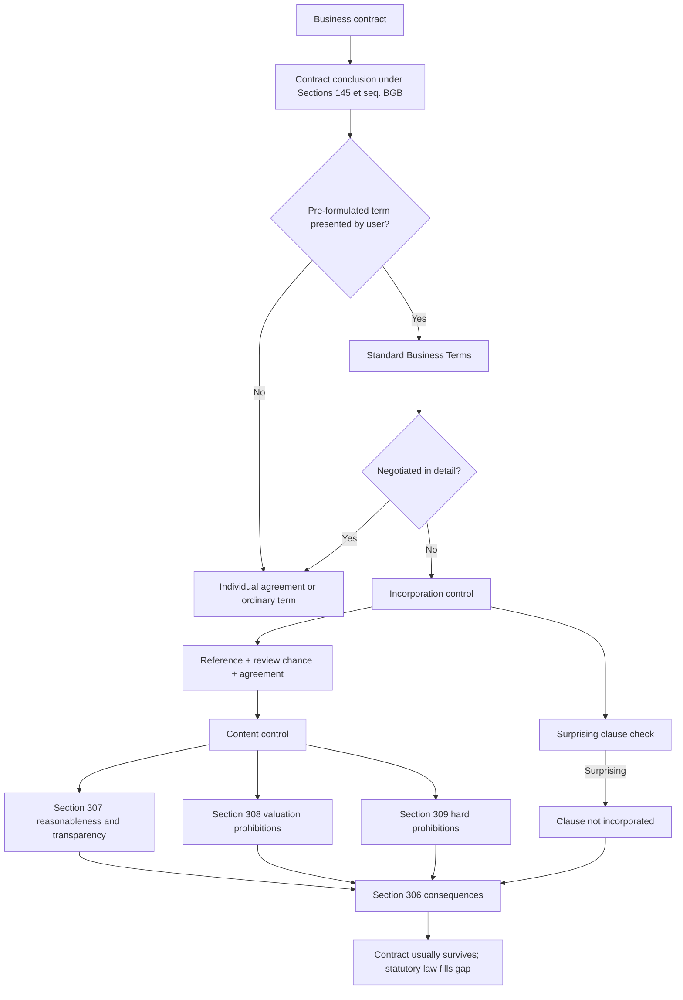
```mermaid
flowchart TD
    Start[Business contract] --> Contract[Contract conclusion under Sections 145 et seq. BGB]
    Contract --> Exists{Pre-formulated term presented by user?}
    Exists -->|No| Individual[Individual agreement or ordinary term]
    Exists -->|Yes| SBT[Standard Business Terms]
    SBT --> Negotiated{Negotiated in detail?}
    Negotiated -->|Yes| Individual
    Negotiated -->|No| Incorporation[Incorporation control]
    Incorporation --> Reference[Reference + review chance + agreement]
    Incorporation --> Surprise[Surprising clause check]
    Surprise -->|Surprising| NotPart[Clause not incorporated]
    Reference --> Content[Content control]
    Content --> S309[Section 309 hard prohibitions]
    Content --> S308[Section 308 valuation prohibitions]
    Content --> S307[Section 307 reasonableness and transparency]
    S307 --> Consequence[Section 306 consequences]
    S308 --> Consequence
    S309 --> Consequence
    NotPart --> Consequence
    Consequence --> Survives[Contract usually survives; statutory law fills gap]
```

## Subject Knowledge Graph

| Node | Meaning | Exam Relevance |
|---|---|---|
| Standard Business Terms | Pre-formulated contract terms presented by one party for repeated use. | Central classification step before SBT control. |
| User of SBT | Party that introduces the SBT into the contract. | Determines who bears drafting ambiguity and content-control risk. |
| Contracting Partner | Party receiving the user's SBT. | Protected by incorporation, interpretation, and content-control rules. |
| Individual Agreement | Truly negotiated term outside SBT control. | Can override or escape SBT scrutiny. |
| Incorporation Control | Test whether SBT became part of the contract. | Catches missing reference, missing review chance, lack of agreement, and surprises. |
| Surprising Clause | Unexpected clause by placement or content. | Not incorporated under Section 305c I BGB. |
| Contra Proferentem | Ambiguity interpreted against the SBT user. | Important interpretation trap before content control. |
| Content Control | Validity review for clauses deviating from statutory law. | Main exam arena for Sections 307-309 BGB. |
| Section 306 Consequence | Contract survives; statutory law replaces failed clause. | Prevents overstatement that the whole contract collapses. |
| Blue-Pencil Test | Mechanical deletion exception for separable invalid wording. | Prevents rewriting invalid clauses into fair versions. |

| From | Relationship | To | Why It Matters |
|---|---|---|---|
| Standard Business Terms | require | Contract Conclusion | SBT cannot float outside a contractual route. |
| User of SBT | presents | Standard Business Terms | Identifies who controls the wording. |
| Individual Agreement | defeats | Standard Business Terms | Negotiated terms avoid SBT control. |
| Incorporation Control | filters out | Surprising Clause | Some clauses never become part of the contract. |
| Contra Proferentem | interprets against | User of SBT | Ambiguity risk sits with the drafter/user. |
| Content Control | applies to | Clauses Deviating From Statutory Law | Price and core performance are usually outside SBT control. |
| Section 309 | is stricter than | Section 308 | No valuation possibility. |
| Section 307 | generalizes | Fairness And Transparency Review | Especially important in B2B contracts. |
| Invalid Clause | triggers | Section 306 Consequence | Contract usually remains; statutory law fills the gap. |
| Blue-Pencil Test | permits only | Mechanical Severance | Courts do not rewrite overbroad SBT. |

## Real Business Examples

- SaaS platform terms: a unilateral change clause may be useful for updating services, but it can be scrutinized if it gives the provider unlimited power to change core duties.
- Supplier purchase terms: both sides may send conflicting retention-of-title or liability clauses. The exam issue is not "who shouted last" only; ask which terms match and what statutory default fills the conflict.
- Online refund policy: a voucher-only remedy for defective products may fail transparency or statutory-principle control.
- Lease cosmetic repairs: unclear wording can be interpreted against the landlord-user and become invalid.

## Exam Relevance

Likely prompts:

- Identify whether a clause is SBT under Section 305 I BGB.
- Distinguish SBT from individually negotiated terms.
- Check whether SBT were incorporated, including surprising clauses.
- Resolve conflicting SBT in a B2B transaction.
- Apply Sections 307-309 BGB and Section 306 BGB consequences.
- Explain whether the blue-pencil test saves part of a clause.

Common traps:

- Starting SBT control before contract conclusion.
- Calling a clause "negotiated" just because the other side clicked accept.
- Forgetting that Section 306 usually preserves the rest of the contract.
- Reviewing the main price as if it were an unfair SBT clause.
- Applying Section 309 directly in B2B without noting Section 310 I.
- Rewriting an overbroad clause instead of testing clean severability.

High-scoring answer structure:

1. State the contract conclusion route.
2. Identify the exact clause.
3. Classify it under Section 305 I BGB.
4. Exclude or confirm individual negotiation.
5. Test incorporation, including Section 305c I if facts suggest surprise.
6. Interpret ambiguity under Section 305c II.
7. Run content control in the correct order.
8. State Section 306 consequences precisely.

## Official Exercise Case Routes

### Case 1: First-Use Car Sales Form And Liability Exclusion

Question: did dealer D use effective SBT against buyer B?

Route:

1. Existence: the document contains contract terms, was pre-formulated by D, and was presented unilaterally during contract conclusion.
2. More-than-two requirement: D uses the document for the first time, but B is a consumer and D is a trader, so Section 310 III No. 2 BGB treats the terms as SBT even in this first-use situation.
3. Incorporation: D explicitly presents the document, B can read it, B signs it, there is no individual agreement, and the liability clause is not surprising merely because it limits delivery-related liability.
4. Content control: the clause excludes "any liability" except intent. This also excludes liability for injury to life, body, or health and gross negligence.
5. Section 309 No. 7 BGB is violated; the clause fails content control.
6. Consequence: the invalid clause is ineffective, the rest of the contract survives under Section 306 I BGB, and statutory liability rules apply under Section 306 II BGB.

Result: the clause is not effective SBT.

Exam trap: in B2C, first use can still be SBT; do not stop at "used for the first time".

### Case 2a: Car-Wash Sign Incorporation

Question: did car-wash operator W use effective SBT?

Route:

1. Works contract under Section 631 BGB can be modified by SBT.
2. Existence: a pre-written sign in front of the car wash is a contract term used repeatedly.
3. Incorporation: explicit oral reference is not practical in a self-service car wash, so a clearly visible notice at the place of contract conclusion can satisfy Section 305 II No. 1 Alt. 2 BGB.
4. O did not read the sign, but had a reasonable opportunity to take notice.
5. O implicitly agrees by driving through the car wash.
6. Content control is passed because the clause only excludes liability for paint damage caused by the customer's improper operation, not W's own gross fault or injury to life/body/health.

Result: effective SBT.

Exam trap: actual reading is not required if opportunity to take notice was adequate.

### Case 2b: Car-Wash Paint Damage Claim

Question: can O claim damages when the roller setting was wrong?

Route:

1. Claim basis: Sections 280 I and 241 II BGB.
2. Contractual obligation: works contract under Section 631 BGB.
3. Breach: W has an ancillary duty to protect O's property; wrong roller setting damages paintwork.
4. Responsibility: negligence is presumed under Section 280 I 2 BGB and supported by the improper setting.
5. Causal damage: paintwork damage.
6. SBT exclusion does not apply because the damage was not caused by the customer's failure to operate the car wash properly.

Result: O can claim compensation for the paintwork damage.

Exam trap: an effective SBT clause may still be factually outside its own wording.

### Case 3: Conflicting SBT And Payment Timing

Question: can machine builder M demand payment from P on Monday?

Route:

1. Claim basis: Section 433 II BGB.
2. Statutory default: if no time is agreed, payment is due immediately under Section 271 I BGB, so the claim would be enforceable from Friday.
3. M's SBT says payment is due the next business day after conclusion; P's SBT says payment is due on arrival.
4. The terms conflict.
5. The "last word" theory is rejected because it would imply tacit acceptance against an already expressed contrary intention and reward persistence.
6. Statutory provisions replace the conflicting terms under the Section 306 logic; the contract survives.

Result: M can demand payment on Monday because the statutory default would already make the payment due.

Exam trap: conflicting SBT do not necessarily destroy the whole contract.

## Writing Workshop Checklist For SBT Legal Opinions

Use this checklist when writing an SBT answer in full legal-opinion style:

1. Start with a hypothesis: "W might have used effective standard business terms according to Sections 305 et seq. BGB."
2. Existence: define Section 305 I 1 BGB, then test contract term, pre-formulated, intended for more than two contracts or B2C exception, and unilateral presentation.
3. Incorporation: test reference, opportunity to take notice, agreement, no individual agreement, and no surprising clause.
4. Content control: test opening under Section 307 III BGB, then Section 309, Section 308, and Section 307 in that order.
5. Consequence: if a clause fails, state clause ineffectiveness, contract survival, and statutory replacement.
6. Style: write continuous sentences, use structure levels, cite exact provisions, answer the case question, and keep each IRAC level complete.

## Retrieval Prompts

Closed-book questions:

1. What are the four main steps of a Standard Business Terms examination?
2. What makes a clause SBT under Section 305 I BGB?
3. How do individually negotiated agreements interact with SBT control?
4. What is the difference between Section 305c I and Section 305c II BGB?
5. Why does Section 306 BGB matter in almost every SBT case?
6. What is the order of content scrutiny under Sections 309, 308, and 307 BGB?

Application prompts:

1. A SaaS provider hides a liability exclusion inside a data-processing appendix. Classify the SBT issue.
2. Seller and buyer exchange conflicting retention-of-title clauses and then perform. What is the likely SBT problem and consequence?
3. A contract says "liability for negligence is capped at EUR 50,000." Apply the blue-pencil idea.
4. A B2B buyer accepts strict SBT without negotiation because litigation later may be cheaper than clause-by-clause negotiation. What is the strategic logic and risk?

## Practice Tasks

### Mini Case 1: Hidden Renewal Clause

A gym's pre-written membership form contains a 24-month automatic renewal clause under a small "miscellaneous" heading. The customer signs without discussion. The gym relies on the renewal.

Short answer guide: identify SBT, no individual negotiation, incorporation issue, possible surprising clause under Section 305c I, then content/transparency control if incorporated.

### Mini Case 2: Battle Of Forms

V sells a machine to B. V's SBT reserve title until full payment. B accepts but attaches SBT rejecting retention of title. V ships the machine.

Short answer guide: ordinary formation plus conflicting SBT; matching terms can apply, conflicting retention-of-title terms do not agree; Section 306 fills gaps; retention of title must be agreed under Section 449 I BGB, so no retention-of-title protection on these facts.

### Mini Case 3: Liability Cap

Clause A separately caps gross negligence and slight negligence. Clause B caps all negligence in one sentence.

Short answer guide: no judicial reduction to a fair core. Clause A may survive partly if the invalid part can be mechanically deleted; Clause B likely fails as a whole if gross and slight negligence cannot be separated by wording.

## Connections

Previous notes from this lecture:

- `../week-03-contract-law-i/week-03-contract-law-i.md`: offer, acceptance, modified acceptance, private autonomy, validity limits.
- `../week-04-contract-law-ii-rescission-revocation/week-04-contract-law-ii-rescission-revocation.md`: consequences when a valid contract later fails.
- `../week-05-contract-law-iii-withdrawal-cancellation-dissolution/week-05-contract-law-iii-withdrawal-cancellation-dissolution.md`: consumer withdrawal and other exit routes; useful when SBT try to restrict remedies.

Next lecture connection:

- `../week-07-agency/week-07-agency.md`: agency can determine who is bound by a contract before SBT validity is tested.

Cross-course links:

- Marketing: platform terms shape customer trust and conversion friction.
- Organization: standardized rules reduce coordination costs but can create compliance and litigation risk.
- SCM: supplier contracts often use conflicting purchase and sales terms, especially retention of title, delivery, and liability clauses.

## Open Uncertainties

- The deck labels itself "Lecture 5" while the course logistics outline places Standard Business Terms as Session 6. This note follows the topic sequence after Contract Law III.
- The deck mentions EU Directive 93/13/EEC as historical background. This note focuses on the BGB rules used for exam case solving unless the exam explicitly asks for EU-law origins.

## Weakness Flags

- First active recall completed 2026-06-07; D+1 due 2026-06-08.
- Keep drilling SBT classification before scrutiny, accept-or-leave versus genuine negotiation, and hidden surprise versus clear-but-harsh content control.
- Keep the B2C/B2B route explicit: transaction purpose -> Sections 13/14 -> direct Section 309 or B2B Section 307 with Section 310 I.
- Use precise consequence language: **not incorporated** for Section 305c I; **ineffective** for failed content control; Section 306 usually preserves the contract.


<div class="page-break"></div>

# [W06.2] Week 06 Standard Business Terms Cheatsheet And Tricks

<p class="source-path">Source: <code>business-law/wiki/week-06-standard-business-terms/week-06-standard-business-terms-cheatsheet-and-tricks.md</code></p>

Course: Business Law
Exam date: 2026-07-28
Source: week-06-standard-business-terms.md, week-06-standard-business-terms-active-recall-session-2026-06-07.md, week-06-standard-business-terms-clarification-session-2026-06-04.md

## Must-Know (exam-critical)

| Step | Rule | Anchor | Backbone reason |
|---|---|---|---|
| 0. Contract first | SBT control only starts after an ordinary contract is confirmed via offer and acceptance. | Sections 145 et seq. BGB | Every SBT answer that skips this step is structurally wrong from sentence one. |
| 1. Existence of SBT | A clause is SBT if it is a contract term, pre-formulated, intended for repeated use (practical threshold: 3+ contracts), and presented unilaterally by the user. | Section 305 I BGB | The core classification gate — everything downstream depends on getting this right. |
| 1a. First-use exception | Even a first-time-used pre-formulated clause counts as SBT against a consumer. | Section 310 III No. 2 BGB | Kills the common wrong instinct that "used only once" means "not SBT." |
| 1b. Individual negotiation defeats SBT | A term is only individually negotiated if the user seriously puts it up for discussion and the other party has a real chance to change the substance — not just discuss or click accept. | Section 305 I sentence 3 BGB | Genuinely negotiated terms escape SBT control entirely. |
| 2. Incorporation | The user must point to the SBT, give a reasonable chance to review, and get agreement. | Section 305 II BGB | Missing any one element means the clause never entered the contract. |
| 2a. Surprising clause | A clause unexpected by placement or content does not become part of the contract. | Section 305c I BGB | Consequence is non-incorporation, not invalidity — different legal effect from content control failure. |
| 3. Ambiguity | Unclear wording is interpreted against the SBT user (contra proferentem). | Section 305c II BGB | Only applies when the wording itself is unclear — not when it's clear but unfair. |
| 4. Content control order | Run Section 309 (hard prohibitions, no valuation) first, then Section 308 (valuation-possible prohibitions), then Section 307 (general reasonableness/transparency). | Sections 307-309 BGB | Order matters for exam structure and for correctly explaining why a B2B clause needed 307 instead of 309. |
| 4a. B2B modification | Sections 309 and most of Section 308 do not apply directly in B2B; Section 307 is the central route, with 309/308 values used only as indirect guidance. | Section 310 I BGB | The single most tested B2B/B2C distinction in this topic. |
| 4b. Price/performance carve-out | Content control does not review the main price or main performance — only clauses that deviate from statutory default rules. | Deck rule (private autonomy) | Prevents wrongly attacking the core deal itself as an unfair clause. |
| 5. Consequence | Bad clause falls out; the rest of the contract usually survives; statutory law fills the gap. | Section 306 BGB | The contract almost never collapses entirely — this is the default outcome to state unless facts show otherwise. |
| Battle of forms | Neither side's conflicting SBT wins automatically ("last shot" theory is rejected); matching terms apply, conflicting terms fall out, statutory law fills the gap. | Section 306 logic, e.g. Section 449 I for retention of title | Common exam scenario (two merchants exchanging forms) with a specific "no winner" answer. |

## Nice-to-Have (depth/edge cases)

- SBT can be spoken, not just written — a pre-formulated, repeatedly-used sales script still counts if the other side had no real influence over it.
- Blue-pencil test: an invalid clause can be mechanically severed and its valid remainder saved only if the wording splits cleanly (e.g., separate sentences for gross vs. slight negligence); courts do not rewrite an overbroad single clause into a narrower fair one.
- Why SBT exist commercially: lower transaction costs, standardization, risk allocation in advance — balanced against contra proferentem risk, mass-litigation exposure, and the duty to keep clauses updated with changing statutes/case law.
- Strategic negotiation point: a business partner may rationally accept strict SBT rather than negotiate every clause, betting that SBT control will filter out illegal terms later — but this gambles on litigation cost, relationship strain, and losing SBT-escape-hatch status once a term becomes genuinely negotiated.
- Actor classification is transaction-specific, not identity-fixed: the same restaurant owner is a consumer (Section 13) buying a private TV and an entrepreneur (Section 14) buying a restaurant fridge.

## Nuances And Traps

| Nuance/Trap | Why it's easy to get wrong | Correct handling |
|---|---|---|
| SBT trigger vs. unfairness trigger | Students jump straight to "this is unfair" instead of first asking whether the clause is pre-written and repeated-use. | State the Section 305 I facts (pre-formulated, repeated use, presented by the user) before any fairness talk — defect/unfairness facts explain why the clause matters, not why it is SBT. |
| Accept-or-leave mistaken for negotiation | "The customer objected and then accepted" or "clicked accept" feels like negotiation but isn't. | Individual negotiation requires the user to seriously put the clause up for real influence over the substance — mere discussion or a binary accept/leave choice is not enough. |
| Clear-but-harsh clause labelled "surprising" | The word "surprising" gets used loosely for anything that feels unfair. | Use the triad strictly: hidden/unexpected placement = surprise (305c I); unclear wording = ambiguity (305c II); clear but too harsh = content control (307-309). |
| B2C and B2B control routes confused | Section 309/308 feel like they should apply everywhere since they're "the SBT sections." | Classify actor purpose first (13 vs. 14 BGB), then route: B2C gets direct Section 309/308; B2B is Section 307 central, with Section 310 I blocking direct 309/308 application (their values still inform 307). |
| "Removed" used instead of precise legal-effect language | Casual wording blurs two different legal outcomes. | Say "not incorporated" under Section 305c I for surprising clauses; say "ineffective" for a clause that fails content control. Both usually leave the rest of the contract intact under Section 306 I, with statutory law filling the gap under 306 II. |
| First-use clause assumed to be safe from SBT | "The seller only used this document once" feels like it should escape SBT status. | Against a consumer, Section 310 III No. 2 BGB pulls in even a first-use pre-formulated clause — do not stop the analysis at "used for the first time." |
| Reading the clause assumed to be required for incorporation | Facts showing the customer never actually read the clause can wrongly suggest non-incorporation. | Actual reading is not required — a reasonable opportunity to take notice (e.g., a clearly visible sign) is enough to satisfy Section 305 II. |
| Effective SBT clause applied outside its own wording | An exclusion clause covering "customer misuse" gets wrongly stretched to cover the user's own operational fault. | Even a validly incorporated, content-control-passing clause only excludes what it actually says — check the clause's scope against the specific facts before applying it. |
| Battle of forms treated as "whoever sent last wins" | Intuitive "last shot" reasoning is explicitly rejected by the deck. | Matching terms apply; conflicting terms (e.g., retention of title vs. rejection of retention of title) both fall out; statutory defaults fill the gap, and default rules (e.g., no automatic retention of title under Section 449 I) may favor neither party's preferred position. |

## One-Line Recall Drill

```text
305 I = SBT existence: pre-formulated, repeated use, presented by user
305 I s.3 = individual negotiation defeats SBT
310 III No. 2 = first-use clause still SBT against a consumer
305 II = incorporation: reference + review chance + agreement
305c I = surprising clause -> not incorporated
305c II = ambiguity -> interpreted against the user
309 -> 308 -> 307 = content control scrutiny order
310 I = B2B blocks direct 309/308, keeps 307 central
306 I/II = clause out, contract survives, statutory law fills gap
blue-pencil = only mechanical, clean severance saves part of a clause
battle of forms = no "last shot" winner, matching terms apply, conflicts fall out
```


<div class="page-break"></div>

# [W06.3] Week 06 Standard Business Terms Practice Questions And Model Answers

<p class="source-path">Source: <code>business-law/wiki/week-06-standard-business-terms/week-06-standard-business-terms-practice-questions-and-model-answers.md</code></p>

Course: Business Law
Exam date: 2026-07-28
Source: week-06-standard-business-terms.md, week-06-standard-business-terms-cheatsheet-and-tricks.md
Format note: 23 questions — 9 short-answer/theory, 14 case/legal-opinion (schema-based). Question 8 integrates Week 09 Warranty Rights II damages; Question 16 integrates Week 03 Contract Law I (offer/acceptance and silence); Question 18 integrates Week 10 Transfer of Property (retention of title and good-faith acquisition); Question 23 integrates Week 07 Agency (can-do/may-do vs. SBT incorporation). Questions 19-22 fill coverage gaps identified in a source audit: Section 308 valuation-possible clauses, content-based (not placement-based) surprising clauses, the Section 306 III total-contract-failure exception, and sign-based incorporation in self-service settings combined with the clause-scope trap.

## Short-Answer / Theory Questions

### Question 1

What are Standard Business Terms (SBT), and what is the statutory test for their existence?

**Model Answer:**

1. Standard Business Terms are pre-formulated contract terms that one party (the user) presents to the other party upon conclusion of a contract, intended for repeated use.
2. Statutory anchor: Section 305 I BGB.
3. Requirements: (1) a contract term shaping rights or duties, written or spoken; (2) pre-formulated before contract conclusion; (3) intended for repeated use, with a practical threshold of at least three contracts (though Section 310 III No. 2 BGB pulls in even first-use clauses against a consumer); (4) presented unilaterally by the user without real influence from the other party.
4. Example: a webshop's standard delivery-and-returns policy presented on every checkout page.
5. Consequence/trap: the classification question is separate from the fairness question — a clause can be SBT and still be perfectly valid, or perfectly ordinary-looking and still fail content control. Do not skip straight to "is this unfair."

### Question 2

Compare a surprising clause under Section 305c I BGB with a clause that fails content control under Sections 307-309 BGB.

**Model Answer:**

A surprising clause triggers when the clause is so unusual in placement or content, given the circumstances, that the other party could not reasonably expect it — anchored in Section 305c I BGB — and the legal consequence is that the clause never becomes part of the contract at all (non-incorporation). Content control triggers when a clause is clear and was properly incorporated, but its substance unreasonably disadvantages the other party or deviates too far from statutory defaults — anchored in Sections 307-309 BGB — and the legal consequence is that the clause is ineffective (invalid), with the rest of the contract surviving under Section 306 BGB. Contrast example: a liability waiver hidden inside an unrelated "delivery logistics" paragraph is a surprise problem; the same waiver clearly labeled under a "Liability" heading, but excluding liability even for gross negligence, is a content-control problem. Exam trap: do not label a clearly worded but harsh clause as "surprising" — reserve that word for placement/content shock, and route harsh-but-clear clauses to 307-309 instead.

### Question 3

List the requirements for effective incorporation of SBT into a contract under Section 305 II BGB.

**Model Answer:**

The requirements are:
1. The user points the other party to the SBT (or, where explicit reference is impractical, gives notice by other adequate means, e.g. a clearly visible sign).
2. The user gives the other party a reasonable opportunity to take notice of the content.
3. The other party agrees to the SBT's application (agreement can be implied by conduct, e.g. proceeding with the transaction).

If any one of these three is missing, the SBT never becomes part of the contract. The reason this rule exists is that a party who never had a fair chance to know or object to hidden terms should not be bound by them — actual reading is not required, only a genuine opportunity to read.

## Case / Legal-Opinion Questions

### Question 4 (Case)

**Facts:** Online furniture retailer F sells a dining table to consumer C through its website. At checkout, a "Terms of Sale" document is pre-formulated by F, used for every online order, and presented via a mandatory checkbox that C must tick before paying. The document is F's first time using this exact wording, since F just redesigned its checkout flow last week. Clause 9 states: "F excludes any and all liability for damage arising from delivery, including liability for gross negligence, except where caused by intent." The table arrives with a deep gouge caused by F's driver carelessly dragging it across gravel — a case of gross negligence by F's own staff.

**Question:** Can F rely on Clause 9 to exclude liability for the gouge damage?

**Model Answer:**

I. Claim/issue sentence: F might have used effective Standard Business Terms excluding liability for the gouge damage under Sections 305 et seq. BGB, unless the clause fails content control.

II. Requirements:
III. Existence of SBT
IV. Incorporation
V. Content control
VI. Legal consequence

III. Existence of SBT: Questionable is whether the Terms of Sale qualify as SBT despite being used for the first time. This is supported by Section 310 III No. 2 BGB, which treats even a first-use, pre-formulated clause as SBT when presented to a consumer. Against this, one could argue novelty suggests individual drafting rather than repeated use. However, the document was drafted in advance for the entire class of online orders, not negotiated with C specifically. Consequently, the Terms of Sale are SBT.

IV. Incorporation: Questionable is whether Clause 9 became part of the contract. This is supported by F pointing C to the document, giving C the opportunity to read it before the mandatory checkbox, and C's active agreement by ticking the box. Against this, one could argue the clause is buried in a long document, but nothing in the facts suggests unusual placement or unexpected content for a "liability" provision in sale terms. However, a liability exclusion clause in a delivery-goods contract is a standard, expected term, not a surprise under Section 305c I. Consequently, Clause 9 is incorporated.

V. Content control: Questionable is whether Clause 9 survives scrutiny given it excludes liability even for gross negligence. This is supported by Section 309 No. 7(b) BGB, which directly and absolutely prohibits clauses excluding liability for damage caused by gross negligence in consumer (B2C) contracts. Against this, one could argue the clause carves out intent, suggesting a good-faith attempt at balance. However, carving out only intent while still excluding gross negligence is exactly what Section 309 No. 7(b) forbids — no valuation of the circumstances is even needed given C is a consumer. Consequently, Clause 9 fails content control and is ineffective for the gross-negligence exclusion.

VI. Legal consequence: the invalid clause falls out under Section 306 I BGB; the rest of the sale contract remains valid; statutory liability rules under Sections 280 I, 241 II BGB apply in place of the failed clause.

Final answer: As a result, F cannot rely on Clause 9 to exclude liability, and C can pursue statutory damages for the gouge caused by F's grossly negligent delivery.

### Question 5 (Case)

**Facts:** Car-rental company R has a standard rental agreement used for every booking. Deep inside a section titled "Vehicle Return Procedure," between paragraphs about fuel levels and cleaning, sits one sentence: "Any late return, even by one minute, triggers a flat EUR 500 penalty regardless of cause." Customer K, renting for a weekend city trip, signs the agreement without reading past the first page and returns the car eight minutes late due to unexpected traffic.

**Question:** Can R charge K the EUR 500 penalty?

**Model Answer:**

I. Claim/issue sentence: R might have a claim against K for the EUR 500 late-return penalty under the rental agreement's clause, if that clause validly became part of the contract.

II. Requirements:
III. Existence of SBT
IV. Incorporation, including the surprising-clause filter
V. Legal consequence if not incorporated

III. Existence of SBT: the penalty clause is a pre-formulated contract term used for every rental, presented unilaterally by R — it satisfies Section 305 I BGB. No facts suggest individual negotiation.

IV. Incorporation: Questionable is whether the clause became part of the contract despite K not reading it. This is supported by the general rule that actual reading is not required, only a reasonable opportunity to take notice — K had the document available and signed it. Against this, one could argue the clause's placement defeats that opportunity: a severe flat penalty clause is buried under an unrelated heading about fuel and cleaning, not under any "Fees," "Penalties," or "Late Return Charges" heading a reasonable customer would scan for financial consequences. However, Section 305c I BGB excludes from the contract any clause so unusual in placement that the other party need not expect it there, and a EUR 500 flat penalty hidden inside routine procedural text is exactly this kind of placement shock — it is disproportionate to the surrounding content and not signaled by any heading. Consequently, the clause is a surprising clause under Section 305c I BGB.

V. Legal consequence: a surprising clause does not become part of the contract at all — it is excluded, not merely reinterpreted or reduced. The rest of the rental agreement remains valid under Section 306 I BGB, and R would need a different (unexcluded) legal basis, such as ordinary default-related damages under Sections 280 I, 286 BGB, to claim anything for the short delay — which would require proof of actual loss, not an automatic flat fee.

Final answer: As a result, R cannot charge K the EUR 500 flat penalty under the clause, because the clause was never incorporated into the contract; any claim for the eight-minute delay would need to rest on ordinary default rules and proof of actual damage.

### Question 6 (Case)

**Facts:** Manufacturer M sells industrial shelving to buyer B. M's order confirmation includes M's SBT, which state: "Title to the goods remains with M until full payment is received." B's purchase order, sent in reply, includes B's own SBT stating: "Buyer rejects any retention-of-title arrangement; title passes on delivery." Neither party objects to the other's document; M ships the shelving and B installs it in its warehouse. M later demands the shelving back after B misses a payment, relying on its retention-of-title clause.

**Question:** Can M reclaim the shelving under its retention-of-title clause?

**Model Answer:**

I. Claim/issue sentence: M might have a right to reclaim the shelving under Section 985 BGB (ownership-based recovery) if M validly retained title through its SBT clause.

II. Requirements:
III. Contract formation despite conflicting SBT
IV. Which SBT terms actually apply
V. Legal consequence for the retention-of-title dispute

III. Contract formation: Both parties acted as if a contract existed — M shipped, B accepted and installed the goods — so a contract was concluded despite the conflicting paperwork; the "battle of forms" issue concerns which terms govern, not whether a contract exists at all.

IV. Which terms apply: Questionable is whether M's retention-of-title clause prevails because M's SBT accompanied the shipment last, or whether B's rejection wins because B's purchase order was the most recent document before shipment. This is supported by the intuitive "last shot" theory, under which whichever party's terms were sent last and unopposed would apply. Against this, the statutory-provisions approach rejects the last-shot theory: it does not reflect real agreement, only who happened to communicate last, and would create an arbitrary advantage from persistence rather than consent. However, applying the statutory-provisions approach, matching terms between the two SBT sets apply, but the retention-of-title clauses directly conflict (M asserts it, B rejects it) and therefore do not agree — a conflicting clause falls out entirely, on both sides, rather than one side's version winning. Consequently, no retention-of-title term governs the contract at all.

V. Legal consequence: with the conflicting clauses cancelled out, Section 306 BGB fills the gap with statutory law. Under German sale-of-goods law, retention of title is not a statutory default — it must be affirmatively agreed under Section 449 I BGB. Since no valid agreement on retention of title exists here, ownership passed to B on delivery under the ordinary Section 929 route.

Final answer: As a result, M cannot reclaim the shelving under a retention-of-title clause, because the conflicting SBT cancel each other out on that point and no retention-of-title arrangement was validly agreed; M's remedy for the missed payment lies in ordinary payment-default claims, not in reclaiming ownership.

### Question 7 (Case)

**Facts:** Logistics company L's SBT contain a single sentence: "L's liability for any negligence, whether slight or gross, in the performance of transport services is capped at EUR 1,000 per shipment." A shipment is destroyed due to L's grossly negligent failure to secure cargo, causing EUR 40,000 in damage. L invokes the cap.

**Question:** Can the clause be partially saved to cap L's liability for ordinary (slight) negligence, even if the gross-negligence portion fails?

**Model Answer:**

I. Claim/issue sentence: L might rely on its liability-cap clause to limit damages to EUR 1,000, unless the clause fails content control and cannot be salvaged for its slight-negligence portion.

II. Requirements:
III. Content control of the cap as applied to gross negligence
IV. Whether the blue-pencil test allows partial survival

III. Content control: a clause capping liability even for gross negligence is invalid — this contradicts the basic legal principle that liability for gross fault should not be pre-excluded or drastically capped, a value reflected in Section 309 No. 7(b) BGB and, via Section 307, in B2B dealings as well. The cap clause as applied to gross negligence therefore fails content control.

IV. Blue-pencil test: Questionable is whether the slight-negligence portion of the cap can survive even though the gross-negligence portion cannot. This is supported by the general blue-pencil principle: mechanical, clean severance of an invalid part can save an independent, grammatically separable remaining part. Against this, one could argue any partial rescue effectively rewrites the clause into something fairer than what L actually wrote. However, the clause here is a single, undivided sentence applying one identical cap to "any negligence, whether slight or gross" — there is no grammatically separate sub-clause for slight negligence that could be deleted while leaving a self-standing valid remainder; splitting it would require inventing new wording, not deleting existing wording. Consequently, the blue-pencil test does not apply, and the entire clause fails.

Final answer: As a result, the clause cannot be partially saved — the whole liability cap is ineffective, and L faces unlimited statutory liability (subject to ordinary damages rules) for the EUR 40,000 loss, illustrating why liability caps should be drafted as separate sentences for gross and slight negligence rather than combined into one.

### Question 8 (Case — integrates Week 06 + Week 09)

**Facts:** Machine parts wholesaler W (a merchant) sells a batch of custom-milled components to manufacturing company P (also a merchant) for use in P's production line. W's SBT, presented and incorporated without dispute, state: "W excludes any liability for damages of any kind arising from defects in the delivered goods." The components turn out to have a material defect: they are milled to the wrong tolerance. Installing them causes a production-line jam that damages an unrelated piece of P's assembly equipment, costing EUR 15,000 to repair. P also wants the EUR 8,000 purchase price back for the defective components themselves.

**Question:** Can P recover the EUR 15,000 equipment-damage loss and the EUR 8,000 purchase price, or does W's SBT clause block these claims?

**Model Answer:**

I. Claim/issue sentence: P might have claims against W for damages under Sections 437 No. 3, 280 I BGB, unless W's blanket exclusion clause validly bars them.

II. Requirements:
III. SBT content control of the exclusion clause (B2B route)
IV. Consequence for the clause
V. Damages route: in addition to vs. instead of performance (Week 09 analysis)
VI. Final allocation of both loss items

III. Content control: Questionable is whether W's blanket "any liability for damages of any kind" exclusion survives content control given both parties are merchants. This is supported by Section 310 I BGB, which blocks the direct application of Sections 309 and most of Section 308 in B2B transactions, making Section 307 the central test. Against this, one could argue B2B scrutiny is looser, so a broad exclusion might be more tolerable between merchants than against a consumer. However, Section 307 still catches clauses that unreasonably disadvantage the other party or restrict essential rights so strongly that the contract's purpose is endangered, and the values underlying Section 309 No. 7(b) (no exclusion of liability for significant breaches or, by extension, for the core defect-liability regime of a sale) inform that assessment even in B2B — a total, unqualified exclusion of all defect-related damages liability, with no carve-out even for the seller's own culpable breach, unreasonably guts the buyer's core warranty protection. Consequently, the clause fails Section 307 BGB content control.

IV. Consequence: the exclusion clause is ineffective under Section 306 I BGB; the rest of the sale contract remains valid; statutory warranty and damages rules apply as if the clause were never there.

V. Damages route (Week 09 hypothetical-performance test): for the EUR 15,000 equipment damage, ask whether this loss would still exist even if W now delivered conforming components — yes, the damage to the separate assembly equipment already occurred and correct later performance would not undo it, so this is damages in addition to performance under Sections 437 No. 3, 280 I BGB, requiring only a breach of duty (the defect), causation, and responsibility (presumed against W under Section 280 I sentence 2, and nothing in the facts rebuts it) — no additional period (Nachfrist) is needed for this branch. For the EUR 8,000 purchase price, P is effectively seeking to give up the defective performance and recover what was paid, which is the profile of big damages or revocation rather than an "in addition" loss; since the facts do not show P set a Nachfrist for cure or that cure was dispensable, P would need to first pursue cure or establish a dispensing ground before claiming the price back as big damages under Sections 437 No. 3, 280 I, III, 281 BGB, or alternatively revoke the contract under Sections 437 No. 2, 323, 346 BGB (no fault required for revocation, but a Nachfrist is still required unless dispensable).

VI. Final answer: As a result, P can recover the EUR 15,000 equipment-damage loss immediately as damages in addition to performance, because W's exclusion clause is ineffective under Section 307 BGB and the loss survives regardless of later cure. Recovery of the EUR 8,000 purchase price is not yet available on these facts alone — P must first set a reasonable additional period for cure (or show one is dispensable) before claiming big damages or revoking the contract, since W's exclusion clause being void does not skip the ordinary procedural prerequisites of the warranty gateway.

## Additional Short-Answer / Theory Questions

### Question 9

Explain the Section 310 I BGB switch for B2B content control and state which sections it excludes from direct application.

**Model Answer:**

1. Section 310 I BGB is the switch that limits direct application of certain consumer-protective content-control provisions when both parties act commercially.
2. Statutory anchor: Section 310 I BGB.
3. Requirements/features: (1) both contracting parties must be entrepreneurs under Section 14 BGB acting for their commercial or independent professional purpose, classified transaction-by-transaction rather than by fixed identity; (2) if so, Section 309 BGB and most of Section 308 BGB do not apply directly; (3) Section 307 BGB remains the central, applicable route in B2B; (4) the values underlying the excluded 308/309 prohibitions still inform the Section 307 reasonableness assessment indirectly — they are not simply irrelevant.
4. Example: a liability-cap clause that would automatically fail Section 309 No. 7(b) in a B2C sale must instead be tested under the more flexible Section 307 BGB reasonableness standard when both the seller and buyer are merchants.
5. Trap: B2B does not mean "no content control." Concluding that a B2B clause escapes scrutiny entirely because 309/308 don't apply directly is wrong — Section 307 is still a live, and often outcome-determinative, gate.

### Question 10

Explain the contra proferentem rule and its trigger condition, distinguishing it from ordinary content control.

**Model Answer:**

1. Contra proferentem is the interpretation rule that resolves genuinely ambiguous SBT wording against the party who drafted and presented it.
2. Statutory anchor: Section 305c II BGB.
3. Requirements/features: (1) the clause's wording must actually be unclear or open to more than one reasonable reading — clear-but-harsh wording does not qualify; (2) where multiple readings genuinely exist, the reading most unfavorable to the SBT user is applied; (3) this operates at the interpretation stage, logically before content control is even reached, because content control needs a settled meaning to test against Sections 307-309.
4. Example: a freight-insurance clause promising "appropriate compensation" without defining a method or reference value is ambiguous; a court applying contra proferentem adopts the reading most favorable to the policyholder and least favorable to the insurer who drafted it.
5. Trap: do not reach for contra proferentem when a clause is perfectly clear but simply harsh — that is a content-control problem under Sections 307-309, not an ambiguity problem, and the two produce different legal-consequence language (interpretation adjustment vs. clause ineffectiveness).

### Question 11

Compare Section 309 BGB and Section 308 BGB as stages of content control.

**Model Answer (Compare Schema):**

Section 309 BGB lists clauses that are prohibited outright with no possibility of case-by-case valuation — anchored directly in Section 309 BGB — so a clause matching one of its enumerated categories (e.g., excluding liability for gross negligence) fails automatically once the facts match, regardless of surrounding circumstances. Section 308 BGB lists clauses that are typically unfair but leave room for a valuation of the individual circumstances before they are struck down — anchored in Section 308 BGB — so a clause matching one of its categories (e.g., an unreasonably vague additional-performance period reserved for the user) can still be saved if the specific facts show it was not actually unreasonable. Contrast example: a blanket "no liability for gross negligence, ever" clause is caught by Section 309 No. 7(b) with no room for debate, while a "the seller may take a reasonable additional period to remedy defects" clause with a vaguely long window falls under Section 308 and requires an examination of what "reasonable" actually meant on the facts before condemning it. Exam trap: do not skip straight to Section 307 for a clause that squarely matches a Section 309 category — the correct scrutiny order is 309 first (no valuation), then 308 (valuation possible), then 307 (general catch-all); and 309/308 do not apply directly in B2B under Section 310 I, where 307 becomes the frontline test instead.

### Question 12

List the requirements for a clause to count as "individually negotiated" under Section 305 I sentence 3 BGB and thereby escape SBT control entirely.

**Model Answer (List-Requirements Schema):**

The requirements are:
1. The user must seriously put the specific clause up for discussion, not merely present it as a take-it-or-leave-it package.
2. The other party must have a real, genuine opportunity to influence the substantive content of the clause, not just discuss it.
3. The final wording must reflect more than a cosmetic acceptance of the user's original template — it must show an actual change resulting from that influence, or at minimum a demonstrated genuine chance to change it.

If any one of these three is missing, the clause remains subject to the full SBT regime (existence, incorporation, content control) rather than escaping to ordinary private-autonomy freedom of contract. The reason this rule is drawn so narrowly is that a party who merely clicked "accept," discussed the clause without any real power to change it, or negotiated some other term while leaving this one untouched still faces exactly the bargaining-power imbalance that SBT law is designed to correct — an easy "we talked about it" escape hatch would gut the entire protective regime.

### Question 13

Explain why content control does not ordinarily review a contract's main price or main performance, and where the boundary of that immunity lies.

**Model Answer:**

1. Content control under Sections 307-309 BGB is designed to police departures from statutory default rules in ancillary clauses, not to let courts second-guess the core bargain the parties struck.
2. Statutory anchor: Sections 307-309 BGB (content control), Sections 134, 138 BGB (outer boundary for extreme cases).
3. Requirements/features: (1) the immunity covers only the main price and the main performance obligation, i.e. the core price-performance relationship freely set by private autonomy; (2) it does not cover ancillary clauses that happen to have a financial effect (fees, penalties, caps) — those remain fully subject to 307-309; (3) an extreme main-price term can still fail outside content control altogether, through Section 138 BGB (usury: a strong imbalance plus exploitation of a weaker party) or Section 134 BGB (violation of a separate statutory prohibition), rather than through 307-309.
4. Example: a car dealer's SBT stating a sale price of EUR 25,000 cannot be attacked as "unfair" under Section 307; but the same EUR 25,000 price for a car objectively worth EUR 5,000, extracted from a buyer in a position of clear weakness or distress, could instead be attacked as usurious under Section 138 II BGB.
5. Trap: do not run a Section 307-309 content-control analysis on the headline price itself — if a price genuinely looks exploitative, reroute the analysis to Section 138 (or 134), because 307-309 structurally does not reach the main price/performance term.

## Additional Case / Legal-Opinion Questions

### Question 14 (Case)

**Facts:** Platform provider Q offers project-management software to business customers under a subscription contract. Q's SBT, properly incorporated, include: "Q may unilaterally modify the scope of core platform features at any time, at its sole discretion, without prior notice." Business customer Z relies heavily on a specific reporting feature central to its workflow. Q removes that feature overnight without warning, disrupting Z's operations.

**Question:** Is the unilateral-change clause valid, and can Q rely on it to justify removing the core feature?

**Model Answer:**

I. Claim/issue sentence: Q might be entitled to unilaterally remove the reporting feature under its SBT clause, unless the clause fails content control despite the more permissive B2B setting.

II. Requirements:
III. Content control of the unilateral-change clause under Section 307 BGB (B2B route)
IV. Legal consequence

III. Content control: Questionable is whether an unlimited, sole-discretion, no-notice right to alter core features unreasonably disadvantages Z under Section 307 I, II BGB, notwithstanding Section 310 I channeling B2B scrutiny through Section 307. This is supported by Section 307 II No. 1 BGB's value that a clause deviating from the essential basic idea of the statutory provision it modifies is presumptively unreasonable, together with the deck's principle that clauses restricting essential rights so strongly that the contract's purpose is endangered fail content control — removing a feature the customer specifically relies on, without notice, undermines the very performance Z is paying for. Against this, one could argue platforms need flexibility to evolve software, and B2B counterparties are expected to tolerate more risk-shifting than consumers under the relaxed B2B route. However, "sole discretion" combined with "no prior notice" and no carve-out for core/essential features goes beyond reasonable flexibility — it is unlimited and eliminates any predictability of the bargained performance, echoing the value behind Section 308 No. 4 BGB (a reserved right to change performance is only tolerable if reasonable, considering the other party's interests), which informs Section 307 even though Section 308 itself does not apply directly in B2B. Consequently, the unrestricted, no-notice, core-feature-inclusive change clause fails Section 307 BGB content control even under the more permissive B2B standard.

IV. Legal consequence: the clause is ineffective; the rest of the subscription contract survives under Section 306 I BGB; Q remains bound to perform the originally agreed feature scope unless it separately obtains Z's actual consent to a change or the clause had been properly limited (advance notice, reasonable regard for the customer's interest, exclusion of core features).

Final answer: As a result, Q cannot rely on the clause to justify removing the reporting feature; Q's overnight removal breaches its contractual duty, and Z can pursue remedies for the resulting non-performance.

### Question 15 (Case)

**Facts:** Freight insurer N's SBT state: "In case of cargo damage, the policyholder receives appropriate compensation." Policyholder P's cargo, worth EUR 20,000, is damaged in transit. N offers EUR 4,000, arguing "appropriate" leaves N broad discretion tied to its internal risk assessment. P disputes this and demands compensation closer to the actual loss.

**Question:** How should the ambiguous term "appropriate compensation" be resolved, and can N limit payment to EUR 4,000?

**Model Answer:**

I. Claim/issue sentence: P might be entitled to compensation beyond N's offered EUR 4,000, depending on how the ambiguous "appropriate compensation" clause in N's SBT is interpreted.

II. Requirements:
III. Whether the clause is genuinely ambiguous under Section 305c II BGB
IV. Which interpretation governs
V. Consequence for the amount owed

III. Ambiguity: Questionable is whether "appropriate compensation" is genuinely unclear. This is supported by the absence of any defined method, percentage, or cap in the wording, leaving at least two reasonable readings open — full market-value indemnification versus an insurer-discretion-limited amount. Against this, N argues "appropriate" is an ordinary word carrying an implicit "reasonable under the circumstances" meaning tied to actuarial practice. However, the clause supplies no objective anchor (no reference to market value, replacement cost, or a defined formula) by which "appropriate" could be pinned down, and multiple genuinely reasonable readings remain open on the wording alone. Consequently, the clause is ambiguous within Section 305c II BGB.

IV. Which interpretation governs: contra proferentem directs that ambiguity in SBT wording is interpreted against the user who drafted and presented it — here, N. This is supported by the policy rationale that N, as drafter, could have specified a method and bears the risk of failing to do so. Against this, N might argue its restrictive reading is also one of the reasonable candidates and should not automatically lose. However, contra proferentem specifically selects the reading least favorable to the drafter among the reasonable candidates, so the policyholder-favorable reading — compensation reflecting the full extent of the loss, absent any drafted limitation — prevails. Consequently, the clause must be read against N's narrow interpretation.

V. Consequence: N cannot rely on its restrictive EUR 4,000 reading; N owes compensation assessed on the policyholder-favorable interpretation, subject to ordinary proof-of-loss rules for the EUR 20,000 claimed.

Final answer: As a result, the ambiguous "appropriate compensation" clause is interpreted against N under Section 305c II BGB, and N cannot limit payment to its self-serving EUR 4,000 figure.

### Question 16 (Case — integrates Week 06 + Week 03)

**Facts:** Wholesaler G's website catalog lists industrial pumps with prices, without mentioning any SBT. Buyer H emails G: "I order Pump Model X at the listed price of EUR 3,000, per your catalog." G replies by email, "Order confirmed, thank you," matching every term of H's email exactly — item, quantity, and price unchanged. Attached to that same confirmation email, for the very first time, is a PDF titled "General Terms" never previously mentioned in the exchange, containing the clause: "Buyer bears all transport risk from dispatch." H does not open the PDF and sends no further reply. G later ships the pump, which is damaged in transit through no fault of either party. G invokes the transport-risk clause to deny any responsibility for the damage.

**Question:** Is a contract concluded, and did the transport-risk clause in G's General Terms become part of it?

**Model Answer:**

I. Claim/issue sentence: A contract for the pump may have been concluded on H's own terms, but G's General Terms, including the transport-risk clause, may never have become part of that contract.

II. Requirements:
III. Contract formation under Sections 145, 147, 150 II BGB
IV. Incorporation of the General Terms under Section 305 II BGB

III. Contract formation: G's catalog listing is an invitatio ad offerendum, not a binding offer, since G cannot reasonably intend to be bound toward every possible buyer for limited stock. H's email, stating the specific pump, quantity, and the exact listed price, is the offer under Section 145 BGB. Questionable is whether G's reply is a straight acceptance or, per Section 150 II BGB, a modified acceptance that would instead count as a rejection plus new offer. This is supported by the fact that a reply attaching new material terms is normally treated as modification. Against this, the substantive content of G's reply — item, quantity, price — is identical to H's offer in every respect; only an attachment, not a change to the offer's own terms, was added. However, Section 150 II targets changes to the terms of the offer itself, and the core essentialia negotii here are untouched, so G's reply is a plain, unmodified acceptance. Consequently, a contract for the pump at EUR 3,000 was concluded on H's own terms the moment G's acceptance was received under Section 130 BGB.

IV. Incorporation of the General Terms: Questionable is whether the transport-risk clause, bundled into the acceptance email but never mentioned in the prior exchange, became part of this already-concluding contract under Section 305 II BGB, which requires the user (G) to point to the SBT, give a reasonable opportunity to review it, and obtain the other party's agreement. This is supported by G attaching the document and nominally giving H the opportunity to open it. Against this, one could argue that H's silence after receiving the attachment, combined with G's own confirmation already matching and closing H's offer, means no separate, additional act of agreement to the newly bundled document exists on these facts. However, silence is not acceptance under ordinary contract-formation doctrine (Section 145 et seq. BGB reasoning; no facts trigger the narrow Section 362 HGB commercial-confirmation exception, which in any event would run in the opposite direction here since it is G, the sender, not H, who would need to object to a letter it received), and Section 305 II's "agreement" element demands more than passive non-objection to an unsolicited attachment appearing for the first time at the confirmation stage. Consequently, the General Terms, including the transport-risk clause, were never incorporated.

Final answer: As a result, a contract for the pump at EUR 3,000 was validly concluded through H's offer and G's matching acceptance, but the transport-risk clause never became part of that contract; G cannot invoke it, and responsibility for the transit damage must instead be worked out under the statutory default rules that apply absent any effective contractual risk-allocation clause.

### Question 17 (Case)

**Facts:** Wholesaler R sells a packaging machine to buyer S; both are merchants. R's SBT state: "Delivery within 4-6 weeks; payment due 30 days after invoice." S's own SBT, attached to its purchase order, state: "Delivery within 4-6 weeks; payment due 14 days after invoice." Neither side objects to the other's document. R manufactures and ships within 5 weeks; S accepts and installs the machine, then pays 25 days after invoice. R demands default interest, arguing S breached the 14-day term found in S's own SBT, which R claims should prevail as the more specific document.

**Question:** Which payment-term clause, if any, governs, and did S breach it?

**Model Answer:**

I. Claim/issue sentence: R might be entitled to default interest if S breached an applicable 30-day or 14-day payment term, but this depends on which (if either) party's conflicting SBT governs payment timing.

II. Requirements:
III. Contract formation despite conflicting SBT
IV. Which SBT terms actually apply — matching vs. conflicting clauses
V. Consequence for the payment-timing dispute

III. Contract formation: both parties acted as if a contract existed — R manufactured and shipped, S accepted and installed the machine — so a contract was concluded despite the conflicting paperwork, consistent with the "battle of forms" doctrine that formation and content-of-terms are separate questions.

IV. Which terms apply: Questionable is whether R's 30-day term or S's 14-day term governs, given the two SBT sets conflict on payment timing while matching exactly on delivery timing (both state 4-6 weeks). This is supported by the statutory-provisions approach: matching terms between the two SBT sets apply because both parties actually agree on them, so the 4-6 week delivery term is incorporated without dispute. Against this, R argues a "last shot" logic — that whichever party's document was sent or received last should control the conflicting payment term. However, the statutory-provisions approach expressly rejects last-shot reasoning as an arbitrary reward for persistence rather than genuine agreement; conflicting terms fall out entirely on both sides rather than one side's version winning by timing. Consequently, neither the 30-day nor the 14-day clause governs payment timing at all.

V. Consequence: with the conflicting payment clauses cancelled out, Section 306 II BGB fills the gap with statutory law rather than either party's drafted figure — the applicable default is Section 271 I BGB, under which payment falls due promptly absent an agreed date, not on any 30-day or 14-day schedule invented by either SBT set. Any interest claim R raises must therefore rest on that statutory due date and the ordinary default-of-payment requirements under Section 286 BGB, not on breach of "the 14-day clause," which never bound S in the first place.

Final answer: As a result, neither R's nor S's payment-timing clause governs; the conflicting clauses cancel out under the statutory-provisions approach while the matching delivery term stands, and any interest claim must be built on the statutory due-date default and ordinary default rules rather than on S's rejected 14-day figure.

### Question 18 (Case — integrates Week 06 + Week 10)

**Facts:** Steel supplier S sells and delivers a batch of steel beams to construction firm B. S's SBT, properly incorporated and undisputed, state: "Ownership of the delivered goods remains with S until B has paid the full purchase price." B has not yet paid. Before paying, B resells and hands over some of the beams to subcontractor T, who has no knowledge of the retention-of-title arrangement and pays B in full, reasonably believing B to be the outright owner.

**Question:** Does T acquire ownership of the beams from B?

**Model Answer:**

I. Claim/issue sentence: T might have acquired ownership of the beams from B under Section 929 sentence 1 BGB, unless B's own lack of ownership — caused by S's still-pending retention of title — blocks a straightforward transfer and instead requires good-faith acquisition.

II. Requirements:
III. Effect of S's retention-of-title clause on ownership as between S and B
IV. B-to-T transfer under Section 929 sentence 1 BGB (authorization)
V. Good-faith acquisition under Sections 929 sentence 1, 932 BGB if authorization fails
VI. Section 935 BGB lost/stolen block

III. Retention of title (S-B layer): the clause is validly incorporated per the facts and functions as a suspensive-condition disposition agreement under Section 158 I BGB, read together with Section 449 I BGB — S and B agreed to transfer ownership only on condition of full payment. Since B has not yet paid, the condition has not occurred, so ownership never passed from S to B; S remains owner and B holds only possession plus a conditional expectancy.

IV. B-to-T transfer: T's acquisition would ordinarily require agreement, delivery, agreement still existing at delivery, and authorization to dispose under Section 929 sentence 1 BGB. Questionable is whether B, as a non-owner, had authorization to dispose of the beams. This is supported by nothing in the facts — B never obtained S's consent to resell before paying in full, and no facts show S authorized onward resale (e.g., no extended-retention-of-title processing clause is mentioned). Against this, one could argue construction-supply trade custom might imply a right to resell. However, absent any such authorization wording in S's SBT, B lacked the power to dispose of goods it did not yet own. Consequently, authorization is missing, and a straightforward Section 929 sentence 1 transfer fails.

V. Good-faith acquisition: Questionable is whether T can nonetheless acquire ownership under Sections 929 sentence 1, 932 BGB despite B's missing authorization. This is supported by T's good faith — T had no knowledge of the retention-of-title arrangement and reasonably relied on B's possession as an indicator of ownership under the Section 1006 BGB presumption. Against this, one could argue B was never genuinely in a position to sell since S's SBT clearly reserved title from the outset. However, good-faith acquisition exists precisely to override a missing-authorization gap where the true owner voluntarily entrusted possession to the non-owner, and S itself voluntarily delivered the beams to B as part of the sale — the legal-appearance risk S created by handing over possession is exactly what good-faith acquisition places on S rather than on the innocent third party T. Consequently, the requirements of good-faith acquisition are met.

VI. Section 935 check: the lost/stolen block only applies where the true owner lost possession involuntarily. Here S voluntarily delivered the beams to B as part of the sale transaction, so Section 935 BGB does not apply and does not bar T's good-faith acquisition.

Final answer: As a result, T acquires ownership of the beams from B via good-faith acquisition under Sections 929 sentence 1, 932 BGB, even though B itself never became owner because S's validly incorporated retention-of-title clause suspended the ownership transfer until full payment. S loses ownership to T and is left only with claims against B for breach of the retention-of-title arrangement, not recovery of the beams themselves — illustrating how an SBT clause valid at the incorporation and content-control level can still fail to protect the drafting party once property-law good-faith acquisition rules take over downstream.

## Coverage-Gap Questions (Added After Audit)

### Question 19 (Case)

**Facts:** Furniture retailer F's SBT, properly incorporated into its consumer sales, state: "If a delivered item is defective, F reserves a reasonable additional period to remedy the defect before the customer may pursue further remedies." Consumer C buys a dining chair with a wobbly leg — a minor, easily-fixed cosmetic-mechanical defect. C notifies F. F takes three months to send a repair technician, offering no interim explanation despite several follow-up emails from C. F argues the clause entitles it to however long it judges "reasonable."

**Question:** Is F's additional-performance-period clause valid, and can F rely on it to justify the three-month delay?

**Model Answer:**

I. Claim/issue sentence: F might be entitled to rely on its additional-performance-period clause to justify the delay, unless the clause fails content control under Section 308 BGB as applied to these facts.

II. Requirements:
III. Classification of the clause under Section 308 BGB (valuation-possible prohibition), not Section 309 BGB
IV. Valuation of the circumstances: was three months reasonable for this defect
V. Legal consequence

III. Classification: Questionable is whether this clause is caught by Section 309 BGB's automatic, no-valuation prohibitions or by Section 308 BGB's valuation-possible category. This is supported by the clause's own wording, which reserves an "additional reasonable period" without a fixed number of days or months — it does not flatly deny the customer any remedy timeline the way a Section 309 hard-prohibition clause would, but instead leaves the actual length open to later assessment. Against this, one could argue any vague, seller-favorable timing clause should be struck automatically. However, Section 308 BGB is specifically built for insufficiently-specific additional-performance-period clauses reserved for the user, which is exactly this clause's structure — it is not on the Section 309 list. Consequently, the clause must be tested under Section 308 BGB with a valuation of the individual circumstances, not dismissed automatically under Section 309.

IV. Valuation: Questionable is whether three months was a reasonable additional period on these specific facts. This is supported by the nature of the defect — a wobbly chair leg is a minor, easily-diagnosed mechanical fix that does not require rare parts, specialized fabrication, or complex logistics. Against this, F might argue general scheduling backlogs or technician availability justify a longer window. However, F offered no interim explanation despite repeated follow-up from C, and nothing in the facts points to any genuine complexity justifying three months for a simple chair repair — the valuation of these circumstances shows the period actually taken was unreasonably long relative to the defect's nature. Consequently, the clause, though not automatically invalid in the abstract, is invalid as applied to this three-month delay under Section 308 No. 2 BGB's evaluation standard.

V. Legal consequence: the clause is ineffective for this delay under Section 306 I BGB; the rest of the sale contract remains valid; C is not bound to wait indefinitely and may proceed to statutory follow-on remedies (further cure demand with a shorter, C-set reasonable deadline, or move toward reduction/revocation/damages under Sections 437 ff. BGB if that deadline also lapses).

Final answer: As a result, F's clause is not automatically void, but on these facts a three-month delay for a minor defect fails the Section 308 BGB valuation of the individual circumstances and cannot justify the delay; C may treat the reasonable-period requirement as already exceeded and escalate toward the standard warranty remedy ladder.

### Question 20 (Case)

**Facts:** Fitness studio G's membership contract is a properly pre-formulated, incorporated SBT document, given to every new member with a clear opportunity to read it before signing. Under the heading "Membership Duration And Renewal" — the correct, expected heading for that kind of provision — sits this sentence, phrased in ordinary contract language and not hidden or in fine print: "By signing this agreement, the member irrevocably consents to G using their photograph and name in G's national television advertising campaigns without further compensation." New member M signs without reading closely and later discovers their photo in a nationwide TV ad.

**Question:** Did the image-rights clause become part of M's membership contract?

**Model Answer:**

I. Claim/issue sentence: G's image-rights clause may have become part of M's membership contract under Section 305 II BGB, unless it is excluded as a surprising clause under Section 305c I BGB despite its unhidden placement and ordinary print.

II. Requirements:
III. Ordinary incorporation elements (reference, opportunity, agreement)
IV. Surprise by content rather than by placement

III. Ordinary incorporation: G pointed M to the document, gave M a genuine opportunity to review it before signing, and M signed, satisfying Section 305 II BGB's reference, opportunity, and agreement elements on their face.

IV. Content-based surprise: Questionable is whether the clause is nonetheless excluded under Section 305c I BGB, even though it sits under the correct heading, in ordinary print, not buried or disguised. This is supported by the principle that a clause can be surprising through its content alone, not only through unusual placement — a term so unrelated to what a reasonable party would expect from that type of contract that its mere presence, regardless of where it sits, defeats reasonable expectation. Against this, one could argue that because the clause is clearly labeled and readable, any unfairness must be a content-control problem under Sections 307-309, not a surprise problem under 305c I. However, the two tests ask different questions: content control asks whether a properly-expected-and-incorporated clause is too harsh, while the surprise test asks whether the clause's very subject matter is something a member joining a gym could reasonably anticipate finding in a "Membership Duration And Renewal" section at all — an irrevocable, uncompensated grant of national advertising image rights bears no substantive connection to duration or renewal terms and is the kind of clause a reasonable member would expect to see (if anywhere) under a separate, clearly-flagged "Image Rights" or "Marketing Consent" heading, not folded into duration language. Consequently, the clause is a surprising clause by content, irrespective of its unhidden placement and clear print.

Final answer: As a result, the image-rights clause did not become part of M's membership contract under Section 305c I BGB; the rest of the membership agreement remains valid under Section 306 I BGB, and G has no contractual basis to use M's image in its advertising.

### Question 21

Explain the consequence ladder under Section 306 BGB when an SBT clause is not incorporated or fails content control, including the rare exception where the whole contract fails.

**Model Answer (List-Requirements Schema):**

The consequence ladder is:
1. Default rule: the offending clause (not incorporated under 305c I, or ineffective under 307-309) simply falls out; it does not become part of, or does not remain part of, the contract (Section 306 I BGB).
2. Gap-fill: the rest of the contract remains valid, and statutory default provisions replace the missing or invalid term (Section 306 II BGB); if no statutory provision directly fits, supplementary interpretation asks what reasonable parties would have agreed.
3. Exception (rare): the whole contract is void, not just the clause, if adherence to the remaining contract would represent an unreasonable hardship for one party (Section 306 III BGB) — this is the narrow escape hatch, not the default outcome.

If step 3's hardship threshold is not met, the analysis must stop at steps 1-2 and the contract survives with the statutory gap-fill; jumping straight to "the whole contract is void" without showing genuine unreasonable hardship for a specific party is a structural error.

Trap: exam answers overwhelmingly default to "clause falls out, contract survives, statutory law fills the gap" (steps 1-2) — do not reach for the Section 306 III total-failure exception unless the facts affirmatively show that continuing the stripped-down contract would be an unreasonable hardship for one side; merely losing a favorable clause is not hardship in this sense.

### Question 22 (Case)

**Facts:** Self-service parking garage P displays a large, clearly worded sign at the entrance barrier, visible to every driver before entry: "P is not liable for damage to vehicles caused by the driver's own improper parking or maneuvering. P remains liable for damage caused by P's own equipment or staff." Driver D drives in, taking no special notice of the sign, and parks. While D is parked, the garage's automated barrier arm malfunctions due to P's own poorly maintained mechanism and swings down onto D's car, denting the roof. P points to the sign and denies liability for "any damage in the garage."

**Question:** Did the exclusion clause become part of the contract, and does it cover the barrier-arm damage?

**Model Answer:**

I. Claim/issue sentence: D might have a damages claim against P under Sections 280 I, 241 II BGB for the barrier-arm damage, unless P's sign-based exclusion clause validly excludes it.

II. Requirements:
III. Incorporation of the sign as SBT despite no explicit individual reference
IV. Scope of the clause as actually worded

III. Incorporation: Questionable is whether a posted sign, rather than a signed document or explicit oral reference, can incorporate SBT into a self-service parking contract. This is supported by Section 305 II No. 1 Alternative 2 BGB, which permits a clearly visible notice at the place of contract conclusion to substitute for explicit reference precisely where explicit reference is impractical — a self-service garage with no attendant to hand over paperwork is exactly this situation. Against this, one could argue D took no notice of the sign and never read it. However, actual reading is not required for incorporation, only a reasonable opportunity to take notice, and a large, clearly worded sign positioned at the entry barrier gives every driver that opportunity; D's agreement is implied by driving in and parking under the posted terms. Consequently, the sign's terms, including the liability clause, are incorporated into the parking contract.

IV. Scope of the clause: Questionable is whether the incorporated clause, even though validly part of the contract, actually covers the barrier-arm malfunction. This is supported by the clause's own two-part wording, which excludes liability only for damage caused by the driver's own improper parking or maneuvering, while expressly preserving P's liability for damage caused by P's own equipment or staff. Against this, P argues the sign generally disclaims liability for "any damage in the garage." However, that broader gloss is not what the clause actually says — an incorporated and content-control-passing clause only excludes what its own wording covers, and a malfunctioning barrier arm caused by P's poor maintenance is expressly carved back into P's liability by the clause's own second sentence, not excluded by its first. Consequently, the clause does not apply to this damage at all.

Final answer: As a result, the exclusion clause is validly incorporated via the entrance sign, but by its own terms it does not cover damage caused by P's malfunctioning equipment; D can pursue the barrier-arm damage claim under Sections 280 I, 241 II BGB, and P cannot stretch a validly incorporated clause beyond what it actually says.

### Question 23 (Case — integrates Week 06 + Week 07)

**Facts:** Company P employs A as its general purchasing representative, with A openly introduced to suppliers as having full authority to negotiate and conclude supply contracts on P's behalf — nothing in A's external dealings signals any limit. Internally, unknown to any supplier, P's policy caps A's authority at EUR 10,000 per deal without additional sign-off from P's board. A concludes a EUR 50,000 supply contract with seller S in P's name, and as part of that deal, S's SBT — including a broad liability-limitation clause — are properly presented, and A agrees to their incorporation on P's behalf. P later argues neither the contract nor S's SBT bind P, because A exceeded A's internal EUR 10,000 authority.

**Question:** Is the EUR 50,000 contract binding on P, and are S's SBT validly incorporated against P?

**Model Answer:**

I. Claim/issue sentence: S might have a valid EUR 50,000 contract with P, including validly incorporated SBT, if A's exceeding of an undisclosed internal authority limit does not defeat either A's external power of representation or the SBT's incorporation.

II. Requirements:
III. Whether P is bound to the underlying contract at all (Section 164 I BGB, can-do vs. may-do)
IV. Whether S's SBT are validly incorporated on P's behalf despite A's internal breach (Section 305 II BGB)

III. Contract binding: Questionable is whether P is bound by the EUR 50,000 contract given A's internal EUR 10,000 cap. This is supported by the agency can-do/may-do distinction: A's external power of representation ("can do") was granted without any visible limit communicated to suppliers, while the EUR 10,000 cap is purely an internal restriction ("may do") on how A was permitted to use that external power. Against this, P argues that exceeding an internal policy should mean the deal was never properly authorized at all. However, internal restrictions generally do not bind or put on notice a third party who has no way of knowing about them, and nothing in the facts suggests S knew or should have known of P's internal cap — A's external authority to conclude supply contracts remained fully intact toward S. Consequently, P is bound to the EUR 50,000 contract; A's breach of the internal cap creates, at most, an internal recourse issue between P and A, not a defect in P's binding toward S.

IV. SBT incorporation: Questionable is whether S's SBT, including the liability-limitation clause, were validly incorporated against P given that A — not P personally — was the one who received the reference, had the opportunity to review, and agreed to their application under Section 305 II BGB. This is supported by the same can-do logic carried one layer further: because A had full external power of representation to conclude the underlying contract in P's name, A's declarations in doing so — including agreeing to incorporate the counterparty's SBT as part of striking that deal — are P's own declarations under Section 164 I BGB, exactly as if P had personally received the reference, reviewed the terms, and agreed. Against this, P might argue that incorporation is a separate, additional act requiring P's own direct assent beyond the main contract. However, SBT incorporation is not a freestanding transaction outside the contract-conclusion process — it is part of concluding the very contract A had full power to conclude, so the same authority that lets A bind P to the EUR 50,000 deal also lets A bind P to the SBT presented as part of striking it. Consequently, S's SBT, including the liability-limitation clause, are validly incorporated against P.

Final answer: As a result, both the EUR 50,000 supply contract and S's incorporated SBT bind P; A's violation of the undisclosed internal EUR 10,000 cap is a "may do" breach that exposes A to P's internal consequences but does not unwind P's external "can do" liability toward S on either the contract or its incorporated terms.

## Quick Answer Route Summary

| Question # | Primary Route/Section | One-line takeaway |
|---:|---|---|
| 1 | Section 305 I BGB | SBT existence test: pre-formulated, repeated use, presented by the user. |
| 2 | Sections 305c I vs. 307-309 BGB | Surprise = non-incorporation; harsh-but-clear = content control. |
| 3 | Section 305 II BGB | Incorporation needs reference, review chance, and agreement. |
| 4 | Section 310 III No. 2, 309 No. 7(b) BGB | First-use SBT still counts; gross-negligence exclusion always fails in B2C. |
| 5 | Section 305c I BGB | Severe penalty buried under an unrelated heading is a surprising clause. |
| 6 | Section 306 BGB, 449 I BGB | Conflicting battle-of-forms clauses cancel out; no automatic retention of title. |
| 7 | Blue-pencil test | Combined gross/slight negligence cap in one sentence cannot be split — whole clause fails. |
| 8 | Section 307 BGB + Sections 280 I / 281 / 283 BGB | B2B blanket exclusion fails 307; then route damages via the in-addition/instead-of test from Week 09. |
| 9 | Section 310 I BGB | B2B blocks direct 309/308; Section 307 stays central and still bites. |
| 10 | Section 305c II BGB | Genuine ambiguity, not mere harshness, triggers contra proferentem. |
| 11 | Sections 309 vs. 308 BGB | 309 = no valuation, automatic fail; 308 = valuation possible, facts can save it. |
| 12 | Section 305 I sentence 3 BGB | Real influence over substance, not just discussion or a click, defeats SBT status. |
| 13 | Sections 307-309 vs. 134/138 BGB | Main price is immune from content control; extreme prices reroute to usury/Section 138. |
| 14 | Section 307 BGB (B2B) | Unlimited, no-notice, core-feature change clause fails 307 even under the relaxed B2B standard. |
| 15 | Section 305c II BGB | "Appropriate compensation" is ambiguous; contra proferentem reads it against the insurer. |
| 16 | Sections 145/147/150 II + 305 II BGB | Unmodified reply = valid acceptance; a first-time attached SBT still needs its own incorporation, and silence isn't agreement. |
| 17 | Battle of forms, Section 306 II + 271 I BGB | Matching delivery term applies; conflicting payment terms cancel out; statutory due date fills the gap. |
| 18 | Section 158 I + 449 I BGB, then Sections 929 I / 932 / 935 BGB | Retention of title blocks B's ownership; good-faith acquisition still lets T take title from S. |
| 19 | Section 308 BGB (valuation-possible) | Vague additional-performance-period clause isn't auto-void like 309 — facts decide if the length taken was reasonable. |
| 20 | Section 305c I BGB (content-based surprise) | Clear print, correct heading, still a surprise — the clause's subject matter itself is alien to the contract type. |
| 21 | Section 306 I-III BGB | Clause falls out, contract survives, statutory law fills gap — total-contract voidness is a narrow unreasonable-hardship exception, not the default. |
| 22 | Section 305 II No. 1 Alt. 2 BGB + clause scope | Entrance sign incorporates SBT in a self-service setting; but a valid clause only excludes what its own wording actually covers. |
| 23 | Section 164 I BGB can-do/may-do + Section 305 II BGB | Agent's undisclosed internal cap doesn't defeat external contract-binding or SBT incorporation against the principal. |


<div class="page-break"></div>

# [W07.1] Week 07: Agency

<p class="source-path">Source: <code>business-law/wiki/week-07-agency/week-07-agency.md</code></p>

Source: `business-law/raw/moodle-export-business-law-950848572-s26-20260604/01.06. - Agency - Haag/Agency.pdf`
Exercise/writing-workshop sources processed 2026-07-09:

- `business-law/raw/moodle-export-business-law-950848573-s26-20260709/3.6. Agency/Agency_Case facts.pptx`
- `business-law/raw/moodle-export-business-law-950848573-s26-20260709/3.6. Agency/Agency_Slides and solutions.pdf`
- `business-law/raw/moodle-export-business-law-950848573-s26-20260709/10.6. Writing Workshop/Practice Case_Agency.pptx`

Course: Business Law
Processed: 2026-06-04
Wiki note: `business-law/wiki/week-07-agency/week-07-agency.md`

Course direction checked against `business-law/wiki/_course-logistics.md`: Agency follows Standard Business Terms in the teaching outline. The PDF title slide labels the deck as "Lecture 6"; this note follows the course sequence and stores it as Week 07.

## 80/20 Exam Summary

Agency explains how one person can bind another person in contract.

- Effective agency under Section 164 I BGB requires the agent's own declaration of intent, action in the principal's name, and power of representation.
- If agency is effective, the contract binds the principal and third party directly, not the agent.
- The principal-agent internal relationship is separate from the external agency relationship: "can do" is not the same as "may do."
- Power of representation can come from statute, declaration, or reliance on good faith.
- If there is no power of representation, the principal is not bound unless the principal ratifies under Section 177 BGB; the unauthorized agent may be liable under Section 179 BGB.
- Section 181 BGB limits self-dealing and acting on both sides because of conflict-of-interest risk.
- Agency is economically useful for division of labor, expertise, capacity, and legal entities, but it creates control and information problems.
- The principal-agent problem is a management version of the same legal structure: information asymmetry plus self-interest creates agency costs.

## Contract Law Continuity Bridge

Agency comes before the final contract consequence question.

```text
Contract Law I asks: was a contract formed?
Agency asks: whose declaration counts, and who is bound?
SBT asks: which standard clauses became part of that contract and are valid?
Contract Law II/III ask: can someone later get out?
```

Memory hook: Agency is the "remote control" for contracts. The agent presses the button, but if the requirements are met, the legal machine moves for the principal.

## What Agency Is

Agency is the legal institute that lets an agent act on behalf of a principal and create legal relations between the principal and a third party.

Basic triangle:

- Principal: the person for whom the legal effect should arise.
- Agent: the person acting externally.
- Third party: the contract partner dealing with the agent.

Furniture example from the deck: P runs a successful office furniture business. Because P cannot answer every buyer call, P authorizes employee A to sell furniture on her behalf. A answers T's call and agrees on chairs and tables. If the agency requirements are met, P and T are bound by the purchase agreement; A is not personally bound by that purchase contract.

## Requirements Under Section 164 I BGB

Effective agency requires three elements.

### 1. Own Declaration Of Intent

The agent must make their own declaration of intent.

The agent is not merely a messenger. A messenger only transmits someone else's fixed declaration.

Exam distinction:

- Agent: forms and declares their own will for a legal transaction within authority.
- Messenger: carries a pre-made declaration from one person to another.

If the person only says, "P offers this," without forming their own legal declaration, there is no agency analysis for that person as agent. Analyze transmission instead.

### 2. Principle Of Publicity

The agent must act in the name of the principal.

This can be explicit or inferred from circumstances. It is enough if the third party can understand that the declaration is being made for someone else.

Examples:

- explicit: "I am authorized to sell this furniture for P."
- implied by circumstances: an employee answers calls in P's business name or sells goods at P's furniture store.

Purpose: the third party should know who the contract partner is.

Exception intuition: in immediately settled everyday cash transactions, the identity of the represented person is often economically irrelevant. The deck uses supermarket-type daily transactions as the practical idea.

If publicity fails, Section 164 II BGB applies. The principal is not bound; the person acting may be treated as acting for themselves.

### 3. Power Of Representation

The agent must have authority to act for the principal.

The deck presents three sources:

- statutory provision, such as Section 35 GmbHG for GmbH directors
- declaration by the principal under Section 167 I BGB
- reliance on good faith, connected to Section 242 BGB principles

The furniture example uses declaration: P orally authorizes A to sell furniture.

## Legal Effects

When all three requirements are met, the agent's declaration takes effect directly for and against the principal.

### Principal And Third Party

The principal and third party become the contractual parties.

In the furniture case:

- P must sell and transfer the furniture to T.
- T must pay the price to P.
- P is bound even if P did not personally know the call happened.

### Principal And Agent

The principal and agent often have an internal legal relationship, such as employment, service, mandate, or company-office relationship.

This internal relationship tells the agent what they may do.

The external power of representation tells the outside world what the agent can do.

```text
External relationship = can do.
Internal relationship = may do.
```

This abstraction protects third parties. If A has external authority but violates internal instructions, the principal may still be bound externally and must seek recourse internally against A.

### Agent And Third Party

If the agent acted within authority and disclosed the principal relationship, the agent is generally not party to the contract with the third party.

In the furniture case, A is not personally obligated to deliver the furniture or pay damages under the purchase contract merely because A concluded it as agent.

## Clarification Layer: Who Acts, Who Is Bound, And Which Boundary Matters

Agency is easiest to remember as a legal remote control.

```text
Agent presses the button.
Principal's legal position moves.
Third party receives the legal effect.
```

The agent makes the declaration physically and legally as their own declaration of intent, but the legal consequence is attributed to the principal if Section 164 I BGB is satisfied.

### Internal Versus External Boundary

The most important exam split is:

```text
External boundary = can do = power to bind the principal toward the third party.
Internal boundary = may do = permission or duty inside the principal-agent relationship.
```

Example:

```text
P tells A internally: "Do not sell below EUR 10,000."
P presents A externally as sales manager with authority to sell furniture.
A sells to T for EUR 8,000.
T does not know the internal minimum price.
```

Analysis:

1. A made an own declaration of intent to T.
2. A acted in P's name because T understood A was selling for P.
3. A may still have external power of representation.
4. The contract can bind P and T externally.
5. A violated the internal instruction and may be liable internally to P.

Exam correction: do not call this a "wrong declaration of intent" externally. It is better described as an externally effective declaration that breaches the internal relationship.

### Publicity Versus Authority

Publicity and authority are separate requirements.

| Requirement | Question | Failure consequence |
|---|---|---|
| Publicity | Can T recognize that A acts for P rather than personally? | Hidden intent does not bind P; A may be treated as acting personally. |
| Power of representation | Can A legally bind P? | P is not bound unless P ratifies; A may face Section 179 BGB liability. |

Publicity does not mean T must formally verify A's authority. It means the transaction is visibly for the principal.

## Missing Requirements

### No Own Declaration: Messenger Only

No own declaration means no agency.

If A simply carries P's exact declaration to T, A is a messenger. The legal analysis moves to whether P's declaration was effectively transmitted, not whether A has agency.

### No Publicity: Agent Binds Themselves

If the third party cannot tell that the person acts for someone else, Section 164 II BGB disregards the agent's hidden intent not to act personally.

Exam language: undisclosed agency generally does not bind the principal through Section 164 I; the acting person risks becoming the contractual counterparty.

### No Power Of Representation

If the acting person lacks power of representation, the principal is not bound at first.

Possible routes:

- the principal can ratify the contract under Section 177 I BGB
- if the principal refuses ratification, the third party may claim against the unauthorized agent under Section 179 BGB

Warehouse example from the deck: S is hired only for warehouse tasks and has no sales authority. S answers a buyer call anyway and sells furniture at a good price for P. P is not bound immediately because S lacked power of representation. P can ratify if the deal is attractive. If P refuses, the buyer may turn to S under Section 179 BGB.

## Sources Of Power Of Representation

### Statutory Authority

Some roles have representation power by law.

Example: under Section 35 GmbHG, GmbH directors represent the company in and out of court.

This is exam-relevant because legal entities cannot act physically. They need organs or agents to make declarations.

A legal entity, such as a GmbH or AG, can own assets, conclude contracts, sue, be sued, and owe duties. But it cannot speak, sign, negotiate, send an email, or physically hand over goods by itself. A human act must therefore be attributed to the legal entity.

| Route | Meaning | Example |
|---|---|---|
| Organ representation | A statutory company organ acts for the legal entity by law. | A GmbH managing director signs a purchase contract for the GmbH. |
| Agency | A person is authorized to represent the legal entity in a transaction. | A sales employee sells goods in the GmbH's name under granted authority. |

Exam sentence:

```text
Because a legal entity cannot act physically, the declaration must be made through an organ or agent and then attributed to the legal entity.
```

### Authority By Declaration

Under Section 167 I BGB, the principal can grant power of representation by declaration.

Two routes:

- internal authorization: declaration to the agent
- external authorization: declaration to the third party

Internal example: P tells A, "You may sell furniture for me."

External example: P tells key buyers, "A is authorized to sell furniture for us up to EUR 10,000."

### Reliance-Based Authority

The deck distinguishes two reliance categories:

- agency by estoppel: the principal knows someone appears to act as agent and tolerates it
- ostensible agency: the principal does not know, but could have known with due diligence because of negligence

The deck's key consequence is that in both cases the agent acts with real power of representation. This protects a third party who reasonably relies on the principal-created appearance.

This differs from regular authorization because regular authorization is based on P's intentional declaration, while reliance-based authority is based on P's responsible creation or toleration of an appearance.

| Type | P's mental state | Legal intuition | Example |
|---|---|---|---|
| Regular authorization | P intentionally gives A authority. | Authority comes from P's declaration. | P says, "A may sell furniture for me." |
| Agency by estoppel | P knows A appears to act as agent and tolerates it. | P cannot silently benefit from or tolerate the appearance and later deny it. | P sees A repeatedly selling to customers in P's name and does nothing. |
| Ostensible agency | P does not know, but should have known and prevented the appearance. | P negligently failed to control the appearance of authority. | A uses P's email, office, and forms for repeated sales; P would have noticed with proper controls. |

One isolated unauthorized act is usually not enough. The exam facts should show an appearance attributable to P and reasonable good-faith reliance by T.

## Termination Of Authority

Section 168 BGB governs expiry of authority.

Core rules:

- authority usually ends with the underlying legal relationship
- authority is generally freely revocable
- withdrawal can be declared internally to the agent or externally to the third party

Third-party protection matters. If withdrawal is only declared to the agent, a good-faith third party may still be protected under Sections 170 and 173 BGB unless the third party knew or should have known the authority had ended.

Exam trap: ending the employment contract does not always instantly solve the external third-party problem. Ask what the third party was told and whether they were in good faith.

## Limits And Abuse

### Abuse Of Power Of Representation

If the agent has external power but violates internal limits, the principal may still be bound externally.

Important exceptions:

- collusion between agent and third party can make the transaction void under Section 138 BGB
- if the agent exceeds internal limits and the third party knows this, protection of the third party is weaker

### Contracting With Oneself

Section 181 BGB restricts self-dealing and acting on both sides of a transaction.

Example: an employee with broad authority grants himself a pay raise.

The concern is conflict of interest. The agent may sacrifice the principal's interest because the agent is also on the other side.

There are two common forms:

| Form | Structure | Example |
|---|---|---|
| Self-contracting | A represents P, but A is personally the counterparty. | A sells P's machine to herself. |
| Multiple representation | A represents both sides of the same transaction. | A represents seller P and buyer T in the same sale. |

This is stronger than a normal internal-instruction violation. In a normal internal-instruction violation, A deals with an outside third party T and may still bind P externally. In contracting with oneself, the conflict of interest can limit A's external power because there is no independent counterparty bargain.

The deck states that the transaction is provisionally invalid unless:

- self-dealing was permitted in advance
- the principal ratifies later under Section 177 BGB
- the transaction merely performs an obligation
- the transaction is legally advantageous only for the principal

Exam route:

```text
1. A acts as representative.
2. A contracts with herself or represents both sides.
3. Section 181 BGB is triggered.
4. Check prior permission, later ratification, mere performance of an existing obligation, or legal advantage only.
5. If no exception applies, A cannot bind P through that self-dealing transaction.
```

## Advantages And Risks Of Agency

Advantages:

- division of labor
- freeing managerial capacity
- increasing company output
- enabling legal entities to act
- using specialists with better knowledge
- reducing emotional involvement in transactions

Risks:

- loss of direct control
- information gaps
- different interests of principal and agent
- need for trust, monitoring, or limits
- principal-agent problem

Managerial takeaway: agency creates organizational scale, but scale requires controls.

## Principal-Agent Problem

The principal-agent problem is the economic version of the agency risk.

The principal hires the agent. The agent performs. Both may maximize their own interest. The principal cannot perfectly observe the agent's qualities, actions, information, or intentions.

Main information problems from the deck:

- hidden characteristics, adverse selection: the agent is unsuitable before hiring
- hidden action, moral hazard: the agent behaves badly after being hired
- hidden information, moral hazard: the agent knows more than the principal can assess
- hidden intention: the agent's motivation is not aligned with the principal

Solutions are agency costs:

- signaling and screening, such as certificates or assessment centers
- incentives, such as bonuses
- surveillance, such as dual-control or joint-representation principles
- limitation of authority, especially through external authorization that tells third parties the limit

Exam bridge: the legal agency rules decide who is bound. The principal-agent framework explains why businesses design authority limits, bonus systems, and monitoring in the first place.

## Visual Knowledge Map

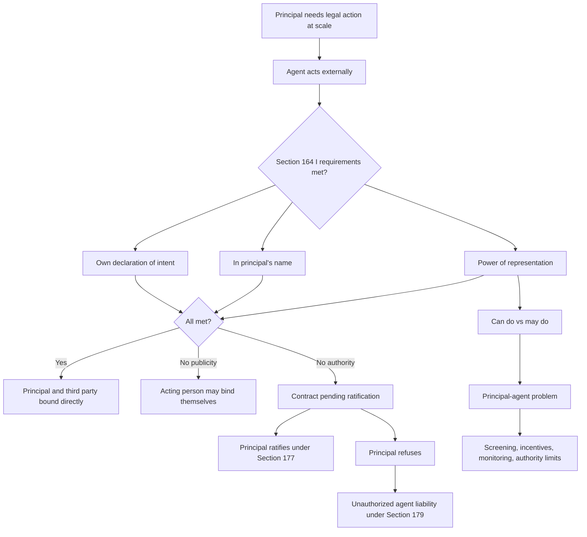
```mermaid
flowchart TD
    Need[Principal needs legal action at scale] --> Agent[Agent acts externally]
    Agent --> Test{Section 164 I requirements met?}
    Test --> Own[Own declaration of intent]
    Test --> Publicity[In principal's name]
    Test --> Authority[Power of representation]
    Own --> Effective{All met?}
    Publicity --> Effective
    Authority --> Effective
    Effective -->|Yes| Bind[Principal and third party bound directly]
    Effective -->|No publicity| AgentBound[Acting person may bind themselves]
    Effective -->|No authority| Pending[Contract pending ratification]
    Pending --> Ratify[Principal ratifies under Section 177]
    Pending --> Refuse[Principal refuses]
    Refuse --> Liability[Unauthorized agent liability under Section 179]
    Authority --> InternalExternal[Can do vs may do]
    InternalExternal --> Risk[Principal-agent problem]
    Risk --> Controls[Screening, incentives, monitoring, authority limits]
```

## Subject Knowledge Graph

| Node | Meaning | Exam Relevance |
|---|---|---|
| Principal | Person for whom the legal effect should arise. | Identifies who is bound if agency works. |
| Agent | Person acting externally for the principal. | Must make own declaration, disclose agency, and have authority. |
| Third Party | Contract partner dealing with the agent. | Protection depends on publicity and authority. |
| Own Declaration Of Intent | Agent forms and expresses own legal will. | Distinguishes agent from messenger. |
| Principle Of Publicity | Agent acts in the principal's name or circumstances show this. | If missing, principal is not bound under Section 164 I. |
| Power Of Representation | External authority to bind the principal. | Central "can do" element. |
| Internal Relationship | Legal relationship between principal and agent. | Determines "may do" and internal recourse. |
| External Relationship | Agency power visible to third parties. | Determines whether principal is bound. |
| Unauthorized Agent | Person acting as agent without power of representation. | Triggers ratification or Section 179 liability. |
| Agency By Estoppel | Reliance authority where principal knows and tolerates apparent agency. | Protects third party reliance. |
| Ostensible Agency | Reliance authority where principal negligently does not know. | Protects third party reliance created by negligence. |
| Contracting With Oneself | Agent transacts with self or on both sides. | Conflict-of-interest limit under Section 181 BGB. |
| Principal-Agent Problem | Information asymmetry and self-interest between principal and agent. | Explains monitoring, incentives, and authority limits. |

| From | Relationship | To | Why It Matters |
|---|---|---|---|
| Agent | acts on behalf of | Principal | Creates possibility of direct legal effect for principal. |
| Agent | declares to | Third Party | Agency always has an external communication side. |
| Section 164 I BGB | requires | Own Declaration Of Intent | Separates agents from messengers. |
| Section 164 I BGB | requires | Principle Of Publicity | Third party must know whose contract this is. |
| Section 164 I BGB | requires | Power Of Representation | Principal is bound only if authority exists. |
| Effective Agency | binds | Principal And Third Party | Agent normally drops out of the contract. |
| Internal Relationship | limits | Agent's May Do | Principal may have internal claims against agent. |
| External Relationship | defines | Agent's Can Do | Third-party protection depends on external authority. |
| Lack Of Authority | creates | Pending Ratification | Section 177 lets principal choose whether to approve. |
| Refusal Of Ratification | triggers | Section 179 Liability | Third party may claim against unauthorized agent. |
| Section 181 BGB | limits | Contracting With Oneself | Prevents conflict-of-interest abuse. |
| Information Asymmetry | creates | Principal-Agent Problem | Explains agency costs and governance design. |

## Real Business Examples

- Sales employee: authorized to conclude standard sales contracts up to a price limit. If the limit is externally communicated to regular buyers, buyers cannot easily rely on broader authority.
- GmbH managing director: represents the company by statutory power, so the company can act in legal transactions.
- Warehouse employee: internal job duties alone do not create sales authority unless the principal created an appearance of authority.
- Procurement dual-control rule: two signatures may reduce hidden action but create monitoring costs and potential collusion questions.
- Bonus plan: aligns sales incentives, but may also create pressure to sell unprofitable or unsuitable products if badly designed.

## Exam Relevance

Likely prompts:

- State and apply the three requirements of Section 164 I BGB.
- Distinguish agent from messenger.
- Explain the direct binding effect between principal and third party.
- Separate internal relationship from external authority.
- Analyze missing publicity under Section 164 II BGB.
- Analyze unauthorized agency under Sections 177 and 179 BGB.
- Explain agency by estoppel versus ostensible agency.
- Apply Section 181 BGB to self-dealing.
- Connect legal agency to the principal-agent problem.

Common traps:

- Saying the agent is contractually bound when effective agency exists.
- Ignoring the publicity requirement because the agent privately intended to act for P.
- Treating internal permission limits as automatically effective against third parties.
- Forgetting principal ratification under Section 177 BGB.
- Treating every bad agent action as no authority; distinguish lack of authority from abuse of existing authority.
- Mixing the legal agency rules with the economic principal-agent problem without explaining the bridge.

High-scoring answer structure:

1. Identify the possible principal, agent, and third party.
2. Test Section 164 I BGB: own declaration, publicity, power of representation.
3. State the direct effect if all elements are met.
4. If one element is missing, name the specific consequence.
5. Check special issues: reliance authority, termination, abuse, Section 181.
6. If asked for managerial implications, explain information asymmetry and agency costs.

## Official Exercise Case Routes

### Case 1a: Fuel Purchase And Publicity

Question: did F effectively represent D when buying fuel?

Route:

1. Own declaration: F forms and expresses his own will to buy fuel.
2. Publicity: F does not explicitly say he acts for D. Implicit publicity is doubtful because although A sees F filling D's car, A does not necessarily know who is the buyer.
3. Exception: for immediate everyday cash transactions where the identity of the contracting party is irrelevant, the "transaction for whom it concerns" exception may substitute for publicity.
4. The exercise leaves the result arguable because fuel is paid immediately and the buyer identity may be irrelevant, but tank filling can be expensive and hard to unwind.

Result: effective agency is arguable. If publicity fails, Section 164 II BGB binds F personally, not D.

Exam trap: hidden intent to act for someone else is irrelevant unless the representative capacity is evident or an exception applies.

### Case 1b: Unauthorized Fuel Purchase

Question: can attendant A demand the fuel price from F?

Route:

1. No ordinary Section 433 II BGB claim against F as buyer because F did not intend to contract for himself.
2. Section 179 I BGB applies if F acted as agent but without power of representation and D refuses ratification.
3. Own declaration and publicity are present because F explicitly says he refuels in D's name.
4. Power of representation is missing because D only authorized snacks, not fuel.
5. D refuses ratification because fuel is cheaper after the border.
6. A chooses performance under Section 179 I BGB, meaning payment of the purchase price rather than damages.

Result: A can demand performance/payment from F under Section 179 I BGB.

Exam trap: Section 179 is not a normal contract claim; it is liability of the unauthorized agent after the principal refuses ratification.

### Case 2: Laptop Purchase Through Girlfriend And Store Manager

Questions: did G represent S, did M represent E-oHG, and did S and E-oHG conclude a purchase agreement?

Route:

1. G represents S under Section 164 I BGB: G chooses and buys the laptop, refers to S's letter, and acts within S's internal and external authorization under Section 167 I BGB.
2. M represents E-oHG: M processes the sale as store manager, the enterprise-related context satisfies publicity, and Section 56 HGB supports store authority for customary sales.
3. Contract formation: G's offer by taking the laptop to payment is attributed to S; M's acceptance by processing payment is attributed to E-oHG.

Result: S and E-oHG conclude a purchase agreement.

Exam trap: when both sides act through people, solve agency on both sides before concluding the contract.

### Case 3: Paradise-GmbH Apple Order

Question: did farmer F and P-GmbH conclude a contract when only director E ordered apples?

Route:

1. P-GmbH cannot make declarations itself; it acts through organs/representatives.
2. E makes an own declaration and acts in P-GmbH's name.
3. Power of representation depends on Section 35 GmbHG. With several directors, joint representation is the default unless articles provide otherwise.
4. A and E never agreed that one director can act alone, and only E ordered.
5. Ratification under Section 177 I BGB is refused because A is not convinced and does not approve.

Result: no effective agency by E and no contract with P-GmbH.

Exam trap: director status alone is not always sole authority when joint representation applies.

### Writing Workshop: Dog Sculpture Ratification

Question: did art dealer D effectively represent collector C when buying a dog sculpture instead of the instructed wolf sculpture?

Route:

1. Own declaration: D decides to buy the dog sculpture.
2. Publicity: D explains the situation to artist A, so A knows D acts for C's collection.
3. Authority: C internally authorized D to buy the wolf sculpture, not a substitute dog sculpture. The clear instruction and availability of later approval mean D acted outside authority.
4. Pending invalidity: without authority, the declaration is pending invalid under Section 177 I BGB.
5. Ratification: C raises no objections and sets up the dog sculpture; this is implicit ratification.

Result: effective agency in the end because C ratified D's unauthorized declaration.

Legal-opinion template:

1. "D could have effectively represented C when concluding the purchase agreement with A under Section 164 I BGB."
2. Test own declaration, publicity, and power of representation.
3. If authority scope fails, immediately check Section 177 I BGB ratification.
4. Conclude whether the declaration is effective for the principal.

## Retrieval Prompts

Closed-book questions:

1. What are the three requirements for effective agency under Section 164 I BGB?
2. What is the difference between an agent and a messenger?
3. What does the principle of publicity require?
4. What is the difference between internal authorization and external authorization?
5. Explain "can do" versus "may do" in agency.
6. What happens when an unauthorized agent concludes a contract?
7. Why does Section 181 BGB restrict self-dealing?
8. What are the four information problems in the principal-agent problem?

Application prompts:

1. Employee A answers P's business phone and sells furniture after P authorized her orally. Who is bound?
2. Warehouse worker S has no sales authority but sells furniture at a profitable price. What can P do?
3. Former employee A keeps acting as sales agent after termination. T does not know authority was withdrawn. Which third-party protection issue arises?
4. Manager M signs a contract with himself for a pay raise. Which statutory limit should you check?
5. A company uses bonuses and two-signature approval for sales contracts. Link these controls to information asymmetry.

## Practice Tasks

### Mini Case 1: The Messenger

P writes an offer and asks M to read it word-for-word to T. M does so without changing anything.

Short answer guide: M is likely a messenger, not an agent, because M makes no own declaration of intent. Analyze whether P's declaration was transmitted effectively.

### Mini Case 2: Undisclosed Principal

A sells a laptop to T without saying she acts for P. T thinks A is the seller. A secretly intended to act only for P.

Short answer guide: publicity is missing. Section 164 II BGB prevents A's hidden intent from helping; P is not bound under Section 164 I on these facts.

### Mini Case 3: Profitable Unauthorized Deal

S has warehouse-only duties but sells furniture for P at an excellent price. P learns immediately.

Short answer guide: no authority, so P is not bound immediately. P may ratify under Section 177 I BGB. If P refuses, T may claim against S under Section 179 BGB if requirements are met.

### Mini Case 4: Internal Limit

P tells A internally not to sell over EUR 5,000, but externally tells regular customers A can sell all standard furniture. A sells to T for EUR 8,000 and T does not know the internal limit.

Short answer guide: distinguish external "can do" from internal "may do." P may be bound externally; P's remedy may be internal against A.

## Connections

Previous notes from this lecture:

- `../week-03-contract-law-i/week-03-contract-law-i.md`: agency declarations still operate through declaration-of-intent and offer/acceptance logic.
- `../week-06-standard-business-terms/week-06-standard-business-terms.md`: after identifying who is bound, test which pre-written clauses became part of the contract.
- `../week-05-contract-law-iii-withdrawal-cancellation-dissolution/week-05-contract-law-iii-withdrawal-cancellation-dissolution.md`: agency can determine who may declare termination or withdrawal for a party.

Cross-course links:

- Organization: delegation, authority, monitoring, and role design mirror the principal-agent problem.
- Finance: agency costs affect governance, incentives, and valuation risk.
- SCM: procurement agents and sales agents can bind companies in supply contracts; authority limits matter in supplier-buyer relationships.

## Open Uncertainties

- The deck labels itself "Lecture 6" while the course logistics outline places Agency after Standard Business Terms as Session 7. This note follows the topic sequence.
- The deck uses "agency by estoppel" and "ostensible agency" as English labels for reliance-based authority. German doctrinal labels may vary; this note keeps the deck's labels and adds the underlying distinction.

## Weakness Flags

- Active recall not yet completed.
- First drill should start with the furniture-sales example, then switch one missing requirement at a time: messenger, no publicity, no authority, internal limit, and self-dealing.


<div class="page-break"></div>

# [W07.2] Week 07 Agency Cheatsheet And Tricks

<p class="source-path">Source: <code>business-law/wiki/week-07-agency/week-07-agency-cheatsheet-and-tricks.md</code></p>

Course: Business Law
Exam date: 2026-07-28
Source: week-07-agency.md, active-recall-session-2026-07-01.md, clarification-session-2026-07-01.md

## Must-Know (exam-critical)

| Rule | Anchor | Core content |
|---|---|---|
| Effective agency, three cumulative elements | Section 164 I BGB | Own declaration of intent, publicity (acting in the principal's name), power of representation. All three must be met. |
| Legal effect if all three are met | Section 164 I BGB | Principal and third party become the contract parties directly; the agent normally drops out of the contract. |
| Agent vs. messenger | No fixed section, tested through Section 164 I | Agent forms their own legal declaration; a messenger only transmits someone else's already-fixed declaration. No own declaration means no agency analysis — check transmission instead. |
| No publicity consequence | Section 164 II BGB | If T cannot recognize A is acting for P, A's hidden intent is irrelevant; A is likely bound personally, not P. |
| No authority consequence | Sections 177 I, 179 BGB | Contract is pending until P ratifies. If P refuses, the third party may claim against the unauthorized agent under Section 179 BGB — this is agent liability, not an ordinary Section 433 claim. |
| Internal vs. external boundary | No fixed section, framed as "can do" vs. "may do" | External power of representation = can do = binds P toward T. Internal relationship (employment/mandate/service) = may do = what A is permitted internally. Violating "may do" while keeping "can do" still binds P externally. |
| Sources of power of representation | Sections 35 GmbHG (statutory), 167 I BGB (declaration), reliance (Section 242 BGB background) | Statutory (organ representation), declared (internal or external authorization), or reliance-based (estoppel/ostensible). |
| Reliance-based authority, two forms | No fixed section, course labels: agency by estoppel, ostensible agency | Estoppel: P knows and tolerates the appearance. Ostensible: P doesn't know but should have known with due care. Both give A real power of representation if T relied in good faith. |
| Termination of authority | Section 168 BGB, third-party protection via Sections 170, 173 BGB | Authority usually ends with the underlying relationship and is freely revocable. If withdrawal is only told to the agent, a good-faith third party may still be protected unless they knew or should have known. |
| Self-dealing / contracting with oneself | Section 181 BGB | Two forms: self-contracting (A is personally the counterparty) and multiple representation (A represents both sides). Transaction is provisionally invalid unless: prior permission, later ratification, mere performance of an existing obligation, or legally advantageous only for the principal. |

## Nice-to-Have (depth/edge cases)

- Legal entities (GmbH, AG) cannot physically act — a human act must be attributed to them through an organ (statutory, e.g. Section 35 GmbHG director) or an agent (authorized representative); both routes exist side by side.
- Section 56 HGB (store/shop authority) can supply publicity and authority for customary retail-style sales made by staff, without needing an explicit declaration each time.
- With multiple GmbH directors, joint representation is the statutory default unless the articles say otherwise — one director acting alone can fail the authority element even with clear organ status.
- Collusion between agent and third party can void the transaction under Section 138 BGB even where the agent had formal external authority.
- If the third party actually knows the agent is exceeding internal limits, the third party's protection weakens even though the "can do / may do" split normally favors the third party.
- The "transaction for whom it concerns" exception can substitute for publicity in immediate, low-stakes cash transactions (e.g., paying for fuel or a small purchase) where the buyer's identity is economically irrelevant — but this is fact-sensitive and arguable, not automatic.
- Advantages/risks framing (division of labor, capacity, expertise vs. loss of control, information gaps) and the principal-agent problem (hidden characteristics/action/information/intention, and the agency-cost responses: signaling, incentives, surveillance, authority limits) are the bridge from the legal rules to the "why does business design authority this way" theory question.

## Nuances And Traps

| Nuance/Trap | Why it's easy to get wrong | Correct handling |
|---|---|---|
| No-publicity consequence | It feels intuitive that having authority should still protect the principal, so students conclude P is bound even when A never showed the transaction was for P. | Authority cannot rescue missing publicity. If A does not act recognizably in P's name, P is not bound under Section 164 I regardless of whether A had power of representation; A is likely treated as the contracting party under Section 164 II. |
| Section 166 BGB misrouting | When an agent breaches an internal instruction (e.g., sells below the minimum price), it is tempting to reach for Section 166 BGB because it "sounds like" the general agency-attribution section. | Section 166 BGB governs attribution of knowledge or defects of intent through the representative — it is not the anchor for ordinary internal recourse after a breached instruction. The correct route is: P is bound externally (can do intact), and P's remedy against A is based on the internal relationship (employment, mandate, service duties), not Section 166. |
| "Wrong declaration of intent" mislabeling | Describing an internal-instruction breach as a "wrong declaration of intent" externally sounds plausible but imports a Section 119-style mistake analysis that does not apply here. | The correct phrasing is that the declaration is externally effective but internally forbidden — this stays inside the agency can-do/may-do frame instead of drifting into rescission doctrine. |
| Section 181 exceptions, incomplete list | Students often recall only "prior permission" and "later ratification" and stop there. | There are four exceptions: prior permission, later ratification (Section 177 BGB), mere performance of an existing obligation, and a transaction that is legally advantageous only for the principal. |
| Section 181 vs. an ordinary internal-instruction violation | Both look like an agent overstepping bounds, so it is tempting to treat self-dealing as just another "may do" breach that still binds P externally. | Self-dealing is stronger than an ordinary internal-instruction violation: because there is no independent counterparty bargain, Section 181 can actually restrict A's external power, not just create internal liability. |
| Lack of authority vs. abuse of existing authority | Any bad agent action can get lumped together as "the agent had no authority." | Distinguish the two: lack of authority triggers the Section 177/179 pending-ratification route; abuse of existing authority (internal-limit violation) keeps the principal bound externally and only creates internal recourse. |
| Reliance-based authority requires a pattern, not one incident | A single unauthorized sale can look enough like "the principal should have noticed." | The exam facts should show a pattern or appearance attributable to P (repeated conduct, use of company materials/records) plus the third party's reasonable good-faith reliance — one isolated unauthorized act is usually not enough. |
| Distinguishing agency by estoppel from ostensible agency | Both protect a third party who relied on an apparent agency, so the two get merged. | Estoppel = P actually knew and tolerated the appearance (conscious tolerance). Ostensible = P did not know, but a careful principal would have noticed and prevented it (negligent failure to control). State which mental state the facts show. |

## One-Line Recall Drill

```text
164 I = own declaration + publicity + power of representation
164 II = no publicity, hidden intent irrelevant, agent likely bound personally
177 I = pending, principal ratifies
179 I = unauthorized agent liability if ratification refused
167 I = authority by declaration (internal or external)
35 GmbHG = statutory organ representation
168 = authority ends with underlying relationship, freely revocable
170, 173 = third-party protection if withdrawal only told to agent
181 = self-contracting / multiple representation, four exceptions
can do = external, binds principal
may do = internal, breach creates internal recourse only
estoppel = P knows and tolerates
ostensible = P should have known, negligent
166 =/= internal recourse; it is knowledge/defect-of-intent attribution
```


<div class="page-break"></div>

# [W07.3] Week 07 Agency Practice Questions And Model Answers

<p class="source-path">Source: <code>business-law/wiki/week-07-agency/week-07-agency-practice-questions-and-model-answers.md</code></p>

Course: Business Law
Exam date: 2026-07-28
Source: week-07-agency.md, week-07-agency-cheatsheet-and-tricks.md
Format note: 26 questions — 10 short-answer/theory, 16 case/legal-opinion (schema-based). Four case questions integrate other weeks: Week 11 Trade Law (Prokura/Handlungsvollmacht), Week 12-13 Company Law (Section 181 BGB self-dealing vs. Section 37 GmbHG internal limits), Week 03 Contract Law I (modified acceptance combined with agency scope), Week 10 Transfer of Property (agency's reach over the Section 929 agreement element vs. the real-act delivery element).

## Short-Answer / Theory Questions

### Question 1

State and apply the three requirements for effective agency under Section 164 I BGB.

**Model Answer:**
1. Effective agency is the legal institute that lets an agent's own declaration of intent bind a principal directly toward a third party, defined in Section 164 I BGB.
2. Statutory anchor: Section 164 I BGB.
3. Requirements: (1) an own declaration of intent by the agent, (2) publicity — the declaration is recognizably made in the principal's name, (3) power of representation.
4. Example: an authorized sales employee negotiates and closes a sale in the shop owner's name.
5. Consequence/trap: if all three are met, the principal and third party become the contracting parties directly and the agent drops out of the contract; missing any single element defeats agency entirely — it does not partially bind the principal.

### Question 2

Compare an agent and a messenger.

**Model Answer:**
1. An agent forms and declares their own legal will within their authority (Section 164 I BGB); a messenger merely transmits another person's already-formed, fixed declaration without adding any will of their own.
2. Trigger: agent status is tested under Section 164 I BGB (own declaration, publicity, authority); messenger status is tested under the rules on transmission of a declaration (Section 120 BGB governs transmission errors).
3. Consequence: an effective agent's declaration binds the principal directly; a messenger's transmitted declaration is legally the principal's own declaration, so its validity turns on whether it was transmitted correctly, not on any authority analysis.
4. Contrast example: an employee negotiating price and terms with a customer is an agent; an employee reading a pre-written letter from the owner word-for-word to a customer is a messenger.
5. Exam warning: do not run the Section 164 I agency test on a messenger — analyze transmission (Section 120) instead, since a messenger never formed an "own will" to test for publicity or authority.

### Question 3

Compare agency by estoppel and ostensible agency.

**Model Answer:**
1. Agency by estoppel exists where the principal knows a person appears to act as their agent and tolerates it; ostensible agency exists where the principal does not know but should have known and prevented the appearance through due care.
2. Trigger: both rest on a third party's good-faith reliance on an appearance of authority created or tolerated by the principal, rather than on an actual declaration under Section 167 I BGB.
3. Consequence: in both cases the law treats the agent as having real power of representation, protecting the good-faith third party's reliance despite the absence of actual authorization.
4. Contrast example: a principal who watches an unauthorized helper repeatedly close sales in the shop and does nothing is bound by estoppel; a principal who never checks and would have discovered repeated unauthorized use of company letterhead and email with ordinary diligence is bound by ostensible agency.
5. Exam warning: a single isolated unauthorized act is normally not enough for either route — the facts must show a pattern or appearance attributable to the principal plus reasonable reliance; do not conflate general negligence with either specific doctrine.

### Question 4

List the requirements (exceptions) that allow a self-dealing transaction to stand despite Section 181 BGB.

**Model Answer:**
The exceptions are:
1. Prior permission — the principal authorized the self-dealing transaction in advance.
2. Later ratification — the principal ratifies the transaction after the fact under Section 177 BGB.
3. Mere performance of an existing obligation — the transaction only fulfills a debt that already exists, so no fresh conflict of interest arises.
4. Legal advantage only for the principal — the transaction brings the principal solely a legal benefit with no corresponding burden.

If none of these applies, the self-dealing or multiple-representation transaction is provisionally invalid and cannot bind the principal. Section 181 exists because an agent who is also the counterparty (or who represents both sides) has a structural conflict of interest, since there is no independent party bargaining against the principal's interest.

## Case / Legal-Opinion Questions

### Question 5 (Case)

**Facts:** Retailer R owns a bookstore. R's cousin K sometimes helps out unpaid during busy weekends but has no formal employment contract or job title. One Saturday, a regular customer W asks K to order a rare first-edition book. K agrees to source it and quotes a price of EUR 400, without mentioning R or the bookstore at any point during the conversation — W has only ever met K as "R's cousin who sometimes hangs around" and has no idea K is acting on the bookstore's behalf. K genuinely intends the transaction to be for the bookstore. Three weeks later, R obtains the book, but W refuses to pay the EUR 400, denying she ever agreed to buy anything from R's bookstore.

**Question:** Does R have a claim against W for payment of EUR 400 under Section 433 II BGB?

**Model Answer:**

I. R could have a claim against W for payment of EUR 400 under Section 433 II BGB if R and W concluded a valid purchase contract, which in turn depends on whether K effectively represented R under Section 164 I BGB when negotiating with W.

II. Requirements:
- Contract requires two matching declarations of intent (offer and acceptance).
- If K, not R, made the relevant declaration, effective representation requires: (1) own declaration of intent, (2) publicity, (3) power of representation.
- Legal consequence if representation fails.

III. Application:
- Own declaration: K forms and expresses her own will to sell the book for EUR 400 to W — this is not a mere transmission of R's pre-fixed words, so K is a candidate agent, not a messenger.
- Publicity: Questionable is whether K acted recognizably in R's name. This is supported by K's genuine intent to act for the bookstore and her habit of helping out there. Against this, one could argue W had no way to recognize this from the conversation — K never mentioned R or the bookstore, and W only knew K informally, not as someone acting for the bookstore in this transaction. However, publicity requires that the third party can recognize from the circumstances that the declaration is made for someone else; a private, undisclosed intention is not enough under Section 164 II BGB. Consequently, publicity is not met.
- Power of representation: becomes irrelevant once publicity fails, since all three elements of Section 164 I BGB are cumulative.

IV. Interim result: K did not effectively represent R under Section 164 I BGB; Section 164 II BGB applies instead, and K's hidden intent to act for R is disregarded.

V. Final answer: As a result, no contract was concluded between R and W; K herself is likely treated as the contracting party, so R has no claim against W for the EUR 400 under Section 433 II BGB.

### Question 6 (Case)

**Facts:** Bakery owner B employs C exclusively as a delivery driver; C has no sales authority under her employment contract. While delivering an order, C is approached by a passing café owner, D, who urgently wants to buy B's entire remaining stock of pastries for a same-day event. C, eager to help, agrees to sell D the pastries for EUR 300, explicitly telling D "I'm selling these on behalf of the bakery." When B learns of the sale, B is furious because the pastries were reserved for a different regular customer, and B refuses to honor the deal. D, having already promised the pastries to his own event guests, wants to know his options.

**Question:** Can D demand performance (delivery of the pastries) from C personally under Section 179 I BGB?

**Model Answer:**

I. D could have a claim against C for performance under Section 179 I BGB if C acted as an unauthorized agent for B and B has refused to ratify the transaction.

II. Requirements:
- C made an own declaration of intent in B's name (candidate agency under Section 164 I BGB).
- C lacked power of representation for this type of transaction.
- B refused ratification under Section 177 I BGB.
- D chooses performance (rather than damages) under Section 179 I BGB.

III. Application:
- Own declaration and publicity: C forms her own declaration to sell the pastries and explicitly states she is selling "on behalf of the bakery," so both own declaration and publicity are met.
- Power of representation: Questionable is whether C's authority as a delivery driver extends to sales. This is supported by the fact that C's employment contract covers delivery only. Against this, one could argue any employee visibly representing the business might appear to carry some authority. However, C's role and the circumstances (an improvised curbside sale of the entire remaining stock) give no objective indication of sales authority, and there are no facts suggesting a pattern of C making sales that B tolerated or should have noticed, so no reliance-based authority arises either. Consequently, C lacked power of representation.
- Ratification: B refuses to ratify because the pastries were reserved for someone else, satisfying Section 177 I BGB's refusal condition.
- Section 179 I choice: D may choose between performance and damages; the facts show D wants the pastries themselves.

IV. Interim result: C acted as an unauthorized agent; B's refusal to ratify triggers Section 179 I BGB liability against C personally.

V. Final answer: As a result, D can demand performance (delivery of the pastries) from C personally under Section 179 I BGB, since C, not B, is now treated as bound by the sale.

### Question 7 (Case)

**Facts:** GmbH managing director M has broad, unrestricted power of representation for TechParts GmbH, including authority to buy and sell company equipment. M personally owns an old delivery van that the company genuinely needs. Without informing the other shareholders or seeking any prior approval, M signs a purchase contract "on behalf of TechParts GmbH" to buy his own van for EUR 15,000 — a fair market price. When the other shareholders discover the deal, they argue the contract cannot bind the company because M contracted with himself.

**Question:** Is the purchase contract between M (as seller) and TechParts GmbH (as buyer, represented by M) valid?

**Model Answer:**

I. The contract's validity depends on whether M could effectively represent TechParts GmbH under Section 164 I BGB despite Section 181 BGB's restriction on self-dealing.

II. Requirements:
- M acted as TechParts GmbH's representative (organ representation under Section 35 GmbHG).
- M is personally the counterparty to the transaction (self-contracting).
- Section 181 BGB is triggered.
- Check whether an exception applies: prior permission, later ratification, mere performance of an existing obligation, or legal advantage only for the principal.

III. Application:
- Representative capacity: M has organ representation power for TechParts GmbH under Section 35 GmbHG, so M can, in principle, bind the company.
- Self-contracting: M personally sells the van while simultaneously representing the buyer (TechParts GmbH), so M stands on both sides of the same transaction — this is self-contracting, not merely an internal-instruction issue.
- Exceptions: Questionable is whether any Section 181 exception applies. This is supported by the fact that the price was fair and the company genuinely needed the van. Against this, one could argue a fair price does not by itself amount to prior permission or later ratification, and the facts show no advance authorization from the shareholders and no subsequent approval — they only object after discovering the deal. The transaction is also not the mere performance of an existing obligation, and it is not legally advantageous only for TechParts GmbH, since the company must pay EUR 15,000. However, with no exception on the facts, Section 181 BGB applies in full.
- Consequence: because none of the four exceptions is met, M's self-dealing falls outside his power of representation for this specific transaction.

IV. Interim result: M lacked effective power of representation for this transaction due to Section 181 BGB, notwithstanding his general organ authority.

V. Final answer: As a result, the purchase contract is provisionally invalid; it cannot bind TechParts GmbH unless the company later ratifies it under Section 177 BGB.

### Question 8 (Case — integrates Week 07 + Week 11)

**Facts:** HandelsWaren GmbH is a mid-size wholesale trading company (a merchant by legal form under Section 6 I HGB in conjunction with Section 13 III GmbHG). The managing director grants employee N formal Prokura, duly registered in the commercial register. Internally, the shareholders instruct N never to place single orders above EUR 50,000 without board sign-off — but this limit is never communicated to any customer or supplier. Acting under her Prokura, N signs an EUR 80,000 order with supplier Q for raw materials; Q has no knowledge of the internal EUR 50,000 limit and has dealt with N as HandelsWaren's authorized signatory before. When the shareholders discover the order, they refuse to accept the delivery, arguing N exceeded her authority.

**Question:** Is HandelsWaren GmbH bound to accept and pay for the EUR 80,000 order?

**Model Answer:**

I. HandelsWaren GmbH is bound to Q under the purchase contract if N effectively represented the company, which requires testing both ordinary agency under Section 164 I BGB and the HGB-specific Prokura rules, since HandelsWaren GmbH is a merchant.

II. Requirements:
- HandelsWaren GmbH qualifies as a merchant, triggering the HGB layer on top of the BGB baseline.
- N made an own declaration of intent in the company's name (Section 164 I BGB elements).
- N held Prokura, and the scope of Prokura under Sections 48-50 HGB determines whether the internal EUR 50,000 limit defeats her external power.
- Legal consequence for the EUR 80,000 order.

III. Application:
- Merchant status: HandelsWaren GmbH is a GmbH, so it is a merchant by legal form under Section 6 I HGB in conjunction with Section 13 III GmbHG, without needing to run the Section 1 HGB scale test. This triggers HGB rules, including Prokura, on top of the ordinary BGB agency framework.
- Own declaration and publicity: N forms her own declaration to place the order and signs as HandelsWaren's registered Prokurist, so both elements of Section 164 I BGB are satisfied. This could also have been analyzed as ordinary Handlungsvollmacht under Section 54 HGB, but N's status here is the broader, registered Prokura.
- Power of representation — Prokura scope: Questionable is whether the internal EUR 50,000 cap limits N's external authority. This is supported by the shareholders' clear internal instruction. Against this, Section 50 HGB provides that internal restrictions on Prokura are generally ineffective against third parties — the near-unrestrictable statutory scope of Prokura under Section 49 HGB exists precisely so that third parties like Q can rely on a registered Prokurist's authority without investigating internal limits. However, this protection can fail if the third party knew of the limit or the abuse was obvious; here, Q had no knowledge of the EUR 50,000 cap and had previously dealt with N as an authorized signatory, so nothing on the facts should have put Q on notice. Consequently, the internal limit does not defeat N's external power of representation.

IV. Interim result: N's Prokura gave her full external authority to place the EUR 80,000 order despite the internal cap, because Section 50 HGB protects Q's good-faith reliance.

V. Final answer: As a result, HandelsWaren GmbH is bound to accept and pay for the EUR 80,000 order under the contract with Q; the shareholders' remedy for N's breach of the internal instruction lies only in the internal employment/mandate relationship against N, not against Q.

### Question 9

List the three statutory sources of power of representation and give one example of each.

**Model Answer:**
The three sources are:
1. Statutory authority — power of representation given directly by law, independent of any individual declaration. Example: Section 35 GmbHG gives a GmbH's directors representation power simply by virtue of holding the office.
2. Authority by declaration (Section 167 I BGB) — the principal grants authority through a declaration, either internally to the agent or externally to the third party. Example: P orally tells A, "You may sell furniture for me" (internal authorization), or P tells key buyers "A is authorized to sell up to EUR 10,000" (external authorization).
3. Reliance-based authority — power of representation arising from the principal's own responsible creation or toleration of an appearance of agency, protecting a third party's good-faith reliance; it splits into agency by estoppel (principal knows and tolerates) and ostensible agency (principal negligently fails to notice and prevent). Example: a principal who watches an unauthorized helper repeatedly close sales and does nothing is bound by estoppel.

If none of these three sources is present, the acting person has no power of representation, and the principal is not bound absent ratification under Section 177 BGB — the three sources are independent routes to the same legal consequence, not cumulative requirements.

### Question 10

Explain what happens when a principal revokes an agent's authority but only tells the agent, not the third party.

**Model Answer:**
1. This is a third-party-protection issue arising after termination of authority, governed by Section 168 BGB together with Sections 170 and 173 BGB.
2. Statutory anchor: Section 168 BGB (authority usually ends with the underlying relationship and is freely revocable), read with Sections 170, 173 BGB (protection of a good-faith third party after withdrawal).
3. Requirements/features: (1) authority has been effectively revoked internally; (2) the revocation was communicated only to the agent, not to the third party; (3) the third party neither knew nor should have known that authority had ended.
4. Example: P internally revokes A's authority but never tells regular client Z; A, still holding old business materials, confirms an order with Z, who has dealt with A before and has no reason to suspect anything changed — Z remains protected and P is bound.
5. Trap: ending the underlying relationship (e.g., terminating A's employment) does not by itself solve the external third-party problem — always ask specifically what the third party was told and whether the third party was in good faith, rather than assuming termination alone cuts off external effect.

### Question 11

Compare "lack of authority" and "abuse of existing authority" as agency-law problems.

**Model Answer (Compare Schema):** Lack of authority exists where the agent never had power of representation for the transaction at all, tested through Sections 177 and 179 BGB: the contract is pending until the principal ratifies, and if the principal refuses, the third party may claim against the unauthorized agent personally under Section 179 BGB. Abuse of existing authority exists where the agent does hold valid external power of representation but violates an internal instruction on how to use it (the "may do" boundary), while the "can do" boundary toward the third party remains intact. Contrast example: a warehouse worker with no sales authority who sells furniture is a lack-of-authority case (pending ratification); a sales manager told internally never to sell below EUR 10,000 who nonetheless sells to an unaware buyer for EUR 8,000 is an abuse-of-authority case (principal is bound externally, remedy is internal against the agent). Exam trap: do not lump every "bad" agent action into "no authority" — abuse of existing authority keeps the principal bound externally, and the correct remedy lies in the internal relationship (employment, mandate, service duties), not in Sections 177/179 or in Section 166 BGB.

### Question 12

List the four hidden information problems in the principal-agent problem, with the corresponding agency-cost response for each.

**Model Answer:**
1. Hidden characteristics (adverse selection) — the agent is unsuitable for the role before hiring; addressed by signaling and screening (e.g., certificates, assessment centers).
2. Hidden action (moral hazard) — the agent behaves badly after being hired, where the principal cannot fully observe conduct; addressed by incentives (e.g., performance-linked bonuses).
3. Hidden information (moral hazard) — the agent knows more than the principal can assess about the situation; addressed by surveillance (e.g., dual-control or joint-representation requirements).
4. Hidden intention — the agent's underlying motivation is not aligned with the principal's interest; addressed by limitation of authority, particularly external authorization that tells third parties the boundary of what the agent may do.

Trap: these are information/motivation problems from economics, not separate legal doctrines — the legal agency rules (Section 164 I BGB requirements, Section 181 BGB, ratification) determine who is bound, while the principal-agent framework explains why businesses design authority limits, bonus systems, and monitoring in the first place; don't present the four categories as if they were statutory requirements.

### Question 13 (Case)

**Facts:** Print shop owner O never explicitly authorizes intern I to sign contracts. Over several months, I repeatedly uses O's letterhead and O's business email account to confirm print orders with regular client X, signing "on behalf of PrintShop O." O has easy access to the outgoing email folder and multiple opportunities to notice this but never checks it. X, relying on this established pattern, places a large order with I for a batch of prints worth EUR 2,000. O refuses to fulfill it, claiming I was never authorized to sign anything.

**Question:** Is O bound to X for the EUR 2,000 order?

**Model Answer:**

I. O could be bound to X under a purchase/service contract for EUR 2,000 if I effectively represented O, which turns on whether ostensible agency supplies the power of representation I otherwise lacks.

II. Requirements:
- I made an own declaration of intent in O's name (publicity via letterhead/email).
- I lacked actual statutory or declared authority.
- Ostensible agency requires: an appearance of authority attributable to O (pattern/negligent failure to control) plus X's good-faith reasonable reliance.

III. Application:
- Own declaration and publicity: I forms and signs order confirmations "on behalf of PrintShop O" using O's own letterhead and email account — clearly recognizable to X as acting for O.
- Actual authority: no facts show O ever declared authority to I under Section 167 I BGB, and no statutory route applies, so actual power of representation is absent.
- Ostensible agency: Questionable is whether O's negligent failure to monitor creates reliance-based authority. This is supported by the repeated, months-long pattern of I using O's official channels — not an isolated act — combined with O's easy ability to check outgoing correspondence and consistent failure to do so. Against this, one could argue O never affirmatively created the appearance and merely stayed passive. However, ostensible agency's essence is exactly this kind of negligent failure to prevent an appearance the principal could and should have discovered with due care; O's access to the account and the repeated conduct meet that bar. Consequently, the appearance is attributable to O.
- X's reliance: X is a regular client who has observed this pattern and had no reason to doubt I's authority; nothing on the facts suggests X knew or should have known I lacked authority, so X's reliance is in good faith.

IV. Interim result: Ostensible agency supplies I with real power of representation for this transaction.

V. Final answer: As a result, O is bound to X for the EUR 2,000 order; O's remedy, if any, lies internally against I.

### Question 14 (Case)

**Facts:** Boutique owner B never assigns anyone a formal cashier or sales title. Sales assistant J, hired under a contract covering stock organizing only (no customer-facing sales duties), steps behind the register during a rush and sells customer Y a jacket at the marked price, processing payment through the store's standard till and handing over a receipt. B later argues that J had no authority to sell anything, since her job was stock-keeping only.

**Question:** Did the boutique conclude a valid sale to Y?

**Model Answer:**

I. B's boutique could be bound to Y under Section 433 BGB if J effectively represented B, which requires testing Section 164 I BGB together with whether Section 56 HGB's shop-authority rule supplies the needed power of representation despite J's contractually limited role.

II. Requirements:
- J's own declaration and publicity (acting within the store, at the register).
- Power of representation: check actual/declared authority first, then Section 56 HGB customary-shop-sale authority.
- Any facts cutting against Y's good-faith reliance.

III. Application:
- Own declaration and publicity: J rings up the sale and hands over the jacket at the register inside B's boutique — an ordinary retail transaction recognizably made for the shop, satisfying own declaration and publicity.
- Actual/declared authority: J's employment contract covers stock organizing only, so no explicit declared authority under Section 167 I BGB covers sales.
- Section 56 HGB: Questionable is whether Section 56 HGB nonetheless supplies authority because J was employed and acting within a commercial shop for a customary, everyday retail-type transaction. This is supported by the boutique being a typical retail business where a staff member processing a routine register sale is the customary appearance presented to any customer, and Y has no way to know J's internal job title is stock-only. Against this, one could argue J was never assigned register duties and B never intended her to sell. However, Section 56 HGB authority attaches to the objective appearance of an employee acting in a shop for a customary sale, not to the employee's internal job description, and Y could not be expected to inquire about internal titles before buying a jacket at a marked price. Consequently, Section 56 HGB authority applies.

IV. Interim result: J had power of representation under Section 56 HGB despite lacking sales duties under her employment contract.

V. Final answer: As a result, the boutique concluded a valid sale to Y; B cannot rely on J's internal job limitation to defeat the contract, though B may address the situation internally with J.

### Question 15 (Case)

**Facts:** P revokes A's authority to negotiate deals after A leaves the company but only tells A internally, never informing longtime client Z, who has ordered goods through A many times before. Two weeks after leaving, A — still holding old business cards and P's former letterhead — visits Z and "confirms" a new order in P's name for EUR 5,000. Z, unaware anything changed, agrees. P refuses to honor the order, arguing A's authority had already ended.

**Question:** Is P bound to Z for the EUR 5,000 order?

**Model Answer:**

I. P could be bound to Z if A still had effective power of representation at the time of the order despite the internal revocation, which turns on third-party protection under Sections 168, 170, 173 BGB.

II. Requirements:
- A's own declaration and publicity.
- Authority formally ended (Section 168 BGB revocation).
- Whether Z is nonetheless protected because withdrawal was only declared to A, not to Z, and Z neither knew nor should have known (Sections 170, 173 BGB).

III. Application:
- Own declaration/publicity: A confirms the order in P's name using P's old letterhead, so both elements are met.
- Revocation: P validly revoked A's authority under Section 168 BGB; internally, A no longer has authority.
- Third-party protection: Questionable is whether Z is protected despite the revocation. This is supported by the fact that P only communicated the withdrawal internally to A and never informed Z, a longtime client who had dealt with A many times before and had every reason to expect A still represented P. Against this, one could argue A's departure and the passage of two weeks should have prompted Z to double-check. However, Sections 170 and 173 BGB place the burden on the principal to notify third parties who relied on a previously-exercised authority; Z had no actual knowledge of the revocation and nothing on the facts suggests Z should have known, since P made no external announcement. Consequently, Z remains protected.

IV. Interim result: A's authority, though internally revoked, remains effective against P in relation to Z under Sections 170, 173 BGB.

V. Final answer: As a result, P is bound to Z for the EUR 5,000 order; P's recourse is only against A internally for acting after authority had ended.

### Question 16 (Case — integrates Week 07 + Week 12-13)

**Facts:** Bau-Tech GmbH's managing director L has statutory representation power under Section 35 GmbHG. The articles of association internally cap L's authority to sign purchase contracts at EUR 20,000 without shareholder approval — this cap is not publicly disclosed and is unknown to the company's regular steel supplier, ST GmbH. Separately, L signs a contract "on behalf of Bau-Tech GmbH" to buy a used company car from himself personally for EUR 12,000, a fair price, without first asking the other shareholders. When the shareholders find out, they object to both: (a) the car purchase, and (b) a EUR 35,000 steel order L signed with ST GmbH that exceeds the internal EUR 20,000 cap.

**Question:** Is Bau-Tech GmbH bound to (a) buy L's car, and (b) pay ST GmbH for the steel order?

**Model Answer:**

I. Bau-Tech GmbH's liability for each transaction depends on whether L had effective power of representation under Section 164 I BGB and, for organ representation, Sections 35, 37 GmbHG, with transaction (a) additionally engaging Section 181 BGB self-dealing.

II. Requirements:
- L acts as organ representative under Section 35 GmbHG (statutory power).
- Section 37 GmbHG: internal limits generally do not bind externally.
- Transaction (a): Section 181 BGB self-dealing and its four exceptions.
- Transaction (b): whether the EUR 20,000 internal cap defeats ST GmbH's reliance.

III. Application:
- (a) Car purchase: L represents Bau-Tech GmbH under Section 35 GmbHG while also being personally the seller — this is self-contracting, triggering Section 181 BGB. Questionable is whether an exception applies. This is supported only by the fair market price of EUR 12,000. Against this, there is no prior shareholder permission, no later ratification (the shareholders are objecting, not approving), the transaction is not the mere performance of an existing obligation, and it is not legally advantageous to Bau-Tech GmbH alone since the GmbH must pay EUR 12,000. However, a fair price alone does not satisfy any of the four Section 181 exceptions. Consequently, L lacked effective power of representation for the car purchase.
- (b) Steel order: L represents Bau-Tech GmbH under Section 35 GmbHG for an ordinary transaction with ST GmbH, an independent counterparty — no self-dealing issue arises here. Questionable is whether the internal EUR 20,000 cap defeats L's authority toward ST GmbH. This is supported by the shareholders' clear internal restriction in the articles. Against this, Section 37 GmbHG provides that internal limitations on a director's representation power generally do not affect its external effect — mirroring the agency-law can-do/may-do split under Section 164 I BGB — and nothing on the facts shows ST GmbH knew or should have known of the unpublished cap. However, since ST GmbH is an ordinary independent third party dealing at arm's length with no facts suggesting bad faith, Section 37 GmbHG protects the transaction's external validity despite the internal breach. Consequently, the internal cap does not defeat L's authority toward ST GmbH.

IV. Interim results: (a) L's self-dealing car purchase fell outside his power of representation absent any Section 181 exception; (b) L's steel order remains within his external power of representation despite breaching the internal cap.

V. Final answer: As a result, Bau-Tech GmbH is not bound to buy L's car (provisionally invalid unless later ratified under Section 177 BGB), but Bau-Tech GmbH is bound to pay ST GmbH for the EUR 35,000 steel order; the shareholders' remedy against L for exceeding the internal cap lies only internally, e.g. under Section 43 I GmbHG duty-of-care/loyalty liability, not against ST GmbH.

### Question 17 (Case — integrates Week 07 + Week 03)

**Facts:** Furniture retailer R authorizes sales agent A, by declaration under Section 167 I BGB, to accept offers for the "Nordic" sofa line strictly at the listed catalog price of EUR 900, with no discretion over delivery terms. Customer C sends R's shop a written offer to buy a Nordic sofa for EUR 900 "with free delivery included." A, eager to close the sale and clearly stating "I accept on behalf of R," replies "Agreed, EUR 900, but delivery costs EUR 50 extra." C never responds further. Weeks later, C arrives expecting a concluded contract with free delivery; R claims no contract was ever formed, and separately argues that even if A's reply could be seen as forming something, A had no authority to change the delivery terms.

**Question:** Was a contract concluded between R and C, and is R bound by A's reply?

**Model Answer:**

I. Whether R and C concluded a contract depends first on ordinary offer/acceptance analysis under Sections 145, 150 II BGB, and second — since A, not R, made the relevant declaration — on whether A effectively represented R for that declaration under Section 164 I BGB.

II. Requirements:
- C's written offer must meet essentialia negotii (Section 145 BGB).
- A's reply must be tested under Section 150 II BGB (modified acceptance = rejection + new offer).
- A's reply, if a new offer, is attributed to R only if A had own declaration, publicity, and power of representation (Section 164 I BGB).
- Power of representation is scoped by A's actual declared authority (accept at catalog price only).

III. Application:
- C's offer: naming the sofa, the EUR 900 price, and free delivery gives sufficiently definite essentialia negotii, so C made a valid offer under Section 145 BGB.
- A's reply as modified acceptance: A's reply changes a term of C's offer (adding EUR 50 for delivery instead of free delivery). Under Section 150 II BGB, any change to the offer's terms counts as rejection of the original offer and a new counteroffer, regardless of A using the word "agreed." So no contract formed on C's original terms.
- Attribution of A's counteroffer to R: A makes an own declaration and clearly states she acts on R's behalf, satisfying own declaration and publicity. Questionable is whether A had power of representation to make this specific counteroffer. This is supported by A's actual declared authority extending only to accepting the EUR 900 catalog price, with no discretion over delivery terms. Against this, one could argue closing sales generally implies some flexibility on ancillary terms like delivery. However, the facts expressly limit A's authority to accepting at the listed price, and altering delivery terms goes beyond that scope. Consequently, A acted without authority in making the counteroffer.
- Consequence: R is not automatically bound by A's unauthorized counteroffer; R could ratify it under Section 177 I BGB, but nothing on the facts shows ratification, and in any event C never accepted A's counteroffer, so no contract exists on those terms either.

IV. Interim result: C's original offer was rejected by A's modified reply under Section 150 II BGB; A's own counteroffer exceeded her authority and never bound R, and C never accepted it in any event.

V. Final answer: As a result, no contract was concluded between R and C — not on C's original free-delivery terms (rejected via modified acceptance) and not on A's EUR 50-delivery counteroffer (unauthorized, and never accepted by C); R is not bound to sell C the sofa on the facts as they stand.

### Question 18 (Case)

**Facts:** Art broker K holds declared authority (Section 167 I BGB) from gallery owner G to sell paintings on G's behalf, and separately holds declared authority from collector H to buy paintings on H's behalf — two independent agency relationships, with the dual role disclosed to neither principal. K arranges the sale of one of G's paintings to H for EUR 25,000, signing the sale-purchase contract "on behalf of G" as seller's representative and "on behalf of H" as buyer's representative in the same document. When G later learns K also represented H, G refuses to deliver the painting, arguing the contract cannot bind her.

**Question:** Is the sale-purchase contract between G and H valid?

**Model Answer:**

I. The contract's validity depends on whether K could effectively represent both G and H under Section 164 I BGB despite Section 181 BGB's restriction on multiple representation.

II. Requirements:
- K acts as representative for both sides of the same transaction (multiple representation).
- Section 181 BGB is triggered.
- Check the four exceptions: prior permission, later ratification, mere performance of an existing obligation, legal advantage only for the principal.

III. Application:
- Multiple representation: K signs the same contract as representative for both seller G and buyer H, so K represents both sides of one transaction — the second form of Section 181 BGB, distinct from self-contracting.
- Exceptions: Questionable is whether any exception rescues the transaction. This is supported by nothing specific on the facts beyond the sale appearing ordinary. Against this, there is no indication G gave K prior permission to also act for H, no later ratification (G refuses once she learns of the dual role), the transaction is not the mere performance of a pre-existing obligation, and it is not legally advantageous only to G since G must actually deliver the painting. However, with none of the four exceptions met, Section 181 BGB applies in full.

IV. Interim result: K lacked effective power of representation for the sale due to unresolved multiple representation under Section 181 BGB.

V. Final answer: As a result, the sale-purchase contract is provisionally invalid; it cannot bind G (or H) unless one or both principals later ratify it under Section 177 BGB.

### Question 19

Compare Section 164 II BGB and Section 179 BGB as agency-law problems.

**Model Answer (Compare Schema):** Section 164 II BGB is a publicity failure: the acting person never showed, expressly or by circumstances, that they intended to act in someone else's name, so the law disregards any private intent to represent another and treats the actor as bound personally to the transaction — the analysis never reaches the question of authority at all. Section 179 BGB is an authority failure: the acting person did disclose that they were acting for a principal (publicity is satisfied), but lacked power of representation for the transaction, so the contract is provisionally ineffective pending the principal's ratification under Section 177 I BGB, and if the principal refuses, the third party may claim performance or damages from the unauthorized agent personally under Section 179 I BGB. Contrast example: an employee who quietly intends to buy fuel "for the boss" without ever saying so is a Section 164 II case — the employee is bound personally regardless of the missing authority question. An employee who explicitly says "I'm buying this for the boss" but was only ever authorized to buy snacks, not fuel, is a Section 179 case — the disclosed representative capacity is not in doubt, only the scope of authority. Exam trap: do not skip straight to a Section 179 authority analysis without first confirming publicity is even met — if publicity fails, the case ends at Section 164 II and Section 179 liability is never reached, because Section 179 presupposes the agent's disclosed representative capacity was already established.

### Question 20

Explain what Section 166 BGB actually governs, and why it is not the answer to an internal-instruction-breach question.

**Model Answer:**
1. Section 166 BGB is the knowledge-attribution rule in agency law: where the legal effect of a declaration of intent depends on the presence, absence, or particular knowledge of certain circumstances, it is the agent's — not the principal's — knowledge or culpable ignorance that counts, since the agent is the one who actually forms and expresses the relevant declaration.
2. Statutory anchor: Section 166 BGB.
3. Requirements/features: (1) a declaration of intent was made through an agent under effective representation; (2) the legal consequence of that declaration turns on knowledge of some fact or a defect of intent (e.g., knowing about a defect, acting in bad faith); (3) it is the agent's actual knowledge or the agent's negligent ignorance that is imputed to the principal for that purpose, not the principal's own state of mind — subject to the exception that a principal who gave specific instructions cannot hide behind an agent who carried them out in ignorance of facts the principal actually knew.
4. Example: a principal who has no idea a car has a hidden defect authorizes an agent to sell it; if the agent independently knows about the defect and stays silent, the agent's knowledge is imputed to the principal for purposes of a fraudulent-concealment analysis, even though the principal personally never knew.
5. Trap: Section 166 BGB is not the anchor for an ordinary internal-instruction breach (e.g., an agent selling below an internally set minimum price) — that scenario stays inside the agency "can do" (external, binds the principal) versus "may do" (internal, recourse against the agent through the underlying employment/mandate/service relationship) framework; reaching for Section 166 there is a common misrouting error.

### Question 21 (Case)

**Facts:** Fresh-GmbH has two managing directors, X and Y, jointly registered in the commercial register with joint representation as the default rule in the articles of association — no provision grants either director sole signing power. Supplier V, unaware of the joint-representation requirement, negotiates a EUR 40,000 delivery contract only with X, who signs "on behalf of Fresh-GmbH" alone, without consulting Y. When Y discovers the signed contract, Y refuses to approve it, believing the terms are unfavorable.

**Question:** Is Fresh-GmbH bound to V under the EUR 40,000 contract?

**Model Answer:**

I. Fresh-GmbH's liability to V depends on whether X alone had effective power of representation under Section 164 I BGB in conjunction with Section 35 GmbHG's organ-representation rule.

II. Requirements:
- X made an own declaration of intent in Fresh-GmbH's name (publicity satisfied by signing "on behalf of" the company).
- Power of representation for a GmbH organ is governed by Section 35 GmbHG; with several directors, joint representation is the statutory default unless the articles of association provide otherwise.
- Consequence if X's sole signature does not meet the applicable representation rule.

III. Application:
- Own declaration and publicity: X forms and signs a declaration explicitly for Fresh-GmbH, so both elements are met without difficulty.
- Power of representation: Questionable is whether X alone could bind Fresh-GmbH. This is supported by X's status as a duly registered managing director with organ representation power in principle. Against this, the articles of association set joint representation as the default, and nothing in the facts shows any provision granting X sole signing power. However, Section 35 GmbHG's joint-representation default means a single director's signature does not, by itself, satisfy the power-of-representation element unless the articles depart from that default — and the facts state no such departure exists. Consequently, X lacked power of representation to bind Fresh-GmbH alone.

IV. Interim result: X's sole signature did not meet Fresh-GmbH's joint-representation requirement, so X lacked effective power of representation for this transaction.

V. Final answer: As a result, Fresh-GmbH is not bound to V under the EUR 40,000 contract unless Y (or both directors jointly) later ratifies it under Section 177 I BGB; since Y refuses, the contract remains provisionally ineffective, and V's recourse, if any, lies against X personally under Section 179 BGB.

### Question 22 (Case)

**Facts:** Procurement manager J holds broad, externally communicated authority to sign supply contracts for MetalWorks GmbH up to EUR 100,000. Supplier K secretly agrees to pay J a personal EUR 5,000 kickback if J signs an inflated EUR 90,000 order for goods actually worth EUR 60,000, and J does so, signing clearly "on behalf of MetalWorks GmbH." MetalWorks GmbH later discovers the kickback arrangement and refuses to pay the EUR 90,000, arguing the contract cannot bind it despite J's apparent authority.

**Question:** Is MetalWorks GmbH bound to pay K the EUR 90,000?

**Model Answer:**

I. MetalWorks GmbH's liability depends on whether J's formal power of representation under Section 164 I BGB is defeated by the collusive arrangement with K under Section 138 BGB.

II. Requirements:
- J made an own declaration of intent in MetalWorks GmbH's name, with externally communicated power of representation covering this transaction.
- Ordinary "can do vs. may do" analysis would treat J's authority as intact even if J's conduct also breaches internal duties.
- Collusion between the agent and the third party can override formal authority and void the transaction under Section 138 BGB (violation of public policy/good morals).

III. Application:
- Own declaration, publicity, and formal authority: J signs explicitly for MetalWorks GmbH and holds externally communicated authority up to EUR 100,000, a limit the EUR 90,000 order does not exceed, so on an ordinary agency analysis J's declaration would bind MetalWorks GmbH.
- Collusion: Questionable is whether the secret kickback arrangement defeats this otherwise-valid authority. This is supported by K's active participation in a scheme where J deliberately signs an inflated order in exchange for a personal payment — this is not a unilateral breach of an internal instruction that K is merely unaware of, but a two-sided arrangement where K knowingly helps J betray MetalWorks GmbH's interest. Against this, one could argue the price still falls within J's externally communicated authority limit, so the "can do" boundary is nominally intact. However, ordinary internal/external protection exists to protect good-faith third parties, not third parties who actively collude with the agent against the principal's interest; where agent and third party collude to harm the principal, the transaction offends public policy and falls under Section 138 BGB regardless of formal authority. Consequently, the collusion defeats J's otherwise-valid power of representation for this transaction.

IV. Interim result: The collusive kickback arrangement between J and K voids the transaction under Section 138 BGB, notwithstanding J's formal, externally communicated authority.

V. Final answer: As a result, MetalWorks GmbH is not bound to pay K the EUR 90,000; the contract is void, and MetalWorks GmbH's remedies against J (internally) and potentially against K remain separate from any claim under the void supply contract.

### Question 23 (Case)

**Facts:** At a self-service gas station, driver N fills up a company van registered to Logistics-Plus GmbH and pays cash at the counter without saying a word about who owns the van or on whose behalf she is buying the fuel. Attendant P sees the company livery on the van but has no idea whether N is buying for herself or for her employer. Two days later, N's employer disputes the fuel bill, claiming N had no authority to buy fuel and that Logistics-Plus GmbH never contracted with the gas station at all.

**Question:** Did Logistics-Plus GmbH conclude the fuel purchase contract with the gas station, or is N personally bound?

**Model Answer:**

I. Whether Logistics-Plus GmbH or N is the contracting party for the fuel purchase depends on whether the publicity requirement of Section 164 I BGB is met or excused for this transaction.

II. Requirements:
- N made an own declaration of intent to buy the fuel.
- Publicity: P must be able to recognize, expressly or by circumstances, that N acts for Logistics-Plus GmbH rather than personally.
- Possible substitute for publicity in an immediate, low-stakes cash transaction where the buyer's identity is economically irrelevant to the other side ("transaction for whom it concerns").

III. Application:
- Own declaration: N forms her own will to buy the fuel and pay for it, so she is a candidate agent, not a mere messenger.
- Publicity: Questionable is whether P could recognize N was acting for Logistics-Plus GmbH. This is supported by the company livery visibly displayed on the van, which gives some circumstantial indication of a business context. Against this, N says nothing at all about acting for her employer, and P has no actual way of knowing whether N is buying fuel for herself, for a personal reason, or for the company — company-liveried vehicles can still be fueled by an employee for mixed or unclear purposes. However, this is exactly the kind of immediate, fully-settled cash transaction where the identity of the contracting party is arguably economically irrelevant to the gas station, which only cares that the pump price gets paid on the spot — a point on which course materials treat the "transaction for whom it concerns" substitute for publicity as arguable rather than automatic. Consequently, whether publicity is satisfied or excused here is a genuinely close call that should be argued both ways rather than asserted outright.

IV. Interim result: If the "transaction for whom it concerns" exception applies, Logistics-Plus GmbH is bound; if not, publicity fails and N is bound personally under Section 164 II BGB.

V. Final answer: As a result, the outcome turns on which side of this arguable publicity question is taken: on the stronger reading (immediate cash transaction, identity economically irrelevant), Logistics-Plus GmbH concluded the fuel purchase; on the stricter reading (no actual words or unambiguous circumstances showing agency), N is bound personally and Logistics-Plus GmbH owes nothing to the gas station.

### Question 24 (Case)

**Facts:** Sales manager R has externally communicated authority to sell inventory for Home-Deco GmbH, subject to an internal instruction never to sell below EUR 15,000 per unit for the "Alpine" cabinet line — an instruction R once mentioned out loud to buyer T during an earlier, unrelated negotiation where T happened to be present. Months later, R sells T an Alpine cabinet for EUR 11,000, and T, remembering the EUR 15,000 floor R had mentioned before, accepts the discounted price without asking any questions. Home-Deco GmbH refuses to honor the sale.

**Question:** Is Home-Deco GmbH bound to sell T the cabinet for EUR 11,000?

**Model Answer:**

I. Home-Deco GmbH's liability depends on whether R's power of representation, though formally intact under the ordinary internal/external split, is defeated here because T knew of the internal EUR 15,000 floor.

II. Requirements:
- R made an own declaration of intent in Home-Deco GmbH's name with externally communicated authority to sell inventory.
- Ordinarily, an internal-instruction breach (abuse of existing authority) still binds the principal externally, leaving only an internal remedy against the agent.
- Exception: if the third party actually knows the agent is exceeding the internal limit, the third party's usual protection weakens.

III. Application:
- Own declaration, publicity, and formal external authority: R sells the cabinet explicitly for Home-Deco GmbH and holds general external authority to sell inventory, so on the ordinary "can do" analysis R's declaration would bind Home-Deco GmbH.
- Internal-limit breach: R's EUR 11,000 price breaches the internal EUR 15,000 floor for the Alpine line, which is ordinarily just an internal "may do" problem that does not affect the external validity of the sale.
- T's knowledge: Questionable is whether T's actual awareness of the EUR 15,000 floor changes the result. This is supported by the facts stating R had personally told T about the internal instruction on an earlier occasion, and T explicitly recalls it at the time of this sale. Against this, one could argue the internal/external split exists precisely to protect third parties from having to investigate internal limits, and T did not affirmatively investigate anything here. However, that protective purpose only extends to third parties who neither knew nor should have known of the limit; a third party with actual knowledge of the specific internal restriction cannot claim the benefit of a rule designed to protect good-faith reliance, because there is no good faith to protect. Consequently, T's actual knowledge defeats reliance on R's ordinarily-intact external authority for this specific transaction.

IV. Interim result: R's external authority, though formally unaffected by an ordinary internal-instruction breach, does not protect T here because T actually knew of the EUR 15,000 floor.

V. Final answer: As a result, Home-Deco GmbH is not bound to sell T the cabinet for EUR 11,000; Home-Deco GmbH may refuse to honor the below-floor sale, and any consequence for R's breach remains an internal matter between R and Home-Deco GmbH.

### Question 25 (Case)

**Facts:** Antique collector Q instructs agent M, by declaration under Section 167 I BGB, to buy a specific 18th-century clock at an upcoming auction, up to EUR 8,000. At the auction, that clock is withdrawn, but M — without asking Q first — buys a different, comparable 18th-century clock instead for EUR 7,500, explaining the substitution to auctioneer S at the time of purchase. Q says nothing when M delivers the clock, displays it prominently in Q's collection room, and shows it to visiting friends over the following weeks without ever objecting to M or S.

**Question:** Is Q bound to pay S the EUR 7,500 for the substitute clock?

**Model Answer:**

I. Q could be bound to S for the EUR 7,500 clock if M's initially unauthorized purchase became effective through Q's later ratification under Section 177 I BGB.

II. Requirements:
- M made an own declaration of intent in Q's name (publicity satisfied via M's explanation to S).
- M's declared authority was limited to the specific withdrawn clock, so the substitute purchase exceeded that authority.
- Ratification under Section 177 I BGB can retroactively validate an unauthorized agent's transaction through the principal's approval, which can be given expressly or through unambiguous conduct.

III. Application:
- Own declaration and publicity: M forms his own declaration to buy the substitute clock and explains the situation to S, so both elements are satisfied.
- Power of representation: Q's declared authority under Section 167 I BGB was limited to the specific withdrawn clock up to EUR 8,000; a different, merely comparable clock falls outside that specific instruction, so M acted without authority for the substitute purchase.
- Ratification: Questionable is whether Q's conduct amounts to ratification. This is supported by Q accepting delivery of the clock, prominently displaying it in the collection room, and showing it to visitors over an extended period without any objection to M or S. Against this, one could argue Q never said a single word approving the purchase, so there is no express ratification. However, ratification under Section 177 I BGB does not require an express statement — unambiguous conduct consistent only with approval is sufficient, and openly integrating the clock into the collection and showcasing it to others for weeks is conduct incompatible with any intent to reject the purchase. Consequently, Q's conduct constitutes implicit ratification.

IV. Interim result: M's initially unauthorized substitute purchase was retroactively validated by Q's implicit ratification.

V. Final answer: As a result, Q is bound to pay S the EUR 7,500 for the substitute clock; the ratification cures M's lack of authority from the outset.

### Question 26 (Case — integrates Week 07 + Week 10)

**Facts:** Warehouse operator W GmbH authorizes employee F, by declaration under Section 167 I BGB, to sell a specific forklift stored in the warehouse to buyer Z and to hand over possession on the company's behalf. F meets Z, signs the sale agreement clearly "on behalf of W GmbH," and separately walks Z to the warehouse bay and physically hands over the forklift's keys. Later, W GmbH argues that F's authority under Section 164 I BGB only covers declarations of intent, so the physical handover of the forklift needs a separate, additional showing of agency authority that the facts do not establish, meaning ownership never passed to Z.

**Question:** Did ownership of the forklift pass from W GmbH to Z?

**Model Answer:**

I. Ownership passes to Z under Section 929 sentence 1 BGB if the agreement, delivery, continued agreement at delivery, and authorization elements are met, which requires separately analyzing how agency law applies to the agreement element versus the delivery element.

II. Requirements:
- Section 929 sentence 1 BGB: (1) agreement between owner and acquirer that ownership shall pass, (2) delivery of the thing, (3) the agreement still existing at the time of delivery, (4) the transferor's authorization to dispose.
- The agreement is a declaration of intent, so Section 164 I BGB agency rules (own declaration, publicity, power of representation) apply to test whether F's agreement bound W GmbH.
- Delivery is a real/factual act, not a declaration of intent, so Section 164 ff. does not apply directly to the handover itself; a representative's physical handover on the principal's behalf is instead a question of possession through an agent in possession under Section 855 BGB, not a second agency test.

III. Application:
- Agreement element: F, authorized under Section 167 I BGB to sell the forklift, makes his own declaration that ownership shall pass to Z and signs clearly on W GmbH's behalf — own declaration, publicity, and power of representation are all met, so the disposition agreement is effectively attributed to W GmbH under Section 164 I BGB.
- Delivery element: Questionable is whether F additionally needs separate agency authority to perform the physical handover. This is supported by W GmbH's argument that Section 164 I is agency's only gateway and nothing else should count without it. Against this, delivery under Section 929 sentence 1 BGB is a real act of physically transferring control over the thing, not a further declaration of intent — the course materials are explicit that agency rules govern the agreement, not the handover itself, and a person handing over an item on the owner's instruction is analyzed as holding or transferring possession on the owner's behalf under Section 855 BGB, not as needing a fresh Section 164 I test. However, since F was already validly authorized to sell and hand over the forklift by W GmbH's instruction, and F's physical handover of the keys is exactly the kind of factual act Section 855 BGB accommodates without requiring separate agency formalities, the delivery element is satisfied once F physically hands the forklift over to Z. Consequently, W GmbH's argument that a second agency showing is needed for delivery fails.
- Remaining elements: nothing in the facts suggests the agreement lapsed before delivery or that W GmbH lacked authorization to dispose of its own forklift, so those elements are met without further issue.

IV. Interim result: All four elements of Section 929 sentence 1 BGB are satisfied — the agreement was validly attributed to W GmbH via ordinary Section 164 I agency analysis, and the delivery was validly completed as a real act without needing a separate agency test.

V. Final answer: As a result, ownership of the forklift passed from W GmbH to Z; W GmbH's objection that delivery needed independent agency authority misapplies Section 164 I BGB to a real act it does not govern.

## Quick Answer Route Summary

| Question # | Primary Route/Section | One-line takeaway |
|---|---|---|
| Q1 | Section 164 I BGB | Three cumulative elements of effective agency. |
| Q2 | Section 164 I BGB vs. Section 120 BGB | Agent forms own will; messenger only transmits. |
| Q3 | Reliance-based authority | Estoppel = principal knew and tolerated; ostensible = principal should have known. |
| Q4 | Section 181 BGB | Four exceptions to the self-dealing bar. |
| Q5 (Case) | Section 164 II BGB | No publicity means hidden intent is irrelevant; the actor is bound personally. |
| Q6 (Case) | Sections 177 I, 179 I BGB | No authority plus refused ratification triggers unauthorized-agent liability. |
| Q7 (Case) | Section 181 BGB | Self-dealing without an exception blocks the organ's external power. |
| Q8 (Case, integrates Week 11) | Section 50 HGB (Prokura) | Internal Prokura limits generally don't bind a good-faith third party. |
| Q9 | Sections 35 GmbHG, 167 I BGB, reliance | Three independent sources of authority — statutory, declared, reliance-based. |
| Q10 | Sections 168, 170, 173 BGB | Revocation told only to the agent still leaves a good-faith third party protected. |
| Q11 | Sections 177, 179 BGB vs. can do/may do | Lack of authority = pending ratification; abuse of authority = bound externally, internal remedy only. |
| Q12 | Principal-agent problem | Four hidden-information problems map to four agency-cost responses. |
| Q13 (Case) | Ostensible agency | Negligent, months-long failure to control an appearance binds the principal via reliance. |
| Q14 (Case) | Section 56 HGB | Customary shop-sale authority binds despite an internal stock-only job title. |
| Q15 (Case) | Sections 168, 170, 173 BGB | Third party protected when revocation is told only to the agent, not to them. |
| Q16 (Case, integrates Week 12-13) | Section 181 BGB vs. Section 37 GmbHG | Self-dealing blocks authority; an internal cap alone does not. |
| Q17 (Case, integrates Week 03) | Sections 150 II, 164 I BGB | Modified "acceptance" is a new offer; the agent's unauthorized counteroffer never binds the principal. |
| Q18 (Case) | Section 181 BGB (multiple representation) | Representing both sides of one deal blocks authority absent an exception. |
| Q19 | Section 164 II BGB vs. Section 179 BGB | Publicity failure ends the case before authority is ever tested — don't skip the order. |
| Q20 | Section 166 BGB | Agent's knowledge (not the principal's) counts — not the anchor for internal-instruction recourse. |
| Q21 (Case) | Section 35 GmbHG joint representation | One director's solo signature fails the default joint-representation requirement. |
| Q22 (Case) | Section 138 BGB (collusion) | Agent-third-party collusion voids the deal even within a formally intact authority limit. |
| Q23 (Case) | Publicity / "transaction for whom it concerns" | Immediate cash transactions make publicity a genuinely arguable, not automatic, question. |
| Q24 (Case) | Internal-limit breach + actual third-party knowledge | Known internal limits strip the third party's usual can-do protection. |
| Q25 (Case) | Section 177 I BGB ratification | Unambiguous conduct (display, use, silence) can implicitly ratify an unauthorized substitute purchase. |
| Q26 (Case, integrates Week 10) | Section 164 I BGB (agreement) vs. Section 855 BGB (delivery) | Agency governs the Section 929 agreement element only; delivery is a real act, not a fresh agency test. |


<div class="page-break"></div>

# [W08.1] Week 08: Warranty Rights I

<p class="source-path">Source: <code>business-law/wiki/week-08-warranty-rights-i/week-08-warranty-rights-i.md</code></p>

Source: `business-law/raw/moodle-export-business-law-950848572-s26-20260628/08.06. - Warranty Rights I - Haag/Warranty Rights I.pdf`
Exercise sources processed 2026-07-09:

- `business-law/raw/moodle-export-business-law-950848573-s26-20260709/17.6. Warranty Rights I/Warranty Rights I Case facts.pdf`
- `business-law/raw/moodle-export-business-law-950848573-s26-20260709/17.6. Warranty Rights I/Warranty Rights I_Slides and Solutions.pdf`

Course: Business Law
Processed: 2026-06-28
Wiki note: `business-law/wiki/week-08-warranty-rights-i/week-08-warranty-rights-i.md`

Course direction checked against `business-law/wiki/_course-logistics.md`: Warranty Rights I is Session 8 in the teaching outline and follows Agency. The deck labels itself "Lecture 7"; this note follows the course outline as Week 08.

External statute check: statutory anchors were cross-checked against the official Gesetze-im-Internet BGB/HGB sources on 2026-06-28. The official English BGB translation notes that English translations may lag the current German text, so use the lecture sections and the current German statute for exact wording in legal work.

## 80/20 Exam Summary

Warranty Rights I explains when the buyer gets special remedies because the purchased thing is defective.

- Start with a valid purchase agreement under Section 433 BGB.
- Ask whether the seller delivered the thing free from material and legal defects.
- A material defect under Section 434 BGB is a deviation between actual condition and legally required condition at transfer of risk.
- Section 434 BGB has several entry points: subjective requirements, objective requirements, assembly requirements, and aliud delivery.
- The decisive time is transfer of risk, usually delivery under Section 446 BGB.
- Before transfer of risk, use general impaired-performance law; after transfer of risk, use warranty law.
- Section 437 BGB is the gateway for buyer remedies: cure, revocation, reduction, damages, and reimbursement.
- Cure under Section 439 BGB has regular priority because the seller gets a second chance.
- Revocation and reduction are secondary remedies. Reduction uses the Section 441 III proportional formula.
- Warranty rights can be excluded contractually or statutorily, but exclusions have limits, especially fraud/guarantee, consumer purchases, SBT rules, buyer knowledge, commercial inspection duties, and limitation.

## Contract Law Continuity Bridge

Warranty law is not a new contract-formation topic. It starts after a valid purchase contract exists.

```text
Contract Law I: Was a contract formed?
Agency: Whose declaration counts?
SBT: Which clauses became part of the contract?
Warranty Rights: Was the purchased thing defective, and what can the buyer do?
```

Exam routing:

```text
valid purchase agreement
-> defect at transfer of risk
-> no exclusion
-> correct remedy under Section 437 BGB
```

## Case-Solving Structure

Use this structure whenever the facts mention a defective purchase item:

1. Valid purchase agreement under Section 433 BGB.
2. Defect at transfer of risk.
3. No exclusion of warranty rights.
4. Remedy under Section 437 BGB.

Why this matters: if you jump straight to damages or revocation, you may miss the gateway question. Warranty remedies only apply if the buyer can first show a relevant defect at the correct time.

## Purchase Agreement Duties

Section 433 BGB gives the basic exchange:

| Party | Core duty | Exam relevance |
|---|---|---|
| Seller | Deliver the thing and procure ownership, free from material and legal defects. | Defective performance triggers warranty analysis. |
| Buyer | Pay the purchase price and accept delivery. | Buyer breach is handled by general performance rules, not buyer warranty law. |

Warranty law mainly regulates the seller's defective performance.

## Defects

The deck distinguishes material defects and legal defects.

| Defect type | Statutory anchor | Meaning | Example |
|---|---|---|---|
| Material defect | Section 434 BGB | The thing's actual condition deviates from the condition legally required. | Used car sold as "new"; laptop battery not suitable for the laptop. |
| Legal defect | Section 435 BGB | Third parties have rights affecting the sold thing. | Sold real property is subject to another person's lease. |

Memory hook:

```text
Material defect = something is wrong with the thing's condition.
Legal defect = someone else's right burdens the thing.
```

The intensity of the deviation is generally not the starting point. First ask whether there is a deviation at all; significance becomes important later, especially for revocation exclusions.

## Material Defect Under Section 434 BGB

The deck uses a negative definition:

```text
defect = actual condition differs from required condition
```

The required condition can come from several layers.

### Subjective Requirements

Subjective requirements come from the parties' contract.

| Requirement | Anchor | Trigger facts | Example |
|---|---|---|---|
| Agreed quality | Section 434 II 1 No. 1 BGB | Parties expressly or tacitly agree a quality. | "New car" implies no micro-scratches, current unchanged model, not unused on dealer lot for more than 12 months. |
| Intended contractual use | Section 434 II 1 No. 2 BGB | No precise quality agreed, but seller knows the special intended use. | Battery bought in shop for a specific laptop. |
| Agreed accessories/instructions | Section 434 II 1 No. 3 BGB | Contract includes agreed accessories or instructions. | Device sold with required manual or agreed accessory. |

Exam sentence:

```text
The strongest defect argument is usually a subjective one, because the contract itself defines what the buyer was entitled to receive.
```

### Objective Requirements

Objective requirements protect baseline expectations even if the contract is silent.

| Requirement | Anchor | Trigger facts |
|---|---|---|
| Customary use | Section 434 III 1 No. 1 BGB | The thing is not fit for normal use. |
| Usual quality in things of the same kind | Section 434 III 1 No. 2 BGB | The thing falls below legitimate expectations for that product type. |
| Quality of sample/specimen | Section 434 III 1 No. 3 BGB | The delivered item differs from sample/specimen quality. |
| Accessories/instructions | Section 434 III 1 No. 4 BGB | Usual accessories or instructions are missing. |

Public statements can shape legitimate expectations, especially statements by the seller or supply-chain parties.

Exam trap: do not use subjective and objective requirements as vague synonyms. Subjective = contract-specific expectation. Objective = ordinary market/product expectation.

### Assembly Requirements

Assembly requirements matter only if assembly is owed or instructions matter.

```text
If no assembly is owed, do not force an assembly analysis.
```

A defect can arise when assembly is faulty or when defective instructions cause bad assembly.

### Aliud Delivery

Aliud delivery means delivery of a different thing.

```text
Different thing = defect under Section 434 V BGB.
```

Example: the buyer orders a specific model, but the seller delivers a different model.

## Transfer Of Risk

The decisive time for warranty law is transfer of risk.

```text
contract conclusion -> before transfer of risk: general impaired-performance law
transfer of risk -> after transfer of risk: warranty law
```

Usually:

```text
transfer of risk = handing over / delivery of the thing under Section 446 sentence 1 BGB
```

Why this matters: after transfer of risk, the buyer generally bears accidental destruction/deterioration and must pay the purchase price even if the thing later deteriorates accidentally. Therefore, the buyer must show the defect existed at transfer of risk, not merely later.

Clarification: transfer of risk is not the cure deadline.

```text
contract concluded
-> delivery / handover = transfer of risk
-> defect must already exist here
-> buyer discovers defect later
-> buyer demands cure / sets cure period
```

Example: if a laptop is handed over on Monday and an internal battery defect is discovered on Wednesday, warranty law can still apply if the battery problem already existed at handover. If the buyer spills coffee on the laptop after handover, that later damage is not a seller warranty defect.

Exam wording:

```text
Transfer of risk decides whether the defect belongs to the seller's warranty responsibility. The cure deadline decides whether the buyer may move from cure to secondary remedies.
```

## Exclusions Of Warranty Rights

Warranty rights can fail even if there is a defect.

### Contractual Exclusion

The parties may try to exclude or limit warranty rights by individual agreement or standard business terms.

Important limits:

| Limit | Anchor | Meaning |
|---|---|---|
| Fraudulent concealment / guarantee | Section 444 BGB | Seller cannot rely on exclusion if seller concealed the defect or guaranteed quality. |
| New goods in SBT | Section 309 No. 8 BGB | SBT rules restrict warranty exclusions for newly produced goods. |
| Contradiction to agreed quality | Section 242 BGB | Seller cannot agree a quality and then exclude responsibility for that same quality. |
| Consumer purchase | Section 476 BGB | B2C rules allow only limited deviations before defect notification. |

### Consumer Purchase Contract

Consumer purchase contract:

```text
trader sells a good to a consumer
```

Relevant protections:

- modified general warranty rules in Sections 474-479 BGB;
- burden-of-proof shift under Section 477 BGB;
- limited ability to derogate from warranty rights before defect notification under Section 476 BGB;
- easier seller recourse against supplier.

Exam trap: identify B2C status early. The same clause that might work in B2B can fail in consumer sales.

### Statutory Exclusions

| Exclusion | Anchor | Trigger facts | Effect |
|---|---|---|---|
| Buyer knowledge | Section 442 BGB | Buyer knew the defect at contract conclusion or was grossly negligent. | Warranty rights can be excluded. |
| Commercial inspection/notification | Section 377 HGB | Commercial sale between merchants; buyer fails to inspect and notify defects in time. | Goods may be deemed approved; warranty rights may be lost. |
| Limitation | Section 438 BGB | Claim is time-barred. | Buyer may be unable to enforce warranty rights. |

Limitation examples from the deck:

- movable thing with material defect: 2 years under Section 438 I No. 3 BGB;
- buildings: 5 years under Section 438 I No. 2 BGB.

## Legal Remedies Under Section 437 BGB

Section 437 BGB is a referral provision. It does not itself contain every requirement; it points to the remedy provisions.

| Remedy | Anchor | Function |
|---|---|---|
| Cure | Sections 437 No. 1, 439 BGB | Buyer demands repair or replacement. |
| Revocation | Sections 437 No. 2, 323/326 V BGB, plus Section 440 BGB | Buyer unwinds the contract after cure priority is respected or excused. |
| Reduction | Sections 437 No. 2, 441 BGB | Buyer keeps the thing but lowers price. |
| Damages | Section 437 No. 3 plus Sections 280 et seq. BGB | Buyer claims compensation. |
| Reimbursement | Section 437 No. 3 plus Section 284 BGB | Buyer claims futile expenses instead of damages in lieu. |

Tiered relationship:

```text
cure first as regular second chance
-> if cure fails/refused/unreasonable or period expires
-> revocation, reduction, damages, reimbursement depending on facts
```

Exam trap: Section 437 is an exhaustive list. The buyer generally has no right to self-help at the seller's expense outside the statutory route.

## Cure

Cure is the primary remedy.

Core idea:

```text
defective delivery modifies the original performance claim into a cure claim.
```

Buyer can generally choose:

- re-delivery / replacement;
- rectification / repair.

Seller's limits:

- refusal under Section 439 IV BGB if the chosen type of cure is possible only at disproportionate expense;
- general impossibility limits under Section 275 BGB.

Factors for disproportion:

- value of thing free from defect;
- importance of the defect;
- whether alternative cure is possible without substantial disadvantages;
- relative versus absolute disproportion.

Costs:

- seller bears cure costs under Section 439 II BGB;
- seller can bear removal/installation-related cure costs under Section 439 III BGB;
- if replacement is delivered, seller has a restitution claim for the defective thing under Section 439 V BGB.

### Cure Priority, Not Negotiation

Warranty law does not require a commercial negotiation in the everyday sense. It requires a cure stage:

```text
defect at transfer of risk
-> buyer demands cure
-> buyer chooses repair or replacement
-> seller must cure unless a valid refusal reason applies
```

If buyer and seller disagree about the type of cure, do not jump straight to revocation. First ask whether the seller can validly refuse the buyer's chosen cure type under Section 439 IV BGB. If replacement is disproportionate but repair is reasonable, the buyer is usually limited to repair.

Example: a EUR 100 pair of headphones has a small button defect. A one-day repair costs EUR 20 and makes the headphones flawless. Replacement costs EUR 100 plus return and handling costs. The buyer initially may choose replacement, but the seller can likely refuse replacement as disproportionate. The buyer can still demand repair.

Opposite example: a new phone overheats unpredictably. Repair would require opening the device, replacing major components, and waiting weeks. Replacement is available quickly. Replacement is less likely to be disproportionate because the defect is serious and repair creates a substantial disadvantage for the buyer.

Exam wording:

```text
The buyer may choose repair or replacement under Section 439 I BGB, but the seller may refuse the chosen type under Section 439 IV BGB if it is possible only at disproportionate expense. In that case, the buyer is restricted to the alternative cure type unless that too can be refused.
```

## Revocation

Revocation is a secondary remedy.

Basic route:

```text
defect
-> buyer demands cure / sets additional period
-> cure fails or is refused/unreasonable
-> buyer revokes
-> restitution under Sections 346-348 BGB
```

Important exceptions from the additional-period requirement:

| Situation | Anchor | Exam use |
|---|---|---|
| Seller refuses both kinds of cure | Section 439 IV BGB and Section 440 BGB logic | No meaningful second chance remains. |
| Cure failed | Section 440 sentence 1 alternative 2 BGB | Generally after second failed attempt, but facts can justify more attempts. |
| Cure unreasonable for buyer | Section 440 sentence 1 alternative 3 BGB | Cure takes too long or creates serious disadvantages. |

Revocation can be excluded:

| Exclusion | Anchor | Meaning |
|---|---|---|
| Insignificant defect | Section 323 V BGB | Minor defect does not justify revocation. |
| Buyer responsible | Section 323 VI alternative 1 BGB | Buyer mainly caused the defect. |
| Buyer in default of acceptance | Section 323 VI alternative 2 BGB | Buyer caused the non-performance situation by not accepting. |

Effect:

```text
performances are returned under Sections 346-348 BGB
claim for cure and right to reduction are extinguished
damages/reimbursement may remain in principle
```

Warranty revocation is the purchase-defect version of general contract-law revocation. It is not rescission of a declaration of intent. The contract remains valid until it is unwound because defective performance has not been cured.

```text
General Section 323 route:
breach -> reasonable deadline to perform -> no proper performance -> revocation

Warranty route:
defect at transfer of risk -> Section 437 gateway -> cure under Section 439
-> cure fails/refused/unreasonable or deadline expires
-> revocation via Sections 437 No. 2, 440, 323 BGB
```

Exam correction: mere disagreement about the preferred cure type is not enough for revocation. Revocation becomes available only if cure as such fails, is refused, is impossible, unreasonable, or the required period expires.

## Reduction

Reduction is the price-lowering alternative to revocation.

```text
Instead of revoking, the buyer declares reduction to the seller.
```

Basic relationship:

```text
reduction has roughly the same requirements as revocation,
but the insignificance exclusion under Section 323 V sentence 2 BGB does not apply.
```

Formula under Section 441 III BGB:

```text
reduced price = value with defect x agreed price / value without defect
```

Worked example:

```text
agreed price = EUR 1000
value without defect = EUR 1000
value with defect = EUR 700

reduced price = 700 x 1000 / 1000
reduced price = EUR 700
overpayment if buyer already paid = 1000 - 700 = EUR 300
```

Interpretation:

```text
Reduction preserves the contract but adjusts the price proportionally to the defect.
```

Before payment, the buyer can object and refuse the excessive amount. After payment, the buyer can reclaim overpayment through Section 441 IV and restitution rules.

## Visual Knowledge Map

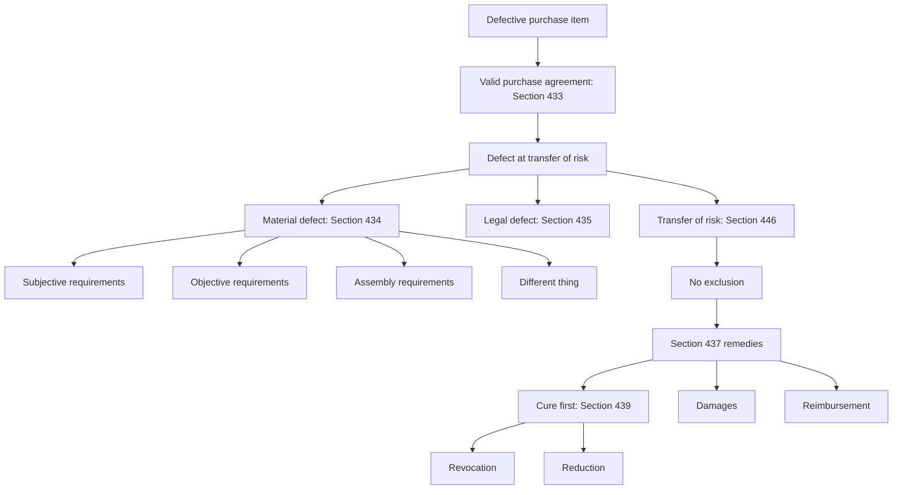
```mermaid
flowchart TD
    Start[Defective purchase item] --> Contract[Valid purchase agreement: Section 433]
    Contract --> Defect[Defect at transfer of risk]
    Defect --> Material[Material defect: Section 434]
    Defect --> Legal[Legal defect: Section 435]
    Material --> Subjective[Subjective requirements]
    Material --> Objective[Objective requirements]
    Material --> Assembly[Assembly requirements]
    Material --> Aliud[Different thing]
    Defect --> Risk[Transfer of risk: Section 446]
    Risk --> Exclusion[No exclusion]
    Exclusion --> Remedies[Section 437 remedies]
    Remedies --> Cure[Cure first: Section 439]
    Cure --> Revocation[Revocation]
    Cure --> Reduction[Reduction]
    Remedies --> Damages[Damages]
    Remedies --> Reimbursement[Reimbursement]
```

## Subject Knowledge Graph

| Node | Meaning | Exam Relevance |
|---|---|---|
| Purchase Agreement | Contract under Section 433 BGB. | Gateway to warranty rights. |
| Seller Duty Free From Defects | Seller must deliver and transfer ownership free of material/legal defects. | Breach basis for warranty law. |
| Material Defect | Non-conformity under Section 434 BGB. | Main defect category. |
| Legal Defect | Third-party rights burden the good under Section 435 BGB. | Less common but easy to miss. |
| Transfer Of Risk | Moment that separates general performance law from warranty law. | Decisive timing issue. |
| Contractual Exclusion | Clauses or agreements limiting warranty. | Must check limits. |
| Statutory Exclusion | Buyer knowledge, HGB notification duty, limitation. | Can block remedies. |
| Section 437 Gateway | Referral provision for buyer remedies. | Exam routing anchor. |
| Cure | Primary remedy. | Second-chance logic. |
| Revocation | Secondary contract-unwinding remedy. | Requires cure route unless exception. |
| Reduction | Price adjustment. | Uses proportional formula. |

| From | Relationship | To | Why It Matters |
|---|---|---|---|
| Purchase Agreement | creates | Seller Duty Free From Defects | Warranty starts from Section 433 performance duties. |
| Material Defect | must exist at | Transfer Of Risk | Later deterioration is not enough. |
| Section 437 Gateway | refers to | Cure / Revocation / Reduction | Section 437 is not the full test. |
| Cure | usually precedes | Revocation / Reduction / Damages | Seller's second chance is central. |
| Contractual Exclusion | is limited by | Section 444 / Section 476 / SBT rules | Exclusion clauses are not always valid. |
| Reduction | preserves | Purchase Agreement | Buyer keeps item but pays less. |

## Real Business Examples

- A retailer sells a laptop as compatible with a specific docking station, but it is not. This is likely a subjective/intended-use defect.
- A used car dealer advertises a car as accident-free, but it had structural accident damage. The agreed or expected quality may be missing.
- A company buys machinery from a merchant seller and fails to inspect it after delivery. Section 377 HGB can become decisive.
- A consumer buys a sofa online and discovers defective assembly instructions. Consumer purchase rules can limit seller-friendly exclusions.

## Exam Relevance

Likely prompts:

- Build the warranty-rights case structure for a defective purchased item.
- Distinguish material and legal defects.
- Identify whether the defect falls under subjective, objective, assembly, or aliud delivery rules.
- Explain why transfer of risk matters.
- Check whether warranty rights are excluded.
- Explain the cure-first logic.
- Distinguish revocation and reduction.
- Apply the reduction formula.

Common traps:

- Starting with Section 437 without first proving a defect.
- Forgetting transfer of risk.
- Treating every buyer complaint as a material defect.
- Ignoring contractual or statutory exclusions.
- Revoking immediately without respecting cure.
- Confusing reduction with damages.
- Using Section 377 HGB in non-commercial/consumer settings.

High-scoring answer structure:

1. "There is a valid purchase agreement under Section 433 BGB."
2. "The item may be defective under Section 434/435 BGB at transfer of risk."
3. "No warranty exclusion appears / possible exclusion must be checked."
4. "The buyer's remedy is routed through Section 437 BGB."
5. "Cure has priority unless an exception applies."
6. "If the requested remedy is revocation/reduction/damages, add the specific requirements."

## Official Exercise Case Routes

### Case 1a: Headphones, Broken Active Noise Cancelling

Question: can C demand cure by replacement delivery?

Route:

1. Purchase agreement: C buys headphones from O's electronics store; employee E's declaration is attributed to O through agency.
2. Material defect: no special subjective agreement exists, but comparable high-priced headphones normally have working active noise cancelling. The headphones fail objective requirements under Section 434 III 1 No. 2 BGB.
3. Transfer of risk: E handed over the headphones ten months earlier. It is unclear whether the defect existed then.
4. Burden of proof: this is a consumer-goods sale under Section 474 I BGB: C is a consumer, O is a trader, and headphones are movable goods. Because the defect appears within one year, Section 477 BGB presumes it already existed at transfer of risk.
5. No contractual or statutory exclusion appears.
6. Cure: C chooses replacement delivery under Section 439 I Alt. 2 BGB.

Result: C can demand replacement headphones, against return of the old headphones under Sections 439 VI and 346 I BGB.

Exam trap: late discovery is not automatically fatal in a consumer-goods sale; check Section 477 BGB.

### Case 1b: Advertising Claims About Active Noise Cancelling

Question: can C demand replacement when the normal function works but the advertised "twice as good" function does not?

Route:

1. Purchase agreement exists.
2. Subjective requirements are not breached because C and O made no specific individual agreement on the stronger function.
3. Objective requirements are breached because public manufacturer advertising can shape usual quality under Section 434 III 1 No. 2 b BGB.
4. The seller is not released under Section 434 III 3 BGB: O knew or had reason to know of the advertisement because it was displayed in O's store; it had not been corrected; and it influenced C's purchase.
5. Defect existed at transfer of risk because the production defect was built in from the beginning.
6. Cure and return route are the same as Case 1a.

Result: C can demand replacement delivery.

Exam trap: public advertising can create an objective-quality defect even without an individual agreement.

### Case 1c: Replacement Delivery Versus Cheap Repair

Source status: the extracted case-facts PDF contains this subcase, but the extracted solution deck ends before an official solution. The following is an inferred answer route from the lecture framework.

Question: can C insist on replacement delivery when repair is quick, flawless, and much cheaper?

Route:

1. C initially has the buyer's choice under Section 439 I BGB: repair or replacement.
2. O may refuse the selected cure type under Section 439 IV BGB if replacement is possible only at disproportionate cost.
3. Factors favoring O: replacement creates extra return/manufacturer handling costs of EUR 60, repair costs EUR 20, repair is easy, flawless, and takes one day.
4. Factors favoring C: C bought a new product and prefers not to receive a repaired one.
5. Likely weighing: a one-day flawless repair creates no significant disadvantage for C compared with the disproportionate extra burden of replacement.

Likely result: C cannot insist on replacement delivery, but can still demand repair.

Exam trap: buyer's cure choice is strong but not absolute.

## Retrieval Prompts

Closed-book questions:

1. What is the four-step structure for a warranty-rights case?
2. What is the difference between material defect and legal defect?
3. Why is transfer of risk decisive?
4. What are the four material-defect routes in Section 434 BGB?
5. Why does cure usually come before revocation?
6. How does the Section 441 III reduction formula work?

Application prompts:

1. Buyer purchases a "new car" with scratches and an outdated model year. Which defect route is strongest?
2. Buyer knew about a defect before concluding the contract. Which exclusion do you check?
3. Merchant buyer receives goods and does not inspect them for weeks. Which HGB issue arises?
4. Seller repairs twice and the same defect remains. What remedy route opens?
5. Defective thing worth EUR 600 instead of EUR 1000; price was EUR 900. Calculate the reduced price.

## Practice Tasks

1. Write a 10-line issue-spotting answer for a defective laptop battery sold for a known unusual laptop model.
2. Create a defect classification table with one example each for subjective, objective, assembly, and aliud defects.
3. Explain in plain language why the seller gets a second chance to cure.
4. Apply Section 441 III to: agreed price EUR 500, value without defect EUR 600, value with defect EUR 300.
5. Draft the first paragraph of an exam answer for a B2B buyer who discovers a defect after delivery but did not notify promptly.

## Connections

Previous notes from this lecture:

- [Week 03 Contract Law I](../week-03-contract-law-i/week-03-contract-law-i.md): contract formation and validity are prerequisites.
- [Week 05 Contract Law III](../week-05-contract-law-iii-withdrawal-cancellation-dissolution/week-05-contract-law-iii-withdrawal-cancellation-dissolution.md): revocation and restitution logic reappear inside warranty remedies.
- [Week 06 Standard Business Terms](../week-06-standard-business-terms/week-06-standard-business-terms.md): warranty exclusions in SBT must pass SBT control.
- [Week 07 Agency](../week-07-agency/week-07-agency.md): if the purchase contract was concluded through an agent, solve agency before warranty.

Future notes:

- [Week 09 Warranty Rights II](../week-09-warranty-rights-ii/week-09-warranty-rights-ii.md): damages, reimbursement, and work-contract warranty rights.

Cross-course links:

- SCM/Marketing: product quality promises and after-sale service affect customer value, but Business Law asks which statutory remedy follows from the defect.

## Weakness Flags

- Pending active recall: no first-pass retrieval has been completed yet.
- High-risk issue: distinguishing defect existence from remedy choice.
- High-risk issue: checking transfer of risk and exclusions before Section 437 remedies.


<div class="page-break"></div>

# [W08.2] Week 08 Warranty Rights I Cheatsheet And Tricks

<p class="source-path">Source: <code>business-law/wiki/week-08-warranty-rights-i/week-08-warranty-rights-i-cheatsheet-and-tricks.md</code></p>

Course: Business Law
Exam date: 2026-07-28
Source: week-08-warranty-rights-i.md, clarification-session-2026-07-11.md

## Must-Know (exam-critical)

| Item | Anchor | Why it's the backbone |
|---|---|---|
| Four-step case structure | Sections 433, 434/435, 437 BGB | Valid purchase agreement -> defect at transfer of risk -> no exclusion -> remedy under Section 437. Skipping straight to a remedy misses the gateway question. |
| Material vs legal defect | Sections 434, 435 BGB | Material = thing's condition is wrong. Legal = a third party's right burdens the thing. |
| Four material-defect routes | Section 434 II-V BGB | Subjective (contract-specific), objective (baseline market expectation), assembly, aliud (wrong thing delivered). |
| Transfer of risk | Section 446 BGB | Decisive timing checkpoint — the defect must exist at handover, not merely be discovered later. Before it: general performance law; after it: warranty law. |
| Section 437 as gateway, not full test | Section 437 BGB | It is a referral provision only — always cite the specific remedy section (439, 440/323, 441, 280 ff., 284) after invoking 437. |
| Cure has priority | Sections 437 No. 1, 439 BGB | Buyer chooses repair or replacement; seller gets a second chance before secondary remedies open. |
| Disproportionate cure refusal | Section 439 IV BGB | Seller can refuse the buyer's chosen cure type (not cure altogether) if it is only possible at disproportionate expense — weigh defect-free value, defect significance, and whether the other cure type works without substantial disadvantage. |
| Revocation only after cure fails | Sections 437 No. 2, 439, 440, 323 BGB | Opens only if cure fails, is refused, is impossible, unreasonable, or the deadline expires — not merely because the parties disagree on repair vs replacement. |
| Reduction formula | Section 441 III BGB | `reduced price = agreed price x actual value / defect-free value`. |
| Buyer-knowledge exclusion | Section 442 BGB | Buyer knew (or was grossly negligent in missing) the defect at conclusion. |
| Commercial inspection/notice duty | Section 377 HGB | Merchant-to-merchant sale: late inspection/notice can deem goods approved and kill the whole warranty claim, independent of defect severity. |

## Nice-to-Have (depth/edge cases)

- Cure cost allocation: seller bears cure costs (439 II), removal/installation costs (439 III), and gets a restitution claim for the defective thing back on replacement (439 V, via 346 I).
- Revocation exclusions beyond failed cure: insignificant defect (323 V), buyer mainly caused the defect or is in default of acceptance (323 VI).
- Consumer purchase layer (Sections 474-479 BGB): burden-of-proof shift under 477 (defect presumed to have existed at transfer of risk if it appears within one year), limited ability to derogate from warranty rights before notification under 476, easier seller recourse against supplier.
- Limits on contractual exclusions: fraud/guarantee override (444), SBT restriction for newly produced goods (309 No. 8), good-faith contradiction if seller agreed a quality then tried to exclude it (242).
- Limitation periods: 2 years for movable material defects (438 I No. 3), 5 years for buildings (438 I No. 2).
- Public advertising/manufacturer statements can create an objective-quality defect under 434 III 1 No. 2(b) even with no individual agreement, unless the seller neither knew nor should have known of it, it was corrected, or it did not influence the purchase decision (434 III 3).
- Reimbursement of futile expenses (Section 284) as an alternative to damages in lieu of performance, not a general cost-refund right.

## Nuances And Traps

| Nuance/Trap | Why it's easy to get wrong | Correct handling |
|---|---|---|
| "Cure" sounds like negotiation | Students describe cure as back-and-forth bargaining over what the buyer will accept | Cure is a defined second-chance stage under Section 439, not a negotiation — the buyer picks repair or replacement, the seller can only refuse a specific type for disproportion, not haggle generally |
| Disagreement over cure type treated as automatic revocation | It feels like a stalemate should let the buyer walk away | Test Section 439 IV first: if one cure type is disproportionate, the buyer is restricted to the other type if it remains reasonable — revocation only opens once cure as such fails, is refused, is impossible, unreasonable, or the deadline expires |
| Warranty revocation confused with rescission (Contract Law II) | Both end with the buyer "getting out," so students merge the routes | Warranty revocation unwinds a *valid* contract after a performance failure (Sections 437 No. 2, 440, 323); rescission attacks a *flawed declaration of intent* at formation (Sections 119/123) — never analyze a delivered defective good under Section 119 II |
| Transfer of risk confused with the cure deadline | Both are "dates" in the fact pattern, easy to mix up which one to test | Transfer of risk (Section 446, usually handover) tests whether the defect *already existed* at that moment; the cure deadline is a later, separate checkpoint that tests whether the seller's second chance has run out |
| Late discovery treated as automatically fatal | Students assume "found it weeks later" kills the claim | In a consumer-goods sale, if the defect appears within one year of delivery, Section 477 BGB presumes it already existed at transfer of risk — the burden shifts to the seller |
| Treating every buyer complaint as a material defect | Any dissatisfaction gets routed through 434 | First confirm an actual deviation between required and actual condition exists — subjective expectation matters, but ordinary buyer disappointment without a contractual or objective baseline is not automatically a defect |
| Using Section 377 HGB outside merchant sales | Reflexively applying "inspect and notify" logic to any purchase | Section 377 only applies to a mutual commercial purchase between merchants — never apply it to a consumer buyer |
| Starting the answer with Section 437 | Jumping straight to "buyer can revoke under 437" | Prove the defect and its timing (433, 434/435, 446) before ever citing 437 — 437 is the gateway, not the starting point |

## One-Line Recall Drill

```text
433 = purchase agreement duties
434 = material defect (subjective/objective/assembly/aliud)
435 = legal defect
446 = transfer of risk = handover
437 = gateway, not the full test
439 = cure (repair or replacement), buyer's choice
439 IV = seller can refuse disproportionate cure type only
440/323 = cure fails/refused/unreasonable -> revocation opens
441 III = reduced price = agreed price x actual value / defect-free value
442 = buyer knowledge exclusion
444 = fraud/guarantee overrides exclusion clauses
477 = one-year presumption in consumer sales
377 HGB = merchant inspect-and-notify, no equivalent for consumers
438 I No. 3 = 2-year limitation for movables
```


<div class="page-break"></div>

# [W08.3] Week 08 Warranty Rights I Practice Questions And Model Answers

<p class="source-path">Source: <code>business-law/wiki/week-08-warranty-rights-i/week-08-warranty-rights-i-practice-questions-and-model-answers.md</code></p>

Course: Business Law
Exam date: 2026-07-28
Source: week-08-warranty-rights-i.md, week-08-warranty-rights-i-cheatsheet-and-tricks.md
Format note: 25 questions — 9 short-answer/theory, 16 case/legal-opinion (schema-based). Question 8 integrates Week 11 Trade Law Section 377 HGB; Question 16 integrates Week 10 Transfer of Property; Question 17 integrates Week 09 Warranty Rights II; Question 25 integrates Week 06 Standard Business Terms.

## Short-Answer / Theory Questions

### Question 1

Explain what "transfer of risk" means in warranty law and why it functions as the decisive timing checkpoint.

**Model Answer:** Transfer of risk is the moment — usually handover/delivery of the thing under Section 446 sentence 1 BGB — that separates general impaired-performance law from warranty law. Before transfer of risk, any performance problem is handled under ordinary contract-breach rules; after it, the buyer bears the risk of accidental deterioration and warranty law governs whether the seller answers for a defect. The requirement matters because the buyer must show the defect already existed at transfer of risk, not merely that it was discovered later — a laptop battery defect present at handover is a seller's problem, but coffee spilled on the laptop after handover is not. The exam trap is conflating transfer of risk with the later cure deadline: transfer of risk decides whether the defect belongs to the seller's warranty responsibility at all, while the cure deadline decides only whether the buyer may escalate from cure to secondary remedies.

### Question 2

Compare material defect and legal defect under German sales law.

**Model Answer:** A material defect (Section 434 BGB) exists when the thing's actual condition deviates from its legally required condition — assessed through subjective agreement, objective baseline expectations, assembly requirements, or aliud (wrong-item) delivery — and is triggered by something being physically or functionally wrong with the thing itself. A legal defect (Section 435 BGB) exists when a third party can assert rights against the buyer in relation to the thing that were not assumed under the contract, triggered by an undisclosed encumbrance such as a lien or a lease burdening the item. Both open the same Section 437 BGB remedy gateway (cure, revocation, reduction, damages). Contrast example: a used car with a faulty transmission is a material defect; the same car secretly still subject to a bank's registered lien is a legal defect. The exam trap is defaulting to "material defect" for every fact pattern — a problem caused by someone else's right over the thing is a legal defect even though the same remedy provisions apply afterward.

### Question 3

Explain the tiered relationship between cure, revocation, and reduction, and state the Section 441 III reduction formula.

**Model Answer:** The requirements are tiered: (1) cure under Section 439 BGB has priority as the seller's second chance, because the buyer generally cannot skip straight to revocation, reduction, or damages; (2) only once cure fails, is refused, is impossible, is unreasonable for the buyer, or a set deadline expires does the buyer gain access to revocation (Sections 437 No. 2, 440, 323) or, in the alternative, reduction (Sections 437 No. 2, 441); (3) reduction differs from revocation in that the insignificance exclusion of Section 323 V sentence 2 BGB does not bar it, so even a minor defect can support a price reduction even where it could not support revocation. If reduction is chosen, the formula under Section 441 III BGB is: reduced price = agreed price × value of the thing with the defect / value of the thing without the defect. This tiering exists because warranty law is built around giving the seller a genuine second chance before the contract is disturbed further, and reduction (unlike revocation) preserves the contract entirely, only recalibrating the price.

## Case / Legal-Opinion Questions

### Question 4 (Case)

**Facts:** K orders a specific "ThermoPro X200" espresso machine from online retailer B. B ships a similar-looking but different, cheaper "ThermoPro X100" model instead, without telling K. K notices only after unpacking. Both models function properly on their own terms, but K wants the model she actually ordered.

**Question:** Does K have a claim against B for delivery of the correct X200 model under Sections 437 No. 1, 439 BGB?

**Model Answer:**

I. K could have a claim against B for cure by delivery of the X200 machine under Sections 437 No. 1, 439 BGB if the requirements of a warranty defect claim are met.

II. This requires: first, a valid purchase agreement (Section 433 BGB); second, a defect existing at transfer of risk (Sections 434/435, 446 BGB); third, no exclusion of warranty rights; fourth, a remedy available under the Section 437 BGB gateway.

III. Application:
1. Purchase agreement: K and B validly concluded a purchase contract for an X200 machine through K's order and B's confirmation; no formation obstacle is apparent.
2. Defect: Questionable is whether receiving a different, functioning model counts as a defect. This is supported by Section 434 V BGB, under which delivery of a different thing than agreed (aliud delivery) is treated as a defect. Against this, one could argue the X100 is not "broken" and works fine on its own. However, Section 434 V BGB does not require malfunction — it protects the buyer's contractual choice of the specific agreed item, not merely delivery of some working substitute. Consequently, a defect exists.
3. Transfer of risk: the wrong item was itself the thing handed over at delivery, so the defect (being the wrong item) necessarily existed at transfer of risk under Section 446 BGB.
4. No exclusion: nothing in the facts suggests K knew of the substitution (Section 442 BGB) or that a valid exclusion clause exists; this is not a merchant-to-merchant sale, so Section 377 HGB does not apply.

IV. A material defect under Section 434 V BGB exists at transfer of risk, and no exclusion applies, so the Section 437 BGB gateway opens.

5. Remedy: K may choose cure under Section 439 I BGB; since the correct item is what B always owed under the contract, replacement delivery of the X200 is the natural cure choice, and nothing in the facts suggests this would be disproportionately expensive for B under Section 439 IV BGB.

V. As a result, K can demand delivery of the correct X200 machine from B under Sections 437 No. 1, 439 BGB, against return of the X100 machine under Sections 439 VI, 346 I BGB.

### Question 5 (Case)

**Facts:** Manufacturer M advertises its "AquaFlow" garden hose nationally as "kink-resistant for its entire 20-meter length." Retailer R sells an AquaFlow hose to buyer P without repeating or altering the claim, but had displayed M's advertising poster in-store and never corrected or distanced itself from it. After two weeks of ordinary use, the hose kinks badly at the 12-meter mark. R and P never discussed kink-resistance specifically at the point of sale.

**Question:** Does P have a claim against R for cure under Sections 437 No. 1, 439 BGB?

**Model Answer:**

I. P could have a claim against R for cure under Sections 437 No. 1, 439 BGB if the hose is defective, the defect existed at transfer of risk, and no exclusion applies.

II. This requires: first, a valid purchase agreement; second, a material or legal defect at transfer of risk; third, no exclusion; fourth, a remedy under Section 437 BGB.

III. Application:
1. Purchase agreement: validly concluded; no issue raised on the facts.
2. Subjective defect: no explicit individual agreement on kink-resistance was made between R and P, so a subjective-quality defect under Section 434 II 1 No. 1 BGB is not established on its own.
3. Objective defect: Questionable is whether the manufacturer's advertising creates a defect anyway. This is supported by Section 434 III 1 No. 2(b) BGB, under which public statements by the manufacturer about specific qualities of the goods can shape the buyer's legitimate objective expectations, provided the seller knew or should have known of the statement, it was not corrected, and it was capable of influencing the purchase decision. Against this, one could argue R never personally repeated the claim to P. However, Section 434 III 3 BGB only releases the seller where the seller neither knew nor could have known of the statement, or it was corrected, or it did not influence the decision — none apply here, since R displayed the poster uncorrected in its own store. Consequently, the hose's failure to be kink-resistant along its full length is an objective-requirement defect.
4. Transfer of risk: the weakness in the hose's construction was inherent from manufacture, so it existed at handover even though it only manifested after two weeks of ordinary use.
5. No exclusion: nothing indicates P knew of the weakness or that a valid exclusion clause exists; this is a consumer sale, so Section 377 HGB is not relevant.

IV. A material (objective-requirement) defect under Section 434 III 1 No. 2(b) BGB exists at transfer of risk, unexcluded, so the Section 437 BGB gateway opens.

6. Remedy: cure under Section 439 BGB — repair of a structural weave defect is unlikely to be practicable, so replacement is the natural cure choice, and nothing suggests it would be disproportionate for an ordinary garden hose.

V. As a result, P can demand a replacement AquaFlow hose from R under Sections 437 No. 1, 439 BGB.

### Question 6 (Case)

**Facts:** Buyer L purchases a designer office chair for EUR 1,200 from seller F. After delivery, L discovers one armrest has a visible manufacturing scratch that does not affect function. Repairing/refinishing the armrest costs EUR 80 and takes one day, fully restoring the chair. L instead demands a brand-new replacement chair, which would cost F EUR 1,200 plus return shipping and disposal of the scratched chair.

**Question:** Can L insist on replacement, or is F entitled to perform repair instead?

**Model Answer:**

I. L could have a claim against F for replacement under Sections 437 No. 1, 439 I BGB, unless F may validly refuse this cure type under Section 439 IV BGB.

II. This requires: first, that L has a valid cure choice under Section 439 I BGB; second, that F's refusal right under Section 439 IV BGB for disproportionate cost is examined; third, the resulting remedy for L.

III. Application:
1. Buyer's choice: L is entitled to choose between repair and replacement under Section 439 I BGB and has chosen replacement.
2. Disproportion: Questionable is whether F may refuse the chosen cure type. This is supported by the stark cost gap: replacement costs roughly fifteen times more than repair (EUR 1,200 plus shipping and disposal versus EUR 80), and repair fully restores the chair to a flawless, functionally unaffected condition within one day. Against this, one could argue L bought a "new, unblemished" chair and should not be forced to accept a repaired one. However, Section 439 IV BGB weighs the value of the item free of defects, the significance of the defect, and whether the alternative cure works without substantial disadvantage to the buyer — a purely cosmetic scratch, fully repairable in a day with no functional impact, does not create a disadvantage for L comparable to F's disproportionate replacement cost. Consequently, F may refuse replacement as disproportionate.

IV. Replacement can be validly refused; repair remains available to L as the reasonable alternative cure type.

V. As a result, L cannot insist on replacement; L is restricted to demanding repair of the armrest from F under Section 439 I, IV BGB.

### Question 7 (Case)

**Facts:** At a clearance sale, seller D expressly tells buyer Q, "this printer's scanner unit is broken, only the printing function works," and marks the price down accordingly. Q buys the printer anyway. A week later, Q confirms the scanner does not work and demands that D repair it under warranty.

**Question:** Does Q have a claim against D for cure under Sections 437 No. 1, 439 BGB?

**Model Answer:**

I. Q could have a claim against D for cure under Sections 437 No. 1, 439 BGB if the printer is defective and no exclusion applies.

II. This requires: first, a valid purchase agreement; second, a defect; third, no exclusion, in particular under Section 442 BGB; fourth, a remedy under Section 437 BGB.

III. Application:
1. Purchase agreement: validly concluded.
2. Defect: a non-functioning scanner unit is a deviation from ordinary expected quality, so a material defect under Section 434 III BGB would exist in the abstract.
3. Exclusion: Questionable is whether Section 442 BGB excludes Q's rights for this defect. This is supported by the fact that D expressly disclosed the scanner defect before sale and Q bought the printer anyway, meaning Q positively knew of the defect at contract conclusion. Against this, one could argue Q still paid money for "a printer" generally. However, Section 442 I BGB excludes the buyer's warranty rights precisely for defects the buyer knew of at conclusion, and the discounted price in fact confirms both parties priced the known defect into the deal. Consequently, the "no exclusion" requirement fails as to the scanner defect specifically.

IV. Warranty rights for the scanner defect are excluded under Section 442 I BGB.

V. As a result, Q has no claim against D for cure of the scanner under Sections 437, 439 BGB, because Q knew of that specific defect at contract conclusion.

### Question 8 (Case — integrates Week 08 + Week 11)

**Facts:** Wholesaler W (a registered merchant) sells 500 packaged units of industrial-grade sealant to hardware retailer H (also a registered merchant) for H's shop inventory. The sealant is delivered to H's warehouse on a Monday. H's warehouse staff sign for the delivery but do not open or inspect any cartons, simply stacking them in storage. Three weeks later, when H finally opens cartons to restock shelves, staff discover roughly a third of the units have hardened and become unusable — a defect that would have been visible immediately upon opening any carton. H immediately calls W and demands replacement units under Sections 437 No. 1, 439 BGB.

**Question:** Does H have a claim against W for replacement of the defective units?

**Model Answer:**

I. H could have a claim against W for replacement under Sections 437 No. 1, 439 BGB if the sealant is defective, the defect existed at transfer of risk, and no exclusion applies — including the Section 377 HGB commercial inspection and notice duty, since both parties are merchants.

II. This requires: first, a valid purchase agreement (Section 433 BGB); second, a material defect at transfer of risk (Sections 434, 446 BGB); third, that the sale is a mutual commercial purchase between merchants triggering Section 377 HGB; fourth, that H complied with the Section 377 HGB inspection and notice duty; fifth, no other exclusion; sixth, a remedy under Section 437 BGB.

III. Application:
1. Purchase agreement: W and H validly concluded a sale of 500 sealant units for H's business; no formation issue is apparent.
2. Defect: hardened, unusable sealant deviates from the ordinary usable quality expected of the product under Section 434 III 1 No. 1/2 BGB — a material defect — and nothing suggests the hardening happened after delivery rather than being inherent in a third of the batch, so it is treated as existing at transfer of risk under Section 446 BGB absent contrary facts.
3. Merchant/commercial-purchase gateway: Questionable is whether the ordinary BGB warranty analysis is modified here. This is supported by both W and H being registered merchants transacting for their respective businesses, making this a mutual commercial purchase under Section 343 HGB, which in turn triggers the Section 377 HGB notice regime on top of the BGB warranty gateway.
4. Section 377 HGB inspection/notice: Section 377 HGB requires H to inspect the goods without undue delay after delivery and notify any defect without undue delay after discovery. This is supported by the fact that the defect would have been visible immediately upon opening any carton, meaning a reasonable inspection at or shortly after delivery would have caught it. Against this, one could argue three weeks is not obviously excessive for a busy warehouse. However, H's staff did not inspect at all — they simply stacked the unopened cartons — and their conduct is attributed to H under Section 278 BGB; a multi-week delay before any inspection of a readily discoverable defect exceeds "without undue delay." Consequently, H failed the Section 377 HGB inspection duty.

IV. Because H did not inspect and notify without undue delay, the sealant units are deemed approved under Section 377 HGB, and H's warranty rights — including the claim for replacement under Sections 437, 439 BGB — are excluded, regardless of how serious or genuine the underlying material defect actually was.

V. As a result, H has no claim against W for replacement of the defective sealant units, because H's own failure to timely inspect and notify under Section 377 HGB bars the Section 437 BGB warranty claim.

## Additional Short-Answer / Theory Questions

### Question 9

Explain who bears the costs of cure, and how those costs are treated if the seller cures by replacement rather than repair.

**Model Answer:** Section 439 II BGB places the necessary expenses of cure — transport, labour, and material costs — squarely on the seller, and Section 439 III BGB extends this to removal and reinstallation costs where the buyer has already installed or attached the defective item elsewhere, so the buyer is never required to advance or absorb the cost of the seller's own repair or replacement. Where the seller cures by replacement rather than repair, Section 439 V BGB (via Section 346 I BGB) gives the seller a right to have the original defective item returned, mirroring the restitution logic used elsewhere when a remedy step unwinds part of the exchange. The requirement matters because it keeps cure genuinely cost-free for the buyer — a seller cannot condition free replacement on the buyer separately funding removal of the old unit. The exam trap is assuming the buyer must simply hand back the defective item without a statutory basis for that duty; Section 439 V's cross-reference to Section 346 I is exactly that basis, and forgetting it leaves the seller's restitution claim unsupported.

### Question 10

Compare how the burden of proving a defect's timing is allocated in an ordinary sale versus a consumer sale within one year of delivery.

**Model Answer (Compare Schema):** In an ordinary sale, the buyer bears the burden of proving that a defect already existed at transfer of risk under Section 446 BGB — showing only that a problem exists today is not enough, since a defect arising after handover is not the seller's responsibility. In a consumer sale under Sections 474-479 BGB, Section 477 BGB reverses this: if the defect becomes apparent within one year of delivery, it is presumed to have already existed at transfer of risk, and the burden shifts to the seller to disprove it. Contrast example: a self-employed carpenter buying a saw for his workshop is an ordinary sale, so he must prove the defect predates delivery; a private individual buying the same saw for home use is a consumer sale, so a fault discovered ten months later is presumed pre-existing unless the seller disproves it. Exam trap: the one-year presumption is a burden-of-proof rule inside the ordinary limitation period, not a one-year warranty extension, and it never applies outside a genuine business-to-consumer sale.

### Question 11

State the main limits on a seller's ability to contractually exclude warranty rights.

**Model Answer:** Sellers may in principle exclude or limit warranty rights by agreement, but several limits prevent this from swallowing buyer protection entirely. Section 444 BGB blocks reliance on an exclusion clause where the seller fraudulently concealed the defect or gave a guarantee covering it — a seller cannot both promise a quality and contract out of liability for its absence. Section 309 No. 8 BGB restricts standard-business-terms exclusions specifically for newly manufactured goods, so a blanket SBT clause cutting out warranty rights on new goods is often invalid regardless of its wording. Good faith under Section 242 BGB further bars a seller from agreeing to a specific quality and then excluding liability for exactly that quality, since the exclusion would contradict the seller's own contractual commitment. The requirement matters because it stops exclusion clauses from stripping away protections the seller itself created through express assurances. Trap: an exclusion clause is not automatically valid merely because the parties "agreed" to it — always check fraud, guarantee, SBT rules, and good-faith contradiction before accepting it at face value.

### Question 12

List the limitation periods for warranty claims relating to movable goods and buildings, and explain what they run from.

**Model Answer (List-Requirements Schema):** (1) For movable goods, Section 438 I No. 3 BGB sets a two-year limitation period; (2) for buildings, Section 438 I No. 2 BGB sets a five-year period, reflecting the greater complexity and cost of construction defects; (3) both periods run from delivery of the thing (movables) or the equivalent handover/acceptance event, not from when the buyer actually discovers the defect. Trap: students often assume the clock starts at discovery, by analogy to tort-law "knew or should have known" starting points — warranty limitation periods under Section 438 BGB instead start from an objective handover event regardless of when the buyer actually notices the problem, so a defect noticed at month eleven and one noticed at month twenty-three of a two-year movable-goods period face the very same cutoff measured from delivery.

### Question 13

Beyond a failed or refused cure, list the other grounds on which revocation specifically can be excluded even though the general warranty gateway is open.

**Model Answer (List-Requirements Schema):** (1) Insignificance: Section 323 V sentence 2 BGB excludes revocation where the breach of duty is insignificant — a trivial defect cannot support unwinding the whole contract, even though it can still support a price reduction, since Section 441's reduction route is not subject to the same insignificance bar; (2) buyer-caused defect: Section 323 VI BGB excludes revocation where the buyer is solely or predominantly responsible for the circumstance that would otherwise entitle them to revoke; (3) buyer in default of acceptance: Section 323 VI BGB also excludes revocation where the entitling circumstance occurred while the buyer was in default of accepting the goods. Trap: these exclusions attach specifically to revocation — they do not block reduction (insignificance) and do not automatically block a damages claim, which runs its own separate responsibility test under Section 280 I BGB; always identify which specific remedy is actually being excluded rather than assuming one exclusion closes every route at once.

## Additional Case / Legal-Opinion Questions

### Question 14 (Case)

**Facts:** Buyer T tells seller S before purchase, "I need this paint to be exactly RAL 5010 gentian blue for a corporate branding job," and S confirms in writing, "yes, this can 100% matches RAL 5010." After delivery, independent testing shows the paint is actually RAL 5013 — a visibly different, darker blue — though S genuinely believed the match was correct.

**Question:** Does T have a claim for cure under Sections 437 No. 1, 439 BGB, even though the paint would pass ordinary market-quality expectations for "blue paint" generally?

**Model Answer:**

I. T could have a claim against S for cure under Sections 437 No. 1, 439 BGB if the paint is defective under the parties' individual agreement and no exclusion applies.

II. This requires: first, a valid purchase agreement; second, a material defect at transfer of risk, tested first against the parties' subjective agreement; third, no exclusion; fourth, a remedy under Section 437 BGB.

III. Application:
1. Purchase agreement: validly concluded via T's order and S's written confirmation.
2. Defect: Questionable is whether ordinary "blue paint" quality suffices, given the delivered shade is an objectively normal, saleable color. This is supported instead by Section 434 II 1 No. 1 BGB, under which an individual agreement on quality — here S's express written confirmation that the paint "100% matches RAL 5010" — controls ahead of any objective baseline expectation. Against this, one could argue S genuinely believed the match was accurate and acted in good faith. However, Section 434 BGB's defect test is not fault-based; it asks only whether the delivered condition deviates from the individually agreed condition, and RAL 5013 is a distinct, visibly different shade from the agreed RAL 5010. Consequently, a subjective-quality defect exists regardless of S's honest belief.
3. Transfer of risk: the pigment formulation was fixed at mixing, so the mismatch existed at handover under Section 446 BGB.
4. No exclusion: nothing indicates T knew of the mismatch or that a valid exclusion clause exists.

IV. A subjective-quality defect under Section 434 II 1 No. 1 BGB exists at transfer of risk and is unexcluded, so the Section 437 BGB gateway opens.

5. Remedy: cure under Section 439 I BGB — replacement with correctly mixed RAL 5010 paint is the natural cure.

V. As a result, T can demand cure from S under Sections 437 No. 1, 439 BGB; S's honest belief in the match is irrelevant to whether a defect exists, since Section 434 BGB is not a fault-based test.

### Question 15 (Case)

**Facts:** Buyer N buys a flat-pack wardrobe from furniture retailer M. The wardrobe panels themselves are flawless, but the included assembly instructions are missing a page, causing N to attach the back panel incorrectly so that the wardrobe leans and the doors do not close properly. N calls M and demands cure.

**Question:** Does N have a claim for cure under Sections 437 No. 1, 439 BGB despite the physical panels being defect-free?

**Model Answer:**

I. N could have a claim against M for cure under Sections 437 No. 1, 439 BGB if the wardrobe is defective on account of the faulty assembly instructions and no exclusion applies.

II. This requires: first, a valid purchase agreement; second, a material defect at transfer of risk under the assembly-requirements route; third, no exclusion; fourth, a remedy under Section 437 BGB.

III. Application:
1. Purchase agreement: validly concluded; M owed a flat-pack item that includes assembly by the buyer, so assembly requirements are relevant on these facts.
2. Defect: Questionable is whether a defect exists at all, given the panels themselves are flawless. This is supported by Section 434 IV BGB, under which a defect also arises where assembly was carried out incorrectly, including where incorrect assembly resulted from defective assembly instructions supplied with the item ("IKEA clause" logic) — even though nothing is physically wrong with the components themselves. Against this, one could argue N caused the problem by assembling the wardrobe incorrectly. However, N's assembly followed the instructions M supplied, and it was the missing page — not N's own error — that caused the incorrect assembly. Consequently, a material defect under Section 434 IV BGB exists.
3. Transfer of risk: the instructions were incomplete as supplied at delivery, so the defect existed at transfer of risk under Section 446 BGB.
4. No exclusion: nothing indicates N knew the instructions were incomplete or that a valid exclusion clause exists.

IV. A material defect under Section 434 IV BGB exists at transfer of risk and is unexcluded, so the Section 437 BGB gateway opens.

5. Remedy: cure under Section 439 I BGB — M can cure by supplying the missing instruction page and, if needed, arranging correct reassembly; this is neither impossible nor disproportionate.

V. As a result, N can demand cure from M under Sections 437 No. 1, 439 BGB, notwithstanding that the wardrobe's physical panels are entirely defect-free.

### Question 16 (Case — integrates Week 08 + Week 10)

**Facts:** A sewing machine is stolen from true owner O's workshop. The thief sells it at a flea market to trader S, who buys it in good faith, unaware of the theft. S then sells and delivers the machine to hobbyist buyer B, who also buys and takes delivery in good faith. Two weeks later, O traces the machine to B via its serial number and demands its return under Section 985 BGB. Separately, B has discovered that the machine's bobbin-tension mechanism was broken even before S ever possessed it, and wants cure from S.

**Question:** (1) Can O reclaim the machine from B despite B's good faith? (2) Independently, does B still have a warranty claim against S for the broken mechanism?

**Model Answer:**

I. Two separate claims arise: O's ownership-based recovery claim against B under Section 985 BGB, and B's contractual warranty claim against S under Sections 437 No. 1, 439 BGB. The separation and abstraction principles mean the outcome of one does not automatically decide the other.

II. Requirements: for claim 1 (O v. B), O must be owner and B a possessor without a right to possess; for claim 2 (B v. S), a valid purchase agreement, a material defect at transfer of risk, no exclusion, and a remedy under Section 437 BGB — none of which require B to actually be the owner, since this is an obligation-law claim, not a property-law one.

III. Application

*Claim 1 — O v. B under Section 985 BGB.* Questionable is whether O remains owner despite the chain of sales down to B. This is supported by Section 929 sentence 1 BGB, which requires the transferor's authorization to pass ownership — the thief had no authorization from O, so the thief could not transfer ownership to S under ordinary rules. Against this, one could argue S and B nonetheless acquired ownership in good faith under Section 932 BGB despite the thief's lack of authorization. However, Section 935 I BGB blocks good-faith acquisition entirely where the thing was stolen from the true owner, and this block travels through the entire chain of subsequent good-faith buyers, not merely the first one. Consequently, neither S nor B ever acquired ownership, however honestly each believed otherwise, and B currently possesses the machine with no right to possess it as against O.

*Claim 2 — B v. S under Sections 437 No. 1, 439 BGB.* Questionable is whether B has any claim at all against S given that B never became owner. This is supported by the separation principle: the purchase contract between S and B (Section 433 BGB) is an obligation contract distinct from the disposition that was supposed to follow it, and under the abstraction principle the validity of the obligation contract does not depend on whether the disposition actually succeeded. Against this, one could argue that since B never became owner, "B's purchase" was somehow void. However, nothing in the facts suggests the sales contract itself suffered any formation defect between S and B — S validly promised to sell and deliver the machine, and that promise stands regardless of S's own defective title. Consequently, a valid purchase agreement exists between B and S; the bobbin-tension mechanism was broken before S ever possessed the machine, so a material defect under Section 434 III BGB existed at the Section 446 BGB transfer of risk from S to B, and nothing indicates an exclusion.

IV. Interim results: O remains owner and can recover the machine from B under Section 985 BGB; separately, the Section 437 BGB warranty gateway is open between B and S.

V. As a result, O can reclaim the machine from B under Section 985 BGB despite B's good faith, because Section 935 BGB blocks good-faith acquisition for stolen goods down the whole chain of buyers — but B's contractual warranty claim against S for cure under Sections 437 No. 1, 439 BGB survives entirely independently of O's property-law claim, since the two transactions' validity is governed separately under the separation and abstraction principles.

### Question 17 (Case — integrates Week 08 + Week 09)

**Facts:** Buyer K orders custom-fitted industrial shelving from manufacturer P for EUR 8,000 for a warehouse expansion. On delivery, several shelf units are bent and unusable — a defect existing at transfer of risk. K demands cure and sets P a two-week deadline. P attempts a rushed repair that still leaves the units unusable and misses the deadline. K then buys equivalent replacement shelving from a competitor for EUR 9,500 to keep the project on schedule, and wants to recover the EUR 1,500 difference from P.

**Question:** Can K recover the EUR 1,500 price difference from P?

**Model Answer:**

I. K could have a claim against P for "big damages" (damages instead of the entire performance) under Sections 437 No. 3, 280 I, III, 281 BGB for the EUR 1,500 difference between the contract price and the substitute purchase.

II. This requires: first, that the Section 437 BGB warranty gateway is open; second, that cure was attempted and failed, or that a reasonable additional period for cure expired without result; third, an obligation, breach of duty, responsibility (presumed), and causal damage under Section 280 I BGB; fourth, that K gave up the defective performance entirely, distinguishing big damages from small damages.

III. Application:
1. Gateway: the bent, unusable shelf units deviate from the ordinary usable quality required under Section 434 III BGB, and nothing suggests the bending occurred after delivery, so a material defect existed at transfer of risk under Section 446 BGB, with no exclusion apparent.
2. Additional period: K set a two-week deadline, a reasonable additional period under Section 281 I BGB, and P's rushed attempt still left the units unusable within that period. Questionable is whether K needed to grant a further period. This is supported by Section 281 I BGB requiring only that a reasonable period expire without proper cure, not that the seller receive unlimited further attempts. Against this, one could argue a "rushed" attempt is not a genuine attempt and P deserves another chance. However, the facts state the deadline was missed entirely and the repair still left the units unusable, so the statutory precondition is satisfied regardless of how P characterizes its own effort. Consequently, K may proceed to damages instead of performance without granting a further period.
3. Section 280 I elements: there is an obligation (defect-free delivery under Section 433 I 2 BGB), a breach (delivery of bent, unusable units), responsibility presumed under Section 280 I sentence 2 BGB and not rebutted on the facts, and causal damage (the EUR 1,500 extra cost incurred specifically to replace P's failed performance).
4. Big vs. small damages: Questionable is whether K is limited to small damages. This is supported by K's conduct: K sourced replacement shelving from a competitor rather than keeping P's units, meaning K gave up the defective performance entirely. Against this, one could argue K should first have to prove the returned units are worthless. However, giving up the performance for a genuine substitute purchase is exactly the fact pattern big damages is built for, and K is returning P's defective units rather than retaining them. Consequently, K's claim is properly analyzed as big damages, not small damages or reduction.

IV. Interim result: the warranty gateway is open, cure failed after a reasonable additional period, and the Section 280 I BGB damages requirements are met on a big-damages basis.

V. As a result, K can recover the EUR 1,500 price difference from P as big damages under Sections 437 No. 3, 280 I, III, 281 BGB, against return of the defective shelf units to P.

### Question 18 (Case)

**Facts:** Buyer G buys a vintage watch for EUR 5,000 from dealer V. G later discovers the watch's movement was previously serviced with a non-original part, which is below the ordinary quality expected of an all-original vintage piece of this kind and lowers its value. An appraisal values the watch at EUR 4,000 with the non-original part and EUR 5,000 if all-original; no equivalent original replacement part is realistically available, so repair to a fully original state is impracticable. G does not want revocation and instead demands a price reduction.

**Question:** What is G entitled to under Section 441 III BGB?

**Model Answer:**

I. G could have a claim against V for a reduced price under Sections 437 No. 2, 441 BGB if the watch is defective, cure is unavailable or dispensable, and the reduction formula is applied.

II. This requires: first, a valid purchase agreement; second, a material defect at transfer of risk; third, that the preconditions otherwise required for revocation (cure failed, impossible, or dispensable) are met, since reduction shares those preconditions but is not barred by insignificance; fourth, correct application of the Section 441 III BGB formula.

III. Application:
1. Purchase agreement: validly concluded for EUR 5,000.
2. Defect: the non-original movement part falls below the ordinary quality customary for an all-original vintage watch of this kind, a material defect under Section 434 III BGB, and the part was fitted before the sale, so it existed at transfer of risk under Section 446 BGB.
3. Cure availability: Questionable is whether cure via repair could resolve this. This is supported by no equivalent original replacement part being realistically available, and further disassembly/servicing of a vintage piece risking further loss of collector value. Against this, one could argue V should still get a chance to search for a part. However, the facts state no original replacement is realistically available, so cure is impracticable. Consequently, the cure-first requirement is dispensed with and G may proceed directly to reduction.

IV. Interim result: the requirements of Sections 437 No. 2, 441 BGB are met.

4. Reduction calculation: reduced price = agreed price × value with defect / value without defect = EUR 5,000 × (EUR 4,000 / EUR 5,000) = EUR 4,000.

V. As a result, G is entitled to a reduced price of EUR 4,000 — a refund of EUR 1,000 of the EUR 5,000 already paid — under Sections 437 No. 2, 441 III BGB.

## Further Short-Answer / Theory Questions

### Question 19

Explain the limit Section 476 BGB places on agreements that deviate from warranty rights in a consumer purchase, and when it applies.

**Model Answer:** Section 476 BGB restricts the parties' freedom, in a consumer purchase under Sections 474 ff. BGB, to agree on terms that deviate from the buyer's statutory warranty rights to the buyer's disadvantage before the seller has been notified of a defect — protecting the consumer from pre-emptively signing away rights to protections the seller has not yet had to honor. The statutory anchor is Section 476 BGB, layered on top of the general warranty regime in Sections 434-441 BGB once the sale qualifies as a consumer purchase (trader selling to a consumer, Sections 13, 14, 474 I BGB). The requirement matters because it prevents traders from using standard forms or pre-sale waivers to strip away statutory protections before a consumer even knows a defect exists, closing an obvious end-run around the warranty regime. Example: a trader's sale contract stating "buyer waives all warranty claims regardless of defect" is ineffective under Section 476 BGB against a consumer buyer, even if the consumer signed it, because it deviates from statutory warranty rights before any defect notification. The exam trap is assuming this consumer-protective limit applies to B2B sales as well — Section 476 BGB is specific to consumer purchases; between two merchants or businesses, pre-sale warranty-limiting agreements face a different, generally more permissive analysis (subject still to SBT content control and Section 444 BGB).

## Further Case / Legal-Opinion Questions

### Question 20 (Case)

**Facts:** Buyer J tells retailer R's sales assistant, "I need this external hard drive because I want to back up my professional video-editing files, which involve very large 4K project files." The assistant says nothing to contradict this and completes the sale. The hard drive works perfectly for ordinary storage, but its write speed is too slow to handle the large 4K files without constant dropped frames, making it unsuitable for J's stated purpose. A drive marketed as an "everyday backup drive" would ordinarily be expected to perform fine for typical, non-professional use.

**Question:** Does J have a claim for cure under Sections 437 No. 1, 439 BGB even though the drive works fine for ordinary backup purposes?

**Model Answer:**

I. J could have a claim against R for cure under Sections 437 No. 1, 439 BGB if the drive is defective measured against J's disclosed intended use and no exclusion applies.

II. This requires: first, a valid purchase agreement; second, a material defect at transfer of risk, tested first against the parties' subjective agreement including intended contractual use; third, no exclusion; fourth, a remedy under Section 437 BGB.

III. Application:
1. Purchase agreement: validly concluded via J's purchase from R.
2. Defect: Questionable is whether an ordinarily-functioning backup drive can be defective. This is supported by Section 434 II 1 No. 2 BGB, under which a defect exists where the thing is unsuitable for the use intended under the contract, where that intended use was made recognizable to the seller and not objected to. Against this, one could argue the drive works perfectly for its objectively marketed purpose as an "everyday backup drive," so no defect exists under ordinary market expectations. However, J disclosed the specific professional 4K video-editing purpose to R's own sales assistant before purchase, and R raised no objection or caveat about the drive's suitability for that use — under Section 434 II 1 No. 2 BGB, this disclosed and unopposed intended use sets a subjective requirement that displaces the merely objective baseline. Consequently, the drive's inability to reliably handle large 4K files without dropped frames is a defect measured against the agreed intended use, even though it performs adequately for generic backup tasks.
3. Transfer of risk: the write-speed limitation was an inherent property of the drive from manufacture, so it existed at handover under Section 446 BGB.
4. No exclusion: nothing indicates J knew of the speed limitation or that a valid exclusion clause exists.

IV. A material defect under Section 434 II 1 No. 2 BGB exists at transfer of risk and is unexcluded, so the Section 437 BGB gateway opens.

5. Remedy: cure under Section 439 I BGB — replacement with a drive suited to J's disclosed professional use is the natural cure, and nothing suggests disproportion.

V. As a result, J can demand cure from R under Sections 437 No. 1, 439 BGB; the drive's fitness for ordinary generic backup use does not defeat the claim, because Section 434 II 1 No. 2 BGB tests suitability against the disclosed intended use, not against generic market expectations.

### Question 21 (Case)

**Facts:** Seller V sells buyer K a used industrial sewing machine "free of any third-party claims." Unknown to K, V had earlier pledged the machine as security for a business loan, and the bank's security interest was never released or disclosed to K. Two months after delivery, the bank contacts K asserting its security right and threatening to seize the machine.

**Question:** Does K have a claim against V for cure under Sections 437 No. 1, 439 BGB, even though the machine itself functions flawlessly?

**Model Answer:**

I. K could have a claim against V for cure under Sections 437 No. 1, 439 BGB if the machine suffers from a legal defect and no exclusion applies.

II. This requires: first, a valid purchase agreement; second, a legal defect at transfer of risk under Section 435 BGB; third, no exclusion; fourth, a remedy under Section 437 BGB.

III. Application:
1. Purchase agreement: validly concluded between V and K.
2. Defect: Questionable is whether a fully-functioning machine can be defective. This is supported by Section 435 BGB, under which a legal defect exists where a third party can assert rights against the buyer in relation to the thing that were not assumed under the contract — the mechanical condition of the item is irrelevant to this route. Against this, one could argue the machine works perfectly and nothing is physically wrong with it. However, the bank's undisclosed, unreleased security interest is exactly the kind of third-party right Section 435 BGB targets, and the parties' express agreement that the machine be delivered "free of any third-party claims" confirms K never assumed this encumbrance under the contract. Consequently, a legal defect under Section 435 BGB exists.
3. Transfer of risk: the security interest was created before the sale and never released, so it burdened the machine already at handover under Section 446 BGB.
4. No exclusion: nothing indicates K knew of the pledge or that a valid exclusion clause exists; V's express assurance of freedom from third-party claims cuts against any implied exclusion.

IV. A legal defect under Section 435 BGB exists at transfer of risk and is unexcluded, so the Section 437 BGB gateway opens.

5. Remedy: cure under Section 439 I BGB — V can cure by procuring release of the bank's security interest, clearing the machine of the third-party right; this is neither impossible nor disproportionate on the facts.

V. As a result, K can demand cure from V under Sections 437 No. 1, 439 BGB despite the machine's flawless physical condition, because the undisclosed bank security interest is a legal defect under Section 435 BGB, a route distinct from material defects under Section 434 BGB.

### Question 22 (Case)

**Facts:** Buyer H inspects a used delivery van before purchase from dealer T. T invites H to "look it over as thoroughly as you like" and gives H unrestricted access for an hour. A large rust perforation is visible on the underside of the van, plainly noticeable to anyone who glances underneath, but H does not bother to look underneath at all before signing the purchase contract. After delivery, H discovers the rust damage and demands cure from T.

**Question:** Does H have a claim for cure under Sections 437 No. 1, 439 BGB?

**Model Answer:**

I. H could have a claim against T for cure under Sections 437 No. 1, 439 BGB unless H's rights are excluded under Section 442 I BGB.

II. This requires: first, a valid purchase agreement and material defect at transfer of risk; second, examination of whether Section 442 I BGB excludes the claim, including its grossly-negligent-ignorance branch; third, a remedy under Section 437 BGB if no exclusion applies.

III. Application:
1. Purchase agreement and defect: validly concluded; the rust perforation deviates from the ordinary quality expected of a used van under Section 434 III BGB and existed at transfer of risk under Section 446 BGB, since rust of that extent develops well before a single sale.
2. Exclusion: Questionable is whether Section 442 I BGB excludes H's rights despite H not actually knowing of the rust. This is supported by Section 442 I sentence 2 BGB, which excludes rights not only for defects the buyer actually knew of, but also for defects the buyer did not know of only as a result of gross negligence, unless the seller fraudulently concealed the defect or gave a guarantee. Against this, one could argue H never saw the rust and so cannot be treated as "knowing." However, T expressly invited H to inspect the van as thoroughly as desired and gave H an hour of unrestricted access, and the rust perforation was plainly visible to anyone who glanced underneath — failing to perform even this basic, invited check on a highly visible defect is gross negligence, not ordinary buyer inattention. Consequently, H's ignorance of the rust falls within the gross-negligence branch of Section 442 I BGB.

IV. Because H's ignorance of the rust resulted from gross negligence and nothing indicates fraudulent concealment or a guarantee by T, H's warranty rights for the rust defect are excluded under Section 442 I BGB.

V. As a result, H has no claim against T for cure of the rust damage under Sections 437, 439 BGB, because H's failure to notice a plainly visible defect during an invited, unrestricted inspection amounts to gross negligence within Section 442 I BGB — distinct from Question 7's scenario of actual disclosed knowledge, but producing the same exclusion.

### Question 23 (Case)

**Facts:** Caterer C orders a custom commercial oven from manufacturer M for a new kitchen build-out, paying EUR 15,000. Before delivery, C spends EUR 2,000 having a specialized ventilation duct installed specifically to fit this oven model. The oven arrives with a defect that M cannot cure — repair is impossible and no replacement unit of that model exists. C revokes the contract and, rather than trying to prove lost profit from a working oven, wants to recover the EUR 2,000 ventilation cost as wasted expenditure.

**Question:** Can C recover the EUR 2,000 from M?

**Model Answer:**

I. C could have a claim against M for reimbursement of futile expenses under Sections 437 No. 3, 284 BGB for the EUR 2,000 ventilation cost.

II. This requires: first, the Section 437 BGB warranty gateway is open and cure is excluded; second, C would otherwise have been entitled to damages instead of performance; third, C reasonably incurred expenses in reliance on receiving performance; fourth, the expenses' purpose was not going to fail regardless of the breach.

III. Application:
1. Gateway: the oven's defect deviates from the ordinary quality expected under Section 434 III BGB and existed at transfer of risk under Section 446 BGB; cure is impossible since no replacement exists and repair cannot fix it, dispensing with the cure-first requirement under Section 440 BGB.
2. Reliance expenditure: Questionable is whether C can recover the ventilation cost without proving lost profit. This is supported by Section 284 BGB, which allows a creditor to demand reimbursement of expenses reasonably incurred in reliance on receiving the seller's performance, as an alternative to damages instead of performance, precisely so the creditor need not quantify a speculative profit figure. Against this, one could argue C should instead have to prove what profit the working oven would have generated. However, Section 284 BGB exists exactly to spare the creditor that speculative proof burden where reliance expenditure is easier to show, and the EUR 2,000 duct installation was reasonably incurred specifically to accommodate this oven model in reliance on M's performance. Consequently, C may elect reimbursement under Section 284 BGB instead of proving lost profit.
3. Purpose not otherwise doomed: nothing in the facts suggests the ventilation duct would have been wasted expenditure even if the oven had been defect-free — it was built specifically to fit this model and would have served its purpose had M performed properly.

IV. Interim result: the Section 437 BGB gateway is open, cure is impossible, and the Section 284 BGB reimbursement requirements are met.

V. As a result, C can recover the EUR 2,000 ventilation cost from M under Sections 437 No. 3, 284 BGB as reimbursement of futile expenses, without needing to prove the oven's hypothetical lost profit.

### Question 24 (Case)

**Facts:** Manufacturer M runs a national ad campaign claiming its "SolarMax" garden light charges "fully in two hours of sunlight." Retailer R sells a SolarMax light to buyer P but, before the sale, R's shop clearly displays its own printed correction stating "Note: SolarMax charging times vary; the manufacturer's 'two hours' claim is not guaranteed and should be disregarded." P notices this correction sign but buys the light anyway because he liked its design, not because of the charging-time claim, and later complains that the light actually takes four hours to charge.

**Question:** Does P have a claim against R for cure based on the discrepancy between the advertised and actual charging time?

**Model Answer:**

I. P could have a claim against R for cure under Sections 437 No. 1, 439 BGB only if the advertised two-hour charging claim shapes an objective-quality defect; this is questionable given R's correction.

II. This requires: first, a valid purchase agreement; second, a material defect at transfer of risk, including whether manufacturer advertising shapes objective requirements under Section 434 III 1 No. 2(b) BGB, unless the seller is released under Section 434 III 3 BGB; third, no other exclusion; fourth, a remedy under Section 437 BGB.

III. Application:
1. Purchase agreement: validly concluded between R and P.
2. Objective defect via advertising: Questionable is whether M's "two hours" claim became part of the objectively expected quality. This is supported in principle by Section 434 III 1 No. 2(b) BGB, under which public statements by the manufacturer about specific product qualities can shape a buyer's legitimate objective expectations. Against this, one could argue R is not the one who made the claim. However, that alone would not release R, since Section 434 III 1 No. 2(b) BGB reaches statements by manufacturers displayed by the seller too — the decisive question is instead whether R is released under Section 434 III 3 BGB, which excuses the seller where the statement was corrected in a comparable manner to how it was made, or where it did not influence the purchase decision. Both release grounds are met here: R displayed a clear, comparably prominent correction disclaiming the two-hour figure, and the facts state P bought the light for its design, not because of the charging-time claim. Consequently, R is released under Section 434 III 3 BGB, and the advertised charging time never became part of the objectively expected quality.

IV. No defect arises from the discrepancy between the advertised and actual charging time, because R's correction and P's independent purchase motive both satisfy the Section 434 III 3 BGB release.

V. As a result, P has no claim against R for cure based on the charging-time discrepancy — unlike Question 5, where the seller failed to correct the manufacturer's claim and the claim did influence the buyer, here both release conditions under Section 434 III 3 BGB are met and no defect arises from the advertising.

### Question 25 (Case — integrates Week 08 + Week 06)

**Facts:** Online furniture retailer F's standard terms and conditions, presented to every buyer at checkout via a clearly labeled "Terms and Conditions" checkbox that must be ticked before payment, include the clause: "All items are sold with warranty rights fully excluded; the buyer accepts all goods 'as is.'" Buyer D ticks the box and buys a newly manufactured dining table from F, which arrives with a cracked leg — a material defect existing at transfer of risk. D demands cure; F points to the clause.

**Question:** Can F rely on the "as is" clause to deny D's cure claim?

**Model Answer:**

I. D could have a claim against F for cure under Sections 437 No. 1, 439 BGB unless F's "as is" clause validly excludes it — which requires both that the clause is validly incorporated and passes SBT content control, and that no overriding rule such as Section 444 BGB blocks reliance on it regardless.

II. This requires: first, a valid purchase agreement and material defect at transfer of risk (established); second, that the clause was validly incorporated as a standard business term under Section 305 BGB; third, that the clause survives content control under Sections 307-309 BGB, in particular Section 309 No. 8 BGB for newly manufactured goods; fourth, that Section 444 BGB does not independently override even a valid exclusion.

III. Application:
1. Defect: the cracked leg is a material defect under Section 434 III BGB, existing at transfer of risk under Section 446 BGB; no dispute on this point.
2. Incorporation: the clause was clearly presented and D affirmatively accepted it via the checkbox before payment, satisfying Section 305 II BGB's incorporation requirements (clear reference, reasonable opportunity to review, agreement); it is a pre-formulated term used for a multitude of contracts, so Section 305 I BGB applies and it is a standard business term.
3. Content control: Questionable is whether a blanket "as is" exclusion of all warranty rights survives content control. This is supported by Section 309 No. 8 BGB, part of the "black list" of clauses invalid without any room for evaluation, which specifically restricts clauses excluding or limiting warranty rights for newly manufactured goods sold as new — exactly this transaction, since the table is newly manufactured. Against this, one could argue F is free to define what it sells "as is" through ordinary contract terms. However, Section 309 No. 8 BGB exists precisely to stop blanket exclusions like this one from being imposed via standard terms on new-goods sales, and a clause that fails content control is invalid under Section 306 I, II BGB, with statutory law filling the resulting gap rather than the whole contract failing. Consequently, the "as is" exclusion clause is invalid under Section 309 No. 8 BGB.
4. Section 444 overlay: even if the clause had somehow survived content control, nothing in the facts suggests fraud or a guarantee here, so Section 444 BGB is not independently needed to defeat the clause on these particular facts — the SBT content-control failure alone is dispositive.

IV. The "as is" exclusion clause is invalid under Section 309 No. 8 BGB; the rest of the contract remains valid under Section 306 BGB, and statutory warranty law fills the gap left by the invalid clause.

V. As a result, F cannot rely on the "as is" clause to deny D's claim; D retains a cure claim against F under Sections 437 No. 1, 439 BGB for the cracked table leg, because the blanket warranty-exclusion clause fails SBT content control under Section 309 No. 8 BGB for newly manufactured goods.

## Quick Answer Route Summary

| Question # | Primary Route/Section | One-line takeaway |
|---:|---|---|
| 1 | Section 446 BGB | Transfer of risk, not discovery, is the decisive timing test. |
| 2 | Sections 434, 435 BGB | Material = thing's own condition; legal = a third party's right over the thing. |
| 3 | Sections 439, 440/323, 441 III BGB | Cure first, then revocation or reduction; reduction alone survives insignificance. |
| 4 (Case) | Section 434 V BGB | Aliud delivery is a defect even if the wrong item works fine. |
| 5 (Case) | Section 434 III 1 No. 2(b) BGB | Uncorrected manufacturer advertising can create an objective defect. |
| 6 (Case) | Section 439 IV BGB | Seller can refuse a disproportionate cure type, buyer then limited to the other type. |
| 7 (Case) | Section 442 I BGB | Buyer's pre-conclusion knowledge of a specific defect excludes rights for that defect. |
| 8 (Case, integrative) | Section 377 HGB + Section 437 BGB | Merchant buyer's late inspection/notice bars an otherwise valid warranty claim entirely. |
| 9 | Section 439 II, III, V BGB | Seller bears all cure costs, including removal/reinstallation; buyer returns the old item on replacement. |
| 10 | Section 477 BGB | Consumer sale within one year: defect presumed pre-existing, burden shifts to seller. |
| 11 | Sections 444, 309 No. 8, 242 BGB | Fraud, guarantee, SBT restriction, and good-faith contradiction all limit exclusion clauses. |
| 12 | Section 438 I No. 2/3 BGB | Two years for movables, five for buildings; both run from delivery/handover, not discovery. |
| 13 | Section 323 V, VI BGB | Insignificance and buyer-caused defect/acceptance default exclude revocation only, not reduction or damages. |
| 14 (Case) | Section 434 II 1 No. 1 BGB | An express individual quality agreement controls even over an objectively ordinary product. |
| 15 (Case) | Section 434 IV BGB | Faulty assembly instructions create a defect even when the physical components are flawless. |
| 16 (Case, integrative) | Sections 929, 932, 935, 985 BGB + Sections 437, 439 BGB | Theft blocks good-faith ownership down the whole chain, but the buyer's contractual warranty claim survives independently under separation/abstraction. |
| 17 (Case, integrative) | Sections 281, 280 I, III BGB | Failed cure after a reasonable period opens big damages for the substitute-purchase price difference. |
| 18 (Case) | Section 441 III BGB | Reduced price = agreed price × value with defect / value without defect. |
| 19 | Section 476 BGB | Consumer purchase: cannot deviate from warranty rights to buyer's disadvantage before defect notification. |
| 20 (Case) | Section 434 II 1 No. 2 BGB | Disclosed, unopposed intended use sets a subjective defect standard above generic market expectations. |
| 21 (Case) | Section 435 BGB | Legal defect (undisclosed third-party right) is defective regardless of the item's flawless physical condition. |
| 22 (Case) | Section 442 I sentence 2 BGB | Grossly negligent failure to notice an obvious, invited-inspection defect excludes rights just like actual knowledge. |
| 23 (Case) | Section 284 BGB | Futile-expense reimbursement lets the buyer recover reliance costs without proving speculative lost profit. |
| 24 (Case) | Section 434 III 3 BGB | A corrected, non-influential manufacturer claim releases the seller from an advertising-based objective defect. |
| 25 (Case, integrative) | Sections 305, 307-309 BGB + Section 437 BGB | Section 309 No. 8 voids a blanket "as is" exclusion on newly manufactured goods regardless of checkbox acceptance. |


<div class="page-break"></div>

# [W09.1] Week 09: Warranty Rights II

<p class="source-path">Source: <code>business-law/wiki/week-09-warranty-rights-ii/week-09-warranty-rights-ii.md</code></p>

Source: `business-law/raw/moodle-export-business-law-950848572-s26-20260628/15.06. - Warranty Rights II - Haag/Warranty Rights II.pdf`
Exercise sources processed 2026-07-09:

- `business-law/raw/moodle-export-business-law-950848573-s26-20260709/24.6. Warranty Rights II/Warranty Rights II_Case facts.pdf`
- `business-law/raw/moodle-export-business-law-950848573-s26-20260709/24.6. Warranty Rights II/Warranty Rights II_Slides and solutions.pdf`

Course: Business Law
Processed: 2026-06-28
Wiki note: `business-law/wiki/week-09-warranty-rights-ii/week-09-warranty-rights-ii.md`

Course direction checked against `business-law/wiki/_course-logistics.md`: Warranty Rights II is Session 9 in the teaching outline and continues Week 08 Warranty Rights I.

External statute check: statutory anchors were cross-checked against the official Gesetze-im-Internet BGB source on 2026-06-28. The official English BGB translation warns that translations may lag the current German text; use current German statutory text for exact wording.

## 80/20 Exam Summary

Warranty Rights II explains the damages side of buyer remedies and gives an overview of warranty rights in work contracts.

- Section 437 No. 3 BGB routes warranty damages into Sections 280 et seq. BGB and reimbursement into Section 284 BGB.
- The key exam distinction is damages in addition to performance versus damages instead of performance.
- Use the hypothetical-performance test: would the claimed loss still exist if proper performance were rendered at the latest possible time?
- Simple damages in addition to performance usually use Section 280 I BGB.
- Damages instead of performance due to repairable non- or malperformance usually use Sections 280 I, III, 281 BGB and require an additional period unless an exception applies.
- Damages instead of performance due to impossibility use Sections 280 I, III, 283 BGB when performance becomes impossible after contract conclusion.
- Initial impossibility uses Section 311a BGB.
- Responsibility normally means intent or negligence under Section 276 BGB; Section 280 I 2 BGB presumes fault.
- Section 278 BGB attributes fault of persons used to perform the obligation.
- Damage is assessed through restitution in kind, monetary compensation, and the difference hypothesis.
- Section 284 BGB reimburses futile expenses instead of damages in lieu of performance.
- Work-contract warranty rights under Section 634 BGB are similar to purchase warranty rights but add self-help under Section 637 BGB and use acceptance of work as the decisive timing point.

## Continuity Bridge From Warranty Rights I

Week 08 gave the gateway:

```text
valid purchase agreement
-> defect at transfer of risk
-> no exclusion
-> Section 437 remedy
```

Week 09 focuses on what happens when the chosen Section 437 remedy is damages or reimbursement.

```text
Section 437 No. 3 BGB
-> damages under Sections 280 et seq.
-> reimbursement under Section 284
```

## Legal Remedies Are Tiered

Section 437 BGB remedies remain in a tiered relationship.

```text
cure first as the regular second chance
-> then revocation / reduction / damages / reimbursement if additional requirements are met
```

The damages route is not one single claim. It depends on the type of damage and the performance problem.

## Distinguishing Damages Types

Core question from the deck:

```text
Would the claimed damage still exist if performance had been hypothetically rendered correctly at the latest possible time?
```

| Answer | Damage type | Typical statutory route |
|---|---|---|
| Yes, the loss would still exist. | Damages in addition to performance. | Sections 437 No. 3, 280 I BGB. |
| No, proper performance would remove/avoid the loss. | Damages instead of performance. | Sections 437 No. 3, 280 I, III, 281/283 BGB or Section 311a BGB. |

Examples from the deck:

| Facts | Classification | Route |
|---|---|---|
| Defective good harms buyer's other property. | Damages in addition to performance. | Sections 437 No. 3, 280 I BGB. |
| Defective good can be fixed; buyer claims reduced market value. | Damages instead of performance. | Sections 437 No. 3, 280 I, III, 281 BGB. |
| Defective good cannot be fixed; buyer claims reduced market value. | Damages instead of performance due to impossibility. | Sections 437 No. 3, 280 I, III, 283 BGB. |

## Section 280 I BGB Basic Damages

Elements:

```text
1. Contractual obligation.
2. Breach of duty.
3. Responsibility.
4. Causal damage.
```

In warranty cases:

```text
purchase agreement
-> defective delivery
-> seller responsible unless not responsible
-> causal loss
```

Section 280 I 2 BGB matters because the debtor must show they are not responsible.

## Responsibility

Responsibility normally covers:

- intent;
- negligence under Section 276 BGB;
- strict liability if a guarantee is given;
- attributed fault of helpers under Section 278 BGB.

Guarantee:

```text
No intent or negligence is required if the seller assumed a guarantee.
Tacit guarantee is possible, but the threshold is high.
```

Third parties:

```text
If the debtor uses another person to perform the obligation, Section 278 BGB can attribute that person's fault to the debtor.
```

Business example: if a seller uses an employee or another company to perform delivery/installation, the seller may be responsible for that helper within the obligation scope.

## Damage

Damage is not defined directly in statutory law in the deck. The note uses this working definition:

```text
damage = involuntary loss of material or immaterial goods/interests
```

Not every spending is damage. Voluntary spending in reliance on the contract can be reimbursement under Section 284 BGB instead.

Damage categories:

| Category | Meaning | Anchor |
|---|---|---|
| Material damage | Measurable in money. | Sections 249 et seq. BGB. |
| Immaterial damage | Not measurable in money; only compensable if statute allows. | Section 253 BGB. |
| Lost profit | Profit that would likely have been earned absent the damaging event. | Section 252 BGB. |

General form:

```text
restitution in kind under Section 249 I BGB
-> monetary compensation under Sections 249 II-251 BGB where appropriate
```

Difference hypothesis:

```text
damage = hypothetical situation without damaging event - actual situation
```

## Damages Instead Of Performance Under Section 281 BGB

Use this route for non-performance or malperformance that can still be cured.

Statutory combination:

```text
Section 280 I BGB + Section 280 III BGB + Section 281 BGB
```

Additional Section 281 requirements:

- due obligation to perform;
- non-performance or malperformance;
- reasonable additional period for performance/cure;
- period expires without result;
- exceptions under Section 281 II BGB or Section 440 BGB in purchase cases;
- responsibility for initial malperformance or expiry of the additional period.

Exclusions:

| Exclusion | Anchor | Meaning |
|---|---|---|
| Partial performance still useful | Section 281 I 2 BGB | No damages instead of entire performance if buyer still has interest. |
| Insignificant defective performance | Section 281 I 3 BGB | No damages instead of entire performance for insignificant defects. |

## Small And Big Damages

| Type | Deck label | Economic result | Nearby warranty analogy |
|---|---|---|---|
| Small claim for damages | Damage instead of performance, but buyer keeps item. | Buyer keeps defective item and receives value difference. | Similar, but not identical, to reduction. |
| Big claim for damages | Damage instead of entire performance. | Buyer returns item and receives purchase price back or damages for non-fulfilment. | Similar to revocation. |

Example of small claim:

```text
Buyer keeps defective item.
Damages = value difference between defect-free item and defective item.
```

Example of big claim:

```text
Buyer urgently obtains substitute goods from another supplier.
Buyer may claim covering-purchase-related damages if requirements are met.
```

### Small Damages Versus Reduction

Small damages and reduction can look economically similar because the buyer keeps the defective item and receives money. The legal route is different.

| Question | Small damages | Reduction |
|---|---|---|
| Statutory route | Sections 437 No. 3, 280 I, III, 281 BGB | Sections 437 No. 2, 441 BGB |
| Buyer keeps item? | Yes | Yes |
| Seller responsibility needed? | Yes, under Section 280 I 2 BGB | No fault requirement |
| Core function | Compensation for the performance deficit | Price adjustment to the lower value |
| Exam signal | Buyer claims loss/value deficit as damages | Buyer declares reduction or asks for refund of overpaid price |

Example:

```text
agreed price = EUR 10,000
defect-free value = EUR 10,000
defective value = EUR 7,000
value deficit = EUR 3,000
```

If the buyer says "I keep the machine but want compensation for the EUR 3,000 loss", route as small damages. If the buyer says "I reduce the price because the machine is worth less", route as reduction. The same value gap may appear, but damages require responsibility and the damages route.

Reusable exam sentence:

```text
Although the economic result resembles reduction, the buyer is claiming compensation for the value deficit. This is small damages instead of performance under Sections 437 No. 3, 280 I, III, and 281 BGB, so responsibility and the damages requirements must be checked.
```

Reduction sentence:

```text
The buyer does not claim damages but adjusts the purchase price because the defective item is worth less. This is reduction under Sections 437 No. 2 and 441 BGB, which does not require seller responsibility.
```

### Big Damages Versus Revocation

Big damages and revocation can also look similar because the buyer gives up the defective performance. Again, the legal route is different.

| Question | Big damages | Revocation |
|---|---|---|
| Statutory route | Sections 437 No. 3, 280 I, III, 281 BGB | Sections 437 No. 2, 323, 346 ff. BGB |
| Buyer gives up performance? | Usually yes | Yes |
| Seller responsibility needed? | Yes, under Section 280 I 2 BGB | No fault requirement |
| Core function | Compensation for non-fulfilment loss | Unwind the contract and return performances |
| Money focus | Loss such as extra cost of substitute purchase | Return of purchase price / restitution |

Example:

```text
original price = EUR 10,000
seller fails to cure
buyer buys substitute machine = EUR 12,000
extra cost = EUR 2,000
```

If the buyer claims the EUR 2,000 extra cost of substitute performance, route as big damages. If the buyer only wants to return the defective machine and get the purchase price back, route as revocation.

Reusable exam sentence:

```text
The buyer does not merely want to unwind the contract; she claims the loss caused by having to obtain substitute performance. This is big damages instead of performance under Sections 437 No. 3, 280 I, III, and 281 BGB.
```

Revocation sentence:

```text
The buyer wants to undo the contract and return the defective item against repayment of the purchase price. This is revocation under Sections 437 No. 2 and 323 BGB, with restitution under Sections 346 ff. BGB.
```

Memory rule:

```text
Reduction/revocation = price adjustment or unwinding.
Small/big damages = compensation for loss, therefore responsibility required.
```

## Damages Due To Impossibility

Use Sections 280 I, III, 283 BGB if performance becomes impossible after contract conclusion but before transfer of risk.

The deck links this route to Section 275 BGB:

| Impossibility type | Anchor | Meaning |
|---|---|---|
| Genuine impossibility | Section 275 I BGB | Performance is objectively or subjectively impossible. |
| Practical impossibility | Section 275 II BGB | Performance is not literally impossible, but effort is grossly disproportionate. |
| Personal impossibility | Section 275 III BGB | Personally owed performance cannot reasonably be expected. |

Effect:

```text
debtor released from performance duty
-> damages or revocation may become possible
```

Initial impossibility is routed through Section 311a BGB.

## Secondary Duty Damages

Sections 280 I, III, 282 BGB apply where a breach of secondary duty makes performance unacceptable.

Elements added by Section 282:

- breach of a secondary duty under Section 241 II BGB;
- destroyed base of trust;
- breach relevant to the purpose of the contract;
- weighing of interests makes further performance unacceptable.

Craftsman example from the deck:

```text
Craftsman installs kitchen properly but acts drunk, smokes, and damages floor.
Floor damage: damages in addition to performance under Sections 280 I, 241 II BGB.
Cost of a new craftsman: damages instead of performance under Sections 280 I, III, 282 BGB.
```

## Gas Station Example

Facts:

```text
S sells regular fuel to B.
Due to supplier mistake, fuel has 80 octane instead of required 95.
S negligently fails to notice.
B's car breaks down and engine is damaged.
B also wants back the money spent on fuel.
```

Analysis:

1. Purchase contract under Section 433 BGB.
2. Defective fuel under Section 434 II 1 No. 2 BGB at transfer of risk.
3. Engine damage: proper fuel delivered later would not undo engine damage.
4. Therefore engine repair costs are damages in addition to performance under Sections 437 No. 3, 280 I BGB.
5. Fuel price: defect in fuel could be cured by new conforming fuel.
6. Therefore repayment/substitute value for fuel is damages instead of performance under Sections 437 No. 3, 280 I, III, 281 BGB, requiring an additional period unless an exception applies.

Exam sentence:

```text
The engine damage is consequential damage in addition to performance; the unusable fuel itself concerns the defective performance and routes into damages instead of performance.
```

## Reimbursement Of Futile Expenses

Section 284 BGB:

```text
reimbursement of futile expenses instead of damages in lieu of performance
```

Requirements:

- same basic requirements as damages in lieu of performance;
- expenses in the buyer's own interest;
- expenses made in reliance on receiving proper performance;
- expenses were reasonable;
- expenses would have been recouped with due performance.

Examples:

- transport organization costs;
- vehicle registration costs.

Not covered:

- expenses to avert damages;
- expenses grossly disproportionate to the value of performance;
- expenses made when non-performance was already foreseeable;
- expenses that would not have been recouped for reasons unrelated to the debtor's breach.

Relationship:

```text
Section 284 reimbursement and damages in lieu of performance are either/or.
```

## Warranty Rights In Works Contracts

Work contracts have a parallel but not identical warranty structure.

Decisive point:

```text
acceptance of work under Section 640 BGB
```

This matters because acceptance is tied to:

- transfer of risk under Section 644 BGB;
- applicability of warranty rights.

Section 634 BGB is the work-contract referral provision.

| Work-contract remedy | Anchor | Difference from purchase law |
|---|---|---|
| Cure | Sections 634 No. 1, 635 BGB | Contractor decides type of cure. |
| Self-help | Sections 634 No. 2, 637 BGB | Added work-contract remedy. |
| Revocation | Sections 634 No. 3, 323 BGB | Similar route. |
| Reduction | Sections 634 No. 3, 638 BGB | Similar idea. |
| Damages | Section 634 No. 4 plus Sections 280 et seq. BGB | Similar damages logic. |
| Reimbursement | Section 634 No. 4 plus Section 284 BGB | Similar reimbursement logic. |

Exam trap: do not automatically apply purchase warranty sections to work contracts. Identify contract type first.

## Visual Knowledge Map

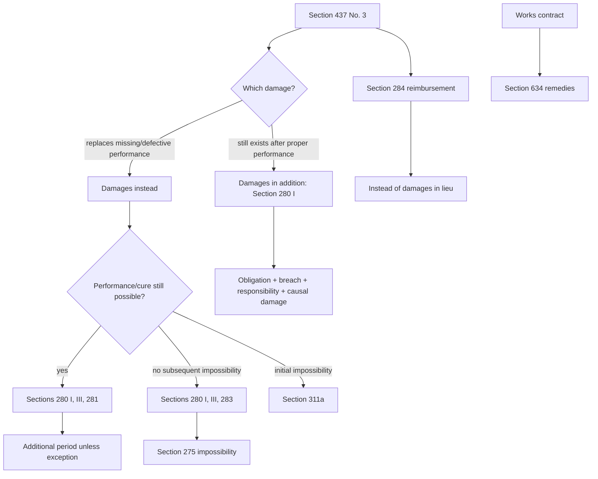
```mermaid
flowchart TD
    Gateway[Section 437 No. 3] --> DamageType{Which damage?}
    DamageType -->|still exists after proper performance| AddPerf[Damages in addition: Section 280 I]
    DamageType -->|replaces missing/defective performance| Instead[Damages instead]
    Instead --> CurePossible{Performance/cure still possible?}
    CurePossible -->|yes| S281[Sections 280 I, III, 281]
    CurePossible -->|no subsequent impossibility| S283[Sections 280 I, III, 283]
    CurePossible -->|initial impossibility| S311a[Section 311a]
    AddPerf --> Elements[Obligation + breach + responsibility + causal damage]
    S281 --> Period[Additional period unless exception]
    S283 --> Impossibility[Section 275 impossibility]
    Gateway --> Reimb[Section 284 reimbursement]
    Reimb --> EitherOr[Instead of damages in lieu]
    Work[Works contract] --> S634[Section 634 remedies]
```

## Subject Knowledge Graph

| Node | Meaning | Exam Relevance |
|---|---|---|
| Damages In Addition | Loss remains even if performance is later correct. | Usually Section 280 I BGB. |
| Damages Instead | Loss replaces missing/defective performance. | Needs Section 281, 283, or 311a route. |
| Hypothetical-Performance Test | Would damage remain if proper performance were rendered? | Main classification tool. |
| Section 280 I Elements | Obligation, breach, responsibility, causal damage. | Basic damages skeleton. |
| Responsibility | Intent/negligence, guarantee, attributed helper fault. | Seller can escape only if not responsible. |
| Damage | Involuntary loss measured by difference hypothesis. | Defines compensation target. |
| Small Damages | Buyer keeps defective item and claims value difference. | Similar to reduction. |
| Big Damages | Buyer gives up whole performance and claims non-fulfilment. | Similar to revocation. |
| Section 284 Reimbursement | Futile expenses instead of damages in lieu. | Do not mix with damage prevention costs. |
| Work-Contract Warranty | Section 634 remedy system. | Identify contract type. |

| From | Relationship | To | Why It Matters |
|---|---|---|---|
| Section 437 No. 3 | routes to | Sections 280 et seq. | Warranty damages use general damages law. |
| Hypothetical-Performance Test | classifies | Damages In Addition / Damages Instead | Prevents wrong statutory route. |
| Section 281 | requires | Additional Period | Cure priority continues in damages. |
| Section 283 | depends on | Impossibility | No period for impossible performance. |
| Section 284 | replaces | Damages In Lieu | Either/or relationship. |
| Work-Contract Warranty | adds | Self-Help | Purchase law does not have the same self-help remedy. |

## Real Business Examples

- Defective fuel damages an engine: engine repair is damages in addition to performance.
- Faulty delivered machine can be repaired, but buyer wants reduced market value: damages instead of performance under Section 281.
- Custom-built software project is accepted and then defects appear: work-contract warranty law may be relevant, not purchase law.
- Buyer registers and transports a car in reliance on proper delivery, but the seller fails to deliver conforming performance: reimbursement of futile expenses may be considered.

## Exam Relevance

Likely prompts:

- Distinguish damages in addition to performance and damages instead of performance.
- State the elements of Section 280 I BGB.
- Explain responsibility and Section 278 BGB helper attribution.
- Classify a loss using the hypothetical-performance test.
- Choose between Section 281 and Section 283.
- Explain small versus big damages.
- Distinguish damages from reimbursement of futile expenses.
- Identify warranty remedies in work contracts.

Common traps:

- Calling every loss "damages instead" because the good was defective.
- Forgetting the additional period under Section 281.
- Ignoring impossibility and using Section 281 even when cure is impossible.
- Treating voluntary expenses as damage instead of Section 284 reimbursement.
- Applying purchase warranty sections to a work contract without checking contract type.

High-scoring answer structure:

1. Start with Section 437 No. 3 if the case is a defective purchase item.
2. Classify the loss with the hypothetical-performance test.
3. State the correct route: Section 280 I, Section 281, Section 283, Section 311a, or Section 284.
4. Check Section 280 I elements.
5. Add route-specific requirements, especially additional period or impossibility.
6. State the legal consequence and business meaning.

## Official Exercise Case Routes

The exercise deck uses one kitchen-machine fact pattern to train remedy selection across four subquestions.

### Case 1a: Revocation For Missing Professional Equipment

Question: did C revoke the purchase contract?

Route:

1. Legal basis: Sections 437 No. 2 Alt. 1, 323, and 346 BGB because the facts point to a defect.
2. Purchase agreement: C and T agree on the kitchen machine "Helping Elf" with additional integrated professional equipment for EUR 1,000.
3. Defect: the integrated professional equipment is part of the machine's agreed quality under Section 434 II 1 No. 1 BGB, not merely an accessory.
4. Transfer of risk: the equipment had to be built in from the beginning, so the defect existed at delivery.
5. Additional period: C did not set one, but it is dispensable under Section 440 BGB because T refused both kinds of cure by saying retrofitting is impossible and he will do nothing.
6. Declaration: C demanded cure, not revocation. No revocation declaration under Section 349 BGB has yet been made.
7. Exclusions: not trivial under Section 323 V 2 BGB because the professional equipment was specially agreed and necessary for C's demanding baking use; no responsibility of buyer under Section 323 VI BGB.

Result: C has a right to revoke, but still needs a revocation declaration.

Exam trap: a right to revoke and an exercised revocation are different.

### Case 1b: Reduction Calculation

Question: did C reduce the purchase price and how much can she demand back?

Route:

1. Reduction under Sections 437 No. 2 Alt. 2 and 441 BGB requires a right to revoke; Case 1a supplies it.
2. Declaration: C demands a refund for the money paid too much, which can be a reduction declaration under Section 441 I BGB.
3. Formula under Section 441 III BGB:

```text
reduced price = value with defect * agreed price / value without defect
reduced price = EUR 600 * EUR 1,000 / EUR 800 = EUR 750
refund = EUR 1,000 - EUR 750 = EUR 250
```

Result: C effectively reduces the price to EUR 750 and can demand EUR 250 back under Section 441 IV BGB.

Exam trap: reduction is proportional value math, not automatically the repair cost or the subjective disappointment.

### Case 1c: Fire Damage To Kitchen Cabinets

Question: can C demand EUR 20,000 for the burned cabinets?

Route:

1. Legal basis: Sections 437 No. 3 Alt. 1 and 280 I BGB. The damage to cabinets would remain even if T later delivered a proper machine, so it is damages in addition to performance.
2. Contractual obligation: purchase agreement.
3. Breach: T had to deliver a defect-free machine and had to perform cure properly; the replacement machine had a dangerous electronics defect.
4. Defect at transfer of risk: the electronics problem existed at delivery of the replacement machine.
5. Responsibility: presumed under Section 280 I 2 BGB; negligence is clear because T knew of the recall campaign and mixed up the machines.
6. Causal damage: the electronics defect caused the fire and destroyed cabinets worth EUR 20,000.
7. Legal consequence: restitution in kind or money compensation under Section 249 BGB; C wants the value.

Result: C can claim EUR 20,000 as damages in addition to performance.

Exam trap: damage to other property caused by the defective thing is not cured by later proper performance, so route it as damages in addition.

### Case 1d: Personalized Cover As Futile Expense

Question: can C claim EUR 30 for the personalized cover?

Route:

1. Legal basis: Sections 437 No. 3 Alt. 2 and 284 BGB, in place of damages in lieu of performance.
2. Damages-instead route must be available: purchase agreement, defective second machine, reasonable two-week period for new cure, no response by T, and responsibility.
3. Futile expense: C voluntarily spent EUR 30 on a personalized cover in reliance on receiving usable performance.
4. Fairness: the expense was reasonable for a EUR 1,000 kitchen machine.
5. No exception: the purpose of the expense would have been achieved if T had performed properly.

Result: C can claim reimbursement of EUR 30 under Sections 437 No. 3 Alt. 2 and 284 BGB.

Exam trap: Section 284 is not "any cost refund"; it substitutes for damages in lieu and requires reliance on proper performance.

## Retrieval Prompts

Closed-book questions:

1. What is the hypothetical-performance test?
2. What are the four elements of Section 280 I BGB?
3. When do you use Section 281 instead of Section 283?
4. What does Section 278 BGB do?
5. What is the difference between damage and futile expense?
6. Which additional remedy appears in work-contract warranty law?

Application prompts:

1. Defective fuel destroys a car engine. Classify engine repair and fuel-price claim separately.
2. Buyer keeps defective machinery and claims the value difference. Is this small or big damages?
3. Seller cannot cure because the specific sold object was destroyed before transfer of risk. Which route is likely?
4. Buyer paid vehicle registration costs in reliance on delivery. Damages or reimbursement?
5. A contractor's work is accepted, then defects appear. Which warranty gateway do you open?

## Practice Tasks

1. Build a two-column table for Section 280 I, Section 281, Section 283, Section 284, and Section 634.
2. Write a 12-line answer to the gas station case.
3. Invent one example of damages in addition and one example of damages instead.
4. Explain why Section 284 is not just "damages with another name."
5. Compare purchase-contract cure with work-contract cure in three sentences.

## Connections

Previous notes:

- [Week 08 Warranty Rights I](../week-08-warranty-rights-i/week-08-warranty-rights-i.md): gateway, defect, transfer of risk, cure, revocation, reduction.
- [Week 05 Contract Law III](../week-05-contract-law-iii-withdrawal-cancellation-dissolution/week-05-contract-law-iii-withdrawal-cancellation-dissolution.md): revocation and restitution background.
- [Week 06 Standard Business Terms](../week-06-standard-business-terms/week-06-standard-business-terms.md): exclusions and liability limitations can be controlled by SBT rules.

Future notes:

- [Week 10 Transfer of Property](../week-10-transfer-of-property/week-10-transfer-of-property.md): separates contract duties from ownership transfer.

Cross-course links:

- Finance: damages and reimbursement both translate legal breaches into monetary consequences, but the legal route determines whether the money can be claimed.

## Weakness Flags

- Pending active recall: no first-pass retrieval has been completed yet.
- High-risk issue: damages in addition versus damages instead.
- High-risk issue: Section 281 additional period.
- High-risk issue: purchase warranty versus work-contract warranty.


<div class="page-break"></div>

# [W09.2] Week 09 Warranty Rights II Cheatsheet And Tricks

<p class="source-path">Source: <code>business-law/wiki/week-09-warranty-rights-ii/week-09-warranty-rights-ii-cheatsheet-and-tricks.md</code></p>

Course: Business Law
Exam date: 2026-07-28
Source: week-09-warranty-rights-ii.md, clarification-session-2026-07-12.md

Warranty Rights II is the money-claim extension of Warranty Rights I: once Section 437 BGB opens the gateway, this week routes the buyer's claim into damages or reimbursement rather than cure/revocation/reduction themselves.

## Must-Know (exam-critical)

| Concept | Anchor | Core rule |
|---|---|---|
| Hypothetical-performance test | — | Would the loss still exist if the seller had performed correctly at the latest possible time? Yes → damages in addition. No → damages instead. |
| Damages in addition to performance | Sections 437 No. 3, 280 I BGB | Loss survives even correct later performance (e.g. consequential damage to other property). |
| Damages instead of performance, curable case | Sections 437 No. 3, 280 I, III, 281 BGB | Non/malperformance that could still be cured; needs a reasonable additional period unless dispensable (281 II BGB, or 440 BGB in purchase cases). |
| Damages instead of performance, impossibility | Sections 437 No. 3, 280 I, III, 283 BGB | Performance became impossible after contract conclusion; no additional period needed. |
| Initial impossibility | Section 311a BGB | Performance was already impossible at contract conclusion. |
| Section 280 I elements | Section 280 I BGB | (1) obligation, (2) breach of duty, (3) responsibility (presumed, seller must disprove), (4) causal damage. |
| Responsibility | Section 276 BGB (intent/negligence), Section 278 BGB (helper fault attributed) | Guarantee assumption triggers strict liability with no fault needed; tacit guarantee has a high threshold. |
| Small damages | Sections 437 No. 3, 280 I, III, 281 BGB | Buyer keeps the defective item, claims the value deficit as damages; requires seller responsibility. |
| Big damages | Sections 437 No. 3, 280 I, III, 281 BGB | Buyer gives up the defective performance, claims the non-fulfilment loss (e.g. substitute-purchase extra cost); requires seller responsibility. |
| Section 284 reimbursement | Section 284 BGB | Futile-expense reimbursement instead of damages in lieu of performance; either/or with damages instead of performance. |
| Work-contract warranty | Section 634 BGB referral, Section 640 acceptance as the decisive timing point | Parallel but not identical structure to purchase law; adds self-help (Section 637 BGB). |

## Nice-to-Have (depth/edge cases)

- Secondary-duty damages under Sections 280 I, III, 282 BGB: applies when a breach of a Section 241 II duty (not the main performance) destroys the base of trust and makes further performance unacceptable — the deck's drunk-craftsman example splits floor damage (in addition) from the cost of a replacement craftsman (instead of, via 282).
- Damage categories: material (Sections 249 ff.), immaterial (Section 253, only if statute allows), lost profit (Section 252).
- Difference hypothesis: damage = hypothetical situation without the damaging event minus the actual situation.
- Exclusions from Section 281 damages instead of the entire performance: partial performance still useful (281 I 2) and insignificant defective performance (281 I 3).
- Section 284 requirements beyond "spent money": expense was in the buyer's own interest, made in reliance on proper performance, reasonable, and would have been recouped had performance been proper. Excludes expenses to avert damage, grossly disproportionate expenses, expenses made when non-performance was already foreseeable, or expenses that would not have been recouped for unrelated reasons.
- Gas-station fact pattern: wrong-octane fuel — engine damage is damages in addition (would remain even after correct fuel is later supplied); the fuel price itself is damages instead (curable by conforming fuel), so one fact pattern can split into two separate routes.

## Nuances And Traps

| Nuance/Trap | Why it's easy to get wrong | Correct handling |
|---|---|---|
| Treating Week 09 as "the details of revocation/reduction" | The clarification session flags this as a recorded confusion — Warranty II is not a deep dive into revocation/reduction mechanics, those belong to Warranty I / Section 437 No. 2. | State plainly: Week 09 routes money claims — damages in addition, damages instead, and Section 284 reimbursement — as separate branches off the same Section 437 gateway. |
| Confusing small damages with reduction | Both leave the buyer holding the defective item and receiving money, so the economic result looks identical. | Ask whether the buyer is claiming compensation for a loss (needs seller responsibility, Sections 280 I, III, 281) or adjusting the price with no fault requirement (Sections 437 No. 2, 441). Reduction is proportional value math (`reduced price = value with defect × agreed price / value without defect`), not damages. |
| Confusing big damages with revocation | Both end with the buyer giving up the defective performance. | Ask whether the buyer wants compensation for non-fulfilment loss (needs responsibility, e.g. substitute-purchase extra cost) or simply wants to unwind the contract and get the purchase price back with no fault requirement (Sections 437 No. 2, 323, 346 ff.). |
| Ignoring seller responsibility for damages claims | Reduction and revocation do not require fault, which makes it tempting to skip the fault check for damages too. | Damages (small, big, in addition, instead) always run through Section 280 I and require responsibility, presumed under 280 I 2 but rebuttable by the seller. Reduction/revocation never need this check. |
| Calling every loss from a defective item "damages instead" | The word "defective" pulls attention to the instead-of-performance route by default. | Always run the hypothetical-performance test first — consequential damage to other property (e.g. burned cabinets, damaged engine) survives correct later performance and is damages in addition, not instead. |
| Forgetting the additional period requirement under Section 281 | The Section 437 I gateway summary makes cure sound automatic, but Section 281 has its own procedural step. | Damages instead of performance for a curable defect needs a reasonable additional period that expired without result, unless dispensable under Section 281 II or Section 440 BGB (e.g. seller seriously refuses cure). |
| Using Section 281 when cure is actually impossible | 281 and 283 sit right next to each other and look interchangeable at first glance. | If cure/replacement is genuinely impossible (Section 275), route through Section 283 (no additional period needed), not Section 281. Initial impossibility (already impossible at contract conclusion) goes through Section 311a instead. |
| Treating a voluntary reliance expense as ordinary "damage" | Both feel like money the buyer lost because of the seller's failure. | Only involuntary loss is "damage" under Sections 249 ff. Voluntary spending made in reliance on proper performance (e.g. a personalized cover, registration costs) routes through Section 284 reimbursement instead, and is either/or with damages instead of performance — never claim both for the same expense. |
| Applying purchase warranty sections to a work contract | Purchase and works contracts share similar-looking remedy vocabulary (cure, revocation, reduction, damages). | Identify contract type first. Works contracts run through Section 634 BGB's referral system, add self-help under Section 637 (no purchase-law equivalent), and use acceptance of work (Section 640) as the decisive timing point instead of transfer of risk. |
| Right to revoke vs. an exercised revocation | The exercise case (kitchen-machine 1a) shows a buyer who qualifies for revocation but only ever demanded cure. | Meeting the substantive requirements (defect, dispensable additional period, no exclusion) only creates a right to revoke — the buyer still needs an actual revocation declaration under Section 349 BGB before the contract is unwound. |

## One-Line Recall Drill

```text
hypothetical-performance test = would the loss survive correct later performance?
280 I = obligation + breach + responsibility (presumed) + causal damage
281 = curable non/malperformance + additional period (unless dispensable)
283 = subsequent impossibility, no additional period
311a = initial impossibility
282 = secondary-duty breach destroys base of trust
278 = helper fault attributed to debtor
small damages = keep item + value-deficit compensation + responsibility required
reduction = keep item + price adjustment + no fault required
big damages = give up performance + non-fulfilment compensation + responsibility required
revocation = give up performance + unwind contract + no fault required
284 = futile expense reimbursement, either/or with damages instead
634 = work-contract warranty referral; 640 = acceptance is the timing anchor; 637 = self-help, purchase law has no equivalent
```


<div class="page-break"></div>

# [W09.3] Week 09 Warranty Rights II Practice Questions And Model Answers

<p class="source-path">Source: <code>business-law/wiki/week-09-warranty-rights-ii/week-09-warranty-rights-ii-practice-questions-and-model-answers.md</code></p>

Course: Business Law
Exam date: 2026-07-28
Source: week-09-warranty-rights-ii.md, week-09-warranty-rights-ii-cheatsheet-and-tricks.md
Format note: 24 questions — 8 short-answer/theory, 16 case/legal-opinion (schema-based). Six case questions integrate other weeks: Week 04 Contract Law II (rescission/revocation), Week 05 Contract Law III (withdrawal-versus-warranty routing), Week 08 Warranty Rights I (cure disproportionality; reduction's cure-first gateway), and Week 11 Trade Law (Section 377 HGB notice duty).

## Short-Answer / Theory Questions

### Question 1

Explain reimbursement of futile expenses under Section 284 BGB.

**Model Answer:**
1. Definition: Reimbursement of futile expenses lets a creditor claim back expenses reasonably incurred in reliance on receiving proper performance, instead of claiming damages instead of performance.
2. Statutory anchor: Section 284 BGB.
3. Requirements: (1) the general requirements for damages instead of performance are otherwise met (via Section 280 I, III with 281, 283, or 311a); (2) the expense was made in the creditor's own interest and in reliance on receiving proper performance; (3) the expense was reasonable and would have been recouped through proper performance.
4. Example: a buyer pays vehicle registration costs anticipating delivery of a car the seller never conforms to the contract.
5. Consequence/trap: Section 284 is either/or with damages instead of performance for the same expense, and it excludes expenses incurred once non-performance was already foreseeable, or expenses grossly disproportionate to the value of performance.

### Question 2

Compare damages in addition to performance and damages instead of performance.

**Model Answer:**
Damages in addition to performance trigger when the loss would still exist even if the debtor rendered proper performance at the latest possible moment (e.g. a defective product damages other property), anchored in Sections 437 No. 3, 280 I BGB, leading to a straightforward claim with no additional-period requirement.
Damages instead of performance trigger when proper performance would have removed or avoided the loss (e.g. the defective item itself just needs fixing or replacing), anchored in Sections 437 No. 3, 280 I, III with 281 (curable), 283 (subsequently impossible), or 311a (initially impossible) BGB, and for the 281 route specifically require a reasonable additional period to have expired without result.
Contrast example: defective fuel that both damages an engine (in addition) and itself needs replacing (instead) — one fact pattern, two separate routes.
Exam trap: do not label every loss arising from a defect as "damages instead" merely because the underlying good was defective — always run the hypothetical-performance test first.

### Question 3

Compare small damages and big damages.

**Model Answer:**
Small damages trigger when the buyer keeps the defective item and claims the value deficit as compensation, anchored in Sections 437 No. 3, 280 I, III, 281 BGB, leading to payment of the difference between a defect-free item's value and the defective item's value, conditional on seller responsibility.
Big damages trigger when the buyer gives up the entire defective performance and claims the non-fulfilment loss (e.g. the extra cost of a substitute purchase elsewhere), anchored in the same Sections 437 No. 3, 280 I, III, 281 BGB, but the payment replaces the whole performance rather than closing a value gap.
Contrast example: a EUR 10,000 machine worth EUR 7,000 defective — small damages claims the EUR 3,000 gap while keeping the machine; big damages returns the machine and claims the EUR 2,000 extra cost of a EUR 12,000 replacement bought elsewhere.
Exam trap: both look similar to reduction/revocation because the buyer ends up with money either way, but damages require seller responsibility while reduction and revocation do not.

## Case / Legal-Opinion Questions

### Question 4 (Case)

**Facts:** F sells industrial lubricant to a machine shop M for EUR 500. Due to a mixing error at F's warehouse, the lubricant delivered is corrosive rather than the ordinary type M ordered. F did not notice the mix-up. M's technician uses it in a precision lathe; the lathe's bearings are destroyed, costing EUR 4,000 to repair. M wants F to pay both the EUR 4,000 repair cost and refund the EUR 500 paid for the unusable lubricant. M has not yet asked F for a replacement delivery of correct lubricant.

**Question:** Does M have a claim against F for (a) the EUR 4,000 lathe repair and (b) the EUR 500 lubricant price, and under what legal bases?

**Model Answer:**
I. Claim/issue sentence: M could have a claim against F for damages under Section 437 No. 3 in conjunction with Section 280 I BGB for the lathe repair, and separately under Sections 437 No. 3, 280 I, III, 281 BGB for the lubricant price, if the requirements of these provisions are met.
II. Requirements:
   I. Valid purchase contract (Section 433 BGB).
   II. Defect at transfer of risk (Section 434, 446 BGB).
   III. For the lathe repair: obligation, breach, responsibility, causal damage (Section 280 I elements) — damages in addition.
   IV. For the lubricant price: the same elements plus, for Section 281, a reasonable additional period that expired without result, unless dispensable.
III. Application:
   I. Purchase contract: M and F concluded a purchase contract for lubricant under Section 433 BGB when M ordered and F agreed to supply it for EUR 500.
   II. Defect: Questionable is whether the delivered lubricant was defective. This is supported by the fact that it was corrosive rather than the ordinary type agreed, so it lacked the agreed quality under Section 434 II 1 No. 1 BGB. Consequently, the lubricant was defective at transfer of risk (Section 446 BGB).
   III. Lathe repair — damages in addition: Questionable is whether the EUR 4,000 repair is damages in addition to performance. This is supported by the hypothetical-performance test: even if F delivered conforming lubricant now, the lathe damage would remain. Against this, one could argue the damage flows directly from the defect and should follow the defect's own route. However, consequential damage to other property caused by a defective item is not cured by later proper performance. Responsibility is presumed under Section 280 I 2 BGB and not rebutted, since F's own mixing error caused the wrong delivery. Consequently, the lathe repair is damages in addition to performance under Sections 437 No. 3, 280 I BGB.
   IV. Lubricant price — damages instead: Questionable is whether the EUR 500 lubricant price is damages instead of performance. This is supported by the fact that conforming lubricant could still cure the defect entirely — the defect concerns the lubricant itself, not other property. However, Section 281 additionally requires a reasonable additional period for cure that expired without result, unless dispensable under Section 281 II or Section 440 BGB. The facts show M never demanded cure and F never refused it. Consequently, this requirement is not met on the facts as given.
IV. Interim results: the lathe-repair claim is established (damages in addition); the lubricant-price claim is not yet established because the additional-period requirement under Section 281 has not been satisfied or dispensed with.
V. Final answer: As a result, M can currently claim the EUR 4,000 lathe repair from F as damages in addition to performance under Sections 437 No. 3, 280 I BGB, but cannot yet claim the EUR 500 lubricant price as damages instead of performance unless M first sets F a reasonable additional period for cure (or such a period is dispensable).

### Question 5 (Case)

**Facts:** F sold a used delivery van to bakery B for EUR 12,000. The transmission was defective at handover; a defect-free equivalent van would be worth EUR 12,000, while the van's actual value with the defect is EUR 9,000. B keeps using the van as-is and writes to F: "I am not returning the van, and I want you to compensate me because I effectively overpaid due to the transmission problem — I hold you responsible for not disclosing this."

**Question:** Should B's claim be routed as small damages or as reduction, and what does each route require B to show?

**Model Answer:**
I. Claim/issue sentence: B's claim could be small damages under Sections 437 No. 3, 280 I, III, 281 BGB or reduction under Sections 437 No. 2, 441 BGB, depending on how B's demand is properly classified.
II. Requirements: small damages requires seller responsibility (Section 280 I 2 BGB, presumed but rebuttable) in addition to the warranty gateway; reduction requires no fault, only the warranty gateway and a reduction declaration under Section 441 I BGB.
III. Application: Questionable is whether B's letter is a demand for compensation (damages) or a price adjustment (reduction). This is supported by B's own wording — B explicitly "holds F responsible," asserting fault-based compensation for a loss, not merely adjusting the price to the lower value. Against this, one could argue the economic outcome (keeping the van, receiving EUR 3,000) is identical either way, so the label should not matter. However, the two routes carry different legal requirements: small damages presupposes F's responsibility, which must be checked and could be rebutted if F neither knew nor should have known of the defect, while reduction requires none. Consequently, because B's letter asserts fault, this is small damages, not reduction, and the responsibility requirement must be affirmatively established.
IV. Interim result: the requirements for small damages are met only if F's responsibility for the defect is shown or not rebutted; reduction would apply regardless of fault and yields the same EUR 3,000 figure through the proportional formula.
V. Final answer: As a result, B's demand as framed is small damages instead of performance under Sections 437 No. 3, 280 I, III, 281 BGB for EUR 3,000, conditional on F's responsibility being established or not rebutted; if F disproves responsibility, B would need to fall back on reduction under Sections 437 No. 2, 441 BGB for the same amount, without needing to prove fault.

### Question 6 (Case — integrates Week 09 + Week 04)

**Facts:** P buys a vintage racing bicycle advertised by seller Q as "an original 1985 frame, hand-built by the famous frame-builder Enzo Colnago," paying EUR 8,000. After delivery, P has the bicycle authenticated and learns the frame is a well-made modern replica worth about EUR 1,200. Q genuinely believed the frame was authentic when selling it, relying on paperwork that later turns out to have been forged by an earlier owner in the chain of title. P wants to undo the deal and recover the EUR 8,000.

**Question:** Should P's claim be pursued as rescission for an essential-characteristic mistake under Section 119 II BGB, or through the warranty route? Advise P.

**Model Answer:**
I. Claim/issue sentence: P's claim could be pursued through rescission for an essential-characteristic mistake (Section 119 II BGB) or through the warranty gateway (Section 437 BGB), with revocation under Sections 437 No. 2, 323, 346 BGB as the likely remedy if warranty law applies.
II. Requirements: (I) determine whether the frame's inauthenticity is a formation-stage mistake (119 II) or a transfer-stage material defect (434 II); (II) purchase contract; (III) defect and transfer of risk; (IV) revocation requirements, including Nachfrist and its exclusions; (V) legal consequence.
III. Application: Questionable is whether Q's own mistaken belief about the frame's origin allows reliance on Section 119 II BGB. This is supported by the fact that authorship/origin of a collectible item is exactly the kind of "essential characteristic" Section 119 II covers in the abstract. Against this, one could argue that Section 119 II rescission is a defense available to the party who made the mistaken declaration — here Q, the seller — and does not assist P as buyer; moreover, once a purchased item is delivered and found not to match its agreed quality, that is precisely what warranty law under Section 434 BGB is designed to handle, not a mistake analysis on the buyer's side. However, applying rescission analysis to a delivered good that turns out defective would bypass the tiered warranty-remedy system (cure first) that Section 437 specifically builds in. Consequently, P's route is warranty law, not rescission: the frame's actual authorship differs from the agreed quality (an authentic 1985 hand-built Colnago frame), so it lacks the agreed quality under Section 434 II 1 No. 1 BGB, and the defect existed at transfer of risk (Section 446 BGB) since the frame was never actually authentic. Revocation ordinarily requires a Nachfrist for cure, but cure — turning a replica into an authentic original — is objectively impossible, so the additional period is dispensable. No fault/responsibility is required for revocation under Sections 437 No. 2, 323, 346 BGB.
IV. Interim result: P cannot pursue Section 119 II rescission as buyer; P's route is the Section 437 warranty gateway, and within it, revocation is available without needing to show Q's fault, because cure is objectively impossible.
V. Final answer: As a result, P should be advised to pursue revocation of the purchase contract under Sections 437 No. 2, 323, 346 BGB (Nachfrist dispensable due to impossibility of cure), not rescission under Section 119 II BGB; upon a valid revocation declaration (Section 349 BGB), P returns the bicycle and recovers the EUR 8,000 purchase price under Sections 346 ff. BGB.

### Question 7 (Case)

**Facts:** Interior fit-out company I delivers custom-built cabinetry to office tenant O for EUR 15,000. Several drawer fronts are warped due to a manufacturing defect. O immediately emails I: "This is unacceptable, I don't want you anywhere near my office again — I am buying replacement cabinetry from someone else and will bill you the difference." I is never given a chance to inspect or cure. Two weeks later, O buys replacement cabinetry from another supplier for EUR 17,000 and demands the EUR 2,000 difference from I as damages.

**Question:** Can O successfully claim the EUR 2,000 as big damages instead of performance without first setting I an additional period for cure?

**Model Answer:**
I. Claim/issue sentence: O could have a claim against I for EUR 2,000 in big damages instead of performance under Sections 437 No. 3, 280 I, III, 281 BGB if the requirements, including the additional-period rule, are met.
II. Requirements: (I) valid supply contract, (II) defect at transfer of risk, (III) reasonable additional period for cure that expired without result, or a dispensing exception, (IV) responsibility, (V) causal damage in the amount claimed.
III. Application: Questionable is whether O needed to set I a Nachfrist before buying elsewhere. This is supported by the general rule that damages instead of performance under Section 281 requires exactly that — a reasonable additional period must expire unsuccessfully first, preserving the debtor's chance to cure. Against this, one could argue O's email was so final in tone that it functions as an implicit refusal of cure. However, the dispensability exceptions under Section 281 II BGB require a serious and definitive refusal by the debtor — here it is O, not I, who unilaterally shuts out the opportunity for cure; I never refused. Consequently, O's own refusal to allow cure does not satisfy the exception.
IV. Interim result: the additional-period requirement under Section 281 is not met and not validly dispensed with.
V. Final answer: As a result, O cannot currently claim the EUR 2,000 as damages instead of performance, because O never gave I a reasonable additional period to cure and no recognized exception applies; O would first need to have set (or been excused from setting) such a period.

### Question 8 (Case)

**Facts:** Homeowner H hires contractor K to design and build a custom walk-in wine cellar in H's basement, including all materials and labor, for a lump sum of EUR 40,000. After H formally accepts the finished cellar, H notices the climate-control unit K installed does not maintain the agreed humidity range.

**Question:** Which warranty regime governs H's claim, and what remedies — including any not found in ordinary sale-of-goods warranty law — are available to H?

**Model Answer:**
I. Claim/issue sentence: H could have a claim against K for cure, self-help, reduction, revocation, or damages under the works-contract warranty regime (Section 634 BGB and its referrals) if the requirements are met — not under the ordinary purchase warranty gateway (Section 437 BGB).
II. Requirements: (I) classify the contract type, (II) confirm acceptance of the work (Section 640 BGB) as the relevant timing point, (III) confirm a defect under Section 633 BGB, (IV) select the appropriate Section 634 remedy and its own sub-requirements.
III. Application: Questionable is whether the cellar project is a purchase contract or a works contract. This is supported by the fact that K did not merely deliver a pre-made item but designed and built a bespoke result — a custom wine cellar meeting a specific agreed outcome (the humidity range) — which is the hallmark of a works contract under Section 631 BGB, not a sale under Section 433 BGB. Against this, one could argue materials were also supplied, which sounds sale-like. However, where labor and a specific promised result dominate the transaction, works-contract law under Section 631 BGB and its warranty referral in Section 634 BGB applies. Consequently, this is a works contract. The decisive timing point is acceptance of the work under Section 640 BGB, already satisfied here, and the humidity-control failure means the work lacks the agreed quality under Section 633 BGB. Available remedies under Section 634 BGB are: cure (Section 634 No. 1, 635 BGB, with the contractor — not the customer — choosing the type of cure, unlike purchase law); self-help (Section 634 No. 2, 637 BGB, letting H fix it and bill K, a remedy purchase law does not have); revocation (Section 634 No. 3 with Section 323 BGB); reduction (Section 634 No. 3 with Section 638 BGB); and damages or reimbursement (Section 634 No. 4 with Sections 280 ff. or 284 BGB), following the same damages logic as this week's purchase-law analysis.
IV. Interim result: the works-contract warranty regime applies, and H has the full remedy menu under Section 634 BGB, including self-help, which purchase law does not offer.
V. Final answer: As a result, H should pursue a claim under the works-contract warranty regime (Section 634 BGB), most naturally starting with a demand for cure under Sections 634 No. 1, 635 BGB (with K choosing the method), and escalating to self-help, reduction, revocation, or damages if cure fails.

## Additional Short-Answer / Theory Questions

### Question 9

Explain secondary-duty damages under Section 282 BGB, using the drunk-craftsman fact pattern to illustrate.

**Model Answer:**
1. Definition: Secondary-duty damages under Sections 280 I, III, 282 BGB compensate for damages instead of performance when a breach of a secondary duty (Section 241 II BGB) destroys the trust basis of the contract, making continued performance by that debtor unacceptable to the creditor.
2. Statutory anchor: Sections 280 I, III, 282 BGB, referencing Section 241 II BGB.
3. Requirements: (1) breach of a secondary duty, not the main performance duty; (2) the breach destroys the base of trust; (3) the breach is relevant to the purpose of the contract; (4) weighing of interests makes further performance by that debtor unacceptable.
4. Example: a craftsman properly installs a kitchen but works drunk, smokes, and damages the floor. The floor damage is damages in addition to performance under Sections 280 I, 241 II BGB, since it survives correct later performance; the cost of hiring a new craftsman to finish the job is damages instead of performance under Sections 280 I, III, 282 BGB, because the trust basis for continuing with this particular craftsman is destroyed.
5. Trap: Section 282 is not a catch-all for "the debtor behaved badly" — it specifically requires that the secondary-duty breach be serious enough to undermine confidence in that debtor's ability to properly perform the main duty, not just any incidental misconduct.

### Question 10

Explain when the additional-period (Nachfrist) requirement under Section 281 BGB is dispensable.

**Model Answer:**
1. Definition: Section 281 damages instead of performance ordinarily require a reasonable additional period for cure that expires without result; certain circumstances dispense with this requirement.
2. Statutory anchor: Section 281 II BGB (general dispensability); Section 440 BGB (purchase-law-specific dispensability).
3. Requirements/features: (1) under Section 281 II, dispensable if the debtor seriously and definitively refuses performance, or special circumstances justify immediate damages after weighing both parties' interests; (2) under Section 440 BGB, also dispensable if both cure types fail, are refused, or are unreasonable for the buyer, mirroring revocation-dispensability logic; (3) objective impossibility of the needed cure routes around Section 281 entirely via Sections 275/283.
4. Example: a seller who states "I will never repair or replace this item" makes a serious and definitive refusal that dispenses with the Nachfrist requirement under Section 281 II.
5. Trap: the buyer's own refusal to allow cure does not dispense with the additional-period requirement — only the debtor's own serious refusal or an objective impossibility qualifies (see Question 7 above, where the buyer's own refusal to let the seller cure did not count).

### Question 11

Compare Section 283 BGB and Section 311a BGB damages instead of performance.

**Model Answer (Compare Schema):**

Section 283 damages instead of performance apply when performance becomes impossible after the contract was validly concluded, anchored in Sections 280 I, III, 283 BGB together with Section 275 BGB, and require no additional period since demanding one for genuinely impossible performance would be pointless. Section 311a damages instead of performance apply when performance was already impossible at the moment of contract conclusion, anchored in Section 311a II BGB, and additionally require that the debtor knew or should have known of the initial impossibility. Contrast example: a seller promises to deliver a specific vintage machine that is destroyed by fire the week after the contract is signed — Section 283 applies; if the same machine had already been destroyed the day before the contract was signed and neither party knew, Section 311a governs instead, and additionally asks whether the seller should have known the machine no longer existed. Exam trap: do not default to Section 283 for every "impossible" fact pattern — always fix the exact moment impossibility arose relative to contract conclusion before choosing between Sections 283 and 311a.

### Question 12

Distinguish "damage" from a "futile expense," and state the difference hypothesis.

**Model Answer:**
1. Definition: damage under Sections 249 ff. BGB is an involuntary loss of material or immaterial goods/interests; a futile expense under Section 284 BGB is voluntary spending made in reliance on receiving proper performance.
2. Statutory anchor: Sections 249 ff. BGB (damage); Section 284 BGB (futile expenses).
3. Requirements/features: (1) difference hypothesis formula: damage = hypothetical situation without the damaging event minus the actual situation; (2) damage categories are material (Sections 249 ff.), immaterial (Section 253, only if a statute allows compensation), and lost profit (Section 252); (3) a futile expense is not "damage" in this sense because it was spent voluntarily rather than lost involuntarily, so it needs its own gateway (Section 284) rather than Sections 249 ff.
4. Example: a buyer's engine destroyed by defective fuel is damage (involuntary loss, difference hypothesis applies); a buyer's voluntary vehicle-registration fee paid in reliance on receiving a conforming car is a futile expense (Section 284), not damage.
5. Trap: Section 284 and damages instead of performance are either/or for the same expense — a claimant cannot recover a given outlay as both damages instead of performance and as a Section 284 futile expense.

## Additional Case / Legal-Opinion Questions

### Question 13 (Case)

**Facts:** Print shop P buys a used industrial printer from dealer D for EUR 20,000. The printer's color calibration sensor is defective at handover; a properly calibrated equivalent machine is worth EUR 20,000, while the actual machine with the defect is worth EUR 16,000. P keeps using the printer for black-and-white jobs and writes to D demanding EUR 4,000 "in compensation because you are responsible for selling me a defective machine." D responds that the sensor defect was caused by a manufacturing fault that neither D nor any reasonable dealer performing a standard pre-sale check could have detected.

**Question:** Can P recover the EUR 4,000 as small damages, and what does D's response change?

**Model Answer:**
I. Claim/issue sentence: P could have a claim against D for EUR 4,000 in small damages instead of performance under Sections 437 No. 3, 280 I, III, 281 BGB, if D's responsibility for the defect is established and not rebutted.
II. Requirements: (I) valid purchase contract; (II) defect at transfer of risk; (III) P's demand properly classified as damages, not reduction; (IV) D's responsibility under Section 280 I 2 BGB, presumed but rebuttable; (V) value-deficit amount.
III. Application: the printer sale is a valid purchase contract (Section 433 BGB), and the sensor defect deviates from the agreed/objective quality under Section 434 II BGB, present at handover under Section 446 BGB. P's letter explicitly frames the demand as "compensation because you are responsible," so, as with the fault-based wording seen elsewhere in this set, this is small damages, not reduction. Questionable is whether D can rebut the presumed responsibility under Section 280 I 2 BGB. This is supported by D's factual claim that neither D nor any reasonable dealer performing a standard pre-sale check could have detected the manufacturing-origin defect — this speaks to an absence of negligence under Section 276 BGB. Against this, one could argue dealers bear a general risk for what they sell. However, Section 280 I 2 BGB only presumes responsibility and allows the debtor to disprove intent and negligence, and an undetectable manufacturing defect is exactly the kind of fact that rebuts negligence. Consequently, if D's factual claim is proven, D is not responsible under Section 280 I 2 BGB.
IV. Interim result: the defect and its classification as small damages are established, but D's responsibility — the decisive requirement — is successfully rebutted on the facts given.
V. Final answer: As a result, P cannot recover the EUR 4,000 as small damages because D has rebutted the presumption of responsibility; P would instead need to fall back on reduction under Sections 437 No. 2, 441 BGB, which reaches the same EUR 4,000 figure via the proportional formula without requiring D's fault.

### Question 14 (Case — integrates Week 09 + Week 08)

**Facts:** Bakery B buys a commercial oven from supplier S for EUR 25,000. The oven's door seal is defective at handover, causing heat loss; a defect-free equivalent oven is worth EUR 25,000, the actual oven with the defect is worth EUR 23,000, replacing the entire oven would cost S EUR 25,000, and repairing just the seal would cost S EUR 300. B demands S replace the entire oven. S refuses, offering only to repair the seal; B refuses that offer, sets S no further deadline, and claims EUR 2,000 as small damages.

**Question:** Was S entitled to refuse B's chosen cure type, and does that affect B's damages claim?

**Model Answer:**
I. Claim/issue sentence: whether B can claim EUR 2,000 in small damages depends first on whether S validly refused B's chosen cure type (replacement) under Section 439 IV BGB, and second on whether B's own refusal of the remaining valid cure option (repair) forecloses the damages claim.
II. Requirements: (I) valid purchase contract; (II) defect at transfer of risk; (III) Section 439 IV disproportionality test for the refused cure type; (IV) effect of B's refusal of the remaining cure type on the Section 281 additional-period/dispensability requirement.
III. Application: the oven purchase and seal defect at handover are established (Sections 433, 434, 446 BGB). Questionable is whether S could refuse replacement under Section 439 IV BGB. This is supported by the stark cost gap: replacement costs S EUR 25,000 against a EUR 300 repair that fully resolves the defect — precisely the gross disproportion Section 439 IV lets the seller avoid, weighing defect-free value, defect significance, and whether the other cure type works without substantial disadvantage to B. Against this, one could argue B has an unqualified right to choose between the two cure types under Section 439 I BGB. However, Section 439 IV specifically limits that choice where one type is disproportionately expensive and the other remains fully effective and reasonable for the buyer — here repair fully eliminates the heat-loss defect. Consequently, S validly refused only the replacement type, not cure as such, and B remained restricted to repair. Because B then refused the very cure type S was entitled to insist on, and set no further deadline, the Section 281 additional-period requirement is not satisfied; B's own refusal is not a dispensing "serious and definitive refusal" by the debtor S under Section 281 II, since S never refused cure altogether, only the disproportionate type.
IV. Interim result: S validly limited B to the repair option under Section 439 IV BGB; B's refusal of that valid cure option, without setting a further deadline, means the Section 281 additional-period requirement remains unmet.
V. Final answer: As a result, S was entitled to refuse replacement but not repair, and B cannot currently claim the EUR 2,000 as small damages because B refused the cure option S was entitled to offer instead of setting S a deadline for it; B would first need to give S a reasonable opportunity to repair the seal.

### Question 15 (Case — integrates Week 09 + Week 11)

**Facts:** Wholesaler W (a merchant) sells 500 packaged industrial gaskets to manufacturer M (also a merchant) for EUR 10,000, a mutual commercial purchase. An employee of M signs for the delivery, but the shipment sits unopened in M's warehouse for three weeks due to a production slowdown. When finally opened, 200 gaskets are the wrong diameter — a defect that would have been visible on a routine visual count-and-sample check. M immediately notifies W and claims EUR 4,000 in small damages for the value deficit of the wrong-diameter gaskets.

**Question:** Can M successfully pursue the EUR 4,000 small-damages claim against W?

**Model Answer:**
I. Claim/issue sentence: M's EUR 4,000 small-damages claim under Sections 437 No. 3, 280 I, III, 281 BGB is only viable if M first cleared the Section 377 HGB inspection-and-notice gateway that precedes any Section 437 BGB warranty claim in a mutual commercial purchase.
II. Requirements: (I) mutual commercial purchase between merchants (Section 343 HGB); (II) prompt inspection and notice of defects under Section 377 HGB; (III) if that gateway is cleared, the ordinary Section 437/280 ff. small-damages requirements.
III. Application: W and M are both merchants and the gasket sale is a mutual commercial purchase under Section 343 HGB, so Section 377 HGB applies before Section 437 BGB is reached. Questionable is whether M's three-week delay in opening the shipment satisfies the "promptly" requirement of Section 377 HGB. This is supported by the fact that the wrong diameter was discoverable on a routine visual count-and-sample check — exactly the ordinary-course inspection Section 377 HGB expects a merchant buyer to perform without delay. Against this, one could argue M's production slowdown is a legitimate business reason for the delay. However, Section 377 HGB ties the inspection duty to the ordinary course of business, not the buyer's own scheduling convenience, and the employee's receipt of the goods is attributed to M under Section 278 BGB regardless of who within M's organization caused the delay. Consequently, a three-week delay in opening and inspecting a routinely checkable delivery is not prompt, and the gaskets are deemed approved under Section 377 HGB.
IV. Interim result: M failed to satisfy the Section 377 HGB inspection-and-notice duty, so the goods are deemed approved.
V. Final answer: As a result, M cannot pursue the EUR 4,000 small-damages claim, or any Section 437 BGB warranty remedy, against W, because the goods are deemed approved under Section 377 HGB for M's failure to inspect and notify promptly — this bars the claim regardless of how genuine the diameter defect actually was.

### Question 16 (Case)

**Facts:** Gallery G contracts to sell art dealer A a specific antique sculpture for EUR 50,000, to be delivered next month after G completes a scheduled restoration. Before delivery, the restoration workshop suffers a fire and the unique sculpture is destroyed. G had no direct involvement in the fire, but the workshop's faulty wiring — which G had been warned about twice by the workshop's own inspector and failed to have fixed — caused the blaze. A demands EUR 50,000 as damages instead of performance without ever setting G a deadline for delivery.

**Question:** Does A need to set a deadline, and is G responsible for the destruction?

**Model Answer:**
I. Claim/issue sentence: A's claim is for damages instead of performance due to subsequent impossibility under Sections 280 I, III, 283 BGB, which does not require a deadline but does require G's responsibility for the impossibility.
II. Requirements: (I) valid contract for the specific sculpture; (II) performance became impossible after conclusion (Section 275 I BGB); (III) no additional period needed for the Section 283 route; (IV) responsibility for the impossibility (Section 276 BGB, presumed under Section 280 I 2 but rebuttable).
III. Application: G and A concluded a valid contract for a specific, non-fungible sculpture. Performance became genuinely impossible under Section 275 I BGB once the unique sculpture was destroyed by fire before delivery. Questionable is whether A must first set G a deadline. This is supported by the general rule that Section 283, unlike Section 281, applies to subsequently impossible performance precisely because a deadline would be pointless — no amount of additional time restores a destroyed unique object. Consequently, no deadline is required. Questionable is whether G is responsible for the fire. This is supported by the fact that G was twice warned about the faulty wiring by the workshop's own inspector and failed to have it fixed — a clear failure to exercise the care of a reasonable party under Section 276 BGB. Against this, one could argue G did not personally start the fire and did not control the workshop's premises. However, the standard is not who lit the match but whether G's own failure to act on a known, specific risk contributed negligently to the loss, and ignoring two direct warnings about faulty wiring is exactly that kind of negligent omission. Consequently, G is responsible for the impossibility.
IV. Interim result: performance is subsequently impossible, no deadline is required under Section 283, and G's responsibility is established through negligent disregard of known warnings.
V. Final answer: As a result, A does not need to set G a deadline and can claim the EUR 50,000 as damages instead of performance under Sections 280 I, III, 283 BGB, because G is responsible for the impossibility.

### Question 17 (Case)

**Facts:** Restaurant owner R buys a custom-built pizza oven from manufacturer P for EUR 18,000, to be installed by a specific date so R can open a new location. In reliance on timely delivery, R pays EUR 1,500 to a contractor to build a reinforced platform for the oven and pays EUR 500 for a permit specific to that oven model. P never delivers; after a reasonable additional period passes without result, R cancels and buys a comparable oven elsewhere. The platform remains usable for the substitute oven, but the EUR 500 permit was specific to P's oven model and is now worthless.

**Question:** Can R recover the EUR 500 permit fee, and what about the EUR 1,500 platform cost?

**Model Answer:**
I. Claim/issue sentence: R may recover the EUR 500 permit fee as reimbursement of a futile expense under Section 284 BGB, while the EUR 1,500 platform cost is not futile and falls outside Section 284's reach.
II. Requirements: (I) the requirements for damages instead of performance are otherwise met; (II) the expense was made in R's own interest and in reliance on proper performance; (III) the expense was reasonable; (IV) the expense would have been recouped through proper performance.
III. Application: the requirements for damages instead of performance are met in the background — P failed to deliver by the deadline, a reasonable additional period expired without result, and P's non-delivery is presumptively its responsibility under Section 280 I 2 BGB, not rebutted on the facts. Questionable is whether the EUR 500 permit fee qualifies as a futile expense under Section 284 BGB. This is supported by the fact that R paid it in reliance on receiving P's specific oven, it was a reasonable step given the planned installation, and it would have been recouped had P delivered as promised — but because the permit is specific to P's oven model, it is now worthless following P's non-performance, satisfying the futility element. Questionable is whether the EUR 1,500 platform cost is also futile. This is supported by the fact that it, too, was spent in reliance on the contract. Against this, one could argue both expenses should be treated identically since both preceded the same broken promise. However, Section 284 requires that the expense have failed to achieve its purpose — the platform remains usable for the substitute oven R ultimately bought, so its purpose was still achieved. Consequently, only the permit fee lost its value because of the non-performance.
IV. Interim result: the EUR 500 permit fee satisfies all Section 284 requirements and is a futile expense; the EUR 1,500 platform cost served its purpose regardless of P's breach and is not futile.
V. Final answer: As a result, R can recover the EUR 500 permit fee from P under Section 284 BGB as reimbursement of a futile expense, but cannot recover the EUR 1,500 platform cost, since that expense was not rendered futile by P's non-performance.

### Question 18 (Case — integrates Week 09 + Week 08)

**Facts:** Furniture retailer F sells a designer sofa to buyer C for EUR 6,000. The sofa's fabric has a dye-batch defect visible on close inspection; a defect-free sofa of the same design is worth EUR 6,000, the actual sofa is worth EUR 4,800. Without first asking F for repair or a replacement sofa, C writes: "I'm keeping the sofa but I am reducing what I owe you — please refund the difference; I'm not blaming you for it, these things happen with dye batches." F had already delivered and been paid in full.

**Question:** Is C's demand governed by reduction or small damages, and does C need to have given F a chance to cure first?

**Model Answer:**
I. Claim/issue sentence: C's demand, as framed, is reduction under Sections 437 No. 2, 441 BGB, not small damages under Sections 437 No. 3, 280 I, III, 281 BGB, and the two routes differ on whether a prior cure opportunity is required.
II. Requirements: (I) valid purchase contract; (II) defect at transfer of risk; (III) proper classification of C's demand; (IV) for reduction, a right to revoke as the gateway condition, itself requiring the ordinary cure-first sequence unless dispensable; (V) reduction formula.
III. Application: the sofa purchase and dye-batch defect at handover are established (Sections 433, 434 II, 446 BGB). Questionable is whether C's letter is reduction or small damages. This is supported by C's own wording — C explicitly disclaims blame ("I'm not blaming you... these things happen"), the opposite framing from a fault-based compensation demand, and asks only for a price adjustment to the lower value. Against this, one could argue the economic outcome (keep sofa, get EUR 1,200) looks identical to small damages. However, as with the small-damages-versus-reduction test used elsewhere in this set, the legal route turns on whether the buyer is asserting fault-based compensation or a no-fault price adjustment, and C's language signals the latter. Consequently, this is reduction, not small damages. Questionable is whether C needed to give F a chance to cure first. This is supported by the rule, carried over from Warranty Rights I, that reduction requires a right to revoke as its gateway (Sections 437 No. 2, 441 I BGB reference the same preconditions as revocation), which ordinarily requires cure to have first failed, been refused, or been dispensable — C never asked F for repair or replacement and points to no dispensing circumstance. However, unlike a damages claim, reduction does not additionally require fault, so once the cure-first gateway is satisfied reduction follows automatically from the value gap. Consequently, C's demand is correctly classified as reduction, but the cure-first gateway it depends on is not yet shown to be satisfied.
IV. Interim result: the demand is reduction, not small damages, but the cure-first gateway underlying the right to reduce has not yet been shown to be satisfied or dispensable.
V. Final answer: As a result, C's demand should be routed as reduction under Sections 437 No. 2, 441 BGB, using the formula `reduced price = agreed price × actual value / defect-free value` = EUR 6,000 × EUR 4,800 / EUR 6,000 = EUR 4,800, yielding a refund of EUR 1,200 — but only once C is shown to have first given F a genuine opportunity to cure (or such an opportunity is dispensable), since reduction's gateway requires the same cure-first sequence as revocation even though reduction itself needs no fault.

## Further Short-Answer / Theory Questions

### Question 19

Explain how a seller's guarantee under Section 443 BGB changes the responsibility analysis for damages claims under Section 280 I BGB.

**Model Answer:**
1. Definition: A guarantee (Garantie) under Section 443 BGB is a voluntary additional promise by the seller (or manufacturer) that the item has certain qualities or will retain them, layered on top of statutory warranty rights; once a genuine guarantee is given, the responsibility standard under Section 276 I BGB can be stricter than ordinary intent/negligence, so the guarantor answers for the guaranteed outcome without needing separate proof of fault.
2. Statutory anchor: Section 443 BGB (guarantee); Section 276 I BGB (permits an assumed, stricter standard of responsibility); Sections 437 No. 3, 280 I BGB (the damages claim itself).
3. Requirements/features: (1) a genuine guarantee must first be identified — express guarantees are straightforward, but a tacit (implied) guarantee is possible only where the seller's conduct or statements clearly go beyond ordinary sales talk, and course materials flag this threshold as high; (2) once a guarantee is established, the responsibility element of Section 280 I BGB is satisfied by the guaranteed quality simply being absent — the seller cannot rebut responsibility by showing an absence of fault, unlike the ordinary Section 280 I 2 presumption; (3) Section 444 BGB reinforces this by blocking any warranty-exclusion clause where a guarantee was given.
4. Example: a seller who advertises a used generator as "guaranteed to run for 500 hours without failure" cannot escape a damages claim by proving they neither knew nor should have known about a hidden manufacturing flaw that caused failure after 100 hours — the guarantee itself, not fault, is the basis of liability.
5. Trap: do not treat every confident sales statement as a guarantee — casual assurances or ordinary advertising puffery do not meet the high threshold for a tacit guarantee, and without a genuine guarantee the seller keeps the ordinary chance to rebut the Section 280 I 2 responsibility presumption.

## Further Case / Legal-Opinion Questions

### Question 20 (Case)

**Facts:** Antique dealer A agrees to sell collector C a specific 18th-century clock that A describes from a photograph sent by a consignor. A and C sign the sale contract on 3 March. Unknown to both parties, the clock had already been destroyed in a warehouse fire on 1 March, two days before the contract was signed. C demands damages instead of performance. A protests that C never set a deadline for delivery.

**Question:** Does C need to have set A a deadline, and can C recover damages given that neither party knew about the fire at the time of contracting?

**Model Answer:**
I. Claim/issue sentence: C's claim is for damages instead of performance due to initial impossibility under Section 311a II BGB, which does not require a deadline but does require that A knew or should have known of the impossibility at the time of contracting.
II. Requirements: (I) a contract was concluded for a specific, non-fungible item; (II) performance was already impossible at the moment of conclusion (Section 275 I BGB, tested as of contract conclusion rather than afterward); (III) no additional period is needed for the Section 311a route; (IV) A knew or, applying reasonable care, should have known that the clock no longer existed.
III. Application: A and C concluded a valid contract on 3 March for a specific clock. Questionable is whether Section 283 or Section 311a governs, since both deal with impossibility. This is supported by the fact that the clock was destroyed on 1 March, before the 3 March contract — fixing the moment of impossibility before conclusion routes the case to Section 311a, not Section 283, which only covers impossibility arising after conclusion. Consequently, no deadline is required under either route, since demanding one for a destroyed unique object would be pointless. Questionable is whether A knew or should have known of the fire. This is supported by the fact that A relied solely on a photograph sent by the consignor and never independently verified the clock's continued existence immediately before signing. Against this, one could argue A had no realistic way to learn of a fire that happened only two days earlier in someone else's warehouse. However, Section 311a II BGB specifically asks whether A, applying the care reasonably expected of an antique dealer transacting on a stranger's unverified photograph, should have confirmed the item's continued existence before contracting — the facts as given do not show A made any such basic check. Consequently, A's failure to verify supports a finding that A should have known.
IV. Interim result: the contract-conclusion-versus-impossibility timing places this under Section 311a, dispensing with any deadline requirement; A's failure to verify the clock's existence before contracting supports a finding that A should have known of the impossibility.
V. Final answer: As a result, C does not need to have set A a deadline, and C can claim damages instead of performance under Section 311a II BGB, because the impossibility already existed at contract conclusion and A should have known of it through a basic pre-contract check.

### Question 21 (Case)

**Facts:** Furniture maker M sells and installs a custom wardrobe for buyer K. M subcontracts the installation to an independent carpentry crew, C-Crew, whom M regularly uses for deliveries. During installation, a C-Crew worker carelessly drills through a live electrical cable in K's wall, causing a short circuit that damages K's home entertainment system worth EUR 2,000. M argues M personally did nothing wrong and cannot be held responsible for C-Crew's carelessness.

**Question:** Is M responsible for the EUR 2,000 damage despite not personally causing it?

**Model Answer:**
I. Claim/issue sentence: K could have a claim against M for EUR 2,000 in damages under Sections 280 I, 241 II BGB for breach of a care duty during performance of the installation, with C-Crew's negligence attributed to M under Section 278 BGB, if the requirements are met.
II. Requirements: (I) a valid contract obliging M to install the wardrobe, generating an ancillary duty of care toward K's other property (Section 241 II BGB); (II) breach of that duty; (III) responsibility, including attribution of a performance-assistant's fault under Section 278 BGB; (IV) causal damage that would survive even correct later performance of the wardrobe installation itself.
III. Application: M and K concluded a contract under which M owed proper installation of the wardrobe, carrying an ancillary duty under Section 241 II BGB not to damage K's other property while doing so. Questionable is whether M is responsible for C-Crew's carelessness given that M personally did nothing wrong. This is supported by Section 278 BGB, which attributes the fault of a person the debtor uses to perform their obligation to the debtor as if it were the debtor's own fault — M chose to use C-Crew to carry out the installation M owed to K, so C-Crew acted within the scope of M's own obligation. Against this, one could argue M exercised no direct control over how C-Crew's individual worker handled the drill, so fault should stay with C-Crew alone. However, Section 278 BGB does not require the debtor's own control over the helper's methods — it is enough that the helper was used to perform the debtor's obligation, and installation was squarely within that scope. Consequently, C-Crew's careless drilling is attributed to M as if M had drilled through the cable personally. The cable damage to the entertainment system would remain even if the wardrobe were later installed correctly, since the harm is to separate property rather than the wardrobe itself.
IV. Interim result: C-Crew's negligence is attributed to M under Section 278 BGB, and the entertainment-system damage survives correct later performance of the installation.
V. Final answer: As a result, M is responsible for the EUR 2,000 damage despite not personally causing it, because Section 278 BGB attributes C-Crew's carelessness to M, and K can claim the EUR 2,000 under Sections 280 I, 241 II BGB.

### Question 22 (Case)

**Facts:** Furniture retailer F sells buyer D a dining table for EUR 3,000. On delivery, D notices a single small scratch, about 2cm long, on the underside of the table, invisible unless the table is tipped over — cosmetically and functionally irrelevant to ordinary use. D immediately refuses the table entirely, buys an equivalent table elsewhere for EUR 3,200, and demands the EUR 200 price difference as big damages instead of performance, without ever asking F to touch up the scratch.

**Question:** Can D recover the EUR 200 as big damages instead of performance for the whole contract?

**Model Answer:**
I. Claim/issue sentence: D's claim for EUR 200 as big damages instead of the entire performance under Sections 437 No. 3, 280 I, III, 281 BGB fails if the scratch is an insignificant defect excluded under Section 281 I 3 BGB.
II. Requirements: (I) valid purchase contract; (II) a defect at transfer of risk; (III) the defect must not be insignificant, or Section 281 I 3 BGB bars damages instead of the entire performance; (IV) if not excluded, the ordinary Nachfrist and responsibility requirements.
III. Application: F and D concluded a purchase contract for the table (Section 433 BGB), and the underside scratch is a deviation from the agreed/expected quality under Section 434 II BGB, present at handover. Questionable is whether D can claim big damages for the whole contract given the scratch's minor character. This is supported by Section 281 I 3 BGB, which expressly excludes damages instead of the entire performance where the breach of duty is insignificant — a defect described as a small, cosmetically and functionally irrelevant mark on a surface never seen in ordinary use is exactly the kind of minor deviation this exclusion targets. Against this, one could argue any deviation from the agreed defect-free condition entitles the buyer to full big-damages treatment. However, Section 281 I 3 BGB specifically singles out insignificant defects to prevent buyers from using a trivial flaw to unwind an entire high-value contract, and the scratch here affects neither function nor visible appearance. Consequently, the defect is insignificant, and big damages for the whole contract are excluded regardless of whether D set a deadline.
IV. Interim result: the scratch is an insignificant defect under Section 281 I 3 BGB, which bars big damages instead of the entire performance.
V. Final answer: As a result, D cannot recover the EUR 200 as big damages instead of the entire performance; D would at most be limited to small damages for the value deficit caused specifically by the scratch (subject to F's responsibility) or reduction, not a claim treating the whole delivery as rejected.

### Question 23 (Case)

**Facts:** Boutique owner N buys a designer display cabinet from supplier V for EUR 9,000. The cabinet's glass shelving arrives cracked, a defect V fails to cure after N sets a reasonable deadline. N writes to V: "I no longer want anything to do with this cabinet — please take it back and return my EUR 9,000." N has not bought a replacement elsewhere and states no lost profit or extra cost.

**Question:** Is N's demand big damages instead of performance or revocation, and what does the classification change?

**Model Answer:**
I. Claim/issue sentence: N's demand, as framed, is revocation under Sections 437 No. 2, 323, 346 BGB, not big damages instead of performance under Sections 437 No. 3, 280 I, III, 281 BGB, and the two routes differ on whether V's responsibility must be shown.
II. Requirements: (I) valid purchase contract; (II) defect at transfer of risk; (III) proper classification of N's demand as unwinding (revocation) or loss-compensation (big damages); (IV) for revocation, an expired Nachfrist and no exclusion; for big damages, the same procedural gateway plus V's responsibility.
III. Application: N and V concluded a purchase contract for the cabinet (Section 433 BGB), and the cracked shelving is a material defect under Section 434 II BGB present at handover; V failed to cure after a reasonable deadline set by N, satisfying the Nachfrist requirement common to both routes. Questionable is whether N's letter should be read as revocation or as big damages. This is supported by N's own wording — N asks only to return the cabinet and get the EUR 9,000 back, stating no additional loss such as a substitute-purchase price difference or lost profit; this is a pure request to unwind the exchange, not a demand for compensation of an extra loss. Against this, one could argue any request for "my money back" could be read loosely as a damages demand. However, big damages specifically compensates a non-fulfilment loss beyond the price itself (e.g. a pricier replacement), which N does not claim, while revocation simply reverses the exchange of performances — N's letter matches the latter. Consequently, this is revocation, not big damages.
IV. Interim result: N's demand is properly classified as revocation; the Nachfrist requirement is already satisfied.
V. Final answer: As a result, N can revoke the purchase contract under Sections 437 No. 2, 323, 346 BGB and recover the EUR 9,000 purchase price against return of the cabinet, without needing to show V's responsibility for the defect — had N instead claimed an extra loss beyond the price (e.g. a pricier replacement), that portion would need to be routed as big damages under Sections 437 No. 3, 280 I, III, 281 BGB and would require V's responsibility to be established or not rebutted.

### Question 24 (Case — integrates Week 09 + Week 05)

**Facts:** Consumer P orders a wireless speaker online from retailer Q for EUR 300, a distance contract under Section 312c BGB. Q ships proper withdrawal instructions with the delivery. Twenty days after receiving the speaker, P discovers a manufacturing defect that causes intermittent audio cutouts — a material defect under Section 434 BGB present at handover. P wants to return the speaker and get a full refund with the least hassle.

**Question:** Is P's 14-day consumer withdrawal right still available, and if not, what route remains open, and by when must P act?

**Model Answer:**
I. Claim/issue sentence: P's route to return the speaker and recover the EUR 300 could run through either consumer withdrawal under Sections 312c, 312g, 355 BGB or the warranty gateway under Section 437 BGB, but only one of the two remains available on these facts.
II. Requirements: (I) for withdrawal: distance-contract status, no exclusion under Section 312g II BGB, and the 14-day period (Sections 355 II, 356 II No. 1 BGB) not yet expired; (II) for warranty: valid purchase contract, defect at transfer of risk, no exclusion, and the applicable warranty limitation period (Section 438 I No. 3 BGB, two years) not yet expired.
III. Application: P ordered the speaker from Q, a distance contract under Section 312c BGB. Questionable is whether P can still withdraw. This is supported by the general 14-day withdrawal window under Section 355 II BGB. Against this, the facts state that Q shipped proper withdrawal instructions with the delivery, so the clock started running on receipt of the goods under Section 356 II No. 1 BGB and was not extended under Section 356 III BGB, which only extends the period where instructions were missing or wrong. Since P discovered the defect twenty days after receipt — six days past the 14-day mark — the withdrawal right has already lapsed, and nothing in the facts suggests P withdrew earlier. Consequently, the withdrawal route is closed. Questionable is whether the warranty route remains open. This is supported by the fact that the speaker's intermittent audio cutouts are a material defect under Section 434 BGB present at handover (Section 446 BGB), triggering the Section 437 gateway, and the applicable limitation period for warranty claims on movable goods is two years from delivery under Section 438 I No. 3 BGB — twenty days is far inside that window. Against this, one could argue the online-distance facts should default P to withdrawal since that is a "no questions asked" route. However, where the facts emphasize a defect/performance failure, the performance route leads and withdrawal is only a fallback where its own window is still open — here withdrawal's own 14-day window is independently expired regardless of the defect. Consequently, P must pursue the warranty route.
IV. Interim result: the withdrawal right expired six days before P acted and cannot be revived by the later-discovered defect; the warranty route remains available for nearly two more years.
V. Final answer: As a result, P's 14-day withdrawal right is no longer available, but P can still pursue the warranty route under Section 437 BGB — ordinarily starting with a demand for cure under Section 439 BGB, and escalating to revocation (Sections 437 No. 2, 323, 346 BGB) or reduction (Sections 437 No. 2, 441 BGB) if cure fails or is dispensable — with up to two years from delivery under Section 438 I No. 3 BGB to act.

## Quick Answer Route Summary

| Question # | Primary Route/Section | One-line takeaway |
|---:|---|---|
| 1 | Section 284 BGB | Futile-expense reimbursement is either/or with damages instead of performance. |
| 2 | Sections 280 I vs. 281/283/311a BGB | Hypothetical-performance test decides in addition vs. instead. |
| 3 | Sections 280 I, III, 281 BGB | Small vs. big damages both need seller responsibility; the difference is keep-item vs. give-up-item. |
| 4 | Sections 280 I; 280 I, III, 281 BGB | One defective delivery can split into a damages-in-addition claim and a not-yet-ripe damages-instead claim. |
| 5 | Sections 280 I, III, 281 vs. 441 BGB | Fault-based wording ("I hold you responsible") signals small damages, not reduction. |
| 6 | Section 437 gateway vs. Section 119 II BGB | Buyer cannot use seller's own mistake defensively; defect goes through warranty law, with revocation via impossible-cure dispensability. |
| 7 | Section 281 BGB | Buyer's own refusal to allow cure does not create a 281 II dispensability exception. |
| 8 | Section 634 BGB | Works contracts run a parallel remedy system, including self-help, absent from purchase warranty law. |
| 9 | Section 282 BGB | Secondary-duty breach destroying trust splits into in-addition (direct damage) and instead-of (replacement cost) claims. |
| 10 | Sections 281 II, 440 BGB | Only the seller's own serious refusal or objective impossibility dispenses the Nachfrist, not the buyer's impatience. |
| 11 | Sections 283 vs. 311a BGB | Fix the moment impossibility arose relative to contract conclusion before choosing the route. |
| 12 | Sections 249 ff. vs. 284 BGB | Involuntary loss = damage (difference hypothesis); voluntary reliance spending = futile expense. |
| 13 | Section 280 I 2 BGB | An undetectable manufacturing defect can rebut the responsibility presumption, defeating small damages but not reduction. |
| 14 | Section 439 IV BGB | Seller may refuse only the disproportionate cure type; buyer's refusal of the remaining valid cure type blocks damages. |
| 15 | Section 377 HGB | Merchant buyer's own inspection delay bars the small-damages claim before Section 437 BGB is even reached. |
| 16 | Sections 280 I, III, 283 BGB | No deadline needed for subsequent impossibility; ignoring known wiring warnings establishes responsibility. |
| 17 | Section 284 BGB | Only the expense whose purpose failed (permit) is futile; an expense still useful for a substitute (platform) is not. |
| 18 | Sections 437 No. 2, 441 BGB | Fault-disclaiming language signals reduction, but reduction still needs the same cure-first gateway as revocation. |
| 19 | Section 443 BGB guarantee | A genuine guarantee replaces the fault check — the seller cannot rebut responsibility once a guaranteed quality is missing. |
| 20 | Section 311a II BGB | Impossibility before contract conclusion routes here, not Section 283; no deadline needed, but seller's should-have-known matters. |
| 21 | Sections 280 I, 241 II, 278 BGB | A subcontractor's carelessness during performance is attributed to the debtor who used them. |
| 22 | Section 281 I 3 BGB | An insignificant defect blocks big damages for the whole contract, no matter how firmly the buyer rejects it. |
| 23 | Sections 437 No. 2, 323, 346 vs. 280 I, III, 281 BGB | "Take it back, refund me" with no extra loss claimed is revocation, not big damages. |
| 24 | Sections 355/356 vs. 437/438 I No. 3 BGB | Proper instructions mean the 14-day withdrawal clock runs and can expire before a later-discovered defect is found — the 2-year warranty window survives it. |


<div class="page-break"></div>

# [W10.1] Week 10: Transfer Of Property

<p class="source-path">Source: <code>business-law/wiki/week-10-transfer-of-property/week-10-transfer-of-property.md</code></p>

Source: `business-law/raw/moodle-export-business-law-950848572-s26-20260628/22.06. - Transfer of Property - Haag/Transfer or Property.pdf`
Course: Business Law
Processed: 2026-06-28
Wiki note: `business-law/wiki/week-10-transfer-of-property/week-10-transfer-of-property.md`

Course direction checked against `business-law/wiki/_course-logistics.md`: Transfer of Property is Session 10 in the teaching outline and follows Warranty Rights II.

External statute check: statutory anchors were cross-checked against the official Gesetze-im-Internet BGB source on 2026-06-28. The official English BGB translation warns that translations may lag the current German text; use current German statutory text for exact wording.

## 80/20 Exam Summary

Transfer of Property explains that a purchase contract and ownership transfer are legally separate.

- Ownership and possession are different. A thief can possess a thing without owning it.
- Ownership is the strongest right over a thing; possession is actual control.
- German private law uses the principle of separation: obligation contract and disposition contract are distinct legal transactions.
- German private law also uses the principle of abstraction: invalidity of the purchase contract does not automatically invalidate the property transfer, and vice versa.
- Transfer of movable ownership usually requires agreement, delivery, agreement at delivery, and authorization under Section 929 sentence 1 BGB.
- Delivery is a real act, not a declaration-of-intent contract; agency rules do not apply in the same way.
- Delivery can be replaced by constructive delivery under Section 930 BGB or assignment of the claim for possession under Section 931 BGB.
- A non-owner can sometimes transfer ownership if the acquirer obtains ownership in good faith under Sections 929, 932 BGB.
- No good-faith acquisition is possible for lost or stolen things under Section 935 BGB, with special handling for money.
- Immovables require conveyance and land-register entry under Sections 873, 925 BGB.
- Claims are transferred by assignment under Section 398 BGB, not by delivery.

## Where This Fits

Warranty law asks whether the seller fulfilled the purchase contract properly. Transfer-of-property law asks who owns the thing.

```text
Purchase agreement = obligation to transfer ownership and pay.
Transfer of ownership = separate disposition transaction.
```

This matters because a valid purchase contract alone does not make the buyer owner.

## Clarification Router: Use Cases And Conclusions

Use transfer of property as a router. The first question is not "was there a sale?" but "what kind of right or object is moving?"

```text
1. What is transferred?
   movable thing / land / claim?

2. Is this only the obligation contract, or also the disposition transaction?
   The purchase contract creates duties; it does not itself transfer ownership.

3. If movable:
   test Section 929 BGB:
   agreement
   + delivery or delivery replacement
   + agreement still exists at delivery
   + transferor is owner or authorized

4. If authorization is missing:
   test good-faith acquisition under Sections 932, 935 BGB.

5. Conclude:
   ownership passed / ownership did not pass / acquirer obtained ownership in good faith.
```

### Case 1: Normal Sale Of A Movable

Facts:

```text
S owns a laptop. S sells it to B and hands it over.
```

Check:

```text
Object: movable thing.
Transfer agreement: S and B agree ownership should pass.
Delivery: S hands the laptop to B.
Agreement at delivery: yes.
Authorization: S is owner.
```

Conclusion:

```text
B becomes owner under Section 929 sentence 1 BGB.
```

Do not write "B owns because B bought it." Write that the Section 929 requirements are met.

### Case 2: Purchase Contract But No Delivery Yet

Facts:

```text
S owns a bike. S and B sign a purchase contract today. Delivery is planned for Friday.
```

Check:

```text
Purchase contract: yes.
Delivery: no.
Property transfer: not complete.
```

Conclusion:

```text
B is not owner yet. B only has a claim against S to deliver and transfer ownership.
```

This is the cleanest separation-principle case: contract answers "who must do what?", property law answers "who owns what?"

### Case 3: Buyer Already Possesses The Thing

Facts:

```text
S owns a camera. B borrowed it last week. Today S sells the camera to B and says, "It is yours now."
```

Check:

```text
Object: movable thing.
Transfer agreement: yes.
Physical delivery: unnecessary because B already possesses the camera.
Special route: Section 929 sentence 2 BGB.
Authorization: S is owner.
```

Conclusion:

```text
B becomes owner under Section 929 sentence 2 BGB.
```

### Case 4: Chattel Mortgage / Security Transfer

Facts:

```text
S owns a production machine.
L lends S money.
S transfers ownership of the machine to L as collateral.
S keeps using the machine in the factory.
```

Check:

```text
Object: movable thing.
Transfer agreement: S and L agree ownership should pass to L.
Physical delivery: no.
Delivery replacement: constructive delivery under Section 930 BGB.
Possession relationship: S keeps direct possession for L under the security arrangement.
Authorization: S is owner.
```

Conclusion:

```text
L becomes owner, even though S still physically possesses the machine.
```

Mental model:

```text
S has possession.
L has ownership.
```

This split creates the good-faith purchase risk.

### Case 5: Good-Faith Purchase From A Non-Owner

Facts:

```text
After the chattel mortgage, S sells the same machine to B.
B has no reason to know that L owns it.
S hands the machine to B.
```

Check Section 929 first:

```text
Transfer agreement: S and B agree ownership should pass.
Delivery: S hands the machine to B.
Agreement at delivery: yes.
Authorization: no, because L is owner and L did not consent.
```

Then check good-faith acquisition:

```text
Good faith: B did not know and was not grossly negligently unaware.
Legal appearance: S possessed the machine.
Section 935 block: no, because L voluntarily let S keep possession.
Distinct-party transaction: yes, S and B.
```

Conclusion:

```text
B acquires ownership in good faith under Sections 929, 932 BGB.
L loses ownership.
```

The result does not depend on L consenting to the sale. Good-faith acquisition is a statutory exception. If L voluntarily created the risk by leaving possession with S, the law can protect B's reliance on S's possession.

### Case 6: Stolen Thing

Facts:

```text
T steals O's watch and sells it to B.
B honestly believes T is owner.
```

Check:

```text
Transfer agreement and delivery: yes.
Authorization: no, T is not owner.
Good faith: maybe yes.
Legal appearance: T possesses the watch.
Section 935 block: yes, O lost possession involuntarily.
```

Conclusion:

```text
B does not become owner. O remains owner.
```

Section 935 BGB is the owner-protection limit to good-faith acquisition.

### Case 7: Land

Facts:

```text
S sells land to B.
```

Do not use Section 929 BGB. Land follows the immovable route:

```text
Purchase contract: notarial form, Section 311b BGB.
Ownership transfer: conveyance plus land-register entry, Sections 873 and 925 BGB.
```

Conclusion:

```text
B becomes owner only after the real-property transfer requirements are met, especially land-register entry.
```

### Case 8: Claim

Facts:

```text
A is owed EUR 5,000 by D. A transfers this claim to C.
```

Claims are not physical things, so there is no delivery under Section 929 BGB.

Check:

```text
Object: claim/right.
Transfer route: assignment under Section 398 BGB.
Agreement: assignor A and assignee C agree to transfer the claim.
Debtor participation: D does not need to consent in the basic assignment case.
```

Conclusion:

```text
C becomes the new creditor of D.
```

## Ownership Versus Possession

| Concept | Meaning | Example | Exam use |
|---|---|---|---|
| Ownership | Legal right to control/exclude others regarding a thing. | Owner of a bike. | Ask who has the right. |
| Possession | Actual power over a thing plus will to possess. | Thief holding the bike. | Ask who physically controls it. |

Memory hook:

```text
ownership = legal right
possession = actual control
```

Ownership:

- protected by Article 14 German Basic Law;
- strongest right over a thing;
- includes utilization and exclusion functions;
- can be acquired by transfer or statutory acquisition.

Possession:

- governed by Sections 854 et seq. BGB;
- acquired by actual power;
- legal right to possession is not required for possession itself;
- can be direct, indirect, or fictive possession;
- creates presumptions, especially Section 1006 BGB.

## Principle Of Separation

Execution of a purchase agreement involves at least three transactions:

```text
1. Purchase agreement under Section 433 BGB.
2. Disposition contract transferring ownership of the good.
3. Disposition contract transferring ownership of the money.
```

Bakery example:

```text
Everyday perception: one unitary exchange.
Legal structure: purchase contract + transfer of bread + transfer of money.
```

Exam sentence:

```text
The purchase agreement obliges transfer of ownership, but it does not itself transfer ownership.
```

## Principle Of Abstraction

Abstraction builds on separation.

```text
obligation contract validity and disposition contract validity are independent
```

Consequences:

- invalid purchase contract does not automatically invalidate the ownership transfer;
- invalid transfer does not automatically invalidate the purchase contract;
- reversal may require restitution, especially Sections 985 or 812 I 1 alternative 1 BGB.

Exception: identity of the flaw.

Examples from the deck:

| Facts | Result |
|---|---|
| Mentally ill B concludes purchase and receives transfer. | Both declarations may be invalid under Sections 104 No. 2, 105 I BGB. |
| Deceit/duress under Section 123 I BGB affects both transactions. | Rescission of obligation and disposition contract can be possible. |
| Price typo under Section 119 I BGB affects only purchase price. | Disposition contract may remain valid because transfer agreement does not concern the price. |

Exam trap: do not reverse ownership automatically just because the sales contract is invalid. Ask whether the transfer transaction is also invalid or whether restitution is needed.

## Things And Movables

Section 90 BGB:

```text
Only corporeal objects are things.
```

Important exclusions/clarifications:

- humans are not things;
- animals are not things, but similar rules apply under Section 90a BGB;
- immaterial rights and claims are not things;
- software as data is not a thing, but a physical data carrier can be;
- movables differ from immovables.

## Transfer Of Movables Under Section 929 Sentence 1 BGB

Regular acquisition of a movable:

```text
1. Agreement.
2. Delivery / handover.
3. Agreement at handing over.
4. Authorization.
```

### 1. Agreement

The transfer agreement is a normal contract at the disposition level.

General declaration-of-intent rules apply:

- agency;
- rescission;
- invalidity;
- conditions under Section 158 BGB.

Principle of determination:

```text
an objective third party must be able to identify the concrete object being transferred
```

Examples:

- pointing to a specific machine;
- naming machine #1;
- "all items manufactured in January 2023."

### 2. Delivery

Delivery is a real act and publicity act, not a contract.

Consequences:

- declaration-of-intent rules do not apply directly to delivery;
- no agency under Sections 164 et seq. BGB for the real act itself;
- an agent in possession under Section 855 BGB can matter, such as an employee holding firm goods.

Delivery requirements:

- acquirer obtains possession through the transferor;
- transferor loses possession;
- third parties can objectively discern the transfer.

### 3. Agreement At Handing Over

The agreement must still exist when delivery occurs.

```text
Before delivery, the disposition agreement is freely revocable at the property-law level.
Contractual penalties or damages may exist at the obligation-contract level.
```

### 4. Authorization

In principle, only the owner can transfer ownership.

Possible restrictions:

- insolvency law, especially Section 81 InsO;
- family law restrictions protecting family economic basis.

Authorized non-owner:

- owner consent under Section 185 I BGB;
- statutory power of disposition, such as insolvency administrator under Section 80 I InsO.

Unauthorized non-owner:

- may still transfer ownership through good-faith acquisition.

## Delivery Replacements

| Mode | Anchor | Logic | Example |
|---|---|---|---|
| Acquirer already possesses | Section 929 sentence 2 BGB | Delivery unnecessary. | Buyer already has borrowed item. |
| Constructive delivery | Section 930 BGB | Delivery replaced by possession relationship. | Chattel mortgage; seller remains possessor for buyer. |
| Assignment of claim for possession | Section 931 BGB | Transferor assigns claim against current possessor. | Thing held by a third party. |

## Good-Faith Acquisition Of Movables

Good-faith acquisition solves legal traffic cases where the seller possesses the thing but is not owner.

Requirements under Sections 929 sentence 1, 932 I 1 BGB:

```text
1. All Section 929 sentence 1 requirements except authorization.
2. Good faith of acquirer.
3. Legal appearance due to possession, Section 1006 BGB.
4. Thing not lost or stolen, Section 935 BGB.
5. Legal transaction between two distinct parties.
```

Good faith is defined negatively:

```text
acquirer is not in good faith if aware, or grossly negligently unaware, that the seller is not owner
```

Section 935 BGB:

```text
No good-faith acquisition if the thing was lost, stolen, or otherwise involuntarily lost by the owner.
```

Exam trap: possession creates legal appearance, but Section 935 protects owners who involuntarily lost possession.

## Chattel Mortgage Case

Facts:

```text
S needs EUR 100,000.
L lends money and wants collateral.
S wants to keep machine #1 for production.
S and L agree to transfer ownership of machine #1 as chattel mortgage and conclude a security purpose agreement.
```

Issue:

```text
Who owns machine #1?
```

Analysis:

1. S was initially owner.
2. S and L agreed to transfer ownership of machine #1.
3. No physical delivery occurred.
4. Delivery is replaced by constructive delivery under Sections 929, 930 BGB.
5. The chattel mortgage/security purpose agreement supplies the possession relationship.
6. Agreement persisted and S was authorized as owner.

Conclusion:

```text
S lost ownership to L under Sections 929 sentence 1, 930 BGB, while S kept possession.
```

Business meaning:

```text
S can keep using the machine, but L owns it as collateral.
```

## Good-Faith Purchase Case

Facts:

```text
After transferring ownership to L as collateral, S sells machine #1 to B.
B cannot know the machine is owned by L.
S gives the machine to B, who transports it to his premises.
```

Issue:

```text
Who owns machine #1?
```

Analysis:

1. L was owner.
2. S and B agreed to transfer ownership.
3. Delivery occurred when B received and transported the machine.
4. Agreement persisted until handover.
5. S was not authorized because S was no longer owner and L did not consent.
6. Good-faith acquisition under Sections 929 sentence 1, 932 BGB:
   - B was in good faith under Section 932 II BGB.
   - S's possession created legal appearance under Section 1006 BGB.
   - Machine was not lost or stolen under Section 935 BGB.
   - Legal transaction occurred between two distinct parties.

Conclusion:

```text
B acquires ownership in good faith. L loses ownership to B.
```

## Statutory Acquisition Of Movables

The deck lists statutory acquisition modes:

| Mode | Anchor |
|---|---|
| Acquisition by prescription, 10 years | Section 937 BGB |
| Combination with plot of land | Section 946 BGB |
| Combination with another movable | Section 947 BGB |
| Intermixture / mingling | Section 948 BGB |
| Processing into a new thing | Section 950 BGB |
| Acquisition of products/components | Sections 953 et seq. BGB |
| Acquisition of ownerless movables | Section 958 BGB |

Exam use: mention these only if facts fit. Most exam facts in this deck focus on Section 929 and good-faith acquisition.

## Transfer Of Immovables

Transfer of immovables is stricter.

| Transfer of movables | Transfer of immovables |
|---|---|
| Sections 929 et seq. BGB | Sections 873, 925 BGB |
| Agreement | Agreement / conveyance |
| Delivery | Entry in land register |
| Agreement at delivery | Agreement at entry |
| Authorization or good-faith acquisition | Authorization or good-faith acquisition |

Immovable agreement:

- called conveyance under Section 925 BGB;
- special form: authentication by public notary;
- real property purchase agreement must also be notarized under Section 311b I BGB.

Good faith:

```text
land register creates strong legal appearance;
positive knowledge of incorrectness blocks good-faith acquisition.
```

## Transfer Of Claims

Claims are not corporeal things, so they are not transferred under Section 929 BGB.

Core distinction:

```text
purchase of rights = obligation contract under Section 453 BGB
assignment of claim = disposition under Section 398 BGB
```

Assignment requirements:

1. disposition contract under Section 398 sentence 1 BGB;
2. claim exists;
3. claim is identifiable;
4. claim is transferable.

No debtor participation is required, though notification is advisable.

Important limits:

- no good-faith acquisition of non-existing claims generally;
- future claims may be assigned if identifiable;
- statutory or contractual exclusions can block transferability.

Business examples:

- factoring;
- bank takes salary claim as collateral;
- supplier assigns future purchase-price claims.

## Visual Knowledge Map

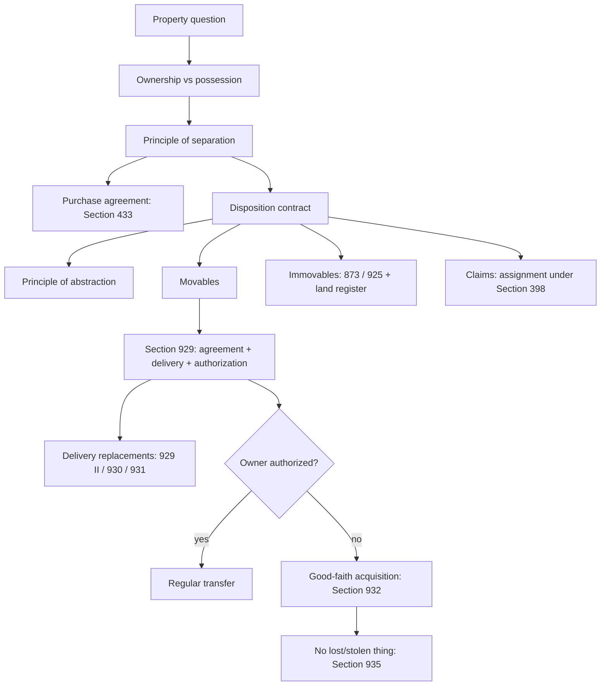
```mermaid
flowchart TD
    Start[Property question] --> OwnPoss[Ownership vs possession]
    OwnPoss --> Separation[Principle of separation]
    Separation --> Obligation[Purchase agreement: Section 433]
    Separation --> Disposition[Disposition contract]
    Disposition --> Abstraction[Principle of abstraction]
    Disposition --> Movables[Movables]
    Movables --> S929[Section 929: agreement + delivery + authorization]
    S929 --> Replacements[Delivery replacements: 929 II / 930 / 931]
    S929 --> Auth{Owner authorized?}
    Auth -->|yes| OwnerTransfer[Regular transfer]
    Auth -->|no| GoodFaith[Good-faith acquisition: Section 932]
    GoodFaith --> S935[No lost/stolen thing: Section 935]
    Disposition --> Immovables[Immovables: 873 / 925 + land register]
    Disposition --> Claims[Claims: assignment under Section 398]
```

## Subject Knowledge Graph

| Node | Meaning | Exam Relevance |
|---|---|---|
| Ownership | Legal right over a thing. | Determines who can transfer. |
| Possession | Actual control over a thing. | Creates legal appearance and transfer starting point. |
| Principle Of Separation | Obligation and disposition contracts are separate. | Purchase contract does not transfer ownership. |
| Principle Of Abstraction | Validity of obligation and disposition are independent. | Invalid sales contract does not automatically undo ownership transfer. |
| Movable Transfer | Agreement, delivery, agreement at delivery, authorization. | Main Section 929 test. |
| Constructive Delivery | Delivery replacement under Section 930 BGB. | Chattel mortgage cases. |
| Good-Faith Acquisition | Ownership transfer from non-owner under strict conditions. | Protects legal traffic. |
| Lost/Stolen Exclusion | Section 935 BGB barrier. | Protects owners who involuntarily lost possession. |
| Immovable Transfer | Conveyance plus land-register entry. | Real property rules. |
| Assignment | Transfer of claims under Section 398 BGB. | Claims are not delivered. |

| From | Relationship | To | Why It Matters |
|---|---|---|---|
| Purchase Agreement | obliges | Transfer Of Ownership | Contract creates duty, not ownership. |
| Principle Of Separation | separates | Obligation / Disposition | Prevents one-step thinking. |
| Principle Of Abstraction | separates validity of | Obligation / Disposition | Reversal needs separate analysis. |
| Possession | creates | Legal Appearance | Basis for good-faith acquisition. |
| Section 935 BGB | blocks | Good-Faith Acquisition | Stolen/lost property protection. |
| Section 930 BGB | replaces | Delivery | Collateral without physical handover. |
| Assignment | transfers | Claim | Different from transfer of things. |

## Real Business Examples

- A company sells machinery but keeps it as collateral through a chattel mortgage.
- A buyer purchases equipment from a possessor who is no longer owner; good-faith acquisition becomes decisive.
- A real property transaction requires notarial steps and land-register entry, not simple handover.
- A supplier sells receivables to a factoring company; the claim is assigned, not physically delivered.

## Exam Relevance

Likely prompts:

- Distinguish ownership and possession.
- Explain separation and abstraction.
- Apply Section 929 sentence 1 BGB.
- Explain when delivery is dispensable or replaced.
- Analyze good-faith acquisition from a non-owner.
- Apply Section 935 BGB to stolen/lost property.
- Compare transfer of movables and immovables.
- Explain assignment of claims under Section 398 BGB.

Common traps:

- Saying the purchase contract transfers ownership.
- Treating possession as ownership.
- Forgetting agreement at the time of delivery.
- Applying agency rules directly to delivery as a real act.
- Allowing good-faith acquisition despite stolen property.
- Forgetting that claims are not things and require assignment.

High-scoring answer structure for movables:

1. Identify initial owner.
2. Test transfer under Section 929 sentence 1 BGB.
3. Check agreement and determination of the object.
4. Check delivery or replacement.
5. Check agreement at delivery.
6. Check authorization.
7. If authorization fails, test good-faith acquisition under Section 932 and Section 935.
8. State who owns the thing.

Clarification checkpoint:

```text
Contract answers: who must do what?
Property law answers: who owns what?
```

If the transferor is a non-owner, do not stop at "no authorization." Continue into the statutory exception: good-faith acquisition under Sections 932 and 935 BGB.

## Retrieval Prompts

Closed-book questions:

1. What is the difference between ownership and possession?
2. What are the principles of separation and abstraction?
3. What are the four requirements of Section 929 sentence 1 BGB?
4. Why is delivery a real act?
5. What does Section 930 BGB replace?
6. What blocks good-faith acquisition under Section 935 BGB?
7. How are claims transferred?

Application prompts:

1. S sells and hands over a bike to B. Build the Section 929 test.
2. S transfers machine ownership to L as collateral but keeps the machine. Which delivery replacement applies?
3. S later sells the same machine to good-faith B. Does B acquire ownership?
4. Thief T sells stolen jewelry to good-faith B. What does Section 935 BGB do?
5. C assigns a future salary claim to a bank. Which requirements matter?

## Practice Tasks

1. Draw the three transactions involved in buying bread with cash.
2. Explain abstraction using a void purchase contract but valid handover.
3. Write a mini-case answer for the chattel mortgage machine case.
4. Write a mini-case answer for good-faith acquisition from S to B.
5. Compare transfer of movables and immovables in a four-row table.

## Connections

Previous notes:

- [Week 03 Contract Law I](../week-03-contract-law-i/week-03-contract-law-i.md): general declaration-of-intent and contract rules apply to agreement but not delivery.
- [Week 07 Agency](../week-07-agency/week-07-agency.md): agency can affect agreement, but delivery is a real act.
- [Week 08 Warranty Rights I](../week-08-warranty-rights-i/week-08-warranty-rights-i.md): Section 433 seller duty includes transfer of ownership free from defects.
- [Week 09 Warranty Rights II](../week-09-warranty-rights-ii/week-09-warranty-rights-ii.md): remedies are separate from ownership transfer and restitution.

Future notes:

- Trade Law and Company Law will build on commercial transactions and representation.

Cross-course links:

- Finance: collateral and assignment of claims are legal tools behind secured lending and factoring.

## Weakness Flags

- Pending active recall: no first-pass retrieval has been completed yet.
- High-risk issue: purchase contract versus ownership transfer.
- High-risk issue: good-faith acquisition and Section 935.
- High-risk issue: claims are assigned, not delivered.


<div class="page-break"></div>

# [W10.2] Week 10 Transfer Of Property Cheatsheet And Tricks

<p class="source-path">Source: <code>business-law/wiki/week-10-transfer-of-property/week-10-transfer-of-property-cheatsheet-and-tricks.md</code></p>

Course: Business Law
Exam date: 2026-07-28
Source: week-10-transfer-of-property.md, clarification-session-2026-07-15.md

## Must-Know (exam-critical)

| Rule | Anchor | Backbone reason |
|---|---|---|
| Ownership and possession are different things | Sections 854 ff. (possession), Article 14 GG (ownership) | A thief has possession without ownership — every case opens on this split. |
| Object router: movable / land / claim decides the whole route | n/a (case-classification step) | Wrong object type means the wrong statute block from the start. |
| Principle of separation: obligation contract and disposition contract are distinct | Section 433 BGB (obligation) vs. disposition | A purchase contract only creates a duty to transfer; it never transfers ownership itself. |
| Principle of abstraction: validity of the obligation and disposition contracts is independent | n/a (doctrinal principle) | An invalid sales contract does not automatically undo an already-completed ownership transfer, and vice versa. |
| Movable transfer test (four cumulative elements) | Section 929 sentence 1 BGB | This is the core route almost every movable-property case runs: agreement + delivery (or replacement) + agreement still existing at delivery + authorization. |
| Delivery is a real act, not a declaration of intent | n/a | Agency rules (Sections 164 ff.) do not apply directly to the handover itself, only to the agreement. |
| Delivery replacements | Section 929 sentence 2 (acquirer already possesses), Section 930 (constructive delivery), Section 931 (assignment of claim for possession) | Physical handover is not mandatory — these three routes substitute for it, especially in collateral/chattel-mortgage facts. |
| Good-faith acquisition from a non-owner | Sections 929 sentence 1, 932 BGB | Only route available once "authorization" fails — do not stop the analysis at "no authorization." |
| Lost/stolen block | Section 935 BGB | Kills good-faith acquisition even for a completely honest buyer if the true owner lost possession involuntarily. |
| Immovable transfer needs conveyance plus land-register entry | Sections 873, 925 BGB; notarial form under Section 311b I BGB for the underlying contract | Section 929 never applies to land — different statute family entirely. |
| Claims transfer by assignment, not delivery | Section 398 BGB | Claims are not corporeal things (Section 90 BGB), so there is no "handover" step at all. |

## Nice-to-Have (depth/edge cases)

- Statutory (non-transactional) acquisition modes: prescription after 10 years (Section 937), combination with land (Section 946), combination with another movable (Section 947), intermixture (Section 948), processing into a new thing (Section 950), acquisition of products/components (Sections 953 ff.), acquisition of ownerless movables (Section 958). Mention only if the facts actually fit — most exam facts stay on Section 929 and good-faith acquisition.
- Section 90a BGB: animals are not "things" but similar rules apply to them anyway.
- Software as pure data is not a thing; a physical data carrier can be.
- Principle of determination for the transfer agreement: an objective third party must be able to identify the concrete object (pointing at a specific machine, naming "machine #1," or "all items manufactured in January 2023" all satisfy this).
- Assignment does not require debtor participation/consent, though notification is practically advisable; future claims can be assigned if identifiable, and statutory/contractual clauses can block transferability.
- Business framings worth name-dropping if the question invites it: chattel mortgage as secured lending, factoring as claim assignment, bank taking a salary claim as collateral.

## Nuances And Traps

| Nuance/Trap | Why it's easy to get wrong | Correct handling |
|---|---|---|
| "B owns it because B bought it" | Sounds intuitive but merges the two separate legal layers. | Never write ownership as a consequence of the purchase contract alone — always run the Section 929 test and state which of its four elements are met. |
| Assuming a signed purchase contract already means the buyer owns the good | Everyday intuition treats signing as the transaction; German private law treats it as only the first of three transactions (goods contract, transfer of the good, transfer of the money). | If delivery has not happened yet, the buyer only has a claim against the seller — state explicitly "B is not owner yet." |
| Thinking good-faith acquisition needs the true owner's consent | The clarification session flags this as the central confusion: how can L lose ownership to B without L ever agreeing to S's resale? | Good-faith acquisition is a statutory exception that overrides the authorization requirement — it runs on the acquirer's good faith and the seller's possession-based legal appearance (Section 1006 BGB), not on the true owner's consent. |
| Treating every "possessor sold it to someone else" fact pattern the same way | The outcome flips entirely depending on whether the true owner lost possession voluntarily or involuntarily. | Always ask "did the true owner give up possession voluntarily (e.g., left it with S as collateral) or involuntarily (theft, loss)?" Voluntary loss → good-faith acquisition can succeed. Involuntary loss → Section 935 blocks it regardless of the buyer's honesty. |
| Forgetting the "agreement still exists at delivery" element | It is easy to check only agreement + delivery + authorization and skip the third element. | The disposition agreement is freely revocable at the property-law level before delivery — explicitly confirm it was still in force when delivery happened, especially in multi-step or delayed-delivery facts. |
| Applying agency rules to the delivery act itself | Delivery looks like an act a representative could perform, so students import Sections 164 ff. directly. | Agency rules govern the agreement (a declaration of intent); delivery is a real/factual act, not a declaration — an agent's possession is instead analyzed under Section 855 BGB (possession through an agent in possession). |
| Missing the special constructive-delivery route in collateral/chattel-mortgage facts | These facts describe the seller keeping the object physically, which looks like "no delivery happened" and therefore "no transfer happened." | Recognize the security-purpose agreement as supplying Section 930 constructive delivery — ownership passes to the lender even though the borrower keeps physical possession the whole time. |
| Using Section 929 for land or Section 398 language for movables | Object misclassification carries the wrong statute block through the entire answer. | Fix the object type first: movable → Section 929 family; land → Sections 873/925 plus notarial Section 311b I; claim → Section 398 assignment, no delivery concept at all. |
| Assuming abstraction always shields the disposition contract from the obligation contract's invalidity | Some flaws (e.g., Section 104 No. 2 / 105 I incapacity, Section 123 deceit/duress) can taint both transactions identically ("identity of the flaw"), while others (e.g., a Section 119 I price typo) usually only hit the purchase contract. | Check the specific defect against both transactions separately — do not assume abstraction automatically saves the disposition contract in every case. |

## One-Line Recall Drill

```text
929 I = agreement + delivery + agreement-at-delivery + authorization
929 II = acquirer already possesses, no handover needed
930 = constructive delivery, security/collateral facts
931 = assignment of the claim for possession
932 = good-faith acquisition from a non-owner
935 = lost/stolen block, kills good faith even if honest
1006 = possession creates legal appearance
873 + 925 = land: conveyance + register entry
311b I = notarial form for land purchase contract
398 = assignment of a claim, not delivery
90 = only corporeal objects are things
separation = contract creates duty, disposition transfers ownership
abstraction = validity of the two transactions is independent
```


<div class="page-break"></div>

# [W10.3] Week 10 Transfer Of Property Practice Questions And Model Answers

<p class="source-path">Source: <code>business-law/wiki/week-10-transfer-of-property/week-10-transfer-of-property-practice-questions-and-model-answers.md</code></p>

Course: Business Law
Exam date: 2026-07-28
Source: week-10-transfer-of-property.md, week-10-transfer-of-property-cheatsheet-and-tricks.md
Format note: 23 questions — 10 short-answer/theory, 13 case/legal-opinion (schema-based). Case questions integrate Week 08 Warranty Rights I (transfer of risk), Week 06 Standard Business Terms (retention-of-title incorporation), Week 03 Contract Law I (separation/abstraction and contract formation), and Week 09 Warranty Rights II (ownership consequences of replacement cure).

## Short-Answer / Theory Questions

### Question 1 (Compare)

Distinguish ownership (Eigentum) from possession (Besitz).

**Model Answer:**

Ownership is the strongest legal right over a thing — the power to use, enjoy, and exclude others, protected under Article 14 GG and transferred through the disposition rules (Section 929 ff. BGB). Possession is actual physical control over a thing plus the will to possess it, governed by Sections 854 ff. BGB, and can exist entirely independent of any right to the thing.

Ownership changes through a disposition transaction: agreement, delivery (or a replacement), and authorization under Section 929, good-faith acquisition, or a statutory acquisition mode. Possession changes simply by gaining or losing actual physical control (Section 854), regardless of any underlying legal right.

Consequence: ownership determines who may ultimately dispose of or reclaim the thing (e.g. vindication under Section 985 BGB). Possession only determines factual control, but it triggers the legal presumption under Section 1006 BGB that the possessor is the owner, and supports possession-based remedies against interference (Sections 861 ff. BGB).

Contrast example: a thief who steals a watch has possession of it but never becomes its owner — the original owner remains owner despite losing possession.

Exam warning: never write "the possessor owns the thing" as a legal conclusion. Possession only creates a rebuttable legal appearance under Section 1006 BGB, not ownership itself.

### Question 2 (Compare)

Distinguish the principle of separation (Trennungsprinzip) from the principle of abstraction (Abstraktionsprinzip).

**Model Answer:**

The principle of separation treats the obligation contract (e.g. a purchase agreement under Section 433 BGB) and the disposition contract (the actual transfer of ownership) as two legally distinct transactions, even though they usually happen together in everyday perception. The principle of abstraction builds on separation by treating the validity of the obligation contract and the validity of the disposition contract as independent of each other.

Separation applies to every sale by structure — it triggers whenever a contract creates a duty to transfer a right. Abstraction is specifically triggered once one of the two transactions turns out to be defective (void, rescinded) and the question becomes whether that defect drags the other transaction down with it.

Consequence: separation means signing a purchase contract alone never transfers ownership — delivery/disposition is still required. Abstraction means an invalid purchase contract does not automatically undo an already-completed ownership transfer (and vice versa); unwinding instead runs through restitution, typically unjust enrichment under Section 812 I sentence 1 alternative 1 BGB, or vindication under Section 985 BGB if ownership never passed at all.

Contrast example: if a Section 119 I mistake affects only the purchase price term, rescinding the purchase contract does not by itself undo an already-completed delivery, because the separate transfer agreement was untainted by that particular mistake.

Exam warning: watch for "identity of the flaw" cases — incapacity under Sections 104 No. 2, 105 I BGB, or deceit/duress under Section 123 I BGB, can taint both transactions identically. Abstraction does not save the disposition contract there.

### Question 3 (List Requirements)

What are the requirements for transferring ownership of a movable thing under Section 929 sentence 1 BGB?

**Model Answer:**

The requirements are:
1. Agreement between transferor and acquirer that ownership shall pass, satisfying the principle of determination (an objective third party must be able to identify the concrete object).
2. Delivery — the acquirer obtains possession through the transferor, and the transferor loses possession (or one of the delivery replacements under Section 929 sentence 2, or Sections 930/931 applies instead).
3. The agreement must still exist at the moment of delivery — it is freely revocable at the property-law level until then.
4. The transferor is the owner, or otherwise authorized to dispose of the thing (e.g. by the owner's consent under Section 185 I BGB, or a statutory power of disposition).

If these are met, the consequence is that the acquirer becomes owner of the movable thing. The rule exists to give legal certainty to everyday exchanges of goods: ownership passes at a clearly identifiable moment (agreement plus a real, publicly visible act), rather than by contract alone, which third parties cannot observe.

## Case / Legal-Opinion Questions

### Question 4 (Case)

**Facts:** S owns a delivery van used in his catering business. S agrees to sell the van to B for EUR 8,000. On the agreed date, S and B meet at S's premises; S hands the van's keys and registration documents to B and both confirm "the van is now yours." B drives the van away.

**Question:** Did B become the owner of the van?

**Model Answer:**

I. **Claim/issue sentence.** B became owner of the van if the requirements of Section 929 sentence 1 BGB are met.

II. **Requirements.**
   I. Agreement that ownership shall pass.
   II. Delivery.
   III. Agreement still exists at delivery.
   IV. S is authorized (owner) to dispose of the van.

III.–IV. **Application and interim results.**
   - Agreement: S and B expressly confirmed "the van is now yours" — a clear agreement that ownership should pass, and the van is sufficiently determined as the specific object of the sale. Met.
   - Delivery: S handed over the keys and documents, and B drove the van away, so B obtained possession through S and S lost possession. Met.
   - Agreement at delivery: nothing in the facts suggests the agreement was revoked before the handover; it persisted through the moment of delivery. Met.
   - Authorization: S owned the van (it was used in his own business, with no facts suggesting otherwise). Met.

V. **Final answer.** As a result, B became owner of the van under Section 929 sentence 1 BGB.

### Question 5 (Case)

**Facts:** S runs a print shop and owns an industrial printing press worth EUR 40,000. S needs a EUR 15,000 loan from L. S and L agree that S transfers ownership of the press to L as security for the loan, while S keeps the press in the shop and continues printing with it under a security-purpose agreement (Sicherungsübereignung).

**Question:** Does L become owner of the press despite never physically receiving it?

**Model Answer:**

I. **Claim/issue sentence.** L became owner of the press if the requirements of Section 929 sentence 1 BGB, with delivery replaced under Section 930 BGB, are met.

II. **Requirements.**
   I. Agreement that ownership shall pass to L.
   II. A possession relationship (Besitzmittlungsverhältnis) substituting for physical delivery, under Section 930 BGB.
   III. Agreement still exists at the relevant moment.
   IV. S is authorized (owner) to dispose of the press.

III.–IV. **Application and interim results.**
   - Agreement: S and L agreed ownership of the press should pass to L as collateral. Met.
   - Delivery replacement: physical handover did not occur, and would defeat the purpose of the security arrangement (S needs to keep using the press). Instead, the security-purpose agreement establishes that S continues to possess the press on L's behalf — a possession relationship under Section 930 BGB, which substitutes for delivery. Met.
   - Agreement at delivery: the security agreement remained in force at the moment the constructive-delivery relationship was established. Met.
   - Authorization: S owned the press. Met.

V. **Final answer.** As a result, L became owner of the press under Sections 929 sentence 1, 930 BGB, even though S retains physical possession — S has possession, L has ownership.

### Question 6 (Case)

**Facts:** After the security transfer to L (Question 5's facts), S — still physically holding the press — sells the same press to B, who has no reason to know that L owns it. S hands the press to B, who takes it to his own workshop.

**Question:** Does B acquire ownership of the press?

**Model Answer:**

I. **Claim/issue sentence.** B became owner of the press if the requirements of Section 929 sentence 1 BGB are met, or, failing authorization, if B acquired ownership in good faith under Sections 929 sentence 1, 932 BGB.

II. **Requirements (ordinary transfer).**
   I. Agreement that ownership shall pass to B.
   II. Delivery.
   III. Agreement still exists at delivery.
   IV. S is authorized (owner) to dispose of the press.

III.–IV. **Application and interim results (ordinary transfer).**
   - Agreement, delivery, and agreement at delivery are all satisfied on the facts.
   - Authorization: S is not authorized — L became owner in Question 5, and L never consented to this resale. Not met.

Because ordinary transfer fails on authorization, the analysis continues into good-faith acquisition.

II (continued). **Requirements (good-faith acquisition).**
   V. All Section 929 sentence 1 elements except authorization (already established above).
   VI. B's good faith — B neither knew nor was grossly negligently unaware that S was not the owner.
   VII. Legal appearance from S's possession, Section 1006 BGB.
   VIII. The press was not lost or stolen from L, Section 935 BGB.
   IX. A transaction between two distinct parties (S and B).

III.–IV (continued). **Application and interim results (good-faith acquisition).**
   - Good faith: the facts state B had no reason to know of L's ownership. Met.
   - Legal appearance: S's continued possession of the press created the appearance that S was still owner. Met.
   - Section 935 block: L voluntarily left the press with S as part of the security arrangement — L did not lose possession involuntarily, so Section 935 does not apply. Met (no block).
   - Distinct parties: S and B are different legal persons. Met.

V. **Final answer.** As a result, B acquires ownership of the press in good faith under Sections 929 sentence 1, 932 BGB, and L loses ownership. L's remedy lies against S (e.g. breach of the security agreement), not against B.

### Question 7 (Case)

**Facts:** Thief T steals O's antique watch from O's apartment. T sells the watch to B, an antique dealer who has no reason to suspect it was stolen and pays a fair market price. T hands the watch to B.

**Question:** Does B acquire ownership of the watch?

**Model Answer:**

I. **Claim/issue sentence.** B became owner of the watch if the requirements of Section 929 sentence 1 BGB are met, or, failing authorization, if B acquired ownership in good faith under Sections 929 sentence 1, 932 BGB — unless the Section 935 BGB block applies.

II. **Requirements.**
   I. Agreement, delivery, and agreement at delivery between T and B.
   II. Authorization — T is not the owner and has no consent from O, so this fails, requiring the good-faith route.
   III. B's good faith.
   IV. Legal appearance from T's possession, Section 1006 BGB.
   V. The watch was not lost or stolen, Section 935 BGB.

III.–IV. **Application and interim results.**
   - Agreement, delivery, and agreement at delivery: satisfied on the facts between T and B.
   - Authorization: T is not the owner and O never consented to any transfer. Not met.
   - Good faith: the facts state B had no reason to suspect the watch was stolen. Met, considered alone.
   - Legal appearance: T's possession of the watch created the appearance of ownership. Met, considered alone.
   - Section 935 block: O lost the watch through theft — an involuntary loss of possession. This blocks good-faith acquisition regardless of how honest B was.

V. **Final answer.** As a result, B does not acquire ownership of the watch. O remains the owner, and Section 935 BGB protects that ownership precisely because O lost possession involuntarily.

### Question 8 (Case — integrates Week 10 + Week 08)

**Facts:** S, a machine dealer, sells an industrial mixer to B for EUR 20,000. Instead of B collecting the mixer, S arranges for a haulage company of S's own choosing to transport the mixer to B's factory, at S's cost. While the haulage company's truck is en route, it is involved in an accident and the mixer is destroyed beyond repair. B has never taken possession of the mixer and has not paid the price yet.

**Question:** (a) Did B ever become owner of the mixer, and (b) must B still pay the purchase price?

**Model Answer:**

I. **Claim/issue sentence.** Two separate questions arise: (a) whether ownership of the mixer passed to B under Section 929 sentence 1 BGB, and (b) whether the risk of accidental loss passed to B under Section 446 BGB, which determines whether B's payment duty survives the mixer's destruction.

II. **Requirements — ownership (Section 929 sentence 1 BGB).**
   I. Agreement that ownership shall pass.
   II. Delivery — B obtains possession through S, and S loses possession.
   III. Agreement still exists at delivery.
   IV. S is authorized (owner).

II (continued). **Requirements — transfer of risk (Section 446 BGB).**
   V. Handover (Übergabe) of the item to the buyer.

III.–IV. **Application and interim results.**
   - Agreement: S and B agreed ownership should pass under the sale. Met.
   - Delivery: delivery under Section 929 requires that the *acquirer* obtain possession through the transferor. Here, S chose and instructed the haulage company itself — the carrier is S's own transport agent, not B's. B has not yet obtained possession; S has not yet lost possession to B, only handed the mixer to a third party still acting for S. Delivery to B has therefore not occurred. Not met.
   - Because delivery to B has not occurred, ownership has not passed — the analysis can stop here for part (a).
   - Transfer of risk under Section 446: risk passes upon handover of the item *to the buyer*. Handing the mixer to a carrier chosen by the seller, for transport to the buyer, is not equivalent to handover to the buyer. Section 446's handover requirement is therefore not met either.
   - Consequence of risk staying with S: since S still bore the risk of accidental loss when the mixer was destroyed in transit, S's duty to deliver became impossible under Section 275 BGB, and B's counter-performance duty (the payment obligation) lapses under Section 326 I BGB.

V. **Final answer.** As a result, (a) B never became owner of the mixer, because delivery to B never occurred; and (b) B does not have to pay the purchase price, because risk never passed to B under Section 446 BGB and S's own performance became impossible. The case shows that transfer of risk and transfer of ownership are two independently tested questions that happen to coincide at "handover" in the ordinary case, but can come apart on facts like these.

### Question 9 (List Requirements)

What are the requirements for a good-faith acquisition of a movable from a non-owner under Sections 929 sentence 1, 932 BGB, and what statutory limit can block it?

**Model Answer:**

The requirements are:
1. All Section 929 sentence 1 elements except authorization: agreement that ownership shall pass, delivery (or a delivery replacement), and the agreement still existing at that moment.
2. Good faith of the acquirer — defined negatively: the acquirer is not in good faith if aware, or grossly negligently unaware, that the transferor is not the owner.
3. A legal appearance created by the transferor's possession, Section 1006 BGB.
4. The thing was not lost or stolen, and the true owner did not otherwise involuntarily lose possession, Section 935 BGB.
5. A legal transaction between two distinct parties.

If these are met, the consequence is that the acquirer becomes owner even though the transferor was not authorized to dispose of the thing, and the true owner loses ownership. The statutory limit is Section 935 BGB: if the true owner lost possession involuntarily (theft, loss), no good-faith acquisition is possible no matter how honest the acquirer was — voluntary loss of possession (e.g. leaving a thing with someone as collateral) does not trigger this block.

### Question 10 (Compare)

Compare the three delivery replacements under Section 929 sentence 2, Section 930, and Section 931 BGB.

**Model Answer:**

Section 929 sentence 2 BGB dispenses with delivery entirely because the acquirer already possesses the thing — nothing needs to change hands, so a bare agreement that ownership shall pass suffices (e.g. a borrower who already holds the item being told "it is yours now"). Section 930 BGB replaces delivery with a possession relationship (Besitzmittlungsverhältnis): the transferor keeps physical possession but now holds the thing *for* the acquirer under some legal relationship, typically a security-purpose agreement in chattel-mortgage facts. Section 931 BGB replaces delivery with assignment of the transferor's claim to possession against a third party who currently holds the thing, used when neither transferor nor acquirer physically has the object.

Contrast example: a chattel mortgage where the borrower keeps using the machine runs through Section 930 (constructive delivery), while a machine stored with an independent third-party warehouseman runs through Section 931 (assignment of the claim for return of the machine against the warehouseman) if the transferor never regains direct possession.

Exam trap: do not default to Section 930 for every "no physical handover" fact — check first whether the acquirer already possesses the thing (929 II) or whether a third party, not the transferor, holds it (931), since each replacement fits a different possession structure.

### Question 11 (Compare)

Compare how ownership of a movable, a piece of land, and a claim is each transferred.

**Model Answer:**

A movable transfers under Section 929 sentence 1 BGB: agreement, delivery (or a replacement), agreement still existing at that moment, and authorization. Land transfers under a stricter regime: the underlying purchase contract requires notarial form under Section 311b I BGB, and ownership itself passes only through conveyance (Auflassung) plus entry in the land register, Sections 873 and 925 BGB — a real act of handover plays no role at all. A claim is not a corporeal thing under Section 90 BGB, so it is never transferred by delivery; instead it passes by assignment under Section 398 BGB, requiring only a disposition agreement between assignor and assignee, with no debtor participation needed.

Contrast example: handing over a laptop completes an ownership transfer once the four Section 929 elements are met; handing over the keys to a house does nothing for ownership of the house without a notarized conveyance and land-register entry; and a claim against a debtor changes creditors purely by agreement between old and new creditor, without any physical or registry act at all.

Exam trap: do not apply Section 929's delivery concept to land (land-register entry is the operative "publicity act," not handover) or to claims (there is no delivery concept for an intangible right at all).

### Question 12

Explain what "authorization" means in the Section 929 sentence 1 BGB test, and name two ways a non-owner can still be authorized to transfer ownership.

**Model Answer:**

1. Authorization is the fourth cumulative element of Section 929 sentence 1 BGB: in principle, only the owner of a thing can validly transfer ownership of it.
2. No single section stands alone here — authorization can flow from the owner's own status, from the owner's consent, or from a statutory power of disposition.
3. Requirements/features: (1) ordinarily, the transferor is authorized simply because the transferor is the owner; (2) a non-owner can still be authorized if the true owner consented to the disposition, Section 185 I BGB; (3) a non-owner can also be authorized by a statutory power of disposition, such as an insolvency administrator's power under Section 80 I InsO once insolvency proceedings restrict the debtor's own disposition power under Section 81 InsO.
4. Example: an auction house selling a client's painting with the client's advance consent transfers ownership validly under Section 185 I BGB even though the auction house itself is not the owner.
5. Trap: do not treat every non-owner transferor as automatically routed into good-faith acquisition — first check whether the non-owner was nonetheless *authorized* (consent or statutory power); good-faith acquisition under Section 932 is only reached once authorization genuinely fails.

### Question 13

What is the "principle of determination" in the transfer agreement under Section 929 sentence 1 BGB, and why does it matter?

**Model Answer:**

1. The principle of determination is a requirement built into the agreement element of the Section 929 sentence 1 test.
2. It has no separate statutory section of its own — it is a doctrinal gloss on what counts as a valid agreement that ownership shall pass.
3. Requirements/features: (1) the transfer agreement must identify the object with enough precision that an objective third party, not just the parties themselves, can tell exactly which object is meant; (2) this can be satisfied by pointing to a specific item, naming it precisely (e.g. "machine #1"), or describing a class precisely enough to fix its members (e.g. "all items manufactured in January 2023"); (3) if the object cannot be pinpointed this way, the agreement element of Section 929 sentence 1 fails regardless of the parties' subjective intent.
4. Example: "I'll sell you one of my three delivery vans" fails determination until a specific van is identified; "I'll sell you the blue delivery van parked outside" satisfies it.
5. Trap: do not confuse the principle of determination (an objective-identifiability requirement for the disposition agreement) with the essentialia negotii requirement for a valid offer under Section 145 BGB from Contract Law — they operate at different layers (disposition vs. obligation) even though both police how definite an agreement must be.

### Question 14 (Case)

**Facts:** S orally agrees to sell his house to B for EUR 300,000. They shake hands on the deal, and B moves in the following week without paying anything yet. No notarial deed is ever executed, and the land register still lists S as the owner.

**Question:** Is B the owner of the house?

**Model Answer:**

I. **Claim/issue sentence.** B became owner of the house only if the requirements for transfer of immovable property under Sections 873, 925 BGB are met, and only a validly formed purchase contract could have obliged that transfer in the first place.

II. **Requirements.**
   I. A valid purchase contract in the required notarial form, Section 311b I BGB.
   II. Conveyance (Auflassung), Section 925 BGB.
   III. Entry in the land register, Section 873 BGB.

III.–IV. **Application and interim results.**
   - Purchase contract: a real-property purchase contract requires notarial form under Section 311b I BGB. S and B only shook hands on an oral agreement — no notary was involved. The purchase contract is void for want of form. Not met.
   - Conveyance: no facts indicate any conveyance was declared before a notary or other competent authority. Not met.
   - Land register entry: the register still lists S as owner; no entry changing this has occurred. Not met.

V. **Final answer.** As a result, B is not the owner of the house. None of the requirements for transferring immovable property are met — moving in and an informal handshake have no effect on ownership of land, which passes only through notarized conveyance plus land-register entry, regardless of how the movable-property Section 929 route might have worked for a different kind of object.

### Question 15 (Case)

**Facts:** Manufacturer M sells goods to Retailer R on credit, creating a EUR 50,000 claim against R for the price. M is short on cash and enters into a factoring agreement with Bank F, under which M and F agree that the claim against R is transferred to F in exchange for immediate payment of EUR 47,000 to M.

**Question:** Did F become the creditor entitled to collect the EUR 50,000 from R?

**Model Answer:**

I. **Claim/issue sentence.** F became the new creditor of the claim if the requirements for assignment under Section 398 BGB are met.

II. **Requirements.**
   I. A disposition contract between assignor (M) and assignee (F), Section 398 sentence 1 BGB.
   II. The claim exists.
   III. The claim is identifiable.
   IV. The claim is transferable (not excluded by statute or contract).

III.–IV. **Application and interim results.**
   - Disposition contract: M and F agreed that the claim against R is transferred to F as part of the factoring agreement. Met.
   - Existence: R owes M EUR 50,000 for goods already sold on credit — the claim exists. Met.
   - Identifiability: the claim is specifically described as the EUR 50,000 price claim against R from this sale. Met.
   - Transferability: nothing in the facts indicates a statutory or contractual exclusion of assignment. Met.

V. **Final answer.** As a result, F becomes the new creditor of the EUR 50,000 claim against R under Section 398 BGB. No participation or consent from R, the debtor, was required for the assignment to be effective between M and F.

### Question 16 (Case)

**Facts:** Owner O leaves a stack of reclaimed oak planks with craftsman C for temporary storage in C's workshop. Without asking O, C cuts, joins, and finishes the planks into a custom dining table — a new, distinct, and substantially more valuable object than the raw planks.

**Question:** Who owns the dining table?

**Model Answer:**

I. **Claim/issue sentence.** Ownership of the dining table depends on the statutory acquisition-by-processing rule, Section 950 BGB, rather than on the ordinary Section 929 sentence 1 transfer test, since there was no agreement between O and C to transfer ownership of the planks at all.

II. **Requirements.**
   I. A new, distinct thing is manufactured through processing or transformation.
   II. The processing is carried out by the person claiming acquisition under Section 950 BGB.

III.–IV. **Application and interim results.**
   - New thing: cutting, joining, and finishing raw planks into a finished dining table produces an object that is distinct in form and substantially more valuable than the input planks. Met.
   - Processing by the claimant: C is the one who carried out the processing. Met.

V. **Final answer.** As a result, C acquires ownership of the dining table under Section 950 BGB, as a statutory acquisition mode operating independently of any transfer agreement with O and independently of O's consent to the processing. This is not a Section 929 case at all — no one agreed to transfer ownership of the planks, so the ordinary transfer test is the wrong route; O's lack of consent to the processing is a separate matter outside this transfer-of-property analysis and does not by itself give O ownership of the finished table.

### Question 17 (Case — integrates Week 10 + Week 06)

**Facts:** Wholesaler S regularly supplies retailer B under S's own pre-printed order-confirmation form, used in every delivery for years. Printed on the reverse of the form, referenced by a note on the front, is the clause: "Ownership of the delivered goods passes to the buyer only once the full purchase price has been paid in full." On the latest delivery, S hands over a shipment of goods to B; B's warehouse manager signs the delivery note without reading the reverse side. B has not yet paid.

**Question:** (a) Is the retention-of-title clause validly incorporated as a standard business term, and (b) has ownership of the goods passed to B?

**Model Answer:**

I. **Claim/issue sentence.** Two questions arise: (a) whether the retention-of-title clause was validly incorporated under Section 305 II BGB, and (b) whether that answer changes the outcome of the ordinary Section 929 sentence 1 BGB transfer test — specifically, whether the transfer agreement was conditional under Section 158 I BGB.

II. **Requirements — incorporation (Section 305 II BGB).**
   I. The clause is SBT: a contract term, pre-formulated, intended for repeated use, presented unilaterally by S, Section 305 I BGB.
   II. S pointed to the clause.
   III. B had a reasonable opportunity to review it.
   IV. B agreed.

II (continued). **Requirements — transfer of ownership (Section 929 sentence 1 BGB, conditional under Section 158 I BGB).**
   V. Agreement that ownership shall pass — here, conditionally on full payment.
   VI. Delivery.
   VII. Agreement still exists at delivery.
   VIII. S is authorized (owner).

III.–IV. **Application and interim results.**
   - SBT existence: the form has been used in every delivery for years and was drafted unilaterally by S — pre-formulated, repeated use, presented by the user. Met.
   - Pointing to the clause: the front of the form references the clause on the reverse. Met.
   - Reasonable opportunity to review: the clause is legibly printed and referenced; actual reading is not required for incorporation, only a reasonable chance to take notice. Met.
   - Agreement: B's warehouse manager signed the delivery note, the standard channel through which B accepts S's terms in this ongoing course of dealing. Met.
   - Incorporation interim result: the retention-of-title clause is validly incorporated under Section 305 II BGB.
   - Transfer agreement: because the incorporated clause makes ownership conditional on full payment, the disposition agreement itself is a conditional agreement under Section 158 I BGB — ownership shall pass only once the condition (full payment) occurs.
   - Delivery: S handed the goods to B. Met.
   - Agreement at delivery: the conditional agreement was in force at delivery. Met.
   - Authorization: S owned the goods, but the condition attached to the agreement element is questionable-whether satisfied — supported by the fact that B has not yet paid the price in full; against this, one might argue delivery alone should suffice as in an ordinary sale; however, this fails because the parties' own validly incorporated agreement made passage of ownership conditional, and Section 158 I BGB gives full effect to that condition until it occurs; consequently, ownership has not yet passed.

V. **Final answer.** As a result, (a) the retention-of-title clause is validly incorporated as an SBT under Section 305 II BGB, and (b) ownership of the goods has not passed to B — S remains owner under the conditional Section 929 sentence 1, 158 I BGB agreement until B pays the price in full.

### Question 18 (Case — integrates Week 10 + Week 03)

**Facts:** Antique dealer S and collector B are discussing the sale of a violin. B says, "I am seriously interested, but let's fix the final price once I've had it independently appraised next week — nothing is agreed yet." S, excited by B's interest, immediately says "take it home and try it out — it's yours now," and hands B the violin. B takes it home.

**Question:** Did B become the owner of the violin, even though no purchase contract was ever concluded?

**Model Answer:**

I. **Claim/issue sentence.** Two separate questions arise under the principle of separation: (a) whether a valid purchase (obligation) contract was concluded, and (b) whether ownership of the violin nonetheless passed under the separately tested disposition contract, Section 929 sentence 1 BGB — the abstraction principle meaning that a negative answer to (a) does not automatically answer (b).

II. **Requirements — purchase contract (Sections 145, 133, 157 BGB).**
   I. A definite offer containing the essentialia negotii, including price.

II (continued). **Requirements — disposition contract (Section 929 sentence 1 BGB).**
   II. Agreement that ownership shall pass, satisfying the principle of determination.
   III. Delivery.
   IV. Agreement still exists at delivery.
   V. S is authorized (owner).

III.–IV. **Application and interim results.**
   - Purchase contract: B's statement deliberately leaves the price open pending independent appraisal and says "nothing is agreed yet" — a letter-of-intent-style statement showing the parties intentionally left the deal unfinished, not a definite offer with essentialia negotii. No valid offer was made, so no purchase contract was concluded. Not met.
   - Because separation treats the obligation and disposition contracts as distinct transactions, the disposition contract must be tested independently rather than assumed to fail alongside the purchase contract.
   - Disposition agreement: questionable-whether S's "it's yours now" is itself a sufficient, independent agreement that ownership shall pass. This is supported by the fact that S's statement is unconditional, immediate, and refers to one specific, already-identified violin, satisfying the principle of determination; against this, one could argue that without a settled price there can be no valid transfer at all; however, this argument fails because the disposition agreement under Section 929 sentence 1 BGB does not require a price term, which belongs to the separate obligation contract; consequently, S's statement is a valid, independent agreement that ownership shall pass. Met.
   - Delivery: S handed the violin to B. Met.
   - Agreement at delivery: the agreement and the handover were contemporaneous. Met.
   - Authorization: S, an antique dealer, is not stated to be selling on anyone else's behalf, so S is treated as owner. Met.

V. **Final answer.** As a result, B becomes owner of the violin under Section 929 sentence 1 BGB, even though no valid purchase contract was ever concluded — the abstraction principle means the disposition contract's validity is tested on its own terms and does not collapse merely because the obligation contract never came into existence. S has no contractual price claim against B, since there is no valid sales contract, but this is a separate consequence at the obligation-contract level and does not undo B's ownership; any restitution S might seek would have to run through non-contractual routes such as unjust enrichment, not through reversing the property transfer itself.

### Question 19 (Case)

**Facts:** Owner S stores 50 barrels of wine with W, an independent bonded warehouse operator who holds the barrels purely as a professional storage-keeper — W is not S's employee and has no other relationship to S. S sells all 50 barrels to B. Since the barrels never leave W's warehouse, S and B agree that ownership shall pass to B, and S assigns to B S's claim against W for release of the barrels. W is later informed of the assignment.

**Question:** Did B become the owner of the wine barrels?

**Model Answer:**

I. **Claim/issue sentence.** B became owner of the barrels if the requirements of Section 929 sentence 1 BGB are met, with delivery replaced by assignment of the claim to possession under Section 931 BGB.

II. **Requirements.**
   I. Agreement that ownership shall pass.
   II. Assignment of the transferor's claim to possession against the third-party holder, in place of delivery, Section 931 BGB.
   III. Agreement still exists at the relevant moment.
   IV. S is authorized (owner) to dispose of the barrels.

III.–IV. **Application and interim results.**
   - Agreement: S and B agreed that ownership of the specifically identified barrels held at W's warehouse should pass — sufficiently determined. Met.
   - Delivery replacement: questionable is which of the three delivery replacements fits, since neither S nor B ever physically holds the barrels. This is supported by the fact that Section 930 requires the transferor itself to remain in a possession relationship with the acquirer after the transfer, which cannot fit here because S never possesses the barrels at all, only W does; against this, one might default to Section 930 simply because no physical handover occurred; however, this fails because Section 931 exists precisely for this configuration — a third party, not the transferor, holds the thing — and S's assignment of the claim against W for the barrels' release is exactly the claim-assignment mechanism Section 931 substitutes for delivery; consequently, Section 931, not Section 930, is the applicable replacement. Met.
   - Agreement at the relevant moment: nothing in the facts suggests revocation before the assignment took effect. Met.
   - Authorization: S owned the barrels before the sale. Met.

V. **Final answer.** As a result, B becomes owner of the wine barrels under Sections 929 sentence 1, 931 BGB. W's later notification is not itself a requirement of the property-law transfer between S and B — it matters practically (so W knows to release the barrels to B), but the disposition between S and B is already complete once the agreement and the assignment of the claim against W have occurred.

### Question 20 (Case)

**Facts:** S, a used-car dealer, deliberately lies to buyer B about a car's accident history to induce the sale — in truth the car was in a severe accident, but S tells B it has a clean history. Relying on this lie, B agrees to buy the car, and moments later, still relying on the same lie, B and S conclude the transfer agreement: S hands over the keys and documents, and B pays. Two months later, B discovers the truth and immediately declares rescission to S under Section 123 BGB.

**Question:** Does B's rescission undo only the purchase contract, leaving B as owner of the car, or does it also undo the ownership transfer?

**Model Answer:**

I. **Claim/issue sentence.** Whether B remains owner of the car depends on whether B's rescission for deceit reaches only the purchase contract or also the disposition contract, under the principle of abstraction and its "identity of the flaw" exception.

II. **Requirements.**
   I. A valid ground for rescission under Section 123 I BGB (fraudulent deceit) affecting the purchase contract.
   II. Rescission declared within the Section 124 BGB time limit.
   III. Whether the same deceit also affected the disposition contract (identity of the flaw).

III.–IV. **Application and interim results.**
   - Ground for rescission: S deliberately lied about the accident history to induce B to buy — fraudulent deceit under Section 123 I BGB affecting B's decision to enter the purchase contract. Met.
   - Timing: B discovered the deceit and rescinded immediately, well within the one-year period under Section 124 BGB. Met.
   - Identity of the flaw: questionable is whether the same deceit that tainted the purchase contract also tainted the disposition contract. This is supported by the fact that B relied on the identical lie moments later when agreeing to the transfer — the deceit did not target a narrow, severable term (like a price figure) but drove B's entire willingness to engage in the transaction, including handing over payment and accepting the car; against this, one could argue that abstraction should shield the disposition contract by default, as it did for a mere price typo in this week's other materials; however, this argument fails because that price-typo example only shields the disposition contract where the flaw is narrowly confined to a detail the disposition contract does not concern — here the deceit is the same single continuous inducement behind both declarations, which is exactly the "identity of the flaw" scenario this week's materials flag for deceit and duress; consequently, the deceit taints both the purchase contract and the disposition contract identically.

V. **Final answer.** As a result, B's rescission under Section 123 BGB avoids both the purchase contract and the disposition contract, each void from the beginning under Section 142 I BGB. Ownership of the car therefore never validly passed to B in the first place, and S remains owner throughout. S's remedy to recover the car runs through vindication (Section 985 BGB), not through unjust enrichment, precisely because ownership never left S — this contrasts with a case where only the purchase contract fails (e.g. a narrow price-term mistake), where the buyer would keep ownership and the seller's remedy would instead run through unjust enrichment.

## Short-Answer / Theory Questions (Continued)

### Question 21

Explain why delivery under Section 929 sentence 1 BGB is treated as a "real act" rather than a declaration of intent, and how an employee handling goods on a business's behalf fits into that framework.

**Model Answer:**

1. Delivery, the second element of the Section 929 sentence 1 BGB movable-transfer test, is classified as a real act (a factual occurrence with legal consequences), not a declaration of intent.
2. Statutory anchor: no separate section defines "real act" as its own category; it follows from how Section 929 sentence 1 BGB frames delivery as the acquirer obtaining possession through the transferor, assessed against the possession rules of Sections 854 ff. BGB, with Section 855 BGB governing possession held through another person.
3. Requirements/features: (1) because delivery is a real act, the rules that police a declaration of intent — capacity, rescission for mistake or deceit, interpretation — apply to the disposition agreement but not to the physical handover itself; (2) agency rules under Sections 164 ff. BGB likewise do not govern the handover as such, only the agreement; (3) where an employee physically holds or hands over goods for a business, the governing framework is Section 855 BGB (possession through an agent in possession): the employee's physical control counts in law as the employer's possession, not as a separate possession the employee holds in their own right.
4. Example: a warehouse worker who hands a buyer a crate on the employer's instructions performs the real act of delivery for the employer under Section 855 BGB; the worker's own state of mind is irrelevant to the disposition agreement, which exists between the employer and the buyer.
5. Trap: do not reach for ordinary agency doctrine (authority, ratification under Sections 164 ff.) to explain why an employee's handover counts as the employer's delivery — that is a possession question under Section 855 BGB, not a representation question, even though both scenarios involve someone acting "for" the business.

### Question 22

Beyond the basic requirements tested in a straightforward assignment case, what limits can still prevent a claim from being validly assigned under Section 398 BGB?

**Model Answer:**

1. Section 398 BGB assignment is not unlimited — even where the ordinary disposition-contract, existence, identifiability, and transferability elements look satisfied, specific limits can still block or complicate a transfer.
2. Statutory anchor: Section 398 BGB (assignment), read together with the transferability requirement already built into the ordinary assignment test.
3. Requirements/features: (1) a statutory exclusion or a contractual clause can remove transferability entirely, so the fourth ordinary requirement fails outright even if everything else is satisfied; (2) future claims — not yet in existence when the assignment agreement is made — can still be validly assigned, but only if they are identifiable in advance, the same determination logic used for movable transfers; (3) there is generally no good-faith acquisition of a claim that does not actually exist — unlike movable good-faith acquisition under Sections 929, 932 BGB, an assignee cannot become creditor of a claim that was never real, however honestly the assignee believed otherwise.
4. Example: a supplier assigning its future purchase-price claims against customers under an ongoing supply relationship can validly assign those claims in advance if the debtor and claim category are identifiable, but a bank taking assignment of a claim that in fact never arose (e.g. an already-fully-paid invoice mistakenly assigned again) does not become creditor of anything, regardless of its good faith.
5. Trap: do not treat an assignment as automatically valid just because assignor and assignee agreed — always separately check that the claim exists, is identifiable, and is actually transferable (not excluded by statute or by a contractual anti-assignment clause); these are the same requirement categories as an ordinary factoring case, but here the question is testing the limits, not the successful case.

### Question 23 (Case — integrates Week 10 + Week 09)

**Facts:** B buys a new laptop from retailer S. S delivers the laptop and B pays; ownership passes to B under Section 929 sentence 1 BGB. Two weeks later, B discovers a material defect in the screen that already existed at the moment of transfer of risk, and demands cure by replacement (Nachlieferung) under Section 439 BGB. S agrees, ships B a brand-new, defect-free laptop, and asks B to send the defective one back. B does so.

**Question:** (a) Does ownership of the defective laptop revert to S automatically once B demands replacement, or only later, and (b) does B become owner of the replacement laptop the moment S dispatches it, or only later?

**Model Answer:**

I. **Claim/issue sentence.** Both questions are governed by the ordinary Section 929 sentence 1 BGB transfer test, applied separately in each direction — replacement cure under Section 439 BGB is a warranty-law remedy generating obligation-contract duties to transfer, but, consistent with the principle of separation, it does not itself perform either property-law transfer.

II. **Requirements — return transfer, defective laptop (Section 929 sentence 1 BGB).**
   I. Agreement that ownership of the defective laptop shall pass back to S.
   II. Delivery — S obtains possession through B.
   III. Agreement still exists at that delivery.
   IV. B is authorized (owner, having received ownership at the original sale).

II (continued). **Requirements — replacement laptop (Section 929 sentence 1 BGB).**
   V. Agreement that ownership of the replacement laptop shall pass to B.
   VI. Delivery — B obtains possession through S.
   VII. Agreement still exists at that delivery.
   VIII. S is authorized (owner of the new unit).

III.–IV. **Application and interim results.**
   - Return transfer timing: questionable is whether ownership of the defective laptop reverts to S automatically the moment B demands replacement. This is supported by the practical framing that replacement cure functionally substitutes one item for another; against this, the principle of separation means a duty to transfer is not itself a transfer — ownership changes hands only through a real Section 929 disposition (agreement plus delivery); however, this second view prevails, because nothing in the Section 439 BGB warranty remedy substitutes for an actual disposition, and Week 10's own materials treat every ownership change as requiring its own agreement-plus-delivery act; consequently, ownership of the defective laptop stays with B until B actually agrees to return it and ships it to S.
   - Once B ships the defective laptop back under the shared understanding that it is being returned as part of the cure arrangement, agreement and delivery both occur, and B — still owner at that point — is authorized. Met: ownership of the defective laptop passes back to S only at that moment.
   - Replacement transfer timing: symmetrically, S's shipment of the new laptop, understood by both parties as the agreed replacement performance, is a fresh Section 929 sentence 1 disposition — agreement (the replacement performance under the cure arrangement), delivery (B obtains possession through S upon actual receipt, not upon dispatch), agreement still existing at that point, and S's authorization as owner of the new unit before shipping it. Met once B actually receives the replacement.

V. **Final answer.** As a result, (a) ownership of the defective laptop does not revert to S automatically when cure is demanded — it passes back only through a separate Section 929 sentence 1 disposition completed when B actually returns it — and (b) B becomes owner of the replacement laptop only once it is actually delivered to B, not the moment S dispatches it. Replacement cure under Section 439 BGB creates duties to transfer in both directions, but the property-law consequences still run through two independent Section 929 sentence 1 transfers, exactly as the principle of separation requires.

## Quick Answer Route Summary

| Question # | Primary Route/Section | One-line takeaway |
|---:|---|---|
| 1 | Ownership vs possession (854 ff., Art. 14 GG, 1006) | Possession is fact, ownership is right — never conflate them. |
| 2 | Separation vs abstraction | Contract creates the duty; disposition transfers the right; their validity is independently tested. |
| 3 | Section 929 sentence 1 BGB | Agreement + delivery + agreement-at-delivery + authorization, cumulative. |
| 4 | Section 929 sentence 1 BGB | Baseline ordinary transfer — all four elements met. |
| 5 | Sections 929 sentence 1, 930 BGB | Constructive delivery via security-purpose agreement; owner keeps possession, security-taker gets ownership. |
| 6 | Sections 929 sentence 1, 932, 935 BGB | Authorization fails, good faith succeeds, no 935 block because the true owner lost possession voluntarily. |
| 7 | Sections 929 sentence 1, 932, 935 BGB | Same test as Q6, but theft triggers the 935 block — good faith cannot save the acquisition. |
| 8 | Sections 929 sentence 1, 446, 275, 326 I BGB | Delivery to a seller-chosen carrier is not delivery/handover to the buyer — neither ownership nor risk has passed. |
| 9 | Sections 929 sentence 1, 932, 935 BGB | Good-faith acquisition's five elements, with 935 as the hard statutory stop even for an honest buyer. |
| 10 | Sections 929 sentence 2, 930, 931 BGB | Match the replacement to the possession structure: already-possesses / seller-keeps-possession-for-buyer / third-party holder. |
| 11 | Sections 929, 873/925, 398 BGB | Movables use delivery, land uses register entry, claims use assignment — never cross-apply the mechanics. |
| 12 | Sections 185 I BGB, 80 I InsO | Authorized non-owner via owner consent or statutory power — check before jumping to good-faith acquisition. |
| 13 | Principle of determination | The transfer agreement must let an objective third party pin down the exact object. |
| 14 | Sections 311b I, 873, 925 BGB | Oral deal plus moving in is not ownership of land; notarized conveyance and register entry are both required. |
| 15 | Section 398 BGB | Assignment needs only assignor-assignee agreement on an existing, identifiable, transferable claim — no debtor consent. |
| 16 | Section 950 BGB | Processing into a new thing is a statutory acquisition mode, independent of any transfer agreement or consent. |
| 17 | Sections 305 II, 158 I, 929 sentence 1 BGB | A validly incorporated retention-of-title clause makes the disposition agreement conditional on full payment. |
| 18 | Sections 145, 929 sentence 1 BGB (separation/abstraction) | No valid offer does not mean no valid transfer — the disposition agreement is tested on its own terms. |
| 19 | Sections 929 sentence 1, 931 BGB | Third-party-held goods use assignment of the claim to possession, not constructive delivery under 930. |
| 20 | Sections 123, 124, 142 I BGB (identity of the flaw) | Deceit tainting both declarations voids purchase and disposition contract alike; seller's remedy is vindication, not unjust enrichment. |
| 21 | Section 855 BGB / real act | Delivery is a factual act performed through an agent-in-possession, not an agency-governed declaration. |
| 22 | Section 398 BGB limits | Existence, identifiability, and transferability gate every assignment, including future claims and anti-assignment clauses. |
| 23 | Sections 439, 929 sentence 1 BGB | Replacement cure creates duties to transfer both ways; ownership only moves through a fresh 929 disposition each way. |


<div class="page-break"></div>

# [W11.1] Week 11: Trade Law

<p class="source-path">Source: <code>business-law/wiki/week-11-trade-law/week-11-trade-law.md</code></p>

Source: `business-law/raw/moodle-export-business-law-950848572-s26-20260708/29.06. - Trade Law - Dr. Reger/Trade Law.pdf`
Exercise sources processed 2026-07-09:

- `business-law/raw/moodle-export-business-law-950848573-s26-20260709/8.7. Trade Law/Trade Law_Case facts.pdf`
- `business-law/raw/moodle-export-business-law-950848573-s26-20260709/8.7. Trade Law/Trade Law_Slides and solutions.pdf`

Course: Business Law
Processed: 2026-07-08
Wiki note: `business-law/wiki/week-11-trade-law/week-11-trade-law.md`

Course direction checked against `business-law/wiki/_course-logistics.md`: Trade Law is Session 11 in the teaching outline and follows Transfer of Property.

External statute check: HGB, BGB, GmbHG, and AktG anchors were cross-checked against the official Gesetze-im-Internet English sources on 2026-07-08. The official English translations warn that translations may lag the current German text; use the current German statutory text for exact legal wording.

## 80/20 Exam Summary

Trade law is the special private law layer for merchants. In an exam case, the core move is not to replace the BGB, but to ask whether HGB rules modify the BGB baseline.

- The HGB applies when the case involves a merchant or commercial transaction.
- The merchant question decides whether trade-law shortcuts and burdens apply.
- HGB rules often make business faster: fewer formalities, stronger reliance on registers, broader agency powers, and stricter notice duties.
- The commercial register protects legal traffic: third parties may rely on what is published, and sometimes on the register's silence.
- Prokura is a strong, legally defined commercial power of representation. Internal restrictions usually do not work against third parties.
- Limited commercial authority is weaker and more restrictable than Prokura.
- In BGB law, silence usually means nothing; in HGB cases, silence can sometimes create or confirm a contract.
- Section 377 HGB is the major commercial warranty trap: in a mutual commercial purchase, a buyer who fails to inspect and notify promptly can lose warranty rights.

## Where This Fits

Earlier Business Law topics built the civil-law baseline:

```text
BGB contract formation -> agency -> warranty -> property transfer
```

Trade law adds the merchant layer:

```text
BGB baseline
-> ask whether at least one merchant or a mutual commercial transaction is involved
-> apply HGB special rule where it is more specific
-> return to BGB for everything not modified
```

Exam habit:

```text
Do not say "HGB instead of BGB."
Say "BGB applies, but HGB modifies this specific point."
```

## Overview Of German Commercial Code Logic

The HGB is special private law for merchants and companies. It relies on the BGB and then adds or changes rules for commercial traffic.

| Civil-law baseline | HGB commercial modification | Exam meaning |
|---|---|---|
| Declarations are interpreted under Sections 133 and 157 BGB. | Commercial customs and practice may matter under Section 346 HGB. | In merchant cases, use business practice to interpret conduct. |
| Silence is usually not a declaration of intent. | Section 362 HGB and commercial letters of confirmation can give silence legal effects. | Do not treat every silence as irrelevant. |
| Suretyship usually needs form under Section 766 BGB. | Section 350 HGB removes form for commercial guarantees. | Merchant professionalism lowers protection. |
| Agency follows Sections 164 ff. BGB. | Sections 48 ff. and 54 ff. HGB create special commercial authority. | Prokura and Handlungsvollmacht have HGB-specific scopes. |
| Purchase warranty follows Sections 437 ff. BGB. | Section 377 HGB can exclude rights if notice is late. | Always check inspection and notice in B2B sales. |

Reason for special rules:

- speed in commerce;
- legal certainty;
- lower transaction costs;
- reliance on commercial-register publicity;
- higher expectations toward professional merchants.

## Merchant Status

The HGB starts with the merchant concept.

Core rule:

```text
Section 1 I HGB: a merchant carries on a commercial business.
Section 1 II HGB: commercial business is presumed unless the type or scope does not require a commercially organized business operation.
```

Practical indicators:

| Indicator | Why it matters |
---|---|
| Accounting system | More formal organization suggests commercial business. |
| Sales volume | Larger transactions indicate commercial scale. |
| Number of employees | Staff creates organization and legal-traffic need. |
| Number and type of transactions | Frequent or complex deals suggest merchant status. |
| Credit transactions | Financing and risk increase commercial sophistication. |

Not every businessperson is a merchant.

Usually not merchants:

- liberal professions, such as doctors, lawyers, notaries, auditors, tax consultants, architects, writers, or interpreters;
- purely asset-managing activity, such as merely renting apartments;
- employees, because they are not independent;
- charities, because they are not aimed at profit;
- very small business activities.

Special routes:

- a small business can become a merchant by registration under Section 2 HGB;
- a merchant must register under Section 29 HGB;
- some entities are merchants by legal form, such as GmbH through Sections 13 III GmbHG and 6 I HGB.

Exam trap:

```text
"Company" is not enough. Ask whether the actor is a merchant under HGB logic or merchant by legal form.
```

## Why Merchant Status Matters

Merchant status can help or hurt depending on perspective.

```text
Seller perspective:
HGB rules can help, especially Section 377 HGB if buyer notices defects too late.

Buyer perspective:
HGB rules can burden, especially stricter inspection and notification duties.
```

Example:

```text
A GmbH sells machines to another merchant.
The buyer receives the machines and detects obvious defects only weeks later.
The buyer may have ordinary BGB warranty remedies in theory, but Section 377 HGB can deem the goods approved if inspection/notice was not timely.
```

## Commercial Register

The commercial register is a public register for facts relevant to commerce.

Functions:

| Function | Meaning | Exam use |
|---|---|---|
| Information | Anyone can inspect the register. | Explain why third parties can check commercial facts. |
| Evidence | Register entries help prove registered facts. | Use for registered status or authority facts. |
| Protection of legal traffic | Good-faith reliance is protected. | Use Section 15 HGB publicity rules. |

Key distinction:

| Type | Meaning | Examples |
|---|---|---|
| Declaratory registration | Legal fact exists independently of registration. | Merchant status; conferral of Prokura. |
| Constitutive registration | Legal fact arises only through registration. | Formation of GmbH or AG. |

Procedure route:

```text
request for registration
-> register court examines formal grounds and material correctness if doubtful
-> registration in section A or B
-> publication
```

Section A is for sole traders and partnerships. Section B is for corporations.

## Section 15 HGB: Publicity Effects

Section 15 HGB protects reliance on commercial-register publicity.

### Section 15 II HGB: Published True Fact

Route:

```text
fact requires registration
-> fact is true
-> fact is registered and published
-> fact can be asserted against third party
```

Example:

```text
M revokes P's Prokura, registers and publishes the revocation, but P still signs "ppa."
M can assert lack of authority against the third party.
```

### Section 15 I HGB: Negative Disclosure

Route:

```text
fact requires registration
-> fact is true
-> fact is not registered
-> good-faith third party may rely on register silence
```

Example:

```text
M revokes P's Prokura but does not register it.
P signs in M's name.
M cannot usually assert the unregistered revocation against the good-faith third party.
```

Memory hook:

```text
register silence can protect the third party when the merchant failed to register a true required fact
```

### Section 15 III HGB: Positive Disclosure

Route:

```text
registered/publicized content is wrong
-> third party relies in good faith on what the register says
-> third party can be protected
```

Example:

```text
P never received Prokura, but Prokura appears in the register.
P signs in M's name.
A good-faith third party may rely on the register's positive but wrong appearance.
```

## Trade-Law Agency

General agency rules from Sections 164 ff. BGB still matter, but trade law adds special authority forms.

Main trade-law authority types:

| Authority type | Anchor | Main idea |
|---|---|---|
| Prokura | Sections 48 ff. HGB | Very broad commercial power of representation with legally fixed scope. |
| Limited commercial authority | Sections 54 ff. HGB | Commercial power that is not Prokura; narrower and more restrictable. |
| Shop assistant authority | Section 56 HGB | Legal appearance for sales/receipts customary in a public store or warehouse. |

## Prokura

Prokura authorizes the Prokurist to perform nearly all judicial and extrajudicial transactions and legal acts that operating a commercial enterprise entails.

Core route:

```text
merchant grants Prokura
-> Prokurist acts in principal's name
-> act falls within legally fixed Prokura scope
-> internal restrictions are usually irrelevant externally
```

Key features:

- governed by Sections 48-53 HGB;
- broad statutory scope under Section 49 I HGB;
- special permission needed for land transactions under Section 49 II HGB;
- internal limits usually invalid against third parties under Section 50 HGB;
- Prokurist often signs with `ppa.` under Section 51 HGB.

Exception: abuse of authority.

```text
If the third party knows the agent abuses internal limits, or abuse is obvious, the third party cannot simply rely on the broad external scope.
```

Joint Prokura:

```text
Prokura can be granted to several people jointly under Section 48 II HGB.
The point is control: the Prokurists must act together, but not necessarily at the exact same moment.
```

## Limited Commercial Authority

Limited commercial authority, Handlungsvollmacht, is every commercial power of attorney that is not Prokura.

Key features:

- governed by Section 54 HGB;
- no explicit conferral or commercial-register registration required;
- extends to transactions usually entailed by that business or transaction type;
- narrower than Prokura;
- no loan-taking and no court representation under Section 54 II HGB unless specifically authorized;
- individual limits can work externally if the third party knew or should have known.

Exam distinction:

```text
Prokura = broad statutory scope and third-party reliance.
Handlungsvollmacht = usual-business scope and more possible external limitations.
```

## Shop Assistant Authority

Section 56 HGB protects customers dealing with people working in a public store or warehouse.

Requirements:

```text
person employed in store/warehouse open to public
-> sale, receipt, or transaction customary for that store type
-> contracting party in good faith
```

Limits:

- protects sales and receipts, not purchases by the store clerk;
- can be excluded by special notice, such as "payment only at the cash desk";
- does not replace full agency analysis if the facts go beyond ordinary store transactions.

## Commercial Contracts And Silence

BGB baseline:

```text
silence is normally no declaration of intent
```

HGB modifications:

| Situation | Anchor | Effect |
|---|---|---|
| Offer to conclude an agency/business-service type agreement in usual business with an existing relationship | Section 362 HGB | Merchant must answer immediately or silence can count as acceptance. |
| Commercial letter of confirmation after negotiations | Customary commercial law, reflected in HGB logic | Silent recipient can be bound by the confirmed content if prerequisites are met. |

### Section 362 HGB

Typical route:

```text
merchant receives offer
-> offer concerns usual business scope
-> existing business relationship or special circumstances
-> merchant does not answer immediately
-> silence can count as acceptance
```

Example:

```text
A long-term client asks a forwarder to transport machinery. The forwarder stays silent. Because transport falls within the usual business and the relationship exists, a contract can be concluded by silence.
```

### Commercial Letter Of Confirmation

Requirements:

```text
recipient is merchant
-> sender participates in business activities
-> prior contract negotiations occurred
-> confirmation sent immediately after negotiations
-> confirmation received
-> sender could reasonably expect acceptance and acts in good faith
-> recipient does not object immediately
```

Effect:

```text
contract is concluded or fixed as stated in the confirmation, even if the letter deviates from the prior negotiation, as long as the deviation is not so serious that consent cannot reasonably be expected
```

Exam trap:

```text
This is not ordinary offer-acceptance silence. It is a merchant-specific legal-traffic protection rule after negotiations.
```

## Other Commercial Contract Features

| Rule | Anchor | Exam meaning |
|---|---|---|
| Merchant services are presumed against payment | Section 354 I HGB | A merchant does not normally work for free in commercial operations. |
| Prudent merchant diligence | Section 347 I HGB | Higher professionalism standard. |
| Commercial guarantee no special form | Section 350 HGB | HGB removes BGB form protection for merchants. |
| Duty to inspect and notify defects | Section 377 HGB | Late notice can exclude warranty rights. |

## Section 377 HGB Warranty Exclusion

Section 377 HGB connects Trade Law back to Warranty Rights I.

Requirements:

```text
mutual commercial purchase under Section 343 HGB
-> goods delivered to buyer or third party
-> defect under Section 434 BGB
-> buyer fails timely inspection or notice
-> vendor did not fraudulently conceal the defect
```

Timing:

| Defect type | Buyer duty |
|---|---|
| Obvious defect recognizable on proper inspection | Inspect after delivery and notify without undue delay. |
| Hidden defect not recognizable on proper inspection | Notify without undue delay after discovery. |

Consequence:

```text
goods are deemed approved
-> buyer's warranty rights are excluded for that defect
```

Correction rule:

```text
In B2B purchase cases, do not jump from defect to Section 437 BGB remedy.
First ask whether Section 377 HGB has cut off the remedy.
```

## Standard Business Terms And Incoterms In Trade

Incoterms are standardized international commercial clauses. They are not law by themselves. They become relevant only if agreed as contractual terms.

Exam route:

```text
contract terms agreed?
-> if pre-formulated repeated-use terms, ask SBT route
-> in B2B, Sections 308 and 309 BGB are not directly applicable
-> use Section 307 BGB with Section 310 I BGB for content control
```

Examples:

- EXW allocates duties around pickup at the named place.
- DAP allocates delivery duties to named destination.

Do not memorize all Incoterms unless source/exercise signals it. The examinable point here is that commercial standard terms can sit next to statutory provisions.

## Visual Knowledge Map

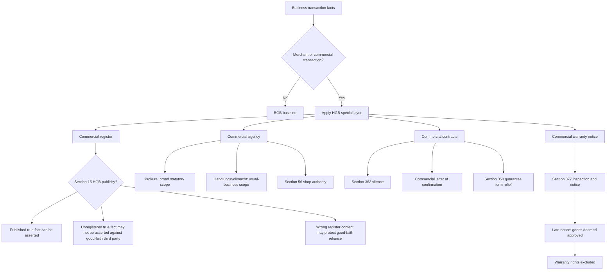
```mermaid
flowchart TD
    Facts[Business transaction facts] --> Merchant{Merchant or commercial transaction?}
    Merchant -->|No| BGB[BGB baseline]
    Merchant -->|Yes| HGB[Apply HGB special layer]
    HGB --> Register[Commercial register]
    HGB --> Agency[Commercial agency]
    HGB --> Contracts[Commercial contracts]
    HGB --> Warranty[Commercial warranty notice]

    Register --> S15{Section 15 HGB publicity?}
    S15 --> Published[Published true fact can be asserted]
    S15 --> Silence[Unregistered true fact may not be asserted against good-faith third party]
    S15 --> Wrong[Wrong register content may protect good-faith reliance]

    Agency --> Prokura[Prokura: broad statutory scope]
    Agency --> HVM[Handlungsvollmacht: usual-business scope]
    Agency --> Store[Section 56 shop authority]

    Contracts --> S362[Section 362 silence]
    Contracts --> Confirm[Commercial letter of confirmation]
    Contracts --> S350[Section 350 guarantee form relief]

    Warranty --> S377[Section 377 inspection and notice]
    S377 --> Approval[Late notice: goods deemed approved]
    Approval --> Exclude[Warranty rights excluded]
```

## Subject Knowledge Graph

| Node | Meaning | Exam Relevance |
|---|---|---|
| Trade Law | Special private law for merchants, mainly in the HGB | Decides when BGB rules are modified. |
| Merchant | Person/entity carrying on commercial business or treated as merchant by law/registration | Gateway to HGB rules. |
| Commercial Register | Public register for commerce-relevant facts | Triggers reliance and publicity problems. |
| Section 15 HGB Publicity | Good-faith protection around published, unpublished, or wrongly published facts | Common authority/register case issue. |
| Prokura | Broad legally defined commercial power of representation | Determines whether internal limits bind third parties. |
| Limited Commercial Authority | Usual-business commercial authority that is not Prokura | Tests narrower power and known limitations. |
| Shop Assistant Authority | Store-transaction legal appearance under Section 56 HGB | Handles cashier/store-clerk cases. |
| Commercial Letter Of Confirmation | Merchant-specific rule where silence after confirmation can bind | Tests commercial silence exception. |
| Section 377 HGB Notice | Inspection and defect-notice duty in mutual commercial purchases | Can destroy otherwise valid warranty claims. |

| From | Relationship | To | Why It Matters |
|---|---|---|---|
| HGB | modifies | BGB baseline | Case solutions often require both codes. |
| Merchant status | triggers | Trade-law layer | No merchant gateway, no HGB shortcut/burden. |
| Commercial Register | protects | Good-faith legal traffic | Explains Section 15 outcomes. |
| Prokura | has | Broad external scope | Third parties need not inspect internal instructions. |
| Internal Prokura limit | usually does not bind | Good-faith third party | Key to B2B authority cases. |
| Limited commercial authority | is narrower than | Prokura | Scope and limitation analysis differs. |
| Commercial silence | can create | Contract effect | HGB reverses the BGB silence baseline in specific situations. |
| Section 377 HGB | can exclude | Warranty rights | Defect remedy analysis must include timely notice. |

## Real Business Examples

### Prokura In A Procurement Deal

A company gives P Prokura but internally tells P not to sign contracts above EUR 20,000. P signs a EUR 50,000 supply contract. If the supplier did not know and abuse was not obvious, the internal limit usually does not defeat external authority. The company may have an internal claim against P, but the contract can bind the company.

### Commercial Register Reliance

A business revokes an employee's Prokura but forgets to register the revocation. The employee still signs as Prokurist. A good-faith business partner may be protected because the register does not show the true revocation.

### Section 377 In A Machine Sale

Merchant buyer B receives machines from merchant seller S. The machines show visible cracks. B stores them for two weeks and then complains. B may lose warranty rights because Section 377 HGB expects prompt inspection and notice in mutual commercial purchases.

## Exam Relevance

Likely prompts:

- Identify whether HGB rules apply to a transaction.
- Decide whether a person or company is a merchant.
- Apply Section 15 HGB to a register-publicity scenario.
- Decide whether Prokura or limited commercial authority binds the merchant.
- Explain when silence can create a contract in commercial law.
- Apply Section 377 HGB before ordinary BGB warranty remedies.

Common traps:

- Calling every company a merchant without checking the legal route.
- Treating HGB as a separate replacement system instead of a BGB modification layer.
- Forgetting that Prokura internal limits are usually externally irrelevant.
- Treating silence as irrelevant even in HGB confirmation cases.
- Jumping to Section 437 BGB without Section 377 HGB in B2B sales.

High-scoring answer structure:

```text
1. Classify actors and transaction.
2. State BGB baseline.
3. Identify HGB special rule.
4. Apply HGB requirements carefully.
5. Return to BGB consequence if HGB does not displace it.
```

## Official Exercise Case Routes

### Case 1a: Light-Bulb Order By Prokurist

Question: did P effectively represent electrician E?

Route:

1. Agency baseline: Sections 164 et seq. BGB.
2. Own declaration: P offers to buy 250 light bulbs at EUR 2 each.
3. Publicity: P does not explicitly write "for E", but uses the official work email and signs with `ppa.`, so acting for the business is implicit under Section 164 I 2 BGB.
4. Power of representation: E expressly granted Prokura under Section 48 HGB. Commercial-register entry under Section 53 HGB is declaratory.
5. Scope: buying light bulbs for the electrical store is within Section 49 HGB.
6. No effective external limitation appears under Section 50 HGB.

Result: P effectively represents E.

Exam trap: `ppa.` is strong evidence of Prokura/publicity, but still run the full Section 164 route.

### Case 1b: Bad-Faith Commercial Letter Of Confirmation

Question: is E obliged to pay EUR 1,000 for 500 light bulbs after S sends a confirmation letter with the wrong quantity?

Route:

1. Phone agreement: P and S agree on 250 light bulbs at EUR 2 each after P rejects 500.
2. A commercial letter of confirmation can alter or confirm terms only under strict conditions between merchants.
3. Personal scope and preceding negotiations are present.
4. The letter is received promptly and E remains silent.
5. Good faith / reasonable expectation fails: S knows P expressly rejected 500 because of capacity reasons and secretly hopes E will overlook or accept the wrong quantity.

Result: the confirmation letter does not alter the contract. E owes EUR 500 for 250 light bulbs, not EUR 1,000 for 500.

Exam trap: silence does not protect a sender who knowingly writes a materially wrong confirmation.

### Case 1c: Internal Prokura Limit And Showroom Employee

Question: must E pay EUR 6,000 for cable bought by P from W's employee M?

Route:

1. P's offer binds E: P acts with own declaration and enterprise-related publicity.
2. Prokura is issued and the cable purchase is within Section 49 HGB.
3. E's internal EUR 5,000 limit is effective internally between E and P but ineffective against third parties under Section 50 I HGB.
4. M's acceptance binds W: M acts in W's showroom, the transaction is enterprise-related, and Section 56 HGB gives store authority for customary showroom sales.

Result: E is obliged to pay EUR 6,000 under Section 433 II BGB.

Exam trap: solve agency on both sides; P's Prokura and M's Section 56 HGB authority are separate authority routes.

### Case 1d: Wrong Cable Diameter And Section 377 HGB

Question: can E demand cure by re-delivery of 5mm cable?

Route:

1. Purchase agreement exists from Case 1c.
2. Material defect: delivery of 3mm cable instead of ordered 5mm cable is aliud delivery under Section 434 V BGB.
3. Transfer of risk: wrong diameter existed from delivery.
4. Before ordinary Section 437/439 cure, check Section 377 HGB.
5. Mutual commercial purchase: E and W are merchants, and cable purchase/sale belongs to their businesses.
6. Delivery occurred on 1 July.
7. The defect was obvious because the delivery bill showed the 3mm diameter and it was recognizable by looking/touching.
8. P failed to inspect/notify in due course; E is responsible for P under Section 278 BGB.
9. No fraudulent concealment by W appears.

Result: the goods are deemed approved and warranty rights are excluded under Section 377 HGB; E has no cure claim.

Exam trap: Section 377 HGB can kill Section 437 remedies even when the goods are objectively defective.

## Retrieval Prompts

Closed-book questions:

1. What is the merchant gateway for applying trade law?
2. Why does the HGB modify the BGB in merchant transactions?
3. What are the three functions of the commercial register?
4. What is the difference between declaratory and constitutive registration?
5. Explain the difference between Section 15 I, II, and III HGB in one sentence each.
6. Why is Prokura stronger than limited commercial authority?
7. When can silence lead to contract effect in trade law?
8. What is the consequence of a late Section 377 HGB notice?

Application prompts:

1. M revokes P's Prokura but does not register the revocation. P signs with `ppa.` for a supplier who did not know. Who is bound?
2. A store employee sells a laptop in a public store, although internal rules say only the manager may sell electronics above EUR 500. Can the customer rely on Section 56 HGB?
3. Merchant buyer discovers obvious defects after delivery and waits ten days to notify. What must be checked before Section 437 BGB remedies?

## Practice Tasks

1. Build a three-step merchant-status test for a small gardening business, a GmbH, a doctor, and an online retailer.
2. Create a mini-table comparing Prokura, Handlungsvollmacht, and Section 56 shop authority.
3. Write a short legal-opinion paragraph for a commercial letter of confirmation after phone negotiations.
4. Route one B2B defective-goods case from purchase agreement to Section 377 HGB to Section 437 BGB.

## Connections

Previous notes from this lecture:

- `business-law/wiki/week-03-contract-law-i/week-03-contract-law-i.md` for offer, acceptance, and declaration-of-intent baseline.
- `business-law/wiki/week-06-standard-business-terms/week-06-standard-business-terms.md` for B2B standard-term content control.
- `business-law/wiki/week-07-agency/week-07-agency.md` for general agency rules.
- `business-law/wiki/week-08-warranty-rights-i/week-08-warranty-rights-i.md` for Section 437 warranty gateway.
- `business-law/wiki/week-10-transfer-of-property/week-10-transfer-of-property.md` for ownership and commercial purchase context.

Cross-course links:

- Organization: formal authority versus actual decision authority resembles internal/external authority in agency.
- Marketing and SCM: Incoterms and commercial standard terms affect delivery promises, risk allocation, and supply-chain execution.

## Weakness Flags

- First-pass active recall not yet completed.
- Test whether the user can distinguish BGB silence from HGB silence.
- Test Section 15 HGB with one revocation-of-Prokura case.
- Test Section 377 HGB before ordinary warranty remedies.


<div class="page-break"></div>

# [W11.2] Week 11 Trade Law Cheatsheet And Tricks

<p class="source-path">Source: <code>business-law/wiki/week-11-trade-law/week-11-trade-law-cheatsheet-and-tricks.md</code></p>

Course: Business Law
Exam date: 2026-07-28
Source: week-11-trade-law.md

## Must-Know (exam-critical)

| Rule | Anchor | Backbone use |
|---|---|---|
| HGB modifies the BGB baseline; it does not replace it | Lex specialis principle | Opening move for every trade-law case: state BGB baseline, then ask if HGB has a more specific rule. |
| Merchant gateway | Section 1 HGB | Commercial business, presumed unless type/scope doesn't require commercial organization. Gateway to every other HGB rule. |
| Merchant by legal form | Sections 13 III GmbHG, 6 I HGB | GmbH/AG etc. are merchants automatically — skip the Section 1 scale test for them. |
| Small business opt-in | Section 2 HGB | A small business becomes a merchant only by registering. |
| Section 15 HGB publicity | Sections 15 I, II, III HGB | I = unregistered true fact usually not assertable against good-faith third party. II = registered/published true fact can be asserted. III = wrong but published content can protect a good-faith third party. |
| Prokura | Sections 48-53 HGB | Very broad statutory scope (Section 49 I); land deals need special permission (49 II); internal limits usually ineffective externally (Section 50); signs `ppa.` (Section 51); can be joint (48 II). |
| Handlungsvollmacht (limited commercial authority) | Section 54 HGB | Narrower than Prokura — scoped to the usual business; no loan-taking/court representation unless specifically authorized (54 II); individual known limits can bind externally. |
| Shop assistant authority | Section 56 HGB | Protects a good-faith customer buying/paying at a public store or warehouse from staff — sales and receipts only, not purchases by the clerk. |
| Commercial silence exceptions | Section 362 HGB; commercial letter of confirmation | HGB reverses the BGB "silence is nothing" baseline in these two specific situations only. |
| Section 377 HGB notice duty | Section 377 HGB | In a mutual commercial purchase (Section 343 HGB), buyer must inspect and notify defects promptly; missing this deems the goods approved and excludes warranty rights — checked before Section 437 BGB. |

## Nice-to-Have (depth/edge cases)

- Declaratory vs. constitutive registration: merchant status/Prokura conferral are declaratory (the fact exists independently); GmbH/AG formation is constitutive (registration creates the legal fact).
- Section A vs. Section B of the commercial register: sole traders/partnerships vs. corporations.
- Prudent merchant diligence (Section 347 I HGB) — a higher care standard than the ordinary BGB standard.
- Section 350 HGB removes the Section 766 BGB form requirement for commercial guarantees — merchant professionalism lowers formal protection.
- Section 354 I HGB presumes merchant services are rendered against payment, not for free.
- Incoterms (EXW, DAP, etc.) are not law by themselves — they only matter once agreed as contract terms, and in B2B their SBT review runs through Section 307 + Section 310 I BGB, since Sections 308/309 don't apply directly between businesses.
- Abuse-of-authority exception to Prokura's broad external scope: only defeats the third party's reliance if the third party knew of the internal-limit breach or the abuse was obvious.

## Nuances And Traps

| Nuance/Trap | Why it's easy to get wrong | Correct handling |
|---|---|---|
| Calling every company a "merchant" without a route | The word "company" sounds like it should trigger HGB automatically | Check Section 1 HGB scale test, or merchant-by-registration (Section 2), or merchant-by-legal-form (Section 6 HGB / Section 13 III GmbHG) — pick the actual gateway, don't assume. |
| Treating HGB as a separate replacement system | The material explicitly warns against "HGB instead of BGB" language | Always phrase it as "BGB applies, HGB modifies this specific point," then return to BGB for anything HGB doesn't touch. |
| Prokura internal limits treated as if they bind third parties | Section 50 HGB says internal restrictions are usually ineffective externally, but it's tempting to assume a stated limit (e.g. "no contracts above EUR 20,000") controls | Internal limits bind only the Prokurist internally; they defeat the third party's reliance only on proven abuse/knowledge, not merely because a limit existed. |
| Handlungsvollmacht treated like Prokura | Both look like "commercial power of attorney" | Handlungsvollmacht is scoped to the usual business type and known/should-have-known limitations can work externally — it is meaningfully weaker than Prokura's near-unrestrictable scope. |
| Silence assumed always irrelevant, or always binding after any letter | BGB baseline says silence is nothing, but HGB carves out exceptions that are easy to over- or under-apply | Section 362 HGB needs an existing relationship/usual-business offer with no immediate answer; a commercial letter of confirmation binds only if the sender acted in good faith and could reasonably expect the (possibly deviating) content to be accepted — a sender who knowingly writes the wrong terms gets no protection (see the Case 1b bad-faith confirmation example: 500 vs. 250 light bulbs). |
| Jumping straight to Section 437 BGB in a B2B defect case | Warranty instinct from Weeks 8-9 says "defect -> Section 437" | In mutual commercial purchase, Section 377 HGB comes first — a buyer who misses timely inspection/notice loses the Section 437 claim entirely, even for a genuine, serious defect (see Case 1d: wrong cable diameter, goods deemed approved despite being objectively wrong). |
| Buyer's absence at delivery treated as an excuse for missed inspection | Feels intuitive that "I wasn't there" should excuse late notice | If an employee received the goods for the buyer, Section 278 BGB attributes the employee's missed inspection/notice to the buyer — no personal-absence excuse. |
| Assuming the commercial register is always accurate | Only Section 15 II (published true fact) matches that assumption | Section 15 I covers a true fact that was never registered (protects good-faith third party relying on silence); Section 15 III covers a registered fact that is actually wrong (protects good-faith third party relying on the wrong published content) — three different fact patterns, three different outcomes. |
| `ppa.` treated as automatic proof of binding agency | It is strong evidence, but the note stresses it's not a shortcut | Still run the full Section 164 I BGB route (own declaration, publicity, power of representation) — `ppa.` supports the publicity element, it doesn't replace the analysis. |

## One-Line Recall Drill

```text
1 HGB = merchant gateway
2 HGB = small business opt-in registration
6 HGB / 13 III GmbHG = merchant by legal form
15 I HGB = unregistered true fact, good faith wins
15 II HGB = registered true fact, assertable
15 III HGB = wrong but published, good faith wins
48-53 HGB = Prokura, broad, ppa., internal limits usually irrelevant
50 HGB = internal restriction ineffective externally unless abuse known/obvious
54 HGB = Handlungsvollmacht, usual-business scope, known limits can bind
56 HGB = shop assistant authority, sales/receipts only
362 HGB = merchant silence can be acceptance in usual business + existing relationship
commercial letter of confirmation = silence binds only if sender good faith
377 HGB = inspect + notify before Section 437, or goods deemed approved
343 HGB = mutual commercial purchase definition
347 HGB = prudent merchant diligence
350 HGB = no Section 766 form for commercial guarantees
```


<div class="page-break"></div>

# [W11.3] Week 11 Trade Law Practice Questions And Model Answers

<p class="source-path">Source: <code>business-law/wiki/week-11-trade-law/week-11-trade-law-practice-questions-and-model-answers.md</code></p>

Course: Business Law
Exam date: 2026-07-28
Source: week-11-trade-law.md, week-11-trade-law-cheatsheet-and-tricks.md
Format note: 25 questions — 11 short-answer/theory, 14 case/legal-opinion (schema-based). Five case questions integrate other weeks: Week 12-13 Company Law (Q8), Week 07 Agency (Q15, Q18), Week 08 Warranty Rights I (Q16), Week 06 Standard Business Terms (Q25).

## Short-Answer / Theory Questions

### Question 1

What makes a person or entity a merchant (Kaufmann) under the HGB, and why does this classification matter for a business-law exam case?

**Model Answer:**
1. A merchant is a person or entity carrying on a commercial business (Section 1 I HGB), or treated as a merchant through voluntary registration (Section 2 HGB) or automatically by legal form (Section 6 I HGB, Section 13 III GmbHG).
2. Statutory anchor: Sections 1, 2, 6 HGB; Section 13 III GmbHG.
3. Requirements/features: (1) Section 1 I HGB — actually carrying on a commercially organized business, presumed unless the type/scope makes commercial organization unnecessary; (2) Section 2 HGB — a smaller business becomes a merchant only by opting into registration; (3) Section 6 I HGB / Section 13 III GmbHG — certain legal forms (GmbH, AG) are merchants automatically, regardless of actual business scale.
4. Example: a one-person online retailer running an organized accounting/logistics operation is a merchant under Section 1 I HGB without ever registering; a small part-time craft seller only becomes one by registering under Section 2 HGB; a freshly founded GmbH is a merchant from the start under Section 6 I HGB even before it makes its first sale.
5. Consequence/trap: merchant status is the gateway to the entire HGB layer — Prokura, Section 15 publicity, the Section 362/confirmation-letter silence exceptions, and the Section 377 notice duty all presuppose it. "The actor is a company" is not itself an answer — name the specific gateway (Section 1, 2, or 6 HGB).

### Question 2

Compare Prokura and Handlungsvollmacht.

**Model Answer:**
Prokura triggers when the merchant (or an organ authorized to represent the merchant) expressly grants it, anchored in Sections 48-53 HGB, and leads to a very broad, legally fixed scope covering nearly all business acts (Section 49 I HGB), with internal restrictions generally ineffective against third parties (Section 50 HGB).

Handlungsvollmacht triggers when a merchant puts someone in charge of a kind of business or specific acts without granting full Prokura, anchored in Section 54 HGB, and leads to authority scoped to what that kind of business or transaction usually entails — excluding loan-taking and court representation unless separately authorized (Section 54 II HGB) — where individually known or should-have-known limits can bind externally.

Contrast example: a Prokurist can validly sign a EUR 50,000 supply contract even against an unregistered internal EUR 20,000 cap, because a third party who doesn't know of the cap isn't bound by it; an employee with Handlungsvollmacht subject to a supplier-known EUR 20,000 cap cannot.

Exam warning: do not treat every "authorized signatory" as a Prokurist — only an actual express grant under Section 48 HGB creates Prokura; anything narrower defaults to the Handlungsvollmacht analysis instead.

### Question 3

State the effect of Section 15 I, II, and III HGB in one sentence each.

**Model Answer:**
The requirements/effects are:
1. Section 15 I HGB: if a fact requiring registration is true but was never registered, a good-faith third party may rely on the register's silence, and the merchant generally cannot assert the unregistered true fact against them.
2. Section 15 II HGB: if a fact requiring registration is true, registered, and published, it can be asserted against third parties regardless of their actual knowledge.
3. Section 15 III HGB: if the register wrongly shows a fact that is not actually true, a good-faith third party may rely on that wrong published content.

If these are met, the consequence is that the register's public face — rather than the underlying truth — controls what a good-faith third party can rely on.

This exists because the commercial register is meant to be the reliable single source of truth for legal traffic, sparing third parties from independently investigating every counterpart's true legal status.

### Question 4

List the requirements for Section 377 HGB to exclude a buyer's warranty rights.

**Model Answer:**
The requirements are:
1. A mutual commercial purchase under Section 343 HGB (both parties act as merchants within their businesses).
2. Delivery of the goods to the buyer or a third party the buyer designated.
3. A material defect under Section 434 BGB present in the delivered goods.
4. The buyer's failure to inspect within due course and notify the defect without undue delay — immediately upon discovery for defects not recognizable on ordinary inspection.
5. No fraudulent concealment of the defect by the seller.

If these are met, the consequence is that the goods are deemed approved and the buyer's warranty rights under Section 437 BGB are excluded for that defect.

This exists to give commercial sellers fast certainty about whether a transaction is closed, reflecting the higher professionalism expected of merchants compared to ordinary BGB buyers.

## Case / Legal-Opinion Questions

### Question 5 (Case)

**Facts:** König Elektro GmbH grants Prokura to its purchasing manager, Frau Berger, registered in the commercial register. Internally, the managing director instructs Berger never to sign contracts above EUR 30,000 without his prior sign-off. Needing components urgently, Berger signs a EUR 45,000 supply contract with Kupfer AG on König Elektro GmbH's behalf, signing "ppa. Berger." Kupfer AG's sales representative has never heard of any internal limit and had no reason to suspect one. König Elektro GmbH later refuses to pay, citing the internal EUR 30,000 cap.

**Question:** Does Kupfer AG have a claim against König Elektro GmbH for payment of EUR 45,000 under Section 433 II BGB?

**Model Answer:**

I. Claim/issue sentence: Kupfer AG could have a claim against König Elektro GmbH for payment of EUR 45,000 under Section 433 II BGB if a valid purchase contract was concluded and binds the GmbH.

II. Requirements:
- I. Merchant status of König Elektro GmbH
- II. Contract conclusion between Berger (for the GmbH) and Kupfer AG
- III. Effective representation of König Elektro GmbH by Berger
- IV. No effective internal limitation defeating that representation
- V. Legal consequence

III. Application:
- I. König Elektro GmbH is a merchant by legal form under Section 6 I HGB / Section 13 III GmbHG, regardless of its actual business scale — the merchant gateway is met without the Section 1 scale test.
- II. Berger and Kupfer AG's representative exchanged a matching offer and acceptance for the EUR 45,000 supply contract.
- III. Questionable is whether Berger's declaration binds König Elektro GmbH. This is supported by the fact that Berger holds registered Prokura under Section 48 HGB, which under Section 49 I HGB covers nearly all business acts a commercial enterprise entails, including ordinary supply purchases — she acted with her own declaration and signed "ppa.," satisfying the Section 164 I BGB publicity element.
- IV. Against binding the GmbH, one could argue the internal EUR 30,000 cap should control. However, under Section 50 I HGB, internal restrictions on Prokura are ineffective against third parties unless the third party knew of the limitation or its breach was obvious. Kupfer AG's representative had no such knowledge and nothing in the facts made a limit obvious. Consequently, the internal limit does not defeat Berger's external authority.

IV. Interim results: merchant status met; contract concluded; representation effective despite the internal cap.

V. Final answer: As a result, Kupfer AG can claim payment of EUR 45,000 from König Elektro GmbH under Section 433 II BGB; the internal EUR 30,000 limit only gives the GmbH an internal claim against Berger, not a defense against Kupfer AG.

### Question 6 (Case)

**Facts:** Herr Novak revokes the Prokura of his employee, Herr Adler, after a dispute, but forgets to have the revocation entered in the commercial register. Two months later, Adler — still holding the company stamp — signs a EUR 12,000 purchase contract "ppa." with Fenster GmbH, whose purchasing agent checked the commercial register beforehand and saw Adler listed as Prokurist with no revocation noted. Novak now refuses to honor the contract, telling Fenster GmbH that Adler's Prokura had already been revoked.

**Question:** Can Fenster GmbH hold Novak's business bound to the EUR 12,000 contract?

**Model Answer:**

I. Claim/issue sentence: Fenster GmbH could have a claim against Novak's business for performance of the EUR 12,000 contract under Section 433 I BGB if the contract concluded through Adler binds the business despite the (unregistered) revocation of his Prokura.

II. Requirements:
- I. Novak's business is a merchant and the revocation is a registrable fact
- II. The revocation is true
- III. The fact was not registered
- IV. Fenster GmbH acted in good faith
- V. Legal consequence under Section 15 I HGB

III. Application:
- I. Novak's business is a merchant, so the grant and revocation of Prokura are facts Section 53 HGB requires to be registered.
- II. The revocation is true — Adler's Prokura had in fact ended.
- III. Questionable is whether the revocation can be asserted against Fenster GmbH. Against this, one could argue a principal should always be free to end an agent's authority effective immediately. However, Novak never had the revocation entered in the register, so the true fact remained unregistered.
- IV. This is supported by Fenster GmbH's agent having checked the register beforehand and found nothing indicating revocation, with no other reason to doubt Adler's status — satisfying good faith.

IV. Interim results: unregistered true fact confirmed; good faith confirmed; Section 15 I HGB protection applies.

V. Final answer: As a result, under Section 15 I HGB, Novak cannot assert the true but unregistered revocation against a good-faith third party who relied on the register's silence — Fenster GmbH can hold Novak's business bound to the EUR 12,000 contract as if Adler's Prokura were still valid.

### Question 7 (Case)

**Facts:** Merchant seller Dynamo GmbH delivers 50 industrial pumps to merchant buyer Kraft OHG on 3 March. The pumps have a visible manufacturing defect (cracked housings) that would be apparent on a routine visual check. Kraft OHG's warehouse staff sign for delivery but do not inspect the shipment until 20 March, when they notice the cracks and notify Dynamo GmbH the same day. Kraft OHG demands replacement under Section 439 BGB. Dynamo GmbH refuses, citing Section 377 HGB.

**Question:** Can Kraft OHG demand replacement of the pumps under Section 439 BGB?

**Model Answer:**

I. Claim/issue sentence: Kraft OHG could have a claim against Dynamo GmbH for replacement of the pumps under Sections 437 No. 1, 439 BGB if the pumps are defective and Kraft OHG's warranty rights were not excluded under Section 377 HGB.

II. Requirements:
- I. Mutual commercial purchase (Section 343 HGB)
- II. Delivery
- III. Material defect (Section 434 BGB)
- IV. Timely inspection and notice under Section 377 HGB
- V. Legal consequence

III. Application:
- I. Both Dynamo GmbH and Kraft OHG are merchants acting within their businesses, so this is a mutual commercial purchase under Section 343 HGB.
- II. Delivery of the 50 pumps occurred on 3 March.
- III. The cracked housings are a material defect under Section 434 BGB — the pumps lack the quality customary for defect-free industrial pumps.
- IV. Questionable is whether Kraft OHG met its Section 377 HGB duty. This is supported by notice being given the same day the defect was actually noticed. However, the defect was recognizable on a routine inspection that should have occurred shortly after the 3 March delivery, not 17 days later. Against Kraft OHG, one could argue warehouse workload excuses the delay, but Section 377 HGB expects inspection without undue delay after delivery for defects recognizable on ordinary inspection, and a 17-day gap does not meet that standard here.

IV. Interim results: mutual commercial purchase confirmed; defect confirmed; Section 377 HGB duty breached.

V. Final answer: As a result, the pumps are deemed approved under Section 377 HGB, Kraft OHG's warranty rights are excluded, and Kraft OHG cannot demand replacement under Section 439 BGB despite the pumps being objectively defective.

### Question 8 (Case — integrates Week 11 + Week 12-13)

**Facts:** Rapid Logistik GmbH & Co. KG needs a new forklift. The KG's general partner (Komplementär) is Rapid Verwaltungs GmbH, whose sole managing director, Herr Thies, has granted Prokura to the KG's logistics manager, Frau Voss, registered in the commercial register. Voss negotiates and signs a EUR 28,000 forklift purchase contract with Gabelstapler AG, signing "ppa. Voss for Rapid Logistik GmbH & Co. KG." Gabelstapler AG later learns that Thies never personally countersigned this specific contract and questions whether the KG is bound at all, given the layered GmbH & Co. KG structure.

**Question:** Is Rapid Logistik GmbH & Co. KG bound to pay EUR 28,000 to Gabelstapler AG under Section 433 II BGB?

**Model Answer:**

I. Claim/issue sentence: Gabelstapler AG could have a claim against Rapid Logistik GmbH & Co. KG for payment of EUR 28,000 under Section 433 II BGB if a valid purchase contract was concluded and binds the KG through Voss's Prokura.

II. Requirements:
- I. Merchant status of the KG
- II. Contract conclusion
- III. Effective grant of Prokura within the layered GmbH & Co. KG structure
- IV. Effective representation by Voss under that Prokura
- V. Legal consequence

III. Application:
- I. A KG carrying on a commercial business is a merchant under Sections 1, 6 HGB in conjunction with Sections 105 ff., 161 HGB. The GmbH & Co. KG structure does not change this — the KG itself is the merchant and contracting party, with Rapid Verwaltungs GmbH acting only as its general partner.
- II. Voss and Gabelstapler AG's representative reached agreement on the EUR 28,000 forklift purchase — a valid offer and acceptance exist.
- III. Questionable is whether Voss's Prokura was validly granted. This is supported by the fact that Prokura for a KG must be granted by whoever is entitled to represent the KG — here, the general partner Rapid Verwaltungs GmbH, itself represented by its managing director Thies under Section 35 GmbHG. Thies, acting for the GmbH in its capacity as general partner, validly granted Voss Prokura, registered under Section 53 HGB. Against this, one could argue Thies's absence from the specific forklift contract matters. However, that misreads the structure: Thies's involvement was only required at the earlier stage of granting Prokura to Voss, not for each individual transaction she later concludes under it.
- IV. Once validly granted, Voss's Prokura carries the broad statutory scope of Section 49 I HGB, covering an ordinary equipment purchase for logistics operations; she signed "ppa." for the KG, satisfying the Section 164 I BGB publicity element, and nothing in the facts suggests any known or obvious internal limitation.

IV. Interim results: KG is a merchant; contract concluded; Prokura validly granted through the general-partner GmbH's managing director; representation by Voss effective.

V. Final answer: As a result, Rapid Logistik GmbH & Co. KG is bound to pay EUR 28,000 to Gabelstapler AG under Section 433 II BGB. The layered GmbH & Co. KG structure only changes who is competent to grant Prokura (the general partner's managing director) — it does not require that person's personal involvement in every transaction the Prokurist later undertakes.

## Short-Answer / Theory Questions (continued)

### Question 9

State the requirements for shop assistant authority under Section 56 HGB.

**Model Answer:**
1. Section 56 HGB protects a good-faith customer who buys or pays at a shop/warehouse open to the public, dealt with by staff who appear authorized to sell.
2. Statutory anchor: Section 56 HGB.
3. Requirements/features: (1) a shop or warehouse open to the public; (2) staff employed there; (3) the transaction is a sale or receipt of payment of the kind customarily conducted at that location; (4) the customer's good faith that the staff member is authorized.
4. Example: a customer buying a lamp from a sales assistant at a lighting store is protected even if that assistant was never individually authorized; the same assistant "purchasing" inventory from a supplier is not covered, since Section 56 only protects sales and receipts, not purchases by the clerk.
5. Trap: Section 56 HGB is not a general authority provision — it is limited to sales and receipts made at the shop's public-facing premises; do not stretch it to cover a staff member's purchasing decisions or off-site conduct.

### Question 10

Compare the Section 362 HGB silence exception and the commercial letter of confirmation.

**Model Answer (Compare Schema):**

Section 362 HGB triggers when a merchant whose business includes conducting business for others receives an offer from someone with whom the merchant has an existing business relationship, anchored in Section 362 HGB, and leads to silence being treated as acceptance if the merchant does not reply without delay. The commercial letter of confirmation triggers when merchants who negotiated a contract exchange a letter that memorializes (and may slightly deviate from) the agreed terms, recognized through commercial custom rather than a single fixed section, and leads to silence after receipt binding the recipient to the letter's content — but only if the sender acted in good faith and could reasonably expect the (possibly deviating) content to be accepted. Contrast example: a forwarding agent who regularly handles a client's shipments and receives a new shipping request without responding is bound under Section 362 HGB by pure silence; two merchants who negotiated a bulk order and then received a follow-up letter stating quantities are bound by the letter's content only if the sender did not knowingly misstate the terms (see the 500 vs. 250 light bulbs bad-faith example). Exam trap: do not treat these as the same mechanism — Section 362 HGB needs an existing business relationship and a usual-business offer with no immediate answer, whereas the letter of confirmation needs prior negotiation and turns on the sender's good faith about the letter's content, not on any ongoing relationship.

### Question 11

Explain the difference between declaratory and constitutive commercial-register entries.

**Model Answer:**
1. This distinguishes whether commercial-register entry merely publishes an existing legal fact or actually creates the legal fact itself.
2. No single fixed section states the label; it is a doctrinal classification used throughout the trade-law material.
3. Requirements/features: (1) declaratory registration — the underlying legal fact (e.g. merchant status under Section 1 HGB, or Prokura conferral under Section 48 HGB) already exists once its real-world requirements are met, and registration only publicizes it, feeding into the Section 15 HGB good-faith rules; (2) constitutive registration — the legal fact does not exist at all until registration occurs (e.g. a GmbH or AG is not legally formed until entered in the register).
4. Example: a sole trader who meets Section 1 I HGB's commercial-scale test is already a merchant before ever registering — registration is declaratory; a founder who has signed a GmbH's articles and paid in capital does not yet have a GmbH until the register entry is made — registration is constitutive.
5. Trap: do not assume all commercial-register entries work the same way — ask whether the entry announces a fact already true (declaratory, then run Section 15 HGB) or is the very event bringing the fact into legal existence (constitutive, where no Section 15 HGB good-faith analysis is needed for the fact's existence itself).

### Question 12

Compare the ordinary BGB diligence standard with the prudent-merchant standard under Section 347 I HGB.

**Model Answer (Compare Schema):**

The ordinary BGB diligence standard triggers for any obligor generally, anchored in Section 276 II BGB, and leads to a duty of care measured by what is customarily required in dealings, without any merchant-specific elevation. The prudent-merchant standard triggers specifically for a merchant's commercial transactions, anchored in Section 347 I HGB, and leads to a heightened diligence standard reflecting the professionalism expected of someone who conducts business as their trade. Contrast example: a private individual who negligently damages a rented item is measured against ordinary Section 276 II BGB care; a merchant storing a counterparty's goods pending delivery is held to the higher prudent-merchant standard for how those goods are handled. Exam trap: do not import Section 347 HGB's heightened standard into a case where at least one side is not acting as a merchant within their business — apply Section 276 II BGB in the ordinary case, and elevate to Section 347 I HGB only once merchant status and a commercial-transaction context are both confirmed.

### Question 13

Explain the abuse-of-authority exception to Prokura's broad external scope.

**Model Answer:**
1. This is the narrow carve-out under which a third party's reliance on a Prokurist's broad statutory authority can still fail despite Section 50 HGB.
2. Statutory anchor: Section 50 HGB, with the abuse exception developed alongside it.
3. Requirements/features: (1) the Prokurist acts outside an internal restriction; (2) ordinarily Section 50 HGB makes that internal restriction ineffective against a third party; (3) the exception applies only if the third party actually knew of the internal-limit breach, or the abuse was so obvious that good faith cannot be assumed.
4. Example: a Prokurist secretly colluding with a buyer to sign a contract both know violates an internal cap defeats the buyer's reliance; a buyer who simply had no way of knowing about an unregistered internal cap remains protected even if, in hindsight, the deal looks unusually large.
5. Trap: do not treat "the deal looks like a bad business decision" as automatic proof of obvious abuse — the exception requires actual knowledge or a genuinely obvious abuse from the third party's own vantage point, not mere hindsight unusualness of the transaction.

## Case / Legal-Opinion Questions (continued)

### Question 14 (Case)

**Facts:** Spedition Nord GmbH is a freight-forwarding merchant that has handled Möbelhaus Bayer's shipments every month for two years under an ongoing arrangement. On 5 June, Möbelhaus Bayer sends Spedition Nord GmbH a routine shipping request matching its usual pattern. Spedition Nord GmbH's dispatcher receives the email but, due to a staffing shortage, never replies or acts, and the delivery deadline passes. Möbelhaus Bayer claims a binding forwarding contract was breached; Spedition Nord GmbH claims no contract ever formed because it never accepted.

**Question:** Did a binding contract form between Möbelhaus Bayer and Spedition Nord GmbH despite Spedition Nord GmbH's silence?

**Model Answer:**

I. Claim/issue sentence: Möbelhaus Bayer could have a contract claim against Spedition Nord GmbH if Spedition Nord GmbH's silence counts as acceptance under Section 362 HGB.

II. Requirements:
- I. Spedition Nord GmbH's business includes conducting business for others
- II. An existing business relationship with Möbelhaus Bayer
- III. Receipt of an offer within the usual business
- IV. No reply without delay
- V. Legal consequence

III. Application:
- I. Spedition Nord GmbH is a freight forwarder, a business whose core activity is conducting shipping business for other parties — satisfying the threshold Section 362 HGB business type.
- II. Questionable is whether an existing business relationship exists. This is supported by the two-year pattern of monthly shipments between the same two parties, which is exactly the kind of established relationship Section 362 HGB requires — not a one-off contact between strangers.
- III. The 5 June shipping request matches Spedition Nord GmbH's usual business and the established pattern, so it is an offer within the meaning of Section 362 HGB.
- IV. Against forming a contract, one could argue that a staffing shortage excuses the lack of a reply. However, Section 362 HGB does not require fault for silence to count as acceptance — it only requires that no timely reply was sent, and none was here.

IV. Interim results: business type met; existing relationship met; offer within the usual business met; no timely reply given.

V. Final answer: As a result, Spedition Nord GmbH's silence is deemed acceptance under Section 362 HGB, and a binding forwarding contract formed on the terms of Möbelhaus Bayer's 5 June request despite Spedition Nord GmbH never actively responding.

### Question 15 (Case — integrates Week 11 + Week 07)

**Facts:** Herr Krause has worked for years at Baustoffe Halle GmbH, repeatedly signing supply contracts "im Auftrag" on company letterhead with the company stamp, in full view of the managing director, who knew of this practice and never objected — even though Krause was never granted Prokura or any formal Vollmacht. A new supplier, Ziegel AG, reasonably relies on this consistent pattern and Krause's use of company materials to sign a EUR 15,000 supply deal. Baustoffe Halle GmbH later refuses to pay, stating Krause was never authorized to represent it at all.

**Question:** Is Baustoffe Halle GmbH bound to the EUR 15,000 contract with Ziegel AG?

**Model Answer:**

I. Claim/issue sentence: Ziegel AG could have a claim against Baustoffe Halle GmbH under Section 433 II BGB if Krause had power of representation despite never being formally granted Prokura or Vollmacht.

II. Requirements:
- I. Own declaration by Krause
- II. Publicity (acting in the GmbH's name)
- III. Power of representation
- IV. Legal consequence

III. Application:
- I. Krause made his own declaration when signing the supply contract, rather than merely transmitting someone else's fixed declaration — this is agency, not a messenger scenario.
- II. Krause signed "im Auftrag" on company letterhead with the company stamp, clearly showing he acted in Baustoffe Halle GmbH's name — publicity is met.
- III. Questionable is whether Krause had power of representation, since no Prokura was ever registered under Section 48 HGB and no explicit Vollmacht was granted under Section 167 I BGB. This is supported by the reliance-based (agency-by-estoppel) route: the managing director actually knew of Krause's repeated pattern of signing contracts this way and tolerated it over time — the conscious-tolerance fact pattern that distinguishes estoppel from ostensible agency's negligent-failure-to-notice version. Against granting Krause authority, one could argue the absence of any formal Prokura or Vollmacht should end the analysis. However, that would ignore that reliance-based authority exists specifically to protect a third party who reasonably relied on a pattern the principal itself allowed to continue, and Ziegel AG's reliance on the repeated conduct and company materials was in good faith.

IV. Interim results: own declaration and publicity met; power of representation established through agency by estoppel given the managing director's knowing tolerance of the pattern.

V. Final answer: As a result, Baustoffe Halle GmbH is bound to the EUR 15,000 contract under Section 433 II BGB. Krause never held Prokura in the Section 48 HGB sense, but the managing director's knowing tolerance of his repeated authorized-looking conduct created real power of representation through agency by estoppel, on which Ziegel AG was entitled to rely in good faith.

### Question 16 (Case — integrates Week 11 + Week 08)

**Facts:** Präzision Maschinenbau OHG (merchant) sells a batch of CNC-machined parts to Werkzeug Schmidt GmbH (merchant). The parts pass a routine visual and dimensional check at delivery on 10 April. A latent metallurgical flaw only becomes apparent three weeks later when the parts fail under stress testing during Werkzeug Schmidt GmbH's own production run. Werkzeug Schmidt GmbH notifies Präzision Maschinenbau OHG the same day the flaw becomes apparent and demands replacement under Section 439 BGB. Präzision Maschinenbau OHG argues the three-week gap since delivery already excludes the claim under Section 377 HGB.

**Question:** Can Werkzeug Schmidt GmbH still demand replacement under Section 439 BGB?

**Model Answer:**

I. Claim/issue sentence: Werkzeug Schmidt GmbH could have a claim for replacement under Sections 437 No. 1, 439 BGB if the parts are defective under Section 434 BGB and its warranty rights were not excluded under Section 377 HGB.

II. Requirements:
- I. Mutual commercial purchase (Section 343 HGB)
- II. Delivery
- III. Material defect (Section 434 BGB)
- IV. Timely inspection and notice under Section 377 HGB
- V. Legal consequence

III. Application:
- I. Both parties are merchants acting within their businesses, so this is a mutual commercial purchase under Section 343 HGB.
- II. Delivery occurred on 10 April.
- III. The latent metallurgical flaw is a material defect under Section 434 BGB — the parts lack the quality customary for defect-free CNC parts, even though this was not visible at delivery.
- IV. Questionable is whether Werkzeug Schmidt GmbH met its Section 377 HGB duty despite the three-week gap since delivery. This is supported by the rule that Section 377 HGB only requires prompt inspection and notice for defects recognizable on an ordinary inspection at delivery; for defects not recognizable that way, the duty is only to notify without undue delay once the defect is actually discovered. The routine visual and dimensional check at delivery was the ordinary inspection expected at that stage, and the metallurgical flaw was not something that check could reveal. Against Werkzeug Schmidt GmbH, Präzision Maschinenbau OHG could argue that three weeks is simply too long a gap from delivery. However, the relevant clock for a latent defect runs from discovery, not from delivery, and notice was given the same day the flaw became apparent during stress testing.

IV. Interim results: mutual commercial purchase confirmed; defect confirmed; Section 377 HGB duty satisfied because the defect was latent and notice followed discovery without delay.

V. Final answer: As a result, Werkzeug Schmidt GmbH's warranty rights are not excluded under Section 377 HGB, and it can demand replacement of the parts under Section 439 BGB despite the three-week gap between delivery and notice.

### Question 17 (Case)

**Facts:** Herr Feld's Prokura for Tischlerei Roth GmbH was validly revoked and the revocation was properly filed for registration, but due to a clerical error at the registry itself, the revocation was never actually entered — the register wrongly continues to list Feld as Prokurist. Relying on this entry, Baumarkt Ost checks the register before dealing, sees Feld listed, and signs a EUR 9,000 supply contract with Feld "ppa." Tischlerei Roth GmbH refuses to pay, pointing out Feld's Prokura was genuinely revoked.

**Question:** Is Tischlerei Roth GmbH bound to the EUR 9,000 contract?

**Model Answer:**

I. Claim/issue sentence: Baumarkt Ost could have a claim against Tischlerei Roth GmbH under Section 433 II BGB if Feld's declaration binds the GmbH despite his actually-revoked Prokura, based on the wrongly published register entry.

II. Requirements:
- I. Merchant status of Tischlerei Roth GmbH and registrability of Prokura
- II. The register wrongly shows Feld as holding Prokura
- III. Baumarkt Ost's good faith
- IV. Legal consequence under Section 15 III HGB

III. Application:
- I. Tischlerei Roth GmbH is a merchant, and Prokura and its revocation are facts Section 53 HGB requires to be registered.
- II. Feld's Prokura was validly revoked, yet due to the registry's own clerical error the revocation was never entered — the register wrongly continues to show Feld as Prokurist, which is the "wrong but published content" fact pattern of Section 15 III HGB, distinct from the mere silence covered by Section 15 I HGB.
- III. Questionable is whether Baumarkt Ost acted in good faith. This is supported by Baumarkt Ost having checked the register beforehand and found Feld listed with no indication of any revocation, with nothing in the facts suggesting it knew or should have known the entry was wrong. Against this, one could argue the registry's own error, rather than the GmbH's conduct, caused the wrong entry, and so the GmbH should not bear the consequence. However, Section 15 III HGB protects good-faith reliance on the register's published content regardless of who caused the inaccuracy — the risk of a wrong register entry is allocated to whoever the register concerns, not to the good-faith third party relying on it.

IV. Interim results: registrable fact confirmed; register wrongly shows Feld as Prokurist; Baumarkt Ost's good faith confirmed; Section 15 III HGB protection applies.

V. Final answer: As a result, under Section 15 III HGB, Tischlerei Roth GmbH cannot assert Feld's true (revoked) status against good-faith Baumarkt Ost, and remains bound to the EUR 9,000 contract as if Feld's Prokura were still valid.

### Question 18 (Case — integrates Week 11 + Week 07)

**Facts:** Herr Bauer holds registered Prokura for Sanitär Vogel GmbH. Without obtaining prior permission from the managing director and without any later ratification, Bauer uses his Prokura to sign a EUR 6,000 purchase contract on behalf of Sanitär Vogel GmbH — buying fittings from his own separately owned hardware business, Bauer Baumarkt e.K., effectively representing both the buyer (Sanitär Vogel GmbH, as Prokurist) and the seller (his own business, as owner) in the same transaction. Sanitär Vogel GmbH later refuses to pay, arguing the contract is invalid.

**Question:** Is Sanitär Vogel GmbH bound to pay Bauer Baumarkt e.K. EUR 6,000 under Section 433 II BGB?

**Model Answer:**

I. Claim/issue sentence: Bauer Baumarkt e.K. could have a claim against Sanitär Vogel GmbH for payment of EUR 6,000 under Section 433 II BGB if Bauer's self-contracting as Prokurist validly bound Sanitär Vogel GmbH.

II. Requirements:
- I. Contract conclusion via self-contracting
- II. Bauer's Prokura otherwise covers the transaction
- III. No effective exception to the Section 181 BGB self-dealing restriction
- IV. Legal consequence

III. Application:
- I. Bauer, acting for Sanitär Vogel GmbH as Prokurist, and Bauer personally as owner of Bauer Baumarkt e.K., are the same natural person on both sides of the transaction — this is self-contracting in the Section 181 BGB sense.
- II. Bauer's registered Prokura under Section 48 HGB otherwise covers an ordinary supply purchase of this kind under Section 49 I HGB.
- III. Questionable is whether Section 181 BGB defeats the transaction despite Bauer's broad Prokura. This is supported by the fact that self-dealing is analytically stronger than an ordinary internal-instruction breach: because there is no independent counterparty bargaining against Bauer's own interest, the transaction is provisionally invalid unless one of four exceptions applies — prior permission, later ratification, mere performance of an existing obligation, or a transaction advantageous only to Sanitär Vogel GmbH. Against invalidity, one could argue Prokura's broad Section 49 I HGB scope should cover any ordinary supply purchase regardless of counterparty identity. However, none of the four exceptions are met here: no prior permission was given, no later ratification occurred, this was a new purchase rather than performance of an existing obligation, and the facts show an ordinary purchase, not one legally advantageous only to Sanitär Vogel GmbH. Consequently, Section 181 BGB is not displaced and restricts Bauer's external power for this specific transaction.

IV. Interim results: self-contracting confirmed; Prokura otherwise sufficient; no Section 181 BGB exception applies, so the restriction stands.

V. Final answer: As a result, the contract is provisionally invalid under Section 181 BGB, and Sanitär Vogel GmbH is not bound to pay Bauer Baumarkt e.K. EUR 6,000 under Section 433 II BGB unless the GmbH later ratifies the transaction under Section 177 BGB.

## Short-Answer / Theory Questions (continued)

### Question 19

List two additional commercial-contract modifications the HGB makes to BGB defaults, beyond agency scope, register publicity, and the Section 377 HGB notice duty.

**Model Answer:**
1. Beyond agency, register publicity, and Section 377 HGB, two further BGB default rules are adjusted specifically for merchants in ordinary commercial dealings.
2. Statutory anchor: Section 350 HGB; Section 354 I HGB.
3. Requirements/features: (1) Section 350 HGB — a suretyship/guarantee given by a merchant in a commercial transaction does not need the written form Section 766 BGB otherwise requires; (2) Section 354 I HGB — where a merchant renders services in the course of their business, payment is presumed owed even without an explicit price agreement, reversing the ordinary assumption that services might be gratuitous.
4. Example: a merchant who orally guarantees a supplier's invoice is bound despite no signed document, whereas a private individual's oral guarantee for a friend's debt fails Section 766 BGB's form requirement; a freight forwarder who moves a regular client's goods without discussing a fee can still claim payment because Section 354 I HGB presumes merchant services are not free.
5. Trap: do not treat these as "the same idea as Section 377" — they modify different BGB defaults (form requirements and gratuitousness assumptions), not the notice/inspection regime, and each needs its own statutory anchor when cited.

### Question 20

Which businesspeople are usually NOT merchants despite running an active business, and why does this matter for HGB analysis?

**Model Answer:**
1. Even someone clearly "in business" can fall outside HGB merchant status if their activity does not meet the Section 1 I HGB commercial-business threshold or another merchant gateway.
2. Statutory anchor: Section 1 I, II HGB (by exclusion); Section 2 HGB (opt-in for the small-business subset).
3. Requirements/features — categories usually NOT merchants: (1) liberal professions (doctors, lawyers, notaries, auditors, tax consultants, architects, writers, interpreters) — professional/personal-skill-based activity, not a commercially organized business in the Section 1 sense; (2) purely asset-managing activity, e.g. merely renting out apartments — passive asset management, not an operated commercial business; (3) employees — acting under direction, not independently, so they cannot be merchants in their own right; (4) charities — not profit-directed; (5) very small business activities that do not require commercial organization, unless the operator opts in under Section 2 HGB.
4. Example: a solo architect running a design practice with an assistant and steady client billing is not automatically a merchant, however busy the practice looks, because architecture is a liberal profession; a landlord renting out three apartments is not a merchant even though rent is collected regularly, because letting property is asset management, not an operated commercial business.
5. Trap: "runs a business" and "is a merchant" are not synonyms — always test the actual Section 1 I HGB criteria (or the Section 2 opt-in, or the Section 6 legal-form gateway) rather than assuming professional activity or steady income automatically triggers HGB status; a wrong call here breaks every downstream HGB rule (Prokura, Section 15, Section 377), since none of them apply without a merchant.

## Case / Legal-Opinion Questions (continued, part 2)

### Question 21 (Case)

**Facts:** Merchant Fassbinder Getränke GmbH grants joint Prokura to two employees, Herr Lenz and Frau Wick, registered as "gemeinsame Prokura" under Section 48 II HGB. On Monday, Lenz signs a EUR 40,000 keg-supply contract "ppa." on behalf of the GmbH after discussing and agreeing the deal with Wick by phone; Wick countersigns the same contract document the following Wednesday, two days later, once back in the office. The supplier, Getränke Kraft AG, later argues the contract is invalid because the two Prokurists did not sign at the exact same time.

**Question:** Is Fassbinder Getränke GmbH bound to the EUR 40,000 contract despite the two-day gap between Lenz's and Wick's signatures?

**Model Answer:**

I. Claim/issue sentence: Getränke Kraft AG could have a claim against Fassbinder Getränke GmbH under Section 433 II BGB if the joint Prokura of Lenz and Wick was validly exercised despite their signatures being two days apart.

II. Requirements:
- I. Merchant status and valid grant of joint Prokura
- II. Both joint Prokurists' involvement in the act
- III. Whether simultaneity is required
- IV. Legal consequence

III. Application:
- I. Fassbinder Getränke GmbH is a merchant by legal form under Section 6 I HGB / Section 13 III GmbHG, and validly granted joint Prokura to Lenz and Wick, registered under Section 48 II HGB in conjunction with Section 53 HGB.
- II. Both Lenz and Wick were substantively involved: Lenz agreed the deal terms with Wick by phone before signing, and Wick then countersigned the same document.
- III. Questionable is whether joint Prokura requires the Prokurists to act at the exact same moment. This is supported by the point of joint Prokura being control through mutual involvement in the decision, not a formal simultaneity requirement — the two Prokurists discussed and agreed the deal together before either signature was finalized, and Wick's countersignature completed the joint act. Against validity, one could argue a two-day gap between signatures shows the two never truly acted "jointly." However, joint Prokura only requires that both Prokurists participate in bringing about the act — sequential signing of the same agreed document, following a shared decision, satisfies this without needing simultaneous physical signing.

IV. Interim results: joint Prokura validly granted and registered; both Prokurists substantively involved in the shared decision and act; simultaneity not required.

V. Final answer: As a result, Fassbinder Getränke GmbH is bound to the EUR 40,000 contract under Section 433 II BGB; joint Prokura under Section 48 II HGB requires joint participation in the act, not simultaneous signing, so the two-day gap does not invalidate Lenz's and Wick's joint exercise of their Prokura.

### Question 22 (Case)

**Facts:** Merchant Ziegel Bau GmbH grants ordinary (non-restricted) Prokura to its site manager, Herr Dorn, registered in the commercial register. Without any additional authorization for real-estate transactions, Dorn signs a contract "ppa." selling a warehouse plot owned by Ziegel Bau GmbH to Grundstück Nord AG for EUR 300,000. Grundstück Nord AG's representative assumed Dorn's registered Prokura was sufficient for any business transaction, including real estate, and did not ask further questions. Ziegel Bau GmbH now refuses to transfer the plot, stating Dorn was never separately authorized for real-estate deals.

**Question:** Is Ziegel Bau GmbH bound to sell the plot to Grundstück Nord AG for EUR 300,000?

**Model Answer:**

I. Claim/issue sentence: Grundstück Nord AG could have a claim against Ziegel Bau GmbH for conclusion of the sale under Section 433 I BGB if Dorn's Prokura covered the real-estate transaction.

II. Requirements:
- I. Merchant status and valid Prokura grant
- II. Whether Section 49 I HGB's general scope extends to real-estate dispositions
- III. Whether separate authorization under Section 49 II HGB exists
- IV. Legal consequence

III. Application:
- I. Ziegel Bau GmbH is a merchant by legal form and validly granted Dorn registered Prokura under Section 48 HGB.
- II. Questionable is whether Dorn's Prokura, though broad under Section 49 I HGB, extends to selling real estate. This is supported by Section 49 II HGB carving real-estate dispositions out of Prokura's otherwise near-unlimited statutory scope, requiring separate, specific authorization for exactly this category of transaction — unlike the near-blanket coverage Prokura gives for ordinary commercial acts.
- III. Against Grundstück Nord AG's claim, the facts show no additional authorization was ever given to Dorn for real-estate transactions specifically; his registered Prokura alone does not satisfy Section 49 II HGB's separate-empowerment requirement. However, one could argue Grundstück Nord AG relied in good faith on Dorn's registered Prokura status generally. This does not help here, because Section 49 II HGB is a statutory scope limitation built into Prokura itself, not an internal instruction that Section 50 HGB's third-party-protection rule could override — a third party is expected to know that Prokura's statutory scope excludes real-estate dispositions absent separate authorization, unlike an undisclosed internal cap on an otherwise-covered transaction.

IV. Interim results: Prokura validly granted but does not, by itself, extend to real-estate dispositions; no separate Section 49 II HGB authorization was given; the scope gap is not curable by Grundstück Nord AG's good faith.

V. Final answer: As a result, Ziegel Bau GmbH is not bound to sell the plot under Section 433 I BGB; Dorn's ordinary Prokura did not cover the real-estate sale absent the separate authorization Section 49 II HGB requires, and this statutory scope limit is not defeated by a third party's good-faith assumption the way an internal Section 50 HGB restriction would be.

### Question 23 (Case)

**Facts:** Büromöbel Stein GmbH grants its purchasing clerk, Frau Thal, Handlungsvollmacht under Section 54 HGB to order office furniture and supplies on the company's behalf — the kind of business she is put in charge of. Facing a temporary cash-flow gap, Thal — without any special authorization for financing matters — approaches Kredit Schnell AG and signs a EUR 25,000 short-term loan agreement "i.V." for Büromöbel Stein GmbH, intending to use the funds to pay a supplier invoice. Kredit Schnell AG assumed Thal's role as an authorized company representative was enough to bind the GmbH to the loan.

**Question:** Is Büromöbel Stein GmbH bound to repay the EUR 25,000 loan to Kredit Schnell AG?

**Model Answer:**

I. Claim/issue sentence: Kredit Schnell AG could have a claim against Büromöbel Stein GmbH for repayment of EUR 25,000 under the loan agreement if Thal's Handlungsvollmacht covered concluding the loan.

II. Requirements:
- I. Valid grant of Handlungsvollmacht to Thal
- II. Whether loan-taking falls within Section 54 I HGB's usual-business scope
- III. Whether Section 54 II HGB's carve-out applies and was separately authorized
- IV. Legal consequence

III. Application:
- I. Büromöbel Stein GmbH validly granted Thal Handlungsvollmacht under Section 54 HGB, scoped to ordering office furniture and supplies — the kind of business she was put in charge of.
- II. Questionable is whether taking out a EUR 25,000 loan falls within that scope. This is supported by Section 54 I HGB extending Handlungsvollmacht only to transactions the specific business or transaction type Thal was put in charge of usually entails — ordering furniture and supplies for resale or company use, not arranging outside financing.
- III. Against binding the GmbH, one could argue Thal's general role as an authorized company representative should cover a routine cash-flow loan. However, Section 54 II HGB expressly excludes loan-taking (and court representation) from Handlungsvollmacht's scope unless the holder is specifically authorized for it, and the facts state no such special authorization was given to Thal. Consequently, even Kredit Schnell AG's assumption that Thal's role was broad enough does not help, since Section 54 II HGB is a statutory scope exclusion inherent to Handlungsvollmacht, not merely an internal instruction a third party could reasonably overlook.

IV. Interim results: Handlungsvollmacht validly granted but scoped to furniture/supply purchasing; loan-taking falls outside that scope under Section 54 II HGB; no special authorization for financing was given.

V. Final answer: As a result, Büromöbel Stein GmbH is not bound to repay the EUR 25,000 loan; Thal's Handlungsvollmacht did not extend to loan-taking under Section 54 II HGB absent specific authorization for that category of transaction.

### Question 24 (Case)

**Facts:** Teppich Welt (a merchant-run carpet showroom) employs Frau Oymen as a sales assistant on the showroom floor. Customers and colleagues casually refer to her as having "full authority to run the floor," and she has a business card printed with the title "Authorized Representative." Relying on the title and the showroom setting, a customer, Herr Falk, buys a EUR 4,000 carpet from Oymen during normal business hours, paying by bank transfer to the account she provides — a customary way of completing sales at that showroom. Teppich Welt's owner later discovers Oymen was never granted Prokura or Handlungsvollmacht in any formal sense — she is simply a shop-floor sales employee — and argues the sale is not binding because Oymen lacked "real" authority.

**Question:** Is Teppich Welt bound to the EUR 4,000 carpet sale to Herr Falk?

**Model Answer:**

I. Claim/issue sentence: Herr Falk could have a claim against Teppich Welt for delivery of the carpet under Section 433 I BGB if Oymen had power of representation for the sale despite lacking Prokura or Handlungsvollmacht.

II. Requirements:
- I. Own declaration and publicity
- II. Whether Prokura or Handlungsvollmacht applies
- III. Whether Section 56 HGB shop assistant authority applies instead
- IV. Legal consequence

III. Application:
- I. Oymen made her own declaration selling the carpet to Falk, and the showroom setting and payment-collection role made clear she acted for Teppich Welt's business — publicity is met.
- II. Questionable is whether Oymen holds Prokura or Handlungsvollmacht. This is not supported by the facts: no express grant under Section 48 HGB was ever made, and there is no showing the owner put her formally "in charge of" a defined kind of business the way Section 54 HGB requires — the business card title and colleagues' casual description are not a substitute for an actual grant of either authority type.
- III. This is supported instead by Section 56 HGB: Oymen is employed in a store open to the public (the showroom), the EUR 4,000 carpet sale and the bank-transfer payment method are transactions customary for that type of showroom, and Falk had no reason to doubt her authority to sell and receive payment on the spot. Against Section 56 HGB applying, one could argue the "Authorized Representative" title suggests something broader than ordinary shop-floor authority. However, an inflated business-card title does not itself grant Prokura or Handlungsvollmacht, and none of their formal grant requirements are met here — the case resolves at the narrower, correctly-matched Section 56 HGB level, which is enough on its own to bind the sale.

IV. Interim results: no Prokura or Handlungsvollmacht established; Section 56 HGB shop assistant authority requirements are met.

V. Final answer: As a result, Teppich Welt is bound to the EUR 4,000 carpet sale to Herr Falk under Section 433 I BGB — not because Oymen held Prokura or Handlungsvollmacht, which she never had, but because Section 56 HGB's narrower shop-assistant authority independently covers exactly this kind of customary showroom sale.

### Question 25 (Case — integrates Week 11 + Week 06)

**Facts:** Stahlwerk Ost GmbH (merchant) and Bau Komplett AG (merchant) conclude a steel-beam supply contract that incorporates Stahlwerk Ost GmbH's pre-printed standard purchase terms, which state: "DAP named destination per Incoterms 2020; Buyer waives any claim for delay damages regardless of cause." Delivery arrives eleven days late due to Stahlwerk Ost GmbH's own scheduling error, causing Bau Komplett AG a EUR 18,000 loss from a stalled construction site. Stahlwerk Ost GmbH points to the delay-damages waiver clause. Bau Komplett AG argues the clause is invalid, but concedes both parties are merchants, so the consumer-protection "black list" cannot apply directly.

**Question:** Can Stahlwerk Ost GmbH rely on the delay-damages waiver clause to defeat Bau Komplett AG's EUR 18,000 damages claim?

**Model Answer:**

I. Claim/issue sentence: Bau Komplett AG could have a claim against Stahlwerk Ost GmbH for EUR 18,000 in delay damages under Sections 280 I, II, 286 BGB unless the SBT waiver clause validly excludes it.

II. Requirements:
- I. The waiver clause is Stahlwerk Ost GmbH's SBT under Section 305 I BGB and was incorporated
- II. Whether Sections 308/309 BGB apply directly
- III. Whether the clause fails content control under Section 307 BGB via Section 310 I BGB
- IV. Legal consequence

III. Application:
- I. The pre-printed purchase terms, including the DAP/Incoterms reference and the delay-damages waiver, are pre-formulated contract terms Stahlwerk Ost GmbH presents for a multitude of contracts — SBT under Section 305 I BGB — and were validly incorporated into this steel-beam contract; the Incoterms reference is not law by itself and only becomes relevant because it was agreed as a contract term.
- II. Questionable is whether the "black list" under Section 309 BGB, which would ordinarily void a blanket exclusion of liability for a serious breach, applies directly here. This is not supported: both Stahlwerk Ost GmbH and Bau Komplett AG are merchants acting within their businesses, and Section 310 I BGB excludes Sections 308 and 309 BGB from direct application to B2B contracts between entrepreneurs.
- III. This is supported by Section 307 BGB continuing to apply indirectly through Section 310 I BGB even though 308/309 do not apply directly — the clause purports to waive delay damages "regardless of cause," including Stahlwerk Ost GmbH's own scheduling errors, which unreasonably disadvantages Bau Komplett AG contrary to good faith by stripping away the core remedy for the supplier's own fault-based delay. Against invalidity, one could argue commercial parties should be free to allocate delay risk however they choose, especially where Incoterms language signals a sophisticated negotiated framework. However, the clause's own wording — a "regardless of cause" waiver — goes beyond ordinary risk allocation (such as fixing a delivery point under DAP) and instead blanket-excludes liability even for the supplier's own fault, which the Section 307 general clause treats as a core disadvantage even without the mechanical 309 black-list trigger being directly available in B2B.

IV. Interim results: clause is SBT, validly incorporated; Sections 308/309 do not apply directly between merchants; the clause nonetheless fails the Section 307 general clause via Section 310 I BGB because it blanket-excludes fault-based delay liability.

V. Final answer: As a result, Stahlwerk Ost GmbH cannot rely on the delay-damages waiver clause; it is invalid under Section 307 BGB via Section 310 I BGB despite Sections 308/309 not applying directly in this B2B relationship, and Bau Komplett AG's EUR 18,000 damages claim under Sections 280 I, II, 286 BGB survives, with the rest of the contract — including the DAP delivery-point allocation — remaining intact under Section 306 BGB.

## Quick Answer Route Summary

| Question # | Primary Route/Section | One-line takeaway |
|---:|---|---|
| 1 | Sections 1, 2, 6 HGB | Merchant status has three separate gateways — scale, opt-in registration, or legal form. |
| 2 | Sections 48-54 HGB | Prokura is broad and hard to restrict; Handlungsvollmacht is narrower and easier to restrict. |
| 3 | Section 15 I-III HGB | The register's public face controls good-faith reliance, whether silent, accurate, or wrong. |
| 4 | Section 377 HGB | Five cumulative requirements before warranty rights are excluded for late notice. |
| 5 | Sections 48-50 HGB | Internal Prokura limits don't bind an unaware third party. |
| 6 | Section 15 I HGB | Unregistered true revocation cannot be asserted against a good-faith third party relying on register silence. |
| 7 | Section 377 HGB | A 17-day gap on an obvious defect is too slow — warranty rights are excluded. |
| 8 | Sections 48-50 HGB + Section 35 GmbHG | Prokura in a GmbH & Co. KG is granted through the general-partner GmbH's managing director, not re-confirmed per transaction. |
| 9 | Section 56 HGB | Shop assistant authority covers only sales/receipts at the public premises, not purchases by staff. |
| 10 | Sections 362 HGB vs. letter of confirmation | Silence-as-acceptance needs an existing relationship (362) or a good-faith confirming letter after negotiation — not the same mechanism. |
| 11 | Declaratory vs. constitutive registration | Merchant/Prokura facts exist before registration (declaratory); GmbH/AG existence starts only at registration (constitutive). |
| 12 | Section 276 II BGB vs. Section 347 I HGB | Ordinary diligence applies generally; prudent-merchant diligence only once both merchant status and a commercial transaction are confirmed. |
| 13 | Section 50 HGB abuse exception | Internal Prokura limits bind a third party only on actual knowledge or obvious abuse, not hindsight unusualness. |
| 14 | Section 362 HGB | Two-year monthly relationship + usual-business offer + no reply = silence is acceptance, staffing shortage is no excuse. |
| 15 | Reliance-based authority (Section 164 I BGB) | Knowing, tolerated pattern of unauthorized "im Auftrag" signing creates authority by estoppel even without Prokura. |
| 16 | Section 377 HGB latent-defect rule | For non-recognizable defects, the notice clock runs from discovery, not delivery — same-day notice after discovery is timely. |
| 17 | Section 15 III HGB | Wrongly published register content protects good-faith reliance even if a registry (not the merchant) caused the error. |
| 18 | Section 181 BGB | Prokurist self-dealing with his own business is provisionally invalid absent one of the four narrow exceptions. |
| 19 | Sections 350, 354 I HGB | Merchant guarantees skip Section 766 BGB form; merchant services are presumed paid, not free. |
| 20 | Section 1 HGB by exclusion | Liberal professions, asset management, employees, and charities are usually not merchants despite "running a business." |
| 21 | Section 48 II HGB joint Prokura | Joint participation in the act is required, not simultaneous signing. |
| 22 | Section 49 II HGB | Prokura's broad Section 49 I scope excludes real-estate dispositions absent separate authorization — a statutory gap, not a curable internal limit. |
| 23 | Section 54 II HGB | Handlungsvollmacht excludes loan-taking and court representation unless specifically authorized. |
| 24 | Section 56 HGB vs. Prokura/Handlungsvollmacht | An inflated title doesn't create Prokura or Handlungsvollmacht — the narrower, correctly-matched authority type still binds the sale. |
| 25 | Section 307 BGB via Section 310 I BGB | B2B strips the mechanical 308/309 black/grey lists, but the general clause still kills a blanket fault-inclusive liability waiver. |


<div class="page-break"></div>

# [W12-13.1] Week 12-13: Company Law I And II

<p class="source-path">Source: <code>business-law/wiki/week-12-13-company-law-i-ii/week-12-13-company-law-i-ii.md</code></p>

Source: `business-law/raw/moodle-export-business-law-950848572-s26-20260708/06.07. - Company Law I - Dr. Reger/Company Law I + II.pdf`
Course: Business Law
Processed: 2026-07-08
Wiki note: `business-law/wiki/week-12-13-company-law-i-ii/week-12-13-company-law-i-ii.md`

Course direction checked against `business-law/wiki/_course-logistics.md`: Company Law I and Company Law II are Sessions 12 and 13 in the teaching outline and follow Trade Law.

External statute check: GmbHG, AktG, HGB, and BGB anchors were cross-checked against the official Gesetze-im-Internet English sources on 2026-07-08. The official English translations warn that translations may lag the current German text; use the current German statutory text for exact legal wording.

## 80/20 Exam Summary

Company law asks which legal form is suitable and what legal consequences follow from that form.

- Business associations split into partnerships and corporations.
- Partnerships are more person-centered; corporations are more entity-centered.
- The legal-form choice is a management decision shaped by liability, capital, governance, tax, reputation, financing, disclosure, and formation costs.
- GbR is the basic partnership form. Commercial business pushes toward oHG or KG.
- oHG means all partners are personally liable. KG requires at least one unlimited-liability general partner and one limited partner.
- GmbH is the central limited-liability corporation for smaller and medium-sized businesses.
- GmbH protects shareholders from personal liability if capital contribution duties are fulfilled, but it costs capital, notarial form, registration, accounting, and disclosure.
- UG is a mini-GmbH: low entry capital but lower reputation and mandatory reserve building.
- AG is the stock-corporation form, usually for larger companies and capital-market readiness.
- AG governance is more rigid and dualistic: general assembly, supervisory board, and management board.
- Corporate governance responds to the principal-agent problem between owners, managers, workers, creditors, and other stakeholders.

## Where This Fits

Earlier notes explain how contracts bind persons and companies. Company law explains who the legal actor is and who bears risk.

```text
Contract law: Is there a contract?
Agency: Who is bound by a declaration?
Trade law: Is the actor a merchant?
Company law: What is the legal form, who represents it, and who is liable?
```

Exam habit:

```text
legal form -> representation -> liability -> governance -> business consequence
```

## Overview Of Business Associations

Core map:

| Category | Forms in deck | Main logic |
|---|---|---|
| Partnerships | GbR, oHG, KG, GmbH & Co. KG | More dependent on individual partners. |
| Corporations | GmbH, UG, AG, eG, KGaA, SE | Entity is more independent from members/shareholders. |

Basic comparison:

| Dimension | Partnerships | Corporations |
|---|---|---|
| Basic form | GbR | Registered association model; corporation statutes |
| Representation | Usually tied to partners | Separate bodies, such as directors or board |
| Taxation | Partners taxed individually | Corporate tax at entity level |
| Liability | At least one person often liable with private assets | Usually limited to corporate assets |
| Examples | GbR, oHG, KG, GmbH & Co. KG | GmbH, UG, AG, SE, KGaA |

## Choosing A Legal Form

The deck frames legal-form choice as a multi-factor decision, not a pure definition exercise.

| Factor | Why it matters |
|---|---|
| Limitation of liability | Protects private assets but may increase formation costs and financing friction. |
| Formation process | Notary, registration, capital raising, and timing differ by form. |
| Capital requirements | GmbH needs minimum share capital; UG can start with very low capital. |
| Governance flexibility | Partnerships are flexible but person-dependent; corporations are more structured. |
| Disclosure duties | Corporations often face accounting and publication duties. |
| Financing sources | Investors and banks care about reputation, liability, capital, and transferability. |
| Tax aspects | Entity versus partner taxation changes total burden and planning. |
| Change of shareholders | Easier in corporations than in person-centered partnerships. |
| Reputation | GmbH and AG can signal seriousness; UG may signal limited substance. |
| Liability pitfalls | Insolvency, director duties, and capital rules can still create personal risk. |

Exam sentence:

```text
The best legal form is not the one with the fewest formalities; it is the one whose liability, governance, financing, and cost profile match the business risk.
```

## Partnerships

### GbR

The GbR is the basic civil-law partnership under Sections 705 ff. BGB.

Key points:

- often arises tacitly through a joint endeavor;
- person-centered;
- not a corporation;
- legally independent enough to participate in legal relations;
- general partnership rules can apply to oHG and KG if no more specific rules exist;
- personal liability is the default risk.

Example:

```text
Two people jointly run a small gardening service for private customers without commercial scale. A GbR is the natural starting form.
```

### oHG

The oHG is the commercial general partnership.

Key points:

- used for commercial business;
- merchant under trade-law logic;
- every partner is personally liable;
- registration in commercial register required.

Exam trap:

```text
Do not recommend oHG only because two people operate together. Ask whether their business is commercial in type or scope.
```

### KG

The KG is a limited partnership.

Core structure:

```text
Komplementaer = general partner with unlimited liability
Kommanditist = limited partner with liability limited to agreed contribution
```

The KG helps combine active business management with capital participation by limited partners.

### GmbH & Co. KG

This mixed form uses a GmbH as the general partner of a KG.

Logic:

```text
KG structure
-> general partner would normally be personally liable
-> GmbH becomes general partner
-> practical liability risk is shifted to GmbH assets
```

This is a legal-form design tool for limiting human private-asset exposure while keeping partnership features.

## Unlimited And Limited Liability

Unlimited liability means a person can be liable with all private assets if liability arises. Contractual liability can be shaped to some extent, but tort and insolvency risks can be hard to contain.

Why limited liability matters:

- commercial transactions can be high-frequency and high-volume;
- one poor business decision can exceed private wealth;
- limited liability encourages innovation and capital pooling;
- limited liability shifts some risk to creditors, so law adds capital, disclosure, and governance controls.

Exam correction:

```text
Limited liability does not mean nobody is liable. The company remains liable with company assets.
```

## GmbH Overview

The GmbH is the main limited-liability company form in German business practice.

Key legal features:

- governed by GmbHG;
- independent legal person with own rights and obligations under Section 13 GmbHG;
- merchant by legal form under Sections 6 HGB and 13 GmbHG;
- usable for commercial business, asset management, and many lawful purposes;
- shareholders are generally not personally liable once capital contribution duties are fulfilled;
- GmbH itself is liable with its assets.

### Limited Liability In GmbH

Core logic:

```text
company assets and private shareholder assets are separated
-> GmbH is liable with company property
-> shareholders risk their contribution, not all private assets
```

Conditions and caveats:

- shareholders must pay their agreed capital contribution in full;
- minimum share capital is EUR 25,000;
- if company capital is depleted, shareholders generally do not have to refill it;
- banks may still ask for personal guarantees because statutory liability is limited.

## GmbH Formation

The deck gives four formation steps:

```text
draft articles of association
-> notarize articles of association
-> pay share capital
-> register in commercial register
```

Costs and timing from deck:

- approximate formation cost: around EUR 1,250 plus share capital;
- typical duration: around four to six weeks;
- shell company can be an alternative.

### Articles Of Association

Mandatory content under Section 3 I GmbHG:

- business name;
- company object;
- registered office;
- appointment of managing director;
- share capital, minimum EUR 25,000.

Facultative content can regulate:

- vote distribution in shareholder meeting;
- calling meetings and resolutions;
- managing director representation powers;
- share transfers;
- profit distribution;
- internal shareholder conflict rules.

Managerial implication:

```text
AoA drafting is not paperwork only. It pre-builds governance and conflict control.
```

Sample articles:

- faster and cheaper;
- satisfy minimum statutory requirements;
- possible for a GmbH with up to three shareholders and one managing director;
- less customized.

### Notarization

The founding shareholders adopt and sign the articles before a notary. Any later alteration needs notarization again.

Exam trap:

```text
Cheap founding documents can become expensive later if they omit rules the company needs.
```

### Share Capital

Regular GmbH minimum:

```text
EUR 25,000 share capital
at least EUR 12,500 paid before registration in many standard settings
```

Contributions can be in cash or in kind. Contributions in kind require specification of value and may require expert valuation. The point is to protect effective capital raising and creditors.

### Registration

Registration in the commercial register is constitutive:

```text
before registration = not fully formed GmbH
after registration = full GmbH legal person
```

## GmbH Directors

The GmbH is represented by one or more directors under Section 35 GmbHG.

Important rules:

- joint representation is common if there are several directors;
- representation power can be limited internally by articles, but Section 37 GmbHG limits external effect;
- director appointment can be revoked by shareholder resolution under Section 38 GmbHG;
- a shareholder can also be director;
- directors are not ordinary employees for appointment/removal purposes.

Director duties under Section 43 I GmbHG:

| Duty | Meaning |
|---|---|
| Duty of loyalty | Put company interests first; avoid competition/conflicts. |
| Duty of care | Proper management, compliance, and external-obligation control. |
| Insolvency duties | In financial crisis, strict duties arise, including insolvency filing under Section 15a InsO. |

Directors can be personally liable for duty violations.

## GmbH Shareholder Meeting And Shareholders

The shareholder meeting forms company objectives through shareholder resolutions.

Regular decision mode:

- simple majority for ordinary decisions;
- higher majority for crucial decisions such as changing articles.

Matters for shareholder meeting under Section 46 GmbHG include:

- appointment and dismissal of directors;
- appointment of Prokuristen;
- claims against directors;
- use of profits.

Shareholder rights:

| Right type | Meaning |
|---|---|
| Asset right | Participate in profits, generally according to share proportion unless AoA change this. |
| Information right | Obtain information on business affairs. |
| Co-management right | Vote and participate in shareholder meeting. |

## GmbH Supervisory Board

A supervisory board is usually not required for small GmbHs. It becomes mandatory in larger co-determined companies, especially once employee thresholds are met.

The deck points to AG supervisory-board logic for rights and duties.

## GmbH Benefits And Downsides

| Benefits | Downsides |
|---|---|
| Liability limited to company assets | Formation requires notary and can be costly. |
| Strong national/international reputation | EUR 25,000 share capital requirement. |
| Tax planning possibilities | Accounting and annual financial statements required. |
| Easier shareholder changes than in partnerships | Financial statements may need publication. |
| Managing director need not be shareholder | Loan access can be harder; banks may request personal security. |
| Flexible internal design | Formality and compliance burden. |

Tax basics from deck:

- profits face corporate income tax and municipal trade tax, together roughly just below 30 percent depending on municipality;
- profit distributions to shareholders face withholding tax;
- tax optimization exists but may be too complex for small firms.

## Unternehmergesellschaft (UG)

The UG is a "mini-GmbH."

Key points:

- no EUR 25,000 minimum share capital;
- EUR 1 can be enough in principle;
- cash only, not contributions in kind;
- agreed capital must be paid immediately;
- name must include `Unternehmergesellschaft (haftungsbeschraenkt)`;
- lower reputation than GmbH;
- banks may ask for personal security;
- at least 25 percent of annual surplus must go into reserve under Section 5a III GmbHG.

Exam sentence:

```text
UG lowers the entry barrier to limited liability but does not eliminate creditor-risk concerns or reputation costs.
```

## AG Overview

The AG is the stock corporation.

Key points:

- corporation and legal person like GmbH;
- governed by AktG;
- commonly used by large companies;
- liability limited to assets of the AG under Section 1 I 2 AktG;
- listed and unlisted AGs are possible;
- ownership can be dispersed or concentrated;
- SE is a European stock-corporation form.

## AG Formation And Legal Rigidity

AG formation can happen directly or by transforming an existing company, such as a GmbH, into an AG under transformation law.

AG structure is stricter than GmbH:

- articles/by-laws are more tightly regulated;
- deviation from statutory law is allowed only where explicitly permitted;
- standardization protects shareholders and supports share trading;
- minimum capital stock is EUR 50,000;
- capital-raising rules are stricter than GmbH.

## AG Corporate Bodies

German AG governance uses a dualistic system.

```text
General assembly
-> elects/dismisses supervisory board members and makes basic decisions

Supervisory board
-> appoints/dismisses management board
-> supervises management

Management board
-> manages business and represents AG
```

Main contrast with GmbH:

```text
GmbH shareholders can instruct directors more directly.
AG shareholders do not manage through instructions to the management board.
```

## Corporate Governance

Corporate governance responds to the principal-agent dilemma.

Problem:

- managers may know more than owners or stakeholders;
- managers may have different interests;
- hidden actions, hidden intentions, or hidden characteristics can harm shareholders, workers, creditors, or public trust.

Corporate governance solution:

- rules and guidelines for management and supervision;
- efficient and transparent management;
- welfare and trust goals;
- supervisory board, reporting duties, worker participation, and German Corporate Governance Code.

Memory hook:

```text
corporate governance = how a company controls those who control the company
```

## Visual Knowledge Map

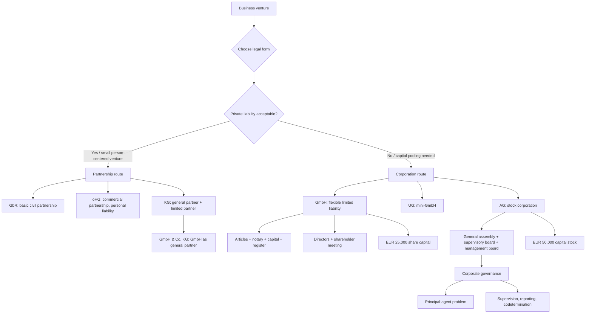
```mermaid
flowchart TD
    Start[Business venture] --> Choice{Choose legal form}
    Choice --> Liability{Private liability acceptable?}
    Liability -->|Yes / small person-centered venture| Partnership[Partnership route]
    Liability -->|No / capital pooling needed| Corporation[Corporation route]

    Partnership --> GbR[GbR: basic civil partnership]
    Partnership --> OHG[oHG: commercial partnership, personal liability]
    Partnership --> KG[KG: general partner + limited partner]
    KG --> GmbHCoKG[GmbH & Co. KG: GmbH as general partner]

    Corporation --> GmbH[GmbH: flexible limited liability]
    Corporation --> UG[UG: mini-GmbH]
    Corporation --> AG[AG: stock corporation]

    GmbH --> Formation[Articles + notary + capital + register]
    GmbH --> Bodies[Directors + shareholder meeting]
    GmbH --> Capital[EUR 25,000 share capital]

    AG --> AGBodies[General assembly + supervisory board + management board]
    AG --> CapitalStock[EUR 50,000 capital stock]
    AGBodies --> Governance[Corporate governance]

    Governance --> PA[Principal-agent problem]
    Governance --> Control[Supervision, reporting, codetermination]
```

## Subject Knowledge Graph

| Node | Meaning | Exam Relevance |
|---|---|---|
| Business Association | Legal organization for joint business activity | Starting point for company-law classification. |
| Partnership | Person-centered association such as GbR, oHG, or KG | Explains personal liability and partner dependence. |
| Corporation | Entity-centered legal form such as GmbH or AG | Explains limited liability and corporate bodies. |
| GbR | Basic civil-law partnership | Suitable for small non-commercial joint enterprise. |
| oHG | Commercial general partnership | All partners personally liable. |
| KG | Limited partnership | Splits unlimited general partner and limited partner roles. |
| GmbH | Limited liability company | Main SME limited-liability form. |
| UG | Mini-GmbH | Low-capital limited-liability option with reserve duty. |
| AG | Stock corporation | Larger, more rigid corporation with dualistic governance. |
| Articles Of Association | Constitutional document of GmbH/AG | Controls formation, governance, and internal rules. |
| Managing Director | GmbH organ representing and managing the company | Representation and liability gateway. |
| Shareholder Meeting | GmbH body forming shareholder decisions | Appointment, profit use, claims against directors. |
| Supervisory Board | Oversight body, mandatory in AG and some larger GmbHs | Central corporate-governance tool. |
| Management Board | AG management organ | Runs and represents AG without shareholder instructions. |
| Corporate Governance | Rules for management and supervision | Solves principal-agent and transparency problems. |

| From | Relationship | To | Why It Matters |
|---|---|---|---|
| Legal-form choice | depends on | Liability, capital, governance, tax, disclosure | Exam theory questions often ask suitability. |
| GbR | is base form for | Partnerships | Start small partnership analysis here. |
| oHG | requires | Commercial business | Connects company law to trade law. |
| KG | separates | General partner and limited partner | Explains liability design. |
| GmbH & Co. KG | uses | GmbH as general partner | Limits natural-person liability in KG structure. |
| GmbH | is | Legal person and merchant by form | Connects company law to trade law and representation. |
| GmbH formation | requires | Articles, notary, capital, register | Four-step formation route. |
| GmbH director | represents | GmbH | Connects agency/company law. |
| Shareholder meeting | controls | Director appointment and profit use | Governance and internal power. |
| AG | uses | Dualistic system | Separates owners, supervision, management. |
| Corporate governance | responds to | Principal-agent problem | Explains why boards/reporting exist. |

## Real Business Examples

### Small Gardening Business

Two people offer gardening services to private customers with modest revenue and simple operations. A GbR is usually the natural low-formality option. oHG is not necessary unless the type or scope requires a commercial business operation. GmbH or UG could limit liability, but may be costly or reputation-heavy relative to the scale.

### Risky Hardware Startup

Founders expect high contract values, product liability risk, outside financing, and employee growth. A GmbH may be suitable because limited liability, reputation, and share-transfer structure matter more than low-formality setup.

### Capital-Market Growth Case

A mature firm wants broad investor participation and standardized governance. AG may be appropriate because share trading and investor protection matter, but formation, governance, and disclosure become more rigid.

## Exam Relevance

Likely prompts:

- Explain differences between partnerships and corporations.
- Recommend a legal form for a small business case.
- Compare GbR, oHG, KG, GmbH, UG, and AG.
- Explain GmbH formation.
- Explain the GmbH director's role and liability.
- Explain AG corporate bodies and the dualistic system.
- Explain corporate governance as a response to the principal-agent dilemma.

Common traps:

- Treating limited liability as "no liability."
- Recommending GmbH for every business without discussing capital, cost, and financing friction.
- Forgetting that oHG partners are personally liable.
- Treating UG as identical to GmbH without reserve/reputation issues.
- Giving AG shareholders instruction powers like GmbH shareholders.
- Describing corporate governance as ethics only instead of management/supervision control.

High-scoring answer structure:

```text
1. Identify business size, risk, financing, and governance needs.
2. Classify possible legal forms.
3. Compare liability and formation burden.
4. Compare representation and governance.
5. State recommendation and one rejected alternative.
```

## Retrieval Prompts

Closed-book questions:

1. What is the main difference between partnerships and corporations?
2. Why does legal-form choice affect liability and financing?
3. When is a GbR suitable?
4. What is the liability split in a KG?
5. Why does a GmbH require share capital?
6. What are the four steps of GmbH formation?
7. What is the role of the GmbH shareholder meeting?
8. What makes a UG different from a regular GmbH?
9. What are the three main AG corporate bodies?
10. What problem does corporate governance solve?

Application prompts:

1. Two founders run a small gardening service with EUR 60,000 annual revenue. Recommend one suitable form and one unsuitable form.
2. A founder wants limited liability but has almost no starting capital. Compare UG and GmbH.
3. A growing company wants many passive investors and stronger share transferability. Explain why AG may fit but has governance costs.

## Practice Tasks

1. Create a comparison table for GbR, oHG, KG, GmbH, UG, and AG with columns: liability, formation burden, governance, best use case.
2. Write a legal-form recommendation paragraph for a startup, a small craft business, and a mature public-facing company.
3. Draw the AG dualistic system from memory and label who appoints whom.
4. Explain in five sentences why limited liability creates both business benefits and creditor risks.

## Connections

Previous notes from this lecture:

- `business-law/wiki/week-07-agency/week-07-agency.md` for representation and internal/external authority.
- `business-law/wiki/week-11-trade-law/week-11-trade-law.md` for merchant status and commercial register.
- `business-law/wiki/week-10-transfer-of-property/week-10-transfer-of-property.md` for asset ownership versus company ownership.

Cross-course links:

- Organization: corporate governance is a formal organization design and control system.
- Finance: legal form affects liability, financing access, tax, disclosure, and investor claims.
- Marketing: reputation of GmbH, UG, or AG can influence customer and supplier trust.

## Weakness Flags

- First-pass active recall not yet completed.
- Test legal-form recommendation with one small-business case.
- Test difference between GmbH director and AG management board.
- Test "limited liability means company liable, shareholders protected" wording.


<div class="page-break"></div>

# [W12-13.2] Week 12-13 Company Law I And II Cheatsheet And Tricks

<p class="source-path">Source: <code>business-law/wiki/week-12-13-company-law-i-ii/week-12-13-company-law-i-ii-cheatsheet-and-tricks.md</code></p>

Course: Business Law
Exam date: 2026-07-28
Source: week-12-13-company-law-i-ii.md

## Must-Know (exam-critical)

| Item | Anchor | Core content |
|---|---|---|
| Legal-form route | — | `identify venture/risk -> classify partnership or corporation -> identify legal form -> who represents -> who is liable -> which body decides -> financing/tax/disclosure consequence` |
| GbR | Sections 705 ff. BGB | Basic civil-law partnership, often arises tacitly, person-centered, personal liability is the default risk. |
| oHG | Sections 105 ff. HGB | Commercial general partnership; every partner personally liable; commercial-register registration required. |
| KG | Sections 161, 105 ff. HGB | Komplementaer (general partner) = unlimited liability + management/representation; Kommanditist (limited partner) = liability capped at agreed contribution. |
| GmbH & Co. KG | — | KG where the general partner is itself a GmbH, so practical liability risk shifts to GmbH company assets instead of a natural person. |
| GmbH legal status | Section 13 GmbHG | Independent legal person; shareholders generally not personally liable once capital contribution is fulfilled; GmbH liable with its own assets. |
| GmbH as merchant | Section 6 HGB, Section 13 GmbHG | GmbH is a merchant by legal form regardless of actual business activity. |
| GmbH share capital | Section 5 GmbHG | Minimum EUR 25,000; contributions in cash or in kind (in-kind needs value specification/expert valuation). |
| GmbH formation steps | Sections 2, 3, 5, 11 GmbHG | `draft articles -> notarize -> pay share capital -> register` — registration is constitutive (no full GmbH before it). |
| Articles of association mandatory content | Section 3 I GmbHG | Business name, company object, registered office, managing-director appointment, share capital. |
| GmbH directors | Section 35 GmbHG | Represent and manage the GmbH; internal representation limits generally do not defeat external effect (Section 37 GmbHG); appointment revocable by shareholder resolution (Section 38 GmbHG). |
| Director duties | Section 43 I GmbHG | Duty of loyalty (company interest first), duty of care (proper management/compliance), insolvency-crisis duties (Section 15a InsO filing duty); personal liability for breach. |
| Shareholder meeting competences | Section 46 GmbHG | Appointment/dismissal of directors, appointment of Prokuristen, claims against directors, use of profits. |
| UG | Section 5a GmbHG | "Mini-GmbH": no EUR 25,000 minimum (EUR 1 can suffice), cash-only contributions, must reserve at least 25% of annual surplus until it can convert. |
| AG legal status | Section 1 I 2 AktG | Stock corporation, legal person, liability limited to AG assets; governed by AktG; stricter formation/capital-raising rules than GmbH. |
| AG minimum capital | — | EUR 50,000 capital stock (vs. GmbH's EUR 25,000). |
| AG dualistic system | Sections 84, 90, 101, 111, 119 AktG | General assembly (elects/dismisses supervisory board, basic decisions) → supervisory board (appoints/dismisses + supervises management board) → management board (manages and represents the AG). |
| Corporate governance | — | Rules/structures answering the principal-agent problem between owners, managers, workers, creditors, and other stakeholders. |

## Nice-to-Have (depth/edge cases)

- Sample (simplified) articles of association: faster/cheaper, meet only the statutory minimum, usable up to three shareholders and one managing director, but less customizable — worth mentioning only if the case is a very small, simple GmbH founding.
- Approximate GmbH formation cost (~EUR 1,250 plus share capital) and duration (~4-6 weeks); shell company as an alternative route to skip formation lead time.
- GmbH supervisory board is optional for small GmbHs, mandatory only once co-determination thresholds (larger, employee-count-driven) are met — the deck defers to AG supervisory-board logic for its rights/duties.
- GmbH tax basics: corporate income tax + municipal trade tax together roughly just under 30%, plus withholding tax on distributions — useful color for a "why not always choose GmbH" answer, not central doctrine.
- SE (Societas Europaea) and KGaA are named as existing forms in the deck's category map but get no separate treatment — mention only if a case explicitly names one.
- Shareholder rights taxonomy: asset right (profit share), information right, co-management right (voting) — useful if a question asks specifically what shareholders can do, distinct from what directors can do.

## Nuances And Traps

| Nuance/Trap | Why it's easy to get wrong | Correct handling |
|---|---|---|
| "Limited liability" read as "no liability" | Students conflate limiting shareholder exposure with the company itself escaping liability. | The company is still fully liable with its own assets; only the shareholders' private assets are shielded once capital contribution duties are met. |
| Confusing shareholder and director | A shareholder can be a director, so the roles look interchangeable. | They are legally distinct organs/positions — ownership (shareholder meeting rights) is separate from management/representation (director duties under Section 43). |
| Recommending GmbH by default | GmbH "sounds safe" so it becomes the reflex answer for every legal-form question. | Always run the full factor list (liability, formation cost, capital, governance, disclosure, financing, tax, reputation) and explicitly reject at least one alternative — a bare GmbH recommendation without downside discussion scores poorly. |
| Forgetting oHG partners are personally liable | oHG "sounds like a normal partnership," easy to assume some liability cap exists. | All oHG partners are personally liable with private assets — there is no built-in liability shield, unlike GmbH & Co. KG. |
| Treating UG as a free/no-downside GmbH | UG needs only EUR 1, which reads as strictly better than GmbH. | UG is cash-only, must pay in full immediately, carries lower reputation, often still needs bank personal guarantees, and must build a 25% annual-surplus reserve (Section 5a III GmbHG) until it can convert — it lowers the entry barrier, not the risk. |
| Giving AG shareholders GmbH-style instruction power | GmbH shareholders can meaningfully steer directors, so students assume AG shareholders can steer the management board the same way. | AG uses a dualistic system — shareholders act only through the general assembly for limited fundamental decisions; the management board manages and represents the AG independently, supervised (not instructed) by the supervisory board. |
| Recommending oHG just because two people run a business together | Two co-founders "feels like" a partnership case automatically pointing to oHG. | Ask whether the business is commercial in type or scope first — a small, non-commercial joint venture is a GbR, not an oHG; oHG requires actual commercial-business status. |
| Treating "internal restriction on a director's representation power" as binding on outsiders | Company law readers import the general contract-law instinct that written internal rules control external effect. | Section 37 GmbHG: internal limits in the articles generally do not defeat a director's external representation power — mirrors the agency-law internal/external split from Week 07. |
| Assuming GmbH is "formed" once articles are signed and notarized | Notarization feels like the finish line since it is the most formal-looking step. | Registration in the commercial register is constitutive — before registration there is no full GmbH legal person yet, even with notarized articles and paid-in capital. |

## One-Line Recall Drill

```text
GbR = 705 ff. BGB, person-centered, default personal liability
oHG = 105 ff. HGB, commercial, all partners personally liable
KG = Komplementaer unlimited / Kommanditist limited
GmbH & Co. KG = GmbH as general partner, shifts liability off natural persons
GmbH = 13 GmbHG legal person, 25,000 EUR capital, merchant by form (6 HGB)
GmbH formation = draft -> notarize -> pay capital -> register (constitutive)
Section 35 = directors represent; Section 37 = internal limits don't bind externally
Section 43 I = loyalty + care + insolvency duties
Section 46 = shareholder meeting: appoint/dismiss directors, Prokuristen, profit use
UG = 5a GmbHG, cash-only, 25% reserve duty, mini-GmbH
AG = 1 I 2 AktG, 50,000 EUR capital stock, dualistic system
AG chain = general assembly -> supervisory board -> management board
corporate governance = how a company controls those who control the company
```


<div class="page-break"></div>

# [W12-13.3] Week 12-13 Company Law I And II Practice Questions And Model Answers

<p class="source-path">Source: <code>business-law/wiki/week-12-13-company-law-i-ii/week-12-13-company-law-i-ii-practice-questions-and-model-answers.md</code></p>

Course: Business Law
Exam date: 2026-07-28
Source: week-12-13-company-law-i-ii.md, week-12-13-company-law-i-ii-cheatsheet-and-tricks.md
Format note: 23 questions — 11 short-answer/theory, 12 case/legal-opinion (schema-based). Integration questions: Question 6 (Week 07 Agency), Question 13 (Week 11 Trade Law), Question 15 (Week 11 Trade Law), Question 16 (Week 01-02 Introduction to Business Law), Question 23 (Week 10 Transfer of Property).

## Short-Answer / Theory Questions

### Question 1

What is a GmbH, and what makes it the central limited-liability form for small and medium-sized businesses?

**Model Answer:**

1. A GmbH is an independent legal person and limited-liability company governed by the GmbHG, in which shareholders are generally not personally liable once their capital contribution duties are fulfilled.
2. Statutory anchor: Section 13 GmbHG (legal personality and asset separation); Section 5 GmbHG (minimum share capital).
3. Requirements/features: (1) formed through articles of association, notarization, capital payment, and constitutive registration; (2) minimum share capital of EUR 25,000; (3) represented by one or more managing directors under Section 35 GmbHG.
4. Example: two engineers found "BuildTech GmbH" to limit their personal exposure to product-liability risk from selling construction software.
5. Consequence/trap: "limited liability" means the company remains fully liable with its own assets — shareholders are not partially liable, they are not personally liable at all once contribution duties are met.

### Question 2

Compare GmbH governance and AG governance.

**Model Answer:**

GmbH governance triggers when a small/medium business wants flexible, more directly shareholder-controlled management: the shareholder meeting can instruct directors, and directors (Section 35 GmbHG) both manage and represent the company, subject only to internal limits that do not bind third parties (Section 37 GmbHG). Leading to: a comparatively fast, cheap, adaptable governance structure suited to closely held businesses.

AG governance triggers when a company wants broad, transferable investor participation and capital-market readiness: it uses a mandatory dualistic system (Sections 84, 90, 101, 111, 119 AktG) — the general assembly elects/dismisses the supervisory board and makes fundamental decisions, the supervisory board appoints/dismisses and supervises the management board, and the management board manages and represents the AG independently. Leading to: a standardized, rigid governance structure that protects dispersed shareholders and supports share trading, at the cost of direct shareholder control over daily management.

Contrast example: a GmbH shareholder meeting can vote to directly instruct a director to reject a specific contract; an AG general assembly cannot instruct the management board the same way — its lever is electing the supervisory board, which in turn supervises (not instructs) the management board.

Exam trap: do not give AG shareholders GmbH-style instruction power over daily management decisions.

### Question 3

List the requirements for forming a GmbH.

**Model Answer:**

The requirements are:

1. Draft the articles of association (mandatory content under Section 3 I GmbHG: business name, company object, registered office, managing-director appointment, share capital).
2. Notarize the articles of association before a notary; any later amendment needs notarization again.
3. Pay the share capital (minimum EUR 25,000; a portion, commonly at least EUR 12,500, is typically paid in before registration).
4. Register the GmbH in the commercial register — this step is constitutive.

If these are met, the consequence is that a fully formed GmbH legal person exists from registration onward; before registration, there is no full GmbH even with notarized articles and paid-in capital.

The rule exists because each step protects a different interest: articles set internal governance certainty, notarization ensures deliberate and evidenced formation, capital payment protects creditors, and constitutive registration gives third parties a reliable public marker of when the limited-liability shield actually starts.

### Question 4

Three university friends want to launch a specialty coffee-roasting company. They expect to import green coffee (supply risk), sign multi-year lease and equipment-financing contracts, and hope to bring in an outside investor within two years, but currently have only about EUR 8,000 combined in savings. Recommend a legal form.

**Model Answer:**

1. Business scale and risk: capital-intensive early operations (equipment, leases, import contracts), meaningful contractual and supply risk, and an anticipated future capital raise from an outside investor — this points away from an unlimited-liability form.
2. Default/simple form: given only EUR 8,000 in savings, a full GmbH (EUR 25,000 minimum share capital) is not immediately affordable — the natural default at this capital level is a GbR, but that leaves all three founders personally, unlimitedly liable for lease and import-contract risk.
3. Alternative(s) considered: an oHG would formalize the commercial partnership but keeps full personal liability, a poor fit given the leasing/import risk; a UG (Unternehmergesellschaft) allows formation with far less capital while still shielding personal assets.
4. Liability/governance/formation cost/financing comparison: the UG limits liability to company assets and matches the low starting capital (cash-only contribution, paid in full immediately), but carries a mandatory 25% annual-surplus reserve requirement (Section 5a III GmbHG) until it can convert into a full GmbH, has lower reputation with lenders/investors, and banks may still request personal guarantees.
5. Recommendation: form a UG now to secure liability protection immediately, with an explicit plan to convert to a full GmbH once the reserve (plus any future investor capital injection) reaches EUR 25,000 — rejecting a bare GbR (unacceptable personal liability given import/lease risk) and an immediate GmbH (unaffordable at EUR 8,000 combined capital).

## Case / Legal-Opinion Questions

### Question 5 (Case)

**Facts:** A and B jointly run a mid-size furniture import and wholesale business under the name "Nordwood Handel." The business generates significant recurring revenue, employs five staff, and is entered in the commercial register as an oHG. A signs a EUR 40,000 supply contract with a Polish timber mill on behalf of the business. The business later becomes insolvent and cannot pay. The timber mill wants to know if it can pursue B's personal assets even though B never personally signed anything.

**Question:** Does the timber mill have a claim against B personally for the EUR 40,000?

**Model Answer:**

I. Claim/issue sentence: The timber mill could have a claim against B personally for EUR 40,000 under the oHG personal-liability rule if B is a partner in an oHG whose partner validly bound the partnership to the supply contract.

II. Requirements:
- I. Nordwood Handel qualifies as an oHG.
- II. A validly bound the oHG to the EUR 40,000 contract.
- III. oHG partners are personally liable for partnership debts.
- IV. Legal consequence for B.

III. Application:

- I. Questionable is whether Nordwood Handel is an oHG. This is supported by the facts stating it is a commercial business (furniture import/wholesale, recurring revenue, five staff) entered in the commercial register — matching the requirement of a registered commercial general partnership. Consequently, this requirement is met.
- II. Questionable is whether A's signature validly bound the partnership. As a partner in a commercial partnership, A ordinarily has representation power for the partnership's business; nothing in the facts suggests A lacked authority to sign an ordinary supply contract for the business. Consequently, this requirement is met.
- III. Questionable is whether B, who never personally signed, is nonetheless liable. Against this, one could argue B's lack of personal involvement should shield them. However, the defining feature of an oHG is that every partner is personally liable for partnership obligations, regardless of which partner concluded the specific transaction — unlike a GmbH, there is no built-in liability shield. Consequently, this requirement is met.
- IV. Since the oHG itself owes EUR 40,000 and cannot pay, the timber mill may pursue any partner's private assets, including B's.

IV. Interim result: all requirements met.

V. Final answer: As a result, the timber mill can claim the EUR 40,000 from B personally, because B is a personally, unlimitedly liable partner in the oHG that validly incurred the debt.

### Question 6 (Case — integrates Week 12-13 + Week 07)

**Facts:** C is the sole managing director of Bright Ideas GmbH. The GmbH's articles of association state that any contract above EUR 50,000 requires prior approval from the shareholder meeting. Without seeking that approval, C signs a EUR 120,000 consulting contract on behalf of the GmbH with "Bright Ideas GmbH" as one party — and C personally as the other party, since C also operates a private consulting practice on the side. The shareholders were never asked and never learned of the arrangement until after the work began.

**Question:** (a) Is the GmbH bound to the EUR 120,000 contract despite the missing shareholder approval? (b) Is the contract between C-as-director and C-as-private-consultant valid?

**Model Answer:**

I. Claim/issue sentence: Bright Ideas GmbH could be bound to the EUR 120,000 contract under Section 35 GmbHG if C had representation power as managing director, and the contract could additionally be invalid under Section 181 BGB if C contracted with themselves without a valid exception.

II. Requirements:
- I. C's general representation power as GmbH director (Section 35 GmbHG).
- II. Effect of the internal EUR 50,000 approval requirement (Section 37 GmbHG / can-do vs. may-do).
- III. Self-dealing under Section 181 BGB.
- IV. Legal consequence.

III. Application:

- I. Questionable is whether C, as sole managing director, has power to represent the GmbH externally. This is supported by Section 35 GmbHG, under which the GmbH is represented by its director(s); as sole director, C holds full external representation power — this mirrors the Section 164 I BGB agency requirement of acting within a power of representation (Week 07), except here the power is organ-based rather than an ordinary Vollmacht. Consequently, this requirement is met.
- II. Questionable is whether the missing shareholder approval defeats the contract's validity toward the consulting counterparty. Against this, one could argue that a EUR 50,000 threshold set in the articles should control any larger transaction. However, Section 37 GmbHG provides that internal limitations on a director's representation power generally do not affect its external validity — the same can-do/may-do split used in ordinary agency (Week 07, Section 164 I framework): C's external "can do" stays intact, and the shareholder-approval breach only creates internal recourse against C (e.g., under the Section 43 I GmbHG duty of care/loyalty), not external invalidity. Consequently, this requirement (validity toward the outside contract) is met — the GmbH remains bound in principle on this point alone.
- III. Questionable is whether the contract is nonetheless invalid because C appears on both sides — as the GmbH's representative and as the private consultant. This is supported by Section 181 BGB, which by default bars a representative from contracting with themselves (self-contracting) unless an exception applies (prior permission, later ratification, performance of an existing obligation, or a transaction legally advantageous only to the principal) — the same self-dealing rule tested in ordinary agency (Week 07). None of these exceptions is shown on the facts: the shareholders gave no prior permission and did not ratify, this is a new obligation rather than performance of an existing one, and a EUR 120,000 consulting contract is not purely beneficial to the GmbH. Consequently, this requirement (a Section 181 exception applying) is not met, so the self-dealing prohibition applies and the contract is provisionally invalid.
- IV. Because Section 181 independently blocks the transaction, the internal-limit analysis under II does not save it — self-dealing is a stronger defect than an ordinary internal-instruction breach, since it removes the independent counterparty bargain the can-do/may-do split assumes (Week 07 nuance: Section 181 can restrict external power itself, not just create internal liability).

IV. Interim result: representation power exists (I, II), but Section 181 self-dealing is not excused (III) — the contract is provisionally invalid.

V. Final answer: As a result, (a) the missing shareholder approval alone would not have stopped the GmbH from being bound, because internal limits under Section 37 GmbHG do not defeat external representation power; but (b) the contract is nonetheless provisionally invalid under Section 181 BGB because C contracted with themselves without any applicable exception, unless the shareholders now ratify it.

### Question 7 (Case)

**Facts:** Solaris AG's supervisory board, frustrated with slow decision-making, passes a resolution directly instructing the management board to reject a specific EUR 2 million supply contract with a named vendor, and further instructs the management board to instead sign with a vendor the supervisory board prefers. The management board complies without independently assessing the decision, believing it is bound to follow supervisory board instructions the way a GmbH director would follow shareholder instructions.

**Question:** Was the supervisory board entitled to instruct the management board this way, and does the management board's compliance affect its own responsibility for the decision?

**Model Answer:**

I. Claim/issue sentence: The management board's independent management authority could be violated by the supervisory board's resolution if AG governance does not permit the supervisory board to give binding instructions on ordinary business decisions.

II. Requirements:
- I. Allocation of functions in the AG dualistic system.
- II. Scope of supervisory board powers.
- III. Consequence of following an instruction the supervisory board was not entitled to give.

III. Application:

- I. Questionable is whether the supervisory board may direct specific business decisions the way a GmbH shareholder meeting can direct a director. This is supported by the AG's dualistic structure: the general assembly elects/dismisses the supervisory board and makes fundamental decisions, the supervisory board appoints/dismisses and supervises the management board, and the management board manages and represents the AG. Consequently, management authority and representation sit with the management board, not the supervisory board.
- II. Questionable is whether "supervision" includes issuing direct operational instructions like choosing a specific vendor. Against this, one could argue a supervisory body naturally has some steering power. However, the AG structure is deliberately more rigid than the GmbH precisely because AG shareholders — and, by extension, the supervisory board they elect — do not manage through instructions; supervision means oversight within its own competences, not substituting the supervisory board's business judgment for the management board's day-to-day decisions. Consequently, the supervisory board's resolution exceeds its proper role.
- III. Questionable is whether the management board is nonetheless shielded because it merely followed the resolution. This is supported by the general principle that the management board manages the AG under its own responsibility; it cannot delegate that responsibility to the supervisory board by simply deferring to an instruction the supervisory board was not entitled to give. Consequently, the management board is not excused and remains responsible for the underlying business decision.

IV. Interim result: the supervisory board's resolution exceeded its role in the dualistic system, and the management board's compliance does not shift responsibility for the decision back to the supervisory board.

V. Final answer: As a result, the supervisory board was not entitled to instruct the management board on this specific contract choice, and the management board remains responsible for its own decision to comply, because AG governance keeps management authority with the management board, supervised — not instructed — by the supervisory board.

### Question 8 (Case)

**Facts:** D forms "QuickFix UG (haftungsbeschränkt)" with EUR 500 in share capital, paid in cash immediately as required. In its first profitable year, QuickFix UG earns EUR 40,000 in annual surplus. D wants to distribute the entire EUR 40,000 to themselves as the sole shareholder, arguing that since the UG only required EUR 500 to start, there are no further capital-related restrictions once the company is running.

**Question:** Can D lawfully distribute the entire EUR 40,000 surplus?

**Model Answer:**

I. Claim/issue sentence: D's entitlement to distribute the full EUR 40,000 surplus could be limited if the UG's statutory reserve obligation restricts how much of the annual surplus may be paid out.

II. Requirements:
- I. QuickFix UG's legal form and applicable capital rules.
- II. Statutory reserve requirement under Section 5a III GmbHG.
- III. Consequence for the distribution.

III. Application:

- I. Questionable is whether the low EUR 500 starting capital means no further capital rules apply. This is supported by the fact that a UG can be formed with as little as EUR 1 and only cash contributions — but this describes formation, not the ongoing capital regime. Consequently, formation capital alone does not answer the distribution question.
- II. Questionable is what ongoing obligation applies to annual profits. This is supported by Section 5a III GmbHG, under which a UG must place at least 25% of its annual surplus into a statutory reserve until, combined with existing share capital, it reaches the EUR 25,000 GmbH threshold. Against this, D could argue full owner discretion applies once the company is profitable. However, the reserve duty exists specifically to compensate for the UG's low entry capital and protect creditors, and it is mandatory, not optional. Consequently, this requirement is met — the reserve obligation applies to QuickFix UG's EUR 40,000 surplus.
- III. Applying the 25% figure, at least EUR 10,000 of the EUR 40,000 surplus must be retained in the statutory reserve; only the remaining EUR 30,000 is available for distribution to D, subject to any other statutory or articles-based restrictions.

IV. Interim result: the reserve requirement applies and caps the distributable amount below the full surplus.

V. Final answer: As a result, D cannot lawfully distribute the entire EUR 40,000 — at least 25% (EUR 10,000) must be retained in the statutory reserve under Section 5a III GmbHG, leaving at most EUR 30,000 available for distribution.

## Short-Answer / Theory Questions (Continued)

### Question 9

Compare partnerships and corporations as the two basic categories of German business associations.

**Model Answer (Compare Schema):**

Partnerships (GbR, oHG, KG, GmbH & Co. KG) trigger when a business stays close to its individual members: the entity is person-centered, representation is usually tied to the partners themselves, and — with the partial exception of GmbH & Co. KG — at least one partner is personally liable with private assets alongside the entity, while partners are taxed individually rather than the entity itself. Leading to: flexible, low-formality structures well suited to smaller, closely held ventures where the partners are willing to accept personal exposure in exchange for governance simplicity.

Corporations (GmbH, UG, AG) trigger when a business wants the entity to stand more independently from its members: they are separate legal persons represented by dedicated organs (directors for GmbH/UG, a management board for AG) rather than by the members directly, liability is generally limited to the entity's own assets once capital duties are fulfilled, and the entity itself is taxed rather than the members. Leading to: more structured, formality-heavy setups (notarization, minimum capital, registration) that in exchange give members a liability shield and, for GmbH/AG, easier change of ownership than in a person-centered partnership.

Contrast example: an oHG partner who never personally signed a contract can still be personally sued by a creditor for the partnership's full debt (Question 5); a GmbH shareholder who never personally signed anything cannot be pursued for the GmbH's debts once their capital contribution is paid in, because the corporation, not the shareholder, is the liable legal person.

Exam trap: do not assume every partnership lacks any liability shield at all — GmbH & Co. KG is a partnership by category (KG) that nonetheless shifts practical liability risk onto a corporation (the GmbH general partner) rather than a natural person; classify by legal consequence, not just by the partnership/corporation label.

### Question 10

Explain the three categories of GmbH director duties under Section 43 I GmbHG and the consequence of breaching them.

**Model Answer:**

1. Section 43 I GmbHG imposes a bundle of duties on GmbH managing directors because directors control company assets and decisions without being the residual risk-bearers — that role belongs to the shareholders.
2. Statutory anchor: Section 43 I GmbHG; insolvency filing duty under Section 15a InsO.
3. Requirements/features: (1) duty of loyalty — put company interests first, avoid competition with the company and undisclosed conflicts of interest; (2) duty of care — proper day-to-day management and compliance with legal/regulatory obligations; (3) insolvency-crisis duties — once the company is in financial crisis, heightened duties arise, including the duty to file for insolvency under Section 15a InsO.
4. Example: a director who quietly diverts a lucrative supply contract to their own side business rather than the GmbH breaches the duty of loyalty even if the GmbH suffers no other operational failure.
5. Trap: breach of any of these duties can expose the director to personal liability toward the company — do not assume the GmbH's separate legal personality (Section 13 GmbHG) also shields the director's own conduct; the liability shield protects shareholders from the company's debts, not directors from their own duty breaches.

### Question 11

List the requirements a business advisor must work through before recommending a legal form, and state the consequence of skipping this analysis.

**Model Answer (List-Requirements Schema):**

The requirements are:

1. Liability exposure the founders are willing to accept.
2. Formation process burden (notary, registration, timing).
3. Capital requirements the venture can realistically raise.
4. Governance flexibility needed (person-centered control vs. structured organs).
5. Disclosure duties the business is willing to bear.
6. Financing sources and how they weigh reputation, liability, capital, and transferability.
7. Tax aspects (entity-level vs. partner-level taxation).
8. Ease of changing shareholders/partners over time.
9. Reputation signal the form sends to counterparties.
10. Liability pitfalls that survive formation (insolvency duties, director duties, capital rules).

If these are met — i.e., all factors are actually weighed against the specific venture's facts — the consequence is a defensible, fact-driven legal-form recommendation that explicitly rejects at least one plausible alternative.

The rule exists because the "best" legal form is not the one with the fewest formalities or the most familiar name; it is the one whose liability, governance, financing, and cost profile match the business risk — a bare "recommend GmbH" answer without running this list and rejecting an alternative scores poorly precisely because it skips the analysis the multi-factor test is meant to force.

### Question 12

Explain the GmbH & Co. KG structure and why a business might choose it over a plain KG.

**Model Answer:**

1. GmbH & Co. KG is a KG (limited partnership) in which the general partner (Komplementaer) role — which normally carries unlimited personal liability — is filled by a GmbH rather than a natural person.
2. Statutory anchor: Sections 161, 105 ff. HGB (KG/oHG partnership structure); Section 13 GmbHG (GmbH liability limited to company assets).
3. Requirements/features: (1) the KG still needs at least one general partner (here, the GmbH) and one limited partner (Kommanditist, liable only up to their agreed contribution); (2) the GmbH general partner itself bears unlimited liability for the KG's debts, but since the GmbH is a limited-liability company, the practical liability risk for the natural persons behind it is shifted to the GmbH's own company assets; (3) the structure keeps partnership-style features (person-centered governance, partner-level taxation for the KG's share) while functionally capping the exposure of the humans involved.
4. Example: a family logistics business structures itself as "Familie Weber GmbH & Co. KG," where Weber GmbH (owned by the family) is the general partner and the family members hold Kommanditist shares — a creditor pursuing the KG's unpaid debt can reach Weber GmbH's assets as general partner, but not the family members' personal assets directly.
5. Trap: do not describe a GmbH & Co. KG as eliminating unlimited liability altogether — the general-partner role's unlimited liability still exists in law, it is simply borne by a corporation (the GmbH) instead of a natural person; the KG itself remains a partnership, not a corporation.

### Question 13 (Theory — integrates Week 12-13 + Week 11)

Explain why a GmbH is always classified as a merchant under trade law regardless of its actual business activity, and contrast this with the general merchant test.

**Model Answer:**

1. Merchant status under the HGB normally depends on running a commercial business of a certain type or scale (the general Week 11 gateway), but corporations such as the GmbH are merchants automatically, without that scale/type inquiry.
2. Statutory anchor: Section 6 I HGB together with Section 13 III GmbHG (merchant by legal form); contrast anchor: Section 1 HGB (general merchant gateway) and Section 2 HGB (small-business opt-in registration).
3. Requirements/features: (1) under the general Section 1 HGB route, a business becomes a merchant only if it runs a commercial business, presumed unless its type or scope does not require commercial organization; (2) a small business below that threshold can still become a merchant by choosing to register (Section 2 HGB); (3) a GmbH skips both inquiries entirely — Sections 6 I HGB and 13 III GmbHG deem it a merchant purely because of its legal form, regardless of whether its actual activity is small, large, commercial, or even non-commercial in character.
4. Example: a one-person GmbH that only manages a single rental apartment as a passive asset-holding vehicle is still a merchant by legal form, even though the same activity run by a natural person would likely fail the Section 1 HGB commercial-scale test.
5. Trap: do not run the Section 1 HGB scale/type test on a GmbH or AG — that test is for natural persons and non-corporate business operators; for any GmbH, AG, or similar corporate form, merchant status is automatic and the analysis should go straight to Section 6 HGB / Section 13 III GmbHG.

## Case / Legal-Opinion Questions (Continued)

### Question 14 (Case)

**Facts:** "Seaside Charters KG" operates a boat-rental business. K is the sole Komplementaer (general partner) who manages daily operations and signs contracts. L is a Kommanditist who contributed EUR 15,000 as agreed in the partnership agreement and takes no part in management. K signs a EUR 60,000 contract for a new boat on behalf of the KG, and the business later cannot pay. The supplier wants to know whether it can pursue L personally beyond the EUR 15,000 L already contributed.

**Question:** Can the supplier recover the shortfall from L's personal assets beyond the EUR 15,000 contribution?

**Model Answer:**

I. Claim/issue sentence: The supplier could have a claim against L for the shortfall beyond EUR 15,000 only if L's status in Seaside Charters KG exposes L to liability beyond the agreed contribution, which the KG's liability split generally does not allow for a Kommanditist who has paid in full.

II. Requirements:
- I. Seaside Charters KG qualifies as a KG with K as Komplementaer and L as Kommanditist.
- II. K validly bound the KG to the EUR 60,000 contract.
- III. Scope of L's liability as Kommanditist.
- IV. Legal consequence for L.

III. Application:

- I. Questionable is whether the partnership is validly structured as a KG. This is supported by the facts stating K manages and signs for the business (matching the Komplementaer role) while L only contributed capital and takes no part in management (matching the Kommanditist role). Consequently, this requirement is met.
- II. Questionable is whether K's signature bound the KG. As Komplementaer, K holds the management and representation role for the KG; nothing in the facts suggests K lacked authority to sign an ordinary supply contract for the boat-rental business. Consequently, this requirement is met.
- III. Questionable is whether L can be pursued beyond the EUR 15,000 already contributed. Against this, the supplier could argue that KG partners generally face liability for partnership debts as a class, so any partner's personal assets should be available for the shortfall. However, the defining feature of a Kommanditist under the KG liability split is that liability is capped at the agreed contribution — L's role is precisely designed to separate the unlimited exposure of the Komplementaer from the capped exposure of the Kommanditist, and the facts show L's EUR 15,000 was already paid in as agreed. Consequently, this requirement (liability beyond EUR 15,000) is not met.
- IV. Because L's liability is capped and already satisfied by the paid-in contribution, the shortfall must instead be pursued against the KG's own assets and against K, whose liability as Komplementaer remains unlimited.

IV. Interim result: the KG/Komplementaer/Kommanditist structure is validly formed and the contract validly binds the KG (I, II), but L's liability is capped at the EUR 15,000 already contributed and not exceeded (III).

V. Final answer: As a result, the supplier cannot recover the shortfall from L's personal assets beyond the EUR 15,000 contribution; it must instead pursue the KG's remaining assets and K personally, since K bears unlimited liability as Komplementaer while L's liability as Kommanditist is capped at the agreed contribution already paid.

### Question 15 (Case — integrates Week 12-13 + Week 11)

**Facts:** "Hansen Logistik GmbH & Co. KG" runs a freight business; its general partner is Hansen Verwaltungs-GmbH, whose sole director is H. H, acting as director of the GmbH general partner, grants Prokura to employee P for the KG's freight operations, and P is duly entered in the commercial register as Prokurist with the signature "ppa." P then signs a EUR 90,000 fuel-supply contract on behalf of Hansen Logistik GmbH & Co. KG, exceeding an internal instruction from H that all fuel contracts above EUR 50,000 first be cleared with H personally — a limit P knew about but ignored. The fuel supplier had no knowledge of this internal instruction.

**Question:** (a) Is Hansen Logistik GmbH & Co. KG bound to the EUR 90,000 contract? (b) Whose assets can the supplier ultimately reach if the KG cannot pay?

**Model Answer:**

I. Claim/issue sentence: Hansen Logistik GmbH & Co. KG could be bound to the EUR 90,000 contract under the Prokura granted to P if that grant was valid and P's internal instruction breach does not defeat the supplier's reliance, with the further consequence question of which assets stand behind the KG's liability given its GmbH & Co. KG structure.

II. Requirements:
- I. Valid grant of Prokura to P for the KG.
- II. Effect of P's exceeding the internal EUR 50,000 instruction (Section 50 HGB).
- III. Whether the supplier's good faith is relevant/decisive.
- IV. Which assets stand behind the KG's resulting liability.

III. Application:

- I. Questionable is whether Prokura was validly granted to P. This is supported by the facts: H, as director of Hansen Verwaltungs-GmbH, held representation power for that GmbH under Section 35 GmbHG, and since Hansen Verwaltungs-GmbH is the Komplementaer with management/representation authority over the KG, H's grant of Prokura on the KG's behalf, followed by P's registration with the "ppa." signature (Section 51 HGB), matches the Sections 48-53 HGB Prokura-grant and publicity requirements. Consequently, this requirement is met.
- II. Questionable is whether P's breach of the internal EUR 50,000 clearance instruction defeats the KG's binding to the contract. Against this, one could argue an internal instruction that P personally knew about should control, since P was aware of the limit and ignored it anyway. However, Section 50 HGB provides that internal restrictions on a Prokurist's power are generally ineffective externally regardless of the Prokurist's own knowledge of them — what matters for defeating the third party's reliance is the third party's knowledge or the abuse being obvious, not the Prokurist's own awareness of the internal rule. Consequently, this requirement (external validity despite the breach) is met.
- III. Questionable is whether the supplier's good faith matters here. This is supported by the facts stating the supplier had no knowledge of the internal instruction — under the Section 50 HGB logic (echoing the Section 37 GmbHG can-do/may-do split used for GmbH directors, Question 6), a good-faith third party unaware of an internal limit can rely on Prokura's broad statutory scope (Section 49 I HGB). Consequently, this requirement is met, and P's breach only creates internal consequences for P (e.g., toward H/the GmbH), not external invalidity.
- IV. Since Hansen Verwaltungs-GmbH is the Komplementaer, it bears unlimited liability for the KG's debts as general partner — but because that Komplementaer is itself a GmbH, the practical liability risk for the EUR 90,000 shortfall lands on the GmbH's own company assets (Section 13 GmbHG), not on H's or any Kommanditist's personal assets, which is precisely the liability-shifting function of the GmbH & Co. KG structure.

IV. Interim result: Prokura was validly granted and its broad statutory scope survives P's breach of the internal instruction given the supplier's good faith (I-III); the KG is bound, and unlimited liability for the shortfall falls on the Komplementaer GmbH's own assets, not on H personally (IV).

V. Final answer: As a result, (a) Hansen Logistik GmbH & Co. KG is bound to the EUR 90,000 contract despite P's breach of the internal clearance instruction, because Section 50 HGB keeps that limit ineffective against a good-faith supplier; and (b) if the KG cannot pay, the supplier can reach the KG's own assets and then Hansen Verwaltungs-GmbH's company assets as the unlimited-liability Komplementaer, but not H's or any Kommanditist's personal assets, because the GmbH & Co. KG structure shifts that exposure onto the GmbH.

### Question 16 (Case — integrates Week 12-13 + Week 01-02)

**Facts:** "MedTech Solutions GmbH" sells a batch of laboratory equipment to the State University of Freiberg, a public university run directly by the state (a public-law institution). The University's purchasing office places the order through an ordinary written purchase order and purchase-price agreement, identical in form to how the University buys equipment from any private vendor. A dispute arises over a EUR 15,000 balance the University has not paid. A junior staff member at MedTech Solutions argues the company cannot sue in an ordinary civil court because "the other side is a public authority," and the matter must instead be a public-law dispute.

**Question:** Is the staff member correct that this is a public-law matter?

**Model Answer:**

I. Claim/issue sentence: MedTech Solutions GmbH's claim against the University could be a public-law matter only if the University acted with sovereign authority in this transaction, rather than as an ordinary market participant, which the classification test resolves independently of MedTech Solutions' own status as a GmbH.

II. Requirements:
- I. MedTech Solutions GmbH's capacity to contract as a legal person.
- II. Whether the University acted with sovereign authority or as an equal market participant.
- III. Legal consequence for the classification of the dispute.

III. Application:

- I. Questionable is whether MedTech Solutions GmbH, as a corporation rather than a natural person, can validly be a contracting party at all. This is supported by Section 13 GmbHG, under which the GmbH is an independent legal person with its own rights and obligations, fully capable of entering contracts through its director's representation power (Section 35 GmbHG); the GmbH's corporate status raises no barrier to the transaction being an ordinary sale. Consequently, this requirement is met.
- II. Questionable is whether the University's role in this purchase makes the dispute public law. Against this, the staff member's argument rests on the University being a public body and therefore "always" public law. However, the public/private law test does not turn on whether a public authority is a party, but on whether that authority acted with sovereign power in a position of superordination over the other party, or instead acted as an ordinary market participant; here, the University placed a purchase order and agreed a price exactly as any private buyer would, exercising no sovereign authority over MedTech Solutions GmbH — the two parties face each other as legal equals in an ordinary sales relationship. Consequently, this requirement (sovereign-authority action) is not met.
- III. Because the University acted as a market participant rather than with sovereign power, the transaction falls on the private-law side of the classification test regardless of the University's public-law status as an institution.

IV. Interim result: MedTech Solutions GmbH validly contracted as a legal person (I), and the University's conduct in this purchase does not meet the sovereign-authority requirement for public law (II), so the dispute is classified as private law (III).

V. Final answer: As a result, the staff member is incorrect — this is a private-law matter despite the University's public-law status as an institution, because the University acted as an ordinary market participant rather than exercising sovereign authority, and MedTech Solutions GmbH may pursue the EUR 15,000 balance in the ordinary civil courts like any other sales dispute.

### Question 17 (Case)

**Facts:** Three founders form "PrintCraft GmbH." One founder, F, contributes a used industrial printing press as an in-kind contribution instead of cash, declaring its value as EUR 20,000 toward the EUR 25,000 minimum share capital (the other two founders pay the remaining EUR 5,000 in cash). No independent expert valuation is obtained; F simply estimates the press's value based on its original purchase price years ago. An independent appraisal obtained later, after registration, shows the press was actually worth only EUR 9,000 at the time of contribution.

**Question:** Does the overvaluation of F's in-kind contribution affect whether PrintCraft GmbH's minimum share capital requirement was genuinely satisfied?

**Model Answer:**

I. Claim/issue sentence: PrintCraft GmbH's minimum share capital requirement could fail to be genuinely satisfied if F's in-kind contribution was overvalued, since in-kind contributions must reflect real value to serve the creditor-protection purpose of the capital rule.

II. Requirements:
- I. GmbH minimum share capital requirement (Section 5 GmbHG).
- II. Conditions for a valid in-kind contribution toward that capital.
- III. Effect of an overvalued in-kind contribution on the capital requirement.

III. Application:

- I. Questionable is whether PrintCraft GmbH's capital structure meets Section 5 GmbHG on its face. This is supported by the facts: EUR 20,000 (in kind) plus EUR 5,000 (cash) nominally reaches the EUR 25,000 minimum. Consequently, on paper this requirement appears met.
- II. Questionable is whether F's contribution was validly made as an in-kind contribution. This is supported by the rule that contributions in kind require specification of value and may require expert valuation, precisely because an asset (unlike cash) does not carry a self-evident value — the facts show no independent expert valuation was obtained and F relied on an outdated purchase price rather than current value. Consequently, this requirement (a properly evidenced in-kind valuation) is questionable and, on these facts, not solidly met.
- III. Questionable is whether the later-discovered true value (EUR 9,000, not EUR 20,000) undermines the capital requirement. Against this, one could argue that registration already occurred, so the formal capital requirement should be treated as settled. However, the entire point of requiring value specification and expert valuation for in-kind contributions is to prevent the minimum capital figure from being watered down on paper while creditors are told a company has EUR 25,000 backing it — an overvaluation by EUR 11,000 (EUR 20,000 claimed vs. EUR 9,000 actual) means the company never actually received real value up to the stated minimum, defeating the creditor-protection purpose the rule exists to serve. Consequently, this requirement (genuine satisfaction of the capital minimum) is not met.

IV. Interim result: the capital structure appears to meet EUR 25,000 formally (I), but the in-kind contribution was not properly evidenced (II) and, once its true value is known, does not actually provide real value up to the stated minimum (III).

V. Final answer: As a result, the overvaluation means PrintCraft GmbH's minimum share capital requirement was not genuinely satisfied in substance — only EUR 14,000 in real value (EUR 9,000 press plus EUR 5,000 cash) actually backs the company despite the EUR 25,000 stated on paper, undermining exactly the creditor-protection function that the in-kind valuation requirement is designed to guarantee.

### Question 18 (Case)

**Facts:** N is the sole managing director of "GreenBuild GmbH," a construction-materials supplier. Without informing the shareholders, N quietly starts a side business, "N Baustoffe," that sells the same construction materials to several of GreenBuild GmbH's existing customers at a slightly lower price, using contacts and pricing knowledge N gained through the director role. GreenBuild GmbH loses EUR 35,000 in revenue over six months as customers shift to N Baustoffe. The shareholders only discover the arrangement after review of customer records.

**Question:** Does GreenBuild GmbH have a claim against N for the lost revenue?

**Model Answer:**

I. Claim/issue sentence: GreenBuild GmbH could have a claim against N for the lost revenue if N's side business breaches the duty of loyalty owed by a GmbH director under Section 43 I GmbHG.

II. Requirements:
- I. N owed director duties to GreenBuild GmbH.
- II. N's conduct breaches the duty of loyalty specifically.
- III. Consequence of the breach.

III. Application:

- I. Questionable is whether N owed duties to GreenBuild GmbH at all. This is supported by the facts stating N is the sole managing director; Section 43 I GmbHG imposes duties of loyalty, care, and (in crisis) insolvency-related duties on exactly this role. Consequently, this requirement is met.
- II. Questionable is whether operating a competing side business breaches the duty of loyalty specifically, rather than merely being an unrelated personal venture. This is supported by the facts: N used contacts and pricing knowledge gained through the director role to sell the same materials to GreenBuild GmbH's own existing customers, undisclosed to the shareholders. Against this, N might argue that running a side business on personal time is not automatically disloyal. However, the duty of loyalty requires a director to put the company's interests first and avoid competition and undisclosed conflicts of interest — directly competing for the company's own customer base using role-derived knowledge, without disclosure or shareholder consent, is squarely the kind of conduct the duty of loyalty is designed to prevent. Consequently, this requirement is met.
- III. Because N is personally liable for breaches of Section 43 I GmbHG duties, and the facts show a quantifiable EUR 35,000 revenue loss traceable to N's competing business, GreenBuild GmbH has a basis to hold N personally liable for that loss.

IV. Interim result: N owed director duties (I), N's undisclosed competing business breaches the duty of loyalty (II), and personal liability for the resulting loss follows (III).

V. Final answer: As a result, GreenBuild GmbH has a claim against N for the EUR 35,000 in lost revenue, because N breached the Section 43 I GmbHG duty of loyalty by secretly competing for the company's own customers using role-derived knowledge, and directors are personally liable for such breaches.

## Short-Answer / Theory Questions (Coverage-Gap Fill)

### Question 19

Explain the GbR as the basic partnership form and state what pushes a partnership out of GbR status into oHG.

**Model Answer:**

1. The GbR (Gesellschaft bürgerlichen Rechts) is the default, most basic partnership form in German law, and functions as the general partnership model that oHG and KG borrow from when no more specific rule exists.
2. Statutory anchor: Sections 705 ff. BGB.
3. Requirements/features: (1) it often arises tacitly, simply through two or more people jointly pursuing a common purpose, without any formal founding act; (2) it is person-centered rather than entity-centered; (3) it is not a corporation, though it is legally independent enough to participate in legal relations in its own right; (4) personal liability of the partners is the default risk, since a GbR carries no built-in liability shield.
4. Example: two people jointly run a small gardening service for private customers without commercial scale — nothing more than that joint activity is needed for a GbR to exist.
5. Trap: do not assume a joint venture needs oHG's formalities (commercial-register registration) to exist as a partnership — a GbR requires no registration and can arise purely from conduct; it only becomes an oHG once the business reaches commercial type or scope, at which point registration in the commercial register becomes required.

### Question 20

List the GmbH shareholder meeting's core competences under Section 46 GmbHG and state the applicable voting-majority rule.

**Model Answer (List-Requirements Schema):**

The requirements are:

1. Appointment and dismissal of directors (Section 46 GmbHG; dismissal specifically operates through revocation of the appointment under Section 38 GmbHG).
2. Appointment of Prokuristen.
3. Assertion of the GmbH's claims against directors.
4. Decisions on the use of profits.

If these are met — i.e., a decision falls within one of these competences — the consequence is that a simple majority resolution generally suffices for ordinary shareholder decisions, while a higher majority is required for more crucial decisions, such as amending the articles of association.

The rule exists because the shareholder meeting is the GmbH's ownership-level decision body, separate from the directors who handle day-to-day management and representation (Section 35 GmbHG) — Section 46 draws the line between what the owners decide directly (appointments, profit use, claims against management) and what is left to the directors to run; treating director appointment/dismissal as anything other than a shareholder-meeting competence, or assuming every shareholder decision needs the higher articles-amendment majority, are both common errors.

## Case / Legal-Opinion Questions (Coverage-Gap Fill)

### Question 21 (Case)

**Facts:** R and S jointly offer private gardening and lawn-care services to individual homeowners in their neighborhood. They split profits informally, have no written partnership agreement, and are not entered in the commercial register. Their combined annual revenue is modest, and they occasionally hire a part-time helper for larger jobs. A supplier who sold them gardening equipment on credit wants to sue "the oHG" for the unpaid EUR 3,000 invoice, asserting that any two people running a joint business together automatically form an oHG.

**Question:** Is the supplier correct that R and S's joint venture is an oHG?

**Model Answer:**

I. Claim/issue sentence: The supplier's characterization of R and S's venture as an oHG is only correct if their joint activity meets the oHG's commercial-business requirement, rather than defaulting to the basic GbR form.

II. Requirements:
- I. A partnership exists between R and S.
- II. Whether the partnership qualifies as an oHG (commercial business) or remains a GbR.
- III. Legal consequence for the supplier's claim.

III. Application:

- I. Questionable is whether R and S have formed a partnership at all. This is supported by the facts: they jointly pursue a common purpose (offering gardening services) and split profits, which is all a partnership requires to arise — no written agreement or registration is needed. Consequently, this requirement is met.
- II. Questionable is whether this partnership is an oHG, as the supplier asserts, or a GbR. Against this, the supplier argues that any two people operating a business together form an oHG. However, an oHG requires the business to be commercial in type or scope — the facts show a modest-revenue, private-customer gardening service with only occasional part-time help, which does not read as reaching commercial scale, and R and S are not entered in the commercial register. Consequently, this requirement (oHG classification) is not met; the venture is the basic GbR form under Sections 705 ff. BGB instead.
- III. Because the venture is a GbR rather than an oHG, the supplier's claim must be analyzed and pursued on that basis; this does not mean the supplier is without a remedy, since GbR partners also carry personal liability as the default risk — but the legal characterization "oHG" itself is incorrect, and any argument that hinges specifically on oHG-only mechanics (e.g., commercial-register-based registration effects) would fail.

IV. Interim result: R and S formed a partnership (I), but it is a GbR, not an oHG, because the business does not reach commercial type or scope (II), which affects how the supplier's claim must be framed (III).

V. Final answer: As a result, the supplier is incorrect that any joint business automatically forms an oHG — R and S's venture is a GbR under Sections 705 ff. BGB given its non-commercial scale, though the supplier may still be able to pursue R and S personally under GbR's own default personal-liability risk, just not under oHG-specific doctrine.

### Question 22 (Case)

**Facts:** T is the sole managing director of "Vertex Trading GmbH." The company becomes unable to pay its debts as they fall due, a state that persists for several weeks. T is aware of the situation but continues operating the business as usual, hoping sales will recover, and does not file for insolvency. Two months later, the company still cannot pay, and a creditor who extended credit to Vertex Trading GmbH during those two months — credit that would not have been extended had insolvency proceedings already been opened — suffers a loss when the company's remaining assets prove insufficient.

**Question:** Does T's failure to act expose T to personal liability?

**Model Answer:**

I. Claim/issue sentence: T could be personally liable to the creditor if T breached the insolvency-crisis duties owed by a GmbH director under Section 43 I GmbHG, specifically the duty to file for insolvency under Section 15a InsO.

II. Requirements:
- I. T owed director duties to Vertex Trading GmbH, including insolvency-crisis duties.
- II. The insolvency-filing duty was triggered and breached.
- III. Consequence of the breach for T.

III. Application:

- I. Questionable is whether T, as sole managing director, owed insolvency-crisis duties. This is supported by Section 43 I GmbHG, under which directors face heightened duties once the company is in financial crisis, including the duty to file for insolvency under Section 15a InsO. Consequently, this requirement is met.
- II. Questionable is whether the filing duty was actually triggered and breached. This is supported by the facts: the company was unable to pay its debts as they fell due for a sustained period (several weeks, continuing into a second month), and T was aware of this but did not file. Against this, T might argue that hoping sales would recover justified delay. However, the insolvency-filing duty is triggered by the company's factual inability to pay, not by the director's optimism about a turnaround, and the facts show T had actual awareness of the persisting shortfall. Consequently, this requirement is met — T breached the Section 15a InsO filing duty.
- III. Because T is personally liable for breaches of Section 43 I GmbHG duties, and the facts trace a specific loss to a creditor who extended credit during the period T should have already filed, T's continued operation without filing exposes T to personal liability for that loss.

IV. Interim result: T owed insolvency-crisis duties (I), breached the filing duty by continuing to operate without filing despite awareness of the persisting inability to pay (II), and personal liability for the resulting creditor loss follows (III).

V. Final answer: As a result, T's failure to file for insolvency exposes T to personal liability under Section 43 I GmbHG (via the Section 15a InsO filing duty) for the loss suffered by the creditor who extended credit during the period the filing should already have been made — this is a distinct duty-breach from an ordinary loyalty or care violation, tied specifically to the company's financial-crisis state.

### Question 23 (Case — integrates Week 12-13 + Week 10)

**Facts:** "Fleet Solutions GmbH" decides to sell a used delivery van it has owned and used for two years. Its sole director, V, negotiates the sale with buyer W and signs the sales contract on the GmbH's behalf; an employee then hands the van's keys and documents to W at the agreed handover. Months later, it emerges that the van had been stolen from its original owner, O, five years earlier — before Fleet Solutions GmbH ever acquired it — by an unrelated third party who then sold it through several hands until it reached the GmbH. W had no reason to suspect anything was wrong and paid full market price.

**Question:** Does W acquire ownership of the van?

**Model Answer:**

I. Claim/issue sentence: W could acquire ownership of the van under Section 929 sentence 1 BGB if the four cumulative elements of a movable-property transfer are met, but this requires examining whether Fleet Solutions GmbH's own lack of authorization can be cured by good-faith acquisition under Section 932 BGB, and whether Section 935 BGB blocks that route given the van's theft history.

II. Requirements:
- I. A disposition agreement between Fleet Solutions GmbH (acting through its director V) and W that ownership shall pass.
- II. Delivery of the van to W.
- III. The disposition agreement still in force at the time of delivery.
- IV. Authorization to dispose (or, failing that, good-faith acquisition under Section 932 BGB).
- V. Whether Section 935 BGB blocks good-faith acquisition.

III. Application:

- I. Questionable is whether a valid disposition agreement was reached given that Fleet Solutions GmbH is a corporation, not a natural person. This is supported by Section 13 GmbHG, under which the GmbH is an independent legal person that can only form and communicate intent through its organs — here, director V, who holds representation power under Section 35 GmbHG; V's negotiation and signing of the sale on the GmbH's behalf functions as the GmbH's own declaration of intent to transfer ownership, just as it would for the underlying sales contract. Consequently, this requirement is met.
- II. Questionable is whether delivery occurred. This is supported by the facts: an employee handed over the keys and documents to W, completing the real act of handover; delivery is a factual act, not itself a declaration of intent, so it can validly be carried out by an employee rather than requiring the director personally. Consequently, this requirement is met.
- III. Nothing in the facts suggests the agreement was revoked before delivery. Consequently, this requirement is met.
- IV. Questionable is whether Fleet Solutions GmbH was authorized to dispose of the van. Since the van was stolen from O before the GmbH ever acquired it, the GmbH itself never validly became owner through the chain of prior transfers, and so it was not authorized to dispose of the van as owner. This requirement is not met on the ordinary route, so the analysis must move to good-faith acquisition under Section 932 BGB — W's good faith is supported by the facts stating W had no reason to suspect anything was wrong and paid full market price.
- V. Questionable is whether Section 935 BGB nonetheless blocks W's good-faith acquisition. This is supported by the fact that O lost possession of the van involuntarily, through theft, five years before it reached Fleet Solutions GmbH — Section 935 kills good-faith acquisition for the true owner's stolen property regardless of how many honest hands it passes through afterward, and regardless of how honest and diligent the current buyer (W) is. Consequently, this requirement (Section 935 blocking good faith) is met against W.

IV. Interim result: a valid disposition agreement and delivery occurred through the GmbH's organ representation (I-III), Fleet Solutions GmbH lacked authorization to dispose (IV), and W's good faith cannot cure that defect because Section 935 blocks good-faith acquisition of stolen goods regardless of how far removed the current possessor is from the theft (V).

V. Final answer: As a result, W does not acquire ownership of the van — despite W's complete good faith and Fleet Solutions GmbH validly forming and communicating its intent to sell through director V's organ representation, Section 935 BGB's lost/stolen block defeats good-faith acquisition, and O remains the true owner; W's remedy lies against Fleet Solutions GmbH under the sales contract, not in ownership of the van itself.

## Quick Answer Route Summary

| Question # | Primary Route/Section | One-line takeaway |
|---:|---|---|
| 1 | Section 13, 5 GmbHG | GmbH = independent legal person, EUR 25,000 minimum capital, company-only liability. |
| 2 | Sections 35, 37 GmbHG vs. 84, 90, 101, 111, 119 AktG | GmbH shareholders can instruct directors; AG shareholders cannot instruct the management board. |
| 3 | Sections 2, 3, 5, 11 GmbHG | Draft → notarize → pay capital → register (constitutive). |
| 4 | Section 5a GmbHG vs. Section 5 GmbHG | Low capital + liability need → UG now, convert to GmbH later. |
| 5 | Sections 105 ff. HGB | oHG partners are personally, unlimitedly liable for partnership debts. |
| 6 | Sections 35, 37 GmbHG + Section 181 BGB (Week 07 link) | Internal limits don't defeat external power; self-dealing does, absent an exception. |
| 7 | AG dualistic system (Sections 84, 90, 101, 111, 119 AktG) | Supervisory board supervises; it does not instruct the management board. |
| 8 | Section 5a III GmbHG | UG must reserve at least 25% of annual surplus until it can convert to a GmbH. |
| 9 | Partnerships vs corporations | Person-centered + personal liability vs. entity-centered + limited liability; GmbH & Co. KG bridges the two. |
| 10 | Section 43 I GmbHG | Loyalty + care + insolvency duties; breach = personal director liability, separate from the GmbH's own liability shield. |
| 11 | Multi-factor legal-form test | Liability, formation, capital, governance, disclosure, financing, tax, transferability, reputation, pitfalls — run all ten, reject an alternative. |
| 12 | Sections 161, 105 ff. HGB + Section 13 GmbHG | GmbH & Co. KG keeps unlimited Komplementaer liability but shifts it onto a GmbH, not a natural person. |
| 13 | Section 6 I HGB / 13 III GmbHG (Week 11 link) | GmbH is merchant by legal form automatically — skip the Section 1 HGB scale test entirely. |
| 14 | Sections 161, 105 ff. HGB | Kommanditist liability capped at the agreed, paid-in contribution; Komplementaer stays unlimited. |
| 15 | Sections 48-53, 50 HGB + GmbH & Co. KG (Week 11 link) | Prokura survives a known internal breach if the third party is good-faith; unlimited liability lands on the Komplementaer GmbH's assets. |
| 16 | Public vs private law test (Week 01-02 link) | Public university buying as an ordinary customer = private law, despite its public-law institutional status. |
| 17 | Section 5 GmbHG in-kind contribution rule | Overvalued in-kind contribution without proper valuation defeats genuine satisfaction of the capital minimum. |
| 18 | Section 43 I GmbHG duty of loyalty | Undisclosed competition using role-derived knowledge breaches loyalty; director personally liable for resulting loss. |
| 19 | Sections 705 ff. BGB (GbR) | GbR is the tacit, no-registration default partnership; oHG requires commercial type/scope. |
| 20 | Section 46 GmbHG + Section 38 GmbHG | Shareholder meeting appoints/dismisses directors and Prokuristen, decides profit use; simple majority ordinary, higher majority for articles changes. |
| 21 | GbR vs oHG classification | Non-commercial joint venture stays a GbR even against a supplier's oHG assumption; no registration needed for a GbR to exist. |
| 22 | Section 43 I GmbHG + Section 15a InsO | Awareness of a persisting inability to pay without filing breaches the insolvency-filing duty; director personally liable for the resulting creditor loss. |
| 23 | Sections 929, 932, 935 BGB (Week 10 link) | GmbH acts through its director-organ for the disposition agreement; Section 935's stolen-goods block defeats good-faith acquisition regardless of the GmbH's or buyer's honesty. |


<div class="page-break"></div>

# [C1] Example Exam I: Case Facts And Answer Routes

<p class="source-path">Source: <code>business-law/wiki/example-exam-i-case-facts/example-exam-i-case-facts.md</code></p>

Source: `business-law/raw/moodle-export-business-law-950848572-s26-20260708/13.07. - Example Exam I - Bundrock/Example Exam I Case facts.pdf`
Course: Business Law
Processed: 2026-07-08
Wiki note: `business-law/wiki/example-exam-i-case-facts/example-exam-i-case-facts.md`

Course direction checked against `business-law/wiki/_course-logistics.md`: this file is an exam-practice source and should be used after the core Business Law doctrine notes, especially Agency, Trade Law, Contract Law I/II, Warranty Rights, and Company Law.

External statute check: BGB, HGB, GmbHG, and AktG anchors used in the routes were cross-checked against the official Gesetze-im-Internet English sources on 2026-07-08. The official English translations warn that translations may lag the current German text; use the current German statutory text for exact legal wording.

Important boundary: the source provides case facts and questions, not official model solutions. The answer routes below are study-coach issue maps inferred from the course notes and statutory anchors.

## 80/20 Exam Summary

This mock exam is a mixed Business Law router. It tests whether you can spot the right legal layer before applying details.

- Case 1 is mainly company representation plus trade-law agency: GmbH managing director authority, oHG counterparty, Prokura, and internal restrictions.
- Case 2 is contract formation plus deceit-based rescission: display-window invitation, offer/acceptance, fraudulent misrepresentation, rescission declaration, and ex-tunc consequence.
- Theory Question 3 tests legal-form suitability for a small gardening business.
- Theory Question 4 tests Section 280 BGB damages for breach of duty.
- Theory Question 5 tests federal legislative process.
- Theory Question 6 tests impossibility.
- Theory Question 7 tests warranty-right exclusions.

Core exam skill:

```text
facts -> legal layer -> statutory anchor -> requirements -> application -> conclusion
```

## Exam Structure

| Section | Points | Main skill |
|---|---:|---|
| Case basic constellation | 35 | Legal opinion style; representation and Prokura routing. |
| Case modification | 35 | Legal opinion style; formation and rescission routing. |
| Theory questions | 30 | Short structured answers; no full legal opinion required. |

## Schema-Tailored Model Answers

Use these model blocks after a closed-book outline. They are not official model solutions; they convert the inferred routes into the answer schema from `business-law/wiki/exam-strategy-answer-schemas-2026-07-28/exam-strategy-answer-schemas-2026-07-28.md`.

### Case 1 Model Answer: Hardware Claim

#### I. Claim Or Issue Sentence

```text
S-GmbH could have a claim against R-oHG to be provided with 100 IT systems for three months under a rental agreement pursuant to Section 535 I BGB if a valid contract was concluded between S-GmbH and R-oHG.
```

#### II. Contract Type And Formation

The parties agreed on temporary use of IT systems against payment of EUR 100,000. This points to a rental/lease-type contract rather than a purchase contract, because ownership of the hardware is not to pass permanently. A contract requires two matching declarations of intent, offer and acceptance.

D2's email requesting 100 IT systems for three months in the name of S-GmbH can be treated as an offer. P's reply, "Your order is hereby confirmed", is the matching acceptance. The decisive issue is therefore not basic offer and acceptance, but whether the declarations bind the companies through valid representation.

#### III. Representation Of S-GmbH By D2

D2's declaration binds S-GmbH if she made an own declaration of intent, acted in the name of S-GmbH, and had power of representation. D2 sent the email herself and expressly acted in S-GmbH's name.

S-GmbH is a GmbH and acts through its managing directors. The articles require joint representation in principle, but allow one managing director to act alone if the transaction is necessary and urgent. Here, D1 is unreachable due to illness, the software order is short-term and lucrative, and S-GmbH cannot perform without additional hardware capacity. The transaction is therefore necessary for the business opportunity and urgent because delay would likely lose the order.

Interim result:

```text
D2 validly represented S-GmbH alone under the urgent-and-necessary exception.
```

Nuance for grading:

```text
Do not treat every internal company rule as irrelevant. First decide whether the articles define the external representation mode. Here the exception itself gives D2 single representation if necessity and urgency are met.
```

#### IV. Representation Of R-oHG By P

P's declaration binds R-oHG if P made an own declaration of intent, acted in R-oHG's name, and had authority. P personally confirmed the order while handling R-oHG's business communication, so the declaration and publicity requirements are met.

P has Prokura. Under Sections 48 and 49 HGB, Prokura gives broad authority for transactions involved in operating a commercial business. Confirming a hardware rental transaction for R-oHG falls within this broad commercial scope. The internal instruction limiting P to private-customer transactions is a restriction in the internal relationship. Under Section 50 HGB, such internal restrictions generally do not limit Prokura externally.

No facts show that D2 knew the internal restriction, colluded with P, or abused obvious lack of authority. Therefore, R-oHG cannot rely on the B2C-only internal limit against S-GmbH.

Interim result:

```text
P's confirmation externally binds R-oHG despite the internal B2C restriction.
```

#### V. Final Answer

```text
A valid rental agreement was concluded between S-GmbH and R-oHG. S-GmbH can claim provision of the 100 IT systems for three months from R-oHG under the rental agreement.
```

High-yield nuance:

```text
Separate the two representation problems. D2 is an organ/managing-director question; P is a Prokura/internal-limit question. Mixing them loses structure.
```

### Case 2 Model Answer: Tablet Purchase And Deceit

#### I. Issue Sentence

```text
D2 and E concluded a valid purchase agreement under Section 433 BGB if there were two matching declarations of intent and if the agreement was not later eliminated by effective rescission.
```

#### II. Formation

The tablet in the shop window is generally only an invitatio ad offerendum. A retailer normally does not intend to be bound to every passer-by merely by displaying goods.

D2 then stated that she wanted the tablet if it was the newest model, and E asked whether that meant she would buy it for EUR 1,000. D2 agreed. At this point, the parties agreed on the object and price. A purchase agreement was therefore initially concluded.

Interim result:

```text
D2 and E initially concluded a purchase agreement for the tablet at EUR 1,000.
```

#### III. Rescission For Deceit

The agreement may be treated as void from the beginning if D2 effectively rescinded her declaration for deceit under Section 123 I Alt. 1 BGB.

This requires a false representation, intent to deceive, causality for the declaration, a declaration of rescission under Section 143 BGB, and compliance with the time limit under Section 124 BGB.

E stated that the tablet was the newest model. That statement was false. E was not merely making a neutral mistake; he was unsure and nevertheless claimed certainty because he did not want D2 to change her mind. This supports at least intentional misleading. The newest-model quality was decisive for D2, because she expressly wanted to impress colleagues with an up-to-date tablet. The false statement therefore caused her purchase decision.

D2 returned immediately after discovering the truth, accused E of lying, returned the tablet, and demanded her money back. This is sufficient as a rescission declaration, because it clearly shows that she no longer wants to be bound due to the deception. The declaration was made well within the Section 124 BGB period.

Interim result:

```text
D2 effectively rescinded her declaration under Section 123 I Alt. 1 BGB.
```

#### IV. Legal Consequence

Under Section 142 I BGB, effective rescission makes the declaration void from the beginning. Therefore, the purchase agreement was initially formed, but it is treated as void ex tunc after rescission.

Final answer:

```text
D2 and E initially concluded a purchase agreement, but after D2's effective deceit-based rescission there is no valid purchase agreement remaining.
```

High-yield nuance:

```text
Answer both layers. "No contract" is wrong if it ignores initial formation. "Valid contract" is incomplete if it ignores rescission.
```

### Theory Question 3 Model Answer: Suitable Company Form

Schema:

```text
business scale/risk -> default form -> alternatives -> recommendation
```

Model answer:

- Albert and Berta run a small, person-centered gardening service for private customers with annual revenue of EUR 60,000.
- A GbR under Section 705 BGB is suitable because it is simple, flexible, inexpensive to form, and fits a small non-commercial service business run by two persons.
- An oHG is less suitable unless the business is operated as a commercial enterprise requiring a commercially organized business operation. The facts point to small-scale services, not a larger commercial business.
- A GmbH or UG is legally possible, but may be disproportionate because it creates formation, register, accounting, and governance costs. It becomes attractive only if liability limitation, external financing, or professional reputation outweigh those burdens.

Conclusion:

```text
The best fit is a GbR. oHG, GmbH, UG, and AG are either not triggered by the facts or disproportionate for this small gardening service.
```

### Theory Question 4 Model Answer: Section 280 BGB

Schema:

```text
definition -> requirements -> consequence -> nuance
```

Model answer:

- Section 280 I BGB is the general damages claim for breach of a duty arising from an obligation.
- Requirements: an obligation, breach of duty, damage, causation, and responsibility for the breach.
- The creditor must show the obligation, breach, damage, and causal link. Responsibility is presumed; the debtor avoids liability only by showing lack of responsibility.
- Consequence: the creditor may claim compensation for the damage caused by the breach.
- Nuance: damages for delay and damages instead of performance need additional requirements under Section 280 II or III BGB.

### Theory Question 5 Model Answer: Federal Legislative Process

Schema:

```text
initiative -> Bundestag -> Bundesrat -> execution/promulgation -> entry into force
```

Model answer:

- A federal bill may be introduced by the Federal Government, the Bundesrat, or members of the Bundestag.
- The Bundestag deliberates, usually through readings and committee work, and votes on the bill.
- The Bundesrat participates. Depending on the type of law, its consent may be required or it may object.
- If Bundestag and Bundesrat disagree, the mediation committee may become relevant.
- After adoption, the law is executed/signed according to constitutional requirements, promulgated in the Federal Law Gazette, and enters into force according to its commencement rule.

Nuance:

```text
Do not write only "Bundestag passes the law." The Bundesrat and promulgation steps are part of the exam-safe route.
```

### Theory Question 6 Model Answer: Impossibility

Schema:

```text
definition -> types -> consequence -> secondary remedies
```

Model answer:

- Impossibility exists when the owed performance cannot be rendered according to the obligation's content.
- It can be objective, where nobody can perform, or subjective, where this debtor cannot perform.
- It can be initial, already existing at contract conclusion, or subsequent, arising later.
- Under Section 275 BGB, the primary duty to perform is excluded if performance is impossible.
- Secondary consequences must be examined separately: the counter-performance may be excluded, and damages or revocation may be possible if the debtor is responsible.

Nuance:

```text
Impossibility answers the performance claim first. It does not automatically answer damages; responsibility and the correct damages route still matter.
```

### Theory Question 7 Model Answer: Warranty Rights Exclusions

Schema:

```text
definition -> exclusion routes -> limits -> consequence
```

Model answer:

- Warranty rights under Section 437 BGB can be excluded by legal rules, valid agreement, commercial notice failures, or limitation.
- The buyer's knowledge of the defect can exclude rights under Section 442 BGB.
- A contractual exclusion may work, but only if it survives mandatory law and SBT control under Sections 305 et seq. BGB.
- In mutual commercial purchases, Section 377 HGB can exclude warranty rights if the buyer fails to inspect and notify defects promptly.
- Limitation periods can make warranty claims unenforceable.
- Limits: the seller cannot freely rely on exclusions in cases such as fraudulent concealment or invalid consumer/SBT clauses.

Exam trap:

```text
Signed exclusion clause != valid exclusion. Always test statutory and SBT limits.
```

## Case 1: Hardware Rental For S-GmbH

### Paraphrased Facts

S-GmbH develops data-analysis software. It has two managing directors, D1 and D2. The articles say the directors usually represent the company jointly, but one director may act alone if the transaction is necessary and urgent. D1 is unreachable due to illness. D2 receives a short-term profitable software order but needs more hardware capacity. D2 emails R-oHG in S-GmbH's name and requests 100 IT systems for three months at EUR 100,000.

At R-oHG, employee P has Prokura. Internally, P's Prokura is limited to private-customer transactions, so P is not supposed to accept B2B orders. P nevertheless confirms the order. R-oHG later claims the contract is ineffective because P exceeded the internal Prokura limit.

Question focus:

```text
Does S-GmbH have a claim against R-oHG to be provided with the hardware?
```

### Issue Map

```text
claim basis for hardware provision
-> contract between S-GmbH and R-oHG?
-> S-GmbH validly represented by D2?
-> R-oHG validly represented by P?
-> effect of P's internal Prokura limitation?
-> conclusion
```

### Answer Skeleton

#### 1. Claim Basis

Because the facts concern temporary provision of IT systems for payment, the likely contract type is a rental/lease-type contract. The claim would be for provision of the rented hardware under the rental agreement, commonly routed through Section 535 I BGB logic.

Exam wording:

```text
S-GmbH could have a claim against R-oHG to be provided with the hardware if a valid rental agreement was concluded between S-GmbH and R-oHG.
```

#### 2. S-GmbH Side: D2's Representation

Route:

```text
D2 made an own declaration of intent
-> D2 acted in the name of S-GmbH
-> D2 had power of representation
```

Company-law anchor:

- GmbH acts through managing directors under Section 35 GmbHG.
- If several directors exist, joint representation is common unless articles/statute allow otherwise.
- The articles here allow one managing director to act alone if the legal transaction is necessary and urgent.

Application:

- D1 is unreachable.
- The order is short-term and lucrative.
- S-GmbH lacks enough capacity to perform it.
- The hardware request is arguably necessary and urgent for S-GmbH's business opportunity.

Likely result:

```text
D2 can validly represent S-GmbH alone under the urgent-and-necessary clause.
```

#### 3. R-oHG Side: P's Prokura

Route:

```text
P made an own declaration of intent
-> P acted for R-oHG
-> P had Prokura
-> transaction falls within Prokura's statutory scope
-> internal restriction does not defeat external authority
```

Trade-law anchors:

- Prokura is governed by Sections 48 ff. HGB.
- Section 49 HGB gives broad authority for acts entailed by operating a commercial enterprise.
- Section 50 HGB makes internal restrictions generally ineffective against third parties.

Application:

- P has Prokura.
- Accepting a hardware rental order for R-oHG is a commercial transaction within business operation.
- The internal B2C-only restriction is a limitation in the internal relationship.
- S-GmbH/D2 is not stated to know about abuse or the internal limit.

Likely result:

```text
P's confirmation externally binds R-oHG despite the internal B2C limitation.
```

#### 4. Conclusion

Likely conclusion:

```text
A valid contract was concluded between S-GmbH and R-oHG. S-GmbH likely has a claim against R-oHG to provide the hardware.
```

Common trap:

```text
Do not say P lacked authority just because the internal instruction excluded B2B orders. Prokura scope is externally broad; Section 50 HGB is the key.
```

## Case 2: Tablet Purchase And Deceit

### Paraphrased Facts

D2 privately sees a tablet in a shop window. She wants a newer model because colleagues mock her outdated tablet. The retailer E is unsure whether the tablet is the newest model but tells D2 it is the latest model so she will buy it. D2 makes clear that being the newest model matters to her, agrees to buy for EUR 1,000, and later learns from colleagues that the statement was false. She returns to E immediately after work, says he lied, gives back the tablet, and demands her money back. E says it was accidental and not intentional.

Question focus:

```text
Did D2 and E conclude a valid purchase agreement?
```

### Issue Map

```text
purchase agreement?
-> offer and acceptance?
-> validity problem?
-> rescission for deceit?
-> declaration and time limit?
-> legal consequence
```

### Answer Skeleton

#### 1. Contract Formation

Display-window item:

```text
Usually invitatio ad offerendum, not a binding offer.
```

Offer/acceptance:

- D2 expresses she wants the tablet if it is the newest model.
- E asks whether that means she buys it for EUR 1,000.
- D2 agrees.

Likely result:

```text
Offer and acceptance over item and price exist; a purchase agreement is initially concluded.
```

#### 2. Deceit / Fraudulent Misrepresentation

Possible rescission ground:

```text
Section 123 I Alt. 1 BGB: deceit
```

Route:

```text
false statement
-> intent to deceive
-> causality for declaration of intent
-> rescission declaration
-> time limit
-> effect under Section 142 I BGB
```

Application:

- E was unsure and did not check.
- E stated it was the newest model because he did not want D2 to change her mind.
- D2 explicitly valued newest-model status.
- The false statement caused her purchase decision.
- D2 returned immediately after discovering the truth and demanded reversal.

Likely result:

```text
D2 has a strong deceit-based rescission route. If rescission is effective, her declaration is void from the beginning under Section 142 I BGB.
```

Conclusion nuance:

```text
The parties initially concluded a purchase agreement, but after effective rescission the agreement is treated as void ex tunc.
```

Common trap:

```text
Do not stop at "E says it was an accident." The facts show he deliberately asserted certainty without checking to prevent D2 from changing her mind.
```

## Theory Question 3: Small Gardening Business Form

Facts:

- Albert and Berta are a couple.
- They run a small gardening service for private customers.
- Annual revenue is EUR 60,000.

Likely answer route:

```text
small, person-centered, service business
-> likely no commercial-business organization required
-> GbR is suitable
-> oHG likely unsuitable unless commercial scale exists
-> GmbH/UG possible but may be disproportionate unless liability risk or financing needs justify it
```

Exam wording:

```text
A GbR is suitable because the enterprise appears small, person-centered, and not necessarily commercially organized. An oHG is not suitable if the type and scope do not require a commercial business operation. A GmbH or UG may be legally possible, but the formal costs, capital/reputation issues, and accounting burden may be excessive for this small activity unless liability risk is central.
```

## Theory Question 4: Section 280 BGB

Prompt focus:

```text
conditions and consequences of damages for breach of duty
```

Core route:

```text
obligation
-> breach of duty
-> damage
-> causation
-> responsibility/fault, presumed unless debtor proves no responsibility
-> damages
```

Short answer:

- Section 280 I BGB gives damages when a debtor breaches a duty from an obligation.
- The creditor must show obligation, breach, damage, and causation.
- Responsibility is required, but Section 280 I 2 BGB shifts the burden: no damages if the debtor is not responsible.
- Consequence is compensation for damage caused by the breach.

## Theory Question 5: Federal Legislative Process

Compact route:

```text
legislative initiative
-> Bundestag deliberation/readings and vote
-> Bundesrat involvement
-> mediation if needed
-> countersignature where required
-> Federal President execution/promulgation
-> publication in Federal Law Gazette
-> entry into force
```

Exam trap:

```text
Do not only say "Bundestag passes law." Federal legislation also involves Bundesrat participation and promulgation.
```

## Theory Question 6: Impossibility

Core route:

```text
performance cannot be rendered
-> objective or subjective impossibility
-> initial or subsequent impossibility
-> Section 275 BGB excludes performance duty
-> secondary rights may follow, such as damages or revocation routes
```

Examples:

| Type | Example |
|---|---|
| Objective impossibility | Unique painting destroyed; nobody can deliver that painting. |
| Subjective impossibility | Debtor personally cannot perform, but another person might. |
| Initial impossibility | Performance impossible already at contract conclusion. |
| Subsequent impossibility | Performance becomes impossible after contract conclusion. |

Exam wording:

```text
Impossibility is given where the owed performance cannot be rendered according to the obligation's content. The primary performance claim is excluded under Section 275 BGB, but secondary remedies depend on responsibility and the contract type.
```

## Theory Question 7: Warranty Rights Exclusions

Core exclusion routes:

| Route | Anchor | Exam use |
|---|---|---|
| Buyer knowledge | Section 442 BGB | Buyer knows defect at contract conclusion. |
| Contractual exclusion | Contract terms / SBT limits | Valid only within statutory and SBT-control limits. |
| Commercial late notice | Section 377 HGB | Mutual commercial purchase; buyer fails timely inspection/notice. |
| Limitation period | Warranty limitation rules | Time-barred rights. |
| Fraudulent concealment exception | Section 377 V HGB / general principles | Seller cannot rely on some exclusions if fraudulently concealing defect. |

Short answer:

```text
Warranty rights can be excluded by law, by valid agreement, or by failure to satisfy commercial notice duties. But exclusions are limited: buyer knowledge, Section 377 HGB, and limitation periods must be distinguished, and fraudulent concealment or invalid SBT clauses can prevent reliance on the exclusion.
```

## Full Mock-Exam Routing Map

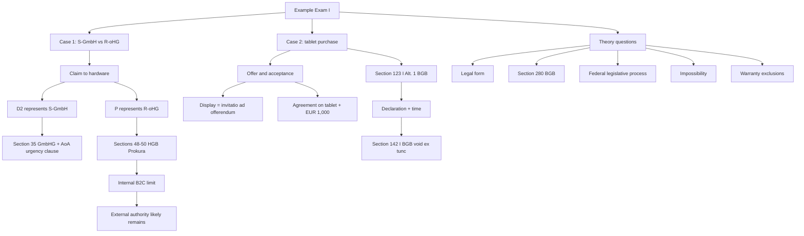
```mermaid
flowchart TD
    Exam[Example Exam I] --> Case1[Case 1: S-GmbH vs R-oHG]
    Exam --> Case2[Case 2: tablet purchase]
    Exam --> Theory[Theory questions]

    Case1 --> Claim[Claim to hardware]
    Claim --> D2[D2 represents S-GmbH]
    D2 --> GmbHRep[Section 35 GmbHG + AoA urgency clause]
    Claim --> P[P represents R-oHG]
    P --> Prokura[Sections 48-50 HGB Prokura]
    Prokura --> InternalLimit[Internal B2C limit]
    InternalLimit --> ExternalEffect[External authority likely remains]

    Case2 --> Formation[Offer and acceptance]
    Formation --> Display[Display = invitatio ad offerendum]
    Formation --> Agreement[Agreement on tablet + EUR 1,000]
    Case2 --> Deceit[Section 123 I Alt. 1 BGB]
    Deceit --> Rescission[Declaration + time]
    Rescission --> ExTunc[Section 142 I BGB void ex tunc]

    Theory --> Form[Legal form]
    Theory --> Damages[Section 280 BGB]
    Theory --> Legislation[Federal legislative process]
    Theory --> Impossible[Impossibility]
    Theory --> Warranty[Warranty exclusions]
```

## Subject Knowledge Graph

| Node | Meaning | Exam Relevance |
|---|---|---|
| Claim Basis | Legal basis for requested performance | Start every legal opinion. |
| GmbH Representation | GmbH acts through managing directors | Needed in Case 1. |
| Prokura Internal Limit | Internal restriction on Prokurist | Central HGB trap in Case 1. |
| Invitatio Ad Offerendum | Non-binding invitation to make an offer | Display-window issue in Case 2. |
| Deceit | Intentional misleading under Section 123 I Alt. 1 BGB | Core rescission route in Case 2. |
| Legal-Form Suitability | Matching form to business scale/risk | Theory Q3. |
| Section 280 Damages | Damages for breach of duty | Theory Q4. |
| Impossibility | Exclusion of performance duty where performance cannot be rendered | Theory Q6. |
| Warranty Exclusions | Buyer knowledge, agreement, Section 377, limitation | Theory Q7. |

| From | Relationship | To | Why It Matters |
|---|---|---|---|
| D2's declaration | can bind | S-GmbH | Depends on managing-director authority and AoA exception. |
| P's Prokura | can bind | R-oHG | Internal B2C restriction usually ineffective externally. |
| Shop display | usually is | Invitatio ad offerendum | Prevents wrong offer analysis. |
| False newest-model statement | triggers | Deceit route | Supports rescission. |
| Effective rescission | causes | Voidness ex tunc | Explains final validity result. |
| Small gardening service | fits | GbR | Legal form should match small non-commercial scale. |
| Section 280 BGB | requires | Obligation, breach, damage, responsibility | Basic damages theory. |
| Section 377 HGB | can exclude | Warranty rights | Key B2B warranty theory point. |

## Exam Writing Templates

### Legal Opinion Opening

```text
S-GmbH could have a claim against R-oHG to be provided with the hardware if a valid rental agreement was concluded and R-oHG is obliged to perform.
```

### Representation Sentence

```text
The declaration made by D2 would bind S-GmbH if D2 made an own declaration of intent in the name of S-GmbH and had power of representation.
```

### Prokura Sentence

```text
P's internal limitation does not by itself remove external authority, because the scope of Prokura is determined by Sections 49 and 50 HGB and internal restrictions are generally ineffective vis-a-vis third parties.
```

### Rescission Sentence

```text
Although a purchase agreement was initially concluded, D2 may have effectively rescinded her declaration of intent under Section 123 I Alt. 1 BGB, with the consequence that the declaration is void from the beginning under Section 142 I BGB.
```

## Retrieval Prompts

Closed-book questions:

1. In Case 1, why is D2's solo representation problem not the same as P's Prokura problem?
2. Which facts make D2's solo action arguably necessary and urgent?
3. Why does P's internal B2C restriction likely not defeat the contract?
4. Why is a shop-window display usually not an offer?
5. Which facts support deceit in the tablet case?
6. What is the effect of effective rescission under Section 142 I BGB?
7. Why is GbR suitable for a small gardening business?
8. List the Section 280 BGB requirements from memory.
9. List three ways warranty rights can be excluded.

Application prompts:

1. Modify Case 1 so D2 knew P's internal B2C restriction. How would you discuss abuse of authority?
2. Modify Case 2 so E genuinely believed the tablet was latest. Which rescission route might remain, and what gets harder?
3. Turn Theory Question 3 into a short recommendation paragraph with one rejected legal form.

## Practice Tasks

1. Write a 10-sentence legal opinion for Case 1 focusing only on P's Prokura.
2. Write a 10-sentence legal opinion for Case 2 focusing only on formation and rescission.
3. Make a one-page issue checklist for the whole mock exam.
4. Answer the five theory questions in bullet points without opening notes.

## Connections

Previous notes from this lecture:

- `business-law/wiki/week-03-contract-law-i/week-03-contract-law-i.md` for formation and invitatio ad offerendum.
- `business-law/wiki/week-04-contract-law-ii-rescission-revocation/week-04-contract-law-ii-rescission-revocation.md` for Section 123 and Section 142 rescission effects.
- `business-law/wiki/week-07-agency/week-07-agency.md` for agency requirements.
- `business-law/wiki/week-11-trade-law/week-11-trade-law.md` for Prokura and HGB internal-limit handling.
- `business-law/wiki/week-12-13-company-law-i-ii/week-12-13-company-law-i-ii.md` for GmbH/oHG/legal-form routing.
- `business-law/wiki/week-08-warranty-rights-i/week-08-warranty-rights-i.md` for warranty exclusions.

Cross-course links:

- Organization: Case 1 resembles formal authority versus internal instruction.
- Finance: legal form and limited liability affect creditor risk and financing conditions.

## Weakness Flags

- This is exam practice, not a completed recall session.
- First practice should be closed-book issue spotting before reading the answer skeleton.
- Key risk: answering Case 1 as generic agency and missing Prokura/Section 50 HGB.
- Key risk: answering Case 2 as "valid contract yes" without handling rescission effect.


<div class="page-break"></div>

# [C2] Example Exam II: Case Facts And Answer Routes

<p class="source-path">Source: <code>business-law/wiki/example-exam-ii-case-facts/example-exam-ii-case-facts.md</code></p>

Source: `business-law/raw/moodle-export-business-law-950848573-s26-20260709/15.7. Example Exam/Example Exam_Case facts.pdf`
Course: Business Law
Processed: 2026-07-09
Wiki note: `business-law/wiki/example-exam-ii-case-facts/example-exam-ii-case-facts.md`

Course direction checked against `business-law/wiki/_course-logistics.md`: this is an integrated mock-exam practice source, not a new doctrine lecture. It combines Warranty Rights I-II, Standard Business Terms, Contract Law I, Contract Law II, and contract-type classification.

Source status: the provided file contains case facts and theory questions, but not official solutions. The answer routes below are inferred study-coach routes based on the processed Business Law notes and statutory anchors.

## 80/20 Exam Summary

Example Exam II is an integration drill. The basic constellation tests defective-product damages in a B2B commercial sale. The modification adds a consumer SBT clause that tries to refer defect damages to a third-party software manufacturer.

High-yield moves:

- Start with the exact claim: damages for table/laptop, then damages for carpet.
- Route product-caused property damage as damages in addition to performance, not cure or reduction.
- In the business case, remember Section 377 HGB before ordinary warranty remedies.
- In the consumer modification, test SBT classification, incorporation, content control, and Section 309 No. 8 b aa BGB.
- Theory questions are short-answer questions, not legal opinions.

## Exam Structure

| Part | Points | Writing mode |
|---|---:|---|
| Case basic constellation | 30 | Full legal-opinion style |
| Case modification | 40 | Full legal-opinion style |
| Theory question section | 30 | Bullet points or short sentences allowed |

## Schema-Tailored Model Answers

Use these model blocks after a closed-book outline. They are not official model solutions; they convert the inferred routes into the answer schema from `business-law/wiki/exam-strategy-answer-schemas-2026-07-28/exam-strategy-answer-schemas-2026-07-28.md`.

### Case 1 Model Answer: Table And Laptop Damage

#### I. Claim Or Issue Sentence

```text
M-GmbH could have a claim against P-oHG for EUR 1,300 damages for the destroyed table and laptop under Sections 437 No. 3, 280 I, and 249 BGB if P-oHG delivered a defective printer and the warranty damages requirements are met.
```

#### II. Purchase Agreement

P-oHG and M-GmbH concluded a purchase agreement under Section 433 BGB for the 3D printer at a price of EUR 25,000. The facts state that both sides were effectively represented, so representation should not become the main issue.

Interim result:

```text
A valid purchase agreement exists.
```

#### III. Material Defect At Transfer Of Risk

A material defect exists if the purchased thing does not have the agreed or usual quality or is not suitable for its intended use. A 3D printer that overheats filament so severely that employees cannot stop the leaking filament is not suitable for ordinary printer use and lacks usual safety and functionality.

The malfunction appears during an immediate test run after delivery. The software problem is therefore best treated as already present at transfer of risk.

Interim result:

```text
The printer was defective at transfer of risk.
```

#### IV. Section 377 HGB Filter

Because P-oHG and M-GmbH are commercial actors and the printer purchase belongs to their business, the sale is a mutual commercial transaction. Section 377 HGB therefore requires prompt inspection and notice of defects.

M-GmbH tested the printer immediately after delivery and complained to P-oHG the same day. This satisfies the inspection and notice requirement. The goods are not deemed approved, and warranty rights are not excluded.

Nuance:

```text
Section 377 HGB is not a reason to deny the claim here. It is the filter that M-GmbH survives because the facts emphasize immediate testing and same-day complaint.
```

#### V. Damages Route

The table and laptop damage is not damage to the value of the printer itself. A later repair or replacement of the printer would not undo the destroyed table and laptop. The correct category is therefore damages in addition to performance, not cure, reduction, or damages instead of performance.

Under Section 280 I BGB, there is an obligation from the purchase contract, P-oHG breached the duty to deliver a defect-free printer, and the defect caused EUR 1,300 damage. Responsibility is presumed under Section 280 I sentence 2 BGB. No facts show that P-oHG can exculpate itself.

Interim result:

```text
The requirements for damages in addition to performance are met.
```

#### VI. Final Answer

```text
M-GmbH can claim EUR 1,300 from P-oHG for the destroyed table and laptop under Sections 437 No. 3, 280 I, and 249 BGB.
```

High-yield nuance:

```text
Do not demand a grace period for this damage. The destroyed table and laptop would remain lost even if P-oHG later supplied a perfect printer.
```

### Case 2 Model Answer: Carpet Damage And SBT Clause

#### I. Claim Or Issue Sentence

```text
T could have a claim against P-oHG for EUR 200 carpet-cleaning costs under Sections 437 No. 3, 280 I, and 249 BGB if the hobby printer was defective and P-oHG cannot rely on Clause 1.3.
```

#### II. Purchase Agreement And Defect

T bought a hobby 3D printer from P-oHG for EUR 5,000. This is a purchase agreement under Section 433 BGB. The same software problem caused the filament to overheat and spread onto T's carpet. As in the basic constellation, this makes the printer defective under Section 434 BGB. Because the same recurring software issue appears immediately in use, the defect likely existed at transfer of risk.

Interim result:

```text
The warranty gateway under Section 437 BGB is opened.
```

#### III. No Section 377 HGB Filter

T buys the printer for his hobby. He is therefore a consumer, not a merchant buyer. Section 377 HGB does not apply because this is not a mutual commercial purchase.

#### IV. Damages In Addition To Performance

The EUR 200 carpet-cleaning cost is consequential property damage caused by the defective printer. A later cure of the printer would not remove the carpet damage. The route is therefore damages in addition to performance under Sections 437 No. 3 and 280 I BGB.

P-oHG owed delivery of a defect-free printer, breached that duty, caused EUR 200 damage, and is presumed responsible unless it proves lack of responsibility.

Interim result:

```text
T has a statutory damages route unless Clause 1.3 validly excludes or redirects it.
```

#### V. SBT Classification And Incorporation

Clause 1.3 is part of a standard 3D-printer purchase agreement prepared by P-oHG. It is pre-formulated, intended to set terms for the transaction, and presented by the seller. In a consumer contract, terms are deemed presented by the trader unless introduced by the consumer, and one-time use can still be controlled if the consumer could not influence the content.

T read and signed the document. Incorporation is therefore likely satisfied. But incorporation only means the clause enters the contract; it does not mean the clause is valid.

Nuance:

```text
Signing helps incorporation, not content validity. This is the main SBT trap.
```

#### VI. Content Control

Clause 1.3 excludes damages claims for harm connected with a software problem and refers the customer to the software manufacturer. In a consumer contract for a newly produced thing, Section 309 No. 8 b aa BGB invalidates clauses that exclude, limit, or make defect claims dependent on claims against third parties.

The clause does exactly that: it removes P-oHG as the contractual seller from the defect-damages route and forces T toward an unknown third-party manufacturer. It is therefore ineffective.

Under Section 306 BGB, the ineffective clause drops out while the rest of the contract remains valid. Statutory warranty law fills the gap.

#### VII. Final Answer

```text
T can claim EUR 200 from P-oHG. Clause 1.3 was likely incorporated, but it is ineffective under SBT content control, especially Section 309 No. 8 b aa BGB; the statutory damages route remains available.
```

High-yield nuance:

```text
Do not write "T signed, so no claim." The expected route is: signed -> incorporated -> content control -> clause invalid -> statutory claim survives.
```

### Theory Question 3 Model Answer: Renovation Contract Type

Schema:

```text
definition -> anchor -> alternatives -> conclusion
```

Model answer:

- The contract is best classified as a works contract under Section 631 BGB because C owes a concrete success: replacing two windows.
- A service contract under Section 611 BGB is weaker because C is not merely promising effort or time; the expected result is completed window replacement.
- A purchase contract under Section 433 BGB is also weaker because the center of gravity is not simply transfer of pre-existing goods, but installation/renovation work.
- If the windows themselves are supplied by C, the contract can have mixed elements, but the success-oriented renovation result keeps the works-contract classification strongest.

### Theory Question 4 Model Answer: Culpa In Contrahendo

Schema:

```text
definition -> statutory route -> examples -> limit
```

Model answer:

- Culpa in contrahendo covers liability for breaches of duties during contract initiation, negotiation, or similar pre-contractual contact.
- Statutory route: Section 311 II BGB creates the pre-contractual obligation relationship; Section 241 II BGB supplies duties to protect rights, legal interests, and trust; Section 280 I BGB gives damages for breach.
- Examples include misleading information during negotiations, unsafe premises during contract initiation, or creating reliance and then breaching protective duties.
- Limit: it is not compensation for every disappointed negotiation. There must be a legally relevant duty breach, damage, causation, and responsibility.

### Theory Question 5 Model Answer: Amended Acceptance

Schema:

```text
offer -> non-matching answer -> statutory consequence -> new contract only after acceptance
```

Model answer:

- Acceptance must match the offer.
- If the recipient answers with changes, additions, or restrictions, the answer is not an acceptance.
- Under Section 150 II BGB, the amended acceptance counts as rejection of the original offer combined with a new offer.
- The original offer expires under Section 146 BGB.
- A contract forms only if the original offeror accepts the new counteroffer.

### Theory Question 6 Model Answer: Section 145 BGB

Schema:

```text
condition -> consequence -> particularities -> relationship
```

Model answer:

- Section 145 BGB applies where a person makes an offer to another person to enter into a contract.
- The consequence is that the offeror is bound by the offer.
- The offeror can exclude being bound by clear wording, for example "without engagement" or "subject to confirmation."
- Particularity: Section 145 BGB only applies after the declaration is classified as an offer. A shop display or advertisement is usually only an invitatio ad offerendum.
- The binding effect ends through rejection, late acceptance, expiry of the acceptance period, or other rules in Sections 146-149 BGB.

### Theory Question 7 Model Answer: Rescission Versus Revocation

Schema:

```text
define both -> trigger -> anchor -> consequence -> trap
```

Model answer:

| Dimension | Rescission | Revocation |
|---|---|---|
| Legal problem | Defective declaration at formation. | Valid reciprocal contract, but later performance problem. |
| Typical anchors | Sections 119, 120, 123, 143, 121/124, 142 BGB. | Sections 323, 324, 326 V, 346-349 BGB. |
| Trigger facts | Mistake, incorrect transmission, deceit, duress. | Non-performance, defective performance, ancillary-duty breach, impossibility. |
| Legal effect | Declaration is void from the beginning under Section 142 I BGB. | Restitution relationship; received performances are returned. |
| Exam warning | Do not use rescission just because the object later proves defective. | Do not use revocation to attack manipulated consent. |

Short answer:

```text
Rescission attacks consent at formation; revocation reacts to a performance failure in a valid contract.
```

## Case 1: Defective 3D Printer Damages Table And Laptop

### Paraphrased Facts

Printtech-oHG sells a 3D printer for EUR 25,000 to Mach-GmbH. Both sides are effectively represented. During an immediate test run after delivery, a software problem overheats filament; liquid filament spills beyond the printing area and destroys a nearby table worth EUR 100 and laptop worth EUR 1,200. M-GmbH complains the same day.

Question: can M-GmbH claim damages for the table and laptop?

### Answer Route

Claim basis: Sections 437 No. 3 Alt. 1 and 280 I BGB, plus Section 249 BGB for the amount. Because both sides are commercial entities, check Section 377 HGB before relying on warranty remedies.

1. **Purchase agreement:** P-oHG and M-GmbH concluded a purchase agreement under Section 433 BGB. The facts state effective representation on both sides.
2. **Defect:** the printer is materially defective under Section 434 BGB. A printer that overheats filament uncontrollably and cannot be stopped by employees is not suitable for customary use and lacks usual quality.
3. **Transfer of risk:** the defect appears during an immediate test after delivery and is linked to the software problem. Strong route: defect existed at transfer of risk.
4. **Section 377 HGB:** this is a mutual commercial purchase. M-GmbH tested immediately after delivery and complained the same day, so inspection and notification are timely. Warranty rights are not excluded.
5. **Damage classification:** the table and laptop damage would remain even if P-oHG later delivered a defect-free printer. This is damages in addition to performance.
6. **Section 280 I elements:** contractual obligation exists; breach is defective delivery; responsibility is presumed under Section 280 I 2 BGB unless P-oHG exculpates itself; causal damage is EUR 1,300.
7. **Legal consequence:** monetary compensation under Section 249 II BGB for EUR 1,300.

Likely result: M-GmbH can claim EUR 1,300 from P-oHG.

### Exam Traps

- Do not route table/laptop loss as reduction. Reduction concerns the printer's price/value relation.
- Do not skip Section 377 HGB just because the defect is obvious; the same-day complaint is why M-GmbH survives Section 377.
- Do not overcomplicate representation; the facts say both sides are effectively represented.

## Case 2: Consumer 3D Printer, SBT Exclusion, Carpet Damage

### Paraphrased Facts

T buys a hobby 3D printer from P-oHG for EUR 5,000. P-oHG uses a standard three-page 3D-printer purchase agreement. Clause 1.3 says the customer may not claim damages for harm caused in connection with a software problem and must turn to the software manufacturer. T reads and signs. The same software problem occurs and damages T's carpet, causing EUR 200 cleaning costs. P-oHG invokes the clause.

Question: can T claim damages from P-oHG for the carpet?

### Answer Route

Claim basis: Sections 437 No. 3 Alt. 1 and 280 I BGB, with SBT control under Sections 305 et seq. BGB.

1. **Purchase agreement:** P-oHG and T concluded a purchase agreement under Section 433 BGB.
2. **Defect:** the software overheating problem makes the printer defective under Section 434 BGB.
3. **Transfer of risk:** same recurring software defect; likely existed at delivery.
4. **No Section 377 HGB:** T is a consumer/hobby buyer, not a merchant buyer in a mutual commercial purchase.
5. **Damages classification:** carpet damage remains even if proper performance later occurs, so damages in addition to performance under Section 280 I BGB.
6. **Section 280 I elements:** obligation, breach, presumed responsibility, causal EUR 200 damage.
7. **SBT classification:** the standard 3D printer purchase agreement is pre-formulated and presented by P-oHG. Even if newly used, B2C rules can treat it as SBT under Section 310 III No. 2 BGB.
8. **Incorporation:** T reads and signs the document, so reference, opportunity, and agreement are likely satisfied. Clause is not surprising merely because it concerns software-problem liability in a printer contract.
9. **Content control:** clause excludes or limits defect-related claims by referring the customer to a third-party software manufacturer. In a consumer contract for a newly produced thing, Section 309 No. 8 b aa BGB prohibits excluding or limiting defect claims or making them dependent on claims against third parties.
10. **Consequence:** the clause is ineffective; the contract otherwise remains valid under Section 306 BGB; statutory damages route remains.

Likely result: T can claim EUR 200 from P-oHG.

### Exam Traps

- Do not let P-oHG redirect the buyer to the software manufacturer before testing SBT content control.
- Do not treat signing as the end of the SBT analysis.
- The clause can be incorporated but still ineffective.

## Theory Question 3: House Renovation Contract Type

Question: H calls craftswoman C; C replaces two windows in H's living room for EUR 800 in one afternoon. What contract type is this, and what alternatives should be considered?

Answer route:

- Best classification: works contract under Section 631 BGB because C owes a concrete success/result: replaced windows.
- Considered but rejected: service contract under Section 611 BGB, because C is not merely owing effort or activity; she owes successful window replacement.
- Considered but rejected: purchase agreement under Section 433 BGB, because the center of gravity is not simply transfer of pre-existing goods but performance of renovation/replacement work.

## Theory Question 4: Culpa In Contrahendo Scope

Question: explain the scope of application of culpa in contrahendo.

Answer route:

- Culpa in contrahendo covers pre-contractual duties arising during contract initiation, negotiation, or similar business contact.
- It protects rights, legal interests, and trust before a contract is concluded.
- Typical triggers: entering negotiations, initiating a contract, creating reliance, providing information, exposing the other party to risks, or breaking off negotiations in a legally relevant way.
- Statutory route in German law: pre-contractual obligation relationship under Section 311 II BGB, duties under Section 241 II BGB, damages under Section 280 I BGB.
- It is not a substitute for every disappointed negotiation; there must be a duty breach and compensable damage.

## Theory Question 5: Amended Acceptance

Question: what happens if one person makes an offer and the other side answers by amending it?

Answer route:

- An acceptance must match the offer.
- An amended acceptance is not an acceptance.
- Under Section 150 II BGB, it is a rejection combined with a new offer.
- The original offer expires under Section 146 BGB.
- A contract forms only if the original offeror accepts the new counteroffer.

## Theory Question 6: Section 145 BGB

Question: name the conditions and consequences of Section 145 BGB and explain particularities.

Answer route:

- Condition: a person makes an offer to another person to enter into a contract.
- Consequence: the offeror is bound by the offer.
- Exception: the offeror can exclude being bound, for example by clear reservation.
- Particularity: Section 145 BGB only matters after a statement is classified as an offer, not merely an invitatio ad offerendum.
- Relationship: binding ends through rejection or late acceptance under Section 146 BGB and through acceptance-period rules under Sections 147-149 BGB.

## Theory Question 7: Rescission Versus Revocation

Answer route:

| Dimension | Rescission | Revocation |
|---|---|---|
| Core problem | Defective declaration of intent | Valid contract with performance problem |
| Typical anchor | Sections 119, 120, 123, 142, 143 BGB | Sections 323, 324, 326 V, 346-349 BGB |
| Trigger | Error, deceit, duress, transmission error | Non-performance, defective performance, ancillary-duty breach, impossibility |
| Effect | Declaration/transaction void ex tunc under Section 142 I BGB | Restitution relationship under Sections 346 et seq. BGB |
| Exam trap | Do not use for buyer's regret or later breach | Do not use to attack flawed consent at formation |

## Full Mock-Exam Routing Map

```mermaid
flowchart TD
    Exam[Example Exam II] --> C1[Case 1: B2B defective printer]
    C1 --> Defect[Section 434 defect]
    C1 --> HGB[Section 377 timely complaint]
    C1 --> Damages1[Sections 437 No. 3 and 280 I]
    Damages1 --> Amount1[EUR 1,300 table + laptop]

    Exam --> C2[Case 2: consumer printer + SBT]
    C2 --> Defect2[Section 434 defect]
    C2 --> SBT[Sections 305 et seq. SBT control]
    SBT --> Invalid[Section 309 No. 8 b aa invalid clause]
    C2 --> Damages2[Sections 437 No. 3 and 280 I]
    Damages2 --> Amount2[EUR 200 carpet]

    Exam --> Theory[Theory questions]
    Theory --> Works[Works contract]
    Theory --> CIC[Culpa in contrahendo]
    Theory --> S150[Section 150 II amended acceptance]
    Theory --> S145[Section 145 binding offer]
    Theory --> Exit[Rescission vs revocation]
```

## Subject Knowledge Graph

| Node | Type | Description |
|---|---|---|
| Example Exam II | mock exam | Integrated Business Law practice case. |
| Defective 3D printer | case object | Product causing property damage through software defect. |
| Section 377 HGB | commercial filter | B2B inspection and notice rule. |
| Damages in addition | damages route | Property damage remains despite later cure. |
| SBT exclusion clause | clause | Attempts to redirect defect claims to software manufacturer. |
| Section 309 No. 8 b aa BGB | SBT prohibition | Blocks defect-claim referral to third parties in consumer supply/new-goods contexts. |
| Culpa in contrahendo | theory route | Pre-contractual duties and damages. |

| From | Relationship | To |
|---|---|---|
| Defective 3D printer | triggers | Damages in addition |
| Section 377 HGB | filters | B2B warranty remedies |
| SBT exclusion clause | tested by | Section 309 No. 8 b aa BGB |
| Damages in addition | uses | Section 280 I BGB |
| Culpa in contrahendo | combines | Sections 311 II, 241 II, 280 I BGB |

## Retrieval Prompts

1. Why is Case 1 not simply a cure case?
2. Why does Section 377 HGB not block M-GmbH's claim?
3. Why is T's SBT clause ineffective even though T signed?
4. Explain why table/laptop and carpet damage are damages in addition to performance.
5. Give the Section 150 II BGB answer in three sentences.
6. Compare rescission and revocation using trigger and effect.

## Practice Tasks

1. Write Case 1's first five legal-opinion headings without prose.
2. Write the SBT content-control paragraph for Clause 1.3 in Case 2.
3. Draft a 6-point answer to the culpa in contrahendo theory question.
4. Create a one-page statute checklist for Example Exam II: Sections 433, 434, 437, 280, 249, 305, 306, 309, 310, 377 HGB.

## Connections

- Week 08 Warranty Rights I: defect and Section 437 gateway.
- Week 09 Warranty Rights II: damages in addition versus damages instead of performance.
- Week 06 Standard Business Terms: SBT classification, incorporation, content control, and Section 306 consequence.
- Week 11 Trade Law: Section 377 HGB inspection and notification.
- Week 03 Contract Law I: Section 145 and Section 150 II theory questions.
- Week 04 Contract Law II: rescission versus revocation theory question.

## Weakness Flags

- Pending first active-recall/mock-exam session.


<div class="page-break"></div>

# [C3] Additional Mock Exams And External Cheat Sheet

<p class="source-path">Source: <code>business-law/wiki/additional-mock-exams-and-external-cheatsheet/additional-mock-exams-and-external-cheatsheet.md</code></p>

Sources:

- `business-law/raw/mock-exam-ibl-this-is-the-mock-exam-for-the-winter-2425-semster.pdf`
- `business-law/raw/exam-ss22.pdf`
- `business-law/raw/introduction-to-business-law.pdf`

Course: Business Law
Processed: 2026-07-22
Wiki note: `business-law/wiki/additional-mock-exams-and-external-cheatsheet/additional-mock-exams-and-external-cheatsheet.md`

Course direction checked against `business-law/wiki/_course-logistics.md`: these are exam-practice and external reference materials, not new official 2026 doctrine lectures. Use them after the current Business Law doctrine sequence, especially Contract Law I-III, SBT, Agency, Warranty Rights, Trade Law, and Company Law.

Source status: the two exam PDFs do not include official solutions. The answer routes below are inferred study-coach routes based on the processed Business Law notes, the standing statutory-law file, and official statutory reference checks. The cheat sheet is an external/unofficial study aid; use it as a memory compressor and coverage radar, not as the authority where it conflicts with Moodle materials or statutes.

External reference check: key BGB, HGB, GmbHG, AktG, GDPR, Rome I, and Rome II anchors were checked against official Gesetze-im-Internet or EUR-Lex sources on 2026-07-22. Official English German-law translations warn that translations can lag the current German text; for exam wording, prefer the statutory text distributed in the course.

## 80/20 Exam Summary

These additional resources sharpen the Business Law exam strategy in three ways:

- The WS24/25 mock repeats the current high-yield clusters: avoidance, agency, SBT, company law, consumer withdrawal, warranty rights, and merchant/GmbH trade-law consequences.
- The SS22 exam adds historical coverage signals: minors, written/text form, declaration-of-intent receipt, International Private Law, GDPR personal data, business associations, and tort damages.
- The external cheat sheet compresses weeks 1-10 into route language: IRAC, contract formation, declaration of intent, avoidance, agency, withdrawal, SBT, breach/impossibility, warranty, merchant/Prokura, and torts.

Priority for the 2026-07-28 Business Law exam:

```text
current 2026 doctrine sequence
-> official example exams I-II
-> WS24/25 mock as near-current integration drill
-> SS22 as historical coverage-gap diagnostic
-> external cheat sheet only as quick route memory
```

## Source Inventory

| Source | Type | Length | Main use | Authority level |
|---|---:|---:|---|---|
| WS24/25 mock exam | Mock exam | 3 pages | Near-current integrated practice with theory plus one legal-opinion case. | External/historical, no solution key. |
| SS22 exam | Historical exam | 3 pages | Coverage-gap diagnostic, especially minors, IPL, GDPR, and torts. | Historical, no solution key. |
| Introduction to Business Law cheat sheet | External cheat sheet | 31 pages | Compact memory aid for weeks 1-10 routes. | Unofficial reference, verify against course notes. |

## High-Yield Coverage Map

| Topic | WS24/25 mock | SS22 exam | Cheat sheet | Current queue status |
|---|---|---|---|---|
| Legal method / IRAC | Case writing | Legal-opinion case | Strong | Covered in Week 01-02. |
| Contract formation | Indirectly | Sale essentialia, form, receipt | Strong | Covered in Week 03. |
| Avoidance / rescission | Strong theory | Price-tag error route | Strong | Covered in Week 04. |
| Consumer withdrawal | Strong case route | Not central | Strong | Covered in Week 05. |
| Standard Business Terms | Strong theory | Not central | Moderate | Covered in Week 06. |
| Agency | Strong theory | Not central | Strong | Covered in Week 07. |
| Warranty rights | Strong case route | Historical scarf/toaster route | Strong | Covered in Weeks 08-09. |
| Trade law / merchant status | Strong modification | Not central | Merchant/Prokura | Covered in Week 11. |
| Company law | Strong theory | Strong theory | Light | Covered in Week 12-13. |
| Minors / capacity | Not central | Strong case route | Light | Coverage gap, but BGB General Part anchor exists. |
| International Private Law | Not central | Theory route | Not central | Coverage gap; likely lower priority unless current materials signal it. |
| GDPR personal data | Not central | Theory route | Not central | Coverage gap; historical signal only. |
| Tort damages | Not central | Assault damages route | Light | Coverage gap; historical signal only. |

## How To Use These Materials

Do not start by reading the inferred answer routes. Use this order:

1. Pick one mock source.
2. Do 8-10 minutes of closed-book issue spotting.
3. Write only headings and statutory anchors.
4. Compare with the route below.
5. Repair one missed router, not every paragraph.

For the external cheat sheet, use it only after trying retrieval from the main notes. The cheat sheet is useful for route compression, but it can blur distinctions such as rescission versus revocation or general BGB warranty rules versus HGB merchant filters.

## WS24/25 Mock Exam Structure

| Part | Points | Writing mode | Main skill |
|---|---:|---|---|
| Avoiding a contract | 8 | Short answer | Section 119 versus Section 123 consequences and warranty-law priority. |
| Law of agency | 7 | Short answer | Section 164 requirements, minor agent, AG representation. |
| Standard Business Terms | 7 | Short answer | Definition, business use, risks, practical example. |
| Company law | 10 | Short answer | One-tier/two-tier boards, Business Judgment Rule, GmbH contribution in kind. |
| Bistro wine case | 28 | Fully formulated memorandum | Telephone order, consumer/trader route, warranty rights, GmbH/merchant modification. |

The source states 60 points total and 120 minutes.

## WS24/25 Schema-Tailored Model Answers

These answers are inferred from the mock questions and the processed course notes. Use them as writing models, not as official solutions.

### Question 1 Model Answer: Avoiding A Contract

#### 1a. Consequence Of Avoidance Under Section 119 Or Section 123 BGB

Schema:

```text
definition -> statutory anchor -> consequence
```

Model answer:

- Avoidance attacks a declaration of intent that was defective when it was made.
- The rescinding party must have an avoidance ground and must declare avoidance.
- If avoidance is effective, Section 142 I BGB treats the declaration as void from the beginning.

Exam sentence:

```text
The consequence of effective avoidance under Section 119 or Section 123 BGB is voidness ex tunc under Section 142 I BGB.
```

#### 1b. Why Section 122 Damages Fit Section 119 But Not Section 123

Schema:

```text
compare -> policy -> consequence
```

Model answer:

- Section 119 BGB protects a party who made an honest mistake. The other party may have relied innocently on the declaration, so Section 122 BGB shifts the reliance-loss risk back to the mistaken party.
- Section 123 BGB protects a party whose will was manipulated by deceit or duress. The transaction is tainted by wrongful influence, so the law does not grant the same reliance-damages protection to the party responsible for, or connected with, the manipulation.
- Therefore, honest mistake avoidance creates reliance-damages exposure; deceit/duress avoidance does not follow that Section 122 logic.

Nuance:

```text
The reason is not that Section 123 is "more important." The reason is risk allocation: innocent reliance is protected after honest mistake, but wrongful manipulation is not rewarded.
```

#### 1c. Defective Bike And Section 119 II BGB

Schema:

```text
candidate route -> priority rule -> correct route -> conclusion
```

Model answer:

- A buyer might think a material defect is a mistake about an essential characteristic under Section 119 II BGB.
- In a purchase contract, however, defects discovered after delivery are normally handled by the special warranty regime.
- The buyer should start with Sections 434 and 437 BGB: defect, transfer of risk, cure, revocation, reduction, or damages.
- Section 119 II BGB should not be used to bypass warranty law for an ordinary defective delivered product.

Conclusion:

```text
The buyer normally cannot avoid the contract under Section 119 II BGB merely because the bike has defective brakes; the correct route is warranty law.
```

### Question 2 Model Answer: Law Of Agency

#### 2a. Three Requirements For Valid Representation

Schema:

```text
list requirements -> consequence
```

Model answer:

Valid representation under Section 164 I BGB requires:

1. an own declaration of intent by the agent;
2. acting in the name of the principal;
3. acting within power of representation.

If these requirements are met, the legal effect of the declaration arises directly for and against the principal.

#### 2b. Minor Agent

Model answer:

- A 12-year-old has limited capacity, but limited capacity does not prevent a person from acting as an agent.
- Section 165 BGB allows even a person with limited capacity to contract to act as representative.
- The reason is that the legal effects fall on the principal, not on the minor agent.

Nuance:

```text
Separate agency validity from agent liability. If the minor acts without authority, Section 179 III 2 BGB protects the minor from representative liability unless the legal representative consented.
```

#### 2c. Representation Of An AG

Model answer:

- A German AG is represented externally by its management board.
- The supervisory board supervises and controls the management board but does not normally represent the AG in ordinary business.

Exam sentence:

```text
Under the AG two-tier structure, the management board represents; the supervisory board supervises.
```

### Question 3 Model Answer: Standard Business Terms

#### 3a. Definition

Standard Business Terms are pre-formulated contractual terms intended for repeated use and presented by one contracting party to the other, without genuine individual negotiation.

#### 3b. Advantages And Risks

Advantages:

- lower drafting and negotiation costs;
- standardized transactions;
- predictable allocation of duties, payment, delivery, warranty, and liability risks.

Risks:

- unfair one-sided risk shifting;
- surprising clauses;
- ambiguous wording interpreted against the user;
- invalidity under content control;
- loss of customer trust.

#### 3c. Example

```text
An online shop uses the same pre-written delivery, payment, return, and liability clauses for every customer order.
```

Nuance:

```text
Do not define SBT as "any written contract." The key is pre-formulated terms supplied by one party without genuine negotiation.
```

### Question 4 Model Answer: Company Law

#### 4a. One-Tier Versus Two-Tier Board

| Structure | Definition | Example |
|---|---|---|
| One-tier board | Management and monitoring functions are concentrated in one board, often with executive and non-executive members. | Common Anglo-American board model; also possible for an SE depending on chosen structure. |
| Two-tier board | Management and supervision are institutionally separated. | German AG: management board manages and represents; supervisory board appoints, supervises, and controls. |

#### 4b. Business Judgment Rule

Schema:

```text
entrepreneurial decision -> information -> good faith/company interest -> no illegal/conflicted conduct
```

Model answer:

- The Business Judgment Rule protects entrepreneurial decisions by management from hindsight liability.
- Requirements: an entrepreneurial decision, adequate information, good-faith belief that the decision serves the company's interest, no improper personal-interest conflict, and no violation of mandatory legal duties.
- Example: the management board enters a new product market after reviewing market data, financial forecasts, risks, and alternatives. If the decision later fails commercially, that failure alone does not prove breach of duty.

Nuance:

```text
The Business Judgment Rule does not protect illegal conduct, blind decision-making, or self-dealing.
```

#### 4c. Claim Against D As GmbH Contribution In Kind

Schema:

```text
possibility -> economic value/transferability -> formal requirements -> valuation risk
```

Model answer:

- In principle, a claim against D can be contributed as a contribution in kind if the claim exists, is transferable, enforceable, and has economic value.
- The contribution in kind must be expressly set out in the GmbH formation documents/articles, including the object of the contribution and the share contribution it covers.
- The valuation must be justified; if the claim is overvalued or not collectible, the contributor can remain liable for the shortfall.

Nuance:

```text
A receivable is not automatically good capital. It must be real, enforceable, transferable, and realistically recoverable.
```

### Question 5 Model Answer: Bistro Wine Case

#### 5a. Telephone Order And Return

Issue sentence:

```text
M can give the wine back merely because he ordered by telephone only if a consumer withdrawal right exists for the relevant order.
```

Requirements:

```text
consumer-trader contract -> distance contract -> no exception -> timely withdrawal
```

Application:

- The telephone order can satisfy the distance-communication element.
- For the four restaurant boxes, M acts for his bistro. The purpose is resale/use in his business, so he is not acting as a consumer for that transaction.
- Therefore, the restaurant order does not create a consumer withdrawal right merely because it was placed by telephone.
- The private flagship-wine box is different. It is meant for private consumption, so M acts as a consumer for that order. If T is acting as a trader, the contract was concluded by distance communication, no exception applies, and M is within the withdrawal period, withdrawal is possible for that private box.

Final answer:

```text
M cannot return the restaurant bottles merely because he ordered them by telephone. He may have a consumer withdrawal route only for the separate private flagship-wine box.
```

Nuance:

```text
Do not classify M once for the whole exam. Classify him transaction by transaction: restaurant batch = business purpose; private batch = consumer purpose.
```

#### 5b. Buyer's Rights For Restaurant Bottles

Issue sentence:

```text
M could have warranty rights against T under Section 437 BGB if the wrongly labelled restaurant bottles are defective and no exclusion applies.
```

Requirements:

```text
purchase agreement -> material defect at transfer of risk -> no warranty exclusion -> remedy selection
```

Application:

- M and T concluded a purchase agreement for the restaurant bottles.
- The upside-down labels do not affect the drinkability of the wine, but the bottles were bought for restaurant resale/display. If label appearance is relevant for ordinary resale presentation, the mislabelling is a material defect.
- The defect existed at delivery because the whole vintage was wrongly labelled.
- M runs a small seasonal bistro in his own name, with low turnover and limited staff. He is an entrepreneur for consumer-law purposes, but not necessarily a merchant under HGB. On the likely route, Section 377 HGB does not apply in the original scenario.
- Cure under Section 439 BGB is the first remedy. M can request replacement bottles or repair/relabeling.
- T says the whole vintage is affected and relabeling is not feasible. If cure is impossible, M can move to secondary remedies.
- Revocation is possible only if the defect is not insignificant. Because the wine remains drinkable, this point is contestable. For restaurant display and resale, the label defect can still be economically significant.
- Reduction under Section 441 BGB is the safer fallback because it adjusts the price even when keeping the wine remains possible.
- Damages require the damages route and responsibility; do not award damages automatically merely because a defect exists.

Final answer:

```text
M's correct route for the restaurant bottles is warranty law, not telephone withdrawal. He can demand cure first. If cure is impossible, reduction is strong and revocation is plausible if the label defect is not treated as insignificant for restaurant resale; damages require a separate responsibility analysis.
```

Nuance:

```text
The defect argument depends on commercial presentation. If the examiner treats drinkability as dominant, reduction may be stronger than full revocation.
```

#### 5c. GmbH Modification

Issue sentence:

```text
If the bistro is operated through a GmbH, M's warranty position changes if Section 377 HGB applies and the defect notice was late.
```

Requirements:

```text
mutual commercial purchase -> prompt inspection -> prompt notice -> consequence of failure
```

Application:

- A GmbH is a merchant by legal form.
- T is a wholesale wine trader. The purchase is therefore commercial for both parties.
- Section 377 HGB requires prompt inspection after delivery and prompt notice when the defect is apparent.
- The labels are visibly upside down and hard to read, so the defect is likely discoverable during ordinary inspection.
- Delivery occurred on Friday, 2 August. M waited until Wednesday, 7 August to open the first box and notify T. For an apparent label defect in a merchant purchase, this delay is exam-dangerous and likely not prompt.

Final answer:

```text
The GmbH modification likely weakens M's position. If Section 377 HGB applies and the notice is late, the bottles are deemed approved and M's warranty rights from question 5b are excluded.
```

Nuance:

```text
If the delay were still considered prompt under the ordinary course of this business, the warranty route from 5b would remain. But the exam signal is the GmbH merchant filter.
```

## WS24/25 Theory Routes

### Avoiding A Contract

Core route:

```text
avoidance ground
-> declaration of avoidance
-> time limit
-> Section 142 I BGB ex-tunc voidness
-> Section 122 BGB only for honest-mistake avoidance, not deceit/duress
```

Answer route:

- Avoidance under Section 119 BGB or Section 123 BGB makes the declaration of intent void from the beginning under Section 142 I BGB.
- Section 119 protects a party from being bound by an honest defective declaration. Because the other party may have relied innocently on the declaration, Section 122 BGB compensates reliance damage.
- Section 123 protects a party whose will was manipulated by deceit or duress. The other side should not receive the same reliance protection when the transaction is tainted by intentional misconduct.
- For a defective bike, do not use Section 119 II BGB as the normal route after purchase. Warranty law is the specific regime for material defects after transfer of risk. Start with Sections 434 and 437 BGB, then cure, revocation, reduction, or damages.

Exam trap:

```text
Bad product after delivery = warranty route first, not mistake rescission.
```

### Law Of Agency

Valid representation under Section 164 I BGB:

```text
own declaration of intent by agent
-> in the name of the principal
-> within power of representation
```

Minor agent:

- A 12-year-old can be an agent because the effect of the declaration lands with the principal, not with the minor.
- Section 165 BGB prevents limited capacity from defeating agency as such.
- Separate issue: an unauthorized minor agent is protected from liability under Section 179 III 2 BGB unless the legal representative consented.

AG representation:

- An Aktiengesellschaft is represented by the management board.
- In a German two-tier AG, the supervisory board supervises and appoints/controls management, but it does not normally conduct external business representation.

### Standard Business Terms

Definition:

```text
pre-formulated contract terms
-> intended for multiple contracts
-> presented by one party to the other
-> not individually negotiated
```

Advantages:

- lower drafting and negotiation cost
- standardization of mass transactions
- predictable risk allocation
- faster contracting

Risks:

- one-sided risk shifting
- surprise clauses
- ambiguity
- invalid clauses under content control
- business trust loss if terms are perceived as unfair

Example:

```text
An online shop uses a pre-written return, liability, and delivery clause for all customers.
```

### Company Law

One-tier versus two-tier board:

| Structure | Meaning | Example route |
|---|---|---|
| One-tier board | Management and monitoring are concentrated in one board, often with executive and non-executive directors. | Common Anglo-American board model; possible in some SE settings depending on chosen structure. |
| Two-tier board | Management and supervision are institutionally separated. | German AG: management board runs business; supervisory board supervises. |

Business Judgment Rule:

```text
entrepreneurial decision
-> adequate information
-> no improper personal-interest conflict
-> good-faith belief in company interest
-> no compliance/legal-duty violation
```

Use it when a board chooses a risky business strategy after informed deliberation. Do not use it to excuse illegal conduct or blind decision-making.

GmbH contribution in kind:

- A claim against D can in principle be contributed as a contribution in kind if it is transferable and has economic value.
- The contribution in kind must be specified in the articles of association, including the object and the nominal share contribution it covers.
- The founders must justify valuation in the formation report; overvaluation can trigger liability for the shortfall.
- Practical exam warning: a claim is only useful as capital if it exists, is enforceable, and is realistically recoverable.

## WS24/25 Case Route: Bistro Wine Labels

### Paraphrased Facts

M leaves legal practice, runs a small seasonal bistro in his own name, and orders Tuscan wine by telephone from a Hamburg wholesaler. Four boxes are for the bistro; one later box is for private use. The bottles arrive, and several days later M discovers the labels are upside down and hard to read. He wants replacement bottles for display and sale in the restaurant. The wholesaler says the entire vintage has the label problem and replacement or relabeling is not feasible.

### Question A: Can M Give The Bottles Back Because He Ordered By Telephone?

Route:

```text
distance contract
-> consumer/trader status
-> private purpose or business purpose
-> withdrawal right
-> exceptions
```

For the restaurant bottles:

- Telephone ordering can be distance communication.
- But consumer withdrawal requires a consumer-trader transaction.
- M ordered the restaurant bottles for business use. He acts as a trader/entrepreneur for that transaction even if the bistro is small.
- Therefore, he cannot return the restaurant bottles merely because the order was by telephone.

For the private flagship wine:

- M acts privately for the one-box personal-consumption order.
- If the other requirements for a distance consumer contract are satisfied and no exception applies, a consumer withdrawal route is possible.
- Keep the two batches separate: business batch no consumer withdrawal; private batch may have it.

### Question B: Buyer's Rights For The Restaurant Bottles

Route:

```text
purchase agreement
-> material defect at transfer of risk
-> buyer rights excluded?
-> cure
-> cure impossible/refused
-> revocation/reduction/damages
```

Likely analysis:

- There is a purchase agreement for the restaurant bottles.
- The wine itself is drinkable, but the labels are upside down and hard to read. For bottles intended for restaurant resale/display, label presentation can be part of the expected quality. A material defect route is therefore plausible.
- The defect existed at delivery because the whole vintage was wrongly labeled.
- M running a small seasonal bistro in his own name is a trader under BGB consumer rules, but not necessarily a merchant under HGB. If he is not a merchant, Section 377 HGB does not filter the ordinary warranty rights.
- Cure under Section 439 BGB is the primary route. M can ask for replacement or repair/relabeling.
- If the wholesaler cannot provide correctly labeled bottles and cannot repair the labels, cure is unavailable.
- Then M can consider revocation or reduction through the Section 437 BGB gateway. Revocation depends on the defect not being merely insignificant.
- Damages require the damages route and responsibility/fault; do not assume damages just because there is a defect.

Exam conclusion:

```text
For the restaurant bottles, M's stronger route is warranty law, not telephone withdrawal. He should first demand cure. If cure is impossible and the label defect is not insignificant for restaurant resale, revocation or reduction become plausible.
```

### Question C: If The Bistro Is Operated Through A GmbH

Key change:

```text
GmbH = merchant by legal form
-> mutual commercial purchase if seller is merchant too
-> Section 377 HGB inspection and notice filter
```

Likely analysis:

- A GmbH is a commercial company by legal form.
- If the wholesaler is also a merchant, the purchase is commercial for both parties.
- Section 377 HGB requires prompt inspection and prompt notice of defects.
- A label problem on bottles is likely discoverable by reasonable inspection after delivery.
- M waited from 2 August until 7 August before opening the first box and notifying T.
- That delay is exam-dangerous. If considered late, the bottles are deemed approved and warranty rights are excluded.

Exam conclusion:

```text
The GmbH modification likely weakens M's warranty position because Section 377 HGB may block the buyer's rights if inspection/notice was not prompt.
```

## SS22 Historical Exam Structure

The source has three pages and no official solution key. It appears to mix short theory questions with one legal-opinion case. Some point labels in the extracted text are internally awkward, so treat point totals as approximate and focus on issue coverage.

| Part | Main topics | Use |
|---|---|---|
| Contracts | Sale essentialia, written/text form, receipt of physical declaration. | Quick Contract Law I drill. |
| International Private Law and data protection | Rome I/Rome II distinction, overriding mandatory provisions, personal data. | Historical coverage-gap radar. |
| Business associations | Partnership advantage/disadvantage, GmbH incorporation, GmbH versus AG. | Company Law drill. |
| Minor fan-store case | Minor capacity, price tag, mistaken price, invoice purchase, restitution. | Contract formation/capacity/property integration. |
| Assault damages | Intentional injury and medical costs. | Tort damages coverage-gap drill. |

## SS22 Schema-Tailored Model Answers

These answers are historical coverage-gap practice. Use them after current 2026 doctrine and the official example exams.

### Question 1 Model Answer: Contracts

#### 1a. Sale Of Goods Essentialia

Schema:

```text
contract type -> minimum agreement -> consequence
```

Model answer:

- A sale of goods contract under Section 433 BGB requires two matching declarations of intent.
- The parties must at least agree on the parties, the goods/object, and the price.
- If these essentialia negotii are sufficiently determined or determinable, the contract can be formed.

Exam sentence:

```text
For a sale of goods contract, the minimum agreement concerns who buys from whom, which object is sold, and for what price.
```

#### 1b. Written Form And Text Form

Schema:

```text
define both -> example -> contrast
```

Model answer:

| Form | Meaning | Example |
|---|---|---|
| Written form | Declaration embodied in a document and signed by the issuer, unless a statutory substitute applies. | Signed paper contract. |
| Text form | Readable declaration on a durable medium naming the declarant, without handwritten signature requirement. | Email, PDF notice, or saved customer message. |

Exam sentence:

```text
Written form is signature-heavy; text form is durable-message-heavy.
```

#### 1c. Receipt Of Physical Declaration To Absent Recipient

Schema:

```text
entry into sphere -> ordinary possibility of notice -> effect
```

Model answer:

- A declaration of intent to an absent recipient becomes effective when it is received.
- Receipt requires that the declaration enters the recipient's sphere of control and that, under ordinary circumstances, the recipient can be expected to take notice.
- Example: a letter placed in a business mailbox after closing is normally received when mailbox checking can be expected in the ordinary course of business, not necessarily at the exact physical moment of insertion.

### Question 2 Model Answer: International Private Law And Data Protection

#### 2a. International Private Law, Rome I, Rome II

Model answer:

- International Private Law determines which legal system applies to a private-law dispute with cross-border elements.
- It does not decide the merits directly and is not the same as international jurisdiction.
- Rome I applies to contractual obligations in civil and commercial matters.
- Rome II applies to non-contractual obligations, especially tort-like claims.

Shortcut:

```text
Rome I = contract conflict law. Rome II = non-contract conflict law.
```

#### 2b. Overriding Mandatory Provisions

Model answer:

- Overriding mandatory provisions are rules regarded as crucial for a state's public interests, such as political, social, or economic organization.
- They may apply regardless of the law otherwise chosen or determined by conflict-of-law rules.

Nuance:

```text
They are not merely "important rules." They override because the state insists on applying them in the relevant situation.
```

#### 2c. Personal Data

Model answer:

- Personal data means information relating to an identified or identifiable natural person.
- Examples: a customer's name, email address, student number, location data, IP address, or payroll record.

Nuance:

```text
Company data is not personal data as such, but information about an identifiable person inside a company can be.
```

### Question 3 Model Answer: Business Associations

#### 3a. Partnership Under Section 705 BGB

Model answer:

- Main advantage: a partnership/GbR is flexible and simple to establish.
- Main disadvantage: partners usually face personal liability and strong dependence on the persons involved.

#### 3b. GmbH Incorporation Steps

Schema:

```text
articles -> notarization -> capital -> managing director -> register
```

Model answer:

- Prepare articles of association.
- Notarize the articles.
- Provide the required share capital/contributions.
- Appoint managing director(s).
- Register the company in the commercial register. The GmbH exists as such after registration.

#### 3c. GmbH Versus AG

Model answer:

| Difference | GmbH | AG |
|---|---|---|
| Governance | Managing director(s) plus shareholders; more flexible shareholder control. | Management board, supervisory board, and general meeting; stricter two-tier governance. |
| Capital-market orientation | Usually SME/private-company form. | Designed for larger capital-company structures and easier share-based financing. |
| Minimum capital | EUR 25,000 share capital in the standard GmbH route. | EUR 50,000 share capital in the standard AG route. |
| Flexibility | More flexible articles and internal arrangements. | More mandatory statutory governance. |

Nuance:

```text
Do not answer only "both have limited liability." The question asks for differences, so compare governance, capital, flexibility, and financing role.
```

### Question 4a Model Answer: Minor Fan-Store Case

#### Scarf: Extra EUR 10 Or Return

Issue sentence:

```text
V can demand another EUR 10 or return of the scarf only if the purchase contract was not valid at EUR 10 or if V can eliminate it through an effective avoidance route.
```

Requirements:

```text
minor capacity -> contract formation -> Section 110 validation -> seller mistake route -> consequence
```

Application:

- M is eleven and therefore has limited capacity.
- Buying a scarf is not merely legally advantageous because it creates a payment duty.
- However, M paid the EUR 10 at checkout. If he used money given for free disposal or for this kind of purchase, Section 110 BGB validates the contract because performance was fully effected with permitted funds.
- The price tag itself is normally not a binding offer, but an invitation to customers to make an offer. The decisive agreement was formed at checkout.
- If the store accepted the sale at EUR 10, the contract price is EUR 10. V cannot demand a further EUR 10 without a contractual basis for a EUR 20 price.
- A possible avoidance route by V must be handled carefully. A wrong shelf tag made earlier by an employee is not automatically a legally relevant error in the checkout declaration. If the checkout sale was consciously concluded at EUR 10, V's avoidance route is weak.

Final answer:

```text
If Section 110 BGB validates the EUR 10 purchase and V has no effective avoidance ground, V cannot demand another EUR 10 and cannot demand return of the scarf.
```

Nuance:

```text
Wrong price tag does not automatically mean wrong contract price. First ask where the binding offer and acceptance happened.
```

#### Toaster: Payment And Return

Issue sentence:

```text
M is obliged to pay for the toaster only if the invoice purchase contract is valid despite his limited capacity.
```

Requirements:

```text
limited capacity -> not merely advantageous -> consent or Section 110 -> approval -> restitution
```

Application:

- The toaster purchase on invoice creates a duty to pay EUR 50 and is therefore not merely legally advantageous.
- M did not pay at the time of conclusion. Section 110 BGB does not validate the contract merely because his pocket-money account still has EUR 200; the performance must be actually effected.
- No prior parental consent or later approval is stated. The contract is therefore pending ineffective and, without approval, ineffective.
- V cannot demand the purchase price from M if the contract is ineffective.
- However, M received and kept the toaster without a valid contractual basis. He must generally return it through the restitution/unjust-enrichment route.

Final answer:

```text
M is not obliged to pay the invoice price without valid consent or approval, but he must give back the toaster if the contract is ineffective.
```

Nuance:

```text
Having enough money somewhere is not enough for Section 110 BGB. The minor must have actually performed with permitted funds.
```

### Question 4b Model Answer: Assault And Medical Costs

Issue sentence:

```text
M could have a claim against K for EUR 500 medical-treatment costs under Section 823 I BGB and Section 249 BGB if K unlawfully and culpably injured M's body or health.
```

Requirements:

```text
protected right -> act -> causation -> unlawfulness -> fault -> damage
```

Application:

- Body and health are protected rights.
- K intentionally punched M in the face.
- The punch caused hospitalization and EUR 500 additional medical-treatment costs.
- No justification, such as self-defense, is apparent.
- K acted intentionally and therefore at fault.

Final answer:

```text
M can claim EUR 500 from K as compensation for the additional medical-treatment costs.
```

Nuance:

```text
If asked more broadly, also consider non-material damages for bodily injury. For this question, answer the EUR 500 medical-cost claim first.
```

## SS22 Theory Routes

### Sale Of Goods Contract Essentials

For a sale of goods contract, the essentialia negotii are:

- parties
- object/goods
- price

Exam sentence:

```text
A sale of goods contract under Section 433 BGB requires two matching declarations of intent at least covering the parties, the object sold, and the purchase price.
```

### Written Form Versus Text Form

| Form | Canonical meaning | Example |
|---|---|---|
| Written form | A declaration recorded in a document and signed by the issuer, unless a statutory substitute applies. | Signed paper contract. |
| Text form | Readable declaration on a durable medium that names the declarant but does not need a handwritten signature. | Email or PDF notice. |

High-yield distinction:

```text
Written form is signature-heavy; text form is durable-message-heavy.
```

### Receipt Of Physical Declaration To An Absent Recipient

Route:

```text
declaration enters recipient's sphere of control
-> under ordinary circumstances recipient can be expected to take notice
-> receipt/effectiveness under Section 130 BGB
```

Example:

```text
A letter placed in a business mailbox after closing is usually received when ordinary business circumstances make mailbox checking expected, not necessarily the moment it physically lands.
```

### International Private Law And Data Protection

International Private Law:

- decides which legal system applies to a private-law dispute with cross-border elements;
- is not the same as public international law;
- does not by itself decide the merits of the claim.

Rome I versus Rome II:

| Instrument | Applies to | Shortcut |
|---|---|---|
| Rome I | Contractual obligations in civil and commercial matters with a conflict of laws. | Cross-border contract law. |
| Rome II | Non-contractual obligations in civil and commercial matters with a conflict of laws. | Cross-border tort/non-contractual law. |

Overriding mandatory provisions:

```text
Rules treated as crucial for a country's public interests, so they may apply regardless of the otherwise applicable law.
```

Personal data:

```text
Any information relating to an identified or identifiable natural person.
```

Examples: name, student number, customer email address, location data, online identifier, payroll information.

### Business Associations

Partnership under Section 705 BGB:

- advantage: flexible and simple to form;
- disadvantage: personal liability and person-dependence.

GmbH incorporation:

```text
articles of association
-> notarization
-> capital contribution / share capital setup
-> managing director appointment
-> commercial-register registration
-> GmbH exists as such only after registration
```

GmbH versus AG:

| Dimension | GmbH | AG |
|---|---|---|
| Typical use | SME/flexible limited-liability company. | Larger corporation/capital-market form. |
| Minimum capital | EUR 25,000 share capital. | EUR 50,000 share capital in the usual route. |
| Governance | Managing director and shareholders. | Management board, supervisory board, general meeting. |
| Flexibility | More flexible articles and shareholder control. | More rigid statutory governance. |

## SS22 Case Route: Minor In Fan Store

### Paraphrased Facts

Eleven-year-old M buys a scarf that is tagged too cheaply compared with the other scarves. Later he also takes a toaster on invoice because he lacks enough cash, although he has money on a pocket-money account. He later regrets the toaster. The store owner discovers the scarf was wrongly labelled and wants either extra payment or return.

### Scarf: Extra EUR 10 Or Return?

Route:

```text
minor capacity
-> product display/price tag as invitation
-> contract at checkout
-> pocket-money rule
-> seller mistake route
-> conclusion
```

Likely analysis:

- M is eleven, so he has limited capacity.
- A purchase contract is not merely legally advantageous because it creates a payment duty.
- If M paid the EUR 10 with funds given for free disposal or that purchase, Section 110 BGB can validate the contract.
- A price tag or shelf display is usually not the binding offer; the contract is normally formed at checkout.
- If the checkout transaction was concluded at EUR 10, the contract price is EUR 10.
- V's demand for another EUR 10 needs a contractual basis for a EUR 20 price, which is weak if the accepted transaction was EUR 10.
- Return depends on whether V can effectively avoid/rescind the relevant declaration for mistake. A mere internal pricing or motive error is not enough; if the mistake is only the earlier label and the checkout sale was consciously concluded at EUR 10, V's return route is weak.

Exam-safe conclusion:

```text
If Section 110 validates the EUR 10 purchase and no effective avoidance route exists for V, V cannot demand the extra EUR 10 or return of the scarf.
```

Flag the uncertainty:

```text
If facts show the store's declaration at checkout was itself affected by a legally relevant declaration error, discuss avoidance and Section 122 reliance damages. Do not assume that every wrong price tag automatically avoids the contract.
```

### Toaster: Payment And Return

Route:

```text
minor capacity
-> invoice purchase creates duty to pay
-> Section 110 not fulfilled because not fully paid
-> parental consent/approval
-> pending ineffectiveness
-> return via unjust enrichment/property route
```

Likely analysis:

- The toaster purchase creates a payment duty and is not merely legally advantageous.
- M did not fully perform with pocket money at the time of conclusion because the purchase was on invoice.
- Section 110 BGB therefore does not validate the contract simply because a pocket-money account has enough credit.
- Without parental consent or later approval, the purchase contract is pending ineffective and can become ineffective.
- V cannot demand the price from M if the contract is not approved.
- V can usually demand return of the toaster through restitution/unjust enrichment if M keeps the good without a valid contractual basis.

Exam sentence:

```text
M is not obliged to pay for the toaster without valid consent/approval, but he must return it if the purchase contract is ineffective.
```

## SS22 Case Route: Assault And Medical Costs

Route:

```text
protected right
-> act
-> causation
-> unlawfulness
-> fault
-> damage
-> compensation
```

Likely claim:

- K intentionally hits M in the face.
- M's body and health are protected rights.
- The punch causes hospitalization and EUR 500 additional medical costs.
- The act is unlawful unless a justification exists; none appears.
- K acted intentionally.
- M can claim compensation for the EUR 500 medical costs under the tort damages route.

Exam add-on:

```text
If asked beyond the EUR 500, consider non-material damages for bodily injury, but answer the requested medical-cost claim first.
```

## External Cheat Sheet: Route Compression

The cheat sheet is useful for compressing routes into trigger language:

| Cheat-sheet cluster | Useful memory route | Main note to verify |
|---|---|---|
| IRAC | issue -> rule -> application -> conclusion | Week 01-02 |
| Contract formation | offer + acceptance + intention to be bound | Week 03 |
| Declaration receipt | sphere of control + expected notice | Week 03 |
| Avoidance | ground + declaration + period + ex-tunc effect | Week 04 |
| Agency | own DoI + principal name + authority | Week 07 |
| Consumer withdrawal | consumer/trader + distance/off-premises + period + exception | Week 05 |
| SBT | pre-formulated + repeated use + supplied by one party + control | Week 06 |
| Impossibility | ex ante/ex post and Section 275 performance exclusion | Week 09 / Contract III |
| Warranty | defect at risk transfer + Section 437 gateway | Weeks 08-09 |
| Merchant/Prokura | merchant status and broad commercial authority | Week 11 |
| Tort | protected right + act + causation + unlawfulness + fault + damage | Coverage gap |

Use this as a fast self-test:

```text
Can I name the route before reading the answer?
Can I name the statutory anchor before explaining the policy?
Can I say the business consequence in one sentence?
```

## Visual Knowledge Map

```mermaid
flowchart TD
    Sources[Additional Business Law resources] --> WS[WS24/25 mock]
    Sources --> SS[SS22 historical exam]
    Sources --> CS[External cheat sheet]

    WS --> Avoid[Avoidance]
    WS --> Agency[Agency]
    WS --> SBT[Standard Business Terms]
    WS --> Company[Company law]
    WS --> Wine[Bistro wine case]
    Wine --> Withdrawal[Consumer withdrawal?]
    Wine --> Warranty[Warranty rights]
    Wine --> Merchant[Merchant/GmbH Section 377 filter]

    SS --> Formation[Contract formation and form]
    SS --> Minor[Minor capacity]
    SS --> IPL[International Private Law]
    SS --> GDPR[Personal data]
    SS --> Associations[Business associations]
    SS --> Tort[Tort damages]

    CS --> Router[Route compression]
    Router --> CurrentNotes[Verify against current course notes]

    CurrentNotes --> Priority[Exam priority]
    Priority --> Repairs[Old legal-router repairs]
    Priority --> Doctrine[Warranty/Trade/Company first passes]
    Priority --> TimedMocks[Timed mock integration]
```

## Subject Knowledge Graph

| Node | Meaning | Exam Relevance |
|---|---|---|
| Additional Mock Exams | Combined practice source from WS24/25 mock and SS22 historical exam. | Broadens exam-practice pool without changing recall status. |
| WS24/25 Mock | Near-current mock with avoidance, agency, SBT, company law, and wine-label warranty case. | Strong integrated drill before 2026 exam. |
| SS22 Historical Exam | Older exam with minors, IPL, GDPR, company law, and tort. | Coverage-gap diagnostic. |
| External Cheat Sheet | Unofficial route summary for weeks 1-10. | Quick memory compressor, not authority. |
| Consumer/Trader Split | Determines whether distance withdrawal applies. | Central in WS24/25 wine case. |
| Merchant Filter | Section 377 HGB inspection/notice issue. | Changes result when bistro is a GmbH. |
| Minor Capacity Route | Limited-capacity contract analysis. | Central in SS22 fan-store case. |
| Cross-Border Law Router | Rome I/Rome II and mandatory provisions. | Historical theory coverage. |
| Tort Damages Route | Non-contractual liability for injury. | Historical short case coverage. |

| From | Relationship | To | Why It Matters |
|---|---|---|---|
| WS24/25 Mock | integrates | Avoidance / Agency / SBT / Company law | Repeats high-yield current doctrine. |
| Bistro wine case | requires | Consumer/Trader Split | Telephone order alone is not enough for withdrawal. |
| Bistro GmbH modification | triggers | Merchant Filter | Section 377 HGB can block warranty rights. |
| SS22 Historical Exam | tests | Minor Capacity Route | Adds a General-Part issue not prominent in current queue. |
| SS22 Historical Exam | signals | Cross-Border Law Router | Historical theory gap, not automatic current priority. |
| Assault case | uses | Tort Damages Route | Non-contractual damages may appear as short case. |
| External Cheat Sheet | condenses | CurrentNotes | Good for recall only after route attempt. |

## Real Business Examples

- A restaurant buying wine for resale is not acting like a private consumer even if the business is small.
- A GmbH can create strong limited liability but also pulls the transaction into merchant rules, such as Section 377 HGB notice duties.
- Standard terms make checkout scalable, but invalid liability exclusions can disappear while the rest of the contract survives.
- A startup founder can contribute a receivable as GmbH capital only if the receivable is real, transferable, valued correctly, and documented as a contribution in kind.
- A company choosing AG governance accepts a stronger separation between management and supervision than in a small GmbH.

## Exam Relevance

Likely prompts:

- "Explain the consequence of avoidance under Section 119 or Section 123 BGB."
- "Can a minor be an agent?"
- "What are Standard Business Terms and why are they useful/risky?"
- "What changes when the buyer is a GmbH?"
- "Can a minor be forced to pay for goods bought on invoice?"
- "What is the difference between Rome I and Rome II?"
- "What does personal data mean?"

Common traps:

- Saying every telephone order creates a withdrawal right.
- Using Section 119 II BGB instead of warranty law for a defective delivered product.
- Forgetting Section 377 HGB in the GmbH modification.
- Treating a signed standard clause as automatically valid.
- Applying Section 110 BGB when the minor has not actually paid.
- Treating Rome I/Rome II as jurisdiction rules rather than applicable-law rules.

High-scoring answer structure:

```text
1. Identify the exact legal layer.
2. State the statutory anchor.
3. List requirements briefly.
4. Apply facts selectively.
5. State the consequence in business language.
```

## Retrieval Prompts

Closed-book questions:

1. Why does Section 122 BGB fit Section 119 but not ordinary Section 123 avoidance?
2. Why should a defective bike usually be routed through warranty law instead of Section 119 II BGB?
3. Can a 12-year-old be an agent, and what section answers that?
4. Why does a telephone wine order for a bistro not automatically create consumer withdrawal?
5. What changes when the bistro is run through a GmbH?
6. Why is a wrong price tag not automatically a binding offer?
7. Why does buying on invoice usually fail the pocket-money rule?
8. Explain Rome I versus Rome II in one sentence.
9. Define personal data with two examples.
10. Give the tort route for an intentional punch causing medical costs.

Application prompts:

1. Write the WS24/25 wine case headings for questions a-c without prose.
2. Draft a short Section 377 HGB paragraph for the GmbH wine modification.
3. Rewrite the SS22 toaster route as an IRAC answer in 10 sentences.
4. Turn the WS24/25 company-law contribution-in-kind answer into a founder advice note.

## Practice Tasks

1. Timed 20-minute drill: answer only the WS24/25 theory questions as bullet points.
2. Timed 25-minute drill: outline the WS24/25 wine case with statutes but no full prose.
3. Timed 25-minute drill: solve the SS22 minor case using headings only.
4. Five-minute verbal drill: explain every route in the external cheat sheet from memory.
5. Coverage-gap sprint: define International Private Law, Rome I, Rome II, overriding mandatory provisions, personal data, and tort damages without opening notes.

## Connections

Previous notes from this lecture:

- `business-law/wiki/week-01-02-introduction-to-business-law/week-01-02-introduction-to-business-law.md` for legal method, EU law, and BGB structure.
- `business-law/wiki/week-03-contract-law-i/week-03-contract-law-i.md` for offer, acceptance, form, and receipt.
- `business-law/wiki/week-04-contract-law-ii-rescission-revocation/week-04-contract-law-ii-rescission-revocation.md` for Section 119, Section 123, Section 142, and Section 122.
- `business-law/wiki/week-05-contract-law-iii-withdrawal-cancellation-dissolution/week-05-contract-law-iii-withdrawal-cancellation-dissolution.md` for consumer withdrawal.
- `business-law/wiki/week-06-standard-business-terms/week-06-standard-business-terms.md` for SBT.
- `business-law/wiki/week-07-agency/week-07-agency.md` for Section 164, Section 165, and unauthorized agents.
- `business-law/wiki/week-08-warranty-rights-i/week-08-warranty-rights-i.md` for defects and buyer rights.
- `business-law/wiki/week-11-trade-law/week-11-trade-law.md` for merchant status and Section 377 HGB.
- `business-law/wiki/week-12-13-company-law-i-ii/week-12-13-company-law-i-ii.md` for GmbH, AG, and legal-form choice.

Cross-course links:

- Organization: one-tier/two-tier boards and the Business Judgment Rule connect to governance, delegation, and control.
- Finance: GmbH/AG legal form affects investor rights, creditor risk, and financing capacity.
- Marketing: SBT and consumer withdrawal affect e-commerce checkout design and post-purchase trust.

## Weakness Flags

- This note is generated exam practice/reference material, not a completed recall session.
- First active use should be closed-book issue spotting.
- Main risk: over-weighting SS22 historical coverage at the expense of current 2026 Business Law doctrine.
- Main route risk: confusing consumer withdrawal, warranty revocation, and rescission.
- Main case risk: forgetting that GmbH form can activate HGB merchant consequences.
