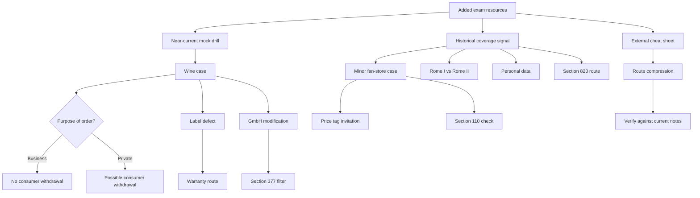

# Ubiquitous Language: Additional Mock Exams And External Cheat Sheet

Source note: `business-law/wiki/additional-mock-exams-and-external-cheatsheet/additional-mock-exams-and-external-cheatsheet.md`
Source files:

- `business-law/raw/mock-exam-ibl-this-is-the-mock-exam-for-the-winter-2425-semster.pdf`
- `business-law/raw/exam-ss22.pdf`
- `business-law/raw/introduction-to-business-law.pdf`

Course: Business Law
Processed: 2026-07-22

This context file standardizes the language for the added mock-exam resources. The exam-answer routes are inferred because the sources do not contain official solutions. The external cheat sheet is treated as an unofficial memory aid.

## Source Status Terms

| Term | Definition | Aliases to avoid |
|---|---|---|
| **Near-Current Mock Drill** | The WS24/25 mock exam: useful because it tests many of the same doctrine clusters as the current Business Law queue. | official 2026 final blueprint |
| **Historical Coverage Signal** | A topic appearing in SS22 that may reveal older exam breadth, but does not automatically override current 2026 Moodle/lecture priorities. | guaranteed exam topic |
| **External Cheat Sheet** | Unofficial compressed route summary prepared outside the current Moodle source set. | statutory authority, official solution |
| **Inferred Answer Route** | A study-coach solution path built from local notes and statutes where no official model solution is provided. | official answer |
| **Schema-Tailored Model Answer** | Inferred route rewritten into the expected exam format: legal-opinion schema for cases and short structured schema for theory. | route sketch only |
| **Coverage-Gap Radar** | A low-volume check for topics not deeply represented in the current queue, such as minors, IPL, GDPR, and torts. | new top priority |

## Contract And Capacity Terms

| Term | Definition | Aliases to avoid |
|---|---|---|
| **Essentialia Negotii** | Minimum essential terms needed for a contract; in a sale, usually parties, goods, and price. | all contract details |
| **Written Form** | Form requiring a signed document unless a statutory substitute applies. | any writing |
| **Text Form** | Readable declaration on a durable medium naming the declarant without handwritten signature. | signed paper only |
| **Receipt Of Declaration** | Effectiveness point when a declaration reaches the recipient's sphere of control and notice can be expected. | actual reading only |
| **Price Tag Invitation** | Product display or price tag that usually invites the customer to make an offer. | binding shop offer |
| **Minor Capacity Route** | Analysis for a person with limited legal capacity: legal advantage, consent, pocket-money rule, approval, and restitution. | child cannot contract at all |
| **Pocket-Money Rule** | Section 110 BGB validation where the minor fully performs with means provided for that purpose or free disposal. | enough money somewhere |
| **Invoice Purchase By Minor** | Minor's purchase where payment remains due later, so Section 110 usually does not validate it. | pocket-money purchase |

## Avoidance, Withdrawal, And Warranty Terms

| Term | Definition | Aliases to avoid |
|---|---|---|
| **Avoidance For Honest Mistake** | Section 119 BGB route where a party avoids a defective declaration without deceit/duress by the other side. | warranty cure |
| **Avoidance For Deceit Or Duress** | Section 123 BGB route where the declaration was caused by intentional misleading or unlawful pressure. | buyer regret |
| **Negative Interest** | Reliance loss protected by Section 122 BGB after certain mistake avoidance routes. | full expectation interest |
| **Defect-Specific Warranty Priority** | For a defective delivered good, Sections 434 and 437 BGB usually route the case before Section 119 II BGB. | every defect is mistake |
| **Consumer Withdrawal Route** | Consumer/trader plus distance or off-premises contract plus timely declaration plus no exception. | telephone order return right |
| **Transaction-Specific Consumer Status** | Classification rule that the same person can act as trader for one batch and consumer for another batch. | one status for whole exam |
| **Business Batch** | Goods ordered for a commercial/professional purpose, here restaurant wine. | consumer purchase |
| **Private Batch** | Goods ordered for personal consumption, here private wine. | business stock |
| **Label Defect** | Product-label problem that can matter when appearance/readability affects resale or display expectations. | no defect because contents work |
| **Reduction-Safer Fallback** | Remedy posture where price reduction may be easier than full revocation if a defect affects value but may be treated as not serious enough for termination. | automatic full return |
| **Cure Impossibility** | Repair/replacement route fails because the seller cannot provide conforming goods or remedy the defect. | automatic damages |

## Agency, Trade, And Company Terms

| Term | Definition | Aliases to avoid |
|---|---|---|
| **Agency Triangle** | Principal, agent, and third party connected by an agent's own declaration in the principal's name within authority. | messenger only |
| **Minor Agent** | Limited-capacity person who can still act as agent under Section 165 BGB because legal effects hit the principal. | invalid agent |
| **Unauthorized Minor Agent** | Minor who acts without authority; liability is limited by Section 179 III 2 BGB unless legal representative consented. | ordinary agent liability |
| **AG Management Board Representation** | Rule that the management board represents the stock corporation externally. | supervisory board representation |
| **Two-Tier Board** | Separate management board and supervisory board, especially in German AG governance. | one board with committees |
| **Business Judgment Rule** | Liability shield for informed, good-faith entrepreneurial decisions made in the company's interest. | free pass for illegal acts |
| **Contribution In Kind** | Non-cash contribution to company capital, such as a valid receivable, documented and valued in formation. | informal debt swap |
| **Merchant By Legal Form** | Entity treated as merchant because of legal form, especially GmbH or AG. | merchant only by size |
| **Section 377 Filter** | HGB inspection and notice rule that can deem goods approved in mutual commercial purchases. | ordinary complaint deadline |

## Cross-Border, Data, And Tort Terms

| Term | Definition | Aliases to avoid |
|---|---|---|
| **International Private Law** | Rules deciding which legal system applies to a private-law dispute with cross-border elements. | international public law |
| **Rome I Router** | EU route for law applicable to contractual obligations in civil and commercial matters. | tort law router |
| **Rome II Router** | EU route for law applicable to non-contractual obligations in civil and commercial matters. | contract law router |
| **Overriding Mandatory Provision** | Rule considered crucial for public interests and applied regardless of the otherwise applicable law. | any mandatory rule |
| **Personal Data** | Information relating to an identified or identifiable natural person. | company data generally |
| **Tort Damages Route** | Non-contractual liability route for protected-right injury, act, causation, unlawfulness, fault, and damage. | contract damages |
| **Protected Right Injury** | Harm to body, health, property, freedom, or another protected right. | pure annoyance |

## Statutory Anchors

| Section | Canonical function | Trigger facts | Exam use |
|---|---|---|---|
| **Section 110 BGB** | Pocket-money rule. | Minor fully pays using provided/free-disposal means. | Validate paid scarf purchase only if performance is complete. |
| **Section 119 BGB** | Avoidance for mistake. | Honest defective declaration or essential characteristic mistake. | Compare with warranty priority and Section 122. |
| **Section 122 BGB** | Reliance damages after mistake avoidance. | Effective Section 119 avoidance. | Explain why innocent reliance is protected. |
| **Section 123 BGB** | Avoidance for deceit/duress. | Intentional misleading or unlawful pressure causes declaration. | Explain no ordinary Section 122 compensation. |
| **Section 130 BGB** | Receipt of absent-party declaration. | Letter or embodied declaration sent to absent recipient. | Sphere of control plus expected notice. |
| **Section 142 I BGB** | Ex-tunc effect of avoidance. | Effective avoidance declaration. | State contract/declaration void from beginning. |
| **Section 164 I BGB** | Effective agency. | Agent acts for principal. | Own DoI, principal name, authority. |
| **Section 165 BGB** | Minor can be agent. | Agent has limited capacity. | Answer 12-year-old agent question. |
| **Section 179 III 2 BGB** | Unauthorized minor-agent liability limit. | Minor agent lacks authority. | Protects minor unless representative consented. |
| **Section 312c BGB** | Distance contract. | Exclusive distance communication. | Telephone-order gateway. |
| **Section 312g BGB** | Consumer withdrawal right. | Consumer distance/off-premises contract. | Separate business batch from private batch. |
| **Section 355 BGB** | Withdrawal declaration and period. | Consumer wants to withdraw. | State declaration and timing. |
| **Section 433 BGB** | Purchase agreement duties. | Sale of scarf, toaster, wine, bike. | Start sale cases. |
| **Section 434 BGB** | Material defect. | Bike brakes fail, wine labels defective. | Warranty gateway. |
| **Section 437 BGB** | Buyer remedies. | Defect at transfer of risk. | Cure, revocation, reduction, damages. |
| **Section 439 BGB** | Cure. | Buyer asks repair/replacement. | First remedy before escalation. |
| **Section 442 BGB** | Buyer knowledge exclusion. | Buyer knows/grossly ignores defect. | Warranty exclusion theory. |
| **Section 446 BGB** | Transfer of risk. | Delivered goods. | Timing checkpoint for defect. |
| **Section 705 BGB** | Partnership / GbR route. | Small joint business association. | SS22 business associations question. |
| **Section 823 I BGB** | Tort liability for protected-right injury. | Intentional punch causing medical cost. | SS22 assault damages route. |
| **Sections 1, 6 HGB** | Merchant status and merchant by legal form. | Small bistro versus GmbH. | Decide if Section 377 applies. |
| **Section 377 HGB** | Commercial inspection and notice. | Mutual commercial sale. | GmbH wine modification filter. |
| **Section 5 GmbHG** | Share capital and contribution in kind documentation. | GmbH contribution through receivable. | Contribution-in-kind answer. |
| **Section 13 GmbHG** | GmbH legal person and commercial company. | Bistro through GmbH. | Merchant-by-form and limited liability. |
| **Section 78 AktG** | AG representation. | Who represents AG. | Management board, not supervisory board. |
| **Section 93 AktG** | Business Judgment Rule. | Entrepreneurial management decision. | Adequate information and company-interest route. |
| **GDPR Article 4** | Personal data definition. | Name, identifier, location, online identifier. | Historical SS22 data-protection theory. |
| **Rome I Regulation** | Applicable law for contractual obligations. | Cross-border contract. | IPL theory distinction. |
| **Rome II Regulation** | Applicable law for non-contractual obligations. | Cross-border tort/non-contractual claim. | IPL theory distinction. |

## Relationships Between Canonical Terms

- **Near-Current Mock Drill** is stronger exam-practice evidence than **Historical Coverage Signal**, but neither overrides current Moodle guidance.
- **Schema-Tailored Model Answer** converts **Inferred Answer Route** into exam-writing form without pretending it is an official solution.
- **Transaction-Specific Consumer Status** explains why **Business Batch** blocks withdrawal while **Private Batch** may allow it.
- **Business Batch** blocks the **Consumer Withdrawal Route** even if the contract was made by phone.
- **Private Batch** may allow the **Consumer Withdrawal Route** if no exception applies.
- **Label Defect** can lead to **Reduction-Safer Fallback** where full revocation is contestable.
- **Merchant By Legal Form** triggers the **Section 377 Filter** even where a sole-proprietor version of the same facts might avoid HGB merchant status.
- **Defect-Specific Warranty Priority** keeps defective goods in the warranty system instead of mistake avoidance.
- **Price Tag Invitation** means the fan-store contract usually forms at checkout, not at shelf display.
- **Invoice Purchase By Minor** fails the **Pocket-Money Rule** because payment is not complete.
- **Rome I Router** and **Rome II Router** both belong to **International Private Law**, but they split by contractual versus non-contractual obligation.
- **Tort Damages Route** is independent from contract, but contract and tort can sometimes apply in parallel.

## Mermaid Memory Aid



## Example Dialogue

Professor: "M ordered the wine by telephone. Can he return it just because of that?"

Student: "Only if the transaction is a consumer distance contract. For the restaurant boxes he acts for business purposes, so no consumer withdrawal. For the private box, withdrawal may be possible if no exception applies."

Professor: "What changes if the bistro is a GmbH?"

Student: "The GmbH is a merchant by legal form. If T is also a merchant, Section 377 HGB forces prompt inspection and notice. Waiting several days over a visible label defect may block warranty rights."

Professor: "The eleven-year-old had enough money in his account for the toaster. Does Section 110 validate the invoice purchase?"

Student: "No. The point is not abstract solvency. Section 110 requires complete performance with provided means; an unpaid invoice leaves a payment duty."

## Flagged Ambiguities

| Ambiguity | Canonical recommendation |
|---|---|
| "Telephone order" | Ask first whether the buyer acts as consumer or trader. |
| "M is a consumer or trader" | Classify each transaction separately: restaurant stock and private wine can differ. |
| "Wine labels are wrong but wine is fine" | Treat label quality as potentially defective when resale/display matters. |
| "Defect means full return" | If significance is contestable, argue cure first and keep reduction as the safer fallback. |
| "Small bistro" | Separate BGB trader status from HGB merchant status. Small business can be trader but not merchant. |
| "Bistro as GmbH" | Use merchant-by-form and Section 377 HGB. |
| "Wrong price tag" | Start with invitatio ad offerendum; then contract at checkout and mistake route. |
| "Minor has money somewhere" | Section 110 needs completed payment, not mere ability to pay. |
| "Historical SS22 topic" | Keep as coverage radar unless current materials also emphasize it. |
| "Cheat sheet says X" | Verify against the current note, statutory file, and official statute if the rule matters. |

## Exam Trap Corrections

| Trap | Correction |
|---|---|
| Telephone contract means automatic return right. | Consumer withdrawal requires consumer status and no exception. |
| M's status is fixed for all wine. | Split restaurant bottles from private flagship wine. |
| Defective product means Section 119 II BGB. | Defective delivered goods usually route through Sections 434 and 437 BGB. |
| Minor cannot be an agent. | Section 165 BGB allows a limited-capacity agent. |
| AG is represented by shareholders or supervisory board. | The management board represents the AG externally. |
| GmbH only affects liability. | GmbH also creates merchant-by-form consequences. |
| Wrong price tag is the shop's offer. | Product display is usually an invitation to make an offer. |
| Invoice purchase is covered by pocket money. | No, unless the minor has fully performed using the relevant means. |
| Rome I/Rome II decide which court hears the case. | They decide applicable law for contractual/non-contractual obligations. |

## Cheat-Sheet Language

```text
WS24/25 wine case:
Telephone order is only the communication method. First split consumer/trader. Then route defects through warranty. In the GmbH variation, test Section 377 HGB before ordinary buyer remedies.
```

```text
SS22 minor case:
Price tag = invitation. Checkout = contract moment. Scarf may be validated by Section 110 if paid with pocket money. Toaster on invoice is not fully performed, so approval/restitution becomes central.
```

```text
Coverage gaps:
Minors, Rome I/Rome II, GDPR personal data, and torts are historical signals. Drill them briefly, but do not let them replace the current Warranty/Trade/Company/mock integration sequence.
```
