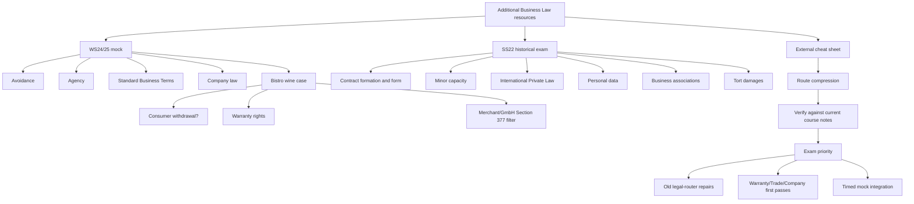

# Additional Mock Exams And External Cheat Sheet

Sources:

- `business-law/raw/mock-exam-ibl-this-is-the-mock-exam-for-the-winter-2425-semster.pdf`
- `business-law/raw/exam-ss22.pdf`
- `business-law/raw/introduction-to-business-law.pdf`

Course: Business Law
Processed: 2026-07-22
Wiki note: `business-law/wiki/additional-mock-exams-and-external-cheatsheet/additional-mock-exams-and-external-cheatsheet.md`

Course direction checked against `business-law/wiki/_course-logistics.md`: these are exam-practice and external reference materials, not new official 2026 doctrine lectures. Use them after the current Business Law doctrine sequence, especially Contract Law I-III, SBT, Agency, Warranty Rights, Trade Law, and Company Law.

Source status: the two exam PDFs do not include official solutions. The answer routes below are inferred study-coach routes based on the processed Business Law notes, the standing statutory-law file, and official statutory reference checks. The cheat sheet is an external/unofficial study aid; use it as a memory compressor and coverage radar, not as the authority where it conflicts with Moodle materials or statutes.

External reference check: key BGB, HGB, GmbHG, AktG, GDPR, Rome I, and Rome II anchors were checked against official Gesetze-im-Internet or EUR-Lex sources on 2026-07-22. Official English German-law translations warn that translations can lag the current German text; for exam wording, prefer the statutory text distributed in the course.

## 80/20 Exam Summary

These additional resources sharpen the Business Law exam strategy in three ways:

- The WS24/25 mock repeats the current high-yield clusters: avoidance, agency, SBT, company law, consumer withdrawal, warranty rights, and merchant/GmbH trade-law consequences.
- The SS22 exam adds historical coverage signals: minors, written/text form, declaration-of-intent receipt, International Private Law, GDPR personal data, business associations, and tort damages.
- The external cheat sheet compresses weeks 1-10 into route language: IRAC, contract formation, declaration of intent, avoidance, agency, withdrawal, SBT, breach/impossibility, warranty, merchant/Prokura, and torts.

Priority for the 2026-07-28 Business Law exam:

```text
current 2026 doctrine sequence
-> official example exams I-II
-> WS24/25 mock as near-current integration drill
-> SS22 as historical coverage-gap diagnostic
-> external cheat sheet only as quick route memory
```

## Source Inventory

| Source | Type | Length | Main use | Authority level |
|---|---:|---:|---|---|
| WS24/25 mock exam | Mock exam | 3 pages | Near-current integrated practice with theory plus one legal-opinion case. | External/historical, no solution key. |
| SS22 exam | Historical exam | 3 pages | Coverage-gap diagnostic, especially minors, IPL, GDPR, and torts. | Historical, no solution key. |
| Introduction to Business Law cheat sheet | External cheat sheet | 31 pages | Compact memory aid for weeks 1-10 routes. | Unofficial reference, verify against course notes. |

## High-Yield Coverage Map

| Topic | WS24/25 mock | SS22 exam | Cheat sheet | Current queue status |
|---|---|---|---|---|
| Legal method / IRAC | Case writing | Legal-opinion case | Strong | Covered in Week 01-02. |
| Contract formation | Indirectly | Sale essentialia, form, receipt | Strong | Covered in Week 03. |
| Avoidance / rescission | Strong theory | Price-tag error route | Strong | Covered in Week 04. |
| Consumer withdrawal | Strong case route | Not central | Strong | Covered in Week 05. |
| Standard Business Terms | Strong theory | Not central | Moderate | Covered in Week 06. |
| Agency | Strong theory | Not central | Strong | Covered in Week 07. |
| Warranty rights | Strong case route | Historical scarf/toaster route | Strong | Covered in Weeks 08-09. |
| Trade law / merchant status | Strong modification | Not central | Merchant/Prokura | Covered in Week 11. |
| Company law | Strong theory | Strong theory | Light | Covered in Week 12-13. |
| Minors / capacity | Not central | Strong case route | Light | Coverage gap, but BGB General Part anchor exists. |
| International Private Law | Not central | Theory route | Not central | Coverage gap; likely lower priority unless current materials signal it. |
| GDPR personal data | Not central | Theory route | Not central | Coverage gap; historical signal only. |
| Tort damages | Not central | Assault damages route | Light | Coverage gap; historical signal only. |

## How To Use These Materials

Do not start by reading the inferred answer routes. Use this order:

1. Pick one mock source.
2. Do 8-10 minutes of closed-book issue spotting.
3. Write only headings and statutory anchors.
4. Compare with the route below.
5. Repair one missed router, not every paragraph.

For the external cheat sheet, use it only after trying retrieval from the main notes. The cheat sheet is useful for route compression, but it can blur distinctions such as rescission versus revocation or general BGB warranty rules versus HGB merchant filters.

## WS24/25 Mock Exam Structure

| Part | Points | Writing mode | Main skill |
|---|---:|---|---|
| Avoiding a contract | 8 | Short answer | Section 119 versus Section 123 consequences and warranty-law priority. |
| Law of agency | 7 | Short answer | Section 164 requirements, minor agent, AG representation. |
| Standard Business Terms | 7 | Short answer | Definition, business use, risks, practical example. |
| Company law | 10 | Short answer | One-tier/two-tier boards, Business Judgment Rule, GmbH contribution in kind. |
| Bistro wine case | 28 | Fully formulated memorandum | Telephone order, consumer/trader route, warranty rights, GmbH/merchant modification. |

The source states 60 points total and 120 minutes.

## WS24/25 Schema-Tailored Model Answers

These answers are inferred from the mock questions and the processed course notes. Use them as writing models, not as official solutions.

### Question 1 Model Answer: Avoiding A Contract

#### 1a. Consequence Of Avoidance Under Section 119 Or Section 123 BGB

Schema:

```text
definition -> statutory anchor -> consequence
```

Model answer:

- Avoidance attacks a declaration of intent that was defective when it was made.
- The rescinding party must have an avoidance ground and must declare avoidance.
- If avoidance is effective, Section 142 I BGB treats the declaration as void from the beginning.

Exam sentence:

```text
The consequence of effective avoidance under Section 119 or Section 123 BGB is voidness ex tunc under Section 142 I BGB.
```

#### 1b. Why Section 122 Damages Fit Section 119 But Not Section 123

Schema:

```text
compare -> policy -> consequence
```

Model answer:

- Section 119 BGB protects a party who made an honest mistake. The other party may have relied innocently on the declaration, so Section 122 BGB shifts the reliance-loss risk back to the mistaken party.
- Section 123 BGB protects a party whose will was manipulated by deceit or duress. The transaction is tainted by wrongful influence, so the law does not grant the same reliance-damages protection to the party responsible for, or connected with, the manipulation.
- Therefore, honest mistake avoidance creates reliance-damages exposure; deceit/duress avoidance does not follow that Section 122 logic.

Nuance:

```text
The reason is not that Section 123 is "more important." The reason is risk allocation: innocent reliance is protected after honest mistake, but wrongful manipulation is not rewarded.
```

#### 1c. Defective Bike And Section 119 II BGB

Schema:

```text
candidate route -> priority rule -> correct route -> conclusion
```

Model answer:

- A buyer might think a material defect is a mistake about an essential characteristic under Section 119 II BGB.
- In a purchase contract, however, defects discovered after delivery are normally handled by the special warranty regime.
- The buyer should start with Sections 434 and 437 BGB: defect, transfer of risk, cure, revocation, reduction, or damages.
- Section 119 II BGB should not be used to bypass warranty law for an ordinary defective delivered product.

Conclusion:

```text
The buyer normally cannot avoid the contract under Section 119 II BGB merely because the bike has defective brakes; the correct route is warranty law.
```

### Question 2 Model Answer: Law Of Agency

#### 2a. Three Requirements For Valid Representation

Schema:

```text
list requirements -> consequence
```

Model answer:

Valid representation under Section 164 I BGB requires:

1. an own declaration of intent by the agent;
2. acting in the name of the principal;
3. acting within power of representation.

If these requirements are met, the legal effect of the declaration arises directly for and against the principal.

#### 2b. Minor Agent

Model answer:

- A 12-year-old has limited capacity, but limited capacity does not prevent a person from acting as an agent.
- Section 165 BGB allows even a person with limited capacity to contract to act as representative.
- The reason is that the legal effects fall on the principal, not on the minor agent.

Nuance:

```text
Separate agency validity from agent liability. If the minor acts without authority, Section 179 III 2 BGB protects the minor from representative liability unless the legal representative consented.
```

#### 2c. Representation Of An AG

Model answer:

- A German AG is represented externally by its management board.
- The supervisory board supervises and controls the management board but does not normally represent the AG in ordinary business.

Exam sentence:

```text
Under the AG two-tier structure, the management board represents; the supervisory board supervises.
```

### Question 3 Model Answer: Standard Business Terms

#### 3a. Definition

Standard Business Terms are pre-formulated contractual terms intended for repeated use and presented by one contracting party to the other, without genuine individual negotiation.

#### 3b. Advantages And Risks

Advantages:

- lower drafting and negotiation costs;
- standardized transactions;
- predictable allocation of duties, payment, delivery, warranty, and liability risks.

Risks:

- unfair one-sided risk shifting;
- surprising clauses;
- ambiguous wording interpreted against the user;
- invalidity under content control;
- loss of customer trust.

#### 3c. Example

```text
An online shop uses the same pre-written delivery, payment, return, and liability clauses for every customer order.
```

Nuance:

```text
Do not define SBT as "any written contract." The key is pre-formulated terms supplied by one party without genuine negotiation.
```

### Question 4 Model Answer: Company Law

#### 4a. One-Tier Versus Two-Tier Board

| Structure | Definition | Example |
|---|---|---|
| One-tier board | Management and monitoring functions are concentrated in one board, often with executive and non-executive members. | Common Anglo-American board model; also possible for an SE depending on chosen structure. |
| Two-tier board | Management and supervision are institutionally separated. | German AG: management board manages and represents; supervisory board appoints, supervises, and controls. |

#### 4b. Business Judgment Rule

Schema:

```text
entrepreneurial decision -> information -> good faith/company interest -> no illegal/conflicted conduct
```

Model answer:

- The Business Judgment Rule protects entrepreneurial decisions by management from hindsight liability.
- Requirements: an entrepreneurial decision, adequate information, good-faith belief that the decision serves the company's interest, no improper personal-interest conflict, and no violation of mandatory legal duties.
- Example: the management board enters a new product market after reviewing market data, financial forecasts, risks, and alternatives. If the decision later fails commercially, that failure alone does not prove breach of duty.

Nuance:

```text
The Business Judgment Rule does not protect illegal conduct, blind decision-making, or self-dealing.
```

#### 4c. Claim Against D As GmbH Contribution In Kind

Schema:

```text
possibility -> economic value/transferability -> formal requirements -> valuation risk
```

Model answer:

- In principle, a claim against D can be contributed as a contribution in kind if the claim exists, is transferable, enforceable, and has economic value.
- The contribution in kind must be expressly set out in the GmbH formation documents/articles, including the object of the contribution and the share contribution it covers.
- The valuation must be justified; if the claim is overvalued or not collectible, the contributor can remain liable for the shortfall.

Nuance:

```text
A receivable is not automatically good capital. It must be real, enforceable, transferable, and realistically recoverable.
```

### Question 5 Model Answer: Bistro Wine Case

#### 5a. Telephone Order And Return

Issue sentence:

```text
M can give the wine back merely because he ordered by telephone only if a consumer withdrawal right exists for the relevant order.
```

Requirements:

```text
consumer-trader contract -> distance contract -> no exception -> timely withdrawal
```

Application:

- The telephone order can satisfy the distance-communication element.
- For the four restaurant boxes, M acts for his bistro. The purpose is resale/use in his business, so he is not acting as a consumer for that transaction.
- Therefore, the restaurant order does not create a consumer withdrawal right merely because it was placed by telephone.
- The private flagship-wine box is different. It is meant for private consumption, so M acts as a consumer for that order. If T is acting as a trader, the contract was concluded by distance communication, no exception applies, and M is within the withdrawal period, withdrawal is possible for that private box.

Final answer:

```text
M cannot return the restaurant bottles merely because he ordered them by telephone. He may have a consumer withdrawal route only for the separate private flagship-wine box.
```

Nuance:

```text
Do not classify M once for the whole exam. Classify him transaction by transaction: restaurant batch = business purpose; private batch = consumer purpose.
```

#### 5b. Buyer's Rights For Restaurant Bottles

Issue sentence:

```text
M could have warranty rights against T under Section 437 BGB if the wrongly labelled restaurant bottles are defective and no exclusion applies.
```

Requirements:

```text
purchase agreement -> material defect at transfer of risk -> no warranty exclusion -> remedy selection
```

Application:

- M and T concluded a purchase agreement for the restaurant bottles.
- The upside-down labels do not affect the drinkability of the wine, but the bottles were bought for restaurant resale/display. If label appearance is relevant for ordinary resale presentation, the mislabelling is a material defect.
- The defect existed at delivery because the whole vintage was wrongly labelled.
- M runs a small seasonal bistro in his own name, with low turnover and limited staff. He is an entrepreneur for consumer-law purposes, but not necessarily a merchant under HGB. On the likely route, Section 377 HGB does not apply in the original scenario.
- Cure under Section 439 BGB is the first remedy. M can request replacement bottles or repair/relabeling.
- T says the whole vintage is affected and relabeling is not feasible. If cure is impossible, M can move to secondary remedies.
- Revocation is possible only if the defect is not insignificant. Because the wine remains drinkable, this point is contestable. For restaurant display and resale, the label defect can still be economically significant.
- Reduction under Section 441 BGB is the safer fallback because it adjusts the price even when keeping the wine remains possible.
- Damages require the damages route and responsibility; do not award damages automatically merely because a defect exists.

Final answer:

```text
M's correct route for the restaurant bottles is warranty law, not telephone withdrawal. He can demand cure first. If cure is impossible, reduction is strong and revocation is plausible if the label defect is not treated as insignificant for restaurant resale; damages require a separate responsibility analysis.
```

Nuance:

```text
The defect argument depends on commercial presentation. If the examiner treats drinkability as dominant, reduction may be stronger than full revocation.
```

#### 5c. GmbH Modification

Issue sentence:

```text
If the bistro is operated through a GmbH, M's warranty position changes if Section 377 HGB applies and the defect notice was late.
```

Requirements:

```text
mutual commercial purchase -> prompt inspection -> prompt notice -> consequence of failure
```

Application:

- A GmbH is a merchant by legal form.
- T is a wholesale wine trader. The purchase is therefore commercial for both parties.
- Section 377 HGB requires prompt inspection after delivery and prompt notice when the defect is apparent.
- The labels are visibly upside down and hard to read, so the defect is likely discoverable during ordinary inspection.
- Delivery occurred on Friday, 2 August. M waited until Wednesday, 7 August to open the first box and notify T. For an apparent label defect in a merchant purchase, this delay is exam-dangerous and likely not prompt.

Final answer:

```text
The GmbH modification likely weakens M's position. If Section 377 HGB applies and the notice is late, the bottles are deemed approved and M's warranty rights from question 5b are excluded.
```

Nuance:

```text
If the delay were still considered prompt under the ordinary course of this business, the warranty route from 5b would remain. But the exam signal is the GmbH merchant filter.
```

## WS24/25 Theory Routes

### Avoiding A Contract

Core route:

```text
avoidance ground
-> declaration of avoidance
-> time limit
-> Section 142 I BGB ex-tunc voidness
-> Section 122 BGB only for honest-mistake avoidance, not deceit/duress
```

Answer route:

- Avoidance under Section 119 BGB or Section 123 BGB makes the declaration of intent void from the beginning under Section 142 I BGB.
- Section 119 protects a party from being bound by an honest defective declaration. Because the other party may have relied innocently on the declaration, Section 122 BGB compensates reliance damage.
- Section 123 protects a party whose will was manipulated by deceit or duress. The other side should not receive the same reliance protection when the transaction is tainted by intentional misconduct.
- For a defective bike, do not use Section 119 II BGB as the normal route after purchase. Warranty law is the specific regime for material defects after transfer of risk. Start with Sections 434 and 437 BGB, then cure, revocation, reduction, or damages.

Exam trap:

```text
Bad product after delivery = warranty route first, not mistake rescission.
```

### Law Of Agency

Valid representation under Section 164 I BGB:

```text
own declaration of intent by agent
-> in the name of the principal
-> within power of representation
```

Minor agent:

- A 12-year-old can be an agent because the effect of the declaration lands with the principal, not with the minor.
- Section 165 BGB prevents limited capacity from defeating agency as such.
- Separate issue: an unauthorized minor agent is protected from liability under Section 179 III 2 BGB unless the legal representative consented.

AG representation:

- An Aktiengesellschaft is represented by the management board.
- In a German two-tier AG, the supervisory board supervises and appoints/controls management, but it does not normally conduct external business representation.

### Standard Business Terms

Definition:

```text
pre-formulated contract terms
-> intended for multiple contracts
-> presented by one party to the other
-> not individually negotiated
```

Advantages:

- lower drafting and negotiation cost
- standardization of mass transactions
- predictable risk allocation
- faster contracting

Risks:

- one-sided risk shifting
- surprise clauses
- ambiguity
- invalid clauses under content control
- business trust loss if terms are perceived as unfair

Example:

```text
An online shop uses a pre-written return, liability, and delivery clause for all customers.
```

### Company Law

One-tier versus two-tier board:

| Structure | Meaning | Example route |
|---|---|---|
| One-tier board | Management and monitoring are concentrated in one board, often with executive and non-executive directors. | Common Anglo-American board model; possible in some SE settings depending on chosen structure. |
| Two-tier board | Management and supervision are institutionally separated. | German AG: management board runs business; supervisory board supervises. |

Business Judgment Rule:

```text
entrepreneurial decision
-> adequate information
-> no improper personal-interest conflict
-> good-faith belief in company interest
-> no compliance/legal-duty violation
```

Use it when a board chooses a risky business strategy after informed deliberation. Do not use it to excuse illegal conduct or blind decision-making.

GmbH contribution in kind:

- A claim against D can in principle be contributed as a contribution in kind if it is transferable and has economic value.
- The contribution in kind must be specified in the articles of association, including the object and the nominal share contribution it covers.
- The founders must justify valuation in the formation report; overvaluation can trigger liability for the shortfall.
- Practical exam warning: a claim is only useful as capital if it exists, is enforceable, and is realistically recoverable.

## WS24/25 Case Route: Bistro Wine Labels

### Paraphrased Facts

M leaves legal practice, runs a small seasonal bistro in his own name, and orders Tuscan wine by telephone from a Hamburg wholesaler. Four boxes are for the bistro; one later box is for private use. The bottles arrive, and several days later M discovers the labels are upside down and hard to read. He wants replacement bottles for display and sale in the restaurant. The wholesaler says the entire vintage has the label problem and replacement or relabeling is not feasible.

### Question A: Can M Give The Bottles Back Because He Ordered By Telephone?

Route:

```text
distance contract
-> consumer/trader status
-> private purpose or business purpose
-> withdrawal right
-> exceptions
```

For the restaurant bottles:

- Telephone ordering can be distance communication.
- But consumer withdrawal requires a consumer-trader transaction.
- M ordered the restaurant bottles for business use. He acts as a trader/entrepreneur for that transaction even if the bistro is small.
- Therefore, he cannot return the restaurant bottles merely because the order was by telephone.

For the private flagship wine:

- M acts privately for the one-box personal-consumption order.
- If the other requirements for a distance consumer contract are satisfied and no exception applies, a consumer withdrawal route is possible.
- Keep the two batches separate: business batch no consumer withdrawal; private batch may have it.

### Question B: Buyer's Rights For The Restaurant Bottles

Route:

```text
purchase agreement
-> material defect at transfer of risk
-> buyer rights excluded?
-> cure
-> cure impossible/refused
-> revocation/reduction/damages
```

Likely analysis:

- There is a purchase agreement for the restaurant bottles.
- The wine itself is drinkable, but the labels are upside down and hard to read. For bottles intended for restaurant resale/display, label presentation can be part of the expected quality. A material defect route is therefore plausible.
- The defect existed at delivery because the whole vintage was wrongly labeled.
- M running a small seasonal bistro in his own name is a trader under BGB consumer rules, but not necessarily a merchant under HGB. If he is not a merchant, Section 377 HGB does not filter the ordinary warranty rights.
- Cure under Section 439 BGB is the primary route. M can ask for replacement or repair/relabeling.
- If the wholesaler cannot provide correctly labeled bottles and cannot repair the labels, cure is unavailable.
- Then M can consider revocation or reduction through the Section 437 BGB gateway. Revocation depends on the defect not being merely insignificant.
- Damages require the damages route and responsibility/fault; do not assume damages just because there is a defect.

Exam conclusion:

```text
For the restaurant bottles, M's stronger route is warranty law, not telephone withdrawal. He should first demand cure. If cure is impossible and the label defect is not insignificant for restaurant resale, revocation or reduction become plausible.
```

### Question C: If The Bistro Is Operated Through A GmbH

Key change:

```text
GmbH = merchant by legal form
-> mutual commercial purchase if seller is merchant too
-> Section 377 HGB inspection and notice filter
```

Likely analysis:

- A GmbH is a commercial company by legal form.
- If the wholesaler is also a merchant, the purchase is commercial for both parties.
- Section 377 HGB requires prompt inspection and prompt notice of defects.
- A label problem on bottles is likely discoverable by reasonable inspection after delivery.
- M waited from 2 August until 7 August before opening the first box and notifying T.
- That delay is exam-dangerous. If considered late, the bottles are deemed approved and warranty rights are excluded.

Exam conclusion:

```text
The GmbH modification likely weakens M's warranty position because Section 377 HGB may block the buyer's rights if inspection/notice was not prompt.
```

## SS22 Historical Exam Structure

The source has three pages and no official solution key. It appears to mix short theory questions with one legal-opinion case. Some point labels in the extracted text are internally awkward, so treat point totals as approximate and focus on issue coverage.

| Part | Main topics | Use |
|---|---|---|
| Contracts | Sale essentialia, written/text form, receipt of physical declaration. | Quick Contract Law I drill. |
| International Private Law and data protection | Rome I/Rome II distinction, overriding mandatory provisions, personal data. | Historical coverage-gap radar. |
| Business associations | Partnership advantage/disadvantage, GmbH incorporation, GmbH versus AG. | Company Law drill. |
| Minor fan-store case | Minor capacity, price tag, mistaken price, invoice purchase, restitution. | Contract formation/capacity/property integration. |
| Assault damages | Intentional injury and medical costs. | Tort damages coverage-gap drill. |

## SS22 Schema-Tailored Model Answers

These answers are historical coverage-gap practice. Use them after current 2026 doctrine and the official example exams.

### Question 1 Model Answer: Contracts

#### 1a. Sale Of Goods Essentialia

Schema:

```text
contract type -> minimum agreement -> consequence
```

Model answer:

- A sale of goods contract under Section 433 BGB requires two matching declarations of intent.
- The parties must at least agree on the parties, the goods/object, and the price.
- If these essentialia negotii are sufficiently determined or determinable, the contract can be formed.

Exam sentence:

```text
For a sale of goods contract, the minimum agreement concerns who buys from whom, which object is sold, and for what price.
```

#### 1b. Written Form And Text Form

Schema:

```text
define both -> example -> contrast
```

Model answer:

| Form | Meaning | Example |
|---|---|---|
| Written form | Declaration embodied in a document and signed by the issuer, unless a statutory substitute applies. | Signed paper contract. |
| Text form | Readable declaration on a durable medium naming the declarant, without handwritten signature requirement. | Email, PDF notice, or saved customer message. |

Exam sentence:

```text
Written form is signature-heavy; text form is durable-message-heavy.
```

#### 1c. Receipt Of Physical Declaration To Absent Recipient

Schema:

```text
entry into sphere -> ordinary possibility of notice -> effect
```

Model answer:

- A declaration of intent to an absent recipient becomes effective when it is received.
- Receipt requires that the declaration enters the recipient's sphere of control and that, under ordinary circumstances, the recipient can be expected to take notice.
- Example: a letter placed in a business mailbox after closing is normally received when mailbox checking can be expected in the ordinary course of business, not necessarily at the exact physical moment of insertion.

### Question 2 Model Answer: International Private Law And Data Protection

#### 2a. International Private Law, Rome I, Rome II

Model answer:

- International Private Law determines which legal system applies to a private-law dispute with cross-border elements.
- It does not decide the merits directly and is not the same as international jurisdiction.
- Rome I applies to contractual obligations in civil and commercial matters.
- Rome II applies to non-contractual obligations, especially tort-like claims.

Shortcut:

```text
Rome I = contract conflict law. Rome II = non-contract conflict law.
```

#### 2b. Overriding Mandatory Provisions

Model answer:

- Overriding mandatory provisions are rules regarded as crucial for a state's public interests, such as political, social, or economic organization.
- They may apply regardless of the law otherwise chosen or determined by conflict-of-law rules.

Nuance:

```text
They are not merely "important rules." They override because the state insists on applying them in the relevant situation.
```

#### 2c. Personal Data

Model answer:

- Personal data means information relating to an identified or identifiable natural person.
- Examples: a customer's name, email address, student number, location data, IP address, or payroll record.

Nuance:

```text
Company data is not personal data as such, but information about an identifiable person inside a company can be.
```

### Question 3 Model Answer: Business Associations

#### 3a. Partnership Under Section 705 BGB

Model answer:

- Main advantage: a partnership/GbR is flexible and simple to establish.
- Main disadvantage: partners usually face personal liability and strong dependence on the persons involved.

#### 3b. GmbH Incorporation Steps

Schema:

```text
articles -> notarization -> capital -> managing director -> register
```

Model answer:

- Prepare articles of association.
- Notarize the articles.
- Provide the required share capital/contributions.
- Appoint managing director(s).
- Register the company in the commercial register. The GmbH exists as such after registration.

#### 3c. GmbH Versus AG

Model answer:

| Difference | GmbH | AG |
|---|---|---|
| Governance | Managing director(s) plus shareholders; more flexible shareholder control. | Management board, supervisory board, and general meeting; stricter two-tier governance. |
| Capital-market orientation | Usually SME/private-company form. | Designed for larger capital-company structures and easier share-based financing. |
| Minimum capital | EUR 25,000 share capital in the standard GmbH route. | EUR 50,000 share capital in the standard AG route. |
| Flexibility | More flexible articles and internal arrangements. | More mandatory statutory governance. |

Nuance:

```text
Do not answer only "both have limited liability." The question asks for differences, so compare governance, capital, flexibility, and financing role.
```

### Question 4a Model Answer: Minor Fan-Store Case

#### Scarf: Extra EUR 10 Or Return

Issue sentence:

```text
V can demand another EUR 10 or return of the scarf only if the purchase contract was not valid at EUR 10 or if V can eliminate it through an effective avoidance route.
```

Requirements:

```text
minor capacity -> contract formation -> Section 110 validation -> seller mistake route -> consequence
```

Application:

- M is eleven and therefore has limited capacity.
- Buying a scarf is not merely legally advantageous because it creates a payment duty.
- However, M paid the EUR 10 at checkout. If he used money given for free disposal or for this kind of purchase, Section 110 BGB validates the contract because performance was fully effected with permitted funds.
- The price tag itself is normally not a binding offer, but an invitation to customers to make an offer. The decisive agreement was formed at checkout.
- If the store accepted the sale at EUR 10, the contract price is EUR 10. V cannot demand a further EUR 10 without a contractual basis for a EUR 20 price.
- A possible avoidance route by V must be handled carefully. A wrong shelf tag made earlier by an employee is not automatically a legally relevant error in the checkout declaration. If the checkout sale was consciously concluded at EUR 10, V's avoidance route is weak.

Final answer:

```text
If Section 110 BGB validates the EUR 10 purchase and V has no effective avoidance ground, V cannot demand another EUR 10 and cannot demand return of the scarf.
```

Nuance:

```text
Wrong price tag does not automatically mean wrong contract price. First ask where the binding offer and acceptance happened.
```

#### Toaster: Payment And Return

Issue sentence:

```text
M is obliged to pay for the toaster only if the invoice purchase contract is valid despite his limited capacity.
```

Requirements:

```text
limited capacity -> not merely advantageous -> consent or Section 110 -> approval -> restitution
```

Application:

- The toaster purchase on invoice creates a duty to pay EUR 50 and is therefore not merely legally advantageous.
- M did not pay at the time of conclusion. Section 110 BGB does not validate the contract merely because his pocket-money account still has EUR 200; the performance must be actually effected.
- No prior parental consent or later approval is stated. The contract is therefore pending ineffective and, without approval, ineffective.
- V cannot demand the purchase price from M if the contract is ineffective.
- However, M received and kept the toaster without a valid contractual basis. He must generally return it through the restitution/unjust-enrichment route.

Final answer:

```text
M is not obliged to pay the invoice price without valid consent or approval, but he must give back the toaster if the contract is ineffective.
```

Nuance:

```text
Having enough money somewhere is not enough for Section 110 BGB. The minor must have actually performed with permitted funds.
```

### Question 4b Model Answer: Assault And Medical Costs

Issue sentence:

```text
M could have a claim against K for EUR 500 medical-treatment costs under Section 823 I BGB and Section 249 BGB if K unlawfully and culpably injured M's body or health.
```

Requirements:

```text
protected right -> act -> causation -> unlawfulness -> fault -> damage
```

Application:

- Body and health are protected rights.
- K intentionally punched M in the face.
- The punch caused hospitalization and EUR 500 additional medical-treatment costs.
- No justification, such as self-defense, is apparent.
- K acted intentionally and therefore at fault.

Final answer:

```text
M can claim EUR 500 from K as compensation for the additional medical-treatment costs.
```

Nuance:

```text
If asked more broadly, also consider non-material damages for bodily injury. For this question, answer the EUR 500 medical-cost claim first.
```

## SS22 Theory Routes

### Sale Of Goods Contract Essentials

For a sale of goods contract, the essentialia negotii are:

- parties
- object/goods
- price

Exam sentence:

```text
A sale of goods contract under Section 433 BGB requires two matching declarations of intent at least covering the parties, the object sold, and the purchase price.
```

### Written Form Versus Text Form

| Form | Canonical meaning | Example |
|---|---|---|
| Written form | A declaration recorded in a document and signed by the issuer, unless a statutory substitute applies. | Signed paper contract. |
| Text form | Readable declaration on a durable medium that names the declarant but does not need a handwritten signature. | Email or PDF notice. |

High-yield distinction:

```text
Written form is signature-heavy; text form is durable-message-heavy.
```

### Receipt Of Physical Declaration To An Absent Recipient

Route:

```text
declaration enters recipient's sphere of control
-> under ordinary circumstances recipient can be expected to take notice
-> receipt/effectiveness under Section 130 BGB
```

Example:

```text
A letter placed in a business mailbox after closing is usually received when ordinary business circumstances make mailbox checking expected, not necessarily the moment it physically lands.
```

### International Private Law And Data Protection

International Private Law:

- decides which legal system applies to a private-law dispute with cross-border elements;
- is not the same as public international law;
- does not by itself decide the merits of the claim.

Rome I versus Rome II:

| Instrument | Applies to | Shortcut |
|---|---|---|
| Rome I | Contractual obligations in civil and commercial matters with a conflict of laws. | Cross-border contract law. |
| Rome II | Non-contractual obligations in civil and commercial matters with a conflict of laws. | Cross-border tort/non-contractual law. |

Overriding mandatory provisions:

```text
Rules treated as crucial for a country's public interests, so they may apply regardless of the otherwise applicable law.
```

Personal data:

```text
Any information relating to an identified or identifiable natural person.
```

Examples: name, student number, customer email address, location data, online identifier, payroll information.

### Business Associations

Partnership under Section 705 BGB:

- advantage: flexible and simple to form;
- disadvantage: personal liability and person-dependence.

GmbH incorporation:

```text
articles of association
-> notarization
-> capital contribution / share capital setup
-> managing director appointment
-> commercial-register registration
-> GmbH exists as such only after registration
```

GmbH versus AG:

| Dimension | GmbH | AG |
|---|---|---|
| Typical use | SME/flexible limited-liability company. | Larger corporation/capital-market form. |
| Minimum capital | EUR 25,000 share capital. | EUR 50,000 share capital in the usual route. |
| Governance | Managing director and shareholders. | Management board, supervisory board, general meeting. |
| Flexibility | More flexible articles and shareholder control. | More rigid statutory governance. |

## SS22 Case Route: Minor In Fan Store

### Paraphrased Facts

Eleven-year-old M buys a scarf that is tagged too cheaply compared with the other scarves. Later he also takes a toaster on invoice because he lacks enough cash, although he has money on a pocket-money account. He later regrets the toaster. The store owner discovers the scarf was wrongly labelled and wants either extra payment or return.

### Scarf: Extra EUR 10 Or Return?

Route:

```text
minor capacity
-> product display/price tag as invitation
-> contract at checkout
-> pocket-money rule
-> seller mistake route
-> conclusion
```

Likely analysis:

- M is eleven, so he has limited capacity.
- A purchase contract is not merely legally advantageous because it creates a payment duty.
- If M paid the EUR 10 with funds given for free disposal or that purchase, Section 110 BGB can validate the contract.
- A price tag or shelf display is usually not the binding offer; the contract is normally formed at checkout.
- If the checkout transaction was concluded at EUR 10, the contract price is EUR 10.
- V's demand for another EUR 10 needs a contractual basis for a EUR 20 price, which is weak if the accepted transaction was EUR 10.
- Return depends on whether V can effectively avoid/rescind the relevant declaration for mistake. A mere internal pricing or motive error is not enough; if the mistake is only the earlier label and the checkout sale was consciously concluded at EUR 10, V's return route is weak.

Exam-safe conclusion:

```text
If Section 110 validates the EUR 10 purchase and no effective avoidance route exists for V, V cannot demand the extra EUR 10 or return of the scarf.
```

Flag the uncertainty:

```text
If facts show the store's declaration at checkout was itself affected by a legally relevant declaration error, discuss avoidance and Section 122 reliance damages. Do not assume that every wrong price tag automatically avoids the contract.
```

### Toaster: Payment And Return

Route:

```text
minor capacity
-> invoice purchase creates duty to pay
-> Section 110 not fulfilled because not fully paid
-> parental consent/approval
-> pending ineffectiveness
-> return via unjust enrichment/property route
```

Likely analysis:

- The toaster purchase creates a payment duty and is not merely legally advantageous.
- M did not fully perform with pocket money at the time of conclusion because the purchase was on invoice.
- Section 110 BGB therefore does not validate the contract simply because a pocket-money account has enough credit.
- Without parental consent or later approval, the purchase contract is pending ineffective and can become ineffective.
- V cannot demand the price from M if the contract is not approved.
- V can usually demand return of the toaster through restitution/unjust enrichment if M keeps the good without a valid contractual basis.

Exam sentence:

```text
M is not obliged to pay for the toaster without valid consent/approval, but he must return it if the purchase contract is ineffective.
```

## SS22 Case Route: Assault And Medical Costs

Route:

```text
protected right
-> act
-> causation
-> unlawfulness
-> fault
-> damage
-> compensation
```

Likely claim:

- K intentionally hits M in the face.
- M's body and health are protected rights.
- The punch causes hospitalization and EUR 500 additional medical costs.
- The act is unlawful unless a justification exists; none appears.
- K acted intentionally.
- M can claim compensation for the EUR 500 medical costs under the tort damages route.

Exam add-on:

```text
If asked beyond the EUR 500, consider non-material damages for bodily injury, but answer the requested medical-cost claim first.
```

## External Cheat Sheet: Route Compression

The cheat sheet is useful for compressing routes into trigger language:

| Cheat-sheet cluster | Useful memory route | Main note to verify |
|---|---|---|
| IRAC | issue -> rule -> application -> conclusion | Week 01-02 |
| Contract formation | offer + acceptance + intention to be bound | Week 03 |
| Declaration receipt | sphere of control + expected notice | Week 03 |
| Avoidance | ground + declaration + period + ex-tunc effect | Week 04 |
| Agency | own DoI + principal name + authority | Week 07 |
| Consumer withdrawal | consumer/trader + distance/off-premises + period + exception | Week 05 |
| SBT | pre-formulated + repeated use + supplied by one party + control | Week 06 |
| Impossibility | ex ante/ex post and Section 275 performance exclusion | Week 09 / Contract III |
| Warranty | defect at risk transfer + Section 437 gateway | Weeks 08-09 |
| Merchant/Prokura | merchant status and broad commercial authority | Week 11 |
| Tort | protected right + act + causation + unlawfulness + fault + damage | Coverage gap |

Use this as a fast self-test:

```text
Can I name the route before reading the answer?
Can I name the statutory anchor before explaining the policy?
Can I say the business consequence in one sentence?
```

## Visual Knowledge Map



## Subject Knowledge Graph

| Node | Meaning | Exam Relevance |
|---|---|---|
| Additional Mock Exams | Combined practice source from WS24/25 mock and SS22 historical exam. | Broadens exam-practice pool without changing recall status. |
| WS24/25 Mock | Near-current mock with avoidance, agency, SBT, company law, and wine-label warranty case. | Strong integrated drill before 2026 exam. |
| SS22 Historical Exam | Older exam with minors, IPL, GDPR, company law, and tort. | Coverage-gap diagnostic. |
| External Cheat Sheet | Unofficial route summary for weeks 1-10. | Quick memory compressor, not authority. |
| Consumer/Trader Split | Determines whether distance withdrawal applies. | Central in WS24/25 wine case. |
| Merchant Filter | Section 377 HGB inspection/notice issue. | Changes result when bistro is a GmbH. |
| Minor Capacity Route | Limited-capacity contract analysis. | Central in SS22 fan-store case. |
| Cross-Border Law Router | Rome I/Rome II and mandatory provisions. | Historical theory coverage. |
| Tort Damages Route | Non-contractual liability for injury. | Historical short case coverage. |

| From | Relationship | To | Why It Matters |
|---|---|---|---|
| WS24/25 Mock | integrates | Avoidance / Agency / SBT / Company law | Repeats high-yield current doctrine. |
| Bistro wine case | requires | Consumer/Trader Split | Telephone order alone is not enough for withdrawal. |
| Bistro GmbH modification | triggers | Merchant Filter | Section 377 HGB can block warranty rights. |
| SS22 Historical Exam | tests | Minor Capacity Route | Adds a General-Part issue not prominent in current queue. |
| SS22 Historical Exam | signals | Cross-Border Law Router | Historical theory gap, not automatic current priority. |
| Assault case | uses | Tort Damages Route | Non-contractual damages may appear as short case. |
| External Cheat Sheet | condenses | CurrentNotes | Good for recall only after route attempt. |

## Real Business Examples

- A restaurant buying wine for resale is not acting like a private consumer even if the business is small.
- A GmbH can create strong limited liability but also pulls the transaction into merchant rules, such as Section 377 HGB notice duties.
- Standard terms make checkout scalable, but invalid liability exclusions can disappear while the rest of the contract survives.
- A startup founder can contribute a receivable as GmbH capital only if the receivable is real, transferable, valued correctly, and documented as a contribution in kind.
- A company choosing AG governance accepts a stronger separation between management and supervision than in a small GmbH.

## Exam Relevance

Likely prompts:

- "Explain the consequence of avoidance under Section 119 or Section 123 BGB."
- "Can a minor be an agent?"
- "What are Standard Business Terms and why are they useful/risky?"
- "What changes when the buyer is a GmbH?"
- "Can a minor be forced to pay for goods bought on invoice?"
- "What is the difference between Rome I and Rome II?"
- "What does personal data mean?"

Common traps:

- Saying every telephone order creates a withdrawal right.
- Using Section 119 II BGB instead of warranty law for a defective delivered product.
- Forgetting Section 377 HGB in the GmbH modification.
- Treating a signed standard clause as automatically valid.
- Applying Section 110 BGB when the minor has not actually paid.
- Treating Rome I/Rome II as jurisdiction rules rather than applicable-law rules.

High-scoring answer structure:

```text
1. Identify the exact legal layer.
2. State the statutory anchor.
3. List requirements briefly.
4. Apply facts selectively.
5. State the consequence in business language.
```

## Retrieval Prompts

Closed-book questions:

1. Why does Section 122 BGB fit Section 119 but not ordinary Section 123 avoidance?
2. Why should a defective bike usually be routed through warranty law instead of Section 119 II BGB?
3. Can a 12-year-old be an agent, and what section answers that?
4. Why does a telephone wine order for a bistro not automatically create consumer withdrawal?
5. What changes when the bistro is run through a GmbH?
6. Why is a wrong price tag not automatically a binding offer?
7. Why does buying on invoice usually fail the pocket-money rule?
8. Explain Rome I versus Rome II in one sentence.
9. Define personal data with two examples.
10. Give the tort route for an intentional punch causing medical costs.

Application prompts:

1. Write the WS24/25 wine case headings for questions a-c without prose.
2. Draft a short Section 377 HGB paragraph for the GmbH wine modification.
3. Rewrite the SS22 toaster route as an IRAC answer in 10 sentences.
4. Turn the WS24/25 company-law contribution-in-kind answer into a founder advice note.

## Practice Tasks

1. Timed 20-minute drill: answer only the WS24/25 theory questions as bullet points.
2. Timed 25-minute drill: outline the WS24/25 wine case with statutes but no full prose.
3. Timed 25-minute drill: solve the SS22 minor case using headings only.
4. Five-minute verbal drill: explain every route in the external cheat sheet from memory.
5. Coverage-gap sprint: define International Private Law, Rome I, Rome II, overriding mandatory provisions, personal data, and tort damages without opening notes.

## Connections

Previous notes from this lecture:

- `business-law/wiki/week-01-02-introduction-to-business-law/week-01-02-introduction-to-business-law.md` for legal method, EU law, and BGB structure.
- `business-law/wiki/week-03-contract-law-i/week-03-contract-law-i.md` for offer, acceptance, form, and receipt.
- `business-law/wiki/week-04-contract-law-ii-rescission-revocation/week-04-contract-law-ii-rescission-revocation.md` for Section 119, Section 123, Section 142, and Section 122.
- `business-law/wiki/week-05-contract-law-iii-withdrawal-cancellation-dissolution/week-05-contract-law-iii-withdrawal-cancellation-dissolution.md` for consumer withdrawal.
- `business-law/wiki/week-06-standard-business-terms/week-06-standard-business-terms.md` for SBT.
- `business-law/wiki/week-07-agency/week-07-agency.md` for Section 164, Section 165, and unauthorized agents.
- `business-law/wiki/week-08-warranty-rights-i/week-08-warranty-rights-i.md` for defects and buyer rights.
- `business-law/wiki/week-11-trade-law/week-11-trade-law.md` for merchant status and Section 377 HGB.
- `business-law/wiki/week-12-13-company-law-i-ii/week-12-13-company-law-i-ii.md` for GmbH, AG, and legal-form choice.

Cross-course links:

- Organization: one-tier/two-tier boards and the Business Judgment Rule connect to governance, delegation, and control.
- Finance: GmbH/AG legal form affects investor rights, creditor risk, and financing capacity.
- Marketing: SBT and consumer withdrawal affect e-commerce checkout design and post-purchase trust.

## Weakness Flags

- This note is generated exam practice/reference material, not a completed recall session.
- First active use should be closed-book issue spotting.
- Main risk: over-weighting SS22 historical coverage at the expense of current 2026 Business Law doctrine.
- Main route risk: confusing consumer withdrawal, warranty revocation, and rescission.
- Main case risk: forgetting that GmbH form can activate HGB merchant consequences.
