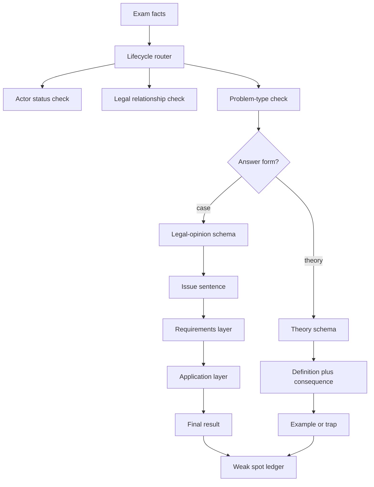

# Ubiquitous Language: Exam Strategy And Answer Schemas

Source note: `business-law/wiki/exam-strategy-answer-schemas-2026-07-28/exam-strategy-answer-schemas-2026-07-28.md`
Course: Business Law
Processed: 2026-07-22

This context file standardizes the exam-method vocabulary for the 2026-07-28 Business Law exam. It is a companion to the printable strategy/schema note, not a substitute for the statutory materials or doctrine notes.

## Exam-Method Terms

| Term | Definition | Aliases to avoid |
|---|---|---|
| **Legal-Opinion Schema** | Case-writing structure that starts with a possible legal result, states requirements, applies facts, and ends with a conclusion. | loose essay |
| **Issue Sentence** | Opening hypothesis stating who could claim or rely on what legal consequence against whom and on which legal basis. | question restatement |
| **Claim Basis** | Statutory or contractual route that can give the requested legal consequence. | fairness basis |
| **Requirements Layer** | List of conditions that must be fulfilled before the legal consequence follows. | random rule dump |
| **Application Layer** | Subsumption of concrete facts under each requirement. | fact summary |
| **Interim Result** | Short result after a requirement or block. | final answer only |
| **Final Result** | Direct answer to the question asked. | vague conclusion |
| **Theory Schema** | Short-answer structure: definition, statutory anchor, key features, example, consequence. | legal opinion for every question |
| **Point-Time Budget** | Allocation of writing time according to point value. | perfect first case |
| **Open-Book Navigation** | Prepared indexes, tabs, and schemas that let the user find statutes and routes quickly. | bringing all notes unstructured |

## Routing Terms

| Term | Definition | Aliases to avoid |
|---|---|---|
| **Lifecycle Router** | First classification step: formation, agency, SBT, rescission, withdrawal, warranty, property, trade, or company. | starting with favorite section |
| **Actor Status Check** | Classification of consumer, entrepreneur, merchant, company, minor, principal, agent, or third party. | names only |
| **Legal Relationship Check** | Identification of purchase, rental, work, service, partnership, agency, or property relation. | story summary |
| **Problem-Type Check** | Classification of the legal issue: formation, validity, clause, exit, defect, damages, ownership, or company form. | broad topic guess |
| **Consequence Check** | Final step asking what changes legally: claim exists, clause fails, contract void, restitution, damages, ownership transfer, or no remedy. | doctrinal explanation only |
| **Route Before Rule** | Discipline of identifying the legal path before writing statutory details. | section hunting |
| **Trigger Word** | Fact that activates a route, such as telephone order, defective good, Prokura, GmbH, minor, or standard contract. | keyword memorization only |

## Answer-Form Terms

| Term | Definition | Aliases to avoid |
|---|---|---|
| **Case Memorandum** | Fully formulated legal-opinion answer for case sections. | bullet-only theory answer |
| **Short Structured Answer** | Concise bullet or short-sentence response for theory questions. | full legal opinion |
| **Definition Plus Consequence** | Theory-answer pattern that explains what a concept is and why it matters legally. | definition only |
| **Comparison By Trigger And Effect** | Compare two concepts by when each applies and what legal consequence each produces. | semantic difference only |
| **Mini Legal Opinion** | Short practice answer covering one issue in 8-12 sentences. | full mock exam |
| **Issue Tree** | Ordered outline of legal questions before writing prose. | final answer |

## Retention Terms

| Term | Definition | Aliases to avoid |
|---|---|---|
| **Closed-Book Router** | Writing the legal route from memory before looking at notes. | rereading |
| **Schema Recall** | Reproducing an answer schema from memory. | passive review |
| **Timed Diagnostic** | Short practice under time pressure to reveal route weaknesses. | full studying |
| **Coverage-Gap Scan** | Low-volume check of lower-priority topics that appeared in historical materials. | replacing core doctrine |
| **Weak Spot Ledger** | List of errors with route, cause, correction, and next retry. | vague "review later" note |
| **Green Route** | Route and consequence correct without notes. | familiar while reading |
| **Yellow Route** | Basic route known but statute, requirement, or consequence slow. | safe enough |
| **Red Route** | Wrong legal layer, wrong remedy, or missing consequence. | minor typo |

## Statutory Anchors

| Section | Canonical function | Trigger facts | Exam use |
|---|---|---|---|
| **Sections 13-14 BGB** | Consumer and entrepreneur status. | Private versus business-purpose transaction. | Start withdrawal/SBT/consumer route. |
| **Sections 130, 133, 157, 145-150 BGB** | Declaration, interpretation, offer, acceptance, and counteroffer. | Formation dispute. | Contract Law I schema. |
| **Sections 125, 134, 138 BGB** | Form, prohibition, and public-policy invalidity. | Validity obstacle. | Lock-section check. |
| **Sections 164-181 BGB** | Agency. | Person acts for another. | Who is bound? |
| **Sections 305-310 BGB** | Standard Business Terms. | Pre-formulated clause. | Clause analysis. |
| **Sections 119, 120, 123, 142, 143 BGB** | Rescission. | Flawed declaration. | Formation attack. |
| **Sections 312b, 312c, 312g, 355 BGB** | Consumer withdrawal. | Distance/off-premises consumer contract. | Consumer exit route. |
| **Sections 323, 324, 326 V, 346-349 BGB** | Revocation and restitution. | Valid reciprocal contract with performance problem. | Contract exit route. |
| **Sections 433, 434, 437, 439-444, 446 BGB** | Purchase and warranty. | Defective delivered goods. | Buyer remedies. |
| **Sections 280, 281, 283, 286, 311a, 249 BGB** | Damages. | Breach or impossibility with loss. | Money claim route. |
| **Sections 929, 932, 935, 398 BGB** | Property transfer and assignment. | Ownership or claim transfer. | Property-law route. |
| **Sections 1-6, 15, 48-56, 377 HGB** | Merchant, register, commercial authority, inspection/notice. | Commercial actor or merchant sale. | HGB layer. |
| **Sections 5, 13, 35 GmbHG** | GmbH capital, legal personality, representation. | GmbH facts. | Company-law route. |
| **Sections 76, 78, 93 AktG** | AG management, representation, Business Judgment Rule. | AG facts or board-liability question. | Company-law route. |

## Relationships

- **Lifecycle Router** uses **Actor Status Check**, **Legal Relationship Check**, and **Problem-Type Check** before the rule details.
- **Legal-Opinion Schema** uses **Issue Sentence**, **Requirements Layer**, **Application Layer**, **Interim Result**, and **Final Result**.
- **Theory Schema** should be used for mock-exam theory sections because they do not require full legal opinions.
- **Open-Book Navigation** supports **Route Before Rule**; it does not replace **Closed-Book Router** practice.
- **Weak Spot Ledger** converts **Yellow Route** and **Red Route** errors into next-day retrieval tasks.

## Mermaid Memory Aid



## Example Dialogue

Student: "It is open book, so I can just search the rules during the exam."

Professor: "Open book helps only after route selection. First classify actor status, legal relationship, problem type, statutory route, and consequence."

Student: "For a theory question, should I write a full legal opinion?"

Professor: "No. Use the **Theory Schema**: define, cite, list requirements, give example, state consequence or trap."

Student: "For a case, can I start with the answer?"

Professor: "No. Start with an **Issue Sentence**, work through requirements and application, then give the **Final Result**."

## Flagged Ambiguities

| Ambiguity | Canonical recommendation |
|---|---|
| "Open book" | Treat as navigation support, not as a replacement for route memory. |
| "Legal opinion" | Use full case memorandum style, not bullet-only theory style. |
| "Explain" question | Use short structured answer unless the exam explicitly asks for a fully formulated memorandum. |
| "I know the topic" | Test whether the route can be produced closed-book. Familiarity while reading is not enough. |
| "Review everything" | Prioritize route errors and mock-exam issue maps over passive rereading. |
| "Historical topic" | Drill briefly as coverage-gap scan, but keep current doctrine and official examples first. |

## Cheat-Sheet Language

```text
Case answer:
A could have a claim against B for X under Section Y if ...
This requires ...
Questionable is whether ...
Consequently ...
As a result ...
```

```text
Theory answer:
Definition -> statutory anchor -> requirements/features -> example -> consequence/trap.
```

```text
Open-book rule:
Find the route from memory first. Use paper only to confirm section, wording, and requirement order.
```
