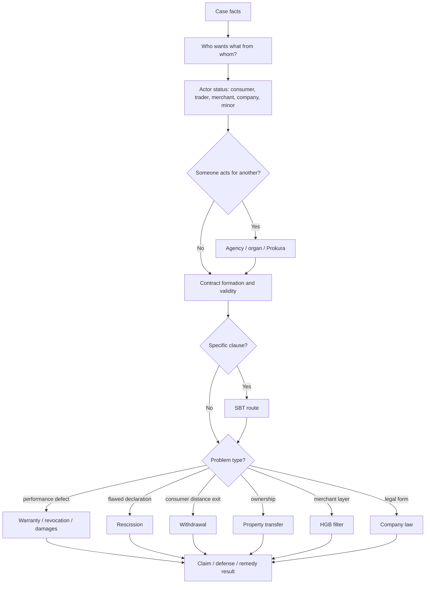

# Business Law Exam Strategy And Answer Schemas

Course: Business Law
Exam date: 2026-07-28
Prepared: 2026-07-22
Wiki note: `business-law/wiki/exam-strategy-answer-schemas-2026-07-28/exam-strategy-answer-schemas-2026-07-28.md`

Local sources used:

- `business-law/wiki/_course-logistics.md`
- `learning-system/review-dashboard.md`
- `learning-system/weekly-calendar.md`
- all current Business Law topic notes and `CONTEXT.md` companions
- `example-exam-i-case-facts`, `example-exam-ii-case-facts`, and `additional-mock-exams-and-external-cheatsheet`

Source status: this is a custom exam-preparation and answer-schema artifact, not a new doctrine deck. It does not complete a `First Pass` or any spaced-repetition checkpoint.

## 80/20 Strategy

The exam is open book, but time pressure means the main advantage is not having more material. The advantage is having faster routing.

Primary goal:

```text
facts -> legal layer -> statutory anchor -> requirements -> application -> consequence
```

Six-day priority:

1. Repair the old Contract/SBT/Agency routers.
2. First-pass the pending high-yield doctrine: Warranty I-II, Transfer of Property, Trade Law, Company Law.
3. Use Example Exam I and II as timed legal-opinion drills.
4. Use WS24/25 and SS22 only as coverage diagnostics after the current doctrine routes are stable.
5. Prepare a small printed navigation pack: answer schemas, statutory index, issue routers, and mock issue maps.

Do not spend the six days rereading notes passively. Every block should produce one of these outputs:

- a closed-book route from memory
- an issue tree
- a legal-opinion paragraph
- a marked weak spot
- a corrected schema entry

## Six-Day Operating Plan

Assumption: today is 2026-07-22 and the Business Law exam is on 2026-07-28.

### 2026-07-22: Reset And Schema Build

Target: 90-120 minutes, after any Marketing exam work is done.

1. Print or open this schema pack.
2. Do a 30-minute closed-book router repair:
   - Contract Law I: formation and validity.
   - Contract Law II/III: rescission, revocation, withdrawal, cancellation, dissolution.
   - SBT: contract first, clause second, Section 305 route.
   - Agency: own declaration, principal name, authority.
3. Write one 10-sentence mini legal opinion:
   - agency or SBT is enough.
4. End by marking weak spots in a small paper ledger.

Do not start a full mock today unless energy is unusually high.

### 2026-07-23: Sales Remedies Day

Target: 2.5-4 hours split into two blocks.

Block A: Warranty Rights I first-pass style recall.

- Closed-book: write the Section 437 gateway from memory.
- Case drill: defect, transfer of risk, cure, revocation, reduction.
- Output: one warranty answer skeleton with headings.

Block B: Warranty Rights II money claims.

- Closed-book: distinguish damages in addition, damages instead, reduction, revocation, Section 284.
- Case drill: defective product damages another object.
- Output: one damages paragraph under Section 280 I BGB.

Night micro-review, 15 minutes:

- Contract/SBT/Agency weak spots from 2026-07-22.
- Warranty route from memory.

### 2026-07-24: Property, Trade, Company

Target: 3-4 hours split into three compact blocks.

Block A: Transfer of Property.

- Object router: movable thing, land, claim.
- Movable schema: agreement, delivery, continuing agreement at delivery, authorization.
- Good-faith schema: legal appearance, good faith, no Section 935 block.

Block B: Trade Law.

- Merchant status.
- Prokura and internal limits.
- Section 377 HGB notice filter.

Block C: Company Law.

- Legal-form choice.
- GmbH versus AG.
- Representation and liability.
- Business Judgment Rule.

Output:

- one page with three routers: property, trade, company.
- one 12-minute theory sprint: legal form, Prokura, Section 377, BJR.

### 2026-07-25: Example Exam I

Target: 2.5-3.5 hours.

1. Timed scan: 10 minutes.
2. Case 1 outline: 25 minutes.
3. Case 2 outline: 25 minutes.
4. Theory questions: 25 minutes.
5. Compare with the note routes and record misses.
6. Rewrite only the weakest legal-opinion paragraph in full.

Main expected routers:

- GmbH representation.
- Prokura and internal restrictions.
- formation and invitatio ad offerendum.
- deceit rescission.
- legal form, Section 280, impossibility, warranty exclusions.

### 2026-07-26: Example Exam II Plus WS24/25 Diagnostic

Target: 3-4 hours.

Block A: Example Exam II, timed.

- Case 1: defective printer, Section 377 HGB, damages in addition.
- Case 2: consumer printer, SBT referral clause, content control.
- Theory: works contract, culpa in contrahendo, Section 150 II, Section 145, rescission versus revocation.

Block B: WS24/25 diagnostic.

- Do not solve everything in full.
- Issue spot the wine-label case and answer the short theory questions as bullet points.

Output:

- one corrected exam route sheet.
- one list of statutes that were slow to find.

### 2026-07-27: Open-Book Pack And Final Retrieval

Target: 3-5 hours, but avoid burnout.

1. Assemble paper material:
   - this answer-schema pack
   - statutory anchor index
   - SBT router
   - remedies router
   - agency/trade/company router
   - warranty/property router
   - Example Exam I-II issue maps
2. Run one 60-minute mixed drill:
   - 30 minutes case outline
   - 20 minutes theory answers
   - 10 minutes correction
3. Final memory pass:
   - speak every major route without looking
   - immediately check the schema
   - mark only the routes that still break

Do not rewrite all notes on the last day. Improve navigation and recall speed.

### 2026-07-28: Exam Morning

Target: 30-45 minutes only.

1. Read the one-page universal schema.
2. Recite the remedy router:
   - formation/validity
   - rescission
   - revocation
   - withdrawal
   - SBT
   - warranty
   - damages
3. Look at the statute index and tabs.
4. Stop heavy studying.

## 120-Minute Exam Strategy

Use points as the main time budget.

If the exam follows the 70 case points plus 30 theory points pattern:

| Time | Action | Output |
|---:|---|---|
| 0-8 min | Scan all questions. | Mark easy theory, hard cases, statute clusters. |
| 8-15 min | Build case issue trees. | Who wants what from whom based on what? |
| 15-65 min | Write case basic constellation. | Full legal-opinion style; do not perfect every subpoint. |
| 65-85 min | Write case modification. | Reuse the same structure, then isolate what changes. |
| 85-110 min | Theory questions. | Bullet points or short sentences; statute plus consequence. |
| 110-120 min | Repair pass. | Add missing citations, conclusions, and issue sentences. |

Emergency rule from course guidance:

```text
If the case is not finished after about one hour, finish the current thought in shortened form, move to theory, and return if time remains.
```

## Universal Legal-Opinion Schema

Use this when the question asks for a claim, legal consequence, validity result, or remedy.

### Step 1: Claim Or Issue Sentence

Template:

```text
A could have a claim against B for X under Section Y if the requirements of that provision are met.
```

Alternative when the question asks "was a contract concluded?":

```text
A and B concluded a valid contract if there are two matching declarations of intent, offer and acceptance, and no validity obstacle applies.
```

Alternative when the question asks for a defense/remedy:

```text
A's claim could be excluded or modified if B can rely on [rescission / revocation / withdrawal / SBT invalidity / warranty exclusion].
```

### Step 2: Requirements

Write the elements before applying facts.

Template:

```text
This requires: first, [...]; second, [...]; third, [...].
```

For long cases, put requirements as headings:

```text
I. Claim basis
II. Contract
III. Representation
IV. Defect / breach / validity problem
V. Legal consequence
```

### Step 3: Application

Apply one requirement at a time.

Useful phrases:

```text
Questionable is whether ...
This is supported by ...
Against this, one could argue ...
However, ...
Consequently, this requirement is met / not met.
```

Rule: facts do not speak for themselves. Translate them into legal terms.

Bad:

```text
M called T and the wine came later.
```

Good:

```text
The order by telephone can be a declaration of intent made through distance communication, but the purpose of the order determines whether M acts as a consumer or trader.
```

### Step 4: Interim Result

Every major block needs a result:

```text
Therefore, the purchase agreement was validly concluded.
```

```text
Therefore, the SBT clause is ineffective, while the rest of the contract remains valid under Section 306 BGB.
```

### Step 5: Final Answer

End by answering the question exactly:

```text
As a result, A can claim X from B.
```

```text
As a result, B is not obliged to pay, but must return the object.
```

```text
As a result, the contract was initially concluded but is treated as void from the beginning after effective rescission.
```

## Short-Answer / Theory Question Schema

Use this for questions asking "explain", "name", "compare", "what is", or "describe".

### Definition Question

```text
1. Define the term in one sentence.
2. State the statutory anchor if there is one.
3. Give 2-3 requirements or key features.
4. Add one example.
5. Add the consequence or exam trap.
```

Example:

```text
Standard Business Terms are pre-formulated contract terms presented by one party for repeated use under Section 305 I BGB. They reduce transaction costs but can create unfair one-sided risk allocation. Therefore, the BGB tests classification, incorporation, interpretation, and content validity. A webshop liability clause is a typical example. The trap is that signing the clause does not automatically make it valid.
```

### Compare Question

```text
1. Define both terms.
2. State the legal trigger for each.
3. State the legal consequence for each.
4. Give one contrast example.
5. End with the exam warning.
```

Example skeleton:

```text
Rescission attacks a defective declaration of intent at formation, especially under Sections 119, 120, or 123 BGB, and leads to voidness from the beginning under Section 142 I BGB. Revocation reacts to a performance problem in a valid contract, for example under Sections 323, 324, or 326 V BGB, and leads to restitution under Sections 346 et seq. BGB. The exam trap is to use rescission for defective performance or revocation for flawed consent.
```

### List Requirements Question

```text
The requirements are:
1. ...
2. ...
3. ...

If these are met, the consequence is ...
```

Then add one sentence explaining why the rule exists.

### Legal-Form Recommendation Question

```text
1. Identify business scale and risk.
2. Name the default/simple form.
3. Compare with one or two alternatives.
4. Discuss liability, governance, formation cost, financing, and reputation.
5. Recommend one form and reject the weaker alternatives.
```

## One-Page Case Annotation Method

Before writing, mark facts with this code:

| Mark | Meaning | Example |
|---|---|---|
| A | actor/status | consumer, trader, merchant, GmbH, oHG, minor |
| D | declaration | offer, acceptance, revocation, rescission, notice |
| T | timing | receipt, deadline, delivery, complaint, withdrawal period |
| O | object | movable thing, land, claim, defective good |
| R | representation | agent, organ, Prokura, internal limit |
| C | clause | SBT, exclusion, limitation, referral |
| X | exit/remedy | rescission, revocation, withdrawal, damages, reduction |

Then ask:

```text
Who wants what from whom?
What legal relationship exists?
Which route changes the result?
What is the statutory anchor?
What is the consequence?
```

## Lifecycle Router

Use this first in every private-law case.

```text
1. Did a contract arise?
   -> Contract Law I: offer, acceptance, receipt, interpretation, form, validity.

2. Did someone act for another?
   -> Agency / organ / Prokura before deciding who is bound.

3. Is a clause being attacked?
   -> SBT route: contract first, clause second.

4. Was the declaration flawed at formation?
   -> Rescission: Sections 119, 120, 123, 143, 121/124, 142, 122.

5. Is a consumer trying to get out of distance/off-premises contract?
   -> Withdrawal: Sections 312b/312c, 312g, 355.

6. Did valid performance fail?
   -> Revocation / warranty / damages.

7. Is ownership the issue?
   -> Property route: object type first.

8. Is the actor a merchant or company?
   -> HGB/company-law layer can change the BGB baseline.
```

## Core Topic Schemas

### Contract Formation

```text
Contract under Section 433 / 535 / 611 / 631 / etc.
1. Offer:
   - declaration of intent
   - essentialia negotii
   - intention to be bound
   - effective receipt if required
2. Acceptance:
   - mirrors the offer
   - timely
   - effective receipt if required
3. No formation obstacle:
   - modified acceptance = Section 150 II counteroffer
   - form violation = Section 125
   - statutory prohibition = Section 134
   - public policy/usury = Section 138
```

Exam sentence:

```text
The display is usually only an invitatio ad offerendum because the shop does not intend to be bound to every possible customer merely by displaying goods.
```

### Agency

```text
Section 164 I BGB:
1. own declaration of intent by agent
2. in the name of the principal
3. within power of representation
```

If no publicity:

```text
Hidden intent to act for another is irrelevant under Section 164 II BGB; the acting person may be bound personally.
```

If no authority:

```text
The contract is pending for the principal under Section 177 I BGB. The principal can ratify. If ratification is refused, Section 179 BGB may create agent liability.
```

If internal limit:

```text
Separate external can do from internal may do. An internal instruction breach does not automatically defeat external authority.
```

If Prokura:

```text
Check Sections 48-50 HGB. Internal limits are generally ineffective externally, so the third party is usually protected unless abuse/collusion is clear.
```

### SBT

```text
1. Contract first.
2. Exact clause second.
3. Section 305 I: pre-formulated, repeated-use intention, presented by one party.
4. Section 305 I sentence 3: genuine individual negotiation?
5. Incorporation: reference, review opportunity, agreement.
6. Section 305c I: surprising clause?
7. Section 305c II: ambiguity against user.
8. Content control:
   - Section 309 hard prohibitions
   - Section 308 valuation prohibitions
   - Section 307 unreasonable disadvantage / transparency
   - in B2B, remember Section 310 I
9. Section 306 consequence:
   - clause out
   - contract usually survives
   - statutory law fills the gap
```

Memory:

```text
Hidden = surprise.
Unclear = ambiguity.
Clear but too harsh = content control.
Bad clause out, contract usually stays.
```

### Rescission

```text
1. Valid declaration / contract initially exists.
2. Rescission ground:
   - Section 119 I Alt. 1: wrong meaning of own words.
   - Section 119 I Alt. 2: wrong sign/number/typing/declaration.
   - Section 119 II: essential characteristic.
   - Section 120: incorrect transmission.
   - Section 123: deceit or duress.
3. Declaration of rescission under Section 143.
4. Time limit:
   - Section 121 for mistake/transmission.
   - Section 124 for deceit/duress.
5. No confirmation under Section 144.
6. Consequence:
   - Section 142 I: void from the beginning.
   - Section 122 reliance damages may apply for honest mistake, not ordinary Section 123.
```

Trap:

```text
Defective delivered product normally uses warranty law, not Section 119 II.
```

### Revocation / Withdrawal / Cancellation / Dissolution

| Route | Trigger | Core anchors | Consequence |
|---|---|---|---|
| Rescission | flawed declaration at formation | Sections 119, 120, 123, 142, 143 BGB | void from beginning |
| Revocation | valid reciprocal contract with performance problem | Sections 323, 324, 326 V, 346-349 BGB | restitution |
| Withdrawal | consumer protection in distance/off-premises setting | Sections 312b, 312c, 312g, 355 BGB | return duties under withdrawal regime |
| Cancellation | continuing obligation should end for future | special rule or Section 314 model | ex nunc |
| Dissolution | parties agree to end | offer and acceptance | agreed termination |

### Warranty Rights

```text
Section 437 BGB gateway:
1. purchase agreement under Section 433
2. material or legal defect under Sections 434/435
3. defect at transfer of risk, usually Section 446
4. no exclusion:
   - buyer knowledge, Section 442
   - valid exclusion clause, limited by SBT/consumer law
   - Section 377 HGB if mutual commercial purchase
5. remedy:
   - cure, Section 439
   - revocation, Sections 437 No. 2, 323/440, 346
   - reduction, Section 441
   - damages, Sections 437 No. 3 and 280 et seq.
```

First remedy instinct:

```text
Cure first unless facts make cure impossible, refused, failed, unreasonable, or legally unnecessary.
```

### Damages

Basic Section 280 I route:

```text
1. obligation
2. breach of duty
3. damage
4. causation
5. responsibility/fault, presumed under Section 280 I sentence 2
6. compensation under Section 249
```

Damage type decision:

```text
Would proper late performance still remove the loss?
No -> damages in addition to performance, usually Section 280 I.
Yes -> damages instead of performance, use Section 280 I, III plus 281/282/283/311a.
```

### Transfer Of Property

Object router:

```text
Movable thing -> Section 929 BGB.
Land -> conveyance plus land-register route.
Claim/right -> Section 398 BGB assignment.
```

Movable transfer:

```text
1. agreement that ownership should pass
2. delivery
3. agreement still exists at delivery
4. transferor has authorization
```

If transferor is not owner:

```text
Check good-faith acquisition under Sections 932 ff. BGB, then Section 935 lost/stolen block.
```

### Trade Law

```text
1. Is a merchant/commercial actor involved?
2. Does HGB modify the BGB baseline?
3. If representation:
   - Prokura: Sections 48-50 HGB.
   - Handlungsvollmacht: Section 54 HGB.
   - shop authority: Section 56 HGB.
4. If sale between merchants:
   - Section 377 HGB inspection and notice.
```

Section 377 sentence:

```text
In a mutual commercial purchase, the buyer must inspect and notify defects without undue delay; otherwise the goods can be deemed approved and warranty rights may be excluded.
```

### Company Law

Legal-form answer:

```text
1. Classify scale and risk.
2. Partnership or corporation?
3. Liability:
   - personal liability in GbR/oHG
   - limited liability in GmbH/UG/AG
4. Formation cost and capital.
5. Governance and representation.
6. Financing/reputation/disclosure.
7. Recommendation.
```

GmbH:

```text
Flexible limited-liability company for smaller and medium-sized businesses, represented by managing directors, with company assets separated from shareholder private assets.
```

AG:

```text
Stock corporation with stricter, two-tier governance: management board, supervisory board, and general meeting.
```

Business Judgment Rule:

```text
Entrepreneurial decision, adequate information, good faith, company interest, no improper conflict, and no legal-duty violation.
```

## Statutory Anchor Quick Index

| Route | Sections to find fast |
|---|---|
| Consumer / entrepreneur | Sections 13, 14 BGB |
| Declaration receipt | Section 130 BGB |
| Interpretation | Sections 133, 157 BGB |
| Offer / acceptance | Sections 145-150 BGB |
| Form / invalidity limits | Sections 125, 134, 138 BGB |
| Agency | Sections 164-181 BGB |
| SBT | Sections 305-310 BGB |
| Performance duties | Sections 241, 280, 281, 283, 286 BGB |
| Impossibility | Sections 275, 311a, 326 BGB |
| Revocation and restitution | Sections 323, 324, 346-349 BGB |
| Withdrawal | Sections 312b, 312c, 312g, 355 BGB |
| Purchase contract | Section 433 BGB |
| Warranty | Sections 434, 435, 437, 439-444, 446 BGB |
| Property transfer | Sections 929, 932, 935, 398 BGB |
| Tort | Section 823 BGB |
| Trade law | Sections 1-6, 15, 48-56, 377 HGB |
| GmbH | Sections 5, 13, 35 GmbHG |
| AG | Sections 76, 78, 93 AktG |

## Open-Book Material Setup

Bring less, but make it navigable.

### Paper Pack

1. This schema pack.
2. One statute index by topic.
3. One lifecycle router page.
4. One SBT page.
5. One warranty/damages page.
6. One agency/trade/company page.
7. One property page.
8. Example Exam I and II issue maps.
9. One blank mistake ledger page for the exam start.

### Tabs

Use tabs for:

- BGB General Part: declarations, form, agency, SBT.
- BGB Obligations: performance, damages, revocation.
- BGB Sale/Warranty.
- BGB Property.
- HGB: merchant, Prokura, Section 377.
- GmbHG / AktG.

### Marginal Notes

Write trigger words, not long explanations:

```text
130 = receipt
150 II = changed yes = new offer
164 = agency
305 = SBT
323 = revocation for non-performance
437 = warranty gateway
377 HGB = merchant notice filter
```

## Visual Knowledge Map



## Subject Knowledge Graph

| Node | Meaning | Exam relevance |
|---|---|---|
| Exam Strategy Pack | Custom open-book navigation and writing aid. | Speeds route selection under 120-minute constraint. |
| Legal-Opinion Schema | Claim basis, requirements, application, conclusion. | Required for case sections and memoranda. |
| Theory Schema | Definition, anchor, features, example, consequence. | Fits 30-point theory sections. |
| Lifecycle Router | Classifies formation, agency, SBT, rescission, withdrawal, warranty, property, trade, company. | Prevents wrong route choice. |
| Open-Book Material Setup | Printed/tabs/index strategy. | Converts open-book permission into usable speed. |
| Six-Day Operating Plan | Daily retrieval and mock sequence from 2026-07-22 to 2026-07-27. | Maximizes retention and coverage before exam. |

| From | Relationship | To | Why it matters |
|---|---|---|---|
| Exam Strategy Pack | contains | Legal-Opinion Schema | Main case writing form. |
| Exam Strategy Pack | contains | Theory Schema | Short-answer writing form. |
| Lifecycle Router | selects | Core Topic Schemas | Route before rule details. |
| Open-Book Material Setup | supports | Fast statutory citation | Open book helps only if navigation is fast. |
| Six-Day Operating Plan | sequences | Repairs, doctrine first passes, timed mocks | Prevents jumping to mocks before prerequisites are stable. |

## Daily Recall Protocol

At the end of every study day:

1. Close all notes.
2. Write the lifecycle router from memory.
3. Write three statutory anchors from the slowest topic.
4. Draft one mini issue sentence.
5. Correct against this schema.
6. Add one weak spot to the ledger.

Quality labels:

| Label | Meaning | Next action |
|---|---|---|
| green | Route and consequence correct without notes. | Move to timed application. |
| yellow | Route mostly correct, statute or consequence slow. | Repeat next day in 10 minutes. |
| red | Wrong legal layer or remedy. | Repair immediately with one mini case. |

## Final Pre-Exam Rule

You are not trying to memorize every paragraph. You are trying to make the first 60 seconds of every question automatic:

```text
actor status
-> legal relationship
-> issue type
-> statutory route
-> consequence
```

If that first minute is controlled, the open-book materials can help. If the route is wrong, the open book will mostly waste time.
