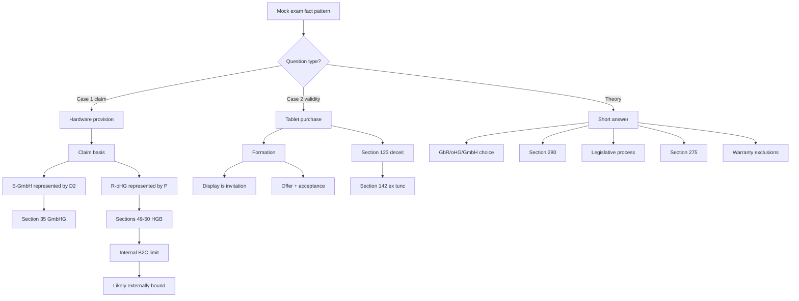

# Example Exam I: Case Facts - Context

Source note: `business-law/wiki/example-exam-i-case-facts/example-exam-i-case-facts.md`
Source file: `business-law/raw/moodle-export-business-law-950848572-s26-20260708/13.07. - Example Exam I - Bundrock/Example Exam I Case facts.pdf`
Processed: 2026-07-08

Statutory anchors were cross-checked against the official Gesetze-im-Internet BGB, HGB, GmbHG, and AktG English sources on 2026-07-08. The official English translations may lag current German statutory text; use current German law for exact wording.

## Canonical Mock-Exam Route

```text
read facts once for actors and transaction
-> mark legal form of each actor
-> identify claim/question type
-> choose legal-opinion schema for cases or theory schema for short questions
-> route representation before contract validity
-> route formation before rescission
-> write statutory anchors before long explanation
```

This exam source mixes legal-opinion cases with short theory questions. Use full IRAC/legal-opinion style for the cases, but concise bullet points for theory.

## Case 1 Vocabulary

| Term | Definition | Aliases to avoid |
|---|---|---|
| Schema-Tailored Model Answer | Exam-practice answer block that follows issue sentence, requirements, application, interim result, and final answer for cases. | loose explanation |
| Claim Basis | Legal norm or contract route that could give the claimant the requested performance. | General fairness |
| Hardware Provision Claim | Claim that R-oHG must provide the rented IT systems to S-GmbH. | Ownership claim |
| Rental Agreement | Contract for temporary use of an object against payment. | Purchase agreement |
| GmbH Managing Director | Organ through which a GmbH acts and is represented. | Ordinary employee |
| Joint Representation | Several representatives must act together unless an exception allows single action. | Everyone may act alone |
| Urgent-And-Necessary Exception | Articles clause allowing one director to act alone for necessary urgent transactions. | Convenience exception |
| oHG | Commercial general partnership; merchant and legal actor in the case. | GmbH |
| Prokura | Broad HGB power of commercial representation. | Internal job title |
| Internal Prokura Limit | Restriction inside the principal-agent relationship, usually ineffective externally under Section 50 HGB. | Lack of external power |
| Abuse Of Authority | Exceptional case where third party knows or must recognize authority is being abused. | Every internal breach |

## Case 2 Vocabulary

| Term | Definition | Aliases to avoid |
|---|---|---|
| Invitatio Ad Offerendum | Invitation to make an offer; product display usually does not bind seller. | Offer |
| Essentialia Negotii | Essential contract terms, especially parties, object, and price in a sale. | Full contract detail |
| Purchase Agreement | Contract obliging seller to transfer ownership and defect-free possession and buyer to pay price. | Ownership transfer itself |
| False Statement | Incorrect representation of a fact, here newest-model status. | Opinion only |
| Deceit | Intentional misleading that causes another party's declaration of intent. | Mistake without fault |
| Rescission Declaration | Statement that the party avoids the declaration of intent because of a rescission ground. | Revocation |
| Initial Formation Then Avoidance | Answer pattern where the contract first arises, but is later treated as void from the beginning after effective rescission. | no contract from the start |
| Ex Tunc Voidness | Legal effect that the declaration is void from the beginning after effective rescission. | Termination from now |
| Restitution Consequence | Return of performances after voidness or unjust enrichment route. | Damages automatically |

## Theory Vocabulary

| Term | Definition | Aliases to avoid |
|---|---|---|
| Legal-Form Suitability | Matching a business form to scale, liability, governance, financing, and cost. | Cheapest entity |
| GbR | Basic civil-law partnership, often suitable for small joint non-commercial endeavors. | Registered corporation |
| Section 280 Damages | Damages for breach of duty from an obligation when the debtor is responsible. | Any loss payment |
| Breach Of Duty | Non-performance, defective performance, or ancillary-duty breach. | Only late delivery |
| Responsibility | Fault/attribution requirement for damages, presumed under Section 280 I 2 BGB. | Strict liability always |
| Federal Legislative Process | Formal route by which federal statutes are created, involving Bundestag, Bundesrat, promulgation, and publication. | Bundestag vote only |
| Impossibility | Owed performance cannot be rendered; primary performance duty can be excluded under Section 275 BGB. | Difficult performance |
| Warranty Exclusion | Rule or agreement that blocks buyer warranty rights. | No defect |

## Statutory Anchors

| Section | Canonical Function | Trigger Facts | Exam Use |
|---|---|---|---|
| Section 535 BGB | Rental/lease duties | Temporary hardware use against payment | Likely claim basis for Case 1 hardware provision. |
| Section 164 BGB | Agency effect | Person acts for another | General representation framework. |
| Section 35 GmbHG | GmbH representation | Managing director acts for GmbH | Analyze D2's authority. |
| Section 37 GmbHG | Internal restrictions on GmbH representation | Articles/internal limits on directors | Discuss internal/external effect if needed. |
| Sections 48-53 HGB | Prokura | P has Prokura | Analyze R-oHG representation. |
| Section 49 HGB | Scope of Prokura | Prokurist concludes commercial deal | Broad external authority. |
| Section 50 HGB | Internal limits ineffective externally | B2C-only internal Prokura limit | Central Case 1 trap. |
| Section 145 BGB | Binding offer | Formation question | Use if identifying offer. |
| Sections 133, 157 BGB | Interpretation | Ambiguous declarations | Interpret D2/E statements objectively. |
| Section 433 BGB | Purchase agreement duties | Tablet sale | Case 2 contract type. |
| Section 119 BGB | Mistake rescission | If false model status analyzed as mistake | Backup contrast to deceit route. |
| Section 123 I Alt. 1 BGB | Deceit rescission | Seller knowingly misleads buyer | Main Case 2 rescission anchor. |
| Section 124 BGB | Deceit rescission period | Timing after discovery | Check D2 acted promptly and within period. |
| Section 142 I BGB | Effect of rescission | Effective rescission | Declaration void from beginning. |
| Section 280 I BGB | Damages for breach of duty | Theory Question 4 | State conditions and consequence. |
| Section 275 BGB | Impossibility | Performance cannot be rendered | Theory Question 6. |
| Section 442 BGB | Buyer knowledge exclusion | Buyer knows defect | Warranty exclusion route. |
| Section 377 HGB | Commercial inspection/notice | Mutual commercial purchase | B2B warranty exclusion route. |
| Section 705 BGB | GbR | Small joint gardening business | Theory Question 3. |
| Sections 1, 2 HGB | Merchant / small-business registration | Need decide oHG/HGB fit | Reject oHG if no commercial scale. |
| Sections 105 ff. HGB | oHG | Commercial general partnership | Use as unsuitable if small non-commercial business. |

## Relationships Between Canonical Terms

- **Claim Basis** comes before discussing fairness or business expectations.
- **Schema-Tailored Model Answer** is used for the two case sections; short theory questions use concise bullet schemas.
- **GmbH Managing Director** authority and **Prokura** are separate representation questions in Case 1.
- **Internal Prokura Limit** usually does not defeat **Prokura** externally unless **Abuse Of Authority** is visible or known.
- **Invitatio Ad Offerendum** prevents treating the shop-window display as the binding offer.
- **Deceit** supports **Rescission Declaration**, which leads to **Initial Formation Then Avoidance** and **Ex Tunc Voidness** under Section 142 I BGB.
- **Legal-Form Suitability** uses **GbR** as small-business baseline and rejects **oHG** if no commercial-business scale exists.
- **Warranty Exclusion** is different from "no defect"; it can block remedies even if a defect exists.

## Mermaid Memory Map



## Example Dialogue

Professor: "In Case 1, R-oHG says P had no authority because the Prokura was limited to private customers. What is your first correction?"

Student: "That is an internal limit. For Prokura, I need Section 49 HGB scope and Section 50 HGB external effect. Unless S-GmbH knew or obvious abuse existed, the internal B2C limit likely does not defeat the contract."

Professor: "In Case 2, did the shop-window display form an offer?"

Student: "No, normally it is invitatio ad offerendum. The formation happens through the later conversation where object and price are agreed."

Professor: "If D2 rescinds for deceit, do we call it revocation?"

Student: "No. This is rescission of the declaration of intent under Section 123 BGB, with Section 142 I BGB ex-tunc voidness."

## Ambiguities And Exam Traps

| Ambiguity / Trap | Canonical Recommendation |
|---|---|
| Starting Case 1 with Prokura only | First state claim basis and both sides' representation. |
| Treating D2 and P authority as identical | D2 is GmbH organ/director authority; P is HGB Prokura. |
| Internal B2C Prokura limit called lack of authority | Use Section 50 HGB and discuss external irrelevance. |
| Shop-window display called offer | Use invitatio ad offerendum unless facts show binding intent. |
| E's false statement called harmless puffery | It concerns a concrete model-generation fact and caused purchase. |
| "Valid contract yes" without rescission effect | Say initially concluded, then void ex tunc if rescission effective. |
| "No contract" without formation analysis | Say the purchase agreement was initially concluded, then eliminated by effective rescission. |
| Theory answers written like full cases | Use concise structured bullet points for theory section. |

## Cheat-Sheet Language

```text
Case 1: The representation of S-GmbH by D2 and the representation of R-oHG by P must be examined separately. D2's authority turns on GmbH director representation and the urgency clause; P's authority turns on Prokura and the external irrelevance of internal limitations under Section 50 HGB.
```

```text
Case 2: A purchase agreement was initially formed through offer and acceptance, but the false newest-model statement supports rescission for deceit under Section 123 I Alt. 1 BGB. If effective, Section 142 I BGB makes the declaration void from the beginning.
```
