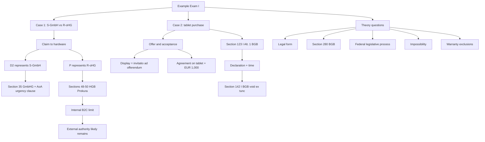

# Example Exam I: Case Facts And Answer Routes

Source: `business-law/raw/moodle-export-business-law-950848572-s26-20260708/13.07. - Example Exam I - Bundrock/Example Exam I Case facts.pdf`
Course: Business Law
Processed: 2026-07-08
Wiki note: `business-law/wiki/example-exam-i-case-facts/example-exam-i-case-facts.md`

Course direction checked against `business-law/wiki/_course-logistics.md`: this file is an exam-practice source and should be used after the core Business Law doctrine notes, especially Agency, Trade Law, Contract Law I/II, Warranty Rights, and Company Law.

External statute check: BGB, HGB, GmbHG, and AktG anchors used in the routes were cross-checked against the official Gesetze-im-Internet English sources on 2026-07-08. The official English translations warn that translations may lag the current German text; use the current German statutory text for exact legal wording.

Important boundary: the source provides case facts and questions, not official model solutions. The answer routes below are study-coach issue maps inferred from the course notes and statutory anchors.

## 80/20 Exam Summary

This mock exam is a mixed Business Law router. It tests whether you can spot the right legal layer before applying details.

- Case 1 is mainly company representation plus trade-law agency: GmbH managing director authority, oHG counterparty, Prokura, and internal restrictions.
- Case 2 is contract formation plus deceit-based rescission: display-window invitation, offer/acceptance, fraudulent misrepresentation, rescission declaration, and ex-tunc consequence.
- Theory Question 3 tests legal-form suitability for a small gardening business.
- Theory Question 4 tests Section 280 BGB damages for breach of duty.
- Theory Question 5 tests federal legislative process.
- Theory Question 6 tests impossibility.
- Theory Question 7 tests warranty-right exclusions.

Core exam skill:

```text
facts -> legal layer -> statutory anchor -> requirements -> application -> conclusion
```

## Exam Structure

| Section | Points | Main skill |
|---|---:|---|
| Case basic constellation | 35 | Legal opinion style; representation and Prokura routing. |
| Case modification | 35 | Legal opinion style; formation and rescission routing. |
| Theory questions | 30 | Short structured answers; no full legal opinion required. |

## Schema-Tailored Model Answers

Use these model blocks after a closed-book outline. They are not official model solutions; they convert the inferred routes into the answer schema from `business-law/wiki/exam-strategy-answer-schemas-2026-07-28/exam-strategy-answer-schemas-2026-07-28.md`.

### Case 1 Model Answer: Hardware Claim

#### I. Claim Or Issue Sentence

```text
S-GmbH could have a claim against R-oHG to be provided with 100 IT systems for three months under a rental agreement pursuant to Section 535 I BGB if a valid contract was concluded between S-GmbH and R-oHG.
```

#### II. Contract Type And Formation

The parties agreed on temporary use of IT systems against payment of EUR 100,000. This points to a rental/lease-type contract rather than a purchase contract, because ownership of the hardware is not to pass permanently. A contract requires two matching declarations of intent, offer and acceptance.

D2's email requesting 100 IT systems for three months in the name of S-GmbH can be treated as an offer. P's reply, "Your order is hereby confirmed", is the matching acceptance. The decisive issue is therefore not basic offer and acceptance, but whether the declarations bind the companies through valid representation.

#### III. Representation Of S-GmbH By D2

D2's declaration binds S-GmbH if she made an own declaration of intent, acted in the name of S-GmbH, and had power of representation. D2 sent the email herself and expressly acted in S-GmbH's name.

S-GmbH is a GmbH and acts through its managing directors. The articles require joint representation in principle, but allow one managing director to act alone if the transaction is necessary and urgent. Here, D1 is unreachable due to illness, the software order is short-term and lucrative, and S-GmbH cannot perform without additional hardware capacity. The transaction is therefore necessary for the business opportunity and urgent because delay would likely lose the order.

Interim result:

```text
D2 validly represented S-GmbH alone under the urgent-and-necessary exception.
```

Nuance for grading:

```text
Do not treat every internal company rule as irrelevant. First decide whether the articles define the external representation mode. Here the exception itself gives D2 single representation if necessity and urgency are met.
```

#### IV. Representation Of R-oHG By P

P's declaration binds R-oHG if P made an own declaration of intent, acted in R-oHG's name, and had authority. P personally confirmed the order while handling R-oHG's business communication, so the declaration and publicity requirements are met.

P has Prokura. Under Sections 48 and 49 HGB, Prokura gives broad authority for transactions involved in operating a commercial business. Confirming a hardware rental transaction for R-oHG falls within this broad commercial scope. The internal instruction limiting P to private-customer transactions is a restriction in the internal relationship. Under Section 50 HGB, such internal restrictions generally do not limit Prokura externally.

No facts show that D2 knew the internal restriction, colluded with P, or abused obvious lack of authority. Therefore, R-oHG cannot rely on the B2C-only internal limit against S-GmbH.

Interim result:

```text
P's confirmation externally binds R-oHG despite the internal B2C restriction.
```

#### V. Final Answer

```text
A valid rental agreement was concluded between S-GmbH and R-oHG. S-GmbH can claim provision of the 100 IT systems for three months from R-oHG under the rental agreement.
```

High-yield nuance:

```text
Separate the two representation problems. D2 is an organ/managing-director question; P is a Prokura/internal-limit question. Mixing them loses structure.
```

### Case 2 Model Answer: Tablet Purchase And Deceit

#### I. Issue Sentence

```text
D2 and E concluded a valid purchase agreement under Section 433 BGB if there were two matching declarations of intent and if the agreement was not later eliminated by effective rescission.
```

#### II. Formation

The tablet in the shop window is generally only an invitatio ad offerendum. A retailer normally does not intend to be bound to every passer-by merely by displaying goods.

D2 then stated that she wanted the tablet if it was the newest model, and E asked whether that meant she would buy it for EUR 1,000. D2 agreed. At this point, the parties agreed on the object and price. A purchase agreement was therefore initially concluded.

Interim result:

```text
D2 and E initially concluded a purchase agreement for the tablet at EUR 1,000.
```

#### III. Rescission For Deceit

The agreement may be treated as void from the beginning if D2 effectively rescinded her declaration for deceit under Section 123 I Alt. 1 BGB.

This requires a false representation, intent to deceive, causality for the declaration, a declaration of rescission under Section 143 BGB, and compliance with the time limit under Section 124 BGB.

E stated that the tablet was the newest model. That statement was false. E was not merely making a neutral mistake; he was unsure and nevertheless claimed certainty because he did not want D2 to change her mind. This supports at least intentional misleading. The newest-model quality was decisive for D2, because she expressly wanted to impress colleagues with an up-to-date tablet. The false statement therefore caused her purchase decision.

D2 returned immediately after discovering the truth, accused E of lying, returned the tablet, and demanded her money back. This is sufficient as a rescission declaration, because it clearly shows that she no longer wants to be bound due to the deception. The declaration was made well within the Section 124 BGB period.

Interim result:

```text
D2 effectively rescinded her declaration under Section 123 I Alt. 1 BGB.
```

#### IV. Legal Consequence

Under Section 142 I BGB, effective rescission makes the declaration void from the beginning. Therefore, the purchase agreement was initially formed, but it is treated as void ex tunc after rescission.

Final answer:

```text
D2 and E initially concluded a purchase agreement, but after D2's effective deceit-based rescission there is no valid purchase agreement remaining.
```

High-yield nuance:

```text
Answer both layers. "No contract" is wrong if it ignores initial formation. "Valid contract" is incomplete if it ignores rescission.
```

### Theory Question 3 Model Answer: Suitable Company Form

Schema:

```text
business scale/risk -> default form -> alternatives -> recommendation
```

Model answer:

- Albert and Berta run a small, person-centered gardening service for private customers with annual revenue of EUR 60,000.
- A GbR under Section 705 BGB is suitable because it is simple, flexible, inexpensive to form, and fits a small non-commercial service business run by two persons.
- An oHG is less suitable unless the business is operated as a commercial enterprise requiring a commercially organized business operation. The facts point to small-scale services, not a larger commercial business.
- A GmbH or UG is legally possible, but may be disproportionate because it creates formation, register, accounting, and governance costs. It becomes attractive only if liability limitation, external financing, or professional reputation outweigh those burdens.

Conclusion:

```text
The best fit is a GbR. oHG, GmbH, UG, and AG are either not triggered by the facts or disproportionate for this small gardening service.
```

### Theory Question 4 Model Answer: Section 280 BGB

Schema:

```text
definition -> requirements -> consequence -> nuance
```

Model answer:

- Section 280 I BGB is the general damages claim for breach of a duty arising from an obligation.
- Requirements: an obligation, breach of duty, damage, causation, and responsibility for the breach.
- The creditor must show the obligation, breach, damage, and causal link. Responsibility is presumed; the debtor avoids liability only by showing lack of responsibility.
- Consequence: the creditor may claim compensation for the damage caused by the breach.
- Nuance: damages for delay and damages instead of performance need additional requirements under Section 280 II or III BGB.

### Theory Question 5 Model Answer: Federal Legislative Process

Schema:

```text
initiative -> Bundestag -> Bundesrat -> execution/promulgation -> entry into force
```

Model answer:

- A federal bill may be introduced by the Federal Government, the Bundesrat, or members of the Bundestag.
- The Bundestag deliberates, usually through readings and committee work, and votes on the bill.
- The Bundesrat participates. Depending on the type of law, its consent may be required or it may object.
- If Bundestag and Bundesrat disagree, the mediation committee may become relevant.
- After adoption, the law is executed/signed according to constitutional requirements, promulgated in the Federal Law Gazette, and enters into force according to its commencement rule.

Nuance:

```text
Do not write only "Bundestag passes the law." The Bundesrat and promulgation steps are part of the exam-safe route.
```

### Theory Question 6 Model Answer: Impossibility

Schema:

```text
definition -> types -> consequence -> secondary remedies
```

Model answer:

- Impossibility exists when the owed performance cannot be rendered according to the obligation's content.
- It can be objective, where nobody can perform, or subjective, where this debtor cannot perform.
- It can be initial, already existing at contract conclusion, or subsequent, arising later.
- Under Section 275 BGB, the primary duty to perform is excluded if performance is impossible.
- Secondary consequences must be examined separately: the counter-performance may be excluded, and damages or revocation may be possible if the debtor is responsible.

Nuance:

```text
Impossibility answers the performance claim first. It does not automatically answer damages; responsibility and the correct damages route still matter.
```

### Theory Question 7 Model Answer: Warranty Rights Exclusions

Schema:

```text
definition -> exclusion routes -> limits -> consequence
```

Model answer:

- Warranty rights under Section 437 BGB can be excluded by legal rules, valid agreement, commercial notice failures, or limitation.
- The buyer's knowledge of the defect can exclude rights under Section 442 BGB.
- A contractual exclusion may work, but only if it survives mandatory law and SBT control under Sections 305 et seq. BGB.
- In mutual commercial purchases, Section 377 HGB can exclude warranty rights if the buyer fails to inspect and notify defects promptly.
- Limitation periods can make warranty claims unenforceable.
- Limits: the seller cannot freely rely on exclusions in cases such as fraudulent concealment or invalid consumer/SBT clauses.

Exam trap:

```text
Signed exclusion clause != valid exclusion. Always test statutory and SBT limits.
```

## Case 1: Hardware Rental For S-GmbH

### Paraphrased Facts

S-GmbH develops data-analysis software. It has two managing directors, D1 and D2. The articles say the directors usually represent the company jointly, but one director may act alone if the transaction is necessary and urgent. D1 is unreachable due to illness. D2 receives a short-term profitable software order but needs more hardware capacity. D2 emails R-oHG in S-GmbH's name and requests 100 IT systems for three months at EUR 100,000.

At R-oHG, employee P has Prokura. Internally, P's Prokura is limited to private-customer transactions, so P is not supposed to accept B2B orders. P nevertheless confirms the order. R-oHG later claims the contract is ineffective because P exceeded the internal Prokura limit.

Question focus:

```text
Does S-GmbH have a claim against R-oHG to be provided with the hardware?
```

### Issue Map

```text
claim basis for hardware provision
-> contract between S-GmbH and R-oHG?
-> S-GmbH validly represented by D2?
-> R-oHG validly represented by P?
-> effect of P's internal Prokura limitation?
-> conclusion
```

### Answer Skeleton

#### 1. Claim Basis

Because the facts concern temporary provision of IT systems for payment, the likely contract type is a rental/lease-type contract. The claim would be for provision of the rented hardware under the rental agreement, commonly routed through Section 535 I BGB logic.

Exam wording:

```text
S-GmbH could have a claim against R-oHG to be provided with the hardware if a valid rental agreement was concluded between S-GmbH and R-oHG.
```

#### 2. S-GmbH Side: D2's Representation

Route:

```text
D2 made an own declaration of intent
-> D2 acted in the name of S-GmbH
-> D2 had power of representation
```

Company-law anchor:

- GmbH acts through managing directors under Section 35 GmbHG.
- If several directors exist, joint representation is common unless articles/statute allow otherwise.
- The articles here allow one managing director to act alone if the legal transaction is necessary and urgent.

Application:

- D1 is unreachable.
- The order is short-term and lucrative.
- S-GmbH lacks enough capacity to perform it.
- The hardware request is arguably necessary and urgent for S-GmbH's business opportunity.

Likely result:

```text
D2 can validly represent S-GmbH alone under the urgent-and-necessary clause.
```

#### 3. R-oHG Side: P's Prokura

Route:

```text
P made an own declaration of intent
-> P acted for R-oHG
-> P had Prokura
-> transaction falls within Prokura's statutory scope
-> internal restriction does not defeat external authority
```

Trade-law anchors:

- Prokura is governed by Sections 48 ff. HGB.
- Section 49 HGB gives broad authority for acts entailed by operating a commercial enterprise.
- Section 50 HGB makes internal restrictions generally ineffective against third parties.

Application:

- P has Prokura.
- Accepting a hardware rental order for R-oHG is a commercial transaction within business operation.
- The internal B2C-only restriction is a limitation in the internal relationship.
- S-GmbH/D2 is not stated to know about abuse or the internal limit.

Likely result:

```text
P's confirmation externally binds R-oHG despite the internal B2C limitation.
```

#### 4. Conclusion

Likely conclusion:

```text
A valid contract was concluded between S-GmbH and R-oHG. S-GmbH likely has a claim against R-oHG to provide the hardware.
```

Common trap:

```text
Do not say P lacked authority just because the internal instruction excluded B2B orders. Prokura scope is externally broad; Section 50 HGB is the key.
```

## Case 2: Tablet Purchase And Deceit

### Paraphrased Facts

D2 privately sees a tablet in a shop window. She wants a newer model because colleagues mock her outdated tablet. The retailer E is unsure whether the tablet is the newest model but tells D2 it is the latest model so she will buy it. D2 makes clear that being the newest model matters to her, agrees to buy for EUR 1,000, and later learns from colleagues that the statement was false. She returns to E immediately after work, says he lied, gives back the tablet, and demands her money back. E says it was accidental and not intentional.

Question focus:

```text
Did D2 and E conclude a valid purchase agreement?
```

### Issue Map

```text
purchase agreement?
-> offer and acceptance?
-> validity problem?
-> rescission for deceit?
-> declaration and time limit?
-> legal consequence
```

### Answer Skeleton

#### 1. Contract Formation

Display-window item:

```text
Usually invitatio ad offerendum, not a binding offer.
```

Offer/acceptance:

- D2 expresses she wants the tablet if it is the newest model.
- E asks whether that means she buys it for EUR 1,000.
- D2 agrees.

Likely result:

```text
Offer and acceptance over item and price exist; a purchase agreement is initially concluded.
```

#### 2. Deceit / Fraudulent Misrepresentation

Possible rescission ground:

```text
Section 123 I Alt. 1 BGB: deceit
```

Route:

```text
false statement
-> intent to deceive
-> causality for declaration of intent
-> rescission declaration
-> time limit
-> effect under Section 142 I BGB
```

Application:

- E was unsure and did not check.
- E stated it was the newest model because he did not want D2 to change her mind.
- D2 explicitly valued newest-model status.
- The false statement caused her purchase decision.
- D2 returned immediately after discovering the truth and demanded reversal.

Likely result:

```text
D2 has a strong deceit-based rescission route. If rescission is effective, her declaration is void from the beginning under Section 142 I BGB.
```

Conclusion nuance:

```text
The parties initially concluded a purchase agreement, but after effective rescission the agreement is treated as void ex tunc.
```

Common trap:

```text
Do not stop at "E says it was an accident." The facts show he deliberately asserted certainty without checking to prevent D2 from changing her mind.
```

## Theory Question 3: Small Gardening Business Form

Facts:

- Albert and Berta are a couple.
- They run a small gardening service for private customers.
- Annual revenue is EUR 60,000.

Likely answer route:

```text
small, person-centered, service business
-> likely no commercial-business organization required
-> GbR is suitable
-> oHG likely unsuitable unless commercial scale exists
-> GmbH/UG possible but may be disproportionate unless liability risk or financing needs justify it
```

Exam wording:

```text
A GbR is suitable because the enterprise appears small, person-centered, and not necessarily commercially organized. An oHG is not suitable if the type and scope do not require a commercial business operation. A GmbH or UG may be legally possible, but the formal costs, capital/reputation issues, and accounting burden may be excessive for this small activity unless liability risk is central.
```

## Theory Question 4: Section 280 BGB

Prompt focus:

```text
conditions and consequences of damages for breach of duty
```

Core route:

```text
obligation
-> breach of duty
-> damage
-> causation
-> responsibility/fault, presumed unless debtor proves no responsibility
-> damages
```

Short answer:

- Section 280 I BGB gives damages when a debtor breaches a duty from an obligation.
- The creditor must show obligation, breach, damage, and causation.
- Responsibility is required, but Section 280 I 2 BGB shifts the burden: no damages if the debtor is not responsible.
- Consequence is compensation for damage caused by the breach.

## Theory Question 5: Federal Legislative Process

Compact route:

```text
legislative initiative
-> Bundestag deliberation/readings and vote
-> Bundesrat involvement
-> mediation if needed
-> countersignature where required
-> Federal President execution/promulgation
-> publication in Federal Law Gazette
-> entry into force
```

Exam trap:

```text
Do not only say "Bundestag passes law." Federal legislation also involves Bundesrat participation and promulgation.
```

## Theory Question 6: Impossibility

Core route:

```text
performance cannot be rendered
-> objective or subjective impossibility
-> initial or subsequent impossibility
-> Section 275 BGB excludes performance duty
-> secondary rights may follow, such as damages or revocation routes
```

Examples:

| Type | Example |
|---|---|
| Objective impossibility | Unique painting destroyed; nobody can deliver that painting. |
| Subjective impossibility | Debtor personally cannot perform, but another person might. |
| Initial impossibility | Performance impossible already at contract conclusion. |
| Subsequent impossibility | Performance becomes impossible after contract conclusion. |

Exam wording:

```text
Impossibility is given where the owed performance cannot be rendered according to the obligation's content. The primary performance claim is excluded under Section 275 BGB, but secondary remedies depend on responsibility and the contract type.
```

## Theory Question 7: Warranty Rights Exclusions

Core exclusion routes:

| Route | Anchor | Exam use |
|---|---|---|
| Buyer knowledge | Section 442 BGB | Buyer knows defect at contract conclusion. |
| Contractual exclusion | Contract terms / SBT limits | Valid only within statutory and SBT-control limits. |
| Commercial late notice | Section 377 HGB | Mutual commercial purchase; buyer fails timely inspection/notice. |
| Limitation period | Warranty limitation rules | Time-barred rights. |
| Fraudulent concealment exception | Section 377 V HGB / general principles | Seller cannot rely on some exclusions if fraudulently concealing defect. |

Short answer:

```text
Warranty rights can be excluded by law, by valid agreement, or by failure to satisfy commercial notice duties. But exclusions are limited: buyer knowledge, Section 377 HGB, and limitation periods must be distinguished, and fraudulent concealment or invalid SBT clauses can prevent reliance on the exclusion.
```

## Full Mock-Exam Routing Map



## Subject Knowledge Graph

| Node | Meaning | Exam Relevance |
|---|---|---|
| Claim Basis | Legal basis for requested performance | Start every legal opinion. |
| GmbH Representation | GmbH acts through managing directors | Needed in Case 1. |
| Prokura Internal Limit | Internal restriction on Prokurist | Central HGB trap in Case 1. |
| Invitatio Ad Offerendum | Non-binding invitation to make an offer | Display-window issue in Case 2. |
| Deceit | Intentional misleading under Section 123 I Alt. 1 BGB | Core rescission route in Case 2. |
| Legal-Form Suitability | Matching form to business scale/risk | Theory Q3. |
| Section 280 Damages | Damages for breach of duty | Theory Q4. |
| Impossibility | Exclusion of performance duty where performance cannot be rendered | Theory Q6. |
| Warranty Exclusions | Buyer knowledge, agreement, Section 377, limitation | Theory Q7. |

| From | Relationship | To | Why It Matters |
|---|---|---|---|
| D2's declaration | can bind | S-GmbH | Depends on managing-director authority and AoA exception. |
| P's Prokura | can bind | R-oHG | Internal B2C restriction usually ineffective externally. |
| Shop display | usually is | Invitatio ad offerendum | Prevents wrong offer analysis. |
| False newest-model statement | triggers | Deceit route | Supports rescission. |
| Effective rescission | causes | Voidness ex tunc | Explains final validity result. |
| Small gardening service | fits | GbR | Legal form should match small non-commercial scale. |
| Section 280 BGB | requires | Obligation, breach, damage, responsibility | Basic damages theory. |
| Section 377 HGB | can exclude | Warranty rights | Key B2B warranty theory point. |

## Exam Writing Templates

### Legal Opinion Opening

```text
S-GmbH could have a claim against R-oHG to be provided with the hardware if a valid rental agreement was concluded and R-oHG is obliged to perform.
```

### Representation Sentence

```text
The declaration made by D2 would bind S-GmbH if D2 made an own declaration of intent in the name of S-GmbH and had power of representation.
```

### Prokura Sentence

```text
P's internal limitation does not by itself remove external authority, because the scope of Prokura is determined by Sections 49 and 50 HGB and internal restrictions are generally ineffective vis-a-vis third parties.
```

### Rescission Sentence

```text
Although a purchase agreement was initially concluded, D2 may have effectively rescinded her declaration of intent under Section 123 I Alt. 1 BGB, with the consequence that the declaration is void from the beginning under Section 142 I BGB.
```

## Retrieval Prompts

Closed-book questions:

1. In Case 1, why is D2's solo representation problem not the same as P's Prokura problem?
2. Which facts make D2's solo action arguably necessary and urgent?
3. Why does P's internal B2C restriction likely not defeat the contract?
4. Why is a shop-window display usually not an offer?
5. Which facts support deceit in the tablet case?
6. What is the effect of effective rescission under Section 142 I BGB?
7. Why is GbR suitable for a small gardening business?
8. List the Section 280 BGB requirements from memory.
9. List three ways warranty rights can be excluded.

Application prompts:

1. Modify Case 1 so D2 knew P's internal B2C restriction. How would you discuss abuse of authority?
2. Modify Case 2 so E genuinely believed the tablet was latest. Which rescission route might remain, and what gets harder?
3. Turn Theory Question 3 into a short recommendation paragraph with one rejected legal form.

## Practice Tasks

1. Write a 10-sentence legal opinion for Case 1 focusing only on P's Prokura.
2. Write a 10-sentence legal opinion for Case 2 focusing only on formation and rescission.
3. Make a one-page issue checklist for the whole mock exam.
4. Answer the five theory questions in bullet points without opening notes.

## Connections

Previous notes from this lecture:

- `business-law/wiki/week-03-contract-law-i/week-03-contract-law-i.md` for formation and invitatio ad offerendum.
- `business-law/wiki/week-04-contract-law-ii-rescission-revocation/week-04-contract-law-ii-rescission-revocation.md` for Section 123 and Section 142 rescission effects.
- `business-law/wiki/week-07-agency/week-07-agency.md` for agency requirements.
- `business-law/wiki/week-11-trade-law/week-11-trade-law.md` for Prokura and HGB internal-limit handling.
- `business-law/wiki/week-12-13-company-law-i-ii/week-12-13-company-law-i-ii.md` for GmbH/oHG/legal-form routing.
- `business-law/wiki/week-08-warranty-rights-i/week-08-warranty-rights-i.md` for warranty exclusions.

Cross-course links:

- Organization: Case 1 resembles formal authority versus internal instruction.
- Finance: legal form and limited liability affect creditor risk and financing conditions.

## Weakness Flags

- This is exam practice, not a completed recall session.
- First practice should be closed-book issue spotting before reading the answer skeleton.
- Key risk: answering Case 1 as generic agency and missing Prokura/Section 50 HGB.
- Key risk: answering Case 2 as "valid contract yes" without handling rescission effect.
