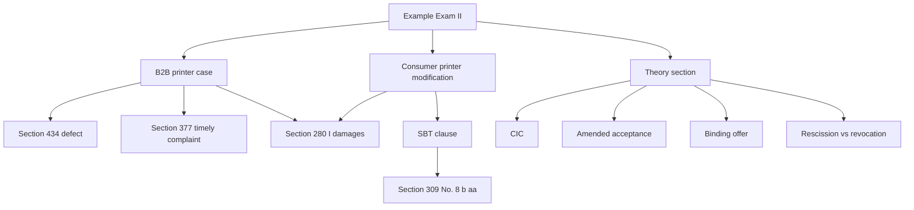

# Ubiquitous Language: Example Exam II

Source note: `example-exam-ii-case-facts.md`
Source file: `business-law/raw/moodle-export-business-law-950848573-s26-20260709/15.7. Example Exam/Example Exam_Case facts.pdf`
Course: Business Law
Processed: 2026-07-09

This context file captures the mock-exam issue language. The source provides case facts and questions, not official solutions; the answer routes in the note are inferred from the processed course materials.

## Mock-Exam Route Terms

| Term | Definition | Aliases to avoid |
|---|---|---|
| **Case Basic Constellation** | First case section in Example Exam II: B2B sale of a defective 3D printer causing table/laptop damage. | theory question |
| **Case Modification** | Second case section: consumer hobby printer plus SBT exclusion clause and carpet damage. | same case only |
| **Damages In Addition To Performance** | Damages for loss that remains even if proper performance later occurs, such as property damage caused by the defective item. | reduction, cure |
| **Mutual Commercial Purchase** | Sale of goods that is commercial for both parties, triggering Section 377 HGB duties. | any company sale |
| **Timely Commercial Complaint** | Inspection/notice in due course under Section 377 HGB, here supported by immediate test and same-day complaint. | ordinary customer complaint |
| **SBT Referral Clause** | Pre-formulated clause trying to redirect defect claims from the seller to a third party, such as a software manufacturer. | valid warranty routing |
| **Consumer Modification Route** | Path where Section 377 HGB drops out and B2C SBT control becomes central. | B2B route |
| **Culpa In Contrahendo** | Pre-contractual liability route based on Sections 311 II, 241 II, and 280 I BGB. | failed contract only |
| **Amended Acceptance** | A reply changing an offer; rejection plus new offer under Section 150 II BGB. | acceptance with changes |

## Statutory Anchors

| Section | Canonical function | Trigger facts | Exam use |
|---|---|---|---|
| **Section 433 BGB** | Purchase agreement duties. | Buyer asks for delivery, payment, or damages after purchase. | Start both case routes. |
| **Section 434 BGB** | Material defect. | Printer overheats filament due to software problem. | Establish defective performance. |
| **Section 437 No. 3 BGB** | Warranty damages gateway. | Buyer seeks money because of defective item. | Route into Sections 280 et seq. |
| **Section 280 I BGB** | Basic damages. | Obligation, breach, responsibility, causal damage. | Use for damages in addition to performance. |
| **Section 249 BGB** | Restitution/money compensation. | Need amount for table, laptop, or carpet. | State legal consequence after liability. |
| **Section 377 HGB** | Merchant inspection and notice filter. | B2B sale between P-oHG and M-GmbH. | Check before ordinary warranty remedies. |
| **Sections 305 et seq. BGB** | Standard Business Terms control. | Standard 3D printer purchase agreement. | Classify, incorporate, and test clause. |
| **Section 306 BGB** | Contract survives failed SBT. | Clause ineffective. | State statutory law replaces clause. |
| **Section 309 No. 8 b aa BGB** | Blocks defect-claim exclusion/referral to third parties in consumer supply/new-goods settings. | Clause sends T to software manufacturer. | Main content-control weapon in Case 2. |
| **Section 310 III No. 2 BGB** | Consumer first-use SBT treatment. | Pre-formulated B2C agreement may be used once. | Do not let P-oHG avoid SBT control by first-use argument. |
| **Section 311 II BGB** | Pre-contractual obligation relationship. | Theory question about culpa in contrahendo. | Pair with Sections 241 II and 280 I. |
| **Section 145 BGB** | Binding effect of offer. | Theory question about conditions/consequences. | Explain binding plus exclusion of being bound. |
| **Section 150 II BGB** | Amended acceptance. | Theory question about changed reply. | Rejection plus new offer. |

## Relationships

- **Case Basic Constellation** uses **Mutual Commercial Purchase** and **Timely Commercial Complaint** before damages.
- **Case Modification** uses **Consumer Modification Route** and **SBT Referral Clause** before damages.
- **Damages In Addition To Performance** is the shared damages type in both case sections.
- **SBT Referral Clause** fails if **Section 309 No. 8 b aa BGB** applies.
- **Culpa In Contrahendo** belongs to pre-contractual duties, not ordinary warranty.

## Mermaid Memory Aid



## Example Dialogue

Student: "The printer can be replaced, so the laptop damage is just cure."

Professor: "No. The laptop loss remains even if a perfect printer is delivered later. That is **Damages In Addition To Performance**."

Student: "T signed the standard purchase agreement, so P-oHG can send him to the software manufacturer."

Professor: "Signing may help incorporation, but **SBT Referral Clause** still needs content control. Check **Section 309 No. 8 b aa BGB**."

## Flagged Ambiguities

| Ambiguity | Canonical recommendation |
|---|---|
| "Software problem" | Treat as a defect in the printer unless facts isolate a separate software-only contract. |
| "Effectively represented" | Do not waste time on agency where the exam states effective representation. |
| "Damage to other property" | Route as damages in addition, not reduction of purchase price. |
| "Standard purchase agreement" | Use SBT analysis; signed form does not automatically validate the clause. |
| "Theory question" | Use short structured answer, not full legal opinion. |

## Exam Trap Corrections

| Trap | Correction |
|---|---|
| Skipping Section 377 in the business case. | Check it and explain why same-day complaint saves warranty rights. |
| Applying Section 377 to the consumer modification. | T is a hobby consumer; use SBT control instead. |
| Treating an incorporated clause as valid. | Incorporation and content control are separate. |
| Calling amended acceptance a valid acceptance. | Section 150 II BGB: rejection plus new offer. |
| Mixing rescission and revocation. | Rescission attacks defective declarations; revocation responds to performance problems in valid contracts. |

## Cheat-Sheet Language

```text
Example Exam II:
Case 1 = B2B defect -> Section 377 timely complaint -> damages in addition under Sections 437 No. 3 and 280 I.
Case 2 = consumer defect -> SBT referral clause -> Section 309 No. 8 b aa invalid -> damages in addition.
Theory = concise statutory routes, not legal opinions.
```
