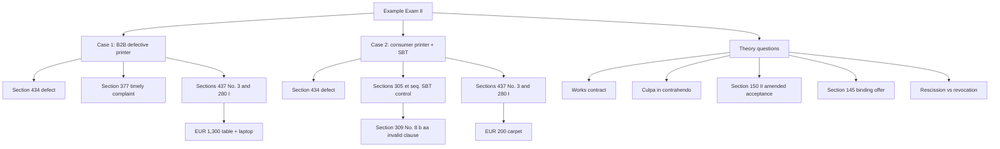

# Example Exam II: Case Facts And Answer Routes

Source: `business-law/raw/moodle-export-business-law-950848573-s26-20260709/15.7. Example Exam/Example Exam_Case facts.pdf`
Course: Business Law
Processed: 2026-07-09
Wiki note: `business-law/wiki/example-exam-ii-case-facts/example-exam-ii-case-facts.md`

Course direction checked against `business-law/wiki/_course-logistics.md`: this is an integrated mock-exam practice source, not a new doctrine lecture. It combines Warranty Rights I-II, Standard Business Terms, Contract Law I, Contract Law II, and contract-type classification.

Source status: the provided file contains case facts and theory questions, but not official solutions. The answer routes below are inferred study-coach routes based on the processed Business Law notes and statutory anchors.

## 80/20 Exam Summary

Example Exam II is an integration drill. The basic constellation tests defective-product damages in a B2B commercial sale. The modification adds a consumer SBT clause that tries to refer defect damages to a third-party software manufacturer.

High-yield moves:

- Start with the exact claim: damages for table/laptop, then damages for carpet.
- Route product-caused property damage as damages in addition to performance, not cure or reduction.
- In the business case, remember Section 377 HGB before ordinary warranty remedies.
- In the consumer modification, test SBT classification, incorporation, content control, and Section 309 No. 8 b aa BGB.
- Theory questions are short-answer questions, not legal opinions.

## Exam Structure

| Part | Points | Writing mode |
|---|---:|---|
| Case basic constellation | 30 | Full legal-opinion style |
| Case modification | 40 | Full legal-opinion style |
| Theory question section | 30 | Bullet points or short sentences allowed |

## Schema-Tailored Model Answers

Use these model blocks after a closed-book outline. They are not official model solutions; they convert the inferred routes into the answer schema from `business-law/wiki/exam-strategy-answer-schemas-2026-07-28/exam-strategy-answer-schemas-2026-07-28.md`.

### Case 1 Model Answer: Table And Laptop Damage

#### I. Claim Or Issue Sentence

```text
M-GmbH could have a claim against P-oHG for EUR 1,300 damages for the destroyed table and laptop under Sections 437 No. 3, 280 I, and 249 BGB if P-oHG delivered a defective printer and the warranty damages requirements are met.
```

#### II. Purchase Agreement

P-oHG and M-GmbH concluded a purchase agreement under Section 433 BGB for the 3D printer at a price of EUR 25,000. The facts state that both sides were effectively represented, so representation should not become the main issue.

Interim result:

```text
A valid purchase agreement exists.
```

#### III. Material Defect At Transfer Of Risk

A material defect exists if the purchased thing does not have the agreed or usual quality or is not suitable for its intended use. A 3D printer that overheats filament so severely that employees cannot stop the leaking filament is not suitable for ordinary printer use and lacks usual safety and functionality.

The malfunction appears during an immediate test run after delivery. The software problem is therefore best treated as already present at transfer of risk.

Interim result:

```text
The printer was defective at transfer of risk.
```

#### IV. Section 377 HGB Filter

Because P-oHG and M-GmbH are commercial actors and the printer purchase belongs to their business, the sale is a mutual commercial transaction. Section 377 HGB therefore requires prompt inspection and notice of defects.

M-GmbH tested the printer immediately after delivery and complained to P-oHG the same day. This satisfies the inspection and notice requirement. The goods are not deemed approved, and warranty rights are not excluded.

Nuance:

```text
Section 377 HGB is not a reason to deny the claim here. It is the filter that M-GmbH survives because the facts emphasize immediate testing and same-day complaint.
```

#### V. Damages Route

The table and laptop damage is not damage to the value of the printer itself. A later repair or replacement of the printer would not undo the destroyed table and laptop. The correct category is therefore damages in addition to performance, not cure, reduction, or damages instead of performance.

Under Section 280 I BGB, there is an obligation from the purchase contract, P-oHG breached the duty to deliver a defect-free printer, and the defect caused EUR 1,300 damage. Responsibility is presumed under Section 280 I sentence 2 BGB. No facts show that P-oHG can exculpate itself.

Interim result:

```text
The requirements for damages in addition to performance are met.
```

#### VI. Final Answer

```text
M-GmbH can claim EUR 1,300 from P-oHG for the destroyed table and laptop under Sections 437 No. 3, 280 I, and 249 BGB.
```

High-yield nuance:

```text
Do not demand a grace period for this damage. The destroyed table and laptop would remain lost even if P-oHG later supplied a perfect printer.
```

### Case 2 Model Answer: Carpet Damage And SBT Clause

#### I. Claim Or Issue Sentence

```text
T could have a claim against P-oHG for EUR 200 carpet-cleaning costs under Sections 437 No. 3, 280 I, and 249 BGB if the hobby printer was defective and P-oHG cannot rely on Clause 1.3.
```

#### II. Purchase Agreement And Defect

T bought a hobby 3D printer from P-oHG for EUR 5,000. This is a purchase agreement under Section 433 BGB. The same software problem caused the filament to overheat and spread onto T's carpet. As in the basic constellation, this makes the printer defective under Section 434 BGB. Because the same recurring software issue appears immediately in use, the defect likely existed at transfer of risk.

Interim result:

```text
The warranty gateway under Section 437 BGB is opened.
```

#### III. No Section 377 HGB Filter

T buys the printer for his hobby. He is therefore a consumer, not a merchant buyer. Section 377 HGB does not apply because this is not a mutual commercial purchase.

#### IV. Damages In Addition To Performance

The EUR 200 carpet-cleaning cost is consequential property damage caused by the defective printer. A later cure of the printer would not remove the carpet damage. The route is therefore damages in addition to performance under Sections 437 No. 3 and 280 I BGB.

P-oHG owed delivery of a defect-free printer, breached that duty, caused EUR 200 damage, and is presumed responsible unless it proves lack of responsibility.

Interim result:

```text
T has a statutory damages route unless Clause 1.3 validly excludes or redirects it.
```

#### V. SBT Classification And Incorporation

Clause 1.3 is part of a standard 3D-printer purchase agreement prepared by P-oHG. It is pre-formulated, intended to set terms for the transaction, and presented by the seller. In a consumer contract, terms are deemed presented by the trader unless introduced by the consumer, and one-time use can still be controlled if the consumer could not influence the content.

T read and signed the document. Incorporation is therefore likely satisfied. But incorporation only means the clause enters the contract; it does not mean the clause is valid.

Nuance:

```text
Signing helps incorporation, not content validity. This is the main SBT trap.
```

#### VI. Content Control

Clause 1.3 excludes damages claims for harm connected with a software problem and refers the customer to the software manufacturer. In a consumer contract for a newly produced thing, Section 309 No. 8 b aa BGB invalidates clauses that exclude, limit, or make defect claims dependent on claims against third parties.

The clause does exactly that: it removes P-oHG as the contractual seller from the defect-damages route and forces T toward an unknown third-party manufacturer. It is therefore ineffective.

Under Section 306 BGB, the ineffective clause drops out while the rest of the contract remains valid. Statutory warranty law fills the gap.

#### VII. Final Answer

```text
T can claim EUR 200 from P-oHG. Clause 1.3 was likely incorporated, but it is ineffective under SBT content control, especially Section 309 No. 8 b aa BGB; the statutory damages route remains available.
```

High-yield nuance:

```text
Do not write "T signed, so no claim." The expected route is: signed -> incorporated -> content control -> clause invalid -> statutory claim survives.
```

### Theory Question 3 Model Answer: Renovation Contract Type

Schema:

```text
definition -> anchor -> alternatives -> conclusion
```

Model answer:

- The contract is best classified as a works contract under Section 631 BGB because C owes a concrete success: replacing two windows.
- A service contract under Section 611 BGB is weaker because C is not merely promising effort or time; the expected result is completed window replacement.
- A purchase contract under Section 433 BGB is also weaker because the center of gravity is not simply transfer of pre-existing goods, but installation/renovation work.
- If the windows themselves are supplied by C, the contract can have mixed elements, but the success-oriented renovation result keeps the works-contract classification strongest.

### Theory Question 4 Model Answer: Culpa In Contrahendo

Schema:

```text
definition -> statutory route -> examples -> limit
```

Model answer:

- Culpa in contrahendo covers liability for breaches of duties during contract initiation, negotiation, or similar pre-contractual contact.
- Statutory route: Section 311 II BGB creates the pre-contractual obligation relationship; Section 241 II BGB supplies duties to protect rights, legal interests, and trust; Section 280 I BGB gives damages for breach.
- Examples include misleading information during negotiations, unsafe premises during contract initiation, or creating reliance and then breaching protective duties.
- Limit: it is not compensation for every disappointed negotiation. There must be a legally relevant duty breach, damage, causation, and responsibility.

### Theory Question 5 Model Answer: Amended Acceptance

Schema:

```text
offer -> non-matching answer -> statutory consequence -> new contract only after acceptance
```

Model answer:

- Acceptance must match the offer.
- If the recipient answers with changes, additions, or restrictions, the answer is not an acceptance.
- Under Section 150 II BGB, the amended acceptance counts as rejection of the original offer combined with a new offer.
- The original offer expires under Section 146 BGB.
- A contract forms only if the original offeror accepts the new counteroffer.

### Theory Question 6 Model Answer: Section 145 BGB

Schema:

```text
condition -> consequence -> particularities -> relationship
```

Model answer:

- Section 145 BGB applies where a person makes an offer to another person to enter into a contract.
- The consequence is that the offeror is bound by the offer.
- The offeror can exclude being bound by clear wording, for example "without engagement" or "subject to confirmation."
- Particularity: Section 145 BGB only applies after the declaration is classified as an offer. A shop display or advertisement is usually only an invitatio ad offerendum.
- The binding effect ends through rejection, late acceptance, expiry of the acceptance period, or other rules in Sections 146-149 BGB.

### Theory Question 7 Model Answer: Rescission Versus Revocation

Schema:

```text
define both -> trigger -> anchor -> consequence -> trap
```

Model answer:

| Dimension | Rescission | Revocation |
|---|---|---|
| Legal problem | Defective declaration at formation. | Valid reciprocal contract, but later performance problem. |
| Typical anchors | Sections 119, 120, 123, 143, 121/124, 142 BGB. | Sections 323, 324, 326 V, 346-349 BGB. |
| Trigger facts | Mistake, incorrect transmission, deceit, duress. | Non-performance, defective performance, ancillary-duty breach, impossibility. |
| Legal effect | Declaration is void from the beginning under Section 142 I BGB. | Restitution relationship; received performances are returned. |
| Exam warning | Do not use rescission just because the object later proves defective. | Do not use revocation to attack manipulated consent. |

Short answer:

```text
Rescission attacks consent at formation; revocation reacts to a performance failure in a valid contract.
```

## Case 1: Defective 3D Printer Damages Table And Laptop

### Paraphrased Facts

Printtech-oHG sells a 3D printer for EUR 25,000 to Mach-GmbH. Both sides are effectively represented. During an immediate test run after delivery, a software problem overheats filament; liquid filament spills beyond the printing area and destroys a nearby table worth EUR 100 and laptop worth EUR 1,200. M-GmbH complains the same day.

Question: can M-GmbH claim damages for the table and laptop?

### Answer Route

Claim basis: Sections 437 No. 3 Alt. 1 and 280 I BGB, plus Section 249 BGB for the amount. Because both sides are commercial entities, check Section 377 HGB before relying on warranty remedies.

1. **Purchase agreement:** P-oHG and M-GmbH concluded a purchase agreement under Section 433 BGB. The facts state effective representation on both sides.
2. **Defect:** the printer is materially defective under Section 434 BGB. A printer that overheats filament uncontrollably and cannot be stopped by employees is not suitable for customary use and lacks usual quality.
3. **Transfer of risk:** the defect appears during an immediate test after delivery and is linked to the software problem. Strong route: defect existed at transfer of risk.
4. **Section 377 HGB:** this is a mutual commercial purchase. M-GmbH tested immediately after delivery and complained the same day, so inspection and notification are timely. Warranty rights are not excluded.
5. **Damage classification:** the table and laptop damage would remain even if P-oHG later delivered a defect-free printer. This is damages in addition to performance.
6. **Section 280 I elements:** contractual obligation exists; breach is defective delivery; responsibility is presumed under Section 280 I 2 BGB unless P-oHG exculpates itself; causal damage is EUR 1,300.
7. **Legal consequence:** monetary compensation under Section 249 II BGB for EUR 1,300.

Likely result: M-GmbH can claim EUR 1,300 from P-oHG.

### Exam Traps

- Do not route table/laptop loss as reduction. Reduction concerns the printer's price/value relation.
- Do not skip Section 377 HGB just because the defect is obvious; the same-day complaint is why M-GmbH survives Section 377.
- Do not overcomplicate representation; the facts say both sides are effectively represented.

## Case 2: Consumer 3D Printer, SBT Exclusion, Carpet Damage

### Paraphrased Facts

T buys a hobby 3D printer from P-oHG for EUR 5,000. P-oHG uses a standard three-page 3D-printer purchase agreement. Clause 1.3 says the customer may not claim damages for harm caused in connection with a software problem and must turn to the software manufacturer. T reads and signs. The same software problem occurs and damages T's carpet, causing EUR 200 cleaning costs. P-oHG invokes the clause.

Question: can T claim damages from P-oHG for the carpet?

### Answer Route

Claim basis: Sections 437 No. 3 Alt. 1 and 280 I BGB, with SBT control under Sections 305 et seq. BGB.

1. **Purchase agreement:** P-oHG and T concluded a purchase agreement under Section 433 BGB.
2. **Defect:** the software overheating problem makes the printer defective under Section 434 BGB.
3. **Transfer of risk:** same recurring software defect; likely existed at delivery.
4. **No Section 377 HGB:** T is a consumer/hobby buyer, not a merchant buyer in a mutual commercial purchase.
5. **Damages classification:** carpet damage remains even if proper performance later occurs, so damages in addition to performance under Section 280 I BGB.
6. **Section 280 I elements:** obligation, breach, presumed responsibility, causal EUR 200 damage.
7. **SBT classification:** the standard 3D printer purchase agreement is pre-formulated and presented by P-oHG. Even if newly used, B2C rules can treat it as SBT under Section 310 III No. 2 BGB.
8. **Incorporation:** T reads and signs the document, so reference, opportunity, and agreement are likely satisfied. Clause is not surprising merely because it concerns software-problem liability in a printer contract.
9. **Content control:** clause excludes or limits defect-related claims by referring the customer to a third-party software manufacturer. In a consumer contract for a newly produced thing, Section 309 No. 8 b aa BGB prohibits excluding or limiting defect claims or making them dependent on claims against third parties.
10. **Consequence:** the clause is ineffective; the contract otherwise remains valid under Section 306 BGB; statutory damages route remains.

Likely result: T can claim EUR 200 from P-oHG.

### Exam Traps

- Do not let P-oHG redirect the buyer to the software manufacturer before testing SBT content control.
- Do not treat signing as the end of the SBT analysis.
- The clause can be incorporated but still ineffective.

## Theory Question 3: House Renovation Contract Type

Question: H calls craftswoman C; C replaces two windows in H's living room for EUR 800 in one afternoon. What contract type is this, and what alternatives should be considered?

Answer route:

- Best classification: works contract under Section 631 BGB because C owes a concrete success/result: replaced windows.
- Considered but rejected: service contract under Section 611 BGB, because C is not merely owing effort or activity; she owes successful window replacement.
- Considered but rejected: purchase agreement under Section 433 BGB, because the center of gravity is not simply transfer of pre-existing goods but performance of renovation/replacement work.

## Theory Question 4: Culpa In Contrahendo Scope

Question: explain the scope of application of culpa in contrahendo.

Answer route:

- Culpa in contrahendo covers pre-contractual duties arising during contract initiation, negotiation, or similar business contact.
- It protects rights, legal interests, and trust before a contract is concluded.
- Typical triggers: entering negotiations, initiating a contract, creating reliance, providing information, exposing the other party to risks, or breaking off negotiations in a legally relevant way.
- Statutory route in German law: pre-contractual obligation relationship under Section 311 II BGB, duties under Section 241 II BGB, damages under Section 280 I BGB.
- It is not a substitute for every disappointed negotiation; there must be a duty breach and compensable damage.

## Theory Question 5: Amended Acceptance

Question: what happens if one person makes an offer and the other side answers by amending it?

Answer route:

- An acceptance must match the offer.
- An amended acceptance is not an acceptance.
- Under Section 150 II BGB, it is a rejection combined with a new offer.
- The original offer expires under Section 146 BGB.
- A contract forms only if the original offeror accepts the new counteroffer.

## Theory Question 6: Section 145 BGB

Question: name the conditions and consequences of Section 145 BGB and explain particularities.

Answer route:

- Condition: a person makes an offer to another person to enter into a contract.
- Consequence: the offeror is bound by the offer.
- Exception: the offeror can exclude being bound, for example by clear reservation.
- Particularity: Section 145 BGB only matters after a statement is classified as an offer, not merely an invitatio ad offerendum.
- Relationship: binding ends through rejection or late acceptance under Section 146 BGB and through acceptance-period rules under Sections 147-149 BGB.

## Theory Question 7: Rescission Versus Revocation

Answer route:

| Dimension | Rescission | Revocation |
|---|---|---|
| Core problem | Defective declaration of intent | Valid contract with performance problem |
| Typical anchor | Sections 119, 120, 123, 142, 143 BGB | Sections 323, 324, 326 V, 346-349 BGB |
| Trigger | Error, deceit, duress, transmission error | Non-performance, defective performance, ancillary-duty breach, impossibility |
| Effect | Declaration/transaction void ex tunc under Section 142 I BGB | Restitution relationship under Sections 346 et seq. BGB |
| Exam trap | Do not use for buyer's regret or later breach | Do not use to attack flawed consent at formation |

## Full Mock-Exam Routing Map



## Subject Knowledge Graph

| Node | Type | Description |
|---|---|---|
| Example Exam II | mock exam | Integrated Business Law practice case. |
| Defective 3D printer | case object | Product causing property damage through software defect. |
| Section 377 HGB | commercial filter | B2B inspection and notice rule. |
| Damages in addition | damages route | Property damage remains despite later cure. |
| SBT exclusion clause | clause | Attempts to redirect defect claims to software manufacturer. |
| Section 309 No. 8 b aa BGB | SBT prohibition | Blocks defect-claim referral to third parties in consumer supply/new-goods contexts. |
| Culpa in contrahendo | theory route | Pre-contractual duties and damages. |

| From | Relationship | To |
|---|---|---|
| Defective 3D printer | triggers | Damages in addition |
| Section 377 HGB | filters | B2B warranty remedies |
| SBT exclusion clause | tested by | Section 309 No. 8 b aa BGB |
| Damages in addition | uses | Section 280 I BGB |
| Culpa in contrahendo | combines | Sections 311 II, 241 II, 280 I BGB |

## Retrieval Prompts

1. Why is Case 1 not simply a cure case?
2. Why does Section 377 HGB not block M-GmbH's claim?
3. Why is T's SBT clause ineffective even though T signed?
4. Explain why table/laptop and carpet damage are damages in addition to performance.
5. Give the Section 150 II BGB answer in three sentences.
6. Compare rescission and revocation using trigger and effect.

## Practice Tasks

1. Write Case 1's first five legal-opinion headings without prose.
2. Write the SBT content-control paragraph for Clause 1.3 in Case 2.
3. Draft a 6-point answer to the culpa in contrahendo theory question.
4. Create a one-page statute checklist for Example Exam II: Sections 433, 434, 437, 280, 249, 305, 306, 309, 310, 377 HGB.

## Connections

- Week 08 Warranty Rights I: defect and Section 437 gateway.
- Week 09 Warranty Rights II: damages in addition versus damages instead of performance.
- Week 06 Standard Business Terms: SBT classification, incorporation, content control, and Section 306 consequence.
- Week 11 Trade Law: Section 377 HGB inspection and notification.
- Week 03 Contract Law I: Section 145 and Section 150 II theory questions.
- Week 04 Contract Law II: rescission versus revocation theory question.

## Weakness Flags

- Pending first active-recall/mock-exam session.
