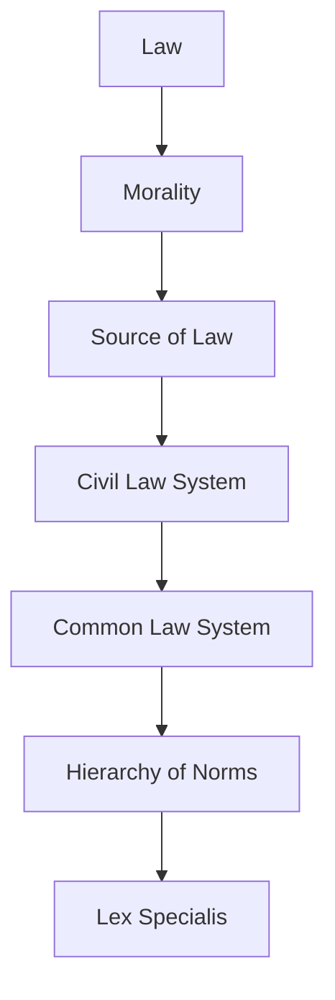

# Ubiquitous Language: Week 01-02: Introduction To Business Law

Source note: `week-01-02-introduction-to-business-law.md`
Course: Business Law
Definition sources: local topic note and raw material for term discovery; enriched with standard domain knowledge where the local note names a term without fully defining it.

This file is a standalone terminology and formula companion. It follows Matt Pocock style: canonical terms, aliases to avoid, relationships, example dialogue, and flagged ambiguities.

## Legal System Language

| Term | Definition | Aliases to avoid |
|---|---|---|
| **Law** | Binding rules created or recognized by a legal system and enforceable through legal institutions. | morality, fairness, social rule |
| **Morality** | Social or ethical judgment about right and wrong that may influence law but is not automatically legally enforceable. | law, legal duty |
| **Source of Law** | An origin from which a legal rule gets authority, such as legislation, EU law, or case law. | reading source, citation |
| **Civil Law System** | A legal system where codified statutes are the central source for legal reasoning. | private law, civil case |
| **Common Law System** | A legal system where judicial precedent has strong rule-making significance. | case example, informal law |
| **Hierarchy of Norms** | The ranking rule that higher legal norms prevail over lower conflicting norms. | importance ranking, topic hierarchy |
| **Lex Specialis** | The interpretive rule that a more specific legal rule prevails over a more general one covering the same issue. | higher norm, exception only |

## Private-Law Reasoning

| Term | Definition | Aliases to avoid |
|---|---|---|
| **Private Law** | Law governing relationships between legally equal private persons or organizations. | civil law system, personal preference |
| **Public Law** | Law governing state authority acting in a sovereign capacity toward individuals or firms. | government involved in any way |
| **Declaration of Intent** | A legally relevant expression of will aimed at producing legal consequences. | statement, communication only |
| **Legal Transaction** | An act, especially a declaration of intent, that creates, changes, or ends legal rights by party autonomy. | business transaction |
| **Condition and Consequence** | The statutory structure where facts satisfy legal requirements and trigger a legal result. | cause and effect only |

## Legal-Opinion Method Language

| Term | Definition | Aliases to avoid |
|---|---|---|
| **Legal-Opinion Style** | Objective exam-writing style that starts with an open hypothesis, tests statutory conditions, applies facts, and concludes only after the examination. | judgment style, personal opinion |
| **Judgment Style** | Result-first writing style used for court decisions; generally not the desired exam style for Business Law cases. | legal-opinion style |
| **IRAC** | Case-writing structure: Issue, Relevant Law, Application, Conclusion. Each meaningful condition can have its own mini-IRAC. | loose essay, bullet dump |
| **Issue Sentence** | Opening hypothesis that states the possible legal result and the relevant legal basis without phrasing it as a question. | question heading |
| **Application** | The step where concrete case facts are tested against each abstract legal condition. | repeating the facts |
| **Interim Result** | A short conclusion after a subcondition or condition before moving to the next test level. | final answer |
| **Structure Level** | Formal legal-opinion hierarchy such as A., I., 1., a), aa), used to keep nested statutory tests clear. | random heading |
| **Exact Citation** | Citation that identifies the relevant section, subsection, sentence, number, or alternative precisely enough to locate the rule. | statute name only |

## EU and German Law

| Term | Definition | Aliases to avoid |
|---|---|---|
| **EU Regulation** | A binding EU legal act that applies directly in Member States without national transposition. | directive |
| **EU Directive** | A binding EU act that sets a required result but normally needs national implementation. | regulation |
| **BGB** | The German Civil Code, the central statute for general private law obligations and contracts. | all German law |
| **Statutory Interpretation** | Determining a legal rule meaning using wording, system, purpose, history, and context. | personal interpretation |

## Statutory Anchors

| Section | Canonical function | Trigger facts | Exam use |
|---|---|---|---|
| **Section 242 BGB** | Good faith as a private-law standard that can shape duties and legal evaluation. | A party relies on formal rights in a way that may be unfair under legal good-faith reasoning. | Use carefully as a legal standard, not as a generic fairness argument. |
| **Section 123 BGB** | Rescission because of deceit or duress. | A declaration of intent was induced by intentional misleading behavior or unlawful pressure. | Use as the introduction's model for condition/consequence reasoning and legal-term precision. |
| **BGB Book 1, Sections 1-240** | General Part rules that can apply across later BGB books. | Contract-law case needs general concepts such as legal capacity, declarations, interpretation, form, or time limits. | Start with general rules before moving to the specific contract type. |
| **BGB Book 2, Sections 241-853** | Law of Obligations, including contractual and non-contractual obligations. | A case concerns duties between parties, performance, breach, damages, or contract types. | Locate contract-law problems here, then combine with Book 1 when needed. |
| **HGB special provisions** | Commercial-law special rules for merchants and business transactions. | Both parties are merchants or the facts show a commercial transaction. | Apply lex specialis: check whether HGB modifies the general BGB result. |

## Relationships

- **Law** should be distinguished from **Morality** when writing exam answers.
- **Morality** should be distinguished from **Source of Law** when writing exam answers.
- **Source of Law** should be distinguished from **Civil Law System** when writing exam answers.
- **Civil Law System** should be distinguished from **Common Law System** when writing exam answers.
- **Common Law System** should be distinguished from **Hierarchy of Norms** when writing exam answers.
- **Hierarchy of Norms** should be distinguished from **Lex Specialis** when writing exam answers.
- A strong answer defines the canonical term, applies the rule or formula, and states the managerial, legal, or analytical implication.
- **Legal-Opinion Style** uses **IRAC**; each **Issue Sentence** is followed by **Relevant Law**, **Application**, and an **Interim Result** or final conclusion.

## Visual Memory Aid



## Example Dialogue

> **Student:** "I see **Law** and **Morality** in the note. Are they interchangeable?"
>
> **Professor:** "No. Use **Law** for its precise technical meaning, and use **Morality** only when the facts match that definition."
>
> **Student:** "So in an exam answer I should name the exact term first?"
>
> **Professor:** "Yes. Name the canonical term, apply the decision rule or mechanism, then state the implication."

## Flagged Ambiguities

- Do not use broad labels like "concept", "factor", or "thing" when a canonical term above fits.
- Do not use aliases listed in the tables unless you are explicitly explaining why they are misleading.
- If a formula symbol appears, define its unit, timing, and decision role before calculating.
- If a legal, theoretical, or framework term has a common everyday meaning, use the technical course meaning in exam answers.

## Exam Trap Corrections

| Trap | Correction |
|---|---|
| Naming a term without applying it. | Define it briefly, then apply it to the facts, formula, or decision. |
| Treating examples as definitions. | Use examples only after the canonical definition is clear. |
| Mixing related terms. | State the boundary between the terms before comparing them. |
| Copying a formula without variable meaning. | Define each variable and unit before substitution. |

## Cheat-Sheet Language

```text
Identify the legal issue, state the rule, apply facts to rule elements, and conclude.
For every technical term: define it, identify when it applies, and state the common confusion to avoid.
```
