# Week 01-02: Introduction To Business Law

Source: `business-law/raw/Week 1 and 2 - Introduction.pdf`
Additional exercise/method sources processed 2026-07-09:

- `business-law/raw/moodle-export-business-law-950848573-s26-20260709/15.4. Introduction I/Introduction I_Slides.pdf`
- `business-law/raw/moodle-export-business-law-950848573-s26-20260709/22.4. Introduction II/Introduction II_Slides.pdf`
- `business-law/raw/moodle-export-business-law-950848573-s26-20260709/1.7. QA_Repetition/Repetition_Slides.pdf`

Course: Business Law
Processed: 2026-05-14
Wiki note: `business-law/wiki/week-01-02-introduction-to-business-law/week-01-02-introduction-to-business-law.md`

Administrative course information from this deck is preserved separately in `business-law/wiki/_course-logistics.md` and is excluded from this subject note and graphs.

## 80/20 Exam Summary

The high-yield content is the legal system map. If you can explain these six things clearly, you can handle most introductory exam questions and later legal case work:

- Law is binding and enforceable; morality and "what feels fair" may influence law but are not identical to law.
- German business law sits mainly inside private law, especially civil law, commercial law, and company law, but business decisions also touch public law.
- Germany is a civil-law system: statutes are the primary source, while court decisions guide interpretation but are not formally the same as common-law precedent.
- German law operates in a hierarchy: EU law sits above national law where applicable; federal law prevails over conflicting state law under Art. 31 GG.
- The BGB is structured through general and specific rules: the General Part affects later books, and lex specialis means the more specific rule wins over the more general rule.
- Legal application usually means reading a norm as conditions plus legal consequence, then interpreting wording, purpose, system, and history.

## Core Concepts

### Why Business Law Matters

Business law is not only about court disputes. It shapes ordinary business decisions: forming contracts, choosing a company structure, hiring employees, leasing premises, protecting intellectual property, complying with regulation, and negotiating risk allocation.

For management students, the practical goal is not to become a lawyer. The goal is to recognize legal risk early, understand legal reasoning, communicate better with lawyers, and know when a business choice depends on a legal rule.

### What Lawyers Do

Lawyers often work through statutory interpretation and claim analysis:

- Which rules are mandatory?
- Which rules can parties modify by contract?
- What behavior is allowed or prohibited?
- Who has a claim against whom?
- What legal consequence follows if the statutory conditions are satisfied?

In business practice, this appears in contract drafting, company formation, compliance programs, dispute enforcement, negotiation, and risk management.

### Scope Of Business Law

Business law combines several legal fields:

- Civil law: everyday private-law relationships such as rental agreements and purchase agreements, mainly connected to the BGB.
- Commercial law: business-specific rules, mainly connected to the HGB, plus some commercial criminal law topics such as fraud, money laundering, and embezzlement.
- Company law: legal forms and internal rules for companies, including AktG, GmbHG, and HGB.
- International and public commercial law: trade law, competition/cartel law, foreign trade law, administrative rules, and other public-law constraints on business.

The key intuition: business decisions are not purely economic. They are made inside a legal operating system.

## Law, Morality, And Sources Of Law

### Law vs Morality

The deck uses everyday examples to separate morality from legality: refusing to help a friend, lying about pregnancy in a job interview, or bluffing about a competing offer in a business negotiation.

The exam-relevant distinction:

- Morality asks whether conduct is ethically right or wrong.
- Law asks whether a binding, enforceable norm creates legal consequences.
- Some immoral conduct is not illegal.
- Some legal rules deliberately protect behavior that may feel morally complicated.
- Sometimes law refers to social standards or customs, for example good faith in Section 242 BGB.

This matters for legal analysis because an exam answer should not jump from "unfair" to "illegal." You need a legal source and a legal consequence.

### Sources Of Law

Important sources in the deck:

- Written statutory law: BGB, HGB, AktG, GmbHG, and other statutes.
- Unwritten sources: customary law and analogies.
- Case law: especially important for interpretation and practical predictability.
- Privately set rules: standard business terms and contractual rules, subject to legal limits.

High-yield point: German legal reasoning begins with the statute, but it does not stop at the literal text. Courts, system, purpose, and context matter.

## Civil Law vs Common Law

### Civil Law

In civil-law systems, legislation is the foundation. Legal rules are laid down in legal texts and modified through the legislative process. Legal theory, statutory structure, and systematic interpretation are important.

Judges decide cases within the framework of written law. Supreme court decisions are not formally binding on lower courts in the same way as common-law precedent, but they often have strong practical influence because lower courts risk being overruled.

### Common Law

In common-law systems, court decisions have a stronger foundational role. Legal development often happens through case law, and precedents can bind lower courts under stare decisis.

### Systems Are Converging

The deck notes that systems are moving closer together:

- Civil-law systems increasingly treat supreme court reasoning as practically important.
- Common-law systems increasingly use written legislation to increase legal certainty.

Exam trap: do not say civil law has no case law or common law has no statutes. The distinction is about what has primary structural authority.

## German Law And European Law

### German Legal Levels

The deck distinguishes several levels:

- European Union: cross-border commerce, trade, consumer protection, and many business-relevant rules.
- Federal level: most statutory law.
- State level: areas such as education and police matters.
- Cities and municipalities: local matters.

### Hierarchy Of Norms

The important hierarchy is:

- EU law, primary and secondary, where applicable.
- German federal law, including the Basic Law, parliamentary statutes, and federal regulations.
- State law, including state constitutions, statutes, and regulations.

Art. 31 GG is central for the domestic hierarchy: federal law prevails over conflicting state law.

Business implication: before applying a German rule, check whether EU law or federal law changes the answer.

## German Federal Legislative Procedure

The procedure explains how statutes become binding law.

Main institutions:

- Bundestag: federal parliament, directly elected.
- Bundesrat: federal body representing the sixteen Länder.
- Bundesregierung: federal government, Chancellor plus ministers.
- Bundespräsident: federal president, involved at the execution stage.

Typical flow:

1. Initiation: draft legislation can come from the federal government, Bundesrat, parliamentary groups, or 5% of Bundestag members.
2. Parliamentary process: Bundestag readings, committee work, amendment discussion, and adoption by vote.
3. Bundesrat involvement: consent bills can be blocked by Bundesrat; objection bills can be overruled by Bundestag under the relevant procedure.
4. Execution: signing by the responsible minister or Chancellor, authorization by the Federal President, and promulgation in the Federal Law Gazette.

Exam relevance is likely conceptual rather than detail-heavy: know who participates and why Bundesrat matters.

## EU Law

### EU As A Legal Order

The EU is a supranational organization, not a state. It has its own legal order, independent from Member State legal orders, and EU law has primacy where applicable.

Key idea: Member States transfer certain powers to EU institutions, but the EU acts only within conferred competences.

### EU Institutions

Important institutions in the deck:

- European Parliament: directly elected, with legislative, supervisory, and budgetary responsibilities.
- European Council: heads of state or government; defines general political direction and priorities.
- Council of the European Union: represents Member State governments, adopts laws, and coordinates policies.
- European Commission: proposes and enforces legislation, implements policies, and manages the EU budget.

### Primary And Secondary EU Law

Primary law:

- Treaty on the European Union (TEU): general principles, institutions, cooperation, external representation.
- Treaty on the Functioning of the European Union (TFEU): more detailed rules on powers, institutions, responsibilities, and business-relevant freedoms such as free movement of goods, capital, services, and labour, plus freedom of establishment.
- General principles of law.
- Charter of Fundamental Rights of the European Union.

Secondary law under Art. 288 TFEU:

- Regulations.
- Directives.
- Decisions.

### Regulations vs Directives

Regulations:

- Directly applicable in Member States.
- Binding in their entirety.
- Create uniform rules across the EU.

Directives:

- Set common goals.
- Require Member States to transpose them into national law.
- Leave discretion about form and method.
- Aim at harmonisation rather than full uniformity.
- Can sometimes have direct effect and grant individual rights under specific conditions.

Visual intuition from the slides:

- Regulation: many national variants are replaced by one uniform rule.
- Directive: the EU sets a standard; Member States implement it through national law.

Exam trap: a regulation is not merely a recommendation, and a directive is not usually "directly applicable" in the same ordinary sense as a regulation.

## Public Law vs Private Law

### Public Law

Public law governs relationships involving public authority and superordination/subordination. A typical example is an administrative act: the state orders or permits something.

Examples:

- Building permit.
- Tax declaration issue.
- Speeding ticket or regulatory offence.
- Public construction law.

Areas include constitutional law, administrative law, tax law, social law, criminal law, procedural law, and public international law.

### Private Law

Private law governs legal relationships between individual citizens or private parties. It is based on equality of positions, self-determination, and private autonomy.

Examples:

- Business partner refuses to pay for a sold machine.
- Contract dispute.
- Patent infringement between competitors.

Areas include civil law, commercial law, labour law, company law, family law, property law, and succession law.

High-yield decision rule:

- If one party acts with sovereign public authority, think public law.
- If parties face each other as legally equal private actors, think private law.

## Working With German Law

### Structure Of The BGB

The BGB has five books:

| Book | Sections | Core Function |
|---|---:|---|
| Book 1 | Sections 1-240 | General Part: rules applying across later books |
| Book 2 | Sections 241-853 | Law of Obligations: contractual and non-contractual obligations |
| Book 3 | Sections 854-1296 | Property Law: relationships between persons and things/property |
| Book 4 | Sections 1297-1921 | Family Law |
| Book 5 | Sections 1922-2385 | Succession Law |

### Bracketing Technique

The German Civil Code uses general rules that "bracket" more specific areas:

- Book 1 contains general rules that generally apply to later books.
- Book 2 also has a general part that applies to other chapters within the law of obligations.
- More specific provisions modify or displace general provisions where necessary.

This is why legal analysis often requires looking at more than one section. A contract problem may require a specific sales rule, a general obligations rule, and a general declaration-of-intent rule.

### Lex Specialis

Lex specialis means the more specific rule takes precedence over a more general rule when both cover the same issue.

Business example: if a general BGB sales rule and a more specific HGB merchant rule both seem relevant, the more specific commercial rule may control the result.

### Statutory Application: Conditions And Consequence

The deck introduces a basic legal pattern using Section 123 BGB:

- Conditions: facts that must be true.
- Legal consequence: what the law allows or requires if those facts are true.

In case-solving, this becomes:

1. Identify the legal norm.
2. Break the norm into elements or conditions.
3. Test the facts against each element.
4. State the legal consequence.

### Statutory Interpretation

The deck highlights four interpretation lenses:

- Wording: what the text says and how key terms are defined.
- Purpose or telos: what the norm tries to achieve.
- Systematic context: where the norm sits in the legal structure and how it relates to surrounding rules.
- Historical interpretation: what the historical legislator or legal tradition suggests.

Important nuance from the Section 123 BGB example: legal terms may not match everyday language or translations perfectly. A translated term can hide meaning that exists in the German original.

## Visual Knowledge Map

```mermaid
flowchart TD
    BL[Business Law] --> Purpose[Business decisions inside legal constraints]
    BL --> Sources[Sources of law]
    BL --> Systems[Civil law vs common law]
    BL --> Hierarchy[German and EU hierarchy of norms]
    BL --> Domains[Public law vs private law]
    BL --> Method[Working with German law]

    Sources --> Statutes[Statutes: BGB, HGB, AktG, GmbHG]
    Sources --> Custom[Customary law and analogies]
    Sources --> Cases[Case law guides interpretation]
    Sources --> PrivateRules[Private rules such as standard business terms]

    Systems --> Civil[Civil law: statutes as foundation]
    Systems --> Common[Common law: precedent as foundation]

    Hierarchy --> EU[EU law has primacy where applicable]
    Hierarchy --> Federal[Federal law]
    Hierarchy --> State[State law]
    Federal --> Art31[Art. 31 GG: federal law prevails over state law]

    Domains --> Public[Public law: state authority and subordination]
    Domains --> Private[Private law: equal private actors and autonomy]

    Method --> BGB[BGB structure and bracketing technique]
    Method --> Lex[Lex specialis]
    Method --> IfThen[Conditions lead to legal consequence]
    Method --> Interpretation[Wording, telos, system, history]
```

## Subject Knowledge Graph

| Node | Meaning | Exam Relevance |
|---|---|---|
| Business Law | Legal fields relevant for business decisions | Frames the whole course |
| Law | Binding and enforceable norms | Separates legal analysis from moral intuition |
| Morality / Rechtsgefühl | Ethical or intuitive sense of what should be right | Common trap: confusing fairness with legality |
| Statutory Law | Written legal rules such as BGB, HGB, AktG, GmbHG | Primary source in German civil-law reasoning |
| Case Law | Court decisions interpreting legal rules | Important for interpretation and predictability |
| Civil Law System | Legal system where statutes are primary | Explains German legal method |
| Common Law System | Legal system where precedent has stronger formal role | Likely comparison topic |
| EU Law | Supranational legal order with primacy where applicable | Affects German business law |
| Regulation | Directly applicable EU secondary law creating uniform rules | Key EU-law distinction |
| Directive | EU secondary law requiring national implementation | Key EU-law distinction |
| Public Law | Law involving state authority or subordination | Needed to classify cases |
| Private Law | Law between equal private actors | Core area for contracts and business disputes |
| BGB Structure | Five-book structure with general and specific rules | Foundational for future contract law |
| Bracketing Technique | General rules apply across more specific books/chapters | Helps locate relevant norms |
| Lex Specialis | Specific rule prevails over general rule | Crucial for legal rule selection |
| Conditions / Legal Consequence | If-then structure of legal norms | Core legal case-solving method |
| Statutory Interpretation | Wording, purpose, system, and history | Core method for ambiguous legal terms |

| From | Relationship | To | Why It Matters |
|---|---|---|---|
| Business Law | is built from | Civil Law / Commercial Law / Company Law | Helps classify later topics |
| Law | differs from | Morality / Rechtsgefühl | Prevents moralized answers without legal basis |
| Civil Law System | prioritizes | Statutory Law | Explains why reading statutes is central |
| Case Law | interprets | Statutory Law | Courts shape practical meaning even without formal precedent |
| EU Law | can override | National Law | A German-law answer may be wrong if EU law controls |
| Federal Law | prevails over | State Law | Art. 31 GG hierarchy issue |
| Regulation | creates | Uniform EU Rules | Directly applicable across Member States |
| Directive | requires | National Transposition | Harmonizes goals while allowing implementation discretion |
| Public Law | involves | State Authority | Key classification criterion |
| Private Law | relies on | Private Autonomy | Explains contract law and equal-party disputes |
| BGB Structure | uses | Bracketing Technique | General rules must be checked with specific rules |
| Lex Specialis | resolves conflict between | General Rule and Specific Rule | Determines which norm governs |
| Legal Norm | contains | Conditions / Legal Consequence | Turns statutes into case-solving steps |
| Statutory Interpretation | clarifies | Ambiguous Legal Terms | Needed when wording is unclear or translated |

## Diagrams, Tables, And Visuals

The deck contains several exam-relevant visuals:

- Business law field map: civil law, commercial law, company law, and public/international commercial law.
- Civil vs common law comparison tables: focus on source of law, role of courts, and role of precedent.
- German/EU hierarchy of norms: EU law, federal law, state law, and Art. 31 GG.
- Legislative procedure sequence: initiation, parliamentary readings/committees, Bundesrat role, execution/promulgation.
- EU regulation vs directive visuals: regulation replaces national variation with uniform rules; directive sets a standard that Member States implement.
- Public vs private law split: state authority versus equal private parties.
- BGB five-book table and bracketing image: general rules surround and affect more specific rules.
- Section 123 BGB interpretation slides: condition/consequence structure and interpretation lenses.

## Real Business Examples

- Contract negotiation: a supplier's sales contract may include standard business terms, but some terms may be controlled or invalid under mandatory private-law rules.
- Factory construction: building permit issues belong to public law, while the machine purchase contract for the factory belongs to private law.
- EU product compliance: a company selling goods across the EU must check whether EU regulations directly impose uniform requirements or directives have been implemented through German law.
- Merchant transaction: a sale between merchants may require both general BGB rules and more specific HGB provisions.
- Deceptive negotiation: a buyer's or seller's false statement may raise issues of mistake, deceit, declaration of intent, and avoidance under the BGB.

## Exam Relevance

The deck's revision questions strongly signal these likely exam areas:

- Explain the difference between public law and private law.
- Explain the hierarchy of norms in Germany.
- Explain the structure of the BGB, including the bracketing technique.

Other likely prompts:

- Compare civil law and common law.
- Distinguish EU regulations and directives.
- Explain how to apply a statute using conditions and legal consequence.
- Explain lex specialis using a simple legal example.
- Classify examples as public law or private law.

Common traps:

- Treating morality as automatically equivalent to legality.
- Saying civil-law courts do not matter.
- Saying directives are always directly applicable like regulations.
- Forgetting that EU law can affect German legal answers.
- Applying only a specific rule and forgetting the relevant general BGB rule.
- Applying only a general rule and ignoring lex specialis.
- Classifying every business-related issue as private law even when the state acts with authority.

How to structure a high-scoring answer:

- Start with the legal category or rule.
- State the criterion.
- Apply the criterion to the facts.
- Mention the consequence or why the classification matters.
- For hierarchy questions, draw the levels and explain priority.
- For BGB questions, move from general to specific rules and mention lex specialis.

## Exercise Method Additions: Legal-Opinion And Time Strategy

The exercise introduction and repetition slides add exam-method guidance that is not just administrative. Use it as the default writing workflow for Business Law cases.

### Case-Solving Workflow

1. Read the case facts twice and extract the legally relevant facts.
2. Identify what the question asks for: a claim, a contract conclusion result, a remedy, or a validity issue.
3. Find the legal basis: the provision or provision chain that can answer that question.
4. Apply each statutory condition to the facts. Do not challenge neutral narrative facts, but do test party assertions.
5. End with a result sentence that directly answers the case question.

Practical sketch tools:

- Multi-person cases: draw a triangle or chain showing who acts, who is represented, and who claims against whom.
- Multi-event cases: draw a timeline with offer, receipt, deadline, notice, delivery, complaint, or revocation dates.
- Argument-heavy cases: use a pro/con table before writing, then convert only the relevant arguments into legal-opinion prose.

### Legal-Opinion Style

Legal-opinion style is objective and open until the conclusion. Do not start with the final result. Write in continuous sentences, use structure levels, cite the exact law, and move through IRAC on every meaningful level.

Useful sentence patterns:

- Claim issue: "A could have a claim against B for X pursuant to Section Y BGB."
- Condition issue: "Questionable is whether X is given."
- Rule: "X requires Y."
- Application: apply the concrete facts without generic filler such as "in this case" unless it clarifies the sentence.
- Interim conclusion: "Consequently, this condition is met / not met."
- Final conclusion: answer the exact question asked.

### Citation Rules

- Cite a provision whenever possible and integrate it into the sentence with "according to" or "pursuant to".
- Know the citation units: section, subsection, sentence, number, and alternative.
- Examples to memorize:
  - Section 433 I 1 BGB: seller must deliver the thing and procure ownership.
  - Section 119 I Alt. 1 BGB: error of content.
  - Section 119 I Alt. 2 BGB: error of declaration.
  - Section 434 II 1 No. 2 BGB: subjective suitability for contractually intended use.

### Time Strategy

The repetition slides recommend not getting stuck in a perfect legal opinion. If time runs short, finish the current case in shortened form, switch to the theory questions after about one hour, and return if time remains.

## Retrieval Prompts

Closed-book questions:

1. Explain in two sentences why law and morality are not identical.
2. Name the major fields that make up business law and give one business example for each.
3. Compare civil law and common law without saying that one has "no courts" or "no statutes."
4. Recreate the hierarchy of norms from EU law down to state regulation.
5. Explain the difference between a regulation and a directive in EU law.
6. Give the decision rule for public law vs private law.
7. Recreate the five-book structure of the BGB.
8. Explain the bracketing technique and lex specialis.
9. Break a legal norm into conditions and legal consequence.
10. Name the four statutory interpretation lenses used in the deck.

Application prompts:

1. A company needs a building permit for a new factory. Is this public or private law, and why?
2. A buyer refuses to pay for a machine delivered under a sales contract. Is this public or private law, and why?
3. An EU rule says identical packaging rules apply immediately in all Member States. Is this more like a regulation or directive?
4. A German statute and a state rule conflict. What hierarchy principle matters?
5. A specific HGB rule and a general BGB rule both appear relevant. Which principle helps decide priority?

## Practice Tasks

### Task 1: Public vs Private Law

Classify each scenario and give the criterion:

- Tax office challenges a company's tax declaration.
- A customer sues a seller for defective goods.
- A competitor uses a patented invention without permission.
- Police orders a business to close during a safety emergency.

Short answer guide: tax and police examples are public law because public authority is involved; customer/seller and patent disputes are private law because private parties face each other as legal equals.

### Task 2: EU Regulation vs Directive

Explain why a regulation creates more uniformity than a directive.

Short answer guide: a regulation applies directly and in its entirety across Member States; a directive sets goals and requires national implementation, leaving Member States discretion about form and method.

### Task 3: BGB Bracketing

Why might a contract-law case require both Book 1 and Book 2 of the BGB?

Short answer guide: Book 2 may contain the obligation or contract-specific rule, while Book 1 contains general rules such as declarations of intent that can apply across later books.

### Task 4: Legal Norm Structure

Convert a statutory rule into an if-then structure.

Short answer guide: identify the factual conditions first, then state the legal consequence that follows if all conditions are met.

## Connections

Previous notes from this lecture:

- None yet. This is the first Business Law subject note.

Standing reference:

- `business-law/raw/Statutory Law_12.04.2026.pdf` should be used for statutory lookup throughout the course.

Future Business Law links:

- Contract Law I-III will rely heavily on BGB structure, declarations of intent, conditions/consequence reasoning, and statutory interpretation.
- Standard Business Terms will connect to privately set rules and limits on contractual autonomy.
- Agency will connect to declaration of intent and representation logic.
- Warranty Rights and Transfer of Property will depend on the BGB bracketing technique and the distinction between obligations and property law.
- Trade Law and Company Law will connect to HGB, AktG, and GmbHG as business-specific statutory sources.

## Weakness Flags

Use this section after coaching sessions to track what needs another retrieval pass.

- Pending first active-recall session.

## Open Uncertainties

- The exercise-introduction slides provide open-book format and 120-minute duration, but the exact final number of cases/questions is phrased probabilistically. Keep checking later exam notices for final confirmation.
- The introduction references extra Moodle material for an in-depth civil-law/common-law comparison. That extra material has not been processed yet.
