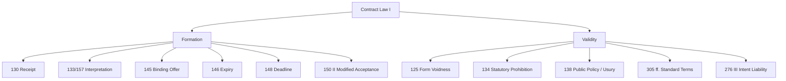

# Ubiquitous Language: Week 03: Contract Law I

Source note: `week-03-contract-law-i.md`
Course: Business Law
Definition sources: local topic note and raw material for term discovery; enriched with standard domain knowledge where the local note names a term without fully defining it.

This file is a standalone terminology and formula companion. It follows Matt Pocock style: canonical terms, aliases to avoid, relationships, example dialogue, and flagged ambiguities.

## Legal System Language

| Term | Definition | Aliases to avoid |
|---|---|---|
| **Law** | Binding rules created or recognized by a legal system and enforceable through legal institutions. | morality, fairness, social rule |
| **Morality** | Social or ethical judgment about right and wrong that may influence law but is not automatically legally enforceable. | law, legal duty |
| **Source of Law** | An origin from which a legal rule gets authority, such as legislation, EU law, or case law. | reading source, citation |
| **Civil Law System** | A legal system where codified statutes are the central source for legal reasoning. | private law, civil case |
| **Common Law System** | A legal system where judicial precedent has strong rule-making significance. | case example, informal law |
| **Hierarchy of Norms** | The ranking rule that higher legal norms prevail over lower conflicting norms. | importance ranking, topic hierarchy |
| **Lex Specialis** | The interpretive rule that a more specific legal rule prevails over a more general one covering the same issue. | higher norm, exception only |

## Private-Law Reasoning

| Term | Definition | Aliases to avoid |
|---|---|---|
| **Private Law** | Law governing relationships between legally equal private persons or organizations. | civil law system, personal preference |
| **Public Law** | Law governing state authority acting in a sovereign capacity toward individuals or firms. | government involved in any way |
| **Declaration of Intent** | A legally relevant expression of will aimed at producing legal consequences. | statement, communication only |
| **Legal Transaction** | An act, especially a declaration of intent, that creates, changes, or ends legal rights by party autonomy. | business transaction |
| **Condition and Consequence** | The statutory structure where facts satisfy legal requirements and trigger a legal result. | cause and effect only |

## Contract Formation

| Term | Definition | Aliases to avoid |
|---|---|---|
| **Contract** | A legally binding agreement created by matching declarations of intent, usually offer and acceptance. | deal, transaction |
| **Offer** | A sufficiently definite declaration of intent that can create a contract through acceptance. | invitation to negotiate |
| **Acceptance** | An unconditional assent to an offer that forms a contract when effective. | interest, negotiation |
| **Will Theory** | The idea that legal obligations arise from the parties intent to create legal consequences. | subjective wish only |
| **Objective Recipient Horizon** | The interpretation standard asking how a reasonable recipient would understand a declaration. | hidden intent |
| **Invitatio ad Offerendum** | An invitation for others to make offers, not itself a binding offer. | offer |

## Statutory Anchors

| Section | Canonical function | Trigger facts | Exam use |
|---|---|---|---|
| **Section 130 BGB** | Effectiveness of a declaration of intent to an absent person upon receipt. | Email, letter, message, or other declaration sent to someone not physically present. | Use when asking whether an offer, acceptance, or revocation reached the recipient in time. |
| **Sections 133 and 157 BGB** | Interpretation of declarations by real intent, good faith, and objective recipient horizon. | Ambiguous wording, unclear conduct, or a dispute about what a reasonable recipient understood. | Use after identifying a declaration of intent whose meaning is contested. |
| **Section 145 BGB** | Binding effect of an offer unless binding is excluded. | A sufficiently definite offer has been made and no reservation like "non-binding" appears. | Mention after classifying a statement as an offer, not merely an invitation. |
| **Section 146 BGB** | Expiry of an offer after rejection or late acceptance. | The offeree rejects, waits too long, or misses the acceptance window. | Use when the case asks whether a later "yes" can still form the contract. |
| **Section 147 BGB** | Acceptance period without a fixed deadline. | Offer is made to a present person or absent person without a stated deadline. | Use to decide whether acceptance had to be immediate or within ordinary expected response time. |
| **Section 148 BGB** | Offeror fixes an acceptance period. | Offer says "valid until Friday", "confirm by 18:00", or similar. | Use before default timing rules; the offeror's deadline controls. |
| **Section 150 II BGB** | Modified acceptance counts as rejection plus new offer. | Reply says "yes, but..." or changes price, quantity, object, or other terms. | Use for counteroffer analysis; do not treat a changed answer as acceptance. |
| **Section 125 BGB** | Invalidity if a required legal form is missing. | Contract type requires text form, written form, electronic form, or notarial recording. | Check after formation; a formed contract can still fail for form. |
| **Section 134 BGB** | Voidness for violation of a statutory prohibition. | The agreed transaction is prohibited by another statute. | Use only when facts show illegality; do not cite it in every contract formation case. |
| **Section 138 BGB** | Voidness for public-policy violation or usury. | Exploitative bargain, extreme imbalance plus exploitation, or legally intolerable morality problem. | Use as a validity limit on private autonomy. |
| **Sections 305 ff. BGB** | Control of standard business terms. | Pre-formulated terms are imposed for multiple contracts, especially B2C or platform terms. | Use when a clause, exclusion, or terms-and-conditions provision is challenged. |
| **Section 276 III BGB** | Liability for intent cannot be excluded in advance. | Contract clause tries to exclude liability even for intentional conduct. | Use as a mandatory-law limit on freedom of contract. |
| **Section 766 BGB** | Written-form requirement for a suretyship declaration by the surety. | A person promises to answer for another person's debt, such as guaranteeing a friend's bank loan. | Pair with Section 125 BGB: if the required form is missing, the suretyship declaration is generally void. |

## Section Routing Memory Aid

Use Contract Law I sections in two groups: formation first, validity second.

| Memory hook | Sections | When to use | Legal consequence |
|---|---|---|---|
| **Door: formation** | Section 130 BGB; Sections 133 and 157 BGB; Sections 145, 146, 148, 150 II BGB | Ask whether declarations formed a contract. | Contract formed, no contract, offer expired, or counteroffer. |
| **Lock: validity** | Sections 125, 134, 138, 305 ff., 276 III BGB | Ask whether a formed transaction or clause survives mandatory-law limits. | Transaction void or clause invalid/ineffective. |

Cheat sentence:

```text
130 receives; 133/157 interpret; 145 binds; 146 expires; 148 deadlines; 150 changes.
125 form fails; 134 law forbids; 138 morality breaks; 305 controls clauses; 276 intentional liability stays.
```

## Relationships

- **Law** should be distinguished from **Morality** when writing exam answers.
- **Morality** should be distinguished from **Source of Law** when writing exam answers.
- **Source of Law** should be distinguished from **Civil Law System** when writing exam answers.
- **Civil Law System** should be distinguished from **Common Law System** when writing exam answers.
- **Common Law System** should be distinguished from **Hierarchy of Norms** when writing exam answers.
- **Hierarchy of Norms** should be distinguished from **Lex Specialis** when writing exam answers.
- A strong answer defines the canonical term, applies the rule or formula, and states the managerial, legal, or analytical implication.

## Visual Memory Aid



## Example Dialogue

> **Student:** "I see **Law** and **Morality** in the note. Are they interchangeable?"
>
> **Professor:** "No. Use **Law** for its precise technical meaning, and use **Morality** only when the facts match that definition."
>
> **Student:** "So in an exam answer I should name the exact term first?"
>
> **Professor:** "Yes. Name the canonical term, apply the decision rule or mechanism, then state the implication."

> **Student:** "How do I memorize the Contract Law I sections?"
>
> **Professor:** "Think lifecycle. First open the **Door**: receipt, interpretation, offer, expiry, deadline, modified acceptance. Then test the **Lock**: form, statutory prohibition, public policy, standard terms, and intentional liability."

## Flagged Ambiguities

- Do not use broad labels like "concept", "factor", or "thing" when a canonical term above fits.
- Do not use aliases listed in the tables unless you are explicitly explaining why they are misleading.
- If a formula symbol appears, define its unit, timing, and decision role before calculating.
- If a legal, theoretical, or framework term has a common everyday meaning, use the technical course meaning in exam answers.

## Exam Trap Corrections

| Trap | Correction |
|---|---|
| Naming a term without applying it. | Define it briefly, then apply it to the facts, formula, or decision. |
| Treating examples as definitions. | Use examples only after the canonical definition is clear. |
| Mixing related terms. | State the boundary between the terms before comparing them. |
| Copying a formula without variable meaning. | Define each variable and unit before substitution. |
| Jumping to rescission before formation. | First check Contract Law I: offer, acceptance, effectiveness, and validity. Rescission only matters if there is a declaration to attack. |
| Treating invalid clause and void contract as identical. | Standard-term or liability clauses may be invalid while the rest of the contract remains valid. |

## Cheat-Sheet Language

```text
Identify the legal issue, state the rule, apply facts to rule elements, and conclude.
For every technical term: define it, identify when it applies, and state the common confusion to avoid.
```
