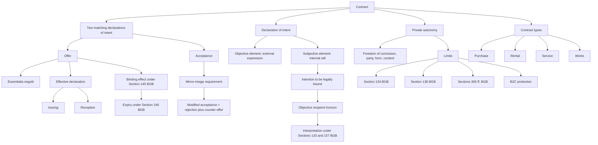
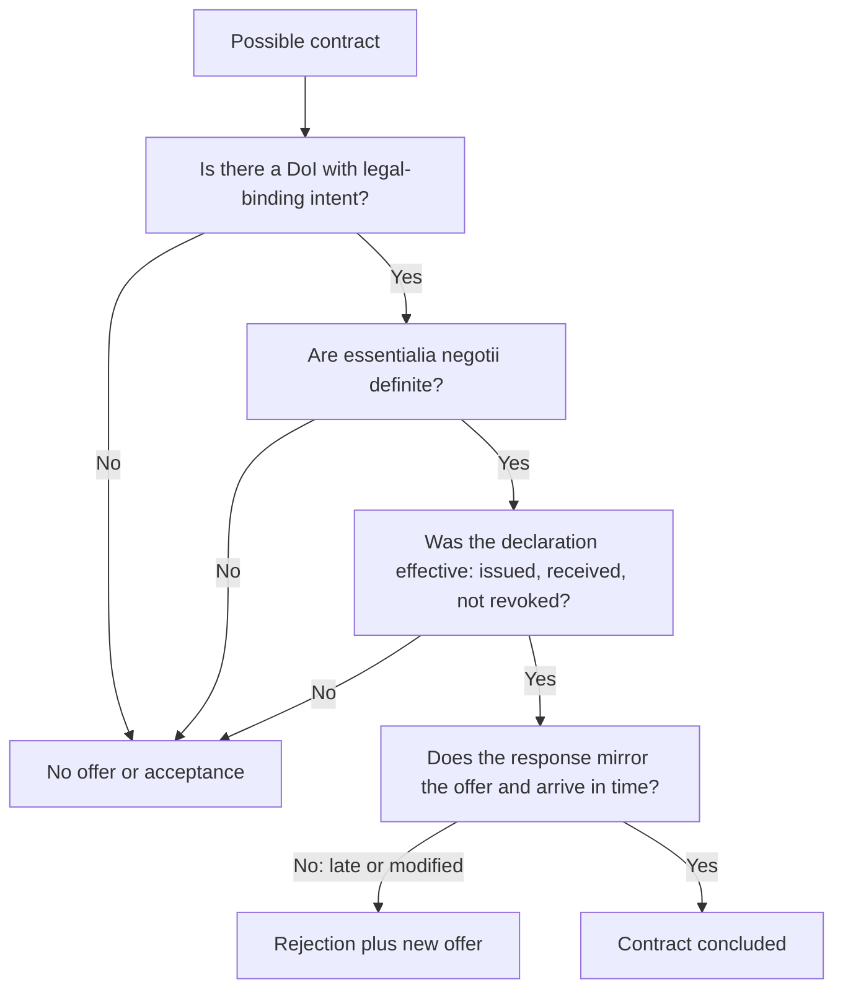

# Week 03: Contract Law I

Source: `business-law/raw/Week 3 - Contract Law I.pdf`
Exercise sources processed 2026-07-09:

- `business-law/raw/moodle-export-business-law-950848573-s26-20260709/6.5. Contract Law I/Contract Law I_Case facts.pdf`
- `business-law/raw/moodle-export-business-law-950848573-s26-20260709/6.5. Contract Law I/Contract Law I_Slides and case facts.pdf`
- `business-law/raw/moodle-export-business-law-950848573-s26-20260709/6.5. Contract Law I/Contract Law I_Slides and solutions.pdf`

Course: Business Law
Processed: 2026-05-14
Wiki note: `business-law/wiki/week-03-contract-law-i/week-03-contract-law-i.md`

Course direction checked against `business-law/wiki/_course-logistics.md`: this is Session 3 in the teaching outline and starts the contract-law block. Statutory reference file: `business-law/raw/Statutory Law_12.04.2026.pdf`.

## 80/20 Exam Summary

Contract Law I is about how contracts come into existence and why private autonomy is powerful but limited.

- A contract is formed by two matching declarations of intent: offer and acceptance.
- A declaration of intent has an objective element, external expression, and a subjective element, internal will.
- An offer must be sufficiently definite, especially regarding the essentialia negotii.
- A declaration of intent usually becomes effective only when issued and received.
- Acceptance must mirror the offer; a modified acceptance is a rejection plus counter-offer under Section 150 II BGB.
- Interpretation of declarations of intent uses Sections 133 and 157 BGB and the objective recipient horizon.
- Private autonomy gives parties freedom to contract, choose partners, form, and content, but mandatory law, statutory prohibitions, public policy, consumer protection, and standard-term control limit it.
- Different contract types matter because each carries different obligations and statutory regimes.

## Core Concepts

### Contract

A contract is a legal transaction consisting of two matching declarations of intent:

- offer
- acceptance

The matching requirement is central. If the acceptance changes the content of the offer, the original offer is rejected and a new offer is made.

### Declaration Of Intent

A declaration of intent is the expression of a person's will aimed at producing a legal consequence.

It has two dimensions:

- Objective element: the will is expressed outwardly.
- Subjective element: the person internally intends the relevant legal act.

Exam intuition: contract law does not only ask what a person secretly wanted. It asks how the declared behavior is legally understood.

### Objective Element

The objective element requires an external expression.

Examples:

- written statement
- spoken statement
- conclusive behavior, such as nodding or handing over money

Silence is almost always irrelevant. Important trade-law exceptions include the commercial letter of confirmation and Section 362 HGB.

### Subjective Element

The deck distinguishes three subjective components:

- will to act
- intention to be legally bound
- will to cause a specific legal consequence

The most exam-relevant one is intention to be legally bound. It is assessed from the objective horizon of the recipient: how would a reasonable third party understand the behavior in the circumstances?

Relevant indicators:

- nature of the transaction
- reason and purpose
- economic and legal significance
- surrounding circumstances
- due diligence of the declaror

### Invitatio Ad Offerendum

An invitatio ad offerendum is an invitation to make an offer, not an offer itself.

Typical reason: the person lacks intention to be legally bound to every possible respondent.

Business example: goods displayed in a shop or online catalog usually invite customers to make offers. The shop does not necessarily offer to contract with every person under all circumstances, for example if stock is unavailable or a price error exists.

Interpretation is based on Sections 133 and 157 BGB. A useful method is to think in consequences: would it be reasonable to bind the declaror immediately if the other side says yes?

## Offer And Acceptance

### Offer

An offer is a declaration of intent requesting contract conclusion so that the contract depends only on the recipient's consent.

An offer must contain the essentialia negotii. For a purchase agreement, these usually include:

- parties
- good
- price

If the essential elements are missing, there is no valid offer.

### Issuing And Reception

An effective declaration of intent usually requires:

- issuing
- reception

For oral declarations, issuing occurs when the words are spoken audibly.

For written declarations, issuing may occur by handing over or sending the message.

Reception occurs when the declaration enters the recipient's sphere of influence so that, under normal circumstances, the recipient can take notice of it. Actual knowledge is not required.

Important timing distinction:

- present parties: communication and reception are normally simultaneous.
- absent parties: issuing and reception happen successively.

Example from the deck: if an offer is placed in a shop owner's letterbox on Saturday evening and the shop is closed on weekends, reception is not necessarily Saturday evening. The key question is when the recipient could normally be expected to take notice.

### Binding Effect Of An Offer

Section 145 BGB: an offeror is bound by the offer unless being bound is excluded.

Section 146 BGB: an offer expires if refused or if acceptance is not made in good time under Sections 147-149 BGB.

Section 148 BGB: the offeror can fix a period for acceptance.

Section 130 BGB: a declaration to an absent party becomes effective when it reaches the recipient; it is not effective if revocation reaches the recipient before or at the same time.

Exam point: an offer is not just a casual suggestion once it is legally effective. It can bind the offeror until expiry or valid revocation.

### Acceptance

Acceptance is the declaration of intent expressing agreement with an offer.

It must mirror the offer. If the response amends the offer during negotiation, Section 150 II BGB treats it as:

- refusal of the original offer
- combined with a new offer

Example:

- Seller: bike for 200.
- Buyer: only for 150.
- This is not acceptance; it is rejection plus counter-offer.

### Acceptance Period

Section 147 BGB:

- Offer to a present person must be accepted immediately.
- This also applies to phone or similar real-time communication.
- Offer to an absent person may be accepted until the offeror may expect an answer under ordinary circumstances.

## Interpretation Of Declarations Of Intent

Interpretation is necessary when:

- wording is ambiguous
- parties understand terms differently
- customs, industries, or subcultures give terms special meaning

Sections 133 and 157 BGB require interpretation that looks for the intention behind the declaration while also protecting how the declaration would be understood by a reasonable recipient.

Core standard: objective horizon of the recipient.

The declaration is understood as a reasonable person would understand it, considering all circumstances at the time.

Important nuance: falsa demonstratio non nocet. If both parties use the wrong label but mean the same thing, the shared actual intention can prevail.

## Formal Requirements

Default rule: no formal requirements because of private autonomy.

Exceptions include:

- text form, Section 126b BGB
- written form, Section 126 BGB
- electronic form, Section 126a BGB
- notarial recording, Section 128 BGB

Examples:

- guarantee under Section 766 BGB may require written form
- transfer of real estate or GmbH shares may require notarial recording

Exam trap: private autonomy does not mean form is never required. It means freedom of form is the default unless a statute imposes a form.

## Private Autonomy

Private autonomy means parties may decide:

- whether to conclude a contract
- with whom to contract
- what content the contract should have
- which form to use, unless a special form is required
- whether to annul or dissolve contractual relationships within legal limits

It is linked to general freedom of action under Art. 2 I GG.

Practical management meaning: contract freedom gives flexibility, but it also means responsibility. If you agree to a bad bargain, the law does not automatically rescue you.

### Limits Of Private Autonomy

Private autonomy is limited where there are legal prohibitions, mandatory provisions, public-policy concerns, consumer protection needs, or imbalance of power.

Important limits:

- Section 134 BGB: breach of statutory prohibition
- Section 138 I BGB: transaction contrary to public policy
- Section 138 II BGB: usury
- Sections 305 ff. BGB: scrutiny of standard business terms
- Section 276 III BGB: no exclusion of liability for intent
- restrictions on limiting buyer warranty rights in B2C situations

### Section 134 BGB

Section 134 BGB makes a legal transaction void if it violates a statutory prohibition, unless the law provides otherwise.

It connects civil-law validity to other legal prohibitions, including criminal, administrative, and EU-law prohibitions.

Examples:

- breach of export ban
- invalid cartel agreement under Art. 101 II TFEU
- trade with human organs
- violation of illegal employment rules

Core idea: unity of the legal order. A contract should not be enforceable if it violates a prohibition the legal system treats as mandatory.

### Section 138 BGB

Section 138 BGB covers transactions contrary to public policy.

Two major routes:

- Section 138 I BGB: general public-policy violation.
- Section 138 II BGB: usury, involving strong disparity between performance and consideration plus exploitation.

Common contexts:

- overcollateralization
- guarantees by young, inexperienced descendants or employees
- severe restriction of economic freedom

Distinction:

- Section 134 BGB asks whether the transaction violates a statutory prohibition.
- Section 138 BGB asks whether the transaction is intolerable under public policy/morality as recognized by law.

## Section Memory Map: Contract Law I

Contract Law I builds the contract. Use these sections to decide whether a valid legal transaction exists.

```text
130 receives.
133/157 interpret.
145 binds.
146 expires.
148 deadlines.
150 changes.
125 form fails.
134 law forbids.
138 morality breaks.
305 controls clauses.
276 intentional liability stays.
```

| Case trigger | Section | Function | Consequence |
|---|---|---|---|
| Email, letter, or message reaches an absent recipient | Section 130 BGB | Effectiveness of declaration upon receipt | Declaration becomes effective when it reaches the recipient's sphere. |
| Ambiguous wording or disputed meaning | Sections 133 and 157 BGB | Interpretation by real will and objective recipient horizon | Meaning is determined from reasonable-recipient perspective in context. |
| Definite offer with intention to be bound | Section 145 BGB | Binding effect of offer | Offeror is bound unless binding is excluded. |
| Rejection or no timely acceptance | Section 146 BGB | Expiry of offer | Offer no longer capable of acceptance. |
| Offeror sets deadline | Section 148 BGB | Fixed acceptance period | Acceptance must arrive within the deadline. |
| Reply changes price, quantity, object, or terms | Section 150 II BGB | Modified acceptance | Rejection plus new offer, not acceptance. |
| Required legal form is missing | Section 125 BGB | Form defect | Legal transaction is void. |
| Contract violates statutory prohibition | Section 134 BGB | Mandatory legal prohibition | Legal transaction is void unless statute says otherwise. |
| Exploitative or immoral transaction | Section 138 BGB | Public policy/usury limit | Legal transaction is void. |
| Pre-written terms are imposed | Sections 305 ff. BGB | Standard business terms control | Clause may be invalid or ineffective. |
| Clause excludes intentional liability in advance | Section 276 III BGB | Mandatory liability limit | Exclusion is invalid; intentional liability remains. |

Lifecycle memory:

```text
Door = formation: 130, 133/157, 145, 146, 148, 150
Lock = validity: 125, 134, 138, 305 ff., 276 III
```

## Overview Of Contract Types

| Contract Type | Core Obligation | Key Sections |
|---|---|---|
| Purchase agreement for goods | Seller transfers defect-free item and ownership; buyer pays and accepts | Sections 433-479 BGB |
| Purchase agreement with assembly | Sales law with assembly-related issues | Sections 433 ff., especially 434 II BGB |
| Purchase agreement for rights | Sales rules apply to rights | Section 453 BGB |
| Consumer goods purchase | Sales law plus consumer-protection rules | Sections 474-479 BGB |
| Loan agreement | lender transfers money; borrower repays and pays interest if agreed | Sections 488-490 BGB |
| Rental agreement | landlord grants use; tenant pays rent and returns object | Sections 535-580 BGB |
| Service agreement | services are performed without guarantee of success | Sections 611-630 BGB |
| Employment contract | special service agreement | Section 611a BGB |
| Works contract | production of promised work with success owed | Sections 631-649 BGB |
| Works contract including delivery | movable goods to be produced; sales law applies | Section 650 BGB |
| Construction contract | special works contract | Sections 650a ff. BGB |

High-yield distinction: service contract vs works contract. Service contract owes activity; works contract owes a successful result.

## Visual Knowledge Map



## Subject Knowledge Graph

| Node | Meaning | Exam Relevance |
|---|---|---|
| Contract | Legal transaction formed by offer and acceptance | Foundation for all contract-law topics |
| Declaration of Intent | Expression of will aimed at legal consequence | Core legal building block |
| Objective Element | External expression of will | Decides whether conduct can count legally |
| Subjective Element | Internal will components | Explains mistakes and later rescission |
| Intention To Be Legally Bound | Whether behavior should be legally binding | Distinguishes offer from social favor or invitatio |
| Invitatio Ad Offerendum | Invitation to make an offer | Common offer/acceptance trap |
| Offer | DoI enabling contract conclusion by acceptance alone | Required for contract formation |
| Essentialia Negotii | Essential contract terms | Determines whether offer is valid |
| Reception | DoI reaches recipient's sphere | Determines effectiveness and timing |
| Acceptance | Agreement with offer | Completes contract if matching |
| Counter-Offer | Modified acceptance | Rejects original offer under Section 150 II BGB |
| Private Autonomy | Freedom to shape legal relations | Explains default contract freedom |
| Section 134 BGB | Voidness for statutory prohibition | Limit on autonomy |
| Section 138 BGB | Voidness for public policy/usury | Limit on autonomy |
| Contract Type | Statutory category with specific obligations | Determines applicable legal regime |

| From | Relationship | To | Why It Matters |
|---|---|---|---|
| Contract | requires | Offer and Acceptance | Formation requires matching DoIs |
| DoI | contains | Objective and Subjective Elements | Explains validity and interpretation |
| Offer | must include | Essentialia Negotii | Otherwise no valid offer |
| DoI | becomes effective through | Issuing and Reception | Timing can decide contract formation |
| Acceptance | must mirror | Offer | Modified acceptance is counter-offer |
| Invitatio Ad Offerendum | lacks | Intention To Be Legally Bound | Prevents premature binding |
| Interpretation | uses | Objective Recipient Horizon | Protects reasonable understanding |
| Private Autonomy | is limited by | Sections 134 and 138 BGB | Freedom is not unlimited |
| Contract Type | determines | Specific Obligations | Later warranty, termination, and remedies depend on type |

## Exam Relevance

Likely exam prompts:

- Define declaration of intent.
- Explain offer and acceptance.
- Distinguish offer from invitatio ad offerendum.
- Explain when a declaration to an absent person becomes effective.
- Explain what happens when acceptance changes an offer.
- Explain private autonomy and its limits.
- Compare service agreement and works contract.

Common traps:

- Treating silence as acceptance without a trade-law exception.
- Forgetting reception for declarations to absent parties.
- Treating every advertisement or product display as an offer.
- Ignoring essentialia negotii.
- Missing that a changed acceptance is a counter-offer.
- Saying private autonomy means no mandatory limits.

## Official Exercise Case Routes

The exercise deck adds seven official formation cases. Use these as exam templates for spotting which element of contract formation is actually disputed.

| Case | Core issue | Official route | Result / trap |
|---|---|---|---|
| **1. Neighbor waters garden** | Intention to be legally bound in a favor situation | G's request can contain service-contract essentials: parties, service for five days, and no compensation. N's agreement refers to those essentials, but the neighborly context and lack of compensation mean N lacks legal-binding intent. | No contract. Trap: do not say "promise = contract"; ask whether social courtesy is meant to be legally enforceable. |
| **2. Blue chronograph** | Essentialia negotii in a purchase | I wants to buy a watch from C's collection, but "a blue chronograph" is not specific enough and no price is mentioned or determinable. | No offer, therefore no contract. Trap: an "agreement" label does not cure missing essentialia. |
| **3. Newspaper painting advertisement** | Invitatio ad offerendum vs offer to an uncertain public | Advertisement has object and price but normally lacks legal-binding intent because the seller does not want multiple contracts or unverified buyers. A's letter is the offer; P rejects it. | No contract. Trap: price in an advertisement does not automatically make it an offer. |
| **4. Supermarket strawberries** | Interpretation of customer offer and cashier acceptance | Display/sign is invitatio. C offers to buy at EUR 2 because a reasonable cashier would understand the checkout conduct against the yellow price sign. S rejects by demanding EUR 3. C's later insistence on EUR 2 is another offer, not accepted. | No purchase agreement at EUR 2. Trap: answer the exact question, not whether any EUR 3 counteroffer might exist. |
| **5. Sofa Relax** | Expiry, late acceptance, counteroffer, and silence | F's in-store recommendation at EUR 1,100 is an offer to a present person. C leaves to ask G, so no immediate acceptance under Section 147 I BGB; later email is late and counts as a new offer under Section 150 I BGB. F's EUR 1,300 reply is a counteroffer under Section 150 II BGB. C's EUR 1,200 reply is another counteroffer. F's silence is not acceptance and Section 151 BGB does not help. | No contract. Trap: every modified or late response restarts the offer/acceptance analysis. |
| **6. Cabriolet rental by letter** | Issuing, receipt, and revocation of a declaration to an absent party | Brochure is invitatio; failed phone call is not an offer. E's Monday letter is an offer for a Section 535 BGB rental. It reaches C's sphere Tuesday morning and is deemed received when mailbox checking can reasonably be expected, Tuesday evening. Wednesday email is too late for Section 130 I 2 BGB revocation. C implicitly accepts by demanding rent the next day. | Rental agreement exists; C can claim rent under Section 535 II BGB. Trap: actual reading is not required for receipt. |
| **7. Machine negotiations and email** | Letter of intent and missing legal-binding intent | Office negotiations are not final. M's email has price and goods, and delivery/spare-part issues are not necessarily essentialia, but the wording "in principle", unresolved details, and request that P come back first point to a letter of intent, not an offer. P's later reply is at most an offer; M never accepts because M bought elsewhere. | No contract. Trap: advanced negotiations plus price are still not enough if the parties intentionally leave the deal open. |

### Formation Mini-Decision Tree From Cases



## Retrieval Prompts

1. Define a contract using offer, acceptance, and declaration of intent.
2. Explain the objective and subjective elements of a declaration of intent.
3. Why is invitatio ad offerendum not an offer?
4. When is a written offer received by an absent recipient?
5. What is the legal effect of a modified acceptance?
6. Explain private autonomy and give three limits.
7. Distinguish Section 134 BGB from Section 138 BGB.
8. Explain the difference between service and works contracts.

## Practice Tasks

### Task 1: Shop Display

A shop displays a laptop for EUR 500. A customer says, "I accept." Is there necessarily a contract?

Short answer guide: usually no. The display is often invitatio ad offerendum, and the customer's statement is the offer.

### Task 2: Modified Acceptance

Seller offers a machine for EUR 10,000. Buyer replies, "I accept for EUR 9,000." What is the legal situation?

Short answer guide: rejection of the original offer plus counter-offer under Section 150 II BGB.

### Task 3: Private Autonomy

Why can a contract freely negotiated by two parties still be void?

Short answer guide: private autonomy is limited by mandatory law, statutory prohibitions, public policy, usury, standard-term control, and consumer protection.

## Connections

Previous notes:

- `week-01-02-introduction-to-business-law/week-01-02-introduction-to-business-law.md`: BGB structure, conditions/legal consequence, statutory interpretation, private law.

Future links:

- Contract Law II uses declaration-of-intent flaws as grounds for rescission.
- Contract Law III uses private autonomy again for dissolution agreements and consumer protection for withdrawal.
- Standard Business Terms will deepen Sections 305 ff. BGB.

## Weakness Flags

- Pending active-recall session.

## Open Uncertainties

- The deck asks how common law regulates binding offers. The common-law detail is not developed in this deck and may require extra Moodle material if tested.
