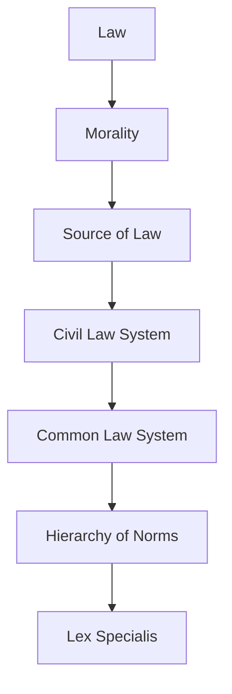

# Ubiquitous Language: Week 04: Contract Law II - Rescission And Revocation

Source note: `week-04-contract-law-ii-rescission-revocation.md`
Course: Business Law
Definition sources: local topic note and raw material for term discovery; enriched with standard domain knowledge where the local note names a term without fully defining it.

This file is a standalone terminology and formula companion. It follows Matt Pocock style: canonical terms, aliases to avoid, relationships, example dialogue, and flagged ambiguities.

## Legal System Language

| Term | Definition | Aliases to avoid |
|---|---|---|
| **Law** | Binding rules created or recognized by a legal system and enforceable through legal institutions. | morality, fairness, social rule |
| **Morality** | Social or ethical judgment about right and wrong that may influence law but is not automatically legally enforceable. | law, legal duty |
| **Source of Law** | An origin from which a legal rule gets authority, such as legislation, EU law, or case law. | reading source, citation |
| **Civil Law System** | A legal system where codified statutes are the central source for legal reasoning. | private law, civil case |
| **Common Law System** | A legal system where judicial precedent has strong rule-making significance. | case example, informal law |
| **Hierarchy of Norms** | The ranking rule that higher legal norms prevail over lower conflicting norms. | importance ranking, topic hierarchy |
| **Lex Specialis** | The interpretive rule that a more specific legal rule prevails over a more general one covering the same issue. | higher norm, exception only |

## Private-Law Reasoning

| Term | Definition | Aliases to avoid |
|---|---|---|
| **Private Law** | Law governing relationships between legally equal private persons or organizations. | civil law system, personal preference |
| **Public Law** | Law governing state authority acting in a sovereign capacity toward individuals or firms. | government involved in any way |
| **Declaration of Intent** | A legally relevant expression of will aimed at producing legal consequences. | statement, communication only |
| **Legal Transaction** | An act, especially a declaration of intent, that creates, changes, or ends legal rights by party autonomy. | business transaction |
| **Condition and Consequence** | The statutory structure where facts satisfy legal requirements and trigger a legal result. | cause and effect only |

## Remedies and Defects

| Term | Definition | Aliases to avoid |
|---|---|---|
| **Rescission** | A legal mechanism that retroactively removes the effects of a declaration of intent because of a defect such as error, deceit, or duress. | revocation, withdrawal |
| **Revocation** | A remedy allowing a party to undo a contract because performance obligations were not properly fulfilled. | rescission |
| **Material Error** | A mistake relevant enough under the statute to justify rescission. | any regret |
| **Deceit** | Intentional misleading behavior that induces a declaration of intent. | mistake |
| **Duress** | Unlawful pressure that induces a declaration of intent. | hard bargaining |
| **Restitution** | The return or reversal of benefits received after a contract is undone. | damages |

## Statutory Anchors

| Section | Canonical function | Trigger facts | Exam use |
|---|---|---|---|
| **Section 119 I Alt. 1 BGB** | Rescission for error of content. | Declaror says what they intended to say but misunderstands its legal or factual meaning. | Use for meaning mistakes, not mere bad business judgment. |
| **Section 119 I Alt. 2 BGB** | Rescission for error of declaration. | Declaror uses the wrong sign, number, word, or clicks/types something unintended. | Use for typo or misstatement cases. |
| **Section 119 II BGB** | Rescission for error about essential characteristics. | Mistake concerns an essential attribute of a person or thing, such as authenticity of artwork. | Distinguish from motive errors; not every disappointed expectation qualifies. |
| **Section 120 BGB** | Rescission for error in transmission. | Messenger, system, or transmission channel changes the declaration. | Use when the problem occurs between sender and recipient. |
| **Section 123 BGB** | Rescission because of deceit or duress. | Intentional misleading behavior or unlawful pressure induces the declaration. | Use when another person's conduct caused the flawed declaration. |
| **Section 143 BGB** | Rescission must be declared to the correct addressee. | Party wants to avoid the legal transaction after discovering the defect. | Do not stop at the ground; check declaration. |
| **Sections 121 and 124 BGB** | Time limits for rescission. | Error cases require action without undue delay; deceit/duress has the longer statutory period. | Use to test whether rescission is still available. |
| **Section 144 BGB** | Confirmation excludes rescission. | Party confirms the transaction after knowing the defect. | Use as a final exclusion check. |
| **Section 142 I BGB** | Effect of valid rescission: void from the beginning. | Rescission ground, declaration, time limit, and no exclusion are satisfied. | State the ex tunc effect after completing the structure. |
| **Section 122 BGB** | Reliance damages in certain rescission cases. | Opponent reasonably relied on validity, especially in error-based rescission. | Mention as an effect, but not for deceit/duress cases. |
| **Section 323 BGB** | Revocation for non-performance or improper performance of a primary duty. | Valid reciprocal contract exists and performance fails after any required additional period. | Use for ordinary breach of main performance duty. |
| **Section 324 BGB** | Revocation for breach of ancillary duty. | Conduct breaches protective or loyalty duties and makes holding onto contract unreasonable. | Use when performance may be technically possible but trust/cooperation is broken. |
| **Section 326 V BGB** | Revocation when performance duty is excluded, especially impossibility. | Debtor need not perform under impossibility rules. | Use when no additional period is required because performance cannot be demanded. |
| **Sections 346-348 BGB** | Restitution effects after revocation. | Revocation is valid and received performances must be reversed. | Use to state legal consequences; do not confuse with damages. |
| **Section 349 BGB** | Revocation must be declared. | Creditor has a revocation reason and wants to exercise it. | Do not assume revocation happens automatically. |
| **Section 325 BGB** | Damages can coexist with revocation. | Revocation occurs but remaining loss still needs compensation. | Use to avoid the trap that revocation excludes damages. |

## Relationships

- **Law** should be distinguished from **Morality** when writing exam answers.
- **Morality** should be distinguished from **Source of Law** when writing exam answers.
- **Source of Law** should be distinguished from **Civil Law System** when writing exam answers.
- **Civil Law System** should be distinguished from **Common Law System** when writing exam answers.
- **Common Law System** should be distinguished from **Hierarchy of Norms** when writing exam answers.
- **Hierarchy of Norms** should be distinguished from **Lex Specialis** when writing exam answers.
- A strong answer defines the canonical term, applies the rule or formula, and states the managerial, legal, or analytical implication.

## Visual Memory Aid



## Example Dialogue

> **Student:** "I see **Law** and **Morality** in the note. Are they interchangeable?"
>
> **Professor:** "No. Use **Law** for its precise technical meaning, and use **Morality** only when the facts match that definition."
>
> **Student:** "So in an exam answer I should name the exact term first?"
>
> **Professor:** "Yes. Name the canonical term, apply the decision rule or mechanism, then state the implication."

## Flagged Ambiguities

- Do not use broad labels like "concept", "factor", or "thing" when a canonical term above fits.
- Do not use aliases listed in the tables unless you are explicitly explaining why they are misleading.
- If a formula symbol appears, define its unit, timing, and decision role before calculating.
- If a legal, theoretical, or framework term has a common everyday meaning, use the technical course meaning in exam answers.

## Exam Trap Corrections

| Trap | Correction |
|---|---|
| Naming a term without applying it. | Define it briefly, then apply it to the facts, formula, or decision. |
| Treating examples as definitions. | Use examples only after the canonical definition is clear. |
| Mixing related terms. | State the boundary between the terms before comparing them. |
| Copying a formula without variable meaning. | Define each variable and unit before substitution. |

## Cheat-Sheet Language

```text
Identify the legal issue, state the rule, apply facts to rule elements, and conclude.
For every technical term: define it, identify when it applies, and state the common confusion to avoid.
```
