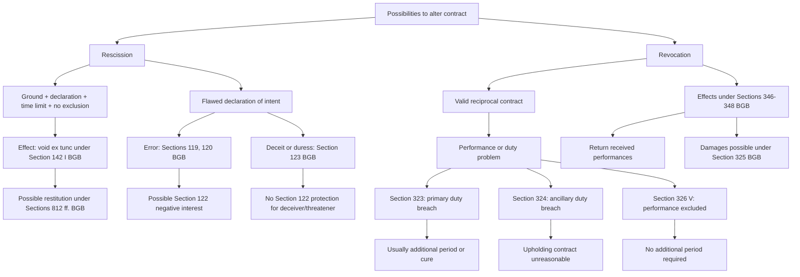

# Week 04: Contract Law II - Rescission And Revocation

Source: `business-law/raw/Week 4 - Contract Law II.pdf`
Course: Business Law
Processed: 2026-05-14
Wiki note: `business-law/wiki/week-04-contract-law-ii-rescission-revocation/week-04-contract-law-ii-rescission-revocation.md`

Course direction checked against `business-law/wiki/_course-logistics.md`: this is Session 4, Contract Law II. It builds directly on Week 3's declaration-of-intent framework.

## 80/20 Exam Summary

This deck introduces two ways to alter or undo a contract:

- Rescission attacks a flawed declaration of intent and can make it void from the beginning, ex tunc.
- Revocation responds to performance problems in a valid reciprocal contract and creates restitution duties.
- Rescission requires a ground, declaration, time limit, no exclusion, and effects under Section 142 I BGB.
- Important rescission grounds are errors under Sections 119, 120 BGB and deceit/duress under Section 123 BGB.
- Revocation under Sections 323-326 BGB depends on the type of breach: primary performance duty, ancillary duty, or excluded performance.
- Revocation effects are governed mainly by Sections 346-348 BGB: received performances must be returned.
- The biggest exam distinction is rescission vs revocation: flawed intent at formation versus later performance/contract problems.

## Core Concepts

## Relationship To Contract Law I

Contract Law I and Contract Law II belong to the same contract lifecycle, but they answer different legal questions.

```text
Contract Law I: Did a valid contract arise?
Contract Law II: Can a party attack or unwind the legal situation?
```

Contract Law I evaluates formation and validity: offer, acceptance, effectiveness, interpretation, form, statutory prohibitions, public policy, and standard terms. Contract Law II assumes there is a legal situation to attack or unwind and asks which exit route applies.

| Stage | Main question | Typical issue | Legal route |
|---|---|---|---|
| Formation | Did offer and acceptance match? | Product display, online checkout, late or modified acceptance | Contract Law I |
| Validity | Is the formed transaction void or a clause ineffective? | Missing form, illegality, usury, invalid standard term | Contract Law I |
| Defective declaration | Was a party's declaration flawed at formation? | Typo, misunderstanding, deception, threat, transmission error | Contract Law II: rescission |
| Performance failure | Was there a valid contract but performance went wrong? | Non-delivery, non-payment, impossible performance, serious ancillary-duty breach | Contract Law II: revocation |

Memory:

```text
Contract Law I builds the house.
Rescission attacks a defective foundation stone.
Revocation returns the furniture after the valid house cannot be used as promised.
```

## Rescission

### Function

Contracts are generally valid and binding under pacta sunt servanda. Rescission is an exception that protects a person whose declaration of intent was flawed.

Rescission aims to eradicate the declaration of intent. It is not a claim; it is a right to alter the legal situation.

### Case Structure

Use this structure:

1. Ground for rescission and causality for the issued declaration of intent.
2. Declaration of rescission under Section 143 I BGB.
3. Time limit under Section 121 I or Section 124 I BGB.
4. No exclusion, especially confirmation under Section 144 I BGB.
5. Effects under Section 142 I BGB.

### Error Grounds

Error means unconscious divergence between what is objectively declared and what is subjectively desired.

Important grounds:

- Section 119 I Alt. 1 BGB: error of content. The declaror says what they intend but misunderstands its meaning.
- Section 119 I Alt. 2 BGB: error of declaration. The declaror uses a different sign than intended, such as typing the wrong number.
- Section 119 II BGB: error about characteristics. The declaror is mistaken about an essential attribute of a person or thing.
- Section 120 BGB: error in transmission.

Example: believing "dozen" means 6 when it legally/commonly means 12 is an error of content. Typing 1000 instead of 100 is an error of declaration.

### Deceit And Duress

Section 123 I Alt. 1 BGB: deceit.

Deception is intentional creation or maintenance of an error about facts. Fraudulent intent can include conditional intent.

Section 123 I Alt. 2 BGB: duress.

Duress involves the prospect of a future evil that the threatening party claims to influence. It is unlawful if the threatened evil, desired success, or relation between both is unlawful.

Difference from Section 119:

- The type of error is less important.
- The error must be caused by deceit or duress.
- There is a double causality requirement: the deceit/duress causes the error, and the error causes the declaration of intent.

### Declaration Of Rescission

The declaration of rescission is itself a declaration of intent.

Requirements:

- declared to the right addressee, generally the contracting partner under Section 143 II BGB
- no specific form or legal wording
- layperson declarations are interpreted broadly under Sections 133 and 157 BGB

### Time Limits

Time starts when the entitled person becomes aware of the ground for rescission.

- Sections 119, 120 BGB: without undue delay under Section 121 BGB.
- Section 123 BGB: within one year under Section 124 I BGB.
- Maximum period: 10 years.

### Exclusion

Rescission is excluded if the voidable transaction is confirmed under Section 144 BGB.

### Effects

Section 142 I BGB: rescission makes the declaration void from the beginning, ex tunc.

If a required declaration of intent disappears, the contract cannot stand on that declaration.

Possible follow-up:

- restitution under Sections 812 ff. BGB
- damages under Section 122 BGB in some cases

Section 122 BGB protects the opponent's trust in validity, but not in cases of Section 123 BGB. It covers negative interest: the position the opponent would have been in without relying on the declaration.

### Picasso Case

Facts: buyer and seller agree on a painting attributed to Picasso. Later it turns out to be by a student. Neither side knew.

Likely route:

- Section 123 BGB fails because the seller did not deceive.
- Section 119 II BGB may apply because painter/authorship is an essential characteristic of the artwork.
- If rescission is properly declared, the purchase agreement becomes void and restitution follows.

## Revocation

### Function

Revocation is a right to alter a valid reciprocal contract because performance has failed, ancillary duties were breached, or performance is excluded.

Legal bases:

- Section 323 I BGB: non-performance or improper performance of a primary duty.
- Section 324 BGB: breach of ancillary duty under Section 241 II BGB.
- Section 326 V BGB: duty of performance is excluded, especially under Section 275 BGB.

Consequences:

- Sections 346-348 BGB.

### Revocation Under Section 323 BGB

Requirements:

- reciprocal contract
- due and enforceable obligation to perform
- non-performance or improper performance
- additional period for performance or cure
- no need for additional period if an exception applies

Reciprocal contract means performance and consideration are linked: "I give, you give." Examples are purchase agreements and works contracts.

Additional period is the debtor's second chance. It can be dispensable under Section 323 II BGB, for example:

- serious and definitive refusal
- fixed date transaction
- special circumstances

### Machine Case

Facts: B must pay by December 1 for a machine already delivered. He fails to pay.

Likely analysis:

- purchase agreement is reciprocal
- B's payment obligation is due
- B did not perform
- additional period may be unnecessary because a concrete date was specified and commercial purchase rules may matter
- V can revoke under Section 323 I BGB

### Revocation Under Section 324 BGB

Requirements:

- reciprocal contract
- breach of duty under Section 241 II BGB
- obligee can no longer reasonably be expected to uphold the contract
- causal relation between breach and intolerability

Examples:

- damaging the creditor's belongings during performance
- insulting or injuring the creditor

### Revocation Under Section 326 V BGB

If the debtor does not have to perform under Section 275 I-III BGB, the creditor may revoke. No additional period is required.

### Exercising Revocation

Structure:

1. Reason for revocation under Sections 323-326 BGB.
2. Declaration of revocation under Section 349 BGB.
3. Effects under Sections 346-348 BGB.

### Effects Of Revocation

Revocation transforms the original obligations into restitution obligations.

Examples:

- seller returns purchase price
- buyer returns goods and emoluments
- restitution is concurrent under Section 348 BGB
- if return is impossible, compensation may be required under Section 346 II BGB

Revocation can be combined with damages under Section 325 BGB, but double compensation must not occur.

## Section Memory Map: Contract Law II

Contract Law II is the exit-route map. First choose rescission or revocation.

```text
Mistake or manipulation in declaration? -> Rescission.
Performance problem in valid reciprocal contract? -> Revocation.
```

### Rescission Route

```text
119 mistakes.
120 messenger misfires.
123 fraud or force.
143 declare it.
121 fast for mistakes.
124 one year for fraud/force.
144 confirmation kills it.
142 void from the start.
122 protects reliance.
```

| Case trigger | Section | Function | Consequence |
|---|---|---|---|
| Declaror says what they intended but misunderstands meaning | Section 119 I Alt. 1 BGB | Error of content | Rescission possible if causal and timely. |
| Declaror types, clicks, says, or signs the wrong thing | Section 119 I Alt. 2 BGB | Error of declaration | Rescission possible if causal and timely. |
| Mistake concerns essential attribute of person or thing | Section 119 II BGB | Error about essential characteristics | Rescission possible; distinguish from mere motive error. |
| Messenger, system, or transmission channel changes the declaration | Section 120 BGB | Transmission error | Rescission possible. |
| Other party deceives or unlawfully threatens | Section 123 BGB | Deceit or duress | Rescission possible with longer time limit; Section 122 reliance damages usually excluded for deceiver/threatener. |
| Party wants to exercise rescission | Section 143 BGB | Declaration of rescission | Rescission must be declared to correct addressee. |
| Error under Sections 119 or 120 | Section 121 BGB | Time limit | Rescind without undue delay. |
| Deceit or duress under Section 123 | Section 124 BGB | Time limit | Rescind within one year. |
| Party confirms after knowing the defect | Section 144 BGB | Exclusion | Rescission blocked. |
| Rescission is effective | Section 142 I BGB | Ex tunc voidness | Declaration/transaction is void from the beginning. |
| Opponent relied on error-based declaration | Section 122 BGB | Negative interest | Reliance damages possible in certain error cases. |

### Revocation Route

```text
323 main duty fails.
324 side duty breaks trust.
326 V performance impossible.
349 declare revocation.
346-348 return everything.
325 damages can remain.
```

| Case trigger | Section | Function | Consequence |
|---|---|---|---|
| Seller does not deliver, buyer does not pay, or performance is improper | Section 323 BGB | Primary performance breach | Revocation possible, usually after additional period or cure opportunity. |
| Protective/cooperation duty is seriously breached | Section 324 BGB | Ancillary duty breach | Revocation possible if upholding the contract is unreasonable. |
| Performance duty is excluded, especially impossible | Section 326 V BGB | Impossibility/excluded performance | Revocation possible without additional period. |
| Party wants to exercise revocation | Section 349 BGB | Declaration of revocation | Revocation must be declared; it does not happen automatically. |
| Revocation is effective | Sections 346-348 BGB | Restitution | Received performances must be returned, generally concurrently. |
| Additional loss remains after revocation | Section 325 BGB | Damages alongside revocation | Damages may coexist, but no double compensation. |

### Full Contract Lifecycle Map

```text
1. Did contract form?
   -> Contract Law I: 130, 133/157, 145, 146, 148, 150 II.

2. Is contract invalid despite formation?
   -> Contract Law I: 125, 134, 138, 305 ff., 276 III.

3. Was a declaration defective at formation?
   -> Rescission: 119, 120, 123, 143, 121/124, 144, 142, 122.

4. Was the contract valid, but performance failed?
   -> Revocation: 323, 324, 326 V, 349, 346-348, 325.
```

## Visual Knowledge Map



## Subject Knowledge Graph

| Node | Meaning | Exam Relevance |
|---|---|---|
| Rescission | Right to eradicate flawed DoI | Major remedy for formation defects |
| Ground For Rescission | Error, deceit, duress, transmission issue | First case-solving step |
| Section 119 BGB | Error grounds | Distinguishes content/declaration/characteristic errors |
| Section 123 BGB | Deceit or duress | Different time limit and no Section 122 damages |
| Section 143 BGB | Declaration of rescission | Required exercise step |
| Section 142 BGB | Ex tunc voidness | Key consequence |
| Section 122 BGB | Negative interest damages | Protects reliance in some error cases |
| Revocation | Right to undo reciprocal contract due to performance problem | Major remedy after valid contract |
| Section 323 BGB | Non-performance/improper performance | Most important revocation ground |
| Section 324 BGB | Ancillary duty breach | Uses reasonableness/intolerability |
| Section 326 V BGB | Performance excluded | Revocation without additional period |
| Sections 346-348 BGB | Restitution after revocation | Key consequence |

| From | Relationship | To | Why It Matters |
|---|---|---|---|
| Rescission | attacks | Declaration of Intent | Focus is formation defect |
| Revocation | responds to | Performance Problem | Focus is valid contract after formation |
| Section 119 BGB | can trigger | Rescission | Error grounds |
| Section 123 BGB | can trigger | Rescission | Deceit/duress grounds |
| Rescission | causes | Ex Tunc Voidness | Contract treated as void from start |
| Revocation | causes | Restitution Obligations | Contract is unwound through return duties |
| Section 323 BGB | usually requires | Additional Period | Second chance principle |
| Section 324 BGB | requires | Unreasonableness Of Upholding Contract | Ancillary-duty route |
| Section 326 V BGB | depends on | Excluded Performance | No cure period required |

## Exam Relevance

Likely exam prompts:

- What are the requirements for effective rescission?
- Distinguish error of content, error of declaration, and error in characteristics.
- Explain deceit and duress under Section 123 BGB.
- What are the effects of rescission?
- What are the requirements for effective revocation?
- Compare consequences of rescission and revocation.

Common traps:

- Calling rescission a claim instead of a right.
- Forgetting causality between ground and declaration.
- Using the wrong time limit for Section 119 vs Section 123.
- Treating revocation as ex tunc like rescission.
- Forgetting the additional period under Section 323 BGB.
- Missing that revocation can combine with damages but not double compensation.

## Retrieval Prompts

1. State the five-step structure for rescission.
2. Distinguish the three main Section 119 error categories.
3. Why does Section 123 BGB differ from Section 119 BGB?
4. What does ex tunc mean for rescission?
5. What does Section 122 BGB compensate?
6. State the three major legal bases for revocation.
7. When is an additional period required under Section 323 BGB?
8. What are the effects of revocation under Sections 346-348 BGB?

## Practice Tasks

### Task 1: Wrong Painting

Buyer purchases a painting believed by both parties to be by a famous painter. It is later discovered to be by a student. Which rescission ground is most plausible?

Short answer guide: Section 119 II BGB, error about an essential characteristic of the item. Section 123 BGB fails if the seller did not deceive.

### Task 2: Late Payment

Buyer does not pay by the agreed date in a purchase agreement. Seller wants out. Which route?

Short answer guide: revocation under Section 323 BGB, subject to due performance, breach, and additional period or exception.

### Task 3: Rescission vs Revocation

Explain the difference in one sentence.

Short answer guide: rescission attacks flawed formation/declaration and works ex tunc; revocation responds to problems in a valid contract and creates restitution duties.

## Connections

Previous notes:

- `week-03-contract-law-i/week-03-contract-law-i.md`: declaration of intent, offer/acceptance, interpretation.
- `week-01-02-introduction-to-business-law/week-01-02-introduction-to-business-law.md`: statutory if-then analysis and interpretation.

Future links:

- Contract Law III adds withdrawal, cancellation, and dissolution to the termination decision tree.

## Weakness Flags

- Pending active-recall session.

## Open Uncertainties

- The deck uses "revocation" for Rücktritt-like termination from reciprocal contracts. Keep it separate from consumer withdrawal in Week 5, which is also sometimes translated differently in English.
