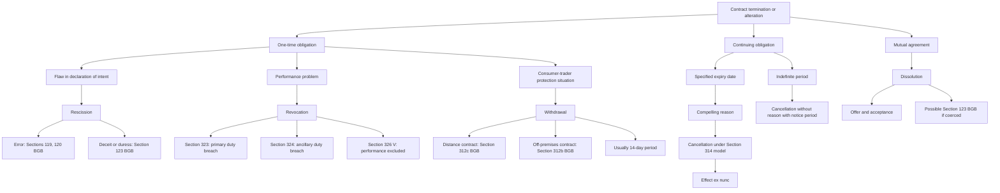

# Week 05: Contract Law III - Withdrawal, Cancellation, And Dissolution

Source: `business-law/raw/Week 5 - Contract Law III.pdf`
Course: Business Law
Processed: 2026-05-14
Wiki note: `business-law/wiki/week-05-contract-law-iii-withdrawal-cancellation-dissolution.md`

Course direction checked against `business-law/wiki/_course-logistics.md`: this is Session 5, Contract Law III, completing the initial contract termination block.

## 80/20 Exam Summary

This deck completes the contract-termination map:

- Withdrawal protects consumers in specific situations, especially distance selling and off-premises contracts.
- Withdrawal usually requires consumer-trader relationship, statutory withdrawal right, declaration, time compliance, and restitution.
- Cancellation applies to continuing obligations and usually works only for the future, ex nunc.
- Extraordinary cancellation under Section 314 BGB requires a compelling reason and is a last resort.
- Dissolution is consensual termination by agreement, not a unilateral right.
- The exam-critical skill is choosing the correct termination route: rescission, revocation, withdrawal, cancellation, or dissolution.

## Withdrawal

### Function

Withdrawal is a right to alter the contract without a specific defect or performance breach.

It is rooted in EU consumer-protection law and applies mainly between:

- consumer under Section 13 BGB
- trader under Section 14 BGB

The policy reason is consumer protection in situations with:

- high financial risk
- structural disadvantage
- information deficit
- surprise effect
- inability to inspect goods before contracting

### Important Situations

The deck highlights statutory withdrawal rights for:

- off-premises contracts
- distance selling contracts
- timeshare and holiday product contracts
- consumer credit agreements
- delivery by instalments
- free loan and financial assistance
- consumer building contracts

The most important for standard exam scenarios are distance selling and off-premises contracts.

### Distance Contracts

Section 312c BGB covers contracts negotiated and concluded exclusively through means of distance communication, without simultaneous physical presence, in an organized distance-sales or service scheme.

Examples of distance communication:

- letters
- catalogues
- phone calls
- fax
- email
- SMS
- digital services

Core rationale: the consumer cannot inspect what they buy in person.

### Off-Premises Contracts

Section 312b BGB covers contracts concluded away from the trader's business premises or in closely related surprise situations.

Core rationale: the consumer is approached in a context where they do not expect legally binding transactions and may face pressure or surprise.

### Structure For Solving Withdrawal Cases

Use this structure:

1. Right of withdrawal under Sections 355, 312b or 312c BGB.
2. Declaration of withdrawal under Section 355 I, II BGB.
3. Effects and restitution under Sections 355 III and 357 BGB.

### Right Of Withdrawal

Check:

- personal scope: consumer and trader
- material scope: statutory withdrawal right
- no exclusion under Section 312g II BGB

Examples of exclusions:

- custom-made goods
- quickly perishable goods

### Declaration And Time

Declaration:

- no specific form
- made to the trader
- decision to withdraw must be clear
- no justification required

Timing:

- generally 14 days with proper instruction
- period can depend on conclusion of contract and receipt of goods
- if proper instruction is missing, period may extend by one year

### Effects

Withdrawal means the consumer's declaration of intent no longer binds the consumer.

Effects:

- original contract no longer binding
- received performances are returned
- consumer may bear shipping costs under Section 357 V BGB
- consumer may owe compensation for deterioration beyond what was necessary to inspect goods

Key distinction: the consumer-protection restitution system is less strict than ordinary Sections 346 ff. BGB revocation rules.

## Cancellation

### Function

Cancellation is termination for continuing obligations.

Examples:

- rental agreement
- service agreement
- employment agreement
- loan agreement
- civil partnership

Cancellation operates for the future only, ex nunc. Sections 346-348 BGB are not suitable because continuing obligations cannot usually be unwound retrospectively.

### Special Provisions And Section 314 BGB

Many continuing obligations have special cancellation rules:

- rental agreements
- employment agreements
- service agreements
- partnerships
- consumer contracts for digital products

Section 314 BGB provides a basic model for extraordinary termination of continuing obligations, but it is subordinate to special provisions.

### Section 314 BGB Structure

Use this structure:

1. Compelling reason.
2. Expiry of period for relief or warning notice without result.
3. Declaration of cancellation within reasonable period.
4. Effects: termination ex nunc without notice period.

### Compelling Reason

A compelling reason exists if, considering all circumstances and weighing both parties' interests, the cancelling party cannot reasonably be expected to continue the relationship until the agreed end or notice period.

Relevant factors:

- type of contract
- gravity of breach
- past history of the parties
- culpability, not required but relevant
- mutual trust
- whether cancellation is ultima ratio

For fixed-term continuing obligations, a reason is necessary. For indefinite obligations, ordinary cancellation without reason may be possible with a notice period.

### Warning Or Period For Relief

If the compelling reason is a breach of duty, a second chance is generally needed:

- period for relief
- warning notice

This can be dispensable in situations similar to Section 323 II BGB, especially serious refusal or special circumstances.

### Timing And Effects

Cancellation must be declared within a reasonable period after knowledge of the reason.

Effects:

- extraordinary cancellation ends the contract immediately
- ordinary cancellation ends after the notice period
- contract remains effective for the past
- no restitution of exchanged performances
- damages can be combined under Section 314 IV BGB

### Loan Startup Case

Facts: investor funds startup with co-decision rights. Founder excludes investor, insults him publicly, and attacks his rights.

Analysis:

- loan agreement is a continuing obligation
- Section 314 BGB may apply if no special provision controls
- grave public lies and insults breach duties under Section 241 II BGB
- mutual trust is central to startup financing
- warning may be dispensable due to gravity and trust breakdown
- cancellation ex nunc possible

## Dissolution

Dissolution is agreement to terminate a contract.

It follows private autonomy:

- freedom to conclude contracts
- freedom to dissolve contracts consensually

It is not a unilateral right to alter a contract. It requires agreement, usually through offer and acceptance.

Common use:

- rental agreements
- employment agreements
- situations where unilateral cancellation is hard because statutory protection is strong

Employment example:

- cancellation may be difficult
- parties may agree on dissolution with incentives such as severance pay, paid leave, or non-competition clauses

Risk: if dissolution is induced by unlawful duress or deceit, rescission under Section 123 BGB may become relevant.

## Termination Decision Tree

The deck's final decision tree is highly exam-relevant. The key question is: what kind of contract and what kind of reason?

- One-time obligation with error in declaration of intent: rescission.
- One-time obligation with performance breach or impossibility: revocation.
- Consumer-trader distance/off-premises situation: withdrawal.
- Continuing obligation with specified expiry and compelling reason: cancellation under Section 314 model or special provisions.
- Continuing obligation for indefinite period: ordinary cancellation may be available.
- Parties mutually agree to end contract: dissolution.

## Visual Knowledge Map

## Subject Knowledge Graph

| Node | Meaning | Exam Relevance |
|---|---|---|
| Withdrawal | Consumer right to exit certain contracts | Key consumer-protection remedy |
| Consumer | Section 13 BGB party | Personal scope requirement |
| Trader | Section 14 BGB party | Personal scope requirement |
| Distance Contract | Contract concluded via distance communication | Major withdrawal scenario |
| Off-Premises Contract | Contract concluded outside business premises/surprise context | Major withdrawal scenario |
| Section 312g II BGB | Exclusions from withdrawal | Prevents overuse of withdrawal |
| Cancellation | Termination of continuing obligation | Core continuing-contract remedy |
| Continuing Obligation | Ongoing contractual relationship | Determines cancellation route |
| Section 314 BGB | Model for extraordinary cancellation | Main structure in deck |
| Compelling Reason | Reason making continuation unreasonable | Central cancellation requirement |
| Ex Nunc | Effect only for the future | Distinguishes cancellation from rescission |
| Dissolution | Consensual termination agreement | Private-autonomy route |

| From | Relationship | To | Why It Matters |
|---|---|---|---|
| Withdrawal | protects | Consumer | Policy basis |
| Withdrawal | applies to | Distance and Off-Premises Contracts | Main exam scenarios |
| Trader | must provide | Withdrawal Information | Affects timing |
| Missing Instruction | extends | Withdrawal Period | Important time-limit issue |
| Cancellation | applies to | Continuing Obligations | Determines remedy type |
| Section 314 BGB | requires | Compelling Reason | Main case-solving element |
| Compelling Reason | is evaluated by | Interest Weighing | Fact-sensitive exam issue |
| Cancellation | works | Ex Nunc | No retrospective unwinding |
| Dissolution | requires | Agreement | Not unilateral |
| Duress | can undermine | Dissolution | Links back to rescission |

## Exam Relevance

Likely exam prompts:

- Compare withdrawal and revocation.
- State the requirements for withdrawal.
- Explain distance selling and off-premises contracts.
- Explain cancellation for continuing obligations under Section 314 BGB.
- What can be considered when arguing compelling reason?
- Distinguish cancellation and dissolution.
- Choose the correct termination route from a fact pattern.

Common traps:

- Confusing withdrawal with revocation.
- Forgetting consumer-trader personal scope for withdrawal.
- Treating all online contracts as withdrawal cases without checking exclusions.
- Applying retrospective restitution logic to cancellation.
- Forgetting that Section 314 BGB is often subordinate to special provisions.
- Treating dissolution as unilateral.

## Retrieval Prompts

1. What policy problem does withdrawal solve?
2. What are the personal and material scopes of withdrawal?
3. Distinguish distance contract and off-premises contract.
4. What must a withdrawal declaration contain?
5. Why is cancellation ex nunc?
6. State the four-step structure for Section 314 BGB cancellation.
7. What factors matter for compelling reason?
8. How is dissolution different from cancellation?
9. Recreate the termination decision tree from memory.

## Practice Tasks

### Task 1: Online Purchase

A consumer buys shoes from a trader's online shop and receives them at home. Which termination route may be relevant if the consumer simply changes their mind?

Short answer guide: withdrawal, because this is likely a distance contract between consumer and trader, subject to timing and exclusions.

### Task 2: Startup Loan Breakdown

A founder publicly insults the investor and excludes him from agreed co-decision rights. Which route?

Short answer guide: cancellation of a continuing obligation under Section 314 BGB may be possible if the breach destroys trust and continuation is unreasonable.

### Task 3: Employment Exit Agreement

Employer and employee agree to end employment in exchange for severance. Is this cancellation or dissolution?

Short answer guide: dissolution, because termination is consensual. If pressure was unlawful, Section 123 BGB may become relevant.

## Connections

Previous notes:

- `week-03-contract-law-i.md`: private autonomy, offer and acceptance.
- `week-04-contract-law-ii-rescission-revocation.md`: rescission and revocation routes.

Future links:

- Standard Business Terms will deepen consumer protection and limits on autonomy.
- Warranty Rights will connect revocation and buyer remedies under Section 437 BGB.

## Weakness Flags

- Pending active-recall session.

## Open Uncertainties

- The deck uses English labels that can overlap with other translations. Keep the functional distinctions clear: rescission = flawed DoI/formation; revocation = performance issue in reciprocal contract; withdrawal = consumer-protection exit; cancellation = continuing obligation; dissolution = agreement.

