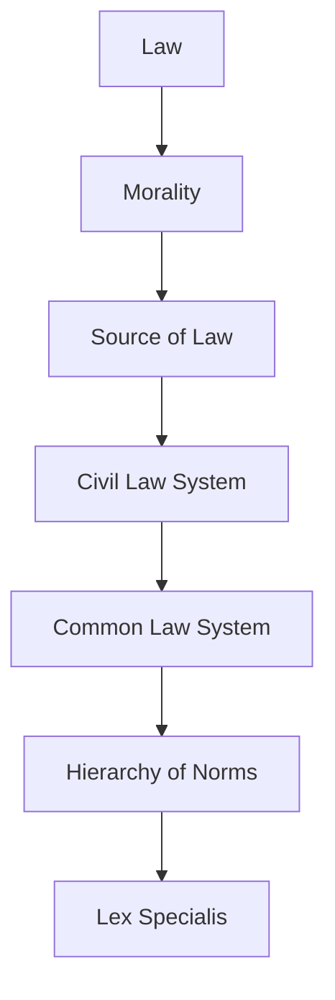

# Ubiquitous Language: Week 05: Contract Law III - Withdrawal, Cancellation, And Dissolution

Source note: `week-05-contract-law-iii-withdrawal-cancellation-dissolution.md`
Course: Business Law
Definition sources: local topic note and raw material for term discovery; enriched with standard domain knowledge where the local note names a term without fully defining it.

This file is a standalone terminology and formula companion. It follows Matt Pocock style: canonical terms, aliases to avoid, relationships, example dialogue, and flagged ambiguities.

## Legal System Language

| Term | Definition | Aliases to avoid |
|---|---|---|
| **Law** | Binding rules created or recognized by a legal system and enforceable through legal institutions. | morality, fairness, social rule |
| **Morality** | Social or ethical judgment about right and wrong that may influence law but is not automatically legally enforceable. | law, legal duty |
| **Source of Law** | An origin from which a legal rule gets authority, such as legislation, EU law, or case law. | reading source, citation |
| **Civil Law System** | A legal system where codified statutes are the central source for legal reasoning. | private law, civil case |
| **Common Law System** | A legal system where judicial precedent has strong rule-making significance. | case example, informal law |
| **Hierarchy of Norms** | The ranking rule that higher legal norms prevail over lower conflicting norms. | importance ranking, topic hierarchy |
| **Lex Specialis** | The interpretive rule that a more specific legal rule prevails over a more general one covering the same issue. | higher norm, exception only |

## Private-Law Reasoning

| Term | Definition | Aliases to avoid |
|---|---|---|
| **Private Law** | Law governing relationships between legally equal private persons or organizations. | civil law system, personal preference |
| **Public Law** | Law governing state authority acting in a sovereign capacity toward individuals or firms. | government involved in any way |
| **Declaration of Intent** | A legally relevant expression of will aimed at producing legal consequences. | statement, communication only |
| **Legal Transaction** | An act, especially a declaration of intent, that creates, changes, or ends legal rights by party autonomy. | business transaction |
| **Condition and Consequence** | The statutory structure where facts satisfy legal requirements and trigger a legal result. | cause and effect only |

## Ending Contracts

| Term | Definition | Aliases to avoid |
|---|---|---|
| **Withdrawal** | A statutory right, often consumer-protective, allowing a party to escape a contract without proving defective performance. | rescission, cancellation |
| **Cancellation** | Ending a continuing contractual relationship for the future, especially where continuation cannot reasonably be expected. | rescission |
| **Dissolution** | The ending or winding up of a legal relationship or contract structure. | withdrawal |
| **Distance Contract** | A contract concluded exclusively through distance communication within an organized distance-sales system. | online contract always |
| **Off-Premises Contract** | A contract concluded outside the trader business premises or in a surprise situation covered by consumer law. | distance contract |
| **Compelling Reason** | A serious reason that makes continued contractual relationship unreasonable after considering both parties interests. | minor breach |

## Statutory Anchors

| Section | Canonical function | Trigger facts | Exam use |
|---|---|---|---|
| **Section 13 BGB** | Defines consumer status. | Natural person acts mainly outside trade, business, or profession. | Start consumer-withdrawal analysis with personal scope. |
| **Section 14 BGB** | Defines trader status. | Person or entity acts in commercial or professional capacity. | Pair with Section 13 BGB before applying consumer-protection rules. |
| **Section 312b BGB** | Off-premises contract. | Contract is concluded away from trader premises or in a surprise-like consumer situation. | Use to trigger withdrawal rights for door-to-door or similar scenarios. |
| **Section 312c BGB** | Distance contract. | Contract is negotiated and concluded exclusively through distance communication in an organized distance-sales system. | Use for online, phone, or email sales where no simultaneous physical presence exists. |
| **Section 312g II BGB** | Exclusions from withdrawal. | Goods or services fall into a statutory exclusion, such as certain customized or perishable items. | Always check after finding a withdrawal trigger. |
| **Section 355 BGB** | Withdrawal declaration, period, and basic effect. | Consumer wants to withdraw from a qualifying consumer contract. | Use as the central withdrawal anchor; no defect in performance is required. |
| **Section 357 BGB** | Restitution consequences after withdrawal. | Withdrawal has been validly exercised. | Use for return, reimbursement, and cost-allocation consequences. |
| **Sections 346-348 BGB** | Ordinary restitution after revocation. | A performance-breach revocation, not consumer withdrawal, has occurred. | Mention mainly to contrast with the consumer-withdrawal restitution system. |
| **Section 314 BGB** | Extraordinary cancellation of continuing obligations for compelling reason. | Continuing contractual relationship cannot reasonably be maintained. | Use for gym, lease-like, service, or ongoing cooperation cases when special rules do not control. |
| **Section 241 II BGB** | Ancillary duties of protection, consideration, and loyalty. | Party conduct damages trust or cooperation rather than merely missing main performance. | Use to explain why conduct can create a compelling reason for cancellation. |
| **Section 123 BGB** | Rescission risk if dissolution was induced by deceit or duress. | Agreement to end the contract was coerced or fraudulently induced. | Use only when the dissolution itself is attacked. |

## Relationships

- **Law** should be distinguished from **Morality** when writing exam answers.
- **Morality** should be distinguished from **Source of Law** when writing exam answers.
- **Source of Law** should be distinguished from **Civil Law System** when writing exam answers.
- **Civil Law System** should be distinguished from **Common Law System** when writing exam answers.
- **Common Law System** should be distinguished from **Hierarchy of Norms** when writing exam answers.
- **Hierarchy of Norms** should be distinguished from **Lex Specialis** when writing exam answers.
- A strong answer defines the canonical term, applies the rule or formula, and states the managerial, legal, or analytical implication.

## Visual Memory Aid



## Example Dialogue

> **Student:** "I see **Law** and **Morality** in the note. Are they interchangeable?"
>
> **Professor:** "No. Use **Law** for its precise technical meaning, and use **Morality** only when the facts match that definition."
>
> **Student:** "So in an exam answer I should name the exact term first?"
>
> **Professor:** "Yes. Name the canonical term, apply the decision rule or mechanism, then state the implication."

## Flagged Ambiguities

- Do not use broad labels like "concept", "factor", or "thing" when a canonical term above fits.
- Do not use aliases listed in the tables unless you are explicitly explaining why they are misleading.
- If a formula symbol appears, define its unit, timing, and decision role before calculating.
- If a legal, theoretical, or framework term has a common everyday meaning, use the technical course meaning in exam answers.

## Exam Trap Corrections

| Trap | Correction |
|---|---|
| Naming a term without applying it. | Define it briefly, then apply it to the facts, formula, or decision. |
| Treating examples as definitions. | Use examples only after the canonical definition is clear. |
| Mixing related terms. | State the boundary between the terms before comparing them. |
| Copying a formula without variable meaning. | Define each variable and unit before substitution. |

## Cheat-Sheet Language

```text
Identify the legal issue, state the rule, apply facts to rule elements, and conclude.
For every technical term: define it, identify when it applies, and state the common confusion to avoid.
```
