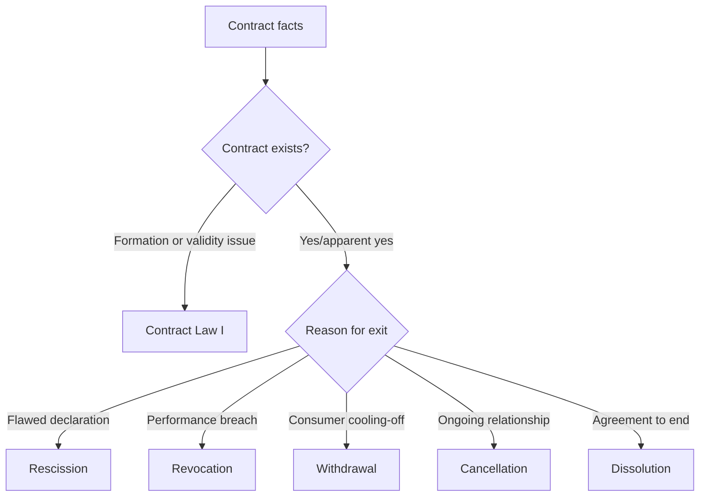

# Ubiquitous Language: Week 05 Contract Law III

Source note: `week-05-contract-law-iii-withdrawal-cancellation-dissolution.md`
Continuity bridge: `contract-law-iii-continuity-bridge.md`
Course: Business Law
Definition sources: local topic note and raw material for term discovery; enriched with standard German private-law terminology where the note names a concept without fully defining the boundary.

This file is the terminology and statutory-anchor companion for Contract Law III. It should be used together with the continuity bridge before the first active-recall session.

## Contract Lifecycle Router

| Term | Definition | Aliases to avoid |
|---|---|---|
| **Formation Problem** | A Contract Law I issue about whether offer, acceptance, receipt, interpretation, or validity produced a contract. | termination problem |
| **Rescission Problem** | A Contract Law II issue where a declaration of intent is attacked because it was flawed at formation through mistake, transmission error, deceit, or duress. | withdrawal, revocation |
| **Revocation Problem** | A Contract Law II issue where a valid reciprocal contract is unwound because performance failed, performance was defective, an ancillary duty was breached, or performance became impossible. | rescission, cancellation |
| **Withdrawal Problem** | A Contract Law III issue where a consumer exits a protected contract, usually distance or off-premises, without needing to prove defect or breach. | revocation, cancellation |
| **Cancellation Problem** | A Contract Law III issue where an ongoing contractual relationship is terminated for the future, often because continuation is unreasonable. | rescission, revocation |
| **Dissolution Problem** | A Contract Law III issue where both parties agree to end the legal relationship. | cancellation, unilateral termination |

## Withdrawal Language

| Term | Definition | Aliases to avoid |
|---|---|---|
| **Withdrawal** | A statutory consumer-protection right to escape certain contracts without proving a defect, breach, mistake, deceit, or duress. | rescission, revocation |
| **Consumer** | A natural person acting mainly outside trade, business, or profession. | buyer always, customer always |
| **Trader** | A person or entity acting in commercial or professional capacity. | seller always |
| **Distance Contract** | A consumer-trader contract negotiated and concluded exclusively through distance communication in an organized distance-sales or service scheme. | any online contact |
| **Off-Premises Contract** | A consumer-trader contract concluded away from the trader's business premises or in a closely related surprise situation. | distance contract |
| **Withdrawal Declaration** | The consumer's clear statement that they want to withdraw; no legal wording or justification is required. | complaint, warranty claim |
| **Clear Withdrawal Decision** | The practical standard for Section 355 BGB: the consumer must make clear that they want to undo the contract, but does not need to say "withdrawal" or give reasons. | formal rescission statement |
| **Withdrawal Period** | The time window for exercising withdrawal, usually 14 days when proper instruction was provided. | limitation period generally |
| **Withdrawal Exclusion** | A statutory reason why withdrawal is unavailable despite consumer-trader context, such as custom-made or quickly perishable goods. | trader preference |

## Cancellation And Dissolution Language

| Term | Definition | Aliases to avoid |
|---|---|---|
| **Continuing Obligation** | A contract relationship designed to last over time, such as rent, employment, service, loan, gym, or ongoing cooperation. | one-time sale |
| **Cancellation** | Termination of a continuing obligation for the future. Ordinary cancellation may use a notice period; extraordinary cancellation needs a compelling reason. | withdrawal, revocation |
| **Ordinary Cancellation** | Cancellation that ends an indefinite continuing obligation after a notice period and usually does not require a special reason. | rescission |
| **Extraordinary Cancellation** | Immediate or no-notice cancellation of a continuing obligation when continuation is unreasonable. | ordinary cancellation |
| **Compelling Reason** | A serious reason that makes it unreasonable to continue the relationship after considering both parties' interests. | inconvenience, minor dissatisfaction |
| **Warning Notice** | A prior warning used when the compelling reason is a breach of duty and the debtor should normally get a chance to correct behavior. | declaration of withdrawal |
| **Period for Relief** | A final chance to cure or stop the problematic conduct before extraordinary cancellation. | notice period |
| **Ex Nunc** | Legal effect only for the future; past performances generally remain legally valid. | ex tunc |
| **Dissolution** | Consensual ending of a contract or legal relationship by agreement. It depends on offer and acceptance. | unilateral right |

## Statutory Anchors

| Section | Canonical function | Trigger facts | Exam use |
|---|---|---|---|
| **Section 13 BGB** | Defines consumer. | Natural person acts mainly outside business or profession. | First personal-scope check for withdrawal. |
| **Section 14 BGB** | Defines trader. | Party acts in commercial or professional capacity. | Pair with Section 13 before consumer-protection rules. |
| **Section 312b BGB** | Off-premises contract. | Contract concluded outside trader premises or in surprise-like setting. | Use for door-to-door, event, street, or similar consumer pressure facts. |
| **Section 312c BGB** | Distance contract. | Contract negotiated and concluded exclusively by distance communication in an organized scheme. | Use for online, phone, email, or catalogue cases where no physical presence exists. |
| **Section 312g BGB** | Withdrawal right and exclusions in consumer contracts. | Consumer-trader distance/off-premises setup, with possible exclusions. | Check after Sections 312b/312c; do not forget exclusions under Section 312g II. |
| **Section 355 BGB** | Withdrawal declaration, timing, and basic effect. | Consumer wants to withdraw from a qualifying contract. | Central withdrawal anchor; no reason or defect required. |
| **Section 357 BGB** | Consequences of withdrawal. | Valid withdrawal has occurred. | State return/reimbursement and cost-allocation consequences. |
| **Sections 346-348 BGB** | Ordinary restitution after revocation. | Contract Law II revocation, not consumer withdrawal. | Use mainly as contrast: withdrawal has special consumer rules. |
| **Section 314 BGB** | Extraordinary cancellation of continuing obligations. | Ongoing relationship cannot reasonably continue. | Use for service, loan, cooperation, gym, or lease-like cases if special provisions do not control. |
| **Section 241 II BGB** | Ancillary duties of protection, loyalty, and consideration. | Conduct damages trust or cooperation rather than simply missing main performance. | Helps justify compelling reason for cancellation. |
| **Section 323 BGB** | Revocation for non-performance or defective performance. | Valid reciprocal contract plus failed primary duty. | Use to exclude cancellation when this is a one-time performance breach. |
| **Section 123 BGB** | Rescission for deceit or duress. | Dissolution agreement itself was induced by fraud or unlawful threat. | Use only to attack the agreement to dissolve, not as the normal dissolution route. |

## Relationships

- **Withdrawal** belongs to consumer protection; it does not require a defective declaration or defective performance.
- **Revocation Problem** and **Withdrawal Problem** can both lead to returns, but the trigger is different: breach versus consumer cooling-off.
- **Cancellation Problem** requires an ongoing relationship; use **Revocation Problem** for one-time reciprocal contracts with failed performance.
- **Dissolution Problem** is agreement-based; it is not a unilateral remedy.
- **Ex Nunc** is the cancellation memory word: the past stays valid, the future stops.

## Visual Memory Aid



## Example Dialogue

> **Student:** "The buyer bought headphones online and just dislikes the color. Is that revocation?"
>
> **Professor:** "No. There is no performance breach in the facts. If the buyer is a consumer and the seller is a trader, route it as **Withdrawal** under the distance-contract rules."
>
> **Student:** "So withdrawal is not about fault?"
>
> **Professor:** "Correct. It is a protected exit from a risky contracting situation. Fault and breach belong elsewhere."

## Flagged Ambiguities

| Ambiguity | Canonical recommendation |
|---|---|
| "Cancel" in everyday speech | Translate into the legal route: withdrawal, revocation, cancellation, or dissolution. Do not use "cancel" generically in exam answers. |
| Online purchase | Do not automatically say withdrawal. Check consumer, trader, organized distance-sales scheme, timing, and exclusions. |
| Ongoing service contract with breach | Start with cancellation if the relationship itself should end for the future; mention special provisions before Section 314 where relevant. |
| Mutual exit agreement | Use dissolution. Only bring in Section 123 BGB if the dissolution agreement was procured by deceit or duress. |

## Exam Trap Corrections

| Trap | Correction |
|---|---|
| Treating withdrawal as a defect remedy. | Withdrawal protects consumers in specific situations; no defect or breach is required. |
| Treating every online purchase as withdrawable. | Check consumer-trader scope, organized distance scheme, timing, and exclusions. |
| Rejecting a withdrawal because the consumer used ordinary words. | A phone call or everyday statement can work if the withdrawal decision is clear and timely. |
| Using cancellation for a one-time defective delivery. | Use revocation or later warranty routes for one-time performance failure. |
| Unwinding a continuing relationship retrospectively. | Cancellation is normally ex nunc; the past stays legally effective. |
| Calling dissolution unilateral. | Dissolution requires agreement through offer and acceptance. |

## Cheat-Sheet Language

```text
Contract Law III adds three exit routes.
Withdrawal = consumer cooling-off in protected situations.
Cancellation = ongoing relationship ends for the future.
Dissolution = both parties agree to end.
Always classify the trigger before naming the route.
```
