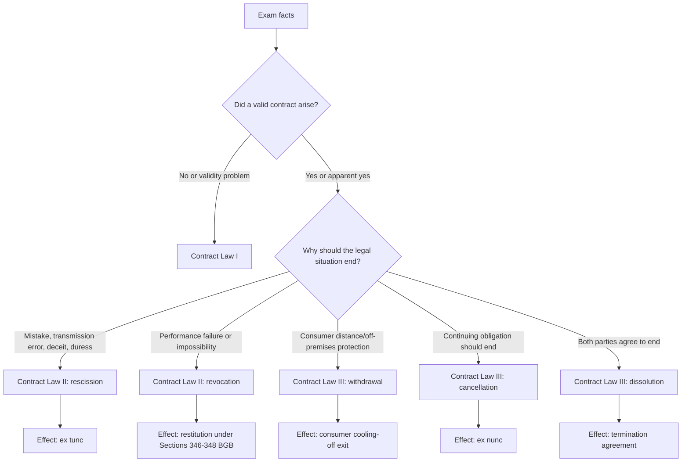

# Contract Law III Continuity Bridge

Source note: `week-05-contract-law-iii-withdrawal-cancellation-dissolution.md`
Related notes:

- `../week-03-contract-law-i/week-03-contract-law-i.md`
- `../week-04-contract-law-ii-rescission-revocation/week-04-contract-law-ii-rescission-revocation.md`

## Why This Bridge Exists

Contract Law III is not a new disconnected topic. It completes the first contract-law lifecycle.

```text
Contract Law I: Did a valid contract come into existence?
Contract Law II: Can one party attack or unwind it because something went wrong?
Contract Law III: Is there another exit route because consumer protection, an ongoing relationship, or agreement to end applies?
```

The exam skill is not memorizing five labels separately. The skill is routing the facts to the correct legal exit.

## The Contract Lifecycle

```text
1. Formation and validity
   -> Contract Law I

2. Defect in declaration of intent
   -> Contract Law II: rescission

3. Performance failure in a valid reciprocal contract
   -> Contract Law II: revocation

4. Consumer wants out of protected distance/off-premises deal
   -> Contract Law III: withdrawal

5. Ongoing contract relationship should end for the future
   -> Contract Law III: cancellation

6. Both parties agree to end
   -> Contract Law III: dissolution
```

## One Real-Life Story Through All Three Weeks

Imagine a student buys a laptop from a retailer.

| Fact pattern | Legal question | Route |
|---|---|---|
| The laptop is displayed in a shop window. | Was that already an offer? | Contract Law I: usually `invitatio ad offerendum`, not offer. |
| The student orders online and the retailer accepts. | Did offer and acceptance create a valid contract? | Contract Law I. |
| The student accidentally typed EUR 2,000 instead of EUR 200 in an order form. | Was the declaration defective at formation? | Contract Law II: rescission, likely error of declaration. |
| The retailer delivers a broken laptop. | Was there a performance breach after a valid contract? | Contract Law II: revocation or warranty route depending later material. |
| The laptop was bought from an online shop and the student simply changes their mind. | Is there a consumer-protection exit without defect? | Contract Law III: withdrawal. |
| The student has a monthly software-service contract and the provider repeatedly blocks access. | Is the relationship ongoing and no longer tolerable? | Contract Law III: cancellation. |
| Retailer and student agree to cancel a preorder by mutual consent. | Did both sides agree to end the contract? | Contract Law III: dissolution. |

## The Door, Exit, And Relationship Memory Model

```text
Contract Law I = door and lock
Did the legal relationship start, and was the door validly opened?

Contract Law II rescission = defective key
The declaration that opened the door was flawed, so the law may erase it from the beginning.

Contract Law II revocation = return desk
The door opened validly, but the promised performance failed, so the parties may return what they exchanged.

Contract Law III withdrawal = consumer cooling-off exit
The consumer gets a protected exit even without defect because the contracting situation was structurally risky.

Contract Law III cancellation = future stop button
The relationship is ongoing, and continuation is unreasonable or no longer wanted under notice rules.

Contract Law III dissolution = mutual handshake exit
No unilateral right is needed because both parties agree to end.
```

## Routing Table

| First question | If yes | Main route | Core statutory anchors |
|---|---|---|---|
| Did offer, acceptance, receipt, interpretation, or validity fail? | The issue is about whether the contract arose or is valid. | Contract Law I | Sections 130, 133, 157, 145-150, 125, 134, 138, 305 ff. BGB |
| Was a declaration defective because of mistake, transmission error, deceit, or duress? | The issue is flawed will at formation. | Rescission | Sections 119, 120, 123, 142, 143, 121, 124, 144 BGB |
| Did a valid reciprocal contract suffer non-performance, defective performance, ancillary-duty breach, or impossibility? | The issue is performance failure. | Revocation | Sections 323, 324, 326 V, 346-348, 349 BGB |
| Is this a consumer-trader distance or off-premises contract, and the consumer wants out without proving breach? | The issue is consumer protection. | Withdrawal | Sections 13, 14, 312b, 312c, 312g, 355, 357 BGB |
| Is this a continuing obligation such as rent, service, employment, loan, gym, or ongoing cooperation? | The issue is ending the future relationship. | Cancellation | Section 314 BGB plus special provisions where applicable |
| Do both sides agree to terminate? | The issue is consensual ending. | Dissolution | Private autonomy, offer and acceptance; Section 123 BGB if the agreement was coerced |

## Legal Effects Compared

| Route | Typical trigger | Legal effect | Time direction | Exam trap |
|---|---|---|---|---|
| Contract Law I invalidity | No valid formation, invalid form, illegality, public policy, invalid standard term | No valid contract or ineffective clause | Usually from the start | Do not use termination language before proving a contract exists. |
| Rescission | Defective declaration | Declaration void from the beginning | Ex tunc | Do not call it revocation. |
| Revocation | Performance failure in valid reciprocal contract | Restitution duties | Mostly unwinding exchanged performances | Do not use it for mere change of mind. |
| Withdrawal | Consumer-protected contracting situation | Consumer no longer bound; restitution under consumer rules | Cooling-off exit | Do not require defect or breach. |
| Cancellation | Continuing obligation | Contract ends for the future | Ex nunc | Do not unwind the whole past relationship. |
| Dissolution | Mutual agreement | Contract ends by agreement | Depends on agreement | Do not treat it as unilateral. |

## Visual Continuity Map



## Exam Writing Order

Use this order in mixed cases:

1. Name the legal relationship and contract type.
2. Check whether a valid contract exists if the facts make formation or validity questionable.
3. Identify the reason someone wants out.
4. Pick exactly one primary route first.
5. State the statutory anchor.
6. Apply the route elements to facts.
7. State the effect with time direction: ex tunc, restitution, ex nunc, or agreement-based termination.

## Cheat-Sheet Routing Language

```text
I first classify the problem by lifecycle stage.
If the contract never formed or is invalid, I stay in Contract Law I.
If a declaration was flawed at formation, I test rescission.
If a valid reciprocal contract later failed in performance, I test revocation.
If a consumer wants out of a protected distance or off-premises contract, I test withdrawal.
If an ongoing relationship should end for the future, I test cancellation.
If both parties agree to end, I call it dissolution.
```

## First Recall Prompts

1. In one sentence each, distinguish Contract Law I, rescission, revocation, withdrawal, cancellation, and dissolution.
2. A consumer buys headphones online and dislikes the color. Which route and why?
3. A seller lies about a painting's authorship. Which route and why?
4. A supplier delivers defective machinery under a valid contract. Which route and why?
5. A founder and investor have an ongoing loan/cooperation relationship, and trust collapses. Which route and why?
6. Employer and employee mutually agree on an exit package. Which route and why?
