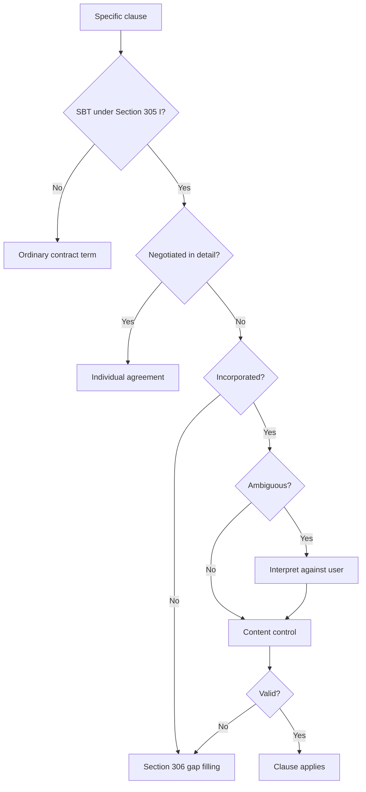

# Ubiquitous Language: Week 06 Standard Business Terms

Source note: `week-06-standard-business-terms.md`
Course: Business Law
Definition sources: local topic note and raw PDF for term discovery; statutory anchors checked against the official English BGB translation at `https://www.gesetze-im-internet.de/englisch_bgb/`.

This file is the terminology and statutory-anchor companion for the Standard Business Terms topic. It keeps the exam language tight: identify the clause, classify the SBT, test incorporation, test content, then state the consequence.

## Plain-Language Section Router

| Exam step | Canonical section | Basic meaning | Safe wording |
|---|---|---|---|
| Contract first | Sections 145 et seq. BGB | SBT only matter inside a contract route. | First check whether offer and acceptance formed a contract. |
| Changed acceptance | Section 150 II BGB | A changed "yes" is a new offer. | The reply is a rejection plus new offer if it changes the terms. |
| SBT classification | Section 305 I BGB | One side brought ready-made rules. | The clause is pre-formulated, intended for repeated use, and provided by the user. |
| Negotiation check | Section 305 I sentence 3 BGB | Real negotiation removes SBT status. | Mere acceptance is not individual negotiation. |
| Incorporation | Section 305 II BGB | The other side must be shown the house rules. | The user must refer to the terms, allow review, and obtain agreement. |
| Surprise | Section 305c I BGB | Hidden important rules do not enter. | The clause is not incorporated if placement or content is unexpected. |
| Ambiguity | Section 305c II BGB | Unclear wording hurts the user. | Doubts in interpretation are resolved against the SBT user. |
| Content control | Sections 307-309 BGB | Clear but too harsh is tested for validity. | The clause may be ineffective because it unreasonably disadvantages the other party. |
| Consequence | Section 306 BGB | Bad clause out, contract usually stays. | The rest of the contract remains valid and statutory law fills the gap. |

Plain memory:

```text
Hidden = surprise.
Unclear = ambiguity.
Clear but too harsh = content control.
Bad clause out, contract usually stays.
```

## Core SBT Actors And Objects

| Term | Definition | Aliases to avoid |
|---|---|---|
| **Standard Business Terms** | Contract terms pre-formulated by one party for repeated use and presented to the other party when concluding the contract. Local abbreviation: **SBT**. | boilerplate always valid, contract template only |
| **SBT Clause** | The exact provision being tested. Always isolate the specific clause before applying Sections 305 et seq. BGB. | the whole contract |
| **User Of SBT** | The party that introduces the pre-formulated clause into the contract. This party bears drafting and ambiguity risk. | drafter always, seller always |
| **Contracting Partner** | The party receiving the user's SBT. This party is protected by incorporation, interpretation, and content-control rules. | consumer always, weak party always |
| **Contract Term** | A provision intended to shape contractual rights, duties, remedies, risk allocation, timing, or other legal consequences. | information notice |
| **Pre-Formulated Term** | A clause fixed before the individual contract negotiation and not freshly drafted from equal bargaining. | printed term only |
| **Multiple-Use Intention** | The user's intention to use the clause in several contracts; the deck uses at least three intended contracts as the normal threshold. | actual repeated use |
| **First-Use Consumer SBT** | A pre-formulated B2C term can be treated as SBT even if the user deploys it for the first time, under Section 310 III No. 2 BGB. | one-time term never SBT |
| **Individual Agreement** | A term seriously negotiated in detail so the other party had a real opportunity to influence the content. | accepted term, signed term |

## Incorporation Language

| Term | Definition | Aliases to avoid |
|---|---|---|
| **Incorporation Control** | The step asking whether SBT became part of the contract at all. | validity control |
| **Explicit Reference** | The user's clear pointer that SBT are meant to apply. | hidden link |
| **Clearly Visible Notice** | A visible sign or notice at the place of contract conclusion that can replace explicit reference where explicit individual reference is possible only with disproportionate difficulty. | hidden notice |
| **Opportunity To Review** | A reasonable chance for the other party to see the SBT content before agreeing. | theoretical access only |
| **Agreement To SBT** | Consent that the SBT apply, which may occur through contract conclusion if the reference and review chance are adequate. | reading every clause |
| **Surprising Clause** | A clause so unexpected by placement or content that it is not incorporated under Section 305c I BGB. | merely strict clause |
| **Protective Clause** | A clause saying the user's SBT apply exclusively and conflicting terms from the other side are rejected. | automatic victory clause |
| **Battle Of Forms** | A transaction where both sides send their own SBT and the terms conflict. | no contract automatically |
| **Last-Shot Theory** | The view that the party sending its SBT last wins if the other party performs. The deck presents this but highlights its arbitrariness. | statutory approach |
| **Statutory-Provisions Approach** | The view that matching SBT apply, conflicting SBT fall out, and statutory law fills the gap. | last word rule |
| **Clause Scope** | The factual range covered by the wording of an SBT clause. A valid clause may still not apply if the damage falls outside its wording. | clause validity |

## Interpretation And Content-Control Language

| Term | Definition | Aliases to avoid |
|---|---|---|
| **Contra Proferentem Rule** | Ambiguity in SBT is interpreted against the user of the clause. | customer-friendly reading always |
| **Content Control** | Validity review of SBT that deviate from statutory law or undermine statutory principles. | price fairness review |
| **Core Performance Exemption** | The main price, main performance, and their relationship are normally not reviewed as unfair SBT content. | no legal review ever |
| **Transparency Control** | Section 307 BGB review of unclear or misleading SBT wording. | style preference |
| **Unreasonable Disadvantage** | A clause burdens the other party beyond what statutory principles and contract purpose allow. | bad bargain |
| **Hard Prohibition** | A Section 309 BGB clause type that is prohibited without individual valuation. | flexible unfairness test |
| **Valuation Prohibition** | A Section 308 BGB clause type that is normally prohibited but leaves room for case-specific evaluation. | absolute ban always |
| **Spillover Effect** | Values from Sections 308 and 309 can influence Section 307 analysis in B2B cases even where direct application is limited. | direct Section 309 B2B application |
| **Consumer** | A natural person acting mainly outside commercial or independent professional activity in the specific transaction. | private person always |
| **Entrepreneur** | A natural or legal person acting in commercial or independent professional activity in the specific transaction. | company only, business owner always |
| **B2C Contract** | A contract in which a consumer acts privately and the other party acts as an entrepreneur. | any contract involving a natural person |
| **B2B Contract** | A contract in which both parties act for commercial or independent professional purposes. | contract between companies only |

## Consequence Language

| Term | Definition | Aliases to avoid |
|---|---|---|
| **Non-Incorporation** | The clause never becomes part of the contract, especially because requirements of incorporation or surprise control fail. | void contract |
| **Ineffective Clause** | A clause that is part of the contract but fails content control. | contract invalid automatically |
| **Section 306 Consequence** | The rest of the contract usually remains effective and statutory law replaces the missing or invalid clause. | total collapse |
| **Supplementary Interpretation** | If no statutory default exists, ask what reasonable parties would have agreed to fill the gap. | court rewriting the user's clause |
| **No Reduction To Valid Core** | Courts normally do not narrow an invalid SBT clause into a fair version. | saving the clause |
| **Blue-Pencil Test** | A narrow exception allowing a separable invalid part to be deleted if the remaining wording stands independently. | fairness rewrite |
| **Retention Of Title** | A seller remains owner until full payment only if this is agreed; it is not the default statutory gap-filler. | automatic seller protection |

## Statutory Anchors

| Section | Canonical function | Trigger facts | Exam use |
|---|---|---|---|
| **Sections 145 et seq. BGB** | Ordinary offer-and-acceptance contract formation. | Parties exchange offers, acceptances, or modified terms. | Start here before SBT control. |
| **Section 13 BGB** | Defines a consumer by private-purpose action. | Natural person buys mainly outside commercial or professional activity. | Decide whether the stronger B2C route applies. |
| **Section 14 BGB** | Defines an entrepreneur by business-purpose action. | Person or entity acts commercially or professionally. | Distinguish B2B from a private purchase by the same person. |
| **Section 150 II BGB** | Modified acceptance counts as rejection plus new offer. | Acceptance adds or changes SBT. | Use in battle-of-forms formation analysis. |
| **Section 151 BGB** | Acceptance without declaration to the offeror in some circumstances. | Performance suggests acceptance without express notice. | Relevant to last-shot theory. |
| **Section 154 BGB** | Open disagreement can prevent contract conclusion. | Parties have not agreed on an essential or reserved point. | Contrast with Section 306 preserving a contract despite failed SBT. |
| **Section 155 BGB** | Hidden dissent can affect contract conclusion. | Parties think they agreed but an issue remains unresolved. | Use in battle-of-forms analysis. |
| **Section 305 I BGB** | Defines Standard Business Terms. | Pre-formulated contract term presented by user for repeated use. | Main SBT classification anchor. |
| **Section 305 I sentence 3 BGB** | Excludes individually negotiated terms from SBT status. | Serious clause-by-clause negotiation and real influence. | Use before incorporation and content control. |
| **Section 305 II BGB** | Special incorporation requirements. | User wants SBT to become part of contract. | Check reference, review opportunity, and agreement. |
| **Section 305a BGB** | Incorporation in special mass-service sectors. | Public transport or utilities-type setting. | Mention only if facts point there. |
| **Section 305c I BGB** | Surprising clauses are not incorporated. | Unexpected placement or content. | Use for hidden harsh clauses. |
| **Section 305c II BGB** | Ambiguity is interpreted against the user. | SBT wording has multiple meanings. | Apply before or during validity analysis. |
| **Section 306 I BGB** | Rest of contract remains effective despite failed SBT. | Clause not incorporated or ineffective. | Prevents overclaiming total invalidity. |
| **Section 306 II BGB** | Statutory provisions replace failed clause. | Gap exists because SBT failed. | State the default rule after invalidity. |
| **Section 307 BGB** | General reasonableness and transparency control. | SBT deviate from statutory law or are unclear. | Most flexible and B2B-important content rule. |
| **Section 307 III BGB** | Content control focuses on deviations from statutory provisions. | Main price/performance is attacked as unfair. | Explain why core price-performance is usually outside SBT control. |
| **Section 308 BGB** | Prohibited clauses with valuation possibility. | Clause type is normally unfair but context may matter. | Apply after Section 309 in the deck's scrutiny order. |
| **Section 309 BGB** | Prohibited clauses without valuation possibility. | Clause matches hard-prohibited type. | First content-control check in B2C-style scrutiny. |
| **Section 309 No. 7(b) BGB** | Prohibits specified exclusions or limitations of liability for gross fault. | SBT clearly exclude liability for gross negligence in a B2C case. | Use as the direct anchor instead of calling a clear liability clause surprising. |
| **Section 310 I BGB** | Modifies SBT control in B2B and public-law entity contexts. | SBT used with traders or comparable non-consumer parties. | Do not apply all B2C rules mechanically in B2B. |
| **Section 310 III No. 2 BGB** | Consumer one-time pre-formulated terms can be treated as SBT. | B2C contract with pre-formulated term used once. | Important exception to ordinary multiple-use intuition. |
| **Section 449 I BGB** | Retention of title must be agreed. | Seller claims ownership until full payment. | In battle-of-forms cases, failed retention clause means no retention by default. |
| **Sections 134 and 138 BGB** | Statutory prohibition and public-policy limits. | Extreme illegality or immoral/usurious bargain. | Use when core price/performance cannot be attacked through SBT control. |

## Relationships

- **Standard Business Terms** require ordinary **Contract Conclusion** first.
- **Individual Agreement** blocks the **Standard Business Terms** route because negotiated terms are not SBT.
- **Incorporation Control** answers "is the clause in the contract?"; **Content Control** answers "is the incorporated clause valid?"
- **Contra Proferentem Rule** puts ambiguity risk on the **User Of SBT**.
- **Section 306 Consequence** is the main remedy language: failed clause out, contract usually still in.
- **Blue-Pencil Test** is narrower than **Supplementary Interpretation**; it deletes separable words, it does not redesign a fair clause.

## Visual Memory Aid



## Example Dialogue

> **Student:** "The buyer signed the form, so the liability clause is valid."
>
> **Professor:** "Signing is not the end. First classify the clause as **Standard Business Terms**, then ask incorporation, surprise, ambiguity, and content control."
>
> **Student:** "If the clause fails, the contract is void?"
>
> **Professor:** "Usually no. Use **Section 306 Consequence**: the clause drops out, the contract survives, and statutory law fills the gap."

## Flagged Ambiguities

| Ambiguity | Canonical recommendation |
|---|---|
| "Terms and conditions" | Use **Standard Business Terms** when the German BGB control regime is meant. |
| "Negotiated" | Reserve **Individual Agreement** for serious negotiation with real influence. Do not use it for mere acceptance. |
| "Invalid SBT" | Specify whether the clause failed **Incorporation Control** or **Content Control**. |
| "Fairness" | Translate into the statutory test: Section 309, Section 308, or Section 307 BGB. |
| "B2B means no SBT law" | Wrong. B2B scrutiny is less strict, but Section 307 BGB remains important. |
| "A business owner is never a consumer" | Wrong. Classify the purpose of the specific transaction: restaurant equipment may be B2B, while a private bedroom television may be B2C. |
| "The clause is SBT because the product is defective" | Defect facts may make the clause important, but SBT classification comes from pre-formulated repeated-use wording provided by one party. |
| "The clause was visible, so it must be valid" | Visibility helps incorporation, but a clear clause can still fail content control if it is too harsh. |
| "The customer did not read the sign" | Actual reading is not required if there was a reasonable opportunity to take notice before agreeing. |

## Exam Trap Corrections

| Trap | Correction |
|---|---|
| Starting with Section 307 before contract formation. | First check offer and acceptance; SBT only matter inside a contract route. |
| Treating clickwrap acceptance as negotiation. | Acceptance is not individual negotiation unless content was seriously open to influence. |
| Treating every harsh clause as surprising. | Surprise requires unusual placement or unexpected content, not merely disadvantage. |
| Thinking invalid clause voids the whole contract. | Section 306 usually keeps the rest of the contract effective. |
| Applying hard B2C prohibitions mechanically to traders. | In B2B, check Section 310 I and use Section 307 for spillover reasoning. |
| Calling a clear gross-negligence exclusion surprising. | Clear harsh wording is content control: Section 309 No. 7(b) in B2C; Section 307 with Section 310 I in B2B. |
| Saving overbroad clauses by imagination. | Only use the **Blue-Pencil Test** when wording splits cleanly. |
| Calling every unfair clause "surprising." | Surprise is about hidden or unexpected incorporation; unfairness is content control. |
| Calling every clear harsh clause "ambiguous." | Ambiguity needs unclear wording. Clear harsh wording goes to content control. |
| Stopping after finding an effective SBT clause. | Also test whether the concrete damage or claim falls within the clause's wording. |
| Treating first use as fatal in every case. | In consumer contracts, Section 310 III No. 2 BGB can bring first-use pre-formulated terms into SBT control. |

## Cheat-Sheet Language

```text
SBT exam = contract first, clause second.
305 I: Is it SBT?
305 I sentence 3: Was it genuinely negotiated?
305 II / 305c I: Did it enter the contract?
305c II: If ambiguous, read against the user.
309 -> 308 -> 307: Is the content valid?
306: Clause out, contract usually stays, statutory law fills gap.
```
