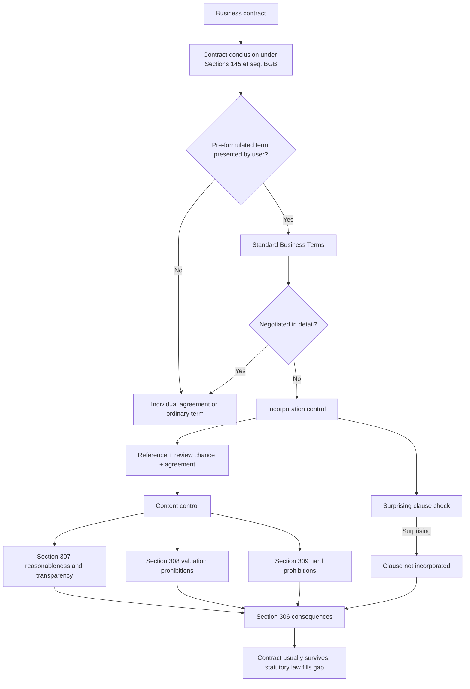

# Week 06: Standard Business Terms

Source: `business-law/raw/moodle-export-business-law-950848572-s26-20260604/18.05. - Standard Business Terms - Dr. Reger/Standard Business Terms.pdf`
Course: Business Law
Processed: 2026-06-04
Wiki note: `business-law/wiki/week-06-standard-business-terms/week-06-standard-business-terms.md`

Course direction checked against `business-law/wiki/_course-logistics.md`: the teaching outline places Standard Business Terms after Contract Law III and before Agency. The PDF title slide labels the deck as "Lecture 5"; this note follows the course sequence and stores it as Week 06.

## 80/20 Exam Summary

Standard Business Terms are the contract-law control system for pre-written clauses.

- Start every case with ordinary contract conclusion under Sections 145 et seq. BGB.
- Then ask whether the clause is a Standard Business Term under Section 305 I BGB.
- If it is SBT, ask whether it was incorporated into the contract.
- Individual negotiation beats SBT control; a truly negotiated term is not tested as SBT.
- Surprising clauses and ambiguous clauses are special incorporation/interpretation traps.
- Content control checks clauses that deviate from statutory law, not the agreed core price or main performance.
- The practical consequence is usually not contract destruction: the contract survives and invalid clauses are replaced by statutory law under Section 306 BGB.
- In B2B cases, scrutiny is less strict, but Section 307 BGB remains important.

## Contract Law Continuity Bridge

Standard Business Terms sit inside the Contract Law I validity block.

```text
Contract Law I: did the parties form a contract?
Standard Business Terms: which pre-written clauses became part of that contract, and are they valid?
Contract Law II/III: if the valid contract later fails, which exit route applies?
```

Memory hook: Contract Law I builds the house; SBT checks whether the pre-installed furniture in the house is actually allowed.

## Plain-Language Interpretation Layer

Use this section before the technical statutory route if SBT feels abstract.

SBT are **pre-written contract rules**. They are not suspicious just because they are long or boring. They become legally sensitive because one party usually writes them in advance and the other party just accepts.

Basic idea:

```text
SBT law allows efficient mass contracts,
but blocks hidden, unclear, or unfair pre-written clauses.
```

Friendly analogy: imagine a landlord hands over a sheet of house rules. A normal rule such as "no loud music after 10" is expected. A hidden rule such as "tenant pays EUR 10,000 if the landlord dislikes the wall color" is different. SBT law asks whether the rule was properly brought into the contract and whether the rule goes too far.

The simplest route is:

```text
Contract first.
Clause second.
```

Then ask:

```text
0. Is there a contract?
1. Is the clause SBT?
2. Did the clause enter the contract?
3. Is it surprisingly hidden?
4. Is it unclear?
5. Is it clear but too harsh?
6. If it fails, what replaces it?
```

### Friendly Section Router

| Question | Section | Basic interpretation | Memory hook |
|---|---|---|---|
| Did the parties form a contract first? | Sections 145 et seq. BGB | Offer and acceptance must exist before SBT control matters. | Contract first. |
| Did a changed acceptance create a new offer? | Section 150 II BGB | "Yes, but with changes" is a rejection plus new offer. | Changed yes = new offer. |
| Is the clause SBT? | Section 305 I BGB | Pre-written rule, meant for repeated use, provided by one party. | Ready-made rule. |
| Was it truly negotiated? | Section 305 I sentence 3 BGB | If the other party could seriously influence the wording, it is not SBT. | Real negotiation beats SBT. |
| Did the SBT enter the contract? | Section 305 II BGB | The user must point to the terms, give a chance to read, and get agreement. | Show the house rules. |
| Is it hidden or unexpected? | Section 305c I BGB | A surprising clause does not become part of the contract. | Hidden important rule = surprise. |
| Is it unclear? | Section 305c II BGB | Ambiguity is interpreted against the SBT user. | Unclear rule hurts the writer. |
| Is it clear but too harsh? | Sections 307-309 BGB | Content control checks whether the clause goes too far. | Visible but unfair = content control. |
| What happens if the clause fails? | Section 306 BGB | Bad clause out; contract usually stays; statutory law fills the gap. | Cut out the bad rule. |

### Three Fast Categories

```text
Hidden = surprise.
Unclear = ambiguity.
Clear but too harsh = content control.
```

Examples:

- Voucher-only refund clause hidden under "technical information" = likely surprise.
- Clause saying "customers receive appropriate compensation" = possible ambiguity.
- Clause clearly saying "for defective products, customers only receive vouchers and never refunds" = likely content control.

### Consequence Memory

SBT law usually does not destroy the whole contract.

```text
Bad clause fails.
Rest of contract usually stays.
Statutory law replaces the failed clause.
```

Precise exam language:

```text
The clause is ineffective or not incorporated. Under Section 306 BGB, the rest of the contract usually remains valid and statutory provisions apply instead.
```

## Why SBT Exist

SBT are used because mass contracting would be too slow and expensive if every term were negotiated from scratch.

Business advantages for the user:

- standardization of repeated transactions
- lower negotiation and transaction costs
- risk allocation in advance
- support for complex or newer contract types, such as leasing, factoring, franchising, insurance, and platform contracts

Costs and risks:

- customers often accept SBT without reading them
- clauses may be one-sided
- users must keep clauses updated with statutes and case law
- invalid SBT can create mass-litigation exposure
- interpretation doubts go against the user under the contra proferentem rule

Policy logic: German law accepts efficiency from standardized contracting, but compensates for the weaker bargaining position of the other party through incorporation and content control.

## Case-Solving Structure

Use this four-step structure after checking ordinary contract conclusion.

1. Existence of Standard Business Terms.
2. Incorporation of the Standard Business Terms.
3. Scrutiny of content.
4. Legal consequences of invalid or non-incorporated clauses.

### Step 0: Contract Conclusion

Before SBT control matters, there must be a contract route through offer and acceptance under Sections 145 et seq. BGB.

This matters in "battle of forms" cases because conflicting SBT can also create an offer-and-acceptance problem. If a reply changes the terms, Section 150 II BGB may treat the reply as a rejection plus new offer.

### Step 1: Existence Of SBT

Section 305 I BGB asks whether the relevant term is:

- a contract term
- pre-formulated
- intended for multiple use, normally at least three contracts
- presented by one party, the user, to the other party

The exam skill is to distinguish a real negotiated term from a pre-written clause.

A contract term is meant to shape contractual rights or duties. It does not have to be written. A spoken standard script can still function as SBT if it is pre-formulated and intended for repeated use.

Pre-formulated means fixed before contract conclusion. The key question is not whether the clause appears in a PDF or paper form. The key question is whether the other party had a genuine chance to influence the clause.

For multiple use, the deck uses the practical threshold of intended use in at least three contracts. Actual repeated use is not necessary. In consumer contracts, Section 310 III No. 2 BGB can pull even one-time pre-formulated clauses into SBT control.

Presented by the user means one party instigates the clause's integration without real influence from the other party.

### Individually Negotiated Agreements

Section 305 I sentence 3 BGB excludes terms negotiated in detail.

Do not treat every discussion as negotiation. A term is individually negotiated only if:

- the user seriously puts the clause up for discussion
- the other party has a real opportunity to influence it
- the final content reflects more than a cosmetic acceptance of the user's template

Exam trap: if the facts say "the buyer could click accept or leave", that is not negotiation. If the facts say the parties debated liability caps and changed the clause, that may be individual negotiation.

## Step 2: Incorporation

SBT must become part of the contract.

General rule: incorporation follows offer and acceptance. Special SBT incorporation rules add extra protection, especially in consumer-facing settings.

Section 305 II BGB requires the user to:

- point the other party to the SBT
- give a reasonable chance to review the content
- obtain agreement to their application

In B2B contracts, Section 310 I BGB modifies the strictness of Section 305 II BGB. The exam still expects you to ask whether the terms were actually part of the contractual exchange.

### Surprising Clauses

Section 305c I BGB keeps surprising clauses out of the contract.

A clause can be surprising because of:

- unusual placement in the SBT
- unexpected content that sharply changes what the other party reasonably thought they were agreeing to

Example: a major liability exclusion hidden in a routine delivery paragraph is more suspicious than the same clause clearly labelled in a liability section.

### Protective Clauses And Battle Of Forms

Commercial parties often use protective clauses saying their own SBT apply exclusively and conflicting SBT from the other side are rejected.

The deck contrasts two approaches:

- Last-shot theory: whichever party sent its SBT last wins if the other performs.
- Statutory-provisions approach: matching clauses apply; conflicting clauses fall out; statutory law fills the gap under Section 306 BGB.

The deck favors understanding the statutory-provisions logic because it avoids arbitrary "last word" advantage and the endless exchange of forms.

Machine example: V's SBT include retention of title, B's SBT reject retention of title, and V ships the machine. Under the statutory-provisions approach, the conflicting retention-of-title clauses do not agree. The contract can survive, but retention of title is not the default and must be agreed under Section 449 I BGB, so V does not get that protection.

## Step 3: Interpretation

Section 305c II BGB contains the contra proferentem rule: interpret ambiguity against the user of the SBT.

Why this is logical:

- the user drafted or supplied the clause
- the user can avoid ambiguity by drafting better
- the other party should not bear the risk of unclear standard wording

Exam trap: ambiguity can hurt the user even if the user intended a milder meaning. Courts may use the customer-unfriendly interpretation first, and that interpretation may make the clause invalid.

## Step 4: Content Control

Content control tests SBT that deviate from statutory provisions.

It does not normally review the main price, the main performance, or the price-performance relationship. That belongs to private autonomy. Extreme cases may still be caught by other rules such as Sections 134 or 138 BGB.

### Scrutiny Order

The deck's visual order is:

1. Section 309 BGB: prohibited clauses without the possibility of evaluation.
2. Section 308 BGB: prohibited clauses with the possibility of evaluation.
3. Section 307 BGB: general reasonableness and transparency test.

Section 309 and much of Section 308 are not directly applied to B2B SBT under Section 310 I BGB, but their values can influence Section 307 BGB.

### Section 309 BGB

Section 309 lists clauses that are generally too unfair without case-by-case valuation. The deck highlights:

- burden-of-proof modifications to the disadvantage of the other party
- clauses forcing the other party to attempt out-of-court settlement before bringing claims
- liability limitations for gross negligence in the blue-pencil examples

### Section 308 BGB

Section 308 lists clauses that are typically unfair but may be saved by the individual circumstances.

The deck example concerns an unreasonable or insufficiently specific additional performance period reserved for the user.

### Section 307 BGB

Section 307 is the most flexible and exam-important rule.

It catches unreasonable disadvantage, especially where SBT:

- are unclear or non-transparent
- conflict with basic principles of statutory law
- restrict essential rights or duties so strongly that the contract purpose is endangered

Examples:

- an online shop offering only a voucher instead of a refund for defective products
- excluding a right to rescind despite serious performance failure
- defining defects in a new-car contract so narrowly that small scratches are excluded from any defect concept

## Consequences

If a clause is not incorporated or fails content control:

- the rest of the contract usually remains effective under Section 306 I BGB
- statutory provisions replace the invalid or missing term under Section 306 II BGB
- if no statutory provision exists, supplementary interpretation asks what reasonable parties would have agreed

Exam phrasing: "The clause is ineffective; the contract itself remains effective unless the exceptional Section 306 III situation applies."

## Blue-Pencil Test

German SBT law normally does not reduce an invalid clause to its valid core. A user who overreaches should not be rewarded by judicial rewriting.

Exception: if an invalid part can be deleted mechanically and the remaining part is grammatically and substantively independent, the remaining part may survive.

Deck examples:

- Separate liability caps for gross negligence and slight negligence: delete the invalid gross-negligence limitation; the slight-negligence limitation may stand.
- One broad negligence limitation covering both gross and slight negligence: no clean deletion is possible; the whole clause fails.

Exam trap: do not "save" a clause by inventing a narrower, fairer version. Use the blue-pencil test only when the wording itself splits cleanly.

## Negotiation Tactic

The deck closes with a practical negotiation point: sometimes a business partner may accept strict SBT instead of negotiating every disadvantageous clause, because illegal clauses may later be filtered out by SBT control.

This is not always rational:

- court involvement is expensive
- ongoing business relationships may suffer
- the other party may need certainty now, not later
- once a clause is truly negotiated, SBT control may no longer apply

Managerial takeaway: SBT are not only legal boilerplate. They are a contracting strategy with transaction-cost, litigation-risk, and relationship-cost consequences.

## Visual Knowledge Map



## Subject Knowledge Graph

| Node | Meaning | Exam Relevance |
|---|---|---|
| Standard Business Terms | Pre-formulated contract terms presented by one party for repeated use. | Central classification step before SBT control. |
| User of SBT | Party that introduces the SBT into the contract. | Determines who bears drafting ambiguity and content-control risk. |
| Contracting Partner | Party receiving the user's SBT. | Protected by incorporation, interpretation, and content-control rules. |
| Individual Agreement | Truly negotiated term outside SBT control. | Can override or escape SBT scrutiny. |
| Incorporation Control | Test whether SBT became part of the contract. | Catches missing reference, missing review chance, lack of agreement, and surprises. |
| Surprising Clause | Unexpected clause by placement or content. | Not incorporated under Section 305c I BGB. |
| Contra Proferentem | Ambiguity interpreted against the SBT user. | Important interpretation trap before content control. |
| Content Control | Validity review for clauses deviating from statutory law. | Main exam arena for Sections 307-309 BGB. |
| Section 306 Consequence | Contract survives; statutory law replaces failed clause. | Prevents overstatement that the whole contract collapses. |
| Blue-Pencil Test | Mechanical deletion exception for separable invalid wording. | Prevents rewriting invalid clauses into fair versions. |

| From | Relationship | To | Why It Matters |
|---|---|---|---|
| Standard Business Terms | require | Contract Conclusion | SBT cannot float outside a contractual route. |
| User of SBT | presents | Standard Business Terms | Identifies who controls the wording. |
| Individual Agreement | defeats | Standard Business Terms | Negotiated terms avoid SBT control. |
| Incorporation Control | filters out | Surprising Clause | Some clauses never become part of the contract. |
| Contra Proferentem | interprets against | User of SBT | Ambiguity risk sits with the drafter/user. |
| Content Control | applies to | Clauses Deviating From Statutory Law | Price and core performance are usually outside SBT control. |
| Section 309 | is stricter than | Section 308 | No valuation possibility. |
| Section 307 | generalizes | Fairness And Transparency Review | Especially important in B2B contracts. |
| Invalid Clause | triggers | Section 306 Consequence | Contract usually remains; statutory law fills the gap. |
| Blue-Pencil Test | permits only | Mechanical Severance | Courts do not rewrite overbroad SBT. |

## Real Business Examples

- SaaS platform terms: a unilateral change clause may be useful for updating services, but it can be scrutinized if it gives the provider unlimited power to change core duties.
- Supplier purchase terms: both sides may send conflicting retention-of-title or liability clauses. The exam issue is not "who shouted last" only; ask which terms match and what statutory default fills the conflict.
- Online refund policy: a voucher-only remedy for defective products may fail transparency or statutory-principle control.
- Lease cosmetic repairs: unclear wording can be interpreted against the landlord-user and become invalid.

## Exam Relevance

Likely prompts:

- Identify whether a clause is SBT under Section 305 I BGB.
- Distinguish SBT from individually negotiated terms.
- Check whether SBT were incorporated, including surprising clauses.
- Resolve conflicting SBT in a B2B transaction.
- Apply Sections 307-309 BGB and Section 306 BGB consequences.
- Explain whether the blue-pencil test saves part of a clause.

Common traps:

- Starting SBT control before contract conclusion.
- Calling a clause "negotiated" just because the other side clicked accept.
- Forgetting that Section 306 usually preserves the rest of the contract.
- Reviewing the main price as if it were an unfair SBT clause.
- Applying Section 309 directly in B2B without noting Section 310 I.
- Rewriting an overbroad clause instead of testing clean severability.

High-scoring answer structure:

1. State the contract conclusion route.
2. Identify the exact clause.
3. Classify it under Section 305 I BGB.
4. Exclude or confirm individual negotiation.
5. Test incorporation, including Section 305c I if facts suggest surprise.
6. Interpret ambiguity under Section 305c II.
7. Run content control in the correct order.
8. State Section 306 consequences precisely.

## Retrieval Prompts

Closed-book questions:

1. What are the four main steps of a Standard Business Terms examination?
2. What makes a clause SBT under Section 305 I BGB?
3. How do individually negotiated agreements interact with SBT control?
4. What is the difference between Section 305c I and Section 305c II BGB?
5. Why does Section 306 BGB matter in almost every SBT case?
6. What is the order of content scrutiny under Sections 309, 308, and 307 BGB?

Application prompts:

1. A SaaS provider hides a liability exclusion inside a data-processing appendix. Classify the SBT issue.
2. Seller and buyer exchange conflicting retention-of-title clauses and then perform. What is the likely SBT problem and consequence?
3. A contract says "liability for negligence is capped at EUR 50,000." Apply the blue-pencil idea.
4. A B2B buyer accepts strict SBT without negotiation because litigation later may be cheaper than clause-by-clause negotiation. What is the strategic logic and risk?

## Practice Tasks

### Mini Case 1: Hidden Renewal Clause

A gym's pre-written membership form contains a 24-month automatic renewal clause under a small "miscellaneous" heading. The customer signs without discussion. The gym relies on the renewal.

Short answer guide: identify SBT, no individual negotiation, incorporation issue, possible surprising clause under Section 305c I, then content/transparency control if incorporated.

### Mini Case 2: Battle Of Forms

V sells a machine to B. V's SBT reserve title until full payment. B accepts but attaches SBT rejecting retention of title. V ships the machine.

Short answer guide: ordinary formation plus conflicting SBT; matching terms can apply, conflicting retention-of-title terms do not agree; Section 306 fills gaps; retention of title must be agreed under Section 449 I BGB, so no retention-of-title protection on these facts.

### Mini Case 3: Liability Cap

Clause A separately caps gross negligence and slight negligence. Clause B caps all negligence in one sentence.

Short answer guide: no judicial reduction to a fair core. Clause A may survive partly if the invalid part can be mechanically deleted; Clause B likely fails as a whole if gross and slight negligence cannot be separated by wording.

## Connections

Previous notes from this lecture:

- `../week-03-contract-law-i/week-03-contract-law-i.md`: offer, acceptance, modified acceptance, private autonomy, validity limits.
- `../week-04-contract-law-ii-rescission-revocation/week-04-contract-law-ii-rescission-revocation.md`: consequences when a valid contract later fails.
- `../week-05-contract-law-iii-withdrawal-cancellation-dissolution/week-05-contract-law-iii-withdrawal-cancellation-dissolution.md`: consumer withdrawal and other exit routes; useful when SBT try to restrict remedies.

Next lecture connection:

- `../week-07-agency/week-07-agency.md`: agency can determine who is bound by a contract before SBT validity is tested.

Cross-course links:

- Marketing: platform terms shape customer trust and conversion friction.
- Organization: standardized rules reduce coordination costs but can create compliance and litigation risk.
- SCM: supplier contracts often use conflicting purchase and sales terms, especially retention of title, delivery, and liability clauses.

## Open Uncertainties

- The deck labels itself "Lecture 5" while the course logistics outline places Standard Business Terms as Session 6. This note follows the topic sequence after Contract Law III.
- The deck mentions EU Directive 93/13/EEC as historical background. This note focuses on the BGB rules used for exam case solving unless the exam explicitly asks for EU-law origins.

## Weakness Flags

- Active recall not yet completed.
- Clarification completed 2026-06-04 with a plain-language router. Keep drilling these distinctions: SBT issue versus unfairness issue; hidden surprise versus unclear ambiguity versus clear-but-harsh content control; non-incorporation versus ineffective clause; Section 306 consequence.
- First active-recall drill should start with a webshop voucher-only clause, then a hidden liability clause, then the battle-of-forms machine case.
