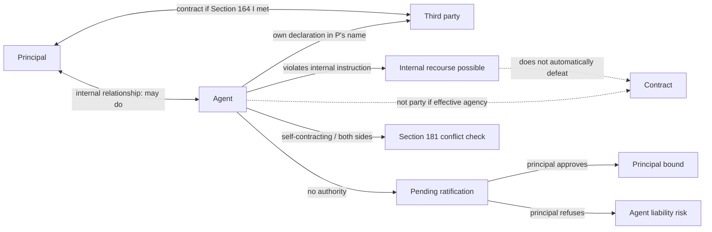

# Ubiquitous Language: Week 07 Agency

Source note: `week-07-agency.md`
Course: Business Law
Definition sources: local topic note and raw PDF for term discovery; statutory anchors checked against official English translations at `https://www.gesetze-im-internet.de/englisch_bgb/` and `https://www.gesetze-im-internet.de/englisch_gmbhg/englisch_gmbhg.html`.

This file is the terminology and statutory-anchor companion for Agency. Use it to keep the three-party structure and the "can do" versus "may do" distinction visible.

## Agency Actor Language

| Term | Definition | Aliases to avoid |
|---|---|---|
| **Principal** | Person for whom the legal effect of the agent's declaration should arise. | employer always, owner always |
| **Agent** | Person who makes an own declaration of intent in the principal's name within power of representation. | messenger, employee always |
| **Third Party** | Outside contract partner dealing with the agent. | customer always |
| **Agency Triangle** | The principal-agent-third party structure in which the agent's act can bind principal and third party directly. | two-party contract only |
| **Effective Agency** | Agency where own declaration, publicity, and power of representation are all present. | delegation generally |
| **Unauthorized Agent** | A person acting as agent without power of representation. | bad agent always |
| **Legal Entity** | Organization with legal personality that can hold rights and duties but must act through humans. | company body |
| **Organ** | Human office/body through which a legal entity acts by law, such as a GmbH managing director. | agent automatically |

## Section 164 Requirement Language

| Term | Definition | Aliases to avoid |
|---|---|---|
| **Own Declaration Of Intent** | The agent forms and expresses their own will to enter a legal transaction. | relayed message |
| **Messenger** | Person who only transmits another person's already fixed declaration. | agent |
| **Principle Of Publicity** | The third party can see that the acting person acts in another's name. | private intention |
| **Enterprise-Related Transaction** | Circumstances show the transaction relates to a business, so acting for the enterprise can be inferred. | explicit name always required |
| **Undisclosed Agency** | The acting person privately intends to act for someone else but does not make this externally recognizable. | effective agency |
| **Power Of Representation** | External legal authority enabling the agent to bind the principal. Canonical term for the deck's "power of agency." | internal permission only |
| **Internal Authorization** | Principal grants authority by declaration to the agent. | public notice |
| **External Authorization** | Principal grants or communicates authority by declaration to the third party. | employment instruction |
| **Publicity Versus Authority Split** | Publicity identifies whose contract it is; authority decides whether the acting person can bind that person. | same requirement |

## Relationship Language

| Term | Definition | Aliases to avoid |
|---|---|---|
| **External Relationship** | Relationship visible to the third party: whether the agent can bind the principal. | internal contract |
| **Internal Relationship** | Relationship between principal and agent, such as employment or mandate, defining what the agent may do. | power of representation itself |
| **Can Do** | External legal ability to bind the principal. | may do |
| **May Do** | Internal permission or duty owed to the principal. | can do |
| **Abstraction Of Agency** | External authority and internal permission are separate, so third parties may be protected even if the agent breaches internal instructions. | same thing as employment |
| **Internal Recourse** | Principal's possible claim or discipline against the agent for violating internal duties. | third-party invalidity automatically |
| **Externally Effective, Internally Forbidden Declaration** | Agent's declaration binds the principal toward the third party even though it breaches the agent's internal instruction. | wrong declaration externally |

## Authority Source And Limit Language

| Term | Definition | Aliases to avoid |
|---|---|---|
| **Statutory Authority** | Power of representation granted by law because of an office or role. | contractual authority only |
| **Authority By Declaration** | Power of representation granted by the principal under Section 167 BGB. | implied job title always |
| **Regular Authorization** | Authority intentionally granted by the principal through declaration, internally to the agent or externally to the third party. | reliance authority |
| **Reliance-Based Authority** | Power of representation based on principal-created appearance and good-faith reliance. | fake authority |
| **Agency By Estoppel** | Reliance authority where the principal knows someone acts like an agent and tolerates it. Deck label. | ostensible agency |
| **Ostensible Agency** | Reliance authority where the principal negligently does not know but could have known with due diligence. Deck label. | agency by estoppel |
| **Ratification** | Principal's later approval of an unauthorized transaction, making it effective for the principal. | initial authority |
| **Abuse Of Power Of Representation** | Agent has external authority but uses it contrary to internal limits or principal interest. | lack of authority |
| **Collusion** | Agent and third party knowingly cooperate to harm the principal. | normal breach of instruction |
| **Contracting With Oneself** | Agent transacts with themselves or represents both sides, creating conflict-of-interest risk under Section 181 BGB. | ordinary agency |
| **Self-Contracting** | Agent represents the principal while the agent personally stands on the other side of the transaction. | internal instruction breach only |
| **Multiple Representation** | Agent represents both parties in the same transaction. | two separate harmless agencies |
| **Prior Permission For Self-Dealing** | Principal permits the Section 181 conflict situation before the transaction. | later tolerance automatically |

## Principal-Agent Problem Language

| Term | Definition | Aliases to avoid |
|---|---|---|
| **Principal-Agent Problem** | The economic problem that principal and agent may have different interests and unequal information. | legal agency rule only |
| **Information Asymmetry** | One side, usually the agent, knows more about quality, action, information, or intention than the principal can observe. | simple ignorance |
| **Hidden Characteristics** | Pre-contract quality problem: the agent's type or competence is unknown. | moral hazard |
| **Adverse Selection** | Hiring or contracting risk caused by hidden characteristics. | hidden action |
| **Hidden Action** | Post-contract behavior problem: the agent's conduct cannot be perfectly observed. | adverse selection |
| **Hidden Information** | The agent has specialist knowledge the principal cannot fully evaluate. | hidden characteristics |
| **Hidden Intention** | The agent's true motivation or commitment is not visible. | lack of authority |
| **Agency Costs** | Costs of reducing the agency problem, such as screening, incentives, monitoring, and authority limits. | damages only |
| **Dual-Control Principle** | Monitoring design requiring more than one person or signature for a transaction. | single-agent authority |

## Statutory Anchors

| Section | Canonical function | Trigger facts | Exam use |
|---|---|---|---|
| **Sections 164-181 BGB** | Core agency and authority block. | Any person acts for another in a legal transaction. | Open the agency analysis. |
| **Section 164 I BGB** | Effective agency: own declaration, in principal's name, within power of representation. | Agent appears to conclude a contract for principal. | Main three-step agency test. |
| **Section 164 II BGB** | Failure of publicity. | Intent to act for another is not externally evident. | Principal not bound; acting person may be treated as acting personally. |
| **Section 165 BGB** | Limited capacity of agent does not necessarily block agency. | Agent has limited capacity but makes declaration for principal. | Mention if facts involve minor/limited-capacity agent. |
| **Section 166 BGB** | Intent defects and knowledge can be assessed through the representative. | Mistake, knowledge, or bad faith sits with agent. | Use in advanced cases involving knowledge attribution. |
| **Section 167 I BGB** | Conferment of authority by declaration to agent or third party. | Principal grants internal or external authority. | Central authority-by-declaration anchor. |
| **Section 168 BGB** | Expiry and revocation of authority. | Authority ends or is withdrawn. | Ask whether termination was effective externally. |
| **Sections 170-173 BGB** | Third-party protection after external authority or appearance continues. | Authority was communicated or documented; third party may be in good faith. | Use when authority was withdrawn but third party was not informed. |
| **Section 177 I BGB** | Contract by unauthorized agent depends on principal ratification. | Agent lacked authority but contracted for principal. | Principal can approve or reject. |
| **Section 179 BGB** | Liability of representative without power of agency if principal refuses ratification. | Unauthorized agent cannot prove authority and principal refuses. | State third party's possible claim against agent. |
| **Section 181 BGB** | Restricts self-dealing and acting on both sides. | Agent contracts with self or represents both sides. | Conflict-of-interest check. |
| **Section 242 BGB** | Good faith principle. | Principal-created reliance or abuse questions. | Background for reliance-based authority in the deck. |
| **Section 138 BGB** | Public-policy invalidity. | Collusion or abusive transaction against the principal. | Use for serious collusion between agent and third party. |
| **Section 35 GmbHG** | GmbH represented by its directors. | GmbH director concludes legal transactions. | Example of statutory authority for a legal entity. |

## Relationships

- **Effective Agency** connects **Principal** and **Third Party** directly; **Agent** usually drops out of the contract.
- **Own Declaration Of Intent** separates **Agent** from **Messenger**.
- **Principle Of Publicity** protects the **Third Party** by making the contract partner identifiable.
- **Power Of Representation** is the external **Can Do**; **Internal Relationship** defines **May Do**.
- **Publicity** asks whether the third party can see that the transaction is for the principal; **Power Of Representation** asks whether the agent can bind that principal.
- **Regular Authorization** comes from P's declaration; **Reliance-Based Authority** comes from P-created or P-tolerated appearance plus good-faith reliance by T.
- **Agency By Estoppel** requires P's knowledge and tolerance; **Ostensible Agency** requires P's negligent failure to know or stop the apparent agency.
- **Unauthorized Agent** creates a pending situation: **Ratification** can bind the principal; refusal can trigger **Section 179 BGB** liability.
- **Contracting With Oneself** can convert a normal internal-conflict problem into a Section 181 external-power problem.
- **Agency Costs** are managerial controls responding to **Information Asymmetry**.

## Visual Memory Aid



## Example Dialogue

> **Student:** "A signed the purchase, so A is bound."
>
> **Professor:** "Only if A acted personally. If A made an **Own Declaration Of Intent** in P's name and had **Power Of Representation**, effective agency binds P and T."
>
> **Student:** "But A breached P's internal price limit."
>
> **Professor:** "Now separate **Can Do** from **May Do**. The third party may still be protected externally, while P may have internal recourse against A."

## Flagged Ambiguities

| Ambiguity | Canonical recommendation |
|---|---|
| "Agency" | Use **Effective Agency** for the legal Section 164 result; use **Principal-Agent Problem** for economic information-asymmetry analysis. |
| "Authorized" | Specify whether it means external **Power Of Representation** or internal permission. |
| "Representative" | In exam answers, identify principal, agent, third party, and exact declaration. |
| "Employee" | Employment does not automatically solve authority. Test the source and scope of power of representation. |
| "Apparent authority" | Use the deck's distinction: **Agency By Estoppel** if principal knows and tolerates; **Ostensible Agency** if principal negligently does not know. |
| "Bad agent" | Distinguish **Unauthorized Agent** from **Abuse Of Power Of Representation**. |
| "No publicity" | Do not confuse it with lack of authority. No publicity means T cannot recognize A acts for P. |
| "Legal entity acts" | Say a legal entity acts through organs or agents; the human declaration is attributed to the entity. |
| "Contracting with oneself" | Check whether A is personally the counterparty or represents both sides; then test Section 181 exceptions. |

## Exam Trap Corrections

| Trap | Correction |
|---|---|
| Treating every employee as agent. | Employment may be the internal relationship, but power of representation must still be shown. |
| Skipping publicity. | Hidden intent to act for someone else is not enough under Section 164 II BGB. |
| Confusing messenger and agent. | Messenger transmits; agent declares. |
| Treating internal limits as automatic external limits. | Separate **Can Do** and **May Do**. |
| Calling an internal-instruction breach a wrong declaration externally. | Say the declaration may be externally effective but internally forbidden. |
| Forgetting ratification. | Unauthorized agency is not always dead; check Section 177 BGB. |
| Making the agent liable despite effective agency. | If agency is effective, principal and third party are normally bound, not agent. |
| Treating reliance authority like express permission. | Reliance authority is based on appearance attributable to P and reasonable good-faith reliance by T. |
| Treating self-contracting as a normal third-party case. | Section 181 exists because the agent sits on both sides and conflict risk is structural. |
| Using principal-agent economics without legal structure. | First solve legal agency, then discuss information asymmetry if asked. |

## Cheat-Sheet Language

```text
Agency test under Section 164 I BGB:
1. Agent's own declaration of intent.
2. In the name of the principal.
3. Within power of representation.

If yes: principal and third party are bound directly.
If no publicity: acting person may bind themselves.
If no authority: principal can ratify; otherwise Section 179 liability risk.
Always separate can do from may do.
```

## Clarification Cheat Sheet From 2026-07-01

```text
Internal instruction breach:
A was not allowed to do it internally, but A may still be able to bind P externally.

No publicity:
T cannot recognize that A acts for P. This is not the same as missing authority.

Reliance-based authority:
No clear declaration of authority, but P created or tolerated an appearance that T reasonably trusted.

Agency by estoppel:
P knew and tolerated the appearance.

Ostensible agency:
P did not know, but should have known and stopped the appearance.

Contracting with oneself:
A represents P while also being the counterparty, or A represents both sides. Check Section 181 BGB.
```
