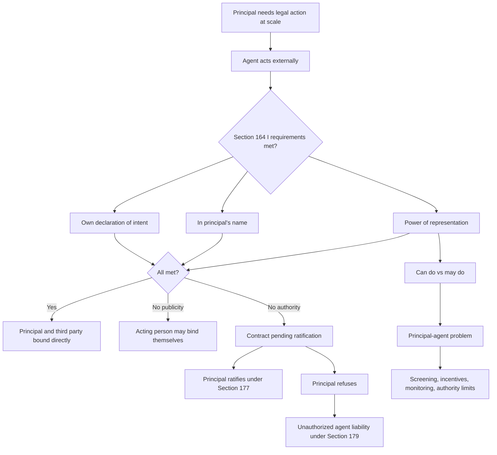

# Week 07: Agency

Source: `business-law/raw/moodle-export-business-law-950848572-s26-20260604/01.06. - Agency - Haag/Agency.pdf`
Course: Business Law
Processed: 2026-06-04
Wiki note: `business-law/wiki/week-07-agency/week-07-agency.md`

Course direction checked against `business-law/wiki/_course-logistics.md`: Agency follows Standard Business Terms in the teaching outline. The PDF title slide labels the deck as "Lecture 6"; this note follows the course sequence and stores it as Week 07.

## 80/20 Exam Summary

Agency explains how one person can bind another person in contract.

- Effective agency under Section 164 I BGB requires the agent's own declaration of intent, action in the principal's name, and power of representation.
- If agency is effective, the contract binds the principal and third party directly, not the agent.
- The principal-agent internal relationship is separate from the external agency relationship: "can do" is not the same as "may do."
- Power of representation can come from statute, declaration, or reliance on good faith.
- If there is no power of representation, the principal is not bound unless the principal ratifies under Section 177 BGB; the unauthorized agent may be liable under Section 179 BGB.
- Section 181 BGB limits self-dealing and acting on both sides because of conflict-of-interest risk.
- Agency is economically useful for division of labor, expertise, capacity, and legal entities, but it creates control and information problems.
- The principal-agent problem is a management version of the same legal structure: information asymmetry plus self-interest creates agency costs.

## Contract Law Continuity Bridge

Agency comes before the final contract consequence question.

```text
Contract Law I asks: was a contract formed?
Agency asks: whose declaration counts, and who is bound?
SBT asks: which standard clauses became part of that contract and are valid?
Contract Law II/III ask: can someone later get out?
```

Memory hook: Agency is the "remote control" for contracts. The agent presses the button, but if the requirements are met, the legal machine moves for the principal.

## What Agency Is

Agency is the legal institute that lets an agent act on behalf of a principal and create legal relations between the principal and a third party.

Basic triangle:

- Principal: the person for whom the legal effect should arise.
- Agent: the person acting externally.
- Third party: the contract partner dealing with the agent.

Furniture example from the deck: P runs a successful office furniture business. Because P cannot answer every buyer call, P authorizes employee A to sell furniture on her behalf. A answers T's call and agrees on chairs and tables. If the agency requirements are met, P and T are bound by the purchase agreement; A is not personally bound by that purchase contract.

## Requirements Under Section 164 I BGB

Effective agency requires three elements.

### 1. Own Declaration Of Intent

The agent must make their own declaration of intent.

The agent is not merely a messenger. A messenger only transmits someone else's fixed declaration.

Exam distinction:

- Agent: forms and declares their own will for a legal transaction within authority.
- Messenger: carries a pre-made declaration from one person to another.

If the person only says, "P offers this," without forming their own legal declaration, there is no agency analysis for that person as agent. Analyze transmission instead.

### 2. Principle Of Publicity

The agent must act in the name of the principal.

This can be explicit or inferred from circumstances. It is enough if the third party can understand that the declaration is being made for someone else.

Examples:

- explicit: "I am authorized to sell this furniture for P."
- implied by circumstances: an employee answers calls in P's business name or sells goods at P's furniture store.

Purpose: the third party should know who the contract partner is.

Exception intuition: in immediately settled everyday cash transactions, the identity of the represented person is often economically irrelevant. The deck uses supermarket-type daily transactions as the practical idea.

If publicity fails, Section 164 II BGB applies. The principal is not bound; the person acting may be treated as acting for themselves.

### 3. Power Of Representation

The agent must have authority to act for the principal.

The deck presents three sources:

- statutory provision, such as Section 35 GmbHG for GmbH directors
- declaration by the principal under Section 167 I BGB
- reliance on good faith, connected to Section 242 BGB principles

The furniture example uses declaration: P orally authorizes A to sell furniture.

## Legal Effects

When all three requirements are met, the agent's declaration takes effect directly for and against the principal.

### Principal And Third Party

The principal and third party become the contractual parties.

In the furniture case:

- P must sell and transfer the furniture to T.
- T must pay the price to P.
- P is bound even if P did not personally know the call happened.

### Principal And Agent

The principal and agent often have an internal legal relationship, such as employment, service, mandate, or company-office relationship.

This internal relationship tells the agent what they may do.

The external power of representation tells the outside world what the agent can do.

```text
External relationship = can do.
Internal relationship = may do.
```

This abstraction protects third parties. If A has external authority but violates internal instructions, the principal may still be bound externally and must seek recourse internally against A.

### Agent And Third Party

If the agent acted within authority and disclosed the principal relationship, the agent is generally not party to the contract with the third party.

In the furniture case, A is not personally obligated to deliver the furniture or pay damages under the purchase contract merely because A concluded it as agent.

## Missing Requirements

### No Own Declaration: Messenger Only

No own declaration means no agency.

If A simply carries P's exact declaration to T, A is a messenger. The legal analysis moves to whether P's declaration was effectively transmitted, not whether A has agency.

### No Publicity: Agent Binds Themselves

If the third party cannot tell that the person acts for someone else, Section 164 II BGB disregards the agent's hidden intent not to act personally.

Exam language: undisclosed agency generally does not bind the principal through Section 164 I; the acting person risks becoming the contractual counterparty.

### No Power Of Representation

If the acting person lacks power of representation, the principal is not bound at first.

Possible routes:

- the principal can ratify the contract under Section 177 I BGB
- if the principal refuses ratification, the third party may claim against the unauthorized agent under Section 179 BGB

Warehouse example from the deck: S is hired only for warehouse tasks and has no sales authority. S answers a buyer call anyway and sells furniture at a good price for P. P is not bound immediately because S lacked power of representation. P can ratify if the deal is attractive. If P refuses, the buyer may turn to S under Section 179 BGB.

## Sources Of Power Of Representation

### Statutory Authority

Some roles have representation power by law.

Example: under Section 35 GmbHG, GmbH directors represent the company in and out of court.

This is exam-relevant because legal entities cannot act physically. They need organs or agents to make declarations.

### Authority By Declaration

Under Section 167 I BGB, the principal can grant power of representation by declaration.

Two routes:

- internal authorization: declaration to the agent
- external authorization: declaration to the third party

Internal example: P tells A, "You may sell furniture for me."

External example: P tells key buyers, "A is authorized to sell furniture for us up to EUR 10,000."

### Reliance-Based Authority

The deck distinguishes two reliance categories:

- agency by estoppel: the principal knows someone appears to act as agent and tolerates it
- ostensible agency: the principal does not know, but could have known with due diligence because of negligence

The deck's key consequence is that in both cases the agent acts with real power of representation. This protects a third party who reasonably relies on the principal-created appearance.

## Termination Of Authority

Section 168 BGB governs expiry of authority.

Core rules:

- authority usually ends with the underlying legal relationship
- authority is generally freely revocable
- withdrawal can be declared internally to the agent or externally to the third party

Third-party protection matters. If withdrawal is only declared to the agent, a good-faith third party may still be protected under Sections 170 and 173 BGB unless the third party knew or should have known the authority had ended.

Exam trap: ending the employment contract does not always instantly solve the external third-party problem. Ask what the third party was told and whether they were in good faith.

## Limits And Abuse

### Abuse Of Power Of Representation

If the agent has external power but violates internal limits, the principal may still be bound externally.

Important exceptions:

- collusion between agent and third party can make the transaction void under Section 138 BGB
- if the agent exceeds internal limits and the third party knows this, protection of the third party is weaker

### Contracting With Oneself

Section 181 BGB restricts self-dealing and acting on both sides of a transaction.

Example: an employee with broad authority grants himself a pay raise.

The concern is conflict of interest. The agent may sacrifice the principal's interest because the agent is also on the other side.

The deck states that the transaction is provisionally invalid unless:

- self-dealing was permitted in advance
- the principal ratifies later under Section 177 BGB
- the transaction merely performs an obligation
- the transaction is legally advantageous only for the principal

## Advantages And Risks Of Agency

Advantages:

- division of labor
- freeing managerial capacity
- increasing company output
- enabling legal entities to act
- using specialists with better knowledge
- reducing emotional involvement in transactions

Risks:

- loss of direct control
- information gaps
- different interests of principal and agent
- need for trust, monitoring, or limits
- principal-agent problem

Managerial takeaway: agency creates organizational scale, but scale requires controls.

## Principal-Agent Problem

The principal-agent problem is the economic version of the agency risk.

The principal hires the agent. The agent performs. Both may maximize their own interest. The principal cannot perfectly observe the agent's qualities, actions, information, or intentions.

Main information problems from the deck:

- hidden characteristics, adverse selection: the agent is unsuitable before hiring
- hidden action, moral hazard: the agent behaves badly after being hired
- hidden information, moral hazard: the agent knows more than the principal can assess
- hidden intention: the agent's motivation is not aligned with the principal

Solutions are agency costs:

- signaling and screening, such as certificates or assessment centers
- incentives, such as bonuses
- surveillance, such as dual-control or joint-representation principles
- limitation of authority, especially through external authorization that tells third parties the limit

Exam bridge: the legal agency rules decide who is bound. The principal-agent framework explains why businesses design authority limits, bonus systems, and monitoring in the first place.

## Visual Knowledge Map



## Subject Knowledge Graph

| Node | Meaning | Exam Relevance |
|---|---|---|
| Principal | Person for whom the legal effect should arise. | Identifies who is bound if agency works. |
| Agent | Person acting externally for the principal. | Must make own declaration, disclose agency, and have authority. |
| Third Party | Contract partner dealing with the agent. | Protection depends on publicity and authority. |
| Own Declaration Of Intent | Agent forms and expresses own legal will. | Distinguishes agent from messenger. |
| Principle Of Publicity | Agent acts in the principal's name or circumstances show this. | If missing, principal is not bound under Section 164 I. |
| Power Of Representation | External authority to bind the principal. | Central "can do" element. |
| Internal Relationship | Legal relationship between principal and agent. | Determines "may do" and internal recourse. |
| External Relationship | Agency power visible to third parties. | Determines whether principal is bound. |
| Unauthorized Agent | Person acting as agent without power of representation. | Triggers ratification or Section 179 liability. |
| Agency By Estoppel | Reliance authority where principal knows and tolerates apparent agency. | Protects third party reliance. |
| Ostensible Agency | Reliance authority where principal negligently does not know. | Protects third party reliance created by negligence. |
| Contracting With Oneself | Agent transacts with self or on both sides. | Conflict-of-interest limit under Section 181 BGB. |
| Principal-Agent Problem | Information asymmetry and self-interest between principal and agent. | Explains monitoring, incentives, and authority limits. |

| From | Relationship | To | Why It Matters |
|---|---|---|---|
| Agent | acts on behalf of | Principal | Creates possibility of direct legal effect for principal. |
| Agent | declares to | Third Party | Agency always has an external communication side. |
| Section 164 I BGB | requires | Own Declaration Of Intent | Separates agents from messengers. |
| Section 164 I BGB | requires | Principle Of Publicity | Third party must know whose contract this is. |
| Section 164 I BGB | requires | Power Of Representation | Principal is bound only if authority exists. |
| Effective Agency | binds | Principal And Third Party | Agent normally drops out of the contract. |
| Internal Relationship | limits | Agent's May Do | Principal may have internal claims against agent. |
| External Relationship | defines | Agent's Can Do | Third-party protection depends on external authority. |
| Lack Of Authority | creates | Pending Ratification | Section 177 lets principal choose whether to approve. |
| Refusal Of Ratification | triggers | Section 179 Liability | Third party may claim against unauthorized agent. |
| Section 181 BGB | limits | Contracting With Oneself | Prevents conflict-of-interest abuse. |
| Information Asymmetry | creates | Principal-Agent Problem | Explains agency costs and governance design. |

## Real Business Examples

- Sales employee: authorized to conclude standard sales contracts up to a price limit. If the limit is externally communicated to regular buyers, buyers cannot easily rely on broader authority.
- GmbH managing director: represents the company by statutory power, so the company can act in legal transactions.
- Warehouse employee: internal job duties alone do not create sales authority unless the principal created an appearance of authority.
- Procurement dual-control rule: two signatures may reduce hidden action but create monitoring costs and potential collusion questions.
- Bonus plan: aligns sales incentives, but may also create pressure to sell unprofitable or unsuitable products if badly designed.

## Exam Relevance

Likely prompts:

- State and apply the three requirements of Section 164 I BGB.
- Distinguish agent from messenger.
- Explain the direct binding effect between principal and third party.
- Separate internal relationship from external authority.
- Analyze missing publicity under Section 164 II BGB.
- Analyze unauthorized agency under Sections 177 and 179 BGB.
- Explain agency by estoppel versus ostensible agency.
- Apply Section 181 BGB to self-dealing.
- Connect legal agency to the principal-agent problem.

Common traps:

- Saying the agent is contractually bound when effective agency exists.
- Ignoring the publicity requirement because the agent privately intended to act for P.
- Treating internal permission limits as automatically effective against third parties.
- Forgetting principal ratification under Section 177 BGB.
- Treating every bad agent action as no authority; distinguish lack of authority from abuse of existing authority.
- Mixing the legal agency rules with the economic principal-agent problem without explaining the bridge.

High-scoring answer structure:

1. Identify the possible principal, agent, and third party.
2. Test Section 164 I BGB: own declaration, publicity, power of representation.
3. State the direct effect if all elements are met.
4. If one element is missing, name the specific consequence.
5. Check special issues: reliance authority, termination, abuse, Section 181.
6. If asked for managerial implications, explain information asymmetry and agency costs.

## Retrieval Prompts

Closed-book questions:

1. What are the three requirements for effective agency under Section 164 I BGB?
2. What is the difference between an agent and a messenger?
3. What does the principle of publicity require?
4. What is the difference between internal authorization and external authorization?
5. Explain "can do" versus "may do" in agency.
6. What happens when an unauthorized agent concludes a contract?
7. Why does Section 181 BGB restrict self-dealing?
8. What are the four information problems in the principal-agent problem?

Application prompts:

1. Employee A answers P's business phone and sells furniture after P authorized her orally. Who is bound?
2. Warehouse worker S has no sales authority but sells furniture at a profitable price. What can P do?
3. Former employee A keeps acting as sales agent after termination. T does not know authority was withdrawn. Which third-party protection issue arises?
4. Manager M signs a contract with himself for a pay raise. Which statutory limit should you check?
5. A company uses bonuses and two-signature approval for sales contracts. Link these controls to information asymmetry.

## Practice Tasks

### Mini Case 1: The Messenger

P writes an offer and asks M to read it word-for-word to T. M does so without changing anything.

Short answer guide: M is likely a messenger, not an agent, because M makes no own declaration of intent. Analyze whether P's declaration was transmitted effectively.

### Mini Case 2: Undisclosed Principal

A sells a laptop to T without saying she acts for P. T thinks A is the seller. A secretly intended to act only for P.

Short answer guide: publicity is missing. Section 164 II BGB prevents A's hidden intent from helping; P is not bound under Section 164 I on these facts.

### Mini Case 3: Profitable Unauthorized Deal

S has warehouse-only duties but sells furniture for P at an excellent price. P learns immediately.

Short answer guide: no authority, so P is not bound immediately. P may ratify under Section 177 I BGB. If P refuses, T may claim against S under Section 179 BGB if requirements are met.

### Mini Case 4: Internal Limit

P tells A internally not to sell over EUR 5,000, but externally tells regular customers A can sell all standard furniture. A sells to T for EUR 8,000 and T does not know the internal limit.

Short answer guide: distinguish external "can do" from internal "may do." P may be bound externally; P's remedy may be internal against A.

## Connections

Previous notes from this lecture:

- `../week-03-contract-law-i/week-03-contract-law-i.md`: agency declarations still operate through declaration-of-intent and offer/acceptance logic.
- `../week-06-standard-business-terms/week-06-standard-business-terms.md`: after identifying who is bound, test which pre-written clauses became part of the contract.
- `../week-05-contract-law-iii-withdrawal-cancellation-dissolution/week-05-contract-law-iii-withdrawal-cancellation-dissolution.md`: agency can determine who may declare termination or withdrawal for a party.

Cross-course links:

- Organization: delegation, authority, monitoring, and role design mirror the principal-agent problem.
- Finance: agency costs affect governance, incentives, and valuation risk.
- SCM: procurement agents and sales agents can bind companies in supply contracts; authority limits matter in supplier-buyer relationships.

## Open Uncertainties

- The deck labels itself "Lecture 6" while the course logistics outline places Agency after Standard Business Terms as Session 7. This note follows the topic sequence.
- The deck uses "agency by estoppel" and "ostensible agency" as English labels for reliance-based authority. German doctrinal labels may vary; this note keeps the deck's labels and adds the underlying distinction.

## Weakness Flags

- Active recall not yet completed.
- First drill should start with the furniture-sales example, then switch one missing requirement at a time: messenger, no publicity, no authority, internal limit, and self-dealing.
