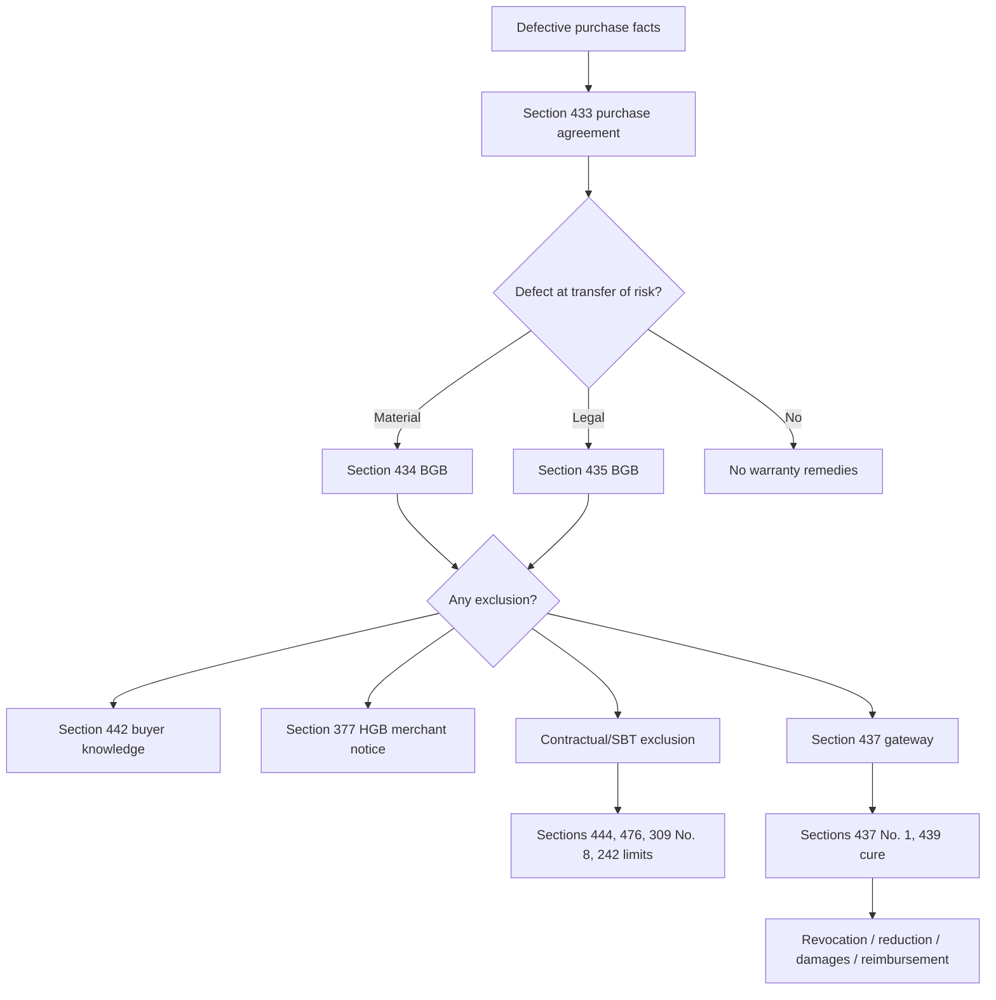

# Week 08: Warranty Rights I - Context

Source note: `business-law/wiki/week-08-warranty-rights-i/week-08-warranty-rights-i.md`
Source file: `business-law/raw/moodle-export-business-law-950848572-s26-20260628/08.06. - Warranty Rights I - Haag/Warranty Rights I.pdf`
Processed: 2026-06-28

Statutory anchors were cross-checked against official Gesetze-im-Internet BGB/HGB sources on 2026-06-28. The English translations are useful for study, but the official German text controls for exact legal wording.

## Canonical Case Route

```text
valid purchase agreement under Section 433 BGB
-> defect at transfer of risk
-> no exclusion of warranty rights
-> correct Section 437 BGB remedy
```

Use this route whenever the facts say that a sold thing is broken, unsuitable, different from what was ordered, legally encumbered, or missing expected features.

## Core Contract And Defect Terms

| Term | Definition | Aliases to avoid |
|---|---|---|
| Purchase Agreement | Obligation contract under which the seller must deliver and transfer ownership of a thing free from defects, and the buyer must pay and accept delivery. | Sale itself as ownership transfer |
| Seller's Defective Performance | The seller does not provide the defect-free performance owed under the purchase agreement. | Bad product only |
| Warranty Rights | Special buyer remedies after a defective purchase performance, routed through Section 437 BGB. | General complaint rights |
| Material Defect | The actual physical, functional, or contractual condition of the thing deviates from the required condition under Section 434 BGB. | Damage, bad quality, flaw |
| Legal Defect | A third party right burdens the thing or prevents the buyer from receiving the legal position owed. | Title problem only |
| Actual Condition | The real state of the delivered thing at the legally relevant time. | Delivered state without timing |
| Required Condition | The condition the buyer is legally entitled to receive, based on contract, ordinary expectations, assembly rules, and aliud rules. | Ideal quality |
| Deviation | The gap between actual condition and required condition. | Significant defect |
| Transfer Of Risk | The point from which the buyer normally bears accidental loss or deterioration, usually delivery under Section 446 BGB. | Contract signing |
| Defect At Transfer Of Risk | The defect already existed when risk passed to the buyer. | Defect discovered later |

### Real-World Examples

| Facts | Canonical Label | Why |
|---|---|---|
| A car is sold as accident-free but had a prior serious accident. | Material defect by agreed quality | The contract expectation is not met. |
| A laptop battery is bought after the buyer tells the seller the laptop model, but it does not fit. | Material defect by intended contractual use | The seller knew the special use. |
| A buyer receives a different machine model than ordered. | Aliud delivery | A different thing is treated as defective delivery. |
| A sold property is subject to an undisclosed lease right. | Legal defect | A third party right burdens the buyer's legal position. |

## Section 434 Language

| Term | Definition | Aliases to avoid |
|---|---|---|
| Subjective Requirement | Contract-specific requirement created by the parties' agreement, intended use, or agreed accessories/instructions. | Personal preference |
| Agreed Quality | Quality expressly or tacitly promised by the parties. | Marketing talk automatically |
| Intended Contractual Use | Special use known to the seller and made part of the contractual expectation. | Any use buyer privately wanted |
| Objective Requirement | Baseline product expectation independent of special agreement, such as customary use and usual quality. | Default warranty |
| Customary Use | Ordinary use for goods of the same kind. | Buyer's special purpose |
| Usual Quality | Quality a buyer can normally expect from goods of the same type. | Perfect quality |
| Public Statement | Seller or supply-chain statement that can shape objective expectations if legally relevant. | Every advertisement automatically |
| Assembly Defect | Defect caused by owed assembly, defective assembly instructions, or faulty integration where assembly is legally relevant. | Any installation problem |
| Aliud Delivery | Delivery of a different thing, treated as a material defect. | Wrong performance outside warranty |

### Mental Model

```text
Subjective = what this contract promised.
Objective = what this product type normally must provide.
Assembly = did the setup/instructions produce a defect?
Aliud = was the wrong thing delivered?
```

Exam correction: start with the strongest subjective requirement if the facts contain a promise such as "new", "accident-free", "compatible with X", or "model Y". Use objective requirements when the contract is silent or the ordinary product baseline matters.

## Remedies And Their Order

| Term | Definition | Aliases to avoid |
|---|---|---|
| Section 437 Gateway | Referral provision listing buyer remedies after a defect. It points into cure, revocation, reduction, damages, and reimbursement rules. | Remedy itself |
| Cure | Primary remedy under Section 439 BGB: repair or replacement. | Compensation |
| Repair | Cure by removing the defect from the delivered thing. | Reduction |
| Replacement Delivery | Cure by delivering a defect-free substitute thing. | New purchase |
| Second Chance Principle | Seller normally receives an opportunity to cure before stronger secondary remedies are used. | Seller always wins |
| Disproportionate Cure | Seller may refuse the buyer's selected cure type if it is possible only at disproportionate expense. | Seller inconvenience |
| Revocation | Buyer unwinds the contract and returns performances if requirements are met. | Rescission |
| Reduction | Buyer keeps the defective thing and lowers the price proportionally. | Discount by repair cost automatically |
| Damages | Monetary compensation routed through Section 437 No. 3 and Sections 280 et seq. BGB. | Price reduction |
| Reimbursement Of Futile Expenses | Recovery of reliance expenses under Section 284 BGB instead of damages in lieu. | Any cost refund |

### Reduction Formula

```text
reduced price = agreed price x actual value / defect-free value
```

Worked example:

```text
agreed price = EUR 10,000
defect-free value = EUR 10,000
actual value with defect = EUR 7,000
reduced price = 10,000 x 7,000 / 10,000 = EUR 7,000
price reduction = 10,000 - 7,000 = EUR 3,000
```

Interpretation: reduction preserves the contract but adjusts the price to match the lower value of the defective thing.

## Exclusion And Limitation Terms

| Term | Definition | Aliases to avoid |
|---|---|---|
| Contractual Warranty Exclusion | Agreement or clause attempting to limit buyer remedies. | Seller disclaimer always valid |
| Fraudulent Concealment | Seller intentionally hides the defect; Section 444 blocks reliance on an exclusion. | Mere silence always |
| Guarantee Of Quality | Seller assumes heightened responsibility for a quality; exclusions cannot defeat that guarantee. | Ordinary description |
| Buyer Knowledge | Buyer knew the defect at contract conclusion; warranty rights can be excluded under Section 442 BGB. | Buyer discovered later |
| Grossly Negligent Ignorance | Buyer misses an obvious defect through serious carelessness; rights may be limited unless seller acted fraudulently or guaranteed quality. | Simple mistake |
| Commercial Inspection Duty | Merchant buyer's duty under Section 377 HGB to inspect and notify defects in time in a commercial sale. | General consumer duty |
| Goods Deemed Approved | Consequence under Section 377 HGB when a merchant buyer fails to inspect/notify properly. | Goods become defect-free |
| Limitation Period | Time period after which claims may become unenforceable. | Right disappears immediately |
| Consumer Purchase Contract | Trader-to-consumer sale of goods with special protective rules. | Any buyer-friendly case |

## Statutory Anchors

| Section | Canonical Function | Trigger Facts | Exam Use |
|---|---|---|---|
| Section 433 BGB | Purchase agreement duties | Sale of thing for price | Start warranty analysis with the valid purchase agreement and seller duty to deliver defect-free. |
| Section 434 BGB | Material defect | Thing differs from contract, ordinary expectation, assembly expectation, or ordered identity | Main defect anchor for physical/functional problems. |
| Section 435 BGB | Legal defect | Third party right burdens the thing | Use when ownership, lease, lien, or other third party right disturbs buyer's legal position. |
| Section 437 BGB | Buyer remedy gateway | Defect exists | Route to cure, revocation, reduction, damages, or reimbursement. |
| Section 439 BGB | Cure | Buyer asks repair or replacement | First remedy to test before most secondary remedies. |
| Section 440 BGB | Cure exceptions and failed cure | Cure refused, failed, or unreasonable | Explain why no further grace period is needed before revocation/damages. |
| Section 441 BGB | Reduction | Buyer keeps defective thing but wants price decrease | Apply proportional reduction formula. |
| Section 442 BGB | Buyer knowledge exclusion | Buyer knew or grossly negligently missed defect at contract conclusion | Check before granting remedies. |
| Section 444 BGB | Limit on exclusions | Fraudulent concealment or guarantee | Blocks seller reliance on exclusion clauses. |
| Section 446 BGB | Transfer of risk | Handover/delivery of purchased thing | Fix the decisive timing for defect existence. |
| Sections 474-479 BGB | Consumer purchase modifications | Trader sells goods to consumer | Identify B2C protective layer. |
| Section 476 BGB | Consumer warranty deviation limit | Clause limiting consumer rights before defect notification | Test validity of warranty limitations in consumer sales. |
| Section 477 BGB | Burden-of-proof presumption | Defect appears after delivery in consumer purchase | Helps buyer prove defect existed at transfer of risk. |
| Section 438 BGB | Limitation | Time has passed since delivery | Check whether claims are time-barred. |
| Section 309 No. 8 BGB | SBT limit on warranty exclusions | Standard terms for newly produced goods | Use when seller hides warranty exclusion in standard terms. |
| Section 242 BGB | Good faith | Seller promises quality but tries to exclude liability for it | Prevent contradictory reliance on a clause. |
| Section 377 HGB | Merchant inspection and notice | Commercial sale between merchants | Ask whether goods are deemed approved due to late notice. |
| Sections 346-348 BGB | Restitution after revocation | Contract unwound after valid revocation | State return of performances after revocation. |

## Relationships Between Canonical Terms

- **Purchase Agreement** creates the seller's duty to deliver a thing free from **Material Defects** and **Legal Defects**.
- **Defect At Transfer Of Risk** is the gateway into **Warranty Rights**.
- **Section 437 Gateway** does not replace remedy requirements; it points to **Cure**, **Revocation**, **Reduction**, **Damages**, and **Reimbursement Of Futile Expenses**.
- **Cure** usually comes before **Revocation**, **Reduction**, and many damages routes because of the **Second Chance Principle**.
- **Consumer Purchase Contract** can neutralize a **Contractual Warranty Exclusion** and strengthen proof through Section 477 BGB.
- **Commercial Inspection Duty** is the merchant-side counterweight: a B2B buyer can lose warranty rights by late inspection/notice.

## Mermaid Memory Map



## Example Dialogue

Professor: "The buyer found the defect two weeks after delivery. What timing do you test?"

Student: "I test whether the defect existed at transfer of risk, usually delivery under Section 446 BGB. Discovery later is not enough by itself."

Professor: "The seller's standard terms exclude all warranty rights for a new machine. Is that the end?"

Student: "No. I check SBT controls, especially Section 309 No. 8 BGB, and also Section 444 BGB if the seller concealed the defect or guaranteed quality."

Professor: "The buyer wants the purchase price lowered but keeps the machine."

Student: "That is reduction under Section 441 BGB, not revocation. I use the proportional formula."

## Ambiguities And Exam Traps

| Ambiguity / Trap | Canonical Recommendation |
|---|---|
| Treating discovery date as defect date | Always ask whether the defect existed at transfer of risk. |
| Calling every exit "rescission" | Use revocation for unwinding a valid contract due to defective performance; reserve rescission for flawed declarations of intent. |
| Skipping cure | Test cure priority unless facts clearly show refusal, failure, impossibility, or unreasonable cure. |
| Equating reduction with repair cost | Use the Section 441 III proportional value formula unless the deck/exam gives a simplified instruction. |
| Ignoring B2C/B2B status | Consumer purchases protect buyers; merchant purchases can trigger Section 377 HGB duties. |
| Using Section 437 as if it contains all requirements | Say Section 437 is the gateway, then cite the specific remedy rule. |

## Cheat-Sheet Language

```text
The buyer may rely on warranty rights only if a valid purchase agreement exists, the item was defective at transfer of risk, no exclusion applies, and the chosen remedy satisfies the requirements of Section 437 BGB and the referred remedy provision.
```

