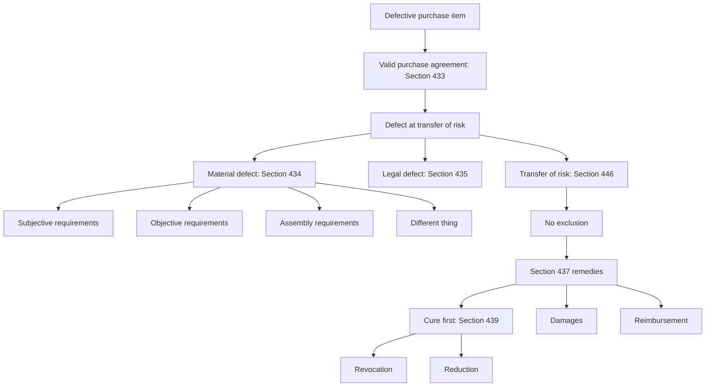

# Week 08: Warranty Rights I

Source: `business-law/raw/moodle-export-business-law-950848572-s26-20260628/08.06. - Warranty Rights I - Haag/Warranty Rights I.pdf`
Exercise sources processed 2026-07-09:

- `business-law/raw/moodle-export-business-law-950848573-s26-20260709/17.6. Warranty Rights I/Warranty Rights I Case facts.pdf`
- `business-law/raw/moodle-export-business-law-950848573-s26-20260709/17.6. Warranty Rights I/Warranty Rights I_Slides and Solutions.pdf`

Course: Business Law
Processed: 2026-06-28
Wiki note: `business-law/wiki/week-08-warranty-rights-i/week-08-warranty-rights-i.md`

Course direction checked against `business-law/wiki/_course-logistics.md`: Warranty Rights I is Session 8 in the teaching outline and follows Agency. The deck labels itself "Lecture 7"; this note follows the course outline as Week 08.

External statute check: statutory anchors were cross-checked against the official Gesetze-im-Internet BGB/HGB sources on 2026-06-28. The official English BGB translation notes that English translations may lag the current German text, so use the lecture sections and the current German statute for exact wording in legal work.

## 80/20 Exam Summary

Warranty Rights I explains when the buyer gets special remedies because the purchased thing is defective.

- Start with a valid purchase agreement under Section 433 BGB.
- Ask whether the seller delivered the thing free from material and legal defects.
- A material defect under Section 434 BGB is a deviation between actual condition and legally required condition at transfer of risk.
- Section 434 BGB has several entry points: subjective requirements, objective requirements, assembly requirements, and aliud delivery.
- The decisive time is transfer of risk, usually delivery under Section 446 BGB.
- Before transfer of risk, use general impaired-performance law; after transfer of risk, use warranty law.
- Section 437 BGB is the gateway for buyer remedies: cure, revocation, reduction, damages, and reimbursement.
- Cure under Section 439 BGB has regular priority because the seller gets a second chance.
- Revocation and reduction are secondary remedies. Reduction uses the Section 441 III proportional formula.
- Warranty rights can be excluded contractually or statutorily, but exclusions have limits, especially fraud/guarantee, consumer purchases, SBT rules, buyer knowledge, commercial inspection duties, and limitation.

## Contract Law Continuity Bridge

Warranty law is not a new contract-formation topic. It starts after a valid purchase contract exists.

```text
Contract Law I: Was a contract formed?
Agency: Whose declaration counts?
SBT: Which clauses became part of the contract?
Warranty Rights: Was the purchased thing defective, and what can the buyer do?
```

Exam routing:

```text
valid purchase agreement
-> defect at transfer of risk
-> no exclusion
-> correct remedy under Section 437 BGB
```

## Case-Solving Structure

Use this structure whenever the facts mention a defective purchase item:

1. Valid purchase agreement under Section 433 BGB.
2. Defect at transfer of risk.
3. No exclusion of warranty rights.
4. Remedy under Section 437 BGB.

Why this matters: if you jump straight to damages or revocation, you may miss the gateway question. Warranty remedies only apply if the buyer can first show a relevant defect at the correct time.

## Purchase Agreement Duties

Section 433 BGB gives the basic exchange:

| Party | Core duty | Exam relevance |
|---|---|---|
| Seller | Deliver the thing and procure ownership, free from material and legal defects. | Defective performance triggers warranty analysis. |
| Buyer | Pay the purchase price and accept delivery. | Buyer breach is handled by general performance rules, not buyer warranty law. |

Warranty law mainly regulates the seller's defective performance.

## Defects

The deck distinguishes material defects and legal defects.

| Defect type | Statutory anchor | Meaning | Example |
|---|---|---|---|
| Material defect | Section 434 BGB | The thing's actual condition deviates from the condition legally required. | Used car sold as "new"; laptop battery not suitable for the laptop. |
| Legal defect | Section 435 BGB | Third parties have rights affecting the sold thing. | Sold real property is subject to another person's lease. |

Memory hook:

```text
Material defect = something is wrong with the thing's condition.
Legal defect = someone else's right burdens the thing.
```

The intensity of the deviation is generally not the starting point. First ask whether there is a deviation at all; significance becomes important later, especially for revocation exclusions.

## Material Defect Under Section 434 BGB

The deck uses a negative definition:

```text
defect = actual condition differs from required condition
```

The required condition can come from several layers.

### Subjective Requirements

Subjective requirements come from the parties' contract.

| Requirement | Anchor | Trigger facts | Example |
|---|---|---|---|
| Agreed quality | Section 434 II 1 No. 1 BGB | Parties expressly or tacitly agree a quality. | "New car" implies no micro-scratches, current unchanged model, not unused on dealer lot for more than 12 months. |
| Intended contractual use | Section 434 II 1 No. 2 BGB | No precise quality agreed, but seller knows the special intended use. | Battery bought in shop for a specific laptop. |
| Agreed accessories/instructions | Section 434 II 1 No. 3 BGB | Contract includes agreed accessories or instructions. | Device sold with required manual or agreed accessory. |

Exam sentence:

```text
The strongest defect argument is usually a subjective one, because the contract itself defines what the buyer was entitled to receive.
```

### Objective Requirements

Objective requirements protect baseline expectations even if the contract is silent.

| Requirement | Anchor | Trigger facts |
|---|---|---|
| Customary use | Section 434 III 1 No. 1 BGB | The thing is not fit for normal use. |
| Usual quality in things of the same kind | Section 434 III 1 No. 2 BGB | The thing falls below legitimate expectations for that product type. |
| Quality of sample/specimen | Section 434 III 1 No. 3 BGB | The delivered item differs from sample/specimen quality. |
| Accessories/instructions | Section 434 III 1 No. 4 BGB | Usual accessories or instructions are missing. |

Public statements can shape legitimate expectations, especially statements by the seller or supply-chain parties.

Exam trap: do not use subjective and objective requirements as vague synonyms. Subjective = contract-specific expectation. Objective = ordinary market/product expectation.

### Assembly Requirements

Assembly requirements matter only if assembly is owed or instructions matter.

```text
If no assembly is owed, do not force an assembly analysis.
```

A defect can arise when assembly is faulty or when defective instructions cause bad assembly.

### Aliud Delivery

Aliud delivery means delivery of a different thing.

```text
Different thing = defect under Section 434 V BGB.
```

Example: the buyer orders a specific model, but the seller delivers a different model.

## Transfer Of Risk

The decisive time for warranty law is transfer of risk.

```text
contract conclusion -> before transfer of risk: general impaired-performance law
transfer of risk -> after transfer of risk: warranty law
```

Usually:

```text
transfer of risk = handing over / delivery of the thing under Section 446 sentence 1 BGB
```

Why this matters: after transfer of risk, the buyer generally bears accidental destruction/deterioration and must pay the purchase price even if the thing later deteriorates accidentally. Therefore, the buyer must show the defect existed at transfer of risk, not merely later.

Clarification: transfer of risk is not the cure deadline.

```text
contract concluded
-> delivery / handover = transfer of risk
-> defect must already exist here
-> buyer discovers defect later
-> buyer demands cure / sets cure period
```

Example: if a laptop is handed over on Monday and an internal battery defect is discovered on Wednesday, warranty law can still apply if the battery problem already existed at handover. If the buyer spills coffee on the laptop after handover, that later damage is not a seller warranty defect.

Exam wording:

```text
Transfer of risk decides whether the defect belongs to the seller's warranty responsibility. The cure deadline decides whether the buyer may move from cure to secondary remedies.
```

## Exclusions Of Warranty Rights

Warranty rights can fail even if there is a defect.

### Contractual Exclusion

The parties may try to exclude or limit warranty rights by individual agreement or standard business terms.

Important limits:

| Limit | Anchor | Meaning |
|---|---|---|
| Fraudulent concealment / guarantee | Section 444 BGB | Seller cannot rely on exclusion if seller concealed the defect or guaranteed quality. |
| New goods in SBT | Section 309 No. 8 BGB | SBT rules restrict warranty exclusions for newly produced goods. |
| Contradiction to agreed quality | Section 242 BGB | Seller cannot agree a quality and then exclude responsibility for that same quality. |
| Consumer purchase | Section 476 BGB | B2C rules allow only limited deviations before defect notification. |

### Consumer Purchase Contract

Consumer purchase contract:

```text
trader sells a good to a consumer
```

Relevant protections:

- modified general warranty rules in Sections 474-479 BGB;
- burden-of-proof shift under Section 477 BGB;
- limited ability to derogate from warranty rights before defect notification under Section 476 BGB;
- easier seller recourse against supplier.

Exam trap: identify B2C status early. The same clause that might work in B2B can fail in consumer sales.

### Statutory Exclusions

| Exclusion | Anchor | Trigger facts | Effect |
|---|---|---|---|
| Buyer knowledge | Section 442 BGB | Buyer knew the defect at contract conclusion or was grossly negligent. | Warranty rights can be excluded. |
| Commercial inspection/notification | Section 377 HGB | Commercial sale between merchants; buyer fails to inspect and notify defects in time. | Goods may be deemed approved; warranty rights may be lost. |
| Limitation | Section 438 BGB | Claim is time-barred. | Buyer may be unable to enforce warranty rights. |

Limitation examples from the deck:

- movable thing with material defect: 2 years under Section 438 I No. 3 BGB;
- buildings: 5 years under Section 438 I No. 2 BGB.

## Legal Remedies Under Section 437 BGB

Section 437 BGB is a referral provision. It does not itself contain every requirement; it points to the remedy provisions.

| Remedy | Anchor | Function |
|---|---|---|
| Cure | Sections 437 No. 1, 439 BGB | Buyer demands repair or replacement. |
| Revocation | Sections 437 No. 2, 323/326 V BGB, plus Section 440 BGB | Buyer unwinds the contract after cure priority is respected or excused. |
| Reduction | Sections 437 No. 2, 441 BGB | Buyer keeps the thing but lowers price. |
| Damages | Section 437 No. 3 plus Sections 280 et seq. BGB | Buyer claims compensation. |
| Reimbursement | Section 437 No. 3 plus Section 284 BGB | Buyer claims futile expenses instead of damages in lieu. |

Tiered relationship:

```text
cure first as regular second chance
-> if cure fails/refused/unreasonable or period expires
-> revocation, reduction, damages, reimbursement depending on facts
```

Exam trap: Section 437 is an exhaustive list. The buyer generally has no right to self-help at the seller's expense outside the statutory route.

## Cure

Cure is the primary remedy.

Core idea:

```text
defective delivery modifies the original performance claim into a cure claim.
```

Buyer can generally choose:

- re-delivery / replacement;
- rectification / repair.

Seller's limits:

- refusal under Section 439 IV BGB if the chosen type of cure is possible only at disproportionate expense;
- general impossibility limits under Section 275 BGB.

Factors for disproportion:

- value of thing free from defect;
- importance of the defect;
- whether alternative cure is possible without substantial disadvantages;
- relative versus absolute disproportion.

Costs:

- seller bears cure costs under Section 439 II BGB;
- seller can bear removal/installation-related cure costs under Section 439 III BGB;
- if replacement is delivered, seller has a restitution claim for the defective thing under Section 439 V BGB.

### Cure Priority, Not Negotiation

Warranty law does not require a commercial negotiation in the everyday sense. It requires a cure stage:

```text
defect at transfer of risk
-> buyer demands cure
-> buyer chooses repair or replacement
-> seller must cure unless a valid refusal reason applies
```

If buyer and seller disagree about the type of cure, do not jump straight to revocation. First ask whether the seller can validly refuse the buyer's chosen cure type under Section 439 IV BGB. If replacement is disproportionate but repair is reasonable, the buyer is usually limited to repair.

Example: a EUR 100 pair of headphones has a small button defect. A one-day repair costs EUR 20 and makes the headphones flawless. Replacement costs EUR 100 plus return and handling costs. The buyer initially may choose replacement, but the seller can likely refuse replacement as disproportionate. The buyer can still demand repair.

Opposite example: a new phone overheats unpredictably. Repair would require opening the device, replacing major components, and waiting weeks. Replacement is available quickly. Replacement is less likely to be disproportionate because the defect is serious and repair creates a substantial disadvantage for the buyer.

Exam wording:

```text
The buyer may choose repair or replacement under Section 439 I BGB, but the seller may refuse the chosen type under Section 439 IV BGB if it is possible only at disproportionate expense. In that case, the buyer is restricted to the alternative cure type unless that too can be refused.
```

## Revocation

Revocation is a secondary remedy.

Basic route:

```text
defect
-> buyer demands cure / sets additional period
-> cure fails or is refused/unreasonable
-> buyer revokes
-> restitution under Sections 346-348 BGB
```

Important exceptions from the additional-period requirement:

| Situation | Anchor | Exam use |
|---|---|---|
| Seller refuses both kinds of cure | Section 439 IV BGB and Section 440 BGB logic | No meaningful second chance remains. |
| Cure failed | Section 440 sentence 1 alternative 2 BGB | Generally after second failed attempt, but facts can justify more attempts. |
| Cure unreasonable for buyer | Section 440 sentence 1 alternative 3 BGB | Cure takes too long or creates serious disadvantages. |

Revocation can be excluded:

| Exclusion | Anchor | Meaning |
|---|---|---|
| Insignificant defect | Section 323 V BGB | Minor defect does not justify revocation. |
| Buyer responsible | Section 323 VI alternative 1 BGB | Buyer mainly caused the defect. |
| Buyer in default of acceptance | Section 323 VI alternative 2 BGB | Buyer caused the non-performance situation by not accepting. |

Effect:

```text
performances are returned under Sections 346-348 BGB
claim for cure and right to reduction are extinguished
damages/reimbursement may remain in principle
```

Warranty revocation is the purchase-defect version of general contract-law revocation. It is not rescission of a declaration of intent. The contract remains valid until it is unwound because defective performance has not been cured.

```text
General Section 323 route:
breach -> reasonable deadline to perform -> no proper performance -> revocation

Warranty route:
defect at transfer of risk -> Section 437 gateway -> cure under Section 439
-> cure fails/refused/unreasonable or deadline expires
-> revocation via Sections 437 No. 2, 440, 323 BGB
```

Exam correction: mere disagreement about the preferred cure type is not enough for revocation. Revocation becomes available only if cure as such fails, is refused, is impossible, unreasonable, or the required period expires.

## Reduction

Reduction is the price-lowering alternative to revocation.

```text
Instead of revoking, the buyer declares reduction to the seller.
```

Basic relationship:

```text
reduction has roughly the same requirements as revocation,
but the insignificance exclusion under Section 323 V sentence 2 BGB does not apply.
```

Formula under Section 441 III BGB:

```text
reduced price = value with defect x agreed price / value without defect
```

Worked example:

```text
agreed price = EUR 1000
value without defect = EUR 1000
value with defect = EUR 700

reduced price = 700 x 1000 / 1000
reduced price = EUR 700
overpayment if buyer already paid = 1000 - 700 = EUR 300
```

Interpretation:

```text
Reduction preserves the contract but adjusts the price proportionally to the defect.
```

Before payment, the buyer can object and refuse the excessive amount. After payment, the buyer can reclaim overpayment through Section 441 IV and restitution rules.

## Visual Knowledge Map



## Subject Knowledge Graph

| Node | Meaning | Exam Relevance |
|---|---|---|
| Purchase Agreement | Contract under Section 433 BGB. | Gateway to warranty rights. |
| Seller Duty Free From Defects | Seller must deliver and transfer ownership free of material/legal defects. | Breach basis for warranty law. |
| Material Defect | Non-conformity under Section 434 BGB. | Main defect category. |
| Legal Defect | Third-party rights burden the good under Section 435 BGB. | Less common but easy to miss. |
| Transfer Of Risk | Moment that separates general performance law from warranty law. | Decisive timing issue. |
| Contractual Exclusion | Clauses or agreements limiting warranty. | Must check limits. |
| Statutory Exclusion | Buyer knowledge, HGB notification duty, limitation. | Can block remedies. |
| Section 437 Gateway | Referral provision for buyer remedies. | Exam routing anchor. |
| Cure | Primary remedy. | Second-chance logic. |
| Revocation | Secondary contract-unwinding remedy. | Requires cure route unless exception. |
| Reduction | Price adjustment. | Uses proportional formula. |

| From | Relationship | To | Why It Matters |
|---|---|---|---|
| Purchase Agreement | creates | Seller Duty Free From Defects | Warranty starts from Section 433 performance duties. |
| Material Defect | must exist at | Transfer Of Risk | Later deterioration is not enough. |
| Section 437 Gateway | refers to | Cure / Revocation / Reduction | Section 437 is not the full test. |
| Cure | usually precedes | Revocation / Reduction / Damages | Seller's second chance is central. |
| Contractual Exclusion | is limited by | Section 444 / Section 476 / SBT rules | Exclusion clauses are not always valid. |
| Reduction | preserves | Purchase Agreement | Buyer keeps item but pays less. |

## Real Business Examples

- A retailer sells a laptop as compatible with a specific docking station, but it is not. This is likely a subjective/intended-use defect.
- A used car dealer advertises a car as accident-free, but it had structural accident damage. The agreed or expected quality may be missing.
- A company buys machinery from a merchant seller and fails to inspect it after delivery. Section 377 HGB can become decisive.
- A consumer buys a sofa online and discovers defective assembly instructions. Consumer purchase rules can limit seller-friendly exclusions.

## Exam Relevance

Likely prompts:

- Build the warranty-rights case structure for a defective purchased item.
- Distinguish material and legal defects.
- Identify whether the defect falls under subjective, objective, assembly, or aliud delivery rules.
- Explain why transfer of risk matters.
- Check whether warranty rights are excluded.
- Explain the cure-first logic.
- Distinguish revocation and reduction.
- Apply the reduction formula.

Common traps:

- Starting with Section 437 without first proving a defect.
- Forgetting transfer of risk.
- Treating every buyer complaint as a material defect.
- Ignoring contractual or statutory exclusions.
- Revoking immediately without respecting cure.
- Confusing reduction with damages.
- Using Section 377 HGB in non-commercial/consumer settings.

High-scoring answer structure:

1. "There is a valid purchase agreement under Section 433 BGB."
2. "The item may be defective under Section 434/435 BGB at transfer of risk."
3. "No warranty exclusion appears / possible exclusion must be checked."
4. "The buyer's remedy is routed through Section 437 BGB."
5. "Cure has priority unless an exception applies."
6. "If the requested remedy is revocation/reduction/damages, add the specific requirements."

## Official Exercise Case Routes

### Case 1a: Headphones, Broken Active Noise Cancelling

Question: can C demand cure by replacement delivery?

Route:

1. Purchase agreement: C buys headphones from O's electronics store; employee E's declaration is attributed to O through agency.
2. Material defect: no special subjective agreement exists, but comparable high-priced headphones normally have working active noise cancelling. The headphones fail objective requirements under Section 434 III 1 No. 2 BGB.
3. Transfer of risk: E handed over the headphones ten months earlier. It is unclear whether the defect existed then.
4. Burden of proof: this is a consumer-goods sale under Section 474 I BGB: C is a consumer, O is a trader, and headphones are movable goods. Because the defect appears within one year, Section 477 BGB presumes it already existed at transfer of risk.
5. No contractual or statutory exclusion appears.
6. Cure: C chooses replacement delivery under Section 439 I Alt. 2 BGB.

Result: C can demand replacement headphones, against return of the old headphones under Sections 439 VI and 346 I BGB.

Exam trap: late discovery is not automatically fatal in a consumer-goods sale; check Section 477 BGB.

### Case 1b: Advertising Claims About Active Noise Cancelling

Question: can C demand replacement when the normal function works but the advertised "twice as good" function does not?

Route:

1. Purchase agreement exists.
2. Subjective requirements are not breached because C and O made no specific individual agreement on the stronger function.
3. Objective requirements are breached because public manufacturer advertising can shape usual quality under Section 434 III 1 No. 2 b BGB.
4. The seller is not released under Section 434 III 3 BGB: O knew or had reason to know of the advertisement because it was displayed in O's store; it had not been corrected; and it influenced C's purchase.
5. Defect existed at transfer of risk because the production defect was built in from the beginning.
6. Cure and return route are the same as Case 1a.

Result: C can demand replacement delivery.

Exam trap: public advertising can create an objective-quality defect even without an individual agreement.

### Case 1c: Replacement Delivery Versus Cheap Repair

Source status: the extracted case-facts PDF contains this subcase, but the extracted solution deck ends before an official solution. The following is an inferred answer route from the lecture framework.

Question: can C insist on replacement delivery when repair is quick, flawless, and much cheaper?

Route:

1. C initially has the buyer's choice under Section 439 I BGB: repair or replacement.
2. O may refuse the selected cure type under Section 439 IV BGB if replacement is possible only at disproportionate cost.
3. Factors favoring O: replacement creates extra return/manufacturer handling costs of EUR 60, repair costs EUR 20, repair is easy, flawless, and takes one day.
4. Factors favoring C: C bought a new product and prefers not to receive a repaired one.
5. Likely weighing: a one-day flawless repair creates no significant disadvantage for C compared with the disproportionate extra burden of replacement.

Likely result: C cannot insist on replacement delivery, but can still demand repair.

Exam trap: buyer's cure choice is strong but not absolute.

## Retrieval Prompts

Closed-book questions:

1. What is the four-step structure for a warranty-rights case?
2. What is the difference between material defect and legal defect?
3. Why is transfer of risk decisive?
4. What are the four material-defect routes in Section 434 BGB?
5. Why does cure usually come before revocation?
6. How does the Section 441 III reduction formula work?

Application prompts:

1. Buyer purchases a "new car" with scratches and an outdated model year. Which defect route is strongest?
2. Buyer knew about a defect before concluding the contract. Which exclusion do you check?
3. Merchant buyer receives goods and does not inspect them for weeks. Which HGB issue arises?
4. Seller repairs twice and the same defect remains. What remedy route opens?
5. Defective thing worth EUR 600 instead of EUR 1000; price was EUR 900. Calculate the reduced price.

## Practice Tasks

1. Write a 10-line issue-spotting answer for a defective laptop battery sold for a known unusual laptop model.
2. Create a defect classification table with one example each for subjective, objective, assembly, and aliud defects.
3. Explain in plain language why the seller gets a second chance to cure.
4. Apply Section 441 III to: agreed price EUR 500, value without defect EUR 600, value with defect EUR 300.
5. Draft the first paragraph of an exam answer for a B2B buyer who discovers a defect after delivery but did not notify promptly.

## Connections

Previous notes from this lecture:

- [Week 03 Contract Law I](../week-03-contract-law-i/week-03-contract-law-i.md): contract formation and validity are prerequisites.
- [Week 05 Contract Law III](../week-05-contract-law-iii-withdrawal-cancellation-dissolution/week-05-contract-law-iii-withdrawal-cancellation-dissolution.md): revocation and restitution logic reappear inside warranty remedies.
- [Week 06 Standard Business Terms](../week-06-standard-business-terms/week-06-standard-business-terms.md): warranty exclusions in SBT must pass SBT control.
- [Week 07 Agency](../week-07-agency/week-07-agency.md): if the purchase contract was concluded through an agent, solve agency before warranty.

Future notes:

- [Week 09 Warranty Rights II](../week-09-warranty-rights-ii/week-09-warranty-rights-ii.md): damages, reimbursement, and work-contract warranty rights.

Cross-course links:

- SCM/Marketing: product quality promises and after-sale service affect customer value, but Business Law asks which statutory remedy follows from the defect.

## Weakness Flags

- Pending active recall: no first-pass retrieval has been completed yet.
- High-risk issue: distinguishing defect existence from remedy choice.
- High-risk issue: checking transfer of risk and exclusions before Section 437 remedies.
