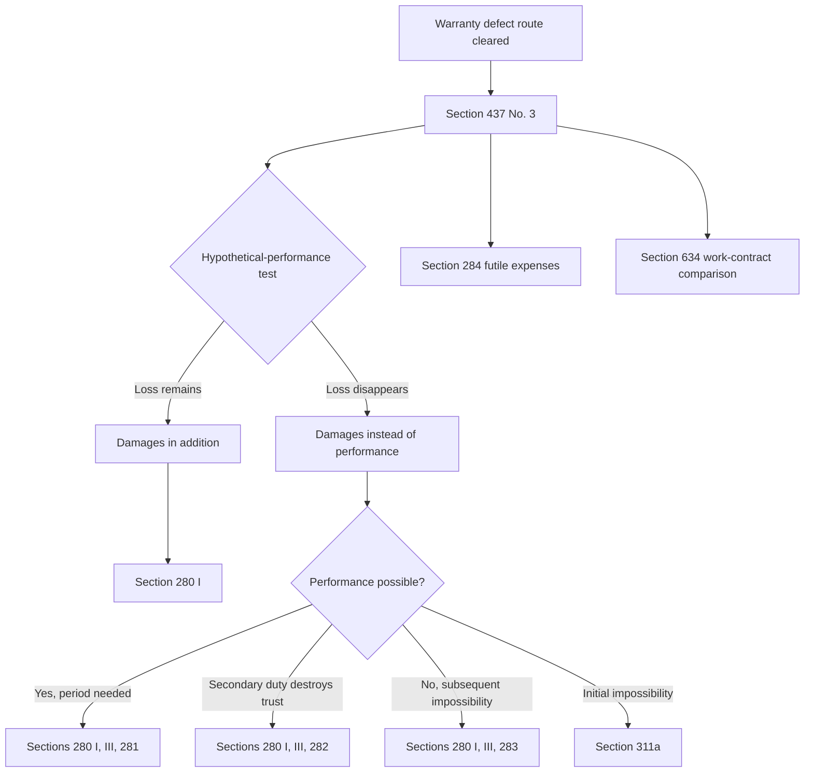

# Week 09: Warranty Rights II - Context

Source note: `business-law/wiki/week-09-warranty-rights-ii/week-09-warranty-rights-ii.md`
Source file: `business-law/raw/moodle-export-business-law-950848572-s26-20260628/15.06. - Warranty Rights II - Haag/Warranty Rights II.pdf`
Processed: 2026-06-28

Statutory anchors were cross-checked against the official Gesetze-im-Internet BGB source on 2026-06-28. Use the current German statute for exact legal wording in exam/legal work.

## Canonical Damages Route

```text
valid purchase agreement
-> defect at transfer of risk
-> no exclusion
-> Section 437 No. 3 BGB
-> classify damage type
-> apply correct Sections 280 et seq. route or Section 284 BGB
```

Week 08 answers whether warranty rights exist. Week 09 answers which damages/reimbursement route fits the loss.

## Damages Classification Terms

| Term | Definition | Aliases to avoid |
|---|---|---|
| Damages In Addition To Performance | Compensation for loss that would remain even if proper performance were rendered at the latest possible time. | Any extra damage |
| Damages Instead Of Performance | Compensation that replaces the missing or defective performance because proper performance would have avoided the loss. | General damages |
| Hypothetical-Performance Test | Ask whether the claimed loss would still exist if proper performance happened at the latest possible time. | But-for causation only |
| Right To Revoke | The buyer satisfies the substantive revocation requirements, but the contract is not revoked until the buyer declares revocation. | revocation already exercised |
| Simple Damages | Damages under Section 280 I BGB without the extra requirements for damages instead of performance. | Easy damages |
| Malperformance | Performance occurs but is defective or not as owed. | Non-performance |
| Non-Performance | Performance is not rendered at all. | Late or defective performance automatically |
| Impossibility | Performance cannot be required under Section 275 BGB. | Hard performance |
| Initial Impossibility | Performance was impossible already at contract conclusion. | Later impossibility |
| Subsequent Impossibility | Performance becomes impossible after contract conclusion. | Initial defect |
| Secondary Duty Breach | Breach of protective/behavioral duties under Section 241 II BGB. | Bad manners only |

### Hypothetical-Performance Examples

| Claimed Loss | Would proper later performance remove it? | Classification |
|---|---:|---|
| Defective fuel damaged the buyer's engine. | No | Damages in addition to performance |
| Buyer wants the value gap between defect-free and defective goods. | Yes | Damages instead of performance |
| Buyer buys substitute goods because cure failed. | Yes | Damages instead of performance |
| Craftsman damages floor while performing work. | No | Damages in addition to performance |

## Section 280 I Building Blocks

| Term | Definition | Aliases to avoid |
|---|---|---|
| Contractual Obligation | Existing obligation relationship, often the purchase contract under Section 433 BGB. | Contract only if written |
| Breach Of Duty | Deviation from what the debtor owed, such as defective delivery or breach of a secondary duty. | Fault |
| Responsibility | Debtor is responsible, normally through intent or negligence; Section 280 I 2 BGB presumes responsibility. | Automatic liability |
| Intent | Knowing and willing breach or damage. | Carelessness |
| Negligence | Failure to observe required care under Section 276 BGB. | Bad outcome |
| Attributed Fault | Fault of a person used to perform an obligation can be attributed to the debtor under Section 278 BGB. | Vicarious liability in every relationship |
| Causal Damage | Loss caused by the breach and compensable under damages law. | Any disappointment |
| Difference Hypothesis | Compare the actual financial position with the hypothetical position without the damaging event. | Accounting loss only |

## Damage Measurement Terms

| Term | Definition | Aliases to avoid |
|---|---|---|
| Restitution In Kind | Restore the position that would exist without the damaging event, Section 249 I BGB. | Always money |
| Monetary Compensation | Money replacement where restoration is impossible, insufficient, or legally allowed. | Penalty |
| Material Damage | Economic loss measurable in money. | All losses |
| Immaterial Damage | Non-economic loss, compensable only where statute allows. | Pain always paid |
| Lost Profit | Profit likely earned without the damaging event, Section 252 BGB. | Speculation |
| Futile Expense | Voluntary expense made in reliance on performance that becomes wasted because performance fails. | Damage automatically |
| Personalized Reliance Expense | Expense tied to the expected performance in a way that loses value if performance fails, such as a custom cover for a machine. | general disappointment |

## Damages Instead Of Performance Terms

| Term | Definition | Aliases to avoid |
|---|---|---|
| Additional Period | Reasonable deadline set for performance/cure before damages instead of performance under Section 281 BGB. | Reminder only |
| Failed Cure | Cure attempt does not produce proper performance. | Buyer impatience |
| Unnecessary Period | Situation where a deadline is not needed, especially refusal, special circumstances, or Section 440 BGB purchase exceptions. | Deadline never needed |
| Small Damages | Buyer keeps the defective item and claims the value difference as damages instead of performance. | Reduction |
| Big Damages | Buyer gives up the whole performance and claims damages for non-fulfilment, often linked to substitute transaction losses. | Revocation automatically |
| Covering Purchase | Buyer obtains replacement goods elsewhere and claims extra cost if requirements are met. | Free upgrade |
| Insignificant Defect Exclusion | No damages instead of entire performance if the breach is insignificant. | No remedy at all |
| Partial Performance Still Useful | Entire-performance damages may be excluded if partial performance remains useful. | Buyer must accept everything |
| Legal Route | The statutory path that decides which requirements must be checked, even when two remedies produce similar money outcomes. | Economic result only |
| Price Adjustment | Contract price correction because the defective thing is worth less. | Compensation |
| Non-Fulfilment Loss | Loss caused because the buyer did not receive usable promised performance, such as substitute-purchase extra cost. | Purchase price refund automatically |

### Small Damages Versus Reduction

| Feature | Small Damages | Reduction |
|---|---|---|
| Route | Sections 437 No. 3, 280 I, III, 281 BGB | Sections 437 No. 2, 441 BGB |
| Buyer keeps thing? | Usually yes | Yes |
| Fault/responsibility needed? | Yes | No fault requirement |
| Deadline/cure logic? | Usually yes | Cure priority/exceptions matter |
| Economic intuition | Compensate performance deficit | Adjust price to reduced value |

### Big Damages Versus Revocation

| Feature | Big Damages | Revocation |
|---|---|---|
| Route | Sections 437 No. 3, 280 I, III, 281 BGB | Sections 437 No. 2, 323, 346 ff. BGB |
| Buyer gives up performance? | Usually yes | Yes |
| Fault/responsibility needed? | Yes | No fault requirement |
| Deadline/cure logic? | Usually yes | Cure priority/exceptions matter |
| Economic intuition | Compensate non-fulfilment loss, such as substitute-purchase extra cost | Unwind contract and return performances |

## Reimbursement And Work-Contract Terms

| Term | Definition | Aliases to avoid |
|---|---|---|
| Reimbursement Of Futile Expenses | Section 284 BGB claim for wasted reliance expenses instead of damages in lieu. | Compensation plus damages |
| Alternative To Damages In Lieu | Buyer usually chooses Section 284 instead of damages instead of performance, not in addition to the same interest. | Extra bonus claim |
| Work Contract | Contract where the contractor owes a specific work result, not merely effort. | Service contract |
| Acceptance Of Work | Client accepts the work as essentially in conformity; it is the timing anchor for many work warranty issues. | Delivery always |
| Work Warranty Rights | Client remedies under Section 634 BGB. | Purchase warranty unchanged |
| Self-Help | Client can remove defect and demand expenses under Section 637 BGB if requirements are met. | Immediate repair by buyer in purchase law |

## Statutory Anchors

| Section | Canonical Function | Trigger Facts | Exam Use |
|---|---|---|---|
| Section 437 No. 3 BGB | Warranty damages/reimbursement gateway | Buyer claims money because of defective purchase | Open damages route from warranty law into general damages law. |
| Section 280 I BGB | Basic damages claim | Obligation, breach, responsibility, damage | Use for damages in addition and as base for damages in lieu. |
| Section 280 I 2 BGB | Presumption of responsibility | Breach established | State debtor must show lack of responsibility. |
| Section 280 III BGB | Extra gate for damages in lieu | Buyer wants damages instead of performance | Add Section 281, 282, or 283 route. |
| Section 281 BGB | Damages in lieu after failed period | Performance possible but not properly rendered | Use for repairable non-performance or malperformance. |
| Section 281 I 2 BGB | Partial performance limit | Partial performance exists | Blocks damages instead of entire performance if buyer still has interest. |
| Section 281 I 3 BGB | Insignificant defect limit | Defective performance is minor | Blocks damages instead of entire performance for insignificant defect. |
| Section 282 BGB | Damages in lieu for secondary duty breach | Trust basis destroyed by Section 241 II breach | Use when performance itself may be possible but unacceptable. |
| Section 283 BGB | Damages in lieu for impossibility | Section 275 releases debtor after contract conclusion | Use for subsequent impossibility. |
| Section 311a BGB | Initial impossibility | Performance impossible already at contract conclusion | Use instead of Section 283 for initial impossibility. |
| Section 275 BGB | Exclusion of performance duty | Objective, practical, or personal impossibility | First establish impossibility before Section 283. |
| Section 276 BGB | Responsibility standard | Need fault or standard of care | Define intent/negligence unless strict liability applies. |
| Section 278 BGB | Attributed fault | Debtor uses helper to perform obligation | Attribute helper's negligence to debtor. |
| Section 241 II BGB | Secondary/protective duties | Harm to rights, interests, trust, cooperation | Anchor non-primary duty breaches. |
| Sections 249-251 BGB | Damage restoration and money compensation | Need quantify loss | Explain restoration in kind and monetary replacement. |
| Section 252 BGB | Lost profit | Profit likely earned absent event | Claim lost business profit with sufficient probability. |
| Section 253 BGB | Immaterial damage | Pain/suffering or non-economic harm | Mention compensation only where statute allows. |
| Section 284 BGB | Futile expenses | Reliance expenses wasted by failed performance | Use instead of damages in lieu. |
| Section 441 III BGB | Reduction price formula | Buyer keeps defective thing and reduces price | Compute reduced price proportionally from agreed price, value with defect, and value without defect. |
| Section 634 BGB | Work-contract warranty gateway | Defective work after acceptance | Route to cure, self-help, revocation/reduction, damages. |
| Section 635 BGB | Cure in work contract | Client demands defect removal/new production | Work-contract analogue to purchase cure. |
| Section 637 BGB | Self-help in work contract | Contractor does not cure after period | Distinguish from purchase law. |
| Section 638 BGB | Reduction in work contract | Client keeps work but reduces remuneration | Work-contract price adjustment. |
| Section 640 BGB | Acceptance | Work completed and accepted | Timing anchor for work warranty. |
| Section 644 BGB | Risk in work contract | Risk passes around acceptance | Compare with Section 446 BGB in sales. |

## Relationships Between Canonical Terms

- **Section 437 No. 3 BGB** imports the general damages system into warranty law.
- **Damages In Addition To Performance** normally require **Section 280 I BGB** only.
- **Damages Instead Of Performance** require **Section 280 I BGB**, **Section 280 III BGB**, and one route through **Section 281**, **Section 282**, **Section 283**, or **Section 311a**.
- **Responsibility** is presumed under Section 280 I 2 BGB but can be denied if the debtor proves no fault and no stricter responsibility.
- **Futile Expense** under Section 284 BGB replaces damages in lieu of performance, not the defect analysis itself.
- **Work Warranty Rights** are structurally similar to purchase warranty rights but add **Self-Help** and use **Acceptance Of Work** as a key timing point.

## Mermaid Memory Map



## Example Dialogue

Professor: "Defective fuel damages the buyer's engine. Which damages type?"

Student: "Damages in addition to performance, because even proper fuel delivered later would not undo the engine damage. I route through Sections 437 No. 3 and 280 I BGB."

Professor: "The buyer wants the difference between the defective item and the promised item."

Student: "That is damages instead of performance if proper performance would remove the value gap. I check Sections 280 I, III, 281 BGB, including the additional period unless an exception applies."

Professor: "The buyer bought accessories in reliance on a machine that will never be properly delivered."

Student: "Those may be futile expenses under Section 284 BGB instead of damages in lieu, if the requirements are met."

## Ambiguities And Exam Traps

| Ambiguity / Trap | Canonical Recommendation |
|---|---|
| Treating every money claim as Section 280 I only | First classify damages in addition versus instead of performance. |
| Forgetting Section 280 III | Use it whenever the claim replaces performance. |
| Calling Section 281 a cure claim | Section 281 is damages in lieu after a failed period; cure itself is Section 439 in purchase law. |
| Assuming fault is never needed in warranty | Cure/reduction can be fault-independent; damages need responsibility unless a strict route applies. |
| Confusing reduction with small damages | Reduction needs no responsibility; small damages are a damages claim and need the damages route. |
| Treating work contracts as identical to purchase | Use Section 634 BGB and remember work self-help under Section 637 BGB. |
| Treating a right to revoke as exercised revocation. | Check the Section 349 declaration separately; demanding cure is not necessarily revocation. |
| Calculating reduction as a repair-cost refund. | Use the Section 441 III proportional formula unless the exam gives a simplified instruction. |
| Treating Section 284 as extra damages. | Section 284 substitutes for damages in lieu and requires a reliance expense made in fairness. |

## Cheat-Sheet Language

```text
After establishing a defect and Section 437 No. 3 BGB, I classify the loss. If proper late performance would not remove it, I use damages in addition under Section 280 I BGB. If proper performance would remove it, I use damages instead of performance through Section 280 I, III and the correct route: Section 281, 282, 283, or 311a BGB.
```
