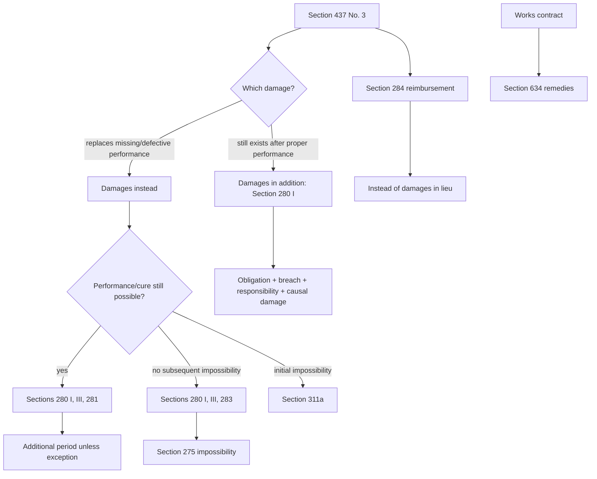

# Week 09: Warranty Rights II

Source: `business-law/raw/moodle-export-business-law-950848572-s26-20260628/15.06. - Warranty Rights II - Haag/Warranty Rights II.pdf`
Course: Business Law
Processed: 2026-06-28
Wiki note: `business-law/wiki/week-09-warranty-rights-ii/week-09-warranty-rights-ii.md`

Course direction checked against `business-law/wiki/_course-logistics.md`: Warranty Rights II is Session 9 in the teaching outline and continues Week 08 Warranty Rights I.

External statute check: statutory anchors were cross-checked against the official Gesetze-im-Internet BGB source on 2026-06-28. The official English BGB translation warns that translations may lag the current German text; use current German statutory text for exact wording.

## 80/20 Exam Summary

Warranty Rights II explains the damages side of buyer remedies and gives an overview of warranty rights in work contracts.

- Section 437 No. 3 BGB routes warranty damages into Sections 280 et seq. BGB and reimbursement into Section 284 BGB.
- The key exam distinction is damages in addition to performance versus damages instead of performance.
- Use the hypothetical-performance test: would the claimed loss still exist if proper performance were rendered at the latest possible time?
- Simple damages in addition to performance usually use Section 280 I BGB.
- Damages instead of performance due to repairable non- or malperformance usually use Sections 280 I, III, 281 BGB and require an additional period unless an exception applies.
- Damages instead of performance due to impossibility use Sections 280 I, III, 283 BGB when performance becomes impossible after contract conclusion.
- Initial impossibility uses Section 311a BGB.
- Responsibility normally means intent or negligence under Section 276 BGB; Section 280 I 2 BGB presumes fault.
- Section 278 BGB attributes fault of persons used to perform the obligation.
- Damage is assessed through restitution in kind, monetary compensation, and the difference hypothesis.
- Section 284 BGB reimburses futile expenses instead of damages in lieu of performance.
- Work-contract warranty rights under Section 634 BGB are similar to purchase warranty rights but add self-help under Section 637 BGB and use acceptance of work as the decisive timing point.

## Continuity Bridge From Warranty Rights I

Week 08 gave the gateway:

```text
valid purchase agreement
-> defect at transfer of risk
-> no exclusion
-> Section 437 remedy
```

Week 09 focuses on what happens when the chosen Section 437 remedy is damages or reimbursement.

```text
Section 437 No. 3 BGB
-> damages under Sections 280 et seq.
-> reimbursement under Section 284
```

## Legal Remedies Are Tiered

Section 437 BGB remedies remain in a tiered relationship.

```text
cure first as the regular second chance
-> then revocation / reduction / damages / reimbursement if additional requirements are met
```

The damages route is not one single claim. It depends on the type of damage and the performance problem.

## Distinguishing Damages Types

Core question from the deck:

```text
Would the claimed damage still exist if performance had been hypothetically rendered correctly at the latest possible time?
```

| Answer | Damage type | Typical statutory route |
|---|---|---|
| Yes, the loss would still exist. | Damages in addition to performance. | Sections 437 No. 3, 280 I BGB. |
| No, proper performance would remove/avoid the loss. | Damages instead of performance. | Sections 437 No. 3, 280 I, III, 281/283 BGB or Section 311a BGB. |

Examples from the deck:

| Facts | Classification | Route |
|---|---|---|
| Defective good harms buyer's other property. | Damages in addition to performance. | Sections 437 No. 3, 280 I BGB. |
| Defective good can be fixed; buyer claims reduced market value. | Damages instead of performance. | Sections 437 No. 3, 280 I, III, 281 BGB. |
| Defective good cannot be fixed; buyer claims reduced market value. | Damages instead of performance due to impossibility. | Sections 437 No. 3, 280 I, III, 283 BGB. |

## Section 280 I BGB Basic Damages

Elements:

```text
1. Contractual obligation.
2. Breach of duty.
3. Responsibility.
4. Causal damage.
```

In warranty cases:

```text
purchase agreement
-> defective delivery
-> seller responsible unless not responsible
-> causal loss
```

Section 280 I 2 BGB matters because the debtor must show they are not responsible.

## Responsibility

Responsibility normally covers:

- intent;
- negligence under Section 276 BGB;
- strict liability if a guarantee is given;
- attributed fault of helpers under Section 278 BGB.

Guarantee:

```text
No intent or negligence is required if the seller assumed a guarantee.
Tacit guarantee is possible, but the threshold is high.
```

Third parties:

```text
If the debtor uses another person to perform the obligation, Section 278 BGB can attribute that person's fault to the debtor.
```

Business example: if a seller uses an employee or another company to perform delivery/installation, the seller may be responsible for that helper within the obligation scope.

## Damage

Damage is not defined directly in statutory law in the deck. The note uses this working definition:

```text
damage = involuntary loss of material or immaterial goods/interests
```

Not every spending is damage. Voluntary spending in reliance on the contract can be reimbursement under Section 284 BGB instead.

Damage categories:

| Category | Meaning | Anchor |
|---|---|---|
| Material damage | Measurable in money. | Sections 249 et seq. BGB. |
| Immaterial damage | Not measurable in money; only compensable if statute allows. | Section 253 BGB. |
| Lost profit | Profit that would likely have been earned absent the damaging event. | Section 252 BGB. |

General form:

```text
restitution in kind under Section 249 I BGB
-> monetary compensation under Sections 249 II-251 BGB where appropriate
```

Difference hypothesis:

```text
damage = hypothetical situation without damaging event - actual situation
```

## Damages Instead Of Performance Under Section 281 BGB

Use this route for non-performance or malperformance that can still be cured.

Statutory combination:

```text
Section 280 I BGB + Section 280 III BGB + Section 281 BGB
```

Additional Section 281 requirements:

- due obligation to perform;
- non-performance or malperformance;
- reasonable additional period for performance/cure;
- period expires without result;
- exceptions under Section 281 II BGB or Section 440 BGB in purchase cases;
- responsibility for initial malperformance or expiry of the additional period.

Exclusions:

| Exclusion | Anchor | Meaning |
|---|---|---|
| Partial performance still useful | Section 281 I 2 BGB | No damages instead of entire performance if buyer still has interest. |
| Insignificant defective performance | Section 281 I 3 BGB | No damages instead of entire performance for insignificant defects. |

## Small And Big Damages

| Type | Deck label | Economic result | Nearby warranty analogy |
|---|---|---|---|
| Small claim for damages | Damage instead of performance, but buyer keeps item. | Buyer keeps defective item and receives value difference. | Similar, but not identical, to reduction. |
| Big claim for damages | Damage instead of entire performance. | Buyer returns item and receives purchase price back or damages for non-fulfilment. | Similar to revocation. |

Example of small claim:

```text
Buyer keeps defective item.
Damages = value difference between defect-free item and defective item.
```

Example of big claim:

```text
Buyer urgently obtains substitute goods from another supplier.
Buyer may claim covering-purchase-related damages if requirements are met.
```

## Damages Due To Impossibility

Use Sections 280 I, III, 283 BGB if performance becomes impossible after contract conclusion but before transfer of risk.

The deck links this route to Section 275 BGB:

| Impossibility type | Anchor | Meaning |
|---|---|---|
| Genuine impossibility | Section 275 I BGB | Performance is objectively or subjectively impossible. |
| Practical impossibility | Section 275 II BGB | Performance is not literally impossible, but effort is grossly disproportionate. |
| Personal impossibility | Section 275 III BGB | Personally owed performance cannot reasonably be expected. |

Effect:

```text
debtor released from performance duty
-> damages or revocation may become possible
```

Initial impossibility is routed through Section 311a BGB.

## Secondary Duty Damages

Sections 280 I, III, 282 BGB apply where a breach of secondary duty makes performance unacceptable.

Elements added by Section 282:

- breach of a secondary duty under Section 241 II BGB;
- destroyed base of trust;
- breach relevant to the purpose of the contract;
- weighing of interests makes further performance unacceptable.

Craftsman example from the deck:

```text
Craftsman installs kitchen properly but acts drunk, smokes, and damages floor.
Floor damage: damages in addition to performance under Sections 280 I, 241 II BGB.
Cost of a new craftsman: damages instead of performance under Sections 280 I, III, 282 BGB.
```

## Gas Station Example

Facts:

```text
S sells regular fuel to B.
Due to supplier mistake, fuel has 80 octane instead of required 95.
S negligently fails to notice.
B's car breaks down and engine is damaged.
B also wants back the money spent on fuel.
```

Analysis:

1. Purchase contract under Section 433 BGB.
2. Defective fuel under Section 434 II 1 No. 2 BGB at transfer of risk.
3. Engine damage: proper fuel delivered later would not undo engine damage.
4. Therefore engine repair costs are damages in addition to performance under Sections 437 No. 3, 280 I BGB.
5. Fuel price: defect in fuel could be cured by new conforming fuel.
6. Therefore repayment/substitute value for fuel is damages instead of performance under Sections 437 No. 3, 280 I, III, 281 BGB, requiring an additional period unless an exception applies.

Exam sentence:

```text
The engine damage is consequential damage in addition to performance; the unusable fuel itself concerns the defective performance and routes into damages instead of performance.
```

## Reimbursement Of Futile Expenses

Section 284 BGB:

```text
reimbursement of futile expenses instead of damages in lieu of performance
```

Requirements:

- same basic requirements as damages in lieu of performance;
- expenses in the buyer's own interest;
- expenses made in reliance on receiving proper performance;
- expenses were reasonable;
- expenses would have been recouped with due performance.

Examples:

- transport organization costs;
- vehicle registration costs.

Not covered:

- expenses to avert damages;
- expenses grossly disproportionate to the value of performance;
- expenses made when non-performance was already foreseeable;
- expenses that would not have been recouped for reasons unrelated to the debtor's breach.

Relationship:

```text
Section 284 reimbursement and damages in lieu of performance are either/or.
```

## Warranty Rights In Works Contracts

Work contracts have a parallel but not identical warranty structure.

Decisive point:

```text
acceptance of work under Section 640 BGB
```

This matters because acceptance is tied to:

- transfer of risk under Section 644 BGB;
- applicability of warranty rights.

Section 634 BGB is the work-contract referral provision.

| Work-contract remedy | Anchor | Difference from purchase law |
|---|---|---|
| Cure | Sections 634 No. 1, 635 BGB | Contractor decides type of cure. |
| Self-help | Sections 634 No. 2, 637 BGB | Added work-contract remedy. |
| Revocation | Sections 634 No. 3, 323 BGB | Similar route. |
| Reduction | Sections 634 No. 3, 638 BGB | Similar idea. |
| Damages | Section 634 No. 4 plus Sections 280 et seq. BGB | Similar damages logic. |
| Reimbursement | Section 634 No. 4 plus Section 284 BGB | Similar reimbursement logic. |

Exam trap: do not automatically apply purchase warranty sections to work contracts. Identify contract type first.

## Visual Knowledge Map



## Subject Knowledge Graph

| Node | Meaning | Exam Relevance |
|---|---|---|
| Damages In Addition | Loss remains even if performance is later correct. | Usually Section 280 I BGB. |
| Damages Instead | Loss replaces missing/defective performance. | Needs Section 281, 283, or 311a route. |
| Hypothetical-Performance Test | Would damage remain if proper performance were rendered? | Main classification tool. |
| Section 280 I Elements | Obligation, breach, responsibility, causal damage. | Basic damages skeleton. |
| Responsibility | Intent/negligence, guarantee, attributed helper fault. | Seller can escape only if not responsible. |
| Damage | Involuntary loss measured by difference hypothesis. | Defines compensation target. |
| Small Damages | Buyer keeps defective item and claims value difference. | Similar to reduction. |
| Big Damages | Buyer gives up whole performance and claims non-fulfilment. | Similar to revocation. |
| Section 284 Reimbursement | Futile expenses instead of damages in lieu. | Do not mix with damage prevention costs. |
| Work-Contract Warranty | Section 634 remedy system. | Identify contract type. |

| From | Relationship | To | Why It Matters |
|---|---|---|---|
| Section 437 No. 3 | routes to | Sections 280 et seq. | Warranty damages use general damages law. |
| Hypothetical-Performance Test | classifies | Damages In Addition / Damages Instead | Prevents wrong statutory route. |
| Section 281 | requires | Additional Period | Cure priority continues in damages. |
| Section 283 | depends on | Impossibility | No period for impossible performance. |
| Section 284 | replaces | Damages In Lieu | Either/or relationship. |
| Work-Contract Warranty | adds | Self-Help | Purchase law does not have the same self-help remedy. |

## Real Business Examples

- Defective fuel damages an engine: engine repair is damages in addition to performance.
- Faulty delivered machine can be repaired, but buyer wants reduced market value: damages instead of performance under Section 281.
- Custom-built software project is accepted and then defects appear: work-contract warranty law may be relevant, not purchase law.
- Buyer registers and transports a car in reliance on proper delivery, but the seller fails to deliver conforming performance: reimbursement of futile expenses may be considered.

## Exam Relevance

Likely prompts:

- Distinguish damages in addition to performance and damages instead of performance.
- State the elements of Section 280 I BGB.
- Explain responsibility and Section 278 BGB helper attribution.
- Classify a loss using the hypothetical-performance test.
- Choose between Section 281 and Section 283.
- Explain small versus big damages.
- Distinguish damages from reimbursement of futile expenses.
- Identify warranty remedies in work contracts.

Common traps:

- Calling every loss "damages instead" because the good was defective.
- Forgetting the additional period under Section 281.
- Ignoring impossibility and using Section 281 even when cure is impossible.
- Treating voluntary expenses as damage instead of Section 284 reimbursement.
- Applying purchase warranty sections to a work contract without checking contract type.

High-scoring answer structure:

1. Start with Section 437 No. 3 if the case is a defective purchase item.
2. Classify the loss with the hypothetical-performance test.
3. State the correct route: Section 280 I, Section 281, Section 283, Section 311a, or Section 284.
4. Check Section 280 I elements.
5. Add route-specific requirements, especially additional period or impossibility.
6. State the legal consequence and business meaning.

## Retrieval Prompts

Closed-book questions:

1. What is the hypothetical-performance test?
2. What are the four elements of Section 280 I BGB?
3. When do you use Section 281 instead of Section 283?
4. What does Section 278 BGB do?
5. What is the difference between damage and futile expense?
6. Which additional remedy appears in work-contract warranty law?

Application prompts:

1. Defective fuel destroys a car engine. Classify engine repair and fuel-price claim separately.
2. Buyer keeps defective machinery and claims the value difference. Is this small or big damages?
3. Seller cannot cure because the specific sold object was destroyed before transfer of risk. Which route is likely?
4. Buyer paid vehicle registration costs in reliance on delivery. Damages or reimbursement?
5. A contractor's work is accepted, then defects appear. Which warranty gateway do you open?

## Practice Tasks

1. Build a two-column table for Section 280 I, Section 281, Section 283, Section 284, and Section 634.
2. Write a 12-line answer to the gas station case.
3. Invent one example of damages in addition and one example of damages instead.
4. Explain why Section 284 is not just "damages with another name."
5. Compare purchase-contract cure with work-contract cure in three sentences.

## Connections

Previous notes:

- [Week 08 Warranty Rights I](../week-08-warranty-rights-i/week-08-warranty-rights-i.md): gateway, defect, transfer of risk, cure, revocation, reduction.
- [Week 05 Contract Law III](../week-05-contract-law-iii-withdrawal-cancellation-dissolution/week-05-contract-law-iii-withdrawal-cancellation-dissolution.md): revocation and restitution background.
- [Week 06 Standard Business Terms](../week-06-standard-business-terms/week-06-standard-business-terms.md): exclusions and liability limitations can be controlled by SBT rules.

Future notes:

- [Week 10 Transfer of Property](../week-10-transfer-of-property/week-10-transfer-of-property.md): separates contract duties from ownership transfer.

Cross-course links:

- Finance: damages and reimbursement both translate legal breaches into monetary consequences, but the legal route determines whether the money can be claimed.

## Weakness Flags

- Pending active recall: no first-pass retrieval has been completed yet.
- High-risk issue: damages in addition versus damages instead.
- High-risk issue: Section 281 additional period.
- High-risk issue: purchase warranty versus work-contract warranty.
