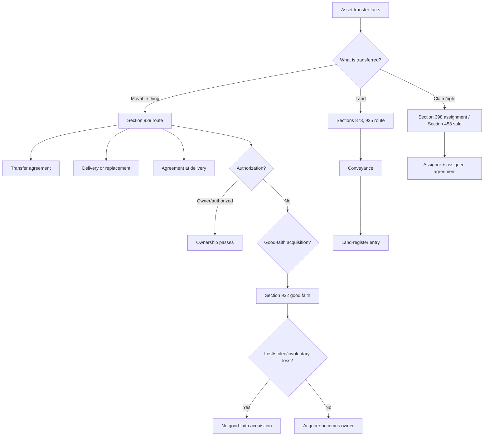

# Week 10: Transfer Of Property - Context

Source note: `business-law/wiki/week-10-transfer-of-property/week-10-transfer-of-property.md`
Source file: `business-law/raw/moodle-export-business-law-950848572-s26-20260628/22.06. - Transfer of Property - Haag/Transfer or Property.pdf`
Processed: 2026-06-28

Statutory anchors were cross-checked against the official Gesetze-im-Internet BGB source on 2026-06-28. Use the current German statute for exact legal wording in exam/legal work.

## Canonical Property Route

```text
identify object/right
-> distinguish ownership from possession
-> separate obligation contract from disposition transaction
-> test the acquisition mode
-> if transferor lacked ownership, test good-faith acquisition or other authorization
-> if acquisition fails, consider owner remedies/restitution
```

The core exam move is to stop saying "buyer owns because buyer bought". A purchase contract creates obligations. Ownership changes only through a separate disposition transaction or statutory acquisition.

## Ownership, Possession, And Objects

| Term | Definition | Aliases to avoid |
|---|---|---|
| Ownership | Full legal right to use, dispose of, and exclude others from a thing within legal limits. | Holding, having, possessing |
| Possession | Actual control over a thing plus will to possess. A possessor need not be owner. | Ownership |
| Direct Possession | Immediate actual control over a thing. | Legal title |
| Indirect Possession | Possession mediated through another person's possession relationship, such as lease or security arrangement. | No possession |
| Fictive Possession | Statutory continuation or attribution of possession in special cases. | Imaginary ownership |
| Thing | Corporeal object under Section 90 BGB. | Any asset |
| Animal | Not a thing under Section 90a BGB, but property-law rules generally apply with special respect. | Ordinary object |
| Movable | Thing that is not land/real property. | Any transferable asset |
| Immovable | Land/real property, transferred through land-register mechanism. | Building only |
| Claim | Right against a debtor, not a thing; transferred by assignment. | Object delivered physically |

### Mental Model

```text
Ownership = legal right.
Possession = actual control.
Purchase agreement = promise to transfer.
Transfer = separate property transaction.
```

## Separation And Abstraction Terms

| Term | Definition | Aliases to avoid |
|---|---|---|
| Principle Of Separation | Obligation contract and disposition transaction are legally distinct. | One sale transaction only |
| Obligation Contract | Contract creating duties, such as the Section 433 purchase agreement. | Ownership transfer |
| Disposition Transaction | Transaction directly changing a right, such as ownership transfer or assignment. | Performance promise |
| Principle Of Abstraction | Validity of the obligation contract and disposition transaction is assessed independently. | Invalid sale automatically reverses ownership |
| Identity Of Flaw | Same invalidity reason affects both obligation and disposition transaction. | Every defect affects both |
| Restitution | Claim to reverse unjustified shifts, often through Section 812 BGB. | Ownership automatically returns |
| Vindication Claim | Owner's claim to recover possession from possessor under Section 985 BGB. | Damages claim |

### Three-Transaction Bakery Example

```text
1. Purchase agreement: bakery must transfer bread; customer must pay.
2. Bread transfer: bakery transfers ownership of bread to customer.
3. Money transfer: customer transfers ownership of money to bakery.
```

Exam correction: if the purchase agreement is invalid, do not immediately conclude that ownership never changed. Test the disposition transaction separately, then consider restitution.

## Movable Transfer Terms

| Term | Definition | Aliases to avoid |
|---|---|---|
| Transfer Agreement | Disposition-level agreement that ownership should pass. | Purchase agreement |
| Delivery | Real act by which possession shifts from transferor to acquirer. | Declaration of intent |
| Publicity Act | External act showing the change of legal control to third parties. | Registration only |
| Agreement At Delivery | Transfer agreement must still exist when delivery occurs. | Agreement once forever |
| Authorization | Transferor has power to dispose, usually because transferor is owner. | Possession |
| Principle Of Determination | Transferred object must be objectively identifiable. | Vague asset pool |
| Delivery Replacement | Legal substitute for physical handover, such as Sections 930 or 931 BGB. | Symbolic delivery always |
| Constructive Delivery | Delivery replacement using a possession relationship while transferor keeps direct possession. | Secret ownership without relation |
| Assignment Of Claim For Possession | Delivery replacement where transferor assigns a claim against a third-party possessor. | Transfer of the thing itself |
| Reservation Of Title | Seller keeps ownership until payment condition is satisfied, usually under Sections 929, 158, 449 BGB. | Seller lien |

## Good-Faith Acquisition Terms

| Term | Definition | Aliases to avoid |
|---|---|---|
| Non-Owner Transferor | Person who transfers as if owner but lacks ownership. | Thief always |
| Good Faith | Acquirer is neither aware nor grossly negligently unaware that transferor is not owner. | Honest feeling |
| Legal Appearance From Possession | Possession creates the appearance of ownership, supported by Section 1006 BGB. | Possession proves ownership absolutely |
| Gross Negligence | Serious failure to notice ownership doubt that an ordinary careful buyer would notice. | Any negligence |
| Involuntary Loss | Owner lost possession without consent, such as theft or loss. | Any previous owner's regret |
| Section 935 Block | No good-faith acquisition of lost, stolen, or otherwise involuntarily lost things. | No good-faith acquisition ever |
| Distinct-Party Transaction | Good-faith acquisition requires a legal transaction between different persons. | Self-acquisition |

### Good-Faith Acquisition Exam Route

```text
Section 929 sentence 1 requirements except authorization
-> transferor not owner
-> acquirer in good faith under Section 932 II BGB
-> possession creates legal appearance
-> no Section 935 BGB involuntary-loss block
-> acquisition by legal transaction
```

## Security And Statutory Acquisition Terms

| Term | Definition | Aliases to avoid |
|---|---|---|
| Chattel Mortgage | Security transfer of movable ownership while debtor keeps possession through constructive delivery. | Ordinary pledge |
| Security Purpose Agreement | Obligation-level agreement explaining why the creditor holds ownership as collateral and when retransfer is owed. | Ownership transfer itself |
| Statutory Acquisition | Ownership acquisition by law, not by agreement and delivery. | Contractual transfer |
| Prescription | Ownership acquisition through long-term possession under statutory conditions. | Limitation only |
| Combination | Things merge so legal ownership follows statutory rules. | Sale of parts |
| Processing | New thing is produced from materials, triggering statutory ownership allocation. | Repair |
| Fruits | Products/yields from a thing or right. | Profit generally |
| Occupation | Acquisition of ownerless movable by taking possession. | Taking stolen goods |

## Immovables And Claims

| Term | Definition | Aliases to avoid |
|---|---|---|
| Conveyance | Required property-law agreement for transfer of land ownership. | Purchase contract |
| Land Register Entry | Registration step needed for real-property transfer. | Public notice only |
| Real Estate Purchase Form | Notarial form requirement for land purchase contracts under Section 311b BGB. | Land transfer itself |
| Assignment | Transfer of a claim from old creditor to new creditor under Section 398 BGB. | Delivery |
| Assignor | Current creditor transferring the claim. | Debtor |
| Assignee | New creditor receiving the claim. | Buyer of object |
| Debtor Of Assigned Claim | Person who owes performance under the transferred claim. | Transferor |
| Rights Purchase | Purchase of a right or claim under Section 453 BGB. | Purchase of a thing |

## Statutory Anchors

| Section | Canonical Function | Trigger Facts | Exam Use |
|---|---|---|---|
| Section 90 BGB | Definition of thing | Need decide whether property-law rules for things apply | Corporeal objects only. |
| Section 90a BGB | Animals | Animal involved | Animals are not things, but similar rules apply unless special rules say otherwise. |
| Section 854 BGB | Acquisition of possession | Person gains actual control | Start possession analysis. |
| Section 857 BGB | Heritable possession | Possessor dies | Possession passes to heir by law. |
| Section 868 BGB | Indirect possession | Lease, custody, security arrangement | Identify mediated possession relationship. |
| Section 903 BGB | Owner powers | Need define ownership | Owner may use/exclude within legal limits. |
| Section 929 sentence 1 BGB | Movable ownership transfer | Agreement and delivery by owner | Default transfer route for movables. |
| Section 929 sentence 2 BGB | Short-hand transfer | Acquirer already possesses the thing | Delivery unnecessary. |
| Section 930 BGB | Constructive delivery | Transferor keeps direct possession under possession relationship | Use for chattel mortgage/security transfer. |
| Section 931 BGB | Assignment of claim for possession | Third party possesses the thing | Delivery replaced by assigned claim. |
| Section 932 BGB | Good-faith acquisition | Transferor is not owner but possesses thing | Test acquirer good faith and legal appearance. |
| Section 935 BGB | Lost/stolen block | Owner involuntarily lost possession | Blocks good-faith acquisition except special cases. |
| Section 1006 BGB | Possession presumption | Possessor appears owner | Explain legal appearance. |
| Section 185 BGB | Authorized disposition by non-owner | Owner consent or approval | Lets a non-owner transfer validly. |
| Section 158 BGB | Condition | Transfer depends on future event | Use for reservation of title condition. |
| Section 449 BGB | Reservation of title | Seller keeps ownership until payment | Link to conditional transfer. |
| Section 937 BGB | Acquisition by prescription | Long-term possession | Statutory acquisition route. |
| Sections 946-948 BGB | Connection, mixture, combination | Things merge physically | Determine ownership after merger. |
| Section 950 BGB | Processing | New thing produced from material | Determine ownership of manufactured product. |
| Sections 953 ff. BGB | Fruits/products | Thing yields fruits | Allocate ownership of fruits. |
| Section 958 BGB | Occupation | Ownerless movable taken into possession | Acquisition without transferor. |
| Section 873 BGB | Real-property transfer mechanism | Right in land changes | Need agreement plus land-register entry. |
| Section 925 BGB | Conveyance | Land ownership transfer | Required disposition agreement for land. |
| Section 311b BGB | Notarial form for land purchase | Obligation contract to transfer land | Check validity of real estate purchase agreement. |
| Section 398 BGB | Assignment | Claim transferred to new creditor | Use for claims, not things. |
| Section 453 BGB | Purchase of rights | Sale of claim/right | Distinguish from sale of thing. |
| Section 985 BGB | Owner recovery claim | Owner lacks possession and possessor has no right | Use when ownership did not transfer or owner wants thing back. |
| Section 812 I 1 Alt. 1 BGB | Restitution for performance without legal ground | Ownership transferred despite invalid obligation | Reverse unjust enrichment if abstraction leaves transfer valid. |
| Sections 104, 105 BGB | Incapacity and void declaration | Mentally incapable party | Possible identity of flaw affecting both obligation and disposition. |
| Sections 119, 123 BGB | Rescission grounds | Mistake, deceit, duress | Ask which transaction the rescission ground affects. |

## Relationships Between Canonical Terms

- **Ownership** and **Possession** can belong to different people.
- **Principle Of Separation** means the **Purchase Agreement** and **Transfer Agreement** are different legal transactions.
- **Principle Of Abstraction** means invalidity of one transaction does not automatically invalidate the other.
- **Delivery** is a real act and publicity act; **Transfer Agreement** is the declaration-of-intent part.
- **Authorization** is normally supplied by **Ownership**, but **Section 185 BGB** can authorize a non-owner.
- **Good Faith** can replace missing authorization only if **Section 935 Block** does not apply.
- **Conveyance** and **Land Register Entry** are the real-property equivalent route, while **Assignment** transfers **Claims**.

## Mermaid Memory Map



## Example Dialogue

Professor: "B bought a bike from S. Is B owner because the purchase contract is valid?"

Student: "Not automatically. The purchase agreement creates the obligation. I still test transfer under Section 929 sentence 1 BGB: agreement, delivery, agreement at delivery, and authorization."

Professor: "S borrowed the bike from O and sold it to B. B did not know S was not owner."

Student: "S lacked authorization, so I test good-faith acquisition under Sections 929, 932 BGB. Then I check Section 935 BGB. If O voluntarily gave possession to S, Section 935 may not block acquisition."

Professor: "The bike was stolen from O before S sold it."

Student: "Section 935 BGB blocks good-faith acquisition because O involuntarily lost possession."

## Ambiguities And Exam Traps

| Ambiguity / Trap | Canonical Recommendation |
|---|---|
| Saying purchase equals ownership | Always separate obligation contract and disposition transaction. |
| Treating possession as proof of ownership | Possession creates appearance/presumption, but not absolute ownership. |
| Forgetting authorization in Section 929 | Agreement and delivery are not enough if transferor is not owner or otherwise authorized. |
| Using good faith for stolen goods | Check Section 935 BGB before concluding good-faith acquisition. |
| Treating delivery as a declaration of intent | Delivery is a real act; agency rules apply differently than for declarations. |
| Applying movable rules to land or claims | Land needs conveyance/register; claims need assignment. |
| Automatically undoing ownership after invalid sale | Use abstraction: test disposition validity, then restitution if necessary. |

## Cheat-Sheet Language

```text
The purchase agreement under Section 433 BGB obliges transfer but does not itself transfer ownership. For movable ownership, I test agreement, delivery or delivery replacement, continuing agreement at delivery, and authorization under Section 929 BGB. If authorization is missing, I test Sections 932 and 935 BGB for good-faith acquisition.
```

