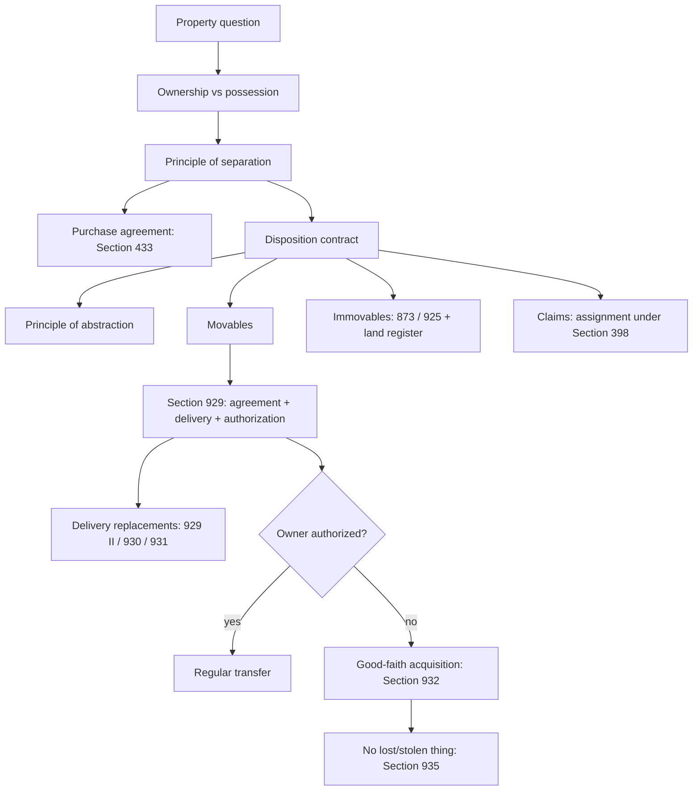

# Week 10: Transfer Of Property

Source: `business-law/raw/moodle-export-business-law-950848572-s26-20260628/22.06. - Transfer of Property - Haag/Transfer or Property.pdf`
Course: Business Law
Processed: 2026-06-28
Wiki note: `business-law/wiki/week-10-transfer-of-property/week-10-transfer-of-property.md`

Course direction checked against `business-law/wiki/_course-logistics.md`: Transfer of Property is Session 10 in the teaching outline and follows Warranty Rights II.

External statute check: statutory anchors were cross-checked against the official Gesetze-im-Internet BGB source on 2026-06-28. The official English BGB translation warns that translations may lag the current German text; use current German statutory text for exact wording.

## 80/20 Exam Summary

Transfer of Property explains that a purchase contract and ownership transfer are legally separate.

- Ownership and possession are different. A thief can possess a thing without owning it.
- Ownership is the strongest right over a thing; possession is actual control.
- German private law uses the principle of separation: obligation contract and disposition contract are distinct legal transactions.
- German private law also uses the principle of abstraction: invalidity of the purchase contract does not automatically invalidate the property transfer, and vice versa.
- Transfer of movable ownership usually requires agreement, delivery, agreement at delivery, and authorization under Section 929 sentence 1 BGB.
- Delivery is a real act, not a declaration-of-intent contract; agency rules do not apply in the same way.
- Delivery can be replaced by constructive delivery under Section 930 BGB or assignment of the claim for possession under Section 931 BGB.
- A non-owner can sometimes transfer ownership if the acquirer obtains ownership in good faith under Sections 929, 932 BGB.
- No good-faith acquisition is possible for lost or stolen things under Section 935 BGB, with special handling for money.
- Immovables require conveyance and land-register entry under Sections 873, 925 BGB.
- Claims are transferred by assignment under Section 398 BGB, not by delivery.

## Where This Fits

Warranty law asks whether the seller fulfilled the purchase contract properly. Transfer-of-property law asks who owns the thing.

```text
Purchase agreement = obligation to transfer ownership and pay.
Transfer of ownership = separate disposition transaction.
```

This matters because a valid purchase contract alone does not make the buyer owner.

## Ownership Versus Possession

| Concept | Meaning | Example | Exam use |
|---|---|---|---|
| Ownership | Legal right to control/exclude others regarding a thing. | Owner of a bike. | Ask who has the right. |
| Possession | Actual power over a thing plus will to possess. | Thief holding the bike. | Ask who physically controls it. |

Memory hook:

```text
ownership = legal right
possession = actual control
```

Ownership:

- protected by Article 14 German Basic Law;
- strongest right over a thing;
- includes utilization and exclusion functions;
- can be acquired by transfer or statutory acquisition.

Possession:

- governed by Sections 854 et seq. BGB;
- acquired by actual power;
- legal right to possession is not required for possession itself;
- can be direct, indirect, or fictive possession;
- creates presumptions, especially Section 1006 BGB.

## Principle Of Separation

Execution of a purchase agreement involves at least three transactions:

```text
1. Purchase agreement under Section 433 BGB.
2. Disposition contract transferring ownership of the good.
3. Disposition contract transferring ownership of the money.
```

Bakery example:

```text
Everyday perception: one unitary exchange.
Legal structure: purchase contract + transfer of bread + transfer of money.
```

Exam sentence:

```text
The purchase agreement obliges transfer of ownership, but it does not itself transfer ownership.
```

## Principle Of Abstraction

Abstraction builds on separation.

```text
obligation contract validity and disposition contract validity are independent
```

Consequences:

- invalid purchase contract does not automatically invalidate the ownership transfer;
- invalid transfer does not automatically invalidate the purchase contract;
- reversal may require restitution, especially Sections 985 or 812 I 1 alternative 1 BGB.

Exception: identity of the flaw.

Examples from the deck:

| Facts | Result |
|---|---|
| Mentally ill B concludes purchase and receives transfer. | Both declarations may be invalid under Sections 104 No. 2, 105 I BGB. |
| Deceit/duress under Section 123 I BGB affects both transactions. | Rescission of obligation and disposition contract can be possible. |
| Price typo under Section 119 I BGB affects only purchase price. | Disposition contract may remain valid because transfer agreement does not concern the price. |

Exam trap: do not reverse ownership automatically just because the sales contract is invalid. Ask whether the transfer transaction is also invalid or whether restitution is needed.

## Things And Movables

Section 90 BGB:

```text
Only corporeal objects are things.
```

Important exclusions/clarifications:

- humans are not things;
- animals are not things, but similar rules apply under Section 90a BGB;
- immaterial rights and claims are not things;
- software as data is not a thing, but a physical data carrier can be;
- movables differ from immovables.

## Transfer Of Movables Under Section 929 Sentence 1 BGB

Regular acquisition of a movable:

```text
1. Agreement.
2. Delivery / handover.
3. Agreement at handing over.
4. Authorization.
```

### 1. Agreement

The transfer agreement is a normal contract at the disposition level.

General declaration-of-intent rules apply:

- agency;
- rescission;
- invalidity;
- conditions under Section 158 BGB.

Principle of determination:

```text
an objective third party must be able to identify the concrete object being transferred
```

Examples:

- pointing to a specific machine;
- naming machine #1;
- "all items manufactured in January 2023."

### 2. Delivery

Delivery is a real act and publicity act, not a contract.

Consequences:

- declaration-of-intent rules do not apply directly to delivery;
- no agency under Sections 164 et seq. BGB for the real act itself;
- an agent in possession under Section 855 BGB can matter, such as an employee holding firm goods.

Delivery requirements:

- acquirer obtains possession through the transferor;
- transferor loses possession;
- third parties can objectively discern the transfer.

### 3. Agreement At Handing Over

The agreement must still exist when delivery occurs.

```text
Before delivery, the disposition agreement is freely revocable at the property-law level.
Contractual penalties or damages may exist at the obligation-contract level.
```

### 4. Authorization

In principle, only the owner can transfer ownership.

Possible restrictions:

- insolvency law, especially Section 81 InsO;
- family law restrictions protecting family economic basis.

Authorized non-owner:

- owner consent under Section 185 I BGB;
- statutory power of disposition, such as insolvency administrator under Section 80 I InsO.

Unauthorized non-owner:

- may still transfer ownership through good-faith acquisition.

## Delivery Replacements

| Mode | Anchor | Logic | Example |
|---|---|---|---|
| Acquirer already possesses | Section 929 sentence 2 BGB | Delivery unnecessary. | Buyer already has borrowed item. |
| Constructive delivery | Section 930 BGB | Delivery replaced by possession relationship. | Chattel mortgage; seller remains possessor for buyer. |
| Assignment of claim for possession | Section 931 BGB | Transferor assigns claim against current possessor. | Thing held by a third party. |

## Good-Faith Acquisition Of Movables

Good-faith acquisition solves legal traffic cases where the seller possesses the thing but is not owner.

Requirements under Sections 929 sentence 1, 932 I 1 BGB:

```text
1. All Section 929 sentence 1 requirements except authorization.
2. Good faith of acquirer.
3. Legal appearance due to possession, Section 1006 BGB.
4. Thing not lost or stolen, Section 935 BGB.
5. Legal transaction between two distinct parties.
```

Good faith is defined negatively:

```text
acquirer is not in good faith if aware, or grossly negligently unaware, that the seller is not owner
```

Section 935 BGB:

```text
No good-faith acquisition if the thing was lost, stolen, or otherwise involuntarily lost by the owner.
```

Exam trap: possession creates legal appearance, but Section 935 protects owners who involuntarily lost possession.

## Chattel Mortgage Case

Facts:

```text
S needs EUR 100,000.
L lends money and wants collateral.
S wants to keep machine #1 for production.
S and L agree to transfer ownership of machine #1 as chattel mortgage and conclude a security purpose agreement.
```

Issue:

```text
Who owns machine #1?
```

Analysis:

1. S was initially owner.
2. S and L agreed to transfer ownership of machine #1.
3. No physical delivery occurred.
4. Delivery is replaced by constructive delivery under Sections 929, 930 BGB.
5. The chattel mortgage/security purpose agreement supplies the possession relationship.
6. Agreement persisted and S was authorized as owner.

Conclusion:

```text
S lost ownership to L under Sections 929 sentence 1, 930 BGB, while S kept possession.
```

Business meaning:

```text
S can keep using the machine, but L owns it as collateral.
```

## Good-Faith Purchase Case

Facts:

```text
After transferring ownership to L as collateral, S sells machine #1 to B.
B cannot know the machine is owned by L.
S gives the machine to B, who transports it to his premises.
```

Issue:

```text
Who owns machine #1?
```

Analysis:

1. L was owner.
2. S and B agreed to transfer ownership.
3. Delivery occurred when B received and transported the machine.
4. Agreement persisted until handover.
5. S was not authorized because S was no longer owner and L did not consent.
6. Good-faith acquisition under Sections 929 sentence 1, 932 BGB:
   - B was in good faith under Section 932 II BGB.
   - S's possession created legal appearance under Section 1006 BGB.
   - Machine was not lost or stolen under Section 935 BGB.
   - Legal transaction occurred between two distinct parties.

Conclusion:

```text
B acquires ownership in good faith. L loses ownership to B.
```

## Statutory Acquisition Of Movables

The deck lists statutory acquisition modes:

| Mode | Anchor |
|---|---|
| Acquisition by prescription, 10 years | Section 937 BGB |
| Combination with plot of land | Section 946 BGB |
| Combination with another movable | Section 947 BGB |
| Intermixture / mingling | Section 948 BGB |
| Processing into a new thing | Section 950 BGB |
| Acquisition of products/components | Sections 953 et seq. BGB |
| Acquisition of ownerless movables | Section 958 BGB |

Exam use: mention these only if facts fit. Most exam facts in this deck focus on Section 929 and good-faith acquisition.

## Transfer Of Immovables

Transfer of immovables is stricter.

| Transfer of movables | Transfer of immovables |
|---|---|
| Sections 929 et seq. BGB | Sections 873, 925 BGB |
| Agreement | Agreement / conveyance |
| Delivery | Entry in land register |
| Agreement at delivery | Agreement at entry |
| Authorization or good-faith acquisition | Authorization or good-faith acquisition |

Immovable agreement:

- called conveyance under Section 925 BGB;
- special form: authentication by public notary;
- real property purchase agreement must also be notarized under Section 311b I BGB.

Good faith:

```text
land register creates strong legal appearance;
positive knowledge of incorrectness blocks good-faith acquisition.
```

## Transfer Of Claims

Claims are not corporeal things, so they are not transferred under Section 929 BGB.

Core distinction:

```text
purchase of rights = obligation contract under Section 453 BGB
assignment of claim = disposition under Section 398 BGB
```

Assignment requirements:

1. disposition contract under Section 398 sentence 1 BGB;
2. claim exists;
3. claim is identifiable;
4. claim is transferable.

No debtor participation is required, though notification is advisable.

Important limits:

- no good-faith acquisition of non-existing claims generally;
- future claims may be assigned if identifiable;
- statutory or contractual exclusions can block transferability.

Business examples:

- factoring;
- bank takes salary claim as collateral;
- supplier assigns future purchase-price claims.

## Visual Knowledge Map



## Subject Knowledge Graph

| Node | Meaning | Exam Relevance |
|---|---|---|
| Ownership | Legal right over a thing. | Determines who can transfer. |
| Possession | Actual control over a thing. | Creates legal appearance and transfer starting point. |
| Principle Of Separation | Obligation and disposition contracts are separate. | Purchase contract does not transfer ownership. |
| Principle Of Abstraction | Validity of obligation and disposition are independent. | Invalid sales contract does not automatically undo ownership transfer. |
| Movable Transfer | Agreement, delivery, agreement at delivery, authorization. | Main Section 929 test. |
| Constructive Delivery | Delivery replacement under Section 930 BGB. | Chattel mortgage cases. |
| Good-Faith Acquisition | Ownership transfer from non-owner under strict conditions. | Protects legal traffic. |
| Lost/Stolen Exclusion | Section 935 BGB barrier. | Protects owners who involuntarily lost possession. |
| Immovable Transfer | Conveyance plus land-register entry. | Real property rules. |
| Assignment | Transfer of claims under Section 398 BGB. | Claims are not delivered. |

| From | Relationship | To | Why It Matters |
|---|---|---|---|
| Purchase Agreement | obliges | Transfer Of Ownership | Contract creates duty, not ownership. |
| Principle Of Separation | separates | Obligation / Disposition | Prevents one-step thinking. |
| Principle Of Abstraction | separates validity of | Obligation / Disposition | Reversal needs separate analysis. |
| Possession | creates | Legal Appearance | Basis for good-faith acquisition. |
| Section 935 BGB | blocks | Good-Faith Acquisition | Stolen/lost property protection. |
| Section 930 BGB | replaces | Delivery | Collateral without physical handover. |
| Assignment | transfers | Claim | Different from transfer of things. |

## Real Business Examples

- A company sells machinery but keeps it as collateral through a chattel mortgage.
- A buyer purchases equipment from a possessor who is no longer owner; good-faith acquisition becomes decisive.
- A real property transaction requires notarial steps and land-register entry, not simple handover.
- A supplier sells receivables to a factoring company; the claim is assigned, not physically delivered.

## Exam Relevance

Likely prompts:

- Distinguish ownership and possession.
- Explain separation and abstraction.
- Apply Section 929 sentence 1 BGB.
- Explain when delivery is dispensable or replaced.
- Analyze good-faith acquisition from a non-owner.
- Apply Section 935 BGB to stolen/lost property.
- Compare transfer of movables and immovables.
- Explain assignment of claims under Section 398 BGB.

Common traps:

- Saying the purchase contract transfers ownership.
- Treating possession as ownership.
- Forgetting agreement at the time of delivery.
- Applying agency rules directly to delivery as a real act.
- Allowing good-faith acquisition despite stolen property.
- Forgetting that claims are not things and require assignment.

High-scoring answer structure for movables:

1. Identify initial owner.
2. Test transfer under Section 929 sentence 1 BGB.
3. Check agreement and determination of the object.
4. Check delivery or replacement.
5. Check agreement at delivery.
6. Check authorization.
7. If authorization fails, test good-faith acquisition under Section 932 and Section 935.
8. State who owns the thing.

## Retrieval Prompts

Closed-book questions:

1. What is the difference between ownership and possession?
2. What are the principles of separation and abstraction?
3. What are the four requirements of Section 929 sentence 1 BGB?
4. Why is delivery a real act?
5. What does Section 930 BGB replace?
6. What blocks good-faith acquisition under Section 935 BGB?
7. How are claims transferred?

Application prompts:

1. S sells and hands over a bike to B. Build the Section 929 test.
2. S transfers machine ownership to L as collateral but keeps the machine. Which delivery replacement applies?
3. S later sells the same machine to good-faith B. Does B acquire ownership?
4. Thief T sells stolen jewelry to good-faith B. What does Section 935 BGB do?
5. C assigns a future salary claim to a bank. Which requirements matter?

## Practice Tasks

1. Draw the three transactions involved in buying bread with cash.
2. Explain abstraction using a void purchase contract but valid handover.
3. Write a mini-case answer for the chattel mortgage machine case.
4. Write a mini-case answer for good-faith acquisition from S to B.
5. Compare transfer of movables and immovables in a four-row table.

## Connections

Previous notes:

- [Week 03 Contract Law I](../week-03-contract-law-i/week-03-contract-law-i.md): general declaration-of-intent and contract rules apply to agreement but not delivery.
- [Week 07 Agency](../week-07-agency/week-07-agency.md): agency can affect agreement, but delivery is a real act.
- [Week 08 Warranty Rights I](../week-08-warranty-rights-i/week-08-warranty-rights-i.md): Section 433 seller duty includes transfer of ownership free from defects.
- [Week 09 Warranty Rights II](../week-09-warranty-rights-ii/week-09-warranty-rights-ii.md): remedies are separate from ownership transfer and restitution.

Future notes:

- Trade Law and Company Law will build on commercial transactions and representation.

Cross-course links:

- Finance: collateral and assignment of claims are legal tools behind secured lending and factoring.

## Weakness Flags

- Pending active recall: no first-pass retrieval has been completed yet.
- High-risk issue: purchase contract versus ownership transfer.
- High-risk issue: good-faith acquisition and Section 935.
- High-risk issue: claims are assigned, not delivered.
