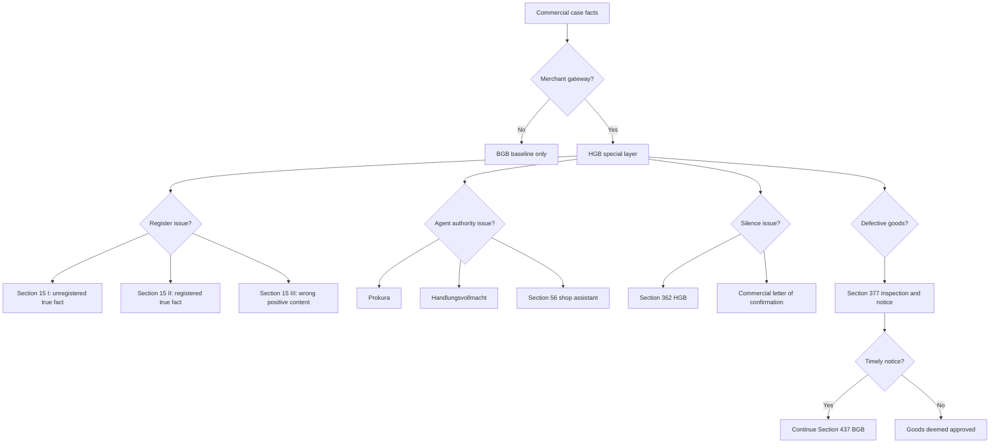

# Week 11: Trade Law - Context

Source note: `business-law/wiki/week-11-trade-law/week-11-trade-law.md`
Source file: `business-law/raw/moodle-export-business-law-950848572-s26-20260708/29.06. - Trade Law - Dr. Reger/Trade Law.pdf`
Processed: 2026-07-08

Statutory anchors were cross-checked against the official Gesetze-im-Internet HGB, BGB, GmbHG, and AktG English sources on 2026-07-08. The official English translations may lag current German statutory text; use current German law for exact wording.

## Canonical Trade-Law Route

```text
classify the actors
-> ask whether merchant status or a mutual commercial transaction exists
-> state the BGB baseline
-> identify the HGB special rule
-> apply the HGB rule narrowly
-> return to BGB for remaining formation, agency, warranty, or remedy issues
```

The core language rule is: "HGB modifies the BGB baseline for merchants." Avoid saying that trade law is an entirely separate system.

## Commercial-Law Layer

| Term | Definition | Aliases to avoid |
|---|---|---|
| Trade Law | Special private-law layer for merchants, mainly governed by the HGB. | Business law generally |
| HGB Special Layer | More specific commercial rule that adds to or deviates from BGB rules for merchant transactions. | HGB replaces BGB |
| BGB Baseline | Default civil-law route for contract, agency, warranty, property, and remedies. | Non-business law |
| Lex Specialis | The more specific rule prevails over the general rule when both apply. | Newer rule always wins |
| Commercial Transaction | Transaction belonging to the operation of a merchant's business. | Any expensive transaction |
| Commercial Practice | Established business usage or custom that can inform interpretation. | Habit of one party |
| B2B Commercial Layer | Merchant-to-merchant setting where professional expectations are higher. | Any company case |

### Mental Model

```text
BGB = default grammar of private law.
HGB = merchant dialect that changes selected grammar rules.
```

## Merchant Status Terms

| Term | Definition | Aliases to avoid |
|---|---|---|
| Merchant | Person or entity subject to HGB merchant rules because they operate a commercial business, register voluntarily, appear as merchant by registration, or are merchant by legal form. | Any seller |
| Commercial Business | Independent, outward, permanent, legal, profit-oriented activity requiring commercial organization by type or scope. | Any side hustle |
| Small Business | Business whose type or scope does not require commercial business organization; can opt into merchant status by registration under Section 2 HGB. | Never merchant |
| Liberal Profession | Profession such as lawyer, doctor, tax consultant, architect, writer, or interpreter that is usually not a merchant merely by practicing. | Freelancer always merchant |
| Asset-Managing Activity | Passive management of own assets, such as merely renting apartments, usually not merchant activity. | Real-estate merchant automatically |
| Merchant By Legal Form | Entity treated as merchant because of its legal form, such as GmbH or AG. | Merchant because large |
| Registration Duty | Merchant obligation to register relevant facts in the commercial register. | Registration creates every merchant |

## Commercial Register Terms

| Term | Definition | Aliases to avoid |
|---|---|---|
| Commercial Register | Public register for legally relevant commercial facts. | Private database |
| Information Function | Register makes facts inspectable to the public. | Internal filing |
| Evidence Function | Register entries help prove commercial facts. | Final proof of every fact |
| Protection Function | Legal traffic can rely on the register under publicity rules. | Guarantee of truth in all cases |
| Declaratory Registration | Registration records a legal fact that already exists independently. | Registration creates the fact |
| Constitutive Registration | Registration creates the legal fact or legal status. | Merely informational registration |
| Negative Disclosure | Protection of reliance on the absence of a required entry. | Nothing happened |
| Positive Disclosure | Protection of reliance on registered/published content, even if wrong under Section 15 III HGB. | Always true content |
| Register Silence | Absence of required registered fact that can protect a good-faith third party. | No legal effect |

## Commercial Agency Terms

| Term | Definition | Aliases to avoid |
|---|---|---|
| Prokura | Broad, legally regulated commercial power of representation under Sections 48 ff. HGB. | Normal employee authority |
| Prokurist | Person granted Prokura. | Managing director |
| `ppa.` Signature | Signature marker showing action on the basis of Prokura. | Company title |
| `ppa.` Publicity Evidence | Practical sign that the person acts for the business on the basis of Prokura, supporting the Section 164 publicity analysis. | automatic contract without agency test |
| Broad External Scope | Prokura covers nearly all acts entailed by operating a commercial enterprise. | Unlimited power for anything |
| Internal Restriction | Principal's internal limit on the Prokurist; usually ineffective against good-faith third parties under Section 50 HGB. | External scope limit |
| Abuse Of Power Of Agency | Exceptional case where third party knows or must see the agent is abusing authority. | Any internal breach |
| Joint Prokura | Prokura granted to several persons jointly, requiring joint action. | Everyone can act alone |
| Limited Commercial Authority | Handlungsvollmacht; commercial authority that is not Prokura, usually covering transactions of that business type. | Weak Prokura |
| Shop Assistant Authority | Section 56 HGB legal appearance for sales/receipts customary in a public store or warehouse. | All employee acts bind store |

## Commercial Contract Terms

| Term | Definition | Aliases to avoid |
|---|---|---|
| BGB Silence Baseline | Silence normally is not a declaration of intent. | Silence always acceptance |
| Section 362 HGB Silence | Merchant silence can count as acceptance for certain offers in usual business with an existing relationship or special duty to answer. | Any merchant silence |
| Commercial Letter Of Confirmation | Business confirmation after negotiations; if recipient merchant remains silent, content can bind under strict conditions. | Ordinary invoice |
| Immediate Objection | Prompt rejection needed to avoid being bound by a commercial confirmation. | Later complaint |
| Good-Faith Sender | Sender who can reasonably expect acceptance of the confirmation content. | Sender always protected |
| Bad-Faith Confirmation | A confirmation letter that knowingly deviates from negotiations so the sender cannot reasonably expect silent acceptance. | binding confirmation |
| Prudent Merchant Diligence | Higher professional care standard for merchants. | Consumer-care standard |
| Commercial Guarantee Form Relief | Section 350 HGB removal of ordinary BGB form protection for merchant guarantees. | No guarantee rules |

## Section 377 HGB Terms

| Term | Definition | Aliases to avoid |
|---|---|---|
| Mutual Commercial Purchase | Sale of goods that is commercial for both parties under HGB logic. | Any B2C sale |
| Duty To Inspect | Buyer's duty to examine goods promptly after delivery where possible in business practice. | Optional quality check |
| Duty To Notify | Buyer's duty to tell seller about defects promptly. | Internal complaint note |
| Obvious Defect | Defect recognizable through proper inspection after delivery. | Any defect later discovered |
| Hidden Defect | Defect not recognizable at proper inspection but discovered later. | Seller's secret only |
| Legal Fiction Of Approval | Goods are treated as approved when the buyer misses the inspection/notice duty. | Buyer actually liked the goods |
| Inspection Helper Attribution | Buyer can be responsible for an employee's missed inspection/notice when the employee is used to handle delivery under Section 278 BGB logic. | personal absence excuse |
| Fraudulent Concealment Block | Seller cannot rely on Section 377 if seller fraudulently concealed the defect. | Any seller fault |

## Statutory Anchors

| Section | Canonical Function | Trigger Facts | Exam Use |
|---|---|---|---|
| Section 1 HGB | Merchant and commercial-business gateway | Need decide whether HGB applies by business operation | Start merchant-status analysis. |
| Section 2 HGB | Voluntary registration by small business | Small business registered as merchant | Explain opt-in merchant status. |
| Section 5 HGB | Register-based merchant appearance | Registered business disputes merchant status | Use when register entry protects merchant classification. |
| Section 6 HGB | Merchant status for commercial companies | GmbH, AG, or other trading company involved | Treat legal form as HGB gateway. |
| Sections 8-16 HGB | Commercial register framework | Register facts, publicity, inspection | Frame register-reliance cases. |
| Section 9 HGB | Public inspection of register | Need explain register information function | Anyone may inspect for commerce-relevant facts. |
| Section 15 I HGB | Negative disclosure | Required fact true but not registered/published | Merchant may not assert unregistered fact against good-faith third party. |
| Section 15 II HGB | Published true fact | Required fact true, registered, published | Merchant can assert published fact against third party. |
| Section 15 III HGB | Positive disclosure | Register/publication content wrong | Good-faith third party may rely on what register says. |
| Section 29 HGB | Business-name registration duty | Merchant must register firm | Mention registration duty. |
| Sections 48-53 HGB | Prokura regime | Commercial power expressly granted | Apply broad Prokura route. |
| Section 48 HGB | Granting and joint Prokura | Several Prokurists or Prokura conferral | Check whether joint action required. |
| Section 49 HGB | Prokura scope | Prokurist signs commercial transaction | Broad external authority, land exception. |
| Section 50 HGB | Internal restrictions ineffective externally | Principal limited Prokurist internally | Third party usually protected unless abuse. |
| Section 51 HGB | Signature marker | `ppa.` appears | Identify Prokura representation. |
| Section 54 HGB | Limited commercial authority | Non-Prokura commercial agent acts | Check usual-business scope and known limitations. |
| Section 56 HGB | Shop assistant authority | Employee in public store/warehouse sells or receives payment | Protect good-faith customer in customary store transactions. |
| Section 343 HGB | Commercial transaction definition | Need Section 377 or other commercial transaction rule | Classify whether transaction belongs to merchant business. |
| Section 346 HGB | Commercial practice in interpretation | Merchant conduct/custom matters | Use business customs in interpreting declarations. |
| Section 347 HGB | Prudent merchant diligence | Merchant performance/care standard | Raise professionalism baseline. |
| Section 350 HGB | Commercial guarantee form relief | Merchant guarantee/suretyship issue | No ordinary Section 766 BGB form protection. |
| Section 354 HGB | Merchant services against remuneration | Merchant performs business service without price agreement | Presume payment expectation. |
| Section 362 HGB | Silence as acceptance in specific commercial service context | Merchant receives offer in usual business and does not answer | Exception to BGB silence baseline. |
| Section 377 HGB | Inspection and notice duty | Mutual commercial purchase with defect | Can exclude warranty rights. |
| Section 434 BGB | Material defect | Need identify defect for Section 377 or Section 437 route | Defect gateway. |
| Section 437 BGB | Warranty remedies | Defect at transfer of risk and no exclusion | Use only after Section 377 check in B2B. |
| Section 310 I BGB | B2B SBT content-control adjustment | Standard business terms between businesses | Sections 308/309 not directly applicable; use Section 307 by reference. |
| Section 766 BGB | Ordinary suretyship form | Non-merchant guarantee/suretyship | Contrast with Section 350 HGB. |
| Sections 13 III GmbHG, 6 I HGB | GmbH merchant by form | GmbH involved | No need to prove commercial business scale. |

## Relationships Between Canonical Terms

- **Trade Law** is the **HGB Special Layer** over the **BGB Baseline**.
- **Merchant Status** triggers many HGB rules; **Mutual Commercial Purchase** specifically triggers **Section 377 HGB**.
- **Commercial Register** creates reliance through **Negative Disclosure**, **Positive Disclosure**, and published true facts.
- **Prokura** has broader external scope than **Limited Commercial Authority**.
- **Internal Restriction** usually does not limit **Prokura** externally, unless **Abuse Of Power Of Agency** is known or obvious.
- **Commercial Letter Of Confirmation** and **Section 362 HGB Silence** are exceptions to the **BGB Silence Baseline**.
- **Duty To Inspect** and **Duty To Notify** support the **Legal Fiction Of Approval** under **Section 377 HGB**.

## Mermaid Memory Map



## Example Dialogue

Professor: "A GmbH buys goods from an oHG and later discovers a defect. What is your first commercial-law move?"

Student: "Both are merchants, so I do not jump directly to Section 437 BGB. I first check Section 377 HGB: delivery, defect, inspection, prompt notice, and no fraudulent concealment."

Professor: "P has Prokura, but internally the company told P never to conclude B2B contracts. P accepts a B2B order."

Student: "I separate internal and external authority. Prokura has a broad external scope under Section 49 HGB, and internal restrictions are usually ineffective against third parties under Section 50 HGB unless abuse was known or obvious."

Professor: "The register does not show a true revocation of Prokura."

Student: "That is a Section 15 I HGB negative-disclosure issue. A good-faith third party may rely on the register's silence."

## Ambiguities And Exam Traps

| Ambiguity / Trap | Canonical Recommendation |
|---|---|
| "Business" treated as automatically HGB-governed | Check merchant status or merchant by legal form. |
| HGB treated as separate from BGB | State BGB baseline first, then HGB modification. |
| Prokura internal limits treated as external limits | Use Section 50 HGB; ask only abuse/knowledge exception. |
| Handlungsvollmacht treated like Prokura | Check usual-business scope and whether third party knew/should know limitations. |
| Silence always ignored | Ask Section 362 HGB and commercial letter of confirmation. |
| Silence always binds after a confirmation letter | Check whether the sender was in good faith and could reasonably expect acceptance of the content. |
| Section 377 forgotten in B2B defect case | In mutual commercial purchase, Section 377 comes before Section 437 remedies. |
| Buyer absent during delivery treated as excuse | If an employee receives goods for the buyer, test whether missed inspection/notice is attributed to the buyer. |
| Commercial register assumed always accurate | Section 15 distinguishes unregistered, registered true, and registered wrong facts. |

## Cheat-Sheet Language

```text
Because this is a merchant/commercial transaction, I start with the BGB baseline but check whether the HGB contains a more specific rule. The relevant HGB rule modifies the result only for this point; the remaining contract, agency, or warranty analysis stays in the BGB structure.
```

```text
In a mutual commercial purchase, a defect does not automatically lead to Section 437 BGB remedies. The buyer must satisfy Section 377 HGB by inspecting and notifying in due time; otherwise the goods are deemed approved and warranty rights are excluded, unless the seller fraudulently concealed the defect.
```
