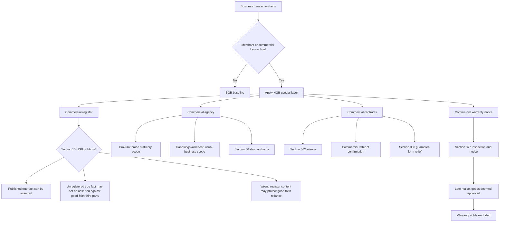

# Week 11: Trade Law

Source: `business-law/raw/moodle-export-business-law-950848572-s26-20260708/29.06. - Trade Law - Dr. Reger/Trade Law.pdf`
Exercise sources processed 2026-07-09:

- `business-law/raw/moodle-export-business-law-950848573-s26-20260709/8.7. Trade Law/Trade Law_Case facts.pdf`
- `business-law/raw/moodle-export-business-law-950848573-s26-20260709/8.7. Trade Law/Trade Law_Slides and solutions.pdf`

Course: Business Law
Processed: 2026-07-08
Wiki note: `business-law/wiki/week-11-trade-law/week-11-trade-law.md`

Course direction checked against `business-law/wiki/_course-logistics.md`: Trade Law is Session 11 in the teaching outline and follows Transfer of Property.

External statute check: HGB, BGB, GmbHG, and AktG anchors were cross-checked against the official Gesetze-im-Internet English sources on 2026-07-08. The official English translations warn that translations may lag the current German text; use the current German statutory text for exact legal wording.

## 80/20 Exam Summary

Trade law is the special private law layer for merchants. In an exam case, the core move is not to replace the BGB, but to ask whether HGB rules modify the BGB baseline.

- The HGB applies when the case involves a merchant or commercial transaction.
- The merchant question decides whether trade-law shortcuts and burdens apply.
- HGB rules often make business faster: fewer formalities, stronger reliance on registers, broader agency powers, and stricter notice duties.
- The commercial register protects legal traffic: third parties may rely on what is published, and sometimes on the register's silence.
- Prokura is a strong, legally defined commercial power of representation. Internal restrictions usually do not work against third parties.
- Limited commercial authority is weaker and more restrictable than Prokura.
- In BGB law, silence usually means nothing; in HGB cases, silence can sometimes create or confirm a contract.
- Section 377 HGB is the major commercial warranty trap: in a mutual commercial purchase, a buyer who fails to inspect and notify promptly can lose warranty rights.

## Where This Fits

Earlier Business Law topics built the civil-law baseline:

```text
BGB contract formation -> agency -> warranty -> property transfer
```

Trade law adds the merchant layer:

```text
BGB baseline
-> ask whether at least one merchant or a mutual commercial transaction is involved
-> apply HGB special rule where it is more specific
-> return to BGB for everything not modified
```

Exam habit:

```text
Do not say "HGB instead of BGB."
Say "BGB applies, but HGB modifies this specific point."
```

## Overview Of German Commercial Code Logic

The HGB is special private law for merchants and companies. It relies on the BGB and then adds or changes rules for commercial traffic.

| Civil-law baseline | HGB commercial modification | Exam meaning |
|---|---|---|
| Declarations are interpreted under Sections 133 and 157 BGB. | Commercial customs and practice may matter under Section 346 HGB. | In merchant cases, use business practice to interpret conduct. |
| Silence is usually not a declaration of intent. | Section 362 HGB and commercial letters of confirmation can give silence legal effects. | Do not treat every silence as irrelevant. |
| Suretyship usually needs form under Section 766 BGB. | Section 350 HGB removes form for commercial guarantees. | Merchant professionalism lowers protection. |
| Agency follows Sections 164 ff. BGB. | Sections 48 ff. and 54 ff. HGB create special commercial authority. | Prokura and Handlungsvollmacht have HGB-specific scopes. |
| Purchase warranty follows Sections 437 ff. BGB. | Section 377 HGB can exclude rights if notice is late. | Always check inspection and notice in B2B sales. |

Reason for special rules:

- speed in commerce;
- legal certainty;
- lower transaction costs;
- reliance on commercial-register publicity;
- higher expectations toward professional merchants.

## Merchant Status

The HGB starts with the merchant concept.

Core rule:

```text
Section 1 I HGB: a merchant carries on a commercial business.
Section 1 II HGB: commercial business is presumed unless the type or scope does not require a commercially organized business operation.
```

Practical indicators:

| Indicator | Why it matters |
---|---|
| Accounting system | More formal organization suggests commercial business. |
| Sales volume | Larger transactions indicate commercial scale. |
| Number of employees | Staff creates organization and legal-traffic need. |
| Number and type of transactions | Frequent or complex deals suggest merchant status. |
| Credit transactions | Financing and risk increase commercial sophistication. |

Not every businessperson is a merchant.

Usually not merchants:

- liberal professions, such as doctors, lawyers, notaries, auditors, tax consultants, architects, writers, or interpreters;
- purely asset-managing activity, such as merely renting apartments;
- employees, because they are not independent;
- charities, because they are not aimed at profit;
- very small business activities.

Special routes:

- a small business can become a merchant by registration under Section 2 HGB;
- a merchant must register under Section 29 HGB;
- some entities are merchants by legal form, such as GmbH through Sections 13 III GmbHG and 6 I HGB.

Exam trap:

```text
"Company" is not enough. Ask whether the actor is a merchant under HGB logic or merchant by legal form.
```

## Why Merchant Status Matters

Merchant status can help or hurt depending on perspective.

```text
Seller perspective:
HGB rules can help, especially Section 377 HGB if buyer notices defects too late.

Buyer perspective:
HGB rules can burden, especially stricter inspection and notification duties.
```

Example:

```text
A GmbH sells machines to another merchant.
The buyer receives the machines and detects obvious defects only weeks later.
The buyer may have ordinary BGB warranty remedies in theory, but Section 377 HGB can deem the goods approved if inspection/notice was not timely.
```

## Commercial Register

The commercial register is a public register for facts relevant to commerce.

Functions:

| Function | Meaning | Exam use |
|---|---|---|
| Information | Anyone can inspect the register. | Explain why third parties can check commercial facts. |
| Evidence | Register entries help prove registered facts. | Use for registered status or authority facts. |
| Protection of legal traffic | Good-faith reliance is protected. | Use Section 15 HGB publicity rules. |

Key distinction:

| Type | Meaning | Examples |
|---|---|---|
| Declaratory registration | Legal fact exists independently of registration. | Merchant status; conferral of Prokura. |
| Constitutive registration | Legal fact arises only through registration. | Formation of GmbH or AG. |

Procedure route:

```text
request for registration
-> register court examines formal grounds and material correctness if doubtful
-> registration in section A or B
-> publication
```

Section A is for sole traders and partnerships. Section B is for corporations.

## Section 15 HGB: Publicity Effects

Section 15 HGB protects reliance on commercial-register publicity.

### Section 15 II HGB: Published True Fact

Route:

```text
fact requires registration
-> fact is true
-> fact is registered and published
-> fact can be asserted against third party
```

Example:

```text
M revokes P's Prokura, registers and publishes the revocation, but P still signs "ppa."
M can assert lack of authority against the third party.
```

### Section 15 I HGB: Negative Disclosure

Route:

```text
fact requires registration
-> fact is true
-> fact is not registered
-> good-faith third party may rely on register silence
```

Example:

```text
M revokes P's Prokura but does not register it.
P signs in M's name.
M cannot usually assert the unregistered revocation against the good-faith third party.
```

Memory hook:

```text
register silence can protect the third party when the merchant failed to register a true required fact
```

### Section 15 III HGB: Positive Disclosure

Route:

```text
registered/publicized content is wrong
-> third party relies in good faith on what the register says
-> third party can be protected
```

Example:

```text
P never received Prokura, but Prokura appears in the register.
P signs in M's name.
A good-faith third party may rely on the register's positive but wrong appearance.
```

## Trade-Law Agency

General agency rules from Sections 164 ff. BGB still matter, but trade law adds special authority forms.

Main trade-law authority types:

| Authority type | Anchor | Main idea |
|---|---|---|
| Prokura | Sections 48 ff. HGB | Very broad commercial power of representation with legally fixed scope. |
| Limited commercial authority | Sections 54 ff. HGB | Commercial power that is not Prokura; narrower and more restrictable. |
| Shop assistant authority | Section 56 HGB | Legal appearance for sales/receipts customary in a public store or warehouse. |

## Prokura

Prokura authorizes the Prokurist to perform nearly all judicial and extrajudicial transactions and legal acts that operating a commercial enterprise entails.

Core route:

```text
merchant grants Prokura
-> Prokurist acts in principal's name
-> act falls within legally fixed Prokura scope
-> internal restrictions are usually irrelevant externally
```

Key features:

- governed by Sections 48-53 HGB;
- broad statutory scope under Section 49 I HGB;
- special permission needed for land transactions under Section 49 II HGB;
- internal limits usually invalid against third parties under Section 50 HGB;
- Prokurist often signs with `ppa.` under Section 51 HGB.

Exception: abuse of authority.

```text
If the third party knows the agent abuses internal limits, or abuse is obvious, the third party cannot simply rely on the broad external scope.
```

Joint Prokura:

```text
Prokura can be granted to several people jointly under Section 48 II HGB.
The point is control: the Prokurists must act together, but not necessarily at the exact same moment.
```

## Limited Commercial Authority

Limited commercial authority, Handlungsvollmacht, is every commercial power of attorney that is not Prokura.

Key features:

- governed by Section 54 HGB;
- no explicit conferral or commercial-register registration required;
- extends to transactions usually entailed by that business or transaction type;
- narrower than Prokura;
- no loan-taking and no court representation under Section 54 II HGB unless specifically authorized;
- individual limits can work externally if the third party knew or should have known.

Exam distinction:

```text
Prokura = broad statutory scope and third-party reliance.
Handlungsvollmacht = usual-business scope and more possible external limitations.
```

## Shop Assistant Authority

Section 56 HGB protects customers dealing with people working in a public store or warehouse.

Requirements:

```text
person employed in store/warehouse open to public
-> sale, receipt, or transaction customary for that store type
-> contracting party in good faith
```

Limits:

- protects sales and receipts, not purchases by the store clerk;
- can be excluded by special notice, such as "payment only at the cash desk";
- does not replace full agency analysis if the facts go beyond ordinary store transactions.

## Commercial Contracts And Silence

BGB baseline:

```text
silence is normally no declaration of intent
```

HGB modifications:

| Situation | Anchor | Effect |
|---|---|---|
| Offer to conclude an agency/business-service type agreement in usual business with an existing relationship | Section 362 HGB | Merchant must answer immediately or silence can count as acceptance. |
| Commercial letter of confirmation after negotiations | Customary commercial law, reflected in HGB logic | Silent recipient can be bound by the confirmed content if prerequisites are met. |

### Section 362 HGB

Typical route:

```text
merchant receives offer
-> offer concerns usual business scope
-> existing business relationship or special circumstances
-> merchant does not answer immediately
-> silence can count as acceptance
```

Example:

```text
A long-term client asks a forwarder to transport machinery. The forwarder stays silent. Because transport falls within the usual business and the relationship exists, a contract can be concluded by silence.
```

### Commercial Letter Of Confirmation

Requirements:

```text
recipient is merchant
-> sender participates in business activities
-> prior contract negotiations occurred
-> confirmation sent immediately after negotiations
-> confirmation received
-> sender could reasonably expect acceptance and acts in good faith
-> recipient does not object immediately
```

Effect:

```text
contract is concluded or fixed as stated in the confirmation, even if the letter deviates from the prior negotiation, as long as the deviation is not so serious that consent cannot reasonably be expected
```

Exam trap:

```text
This is not ordinary offer-acceptance silence. It is a merchant-specific legal-traffic protection rule after negotiations.
```

## Other Commercial Contract Features

| Rule | Anchor | Exam meaning |
|---|---|---|
| Merchant services are presumed against payment | Section 354 I HGB | A merchant does not normally work for free in commercial operations. |
| Prudent merchant diligence | Section 347 I HGB | Higher professionalism standard. |
| Commercial guarantee no special form | Section 350 HGB | HGB removes BGB form protection for merchants. |
| Duty to inspect and notify defects | Section 377 HGB | Late notice can exclude warranty rights. |

## Section 377 HGB Warranty Exclusion

Section 377 HGB connects Trade Law back to Warranty Rights I.

Requirements:

```text
mutual commercial purchase under Section 343 HGB
-> goods delivered to buyer or third party
-> defect under Section 434 BGB
-> buyer fails timely inspection or notice
-> vendor did not fraudulently conceal the defect
```

Timing:

| Defect type | Buyer duty |
|---|---|
| Obvious defect recognizable on proper inspection | Inspect after delivery and notify without undue delay. |
| Hidden defect not recognizable on proper inspection | Notify without undue delay after discovery. |

Consequence:

```text
goods are deemed approved
-> buyer's warranty rights are excluded for that defect
```

Correction rule:

```text
In B2B purchase cases, do not jump from defect to Section 437 BGB remedy.
First ask whether Section 377 HGB has cut off the remedy.
```

## Standard Business Terms And Incoterms In Trade

Incoterms are standardized international commercial clauses. They are not law by themselves. They become relevant only if agreed as contractual terms.

Exam route:

```text
contract terms agreed?
-> if pre-formulated repeated-use terms, ask SBT route
-> in B2B, Sections 308 and 309 BGB are not directly applicable
-> use Section 307 BGB with Section 310 I BGB for content control
```

Examples:

- EXW allocates duties around pickup at the named place.
- DAP allocates delivery duties to named destination.

Do not memorize all Incoterms unless source/exercise signals it. The examinable point here is that commercial standard terms can sit next to statutory provisions.

## Visual Knowledge Map



## Subject Knowledge Graph

| Node | Meaning | Exam Relevance |
|---|---|---|
| Trade Law | Special private law for merchants, mainly in the HGB | Decides when BGB rules are modified. |
| Merchant | Person/entity carrying on commercial business or treated as merchant by law/registration | Gateway to HGB rules. |
| Commercial Register | Public register for commerce-relevant facts | Triggers reliance and publicity problems. |
| Section 15 HGB Publicity | Good-faith protection around published, unpublished, or wrongly published facts | Common authority/register case issue. |
| Prokura | Broad legally defined commercial power of representation | Determines whether internal limits bind third parties. |
| Limited Commercial Authority | Usual-business commercial authority that is not Prokura | Tests narrower power and known limitations. |
| Shop Assistant Authority | Store-transaction legal appearance under Section 56 HGB | Handles cashier/store-clerk cases. |
| Commercial Letter Of Confirmation | Merchant-specific rule where silence after confirmation can bind | Tests commercial silence exception. |
| Section 377 HGB Notice | Inspection and defect-notice duty in mutual commercial purchases | Can destroy otherwise valid warranty claims. |

| From | Relationship | To | Why It Matters |
|---|---|---|---|
| HGB | modifies | BGB baseline | Case solutions often require both codes. |
| Merchant status | triggers | Trade-law layer | No merchant gateway, no HGB shortcut/burden. |
| Commercial Register | protects | Good-faith legal traffic | Explains Section 15 outcomes. |
| Prokura | has | Broad external scope | Third parties need not inspect internal instructions. |
| Internal Prokura limit | usually does not bind | Good-faith third party | Key to B2B authority cases. |
| Limited commercial authority | is narrower than | Prokura | Scope and limitation analysis differs. |
| Commercial silence | can create | Contract effect | HGB reverses the BGB silence baseline in specific situations. |
| Section 377 HGB | can exclude | Warranty rights | Defect remedy analysis must include timely notice. |

## Real Business Examples

### Prokura In A Procurement Deal

A company gives P Prokura but internally tells P not to sign contracts above EUR 20,000. P signs a EUR 50,000 supply contract. If the supplier did not know and abuse was not obvious, the internal limit usually does not defeat external authority. The company may have an internal claim against P, but the contract can bind the company.

### Commercial Register Reliance

A business revokes an employee's Prokura but forgets to register the revocation. The employee still signs as Prokurist. A good-faith business partner may be protected because the register does not show the true revocation.

### Section 377 In A Machine Sale

Merchant buyer B receives machines from merchant seller S. The machines show visible cracks. B stores them for two weeks and then complains. B may lose warranty rights because Section 377 HGB expects prompt inspection and notice in mutual commercial purchases.

## Exam Relevance

Likely prompts:

- Identify whether HGB rules apply to a transaction.
- Decide whether a person or company is a merchant.
- Apply Section 15 HGB to a register-publicity scenario.
- Decide whether Prokura or limited commercial authority binds the merchant.
- Explain when silence can create a contract in commercial law.
- Apply Section 377 HGB before ordinary BGB warranty remedies.

Common traps:

- Calling every company a merchant without checking the legal route.
- Treating HGB as a separate replacement system instead of a BGB modification layer.
- Forgetting that Prokura internal limits are usually externally irrelevant.
- Treating silence as irrelevant even in HGB confirmation cases.
- Jumping to Section 437 BGB without Section 377 HGB in B2B sales.

High-scoring answer structure:

```text
1. Classify actors and transaction.
2. State BGB baseline.
3. Identify HGB special rule.
4. Apply HGB requirements carefully.
5. Return to BGB consequence if HGB does not displace it.
```

## Official Exercise Case Routes

### Case 1a: Light-Bulb Order By Prokurist

Question: did P effectively represent electrician E?

Route:

1. Agency baseline: Sections 164 et seq. BGB.
2. Own declaration: P offers to buy 250 light bulbs at EUR 2 each.
3. Publicity: P does not explicitly write "for E", but uses the official work email and signs with `ppa.`, so acting for the business is implicit under Section 164 I 2 BGB.
4. Power of representation: E expressly granted Prokura under Section 48 HGB. Commercial-register entry under Section 53 HGB is declaratory.
5. Scope: buying light bulbs for the electrical store is within Section 49 HGB.
6. No effective external limitation appears under Section 50 HGB.

Result: P effectively represents E.

Exam trap: `ppa.` is strong evidence of Prokura/publicity, but still run the full Section 164 route.

### Case 1b: Bad-Faith Commercial Letter Of Confirmation

Question: is E obliged to pay EUR 1,000 for 500 light bulbs after S sends a confirmation letter with the wrong quantity?

Route:

1. Phone agreement: P and S agree on 250 light bulbs at EUR 2 each after P rejects 500.
2. A commercial letter of confirmation can alter or confirm terms only under strict conditions between merchants.
3. Personal scope and preceding negotiations are present.
4. The letter is received promptly and E remains silent.
5. Good faith / reasonable expectation fails: S knows P expressly rejected 500 because of capacity reasons and secretly hopes E will overlook or accept the wrong quantity.

Result: the confirmation letter does not alter the contract. E owes EUR 500 for 250 light bulbs, not EUR 1,000 for 500.

Exam trap: silence does not protect a sender who knowingly writes a materially wrong confirmation.

### Case 1c: Internal Prokura Limit And Showroom Employee

Question: must E pay EUR 6,000 for cable bought by P from W's employee M?

Route:

1. P's offer binds E: P acts with own declaration and enterprise-related publicity.
2. Prokura is issued and the cable purchase is within Section 49 HGB.
3. E's internal EUR 5,000 limit is effective internally between E and P but ineffective against third parties under Section 50 I HGB.
4. M's acceptance binds W: M acts in W's showroom, the transaction is enterprise-related, and Section 56 HGB gives store authority for customary showroom sales.

Result: E is obliged to pay EUR 6,000 under Section 433 II BGB.

Exam trap: solve agency on both sides; P's Prokura and M's Section 56 HGB authority are separate authority routes.

### Case 1d: Wrong Cable Diameter And Section 377 HGB

Question: can E demand cure by re-delivery of 5mm cable?

Route:

1. Purchase agreement exists from Case 1c.
2. Material defect: delivery of 3mm cable instead of ordered 5mm cable is aliud delivery under Section 434 V BGB.
3. Transfer of risk: wrong diameter existed from delivery.
4. Before ordinary Section 437/439 cure, check Section 377 HGB.
5. Mutual commercial purchase: E and W are merchants, and cable purchase/sale belongs to their businesses.
6. Delivery occurred on 1 July.
7. The defect was obvious because the delivery bill showed the 3mm diameter and it was recognizable by looking/touching.
8. P failed to inspect/notify in due course; E is responsible for P under Section 278 BGB.
9. No fraudulent concealment by W appears.

Result: the goods are deemed approved and warranty rights are excluded under Section 377 HGB; E has no cure claim.

Exam trap: Section 377 HGB can kill Section 437 remedies even when the goods are objectively defective.

## Retrieval Prompts

Closed-book questions:

1. What is the merchant gateway for applying trade law?
2. Why does the HGB modify the BGB in merchant transactions?
3. What are the three functions of the commercial register?
4. What is the difference between declaratory and constitutive registration?
5. Explain the difference between Section 15 I, II, and III HGB in one sentence each.
6. Why is Prokura stronger than limited commercial authority?
7. When can silence lead to contract effect in trade law?
8. What is the consequence of a late Section 377 HGB notice?

Application prompts:

1. M revokes P's Prokura but does not register the revocation. P signs with `ppa.` for a supplier who did not know. Who is bound?
2. A store employee sells a laptop in a public store, although internal rules say only the manager may sell electronics above EUR 500. Can the customer rely on Section 56 HGB?
3. Merchant buyer discovers obvious defects after delivery and waits ten days to notify. What must be checked before Section 437 BGB remedies?

## Practice Tasks

1. Build a three-step merchant-status test for a small gardening business, a GmbH, a doctor, and an online retailer.
2. Create a mini-table comparing Prokura, Handlungsvollmacht, and Section 56 shop authority.
3. Write a short legal-opinion paragraph for a commercial letter of confirmation after phone negotiations.
4. Route one B2B defective-goods case from purchase agreement to Section 377 HGB to Section 437 BGB.

## Connections

Previous notes from this lecture:

- `business-law/wiki/week-03-contract-law-i/week-03-contract-law-i.md` for offer, acceptance, and declaration-of-intent baseline.
- `business-law/wiki/week-06-standard-business-terms/week-06-standard-business-terms.md` for B2B standard-term content control.
- `business-law/wiki/week-07-agency/week-07-agency.md` for general agency rules.
- `business-law/wiki/week-08-warranty-rights-i/week-08-warranty-rights-i.md` for Section 437 warranty gateway.
- `business-law/wiki/week-10-transfer-of-property/week-10-transfer-of-property.md` for ownership and commercial purchase context.

Cross-course links:

- Organization: formal authority versus actual decision authority resembles internal/external authority in agency.
- Marketing and SCM: Incoterms and commercial standard terms affect delivery promises, risk allocation, and supply-chain execution.

## Weakness Flags

- First-pass active recall not yet completed.
- Test whether the user can distinguish BGB silence from HGB silence.
- Test Section 15 HGB with one revocation-of-Prokura case.
- Test Section 377 HGB before ordinary warranty remedies.
