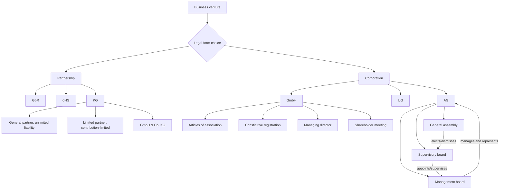

# Week 12-13: Company Law I And II - Context

Source note: `business-law/wiki/week-12-13-company-law-i-ii/week-12-13-company-law-i-ii.md`
Source file: `business-law/raw/moodle-export-business-law-950848572-s26-20260708/06.07. - Company Law I - Dr. Reger/Company Law I + II.pdf`
Processed: 2026-07-08

Statutory anchors were cross-checked against the official Gesetze-im-Internet GmbHG, AktG, HGB, and BGB English sources on 2026-07-08. The official English translations may lag current German statutory text; use current German law for exact wording.

## Canonical Company-Law Route

```text
identify the venture and business risk
-> classify partnership or corporation
-> identify legal form
-> ask who represents the entity
-> ask who is liable
-> ask which body decides internally
-> connect to financing, tax, disclosure, and governance consequences
```

The main exam language problem is confusing the actor with the humans behind it. A GmbH or AG can be the legal actor even though humans make its decisions through organs.

## Legal-Form Classification Terms

| Term | Definition | Aliases to avoid |
|---|---|---|
| Business Association | Legal organization through which people pursue a joint business or organizational purpose. | Any contract |
| Legal Form | Statutory organizational type, such as GbR, oHG, KG, GmbH, UG, or AG. | Branding choice |
| Partnership | Person-centered association whose structure depends strongly on individual partners. | Corporation |
| Corporation | Entity-centered organization with separate legal personality and corporate bodies. | Partnership with more people |
| Legal Person | Entity that can hold rights and obligations in its own name. | Human owner |
| Limited Liability | Liability is generally limited to company assets, while owners risk their contribution rather than all private assets. | No liability |
| Unlimited Liability | A person can be liable with all private assets. | Higher investment |
| Choice Of Legal Form | Decision matching liability, governance, tax, capital, financing, reputation, and disclosure to the business. | Cheapest form selection |

## Partnership Terms

| Term | Definition | Aliases to avoid |
|---|---|---|
| GbR | Basic civil-law partnership under Sections 705 ff. BGB, often for small non-commercial joint endeavors. | Informal company with no law |
| oHG | Commercial general partnership; all partners are personally liable and it is registered in the commercial register. | GbR with brand name |
| KG | Limited partnership with at least one unlimited-liability general partner and one limited partner. | GmbH |
| General Partner | In KG, the partner with unlimited liability and management/representation role. | Limited investor |
| Limited Partner | In KG, partner whose liability is limited to the agreed contribution if statutory conditions are met. | No-risk partner |
| GmbH & Co. KG | KG where the general partner is a GmbH, reducing natural-person private-asset exposure. | Ordinary GmbH |
| Personal Dependence | Partnership feature where membership, management, and trust in persons matter strongly. | Weak legal status |

## GmbH Terms

| Term | Definition | Aliases to avoid |
|---|---|---|
| GmbH | Limited liability company; separate legal person governed by GmbHG and merchant by legal form. | Small AG |
| Shareholder | Owner of GmbH shares with profit, information, and voting rights. | Director automatically |
| Share Capital | Required capital base of a GmbH, normally at least EUR 25,000. | Bank account balance forever |
| Capital Contribution | Amount a shareholder owes to the GmbH for their share. | Optional investment |
| Articles Of Association | Constitutional document defining required company facts and optional governance rules. | Simple template only |
| Sample Articles | Simplified formation document for small standard GmbH setups. | Always best articles |
| Notarization | Required notary involvement for formation and later article changes. | Registration |
| Constitutive Registration | Registration that creates full GmbH legal status. | Announcement only |
| Managing Director | GmbH organ that manages and represents the company. | Employee manager |
| Shareholder Meeting | GmbH body that makes shareholder resolutions, including director appointment and profit use. | Informal founder chat |
| Supervisory Board | Oversight body, usually optional in small GmbH but mandatory in larger co-determined settings. | Always required |
| Director Duty Of Care | Duty to manage properly, comply with obligations, and avoid negligent harm to the company. | Best-effort only |
| Director Duty Of Loyalty | Duty to put company interests first and avoid conflicts or competition. | Loyalty to one shareholder only |
| Insolvency Filing Duty | Crisis duty to file in time when insolvency law requires it. | Optional restructuring step |
| UG | Entrepreneurial company, a mini-GmbH with low capital entry and reserve-building duty. | Cheap GmbH with no downside |

## AG And Corporate Governance Terms

| Term | Definition | Aliases to avoid |
|---|---|---|
| AG | Stock corporation governed by AktG, often used for larger companies and investor-ready structures. | Large GmbH only |
| Capital Stock | AG capital base; deck states EUR 50,000 minimum. | Share capital in GmbH sense only |
| General Assembly | Shareholder body of AG for basic decisions and supervisory-board elections. | Management board |
| Supervisory Board | AG body that appoints, dismisses, and supervises the management board. | Advisory committee only |
| Management Board | AG body that manages and represents the company. | Shareholder delegates |
| Dualistic System | German two-tier AG governance: supervisory board separate from management board. | One board system |
| Monistic System | One-board model common in some jurisdictions, where control and management sit in one board. | German AG default |
| Corporate Governance | Rules and structures for transparent, efficient management and supervision. | CSR only |
| Principal-Agent Dilemma | Risk that managers or agents use information advantage and discretion against owners/stakeholders. | Any disagreement |
| Co-Determination | Worker participation in corporate oversight where employee thresholds trigger it. | Trade union outside governance |
| German Corporate Governance Code | Soft-law governance guidance for listed/large companies. | Statute identical to AktG |

## Statutory Anchors

| Section | Canonical Function | Trigger Facts | Exam Use |
|---|---|---|---|
| Sections 705 ff. BGB | GbR baseline | Small joint endeavor or partnership default | Start partnership analysis. |
| Sections 105 ff. HGB | oHG framework | Commercial partnership with personal liability | Use for commercial general partnership. |
| Sections 161, 105 ff. HGB | KG framework | Limited partnership with general and limited partners | Explain liability split. |
| Section 6 HGB | Commercial companies as merchants | Corporation/company legal form involved | Connect company law to trade law. |
| Section 13 GmbHG | GmbH legal person and commercial company | Need define GmbH status/liability | State GmbH has own rights and obligations; shareholders generally not personally liable. |
| Section 1 GmbHG | GmbH purpose/founders | Formation basics | GmbH can be formed for lawful purposes. |
| Section 2 GmbHG | Form of articles | GmbH formation requires formal articles | Mention notarial/form requirement. |
| Section 3 GmbHG | Content of articles | Need mandatory AoA contents | Business name, object, seat, capital, etc. |
| Section 5 GmbHG | Share capital/share | GmbH capital requirement | Explain minimum capital and shares. |
| Section 5a GmbHG | UG | Mini-GmbH with reserve duty | Distinguish UG from GmbH. |
| Section 11 GmbHG | Legal status before registration | GmbH not yet fully registered | Registration is constitutive for full GmbH. |
| Section 29 GmbHG | Appropriation of earnings | Profit distribution question | Profit use depends on resolution. |
| Section 35 GmbHG | Representation by directors | GmbH contracting party issue | Directors represent the GmbH. |
| Section 37 GmbHG | Restrictions on director representation | AoA/internal limits on directors | Internal limits generally do not defeat external representation as easily. |
| Section 38 GmbHG | Revocation of director appointment | Shareholders remove director | Appointment can be revoked by resolution. |
| Section 43 GmbHG | Directors' liability | Director breaches duties | Personal liability for duty breach. |
| Section 46 GmbHG | Shareholder-meeting competences | Appointment, profit use, claims, Prokuristen | Identify decisions reserved to shareholders. |
| Section 15a InsO | Insolvency filing | Company is insolvent/overindebted | Directors face strict crisis duties. |
| Section 1 AktG | Nature/liability of AG | Need define stock corporation | AG is company with own legal personality and shareholder liability limited to contribution. |
| Section 23 AktG | By-laws / articles strictness | AG formation and articles | Deviations from law only if permitted. |
| Section 41 AktG | Registration and legal status | AG formation | Full AG status tied to register entry. |
| Section 84 AktG | Management-board appointment/dismissal | AG organ appointment | Supervisory board appoints/dismisses management board. |
| Section 90 AktG | Management-board reporting | AG supervision facts | Management reports to supervisory board. |
| Section 101 AktG | Supervisory-board election | AG board composition | General assembly elects shareholder representatives. |
| Section 111 AktG | Supervisory-board supervision | AG oversight | Supervisory board supervises management. |
| Section 119 AktG | General assembly rights | AG basic decisions | Shareholders decide selected fundamental matters, not daily management. |

## Relationships Between Canonical Terms

- **Legal Form** shapes **Limited Liability**, **Representation**, **Taxation**, **Disclosure**, and **Governance**.
- **Partnerships** are more person-dependent than **Corporations**.
- **GbR** is the base partnership; **oHG** is the commercial general partnership; **KG** adds a **Limited Partner**.
- **GmbH & Co. KG** combines **KG** structure with **GmbH** limited-liability protection for the general partner role.
- **GmbH** acts through **Managing Directors** and is controlled internally through the **Shareholder Meeting**.
- **UG** is a low-capital variant of **GmbH**, but **Reserve Duty** and reputation limits matter.
- **AG** uses a **Dualistic System**: **General Assembly**, **Supervisory Board**, and **Management Board**.
- **Corporate Governance** is a response to the **Principal-Agent Dilemma**.

## Mermaid Memory Map



## Example Dialogue

Professor: "Two friends start a small gardening service for private customers with EUR 60,000 yearly revenue. Which form fits?"

Student: "A GbR is suitable because this is a small person-centered joint endeavor without clear commercial-organization need. oHG would be unsuitable unless the activity reaches commercial-business scale. GmbH or UG could limit liability, but may be too formal and costly for the case unless risk or financing needs justify it."

Professor: "Does limited liability mean creditors cannot sue anyone?"

Student: "No. The GmbH or AG remains liable with company assets. Limited liability protects shareholders from personal liability beyond their contribution in the ordinary case."

Professor: "Who manages an AG?"

Student: "The management board manages and represents the AG. The supervisory board appoints and supervises it. Shareholders act through the general assembly but do not instruct daily management like GmbH shareholders may influence directors."

## Ambiguities And Exam Traps

| Ambiguity / Trap | Canonical Recommendation |
|---|---|
| Calling all joint businesses companies in the same sense | Classify legal form: GbR, oHG, KG, GmbH, UG, AG. |
| Saying limited liability means no one pays | Company pays with company assets; shareholder private assets are generally protected. |
| Treating shareholders and directors as the same | A shareholder can be director, but roles are legally distinct. |
| Recommending GmbH without downside analysis | Discuss capital, notary, accounting, disclosure, and financing friction. |
| Treating UG as free limited liability | Mention cash-only capital, reserve duty, lower reputation, and bank guarantees. |
| Giving AG shareholders direct management instructions | Use dualistic system and management-board independence. |
| Forgetting oHG personal liability | All oHG partners are personally liable. |
| Ignoring GmbH & Co. KG | Use it when KG flexibility is combined with limited-liability planning. |

## Cheat-Sheet Language

```text
The decisive legal-form question is not only whether the venture can be formed cheaply, but whether the form matches liability risk, governance needs, capital requirements, financing access, disclosure burden, and reputation.
```

```text
In a GmbH, the company is the liable legal person. Shareholders are generally not personally liable once they have fulfilled their capital contribution duties. The company acts through managing directors, while shareholders control key internal decisions through the shareholder meeting.
```

```text
An AG uses a dualistic governance model: the general assembly represents shareholders for selected basic decisions, the supervisory board supervises and appoints the management board, and the management board manages and represents the company.
```
