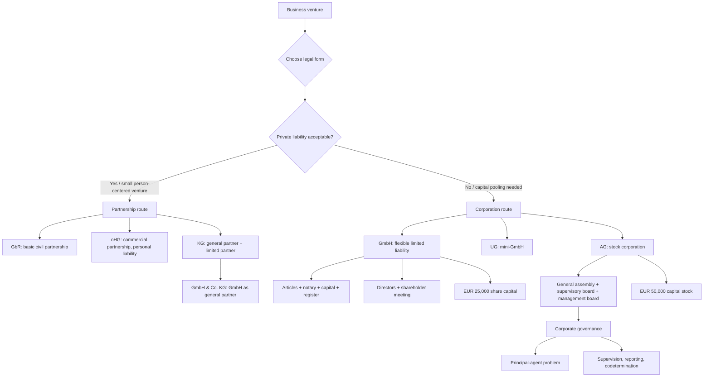

# Week 12-13: Company Law I And II

Source: `business-law/raw/moodle-export-business-law-950848572-s26-20260708/06.07. - Company Law I - Dr. Reger/Company Law I + II.pdf`
Course: Business Law
Processed: 2026-07-08
Wiki note: `business-law/wiki/week-12-13-company-law-i-ii/week-12-13-company-law-i-ii.md`

Course direction checked against `business-law/wiki/_course-logistics.md`: Company Law I and Company Law II are Sessions 12 and 13 in the teaching outline and follow Trade Law.

External statute check: GmbHG, AktG, HGB, and BGB anchors were cross-checked against the official Gesetze-im-Internet English sources on 2026-07-08. The official English translations warn that translations may lag the current German text; use the current German statutory text for exact legal wording.

## 80/20 Exam Summary

Company law asks which legal form is suitable and what legal consequences follow from that form.

- Business associations split into partnerships and corporations.
- Partnerships are more person-centered; corporations are more entity-centered.
- The legal-form choice is a management decision shaped by liability, capital, governance, tax, reputation, financing, disclosure, and formation costs.
- GbR is the basic partnership form. Commercial business pushes toward oHG or KG.
- oHG means all partners are personally liable. KG requires at least one unlimited-liability general partner and one limited partner.
- GmbH is the central limited-liability corporation for smaller and medium-sized businesses.
- GmbH protects shareholders from personal liability if capital contribution duties are fulfilled, but it costs capital, notarial form, registration, accounting, and disclosure.
- UG is a mini-GmbH: low entry capital but lower reputation and mandatory reserve building.
- AG is the stock-corporation form, usually for larger companies and capital-market readiness.
- AG governance is more rigid and dualistic: general assembly, supervisory board, and management board.
- Corporate governance responds to the principal-agent problem between owners, managers, workers, creditors, and other stakeholders.

## Where This Fits

Earlier notes explain how contracts bind persons and companies. Company law explains who the legal actor is and who bears risk.

```text
Contract law: Is there a contract?
Agency: Who is bound by a declaration?
Trade law: Is the actor a merchant?
Company law: What is the legal form, who represents it, and who is liable?
```

Exam habit:

```text
legal form -> representation -> liability -> governance -> business consequence
```

## Overview Of Business Associations

Core map:

| Category | Forms in deck | Main logic |
|---|---|---|
| Partnerships | GbR, oHG, KG, GmbH & Co. KG | More dependent on individual partners. |
| Corporations | GmbH, UG, AG, eG, KGaA, SE | Entity is more independent from members/shareholders. |

Basic comparison:

| Dimension | Partnerships | Corporations |
|---|---|---|
| Basic form | GbR | Registered association model; corporation statutes |
| Representation | Usually tied to partners | Separate bodies, such as directors or board |
| Taxation | Partners taxed individually | Corporate tax at entity level |
| Liability | At least one person often liable with private assets | Usually limited to corporate assets |
| Examples | GbR, oHG, KG, GmbH & Co. KG | GmbH, UG, AG, SE, KGaA |

## Choosing A Legal Form

The deck frames legal-form choice as a multi-factor decision, not a pure definition exercise.

| Factor | Why it matters |
|---|---|
| Limitation of liability | Protects private assets but may increase formation costs and financing friction. |
| Formation process | Notary, registration, capital raising, and timing differ by form. |
| Capital requirements | GmbH needs minimum share capital; UG can start with very low capital. |
| Governance flexibility | Partnerships are flexible but person-dependent; corporations are more structured. |
| Disclosure duties | Corporations often face accounting and publication duties. |
| Financing sources | Investors and banks care about reputation, liability, capital, and transferability. |
| Tax aspects | Entity versus partner taxation changes total burden and planning. |
| Change of shareholders | Easier in corporations than in person-centered partnerships. |
| Reputation | GmbH and AG can signal seriousness; UG may signal limited substance. |
| Liability pitfalls | Insolvency, director duties, and capital rules can still create personal risk. |

Exam sentence:

```text
The best legal form is not the one with the fewest formalities; it is the one whose liability, governance, financing, and cost profile match the business risk.
```

## Partnerships

### GbR

The GbR is the basic civil-law partnership under Sections 705 ff. BGB.

Key points:

- often arises tacitly through a joint endeavor;
- person-centered;
- not a corporation;
- legally independent enough to participate in legal relations;
- general partnership rules can apply to oHG and KG if no more specific rules exist;
- personal liability is the default risk.

Example:

```text
Two people jointly run a small gardening service for private customers without commercial scale. A GbR is the natural starting form.
```

### oHG

The oHG is the commercial general partnership.

Key points:

- used for commercial business;
- merchant under trade-law logic;
- every partner is personally liable;
- registration in commercial register required.

Exam trap:

```text
Do not recommend oHG only because two people operate together. Ask whether their business is commercial in type or scope.
```

### KG

The KG is a limited partnership.

Core structure:

```text
Komplementaer = general partner with unlimited liability
Kommanditist = limited partner with liability limited to agreed contribution
```

The KG helps combine active business management with capital participation by limited partners.

### GmbH & Co. KG

This mixed form uses a GmbH as the general partner of a KG.

Logic:

```text
KG structure
-> general partner would normally be personally liable
-> GmbH becomes general partner
-> practical liability risk is shifted to GmbH assets
```

This is a legal-form design tool for limiting human private-asset exposure while keeping partnership features.

## Unlimited And Limited Liability

Unlimited liability means a person can be liable with all private assets if liability arises. Contractual liability can be shaped to some extent, but tort and insolvency risks can be hard to contain.

Why limited liability matters:

- commercial transactions can be high-frequency and high-volume;
- one poor business decision can exceed private wealth;
- limited liability encourages innovation and capital pooling;
- limited liability shifts some risk to creditors, so law adds capital, disclosure, and governance controls.

Exam correction:

```text
Limited liability does not mean nobody is liable. The company remains liable with company assets.
```

## GmbH Overview

The GmbH is the main limited-liability company form in German business practice.

Key legal features:

- governed by GmbHG;
- independent legal person with own rights and obligations under Section 13 GmbHG;
- merchant by legal form under Sections 6 HGB and 13 GmbHG;
- usable for commercial business, asset management, and many lawful purposes;
- shareholders are generally not personally liable once capital contribution duties are fulfilled;
- GmbH itself is liable with its assets.

### Limited Liability In GmbH

Core logic:

```text
company assets and private shareholder assets are separated
-> GmbH is liable with company property
-> shareholders risk their contribution, not all private assets
```

Conditions and caveats:

- shareholders must pay their agreed capital contribution in full;
- minimum share capital is EUR 25,000;
- if company capital is depleted, shareholders generally do not have to refill it;
- banks may still ask for personal guarantees because statutory liability is limited.

## GmbH Formation

The deck gives four formation steps:

```text
draft articles of association
-> notarize articles of association
-> pay share capital
-> register in commercial register
```

Costs and timing from deck:

- approximate formation cost: around EUR 1,250 plus share capital;
- typical duration: around four to six weeks;
- shell company can be an alternative.

### Articles Of Association

Mandatory content under Section 3 I GmbHG:

- business name;
- company object;
- registered office;
- appointment of managing director;
- share capital, minimum EUR 25,000.

Facultative content can regulate:

- vote distribution in shareholder meeting;
- calling meetings and resolutions;
- managing director representation powers;
- share transfers;
- profit distribution;
- internal shareholder conflict rules.

Managerial implication:

```text
AoA drafting is not paperwork only. It pre-builds governance and conflict control.
```

Sample articles:

- faster and cheaper;
- satisfy minimum statutory requirements;
- possible for a GmbH with up to three shareholders and one managing director;
- less customized.

### Notarization

The founding shareholders adopt and sign the articles before a notary. Any later alteration needs notarization again.

Exam trap:

```text
Cheap founding documents can become expensive later if they omit rules the company needs.
```

### Share Capital

Regular GmbH minimum:

```text
EUR 25,000 share capital
at least EUR 12,500 paid before registration in many standard settings
```

Contributions can be in cash or in kind. Contributions in kind require specification of value and may require expert valuation. The point is to protect effective capital raising and creditors.

### Registration

Registration in the commercial register is constitutive:

```text
before registration = not fully formed GmbH
after registration = full GmbH legal person
```

## GmbH Directors

The GmbH is represented by one or more directors under Section 35 GmbHG.

Important rules:

- joint representation is common if there are several directors;
- representation power can be limited internally by articles, but Section 37 GmbHG limits external effect;
- director appointment can be revoked by shareholder resolution under Section 38 GmbHG;
- a shareholder can also be director;
- directors are not ordinary employees for appointment/removal purposes.

Director duties under Section 43 I GmbHG:

| Duty | Meaning |
|---|---|
| Duty of loyalty | Put company interests first; avoid competition/conflicts. |
| Duty of care | Proper management, compliance, and external-obligation control. |
| Insolvency duties | In financial crisis, strict duties arise, including insolvency filing under Section 15a InsO. |

Directors can be personally liable for duty violations.

## GmbH Shareholder Meeting And Shareholders

The shareholder meeting forms company objectives through shareholder resolutions.

Regular decision mode:

- simple majority for ordinary decisions;
- higher majority for crucial decisions such as changing articles.

Matters for shareholder meeting under Section 46 GmbHG include:

- appointment and dismissal of directors;
- appointment of Prokuristen;
- claims against directors;
- use of profits.

Shareholder rights:

| Right type | Meaning |
|---|---|
| Asset right | Participate in profits, generally according to share proportion unless AoA change this. |
| Information right | Obtain information on business affairs. |
| Co-management right | Vote and participate in shareholder meeting. |

## GmbH Supervisory Board

A supervisory board is usually not required for small GmbHs. It becomes mandatory in larger co-determined companies, especially once employee thresholds are met.

The deck points to AG supervisory-board logic for rights and duties.

## GmbH Benefits And Downsides

| Benefits | Downsides |
|---|---|
| Liability limited to company assets | Formation requires notary and can be costly. |
| Strong national/international reputation | EUR 25,000 share capital requirement. |
| Tax planning possibilities | Accounting and annual financial statements required. |
| Easier shareholder changes than in partnerships | Financial statements may need publication. |
| Managing director need not be shareholder | Loan access can be harder; banks may request personal security. |
| Flexible internal design | Formality and compliance burden. |

Tax basics from deck:

- profits face corporate income tax and municipal trade tax, together roughly just below 30 percent depending on municipality;
- profit distributions to shareholders face withholding tax;
- tax optimization exists but may be too complex for small firms.

## Unternehmergesellschaft (UG)

The UG is a "mini-GmbH."

Key points:

- no EUR 25,000 minimum share capital;
- EUR 1 can be enough in principle;
- cash only, not contributions in kind;
- agreed capital must be paid immediately;
- name must include `Unternehmergesellschaft (haftungsbeschraenkt)`;
- lower reputation than GmbH;
- banks may ask for personal security;
- at least 25 percent of annual surplus must go into reserve under Section 5a III GmbHG.

Exam sentence:

```text
UG lowers the entry barrier to limited liability but does not eliminate creditor-risk concerns or reputation costs.
```

## AG Overview

The AG is the stock corporation.

Key points:

- corporation and legal person like GmbH;
- governed by AktG;
- commonly used by large companies;
- liability limited to assets of the AG under Section 1 I 2 AktG;
- listed and unlisted AGs are possible;
- ownership can be dispersed or concentrated;
- SE is a European stock-corporation form.

## AG Formation And Legal Rigidity

AG formation can happen directly or by transforming an existing company, such as a GmbH, into an AG under transformation law.

AG structure is stricter than GmbH:

- articles/by-laws are more tightly regulated;
- deviation from statutory law is allowed only where explicitly permitted;
- standardization protects shareholders and supports share trading;
- minimum capital stock is EUR 50,000;
- capital-raising rules are stricter than GmbH.

## AG Corporate Bodies

German AG governance uses a dualistic system.

```text
General assembly
-> elects/dismisses supervisory board members and makes basic decisions

Supervisory board
-> appoints/dismisses management board
-> supervises management

Management board
-> manages business and represents AG
```

Main contrast with GmbH:

```text
GmbH shareholders can instruct directors more directly.
AG shareholders do not manage through instructions to the management board.
```

## Corporate Governance

Corporate governance responds to the principal-agent dilemma.

Problem:

- managers may know more than owners or stakeholders;
- managers may have different interests;
- hidden actions, hidden intentions, or hidden characteristics can harm shareholders, workers, creditors, or public trust.

Corporate governance solution:

- rules and guidelines for management and supervision;
- efficient and transparent management;
- welfare and trust goals;
- supervisory board, reporting duties, worker participation, and German Corporate Governance Code.

Memory hook:

```text
corporate governance = how a company controls those who control the company
```

## Visual Knowledge Map



## Subject Knowledge Graph

| Node | Meaning | Exam Relevance |
|---|---|---|
| Business Association | Legal organization for joint business activity | Starting point for company-law classification. |
| Partnership | Person-centered association such as GbR, oHG, or KG | Explains personal liability and partner dependence. |
| Corporation | Entity-centered legal form such as GmbH or AG | Explains limited liability and corporate bodies. |
| GbR | Basic civil-law partnership | Suitable for small non-commercial joint enterprise. |
| oHG | Commercial general partnership | All partners personally liable. |
| KG | Limited partnership | Splits unlimited general partner and limited partner roles. |
| GmbH | Limited liability company | Main SME limited-liability form. |
| UG | Mini-GmbH | Low-capital limited-liability option with reserve duty. |
| AG | Stock corporation | Larger, more rigid corporation with dualistic governance. |
| Articles Of Association | Constitutional document of GmbH/AG | Controls formation, governance, and internal rules. |
| Managing Director | GmbH organ representing and managing the company | Representation and liability gateway. |
| Shareholder Meeting | GmbH body forming shareholder decisions | Appointment, profit use, claims against directors. |
| Supervisory Board | Oversight body, mandatory in AG and some larger GmbHs | Central corporate-governance tool. |
| Management Board | AG management organ | Runs and represents AG without shareholder instructions. |
| Corporate Governance | Rules for management and supervision | Solves principal-agent and transparency problems. |

| From | Relationship | To | Why It Matters |
|---|---|---|---|
| Legal-form choice | depends on | Liability, capital, governance, tax, disclosure | Exam theory questions often ask suitability. |
| GbR | is base form for | Partnerships | Start small partnership analysis here. |
| oHG | requires | Commercial business | Connects company law to trade law. |
| KG | separates | General partner and limited partner | Explains liability design. |
| GmbH & Co. KG | uses | GmbH as general partner | Limits natural-person liability in KG structure. |
| GmbH | is | Legal person and merchant by form | Connects company law to trade law and representation. |
| GmbH formation | requires | Articles, notary, capital, register | Four-step formation route. |
| GmbH director | represents | GmbH | Connects agency/company law. |
| Shareholder meeting | controls | Director appointment and profit use | Governance and internal power. |
| AG | uses | Dualistic system | Separates owners, supervision, management. |
| Corporate governance | responds to | Principal-agent problem | Explains why boards/reporting exist. |

## Real Business Examples

### Small Gardening Business

Two people offer gardening services to private customers with modest revenue and simple operations. A GbR is usually the natural low-formality option. oHG is not necessary unless the type or scope requires a commercial business operation. GmbH or UG could limit liability, but may be costly or reputation-heavy relative to the scale.

### Risky Hardware Startup

Founders expect high contract values, product liability risk, outside financing, and employee growth. A GmbH may be suitable because limited liability, reputation, and share-transfer structure matter more than low-formality setup.

### Capital-Market Growth Case

A mature firm wants broad investor participation and standardized governance. AG may be appropriate because share trading and investor protection matter, but formation, governance, and disclosure become more rigid.

## Exam Relevance

Likely prompts:

- Explain differences between partnerships and corporations.
- Recommend a legal form for a small business case.
- Compare GbR, oHG, KG, GmbH, UG, and AG.
- Explain GmbH formation.
- Explain the GmbH director's role and liability.
- Explain AG corporate bodies and the dualistic system.
- Explain corporate governance as a response to the principal-agent dilemma.

Common traps:

- Treating limited liability as "no liability."
- Recommending GmbH for every business without discussing capital, cost, and financing friction.
- Forgetting that oHG partners are personally liable.
- Treating UG as identical to GmbH without reserve/reputation issues.
- Giving AG shareholders instruction powers like GmbH shareholders.
- Describing corporate governance as ethics only instead of management/supervision control.

High-scoring answer structure:

```text
1. Identify business size, risk, financing, and governance needs.
2. Classify possible legal forms.
3. Compare liability and formation burden.
4. Compare representation and governance.
5. State recommendation and one rejected alternative.
```

## Retrieval Prompts

Closed-book questions:

1. What is the main difference between partnerships and corporations?
2. Why does legal-form choice affect liability and financing?
3. When is a GbR suitable?
4. What is the liability split in a KG?
5. Why does a GmbH require share capital?
6. What are the four steps of GmbH formation?
7. What is the role of the GmbH shareholder meeting?
8. What makes a UG different from a regular GmbH?
9. What are the three main AG corporate bodies?
10. What problem does corporate governance solve?

Application prompts:

1. Two founders run a small gardening service with EUR 60,000 annual revenue. Recommend one suitable form and one unsuitable form.
2. A founder wants limited liability but has almost no starting capital. Compare UG and GmbH.
3. A growing company wants many passive investors and stronger share transferability. Explain why AG may fit but has governance costs.

## Practice Tasks

1. Create a comparison table for GbR, oHG, KG, GmbH, UG, and AG with columns: liability, formation burden, governance, best use case.
2. Write a legal-form recommendation paragraph for a startup, a small craft business, and a mature public-facing company.
3. Draw the AG dualistic system from memory and label who appoints whom.
4. Explain in five sentences why limited liability creates both business benefits and creditor risks.

## Connections

Previous notes from this lecture:

- `business-law/wiki/week-07-agency/week-07-agency.md` for representation and internal/external authority.
- `business-law/wiki/week-11-trade-law/week-11-trade-law.md` for merchant status and commercial register.
- `business-law/wiki/week-10-transfer-of-property/week-10-transfer-of-property.md` for asset ownership versus company ownership.

Cross-course links:

- Organization: corporate governance is a formal organization design and control system.
- Finance: legal form affects liability, financing access, tax, disclosure, and investor claims.
- Marketing: reputation of GmbH, UG, or AG can influence customer and supplier trust.

## Weakness Flags

- First-pass active recall not yet completed.
- Test legal-form recommendation with one small-business case.
- Test difference between GmbH director and AG management board.
- Test "limited liability means company liable, shareholders protected" wording.
