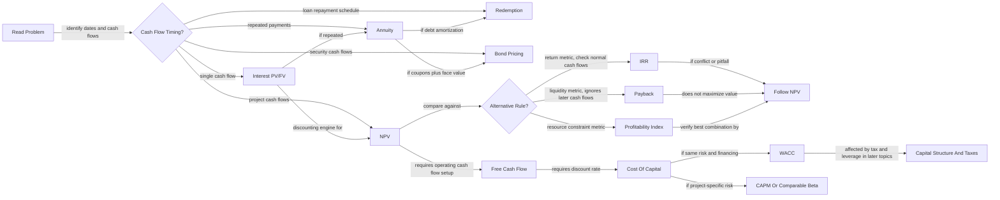

# Finance And Investment Management Course Knowledge Graph

This file aggregates the Finance and Investment Management concepts learned so far. It is lecture-scoped only.

Last updated: 2026-07-09

## Course-Level Mermaid Graph

```mermaid
graph TD
    FIN[Finance And Investment Management] -->|contains| CORP[Corporate Finance Lecture]
    FIN -->|contains| MATH[Mathematical Basics Exercises]

    CORP -->|starts with| FSA[Financial Analysis]
    FSA -->|uses report| BS[Balance Sheet]
    FSA -->|uses report| IS[Income Statement]
    FSA -->|uses report| CF[Cash Flow Statement]
    FSA -->|turns reports into| RATIOS[Ratio Analysis]
    FSA -->|starts from| DQ[Decision Question]
    DQ -->|profit and margins| IS
    DQ -->|position and liquidity| BS
    DQ -->|cash quality| CF
    RATIOS -->|measures short-term solvency| LIQ[Liquidity]
    RATIOS -->|measures debt reliance| LEV[Leverage]
    RATIOS -->|measures margin quality| PROF[Profitability]
    RATIOS -->|supports market comparison| VAL[Valuation]
    RATIOS -->|explains ROE through| DUPONT[DuPont ROE Decomposition]
    RATIOS -->|measures operating capital productivity| ROIC[ROIC]
    RATIOS -->|measures shareholder return| ROE[ROE]
    DUPONT -->|decomposes| ROE

    FSA -->|extends into| FUND[Fundamental Analysis Excursus]
    FUND -->|uses valuation signal| MB[Market-to-Book]
    FUND -->|uses valuation signal| PE[P/E Ratio]
    FUND -->|uses quality signal| FSCORE[Piotroski F-Score]
    FUND -->|detects suspicious patterns| REDFLAG[Wirecard Red Flags]
    FSCORE -->|filters cheapness from| MB
    FSCORE -->|filters cheapness from| PE
    FSCORE -->|helps identify| VTRAP[Value Trap Risk]

    CORP -->|continues with| IA[Investment Analysis]
    IA -->|master decision rule| NPV[Net Present Value]
    IA -->|alternative return metric| IRR[Internal Rate Of Return]
    IA -->|liquidity shortcut| PAYBACK[Payback Rule]
    IA -->|resource constraint tool| PI[Profitability Index]
    IRR -->|can suffer from| IRRPIT[IRR Pitfalls]
    IRRPIT -->|resolved by following| NPV
    PAYBACK -->|ignores| TVM[Time Value Of Money]

    IA -->|requires cash-flow construction from| CBUD[Capital Budgeting]
    CBUD -->|starts from| ASSUMP[Business And Investment Assumptions]
    ASSUMP -->|forecasts operating profit as| EBIT[EBIT]
    ASSUMP -->|sets accounting allocation| DEP[Depreciation]
    ASSUMP -->|sets long-term investment| CAPEX[CapEx]
    ASSUMP -->|sets operating cash need| DNWC[Delta Net Working Capital]
    ASSUMP -->|filtered by decision causality| INC[Incremental Cash Flow]
    INC -->|produces dated| FCF[Free Cash Flow]
    EBIT -->|feeds| FCF
    DEP -->|is added back into| FCF
    DEP -->|creates| DTS[Depreciation Tax Shield]
    CAPEX -->|reduces| FCF
    DNWC -->|adjusts| FCF
    INC -->|includes| OPCOST[Opportunity Cost]
    INC -->|excludes| SUNK[Sunk Cost]
    INC -->|includes| CANN[Cannibalization]
    FCF -->|discounted into| NPV
    NPV -->|stress-tested with| CRISK[Break-Even Sensitivity Scenario]
    CRISK -->|rebuilds| SFCF[Scenario-Specific FCF]
    SFCF -->|produces| NMAT[NPV Matrix]
    NMAT -->|reveals| RANK[Ranking Stability]
    RANK -->|supports| RDEC[Robust Project Decision]

    CBUD -->|needs required return from| COC[Cost Of Capital]
    COC -->|equity estimate| CAPM[CAPM]
    CAPM -->|prices| BETA[Beta]
    COC -->|combines financing costs through| WACC[WACC]
    COC -->|uses| DCOST[Debt Cost Of Capital]
    COC -->|project risk proxy| ABETA[Asset Beta]
    ABETA -->|estimated via| COMPARS[Comparable Firms]
    WACC -->|discounts| FCF
    WACC -->|hurdle for| VADD[Value Added Against Cost Of Capital]
    NPV -->|measures| VADD

    COC -->|leads to financing choice| CSTRUCT[Capital Structure]
    CSTRUCT -->|perfect-market benchmark| MM1[MM I Without Taxes]
    CSTRUCT -->|leverage raises equity cost| MM2[MM II Without Taxes]
    MM1 -->|explained by| HLEV[Homemade Leverage]
    MM2 -->|keeps perfect-market| WACC
    CSTRUCT -->|warns against| EPSF[EPS Fallacy]
    CSTRUCT -->|warns against| DILF[Dilution Fallacy]
    CSTRUCT -->|real-world imperfection| CSTAX[Capital Structure And Taxes]
    CSTAX -->|creates| ITSHIELD[Interest Tax Shield]
    ITSHIELD -->|raises| LEVVAL[Levered Firm Value]
    CSTAX -->|uses| ATWACC[After-Tax WACC]
    CSTAX -->|limited by| DISTRESS[Financial Distress Costs]
    ITSHIELD -->|balanced against| TRADEOFF[Static Trade-Off Theory]
    DISTRESS -->|balanced against| TRADEOFF

    MATH -->|is built on| TVM
    TVM -->|operationalized by| INT[Interest Calculation]
    INT -->|starts with| DIR[PV Or FV Direction]
    INT -->|no interest-on-interest| SIMPLE[Simple Interest]
    INT -->|interest-on-interest| COMP[Compound Interest]
    INT -->|converts nominal to actual| EFF[Effective Annual Rate]
    INT -->|matches rate with periods| PERIOD[Periodic Rate]
    INT -->|limit of compounding frequency| CONT[Continuous Compounding]

    TVM -->|values repeated cash flows| ANN[Annuities]
    ANN -->|payments at period end| IMM[Annuity-Immediate]
    ANN -->|payments at period beginning| DUE[Annuity-Due]
    ANN -->|handles changing payments| GROW[Growing Annuities]
    DUE -->|worth one extra period vs| IMM

    ANN -->|provides formulas for| RED[Redemptions]
    RED -->|constant principal repayment| INST[Installment Repayment]
    RED -->|constant total payment| AREP[Annuity Repayment]
    RED -->|may include| GRACE[Payment-Free Periods]
    GRACE -->|interest paid keeps| RBASE[Repayment Base]
    GRACE -->|capitalized interest grows| RBASE
    RBASE -->|sets payment size in| AREP
    RED -->|schedules| FINCF[Financing Cash Flows]
    CBUD -->|values| OPCF[Operating Project FCF]
    OPCF -->|excludes under WACC| FINCF
    NPV -->|supports project decision before| FMIX[Financing Mix]
    FMIX -->|debt terms modeled by| RED
    FINCF -->|tests| LIQTEST[Debt-Service Liquidity]

    TVM -->|prices promised cash flows of| BONDS[Bonds]
    BONDS -->|only face value at maturity| ZB[Zero-Coupon Bond]
    BONDS -->|coupons plus face value| CBOND[Coupon Bond]
    CBOND -->|may require| ACCRUED[Accrued Interest]
    CBOND -->|priced relative to| YTM[Yield To Maturity]
    YTM -->|can estimate| DCOST
    BONDS -->|risk measured by| DUR[Duration]
    DUR -->|approximates| RISK[Interest-Rate Sensitivity]
    BONDS -->|term structure through| YCURVE[Yield Curve]
    YCURVE -->|contains| SPOT[Spot Rates]
    YCURVE -->|implies| FWD[Forward Rates]
    FWD -->|compound into| SPOT
    DUR -->|converted into| DMOD[Modified Duration]
    DUR -->|used for| IMMUN[Immunization]

    MATH -->|values equity cash flows of| STOCKS[Stocks]
    STOCKS -->|starts with| DPS[Dividend Metrics]
    STOCKS -->|valued by| DDM[Dividend Discount Model]
    DDM -->|constant growth| GORDON[Gordon Growth Model]
    DDM -->|finite high growth| TWOSTAGE[Two-Phase Growth]
    STOCKS -->|growth value| PVGO[PVGO]
    STOCKS -->|relative valuation| MULT[PE And PB Multiples]

    MATH -->|prices derivative rights through| OPT[Options]
    OPT -->|right to buy| CALL[Call]
    OPT -->|right to sell| PUT[Put]
    OPT -->|arbitrage relation| PCP[Put-Call Parity]
    OPT -->|state model| BINOM[Binomial Model]

    FIN -->|practiced by| MOCKF[Finance Mock Exam]
    MOCKF -->|integrates| CORP
    MOCKF -->|integrates| MATH

    TVM -->|discounts project cash flows for| NPV
    INT -->|enables| ANN
    INT -->|enables| BONDS
    ANN -->|coupon stream is a type of| BONDS
    BONDS -->|uses same DCF logic as| NPV
```

## Exam-Flow Mermaid Graph

## Subject Graph Index

| Subject / Deck | Wiki Note | Main Visual Logic | Last Updated |
|---|---|---|---|
| Course logistics | `finance-and-investment-management/wiki/_course-logistics.md` | Excluded from conceptual graph | 2026-05-16 |
| Financial Analysis | `finance-and-investment-management/wiki/session-01-02-financial-analysis/session-01-02-financial-analysis.md` | Decision questions to statements, ratios, ROIC/ROE, and valuation interpretation | 2026-05-25 |
| Fundamental Analysis Excursus | `finance-and-investment-management/wiki/session-01-02-excursus-fundamental-analysis-german-stock-market/session-01-02-excursus-fundamental-analysis-german-stock-market.md` | M/B, P/E, and F-Score as value-opportunity vs value-trap signals | 2026-05-25 |
| Investment Analysis | `finance-and-investment-management/wiki/session-03-04-investment-analysis/session-03-04-investment-analysis.md` | NPV as master rule; IRR/payback/PI as limited alternatives | 2026-05-16 |
| Capital Budgeting | `finance-and-investment-management/wiki/session-05-06-capital-budgeting/session-05-06-capital-budgeting.md` | Slide-backed HomeNet cases: assumptions -> incremental FCF -> corrected NPV -> alternatives and risk analysis | 2026-06-14 |
| Cost Of Capital | `finance-and-investment-management/wiki/session-07-08-cost-of-capital/session-07-08-cost-of-capital.md` | CAPM, beta, project risk matching, bond-yield evidence for debt cost, WACC, project value added, and the bridge from project value to debt-service testing | 2026-07-06 |
| Capital Structure | `finance-and-investment-management/wiki/session-09-10-capital-structure/session-09-10-capital-structure.md` | MM I/II without taxes, leverage, WACC offset, EPS/dilution fallacies | 2026-06-06 |
| Capital Structure And Taxes | `finance-and-investment-management/wiki/session-11-12-capital-structure-and-taxes/session-11-12-capital-structure-and-taxes.md` | Interest tax shield, after-tax WACC, distress costs, static trade-off theory | 2026-06-06 |
| Interest Calculation | `finance-and-investment-management/wiki/exercise-01-02-interest-calculation/exercise-01-02-interest-calculation.md` | Time value of money and compounding | 2026-05-16 |
| Annuities | `finance-and-investment-management/wiki/exercise-03-04-annuities/exercise-03-04-annuities.md` | Repeated payments by timing, growth pattern, and loan-redemption timing bridge | 2026-06-24 |
| Redemptions | `finance-and-investment-management/wiki/exercise-05-redemptions/exercise-05-redemptions.md` | Full Exercise 5 solutions: installment, annuity, maturity, grace-period repayment base, annuity timing, and student-loan alternatives | 2026-06-24 |
| Redemptions-Capital Budgeting Bridge | `finance-and-investment-management/wiki/exercise-05-redemptions/redemptions-to-capital-budgeting-bridge.md` | Project operating value versus financing cash-flow schedule, annuity timing, and debt-service feasibility | 2026-06-24 |
| Bonds I | `finance-and-investment-management/wiki/exercise-06-bonds-i/exercise-06-bonds-i.md` | Bond price as discounted promised cash flows, coupon bonds, accrued interest, YTM, and the bridge to debt cost of capital | 2026-07-09 |
| Bonds II: Yield Curves And Duration | `finance-and-investment-management/wiki/exercise-08-09-bonds-ii-yield-curves-duration/exercise-08-09-bonds-ii-yield-curves-duration.md` | Spot/forward-rate equivalence, term-structure pricing, duration, modified duration, convexity caveat, and immunization | 2026-07-09 |
| Stocks And Equity Valuation | `finance-and-investment-management/wiki/exercise-10-11-stocks-valuation/exercise-10-11-stocks-valuation.md` | Dividend metrics, DDM, Gordon growth, two-phase growth, PVGO, and P/E/P/B valuation shortcuts | 2026-07-09 |
| Options | `finance-and-investment-management/wiki/exercise-12-options/exercise-12-options.md` | Payoff/profit logic, put-call parity, binomial valuation, hedge ratio, and American early-exercise check | 2026-07-09 |
| Mock Exam | `finance-and-investment-management/wiki/exercise-13-mock-exam/exercise-13-mock-exam.md` | Integrated lecture/exercise MCQ practice with inferred answer routes because no official key was provided | 2026-07-09 |

## Nodes

| Node | Meaning | Source Note |
|---|---|---|
| Financial statements | Accounting reports used for analysis | `session-01-02-financial-analysis/session-01-02-financial-analysis.md` |
| Balance sheet | Point-in-time assets, liabilities, equity | `session-01-02-financial-analysis/session-01-02-financial-analysis.md` |
| Ratio analysis | Standardized firm comparison | `session-01-02-financial-analysis/session-01-02-financial-analysis.md` |
| DuPont identity | ROE decomposed into margin, turnover, leverage | `session-01-02-financial-analysis/session-01-02-financial-analysis.md` |
| ROIC | Operating return on invested capital | `session-01-02-financial-analysis/session-01-02-financial-analysis.md` |
| ROE | Shareholder return on book equity | `session-01-02-financial-analysis/session-01-02-financial-analysis.md` |
| P/E ratio | Market value relative to current net income | `session-01-02-financial-analysis/session-01-02-financial-analysis.md` |
| M/B ratio | Market value relative to book equity | `session-01-02-excursus-fundamental-analysis-german-stock-market/session-01-02-excursus-fundamental-analysis-german-stock-market.md` |
| Piotroski F-Score | Financial strength score | `session-01-02-excursus-fundamental-analysis-german-stock-market/session-01-02-excursus-fundamental-analysis-german-stock-market.md` |
| Value trap | Cheap-looking stock with weak or deteriorating fundamentals | `session-01-02-excursus-fundamental-analysis-german-stock-market/session-01-02-excursus-fundamental-analysis-german-stock-market.md` |
| NPV | Present value of all project cash flows | `session-03-04-investment-analysis/session-03-04-investment-analysis.md` |
| IRR | Discount rate that makes NPV zero | `session-03-04-investment-analysis/session-03-04-investment-analysis.md` |
| Capital budgeting | Project investment evaluation process that builds FCF for NPV | `session-05-06-capital-budgeting/session-05-06-capital-budgeting.md` |
| Free cash flow | Incremental cash flow available to capital providers | `session-05-06-capital-budgeting/session-05-06-capital-budgeting.md` |
| Incremental cash flow | Cash flow that changes because the project is accepted | `session-05-06-capital-budgeting/session-05-06-capital-budgeting.md` |
| Depreciation tax shield | Tax saving from non-cash depreciation | `session-05-06-capital-budgeting/session-05-06-capital-budgeting.md` |
| Delta NWC | Change in operating working capital used in FCF | `session-05-06-capital-budgeting/session-05-06-capital-budgeting.md` |
| NPV matrix | Alternative NPVs across coherent downside, base, and upside assumptions | `session-05-06-capital-budgeting/session-05-06-capital-budgeting.md` |
| Ranking stability | Whether the preferred project remains preferred across reasonable assumptions | `session-05-06-capital-budgeting/session-05-06-capital-budgeting.md` |
| Operating project FCF | Incremental cash flow before financing used in WACC-based project valuation | `session-05-06-capital-budgeting/session-05-06-capital-budgeting.md` |
| Financing mix | Proposed combination of debt, equity, and other funding used to implement an accepted project | `exercise-05-redemptions/redemptions-to-capital-budgeting-bridge.md` |
| Redemption schedule | Period-by-period interest, principal repayment, total payment, and remaining debt | `exercise-05-redemptions/exercise-05-redemptions.md` |
| Financing cash flow | Borrowing, interest, and principal transfers between firm and capital providers | `exercise-05-redemptions/redemptions-to-capital-budgeting-bridge.md` |
| Debt-service liquidity | Ability to meet interest and principal payments when due | `exercise-05-redemptions/redemptions-to-capital-budgeting-bridge.md` |
| Cost of capital | Required return for same-risk investment | `session-07-08-cost-of-capital/session-07-08-cost-of-capital.md` |
| CAPM | Required-return model based on beta and market risk premium | `session-07-08-cost-of-capital/session-07-08-cost-of-capital.md` |
| Beta | Market-risk sensitivity priced in CAPM | `session-07-08-cost-of-capital/session-07-08-cost-of-capital.md` |
| WACC | Weighted average after-tax financing cost | `session-07-08-cost-of-capital/session-07-08-cost-of-capital.md` |
| Debt cost of capital | Required return demanded by debt investors for the firm's debt risk | `session-07-08-cost-of-capital/session-07-08-cost-of-capital.md` |
| Value added against cost of capital | Positive NPV after operating FCF is discounted at the required return | `session-07-08-cost-of-capital/session-07-08-cost-of-capital.md` |
| Capital structure | Mix of debt, equity, and other securities | `session-09-10-capital-structure/session-09-10-capital-structure.md` |
| MM Proposition I | Firm value independent of capital structure in perfect markets without taxes | `session-09-10-capital-structure/session-09-10-capital-structure.md` |
| MM Proposition II | Levered equity cost rises with debt-to-equity ratio | `session-09-10-capital-structure/session-09-10-capital-structure.md` |
| Interest tax shield | Tax saving from tax-deductible interest | `session-11-12-capital-structure-and-taxes/session-11-12-capital-structure-and-taxes.md` |
| Static trade-off theory | Optimal debt balances tax shields and expected distress costs | `session-11-12-capital-structure-and-taxes/session-11-12-capital-structure-and-taxes.md` |
| Time value of money | Money depends on timing | `exercise-01-02-interest-calculation/exercise-01-02-interest-calculation.md` |
| PV/FV direction | Whether a cash flow must be discounted backward or compounded forward | `exercise-01-02-interest-calculation/exercise-01-02-interest-calculation.md` |
| Effective annual rate | Actual annual rate after compounding | `exercise-01-02-interest-calculation/exercise-01-02-interest-calculation.md` |
| Periodic rate | Rate per compounding period, matched to number of periods | `exercise-01-02-interest-calculation/exercise-01-02-interest-calculation.md` |
| Annuity | Repeated cash-flow stream | `exercise-03-04-annuities/exercise-03-04-annuities.md` |
| Annuity-immediate | Repeated payments at period end | `exercise-03-04-annuities/exercise-03-04-annuities.md` |
| Annuity-due | Repeated payments at period beginning | `exercise-03-04-annuities/exercise-03-04-annuities.md` |
| Redemption | Loan repayment calculation | `exercise-05-redemptions/exercise-05-redemptions.md` |
| Repayment base | Debt balance used to calculate the post-grace annuity payment | `exercise-05-redemptions/exercise-05-redemptions.md` |
| Capitalized interest | Unpaid interest added to loan principal during grace | `exercise-05-redemptions/exercise-05-redemptions.md` |
| Bond | Debt security with promised payments | `exercise-06-bonds-i/exercise-06-bonds-i.md` |
| Duration | Interest-rate sensitivity measure | `exercise-06-bonds-i/exercise-06-bonds-i.md` |
| Accrued interest | Pro-rata coupon compensation between coupon dates | `exercise-06-bonds-i/exercise-06-bonds-i.md` |
| Yield to maturity | Discount rate equating bond price to promised cash flows | `exercise-06-bonds-i/exercise-06-bonds-i.md` |
| Bond yield evidence | YTM or comparable bond yield used to estimate debt cost of capital `r_D` | `session-07-08-cost-of-capital/bonds-to-cost-of-capital-bridge.md` |
| Yield curve | Set of spot rates by maturity | `exercise-08-09-bonds-ii-yield-curves-duration/exercise-08-09-bonds-ii-yield-curves-duration.md` |
| Spot rate | Rate from today to a future maturity | `exercise-08-09-bonds-ii-yield-curves-duration/exercise-08-09-bonds-ii-yield-curves-duration.md` |
| Forward rate | Implied future one-period rate | `exercise-08-09-bonds-ii-yield-curves-duration/exercise-08-09-bonds-ii-yield-curves-duration.md` |
| Modified duration | Duration divided by `1+r` for price-change approximation | `exercise-08-09-bonds-ii-yield-curves-duration/exercise-08-09-bonds-ii-yield-curves-duration.md` |
| Immunization | Portfolio-duration matching to a planning horizon | `exercise-08-09-bonds-ii-yield-curves-duration/exercise-08-09-bonds-ii-yield-curves-duration.md` |
| Stock valuation | Equity pricing through expected dividends, growth, and required return | `exercise-10-11-stocks-valuation/exercise-10-11-stocks-valuation.md` |
| Dividend discount model | Values stock as present value of expected future dividends | `exercise-10-11-stocks-valuation/exercise-10-11-stocks-valuation.md` |
| Gordon growth model | Constant-growth dividend discount model | `exercise-10-11-stocks-valuation/exercise-10-11-stocks-valuation.md` |
| PVGO | Present value of growth opportunities | `exercise-10-11-stocks-valuation/exercise-10-11-stocks-valuation.md` |
| P/E valuation multiple | Peer or implied price relative to expected EPS | `exercise-10-11-stocks-valuation/exercise-10-11-stocks-valuation.md` |
| P/B valuation multiple | Peer or implied price relative to book value per share | `exercise-10-11-stocks-valuation/exercise-10-11-stocks-valuation.md` |
| Options | Derivative rights to buy or sell an underlying at a strike price | `exercise-12-options/exercise-12-options.md` |
| Call option | Right to buy the underlying at strike `K` | `exercise-12-options/exercise-12-options.md` |
| Put option | Right to sell the underlying at strike `K` | `exercise-12-options/exercise-12-options.md` |
| Put-call parity | Arbitrage relation among stock, put, call, and discounted strike | `exercise-12-options/exercise-12-options.md` |
| Binomial model | Option valuation by up/down states and backward induction | `exercise-12-options/exercise-12-options.md` |
| Finance mock exam | Integrated MCQ practice across lecture and exercise tracks | `exercise-13-mock-exam/exercise-13-mock-exam.md` |

## Edges

| From | Relationship | To | Source Note |
|---|---|---|---|
| Financial statements | provide inputs for | ratio analysis | `session-01-02-financial-analysis/session-01-02-financial-analysis.md` |
| Decision question | selects | financial statement focus | `session-01-02-financial-analysis/session-01-02-financial-analysis.md` |
| DuPont identity | decomposes | ROE | `session-01-02-financial-analysis/session-01-02-financial-analysis.md` |
| ROIC | evaluates | operating capital productivity | `session-01-02-financial-analysis/session-01-02-financial-analysis.md` |
| ROE | evaluates | shareholder return | `session-01-02-financial-analysis/session-01-02-financial-analysis.md` |
| P/E ratio | values | earnings power | `session-01-02-financial-analysis/session-01-02-financial-analysis.md` |
| M/B ratio | classifies | value vs growth stocks | `session-01-02-excursus-fundamental-analysis-german-stock-market/session-01-02-excursus-fundamental-analysis-german-stock-market.md` |
| Piotroski F-Score | filters | valuation cheapness | `session-01-02-excursus-fundamental-analysis-german-stock-market/session-01-02-excursus-fundamental-analysis-german-stock-market.md` |
| Low M/B plus low F-Score | indicates | value trap risk | `session-01-02-excursus-fundamental-analysis-german-stock-market/session-01-02-excursus-fundamental-analysis-german-stock-market.md` |
| NPV | dominates when conflicting with | IRR | `session-03-04-investment-analysis/session-03-04-investment-analysis.md` |
| Payback rule | ignores | time value of money | `session-03-04-investment-analysis/session-03-04-investment-analysis.md` |
| Capital budgeting | constructs | free cash flow | `session-05-06-capital-budgeting/session-05-06-capital-budgeting.md` |
| Incremental cash-flow filter | excludes | sunk costs and financing costs | `session-05-06-capital-budgeting/session-05-06-capital-budgeting.md` |
| Depreciation | creates | depreciation tax shield | `session-05-06-capital-budgeting/session-05-06-capital-budgeting.md` |
| Delta NWC | adjusts | free cash flow | `session-05-06-capital-budgeting/session-05-06-capital-budgeting.md` |
| Business and investment assumptions | are filtered into | incremental cash flow | `session-05-06-capital-budgeting/session-05-06-capital-budgeting.md` |
| Incremental cash flow | produces | project free cash flow | `session-05-06-capital-budgeting/session-05-06-capital-budgeting.md` |
| Scenario-specific FCF | produces | NPV matrix | `session-05-06-capital-budgeting/session-05-06-capital-budgeting.md` |
| NPV matrix | reveals | ranking stability | `session-05-06-capital-budgeting/session-05-06-capital-budgeting.md` |
| Capital budgeting | values | operating project FCF | `session-05-06-capital-budgeting/session-05-06-capital-budgeting.md` |
| Positive NPV decision | precedes or is finalized alongside | financing mix design | `exercise-05-redemptions/redemptions-to-capital-budgeting-bridge.md` |
| Financing mix | supplies debt terms to | redemption schedule | `exercise-05-redemptions/redemptions-to-capital-budgeting-bridge.md` |
| Redemptions | schedules | financing cash flows | `exercise-05-redemptions/exercise-05-redemptions.md` |
| WACC-based valuation | excludes from project FCF | loan interest and principal | `exercise-05-redemptions/redemptions-to-capital-budgeting-bridge.md` |
| Redemption schedule | tests | debt-service liquidity | `exercise-05-redemptions/redemptions-to-capital-budgeting-bridge.md` |
| Cost of capital | discounts | free cash flow | `session-07-08-cost-of-capital/session-07-08-cost-of-capital.md` |
| CAPM | estimates | equity cost of capital | `session-07-08-cost-of-capital/session-07-08-cost-of-capital.md` |
| Beta | measures | systematic market risk | `session-07-08-cost-of-capital/session-07-08-cost-of-capital.md` |
| WACC | combines | equity and after-tax debt costs | `session-07-08-cost-of-capital/session-07-08-cost-of-capital.md` |
| Bond yield evidence | estimates | debt cost of capital | `session-07-08-cost-of-capital/bonds-to-cost-of-capital-bridge.md` |
| WACC | acts as hurdle for | project value added | `session-07-08-cost-of-capital/bonds-to-cost-of-capital-bridge.md` |
| NPV | measures | value added against cost of capital | `session-07-08-cost-of-capital/bonds-to-cost-of-capital-bridge.md` |
| MM Proposition I | makes independent | firm value and capital structure | `session-09-10-capital-structure/session-09-10-capital-structure.md` |
| MM Proposition II | links | leverage and equity cost | `session-09-10-capital-structure/session-09-10-capital-structure.md` |
| Homemade leverage | supports | MM Proposition I | `session-09-10-capital-structure/session-09-10-capital-structure.md` |
| Interest tax shield | increases | levered firm value | `session-11-12-capital-structure-and-taxes/session-11-12-capital-structure-and-taxes.md` |
| After-tax WACC | decreases with | tax-deductible debt | `session-11-12-capital-structure-and-taxes/session-11-12-capital-structure-and-taxes.md` |
| Financial distress costs | offset | tax-shield benefits | `session-11-12-capital-structure-and-taxes/session-11-12-capital-structure-and-taxes.md` |
| Time value of money | supports | NPV | `exercise-01-02-interest-calculation/exercise-01-02-interest-calculation.md` |
| Interest calculation | starts by choosing | PV/FV direction | `exercise-01-02-interest-calculation/exercise-01-02-interest-calculation.md` |
| Nominal rate | converts into | periodic or effective rate | `exercise-01-02-interest-calculation/exercise-01-02-interest-calculation.md` |
| Periodic rate | must match | number of periods | `exercise-01-02-interest-calculation/exercise-01-02-interest-calculation.md` |
| Interest calculation | supports | annuities | `exercise-01-02-interest-calculation/exercise-01-02-interest-calculation.md` |
| Annuity formulas | support | redemption calculations | `exercise-03-04-annuities/exercise-03-04-annuities.md` |
| Annuity-due | occurs earlier than | annuity-immediate | `exercise-03-04-annuities/exercise-03-04-annuities.md` |
| Grace period | determines | repayment base | `exercise-05-redemptions/exercise-05-redemptions.md` |
| Capitalized interest | increases | repayment base | `exercise-05-redemptions/exercise-05-redemptions.md` |
| Repayment base | determines | post-grace annuity payment | `exercise-05-redemptions/exercise-05-redemptions.md` |
| Bond pricing | uses | discounted cash flow | `exercise-06-bonds-i/exercise-06-bonds-i.md` |
| Higher discount rate | lowers | bond price | `exercise-06-bonds-i/exercise-06-bonds-i.md` |
| Accrued interest | is added to | clean bond price | `exercise-06-bonds-i/exercise-06-bonds-i.md` |
| Yield to maturity | solves | bond price equation | `exercise-06-bonds-i/exercise-06-bonds-i.md` |
| Yield to maturity | can supply | bond yield evidence | `session-07-08-cost-of-capital/bonds-to-cost-of-capital-bridge.md` |
| Duration | approximates | bond price sensitivity | `exercise-06-bonds-i/exercise-06-bonds-i.md` |
| Forward rates | compound into | spot rates | `exercise-08-09-bonds-ii-yield-curves-duration/exercise-08-09-bonds-ii-yield-curves-duration.md` |
| Spot rates | discount | maturity-specific cash flows | `exercise-08-09-bonds-ii-yield-curves-duration/exercise-08-09-bonds-ii-yield-curves-duration.md` |
| Modified duration | approximates | percentage bond price change | `exercise-08-09-bonds-ii-yield-curves-duration/exercise-08-09-bonds-ii-yield-curves-duration.md` |
| Immunization | matches | portfolio duration and planning horizon | `exercise-08-09-bonds-ii-yield-curves-duration/exercise-08-09-bonds-ii-yield-curves-duration.md` |
| Dividend discount model | values | stock price | `exercise-10-11-stocks-valuation/exercise-10-11-stocks-valuation.md` |
| Retention ratio | drives | dividend growth when ROE supports reinvestment | `exercise-10-11-stocks-valuation/exercise-10-11-stocks-valuation.md` |
| ROE above cost of equity | creates | positive PVGO | `exercise-10-11-stocks-valuation/exercise-10-11-stocks-valuation.md` |
| P/E valuation multiple | reflects | growth, risk, and peer comparability | `exercise-10-11-stocks-valuation/exercise-10-11-stocks-valuation.md` |
| P/B valuation multiple | reflects | ROE relative to cost of equity | `exercise-10-11-stocks-valuation/exercise-10-11-stocks-valuation.md` |
| Long call | profits from | large price increase | `exercise-12-options/exercise-12-options.md` |
| Long put | profits from | large price decrease | `exercise-12-options/exercise-12-options.md` |
| Put-call parity | replicates | risk-free strike payoff | `exercise-12-options/exercise-12-options.md` |
| Binomial model | discounts | risk-neutral expected payoff | `exercise-12-options/exercise-12-options.md` |
| Finance mock exam | integrates | corporate-finance lecture and mathematical-basics exercise tracks | `exercise-13-mock-exam/exercise-13-mock-exam.md` |
