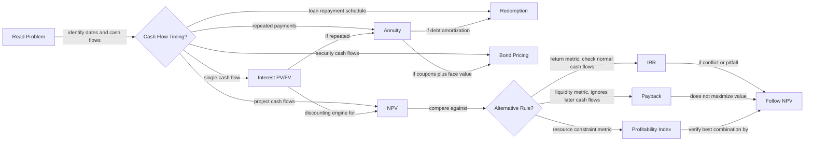

# Finance And Investment Management Course Knowledge Graph

This file aggregates the Finance and Investment Management concepts learned so far. It is lecture-scoped only.

Last updated: 2026-05-16

## Course-Level Mermaid Graph

```mermaid
graph TD
    FIN[Finance And Investment Management] -->|contains| CORP[Corporate Finance Lecture]
    FIN -->|contains| MATH[Mathematical Basics Exercises]

    CORP -->|starts with| FSA[Financial Analysis]
    FSA -->|uses report| BS[Balance Sheet]
    FSA -->|uses report| IS[Income Statement]
    FSA -->|uses report| CF[Cash Flow Statement]
    FSA -->|turns reports into| RATIOS[Ratio Analysis]
    RATIOS -->|measures short-term solvency| LIQ[Liquidity]
    RATIOS -->|measures debt reliance| LEV[Leverage]
    RATIOS -->|measures margin quality| PROF[Profitability]
    RATIOS -->|supports market comparison| VAL[Valuation]
    RATIOS -->|explains ROE through| DUPONT[DuPont ROE Decomposition]

    FSA -->|extends into| FUND[Fundamental Analysis Excursus]
    FUND -->|uses valuation signal| MB[Market-to-Book]
    FUND -->|uses quality signal| FSCORE[Piotroski F-Score]
    FUND -->|detects suspicious patterns| REDFLAG[Wirecard Red Flags]
    FSCORE -->|complements| MB

    CORP -->|continues with| IA[Investment Analysis]
    IA -->|master decision rule| NPV[Net Present Value]
    IA -->|alternative return metric| IRR[Internal Rate Of Return]
    IA -->|liquidity shortcut| PAYBACK[Payback Rule]
    IA -->|resource constraint tool| PI[Profitability Index]
    IRR -->|can suffer from| IRRPIT[IRR Pitfalls]
    IRRPIT -->|resolved by following| NPV
    PAYBACK -->|ignores| TVM[Time Value Of Money]

    MATH -->|is built on| TVM
    TVM -->|operationalized by| INT[Interest Calculation]
    INT -->|no interest-on-interest| SIMPLE[Simple Interest]
    INT -->|interest-on-interest| COMP[Compound Interest]
    INT -->|converts nominal to actual| EFF[Effective Annual Rate]
    INT -->|limit of compounding frequency| CONT[Continuous Compounding]

    TVM -->|values repeated cash flows| ANN[Annuities]
    ANN -->|payments at period end| IMM[Annuity-Immediate]
    ANN -->|payments at period beginning| DUE[Annuity-Due]
    ANN -->|handles changing payments| GROW[Growing Annuities]
    DUE -->|worth one extra period vs| IMM

    ANN -->|provides formulas for| RED[Redemptions]
    RED -->|constant principal repayment| INST[Installment Repayment]
    RED -->|constant total payment| AREP[Annuity Repayment]
    RED -->|may include| GRACE[Payment-Free Periods]

    TVM -->|prices promised cash flows of| BONDS[Bonds]
    BONDS -->|only face value at maturity| ZB[Zero-Coupon Bond]
    BONDS -->|coupons plus face value| CBOND[Coupon Bond]
    BONDS -->|risk measured by| DUR[Duration]
    DUR -->|approximates| RISK[Interest-Rate Sensitivity]

    TVM -->|discounts project cash flows for| NPV
    INT -->|enables| ANN
    INT -->|enables| BONDS
    ANN -->|coupon stream is a type of| BONDS
    BONDS -->|uses same DCF logic as| NPV
```

## Exam-Flow Mermaid Graph

## Subject Graph Index

| Subject / Deck | Wiki Note | Main Visual Logic | Last Updated |
|---|---|---|---|
| Course logistics | `finance-and-investment-management/wiki/_course-logistics.md` | Excluded from conceptual graph | 2026-05-16 |
| Financial Analysis | `finance-and-investment-management/wiki/session-01-02-financial-analysis/session-01-02-financial-analysis.md` | Statements to ratios to interpretation | 2026-05-16 |
| Fundamental Analysis Excursus | `finance-and-investment-management/wiki/session-01-02-excursus-fundamental-analysis-german-stock-market/session-01-02-excursus-fundamental-analysis-german-stock-market.md` | M/B and F-Score as investment signals | 2026-05-16 |
| Investment Analysis | `finance-and-investment-management/wiki/session-03-04-investment-analysis/session-03-04-investment-analysis.md` | NPV as master rule; IRR/payback/PI as limited alternatives | 2026-05-16 |
| Interest Calculation | `finance-and-investment-management/wiki/exercise-01-02-interest-calculation/exercise-01-02-interest-calculation.md` | Time value of money and compounding | 2026-05-16 |
| Annuities | `finance-and-investment-management/wiki/exercise-03-04-annuities/exercise-03-04-annuities.md` | Repeated payments by timing and growth pattern | 2026-05-16 |
| Redemptions | `finance-and-investment-management/wiki/exercise-05-redemptions/exercise-05-redemptions.md` | Loan payment split into interest and principal | 2026-05-16 |
| Bonds I | `finance-and-investment-management/wiki/exercise-06-bonds-i/exercise-06-bonds-i.md` | Bond price as discounted promised cash flows | 2026-05-16 |

## Nodes

| Node | Meaning | Source Note |
|---|---|---|
| Financial statements | Accounting reports used for analysis | `session-01-02-financial-analysis/session-01-02-financial-analysis.md` |
| Balance sheet | Point-in-time assets, liabilities, equity | `session-01-02-financial-analysis/session-01-02-financial-analysis.md` |
| Ratio analysis | Standardized firm comparison | `session-01-02-financial-analysis/session-01-02-financial-analysis.md` |
| DuPont identity | ROE decomposed into margin, turnover, leverage | `session-01-02-financial-analysis/session-01-02-financial-analysis.md` |
| M/B ratio | Market value relative to book equity | `session-01-02-excursus-fundamental-analysis-german-stock-market/session-01-02-excursus-fundamental-analysis-german-stock-market.md` |
| Piotroski F-Score | Financial strength score | `session-01-02-excursus-fundamental-analysis-german-stock-market/session-01-02-excursus-fundamental-analysis-german-stock-market.md` |
| NPV | Present value of all project cash flows | `session-03-04-investment-analysis/session-03-04-investment-analysis.md` |
| IRR | Discount rate that makes NPV zero | `session-03-04-investment-analysis/session-03-04-investment-analysis.md` |
| Time value of money | Money depends on timing | `exercise-01-02-interest-calculation/exercise-01-02-interest-calculation.md` |
| Effective annual rate | Actual annual rate after compounding | `exercise-01-02-interest-calculation/exercise-01-02-interest-calculation.md` |
| Annuity | Repeated cash-flow stream | `exercise-03-04-annuities/exercise-03-04-annuities.md` |
| Redemption | Loan repayment calculation | `exercise-05-redemptions/exercise-05-redemptions.md` |
| Bond | Debt security with promised payments | `exercise-06-bonds-i/exercise-06-bonds-i.md` |
| Duration | Interest-rate sensitivity measure | `exercise-06-bonds-i/exercise-06-bonds-i.md` |

## Edges

| From | Relationship | To | Source Note |
|---|---|---|---|
| Financial statements | provide inputs for | ratio analysis | `session-01-02-financial-analysis/session-01-02-financial-analysis.md` |
| DuPont identity | decomposes | ROE | `session-01-02-financial-analysis/session-01-02-financial-analysis.md` |
| M/B ratio | classifies | value vs growth stocks | `session-01-02-excursus-fundamental-analysis-german-stock-market/session-01-02-excursus-fundamental-analysis-german-stock-market.md` |
| Piotroski F-Score | complements | M/B ratio | `session-01-02-excursus-fundamental-analysis-german-stock-market/session-01-02-excursus-fundamental-analysis-german-stock-market.md` |
| NPV | dominates when conflicting with | IRR | `session-03-04-investment-analysis/session-03-04-investment-analysis.md` |
| Payback rule | ignores | time value of money | `session-03-04-investment-analysis/session-03-04-investment-analysis.md` |
| Time value of money | supports | NPV | `exercise-01-02-interest-calculation/exercise-01-02-interest-calculation.md` |
| Interest calculation | supports | annuities | `exercise-01-02-interest-calculation/exercise-01-02-interest-calculation.md` |
| Annuity formulas | support | redemption calculations | `exercise-03-04-annuities/exercise-03-04-annuities.md` |
| Bond pricing | uses | discounted cash flow | `exercise-06-bonds-i/exercise-06-bonds-i.md` |
| Higher discount rate | lowers | bond price | `exercise-06-bonds-i/exercise-06-bonds-i.md` |
| Duration | approximates | bond price sensitivity | `exercise-06-bonds-i/exercise-06-bonds-i.md` |
