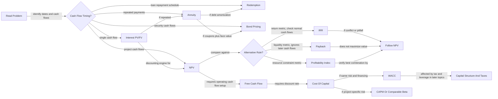

# Finance And Investment Management Course Knowledge Graph

This file aggregates the Finance and Investment Management concepts learned so far. It is lecture-scoped only.

Last updated: 2026-06-06

## Course-Level Mermaid Graph

```mermaid
graph TD
    FIN[Finance And Investment Management] -->|contains| CORP[Corporate Finance Lecture]
    FIN -->|contains| MATH[Mathematical Basics Exercises]

    CORP -->|starts with| FSA[Financial Analysis]
    FSA -->|uses report| BS[Balance Sheet]
    FSA -->|uses report| IS[Income Statement]
    FSA -->|uses report| CF[Cash Flow Statement]
    FSA -->|turns reports into| RATIOS[Ratio Analysis]
    FSA -->|starts from| DQ[Decision Question]
    DQ -->|profit and margins| IS
    DQ -->|position and liquidity| BS
    DQ -->|cash quality| CF
    RATIOS -->|measures short-term solvency| LIQ[Liquidity]
    RATIOS -->|measures debt reliance| LEV[Leverage]
    RATIOS -->|measures margin quality| PROF[Profitability]
    RATIOS -->|supports market comparison| VAL[Valuation]
    RATIOS -->|explains ROE through| DUPONT[DuPont ROE Decomposition]
    RATIOS -->|measures operating capital productivity| ROIC[ROIC]
    RATIOS -->|measures shareholder return| ROE[ROE]
    DUPONT -->|decomposes| ROE

    FSA -->|extends into| FUND[Fundamental Analysis Excursus]
    FUND -->|uses valuation signal| MB[Market-to-Book]
    FUND -->|uses valuation signal| PE[P/E Ratio]
    FUND -->|uses quality signal| FSCORE[Piotroski F-Score]
    FUND -->|detects suspicious patterns| REDFLAG[Wirecard Red Flags]
    FSCORE -->|filters cheapness from| MB
    FSCORE -->|filters cheapness from| PE
    FSCORE -->|helps identify| VTRAP[Value Trap Risk]

    CORP -->|continues with| IA[Investment Analysis]
    IA -->|master decision rule| NPV[Net Present Value]
    IA -->|alternative return metric| IRR[Internal Rate Of Return]
    IA -->|liquidity shortcut| PAYBACK[Payback Rule]
    IA -->|resource constraint tool| PI[Profitability Index]
    IRR -->|can suffer from| IRRPIT[IRR Pitfalls]
    IRRPIT -->|resolved by following| NPV
    PAYBACK -->|ignores| TVM[Time Value Of Money]

    IA -->|requires cash-flow construction from| CBUD[Capital Budgeting]
    CBUD -->|builds| FCF[Free Cash Flow]
    FCF -->|starts from| EBIT[EBIT]
    FCF -->|adds back| DEP[Depreciation]
    DEP -->|creates| DTS[Depreciation Tax Shield]
    FCF -->|subtracts| CAPEX[CapEx]
    FCF -->|subtracts| DNWC[Delta Net Working Capital]
    CBUD -->|filters by| INC[Incremental Cash Flow]
    INC -->|includes| OPCOST[Opportunity Cost]
    INC -->|excludes| SUNK[Sunk Cost]
    INC -->|includes| CANN[Cannibalization]
    CBUD -->|stress-tests with| CRISK[Break-Even Sensitivity Scenario]
    FCF -->|discounted by| NPV

    CBUD -->|needs required return from| COC[Cost Of Capital]
    COC -->|equity estimate| CAPM[CAPM]
    CAPM -->|prices| BETA[Beta]
    COC -->|combines financing costs through| WACC[WACC]
    COC -->|uses| DCOST[Debt Cost Of Capital]
    COC -->|project risk proxy| ABETA[Asset Beta]
    ABETA -->|estimated via| COMPARS[Comparable Firms]
    WACC -->|discounts| FCF

    COC -->|leads to financing choice| CSTRUCT[Capital Structure]
    CSTRUCT -->|perfect-market benchmark| MM1[MM I Without Taxes]
    CSTRUCT -->|leverage raises equity cost| MM2[MM II Without Taxes]
    MM1 -->|explained by| HLEV[Homemade Leverage]
    MM2 -->|keeps perfect-market| WACC
    CSTRUCT -->|warns against| EPSF[EPS Fallacy]
    CSTRUCT -->|warns against| DILF[Dilution Fallacy]
    CSTRUCT -->|real-world imperfection| CSTAX[Capital Structure And Taxes]
    CSTAX -->|creates| ITSHIELD[Interest Tax Shield]
    ITSHIELD -->|raises| LEVVAL[Levered Firm Value]
    CSTAX -->|uses| ATWACC[After-Tax WACC]
    CSTAX -->|limited by| DISTRESS[Financial Distress Costs]
    ITSHIELD -->|balanced against| TRADEOFF[Static Trade-Off Theory]
    DISTRESS -->|balanced against| TRADEOFF

    MATH -->|is built on| TVM
    TVM -->|operationalized by| INT[Interest Calculation]
    INT -->|starts with| DIR[PV Or FV Direction]
    INT -->|no interest-on-interest| SIMPLE[Simple Interest]
    INT -->|interest-on-interest| COMP[Compound Interest]
    INT -->|converts nominal to actual| EFF[Effective Annual Rate]
    INT -->|matches rate with periods| PERIOD[Periodic Rate]
    INT -->|limit of compounding frequency| CONT[Continuous Compounding]

    TVM -->|values repeated cash flows| ANN[Annuities]
    ANN -->|payments at period end| IMM[Annuity-Immediate]
    ANN -->|payments at period beginning| DUE[Annuity-Due]
    ANN -->|handles changing payments| GROW[Growing Annuities]
    DUE -->|worth one extra period vs| IMM

    ANN -->|provides formulas for| RED[Redemptions]
    RED -->|constant principal repayment| INST[Installment Repayment]
    RED -->|constant total payment| AREP[Annuity Repayment]
    RED -->|may include| GRACE[Payment-Free Periods]

    TVM -->|prices promised cash flows of| BONDS[Bonds]
    BONDS -->|only face value at maturity| ZB[Zero-Coupon Bond]
    BONDS -->|coupons plus face value| CBOND[Coupon Bond]
    CBOND -->|may require| ACCRUED[Accrued Interest]
    CBOND -->|priced relative to| YTM[Yield To Maturity]
    BONDS -->|risk measured by| DUR[Duration]
    DUR -->|approximates| RISK[Interest-Rate Sensitivity]

    TVM -->|discounts project cash flows for| NPV
    INT -->|enables| ANN
    INT -->|enables| BONDS
    ANN -->|coupon stream is a type of| BONDS
    BONDS -->|uses same DCF logic as| NPV
```

## Exam-Flow Mermaid Graph

## Subject Graph Index

| Subject / Deck | Wiki Note | Main Visual Logic | Last Updated |
|---|---|---|---|
| Course logistics | `finance-and-investment-management/wiki/_course-logistics.md` | Excluded from conceptual graph | 2026-05-16 |
| Financial Analysis | `finance-and-investment-management/wiki/session-01-02-financial-analysis/session-01-02-financial-analysis.md` | Decision questions to statements, ratios, ROIC/ROE, and valuation interpretation | 2026-05-25 |
| Fundamental Analysis Excursus | `finance-and-investment-management/wiki/session-01-02-excursus-fundamental-analysis-german-stock-market/session-01-02-excursus-fundamental-analysis-german-stock-market.md` | M/B, P/E, and F-Score as value-opportunity vs value-trap signals | 2026-05-25 |
| Investment Analysis | `finance-and-investment-management/wiki/session-03-04-investment-analysis/session-03-04-investment-analysis.md` | NPV as master rule; IRR/payback/PI as limited alternatives | 2026-05-16 |
| Capital Budgeting | `finance-and-investment-management/wiki/session-05-06-capital-budgeting/session-05-06-capital-budgeting.md` | FCF construction, incremental-cash-flow filter, and risk analysis behind NPV | 2026-06-06 |
| Cost Of Capital | `finance-and-investment-management/wiki/session-07-08-cost-of-capital/session-07-08-cost-of-capital.md` | CAPM, beta, project risk matching, debt cost, and WACC | 2026-06-06 |
| Capital Structure | `finance-and-investment-management/wiki/session-09-10-capital-structure/session-09-10-capital-structure.md` | MM I/II without taxes, leverage, WACC offset, EPS/dilution fallacies | 2026-06-06 |
| Capital Structure And Taxes | `finance-and-investment-management/wiki/session-11-12-capital-structure-and-taxes/session-11-12-capital-structure-and-taxes.md` | Interest tax shield, after-tax WACC, distress costs, static trade-off theory | 2026-06-06 |
| Interest Calculation | `finance-and-investment-management/wiki/exercise-01-02-interest-calculation/exercise-01-02-interest-calculation.md` | Time value of money and compounding | 2026-05-16 |
| Annuities | `finance-and-investment-management/wiki/exercise-03-04-annuities/exercise-03-04-annuities.md` | Repeated payments by timing and growth pattern | 2026-05-16 |
| Redemptions | `finance-and-investment-management/wiki/exercise-05-redemptions/exercise-05-redemptions.md` | Loan payment split into interest and principal | 2026-05-16 |
| Bonds I | `finance-and-investment-management/wiki/exercise-06-bonds-i/exercise-06-bonds-i.md` | Bond price as discounted promised cash flows, coupon bonds, accrued interest, and YTM | 2026-06-06 |

## Nodes

| Node | Meaning | Source Note |
|---|---|---|
| Financial statements | Accounting reports used for analysis | `session-01-02-financial-analysis/session-01-02-financial-analysis.md` |
| Balance sheet | Point-in-time assets, liabilities, equity | `session-01-02-financial-analysis/session-01-02-financial-analysis.md` |
| Ratio analysis | Standardized firm comparison | `session-01-02-financial-analysis/session-01-02-financial-analysis.md` |
| DuPont identity | ROE decomposed into margin, turnover, leverage | `session-01-02-financial-analysis/session-01-02-financial-analysis.md` |
| ROIC | Operating return on invested capital | `session-01-02-financial-analysis/session-01-02-financial-analysis.md` |
| ROE | Shareholder return on book equity | `session-01-02-financial-analysis/session-01-02-financial-analysis.md` |
| P/E ratio | Market value relative to current net income | `session-01-02-financial-analysis/session-01-02-financial-analysis.md` |
| M/B ratio | Market value relative to book equity | `session-01-02-excursus-fundamental-analysis-german-stock-market/session-01-02-excursus-fundamental-analysis-german-stock-market.md` |
| Piotroski F-Score | Financial strength score | `session-01-02-excursus-fundamental-analysis-german-stock-market/session-01-02-excursus-fundamental-analysis-german-stock-market.md` |
| Value trap | Cheap-looking stock with weak or deteriorating fundamentals | `session-01-02-excursus-fundamental-analysis-german-stock-market/session-01-02-excursus-fundamental-analysis-german-stock-market.md` |
| NPV | Present value of all project cash flows | `session-03-04-investment-analysis/session-03-04-investment-analysis.md` |
| IRR | Discount rate that makes NPV zero | `session-03-04-investment-analysis/session-03-04-investment-analysis.md` |
| Capital budgeting | Project investment evaluation process that builds FCF for NPV | `session-05-06-capital-budgeting/session-05-06-capital-budgeting.md` |
| Free cash flow | Incremental cash flow available to capital providers | `session-05-06-capital-budgeting/session-05-06-capital-budgeting.md` |
| Incremental cash flow | Cash flow that changes because the project is accepted | `session-05-06-capital-budgeting/session-05-06-capital-budgeting.md` |
| Depreciation tax shield | Tax saving from non-cash depreciation | `session-05-06-capital-budgeting/session-05-06-capital-budgeting.md` |
| Delta NWC | Change in operating working capital used in FCF | `session-05-06-capital-budgeting/session-05-06-capital-budgeting.md` |
| Cost of capital | Required return for same-risk investment | `session-07-08-cost-of-capital/session-07-08-cost-of-capital.md` |
| CAPM | Required-return model based on beta and market risk premium | `session-07-08-cost-of-capital/session-07-08-cost-of-capital.md` |
| Beta | Market-risk sensitivity priced in CAPM | `session-07-08-cost-of-capital/session-07-08-cost-of-capital.md` |
| WACC | Weighted average after-tax financing cost | `session-07-08-cost-of-capital/session-07-08-cost-of-capital.md` |
| Capital structure | Mix of debt, equity, and other securities | `session-09-10-capital-structure/session-09-10-capital-structure.md` |
| MM Proposition I | Firm value independent of capital structure in perfect markets without taxes | `session-09-10-capital-structure/session-09-10-capital-structure.md` |
| MM Proposition II | Levered equity cost rises with debt-to-equity ratio | `session-09-10-capital-structure/session-09-10-capital-structure.md` |
| Interest tax shield | Tax saving from tax-deductible interest | `session-11-12-capital-structure-and-taxes/session-11-12-capital-structure-and-taxes.md` |
| Static trade-off theory | Optimal debt balances tax shields and expected distress costs | `session-11-12-capital-structure-and-taxes/session-11-12-capital-structure-and-taxes.md` |
| Time value of money | Money depends on timing | `exercise-01-02-interest-calculation/exercise-01-02-interest-calculation.md` |
| PV/FV direction | Whether a cash flow must be discounted backward or compounded forward | `exercise-01-02-interest-calculation/exercise-01-02-interest-calculation.md` |
| Effective annual rate | Actual annual rate after compounding | `exercise-01-02-interest-calculation/exercise-01-02-interest-calculation.md` |
| Periodic rate | Rate per compounding period, matched to number of periods | `exercise-01-02-interest-calculation/exercise-01-02-interest-calculation.md` |
| Annuity | Repeated cash-flow stream | `exercise-03-04-annuities/exercise-03-04-annuities.md` |
| Redemption | Loan repayment calculation | `exercise-05-redemptions/exercise-05-redemptions.md` |
| Bond | Debt security with promised payments | `exercise-06-bonds-i/exercise-06-bonds-i.md` |
| Duration | Interest-rate sensitivity measure | `exercise-06-bonds-i/exercise-06-bonds-i.md` |
| Accrued interest | Pro-rata coupon compensation between coupon dates | `exercise-06-bonds-i/exercise-06-bonds-i.md` |
| Yield to maturity | Discount rate equating bond price to promised cash flows | `exercise-06-bonds-i/exercise-06-bonds-i.md` |

## Edges

| From | Relationship | To | Source Note |
|---|---|---|---|
| Financial statements | provide inputs for | ratio analysis | `session-01-02-financial-analysis/session-01-02-financial-analysis.md` |
| Decision question | selects | financial statement focus | `session-01-02-financial-analysis/session-01-02-financial-analysis.md` |
| DuPont identity | decomposes | ROE | `session-01-02-financial-analysis/session-01-02-financial-analysis.md` |
| ROIC | evaluates | operating capital productivity | `session-01-02-financial-analysis/session-01-02-financial-analysis.md` |
| ROE | evaluates | shareholder return | `session-01-02-financial-analysis/session-01-02-financial-analysis.md` |
| P/E ratio | values | earnings power | `session-01-02-financial-analysis/session-01-02-financial-analysis.md` |
| M/B ratio | classifies | value vs growth stocks | `session-01-02-excursus-fundamental-analysis-german-stock-market/session-01-02-excursus-fundamental-analysis-german-stock-market.md` |
| Piotroski F-Score | filters | valuation cheapness | `session-01-02-excursus-fundamental-analysis-german-stock-market/session-01-02-excursus-fundamental-analysis-german-stock-market.md` |
| Low M/B plus low F-Score | indicates | value trap risk | `session-01-02-excursus-fundamental-analysis-german-stock-market/session-01-02-excursus-fundamental-analysis-german-stock-market.md` |
| NPV | dominates when conflicting with | IRR | `session-03-04-investment-analysis/session-03-04-investment-analysis.md` |
| Payback rule | ignores | time value of money | `session-03-04-investment-analysis/session-03-04-investment-analysis.md` |
| Capital budgeting | constructs | free cash flow | `session-05-06-capital-budgeting/session-05-06-capital-budgeting.md` |
| Incremental cash-flow filter | excludes | sunk costs and financing costs | `session-05-06-capital-budgeting/session-05-06-capital-budgeting.md` |
| Depreciation | creates | depreciation tax shield | `session-05-06-capital-budgeting/session-05-06-capital-budgeting.md` |
| Delta NWC | adjusts | free cash flow | `session-05-06-capital-budgeting/session-05-06-capital-budgeting.md` |
| Cost of capital | discounts | free cash flow | `session-07-08-cost-of-capital/session-07-08-cost-of-capital.md` |
| CAPM | estimates | equity cost of capital | `session-07-08-cost-of-capital/session-07-08-cost-of-capital.md` |
| Beta | measures | systematic market risk | `session-07-08-cost-of-capital/session-07-08-cost-of-capital.md` |
| WACC | combines | equity and after-tax debt costs | `session-07-08-cost-of-capital/session-07-08-cost-of-capital.md` |
| MM Proposition I | makes independent | firm value and capital structure | `session-09-10-capital-structure/session-09-10-capital-structure.md` |
| MM Proposition II | links | leverage and equity cost | `session-09-10-capital-structure/session-09-10-capital-structure.md` |
| Homemade leverage | supports | MM Proposition I | `session-09-10-capital-structure/session-09-10-capital-structure.md` |
| Interest tax shield | increases | levered firm value | `session-11-12-capital-structure-and-taxes/session-11-12-capital-structure-and-taxes.md` |
| After-tax WACC | decreases with | tax-deductible debt | `session-11-12-capital-structure-and-taxes/session-11-12-capital-structure-and-taxes.md` |
| Financial distress costs | offset | tax-shield benefits | `session-11-12-capital-structure-and-taxes/session-11-12-capital-structure-and-taxes.md` |
| Time value of money | supports | NPV | `exercise-01-02-interest-calculation/exercise-01-02-interest-calculation.md` |
| Interest calculation | starts by choosing | PV/FV direction | `exercise-01-02-interest-calculation/exercise-01-02-interest-calculation.md` |
| Nominal rate | converts into | periodic or effective rate | `exercise-01-02-interest-calculation/exercise-01-02-interest-calculation.md` |
| Periodic rate | must match | number of periods | `exercise-01-02-interest-calculation/exercise-01-02-interest-calculation.md` |
| Interest calculation | supports | annuities | `exercise-01-02-interest-calculation/exercise-01-02-interest-calculation.md` |
| Annuity formulas | support | redemption calculations | `exercise-03-04-annuities/exercise-03-04-annuities.md` |
| Bond pricing | uses | discounted cash flow | `exercise-06-bonds-i/exercise-06-bonds-i.md` |
| Higher discount rate | lowers | bond price | `exercise-06-bonds-i/exercise-06-bonds-i.md` |
| Accrued interest | is added to | clean bond price | `exercise-06-bonds-i/exercise-06-bonds-i.md` |
| Yield to maturity | solves | bond price equation | `exercise-06-bonds-i/exercise-06-bonds-i.md` |
| Duration | approximates | bond price sensitivity | `exercise-06-bonds-i/exercise-06-bonds-i.md` |
