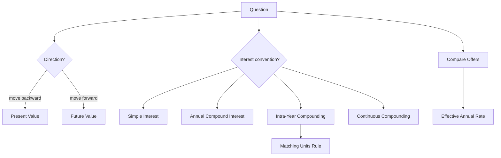

# Ubiquitous Language: Exercise 01-02: Interest Calculation

Source note: `exercise-01-02-interest-calculation.md`
Course: Finance and Investment Management
Definition sources: local topic note and raw material for term discovery; enriched with standard domain knowledge where the local note names a term without fully defining it.

This file is a standalone terminology and formula companion. It follows Matt Pocock style: canonical terms, aliases to avoid, relationships, example dialogue, and flagged ambiguities.

## Finance Language

| Term | Definition | Aliases to avoid |
|---|---|---|
| **Cash Flow** | A dated inflow or outflow of money. In interest exercises, the cash flow is moved to another date using the correct interest convention. | profit, accounting earnings |
| **Present Value** | The value today of a future cash flow. Use it when the question asks how much must be invested now or what a future amount is worth today. | current price always |
| **Future Value** | The amount a current cash flow grows to after earning interest. Use it when the question asks for a payoff or final amount. | forecast value |
| **Discount Rate** | The rate used to move a future cash flow backward to present value. In exercise problems, it must match the compounding period. | interest rate always |
| **Growth Factor** | The multiplier `1 + r` for one compound-interest period. It is not the same as the interest rate `r`. | interest rate |
| **Compounding** | Interest earning interest over multiple periods. This creates exponential growth under compound interest. | simple interest |

## Exam Setup Language

| Term | Definition | Aliases to avoid |
|---|---|---|
| **Timeline** | A dated layout of cash flows and rates that prevents mixing values from different points in time. | list of numbers |
| **Nominal Rate** | A quoted annual rate before adjusting for compounding frequency, such as 12% nominal compounded monthly. | effective rate |
| **Periodic Rate** | The rate per compounding interval, usually `nominal annual rate / m`. If compounding is monthly, this is the monthly rate. | annual rate |
| **Effective Rate** | The actual rate earned or paid over a period after compounding is considered. For annual comparison, use the effective annual rate. | nominal rate |
| **Matching Units Rule** | Rate and number of periods must use the same time unit: monthly rate with months, annual rate with years. | plug in years always |

## Interest Language

| Term | Definition | Aliases to avoid |
|---|---|---|
| **Simple Interest** | Interest calculated only on the original principal: `C_n = C_0 x (1 + r x n)`. Growth is linear. | compound interest |
| **Annual Compound Interest** | Interest calculated on principal plus accumulated interest once per year: `C_n = C_0 x (1 + r)^n`. Growth is exponential. | simple interest |
| **Intra-Year Compounding** | Compounding more frequently than once per year: `C_n = C_0 x (1 + r/m)^(m x n)`. | annual rate |
| **Continuous Compounding** | Limit case where compounding occurs continuously: `C_n = C_0 x e^(r x n)`. | very frequent simple interest |
| **Present Value Factor** | The multiplier used to discount one future cash flow to today, such as `1/(1+r)^n` or `1/e^(r x n)`. | interest rate |
| **Effective Annual Rate** | The comparable annual rate after considering compounding frequency: `(1 + r/m)^m - 1`, or `e^r - 1` for continuous compounding. | nominal annual rate |

## Relationships

- **Present Value** moves money backward; **Future Value** moves money forward.
- **Growth Factor** equals `1 + r`; it should be distinguished from the interest rate `r`.
- **Simple Interest** grows linearly; **Annual Compound Interest**, **Intra-Year Compounding**, and **Continuous Compounding** grow exponentially.
- **Nominal Rate** must be converted into **Periodic Rate** or **Effective Annual Rate** before fair comparison.
- **Matching Units Rule** controls substitution: a monthly rate needs monthly periods.
- A strong answer defines the canonical term, applies the rule or formula, and states the managerial, legal, or analytical implication.

## Visual Memory Aid



## Example Dialogue

> **Student:** "I know the interest rate. Which formula do I use?"
>
> **Professor:** "First decide the direction. If you need the final amount, use **Future Value**. If you need today's required investment, use **Present Value**. Then choose **Simple Interest**, **Annual Compound Interest**, **Intra-Year Compounding**, or **Continuous Compounding** from the wording."
>
> **Student:** "What if one bank compounds monthly and another annually?"
>
> **Professor:** "Convert both to **Effective Annual Rate**. You can only compare rates after the compounding convention is standardized."

## Flagged Ambiguities

- Do not use broad labels like "concept", "factor", or "thing" when a canonical term above fits.
- Do not use aliases listed in the tables unless you are explicitly explaining why they are misleading.
- If a formula symbol appears, define its unit, timing, and decision role before calculating.
- If a legal, theoretical, or framework term has a common everyday meaning, use the technical course meaning in exam answers.
- Do not use `r` as the multiplier. The one-period compound multiplier is **Growth Factor** `1 + r`.
- Do not use annual `n` with monthly `r`; apply the **Matching Units Rule**.
- Do not use **Continuous Compounding** unless the task explicitly says continuously compounded.

## Exam Trap Corrections

| Trap | Correction |
|---|---|
| Naming a term without applying it. | Define it briefly, then apply it to the facts, formula, or decision. |
| Treating examples as definitions. | Use examples only after the canonical definition is clear. |
| Mixing related terms. | State the boundary between the terms before comparing them. |
| Copying a formula without variable meaning. | Define each variable and unit before substitution. |
| Using compound interest for simple-interest wording. | If interest is simple, use `1 + r x n`, not `(1+r)^n`. |
| Comparing nominal rates directly. | Convert to **Effective Annual Rate** first. |
| Forgetting `m x n`. | For intra-year compounding, divide rate by `m` and multiply years by `m`. |
| Confusing annual and continuous compounding. | Annual uses `(1+r)^n`; continuous uses `e^(r x n)`. |

## Cheat-Sheet Language

```text
Draw the timeline, identify cash flows, choose the rate convention, compute at one date, then interpret the decision rule.
Forward = future value.
Backward = present value.
Simple = no interest on interest.
Compound = interest on interest.
Intra-year = periodic rate plus `m x n`.
Continuous = use `e^(r x n)`.
Comparing offers = convert to effective annual rate.
```
