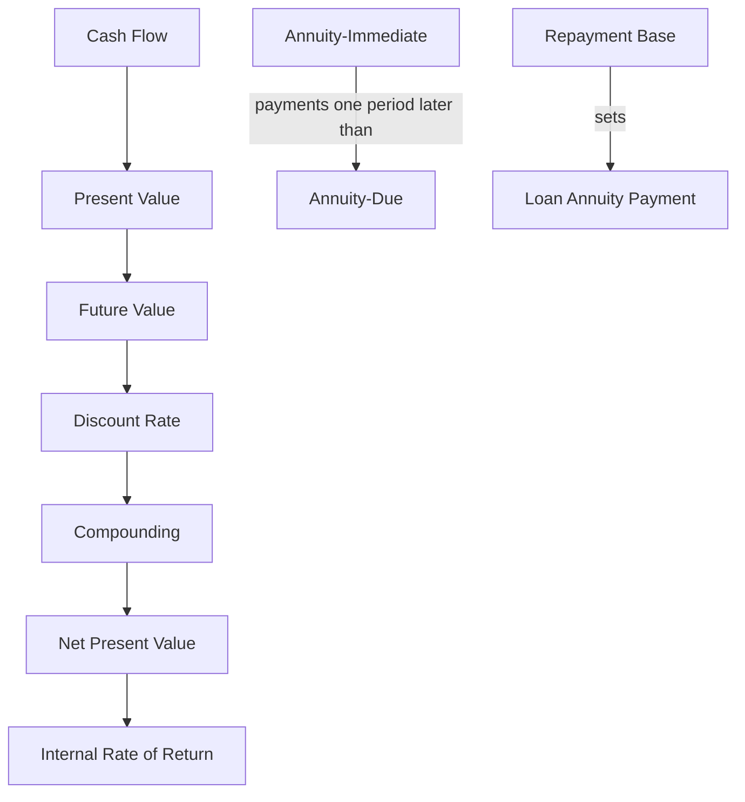

# Ubiquitous Language: Exercise 03-04: Annuities

Source note: `exercise-03-04-annuities.md`
Course: Finance and Investment Management
Definition sources: local topic note and raw material for term discovery; enriched with standard domain knowledge where the local note names a term without fully defining it.

This file is a standalone terminology and formula companion. It follows Matt Pocock style: canonical terms, aliases to avoid, relationships, example dialogue, and flagged ambiguities.

## Finance Language

| Term | Definition | Aliases to avoid |
|---|---|---|
| **Cash Flow** | A dated inflow or outflow of money used for valuation and investment decisions. | profit, accounting earnings |
| **Present Value** | The value today of a future cash flow discounted at an appropriate rate. | current price always |
| **Future Value** | The amount a current cash flow grows to after earning interest over time. | forecast value |
| **Discount Rate** | The rate used to convert future cash flows into present value, reflecting time value and risk. | interest rate always |
| **Compounding** | Interest earning interest over multiple periods. | simple interest |
| **Net Present Value** | The sum of discounted cash inflows and outflows; positive NPV means value creation under the chosen discount rate. | profit, payoff |
| **Internal Rate of Return** | The discount rate that sets NPV equal to zero for a cash-flow stream. | project return always |

## Exam Setup Language

| Term | Definition | Aliases to avoid |
|---|---|---|
| **Timeline** | A dated layout of cash flows and rates that prevents mixing values from different points in time. | list of numbers |
| **Nominal Rate** | A quoted annual rate before adjusting for compounding frequency. | effective rate |
| **Effective Rate** | The actual rate earned or paid over a period after compounding is considered. | nominal rate |

## Annuity Language

| Term | Definition | Aliases to avoid |
|---|---|---|
| **Annuity** | A stream of equal or systematically varying payments over time. | single cash flow |
| **Annuity-Immediate** | An annuity with payments at the end of each period. | annuity-due |
| **Annuity-Due** | An annuity with payments at the beginning of each period. | annuity-immediate |
| **Perpetuity** | An annuity with no final payment date. | long annuity |
| **Growing Annuity** | A payment stream that changes at a constant growth rate for a finite horizon. | arithmetic annuity |
| **Arithmetic Annuity** | A payment stream that changes by a fixed amount each period. | growing annuity |

## Redemption Bridge Language

| Term | Definition | Aliases to avoid |
|---|---|---|
| **Loan Annuity Payment** | Equal periodic payment used to repay debt in a redemption schedule. | project FCF |
| **Repayment Base** | Debt balance used as the input for the loan annuity formula. | original loan always |
| **Capitalized Interest** | Unpaid interest added to principal, increasing the repayment base. | interest-free grace |

Key bridge:

```text
Grace period changes the repayment base.
Annuity-immediate/due changes payment timing.
```

For the same payment amount:

```text
PV_due = PV_immediate x (1 + r)
```

For the same loan balance:

```text
A_due = A_immediate / (1 + r)
```

In Capital Budgeting, loan annuity payments are financing cash flows. Under WACC valuation, they are tested separately in Redemptions rather than inserted into project FCF.

## Worked Calculation Language

Every annuity calculation should show:

```text
Payment pattern -> timing -> formula -> inputs -> substitution -> arithmetic -> PV/FV result -> decision meaning
```

Mini anchor:

```text
EUR 2,500 deposited at each year-end for 30 years, r = 3%.
FV_immediate = 2,500 x (1.03^30 - 1) / 0.03
1.03^30 = 2.42726
FV_immediate = EUR 118,938.54

FV_due = 118,938.54 x 1.03
FV_due = EUR 122,506.70
```

Interpretation: the due version is larger because every deposit earns one extra year of interest. Analogy: the same workers arrive one shift earlier, so each has more time to produce output. Trap: treating annuity-due as one extra payment instead of the same number of earlier payments.

## Relationships

- **Cash Flow** should be distinguished from **Present Value** when writing exam answers.
- **Present Value** should be distinguished from **Future Value** when writing exam answers.
- **Future Value** should be distinguished from **Discount Rate** when writing exam answers.
- **Discount Rate** should be distinguished from **Compounding** when writing exam answers.
- **Compounding** should be distinguished from **Net Present Value** when writing exam answers.
- **Net Present Value** should be distinguished from **Internal Rate of Return** when writing exam answers.
- **Annuity-Due** has higher **Present Value** than **Annuity-Immediate** for the same payment amount because payments occur earlier.
- A larger **Repayment Base** causes a higher **Loan Annuity Payment** when rate, maturity, and timing stay unchanged.
- **Capitalized Interest** increases the **Repayment Base** before annuity repayment begins.
- A strong answer defines the canonical term, applies the rule or formula, and states the managerial, legal, or analytical implication.

## Visual Memory Aid



## Example Dialogue

> **Student:** "I see **Cash Flow** and **Present Value** in the note. Are they interchangeable?"
>
> **Professor:** "No. Use **Cash Flow** for its precise technical meaning, and use **Present Value** only when the facts match that definition."
>
> **Student:** "So in an exam answer I should name the exact term first?"
>
> **Professor:** "Yes. Name the canonical term, apply the decision rule or mechanism, then state the implication."

## Flagged Ambiguities

- Do not use broad labels like "concept", "factor", or "thing" when a canonical term above fits.
- Do not use aliases listed in the tables unless you are explicitly explaining why they are misleading.
- If a formula symbol appears, define its unit, timing, and decision role before calculating.
- If a legal, theoretical, or framework term has a common everyday meaning, use the technical course meaning in exam answers.

## Exam Trap Corrections

| Trap | Correction |
|---|---|
| Naming a term without applying it. | Define it briefly, then apply it to the facts, formula, or decision. |
| Treating examples as definitions. | Use examples only after the canonical definition is clear. |
| Mixing related terms. | State the boundary between the terms before comparing them. |
| Copying a formula without variable meaning. | Define each variable and unit before substitution. |
| Treating annuity-due as only a lower payment. | State that the first payment occurs earlier, so early cash pressure can increase. |
| Inserting loan annuity payments into WACC project NPV. | Keep them in the redemption schedule and compare separately against project FCF timing. |

## Cheat-Sheet Language

```text
Draw the timeline, identify cash flows, choose the rate convention, compute at one date, then interpret the decision rule.
Annuity-immediate pays at period end; annuity-due pays at period beginning.
Grace changes the repayment base; timing changes the annuity factor.
For every technical term: define it, identify when it applies, and state the common confusion to avoid.
```
