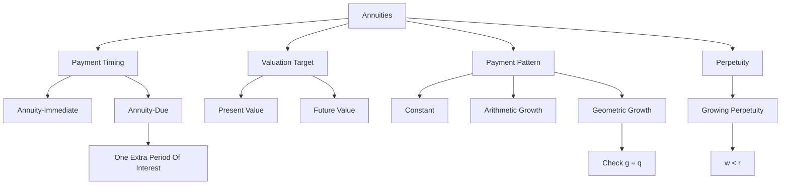

# Exercise 03-04: Annuities

Source files:

- `finance-and-investment-management/raw/Exercise_3.pdf`
- `finance-and-investment-management/raw/Exercise_3_Annuities_Solutions.pdf`
- `finance-and-investment-management/raw/Exercise_4.pdf`
- `finance-and-investment-management/raw/Exercise_4_Annuities_Solutions.pdf`
- `finance-and-investment-management/raw/Formulary.pdf`

Lecture folder: `finance-and-investment-management/`  
Date processed: 2026-05-16

## High-Yield 80/20 Summary

Annuities are repeated cash flows. The exam risk is timing: beginning vs end of period, present vs future value, constant vs growing payments, and whether payments grow arithmetically or geometrically.

Core logic:

1. Identify whether payments are equal, arithmetically growing, or geometrically growing.
2. Identify whether payments occur at the beginning (`annuity-due`) or end (`annuity-immediate`) of each period.
3. Decide whether the question asks for present value, future value, payment amount, or duration.
4. Use the formulary, but map variables carefully.

## Core Principles

### Time Value Of Money

Only compare values at the same point in time. Annuity formulas are shortcuts for discounting or compounding each payment separately.

### No Arbitrage

Two securities with the same future cash flows and the same risk should have the same price. This underlies annuity valuation: the value of a payment stream equals the sum of the discounted cash flows.

## Annuity-Immediate vs Annuity-Due

### Annuity-Immediate

Payments are made at the end of each period.

```text
Timeline: t1, t2, ..., tN
```

### Annuity-Due

Payments are made at the beginning of each period.

```text
Timeline: t0, t1, ..., tN-1
```

Relationship:

```text
C_immediate = C_due x q
q = 1 + r
```

Intuition: annuity-due payments occur one period earlier, so they are worth one extra period of interest.

## Constant Annuities

### Future Value

Annuity-immediate:

```text
FV = C x (q^N - 1) / (q - 1)
```

Annuity-due:

```text
FV_due = C_due x q x (q^N - 1) / (q - 1)
```

### Present Value

Annuity-immediate:

```text
PV = C x (q^N - 1) / (q^N x (q - 1))
```

Annuity-due:

```text
PV_due = C_due x q x (q^N - 1) / (q^N x (q - 1))
```

## Building Loan Example Pattern

A grandmother pays EUR 2,500 at the end of each year for 30 years at 3%.

```text
FV = 2500 x (1.03^30 - 1) / (1.03 - 1) = 118,938.54
```

If paid at the beginning of each year:

```text
FV_due = 2500 x 1.03 x (1.03^30 - 1) / (1.03 - 1) = 122,506.70
```

Interpretation: beginning-of-period payments are larger in future value because every payment earns one more period of interest.

## Perpetuities

A perpetuity is an annuity with no finite horizon.

```text
PV = C / r
PV_due = q x C_due / r
```

Growing perpetuity, with growth rate `w` and `g = 1 + w`:

```text
PV = C / (r - w), only if w < r
PV_due = q x C_due / (r - w)
```

Exam trap: if `w >= r`, the growing perpetuity formula is invalid.

## Varying Annuities

### Arithmetic Progression

Payment changes by a fixed amount `d` each period.

```text
C_k = C + (k - 1)d
```

Use when the payment increases by a fixed euro amount, e.g. EUR 1,000 more each year.

### Geometric Progression

Payment changes by a fixed growth factor `g`.

```text
C_k = C x g^(k-1)
g = 1 + growth rate
```

Use when the payment increases by a percentage, e.g. 5% per year.

Special case: many formulas split into `g = q` and `g != q`. Always check this first.

## Worked Exercise Patterns

### Pattern 1: Solve For Duration

A business is sold for EUR 300,000. The seller receives EUR 20,000 annually, growing 4% per year. Interest rate = 5%.

For annuity-immediate, the solution gives approximately:

```text
N = 16.98 years
```

For annuity-due:

```text
N = 16.11 years
```

Why is annuity-due duration shorter? Because payments start earlier, so the present value is consumed faster.

### Pattern 2: Compare Arithmetic vs Geometric Growth

A seller can choose:

- EUR 24,000 with fixed EUR 1,000 annual increase.
- EUR 24,000 with 6% annual growth.

At 5% and 10 years, the solution shows the geometric-growth option has a higher future value.

Decision logic: compare both alternatives at the same date using the same discount/interest rate.

## Exam Decision Tree

1. Are payments repeated?
   - If no, use single cash-flow PV/FV.
   - If yes, annuity logic applies.
2. Equal payments?
   - Use constant annuity.
3. Fixed euro increase?
   - Use arithmetic progression.
4. Fixed percentage increase?
   - Use geometric progression.
5. Payment at beginning?
   - Use annuity-due or multiply immediate value by `q` where appropriate.
6. Payment at end?
   - Use annuity-immediate.
7. Ask for PV or FV?
   - Choose discounting or compounding formula.

## Common Mistakes

- Using annuity-immediate when payments occur at the beginning.
- Forgetting the extra `q` factor for annuity-due.
- Confusing arithmetic growth `d` with geometric growth `g`.
- Forgetting to check `g = q` special case.
- Comparing alternatives at different dates.
- Treating a perpetuity as a long finite annuity without justification.

## Practice Questions

1. A person saves EUR 1,000 at the end of each year for 10 years at 4%. What formula applies?
   - Answer: constant annuity-immediate future value.
2. Same payment, but at the beginning of each year. How does the value change?
   - Answer: multiply the immediate future value by `q = 1.04`.
3. Payments grow from EUR 5,000 by EUR 500 per year. Arithmetic or geometric?
   - Answer: arithmetic progression.
4. Payments grow by 3% per year. Arithmetic or geometric?
   - Answer: geometric progression, `g = 1.03`.
5. Why must `w < r` for a growing perpetuity?
   - Answer: otherwise the discounted series does not converge.

## Mermaid Knowledge Map



## Subject Knowledge Graph

| Node | Meaning |
|---|---|
| Annuity | Stream of repeated payments |
| Annuity-immediate | Payments at end of period |
| Annuity-due | Payments at beginning of period |
| Present value | Value of payment stream today |
| Future value | Accumulated value at final date |
| Arithmetic growth | Fixed absolute increase per period |
| Geometric growth | Fixed percentage increase per period |
| Perpetuity | Infinite annuity |

| From | Relationship | To |
|---|---|---|
| Annuity-due | occurs earlier than | annuity-immediate |
| Earlier payment | increases | value |
| Constant annuity | assumes | equal payments |
| Arithmetic annuity | grows by | fixed amount |
| Geometric annuity | grows by | fixed factor |
| Growing perpetuity | requires | growth below discount rate |
| Annuity formulas | compress | repeated discounting/compounding |

## Links

- Previous exercise: `finance-and-investment-management/wiki/exercise-01-02-interest-calculation/exercise-01-02-interest-calculation.md`
- Next exercise: `finance-and-investment-management/wiki/exercise-05-redemptions/exercise-05-redemptions.md`
- Bridge to lecture Session 03-04 Investment Analysis: `finance-and-investment-management/wiki/session-03-04-investment-analysis/annuity-bridge-to-investment-analysis.md`
