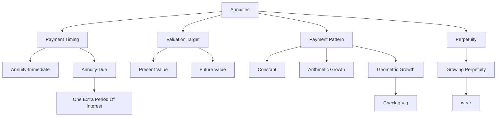

# Exercise 03-04: Annuities

Source files:

- `finance-and-investment-management/raw/Exercise_3.pdf`
- `finance-and-investment-management/raw/Exercise_3_Annuities_Solutions.pdf`
- `finance-and-investment-management/raw/Exercise_4.pdf`
- `finance-and-investment-management/raw/Exercise_4_Annuities_Solutions.pdf`
- `finance-and-investment-management/raw/Formulary.pdf`

Lecture folder: `finance-and-investment-management/`  
Date processed: 2026-05-16
Source worked solutions refreshed: 2026-07-31

## High-Yield 80/20 Summary

Annuities are repeated cash flows. The exam risk is timing: beginning vs end of period, present vs future value, constant vs growing payments, and whether payments grow arithmetically or geometrically.

Core logic:

1. Identify whether payments are equal, arithmetically growing, or geometrically growing.
2. Identify whether payments occur at the beginning (`annuity-due`) or end (`annuity-immediate`) of each period.
3. Decide whether the question asks for present value, future value, payment amount, or duration.
4. Use the formulary, but map variables carefully.

## Core Principles

### Time Value Of Money

Only compare values at the same point in time. Annuity formulas are shortcuts for discounting or compounding each payment separately.

### No Arbitrage

Two securities with the same future cash flows and the same risk should have the same price. This underlies annuity valuation: the value of a payment stream equals the sum of the discounted cash flows.

## Annuity-Immediate vs Annuity-Due

### Annuity-Immediate

Payments are made at the end of each period.

```text
Timeline: t1, t2, ..., tN
```

### Annuity-Due

Payments are made at the beginning of each period.

```text
Timeline: t0, t1, ..., tN-1
```

Relationship:

```text
C_immediate = C_due x q
q = 1 + r
```

Intuition: annuity-due payments occur one period earlier, so they are worth one extra period of interest.

## Constant Annuities

### Future Value

Annuity-immediate:

```text
FV = C x (q^N - 1) / (q - 1)
```

Annuity-due:

```text
FV_due = C_due x q x (q^N - 1) / (q - 1)
```

### Present Value

Annuity-immediate:

```text
PV = C x (q^N - 1) / (q^N x (q - 1))
```

Annuity-due:

```text
PV_due = C_due x q x (q^N - 1) / (q^N x (q - 1))
```

## Building Loan Example Pattern

A grandmother pays EUR 2,500 at the end of each year for 30 years at 3%.

Decision problem and method choice:

- The question asks how much the repeated savings stream grows to by the end.
- Payments happen at the end of each year, so use future value of an annuity-immediate.

Known inputs:

```text
C = EUR 2,500
r = 3% = 0.03
q = 1.03
N = 30 years
```

Formula, substitution, and arithmetic:

```text
FV = C x (q^N - 1)/(q - 1)
FV = 2,500 x (1.03^30 - 1)/(1.03 - 1)
1.03^30 = 2.42726
FV = 2,500 x (2.42726 - 1)/0.03
FV = EUR 118,938.54
```

If paid at the beginning of each year:

```text
FV_due = FV_immediate x q
FV_due = 118,938.54 x 1.03
FV_due = EUR 122,506.70
```

Interpretation: beginning-of-period payments are larger in future value because every payment earns one more period of interest.

Analogy: annuity-immediate is putting each yearly deposit into the account at closing time. Annuity-due is depositing at opening time, so every deposit has one extra year inside the account.

Exam trap: do not add one extra payment for annuity-due. The number of payments stays 30; only the timing shifts one period earlier.

## Perpetuities

A perpetuity is an annuity with no finite horizon.

```text
PV = C / r
PV_due = q x C_due / r
```

Growing perpetuity, with growth rate `w` and `g = 1 + w`:

```text
PV = C / (r - w), only if w < r
PV_due = q x C_due / (r - w)
```

Exam trap: if `w >= r`, the growing perpetuity formula is invalid.

## Varying Annuities

### Arithmetic Progression

Payment changes by a fixed amount `d` each period.

```text
C_k = C + (k - 1)d
```

Use when the payment increases by a fixed euro amount, e.g. EUR 1,000 more each year.

### Geometric Progression

Payment changes by a fixed growth factor `g`.

```text
C_k = C x g^(k-1)
g = 1 + growth rate
```

Use when the payment increases by a percentage, e.g. 5% per year.

Special case: many formulas split into `g = q` and `g != q`. Always check this first.

## Worked Calculations And Analogies

### Pattern 1: Solve For Duration

A business is sold for EUR 300,000. The seller receives EUR 20,000 annually, growing 4% per year. Interest rate = 5%.

Decision problem and method choice:

- The sale price is today's value of a growing payment stream.
- The unknown is the number of payments `N`.
- Payments grow by a fixed percentage, so use the geometric growing annuity formula.

Known inputs:

```text
PV = EUR 300,000
C_1 = EUR 20,000
r = 5% = 0.05
w = 4% = 0.04
g = 1.04
q = 1.05
g/q = 1.04/1.05 = 0.990476
```

For annuity-immediate:

```text
PV = C_1/(r-w) x [1 - (g/q)^N]
300,000 = 20,000/(0.05-0.04) x [1 - 0.990476^N]
300,000 = 2,000,000 x [1 - 0.990476^N]
0.150000 = 1 - 0.990476^N
0.990476^N = 0.850000
N = ln(0.850000) / ln(0.990476)
N = 16.98 years
```

For annuity-due, payments arrive one period earlier, so the PV of the same stream is multiplied by `q`:

```text
300,000 = 1.05 x 2,000,000 x [1 - 0.990476^N]
300,000 / 2,100,000 = 1 - 0.990476^N
0.857143 = 0.990476^N
N = ln(0.857143) / ln(0.990476)
N = 16.11 years
```

Interpretation: the annuity-due duration is shorter because payments start earlier, so fewer years are needed to reach the same EUR 300,000 present value.

Analogy: the seller is filling a EUR 300,000 bucket with discounted payments. If the first payment arrives immediately instead of one year later, the bucket fills faster.

Exam trap: do not use the constant annuity formula when payments grow by 4%. The payment pattern is geometric growth.

### Pattern 2: Compare Arithmetic vs Geometric Growth

A seller can choose:

- EUR 24,000 with fixed EUR 1,000 annual increase.
- EUR 24,000 with 6% annual growth.

At 5% and 10 years, compare both alternatives at the same future date.

Decision problem and method choice:

- The options have different payment patterns, so compare them at one common date.
- Here the target date is year 10, so compound each payment forward to year 10.

Arithmetic-growth option:

```text
Payment pattern = 24,000; 25,000; 26,000; ...; 33,000

FV = 24,000 x 1.05^9
   + 25,000 x 1.05^8
   + 26,000 x 1.05^7
   + ...
   + 33,000
FV = EUR 353,427.28
```

Geometric-growth option:

```text
Payment pattern = 24,000; 24,000 x 1.06; 24,000 x 1.06^2; ...; 24,000 x 1.06^9

FV = 24,000 x 1.05^9
   + 24,000 x 1.06 x 1.05^8
   + 24,000 x 1.06^2 x 1.05^7
   + ...
   + 24,000 x 1.06^9
FV = EUR 388,687.37
```

Decision: the geometric-growth option has the higher future value by:

```text
388,687.37 - 353,427.28 = EUR 35,260.09
```

Decision logic: compare both alternatives at the same date using the same discount/interest rate.

Analogy: arithmetic growth adds the same euro step each year; geometric growth makes each increase build on the previous increase. Over longer horizons, percentage growth can pull away.

Exam trap: do not compare only the first payment or only the final payment. The full stream and timing determine value.

## Source Exercise Worked Solutions

Use these after first drawing the timeline yourself. The exam move is: repeated payment or single cash flow -> payment timing -> constant/arithmetic/geometric pattern -> PV or FV target -> formula.

### A.1: Building Loan Contract

Common setup:

```text
Annual payment C = EUR 2,500 unless the task solves for C
r = 3% = 0.03
q = 1 + r = 1.03
N = 30 years unless the task solves for N
```

#### A.1a: Account Balance After 30 Years

Decision problem: payments are made at the end of each year, so use future value of an annuity-immediate.

```text
FV = C x (q^N - 1)/(q - 1)
FV = 2,500 x (1.03^30 - 1)/(1.03 - 1)
1.03^30 = 2.427262
FV = 2,500 x (2.427262 - 1)/0.03
FV = 2,500 x 47.575414
FV = EUR 118,938.54
```

Interpretation: the grandmother's end-of-year deposits grow to EUR 118,938.54 by year 30. Exam trap: end-of-year payments are annuity-immediate, not annuity-due.

#### A.1b: Yearly Payment Needed For EUR 200,000

Decision problem: solve the annuity-immediate future-value formula for the annual payment.

```text
FV = C x (q^N - 1)/(q - 1)
C = FV x (q - 1)/(q^N - 1)
C = 200,000 x 0.03/(1.03^30 - 1)
C = 6,000/(2.427262 - 1)
C = 6,000/1.427262
C = EUR 4,203.85
```

Interpretation: an end-of-year payment of EUR 4,203.85 is needed to reach EUR 200,000. Exam trap: this is a payment amount, not a present value.

#### A.1c: Time Needed To Reach EUR 100,000

Decision problem: solve the annuity-immediate future-value formula for `N`.

```text
FV = C x (q^N - 1)/(q - 1)
100,000 = 2,500 x (1.03^N - 1)/0.03
100,000 x 0.03 / 2,500 = 1.03^N - 1
1.2 = 1.03^N - 1
1.03^N = 2.2
N = ln(2.2)/ln(1.03)
N = 0.788457/0.029559
N = 26.67 years
```

Interpretation: the target is reached during the 27th year, so the closest whole-year answer is 27 years. Exam trap: if the question asks when the balance is above the target, round up to the next payment year.

#### A.1d: Payments At The Beginning Of Each Year

Decision problem: beginning-of-year payments are annuity-due, so every payment earns one extra year of interest.

```text
FV_due = C_due x q x (q^N - 1)/(q - 1)
FV_due = 2,500 x 1.03 x (1.03^30 - 1)/0.03
FV_due = 1.03 x 118,938.54
FV_due = EUR 122,506.70
```

Interpretation: paying at the beginning of each year raises the future value because each deposit enters the account one period earlier. Exam trap: do not add a 31st payment; multiply the same 30-payment stream by `q`.

#### A.1e: Beginning-Of-Year Payment Needed For EUR 200,000

Decision problem: solve the annuity-due future-value formula for the payment.

```text
FV_due = C_due x q x (q^N - 1)/(q - 1)
C_due = FV_due x (1/q) x (q - 1)/(q^N - 1)
C_due = 200,000 x (1/1.03) x 0.03/(1.03^30 - 1)
C_due = EUR 4,081.41
```

No-arbitrage check:

```text
C_immediate = C_due x q
C_immediate = 4,081.41 x 1.03
C_immediate = EUR 4,203.85
```

Interpretation: the beginning-of-year payment can be lower because it earns one extra period of interest. Exam trap: same target plus earlier payment timing means lower required payment, not higher.

### A.2: Annuity-Due Versus Annuity-Immediate Future Value

Decision problem: compare 20 annual EUR 5,000 investments at 4% when payments occur at the beginning versus the end of each year.

Known inputs:

```text
C = EUR 5,000
r = 4% = 0.04
q = 1.04
N = 20
```

Annuity-due:

```text
FV_due = C x q x (q^N - 1)/(q - 1)
FV_due = 5,000 x 1.04 x (1.04^20 - 1)/0.04
FV_due = 5,000 x 1.04 x 29.778078
FV_due = EUR 154,846.01
```

Annuity-immediate:

```text
FV = C x (q^N - 1)/(q - 1)
FV = 5,000 x (1.04^20 - 1)/0.04
FV = 5,000 x 29.778078
FV = EUR 148,890.39
```

Interpretation: the annuity-due value is higher because each deposit earns one extra year. Source ambiguity: A.2's displayed multiple-choice row appears inconsistent with the formula line for the annuity-immediate value. The formula and direct calculation give `EUR 148,890.39`, so that is the exam-safe checkpoint.

### A.3: Required Annual Deposit For A Life-Insurance Target

Decision problem: solve the future value of an annuity-immediate for the yearly payment needed to reach EUR 250,000 by age 65.

Known inputs:

```text
FV = EUR 250,000
r = 3.25% = 0.0325
q = 1.0325
N = 35 years
```

Formula and arithmetic:

```text
C = FV x (q - 1)/(q^N - 1)
C = 250,000 x 0.0325/(1.0325^35 - 1)
C = 8,125/(3.064859 - 1)
C = 8,125/2.064859
C = EUR 3,938.37
```

Interpretation: Mr. Huber must pay EUR 3,938.37 at the end of each year. Exam trap: age 30 to age 65 gives a 35-year horizon in the source solution.

### A.4: Time To Exceed EUR 60,000

Decision problem: compare how long it takes to exceed EUR 60,000 when EUR 6,000 is paid annually at 6%, under annuity-due and annuity-immediate.

Known inputs:

```text
FV target = EUR 60,000
C = EUR 6,000
r = 6% = 0.06
q = 1.06
```

Annuity-due:

```text
FV_due = C x q x (q^N - 1)/(q - 1)
q^N = 1 + (q - 1) x FV_due/(C x q)
q^N = 1 + 0.06 x 60,000/(6,000 x 1.06)
q^N = 1 + 3,600/6,360
q^N = 1.566038
N = ln(1.566038)/ln(1.06)
N = 7.70 years
```

Annuity-immediate:

```text
FV = C x (q^N - 1)/(q - 1)
q^N = 1 + (q - 1) x FV/C
q^N = 1 + 0.06 x 60,000/6,000
q^N = 1.6
N = ln(1.6)/ln(1.06)
N = 8.07 years
```

Whole-payment interpretation:

```text
Annuity-due reaches the target with 8 yearly payments.
Annuity-immediate reaches the target with 9 yearly payments.
Difference = 1 year.
```

Exam trap: compare whole payment years when the question asks when the balance is above a threshold.

### A.5: Initial Capital Needed For A 20-Year Payout

Decision problem: find the present value needed today to pay EUR 24,000 at the end of each year for 20 years at 3%.

Known inputs:

```text
C = EUR 24,000
r = 3% = 0.03
q = 1.03
N = 20
```

Present value of payout annuity:

```text
PV = C x (q^N - 1)/(q^N x (q - 1))
PV = 24,000 x (1.03^20 - 1)/(1.03^20 x 0.03)
1.03^20 = 1.806111
PV = 24,000 x 0.806111/(1.806111 x 0.03)
PV = 24,000 x 14.877475
PV = EUR 357,059.40
```

Source extension: annual savings needed over 40 years at 3% to accumulate this capital:

```text
FV_savings = EUR 357,059.40
C_savings = FV_savings x (q - 1)/(q^40 - 1)
C_savings = 357,059.40 x 0.03/(1.03^40 - 1)
C_savings = EUR 4,735.46
```

Interpretation: EUR 357,059.40 is the account balance needed today to fund the payout contract. Exam trap: payout PV and saving-phase FV are two separate annuity questions connected by a common date.

### A.6: Duration Of A EUR 24,000 Payout From EUR 500,000

Decision problem: solve the annuity-immediate present-value formula for the number of years the withdrawals can last.

Known inputs:

```text
PV = EUR 500,000
C = EUR 24,000
r = 3% = 0.03
q = 1.03
```

Formula and arithmetic:

```text
PV = C x (q^N - 1)/(q^N x (q - 1))
N = [ln(C) - ln(C - PV x (q - 1))] / ln(q)
N = [ln(24,000) - ln(24,000 - 500,000 x 0.03)] / ln(1.03)
N = [ln(24,000) - ln(9,000)] / ln(1.03)
N = 0.980829 / 0.029559
N = 33.18 years
```

Interpretation: the capital lasts 33.18 years because the annual withdrawal exceeds annual interest, so the principal is gradually consumed. Exam trap: if the interest earnings were greater than the withdrawal, the finite-duration formula would not behave the same way.

### A.7: Annuity Payment For A House Sale

Decision problem: calculate the annual end-of-year payment that has a present value of EUR 500,000 over 20 years at 7%.

Known inputs:

```text
PV = EUR 500,000
r = 7% = 0.07
q = 1.07
N = 20
```

Formula and arithmetic:

```text
C = PV x (q^N x (q - 1))/(q^N - 1)
C = 500,000 x (1.07^20 x 0.07)/(1.07^20 - 1)
1.07^20 = 3.869684
C = 500,000 x (3.869684 x 0.07)/(3.869684 - 1)
C = 500,000 x 0.270878/2.869684
C = EUR 47,196.46
```

Interpretation: an annual annuity-immediate of EUR 47,196.46 is financially equivalent to receiving EUR 500,000 today at a 7% discount rate. Exam trap: this is not `500,000/20`; time value makes the payment higher.

### A.8: Life-Insurance Payout Duration

Decision problem: compare how long EUR 250,000 can fund EUR 24,000 yearly withdrawals at 3.25% under annuity-immediate and annuity-due timing.

Known inputs:

```text
PV = EUR 250,000
C = EUR 24,000
r = 3.25% = 0.0325
q = 1.0325
```

Annuity-immediate:

```text
N = -ln(1 - PV x r/C) / ln(q)
N = -ln(1 - 250,000 x 0.0325/24,000) / ln(1.0325)
N = -ln(1 - 8,125/24,000) / ln(1.0325)
N = -ln(0.661458) / 0.031983
N = 12.92 years
```

Annuity-due:

```text
N_due = [-ln(q - PV x r/C) / ln(q)] + 1
N_due = [-ln(1.0325 - 8,125/24,000) / ln(1.0325)] + 1
N_due = [-ln(0.693958) / 0.031983] + 1
N_due = 12.42 years
```

Whole-year interpretation: both round to 13 years in the multiple-choice framing. Exam trap: annuity-due pays earlier, so the same capital is depleted sooner.

### A.9: Monthly Annuity-Immediate Future Value

Decision problem: calculate the future value of EUR 1,000 monthly payments over 10 years.

Known inputs:

```text
C = EUR 1,000 per month
Source monthly rate = 0.33% = 0.0033
N = 10 x 12 = 120 monthly periods
q = 1.0033
```

Formula and arithmetic:

```text
FV = C x (q^N - 1)/(q - 1)
FV = 1,000 x (1.0033^120 - 1)/(1.0033 - 1)
FV = 1,000 x (1.484901 - 1)/0.0033
FV = 1,000 x 146.93967
FV = EUR 146,939.67
```

Source convention: the slide uses the rounded monthly rate `0.33%`. If the exact `0.04/12` monthly rate is used, the result is about EUR 147,249.80. Exam trap: follow the rate convention used in the question or source solution.

### A.10: Monthly Arithmetic-Growth Annuity

Decision problem: calculate the FV and PV of end-of-month payments that start at EUR 1,000 and increase by EUR 5 each month.

Known inputs:

```text
C = EUR 1,000
d = EUR 5
r = 0.4% per month = 0.004
q = 1.004
N = 10 x 12 = 120
```

Future value formula for arithmetic progression:

```text
FV = (C + d/(q - 1)) x (q^N - 1)/(q - 1) - (N x d)/(q - 1)
```

Substitution and arithmetic:

```text
FV = (1,000 + 5/0.004) x (1.004^120 - 1)/0.004 - (120 x 5)/0.004
FV = (1,000 + 1,250) x (1.614033 - 1)/0.004 - 600/0.004
FV = 2,250 x 153.5084 - 150,000
FV = EUR 195,671.91
```

Present value:

```text
PV = FV / q^N
PV = 195,671.91 / 1.004^120
PV = 195,671.91 / 1.614033
PV = EUR 121,194.51
```

Interpretation: the stream is valuable because there are many payments and each payment grows by a fixed euro amount. Exam trap: fixed EUR 5 growth is arithmetic, not geometric.

### A.11: Five-Year Arithmetic-Growth Annuity-Immediate

Decision problem: calculate the required initial capital for five end-of-year payments that increase from EUR 10,000 by EUR 1,000 each year.

Known inputs:

```text
Payments = 10,000; 11,000; 12,000; 13,000; 14,000
r = 5% = 0.05
q = 1.05
```

Direct present-value calculation:

```text
PV = 10,000/1.05
   + 11,000/1.05^2
   + 12,000/1.05^3
   + 13,000/1.05^4
   + 14,000/1.05^5
PV = 9,523.81 + 9,977.32 + 10,366.77 + 10,694.60 + 10,969.18
PV = EUR 51,531.68
```

Interpretation: EUR 51,531.68 today funds the five increasing end-of-year payments. Exam trap: the first payment is discounted one year because this is annuity-immediate.

### A.12: Five-Year Arithmetic-Growth Annuity-Due

Decision problem: calculate the required initial capital when the same five increasing payments are made at the beginning of each year.

Known inputs:

```text
Payments = 10,000; 11,000; 12,000; 13,000; 14,000
r = 5% = 0.05
q = 1.05
```

Direct present-value calculation:

```text
PV_due = 10,000
       + 11,000/1.05
       + 12,000/1.05^2
       + 13,000/1.05^3
       + 14,000/1.05^4
PV_due = EUR 54,108.26
```

No-arbitrage check:

```text
PV_due = q x PV_immediate
PV_due = 1.05 x 51,531.68
PV_due = EUR 54,108.26
```

Interpretation: beginning-of-year payments require more initial capital because cash leaves earlier. Exam trap: annuity-due has higher PV for the same payment stream.

### A.13: Fifteen-Year Arithmetic-Growth Annuity

Decision problem: compute present value for a EUR 20,000 annual payment that increases by EUR 200 each year for 15 years at 6.5%, then compute the undiscounted total.

Known inputs:

```text
C = EUR 20,000
d = EUR 200
r = 6.5% = 0.065
q = 1.065
N = 15
```

Annuity-immediate present value:

```text
PV = 20,000/1.065
   + 20,200/1.065^2
   + 20,400/1.065^3
   + ...
   + 22,800/1.065^15
PV = EUR 199,038.83
```

Annuity-due present value:

```text
PV_due = 20,000
       + 20,200/1.065
       + 20,400/1.065^2
       + ...
       + 22,800/1.065^14
PV_due = EUR 211,976.35
```

Undiscounted payment sum:

```text
Total payments = 15 x 20,000 + 200 x (1 + 2 + ... + 14)
1 + 2 + ... + 14 = 14 x 15 / 2 = 105
Total payments = 300,000 + 200 x 105
Total payments = EUR 321,000.00
```

Interpretation: the undiscounted sum is higher than both PVs because future payments are worth less today. Exam trap: do not confuse total cash paid with present value.

### A.14: Geometric-Growth Annuity Duration

Decision problem: find how long a EUR 300,000 business-sale value can fund a EUR 20,000 payment that grows by 4% each year when the interest rate is 5%.

Known inputs:

```text
PV = EUR 300,000
C = EUR 20,000
r = 5% = 0.05
q = 1.05
growth = 4%
g = 1.04
g != q
```

Annuity-immediate:

```text
N = ln(1 + PV x (g - q)/C) / ln(g/q)
N = ln(1 + 300,000 x (1.04 - 1.05)/20,000) / ln(1.04/1.05)
N = ln(1 - 3,000/20,000) / ln(0.990476)
N = ln(0.85) / ln(0.990476)
N = 16.98 years
```

Annuity-due:

```text
N_due = ln(1 + PV_due x (g - q)/(C_due x q)) / ln(g/q)
N_due = ln(1 + 300,000 x (1.04 - 1.05)/(20,000 x 1.05)) / ln(1.04/1.05)
N_due = ln(0.857143) / ln(0.990476)
N_due = 16.11 years
```

Interpretation: the annuity-due stream lasts fewer years because payments are received earlier and therefore have higher present value per payment. Exam trap: because payments grow by 4%, use geometric-growth logic, not the constant annuity formula.

### A.15: Manager Pension With Geometric Growth

Decision problem: calculate the capital needed to fund a EUR 15,000 annuity-immediate that grows by 5% each year for 10 years under two interest rates, then calculate the undiscounted payment sum.

Known inputs:

```text
C = EUR 15,000
g = 1.05
N = 10
```

Case a, interest rate 5%:

```text
q_a = 1.05
g = q_a
PV_a = C x N / q_a
PV_a = 15,000 x 10 / 1.05
PV_a = EUR 142,857.14
```

Case b, interest rate 6%:

```text
q_b = 1.06
g != q_b
PV_b = C x ((g/q_b)^N - 1)/(g - q_b)
PV_b = 15,000 x ((1.05/1.06)^10 - 1)/(1.05 - 1.06)
PV_b = EUR 135,650.62
```

Undiscounted payment sum:

```text
Total payments = 15,000 x (1 + 1.05 + 1.05^2 + ... + 1.05^9)
Total payments = 15,000 x (1.05^10 - 1)/(1.05 - 1)
Total payments = 15,000 x (1.628895 - 1)/0.05
Total payments = EUR 188,668.39
```

Interpretation: a higher discount rate lowers the present value of the same promised growing payments. Exam trap: when `g = q`, use the special-case formula; the normal `g != q` formula has a zero denominator.

### A.16: Arithmetic Increase Versus Geometric Increase

Decision problem: compare two house-sale annuity promises at the same future date with 5% interest.

Known inputs:

```text
Initial payment C = EUR 24,000
N = 10 years
q = 1.05
Option a: arithmetic increase d = EUR 1,000 each year
Option b: geometric increase g = 1.06
```

Option a, arithmetic increase:

```text
FV_a = (C + d/(q - 1)) x (q^N - 1)/(q - 1) - (N x d)/(q - 1)
FV_a = (24,000 + 1,000/0.05) x (1.05^10 - 1)/0.05 - (10 x 1,000)/0.05
FV_a = 44,000 x 12.577893 - 200,000
FV_a = EUR 353,427.28
```

Option b, geometric increase:

```text
FV_b = C x (g^N - q^N)/(g - q)
FV_b = 24,000 x (1.06^10 - 1.05^10)/(1.06 - 1.05)
FV_b = 24,000 x (1.790848 - 1.628895)/0.01
FV_b = EUR 388,687.37
```

Decision:

```text
FV_b - FV_a = 388,687.37 - 353,427.28
FV_b - FV_a = EUR 35,260.09
```

Interpretation: the seller should choose option b, the 6% geometric increase, because it has the higher future value at the common comparison date. Exam trap: do not compare only the first or final payment; compare the full stream at the same date.

## Exam Decision Tree

1. Are payments repeated?
   - If no, use single cash-flow PV/FV.
   - If yes, annuity logic applies.
2. Equal payments?
   - Use constant annuity.
3. Fixed euro increase?
   - Use arithmetic progression.
4. Fixed percentage increase?
   - Use geometric progression.
5. Payment at beginning?
   - Use annuity-due or multiply immediate value by `q` where appropriate.
6. Payment at end?
   - Use annuity-immediate.
7. Ask for PV or FV?
   - Choose discounting or compounding formula.

## Common Mistakes

- Using annuity-immediate when payments occur at the beginning.
- Forgetting the extra `q` factor for annuity-due.
- Confusing arithmetic growth `d` with geometric growth `g`.
- Forgetting to check `g = q` special case.
- Comparing alternatives at different dates.
- Treating a perpetuity as a long finite annuity without justification.

## Practice Questions

1. A person saves EUR 1,000 at the end of each year for 10 years at 4%. What formula applies?
   - Answer: constant annuity-immediate future value.
2. Same payment, but at the beginning of each year. How does the value change?
   - Answer: multiply the immediate future value by `q = 1.04`.
3. Payments grow from EUR 5,000 by EUR 500 per year. Arithmetic or geometric?
   - Answer: arithmetic progression.
4. Payments grow by 3% per year. Arithmetic or geometric?
   - Answer: geometric progression, `g = 1.03`.
5. Why must `w < r` for a growing perpetuity?
   - Answer: otherwise the discounted series does not converge.

## Mermaid Knowledge Map



## Subject Knowledge Graph

| Node | Meaning |
|---|---|
| Annuity | Stream of repeated payments |
| Annuity-immediate | Payments at end of period |
| Annuity-due | Payments at beginning of period |
| Present value | Value of payment stream today |
| Future value | Accumulated value at final date |
| Arithmetic growth | Fixed absolute increase per period |
| Geometric growth | Fixed percentage increase per period |
| Perpetuity | Infinite annuity |

| From | Relationship | To |
|---|---|---|
| Annuity-due | occurs earlier than | annuity-immediate |
| Earlier payment | increases | value |
| Constant annuity | assumes | equal payments |
| Arithmetic annuity | grows by | fixed amount |
| Geometric annuity | grows by | fixed factor |
| Growing perpetuity | requires | growth below discount rate |
| Annuity formulas | compress | repeated discounting/compounding |

## Links

- Previous exercise: `finance-and-investment-management/wiki/exercise-01-02-interest-calculation/exercise-01-02-interest-calculation.md`
- Next exercise: `finance-and-investment-management/wiki/exercise-05-redemptions/exercise-05-redemptions.md`
- Bridge to lecture Session 03-04 Investment Analysis: `finance-and-investment-management/wiki/session-03-04-investment-analysis/annuity-bridge-to-investment-analysis.md`
