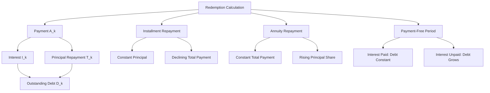

# Exercise 05: Redemptions

Source files:

- `finance-and-investment-management/raw/Exercise_5_Redemptions_Without_Solutions.pdf`
- `finance-and-investment-management/raw/Exercise_5_Redemptions_Solutions.pdf`
- `finance-and-investment-management/raw/Formulary.pdf`

Lecture folder: `finance-and-investment-management/`  
Date processed: 2026-05-16

## High-Yield 80/20 Summary

Redemption calculation is loan repayment analysis. Every payment is split into interest and principal repayment. The key exam distinction is installment repayment vs annuity repayment.

Core logic:

1. Interest is calculated on the outstanding loan balance.
2. A payment consists of interest plus repayment.
3. In installment repayment, the principal repayment is constant and total payment declines.
4. In annuity repayment, the total payment is constant, interest declines, and principal repayment rises.
5. Payment-free periods either keep debt constant if interest is paid or increase debt if interest is not paid.

## Core Variables

```text
A_k = annuity/payment in period k
T_k = principal repayment in period k
I_k = interest payment in period k
D_k = remaining debt after period k
D_0 = initial debt / principal
r = interest rate
q = 1 + r
N = maturity
```

Core identities:

```text
A_k = T_k + I_k
D_k = D_(k-1) - T_k
I_k = r x D_(k-1)
D_0 = sum of discounted A_k payments
```

## Installment Repayment

Definition: repayment amount `T_k` is constant.

```text
T = D_0 / N
I_k = r x D_(k-1)
A_k = T + I_k
```

Pattern:

- Principal repayment constant.
- Interest decreases over time because outstanding debt falls.
- Total payment decreases over time.

Example: EUR 36,000 loan, 3 years, 10% interest.

| Period | Starting Debt | Interest | Repayment | Payment | Ending Debt |
|---:|---:|---:|---:|---:|---:|
| 1 | 36,000 | 3,600 | 12,000 | 15,600 | 24,000 |
| 2 | 24,000 | 2,400 | 12,000 | 14,400 | 12,000 |
| 3 | 12,000 | 1,200 | 12,000 | 13,200 | 0 |

## Annuity Repayment

Definition: total payment `A_k` is constant.

```text
A = D_0 x [q^N x (q - 1)] / (q^N - 1)
```

Pattern:

- Total payment is constant.
- Interest decreases over time.
- Principal repayment increases over time.

Remaining debt after `k` periods:

```text
D_k = D_0 x (q^N - q^k) / (q^N - 1)
```

Repayment amount in period `k`:

```text
T_k = A / q^(N-k+1)
```

Example: EUR 36,000 loan, 3 years, 10% interest.

```text
A = 36,000 x [1.1^3 x (1.1 - 1)] / (1.1^3 - 1) = 14,476.13
```

| Period | Starting Debt | Interest | Repayment | Payment | Ending Debt |
|---:|---:|---:|---:|---:|---:|
| 1 | 36,000.00 | 3,600.00 | 10,876.13 | 14,476.13 | 25,123.87 |
| 2 | 25,123.87 | 2,512.39 | 11,963.75 | 14,476.13 | 13,160.13 |
| 3 | 13,160.13 | 1,316.01 | 13,160.12 | 14,476.13 | 0 |

## Payment-Free Periods

Two cases:

### Interest Paid During Grace Period

Debt principal remains constant. After the payment-free period, apply normal repayment formulas to the original `D_0`.

### Interest Not Paid During Grace Period

Interest accumulates into the debt.

```text
D_0' = D_0 x q^k
```

Then apply repayment formulas to the increased debt.

Example: EUR 70,000 loan, 6%, five payment-free years, then 10 equal payments.

- If interest is paid during the grace period: `A = 9,510.76`.
- If no interest is paid: debt grows to `70,000 x 1.06^5 = 93,675.79`, then `A = 12,727.54`.

## Student Loan Pattern

Loan payments received monthly can be valued as an annuity. Later repayments can be compared by discounting alternative repayment streams to the same date.

Example from slides:

- Student receives EUR 300 at the end of each month for 3 years.
- Monthly rate = 0.5%.

```text
FV = 300 x (1.005^36 - 1) / (1.005 - 1) = 11,800.83
```

Alternative repayment plans are compared by present value at the same interest rate.

## Exam Decision Tree

1. Is the question about loan repayment?
   - Split payment into interest and principal.
2. Is repayment amount constant?
   - Installment repayment.
3. Is total payment constant?
   - Annuity repayment.
4. Is there a payment-free period?
   - Check whether interest is paid during it.
5. Are alternatives compared?
   - Discount all payments to the same date.
6. Asked for remaining debt?
   - Use debt recursion or remaining-debt formula.

## Common Mistakes

- Calculating interest on original debt instead of remaining debt.
- Confusing constant principal repayment with constant total payment.
- Forgetting that annuity repayment has increasing principal share.
- Forgetting to capitalize unpaid interest during grace periods.
- Comparing repayment alternatives by total nominal payments instead of present value.
- Off-by-one timing errors in `D_k` vs `D_(k-1)`.

## Practice Questions

1. In installment repayment, what happens to total payment over time?
   - Answer: it declines because interest declines while principal repayment stays constant.
2. In annuity repayment, what happens to the principal repayment share over time?
   - Answer: it rises because interest declines while total payment stays constant.
3. A five-year grace period has unpaid interest. What must you do before calculating repayment?
   - Answer: compound the loan balance over the grace period.
4. Why should student loan options be compared using present value?
   - Answer: payment timing differs, and money paid later is worth less today.

## Mermaid Knowledge Map



## Subject Knowledge Graph

| Node | Meaning |
|---|---|
| Redemption | Repayment of loan principal |
| Interest payment | Cost of borrowing for a period |
| Principal repayment | Debt reduction in a period |
| Remaining debt | Debt after repayment |
| Installment repayment | Constant principal repayment |
| Annuity repayment | Constant total payment |
| Grace period | Period without principal repayment |

| From | Relationship | To |
|---|---|---|
| Payment | consists of | interest plus principal repayment |
| Interest | depends on | remaining debt |
| Principal repayment | reduces | remaining debt |
| Installment repayment | keeps constant | principal repayment |
| Annuity repayment | keeps constant | total payment |
| Unpaid grace-period interest | increases | debt balance |
| Repayment alternatives | should be compared by | present value |

## Links

- Previous exercise: `finance-and-investment-management/wiki/exercise-03-04-annuities.md`
- Next exercise: `finance-and-investment-management/wiki/exercise-06-bonds-i.md`
