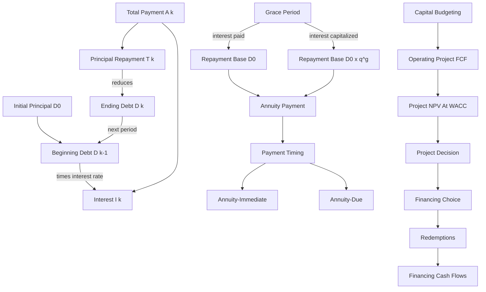

# Ubiquitous Language: Exercise 05 Redemptions

Source note: [Exercise 05: Redemptions](exercise-05-redemptions.md)

Bridge: [Redemptions To Capital Budgeting](redemptions-to-capital-budgeting-bridge.md)

Definition sources: local Exercise 5 problem and solution decks, formulary, and standard finance terminology. Updated 2026-06-24.

## Core Loan Language

| Term | Definition | Aliases to avoid |
|---|---|---|
| **Redemption** | Repayment of an outstanding loan principal through one or more payments. | project return, investment payoff |
| **Initial Principal `D_0`** | Loan balance immediately after funds are borrowed and before repayment begins. | initial investment cost |
| **Outstanding Principal `D_k`** | Debt remaining immediately after payment `k`. | total future payments |
| **Beginning Debt `D_(k-1)`** | Debt on which period-`k` interest is calculated. | ending debt `D_k` |
| **Interest Payment `I_k`** | Borrowing cost for period `k`, normally `r x D_(k-1)`. | principal repayment |
| **Principal Repayment `T_k`** | Part of payment `k` that reduces outstanding debt. | interest, total payment |
| **Total Payment `A_k`** | Cash paid in period `k`, equal to interest plus principal repayment. | principal only |
| **Debt Service** | Required interest and principal payments over a period. | project operating cost |
| **Amortization Schedule** | Period-by-period table of beginning debt, interest, principal repayment, total payment, and ending debt. | project FCF table |

Canonical identities:

```text
A_k = I_k + T_k
I_k = r x D_(k-1)
D_k = D_(k-1) - T_k
q = 1 + r
```

## Repayment Structures

| Term | Definition | Aliases to avoid |
|---|---|---|
| **Installment Repayment** | Structure with constant principal repayment `T`; interest and total payment decline over time. | annuity repayment |
| **Annuity Repayment** | Structure with constant total payment `A`; interest declines while principal repayment rises. | constant principal repayment |
| **Final Balloon Payment** | Smaller or differently sized final payment that clears the balance after a non-integer mathematical maturity. | regular annuity always |
| **Payment-Free Period** | Period before scheduled repayment begins; the treatment of interest must be specified. | free financing |
| **Interest-Paid Grace Period** | Principal is deferred but current interest is paid, so the principal balance stays constant. | no-payment period |
| **Capitalized-Interest Grace Period** | No current payment is made and unpaid interest is added to principal, so debt grows. | interest-free period |
| **Repayment Base** | Debt balance used as the input for the post-grace repayment formula. | original principal always |
| **Income-Independent Repayment** | Payment schedule fixed without reference to borrower income. | risk-free option |
| **Income-Dependent Repayment** | Payment schedule defined as a percentage of borrower income. | automatically cheaper option |

Installment formulas:

```text
T = D_0/N
I_k = r x D_(k-1)
A_k = T + I_k
```

Annuity formula:

```text
A = D_0 x [q^N x (q-1)]/(q^N-1)
```

Remaining-debt formulas:

```text
D_k = D_0 x (q^N - q^k)/(q^N - 1)

or recursively:
D_k = D_(k-1) - T_k
```

## Timing And Valuation Language

| Term | Definition | Aliases to avoid |
|---|---|---|
| **Annuity-Immediate** | Equal payments at period ends; the Exercise 5 default unless stated otherwise. | annuity-due |
| **Annuity-Due** | Equal payments at period beginnings; for the same loan balance the equal payment is lower, but the first cash outflow occurs earlier. | annuity-immediate |
| **Present Value, PV** | Today's value of one future cash-flow stream. | NPV |
| **Net Present Value, NPV** | Present value of project cash inflows and outflows net of the required investment; used as a value-creation measure. | PV |
| **Present Value Of Repayments** | Today's value of a future loan-payment stream, used to compare alternatives with different timing. | nominal payment total |
| **Future Value Of Loan Drawdowns** | Balance at a later date after periodic borrowed amounts and unpaid interest accumulate. | present loan amount |
| **Mathematical Maturity** | Continuous solution for repayment time, which may be non-integer. | number of full contractual payments |
| **Full Payment Period** | A completed contractual payment interval before a final settlement payment. | mathematical maturity rounded blindly |
| **Break-Even Income** | Income at which income-dependent and fixed repayment plans have equal PV cost. | zero-debt income |

Timing rule:

```text
Interest in period k uses D_(k-1).
D_k is observed after payment k.
```

## Capital Budgeting Bridge Language

| Term | Definition | Aliases to avoid |
|---|---|---|
| **Operating Project FCF** | Incremental project cash flow before financing, used in WACC-based Capital Budgeting. | loan payment cash flow |
| **Financing Cash Flow** | Borrowing, interest, principal repayment, dividends, or other transfers between the firm and capital providers. | operating project FCF |
| **Project NPV** | Present value of incremental operating project FCF discounted at the project-appropriate required return. | loan affordability |
| **Financing Feasibility** | Ability to meet debt service and other funding commitments when due. | positive project NPV |
| **WACC Boundary** | Under WACC valuation, financing cost is represented in the discount rate, so interest and principal are excluded from project FCF. | include all cash payments in FCF |

Canonical distinction:

```text
Capital Budgeting = value the operating asset.
Redemptions       = schedule repayment of the financing liability.
```

A project can have positive NPV but an unsuitable debt schedule. The correct response is to separate project value from financing feasibility and test whether maturity, grace period, or debt share should change.

## Relationships

- **Beginning Debt** determines the next **Interest Payment**.
- **Total Payment** consists of **Interest Payment** plus **Principal Repayment**.
- **Principal Repayment** reduces **Outstanding Principal**.
- **Installment Repayment** keeps principal repayment constant, so total payment declines.
- **Annuity Repayment** keeps total payment constant, so principal repayment rises.
- **Capitalized-Interest Grace Period** increases the **Repayment Base** that later annuity payments must repay.
- **Interest-Paid Grace Period** keeps the **Repayment Base** equal to original principal.
- **Annuity-Due** and **Annuity-Immediate** change the payment timing and therefore the PV factor.
- For the same payment amount, **Annuity-Due** has higher **Present Value** than **Annuity-Immediate**; for the same loan balance, **Annuity-Due** requires a lower equal payment.
- **Present Value Of Repayments** enables fair comparison of plans with different amounts or horizons.
- **Present Value** becomes **Net Present Value** only after the investment/outflow side is included.
- **Operating Project FCF** determines **Project NPV**; **Financing Cash Flow** determines the redemption schedule.
- **WACC Boundary** prevents interest-cost double counting.

## Visual Memory Aid



## Example Dialogue

> **Student:** "The company pays loan interest in cash. Why do we exclude it from project FCF?"
>
> **Professor:** "Because WACC already captures the required return of debt and equity. Project FCF measures operating value before financing; the redemption schedule analyzes the loan separately."
>
> **Student:** "Then Redemptions is irrelevant to Capital Budgeting?"
>
> **Professor:** "No. It adds a financing-feasibility test. A positive-NPV project can still have a loan schedule whose annual debt service is too aggressive."
>
> **Student:** "What remains constant in annuity repayment?"
>
> **Professor:** "The total payment. Interest falls and principal repayment rises as outstanding debt declines."
>
> **Student:** "Why is the later annuity higher when interest is capitalized during grace?"
>
> **Professor:** "Because the annuity formula is applied to a larger repayment base. The unpaid interest was added to principal before repayment began."
>
> **Student:** "Does annuity-due or annuity-immediate affect NPV?"
>
> **Professor:** "It affects the PV of the annuity stream whenever that stream is being valued. Under WACC project NPV, loan annuity payments stay in the redemption schedule, not inside operating project FCF."
>
> **Student:** "So PV and NPV are not the same?"
>
> **Professor:** "Correct. PV values a future stream today. NPV nets that value against the required investment or outflows to decide whether value is created."

## Flagged Ambiguities

| Ambiguity | Canonical recommendation |
|---|---|
| "Installment" | In this course, say **Installment Repayment** for constant principal; do not use it generically for any periodic payment. |
| "Annuity" | Specify whether it means a mathematical repeated cash-flow stream or the constant total loan payment. |
| "Payment-free" | State whether interest is paid or capitalized. |
| "Annuity timing" | State annuity-immediate for end-of-period payments and annuity-due for beginning-of-period payments. |
| "PV/NPV" | Use PV for valuing one stream; use NPV for value created after subtracting investment/outflows. |
| "Debt after year 6" | Clarify whether this means before or after the sixth payment; use `D_5` or `D_6`. |
| "Project cost" | Separate operating project cost from interest and principal financing cash flows. |
| "Affordable project" | Distinguish positive NPV from manageable annual debt service. |

## Exam Trap Corrections

| Trap | Correction |
|---|---|
| Interest calculated on original principal every year. | Use `I_k = r x D_(k-1)`. |
| Constant annuity interpreted as constant principal. | Constant annuity means constant total payment. |
| Non-integer maturity rounded down with no final payment. | Calculate remaining debt after the last full period and compound it to the settlement date. |
| Grace period assumed interest-free. | Determine whether interest is paid or capitalized. |
| Post-grace annuity calculated on original debt after capitalized interest. | First compound the debt to `D_0 x q^g`, then calculate the annuity. |
| Annuity-due treated as only a lower payment. | Also note the first payment occurs earlier, so early liquidity pressure may rise. |
| PV and NPV treated as synonyms. | PV values a stream; NPV nets PV against investment/outflows. |
| Repayment plans compared by nominal totals. | Discount both plans to the same date. |
| Loan interest included in project FCF under WACC. | Keep financing cash flows in the redemption schedule to avoid double counting. |
| Affordable debt used as proof of project value. | Calculate project NPV from operating FCF separately. |

## Cheat-Sheet Language

```text
Payment = interest + principal repayment.
Interest uses beginning debt; principal reduces ending debt.
Installment: constant principal, declining payment.
Annuity: constant payment, rising principal share.
Unpaid grace-period interest grows the debt balance.
Grace changes the repayment base; annuity-due/immediate changes payment timing.
Same payment: annuity-due has higher PV. Same loan balance: annuity-due needs a lower equal payment but earlier first cash outflow.
PV values one stream; NPV nets value against investment/outflows.
Compare repayment alternatives at one valuation date.
Capital Budgeting values the project; Redemptions schedules the loan.
Under WACC, exclude interest and principal from project FCF.
```
