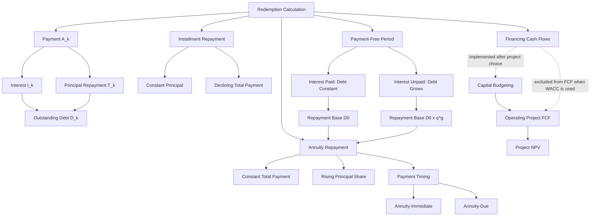

# Exercise 05: Redemptions

Source files:

- `finance-and-investment-management/raw/Exercise_5_Redemptions_Without_Solutions.pdf`
- `finance-and-investment-management/raw/Exercise_5_Redemptions_Solutions.pdf`
- `finance-and-investment-management/raw/Formulary.pdf`

Lecture folder: `finance-and-investment-management/`  
Date processed: 2026-05-16; expanded with full solution guides and Capital Budgeting bridge on 2026-06-14

Companion bridge: [Redemptions To Capital Budgeting](redemptions-to-capital-budgeting-bridge.md)

## High-Yield 80/20 Summary

Redemption calculation is loan repayment analysis. Every payment is split into interest and principal repayment. The key exam distinction is installment repayment vs annuity repayment.

Core logic:

1. Interest is calculated on the outstanding loan balance.
2. A payment consists of interest plus repayment.
3. In installment repayment, the principal repayment is constant and total payment declines.
4. In annuity repayment, the total payment is constant, interest declines, and principal repayment rises.
5. Payment-free periods either keep debt constant if interest is paid or increase debt if interest is not paid.

## Where This Fits: Two Parallel Session 05 Tracks

The shared number `05` creates a naming trap:

| Course track | Topic | Main question |
|---|---|---|
| Corporate Finance lecture, Sessions 05-06 | Capital Budgeting | Should the firm undertake an operating investment? |
| Mathematical Basics exercise, Session 05 | Redemptions | How is an outstanding loan repaid over time? |

They share timeline and present-value mathematics, but Redemptions is not the exercise sheet for Capital Budgeting.

```text
Capital Budgeting -> operating project FCF -> NPV -> accept/reject
Redemptions       -> financing cash flows -> debt schedule -> liquidity/repayment
```

Critical boundary: when project FCF is discounted at WACC, do not subtract loan interest or principal repayments inside project FCF. That would mix the financing schedule into the operating project and can double-count financing cost.

## Continuous Analogy: Draining A Loan Reservoir

Imagine the outstanding debt `D_k` as water remaining in a reservoir:

- interest is the rental charge on the water still inside at the start of the period;
- principal repayment drains water from the reservoir;
- the total payment carries both the rental charge and the drained amount;
- once the reservoir reaches zero, the loan is fully repaid.

Installment repayment drains the same amount of principal each period, so the reservoir falls in a straight line and interest declines. Annuity repayment sends the same total payment each period; as interest shrinks, more of that fixed payment can drain principal.

## Core Variables

```text
A_k = annuity/payment in period k
T_k = principal repayment in period k
I_k = interest payment in period k
D_k = remaining debt after period k
D_0 = initial debt / principal
r = interest rate
q = 1 + r
N = maturity
```

Core identities:

```text
A_k = T_k + I_k
D_k = D_(k-1) - T_k
I_k = r x D_(k-1)
D_0 = sum of discounted A_k payments
```

## Installment Repayment

Definition: repayment amount `T_k` is constant.

```text
T = D_0 / N
I_k = r x D_(k-1)
A_k = T + I_k
```

Pattern:

- Principal repayment constant.
- Interest decreases over time because outstanding debt falls.
- Total payment decreases over time.

Example: EUR 36,000 loan, 3 years, 10% interest.

| Period | Starting Debt | Interest | Repayment | Payment | Ending Debt |
|---:|---:|---:|---:|---:|---:|
| 1 | 36,000 | 3,600 | 12,000 | 15,600 | 24,000 |
| 2 | 24,000 | 2,400 | 12,000 | 14,400 | 12,000 |
| 3 | 12,000 | 1,200 | 12,000 | 13,200 | 0 |

## Annuity Repayment

Definition: total payment `A_k` is constant.

```text
A = D_0 x [q^N x (q - 1)] / (q^N - 1)
```

Pattern:

- Total payment is constant.
- Interest decreases over time.
- Principal repayment increases over time.

Remaining debt after `k` periods:

```text
D_k = D_0 x (q^N - q^k) / (q^N - 1)
```

Repayment amount in period `k`:

```text
T_k = A / q^(N-k+1)
```

Example: EUR 36,000 loan, 3 years, 10% interest.

```text
A = 36,000 x [1.1^3 x (1.1 - 1)] / (1.1^3 - 1) = 14,476.13
```

| Period | Starting Debt | Interest | Repayment | Payment | Ending Debt |
|---:|---:|---:|---:|---:|---:|
| 1 | 36,000.00 | 3,600.00 | 10,876.13 | 14,476.13 | 25,123.87 |
| 2 | 25,123.87 | 2,512.39 | 11,963.75 | 14,476.13 | 13,160.13 |
| 3 | 13,160.13 | 1,316.01 | 13,160.12 | 14,476.13 | 0 |

## Payment-Free Periods

Two cases:

### Interest Paid During Grace Period

Debt principal remains constant. After the payment-free period, apply normal repayment formulas to the original `D_0`.

### Interest Not Paid During Grace Period

Interest accumulates into the debt.

```text
D_0' = D_0 x q^k
```

Then apply repayment formulas to the increased debt.

Example: EUR 70,000 loan, 6%, five payment-free years, then 10 equal payments.

- If interest is paid during the grace period: `A = 9,510.76`.
- If no interest is paid: debt grows to `70,000 x 1.06^5 = 93,675.79`, then `A = 12,727.54`.

### Why Capitalized Interest Raises The Later Annuity

The annuity formula after the grace period always starts from the debt balance that exists at the beginning of repayment:

```text
A_after_grace = repayment base x [q^N x (q - 1)]/(q^N - 1)
```

The grace-period contract determines the repayment base:

| Grace treatment | Cash during grace | Repayment base after grace | Later annuity effect |
|---|---:|---:|---|
| Interest paid during grace | `r x D_0` each period | `D_0` | Annuity is calculated on original debt |
| Interest capitalized during grace | `0` | `D_0 x q^g` | Annuity is calculated on larger debt |

Example with `D_0 = 70,000`, `r = 6%`, `g = 5`, and `N = 10`:

```text
Interest-paid grace:
repayment base = 70,000
A = 9,510.76

Capitalized-interest grace:
repayment base = 70,000 x 1.06^5 = 93,675.79
A = 12,727.54
```

The formula did not change. The base amount changed. Interest that was not paid during grace became part of the principal that the later annuity must repay.

### Annuity-Immediate Versus Annuity-Due In Redemption

Most loan redemption exercises assume annuity-immediate unless the question states otherwise:

```text
Annuity-immediate = equal payments at the end of each period
Annuity-due       = equal payments at the beginning of each period
```

For the same loan balance and same number of payments, annuity-due requires a lower equal payment because each payment reaches the lender one period earlier:

```text
A_due = A_immediate / q
```

Example with `D = 70,000`, `r = 6%`, and `N = 10`:

```text
A_immediate = 9,510.76
A_due       = 9,510.76 / 1.06 = 8,972.42
```

This does not mean annuity-due is always easier for the borrower. The first payment is due immediately at the beginning of the repayment phase, so the payment amount is lower but the cash-pressure timing is earlier.

## Student Loan Pattern

Loan payments received monthly can be valued as an annuity. Later repayments can be compared by discounting alternative repayment streams to the same date.

Example from slides:

- Student receives EUR 300 at the end of each month for 3 years.
- Monthly rate = 0.5%.

```text
FV = 300 x (1.005^36 - 1) / (1.005 - 1) = 11,800.83
```

Alternative repayment plans are compared by present value at the same interest rate.

## Exercise Answer Guides

The tasks below follow the expanded calculation standard: model selection, inputs, formula, substitution, arithmetic, interpretation, analogy where useful, and exam trap.

### Task A.1: Three-Year Installment Repayment Plan

#### Operating Story

A homeowner borrows EUR 36,000 and promises to repay the same principal amount over three years. The lender charges 10% annually on the debt still outstanding at the beginning of each year.

#### Model Selection

The phrase **installment repayment** means constant principal repayment:

```text
T = D_0/N
  = 36,000/3
  = EUR 12,000 per year
```

| Year | Starting debt | Interest `10%` | Principal repayment | Total payment | Ending debt |
|---:|---:|---:|---:|---:|---:|
| 1 | 36,000 | 3,600 | 12,000 | 15,600 | 24,000 |
| 2 | 24,000 | 2,400 | 12,000 | 14,400 | 12,000 |
| 3 | 12,000 | 1,200 | 12,000 | 13,200 | 0 |

#### Interpretation

The principal drain is fixed at EUR 12,000. Interest falls because the lender charges 10% on a progressively smaller reservoir. Therefore the total annual payment declines.

#### Exam Trap

Do not calculate every year's interest as `10% x 36,000`. Interest uses the beginning balance for that specific year.

### Task A.2: Interest In Selected Installment Years

#### Problem

A EUR 50,000 loan is repaid through 20 equal principal installments. The annual interest rate is 6%. Find interest in years 10, 15, and 20.

#### Calculation

```text
Constant principal repayment = 50,000/20
                             = EUR 2,500
```

Beginning debt in year `k`:

```text
D_(k-1) = 50,000 - (k-1) x 2,500
```

| Year | Beginning debt | Interest calculation | Interest |
|---:|---:|---:|---:|
| 10 | 27,500 | `27,500 x 6%` | EUR 1,650 |
| 15 | 15,000 | `15,000 x 6%` | EUR 900 |
| 20 | 2,500 | `2,500 x 6%` | EUR 150 |

The correct multiple-choice set is `EUR 1,650; EUR 900; EUR 150`.

#### Exam Trap

Year 10 begins after nine principal repayments, not ten. This is the standard `D_(k-1)` timing distinction.

### Task A.3: Three-Year Annuity Repayment Plan

#### Operating Story

The same EUR 36,000 renovation loan is now repaid through three equal total payments rather than equal principal repayments.

#### Step 1: Calculate The Constant Payment

```text
q = 1.10

A = D_0 x [q^N x (q-1)]/(q^N-1)
  = 36,000 x [1.10^3 x 0.10]/[1.10^3-1]
  = EUR 14,476.13
```

#### Step 2: Split Payment Into Interest And Principal

| Year | Starting debt | Interest | Principal repayment | Constant payment | Ending debt |
|---:|---:|---:|---:|---:|---:|
| 1 | 36,000.00 | 3,600.00 | 10,876.13 | 14,476.13 | 25,123.87 |
| 2 | 25,123.87 | 2,512.39 | 11,963.75 | 14,476.13 | 13,160.13 |
| 3 | 13,160.13 | 1,316.01 | 13,160.12 | 14,476.13 | 0 |

#### Interpretation

The total bucket paid each year stays fixed. In year 1, a large share covers interest. As debt falls, interest consumes less of the bucket, allowing principal repayment to rise.

#### Exam Trap

Constant annuity does not mean constant principal repayment. It means constant **total payment**.

### Task A.4: Payment, Remaining Debt, And Sixth-Year Principal

#### Problem

A EUR 20,000 loan carries 5% annual interest and is repaid through ten equal end-of-year annuity payments.

#### Part A: Constant Payment

```text
A = 20,000 x [1.05^10 x 0.05]/[1.05^10-1]
  = EUR 2,590.09
```

#### Part B: Remaining Debt After Six Payments

```text
D_6 = D_0 x (q^N - q^6)/(q^N - 1)
    = 20,000 x (1.05^10 - 1.05^6)/(1.05^10 - 1)
    = EUR 9,184.34
```

#### Part C: Principal Repaid In Year 6

First-year principal:

```text
T_1 = A - rD_0
    = 2,590.09 - 0.05 x 20,000
    = EUR 1,590.09
```

Principal grows geometrically by `q`:

```text
T_6 = q^5 x T_1
    = 1.05^5 x 1,590.09
    = EUR 2,029.40
```

Check from the schedule:

```text
Interest_6 = 0.05 x 11,213.74 approximately EUR 560.69
Principal_6 = 2,590.09 - 560.69 approximately EUR 2,029.40
```

#### Decision Use

The remaining-debt formula answers refinancing, early-settlement, and balance-sheet questions without rebuilding every prior row.

#### Exam Trap

Read the timing carefully: `D_6` is debt after the sixth payment; interest in year 6 is based on `D_5`.

### Task A.5: Maximum Loan Supported By A Payment Budget

#### Problem

A borrower can pay EUR 8,000 at each year-end for 15 years. The rate is 5%. How much can be borrowed today?

This is a present-value problem:

```text
D_0 = A x (q^N - 1)/[q^N x (q-1)]
    = 8,000 x (1.05^15 - 1)/[1.05^15 x 0.05]
    = EUR 83,037.25
```

#### Household Analogy

The borrower starts with an annual payment budget and works backward to the affordable mortgage principal. The answer is not `15 x 8,000` because later payments are worth less today.

#### Exam Trap

The question asks for today's loan amount, so use present value, not future value or nominal payment sum.

### Task A.6: Non-Integer Maturity And Final Balloon Payment

#### Problem

A EUR 75,000 loan is repaid through annual payments of EUR 9,000 at 8%.

#### Part A: Mathematical Repayment Time

Solving the annuity equation for `N` gives:

```text
N = -ln[1 - D_0(q-1)/A] / ln(q)
  = -ln[1 - 75,000(0.08)/9,000] / ln(1.08)
  = 14.27 years
```

A payment cannot be made for only 0.27 of an annual period under the stated contract. Therefore there are 14 full EUR 9,000 payments and a smaller final payment in year 15.

#### Part B: Debt After Year 14

```text
D_14 = 75,000 x 1.08^14
       - 9,000 x (1.08^14 - 1)/0.08
     = EUR 2,355.24
```

#### Part C: Final Payment

```text
A_15 = D_14 x 1.08
     = 2,355.24 x 1.08
     = EUR 2,543.66
```

#### Exam Trap

Do not round `14.27` down and declare the loan repaid after 14 years. The remaining balance accrues one final year's interest before settlement.

### Task A.7: Five-Year Grace Period

#### Problem

A EUR 70,000 loan carries 6% interest. After five payment-free years, it will be repaid through ten equal annuity payments.

#### Case A: Interest Is Paid During Grace Period

The principal remains EUR 70,000 because interest does not enter the balance:

```text
A = 70,000 x [1.06^10 x 0.06]/[1.06^10-1]
  = EUR 9,510.76
```

#### Case B: Interest Is Not Paid During Grace Period

Unpaid interest is capitalized:

```text
D_0' = 70,000 x 1.06^5
     = EUR 93,675.79

A = 93,675.79 x [1.06^10 x 0.06]/[1.06^10-1]
  = EUR 12,727.54
```

#### Snowball Analogy

Paid interest keeps the debt snowball the same size while repayment is postponed. Unpaid interest sticks to the snowball, so the later annuity must repay a much larger balance.

#### Exam Trap

"Payment-free" is ambiguous. Always ask whether it means principal-free with interest paid, or completely payment-free with interest capitalized.

### Task A.8: Student Loan Accumulation And Repayment Choice

#### Part A: Debt At Graduation

The student receives EUR 300 at each month-end for three years, with a monthly rate of 0.5%, and pays no interest during study.

```text
N = 12 x 3 = 36 months

FV = 300 x (1.005^36 - 1)/0.005
   = EUR 11,800.83
```

The stream is accumulated forward because the question asks for debt at the end of the study period.

#### Part B: Compare Repayment Plans At A Common Date

At a 5% annual discount rate:

Income-independent plan:

```text
Payment = EUR 2,300 for 6 years
PV = EUR 11,674.09
```

Income-dependent plan: pay 4.5% of annual income for 8 years.

| Annual income | Annual payment | PV of eight payments |
|---:|---:|---:|
| EUR 40,000 | EUR 1,800 | EUR 11,633.78 |
| EUR 45,000 | EUR 2,025 | EUR 13,088.01 |
| EUR 50,000 | EUR 2,250 | EUR 14,542.23 |

Break-even annual income:

```text
EUR 40,138.59
```

Borrower decision under these assumptions:

- below approximately EUR 40,138.59, the income-dependent plan has the lower PV cost;
- above approximately EUR 40,138.59, the fixed EUR 2,300 plan has the lower PV cost.

#### Exam Trap

Do not compare `6 x 2,300` with `8 x 4.5% x income` as nominal totals. The payment horizons differ, so discount both streams to the same date.

## Capital Budgeting Bridge Example

Suppose a machine costs EUR 100,000 and generates operating project FCF. Use Capital Budgeting to decide whether those operating FCFs create value. If the machine is accepted and financed with a loan, use Redemptions to construct the lender payment schedule.

```text
Step 1: Project decision
machine operating FCF -> discount at project WACC -> project NPV

Step 2: Financing implementation
loan principal -> interest/principal schedule -> annual debt-service burden
```

Do not subtract the Step 2 loan payments inside Step 1 project FCF when WACC is the discount rate. Redemptions can still reveal whether the chosen financing schedule creates a liquidity problem even when the project NPV is positive.

### PV Versus NPV In The Bridge

Use **PV** when valuing one cash-flow stream at one date:

```text
PV = today's value of future payments or future inflows
```

Use **NPV** when netting the present value of project benefits against the upfront investment or other dated project outflows:

```text
NPV = PV of project future FCF - initial project investment
```

In this bridge:

| Calculation | What it values | Typical decision |
|---|---|---|
| PV of loan repayments | Financing payment stream | Compare repayment plans or lender value |
| NPV of operating project FCF | Project value after investment cost | Accept, reject, or redesign project |

Annuity-due or annuity-immediate affects PV whenever that annuity payment stream is being valued. Under WACC-based Capital Budgeting, loan annuity payments remain outside project FCF and are tested separately in the redemption schedule.

## Exam Decision Tree

1. Is the question about loan repayment?
   - Split payment into interest and principal.
2. Is repayment amount constant?
   - Installment repayment.
3. Is total payment constant?
   - Annuity repayment.
4. Is there a payment-free period?
   - Check whether interest is paid during it.
5. Are alternatives compared?
   - Discount all payments to the same date.
6. Asked for remaining debt?
   - Use debt recursion or remaining-debt formula.
7. Is the question asking for PV or NPV?
   - PV values one future stream today; NPV subtracts the required investment/outflows to measure value creation.
8. Is the case asking whether a project creates operating value?
   - Switch to Capital Budgeting; do not treat the loan schedule as project FCF.

## Common Mistakes

- Calculating interest on original debt instead of remaining debt.
- Confusing constant principal repayment with constant total payment.
- Forgetting that annuity repayment has increasing principal share.
- Forgetting to capitalize unpaid interest during grace periods.
- Calculating the post-grace annuity on original debt when interest was capitalized.
- Ignoring annuity-due versus annuity-immediate timing.
- Treating lower annuity-due payment as automatically easier, even though the first cash outflow occurs earlier.
- Confusing PV of loan payments with NPV of the operating project.
- Comparing repayment alternatives by total nominal payments instead of present value.
- Off-by-one timing errors in `D_k` vs `D_(k-1)`.
- Inserting interest and principal repayments into project FCF even though WACC is used.

## Practice Questions

1. In installment repayment, what happens to total payment over time?
   - Answer: it declines because interest declines while principal repayment stays constant.
2. In annuity repayment, what happens to the principal repayment share over time?
   - Answer: it rises because interest declines while total payment stays constant.
3. A five-year grace period has unpaid interest. What must you do before calculating repayment?
   - Answer: compound the loan balance over the grace period.
4. Why should student loan options be compared using present value?
   - Answer: payment timing differs, and money paid later is worth less today.
5. Why is the annuity higher after a capitalized-interest grace period?
   - Answer: the repayment base is larger because unpaid interest was added to principal.
6. Does annuity-due versus annuity-immediate affect PV?
   - Answer: yes, whenever the annuity stream is being valued; for the same loan balance, annuity-due has a lower equal payment but earlier cash pressure.
7. What is the difference between PV and NPV?
   - Answer: PV values future cash flows today; NPV nets that value against the investment/outflows to measure value creation.

## Mermaid Knowledge Map



## Subject Knowledge Graph

| Node | Meaning |
|---|---|
| Redemption | Repayment of loan principal |
| Interest payment | Cost of borrowing for a period |
| Principal repayment | Debt reduction in a period |
| Remaining debt | Debt after repayment |
| Installment repayment | Constant principal repayment |
| Annuity repayment | Constant total payment |
| Grace period | Period without principal repayment |
| Repayment base | Debt balance used to calculate post-grace annuity payments |
| Annuity-immediate | Equal payments at period ends |
| Annuity-due | Equal payments at period beginnings |
| Present value | Today's value of one future cash-flow stream |
| Net present value | Value created after subtracting project investment/outflows |

| From | Relationship | To |
|---|---|---|
| Payment | consists of | interest plus principal repayment |
| Interest | depends on | remaining debt |
| Principal repayment | reduces | remaining debt |
| Installment repayment | keeps constant | principal repayment |
| Annuity repayment | keeps constant | total payment |
| Unpaid grace-period interest | increases | debt balance |
| Capitalized interest | raises | repayment base |
| Repayment base | determines | later annuity payment |
| Annuity-due | pays earlier than | annuity-immediate |
| Earlier annuity payments | increase | present value for the same payment amount |
| Repayment alternatives | should be compared by | present value |
| Present value | feeds | net present value when investment cost is included |
| Capital budgeting | values | operating project FCF |
| Redemptions | schedules | financing cash flows |
| WACC-based project valuation | excludes | loan interest and principal from project FCF |

## Links

- Previous exercise: `finance-and-investment-management/wiki/exercise-03-04-annuities/exercise-03-04-annuities.md`
- Next exercise: `finance-and-investment-management/wiki/exercise-06-bonds-i/exercise-06-bonds-i.md`
- Corporate-finance bridge: `finance-and-investment-management/wiki/session-05-06-capital-budgeting/session-05-06-capital-budgeting.md`
- Dedicated bridge: `finance-and-investment-management/wiki/exercise-05-redemptions/redemptions-to-capital-budgeting-bridge.md`
