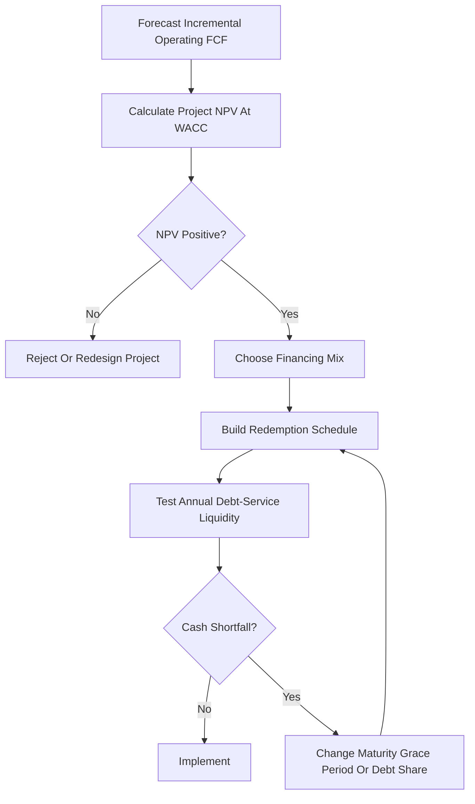

# Redemptions To Capital Budgeting Bridge

Source notes:

- [Exercise 05: Redemptions](exercise-05-redemptions.md)
- [Session 05-06: Capital Budgeting](../session-05-06-capital-budgeting/session-05-06-capital-budgeting.md)

Purpose: connect the two Session 05 topics without collapsing their separate course roles.

## The Plain-Language Router

```text
Capital Budgeting asks:
Is the machine, product, warehouse, or project economically worth doing?

Redemptions asks:
If money is borrowed, how will the debt balance be repaid over time?
```

Capital Budgeting belongs to the Corporate Finance lecture. Redemptions belongs to the independent Mathematical Basics exercise track. They use related mathematics, but one is not the exercise sheet for the other.

WACC is the weighted required return of debt and equity providers. The bank-loan rate is only the debt component. Redemptions begins after management proposes a specific loan amount, interest rate, maturity, and repayment structure.

## One Continuous Example: A Bakery Oven

A bakery considers buying an industrial oven for EUR 100,000.

The oven is expected to generate incremental operating FCF of EUR 30,000 per year for five years. Assume a project WACC of 10%.

### Stage 1: Capital Budgeting

```text
NPV = -100,000
      + 30,000/1.10
      + 30,000/1.10^2
      + 30,000/1.10^3
      + 30,000/1.10^4
      + 30,000/1.10^5

NPV approximately EUR 13,724
```

The oven creates operating value under the assumptions, so the project passes the NPV test.

This stage uses:

- incremental sales and operating costs;
- taxes and depreciation tax shields;
- oven CapEx;
- changes in inventory, receivables, and payables;
- after-tax salvage value if relevant;
- project risk through WACC.

### Stage 2: Redemptions

Suppose the bakery finances the EUR 100,000 purchase with a five-year bank loan at 6%, repaid through equal annual annuity payments.

```text
A = 100,000 x [1.06^5 x 0.06]/[1.06^5 - 1]
  approximately EUR 23,739.64 per year
```

The first payment splits into:

```text
Interest_1 = 100,000 x 6%
           = EUR 6,000

Principal_1 = 23,739.64 - 6,000
            = EUR 17,739.64

Ending debt_1 = 100,000 - 17,739.64
              = EUR 82,260.36
```

This stage answers whether the bakery can service the debt and how quickly the lender's claim declines. It does not recalculate the oven's operating NPV.

## Why Loan Payments Stay Out Of Project FCF

Under the standard WACC approach:

```text
Project FCF = operating cash flow before financing
WACC        = required return incorporating debt and equity financing cost
```

If the analyst subtracts loan interest inside FCF and also discounts at WACC, debt cost is counted twice. Principal repayment is also a financing transfer: it repays borrowed capital rather than measuring operating value created by the oven.

Canonical exam statement:

> Value the project from its incremental operating FCF and capture financing cost through WACC. Analyze interest and principal separately in the redemption schedule.

## What The Bridge Adds To Decision Making

A positive-NPV project can still create a financing problem.

In the oven example:

```text
Annual operating FCF = EUR 30,000
Annual loan payment  = approximately EUR 23,740
```

The base case leaves approximately EUR 6,260 before other cash commitments. If a downside scenario reduces annual operating FCF to EUR 20,000, the project might still have strategic value or even a positive NPV under a richer forecast, but the fixed loan payment would exceed that year's project cash generation.

This creates two separate conclusions:

| Question | Metric | Possible conclusion |
|---|---|---|
| Does the oven create economic value? | Project NPV | Accept if positive |
| Can the bakery meet lender payments each year? | Redemption schedule and liquidity forecast | Financing may need a longer maturity, grace period, or lower debt share |

Redemptions therefore adds a **financing-feasibility lens**, not a replacement project-value rule.

In practice, financing feasibility is normally investigated alongside final project approval. "After acceptance" is the conceptual sequence, not a requirement to wait until the decision is irreversible:

```text
Provisional positive-NPV project
-> test debt/equity alternatives
-> build proposed redemption schedules
-> confirm value and financing feasibility
-> final approval and implementation
```

Redemption does not choose debt versus equity. It evaluates repayment after the financing mix and loan terms are proposed.

## Shared Tools And Different Meanings

| Shared tool | Capital Budgeting use | Redemptions use |
|---|---|---|
| Timeline | Place project CapEx and FCF by date | Place loan drawdown and repayments by date |
| Present value | Calculate project NPV | Compare repayment alternatives or value a payment stream |
| Annuity formula | Value repeated operating cash flows when appropriate | Calculate constant loan payments |
| Scenario analysis | Vary price, volume, cost, NWC, or WACC | Vary interest rate, maturity, grace period, or income-based payment |
| Break-even analysis | Find the driver that makes project NPV zero | Find income/payment/maturity at which repayment plans have equal PV |

## Triangular Impact Flow: Capital Budgeting, Redemptions, Annuities

The clean sequence is:

```text
Capital Budgeting
= operating project FCF + WACC -> project NPV

Redemptions
= loan amount + loan rate + maturity + grace period -> debt-service schedule

Annuities
= repeated-payment formula inside Redemptions -> equal payment amount or PV of payments
```

How the triangle interacts:

```text
Project FCF timing
-> tells whether the project creates value and when cash arrives

Loan structure
-> determines whether early debt service creates liquidity pressure

Annuity formula
-> converts the chosen repayment base and timing into equal payments
```

Grace periods and annuity timing affect the redemption side:

| Financing feature | Immediate effect | Annuity/PV effect | Project NPV effect under WACC |
|---|---|---|---|
| Interest paid during grace | Principal stays at `D_0` | Later annuity is based on `D_0` | No direct FCF inclusion |
| Interest capitalized during grace | Debt grows to `D_0 x q^g` | Later annuity is higher because repayment base is larger | No direct FCF inclusion |
| Annuity-immediate | Payments at period end | Standard end-of-period PV factor | No direct FCF inclusion |
| Annuity-due | Payments at period beginning | Same payment has higher PV; same debt needs lower equal payment | No direct FCF inclusion |

This means a grace period can help the project survive early low cash inflows, but capitalized interest pushes the burden into later payments. The correct managerial question is not "Does this change project NPV?" but "Does this financing schedule fit the project's cash-flow timing?"

## Decision Sequence



## Exam Traps

| Trap | Correction |
|---|---|
| Treating Exercise 05 Redemptions as the Capital Budgeting exercise | They are independent course tracks sharing time-value tools |
| Subtracting interest in FCF and discounting at WACC | This double-counts financing cost |
| Treating principal repayment as an operating expense | Principal repayment reduces a financing liability; it is not project operating cost |
| Rejecting a positive-NPV project only because one loan schedule is too aggressive | Separate project value from financing feasibility; redesign the financing first |
| Accepting a project solely because loan payments look affordable | Affordable debt does not prove that operating NPV is positive |
| Treating WACC as the contractual loan rate | WACC combines debt and equity required returns; the loan rate is only cost of debt |
| Saying redemption selects the financing source | Financing mix comes first; redemption models the proposed loan's repayment |

## Retrieval Prompts

1. State the different decision question answered by Capital Budgeting and Redemptions.
2. Explain why interest and principal are excluded from project FCF under WACC valuation.
3. Give an example of a positive-NPV project with an unsuitable redemption schedule.
4. Explain how extending maturity changes annual debt service without automatically changing project operating NPV.
5. Draw the complete sequence from operating forecast to project decision to financing implementation.
6. Explain why financing feasibility can be tested before final approval without mixing loan payments into project NPV.
7. Explain why capitalized grace-period interest raises later annuity payments.
8. State the difference between PV and NPV in a loan-versus-project comparison.
