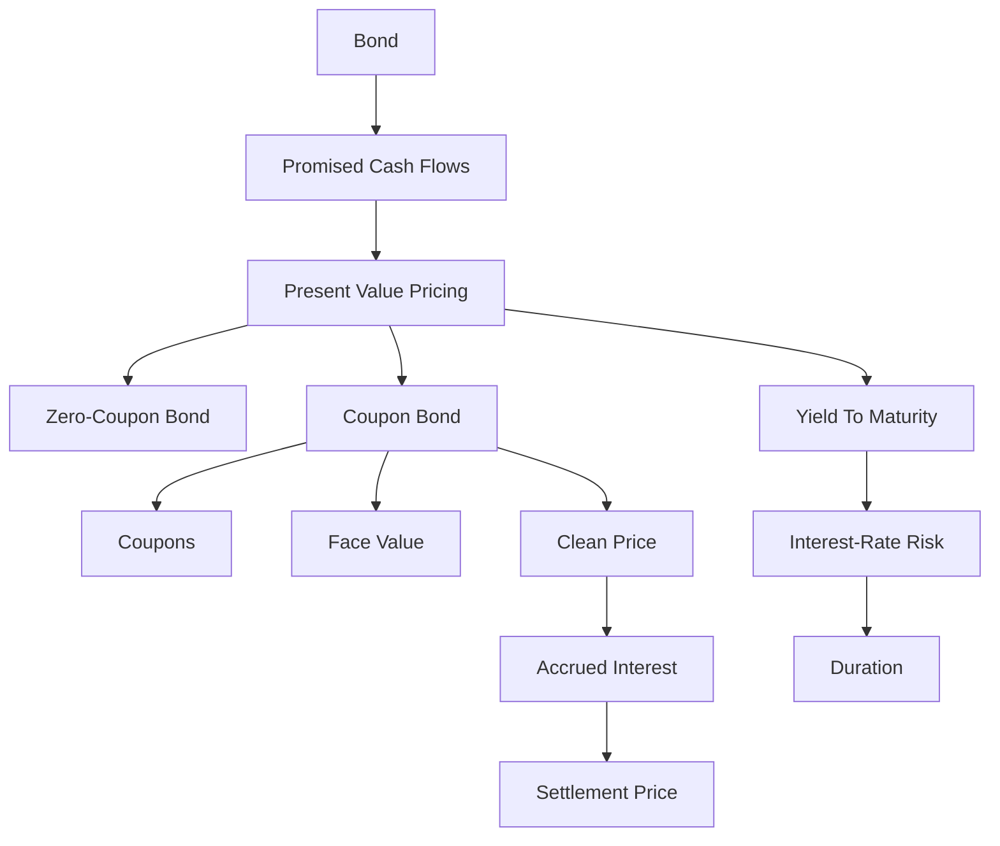

# Ubiquitous Language: Exercise 06-07 Bonds I

Source note: `exercise-06-bonds-i.md`
Course: Finance and Investment Management
Definition sources: local topic note, original Exercise 6 material, new Exercise 6 solutions, new Exercise 7 material, and standard bond-valuation usage.

This file is a standalone terminology and formula companion for bond valuation, coupon bonds, accrued interest, yield to maturity, and interest-rate sensitivity.

## Finance Language

| Term | Definition | Aliases to avoid |
|---|---|---|
| **Cash Flow** | A dated inflow or outflow of money used for valuation and investment decisions. | profit, accounting earnings |
| **Present Value** | The value today of a future cash flow discounted at an appropriate rate. | current price always |
| **Future Value** | The amount a current cash flow grows to after earning interest over time. | forecast value |
| **Discount Rate** | The rate used to convert future cash flows into present value, reflecting time value and risk. | interest rate always |
| **Compounding** | Interest earning interest over multiple periods. | simple interest |
| **Net Present Value** | The sum of discounted cash inflows and outflows; positive NPV means value creation under the chosen discount rate. | profit, payoff |
| **Internal Rate of Return** | The discount rate that sets NPV equal to zero for a cash-flow stream. | project return always |

## Exam Setup Language

| Term | Definition | Aliases to avoid |
|---|---|---|
| **Timeline** | A dated layout of cash flows and rates that prevents mixing values from different points in time. | list of numbers |
| **Nominal Rate** | A quoted annual rate before adjusting for compounding frequency. | effective rate |
| **Effective Rate** | The actual rate earned or paid over a period after compounding is considered. | nominal rate |

## Bond Language

| Term | Definition | Aliases to avoid |
|---|---|---|
| **Bond** | A debt security promising specified cash flows from issuer to investor. | stock |
| **Face Value** | The principal amount repaid at maturity. | market price |
| **Coupon** | The periodic interest payment promised by a coupon bond. | yield |
| **Coupon Rate** | Coupon as a percentage of face value. Convert it into a cash coupon before valuation. | yield to maturity |
| **Yield To Maturity** | The discount rate that equates a bond price to the present value of promised cash flows through maturity. | coupon rate |
| **Zero-Coupon Bond** | A bond with no coupon payments, sold at a discount and repaid at face value. | coupon bond |
| **Coupon Bond** | A bond with periodic coupon payments and principal repayment at maturity. | zero-coupon bond |
| **Clean Price** | Quoted market price excluding accrued interest. | settlement price |
| **Accrued Interest** | Pro-rata coupon compensation paid by the buyer to the seller when a bond is sold between coupon dates. | coupon rate |
| **Settlement Price** | Simplified buying price equal to clean market price plus accrued interest. | market price only |
| **Par Bond** | Bond trading at face value, usually when coupon rate equals market yield. | premium bond |
| **Discount Bond** | Bond trading below face value, usually when coupon rate is below market yield. | cheap bond always |
| **Premium Bond** | Bond trading above face value, usually when coupon rate is above market yield. | overpriced bond always |
| **Duration** | Weighted average timing of bond cash flows and a rate-sensitivity measure. | maturity |
| **Modified Duration** | Duration adjusted to approximate percentage price change for a yield change. | coupon |

## Core Bond Formulas

| Formula | Meaning | Exam use |
|---|---|---|
| `B_0^ZB = B_N / (1+r)^N` | Zero-coupon bond price | Use when only face value is paid at maturity. |
| `B_0 = sum C/(1+r)^k + B_N/(1+r)^N` | Coupon-bond price | Discount every coupon and the final redemption value. |
| `B_0 = C x [1 - 1/(1+r)^N] / r + B_N/(1+r)^N` | Coupon-bond annuity form | Use for constant coupons and flat yield. |
| `I_0 = days/360 x C` | Simplified accrued interest | Use when the bond is sold between coupon dates. |
| `Settlement price = clean price + accrued interest` | Simplified cash paid by buyer | Distinguish quoted price from final payment. |
| `Delta B_0 / B_0 approx -D_mod x Delta r` | Modified-duration approximation | Estimate small yield-change price effect. |

## Worked Calculation Language

Every bond calculation should show:

```text
Bond type -> promised cash flows -> discount rate/yield -> PV of each piece -> price or sensitivity -> investor interpretation
```

Mini anchors:

```text
Zero-coupon bond: face = EUR 100, N = 20, r = 6.75%.
B_0 = 100 / 1.0675^20
1.0675^20 = 3.69282
B_0 = EUR 27.08
```

```text
Coupon bond: face = EUR 100, coupon = EUR 4, N = 3, r = 5%.
B_0 = 4/1.05 + 4/1.05^2 + 104/1.05^3
B_0 = 3.81 + 3.63 + 89.84
B_0 = EUR 97.28
```

Interpretation: bond price is not "coupon rate times face value"; it is the PV of all promised payments. Analogy: price the bond by pricing each future package on the delivery calendar, then adding the packages. Trap: forgetting the face value in the final-period cash flow.

## Relationships

- **Bond Price** equals the **Present Value** of promised bond cash flows.
- **Coupon Rate** determines coupon cash flow, but **Yield To Maturity** is the discount rate solved from price and cash flows.
- **Clean Price** differs from **Settlement Price** when **Accrued Interest** is owed.
- **Discount Bond** and **Premium Bond** move toward **Face Value** as maturity approaches, assuming repayment at par.
- Higher market yield lowers **Bond Price**.
- Higher **Duration** means greater sensitivity to market-yield changes.

## Visual Memory Aid



## Example Dialogue

> **Student:** "The coupon is 6%, so the bond yield is 6%, right?"
>
> **Professor:** "Not automatically. The **Coupon Rate** sets the coupon cash flow. **Yield To Maturity** is the discount rate that makes the promised cash flows equal the current price."
>
> **Student:** "If the bond is quoted at 102, is that exactly what the buyer pays?"
>
> **Professor:** "Only if there is no accrued-interest adjustment. Between coupon dates, distinguish **Clean Price** from **Settlement Price**."

## Flagged Ambiguities

| Ambiguity | Canonical recommendation |
|---|---|
| "Interest rate" | Say market yield, coupon rate, discount rate, or YTM. |
| "Price" | Say clean market price, settlement price, or face value. |
| "Return" | Say coupon income, holding-period return, or YTM. |
| "Risk" | Say interest-rate risk, default risk, liquidity risk, or duration risk. |
| "Coupon" | Specify coupon rate or coupon cash amount. |

## Exam Trap Corrections

| Trap | Correction |
|---|---|
| Naming a term without applying it. | Define it briefly, then apply it to the facts, formula, or decision. |
| Using coupon rate as the discount rate automatically. | Use the market-required yield unless the problem states equality. |
| Forgetting face value in coupon-bond pricing. | Coupon bond price = PV coupons + PV redemption value. |
| Confusing clean and settlement price. | Add accrued interest when the bond is sold between coupon dates. |
| Thinking all below-par bonds are bad. | Discount can simply mean coupon rate is below current market yield. |
| Treating maturity as duration. | Maturity is final repayment date; duration is weighted timing/sensitivity. |

## Cheat-Sheet Language

```text
Draw the timeline, identify cash flows, choose the rate convention, compute at one date, then interpret the decision rule.
For coupon bonds: price = PV coupons + PV face value.
For market quotes: clean price + accrued interest = settlement price.
For yield changes: market yield up means bond price down.
```
