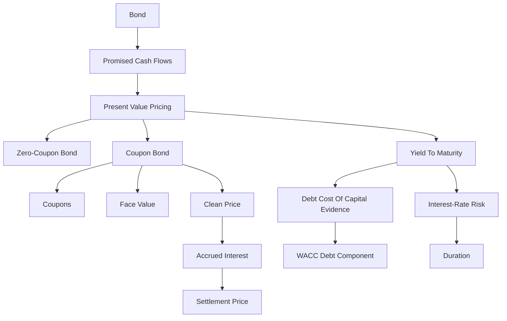

# Ubiquitous Language: Exercise 06-07 Bonds I

Source note: `exercise-06-bonds-i.md`
Course: Finance and Investment Management
Definition sources: local topic note, original Exercise 6 material, new Exercise 6 solutions, Exercise 7 material, Exercise 7 solutions, the Excel return-resource file, and standard bond-valuation usage.

This file is a standalone terminology and formula companion for bond valuation, coupon bonds, accrued interest, yield to maturity, and interest-rate sensitivity.

## Finance Language

| Term | Definition | Aliases to avoid |
|---|---|---|
| **Cash Flow** | A dated inflow or outflow of money used for valuation and investment decisions. | profit, accounting earnings |
| **Present Value** | The value today of a future cash flow discounted at an appropriate rate. | current price always |
| **Future Value** | The amount a current cash flow grows to after earning interest over time. | forecast value |
| **Discount Rate** | The rate used to convert future cash flows into present value, reflecting time value and risk. | interest rate always |
| **Compounding** | Interest earning interest over multiple periods. | simple interest |
| **Net Present Value** | The sum of discounted cash inflows and outflows; positive NPV means value creation under the chosen discount rate. | profit, payoff |
| **Internal Rate of Return** | The discount rate that sets NPV equal to zero for a cash-flow stream. | project return always |
| **Cost Of Capital** | Required return for a same-risk investment; in project valuation it is the hurdle rate used to discount operating FCF. | upfront investment |

## Exam Setup Language

| Term | Definition | Aliases to avoid |
|---|---|---|
| **Timeline** | A dated layout of cash flows and rates that prevents mixing values from different points in time. | list of numbers |
| **Nominal Rate** | A quoted annual rate before adjusting for compounding frequency. | effective rate |
| **Effective Rate** | The actual rate earned or paid over a period after compounding is considered. | nominal rate |

## Bond Language

| Term | Definition | Aliases to avoid |
|---|---|---|
| **Bond** | A debt security promising specified cash flows from issuer to investor. | stock |
| **Face Value** | The principal amount repaid at maturity. | market price |
| **PV Of Face Value** | Today's discounted value of the future face-value repayment: `Face value / (1+r)^N`. | maturity repayment |
| **Coupon** | The periodic interest payment promised by a coupon bond. | yield |
| **Coupon Rate** | Coupon as a percentage of face value. Convert it into a cash coupon before valuation. | yield to maturity |
| **Coupon Annuity** | The repeated coupon cash flows of a coupon bond, valued separately from the final face-value repayment. | face value |
| **Final-Year Cash Flow** | For a coupon bond, the last cash flow equals final coupon plus face value. | coupon only |
| **Yield To Maturity** | The discount rate that equates a bond price to the present value of promised cash flows through maturity. | coupon rate |
| **Bond Yield Evidence** | YTM or comparable bond yield used as market evidence for the debt cost of capital `r_D`. | whole project return |
| **Debt Cost Of Capital** | Required return debt investors demand for the firm's debt risk; can be estimated from comparable bond yields. | coupon rate automatically |
| **WACC Debt Component** | The after-tax debt-cost part of WACC: `r_D x D/(E+D) x (1 - tau_c)`. | redemption payment |
| **Zero-Coupon Bond** | A bond with no coupon payments, sold at a discount and repaid at face value. | coupon bond |
| **Coupon Bond** | A bond with periodic coupon payments and principal repayment at maturity. | zero-coupon bond |
| **Clean Price** | Quoted market price excluding accrued interest. | settlement price |
| **Accrued Interest** | Pro-rata coupon compensation paid by the buyer to the seller when a bond is sold between coupon dates. | coupon rate |
| **Settlement Price** | Simplified buying price equal to clean market price plus accrued interest. | market price only |
| **Par Bond** | Bond trading at face value, usually when coupon rate equals market yield. | premium bond |
| **Discount Bond** | Bond trading below face value, usually when coupon rate is below market yield. | cheap bond always |
| **Premium Bond** | Bond trading above face value, usually when coupon rate is above market yield. | overpriced bond always |
| **Duration** | Weighted average timing of bond cash flows and a rate-sensitivity measure. | maturity |
| **Modified Duration** | Duration adjusted to approximate percentage price change for a yield change. | coupon |
| **Basis Point** | One hundredth of one percentage point; `50` basis points means `0.50%`. | 50 percent |
| **Holding-Period Return** | Annualized return earned over the investor's actual holding window, based on initial price, coupons received or reinvested, and sale price or final repayment. | coupon rate, YTM automatically |
| **Terminal Wealth** | Cash value at the end of the holding period, including sale proceeds or redemption plus accumulated coupon payments where the exercise asks for reinvestment. | profit, price today |
| **Reinvestment Assumption** | Rule for growing coupon payments to the evaluation date before calculating terminal wealth or YTM. | ignore coupons |
| **Source-Labeled Exercise Gap** | A missing or duplicated exercise label in the official source deck; preserve the source issue instead of inventing a question. | solved hidden exercise |
| **Return Series** | Ordered returns over repeated periods, such as the monthly Daimler returns in the Excel video resource; always state the period unit before calculating or interpreting statistics. | price series automatically |

## Core Bond Formulas

| Formula | Meaning | Exam use |
|---|---|---|
| `B_0^ZB = B_N / (1+r)^N` | Zero-coupon bond price | Use when only face value is paid at maturity. |
| `B_0 = sum C/(1+r)^k + B_N/(1+r)^N` | Coupon-bond price | Discount every coupon and the final redemption value. |
| `B_0 = C x [1 - 1/(1+r)^N] / r + B_N/(1+r)^N` | Coupon-bond annuity form | Use for constant coupons and flat yield. |
| `Final-year CF = C + B_N` | Final coupon-bond payment | Use at maturity when coupon and principal are both paid. |
| `I_0 = days/360 x C` | Simplified accrued interest | Use when the bond is sold between coupon dates. |
| `Settlement price = clean price + accrued interest` | Simplified cash paid by buyer | Distinguish quoted price from final payment. |
| `Delta B_0 / B_0 approx -D_mod x Delta r` | Modified-duration approximation | Estimate small yield-change price effect. |
| `r_HPR = (terminal wealth / initial price)^(1/holding years) - 1` | Holding-period annual return | Use when an investor sells before maturity or when coupons are accumulated to a sale date. |

## Worked Calculation Language

Every bond calculation should show:

```text
Bond type -> promised cash flows -> discount rate/yield -> PV of each piece -> price or sensitivity -> investor interpretation
```

Mini anchors:

```text
Zero-coupon bond: face = EUR 100, N = 20, r = 6.75%.
B_0 = 100 / 1.0675^20
1.0675^20 = 3.69282
B_0 = EUR 27.08
```

```text
Coupon bond: face = EUR 100, coupon = EUR 4, N = 3, r = 5%.
B_0 = 4/1.05 + 4/1.05^2 + 104/1.05^3
B_0 = 3.81 + 3.63 + 89.84
B_0 = EUR 97.28
```

Interpretation: bond price is not "coupon rate times face value"; it is the PV of all promised payments. Analogy: price the bond by pricing each future package on the delivery calendar, then adding the packages. Trap: forgetting the face value in the final-period cash flow.

Face-value anchor:

```text
Face value = 1,000
Coupon rate = 6%
Annual coupon = 60
Maturity repayment = 1,000
Final-year cash flow = 1,060
PV of face value = 1,000 / (1+r)^N
```

Interpretation: `1,000` is the contractual maturity repayment. `1,000 / (1+r)^N` is today's value of that repayment and belongs in the bond price calculation. Trap: calling the discounted PV amount the maturity repayment.

Holding-period anchor:

```text
Initial price = EUR 116.22
Sale price after 5 years = EUR 104.33
Future value of coupons at sale date = EUR 32.50
Terminal wealth = 104.33 + 32.50 = EUR 136.83
r_HPR = (136.83 / 116.22)^(1/5) - 1 = 3.32%
```

Interpretation: when a coupon bond is sold before maturity, the investor's return depends on both coupon accumulation and the sale price. Trap: using only the sale price and forgetting coupons, or using only coupon rate as the return.

## Relationships

- **Bond Price** equals the **Present Value** of promised bond cash flows.
- **Face Value** is paid at maturity; **PV Of Face Value** is today's discounted value of that future payment.
- **Coupon Rate** determines coupon cash flow, but **Yield To Maturity** is the discount rate solved from price and cash flows.
- **Coupon Annuity** is only the repeated coupon part; a **Coupon Bond** also includes the final **Face Value** repayment.
- **Yield To Maturity** can become **Bond Yield Evidence** for **Debt Cost Of Capital** when debt maturity, seniority, liquidity, and credit risk are comparable.
- **Debt Cost Of Capital** enters WACC after tax; it is not the whole project discount rate unless the project is pure debt-like cash flow and the task explicitly says so.
- **Clean Price** differs from **Settlement Price** when **Accrued Interest** is owed.
- **Discount Bond** and **Premium Bond** move toward **Face Value** as maturity approaches, assuming repayment at par.
- **Terminal Wealth** combines sale or redemption proceeds with accumulated coupons before **Holding-Period Return** is annualized.
- **Basis Point** converts into the market-required yield before bond cash flows are discounted.
- Higher market yield lowers **Bond Price**.
- Higher **Duration** means greater sensitivity to market-yield changes.
- A **Return Series** belongs to performance/statistical analysis; do not mix it with promised bond cash flows unless the exercise explicitly asks for realized return data.

## Visual Memory Aid



## Example Dialogue

> **Student:** "The coupon is 6%, so the bond yield is 6%, right?"
>
> **Professor:** "Not automatically. The **Coupon Rate** sets the coupon cash flow. **Yield To Maturity** is the discount rate that makes the promised cash flows equal the current price."
>
> **Student:** "If the bond is quoted at 102, is that exactly what the buyer pays?"
>
> **Professor:** "Only if there is no accrued-interest adjustment. Between coupon dates, distinguish **Clean Price** from **Settlement Price**."
>
> **Student:** "If I discount the EUR 1,000 face value and get EUR 244.35, is that what is repaid?"
>
> **Professor:** "No. EUR 244.35 is the **PV Of Face Value** today. The **Face Value** repaid at maturity is still EUR 1,000. If there is a coupon in the final year, the last cash flow is coupon plus face value."
>
> **Student:** "How does this connect to Cost of Capital?"
>
> **Professor:** "A comparable **Yield To Maturity** can estimate **Debt Cost Of Capital**. WACC then blends after-tax `r_D` with equity cost, and project NPV measures value added against that hurdle."

## Flagged Ambiguities

| Ambiguity | Canonical recommendation |
|---|---|
| "Interest rate" | Say market yield, coupon rate, discount rate, or YTM. |
| "Price" | Say clean market price, settlement price, or face value. |
| "Return" | Say coupon income, holding-period return, or YTM. |
| "Risk" | Say interest-rate risk, default risk, liquidity risk, or duration risk. |
| "Coupon" | Specify coupon rate or coupon cash amount. |
| "Face value" | Say contractual maturity repayment; if discounted, call it **PV Of Face Value**. |
| "Debt cost" | Say market-required `r_D` from YTM/comparable debt yield, not coupon rate automatically. |
| "Value added" | For a bond investor, use intrinsic value minus market price; for a project, use PV of operating FCF minus investment. |
| "Return data" | Say return series and period unit, such as monthly returns, before computing any statistic. |
| "A.6 in Exercise 7" | The available official decks contain accrued-interest concept slides between A.5 and A.7 but no separate numeric A.6; preserve this as a source gap. |

## Exam Trap Corrections

| Trap | Correction |
|---|---|
| Naming a term without applying it. | Define it briefly, then apply it to the facts, formula, or decision. |
| Using coupon rate as the discount rate automatically. | Use the market-required yield unless the problem states equality. |
| Treating bond YTM as the whole project cost of capital. | YTM can estimate debt cost `r_D`; WACC blends debt and equity costs for project FCF. |
| Forgetting face value in coupon-bond pricing. | Coupon bond price = PV coupons + PV redemption value. |
| Calling PV of face value the maturity repayment. | The maturity repayment is face value; the PV is today's discounted value used in price calculation. |
| Treating coupon annuity as the whole bond. | Add PV of face value to PV of coupon annuity. |
| Confusing clean and settlement price. | Add accrued interest when the bond is sold between coupon dates. |
| Thinking all below-par bonds are bad. | Discount can simply mean coupon rate is below current market yield. |
| Treating maturity as duration. | Maturity is final repayment date; duration is weighted timing/sensitivity. |
| Treating 50 basis points as 50%. | Convert `50 bps` to `0.50%`, then add it to the base yield. |
| Calculating sell-before-maturity return from sale price alone. | Add accumulated coupons to sale price first, then annualize terminal wealth against the initial price. |

## Cheat-Sheet Language

```text
Draw the timeline, identify cash flows, choose the rate convention, compute at one date, then interpret the decision rule.
For coupon bonds: price = PV coupons + PV face value.
Face value is repaid at maturity; PV of face value is today's discounted value.
Final-year coupon-bond CF = coupon + face value.
For market quotes: clean price + accrued interest = settlement price.
For yield changes: market yield up means bond price down.
For holding-period return: terminal wealth = sale price or redemption + accumulated coupons.
For Cost of Capital: comparable bond yield can estimate r_D; WACC then tests project value added through NPV.
For Excel return resources: first identify the return period, then compute the requested statistic; do not treat historical monthly returns as promised coupon cash flows.
```
