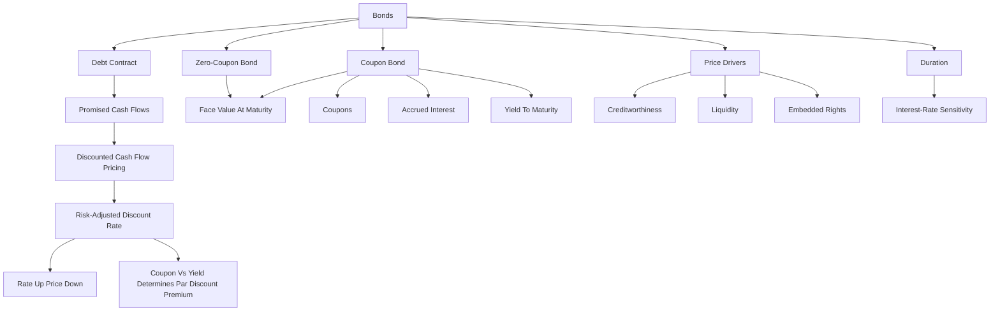

# Exercise 06-07: Bonds I

Source files:

- `finance-and-investment-management/raw/Exercise_6_Bonds_I_Without_Solutions.pdf`
- `finance-and-investment-management/raw/moodle-export-investment-and-financial-management-950881761-s26-20260604/Investment and  950881761 (S26)_2026064_1514/CW 21  19.05. _ 20.05./Exercise 6 - Solutions.pdf`
- `finance-and-investment-management/raw/moodle-export-investment-and-financial-management-950881761-s26-20260604/Investment and  950881761 (S26)_2026064_1514/CW 23  02.06. _ 03.06./Exercise 7.pdf`
- `finance-and-investment-management/raw/Formulary.pdf`

Lecture folder: `finance-and-investment-management/`  
Date processed: 2026-05-16; refreshed with solution and Exercise 7 material on 2026-06-06

## High-Yield 80/20 Summary

Bond valuation applies discounted cash flow logic to financial securities. A bond price is the present value of promised coupon payments and principal repayment, discounted at a risk-adjusted rate. The most important exam intuition is the inverse relationship between interest rates and bond prices.

Core logic:

1. Identify the bond type: zero-coupon or coupon bond.
2. Identify promised cash flows and timing.
3. Discount at the appropriate risk-adjusted rate or term structure.
4. Interpret price changes when market interest rates change.
5. Know that creditworthiness, coupon, rights, liquidity, and interest rates affect bond prices.
6. For coupon bonds, separate market price, accrued interest, and final settlement price.
7. Understand that discount bonds move upward toward face value over time, while premium bonds move downward toward face value.

## Bond Definition

A bond is a long-term contract where the issuer borrows money and commits to repay debt at a specified date and, if applicable, pay coupons at predetermined dates.

Bond cash flows are often easier to predict than stock cash flows, except for:

- Variable coupons.
- Insolvency / default risk.
- Embedded rights such as convertibility or issuer options.

## Bond Price Drivers

The slides highlight these drivers:

- Creditworthiness.
- Interest rate / discount rate.
- Coupon.
- Rights attached to the bond.
- Liquidity.

Real-life interpretation: a German government bond and a risky corporate bond with the same face value and maturity should not have the same discount rate because their credit risks differ.

## Bond Types

| Bond Type | Meaning |
|---|---|
| Coupon bond | Fixed coupon payments plus principal at maturity |
| Zero-coupon bond | No coupons; repayment at maturity only |
| Floater | Coupon adjusts to market interest rates |
| Perpetual / consol bond | No maturity date |
| Convertible bond | Can be exchanged for shares under defined conditions |
| Warrant / option bond | Includes option rights traded separately |
| Reverse convertible | Issuer may repay with shares instead of cash |

## Core Variables

```text
B_0 = present bond price
B_0^ZB = present zero-bond price
B_N = face value / redemption value at maturity
C = coupon
C_k = coupon payment at time k
r = risk-adjusted discount rate
N = maturity in periods
D = duration
D_mod = modified duration
q = 1 + r
```

## General Pricing Principle

```text
PV = sum of all CF_n / (1+r)^n
```

Equivalent principle: the present value of a group of cash flows equals the sum of the present values of each individual cash flow.

## Zero-Coupon Bond

A zero-coupon bond pays only the face value at maturity.

```text
B_0^ZB = B_N / (1+r)^N = B_N x q^(-N)
```

Example from slides:

A zero bond with face value 100, maturity 20 years, and annual rate 6.75%:

```text
B_0 = 100 / 1.0675^20 = 27.08
```

Interpretation: the investor pays far below face value because all return comes from price appreciation to face value at maturity.

## Coupon Bond

A coupon bond pays coupons and face value.

```text
B_0 = sum from k=1 to N of C/(1+r)^k + B_N/(1+r)^N

Equivalent annuity form:
B_0 = C x [1 - 1/(1+r)^N] / r + B_N/(1+r)^N
```

Equivalent interpretation:

```text
Bond price = PV(coupon annuity) + PV(face value)
```

Exam trap: if coupon is given as a percentage of face value, convert it into the coupon cash flow before using the formula.

### Par, Discount, And Premium

The refreshed Exercise 7 slides categorize coupon-bond prices relative to face value:

| Price relation | Meaning | Typical condition |
|---|---|---|
| `B_0 = 100` | Bond trades at par | Coupon rate equals market yield |
| `B_0 < 100` | Bond trades below par / at discount | Coupon rate below market yield |
| `B_0 > 100` | Bond trades above par / at premium | Coupon rate above market yield |

For a 10% coupon bond with face value 100 and market interest rate 10%, the price is 100 because the coupon rate equals the market-required return.

## Accrued Interest And Settlement Price

If bond ownership changes between coupon dates, the buyer compensates the seller for the interest earned since the last coupon date.

The lecture separates:

| Term | Meaning |
|---|---|
| Market price / ex-coupon price | Quoted fair price of the bond excluding accrued interest |
| Accrued interest | Pro-rata coupon compensation between the last coupon date and sale date |
| Settlement / dirty price | Market price plus accrued interest, and in real markets possibly fees |

The simplified accrued-interest formula in the slides is:

```text
I_0 = (t_1 - t_0) x (1/360) x C
```

where `t_1 - t_0` is the number of days between the last coupon payment date and the selling date, and `C` is the annual coupon amount.

Exam trap: the exchange quote is usually the clean market price. The cash paid by the buyer can be higher because accrued interest is added.

## Price Path Toward Maturity

The Exercise 7 deck emphasizes how bond prices move as maturity approaches:

- At maturity, the price equals nominal/face value, assuming repayment at par.
- A discount bond tends to increase toward face value as maturity approaches.
- A premium bond tends to decrease toward face value as maturity approaches.

This is separate from market-yield shocks. Even if market rates do not change, time-to-maturity changes the present-value calculation.

## Yield To Maturity

Yield to maturity is the annual return earned if the bond is held to maturity and the assumptions of the calculation hold.

```text
Bond price = PV(promised coupons and redemption discounted at YTM)
```

The Exercise 7 slides add the reinvestment assumption: coupon cash flows are assumed to be reinvested at the market rate used in the YTM logic.

Exam trap: YTM is not the same as coupon rate. YTM is solved from price and cash flows.

## Interest Rate And Price Relationship

Bond prices move inversely with market yields:

- If discount rates rise, existing fixed cash flows are discounted more heavily, so bond price falls.
- If discount rates fall, existing fixed cash flows become more valuable, so bond price rises.

Zero-coupon bonds are especially sensitive because all cash flow occurs at maturity.

For coupon bonds:

- If the market yield falls below the coupon rate, the bond trades above par.
- If the market yield rises above the coupon rate, the bond trades below par.
- Investors who sell before maturity face interest-rate risk because the sale price depends on the market yield at the sale date.
- If an investor holds a fixed promised-payment bond to maturity and all payments occur as promised, interim market price changes matter less for cash-flow receipt, but reinvestment assumptions can still matter for realized return.

## Sloping Yield Curves And Term Structure

If rates differ by maturity, discount each cash flow with the rate corresponding to its time.

The formulary includes:

```text
(1 + I_t,T)^(T-t) = (1 + I_t,S)^(S-t) x (1 + r_S,T)^(T-S)
```

Meaning: long-term spot rates can be decomposed into earlier spot rates and forward rates.

Exam implication: if a question gives a term structure, do not use one flat discount rate unless explicitly allowed.

## Duration

Duration measures the weighted average timing of bond cash flows and approximates interest-rate sensitivity.

From the formulary:

```text
D = (1/B_0) x [sum from k=1 to N of k x C_k/(1+r)^k + N x B_N/(1+r)^N]
D_mod = D / (1+r)
Approximate price change: Delta B_0 / B_0 ≈ -D_mod x Delta r
```

Interpretation:

- Higher duration means higher interest-rate sensitivity.
- Longer maturity usually increases duration.
- Lower coupons usually increase duration because more value is paid later.

## Exam Decision Tree

1. Does the bond pay coupons?
   - No: zero-coupon formula.
   - Yes: coupon bond = PV coupons + PV face value.
2. Is coupon annual, semiannual, or another frequency?
   - Match periods, coupon, and rate frequency.
3. Is the rate flat or term-structure based?
   - Flat rate: one `r`.
   - Yield curve: discount each cash flow with its maturity-specific rate.
4. Is the question about price change from rate movement?
   - Use inverse relation or duration approximation.
5. Is credit risk mentioned?
   - Higher risk requires higher discount rate, lowering price.
6. Is the bond sold between coupon dates?
   - Add accrued interest to the quoted market price to obtain the simplified settlement price.
7. Is the question asking for YTM?
   - Solve the discount rate that equates price to promised cash flows; do not use coupon rate automatically.

## Common Mistakes

- Forgetting to include face value for coupon bonds.
- Using coupon rate as discount rate automatically.
- Failing to convert coupon percentage into euro coupon.
- Mixing annual and intra-year periods.
- Assuming bond price is always face value.
- Thinking rate increases raise bond prices.
- Ignoring credit risk and liquidity effects.
- Forgetting accrued interest when a bond is sold between coupon dates.
- Confusing clean market price with settlement price.
- Confusing coupon rate with YTM.
- Forgetting that discount and premium bonds converge toward face value as maturity approaches.

## Practice Questions

1. A zero bond pays EUR 100 in 10 years. Discount rate is 5%. What is price?
   - Answer: `100 / 1.05^10`.
2. A coupon bond has face value 100, annual coupon 4, maturity 3 years, discount rate 5%. What is price setup?
   - Answer: `4/1.05 + 4/1.05^2 + 104/1.05^3`.
3. What happens to a fixed-rate bond price when market rates fall?
   - Answer: price rises.
4. Why does a zero-coupon bond tend to have high duration?
   - Answer: all cash flow occurs at maturity.
5. What does modified duration approximate?
   - Answer: percentage price change for a small yield change.
6. A 6% coupon bond is priced with a market yield of 4%. Is it below or above par?
   - Answer: above par.
7. What is accrued interest?
   - Answer: pro-rata coupon compensation paid by the buyer to the seller between coupon dates.
8. Why can the settlement price differ from the quoted market price?
   - Answer: accrued interest is added to the clean market price.

## Mermaid Knowledge Map



## Subject Knowledge Graph

| Node | Meaning |
|---|---|
| Bond | Debt security with promised payments |
| Zero-coupon bond | Bond with only maturity payment |
| Coupon bond | Bond with coupons plus redemption value |
| Face value | Amount repaid at maturity |
| Coupon | Periodic interest payment |
| Discount rate | Risk-adjusted required return |
| Clean price | Quoted bond market price excluding accrued interest |
| Accrued interest | Pro-rata coupon earned since last coupon date |
| Settlement price | Clean price plus accrued interest in the simplified exercise setting |
| Yield to maturity | IRR that equates price to promised cash flows through maturity |
| Duration | Weighted average timing of cash flows |
| Modified duration | Price sensitivity approximation |

| From | Relationship | To |
|---|---|---|
| Bond price | equals | present value of promised cash flows |
| Zero-coupon bond | pays | face value only |
| Coupon bond | pays | coupons plus face value |
| Higher discount rate | decreases | bond price |
| Coupon rate below market yield | implies | discount bond |
| Coupon rate above market yield | implies | premium bond |
| Accrued interest | added to | clean market price |
| Yield to maturity | solves | bond price equation |
| Lower creditworthiness | increases | discount rate |
| Duration | measures | timing and rate sensitivity |
| Modified duration | approximates | percentage price change |
| Term structure | determines | maturity-specific discounting |

## Links

- Previous exercise: `finance-and-investment-management/wiki/exercise-05-redemptions/exercise-05-redemptions.md`
- Related concept: `finance-and-investment-management/wiki/exercise-01-02-interest-calculation/exercise-01-02-interest-calculation.md`
